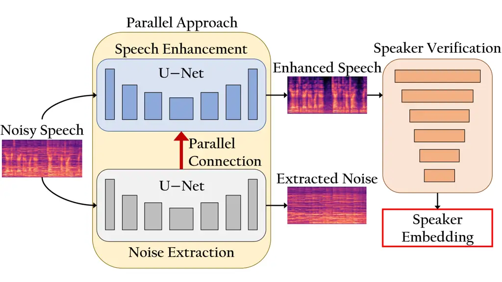
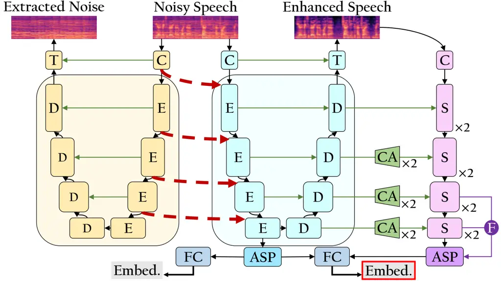

Kim Jang Kim KAISTRepublic of Korea

# ParaNoise-SV: Integrated Approach for Noise-Robust Speaker Verification with Parallel Joint Learning of Speech Enhancement and Noise Extraction

Minu    Kangwook    Hoirin Affiliation: School of Electrical Engineering

###### Abstract

Noise-robust speaker verification leverages joint learning of speech
enhancement (SE) and speaker verification (SV) to improve robustness.
However, prevailing approaches rely on implicit noise suppression, which
struggles to separate noise from speaker characteristics as they do not
explicitly distinguish noise from speech during training. Although
integrating SE and SV helps, it remains limited in handling noise
effectively. Meanwhile, recent SE studies suggest that explicitly
modeling noise, rather than merely suppressing it, enhances noise
resilience. Reflecting this, we propose ParaNoise-SV, with dual U-Nets
combining a noise extraction (NE) network and a speech enhancement (SE)
network. The NE U-Net explicitly models noise, while the SE U-Net
refines speech with guidance from NE through parallel connections,
preserving speaker-relevant features. Experimental results show that
ParaNoise-SV achieves a relatively 8.4% lower equal error rate (EER)
than previous joint SE-SV models.

###### keywords

speaker verification, speech enhancement, joint learning, noisy
environments, noise disentanglement

^(†)^(†)email: minus@kaist.ac.kr, dnrrkdwkd12@kaist.ac.kr,
hoirkim@kaist.ac.kr

## 1 Introduction

Rapid advancement of modern communication devices and voice-based
technologies has highlighted the growing importance of speaker
verification (SV) systems. These systems, whi-ch verify whether a given
speech matches a target speaker, are critical for applications such as
secure authentication and forensic analysis \[1\]. However, real-world
environments are rarely free of noise, posing a major challenge for
speaker verification systems \[2\]. Conventional solutions integrate
separately trained speech enhancement (SE) modules to mitigate
noise \[3, 4\], however, they can degrade speaker-specific information,
leading to suboptimal embeddings and reduced verification accuracy
\[5\]. Furthermore, independently trained SE and SV modules lack
coherence with each other, as SE outputs may not align well with the
learned feature distributions of the SV system \[6\].

To address these challenges, several studies have explored joint
learning strategies for SE and SV. A previous study \[7\] integrates SE
with an attention-based model, while another approach \[6\] introduces a
multi-objective network for simultaneous feature enhancement and speaker
embedding extraction. A U-Net-based approach \[8\] jointly optimizes SE
and SV, and diffusion models \[9\] disentangle speaker and noise
representations for improved robustness. Likewise, a
noise-disentanglement adversarial framework \[10\] separates
speaker-relevant and irrelevant information for robust embeddings in
noise. Furthermore, a recent study \[11\] incorporates noise type and
signal-to-noise ratio (SNR) level into SE, demonstrating the benefits of
noise estimation. Meanwhile, self-supervised learning (SSL)-based
verification \[12\] offers an alternative approach to improving noise
robustness by fine-tuning large-scale pre-trained models. Despite its
effective performance, its larger parameter size increases latency and
computational demands.

Beyond its role in joint learning with SV, SE has also been extensively
studied as a standalone approach to improve speech robustness. Rather
than relying solely on predefined noise attributes (e.g., amplitude and
SNR) to guide enhancement \[13, 14\], recent SE methods focus on
dynamically synthesizing noise representations within the SE network
itself. For instance, a neural noise embedding approach \[15\] generates
noise representations and applies conditional encoding with layer
normalization, improving speech quality in end-to-end systems.
Similarly, dual-stream SE models \[16, 17\] process noise and speech
separately, resulting in better enhancement.



Figure 1: Overview of ParaNoise-SV architecture. Noise extraction (NE)
network and speech enhancement (SE) network are trained in parallel and
connected via parallel connections. The enhanced speech is then
processed by speaker verification (SV) module for robust speaker
embedding extraction.

Building on these approaches, we propose ParaNoise-SV, a unified
framework for noise-robust speaker verification. Instead of merely
predicting coarse noise attributes, our model dynamically extracts and
synthesizes background noise from speech to effectively remove
speaker-irrelevant components. To achieve this, we design a noise
extraction (NE) network and a speech enhancement (SE) network, both
based on U-Net \[18\], and train them simultaneously. These two networks
are interconnected through parallel connections, allowing noise-related
information to refine speech while preserving speaker-relevant features,
as in Figure 1. By jointly learning NE, SE, and speaker verification
(SV), our system improves robustness against noise while maintaining
high speaker discrimination. ParaNoise-SV achieves relatively 8.4% lower
EER than previous joint SE-SV models in seen noise conditions and
reduces EER by 8.2% in unseen noise conditions.

## 2 Methods

### 2.1 Overview of ParaNoise-SV

ParaNoise-SV is a unified framework for noise-robust speaker
verification, integrating NE, SE, and SV using dual encoder-decoder
structures. It employs dual U-Nets with SE-ResNet \[19\] for
simultaneous NE and SE, introducing parallel connections to ensure
balanced separation while preserving speaker-relevant information. The
NE network isolates noise, which the SE network leverages through
parallel connections at each encoding stage, enabling dynamic noise
suppression while maintaining speaker discriminability. Unlike
conventional methods focusing solely on suppression or enhancement,
ParaNoise-SV actively utilizes extracted noise at the feature level,
preventing contamination in deeper representations. For speaker
embedding extraction, ERes2NetV2 \[20\] is used, with channel adaptation
blocks integrating the U-Net features via skip connections. The key
frameworks are shown in Figures 2 and 3.

### 2.2 Parallel Connections of Dual U-Nets

The input spectrogram is first normalized using instance normalization
\[21\] and processed through an initial convolutional layer, generating
noise and speech feature maps $`N_{E,0}`$ and $`S_{E,0}`$. Each encoder
then extracts hierarchical representations using SE-ResNets \[19\] with
depth $`L=4`$.

```math
\displaystyle N_{E,i} \displaystyle=e_{N}^{i}(N_{E,i-1}),\quad i=1,\dots,L. \tag{1}
```

```math
\displaystyle N_{D,0} \displaystyle=N_{E,L}. \tag{2}
```

```math
\displaystyle N_{D,i} \displaystyle=d_{N}^{i}(N_{D,i-1},N_{E,L-i}),\quad i=1,\dots,L. \tag{3}
```

```math
\displaystyle\hat{N} \displaystyle=\text{ConvTranspose}(N_{D,L},N_{E,0}). \tag{4}
```

The NE network encodes noise representations through encoder blocks
$`e_{N}`$ in Equation (1), refining noise features. The deepest encoded
feature in Equation (2) initializes the decoding operations $`d_{N}`$,
where skip connections aid noise extraction as in Equation (3). Finally,
a transposed convolutional layer generates the estimated noise
spectrogram $`\hat{N}`$ in Equation (4).

```math
\displaystyle S_{E,i} \displaystyle=e_{S}^{i}(S_{E,i-1},N_{E,i-1}),\quad i=1,\dots,L \tag{5}
```

```math
\displaystyle S_{D,0} \displaystyle=S_{E,L} \tag{6}
```

```math
\displaystyle S_{D,i} \displaystyle=d_{S}^{i}(S_{D,i-1},S_{E,L-i}),\quad i=1,\dots,L \tag{7}
```

```math
\displaystyle\hat{S} \displaystyle=\text{ConvTranspose}(S_{D,L},S_{E,0}) \tag{8}
```



Figure 2: Dual U-Nets for SE and NE networks are trained in parallel
with parallel connections (dashed red line) for noise suppression. They
use E and D layers based on SE-ResNet. The SV network processes enhanced
speech using S layers from ERes2NetV2, with CA for channel alignment in
skip connections and F for multi-channel fusion. Speaker embeddings are
extracted in two stages via attentive statistics pooling (ASP). (C:
convolution, T: transposed convolution, E: encoding, D: decoding, S:
speaker extraction, F: bottom-up fusion, CA: channel adaptation)

Figure 3: (a) SE-ResNet applies squeeze-and-excitation mechanisms to
enhance important feature channels by adaptively reweighting them. (b)
ERes2NetV2 incorporates channel-split hierarchical residual connections
with expanded channel dimensions, improving multi-scale feature
extraction.

In Equation (5), the SE network incorporates parallel connections:
information flows between two parallel networks, integrating noise
features at each encoder block $`e_{S}`$. The encoded speech feature is
decoded with skip connections as in Equation (7), and a final transposed
convolutional layer outputs the enhanced speech spectrogram $`\hat{S}`$
in Equation (8). This allows the SE network to utilize noise information
from the NE network, improving noise suppression while preserving
speaker details.

### 2.3 Speaker Embedding Extraction

In noisy speech, spectral components can become missing or corrupted,
making speaker verification challenging. Capturing information at
multiple scales helps preserve speaker characteristics even when
specific frequency bands are degraded. To address this, we utilize
ERes2NetV2 \[20\], originally designed for short-duration speaker
verification, where extracting features from limited speech is critical.
It tackles the challenge of incomplete temporal or spectral information
by employing multi-scale feature fusion and channel expansion,
effectively capturing speaker-relevant details across varying time and
frequency resolutions. Leveraging these strengths, ERes2NetV2 enhances
speaker verification in noisy environments by recovering speaker
characteristics from degraded spectral components.

To fully exploit the speech refinement capability of SE network, we
integrate its decoder features into ERes2NetV2 via skip connections,
allowing ERes2NetV2 to adjust channel importance to enhance
speaker-relevant information. However, ERes2NetV2 expands channels by 2,
as in Figure 2, causing a dimension mismatch that hinders direct
integration. To resolve this, channel adaptation, consisting of multiple
convolution layers, is applied to SE decoder outputs.

Speaker embedding extraction follows a two-stage process to minimize
information loss caused by noise suppression. First, the deepest encoder
feature of SE network undergoes ASP \[22\], becoming the initial pooled
vector, which then passes through a fully connected (FC) layer to
generate an initial embedding. After further processing through the SV
network, ASP is applied again, and the refined features are concatenated
with the initial pooled vector before passing through a final FC layer.
This final embedding utilizes the output of the SE encoder, refined
through parallel connections, with the output from ERes2NetV2, achieved
through multi-scale aggregation. This integration enhances noise
robustness and preserves detailed and global speaker characteristics,
providing comprehensive representation and improved discrimination
performance. The final embedding (red-edged box in Figure 2) is
ultimately used as the identity representation for speaker verification.

### 2.4 Loss Functions

```math
L=L_{n}+L_{s}+L_{C}+L_{\text{AP}}+L_{\text{AAM}} \tag{9}
```

The loss function in Equation (9) optimizes NE, SE, and SV in an
integrated framework. The noise extraction loss $`L_{n}`$ is formulated
as mean squared error (MSE) loss between $`\hat{N}`$ and the original
noise spectrogram. This promotes precise noise extraction and minimizes
residual noise interference in speaker embeddings, reducing leakage into
enhanced speech. The speech enhancement loss $`L_{s}`$ also applies MSE
loss between $`\hat{S}`$ and the clean speech spectrogram, preserving
speech intelligibility.

For speaker embedding extraction, cross-entropy loss ($`L_{\text{C}}`$)
is applied between the initial embedding and its speaker label. The
final embedding is optimized using angular prototypical (AP) loss
($`L_{\text{AP}}`$) \[23\] and additive angular margin (AAM) loss
($`L_{\text{AAM}}`$) \[24\]. To enhance noise robustness, each batch
contains both clean and noisy speech from randomly selected speakers, as
proposed in \[8\]. $`L_{\text{AP}}`$ aligns final clean and noisy
embeddings of the same speaker, while $`L_{\text{AAM}}`$ separates final
speaker embeddings from their speaker-wise prototypes.

[TABLE]

Table 1: Architectures of the SE and SV networks. The SE network
consists of an encoder (E) and a decoder (D), with each layer (L) in the
encoder applying concatenation before SE-ResNet units for parallel
connections, while the decoder follows a residual structure. The NE
network shares the SE structure but omits parallel connections,
excluding concatenation and convolution in the encoder. The SV network
uses Res2Net and ERes2NetV2 blocks for multi-scale feature extraction,
doubling output channels via expansion parameters. TConv2d denotes
transposed convolution layers, with output channel dimensions (Ch.)
shown at the bottom of each block.

## 3 Experimental Setup

|               |                           |         |        |       |       |       |      |       |       |      |      |      |       |       |      |      |      |       |
| ------------- | ------------------------- | ------- | ------ | ----- | ----- | ----- | ---- | ----- | ----- | ---- | ---- | ---- | ----- | ----- | ---- | ---- | ---- | ----- |
| Method        | Models                    | EER (%) |        |       |       |       |      |       |       |      |      |      |       |       |      |      |      |       |
|               |                           | Clean   | Babble |       |       |       |      | Music |       |      |      |      | Noise |       |      |      |      | Avg.  |
|               |                           |         | 0      | 5     | 10    | 15    | 20   | 0     | 5     | 10   | 15   | 20   | 0     | 5     | 10   | 15   | 20   |       |
| Joint SE + SV | VoiceID \[25\]            | 6.79    | 37.96  | 27.12 | 16.66 | 11.25 | 8.99 | 16.24 | 11.44 | 9.13 | 8.10 | 7.48 | 16.56 | 12.26 | 9.86 | 8.69 | 7.83 | 13.52 |
|               | Shi et al. \[7\]          | 6.18    | 37.55  | 26.42 | 16.30 | 10.89 | 8.39 | 15.58 | 10.93 | 8.87 | 7.62 | 7.13 | 15.95 | 11.76 | 9.17 | 8.08 | 7.07 | 12.99 |
|               | Wu et al. \[6\]           | 7.60    | 20.11  | 12.02 | 9.63  | 8.48  | 7.99 | 12.92 | 10.10 | 8.95 | 8.35 | 7.95 | 13.12 | 10.57 | 9.28 | 8.59 | 8.10 | 10.24 |
|               | NDML \[26\]               | 2.90    | 10.96  | 6.13  | 4.28  | 3.52  | 3.21 | 10.84 | 6.52  | 4.66 | 3.67 | 3.21 | 10.24 | 6.96  | 5.02 | 3.91 | 3.40 | 5.59  |
|               | ExU-Net \[8\]             | 2.76    | 9.57   | 5.52  | 4.06  | 3.28  | 2.99 | 7.35  | 4.90  | 3.69 | 3.14 | 2.93 | 6.80  | 5.23  | 4.07 | 3.39 | 3.10 | 4.55  |
|               | Diff-SV \[9\]             | 2.35    | 8.74   | 4.51  | 3.33  | 2.82  | 2.61 | 6.04  | 3.96  | 3.10 | 2.75 | 2.60 | 6.01  | 4.52  | 3.49 | 2.93 | 2.64 | 3.90  |
|               | NDAL \[10\]               | 2.63    | 6.14   | 4.00  | 3.23  | 2.97  | 2.80 | 6.43  | 4.44  | 3.59 | 3.08 | 2.87 | 5.87  | 4.19  | 3.53 | 3.23 | 3.09 | 3.88  |
|               | NA-ExU-Net \[11\]         | 1.99    | 9.88   | 4.57  | 3.10  | 2.43  | 2.09 | 6.24  | 3.95  | 2.80 | 2.39 | 2.17 | 5.85  | 3.90  | 3.05 | 2.54 | 2.37 | 3.71  |
| Ours          | Baseline (w/o NE)         | 2.23    | 10.03  | 4.85  | 3.01  | 2.72  | 2.35 | 7.01  | 3.98  | 2.94 | 2.64 | 2.32 | 6.01  | 4.05  | 3.27 | 2.59 | 2.46 | 3.90  |
|               | ParaNoise-SV (dec.)       | 2.03    | 10.24  | 4.73  | 3.13  | 2.78  | 2.43 | 7.06  | 4.22  | 3.24 | 2.68 | 2.35 | 6.12  | 4.08  | 3.36 | 2.72 | 2.41 | 3.97  |
|               | ParaNoise-SV (enc., dec.) | 1.87    | 9.46   | 4.40  | 2.75  | 2.21  | 1.94 | 6.60  | 3.71  | 2.58 | 2.03 | 1.92 | 5.85  | 3.74  | 2.76 | 2.25 | 2.02 | 3.51  |
|               | ParaNoise-SV (enc.)       | 1.75    | 9.46   | 4.37  | 2.64  | 2.13  | 1.84 | 6.20  | 3.62  | 2.46 | 1.95 | 1.81 | 5.60  | 3.64  | 2.75 | 2.12 | 2.00 | 3.40  |

Table 2: Experimental results (EER %) on the VoxCeleb1 test set with
noise scenarios synthesized from the MUSAN corpus at various SNR levels.
For our model, we conduct a performance evaluation under four
conditions: without parallel connections, with the connections to the
decoder only, with the connections to both the encoder and decoder, and
with the connections to the encoder only.

|      |       |         |         |      |            |              |
| ---- | ----- | ------- | ------- | ---- | ---------- | ------------ |
| SNR  | NDML  | ExU-Net | Diff-SV | NDAL | NA-ExU-Net | ParaNoise-SV |
| 0    | 20.49 | 8.39    | 8.23    | 7.57 | 7.82       | 7.61         |
| 5    | 15.09 | 5.59    | 5.06    | 5.49 | 4.78       | 4.40         |
| 10   | 11.96 | 4.36    | 3.85    | 4.03 | 3.46       | 3.17         |
| 15   | 9.96  | 3.74    | 3.19    | 3.36 | 2.75       | 2.22         |
| 20   | 8.64  | 3.29    | 2.89    | 2.99 | 2.44       | 2.09         |
| Avg. | 13.23 | 5.01    | 4.64    | 4.69 | 4.25       | 3.90         |

Table 3: Experimental results (EER %) on the VoxCeleb1 test set with an
out-of-domain noise source (NonSpeech100).

|            |                                          |      |           |              |
| ---------- | ---------------------------------------- | ---- | --------- | ------------ |
| Noise Type | Counterpart (noise attribute estimation) |      |           | ParaNoise-SV |
|            | Class                                    | SNR  | Class+SNR |              |
| Seen       | 3.80                                     | 3.69 | 3.66      | 3.40         |
| Unseen     | 4.47                                     | 4.34 | 4.31      | 3.90         |

Table 4: Average EER (%) on the VoxCeleb1 test set. The seen condition
includes clean speech and noisy speech with MUSAN, while the unseen
condition uses noisy speech with NonSpeech100.

Model Structure Details. As shown in Table 1, the SE network employs
parallel connections, where noise features from the NE network are
concatenated at each encoder stage before downsampling. This is
reflected in the encoder layers (E1–E4), where concatenation occurs
before convolutional processing, enabling adaptive noise suppression
while preserving speaker-relevant features. In contrast, the NE network
omits these connections to maintain independent noise modeling. The
decoder (D1–D4) mirrors the encoder, incorporating residual connections
to reconstruct the enhanced speech effectively.

The SV network integrates Res2Net blocks (S1, S2) \[27\] for
fine-grained spectral and temporal feature extraction and ERes2NetV2
blocks (S3, S4) \[20\] for deeper multi-scale integration. To enhance
feature learning across scales, adaptive feature fusion (AFF) in
Figure 3(b) is applied only to the third and fourth layers. This ensures
that early layers (S1, S2) focus on capturing local speech details,
while deeper layers (S3, S4) integrate broader speaker identity
features.

To further stabilize speaker representations, the final embedding is
obtained through a bottom-up fusion \[20\] as in Figure 2, which follows
a process similar to AFF. In this process, the third-layer output is
first restructured before being combined with the fourth-layer output.
This combination allows intermediate temporal details and high-level
speaker identity features to be effectively integrated. The fusion
enhances noise resilience and leads to a more stable speaker
representation.

Training Details. The model is trained for 200 epochs with the Adam
optimizer with a weight decay of 1e-4 and AAM loss with a margin of 0.15
and a scale of 32. The learning rate peaks at 0.01 over 5 warm-up epochs
and decays via cosine annealing. Input features are 64-dimensional log
Mel-spectrograms (25 ms window, 10 ms hop), with SpecAugment \[28\]. The
final speaker embedding dimension is 192. Performance is measured using
equal error rate (EER) on clean and noisy datasets.

Datasets. ParaNoise-SV is evaluated on the VoxCeleb1 dataset \[29\],
with 148,642 utterances from 1,211 speakers for training and 4,874
utterances from 40 speakers for testing. Models are trained with noisy
speech by mixing MUSAN \[30\] noise at randomly chosen SNR between 0 and
20 dB, with speed perturbation applied to the raw waveforms. Testing is
conducted at $`\{0,5,10,15,20\}`$ dB. Additional robustness is assessed
using NonSpeech100 \[31\] noise dataset.

## 4 Results

### 4.1 Main Results

Table 2 presents the EER results for ParaNoise-SV under clean and noisy
conditions at different SNR levels. The results dem-onstrate that
ParaNoise-SV consistently achieves lower EERs across all noise
conditions, indicating strong noise robustness. In clean conditions, it
achieves an EER of 1.75%, confirming its effectiveness in preserving
speaker identity. When averaging across both clean and noisy speech,
ParaNoise-SV achieves an overall EER of 3.40%, outperforming previous
joint SE-SV approaches for noise-robust speaker verification. This
suggests that even under demanding noisy conditions, ParaNoise-SV
effectively balances noise disentanglement and speaker identity
preservation, addressing the limitations of conventional joint learning
frameworks that rely on implicit noise suppression.

Table 3 presents the VoxCeleb1 test results under an out-of-domain noise
scenario using NonSpeech100. Even in this challenging setting,
ParaNoise-SV achieves the lowest average EER of 3.90%, demonstrating
better generalization compared to existing joint learning models. This
further supports its effectiveness in explicit noise extraction,
ensuring robust performance across both seen and unseen noise
conditions.

### 4.2 Discussion

Effect of Parallel Connections. To analyze the impact of parallel
connections, we conduct an ablation study comparing different parallel
connection setups. The baseline model follows a conventional joint
learning setup with a single U-Net and no explicit noise extraction,
maintaining the overall structure of ParaNoise-SV but without the NE
network or parallel connections. We evaluate three variants: one with
decoder-to-decoder parallel connections only (ParaNoise-SV (dec.)),
another with both encoder-to-encoder and decoder-to-decoder connections
(ParaNoise-SV (enc., dec.)), and a third with encoder-to-encoder
connections only (ParaNoise-SV (enc.)). The results confirm that
encoder-level parallel connections significantly enhance noise
disentanglement, improving speaker verification robustness. ParaNoise-SV
(enc.) achieves the lowest average EER of 3.40%, demonstrating that
propagating noise information at the encoder stage is the most effective
strategy for preserving speaker-relevant features.

On the other hand, the results also reveal the impact of different
parallel connection strategies. Applying parallel connections only at
the decoder (ParaNoise-SV (dec.)) leads to performance degradation over
the baseline. This indicates that introducing noise-related information
at a later stage disrupts feature refinement by interfering with the
learned representations of the enhanced speech. Even when encoder-level
connections are present, adding decoder-level connections (ParaNoise-SV
(enc., dec.)) further degrades performance compared to encoder-only
connections. This reinforces that incorporating noise-related
information at later stages hinders disentanglement rather than
enhancing it.

Comparison with Noise Attribute Estimation. To better illustrate the
significance of noise synthesis in parallel noise extraction models, we
compare ParaNoise-SV with variants that estimate noise attributes
instead of synthesizing noise. These counterparts retain the same
architecture but replace the NE network’s decoder with a noise attribute
prediction layer, which infers noise class and SNR as \[11\]. As Table 4
shows, ParaNoise-SV outperforms the variants in both seen and unseen
environments, highlighting the benefits of explicit noise modeling.

Comparison with SSL. We next compare ParaNoise-SV with SSL-based speaker
verification models \[12\], which leverage large-scale pre-trained
models and noise-adaptive fine-tuning. As shown in Table 5, despite
having significantly fewer parameters, ParaNoise-SV outperforms HuBERT +
NAW-SV in both seen and unseen conditions. While HuBERT + NAW-SV has a
large parameter count, it struggles in noisy conditions, as pre-training
objectives of HuBERT \[32\] are less aligned with noise robustness. In
contrast, WavLM + NAW-SV benefits from the strengths of WavLM \[33\]
itself, including speech denoising pre-training and diverse
augmentations. As a result, the performance gap between HuBERT + NAW-SV
and WavLM + NAW-SV highlights the dependency of SSL-based models on
their respective foundation models. Nonetheless, ParaNoise-SV achieves
competitive performance with a model size over 13 times smaller,
demonstrating the model’s efficiency towards noise-robustness without
relying on large-scale pre-training.

|                        |               |      |        |
| ---------------------- | ------------- | ---- | ------ |
| Model                  | \# Parameters | Seen | Unseen |
| HuBERT + NAW-SV \[12\] | 102M+         | 4.09 | 4.35   |
| WavLM + NAW-SV \[12\]  | 102M+         | 2.96 | 3.29   |
| ParaNoise-SV           | 7.75M         | 3.40 | 3.90   |

Table 5: Model size and average EER (%) on the VoxCeleb1 test set,
comparing with SSL-based verification. The seen condition includes clean
speech and noisy speech with MUSAN, while the unseen condition uses
NonSpeech100.

## 5 Conclusion

ParaNoise-SV has been validated as an effective framework for
noise-robust speaker verification by jointly optimizing noise extraction
(NE), speech enhancement (SE), and speaker verification (SV). Its
parallel network architecture enables dynamic noise suppression while
preserving speaker-discriminative features. Experimental results across
various SNRs and noise conditions show consistently lower EER,
outperforming conventional SE-SV pipelines. The effectiveness of the
dual U-Net architecture highlights the advantages of joint learning in
improving speaker verification under real-world noisy conditions.

## 6 Acknowledgements

This work was conducted by Center for Applied Research in Artificial
Intelligence(CARAI) grant funded by DAPA and ADD (UD190031RD).

## References

- \[1\] N. Singh, R. Khan, and R. Shree, “Applications of speaker
  recognition,” _Procedia engineering_, vol. 38, pp. 3122–3126, 2012.
- \[2\] S. Song, S. Zhang, B. W. Schuller, L. Shen, and M. Valstar,
  “Noise invariant frame selection: a simple method to address the
  background noise problem for text-independent speaker verification,”
  in _2018 International Joint Conference on Neural Networks
  (IJCNN)_. IEEE, 2018, pp. 1–8.
- \[3\] O. Plchot, L. Burget, H. Aronowitz, and P. Matejka, “Audio
  enhancing with dnn autoencoder for speaker recognition,” in _2016 IEEE
  International Conference on Acoustics, Speech and Signal Processing
  (ICASSP)_. IEEE, 2016, pp. 5090–5094.
- \[4\] M. Kolboek, Z.-H. Tan, and J. Jensen, “Speech enhancement using
  long short-term memory based recurrent neural networks for noise
  robust speaker verification,” in _2016 IEEE spoken language technology
  workshop (SLT)_. IEEE, 2016, pp. 305–311.
- \[5\] Y. Ma, K. A. Lee, V. Hautamäki, and H. Li, “Pl-eesr: Perceptual
  loss based end-to-end robust speaker representation extraction,” in
  _2021 IEEE Automatic Speech Recognition and Understanding Workshop
  (ASRU)_. IEEE, 2021, pp. 106–113.
- \[6\] Y. Wu, L. Wang, K. A. Lee, M. Liu, and J. Dang, “Joint feature
  enhancement and speaker recognition with multi-objective task-oriented
  network.” in _Interspeech_, 2021, pp. 1089–1093.
- \[7\] Y. Shi, Q. Huang, and T. Hain, “Robust speaker recognition using
  speech enhancement and attention model,” _arXiv preprint
  arXiv:2001.05031_, 2020.
- \[8\] J. H. Kim, J. Heo, H. J. Shim, and H. J. Yu, “Extended u-net for
  speaker verification in noisy environments,” in _Proceedings of the
  Annual Conference of the International Speech Communication
  Association, INTERSPEECH_, vol. 2022, 2022, pp. 590–594.
- \[9\] J.-h. Kim, J. Heo, H.-s. Shin, C.-y. Lim, and H.-J. Yu,
  “Diff-sv: A unified hierarchical framework for noise-robust speaker
  verification using score-based diffusion probabilistic models,” in
  _ICASSP 2024-2024 IEEE International Conference on Acoustics, Speech
  and Signal Processing (ICASSP)_. IEEE, 2024, pp. 10 341–10 345.
- \[10\] X. Xing, M. Xu, and T. F. Zheng, “A joint noise disentanglement
  and adversarial training framework for robust speaker verification,”
  _arXiv preprint arXiv:2408.11562_, 2024.
- \[11\] C.-Y. Lim, J. Heo, J.-H. Kim, H.-S. Shin, and H.-J. Yu,
  “Noise-aware extended u-net with split encoder and feature refinement
  module for robust speaker verification in noisy environments,” _IEEE
  Access_, 2024.
- \[12\] C.-y. Lim, H.-s. Shin, J.-h. Kim, J. Heo, K.-W. Koo, S.-b. Kim,
  and H.-J. Yu, “Improving noise robustness in self-supervised
  pre-trained model for speaker verification,” in _Proc. Interspeech
  2024_, 2024, pp. 2665–2669.
- \[13\] J. Lee, Y. Jung, M. Jung, and H. Kim, “Dynamic noise embedding:
  Noise aware training and adaptation for speech enhancement,” in _2020
  Asia-Pacific Signal and Information Processing Association Annual
  Summit and Conference (APSIPA ASC)_. IEEE, 2020, pp. 739–746.
- \[14\] F. Deng, T. Jiang, X. Wang, C. Zhang, and Y. Li, “Naagn:
  Noise-aware attention-gated network for speech enhancement.” in
  _Interspeech_, 2020, pp. 2457–2461.
- \[15\] Z. Zhang, X. Li, Y. Li, Y. Dong, D. Wang, and S. Xiong, “Neural
  noise embedding for end-to-end speech enhancement with conditional
  layer normalization,” in _ICASSP 2021-2021 IEEE International
  Conference on Acoustics, Speech and Signal Processing (ICASSP)_. IEEE,
  2021, pp. 7113–7117.
- \[16\] H. Lu, N. Li, T. Song, L. Wang, J. Dang, X. Wang, and S. Zhang,
  “speech and noise dual-stream spectrogram refine network with speech
  distortion loss for robust speech recognition,” in _ICASSP 2023-2023
  IEEE International Conference on Acoustics, Speech and Signal
  Processing (ICASSP)_. IEEE, 2023, pp. 1–5.
- \[17\] N. Li, L. Wang, Q. Zhang, and J. Dang, “Dual-stream noise and
  speech information perception based speech enhancement,” _Expert
  Systems with Applications_, vol. 261, p. 125432, 2025.
- \[18\] O. Ronneberger, P. Fischer, and T. Brox, “U-net: Convolutional
  networks for biomedical image segmentation,” in _Medical image
  computing and computer-assisted intervention–MICCAI 2015: 18th
  international conference, Munich, Germany, October 5-9, 2015,
  proceedings, part III 18_. Springer, 2015, pp. 234–241.
- \[19\] J. Hu, L. Shen, and G. Sun, “Squeeze-and-excitation networks,”
  in _Proceedings of the IEEE conference on computer vision and pattern
  recognition_, 2018, pp. 7132–7141.
- \[20\] Y. Chen, S. Zheng, H. Wang, L. Cheng, Q. Chen, S. Zhang, and
  J. Li, “Eres2netv2: Boosting short-duration speaker verification
  performance with computational efficiency,” _arXiv preprint
  arXiv:2406.02167_, 2024.
- \[21\] D. Ulyanov, “Instance normalization: The missing ingredient for
  fast stylization,” _arXiv preprint arXiv:1607.08022_, 2016.
- \[22\] K. Okabe, T. Koshinaka, and K. Shinoda, “Attentive statistics
  pooling for deep speaker embedding,” _arXiv preprint
  arXiv:1803.10963_, 2018.
- \[23\] J. Zhou, T. Jiang, Z. Li, L. Li, and Q. Hong, “Deep speaker
  embedding extraction with channel-wise feature responses and additive
  supervision softmax loss function.” in _Interspeech_, 2019, pp.
  2883–2887.
- \[24\] J. Deng, J. Guo, N. Xue, and S. Zafeiriou, “Arcface: Additive
  angular margin loss for deep face recognition,” in _Proceedings of the
  IEEE/CVF conference on computer vision and pattern recognition_, 2019,
  pp. 4690–4699.
- \[25\] S. Shon, H. Tang, and J. Glass, “Voiceid loss: Speech
  enhancement for speaker verification,” _arXiv preprint
  arXiv:1904.03601_, 2019.
- \[26\] Y. Sun, H. Zhang, L. Wang, K. A. Lee, M. Liu, and J. Dang,
  “Noise-disentanglement metric learning for robust speaker
  verification,” in _ICASSP 2023-2023 IEEE International Conference on
  Acoustics, Speech and Signal Processing (ICASSP)_. IEEE, 2023, pp.
  1–5.
- \[27\] S.-H. Gao, M.-M. Cheng, K. Zhao, X.-Y. Zhang, M.-H. Yang, and
  P. Torr, “Res2net: A new multi-scale backbone architecture,” _IEEE
  transactions on pattern analysis and machine intelligence_, vol. 43,
  no. 2, pp. 652–662, 2019.
- \[28\] D. S. Park, W. Chan, Y. Zhang, C.-C. Chiu, B. Zoph, E. D.
  Cubuk, and Q. V. Le, “Specaugment: A simple data augmentation method
  for automatic speech recognition,” _arXiv preprint
  arXiv:1904.08779_, 2019.
- \[29\] A. Nagrani, J. S. Chung, and A. Zisserman, “Voxceleb: a
  large-scale speaker identification dataset,” _arXiv preprint
  arXiv:1706.08612_, 2017.
- \[30\] D. Snyder, G. Chen, and D. Povey, “Musan: A music, speech, and
  noise corpus,” _arXiv preprint arXiv:1510.08484_, 2015.
- \[31\] G. Hu and D. Wang, “A tandem algorithm for pitch estimation and
  voiced speech segregation,” _IEEE Transactions on Audio, Speech, and
  Language Processing_, vol. 18, no. 8, pp. 2067–2079, 2010.
- \[32\] W.-N. Hsu, B. Bolte, Y.-H. H. Tsai, R. Lakhotia,
  Kushal Salakhutdinov, and A. Mohamed, “Hubert: Self-supervised speech
  representation learning by masked prediction of hidden units,”
  _IEEE/ACM transactions on audio, speech, and language processing_,
  vol. 29, pp. 3451–3460, 2021.
- \[33\] S. Chen, C. Wang, Z. Chen, Y. Wu, S. Liu, Z. Chen, J. Li,
  N. Kanda, T. Yoshioka, X. Xiao _et al._, “Wavlm: Large-scale
  self-supervised pre-training for full stack speech processing,” _IEEE
  Journal of Selected Topics in Signal Processing_, vol. 16, no. 6, pp.
  1505–1518, 2022.
