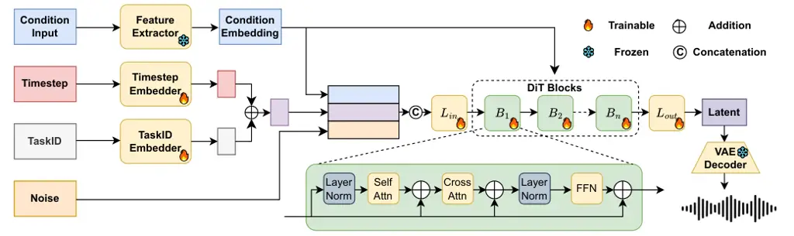

# UniFlow: Unifying Speech Front-End Tasks via Continuous Generative Modeling

Ziqian Wang    Zikai Liu    Yike Zhu    Xingchen Li    Boyi Kang   
Jixun Yao    Xianjun Xia    Chuanzeng Huang    Lei Xie ^(†)^(†)thanks:
Corresponding Author.

###### Abstract

Generative modeling has recently achieved remarkable success across
image, video, and audio domains, demonstrating powerful capabilities for
unified representation learning. Yet speech front-end tasks such as
speech enhancement (SE), target speaker extraction (TSE), acoustic echo
cancellation (AEC), and language-queried source separation (LASS) remain
largely tackled by disparate, task-specific solutions. This
fragmentation leads to redundant engineering effort, inconsistent
performance, and limited extensibility. To address this gap, we
introduce UniFlow, a unified framework that employs continuous
generative modeling to tackle diverse speech front-end tasks in a shared
latent space. Specifically, UniFlow utilizes a waveform variational
autoencoder (VAE) to learn a compact latent representation of raw audio,
coupled with a Diffusion Transformer (DiT) that predicts latent updates.
To differentiate the speech processing task during the training,
learnable condition embeddings indexed by a task ID are employed to
enable maximal parameter sharing while preserving task-specific
adaptability. To balance model performance and computational efficiency,
we investigate and compare three generative objectives: denoising
diffusion, flow matching, and mean flow within the latent domain. We
validate UniFlow on multiple public benchmarks, demonstrating consistent
gains over state-of-the-art baselines. UniFlow’s unified latent
formulation and conditional design make it readily extensible to new
tasks, providing an integrated foundation for building and scaling
generative speech processing pipelines. To foster future research, we
will open-source our codebase.

¹ Audio, Speech and Language Processing Group (ASLP@NPU), School of
Software,

Northwestern Polytechnical University, Xi’an, China

² Bytedance Inc., Sydney, Australia

## Introduction

Speech front-end processing comprises core tasks focused on enhancing
speech intelligibility and isolating target sources in complex acoustic
environments, including speech enhancement (SE), target speaker
extraction (TSE), acoustic echo cancellation (AEC), and source
separation (SS). A notable cross-modal variant within SS is
language-queried audio source separation (LASS), which integrates text
cues to guide the separation process. These tasks are critical for
real-time communication as well as downstream applications like
automatic speech recognition and speaker verification. Traditionally,
these tasks have been addressed through task-specific regression-based
networks, which model posterior distributions with dedicated loss
functions and data pipelines (Hu et al. 2020; Ju et al. 2023; Ristea
et al. 2023), leading to redundant design and limited generalizability.

Generative models, in parallel, have demonstrated remarkable success in
vision and audio domains, leveraging frameworks like variational
autoencoders (VAEs) (Kingma and Welling 2022), flow-based methods (Popov
et al. 2021), and diffusion models (Ho, Jain, and Abbeel 2020; Peebles
and Xie 2023; Evans et al. 2025; Geng et al. 2025) to learn joint
distributions to achieve high-fidelity synthesis and reconstruction.
However, the adoption of generative frameworks for speech front-end
tasks remains fragmented. Most prior work focuses on individual tasks in
isolation, employing separate models that lack a shared representation
space or a unified training objective (Yuan et al. 2025; Lee et al.
2025; Wang et al. 2025; Scheibler et al. 2025). This design hinders
knowledge transfer, increases engineering cost, and complicates the
integration of multiple tasks. Recent unified generative frameworks such
as Voicebox (Le et al. 2023) and UniAudio (Yang et al. 2024) primarily
target speech generation tasks like text-to-speech, rather than speech
front-end tasks. Within the speech front-end domain, models like
AnyEnhance (Zhang et al. 2025) and LLaSE-G1 (Kang et al. 2025) have made
progress in unifying multiple tasks. Yet these approaches rely on
discrete representations for modeling, which can lead to the loss of
fine-grained information critical for preserving speech characteristics
such as timbre and intelligibility (Défossez et al. 2022).

To overcome these limitations, we introduce UniFlow, a unified
generative framework for speech front-end tasks via continuous modeling
in a shared latent space. Unlike discrete representations-based methods,
UniFlow uses a waveform variational autoencoder (Kingma and Welling 2022) to map raw audio into a continuous latent space, preserving fine
temporal details. A Diffusion Transformer (Peebles and Xie 2023) is then
used to generate task-specific outputs by transforming these latents,
conditioned on the input signal and a learnable task embedding. Within
this architecture, we explore three generative objectives to balance
quality and efficiency: denoising diffusion (Ho, Jain, and Abbeel 2020)
for high-fidelity iterative refinement, flow matching (Lipman et al. 2023) for deterministic fast convergence, and mean flow (Geng et al. 2025) for efficient single-step prediction.

This design enables cross-task parameter sharing via shared latents and
task adaptability via conditional embeddings, while supporting modular
extension to new tasks. Our method yields consistent performance
improvements across multiple benchmarks. Our key contributions are
summarized as follows:

- •
  We present UniFlow, a unified framework that tackles speech front-end
  tasks via continuous generative modeling in a shared latent space.
- •
  We conduct a comparative study of different continuous generative
  paradigms: denoising diffusion, flow matching, and mean flow in speech
  front-end tasks, highlighting their trade-offs in performance and
  efficiency.
- •
  UniFlow achieves competitive performance on well-established front-end
  benchmarks and can easily extend to new tasks like speech synthesis.
  We will release the source code to facilitate future research.

## Related Work

#### Generative Modeling for Speech.

Generative models have become central to high-fidelity speech synthesis
and enhancement. Variational autoencoders learn compact continuous
representations of waveform or spectrogram signals, enabling efficient
latent-domain processing but often yielding overly smooth outputs (Huang
et al. 2023). Flow-based models such as FloWaveNet (Kim et al. 2018) and
WaveGlow (Prenger, Valle, and Catanzaro 2019) provide exact likelihoods
and rapid sampling, yet their front-end applications have been limited.
Denoising Diffusion Probabilistic Models further improve quality by
iteratively removing noise (Ho, Jain, and Abbeel 2020; Kong et al.
2020), at the expense of higher inference latency. To alleviate this,
latent diffusion compresses audio via a pretrained VAE or codec before
diffusion, reducing computational cost while preserving
fidelity (Rombach et al. 2022; Ghosal et al. 2023). Flow
Matching (Lipman et al. 2023) has emerged as a deterministic alternative
recently, training a velocity field to transport noisy latents to clean
ones in fewer steps. Mean Flow (Geng et al. 2025) simplifies this
further into a one-step mapping by regressing an expected transport
vector under the Mean Flow Identity. These latent-domain approaches
offer complementary trade-offs between sample quality, training
stability, and inference efficiency, but to date have not been unified
within a single framework for speech front-end tasks.

#### Task-Specific Speech Front-End Models.

Speech front-end tasks have been addressed using task-specific
architectures and training objectives. For SE, early approaches relied
on spectral subtraction and Wiener filtering, while modern methods
employ deep neural networks (DNNs), convolutional networks, or recurrent
architectures trained to map noisy signals to clean references (Luo and
Mesgarani 2019; Hu et al. 2020). Recent advances include diffusion-based
enhancement models, which achieve strong perceptual quality but remain
limited to this single task (Lemercier et al. 2023; Richter et al.
2023). In TSE, approaches such as SpeakerBeam (Žmolíková et al. 2019)
and VoiceFilter (Wang et al. 2018) utilize auxiliary speaker embeddings
or reference utterances to isolate the target speaker from mixtures.
These models often operate on spectrogram inputs and are trained with
masking or regression objectives tailored to the task. AEC has similarly
evolved from adaptive filtering to DNN-based models that estimate and
suppress echo components using microphone and far-end reference
signals (Ristea et al. 2023). Despite architectural innovations, most
methods are specialized for AEC and are difficult to transfer to other
scenarios. For SS, recent work incorporates textual cues to condition
audio separation, enabling applications such as text-prompted separation
or cross-modal scene understanding (Liu et al. 2024; Yuan et al. 2025).
While promising, these models typically rely on pre-trained language
encoders and are trained independently from other front-end systems.

#### Multi-Task Learning and Unified Models in Speech.

To reduce redundancy and encourage generalization, multi-task learning
(MTL) has been explored in various speech processing contexts. Early MTL
approaches jointly trained front-end modules (e.g., enhancement) with
downstream objectives such as speech recognition (Lv et al. 2023) or
speaker verification (Huang et al. 2024). These methods demonstrated the
benefit of shared representations but typically relied on discriminative
architectures and multi-branch designs, lacking a unified generative
perspective.

Recent efforts have begun exploring unified generative frameworks for
audio and speech. Voicebox (Le et al. 2023) presents a versatile speech
generative model capable of text-to-speech and speech editing, using a
non-autoregressive diffusion decoder. UniAudio (Yang et al. 2024)
targets general audio generation via a unified
codec-language-model-based architecture. Within speech front-end tasks,
AnyEnhance (Zhang et al. 2025) and LLaSE-G1 (Kang et al. 2025) advance
task unification but rely on discrete representations, which can lead to
the loss of fine-grained temporal and spectral details critical for
preserving speech characteristics.

While these approaches mark an important step toward unifying audio
processing, we differ our work from them in several aspects. First, we
focus on core speech front-end tasks. Second, we operate in the
continuous latent domain instead of relying on discrete representations,
thus preserving the fine-grained details critical for front-end
processing. Finally, we systematically compare different continuous
generative paradigms within the context of front-end tasks.



Figure 1: The overall architecture of UniFlow. It includes a waveform
VAE for latent encoding/decoding, a conditional Diffusion Transformer
for task-specific latent transformation, and a task conditioning module.
Condition inputs (e.g., enrolled speech, text prompts) are embedded via
frozen extractors (VAE encoder, ECAPA-TDNN, CLAP) or trainable
embedders. Noise is injected into the latents during training and serves
as the inference starting point. Guided by conditions and timestep/task
signals, the DiT uses self/cross-attention to map noisy latents to
task-specific outputs in the shared latent space.

## Method

### Overview

UniFlow is a unified generative framework designed to model diverse
speech front-end tasks within a shared latent space. As illustrated in
Figure 1, the overall architecture consists of three main components: a
waveform VAE for latents encoding and decoding; a Diffusion Transformer
that performs conditional generation in the latent space; and a task
conditioning module that modulates the generation process based on the
target task.

Given an input audio signal (e.g., noisy speech, echo speech, mixed
speech (target + interferers), or mixture audio), the VAE encoder
transforms it into latents, which serve as part of the condition
embeddings. Supplementary task-specific inputs are processed by
pretrained models to form additional condition embeddings, collectively
denoted as $`c`$. The DiT incorporates $`c`$ via three strategies:
_global conditioning_ broadcasts $`c`$ across all layers for task
consistency; _input concatenation_ appends $`c`$ to latent sequences;
_cross-attention_ aligns $`c`$ with latent timesteps for fine-grained
control. In training, for denoising diffusion, the DiT takes as input a
time-dependent noisy version of the ground-truth latent $`z`$; for flow
matching, the input is an interpolated sequence between noise and $`z`$,
with the DiT learning a deterministic flow to map noise to $`z`$; for
mean flow, the DiT directly learns a one-step mapping from sampled noise
to $`z`$. During inference, the DiT starts from Gaussian noise, uses
$`c`$ to guide the generation of $`\hat{z}`$, and the frozen VAE decoder
reconstructs the waveform from $`\hat{z}`$. All tasks share the
VAE-learned latent space, enabling parameter sharing, unified training,
and easy extensibility.

### Waveform Variational Autoencoder

To construct a unified latent space for speech front-end tasks, we
employ a waveform-level variational autoencoder that encodes raw audio
into compact, continuous latent representations. In contrast to
spectrogram-based or tokenized approaches, our VAE operates directly on
48 kHz waveforms, thereby preserving fine-grained temporal structure and
avoiding quantization loss.

We adopt a fully convolutional encoder-decoder architecture inspired by
SoundStream (Zeghidour et al. 2021). The encoder consists of five 1D
downsampling blocks with channel multipliers $`\{1,2,4,8,16\}`$ and
strides $`\{2,4,4,5,6\}`$, yielding an overall downsampling factor of
960, this corresponds to a frame rate of 50 Hz (48,000 Hz / 960 = 50
Hz). The decoder mirrors this configuration in reverse to reconstruct
waveforms from latents. Both the encoder and decoder use the snake
activation function (Ziyin, Hartwig, and Ueda 2020) to enhance the
modeling of high-frequency components. The latent bottleneck is
256-dimensional, and the model processes single-channel inputs. We do
not apply vector quantization, allowing smooth optimization in the
latent space.

Formally, given an input waveform $`x\in\mathbb{R}^{T}`$, the encoder
$`E_{\phi}`$ defines a diagonal Gaussian posterior:

```math
q_{\phi}(z|x)=\mathcal{N}\left(z\mid\mu_{\phi}(x),\text{diag}(\sigma^{2}_{\phi}(x))\right), \tag{1}
```

where $`\mu_{\phi}(x)`$ and $`\sigma_{\phi}(x)`$ are learned functions
of the input. A latent sample $`z`$ is obtained via the
reparameterization trick:

```math
z=\mu_{\phi}(x)+\sigma_{\phi}(x)\odot\epsilon,\quad\epsilon\sim\mathcal{N}(0,\mathbf{I}). \tag{2}
```

The decoder $`D_{\theta}`$ reconstructs the waveform from the latent
representation:

```math
\hat{x}=D_{\theta}(z). \tag{3}
```

The training objective follows the standard evidence lower bound (ELBO):

```math
\mathcal{L}_{\text{KL}}(x)=\mathbb{E}_{q_{\phi}(z|x)}\left[\|x-\hat{x}\|_{2}^{2}\right]+\beta\cdot\text{KL}\left(q_{\phi}(z|x)\parallel p(z)\right), \tag{4}
```

where $`p(z)=\mathcal{N}(0,\mathbf{I})`$ is a standard Gaussian prior
and $`\beta`$ is a tunable hyperparameter to balance reconstruction
fidelity and regularization. To better align perceptual quality, we
incorporate a multi-resolution short-time Fourier transform loss:

```math
\mathcal{L}_{\text{spec}}=\sum_{i=1}^{N}\lambda_{i}\cdot\left\|\text{STFT}_{i}(x)-\text{STFT}_{i}(\hat{x})\right\|_{1}, \tag{5}
```

where $`\text{STFT}_{i}`$ computes the complex spectrogram at the
$`i`$-th resolution, and $`\lambda_{i}`$ is the weight for each
resolution. We use 7 resolutions spanning frame sizes from 32 to 2048.
To encourage waveform realism, we adopt an adversarial objective using a
multi-scale STFT discriminator $`D`$. The adversarial loss is:

```math
\mathcal{L}_{\text{adv}}=\mathbb{E}_{\hat{x}}\left[(D(\hat{x})-1)^{2}\right], \tag{6}
```

and the discriminator is trained to distinguish real from generated
waveforms:

```math
\mathcal{L}_{D}=\mathbb{E}_{x}\left[(D(x)-1)^{2}\right]+\mathbb{E}_{\hat{x}}\left[D(\hat{x})^{2}\right]. \tag{7}
```

The total VAE loss is
$`\mathcal{L}_{\text{VAE}}=\lambda_{\text{KL}}\cdot\mathcal{L}_{\text{KL}}+\lambda_{\text{adv}}\cdot\mathcal{L}_{\text{adv}}+\lambda_{\text{spec}}\cdot\mathcal{L}_{\text{spec}}.`$

The VAE serves as a lossy waveform-to-latent compressor and a decoder
for waveform reconstruction, which is pretrained independently and is
frozen during both the training and inference stages of the conditional
generative model.

### Continuous Generative Modeling

UniFlow employs a single Conditional Diffusion Transformer backbone to
support multiple continuous generative objectives in the shared latent
space of a frozen VAE.

#### Model Architecture.

The core of our framework is a conditional DiT, adapted from the
scalable architecture in (Peebles and Xie 2023). Unlike U-Net-based
designs, this fully transformer-based backbone offers improved
scalability and consistent modeling across diverse tasks. The DiT
processes latent sequences $`z\in\mathbb{R}^{L\times d}`$ and is
conditioned on input signals, task IDs, and other contextual cues. It
has 32 transformer layers, 24 attention heads, a hidden dimension of
1536 (totaling 1.7B parameters), with rotary positional embeddings (Su
et al. 2023) to model temporal order. Conditioning is injected via three
routes: _input concatenation_, _cross-attention_, and _global
condition_. A dropout of 0.1 is used for regularization. Notably, the
DiT is designed to accept noise-perturbed latents $`z_{t}`$ (across all
generative objectives) and predict target signals (e.g., noise, velocity
vectors, or correction vectors), enabling seamless compatibility with
multiple training objectives.

#### Generative Objectives.

UniFlow supports multiple generative objectives within the same
conditional DiT backbone, enabling trade-offs between training
efficiency, inference speed, and reconstruction fidelity.

We implement the standard denoising diffusion probabilistic model
following (Ho, Jain, and Abbeel 2020). The forward process incrementally
adds Gaussian noise to the latent $`z_{0}`$ over $`T`$ steps:

```math
q(z_{t}\mid z_{0})=\mathcal{N}(z_{t};\sqrt{\bar{\alpha}_{t}}z_{0},(1-\bar{\alpha}_{t})\mathbf{I}), \tag{8}
```

where $`\{\bar{\alpha}_{t}\}`$ is a predefined variance schedule. The
model is trained to predict either the noise $`\epsilon`$ or the
velocity $`v_{t}`$ based on the conditional inputs:

```math
\mathcal{L}_{\text{DDPM}}=\mathbb{E}_{z_{0},\epsilon,t}\left[\left\|\epsilon-\epsilon_{\theta}(z_{t},t,\text{cond})\right\|_{2}^{2}\right], \tag{9}
```

```math
v_{t}=\sqrt{\bar{\alpha}_{t}}\epsilon-\sqrt{1-\bar{\alpha}_{t}}z_{0}, \tag{10}
```

where $`v_{t}`$ is the velocity used in progressive distillation
(Salimans and Ho 2022). DDPM provides high sample quality but incurs
multi-step sampling and long training times.

Flow Matching (Lipman et al. 2023) provides a deterministic alternative
to stochastic diffusion by directly learning a time-dependent velocity
field that transports noisy inputs toward clean targets. The model is
trained to match the ground-truth (oracle) flow:

```math
\mathcal{L}_{\text{FM}}=\mathbb{E}_{z_{0},\epsilon,t}\left[\left\|v_{\theta}(z_{t},t,\text{cond})-\frac{z_{0}-z_{t}}{\lambda(t)}\right\|_{2}^{2}\right], \tag{11}
```

where $`z_{t}`$ is obtained via a fixed forward kernel, and
$`\lambda(t)`$ is a time-dependent scaling factor that governs transport
rate. Compared to diffusion, FM eliminates the need for stochastic
sampling during training and inference, significantly improving
efficiency while retaining trajectory-based learning.

Mean Flow (Geng et al. 2025) offers a one-step generative modeling
paradigm by learning a time-independent velocity field
$`u_{\theta}(z_{t},r,t)`$ that satisfies the Mean Flow Identity. The
model is trained to regress a corrected velocity target derived from the
conditional flow dynamics:

```math
\mathcal{L}_{\text{MF}}=\mathbb{E}_{z_{t},t,r}\left[\left\|u_{\theta}(z_{t},r,t)-\text{sg}(u_{\text{tgt}})\right\|_{2}^{2}\right], \tag{12}
```

where the target velocity is defined as:

```math
u_{\text{tgt}}=v_{t}-(t-r)\left(v_{t}\cdot\nabla_{z}u_{\theta}+\partial_{t}u_{\theta}\right), \tag{13}
```

and the conditional velocity $`v_{t}`$ follows the formulation in Flow
Matching (Lipman et al. 2023):

```math
v_{t}=a^{\prime}_{t}z_{0}+b^{\prime}_{t}\epsilon. \tag{14}
```

The stop-gradient operator $`\text{sg}(\cdot)`$ avoids higher-order
derivatives, enabling efficient training. Despite its simplicity, MF
preserves strong theoretical guarantees and serves as an effective
alternative to diffusion or multi-step flow models, offering a fast,
one-step generation path without sampling or time discretization.

### Task Conditioning and Modularity

UniFlow enables unified modeling across diverse speech front-end tasks
through a flexible conditioning mechanism. Rather than hard-coding
task-specific branches, we introduce soft, modular conditioning paths
that adapt the behavior of the DiT via structured input embeddings. This
design supports clean parameter sharing across tasks while preserving
task-specific control.

| Task | Input Concat              | Cross-Attention        | Global            |
| ---- | ------------------------- | ---------------------- | ----------------- |
|      | Condition                 | Condition              | Condition         |
| SE   | Noisy Speech              | HuBERT(Noisy Speech)   | task_id, timestep |
| TSE  | Mixed Speech              | ECAPA(Enrolled Speech) | task_id, timestep |
| AEC  | Echo Speech & Far-end Ref | —                      | task_id, timestep |
| LASS | Mixture Audio             | CLAP(Text Query)       | task_id, timestep |

Table 1: Conditioning structure for each task in UniFlow.

We categorize the conditioning pathways into three types, as detailed in
Table 1: i) Input Concat Condition: Encodes raw task-specific inputs
(e.g., mixed speech for TSE) into latents via the VAE encoder,
concatenated with the target latent sequence, providing low-level
acoustic context. ii) Cross-Attention Condition: Uses frozen pretrained
models to extract high-level task cues (e.g., ECAPA-TDNN (Desplanques,
Thienpondt, and Demuynck 2020) embeddings of enrolled speech for TSE,
CLAP (Elizalde et al. 2023) embeddings of text queries for LASS),
provided as external keys/values to the DiT’s attention layers for
fine-grained alignment. iii) Injects task ID and timestep embeddings
across all DiT layers, providing coarse task-level context.

The conditioning mechanism is designed to support future task additions
without retraining or redesigning the architecture. New tasks can be
introduced by defining new task IDs and attaching corresponding feature
extractors, while reusing the same DiT backbone. This modular design
also enables ablation studies, transfer learning, and continual learning
under a consistent modeling framework.

## Experiments

### Experimental Setup

#### Datasets.

We train and evaluate UniFlow on four representative front-end speech
tasks: SE, TSE, AEC, and LASS. To support these tasks, we curate a
large-scale dataset comprising approximately 20k hours of clean speech
and 3k hours of noise after quality filtering. The speech corpus is
aggregated from public datasets such as Emilia (He et al. 2024), Aishell
series (Du et al. 2018; Shi et al. 2020), DNS Challenge (Reddy et al.
2020; Dubey et al. 2023), and AudioCaps (Kim et al. 2019), as well as in
house datasets. Noise datasets include DNS Challenge, AEC
Challenge (Cutler et al. 2023), WHAM! (Wichern et al. 2019),
UrbanSound (Salamon, Jacoby, and Bello 2014), and web-crawled
recordings. Room impulse responses are drawn from DNS Challenge,
OpenSLR26, and OpenSLR28 (Ko et al. 2017). All waveforms are resampled
to 48 kHz.

#### Data Augmentation.

We apply dynamic simulation during training. For SE, clean and noise
waveforms are mixed at a random SNR between $`[-5,20]`$ dB, with
reverberation added at 50% probability. For AEC, we use real far-end and
reference signals from AEC Challenge and apply noise at 20% probability,
with SER ranging from $`[-15,15]`$ dB. For TSE, a clean utterance is
mixed with an interference speech from a different speaker (with 5%
chance of no distractor), and auxiliary enrollment speech is provided.
SNR is randomly chosen from $`[-15,15]`$ dB, with 10% probability of
additive noise. For LASS, multiple utterances are mixed at a variable
SNR, and a caption from one of the sources is used as the language
prompt. We ensure balanced task sampling during training.

#### Training Details.

The VAE is trained using the AdamW optimizer with a learning rate of
1.5e-4, weight decay of 1e-3, and InverseLR scheduler. For the DiT
module, we use AdamW with a learning rate of 7.5e-5 with the same
scheduler. The VAE is pretrained and frozen throughout DiT training. We
use a batch size of 64. For the DDPM objective, we use 200 sampling
steps with a linear noise schedule. For Flow Matching, we adopt a
32-step deterministic sampling process along the learned velocity field.
For Mean Flow, generation is performed with a single forward pass. In
all settings, the predicted latent is decoded through the frozen VAE
decoder to reconstruct the output waveform.

UniFlow incorporates several pretrained models to provide strong
conditioning signals for different tasks. For SE, we use a learnable
weighted sum over all transformer layers of HuBERT as auxiliary
representations of noisy speech. We adopt the HuBERT Large model
fine-tuned on 960 hours of LibriSpeech¹¹ 1
https://huggingface.co/facebook/hubert-large-ls960-ft. For TSE, speaker
identity is encoded from enrolled speech using ECAPA-TDNN embeddings,
extracted via the SpeechBrain model trained on VoxCeleb²² 2
https://huggingface.co/speechbrain/spkrec-ecapa-voxceleb. For LASS, we
utilize CLAP, a contrastive audio-language pretrained model.
Specifically, we use the HTS-AT variant³³ 3
https://huggingface.co/laion/clap-htsat-fused to extract
text-conditioned embeddings. All pretrained models are kept frozen
during training.

#### Evaluation Metrics.

We adopt task-specific objectives metrics. For SE and TSE, we use
DNSMOS (Reddy, Gopal, and Cutler 2022) and pDNSMOS, respectively. For
AEC, we evaluate using AECMOS (Purin et al. 2022), which include echo
annoyance MOS (EMOS) and other degradation MOS (DMOS). For LASS, we
compute Fréchet Audio Distance (FAD) (Kilgour et al. 2018) and
CLAP-based metrics: CLAPScore (text-audio alignment) and CLAPScore\_(A)
(target audio alignment) (Yuan et al. 2025).

### Main Results

We evaluate UniFlow on four core speech front-end tasks: SE, AEC, TSE,
and LASS against both task-specific SOTA baselines and recent unified
generative models. A single UniFlow checkpoint, trained with
task-conditioned inputs, is shared across all tasks. Details of
baselines and test sets are provided in the appendix.

#### Speech Enhancement.

Table 2 presents DNSMOS scores on the Interspeech 2020 DNS Challenge
blind test set, covering both reverberant and non-reverberant scenarios.
Among the baselines, discriminative models such as DEMUCS demonstrate
strong performance, particularly in reducing background noise.
Generative baselines like SELM, AnyEnhance, LLaSE-G1, and FlowSE further
improve perceptual quality metrics, highlighting the advantage of
generation-based methods in producing natural-sounding outputs.

UniFlow consistently outperforms all baselines across metrics. Among its
variants, the DDPM-based version achieves the highest overall quality,
benefitting from the expressiveness and sampling diversity enabled by
multi-step iterative refinement. The Flow Matching variant provides
slightly lower but still strong results with only 32 steps, reflecting
its improved efficiency without sacrificing much quality. Mean Flow,
despite requiring just a single forward pass, delivers competitive
performance close to DDPM, making it especially attractive for real-time
or resource-constrained scenarios. These results underscore the
flexibility of UniFlow in balancing quality and inference cost through
different generative objectives.

|                             |             |      |      |           |      |      |
| --------------------------- | ----------- | ---- | ---- | --------- | ---- | ---- |
| Model                       | With Reverb |      |      | No Reverb |      |      |
|                             | SIG         | BAK  | OVRL | SIG       | BAK  | OVRL |
| Noisy                       | 1.76        | 1.50 | 1.39 | 3.39      | 2.62 | 2.48 |
| Conv-TasNet                 | 2.42        | 2.71 | 2.01 | 3.09      | 3.34 | 3.00 |
| DEMUCS                      | 2.86        | 3.90 | 2.55 | 3.58      | 4.15 | 3.35 |
| SELM                        | 3.16        | 3.58 | 2.70 | 3.51      | 4.10 | 3.26 |
| AnyEnhance                  | 3.50        | 4.04 | 3.20 | 3.64      | 4.18 | 3.42 |
| LLaSE-G1                    | 3.59        | 4.10 | 3.33 | 3.66      | 4.17 | 3.42 |
| FlowSE                      | 3.61        | 4.11 | 3.34 | 3.69      | 4.20 | 3.45 |
| UniFlow$`{}_{\text{DDPM}}`$ | 3.59        | 4.12 | 3.32 | 3.72      | 4.21 | 3.48 |
| UniFlow$`{}_{\text{FM}}`$   | 3.54        | 4.07 | 3.28 | 3.68      | 4.17 | 3.45 |
| UniFlow$`{}_{\text{MF}}`$   | 3.50        | 4.02 | 3.24 | 3.64      | 4.22 | 3.43 |

Table 2: DNSMOS scores on the Interspeech 2020 DNS Challenge blind test
set. Discriminative models are shown with a white background; generative
models are highlighted with a gray background. UniFlow variants
correspond to different generative objectives.

#### Acoustic Echo Cancellation.

Table 3 reports AECMOS Echo (EMOS) and Degradation (DMOS) scores on the
ICASSP 2023 AEC Challenge blind test set, covering multiple acoustic
conditions including double-talk, far-end single-talk, and near-end
single-talk. Discriminative baselines such as DeepVQE and Align-ULCNet
achieve strong performance under single-talk conditions. DeepVQE sets
the highest scores across several settings, benefiting from its
task-specific design and optimization.

|                             |      |      |      |      |
| --------------------------- | ---- | ---- | ---- | ---- |
| Model                       | DT   |      | FEST | NEST |
|                             | EMOS | DMOS | EMOS | DMOS |
| Align-CRUSE                 | 4.60 | 3.95 | 4.56 | –    |
| DeepVQE                     | 4.70 | 4.29 | 4.69 | 4.41 |
| Align-ULCNet                | 4.60 | 3.80 | 4.77 | 4.28 |
| LLaSE-G1                    | 4.42 | 3.82 | 4.64 | 3.66 |
| UniFlow$`{}_{\text{DDPM}}`$ | 4.54 | 3.93 | 4.67 | 3.70 |
| UniFlow$`{}_{\text{FM}}`$   | 4.50 | 3.89 | 4.63 | 3.66 |
| UniFlow$`{}_{\text{MF}}`$   | 4.47 | 3.87 | 4.59 | 3.61 |

Table 3: AECMOS scores on ICASSP 2023 AEC-challenge blind test set. “DT”
means double-talk, “FEST” means far-end single-talk and “NEST” means
near-end single-talk.

Among unified generative models, LLaSE-G1 achieves moderate performance.
UniFlow variants outperform LLaSE-G1 across conditions: In the
challenging double-talk condition, UniFlow$`{}_{\text{DDPM}}`$ achieves
an EMOS of 4.54 and a DMOS of 3.93, closely matching specialized
baselines like Align-CRUSE. While UniFlow variants slightly lag behind
in single-talk degradation metrics, they still maintain high EMOS
scores, indicating faithful echo suppression without speech distortion.
Moreover, the quality-efficiency trade-offs observed in SE remain
consistent: DDPM achieves the best perceptual quality, while FM and MF
maintain strong performance with lower inference cost.

#### Target Speaker Extraction.

We evaluate UniFlow on the TSE task using the ICASSP 2023 DNS Challenge
blind test set, which includes two evaluation tracks: Track 1 (headset)
and Track 2 (speakerphone). Results are summarized in Table 4, reported
in terms of personalized DNSMOS covering speech quality (SIG),
background noise (BAK), and overall quality (OVRL).

Compared to strong baselines such as TEA-PSE 3.0, NAPSE, and LLaSE-G1,
UniFlow demonstrates consistently strong performance across both tracks.
In particular, UniFlow$`{}_{\text{DDPM}}`$ achieves the best overall
quality scores on both tracks, outperforming both TEA-PSE and NAPSE
despite not being optimized specifically for the TSE task. All UniFlow
variants show superior SIG scores, indicating better preservation of
target speech quality during extraction.

|                             |         |      |      |         |      |      |
| --------------------------- | ------- | ---- | ---- | ------- | ---- | ---- |
| Model                       | Track 1 |      |      | Track 2 |      |      |
|                             | SIG     | BAK  | OVRL | SIG     | BAK  | OVRL |
| Noisy                       | 4.15    | 2.37 | 2.71 | 4.05    | 2.16 | 2.50 |
| TEA-PSE 3.0                 | 4.12    | 4.05 | 3.65 | 3.99    | 3.95 | 3.49 |
| NAPSE                       | 3.81    | 3.99 | 3.38 | 3.92    | 4.17 | 3.56 |
| LLaSE-G1                    | 4.21    | 3.99 | 3.72 | 4.08    | 3.84 | 3.55 |
| UniFlow$`{}_{\text{DDPM}}`$ | 4.24    | 3.99 | 3.73 | 4.09    | 3.88 | 3.56 |
| UniFlow$`{}_{\text{FM}}`$   | 4.20    | 4.01 | 3.70 | 4.06    | 3.89 | 3.54 |
| UniFlow$`{}_{\text{MF}}`$   | 4.18    | 3.99 | 3.67 | 4.04    | 3.87 | 3.51 |

Table 4: pDNSMOS scores on the ICASSP 2023 DNS Challenge blind test set.

While TEA-PSE achieves slightly higher BAK scores, attributed to
aggressive background suppression, UniFlow attains a more balanced
trade-off, avoiding over-suppression and preserving intelligibility.
Furthermore, the performance gap among UniFlow variants remains narrow,
highlighting that the lightweight MF variant achieves comparable
perceptual quality with reduced inference latency.

|                             |      |           |                |
| --------------------------- | ---- | --------- | -------------- |
| Model                       | FAD  | CLAPScore | CLAPScore\_(A) |
| Unprocessed                 | —    | 11.9      | 64.9           |
| LASS-Net                    | 5.09 | 14.4      | 70.2           |
| AudioSep                    | 4.38 | 13.6      | 69.6           |
| FlowSep                     | 2.86 | 21.9      | 81.7           |
| UniFlow$`{}_{\text{DDPM}}`$ | 2.70 | 22.7      | 81.2           |
| UniFlow$`{}_{\text{FM}}`$   | 2.76 | 22.1      | 80.3           |
| UniFlow$`{}_{\text{MF}}`$   | 2.83 | 21.4      | 79.4           |

Table 5: LASS results on AudioCaps testset. FAD does not apply on
unprocessed data as it calculates the difference between two groups of
audio, while the target and mixed audio share the same audio events.

#### Language-queried Audio Source Separation.

We evaluate UniFlow on the LASS task using the AudioCaps benchmark and
adopt evaluation metrics consistent with recent work, such as AudioSep
and FlowSep. Specifically, we report the Fréchet Audio Distance,
CLAPScore, and CLAPScore\_(A). The results are presented in Table 5.

Compared to prior approaches, UniFlow achieves the best overall
performance. It attains the lowest FAD score, indicating superior
fidelity and naturalness of the separated output compared to the
reference audio. Additionally, it achieves the highest CLAPScore,
demonstrating strong semantic alignment between the output audio and the
text prompt. While FlowSep achieves the best CLAPScore\_(A), UniFlow
remains competitive, showing a small drop while improving general
quality and prompt relevance.

### Ablation Studies

We conduct ablation studies to investigate the effect of several core
design choices in UniFlow. Specifically, we examine i) the multitask
conditioning mechanism, ii) the extensibility of the framework, iii) the
VAE design, and iv) the inference efficiency trade-offs across different
objectives.

#### Conditioning Mechanism

To validate the necessity of our task-specific conditioning design
(Table 1), we ablate the conditioning by removing the Task ID global
condition while retaining other conditions. We measure the task
confusion rate and key metrics for each task.

| Task             | Key Metric |             | Confusion Rate (%) |
| ---------------- | ---------- | ----------- | ------------------ |
|                  | w/ Task ID | w/o Task ID |                    |
| SE (OVRL)        | 3.48       | 2.89        | 37.2 (mostly AEC)  |
| TSE (OVRL)       | 3.68       | 3.02        | 41.5 (mostly SE)   |
| AEC (EMOS)       | 4.54       | 3.91        | 34.8 (mostly SE)   |
| LASS (CLAPScore) | 22.7       | 16.3        | 39.7 (mostly TSE)  |

Table 6: Ablation of Task ID global conditioning. ”w/ Task ID” refers to
results from main experiments; ”w/o Task ID” denotes performance after
removing Task ID embedding. Confusion rate is the percentage of outputs
misclassified into other tasks.

Results in Table 6 show that removing Task ID leads to significant
performance drops and high confusion rates, indicating that Task ID is
critical for distinguishing tasks. The misclassification patterns (e.g.,
SE frequently confused with AEC) indicate that low-level acoustic
similarities (e.g., noise vs. echo) dominate without explicit task
guidance, highlighting the necessity of task conditioning in our
framework.

#### Multi-Task Generalization.

To further validate extensibility, we extend UniFlow to Text-to-Speech
(TTS) by introducing a new $`\texttt{task\_id}=\text{TTS}`$. We
concatenate phoneme embeddings with VAE-encoded latent waveforms and
incorporate speaker embeddings extracted via a pretrained speaker
verification model as global conditions. The DiT is trained to predict
masked latent segments from phonemes. At inference, predicted latents
are decoded by the VAE decoder to waveforms. Finetuning on Emilia
dataset for 100k steps yields a WER of 3.50% and speaker similarity (Spk
Sim) of 0.697, comparable to specialized TTS systems.

| Model                           | WER (%) | Spk Sim |
| ------------------------------- | ------- | ------- |
| ChatTTS                         | 6.84    | \-      |
| GPT-SoVITs                      | 5.13    | 0.405   |
| CosyVoice 2                     | 2.47    | 0.745   |
| UniFlow$`{}_{\text{DDPM}}`$-TTS | 3.50    | 0.697   |

Table 7: TTS results on LibriSpeech test-clean subset. Evaluated with
Whisper-Large V3 and ERes2Net

| Configuration                                               | SIG  | BAK  | OVRL |
| ----------------------------------------------------------- | ---- | ---- | ---- |
| Full (dim 256, 50 Hz, $`\mathcal{L}_{\text{VAE}}`$, frozen) | 3.72 | 4.20 | 3.48 |
| – joint fine-tuning (SE only)                               | 3.80 | 4.25 | 3.55 |
| – dim 128                                                   | 3.59 | 4.05 | 3.32 |
| – w/o $`\mathcal{L}_{\text{adv}}`$                          | 3.64 | 3.97 | 3.37 |
| – w/o $`\mathcal{L}_{\text{spec}}`$                         | 3.58 | 3.73 | 3.28 |
| – 100 Hz (downsampling ×480)                                | 3.68 | 4.08 | 3.38 |
| – 25 Hz (downsampling ×1920)                                | 3.51 | 3.83 | 3.19 |

Table 8: Ablation on VAE design (DNS Challenge blind test set “No
Reverb” subset, 48 kHz input audio).

| Objective | Steps | RTF  | Memory (GB) |
| --------- | ----- | ---- | ----------- |
| DDPM      | 200   | 3.49 | 18.2        |
| FM        | 32    | 0.31 | 17.7        |
| MF        | 1     | 0.02 | 17.6        |

Table 9: Inference efficiency of UniFlow variants.

#### Impact of VAE Design.

We ablate three aspects of the VAE pretraining: latent dimensionality,
temporal resolution, and loss components. Table 8 summarizes the DNSMOS
results under the DDPM objective. The full configuration achieves the
best scores. Reducing the latent dimension to 128 degrades all metrics,
indicating that sufficient capacity is necessary for high-fidelity
reconstruction. Omitting either the adversarial loss
$`\mathcal{L}_{\text{adv}}`$ or the spectral loss
$`\mathcal{L}_{\text{spec}}`$ also lowers performance, confirming their
complementary roles. Varying the temporal resolution reveals a
fidelity-efficiency trade-off: increasing frame rate to 100 Hz slightly
improves SIG at the cost of considerable computational overhead, whereas
reducing frame rate to 25 Hz markedly degrades quality. These findings
indicate that a moderate frame rate, together with both spectral and
adversarial losses, is optimal for balancing audio fidelity and model
efficiency. Notably, while the full configuration with joint
optimization yields higher single-task results, we observe that this
tightly coupled design limits generalization across multiple tasks.
Therefore, we keep VAE frozen to balance audio fidelity, efficiency, and
multi-task robustness.

#### Inference Efficiency Trade-offs

As performance comparisons are detailed in the main results, we focus on
efficiency differences across generative objectives here. As shown in
Table 9, MF enables 1-step generation with a real-time factor (RTF) of
0.02, making it suitable for real-time scenarios. FM operates at 32
steps with an RTF of 0.31, striking a balance in computational
efficiency. DDPM, while slowest, delivers top performance for offline
tasks. This validates UniFlow’s adaptability to diverse latency
requirements via modular generative objectives.

## Conclusion

We introduced UniFlow, a single generative model unifying diverse speech
front-end tasks via a waveform VAE and conditional Diffusion
Transformer. By supporting multiple generative objectives and a modular
conditioning scheme, UniFlow matches or exceeds task-specific baselines
while offering a quality–efficiency trade-off. Comprehensive experiments
demonstrate its effectiveness and generalization ability. We will
release our code to facilitate future research on unified generative
modeling in speech and beyond.

## References

- 2noise (2024) 2noise. 2024. ChatTTS.
  https://github.com/2noise/ChatTTS.
- Cutler et al. (2023) Cutler, R.; Saabas, A.; Parnamaa, T.; Purin, M.;
  Indenbom, E.; Ristea, N.-C.; Gužvin, J.; Gamper, H.; Braun, S.; and
  Aichner, R. 2023. ICASSP 2023 Acoustic Echo Cancellation Challenge.
  arXiv:2309.12553.
- Défossez et al. (2019) Défossez, A.; Usunier, N.; Bottou, L.; and
  Bach, F. 2019. Demucs: Deep extractor for music sources with extra
  unlabeled data remixed. _arXiv preprint arXiv:1909.01174_.
- Desplanques, Thienpondt, and Demuynck (2020) Desplanques, B.;
  Thienpondt, J.; and Demuynck, K. 2020. Ecapa-tdnn: Emphasized channel
  attention, propagation and aggregation in tdnn based speaker
  verification. _arXiv preprint arXiv:2005.07143_.
- Du et al. (2024a) Du, C.; Guo, Y.; Shen, F.; Liu, Z.; Liang, Z.; Chen,
  X.; Wang, S.; Zhang, H.; and Yu, K. 2024a. Unicats: A unified
  context-aware text-to-speech framework with contextual vq-diffusion
  and vocoding. In _Proceedings of the AAAI Conference on Artificial
  Intelligence_, volume 38, 17924–17932.
- Du et al. (2018) Du, J.; Na, X.; Liu, X.; and Bu, H. 2018. Aishell-2:
  Transforming mandarin asr research into industrial scale. _arXiv
  preprint arXiv:1808.10583_.
- Du et al. (2024b) Du, Z.; Wang, Y.; Chen, Q.; Shi, X.; Lv, X.; Zhao,
  T.; Gao, Z.; Yang, Y.; Gao, C.; Wang, H.; Yu, F.; Liu, H.; Sheng, Z.;
  Gu, Y.; Deng, C.; Wang, W.; Zhang, S.; Yan, Z.; and Zhou, J. 2024b.
  CosyVoice 2: Scalable Streaming Speech Synthesis with Large Language
  Models. arXiv:2412.10117.
- Dubey et al. (2023) Dubey, H.; Aazami, A.; Gopal, V.; Naderi, B.;
  Braun, S.; Cutler, R.; Ju, A.; Zohourian, M.; Tang, M.; Gamper, H.;
  Golestaneh, M.; and Aichner, R. 2023. ICASSP 2023 Deep Noise
  Suppression Challenge. arXiv:2303.11510.
- Défossez et al. (2022) Défossez, A.; Copet, J.; Synnaeve, G.; and
  Adi, Y. 2022. High Fidelity Neural Audio Compression.
  arXiv:2210.13438.
- Elizalde et al. (2023) Elizalde, B.; Deshmukh, S.; Al Ismail, M.; and
  Wang, H. 2023. Clap learning audio concepts from natural language
  supervision. In _ICASSP 2023-2023 IEEE International Conference on
  Acoustics, Speech and Signal Processing (ICASSP)_, 1–5. IEEE.
- Evans et al. (2025) Evans, Z.; Parker, J. D.; Carr, C.; Zukowski, Z.;
  Taylor, J.; and Pons, J. 2025. Stable audio open. In _ICASSP 2025-2025
  IEEE International Conference on Acoustics, Speech and Signal
  Processing (ICASSP)_, 1–5. IEEE.
- Geng et al. (2025) Geng, Z.; Deng, M.; Bai, X.; Kolter, J. Z.; and
  He, K. 2025. Mean Flows for One-step Generative Modeling.
  arXiv:2505.13447.
- Ghosal et al. (2023) Ghosal, D.; Majumder, N.; Mehrish, A.; and
  Poria, S. 2023. Text-to-audio generation using instruction guided
  latent diffusion model. In _Proceedings of the 31st ACM International
  Conference on Multimedia_, 3590–3598.
- He et al. (2024) He, H.; Shang, Z.; Wang, C.; Li, X.; Gu, Y.; Hua, H.;
  Liu, L.; Yang, C.; Li, J.; Shi, P.; et al. 2024. Emilia: An extensive,
  multilingual, and diverse speech dataset for large-scale speech
  generation. In _2024 IEEE Spoken Language Technology Workshop (SLT)_,
  885–890. IEEE.
- Ho, Jain, and Abbeel (2020) Ho, J.; Jain, A.; and Abbeel, P. 2020.
  Denoising Diffusion Probabilistic Models. arXiv:2006.11239.
- Hu et al. (2020) Hu, Y.; Liu, Y.; Lv, S.; Xing, M.; Zhang, S.; Fu, Y.;
  Wu, J.; Zhang, B.; and Xie, L. 2020. DCCRN: Deep complex convolution
  recurrent network for phase-aware speech enhancement. _arXiv preprint
  arXiv:2008.00264_.
- Huang et al. (2023) Huang, J.; Ren, Y.; Huang, R.; Yang, D.; Ye, Z.;
  Zhang, C.; Liu, J.; Yin, X.; Ma, Z.; and Zhao, Z. 2023. Make-An-Audio
  2: Temporal-Enhanced Text-to-Audio Generation. arXiv:2305.18474.
- Huang et al. (2024) Huang, K.; Li, Y.; Wang, Z.; Wang, H.; Rao, W.;
  Sun, Z.; Tang, Z.; Huang, S.; Wang, Y.; Yu, T.; Xie, L.; and Shang,
  S.-d. 2024. The NPU-TEA System for the CHiME-8 NOTSOFAR-1 Challenge.
  45–48.
- Indenbom et al. (2023) Indenbom, E.; Ristea, N.-C.; Saabas, A.;
  Pärnamaa, T.; and Gužvin, J. 2023. Deep model with built-in
  cross-attention alignment for acoustic echo cancellation.
  arXiv:2208.11308.
- Ju et al. (2023) Ju, Y.; Chen, J.; Zhang, S.; He, S.; Rao, W.; Zhu,
  W.; Wang, Y.; Yu, T.; and Shang, S. 2023. TEA-PSE 3.0:
  Tencent-Ethereal-Audio-Lab Personalized Speech Enhancement System For
  ICASSP 2023 Dns-Challenge. In _ICASSP 2023 - 2023 IEEE International
  Conference on Acoustics, Speech and Signal Processing (ICASSP)_, 1–2.
- Kang et al. (2025) Kang, B.; Zhu, X.; Zhang, Z.; Ye, Z.; Liu, M.;
  Wang, Z.; Zhu, Y.; Ma, G.; Chen, J.; Xiao, L.; Weng, C.; Xue, W.; and
  Xie, L. 2025. LLaSE-G1: Incentivizing Generalization Capability for
  LLaMA-based Speech Enhancement. arXiv:2503.00493.
- Kilgour et al. (2018) Kilgour, K.; Zuluaga, M.; Roblek, D.; and
  Sharifi, M. 2018. Fr$`\backslash`$’echet audio distance: A metric for
  evaluating music enhancement algorithms. _arXiv preprint
  arXiv:1812.08466_.
- Kim et al. (2019) Kim, C. D.; Kim, B.; Lee, H.; and Kim, G. 2019.
  Audiocaps: Generating captions for audios in the wild. In _Proceedings
  of the 2019 Conference of the North American Chapter of the
  Association for Computational Linguistics: Human Language
  Technologies, Volume 1 (Long and Short Papers)_, 119–132.
- Kim et al. (2018) Kim, S.; Lee, S.-g.; Song, J.; Kim, J.; and
  Yoon, S. 2018. FloWaveNet: A generative flow for raw audio. _arXiv
  preprint arXiv:1811.02155_.
- Kingma and Welling (2022) Kingma, D. P.; and Welling, M. 2022.
  Auto-Encoding Variational Bayes. arXiv:1312.6114.
- Ko et al. (2017) Ko, T.; Peddinti, V.; Povey, D.; Seltzer, M. L.; and
  Khudanpur, S. 2017. A study on data augmentation of reverberant speech
  for robust speech recognition. In _2017 IEEE international conference
  on acoustics, speech and signal processing (ICASSP)_, 5220–5224. IEEE.
- Kong et al. (2020) Kong, Z.; Ping, W.; Huang, J.; Zhao, K.; and
  Catanzaro, B. 2020. Diffwave: A versatile diffusion model for audio
  synthesis. _arXiv preprint arXiv:2009.09761_.
- Le et al. (2023) Le, M.; Vyas, A.; Shi, B.; Karrer, B.; Sari, L.;
  Moritz, R.; Williamson, M.; Manohar, V.; Adi, Y.; Mahadeokar, J.;
  et al. 2023. Voicebox: Text-guided multilingual universal speech
  generation at scale. _Advances in neural information processing
  systems_, 36: 14005–14034.
- Lee et al. (2025) Lee, S.; Cheong, S.; Han, S.; and Shin, J. W. 2025.
  FlowSE: Flow Matching-based Speech Enhancement. In _ICASSP 2025-2025
  IEEE International Conference on Acoustics, Speech and Signal
  Processing (ICASSP)_, 1–5. IEEE.
- Lemercier et al. (2023) Lemercier, J.-M.; Richter, J.; Welker, S.; and
  Gerkmann, T. 2023. Storm: A diffusion-based stochastic regeneration
  model for speech enhancement and dereverberation. _IEEE/ACM
  Transactions on Audio, Speech, and Language Processing_, 31:
  2724–2737.
- Lipman et al. (2023) Lipman, Y.; Chen, R. T. Q.; Ben-Hamu, H.; Nickel,
  M.; and Le, M. 2023. Flow Matching for Generative Modeling.
  arXiv:2210.02747.
- Liu et al. (2024) Liu, X.; Kong, Q.; Zhao, Y.; Liu, H.; Yuan, Y.; Liu,
  Y.; Xia, R.; Wang, Y.; Plumbley, M. D.; and Wang, W. 2024. Separate
  anything you describe. _IEEE/ACM Transactions on Audio, Speech, and
  Language Processing_.
- Liu et al. (2022) Liu, X.; Liu, H.; Kong, Q.; Mei, X.; Zhao, J.;
  Huang, Q.; Plumbley, M. D.; and Wang, W. 2022. Separate What You
  Describe: Language-Queried Audio Source Separation. arXiv:2203.15147.
- Luo and Mesgarani (2019) Luo, Y.; and Mesgarani, N. 2019. Conv-tasnet:
  Surpassing ideal time–frequency magnitude masking for speech
  separation. _IEEE/ACM transactions on audio, speech, and language
  processing_, 27(8): 1256–1266.
- Lv et al. (2023) Lv, S.; Wang, X.; Sun, S.; Ma, L.; and Xie, L. 2023.
  DCCRN-KWS: An audio bias based model for noise robust small-footprint
  keyword spotting. _arXiv preprint arXiv:2305.12331_.
- Peebles and Xie (2023) Peebles, W.; and Xie, S. 2023. Scalable
  Diffusion Models with Transformers. arXiv:2212.09748.
- Popov et al. (2021) Popov, V.; Vovk, I.; Gogoryan, V.; Sadekova, T.;
  and Kudinov, M. 2021. Grad-tts: A diffusion probabilistic model for
  text-to-speech. In _International conference on machine learning_,
  8599–8608. PMLR.
- Prenger, Valle, and Catanzaro (2019) Prenger, R.; Valle, R.; and
  Catanzaro, B. 2019. Waveglow: A flow-based generative network for
  speech synthesis. In _ICASSP 2019-2019 IEEE International Conference
  on Acoustics, Speech and Signal Processing (ICASSP)_, 3617–3621. IEEE.
- Purin et al. (2022) Purin, M.; Sootla, S.; Sponza, M.; Saabas, A.; and
  Cutler, R. 2022. AECMOS: A speech quality assessment metric for echo
  impairment. arXiv:2110.03010.
- Reddy, Gopal, and Cutler (2022) Reddy, C. K. A.; Gopal, V.; and
  Cutler, R. 2022. DNSMOS P.835: A Non-Intrusive Perceptual Objective
  Speech Quality Metric to Evaluate Noise Suppressors. arXiv:2110.01763.
- Reddy et al. (2020) Reddy, C. K. A.; Gopal, V.; Cutler, R.; Beyrami,
  E.; Cheng, R.; Dubey, H.; Matusevych, S.; Aichner, R.; Aazami, A.;
  Braun, S.; Rana, P.; Srinivasan, S.; and Gehrke, J. 2020. The
  INTERSPEECH 2020 Deep Noise Suppression Challenge: Datasets,
  Subjective Testing Framework, and Challenge Results. arXiv:2005.13981.
- Richter et al. (2023) Richter, J.; Welker, S.; Lemercier, J.-M.; Lay,
  B.; and Gerkmann, T. 2023. Speech enhancement and dereverberation with
  diffusion-based generative models. _IEEE/ACM Transactions on Audio,
  Speech, and Language Processing_, 31: 2351–2364.
- Ristea et al. (2023) Ristea, N. C.; Indenbom, E.; Saabas, A.;
  Pärnamaa, T.; Guzhvin, J.; and Cutler, R. 2023. DeepVQE: Real time
  deep voice quality enhancement for joint acoustic echo cancellation,
  noise suppression and dereverberation. In _Proc. Interspeech 2023_,
  3819–3823.
- Rombach et al. (2022) Rombach, R.; Blattmann, A.; Lorenz, D.; Esser,
  P.; and Ommer, B. 2022. High-Resolution Image Synthesis with Latent
  Diffusion Models. arXiv:2112.10752.
- RVC-Boss (2024) RVC-Boss. 2024. GPT-SoVITS.
  https://github.com/RVC-Boss/GPT-SoVITS.
- Salamon, Jacoby, and Bello (2014) Salamon, J.; Jacoby, C.; and Bello,
  J. P. 2014. A dataset and taxonomy for urban sound research. In
  _Proceedings of the 22nd ACM international conference on Multimedia_,
  1041–1044.
- Salimans and Ho (2022) Salimans, T.; and Ho, J. 2022. Progressive
  Distillation for Fast Sampling of Diffusion Models. arXiv:2202.00512.
- Scheibler et al. (2025) Scheibler, R.; Hershey, J. R.; Doucet, A.; and
  Li, H. 2025. Source Separation by Flow Matching. arXiv:2505.16119.
- Shetu et al. (2024) Shetu, S. S.; Desiraju, N. K.; Mack, W.; and
  Habets, E. A. P. 2024. Align-ULCNet: Towards Low-Complexity and Robust
  Acoustic Echo and Noise Reduction. arXiv:2410.13620.
- Shi et al. (2020) Shi, Y.; Bu, H.; Xu, X.; Zhang, S.; and Li, M. 2020.
  Aishell-3: A multi-speaker mandarin tts corpus and the baselines.
  _arXiv preprint arXiv:2010.11567_.
- Su et al. (2023) Su, J.; Lu, Y.; Pan, S.; Murtadha, A.; Wen, B.; and
  Liu, Y. 2023. RoFormer: Enhanced Transformer with Rotary Position
  Embedding. arXiv:2104.09864.
- Wang et al. (2018) Wang, Q.; Muckenhirn, H.; Wilson, K.; Sridhar, P.;
  Wu, Z.; Hershey, J.; Saurous, R. A.; Weiss, R. J.; Jia, Y.; and
  Moreno, I. L. 2018. Voicefilter: Targeted voice separation by
  speaker-conditioned spectrogram masking. _arXiv preprint
  arXiv:1810.04826_.
- Wang et al. (2025) Wang, Z.; Liu, Z.; Zhu, X.; Zhu, Y.; Liu, M.; Chen,
  J.; Xiao, L.; Weng, C.; and Xie, L. 2025. FlowSE: Efficient and
  High-Quality Speech Enhancement via Flow Matching. _arXiv preprint
  arXiv:2505.19476_.
- Wang et al. (2024) Wang, Z.; Zhu, X.; Zhang, Z.; Lv, Y.; Jiang, N.;
  Zhao, G.; and Xie, L. 2024. Selm: Speech enhancement using discrete
  tokens and language models. In _ICASSP 2024-2024 IEEE International
  Conference on Acoustics, Speech and Signal Processing (ICASSP)_,
  11561–11565. IEEE.
- Wichern et al. (2019) Wichern, G.; Antognini, J.; Flynn, M.; Zhu,
  L. R.; McQuinn, E.; Crow, D.; Manilow, E.; and Roux, J. L. 2019.
  WHAM!: Extending Speech Separation to Noisy Environments.
  arXiv:1907.01160.
- Yang et al. (2024) Yang, D.; Tian, J.; Tan, X.; Huang, R.; Liu, S.;
  Guo, H.; Chang, X.; Shi, J.; Bian, J.; Zhao, Z.; et al. 2024.
  Uniaudio: Towards universal audio generation with large language
  models. In _Forty-first International Conference on Machine Learning_.
- Yuan et al. (2025) Yuan, Y.; Liu, X.; Liu, H.; Plumbley, M. D.; and
  Wang, W. 2025. Flowsep: Language-queried sound separation with
  rectified flow matching. In _ICASSP 2025-2025 IEEE International
  Conference on Acoustics, Speech and Signal Processing (ICASSP)_, 1–5.
  IEEE.
- Zeghidour et al. (2021) Zeghidour, N.; Luebs, A.; Omran, A.; Skoglund,
  J.; and Tagliasacchi, M. 2021. Soundstream: An end-to-end neural audio
  codec. _IEEE/ACM Transactions on Audio, Speech, and Language
  Processing_, 30: 495–507.
- Zhang et al. (2025) Zhang, J.; Yang, J.; Fang, Z.; Wang, Y.; Zhang,
  Z.; Wang, Z.; Fan, F.; and Wu, Z. 2025. Anyenhance: A unified
  generative model with prompt-guidance and self-critic for voice
  enhancement. _arXiv preprint arXiv:2501.15417_.
- Ziyin, Hartwig, and Ueda (2020) Ziyin, L.; Hartwig, T.; and
  Ueda, M. 2020. Neural Networks Fail to Learn Periodic Functions and
  How to Fix It. arXiv:2006.08195.
- Žmolíková et al. (2019) Žmolíková, K.; Delcroix, M.; Kinoshita, K.;
  Ochiai, T.; Nakatani, T.; Burget, L.; and Černockỳ, J. 2019.
  Speakerbeam: Speaker aware neural network for target speaker
  extraction in speech mixtures. _IEEE Journal of Selected Topics in
  Signal Processing_, 13(4): 800–814.

## Appendix

### Test Sets

#### Speech Enhancement.

We use the Interspeech 2020 DNS Challenge blind test set (Reddy et al.
2020), which comprises 600 clips (300 synthetic and 300 real). Synthetic
clips are generated by combining clean speech with training-unseen
noise, while real clips are crowd-sourced from diverse noisy
environments.

#### Acoustic Echo Cancellation.

The evaluation employs the ICASSP 2023 AEC Challenge blind test
set (Cutler et al. 2023), consisting of real-world data from over 10,000
audio devices and environments. It includes both single-talk and
double-talk scenarios with varying background noise, reverberation, and
device distortions, serving as the final ranking basis for the
competition.

#### Target Speaker Extraction.

We adopt the ICASSP 2023 DNS Challenge blind test set (Dubey et al.
2023), which features two tracks (Headset and Speakerphone) with 10-30
second enrollment clips (with or without noise). It evaluates both
personalized and non-personalized models via the Personalized ITU-T
P.835 framework for final rankings.

#### Language-queried Audio Source Separation.

The AudioCaps testing set (Kim et al. 2019) is used, containing 928
samples. Each audio clip serves as the target source, mixed with a noise
source from the testing set at random SNR (-15 to 15 dB). The first
caption of the target source is selected as the separation query, with
target and noise sources ensuring no overlapping sound classes during
evaluation.

#### Text-To-Speech.

We evaluate UniFlow’s extensibility on Text-to-Speech task using m the
test-clean set of Librispeech (Du et al. 2024a) corpus, which is a
multi-speaker transcribed English speech dataset.

### Baseline Systems

#### Speech Enhancement.

We compare UniFlow against leading discriminative and generative SE
models. Discriminative baselines include Conv-TasNet (Luo and Mesgarani 2019) and DEMUCS (Défossez et al. 2019). Generative baselines comprise
SELM (Wang et al. 2024), which introduces language models to speech
enhancement, AnyEnhance (Zhang et al. 2025), LLaSE-G1 (Kang et al. 2025)
(two unified generative models), and FlowSE (Wang et al. 2025),a newly
released SOTA-level generative speech enhancement system.

#### Acoustic Echo Cancellation.

We use state-of-the-art discriminative AEC systems—Align-CRUSE (Indenbom
et al. 2023), DeepVQE (Ristea et al. 2023), and Align-ULCNet (Shetu
et al. 2024)—alongside the unified generative model LLaSE-G1 (Kang
et al. 2025).

#### Target Speaker Extraction.

We compare against two discriminative systems: TEA-PSE 3.0, the
challenge winner and NAPSE, which placed second (Žmolíková et al. 2019),
as well as the generative LLaSE-G1 (Kang et al. 2025).

#### Language-queried Audio Source Separation.

For LASS, we benchmark against discriminative methods LASS-Net (Liu
et al. 2022) and AudioSep (Liu et al. 2024), and the generative
FlowSep (Yuan et al. 2025).

#### Text-To-Speech.

We compare our system with several open-source models, such as
ChatTTS (2noise 2024), GPT-SoVITs (RVC-Boss 2024), as well as the
current state-of-the-art CosyVoice 2 (Du et al. 2024b).

### Conditioning details

This section provides detailed descriptions of the input sources,
processing methods, and fusion strategies for the three conditioning
pathways (Input Concat Condition, Cross-Attention Condition, and Global
Condition) across different speech front-end tasks in UniFlow,
supplementing the summary in Table 1 of the main text.

#### Speech Enhancement

- •
  Input Concat Condition: Input: Noisy speech waveform (48 kHz,
  single-channel). Processing: Encoded into latent representations via
  the frozen VAE encoder, resulting in a latent sequence
  $`z_{\text{noisy}}\in\mathbb{R}^{L\times 256}`$ (where $`L`$ is the
  sequence length and 256 is the latent dimension). Fusion: Concatenated
  with the noise-perturbed target latent sequence $`z_{t}`$ along the
  feature dimension, forming
  $`[z_{t};z_{\text{noisy}}]\in\mathbb{R}^{L\times 512}`$ as input to
  the DiT.
- •
  Cross-Attention Condition: Input: Same noisy speech waveform as used
  in Input Concat Condition. Processing: Fed into the frozen HuBERT
  Large model (fine-tuned on 960 hours of LibriSpeech), with embeddings
  extracted from all transformer layers. A learnable weighted sum of
  these layer embeddings is computed to form
  $`c_{\text{HuBERT}}\in\mathbb{R}^{L\times 768}`$. Fusion: Serves as
  external keys and values in the cross-attention layers of the DiT,
  enabling fine-grained alignment between noisy speech semantics and
  latent transformations. Experimental validation shows that
  incorporating HuBERT embeddings consistently improves perceptual
  quality metrics (e.g., DNSMOS OVRL), as the pretrained semantic
  features enhance the model’s ability to distinguish speech content
  from background noise.
- •
  Global Condition: Input: Task ID (learnable embedding for ”SE”) and
  timestep embedding (sinusoidal encoding of the diffusion/flow step
  $`t`$). Fusion: Injected as a global bias into each DiT block,
  ensuring consistent task awareness across all layers.

#### Target Speaker Extraction

- •
  Input Concat Condition: Input: Mixed speech waveform containing the
  target speaker and interferers (48 kHz, single-channel). Processing:
  Encoded into latent representations via the frozen VAE encoder,
  yielding $`z_{\text{mixed}}\in\mathbb{R}^{L\times 256}`$. Fusion:
  Concatenated with $`z_{t}`$ along the feature dimension to form
  $`[z_{t};z_{\text{mixed}}]\in\mathbb{R}^{L\times 512}`$, providing
  low-level acoustic context of the mixture.
- •
  Cross-Attention Condition: Input: Enrolled speech waveform of the
  target speaker. Processing: Encoded into fixed-length speaker
  embeddings via the frozen ECAPA-TDNN model (trained on VoxCeleb2),
  resulting in $`c_{\text{ECAPA}}\in\mathbb{R}^{1\times 192}`$. Fusion:
  Broadcasted to match the sequence length $`L`$ and used as external
  keys/values in cross-attention, anchoring the DiT to the target
  speaker’s voice characteristics. Experimental results confirm that
  ECAPA embeddings significantly boost target speaker extraction
  accuracy, with notable improvements in pDNSMOS SIG scores by
  preserving the target’s vocal traits while suppressing interfering
  speakers.
- •
  Global Condition: Input: Task ID (learnable embedding for ”TSE”) and
  timestep embedding $`t`$. Fusion: Injected as a global bias into each
  DiT block, guiding the model to prioritize target speaker preservation
  over background suppression.

#### Acoustic Echo Cancellation

- •
  Input Concat Condition: Input: Echo-contaminated speech waveform
  (microphone signal, 48 kHz, single-channel) and far-end reference
  signal (48 kHz, single-channel). Processing: Both signals are encoded
  into latent representations via the frozen VAE encoder, resulting in
  $`z_{\text{echo}}\in\mathbb{R}^{L\times 256}`$ and
  $`z_{\text{far}}\in\mathbb{R}^{L\times 256}`$, These latents are first
  concatenated to form
  $`[z_{\text{echo};z_{far}}]\in\mathbb{R}^{L\times 512}`$. Fusion:
  Concatenated with $`z_{t}`$ along the feature dimension to form
  $`[z_{t};z_{\text{echo};z_{far}}]\in\mathbb{R}^{L\times 768}`$,
  capturing echo-specific acoustic features.
- •
  Cross-Attention Condition: None. Experimental validation shows that
  introducing cross-attention conditioning (e.g., using embeddings of
  far-end reference signals) does not yield performance gains.
- •
  Global Condition: Input: Task ID (learnable embedding for ”AEC”) and
  timestep embedding $`t`$. Fusion: Injected as a global bias into each
  DiT block, enabling the model to suppress both linear and non-linear
  echo components while preserving near-end speech.

#### Language-Queried Audio Source Separation

- •
  Input Concat Condition: Input: Mixed audio waveform containing
  multiple sound sources (48 kHz, single-channel). Processing: Encoded
  into latent representations via the frozen VAE encoder, yielding
  $`z_{\text{mix}}\in\mathbb{R}^{L\times 256}`$. Fusion: Concatenated
  with $`z_{t}`$ along the feature dimension to form
  $`[z_{t};z_{\text{mix}}]\in\mathbb{R}^{L\times 512}`$, providing
  acoustic context of the mixture.
- •
  Cross-Attention Condition: Input: Text query describing the target
  sound source (e.g., ”a dog barking”). Processing: Encoded into text
  embeddings via the frozen CLAP model (HTS-AT variant), resulting in
  $`c_{\text{CLAP}}\in\mathbb{R}^{1\times 512}`$. Fusion: Broadcasted to
  match the sequence length $`L`$ and used as external keys/values in
  cross-attention, aligning latent transformations with the semantic
  meaning of the text query.
- •
  Global Condition: Input: Task ID (learnable embedding for ”LASS”) and
  timestep embedding $`t`$. Fusion: Injected as a global bias into each
  DiT block, ensuring the model prioritizes source separation guided by
  text semantics.

#### Text-to-Speech

- •
  Input Concat Condition: Input: Phoneme embeddings (extracted from
  text) and VAE-encoded latent waveforms (from reference speech, if
  applicable). Processing: Phoneme embeddings are derived from text via
  a phoneme converter, and latent waveforms are encoded via the frozen
  VAE encoder, yielding
  $`z_{\text{phoneme}}\in\mathbb{R}^{L\times d_{\text{phoneme}}}`$ and
  $`z_{\text{latent}}\in\mathbb{R}^{L\times 256}`$. These are
  concatenated to form
  $`[z_{\text{phoneme}};z_{\text{latent}}]\in\mathbb{R}^{L\times(d_{\text{phoneme}}+256)}`$.
  Fusion: Further concatenated with the noise-perturbed target latent
  sequence $`z_{t}`$ along the feature dimension, resulting in
  $`[z_{t};z_{\text{phoneme}};z_{\text{latent}}]`$ as input to the DiT,
  aligning text phonemes with latent acoustic features.
- •
  Cross-Attention Condition: None.
- •
  Global Condition: Input: Task ID (learnable embedding for ”TTS”),
  timestep embedding t, and speaker embeddings (extracted from enrolled
  speech via a pretrained speaker verification model). Fusion: Injected
  as a global bias into each DiT block, guiding the model to generate
  speech with target phonetic content and speaker characteristics.

### Performance-Efficiency Trade-offs Across Sampling Steps

To further investigate the relationship between sampling steps, task
performance, and inference efficiency for different generative
objectives, we supplement additional experiments by varying the number
of steps for denoising diffusion probabilistic models (DDPM) and flow
matching (FM), while keeping mean flow (MF) as a one-step baseline. The
results are summarized in Main Results, covering the key metric for
speech enhancement (SE) along with real-time factor (RTF) and memory
usage.

|           |       |      |      |          |
| --------- | ----- | ---- | ---- | -------- |
| Objective | Steps | OVRL | RTF  | Mem (GB) |
| DDPM      | 200   | 3.59 | 3.49 | 18.2     |
| DDPM      | 32    | 3.35 | 0.52 | 17.9     |
| DDPM      | 1     | 2.98 | 0.03 | 17.7     |
| FM        | 32    | 3.54 | 0.31 | 17.7     |
| FM        | 1     | 3.20 | 0.03 | 17.6     |
| MF        | 1     | 3.50 | 0.02 | 17.6     |

Table 10: Performance and efficiency across different sampling steps for
generative objectives. Metrics: SE (DNSMOS OVRL).

For DDPM, reducing steps from 200 to 32 leads to a moderate drop in
performance but a 6.7x speedup. A further reduction to 1 step results in
significant performance degradation, indicating its reliance on
iterative refinement. FM shows more robustness to step reduction: even
at 1 step, it maintains better OVRL compared to 1-step DDPM, with RTF
close to MF. MF remains the most efficient with 1-step generation,
achieving competitive performance that surpasses 1-step DDPM and
approaches 32-step FM, making it suitable for real-time scenarios.

These results validate that UniFlow’s generative objectives offer
flexible trade-offs between quality and efficiency, enabling adaptation
to diverse latency constraints.
