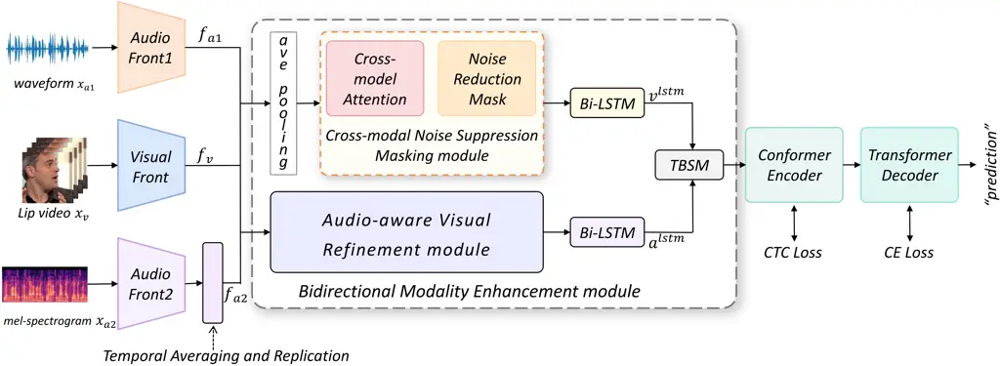
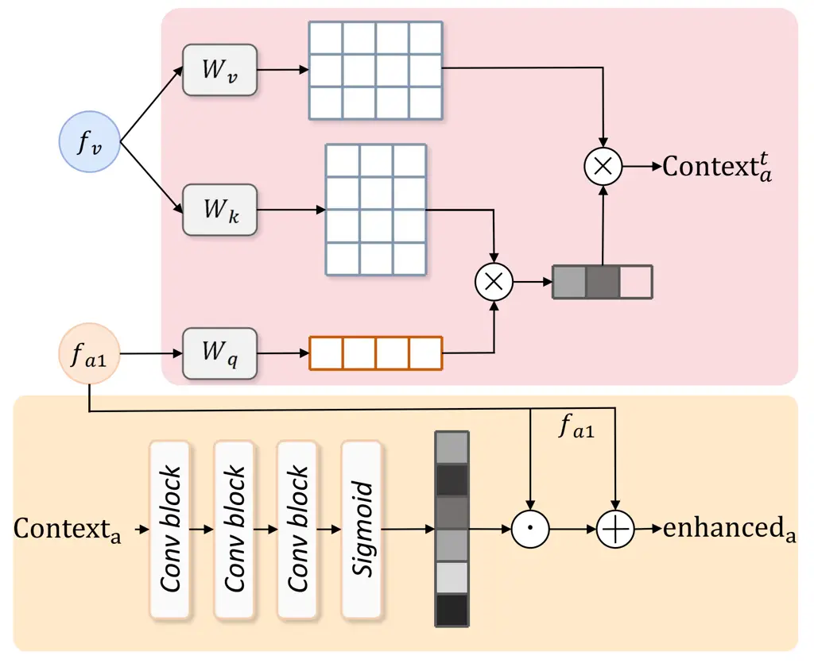
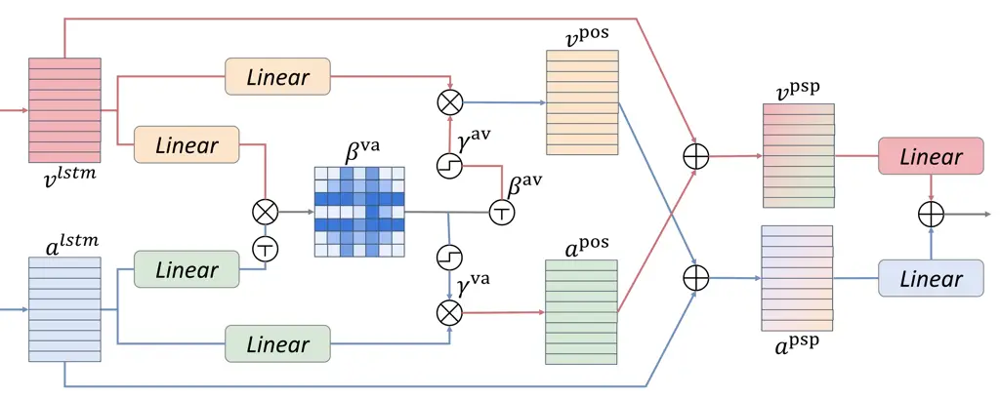
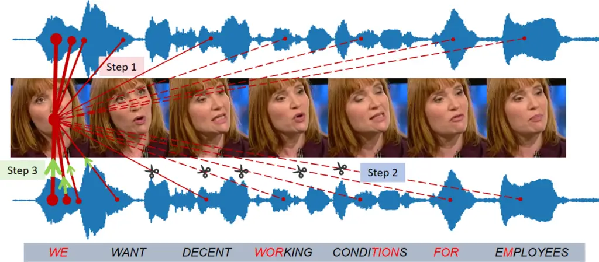
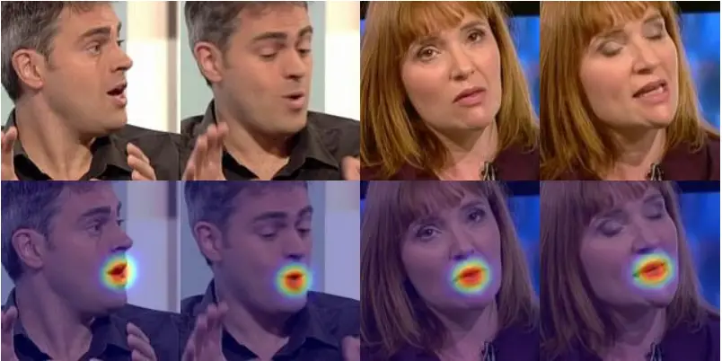

# AD-AVSR: Asymmetric Dual-stream Enhancement for Robust Audio-Visual Speech Recognition

DOI: [10.1145/3728425.3759905](https://doi.org/10.1145/3728425.3759905)Conference: the
1st Workshop & Challenge on Subtle Visual Computing, co-located with the
33rd ACM International Conference on Multimedia; October 27–31, 2025;
Dublin, IrelandPrice: 15.00ISBN: 979-8-4007-1837-3/2025/10CCS: Computing
methodologies Neural networksCCS: Information systems Multimedia
information systems

Junxiao Xue Affiliation: Zhengzhou University, Zhengzhou, China
Affiliation: Zhejiang Lab, Hangzhou, China email: <xuejx@zhejianglab.cn>
Note: Both authors contributed equally to this research. , Xiaozhen Liu
Affiliation: Zhengzhou University, Zhengzhou, China email:
<liuxiaozhen123@gs.zzu.edu.cn> Note: Corresponding author. , Xuecheng Wu
Affiliation: Xi’an Jiaotong University, Xi’an, China email:
<xuecwu@gmail.com> , Xinyi Yin Affiliation: Zhengzhou University,
Zhengzhou, China email: <yinxinyi@stu.zzu.edu.cn> , Danlei Huang
Affiliation: Xi’an Jiaotong University, Xi’an, China email:
<forsummer@stu.xjtu.edu.cn> and Fei Yu Affiliation: Zhejiang Lab,
Hangzhou, China email: <yufei@zhejianglab.com>

2025

###### Abstract.

Audio-visual speech recognition (AVSR) combines audio-visual modalities
to improve speech recognition, especially in noisy environments.
However, most existing methods deploy the unidirectional enhancement or
symmetric fusion manner, which limits their capability to capture
heterogeneous and complementary correlations of audio-visual
data—especially under asymmetric information conditions. To tackle these
gaps, we introduce a new AVSR framework termed AD-AVSR based on
bidirectional modality enhancement. Specifically, we first introduce the
audio dual-stream encoding strategy to enrich audio representations from
multiple perspectives and intentionally establish asymmetry to support
subsequent cross-modal interactions. The enhancement process involves
two key components, i.e., Audio-aware Visual Refinement Module for
enhanced visual representations under audio guidance, and Cross-modal
Noise Suppression Masking Module which refines audio representations
using visual cues, collaboratively leading to the closed-loop and
bidirectional information flow. To further enhance correlation
robustness, we adopt a threshold-based selection mechanism to filter out
irrelevant or weakly correlated audio-visual pairs. Extensive
experimental results on the LRS2 and LRS3 datasets indicate that our
AD-AVSR consistently surpasses SOTA methods in both performance and
noise robustness, highlighting the effectiveness of our model design.

###### Keywords: 

Audio-visual speech recognition, Cross-modal learning, Dual-stream
encoding

## 1. Introduction

Audio-Visual Speech Recognition (AVSR), which recovers the natural
language expressions from the audio-visual inputs, offers broad
applications (Sun et al., 2018; Burchi and Timofte, 2023; Ryumin et al.,
2024). By leveraging more information than video-only or audio-only
methods (Martinez et al., 2020; Kim et al., 2022), AVSR delivers
superior performance. However, naively fusing information from different
modalities and constructing a mapping from the combined features to
natural language often fails to achieve the desired "1+1\>2" effect.
This arises from two main reasons: First of all, the information from
different modalities is not symmetrical; a single frame of visual
information may correspond to multiple frames of audio information, and
vice versa. This asymmetry makes it challenging for existing strategies
like unidirectional enhancement (Hong et al., 2022; Xu et al., 2020; Kim
et al., 2024) or visually driven speech reconstruction (Yang et al.,
2022; Hsu et al., 2023) to robustly establish inter-modal connections.
Second, various real-world application scenarios suffer from
audio-visual asynchrony due to recording equipment and environmental
constraints, resulting in extensive irrelevant audio-visual pairs.
Existing AVSR methods (Ma et al., 2021; Hong et al., 2023; Hu et al., 2023) do not effectively filter out the irrelevant pairs.

To address the above challenges, we introduce a dual-stream network
designed for directional multi-modal asymmetric fusion. Our key idea
involves constructing asymmetric bidirectional enhancement and fusion,
which primarily consists of three stages. In the first stage, to enable
effective bidirectional cross-modal enhancement, we introduce an audio
dual-stream encoding strategy during initial preprocessing and feature
extraction. This strategy uses excessive audio when audio enhances video
and excessive video when video enhances audio, enabling the model to
better understand the relationships between modalities. The second stage
is the bidirectional enhancement module, where we introduce two
synergistic submodules. The first, the Audio-aware Visual Refinement
Module (AVRM), divides each video frame into multiple visual regions,
adaptively adjusting the weights of these regions based on audio
occurrences to accurately capture lip movement representations. The
second submodule is the Cross-modal Noise Suppression Masking Module
(CMNSM), which first merges visual and audio information using
traditional cross-modal attention. It then leverages visual information
to suppress redundant audio noise and assess the reliability scores at
each time step, forming a bidirectional interactive loop with the first
module.

Additionally, to address the interference caused by many irrelevant
audio-visual pairs due to asynchrony between audio and video, the third
stage introduces a threshold-based selection mechanism (TBSM) (Zhou
et al., 2021) to ensure that only positive audio-visual connections are
retained during fusion. This mechanism allows the network to utilize the
similarities between audio-visual pairs to learn more representative
features, filtering out negative and weaker similarities for more
efficient fusion.

Beyond the task of speech recognition, subtle lip movements also convey
fine-grained visual cues such as micro-expressions. Although weak visual
signals may have limited salience, they can significantly enhance the
model’s understanding of user intent in noisy or semantically ambiguous
scenarios, making them valuable for applications like deception
detection (Guo et al., 2023; Guo et al., 2024) and robust multimodal
learning (Hong et al., 2023). Our contributions can be summarized in
four key aspects:

- •
  We propose AD-AVSR, a method that leverages the complementary
  strengths of visual and audio modalities to enhance cross-modal
  fusion. It introduces an innovative audio dual-stream encoding
  strategy that enhances audio representations via joint time-frequency
  modeling, while explicitly establishing asymmetric interactions
  between modalities.
- •
  We propose a Bidirectional Modality Enhancement module to improve AVSR
  fusion, consisting of two parallel cross-modal components: the
  Audio-aware Visual Refinement module and the Cross-modal Noise
  Suppression Masking module.
- •
  We mitigate interference from irrelevant audio-visual pairs by
  introducing a threshold-based selection mechanism that improves fusion
  efficiency through pairwise similarity evaluation.
- •
  Our proposed AD-AVSR achieves state-of-the-art results on the LRS2 and
  LRS3 datasets, demonstrating its outstanding efficacy in the AVSR
  task.

## 2. Related Works

### 2.1. Audio Visual Speech Recognition

With the rapid development of deep learning, Automatic Speech
Recognition (ASR) systems have made great strides and found widespread
use in real-world applications (Ivanko et al., 2023; Karbasi and
Kolossa, 2022; Bhardwaj et al., 2022; Ma et al., 2024). However, relying
solely on audio can be limiting, especially when the signal is noisy or
missing (Sheng et al., 2024). To address this, Audio-Visual Speech
Recognition (AVSR), which integrates both audio and visual inputs, has
emerged as a key research focus (Ma et al., 2021; Hong et al., 2022;
Hong et al., 2023; Yu et al., 2024; Wang et al., 2025). Early AVSR
studies (Afouras et al., 2018b) typically extracted features from both
modalities, fused them at the feature level, and then applied sequence
modeling to the combined representation. For example, Chung et al.
(Son Chung et al., 2017) proposed a "Watch, Listen, Attend and Spell"
(WLAS) network and introduced a large-scale lip-reading sentence
dataset, LRS2. Ma et al. (Ma et al., 2021) proposed replacing
traditional recurrent networks with the Conformer architecture and
combining CTC and attention loss, which significantly improved
performance. Shi et al. (Shi et al., 2022) proposed AV-HuBERT, a
self-supervised framework that exploits the strong correlation between
audio and lip movements for audio-visual representation learning. Burchi
et al. (Burchi and Timofte, 2023) recently proposed using patch-wise
attention instead of component-wise attention, achieving similar
performance with reduced complexity. In recent years, Zhang et al.
(Zhang et al., 2024) explored AVSR inference under fully missing visual
input and introduced a visual generation model based on discrete
features. In the same year, Wang et al. (Wang et al., 2024c) proposed
AVLR, an audio-visual lip restoration framework that mitigates the
impact of lip occlusion by reconstructing the masked mouth regions.

Subsequently, many studies have explored enhancement strategies before
audio-visual feature fusion, which can be grouped into three types. The
first uses visual information to enhance audio features—for example,
V-CAFE (Hong et al., 2022) improves robustness by injecting visual cues
into audio, and Bo Xu et al. (Xu et al., 2020) separated speech from
noise using lip movements before fusion. The second leverages audio cues
to improve visual modeling, such as the cross-modal attention mechanism
in (Kim et al., 2024). The third focuses on visual-driven speech
modeling, including neural vocoder-based reconstruction (Yang et al., 2022) and the ReVISE model (Hsu et al., 2023), which enables speech
resynthesis from visual input. While effective, these methods still face
challenges in fully capturing the heterogeneity and complementarity of
modalities, especially under asymmetric or noisy conditions. To tackle
this, we propose a bidirectional modality enhancement
framework—AD-AVSR—which jointly optimizes structural and semantic fusion
for improved multimodal integration.

### 2.2. Cross-modal Enhancement and Fusion

To overcome the limitations of existing AVSR systems, recent studies
have focused on cross-modal enhancement mechanisms. For example, Hu et
al. (Hu et al., 2023) proposed the GILA framework, which models modality
complementarity through global interaction and captures frame-level
temporal consistency via local alignment. Other works, such as (Zhang
et al., 2022), employ Transformer-based cross-modal attention with
adaptive masking to achieve deep feature fusion. MLCA-AVSR (Wang et al.,
2024a) enables each modality to learn complementary context from the
other across feature hierarchies, enhancing representation learning.
CATNet (Wang et al., 2024b) introduces a dual-modality network to
extract key features and suppress noise, improving collaboration between
modalities. Hong et al. (Hong et al., 2023) proposed AV-RelScore, an
audio-visual reliability scoring module that evaluates the reliability
of each input modality prior to fusion. This enables robust speech
recognition even when one or both modalities are degraded. Fu et al. (Fu
et al., 2024) proposed PCD, the first work dedicated to enhancing the
robustness of AVSR under dual-modality distortion.

Related fields have also explored cross-modal enhancement and fusion.
Yang et al. (Yang et al., 2024) proposed a modality enhancement method
that exploits the complementarity between enhanced sonar features and
raw visual features to compensate for the limited image information in
acoustic-only scenarios. Pang et al. (Pang et al., 2022) introduced Weak
Semantic Augmentation (WSA), a novel text enhancement module for image
retrieval that enriches textual features using relevant visual
information to build a high-level semantic space. Inspired by these
approaches, we propose two cooperative modules: an Audio-aware Visual
Refinement Module and a Cross-modal Noise Suppression Masking Module,
which enhance cross-modal modeling and information selection in AVSR
systems.

## 3. Methodology



Figure 1. Overall architecture of the proposed AD-AVSR. TBSM refers to
the Threshold-based Selection Mechanism.

Let the preprocessed input data consist of a lip-reading video sequence
$`x_{v}\in\mathbb{R}^{T_{0}\times H_{0}\times W_{0}\times C_{0}}`$, the
waveform representation $`x_{a1}\in\mathbb{R}^{S^{\prime}}`$, the
log-Mel spectrogram derived from the corresponding audio signal
$`x_{a2}\in\mathbb{R}^{F\times S}`$, and the corresponding ground-truth
transcription $`y\in\mathbb{R}^{L}`$. Here, $`T_{0}`$ denotes the total
number of video frames, and $`H_{0}`$, $`W_{0}`$, and $`C_{0}`$
represent the height, width, and number of channels of each frame,
respectively. $`F`$ and $`S`$ refer to the number of frequency bins and
time steps in the spectrogram, while $`S^{\prime}`$ denotes the length
of the raw waveform. $`L`$ corresponds to the length of the transcribed
sentence. To enable effective bidirectional modality enhancement, we
adopt an audio dual-stream encoding strategy that captures both spectral
and temporal cues, enriching audio representations and introducing
intentional modality asymmetry. The encoded audio and visual features
are fed into a bidirectional cross-modal enhancement module. In the
visual-enhanced audio branch, the Cross-modal Noise Suppression Masking
Module (CMNSM) uses audio queries to attend to informative visual
features with a gating mechanism to suppress noise. In the
audio-enhanced visual branch, the Audio-aware Visual Refinement Module
(AVRM) partitions frames into k regions and uses visual queries to focus
on articulation-relevant areas, alleviating occlusion and sync issues
with low parameter cost. A Threshold-based Selection Mechanism (TBSM)
then prunes weakly correlated audio-visual pairs, ensuring strong
cross-modal consistency. These modules—CMNSM for audio-guided fusion,
AVRM for visual grounding, and TBSM for consistency refinement—produce
multimodal features for sequence modeling, followed by prediction via a
Transformer decoder. The overall AD-AVSR framework is shown in Figure 1.

### 3.1. Audio Dual-Stream Encoding

In traditional audio-visual speech recognition (AVSR) tasks, audio
information is typically modeled using a single-stream encoding
strategy. However, this method is not well-suited for our proposed
bidirectional modality enhancement framework, primarily for the
following reasons. The typical frame rate for video is 25 fps, while the
audio sampling rate is 16,000 Hz. This implies that in the raw input,
each video frame inherently contains more information than the
corresponding audio segment. Despite temporal dimension compression
through convolutional feature extraction later aligning audio with
visual modalities in terms of frame length and dimensional features,
this alignment does not meet our structural needs for information
density differences during the enhancement phase. Our objective is to
maintain a lower information density in the modality being enhanced and
a higher density in the enhancing modality during cross-modal
interactions, facilitating effective supplemental guidance. Therefore,
we employ two audio encoding strategies originating from the same
source.

The first method utilizes time-domain encoding, which converts the
original audio into a waveform followed by feature extraction via a 1D
CNN combined with ResNet18, as referenced in (Hong et al., 2023). This
process results in audio features denoted as
$`f_{a1}\in\mathbb{R}^{T_{1}\times C_{1}}`$, and visual features
$`f_{v}\in\mathbb{R}^{T_{1}\times C_{1}\times H_{1}\times W_{1}}`$. This
encoding strategy is primarily designed to use visual information to
guide audio enhancement, facilitating the capture of more granular
dynamic changes in each visual frame, thereby compensating for the
audio’s lack of short-term detail accuracy. The second encoding strategy
is frequency-domain encoding, intended to enhance visual information
with audio features. In this approach, the original audio is first
converted into a waveform, then transformed into a Mel spectrogram via
Short-Time Fourier Transform (STFT). After straightforward processing
through a 1D convolution, the dimensions of the audio output are
adjusted to align with the visual information. Furthermore, to ensure
that each frame’s audio information contains more visual data, every
adjacent set of 25 audio frames is summed, averaged, and this process is
repeated 25 times to enhance the visual relevance of the audio. The
final output audio features $`f_{a2}`$ also exhibit the shape
$`\mathbb{R}^{T1\times C1}`$.

### 3.2. Cross-modal Noise Suppression Masking Module

Audio signal recognition is not only influenced by its positional
information but also significantly by the linguistic context, which is a
critical factor in speech recognition tasks. Therefore, in audio-visual
speech recognition (AVSR) tasks, understanding the movements of the lips
before and after a given moment is beneficial for enhancing model
performance. Additionally, audio information is often disrupted by
environmental noise, which severely impacts the accuracy and robustness
of recognition. To address these challenges, we propose a Cross-Modal
Noise Suppression Masking Module (CMNSM). In this module, we employ a
cross-modal attention mechanism to integrate both local and global
movements of the lips along with visual background information to enrich
the audio signal representation. The masking suppression module further
mitigates the adverse effects of environmental noise on the audio
signals. As illustrated in Figure 2, the features of each modality—audio
features $`f_{a1}\in\mathbb{R}^{T_{1}\times C_{1}}`$ and visual features
$`f_{v}\in\mathbb{R}^{T_{1}\times C_{1}\times H_{1}\times W_{1}}`$—are
obtained through specific front-end embedding techniques. Subsequently,
our attention module captures the visual context at each time step $`t`$
through cross-modal attention, as described below:

```math
\text{Context}_{a}=\text{softmax}\left(\frac{Q^{t}\cdot K^{T}}{\sqrt{D_{1}}}\right)\cdot V, \tag{1}
```

```math
Q^{t}=f_{a1}^{t}\cdot W_{q},\quad K=f_{v}\cdot W_{k},\quad V=f_{v}\cdot W_{v}, \tag{2}
```

$`\text{Context}_{a}^{t}`$ represents the context representation of
audio features at time step $`t`$, extracted based on visual
information. $`Q`$, $`K`$, and $`V`$ denote the Query, Key, and Value
matrices in cross-modal attention, respectively. The embedding weights
for query, key, and value are
$`W_{q}\in\mathbb{R}^{C_{1}\times D_{1}}`$,
$`W_{k}\in\mathbb{R}^{C_{1}\times D_{1}}`$, and
$`W_{v}\in\mathbb{R}^{C_{1}\times D_{1}}`$. The Query matrices is
derived from audio information, while the Key and Value matrices are
obtained from visual information. After cross-modal attention, the audio
features contextualized by visual information are represented as
$`\text{Context}_{a}=\{\text{Context}_{a}^{1},\text{Context}_{a}^{2},\ldots,\text{Context}_{a}^{T_{1}}\}\in\mathbb{R}^{T_{1}\times D_{1}}`$.

The audio $`\text{Context}_{a}`$ is then processed further in the Noise
Suppression Masking Module, which incorporates a learnable mask
generator with two primary objectives: firstly, to suppress noise
components within the audio features through predicted masks, enhancing
the system’s robustness; secondly, the mask generator performs temporal
convolution modeling across the time dimension of the audio sequence.
The generated masks also serve as confidence scores for each timestep,
ranging from 0 to 1—where 0 indicates low reliability of the speech
modeling at that timestep, and 1 indicates complete reliability. This
mask generator consists of three convolutional layers, each employing
ReLU and Softmax activation functions. The detailed computational
process is described as follows:

```math
\displaystyle m_{0} \displaystyle=\text{ReLU}\Big(\text{BN}\Big(\text{Conv}(\text{Context}_{a})\Big)\Big), \tag{3}
```

```math
\displaystyle m \displaystyle=\text{Sigmoid}\Big(\text{BN}\Big(\text{Conv}\Big(\text{ReLU}\Big(\text{BN}\Big(\text{Conv}(m_{0})\Big)\Big)\Big)\Big)\Big). \tag{4}
```



Figure 2. Detailed architecture of cross-modal noise suppression masking
module.

Here, BN stands for Batch Normalization, a process used to standardize
the inputs to a network, promoting faster and more stable training. The
resulting confidence score mask $`m`$ also has a tensor dimension of
$`T_{1}\times D_{1}`$. In the subsequent experiments, the dimensions of
$`C_{1}`$ and $`D_{1}`$ are kept consistent to ensure uniformity and
effectiveness in feature processing.

The generated mask $`m`$ is multiplied with the input audio features
$`f_{a1}`$. With the aid of visual information, the noise components in
the audio are effectively suppressed, while the crucial speech
information remains largely unchanged. Subsequently, this processed
audio information is combined with the original audio features
$`f_{a1}`$, resulting in the enhanced audio output
$`\text{enhanced}_{a}\in\mathbb{R}^{T_{1}\times D_{1}}`$ . The
operational formula is illustrated in the following diagram:

```math
\text{enhanced}_{a}=(f_{a1}\odot m)+f_{a1}, \tag{5}
```

$`\odot`$ represents element-wise multiplication. It is used to combine
the audio feature $`f_{a1}`$ and the generated mask $`m`$. This
operation effectively suppresses noise components within the audio while
preserving valuable speech information. Subsequently, the enhanced audio
feature $`\hat{f}_{a}`$ is combined with the original audio feature
$`f_{a1}`$, resulting in the final enhanced audio information, denoted
as $`\text{enhanced}_{a}`$.

### 3.3. Audio-aware Visual Refinement Module

Firstly, the features for each modality—audio features
$`f_{a2}\in\mathbb{R}^{T_{1}\times C_{1}}`$ and visual features
$`f_{v}\in\mathbb{R}^{T_{1}\times C_{1}\times H_{1}\times W_{1}}`$—are
obtained through specific frontend processing. Audio features are
downsampled, averaged, and replicated to retain semantics and align with
the visual modality. Studies show that audio provides both content and
spatial cues (Gaver, 1993), and audio-visual synchrony aids sound
localization (Hershey and Movellan, 1999). Inspired by this, we propose
the Audio-aware Visual Refinement Module (AVRM), which leverages audio
to refine visual features, effectively mitigating occlusion and
synchronization issues with minimal parameter overhead.



Figure 3. An illustration of the threshold-based selection mechanism.

Given the exceptional performance of attention mechanisms (Vaswani
et al., 2017) in various application domains, such as image captioning,
we decided to utilize this mechanism for audio-assisted visual
enhancement. Each visual frame is initially divided into $`k`$ regions.
In this attention framework, the input audio $`f_{a2}`$ and visual
features $`f_{v}`$ are merged in the following manner:

```math
\text{Context}_{v}=W_{3}\sigma\left(W_{1}\cdot\text{flatten}_{H,W}(f_{v})+(W_{2}\cdot f_{a2})\mathbf{1}^{T}\right), \tag{6}
```

```math
w_{t}=\text{Softmax}(\text{Context}_{v}), \tag{7}
```

$`W_{1}\in\mathbb{R}^{k\times C_{1}}`$,
$`W_{2}\in\mathbb{R}^{k\times C_{1}}`$, and
$`W_{3}\in\mathbb{R}^{1\times k}`$ serve as linear dimension
transformation functions, where $`k`$ denotes the number of visual
regions. All entries in $`\mathbf{1}\in\mathbb{R}^{k}`$ are ones, used
to broadcast audio features during the fusion process. Additionally, the
operation $`\text{flatten}_{H,W}`$ compresses the spatial dimensions of
visual information into a single dimension, and $`\sigma(\cdot)`$ is the
hyperbolic tangent function, employed to process the merged features.
The computed attention weights $`w_{t}\in\mathbb{R}^{k}`$ allow the
model to focus on visual regions that are highly correlated with the
audio signal locations. $`w_{t}`$ is derived using the softmax
activation function. Subsequently, the attention function
$`f_{\text{att}}`$ is defined, which adaptively learns from the input
audio features $`f_{a2}`$ and visual features $`f_{v}`$, to produce
enhanced visual features
$`\text{enhanced}_{v}\in\mathbb{R}^{T_{1}\times D_{1}}`$.

```math
\text{enhanced}_{v_{t}}=f_{\text{att}}(f_{a2},f_{v})=\sum_{i=1}^{k}w_{t}^{i}{(f_{v})}_{t}^{i}. \tag{8}
```

At each time step $`t`$, the visual content vector
$`\text{enhanced}_{v_{t}}`$ is calculated. $`t`$ represents the $`t`$-th
time step, and $`i`$ indicates the $`i`$-th visual region. This method
of audio-guided visual region weighting fusion enhances the model’s
ability to perceive and focus on semantically relevant areas in complex
and visually corrupted scenarios.

### 3.4. Threshold-based Selection Mechanism

Threshold-based Selection Mechanism (TBSM) enables networks to learn
more representative features by leveraging the similarity between audio
and visual features. The TBSM structure is shown in Figure 3. Inspired
by methods described in (Zhou et al., 2021), TBSM involves three key
steps. Figure 4 visualizes the three steps of the TBSM.

The first step is all-pair connection construction. In AVSR tasks,
audio-visual pairs are interconnected on a frame-by-frame basis. As
described in the previous section, the enhanced audio features, denoted
as $`\text{enhanced}_{a}`$, and visual features, denoted as
$`\text{enhanced}_{v}`$, first undergo preliminary temporal modeling
using a bidirectional LSTM layer. This process produces
$`a^{\text{lstm}}\in\mathbb{R}^{T_{1}\times 2D_{1}}`$ and
$`v^{\text{lstm}}\in\mathbb{R}^{T_{1}\times 2D_{1}}`$, which are then
used to calculate the strength of the fully-connected pairs, detailed in
the subsequent formulas.

```math
\beta^{va}=\frac{(\mathbf{v}^{\text{lstm}}\mathbf{W}^{v}_{1})(\mathbf{a}^{\text{lstm}}\mathbf{W}^{a}_{1})^{T}}{\sqrt{2D_{1}}},\quad\beta^{av}=(\beta^{va})^{T}, \tag{9}
```

the parameters $`W_{1}^{v}`$ and $`W_{1}^{a}`$ represent learnable
parameters of the linear transformations, implemented by corresponding
linear layers. Here, $`2D_{1}`$ denotes the dimensionality of both
visual and audio features, and $`T`$ stands for the transpose operation.
The term $`\beta^{va}\in\mathbb{R}^{T_{1}\times T_{1}}`$ calculates the
connectivity strength of visual features to each audio feature.
Conversely, $`\beta^{av}\in\mathbb{R}^{T_{1}\times T_{1}}`$ computes the
connectivity strength of audio features to each visual feature,
reflecting the degree of mutual influence between modalities.



Figure 4. This figure illustrates the threshold-based selection
mechanism. In this example, only the first segment contains ‘WE’, with
three strong audio-related connections shown. Red lines represent
audio-visual pairings—solid for relevant pairs and dotted for irrelevant
ones. Line thickness indicates pairwise similarity. ‘WE’ shows negative
connections with the following words (‘WORKING CONDITIONS FOR
EMPLOYEES’), positive ones with preceding words (including ‘WANT’), and
a weak link to ‘DECENT’. ‘Step 1’ outlines the construction of all-pair
connections, ‘Step 2’ involves pruning negative and weak connections,
and ‘Step 3’ denotes feature aggregation.

The second step prunes weak and negative connections. Based on
similarity scores, connections are classified as positive, weak, or
negative—similar to the AVE classification in (Zhou et al., 2021). In
AVSR, strong links are formed between key lip movements and
corresponding phonemes. This step aims to retain positive connections
while removing those caused by noise or background. We apply ReLU to
activate audio-visual pairs, then use L1 normalization to obtain
similarity matrices $`\beta^{va}`$ and $`\beta^{av}`$. Finally, a
threshold is used to select strongly correlated pairs.

```math
\displaystyle\gamma^{va} \displaystyle=\beta^{va}\mathcal{I}(\beta^{va}-\tau), \tag{10}
```

```math
\displaystyle\gamma^{av} \displaystyle=\beta^{av}\mathcal{I}(\beta^{av}-\tau),
```

$`\tau`$ is a hyperparameter that controls how many connections are
pruned. The indicator function $`\mathcal{I}(\cdot)`$ returns 1 if the
input is $`\geq 0`$, and 0 otherwise. Audio-visual pairs with similarity
scores $`\geq\tau`$ are kept as strong connections, while others are
removed. After thresholding, a second L1 normalization is applied to
generate the refined similarity matrices $`\gamma^{va}`$ and
$`\gamma^{av}\in\mathbb{R}^{T_{1}\times T_{1}}`$.

The final step is feature aggregation. After the initial two stages, we
have identified audio (visual) frames that are highly correlated with
visual (audio) frames. Similar to the roles played by the AVRM and
CMNSM, this phase further enhances bidirectional cross-modal
complementarity, using visually correlated frames to augment audio
information, and vice versa. Utilizing the established similarity weight
matrices $`\gamma^{va}`$ and $`\gamma^{av}`$, the audio and visual
features are updated as follows:

```math
\displaystyle a^{\text{psp}} \displaystyle=\overbrace{\gamma^{\text{av}}\left(v^{\text{lstm}}W_{2}^{v}\right)}^{v^{\text{pos}}}+a^{\text{lstm}}, \tag{11}
```

```math
\displaystyle v^{\text{psp}} \displaystyle=\overbrace{\gamma^{\text{va}}\left(a^{\text{lstm}}W_{2}^{a}\right)}^{a^{\text{pos}}}+v^{\text{lstm}},
```

$`W_{2}^{v}\in\mathbb{R}^{2D_{1}\times 2D_{1}}`$ and
$`W_{2}^{a}\in\mathbb{R}^{2D_{1}\times 2D_{1}}`$ represent learnable
parameters of the linear transformations. The $`v^{\text{pos}}`$
captures visual frames that are highly correlated with the audio
signals. These visual features, when combined with audio features,
further enhance the audio representation, resulting in the audio feature
$`a^{\text{psp}}\in\mathbb{R}^{T_{1}\times 2D_{1}}`$, and similarly for
visual features $`v^{\text{psp}}`$. This approach enables the extraction
of more distinctive features. Subsequently, features from both
modalities are processed through individual linear layers before being
fused, ultimately yielding the fused feature
$`fusion\in\mathbb{R}^{T_{1}\times 2D_{1}}`$.

### 3.5. Loss Calculation

We train our AD-AVSR model end-to-end using CTC (Hannun et al., 2014)
loss, commonly adopted in AVSR. After a threshold-based selection, the
fused feature has dimension $`\mathbb{R}^{T\times 2D_{1}}`$, which is
reduced via two linear projections to
$`f_{0}\in\mathbb{R}^{T\times\frac{D_{1}}{2}}`$. Let
$`x=[x_{1},\ldots,x_{T}]`$ and $`y=[y_{1},\ldots,y_{L}]`$ denote the
input and target sequences. We use a 6-layer Conformer (Burchi and
Timofte, 2023), an enhanced Transformer (Vaswani et al., 2017) with
convolution to capture intra- and inter-modal temporal dependencies. The
output $`f_{1}\in\mathbb{R}^{T\times\frac{D_{1}}{2}}`$ is used to
compute the CTC loss:

```math
p_{c}(y|x)\approx\prod_{t=1}^{T}p(y_{t}|x).
```

CTC assumes conditional independence and enforces monotonic alignment,
making it well-suited for lip-reading tasks.

The sequence feature $`f_{1}`$ is fed into a six-layer Transformer
decoder, which further models the sequence and generates the
corresponding lip-reading text. During this process, we compute the
attention loss (Watanabe et al., 2017), defined as

```math
p_{a}(y|x)=\prod_{l=1}^{L}p(y_{l}|y_{<l},x).
```

This loss captures global context via KL divergence, producing more
accurate and coherent outputs than CTC. Following prior works (Ma
et al., 2021; Hong et al., 2022; Hong et al., 2023), we combine CTC and
attention losses using a weighted sum, formulated as:

```math
\mathcal{L}=\lambda\log p_{a}(y|x)+(1-\lambda)\log p_{c}(y|x), \tag{12}
```

$`\lambda`$ is the weight parameter balancing the two losses.

## 4. Experiments

### 4.1. Implementation Details

|             |                                 |       |     |      |      |      |      |       |     |     |      |      |      |
| ----------- | ------------------------------- | ----- | --- | ---- | ---- | ---- | ---- | ----- | --- | --- | ---- | ---- | ---- |
| Input Model | Method                          | LRS2  |     |      |      |      |      | LRS3  |     |     |      |      |      |
|             |                                 | clean | 10  | 5    | 0    | -5   | avg  | clean | 10  | 5   | 0    | -5   | avg  |
| A           | ASR (Ma et al., 2021)           | 4.9   | 7.4 | 8.7  | 10.2 | 29.1 | 12.1 | –     | –   | –   | –    | –    | –    |
| A           | AVEC (Burchi and Timofte, 2023) | 3.1   | 7.6 | 8.6  | 27.0 | 70.5 | 19.5 | 2.3   | 4.1 | 9.3 | 32.4 | 75.9 | 20.7 |
| A + V       | Conformer (Ma et al., 2021)     | 4.6   | 7.8 | 10.8 | 16.5 | 24.9 | 12.9 | 3.2   | 5.4 | 8.3 | 14.6 | 22.3 | 10.8 |
| A + V       | V-CAFE (Hong et al., 2022)      | 4.3   | 5.5 | 6.4  | 11.0 | 22.4 | 9.9  | 2.9   | 4.0 | 8.4 | 12.5 | 19.3 | 9.4  |
| A + V       | AV-Hubert (Shi et al., 2022)    | –     | –   | –    | –    | –    | –    | 2.0   | 2.1 | 2.6 | 5.8  | 16.6 | 5.8  |
| A + V       | AVEC (Burchi and Timofte, 2023) | 2.6   | 2.8 | 3.4  | 5.0  | 9.7  | 4.7  | 2.0   | 2.5 | 3.1 | 4.9  | 11.2 | 4.7  |
| A + V       | AV-Relscore (Hong et al., 2023) | 4.1   | 4.3 | 5.2  | 6.2  | 11.3 | 6.2  | 2.8   | 2.9 | 3.2 | 4.8  | 8.7  | 4.5  |
| A + V       | A+VH (Zhang et al., 2024)       | 2.6   | 3.1 | 3.9  | 7.1  | 12.6 | 5.9  | 2.2   | 2.2 | 3.4 | 6.4  | 14.3 | 5.7  |
| A + V       | AD-AVSR (ours)                  | 2.4   | 2.8 | 3.6  | 6.0  | 9.4  | 4.8  | 2.0   | 2.1 | 3.2 | 4.7  | 8.2  | 4.0  |

Table 1. Comparison with state-of-the-art methods on the LRS2 and LRS3
under different SNR conditions. ‘Clean’ means the test set contains no
added noise. ‘10’, ‘5’, ‘0’, and ‘-5’ denote SNR levels applied to the
test set. ‘Avg’ is the average WER (%) across these five conditions.

| Method                          | Occlusion |     |      |      |      |      | Noise |     |      |      |      |      |
| ------------------------------- | --------- | --- | ---- | ---- | ---- | ---- | ----- | --- | ---- | ---- | ---- | ---- |
|                                 | clean     | 10  | 5    | 0    | -5   | avg  | clean | 10  | 5    | 0    | -5   | avg  |
| Conformer (Ma et al., 2021)     | 4.9       | 8.0 | 10.8 | 16.6 | 25.1 | 13.1 | 4.8   | 7.8 | 10.7 | 16.8 | 25.7 | 13.2 |
| V-CAFE (Hong et al., 2022)      | 4.4       | 5.7 | 6.5  | 11.3 | 22.4 | 10.0 | 4.9   | 5.6 | 6.4  | 11.4 | 22.8 | 10.2 |
| AV-RelScore (Hong et al., 2023) | 4.2       | 4.4 | 5.2  | 6.4  | 11.3 | 6.3  | 4.5   | 4.3 | 5.1  | 6.4  | 11.2 | 6.3  |
| AD-AVSR (ours)                  | 2.5       | 3.0 | 3.7  | 6.2  | 9.5  | 5.0  | 2.8   | 3.2 | 3.7  | 6.3  | 9.5  | 5.1  |

Table 2. WER (%) comparisons with state-of-the-art methods under
audio-visual corrupted environments on LRS2. The first row represents
visual corruption types (patch occlusion and noise), and the second row
indicates audio noise levels (SNR in dB).

Dataset. Our method is evaluated on two widely used AVSR datasets:
LRS2 (Son Chung et al., 2017) and LRS3 (Afouras et al., 2018a). LRS2
contains 144,482 English utterances (224 hours) extracted from 482 BBC
videos, with around 1,000 clips for validation and 1,200 for testing.
LRS3 is a larger dataset with a total of 439 hours, including about
120,000 pre-training samples (408 hours), 32,000 for training/validation
(30 hours), and 1,321 for testing (0.9 hours).

Architecture Details. We follow the visual frontend from (Hong et al.,
2023), sampling visual features at 25Hz and audio at 16,000Hz. To fit
the AVRM design, we remove global average pooling and retain spatial
dimensions. For audio, we apply a dual-stream encoding strategy, both
derived from the same waveform. In the audio-enhanced visual branch, the
waveform is transformed into a mel-spectrogram via STFT and processed by
a 1D convolution. We then average every 25 frames and replicate the
result to enrich each audio frame. In the visual-enhanced audio branch,
we use the audio frontend from (Hong et al., 2023), allowing each visual
frame to guide audio enhancement effectively.

The bidirectional modality enhancement module is our main innovation. In
AVRM, the visual region parameter $`k`$ is set to 9. After AVRM and
CMNSM, a bidirectional LSTM layer performs initial temporal modeling.
The audio and visual features are then refined by the TBSM module, with
threshold $`\tau=0.095`$ as in (Zhou et al., 2021).

Audio and visual features are fused into a 1024-dimensional
representation, followed by a 6-layer Conformer encoder for CTC loss
computation. The output is then passed to a 6-layer Transformer decoder
(4 attention heads, hidden size 256) to generate predictions, where an
attention-based loss is also computed. The final loss is a weighted sum
of the CTC and attention losses, with $`\lambda=0.9`$.

Preprocessing. In preprocessing, we use dlib to detect 68 facial
landmarks and apply interpolation for missing frames. Faces are aligned
via affine transformation to reduce rotation and scale variations.
Visual data is augmented with random cropping ($`112\times 112`$), and
later resized to $`96\times 96`$ with horizontal flipping (p = 0.5).
Pixels are normalized to $`[0,1]`$ and standardized (mean = 0.421, std =
0.165). For audio, random noise with SNR $`\in{-5,0,5,10,15}`$ is added
during training, and waveforms are normalized. We further apply
SpecAugment (Time Masking) and Cutout to introduce temporal and spatial
perturbations. All augmentations are disabled during evaluation, where
only normalization is applied.

Training. We adopt a curriculum learning strategy (Zhou et al., 2021).
We use the Adam optimizer (Kingma and Ba, 2014) with the Noam learning
rate scheduler, which includes a warm-up phase and scales the learning
rate based on the model dimension. All experiments are conducted on four
NVIDIA RTX 3090 GPUs, with each experiment on the LRS2 dataset taking
approximately eight days to train.

### 4.2. Performance Comparison and Noise Robustness Evaluation

We first compare the proposed AVSR audio-visual enhancement framework
with state-of-the-art methods, including AV-Hubert (Shi et al., 2022),
AV-RelScore (Hong et al., 2023) and A+VH (Zhang et al., 2024), on the
LRS2 and LRS3 datasets. To evaluate model robustness, we further conduct
audio corruption modeling on both datasets, where the signal-to-noise
ratio (SNR) ranges from -5 to 10 dB, along with a clean audio condition.
The comparison results on both datasets are presented in Table 1. Under
clean audio conditions, our method achieves the best performance on both
datasets. Moreover, in scenarios with varying levels of audio noise, the
proposed method consistently performs well in most cases, demonstrating
strong robustness to audio interference.

In addition to adding different levels of SNR, we also followed the
settings in (Hong et al., 2023) to introduce occlusion and noise to the
visual frames. Moreover, we conducted additional robustness experiments
on the LRS2 dataset with simultaneous audio-visual corruption. As shown
in Table 2, our proposed AD-AVSR still demonstrates strong robustness.

| Method                          | Params (10⁶)   | FLOPs (10⁹)   | Total Hours (h) | WER (%)       | CER (%)      |
| ------------------------------- | -------------- | ------------- | --------------- | ------------- | ------------ |
| baseline                        | 74.05          | 86.86         | 192.0           | 24.9          | 13.6         |
| $`\rightarrow`$ +AVRM           | 74.59 (+0.7%)  | 87.48 (+0.7%) | 193.4 (+0.7%)   | 20.2 (↓18.9%) | 12.4 (↓8.8%) |
| $`\rightarrow`$ +CMNSM          | 76.42 (+3.2%)  | 87.85 (+1.1%) | 194.2 (+1.1%)   | 19.3 (↓22.5%) | 9.5 (↓30.1%) |
| $`\rightarrow`$ +TBSM (AD-AVSR) | 90.07 (+31.6%) | 88.83 (+2.3%) | 196.4 (+2.3%)   | 9.4 (↓62.2%)  | 4.9 (↓64.0%) |

Table 3. Parameters, FLOPs, Total Training Time, Word Error Rate (WER),
and Character Error Rate (CER) of AD-AVSR on the LRS2 and baseline at
SNR = -5. ’→’ denotes sequential addition, and values in parentheses
indicate the relative increase or decrease compared to the baseline.

| baseline | AVRM | CMNSM | TBSM | WER (%) | CER (%) |
| -------- | ---- | ----- | ---- | ------- | ------- |
| ✓        | ✗    | ✗     | ✗    | 24.9    | 13.6    |
| ✓        | ✓    | ✗     | ✗    | 20.2    | 12.4    |
| ✓        | ✗    | ✓     | ✗    | 22.4    | 12.8    |
| ✓        | ✗    | ✗     | ✓    | 16.3    | 8.0     |
| ✓        | ✓    | ✓     | ✗    | 19.3    | 9.5     |
| ✓        | ✓    | ✓     | ✓    | 9.4     | 4.9     |

Table 4. Ablation study on the effectiveness of AVRM, CMNSM, and TBSM
modules on the LRS2. WER and CER stand for Word Error Rate and Character
Error Rate, respectively.



Figure 5. Qualitative visualization of the Audio-aware Visual Refinement
Module, which adaptively focuses on the lip region based on audio
articulation to enhance detection of lip movement variations.

### 4.3. Ablation Study

We conducted an ablation study on LRS2 under noisy conditions (SNR = -5
dB) to evaluate different model variants.

Starting from a baseline network without any enhancement components, we
incrementally added CMNSM, AVRM, TBSM, and their combination, leading to
a consistent reduction in word error rate (WER) from 24.9% to 9.4%, as
shown in Table 4. While our proposed AD-AVSR model increases the number
of parameters from 74.05M to 90.07M, it maintains comparable FLOPs
(+2.3%) and training time in Table 3. Despite the moderate increase in
model complexity, AD-AVSR achieves substantial performance gains under
severe noise conditions (SNR = -5), reducing WER by 62.2% (from 24.9% to
9.4%) and character error rate (CER) by 64.0% (from 13.6% to 4.9%).
These results highlight that the added complexity is well-justified by
the significant improvements, demonstrating the effectiveness of the
proposed bidirectional modality enhancement in leveraging complementary
cross-modal information.

For the audio-to-visual modeling branch, the AVRM module also adopts a
cross-modal attention mechanism. It divides each video frame into $`k`$
spatial regions and adaptively learns which regions correspond to the
relevant sound activities. The qualitative visualization of the module
is presented in Figure 5, with an increased focus on the primary
articulatory part (the lips) in the visual representation. According to
the results in Table 4, AVRM achieves a lower word error rate compared
to using CMNSM. Audio often contains finer details than visuals, so
using it to enhance visual features improves performance. AVRM preserves
the spatial information from the visual frontend, and combining spatial
and temporal cues makes audio-enhanced visual modeling more effective.

| Audio encoding method | A1   | A2   | A3   |
| --------------------- | ---- | ---- | ---- |
| WER                   | 3.63 | 4.04 | 2.41 |
| CER                   | 1.82 | 2.36 | 1.43 |

Table 5. Comparison of different audio encoding methods on LRS2. A1:
time-domain encoding (1D-CNN + ResNet18); A2: frequency-domain encoding
(mel-spectrogram + 1D-CNN with frame averaging and repeating); A3: our
proposed dual-stream encoding combining A1 and A2.

### 4.4. Effects of Dual-Stream Audio Encoding

After processing through their respective frontends, the two modalities
are aligned with the same number of frames.

However, simple alignment strategy is not compatible with our
bidirectional enhancement design. In practice, visual and audio
modalities are frequently misaligned. To address this, the enhancing
modality is designed to carry more information per frame, enabling more
effective compensation for the other modality. Accordingly, we
experimented with two audio encoding strategies, as shown in Table 5. A3
achieves the best, showing that using a richer enhancing modality (audio
or visual) and a lighter enhanced modality (visual or audio) improves
fusion. A1 is a time-domain encoding scheme that processes audio
waveforms using a 1D-CNN followed by ResNet18. A2 is a frequency-domain
scheme that converts audio into mel-spectrograms via STFT and applies a
1D convolution. To ensure each audio frame carries more information than
its visual counterpart, audio features are averaged over 25 frames and
repeated 25 times. A1 and A2 are each used in both CMNSM and AVRM during
ablation, but in A3, they are used separately for different modules. A3
is our proposed dual-stream encoding scheme that combines A1 and A2,
where A1 feeds CMNSM (visual-enhanced audio branch) and A2 feeds AVRM
(audio-enhanced visual branch).

A1’s time-domain features provide fine-grained visual dynamics per
frame, helping to compensate for short-term gaps in the audio signal. In
contrast, A2’s frequency-domain features offer structured semantic cues,
helping the visual modality focus on speech-related regions. This
asymmetric enhancement strategy overcomes the limits of symmetric
fusion, allowing each frame to extract richer information from the
complementary modality and improving overall cross-modal modeling.

## 5. Conclusion and Discussions

This paper presents AD-AVSR, which significantly boosts AVSR performance
by fully leveraging the complementary strengths of visual and audio
modalities. It introduces a dual-stream audio encoding strategy to
optimize cross-modal enhancement. We further propose a bidirectional
enhancement module—AVRM and CMNSM—to better capture lip movements and
suppress audio noise. To address irrelevant audio-visual pairings, we
introduce a threshold-based selection mechanism that significantly
improves fusion efficiency. Extensive comparative experiments, ablation
studies, and visualizations validate the effectiveness of AD-AVSR.

This work considers audio-visual asynchrony and examines the impact of
audio noise on our model. To address audio-visual misalignment, we
introduce a dual-stream audio encoding strategy during the encoding
stage, providing richer information to the enhancing modality. While
straightforward, this approach proves effective, and future work can
explore alternative solutions. We also aim to focus more on various
modality degradation scenarios to further enhance recognition
performance and model robustness.

## References

- Afouras et al. (2018b) Triantafyllos Afouras, Joon Son Chung, Andrew
  Senior, Oriol Vinyals, and Andrew Zisserman. 2018b. Deep audio-visual
  speech recognition. _IEEE transactions on pattern analysis and machine
  intelligence_ 44, 12 (2018), 8717–8727.
- Afouras et al. (2018a) Triantafyllos Afouras, Joon Son Chung, and
  Andrew Zisserman. 2018a. LRS3-TED: a large-scale dataset for visual
  speech recognition. _arXiv preprint arXiv:1809.00496_ (2018).
- Alayrac et al. (2022) Jean-Baptiste Alayrac, Jeff Donahue, Pauline
  Luc, Antoine Miech, Iain Barr, Yana Hasson, Karel Lenc, Arthur Mensch,
  Katherine Millican, Malcolm Reynolds, et al. 2022. Flamingo: a visual
  language model for few-shot learning. _Advances in neural information
  processing systems_ 35 (2022), 23716–23736.
- Bengio et al. (2009) Yoshua Bengio, Jérôme Louradour, Ronan Collobert,
  and Jason Weston. 2009. Curriculum learning. In _Proceedings of the
  26th annual international conference on machine learning_. 41–48.
- Bhardwaj et al. (2022) Vivek Bhardwaj, Mohamed Tahar Ben Othman, Vinay
  Kukreja, Youcef Belkhier, Mohit Bajaj, B Srikanth Goud, Ateeq Ur
  Rehman, Muhammad Shafiq, and Habib Hamam. 2022. Automatic speech
  recognition (asr) systems for children: A systematic literature
  review. _Applied Sciences_ 12, 9 (2022), 4419.
- Burchi and Timofte (2023) Maxime Burchi and Radu Timofte. 2023.
  Audio-visual efficient conformer for robust speech recognition. In
  _Proceedings of the IEEE/CVF winter conference on applications of
  computer vision_. 2258–2267.
- Fu et al. (2024) Dongjie Fu, Xize Cheng, Xiaoda Yang, Wang Hanting,
  Zhou Zhao, and Tao Jin. 2024. Boosting Speech Recognition Robustness
  to Modality-Distortion with Contrast-Augmented Prompts. In
  _Proceedings of the 32nd ACM International Conference on Multimedia_.
  3838–3847.
- Gaver (1993) William W Gaver. 1993. What in the world do we hear?: An
  ecological approach to auditory event perception. _Ecological
  psychology_ 5, 1 (1993), 1–29.
- Guo et al. (2023) Xiaobao Guo, Nithish Muthuchamy Selvaraj, Zitong Yu,
  Adams Wai-Kin Kong, Bingquan Shen, and Alex Kot. 2023. Audio-visual
  deception detection: Dolos dataset and parameter-efficient crossmodal
  learning. In _Proceedings of the IEEE/CVF International Conference on
  Computer Vision_. 22135–22145.
- Guo et al. (2024) Xiaobao Guo, Zitong Yu, Nithish Muthuchamy Selvaraj,
  Bingquan Shen, Adams Wai-Kin Kong, and Alex C Kot. 2024. Benchmarking
  Cross-Domain Audio-Visual Deception Detection. _arXiv preprint
  arXiv:2405.06995_ (2024).
- Hannun et al. (2014) Awni Hannun, Carl Case, Jared Casper, Bryan
  Catanzaro, Greg Diamos, Erich Elsen, Ryan Prenger, Sanjeev Satheesh,
  Shubho Sengupta, Adam Coates, et al. 2014. Deep speech: Scaling up
  end-to-end speech recognition. _arXiv preprint arXiv:1412.5567_
  (2014).
- Hershey and Movellan (1999) John Hershey and Javier Movellan. 1999.
  Audio vision: Using audio-visual synchrony to locate sounds. _Advances
  in neural information processing systems_ 12 (1999).
- Hong et al. (2023) Joanna Hong, Minsu Kim, Jeongsoo Choi, and Yong Man
  Ro. 2023. Watch or listen: Robust audio-visual speech recognition with
  visual corruption modeling and reliability scoring. In _Proceedings of
  the IEEE/CVF Conference on Computer Vision and Pattern Recognition_.
  18783–18794.
- Hong et al. (2022) Joanna Hong, Minsu Kim, Daehun Yoo, and Yong Man
  Ro. 2022. Visual context-driven audio feature enhancement for robust
  end-to-end audio-visual speech recognition. _arXiv preprint
  arXiv:2207.06020_ (2022).
- Hsu et al. (2023) Wei-Ning Hsu, Tal Remez, Bowen Shi, Jacob Donley,
  and Yossi Adi. 2023. Revise: Self-supervised speech resynthesis with
  visual input for universal and generalized speech regeneration. In
  _Proceedings of the IEEE/CVF Conference on Computer Vision and Pattern
  Recognition_. 18795–18805.
- Hu et al. (2023) Yuchen Hu, Ruizhe Li, Chen Chen, Heqing Zou, Qiushi
  Zhu, and Eng Siong Chng. 2023. Cross-modal global interaction and
  local alignment for audio-visual speech recognition. _arXiv preprint
  arXiv:2305.09212_ (2023).
- Ivanko et al. (2023) Denis Ivanko, Dmitry Ryumin, and Alexey
  Karpov. 2023. A review of recent advances on deep learning methods for
  audio-visual speech recognition. _Mathematics_ 11, 12 (2023), 2665.
- Karbasi and Kolossa (2022) Mahdie Karbasi and Dorothea Kolossa. 2022.
  ASR-based speech intelligibility prediction: A review. _Hearing
  Research_ 426 (2022), 108606.
- Kim et al. (2022) Minsu Kim, Jeong Hun Yeo, and Yong Man Ro. 2022.
  Distinguishing homophenes using multi-head visual-audio memory for lip
  reading. In _Proceedings of the AAAI conference on artificial
  intelligence_, Vol. 36. 1174–1182.
- Kim et al. (2024) Sungnyun Kim, Kangwook Jang, Sangmin Bae, Hoirin
  Kim, and Se-Young Yun. 2024. Learning video temporal dynamics with
  cross-modal attention for robust audio-visual speech recognition. In
  _2024 IEEE Spoken Language Technology Workshop (SLT)_. IEEE, 447–454.
- Kingma and Ba (2014) Diederik P Kingma and Jimmy Ba. 2014. Adam: A
  method for stochastic optimization. _arXiv preprint arXiv:1412.6980_
  (2014).
- Ma et al. (2024) Pengfei Ma, Wenyu Liao, Ying Zhuo, Hongyan Ma,
  Yanping Zhu, and Genda Chen. 2024. Characterization of alkali-silica
  reaction (ASR) products and CSH using SWIR spectroscopy for
  nondestructive detection of ASR. _Construction and Building Materials_
  416 (2024), 135207.
- Ma et al. (2021) Pingchuan Ma, Stavros Petridis, and Maja
  Pantic. 2021. End-to-end audio-visual speech recognition with
  conformers. In _ICASSP 2021-2021 IEEE International Conference on
  Acoustics, Speech and Signal Processing (ICASSP)_. IEEE, 7613–7617.
- Martinez et al. (2020) Brais Martinez, Pingchuan Ma, Stavros Petridis,
  and Maja Pantic. 2020. Lipreading using temporal convolutional
  networks. In _ICASSP 2020-2020 IEEE International Conference on
  Acoustics, Speech and Signal Processing (ICASSP)_. IEEE, 6319–6323.
- Pang et al. (2022) Huaxin Pang, Shikui Wei, Gangjian Zhang, Shiyin
  Zhang, Shuang Qiu, and Yao Zhao. 2022. Heterogeneous feature alignment
  and fusion in cross-modal augmented space for composed image
  retrieval. _IEEE Transactions on Multimedia_ 25 (2022), 6446–6457.
- Park et al. (2019) Daniel S Park, William Chan, Yu Zhang, Chung-Cheng
  Chiu, Barret Zoph, Ekin D Cubuk, and Quoc V Le. 2019. Specaugment: A
  simple data augmentation method for automatic speech recognition.
  _arXiv preprint arXiv:1904.08779_ (2019).
- Rouditchenko et al. (2024) Andrew Rouditchenko, Yuan Gong, Samuel
  Thomas, Leonid Karlinsky, Hilde Kuehne, Rogerio Feris, and James
  Glass. 2024. Whisper-flamingo: Integrating visual features into
  whisper for audio-visual speech recognition and translation. _arXiv
  preprint arXiv:2406.10082_ (2024).
- Russakovsky et al. (2015) Olga Russakovsky, Jia Deng, Hao Su, Jonathan
  Krause, Sanjeev Satheesh, Sean Ma, Zhiheng Huang, Andrej Karpathy,
  Aditya Khosla, Michael Bernstein, et al. 2015. Imagenet large scale
  visual recognition challenge. _International journal of computer
  vision_ 115 (2015), 211–252.
- Ryumin et al. (2024) Dmitry Ryumin, Alexandr Axyonov, Elena Ryumina,
  Denis Ivanko, Alexey Kashevnik, and Alexey Karpov. 2024. Audio–visual
  speech recognition based on regulated transformer and spatio–temporal
  fusion strategy for driver assistive systems. _Expert Systems with
  Applications_ 252 (2024), 124159.
- Sheng et al. (2024) Changchong Sheng, Gangyao Kuang, Liang Bai,
  Chenping Hou, Yulan Guo, Xin Xu, Matti Pietikäinen, and Li Liu. 2024.
  Deep learning for visual speech analysis: A survey. _IEEE Transactions
  on Pattern Analysis and Machine Intelligence_ (2024).
- Shi et al. (2022) Bowen Shi, Wei-Ning Hsu, and Abdelrahman
  Mohamed. 2022. Robust self-supervised audio-visual speech recognition.
  _arXiv preprint arXiv:2201.01763_ (2022).
- Son Chung et al. (2017) Joon Son Chung, Andrew Senior, Oriol Vinyals,
  and Andrew Zisserman. 2017. Lip reading sentences in the wild. In
  _Proceedings of the IEEE conference on computer vision and pattern
  recognition_. 6447–6456.
- Sun et al. (2018) Ke Sun, Chun Yu, Weinan Shi, et al. 2018.
  Lip-interact: Improving mobile device interaction with silent speech
  commands. In _Proceedings of the 31st Annual ACM Symposium on User
  Interface Software and Technology_. 581–593.
- Szegedy et al. (2015) Christian Szegedy, Wei Liu, Yangqing Jia, Pierre
  Sermanet, Scott Reed, Dragomir Anguelov, Dumitru Erhan, Vincent
  Vanhoucke, and Andrew Rabinovich. 2015. Going deeper with
  convolutions. In _Proceedings of the IEEE conference on computer
  vision and pattern recognition_. 1–9.
- Vaswani et al. (2017) Ashish Vaswani, Noam Shazeer, Niki Parmar, Jakob
  Uszkoreit, Llion Jones, Aidan N Gomez, Łukasz Kaiser, and Illia
  Polosukhin. 2017. Attention is all you need. _Advances in neural
  information processing systems_ 30 (2017).
- Wang et al. (2024a) He Wang, Pengcheng Guo, Pan Zhou, and Lei Xie.
  2024a. Mlca-avsr: Multi-layer cross attention fusion based
  audio-visual speech recognition. In _ICASSP 2024-2024 IEEE
  International Conference on Acoustics, Speech and Signal Processing
  (ICASSP)_. IEEE, 8150–8154.
- Wang et al. (2024c) Jiadong Wang, Zexu Pan, Malu Zhang, Robby T Tan,
  and Haizhou Li. 2024c. Restoring speaking lips from occlusion for
  audio-visual speech recognition. In _Proceedings of the AAAI
  conference on artificial intelligence_, Vol. 38. 19144–19152.
- Wang et al. (2024d) Jiadong Wang, Xinyuan Qian, and Haizhou Li. 2024d.
  Predict-and-update network: Audio-visual speech recognition inspired
  by human speech perception. _IEEE/ACM Transactions on Audio, Speech,
  and Language Processing_ (2024).
- Wang et al. (2025) Xinyu Wang, Haotian Jiang, Haolin Huang, Yu Fang,
  Mengjie Xu, and Qian Wang. 2025. DCIM-AVSR: Efficient Audio-Visual
  Speech Recognition via Dual Conformer Interaction Module. In _ICASSP
  2025-2025 IEEE International Conference on Acoustics, Speech and
  Signal Processing (ICASSP)_. IEEE, 1–5.
- Wang et al. (2024b) Xingmei Wang, Jiachen Mi, Boquan Li, Yixu Zhao,
  and Jiaxiang Meng. 2024b. CATNet: Cross-modal fusion for audio–visual
  speech recognition. _Pattern Recognition Letters_ 178 (2024), 216–222.
- Watanabe et al. (2017) Shinji Watanabe, Takaaki Hori, Suyoun Kim,
  John R Hershey, and Tomoki Hayashi. 2017. Hybrid CTC/attention
  architecture for end-to-end speech recognition. _IEEE Journal of
  Selected Topics in Signal Processing_ 11, 8 (2017), 1240–1253.
- Xu et al. (2020) Bo Xu, Cheng Lu, Yandong Guo, and Jacob Wang. 2020.
  Discriminative multi-modality speech recognition. In _Proceedings of
  the IEEE/CVF conference on Computer Vision and Pattern Recognition_.
  14433–14442.
- Yang et al. (2022) Karren Yang, Dejan Marković, Steven Krenn, Vasu
  Agrawal, and Alexander Richard. 2022. Audio-visual speech codecs:
  Rethinking audio-visual speech enhancement by re-synthesis. In
  _Proceedings of the IEEE/CVF Conference on Computer Vision and Pattern
  Recognition_. 8227–8237.
- Yang et al. (2024) Shih-Wei Yang, Li-Hsiang Shen, Hong-Han Shuai, and
  Kai-Ten Feng. 2024. CMAF: Cross-Modal Augmentation via Fusion for
  Underwater Acoustic Image Recognition. _ACM Transactions on Multimedia
  Computing, Communications and Applications_ 20, 5 (2024), 1–25.
- Yu et al. (2024) Fan Yu, Haoxu Wang, Ziyang Ma, and Shiliang
  Zhang. 2024. Hourglass-avsr: Down-up sampling-based computational
  efficiency model for audio-visual speech recognition. In _ICASSP
  2024-2024 IEEE International Conference on Acoustics, Speech and
  Signal Processing (ICASSP)_. IEEE, 7940–7944.
- Zhang et al. (2024) Fang Zhang, Yongxin Zhu, Xiangxiang Wang, Huang
  Chen, Xing Sun, and Linli Xu. 2024. Visual hallucination elevates
  speech recognition. In _Proceedings of the AAAI Conference on
  Artificial Intelligence_, Vol. 38. 19542–19550.
- Zhang et al. (2022) Zi-Qiang Zhang, Jie Zhang, Jian-Shu Zhang,
  Ming-Hui Wu, Xin Fang, and Li-Rong Dai. 2022. Learning contextually
  fused audio-visual representations for audio-visual speech
  recognition. In _2022 IEEE International Conference on Image
  Processing (ICIP)_. IEEE, 1346–1350.
- Zhou et al. (2021) Jinxing Zhou, Liang Zheng, Yiran Zhong, Shijie Hao,
  and Meng Wang. 2021. Positive sample propagation along the
  audio-visual event line. In _Proceedings of the IEEE/CVF conference on
  computer vision and pattern recognition_. 8436–8444.
