# Audio-Visual Speech Enhancement: Architectural Design and Deployment Strategies

Anis Hamadouche    Haifeng Luo    Mathini Sellathurai    Amir Hussain  
and  Tharm Ratnarajah ^(†)^(†)thanks: Work supported by the UK
Engineering and Physical Sciences Research Council (EPSRC) Grant No.
EP/T021063/1. Anis Hamadouche and Mathini Sellathurai are with the
School of Engineering & Physical Sciences, Heriot-Watt University,
Edinburgh EH14 4AS, UK (e-mail:
{anis.hamadouche,m.sellathurai}@hw.ac.uk). Tharmalingam Ratnarajah is
with the College of Engineering Department of Electrical and Computer
Engineering, San Diego State University, USA (e-mail:
tratnarajah@sdsu.edu). Amir Hussain is with SDAIA-KFUPM Joint Research
Centre for Artificial Intelligence, King Fahd University of Petroleum
and Minerals, Dhahran, Saudi Arabia (e-mail: amir.hussain@kfupm.edu.sa).

###### Abstract

Real-time audio-visual speech enhancement (AVSE) is a key enabler for
immersive and interactive multimedia services, yet its performance is
tightly constrained by network latency, uplink capacity, and
computational delay. This paper presents the design, deployment, and
evaluation of a complete cloud–edge–assisted AVSE system operating over
a public 5G edge network. The system integrates CNN-based acoustic
enhancement and OpenCV-based facial feature extraction with an LSTM
fusion network to preserve temporal coherence, and is deployed on a
Vodafone-compatible AWS Wavelength edge cloud. Through extensive stress
testing, we analyze end-to-end performance under varying network load
and adaptive multimedia profiles. Results show that compute placement at
the network edge is critical for meeting real-time coherence
constraints, and that uplink capacity is often the dominant bottleneck
for interactive AVSE services. Only 5G and wired Ethernet consistently
satisfied the required communication delay bound for uncompressed
audio-video chunks, while aggressive compression reduced payload sizes
by up to 80× with negligible perceptual degradation, enabling robust
operation under constrained conditions. We further demonstrate a
fundamental trade-off between processing latency and enhancement
quality, where reduced model complexity lowers delay but degrades
reconstruction performance in low-SNR scenarios. Our findings indicate
that public 5G edge environments can sustain real-time, interactive AVSE
workloads when network and compute resources are carefully orchestrated,
although performance margins remain tighter than in dedicated
infrastructures. The architectural insights derived from this study
provide practical guidelines for the design of delay-sensitive
multimedia and perceptual enhancement services on emerging 5G edge-cloud
platforms.

###### Index Terms: 

Audio-Visual Speech Enhancement, 5G Networks, Cloud Computing, Deep
Learning, CNN-LSTM Fusion, Real-Time Processing, Wireless Communication,
Multimodal Signal Processing

## I Introduction

Speech signals captured in real-world environments are often severely
degraded by background noise, reverberation, and competing speakers,
leading to reduced intelligibility and perceived quality. Traditional
audio-only speech enhancement techniques struggle to recover clean
speech in low signal-to-noise ratio (SNR) settings or with overlapping
talkers, because audio cues alone provide limited information under such
conditions. In contrast, humans naturally exploit visual cues—such as
lip movements and facial articulations—to disambiguate speech in noise,
demonstrating that visual information is robust to acoustic masking and
can significantly improve speech understanding in adverse environments.
Audio-visual speech enhancement (AVSE) systems leverage this multimodal
insight by fusing acoustic and visual features through deep neural
networks, often outperforming audio-only approaches in low-SNR or
multi-speaker scenarios.

Despite these advances in multimodal modeling, deploying AVSE in
real-time applications introduces a distinct set of system-level
challenges. Wearable and mobile devices—such as hearing aids, smart
glasses, or assistive communication tools—must operate under strict
latency, power, and connectivity constraints while processing continuous
streams of synchronized audio and video. Offloading compute-intensive
deep-learning inference to remote servers emerges as a viable solution
for resource-limited devices, but this exposes the system to network
latency, jitter, and variable throughput that can degrade performance or
violate temporal coherence requirements.

The advent of 5G and edge cloud computing offers a promising platform
for addressing these challenges. Multi-access edge computing (MEC)
brings cloud capabilities closer to end users by deploying compute
resources at or near the radio access network (RAN), thereby reducing
data transport delay and backbone congestion. Standards bodies such as
ETSI define MEC as an environment where applications can run at the edge
of 4G/5G networks with ultra-low latency and high bandwidth \[4\]. Edge
cloud platforms like AWS Wavelength embed cloud infrastructure within
telecommunications networks, enabling low-latency access to compute and
storage services directly from 5G devices \[2\]. While prior work has
demonstrated the theoretical potential of MEC for latency-sensitive
services, real-world empirical studies of audio-visual multimedia
workloads over public 5G edge deployments remain limited, especially at
the intersection of multimodal processing, network variability, and
end-to-end performance.

Audio-visual multimedia workloads are inherently demanding: they combine
temporally synchronized audio and video streams, require sustained
throughput for high-resolution visual data, and must maintain tight
end-to-end latency to preserve perceptual coherence. Even modest delay
variation or packet loss can disrupt synchronization, degrade quality,
and undermine user experience in interactive settings. These challenges
are further exacerbated in mobile environments, where wireless channel
conditions and user mobility introduce variability that centralized
cloud architectures cannot easily accommodate.

In this work, we address these gaps by presenting a full-stack,
deployment-oriented study of audio-visual multimedia delivery and
processing over a public 5G edge cloud, using AVSE as a representative
real-time workload. We design and implement an AVSE pipeline that
captures synchronized audio and lip-region video on a wearable front
end, transmits data via a 5G uplink to an edge cloud server, performs
multimodal deep learning-based enhancement, and streams enhanced speech
back to the device. The system is deployed on a commercial 5G edge
platform, and its performance is evaluated in terms of end-to-end
latency, throughput, packet loss, compute utilization, and enhancement
quality under realistic network conditions and adaptive stress profiles.

Our contributions are as follows:

- •
  We present a real-world deployment and end-to-end evaluation of
  audio-visual multimedia processing over a public 5G edge cloud,
  extending AVSE research from model-centric prototypes to practical
  systems.
- •
  We introduce stress-adaptive multimedia profiles that systematically
  explore throughput, latency, and quality trade-offs across
  heterogeneous network conditions.
- •
  We quantitatively measure network and system performance—including
  uplink throughput, round-trip latency, resource utilization, and
  packet loss—to identify constraints on real-time operation in public
  5G environments.
- •
  We derive practical insights and design guidelines for
  latency-sensitive multimedia services on 5G edge clouds, highlighting
  the importance of edge proximity, adaptive profiles, and multi-modal
  synchronization for real-time QoE.

The remainder of this paper is organized as follows. Section II reviews
related work on audio-visual speech enhancement, edge/cloud deployment
strategies, and 5G-enabled multimedia systems. Section III presents the
proposed audio-visual speech enhancement architecture and its deployment
over a public 5G edge cloud, including system design and latency
modeling. Section IV reports experimental results from real-world
deployments over Ethernet, Wi-Fi, 4G, and public 5G networks, and
analyzes throughput, latency, reliability, and compute utilization under
stress-adaptive multimedia profiles. Section V discusses algorithmic
processing latency and model optimization for real-time operation.
Finally, Section VI concludes the paper and outlines directions for
future research.

## II Related Work

Research on audio–visual speech enhancement (AVSE) has advanced
significantly with the adoption of deep learning and multimodal fusion
architectures. Early seminal work demonstrated that combining audio with
visual cues such as lip motion significantly improves speech separation
and enhancement under noisy and multi-speaker conditions compared to
audio-only methods. For example, Ephrat _et al._ jointly model audio and
visual modalities for speaker separation, establishing a foundation for
multimodal speech processing \[3\]. Subsequent models such as multimodal
deep convolutional networks (e.g., AVDCNN) validate the effectiveness of
integrated audio and visual feature extraction and joint decoding for
enhanced speech quality \[9\].

Beyond model design, more recent AVSE studies have explored enhanced
fusion strategies (e.g., dense connectivity and gated fusion) and
real-time capable architectures, while also considering robust dataset
construction and domain-specific tasks such as spatial audio processing
or feature alignment \[13\].

While the majority of AVSE research focuses on improving model
performance in controlled conditions, fewer studies tackle the
challenges of real-time deployment where network transport, latency
constraints, and computational placement are critical. In \[8\] the
authors showcased a proof-of-concept implementation of the world’s first
5G and Internet of Things (IoT) enabled multi-modal hearing aid (MM HA)
prototype. This integrates an innovative 5G cloudradio access network
(C-RAN) and IoT based transceiver model for real-time audio-visual
speech enhancement (AVSE). Our work evaluates AVSE performance under
realistic network conditions (Ethernet, Wi-Fi, 4G, and 5G), highlighting
trade-offs between communication delay, model complexity, and
enhancement effectiveness.

Another related direction investigates 5G-enabled IoT and wearable
systems, where audiovisual data are streamed to cloud servers for
enhancement and secure processing, addressing both latency and privacy
concerns in emerging assistive applications \[1\]. Beyond AVSE, broader
work on mobile edge computing (MEC) and 5G performance analysis provides
insights into system design for interactive multimedia services, where
computation offloading and resource allocation strategies are critical
to support low-latency processing required by live audiovisual
applications \[10\]. Additionally, work on wireless offloading and
wearable edge computing suggests that high-throughput, low-latency links
can effectively support the real-time transport of high-resolution
visual streams for vision-driven workloads such as object detection,
further emphasizing the potential of advanced wireless architectures for
AVSE systems \[12\].

## III Problem Formulation: Audio–Visual Speech Enhancement

Audio–visual speech enhancement (AVSE) aims to recover a clean target
speech signal by jointly exploiting acoustic and visual observations of
the speaker. Let the discrete-time noisy audio signal captured at the
microphone be

```math
y[n]=x[n]+d[n], \tag{1}
```

where $`x[n]`$ denotes the clean target speech and $`d[n]`$ represents
additive noise and interference. In adverse acoustic environments,
recovering $`x[n]`$ from $`y[n]`$ alone is ill-posed, particularly at
low signal-to-noise ratio (SNR) or in the presence of competing
speakers. Visual cues, however, remain largely invariant to acoustic
corruption and therefore provide complementary information for speech
recovery.

Let $`\mathbf{a}_{t}\in\mathbb{R}^{F_{a}}`$ denote the audio feature
vector extracted from $`y[n]`$ over time frame $`t`$ (e.g., log-mel or
STFT magnitude features), and let
$`\mathbf{v}_{t}\in\mathbb{R}^{F_{v}}`$ denote the corresponding visual
feature vector extracted from the speaker’s facial region (e.g., lip
motion embeddings). The AVSE problem is formulated as learning a
nonlinear mapping

```math
\hat{\mathbf{x}}_{t}=f_{\theta}(\mathbf{a}_{1:t},\mathbf{v}_{1:t}), \tag{2}
```

where $`f_{\theta}(\cdot)`$ denotes a deep neural network with
parameters $`\theta`$, and $`\hat{\mathbf{x}}_{t}`$ is the estimated
clean speech representation at time $`t`$. The model is trained by
minimizing the reconstruction loss

```math
\min_{\theta}\;\mathcal{L}=\sum_{t=1}^{T}\left\|\hat{\mathbf{x}}_{t}-\mathbf{x}_{t}\right\|_{2}^{2}, \tag{3}
```

where $`\mathbf{x}_{t}`$ denotes the clean target speech features and
$`T`$ is the sequence length.

## IV Proposed Solution

### IV-A Model Architecture and Feature Fusion

The proposed AVSE architecture consists of parallel audio and visual
processing streams followed by feature fusion and temporal modeling, as
illustrated in Fig. 1.

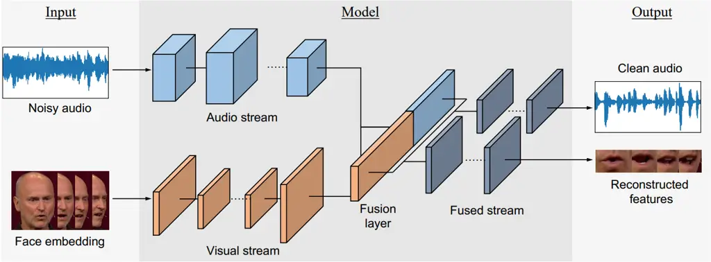

Fig. 1: Audio-Visual Speech Enhancement AI model architecture.

The audio stream employs a convolutional neural network (CNN) encoder

```math
\mathbf{z}_{t}^{(a)}=\mathcal{E}_{a}(\mathbf{a}_{t}), \tag{4}
```

while the visual stream extracts facial features using a vision
front-end based on OpenCV and CNN feature extractors,

```math
\mathbf{z}_{t}^{(v)}=\mathcal{E}_{v}(\mathbf{v}_{t}). \tag{5}
```

The modality-specific embeddings are fused via concatenation,

```math
\mathbf{z}_{t}=\left[\mathbf{z}_{t}^{(a)}\;\|\;\mathbf{z}_{t}^{(v)}\right], \tag{6}
```

where $`[\cdot\|\cdot]`$ denotes vector concatenation. Temporal
dependencies are modeled using a long short-term memory (LSTM) network,

```math
\mathbf{h}_{t}=\mathrm{LSTM}(\mathbf{z}_{t},\mathbf{h}_{t-1}), \tag{7}
```

which ensures coherent speech reconstruction across time. A stack of
fully connected (FC) layers decodes the enhanced speech features,

```math
\hat{\mathbf{x}}_{t}=\mathcal{D}(\mathbf{h}_{t}). \tag{8}
```

### IV-B Implementation

Figure 2presents a pragmatic framework for the deployment of the
developed AVSE algorithm within the context of real-world applications.
In order to enable the service in low quality terminals (e.g., IoT
devices), the remote server takes over all the processing, including the
pre-processing of the raw data. By doing so, any device with a camera,
microphone, and communication capabilities can use the service without
any requirements on its computing power. This allows us to apply the
service to some cheap IoT devices to achieve specific functions. For
high-performance devices (e.g., smartphones), offloading all processing
to the server can also reduce energy consumption and improve battery
life.

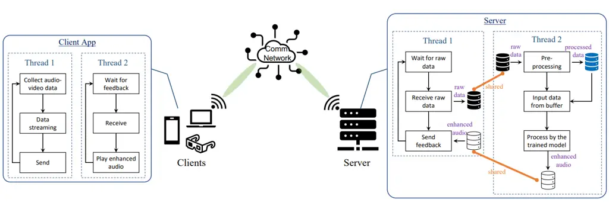

Fig. 2: A block diagram of enabling real-world AVSE service on terminal
devices.

As the figure depicts, the client terminals only collect the raw audio
and video, then upload them to the server and wait for the feedback from
the server. It should be noted that collecting and playing audio
requires parallel processing, so we use two independent threads. The
server will listen to clients and wait for the raw audio-video data from
clients. It starts processing using the stored trained model once it
listens to data transmission from the client. Considering that
processing latency may exceed the duration of the audio itself,
resulting in incoherent feedback audio, we use buffers to store input
and output data and perform parallel signal processing in another
independent thread. In this way, even if the processing delay is high
due to algorithm complexity, the client can still hear coherent enhanced
audio after a specific delay, thereby having a satisfactory service
experience.

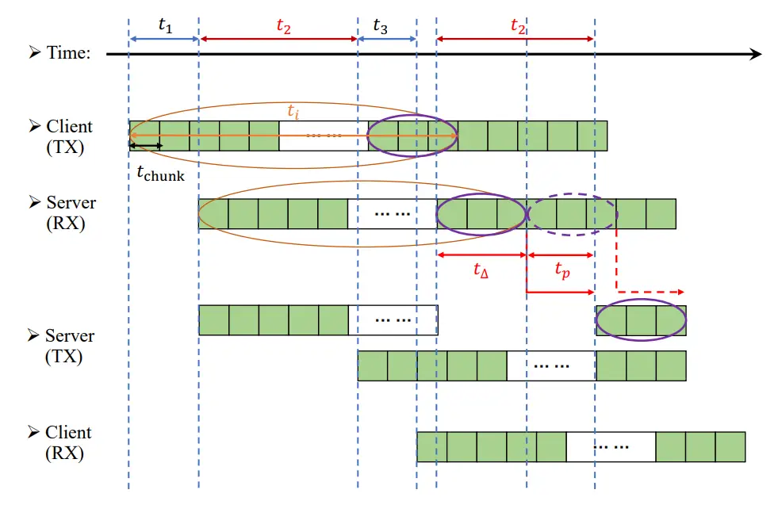

Fig. 3: A schematic describes the experienced latency of this service.

Figure 3describes the latency of the processing of the AVSE service. As
shown in the system model, the client continuously collects voice and
video information and sends it to the server. Assume that the length of
the audio-video chunk sent by the client each time is
$`t_{\text{chunk}}`$, that is, the client will send out audio and video
after collecting a chunk of $`t_{\text{chunk}}`$. After receiving the
data, the server will first perform preprocessing, such as feature
extraction of video frames, and then store the processed data in the
buffer. Since our algorithm tracks lips to help audio enhancement, the
input of the algorithm must have a specific length $`t_{i}`$ to ensure
sufficient visual features. When there are more than $`t_{i}`$ data in
the buffer, the server will start executing the AVSE algorithm. Then,
the server processes the incoming audio and video data sequentially, and
we must set a sufficient buffer interval $`t_{\Delta}`$ to ensure that
it can complete each process, which is given as

```math
t_{\Delta}>t_{a} \tag{9}
```

where $`t_{a}`$ is the algorithm processing latency. The enhanced audio
is stored in the output buffer, and the server begins feeding the
enhanced audio back to the client when there is enough data in the
output buffer. It should be noted that since $`t_{i}`$ is usually much
larger than $`t_{\Delta}`$, if we want the initial audio to be enhanced
by this algorithm, there will be an inevitable $`t_{i}`$-length waiting
time for data, causing a high delay. In order to mitigate the
significant delays we do not process the audio at the beginning of
$`t_{i}-t_{\Delta}`$, thereby reducing the overall delay to

```math
t_{\text{delay}}=t_{1}+t_{2}+t_{3}=t_{\text{comm}}+t_{\text{proc}} \tag{10}
```

where $`t_{1}`$ denotes the forward network latency, i.e., the delay
incurred in transmitting data from the client to the server; $`t_{2}`$
denotes the server’s processing latency, i.e., the delay incurred by the
server in processing the data; $`t_{3}`$ denotes the reverse network
latency, i.e., the delay incurred in transmitting data from the server
to the client. Thus, $`t_{1}+t_{3}`$ comprise the communication latency,
and the processing latency $`t_{\text{proc}}`$ (i.e., $`t_{2}`$) can be
decomposed into the buffer interval $`t_{\Delta}`$ and algorithm
processing time $`t_{a}`$. As a result, the client can get coherent
feedback audio $`t_{\text{proc}}`$ seconds after enabling the service,
and audio enhancement is enabled after $`t_{i}-t_{\Delta}`$ seconds.

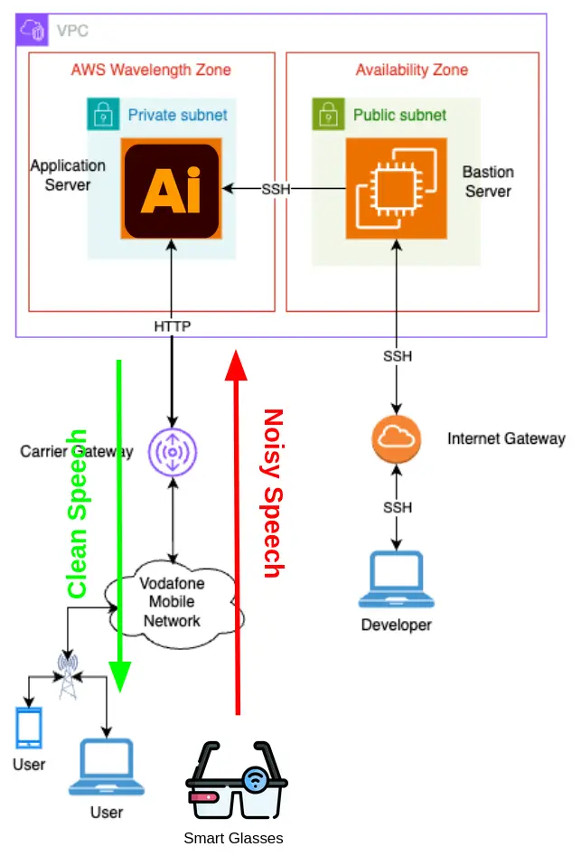

Fig. 4: End-to-end system architecture for 5G edge cloud multimedia
delivery.

## V Experimental Results

In this experiment, the auditory information undergoes a transformation
via convolutional neural networks (CNNs), which can distill the audio
patterns. The visual information is processed through the OpenCV
library, which is an open-source computer vision and machine learning
software library, to extract facial features from the face embeddings.
It is implemented using the pre-trained Haar feature-based cascade
classifiers, which are underpinned also by CNNs. Subsequently, the
algorithm employs a fusion strategy where the extracted auditory and
facial features coalesce, serving as inputs to a sophisticated Long-
Short Term Memory (LSTM) network. This step is crucial for integrating
temporal dynamics and ensuring a coherent feature representation. The
convergence of these modalities culminates in a series of FC layers,
which tunes the composite features to reconstruct the target outputs.
This framework provides a foundational blueprint, while the explicit
architectural configuration (i.e., layers, neurons, etc.) can vary
depending on the requirements and data pre-processing.

It should be noted that although we do buffering to ensure coherent
audio feedback from the server, the capacity of the communication
network is also extremely important to ensure reliable quality of
service. The communication network needs to have sufficient capacity so
that the round-trip delay of data transmission between the client and
server is shorter than the time of the data itself to ensure a
consistent service experience, denoted as

```math
t_{\text{comm}}\leq t_{\text{chunk}} \tag{11}
```

Otherwise, after playing a chunk, if the data of the next chunk has not
been fed back, there will be a blank period.

We measure the latency of a variety of networks in real-world
environments. We record audio at a sampling rate of $`16`$ kHz and
captured video frames at a resolution of $`380\times 640`$ pixels at a
frame rate of $`25`$ fps. We set $`t_{\text{chunk}}=40`$ ms, congruent
with the temporal extent of a single video frame. This configuration
yields a raw data payload of approximately $`0.3`$ MB per audio-video
chunk. Figure 5 shows the latency profiles observed across a suite of
$`100`$ round-trip data transmissions. In our experimental setup, a
desktop-based server and a laptop-based client were utilized to simulate
a realistic user scenario. The communication between server and client
was facilitated through Wi-Fi (802.11n, i.e., Wi-Fi 4), 4G, 5G, and a
direct Ethernet cable link, respectively. We also tried the Amazon Web
Services over internet as well as over Vodafone 5G public network whose
architecture is depicted in Figure 4. The results suggest that only
private 5G network and direct Ethernet cable link could support a
coherent service experience, i.e., satisfying
$`t_{\text{comm}}\leq t_{\text{chunk}}`$ where $`t_{\text{chunk}}=40`$
ms in our experiments. Note that 4G and 5G network capacities may differ
in different regions and with different carriers while choosing
different AWS locations may also result in different latencies. We used
Wi-Fi from the King’s Buildings, The University of Edinburgh (Edinburgh,
UK), and for 4G and 5G network testing used a private network of
Cambridge Wireless (Cambridge, UK) and Vodafone 5G public network. Using
new Wi-Fi protocols, such as 802.11ac (Wi-Fi 5) or 802.11ax (Wi-Fi 6),
can dramatically reduce the latency.

In areas with poor signal coverage, we can compress the raw audio-video
data to reduce the transmission load, obtaining reliable and consistent
quality of service. Figure 6 shows the data size versus compression
factors. It can be seen that proper compression of data can greatly
reduce the data size and the required data rate, especially in the range
of 80-100 compression factors. At a compression factor of 80, the data
can be reduced to $`\approx 70`$ KB with an insignificant effect on the
quality of the video frames. We also used a compression factor of 80 in
our real-world demonstration in Cambridge to ensure smooth service, and
experiments proved that the impact of other speech enhancement
properties could be ignored and we could still achieve considerable
noise reduction.

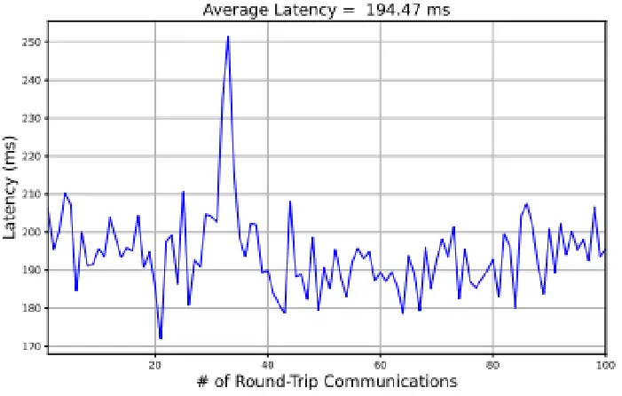

\(a\) Wi-Fi (802.11n)

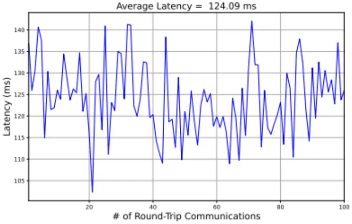

\(b\) 4G

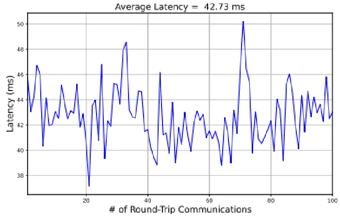

\(c\) 5G

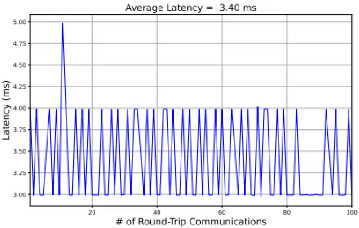

\(d\) Ethernet cable

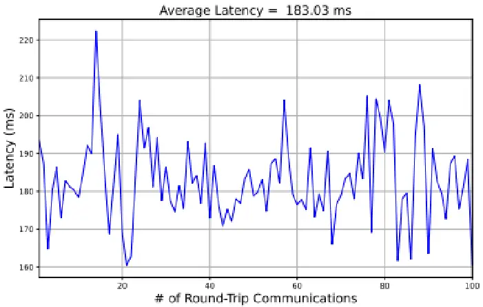

\(e\) Amazon Web Services

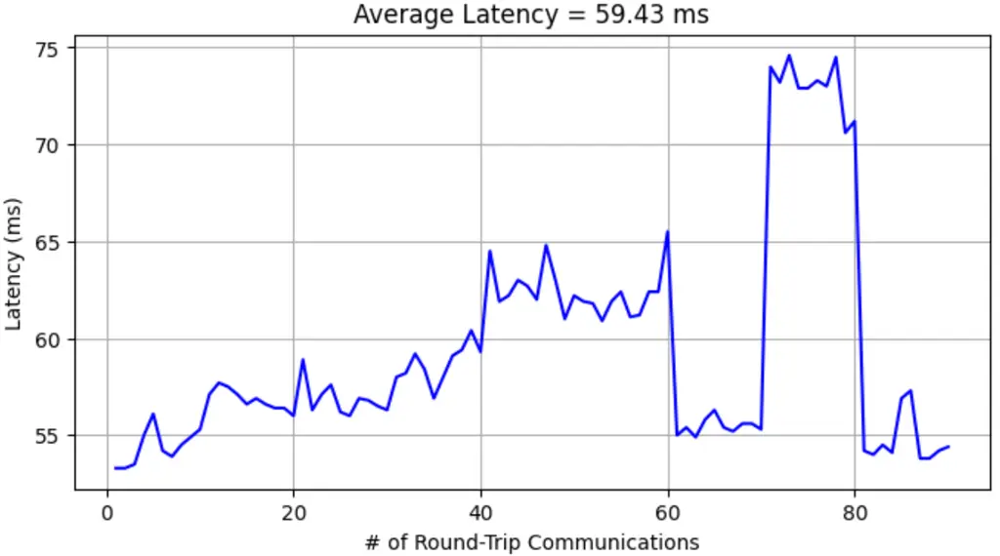

\(f\) AWS Wavelength over Vodafone 5G Cellular Network

Fig. 5: Network latency measured in real-world environments (round-trip
latency for transferring $`\tilde{0}.3`$ MB of data).

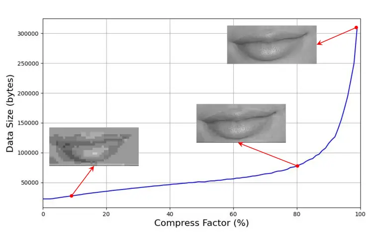

Fig. 6: Audio-video data size versus compression factors.

The next section describes extensive Vodafone 5G public network stress
testing with different data compression profiles.

### V-A Vodafone 5G network

This section describes the experimental environment used to evaluate
real-time audio-visual multimedia delivery over a public 5G network
integrated with edge cloud infrastructure. We first outline the network
characteristics and edge cloud configuration, followed by details of the
user equipment setup, stress profile design, and performance metrics
used for analysis.

The experiments were conducted over a commercial Vodafone 5G network
operating in the United Kingdom’s mid-band spectrum (3.4–3.6 GHz), which
provides a balance of capacity and coverage suitable for real-world edge
deployments. Targeted network characteristics include an end-to-end
latency of less than 15 ms for edge-hosted applications and sustained
upstream bandwidth in excess of 50 Mbps. Typical downstream 5G
throughput is expected to range between 100–200 Mbps, significantly
higher than legacy 4G under ideal conditions, thus accommodating
bandwidth-intensive audio-visual workloads.

The edge cloud environment was hosted using AWS Wavelength Zones, which
embed compute and storage resources directly within the operator’s
network to minimize transport distance. In this deployment, application
servers were placed within a private subnet accessible only through the
operator’s carrier gateway. A bastion host provided controlled secure
shell access for development and system management, ensuring that
compute resources remained isolated from direct public Internet
exposure. General-purpose instance types supported by Wavelength include
t3.medium, t3.xlarge, and r5.2xlarge, along with GPU-accelerated options
such as g4dn.2xlarge; this work uses the t3.medium instance type to
represent a typical baseline for edge compute.

User equipment consisted of a Google Pixel 8 smartphone used as the
primary 5G access device. To facilitate logging and control from a
standard development environment, the phone’s mobile data connection was
shared with a laptop via Wi-Fi tethering, effectively creating a local
hotspot. All multimedia payloads were generated by client applications
on the tethered laptop and transmitted over the 5G access network to the
edge application servers. This setup ensured realistic traffic behavior
on the mobile access link while providing flexibility for measurement
and control.

To systematically explore system performance under varying network loads
and processing demands, we defined a set of AVSE profiles. These
profiles vary in video frame rate, spatial resolution, JPEG compression
quality, and audio frame configuration, reflecting a range from very low
to extreme bandwidth usage. Table I summarizes the profile parameters
used in this study.

|         |                  |           |                   |              |                  |                  |
| ------- | ---------------- | --------- | ----------------- | ------------ | ---------------- | ---------------- |
| Profile | Category         | Video FPS | Resolution        | JPEG Quality | Audio Frame (ms) | Bandwidth Class  |
| 1A      | Low-bandwidth    | 3         | 160$`\times`$120  | 60           | 20               | Very low         |
| 1B      | Low-bandwidth    | 5         | 240$`\times`$180  | 70           | 20               | Low              |
| 2A      | Medium-bandwidth | 7         | 320$`\times`$240  | 75           | 20               | Medium           |
| 2B      | Medium-bandwidth | 10        | 320$`\times`$240  | 90           | 20               | Medium–high      |
| 3A      | High-bandwidth   | 10        | 640$`\times`$480  | 80           | 20               | High             |
| 3B      | High-bandwidth   | 15        | 640$`\times`$480  | 85           | 20               | Very high        |
| 4A      | Stress-test      | 20        | 320$`\times`$240  | 70           | 20               | High (FPS-heavy) |
| 4B      | Stress-test      | 30        | 1280$`\times`$720 | 95           | 20               | Extreme          |
| 5A      | Audio-only       | –         | –                 | –            | 20               | Very low         |
| 5B      | Audio-only       | –         | –                 | –            | 10               | Low              |

TABLE I: AVSE Multimedia Profile Configurations

Performance was assessed using several key metrics. Round-trip time
(RTT) was measured between the user equipment and the edge application
server, excluding application processing overhead, to characterize pure
network latency. Throughput measurements captured sustained uplink and
downlink bandwidth during multimedia transmission. Packet loss was
tracked at the network level to quantify reliability, and jitter was
analyzed to understand timing variation affecting real-time media.
Finally, resource utilization on the edge compute node, particularly
host CPU usage, was monitored to evaluate processing overhead under
different profile loads. Together, these metrics provide a comprehensive
view of network, transport, and system performance supporting real-time
multimedia over 5G edge cloud deployments.

The analysis below focuses on throughput scalability, latency behavior,
system resource utilization, and reliability across AVSE profiles
ranging from audio-only baselines to extreme audio-visual
configurations.

(a) Average downlink throughput.

(b) Average RTT (network latency only).

(c) Average host CPU utilization.

(d) Average packet loss.

Fig. 7: AWS edge-cloud (Wavelength) over Vodafone 5G network performance
metrics across different AVSE profiles under increasing load.

Fig. 7(a) presents the average downlink throughput for the five stress
classes. Throughput increases monotonically from the audio-only (AO)
baseline to the AV Stress profile, demonstrating that the proposed
profile design provides controlled and predictable scaling of network
load. Low and medium stress profiles (AV Low and AV Medium) increase
throughput gradually, enabling graceful adaptation under constrained
network conditions. In contrast, the AV High and AV Stress profiles
introduce a sharp increase in bandwidth demand, with the latter
exceeding 13 Mbps on average, representing the upper operational limit
of the pipeline. These results validate the ability of the system to
span a wide range of deployment scenarios using a single unified profile
design.

Fig. 7(b) shows the corresponding network latency measured as average
RTT, excluding AVSE processing overhead. RTT remains relatively stable
for AO, AV Low, and AV Medium profiles (approximately 54–59 ms),
indicating that moderate increases in video bitrate do not significantly
impact network delay when edge cloud deployment is used. However,
latency increases for AV High and peaks for AV Stress at approximately
73 ms, suggesting the onset of queuing and scheduling effects under
sustained high throughput. While still acceptable for real-time
audio-visual processing, these results highlight the reduced latency
margin at extreme configurations and the importance of adaptive profile
selection.

Fig. 7(c) illustrates the host CPU utilization across stress levels.
Audio-only processing requires minimal resources (approximately 5% CPU
usage), while AV Low and AV Medium profiles operate between 10–13%,
representing a practical region for sustained deployment. The AV High
profile increases CPU usage to approximately 18%, and the AV Stress
profile exceeds 21%, reflecting the combined cost of high-rate video
encoding and network transmission. These results indicate that
computational load scales predictably with stress level and that
mid-range profiles provide the best efficiency–performance trade-off.

Fig. 7(d) reports the average packet loss observed across stress
profiles. Packet loss remains low for AO through AV High profiles,
demonstrating the robustness of the pipeline under typical operating
conditions. The AV Stress profile exhibits higher loss and variance,
confirming that it is primarily suitable for stress testing rather than
continuous real-time operation. Notably, AV Medium and AV High profiles
maintain low packet loss while delivering significantly higher
throughput, reinforcing their suitability for practical deployments.

Overall, the results demonstrate that while extreme profiles expose
system and network limits, mid-range configurations achieve a favorable
balance between throughput, latency, resource consumption, and
reliability. These findings confirm that edge cloud proximity, combined
with adaptive profile selection, is a key enabler for real-time
audio-visual speech enhancement in public 5G environments.

|                                                       |                |                                                      |
| ----------------------------------------------------- | -------------- | ---------------------------------------------------- |
| Network                                               | Latency (ms)   | Notes                                                |
| Ethernet (Direct)                                     | $`\sim`$5–15   | Stable, lowest latency                               |
| 5G private network (Cambridge Wireless)               | $`\sim`$20–35  | Satisfies real-time requirements                     |
| 5G public network (Vodafone + AWS Wavelength, London) | 54.4–73        | Acceptable for real-time A/V with reduced margin     |
| Wi-Fi 4 (802.11n)                                     | $`\sim`$50–100 | Too high for smooth streaming; Wi-Fi 5/6 recommended |
| 4G (Cambridge Wireless)                               | $`\sim`$60–150 | Exceeds latency threshold, inconsistent              |
| AWS over Internet (WebRTC)                            | $`\sim`$80–200 | Region and ISP dependent; cloud adds delay           |

TABLE II: Latency report of different AVSE deployments

The latency measurements highlight the strong dependence of real-time
audio-visual speech enhancement (AVSE) performance on network
architecture rather than access technology alone. Ethernet (direct)
provides the lowest and most stable latency ($`\approx`$5–15 ms),
representing the ideal baseline for real-time AVSE and confirming that
processing, rather than networking, becomes the dominant factor in wired
deployments.

The private 5G network achieves consistently low latency
($`\approx`$20–35 ms), comfortably satisfying real-time requirements and
demonstrating the advantage of localized cores and controlled radio
environments for edge-based AVSE services.

Vodafone’s public 5G network with AWS Wavelength in London exhibits
moderate latency ($`\approx`$54–73 ms), which remains acceptable for
real-time audio-visual applications, though with reduced margin. This
increase reflects the added complexity of public network traversal and
edge-cloud integration, yet still significantly outperforms traditional
internet-based cloud deployment.

In contrast, Wi-Fi 4 and 4G show higher and more variable latency
($`\approx`$50–150 ms), often exceeding thresholds for smooth
interactive streaming. These results indicate that legacy access
technologies and shared radio conditions introduce instability that
limits AVSE usability.

Finally, deploying AVSE over the public internet to AWS regions using
WebRTC results in the highest and most unpredictable latency
($`\approx`$80–200 ms), driven by geographic distance, ISP routing, and
core network hops. This clearly demonstrates the importance of edge
computing for latency-sensitive audio-visual applications.

Overall, the results confirm that edge proximity is the dominant factor
enabling real-time AVSE, and that public 5G with edge cloud provides a
practical middle ground between private networks and best-effort
internet cloud deployments.

### V-B Algorithm Processing Latency

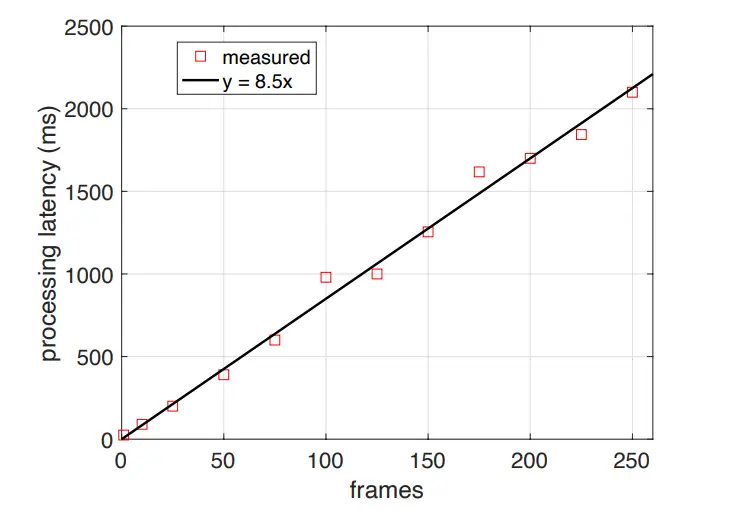

Fig. 8: Algorithm processing latency versus input chunk size.

The end-to-end user-perceived delay ($`t_{\text{delay}}`$) can be
decomposed into communication latency ($`t_{\text{comm}}`$) and
algorithm processing latency ($`t_{\text{proc}}`$), i.e.,

```math
t_{\text{delay}}=t_{\text{comm}}+t_{\text{proc}}. \tag{12}
```

In practice, $`t_{\text{comm}}`$ mainly affects the synchronization and
coherence of the feedback audio, whereas $`t_{\text{proc}}`$ directly
determines the system responsiveness. Real-world measurements indicate
that modern wireless standards such as 5G NR and Wi-Fi 6 can satisfy the
required throughput and transmission delay constraints. Consequently,
minimizing $`t_{\text{proc}}`$ becomes the dominant factor in reducing
overall interaction latency.

A common approach to reduce $`t_{\text{proc}}`$ is to shorten the input
chunk duration and reduce model complexity. However, in audio–visual
speech enhancement (AVSE), the enhancement model must capture temporal
lip-motion dynamics in order to reliably extract the target speaker from
competing noise sources. As a result, overly short input chunks may
degrade enhancement performance due to insufficient temporal context.

This latency–performance trade-off has been widely recognized in the
AVSE literature. Gogate _et al._ introduced CochleaNet, a causal,
language-, noise-, and speaker-independent AVSE framework designed for
real-time processing in noisy environments \[5\]. More recently, Gogate
_et al._ proposed a robust real-time AVSE framework that integrates a
CycleGAN-based visual enhancement stage with a causal DNN-based fusion
model to estimate an ideal binary mask (IBM) for noise
suppression \[7\]. Their system reports an end-to-end processing latency
of approximately $`15`$ ms while achieving significant gains in
objective and subjective intelligibility metrics, demonstrating the
feasibility of low-latency AVSE under real-time constraints \[7\].
Additional efforts by the same group further explore lightweight
architectures for benchmark AVSE challenges, emphasizing computational
efficiency and practical deployment \[6\]. Furthermore,
latency-efficient AVSE models based on cross-modal feature
synchronization have reported real-time performance with processing
delays on the order of $`36`$ ms, reinforcing the importance of
low-latency multimodal fusion for assistive hearing applications \[11\].

In our system, the input stream is segmented into chunks of $`N`$
frames, where each frame corresponds to $`40`$ ms. Fig. 8 illustrates
the measured algorithm processing latency as a function of chunk size.
The results indicate that processing latency increases approximately
linearly with the input duration. In principle, processing each frame
independently could reduce $`t_{\text{proc}}`$ below $`40`$ ms, enabling
a total interaction latency within $`100`$ ms. However, such
short-context processing significantly reduces enhancement quality due
to the lack of sufficient temporal information for robust audio–visual
fusion.

To further evaluate the impact of chunk size on enhancement quality,
Fig. 9 shows the time-domain waveform and spectrogram of the noisy input
and enhanced output audio under varying chunk durations. Using $`10`$-s
audio–visual segments produces the strongest reconstruction of the
target speech and the most effective suppression of competing background
noise. In contrast, frame-level enhancement yields output dominated by
residual noise, indicating that the model fails to extract reliable
speaker-discriminative features at this temporal resolution. Increasing
the chunk duration generally improves enhancement quality, although the
performance is not uniformly consistent across all temporal segments,
suggesting that longer temporal context does not necessarily guarantee
optimal reconstruction in all intervals.

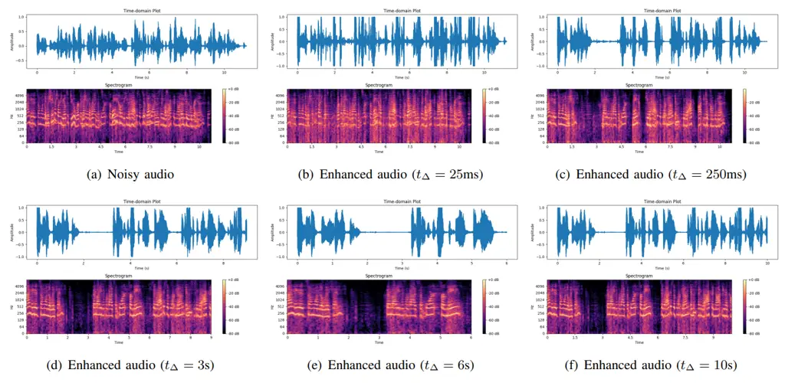

Fig. 9: Time plot and spectrogram of the input noisy audio and output
enhanced audio processed with different input chunk lengths.

### V-C Algorithm Development

To mitigate the processing latency while maintaining enhancement
performance, we investigated whether the proposed model could learn
discriminative representations from shorter temporal contexts.
Specifically, the training scheme was adapted to support condensed input
durations of $`200`$ ms. Based on the AVSE architecture shown in
Figure 1, a series of lightweight variants were developed by reducing
network depth and neuron count with the objective of shortening
inference time. The total number of parameters and measured execution
time for each reduced model are summarized in Table III.

|         |                     |                     |
| ------- | ------------------- | ------------------- |
| Model   | Total Parameters    | Execution Time (ms) |
| Model 1 | 1,540,396 (5.88 MB) | 1200                |
| Model 2 | 603,564 (2.30 MB)   | 550                 |
| Model 3 | 202,564 (791.27 KB) | 350                 |

TABLE III: Model Complexity and Execution Time

Fig. 10 compares the time-domain waveform and spectrogram of the clean
target speech, noisy mixture, and enhanced output produced by the
reduced models. The results show that shortening the input duration and
reducing model capacity decreases reconstruction fidelity, particularly
for low-energy speech components, due to reduced availability of visual
temporal information. Nevertheless, the reduced models maintain
satisfactory noise suppression performance, indicating that lightweight
architectures can provide an effective trade-off between enhancement
quality and low-latency execution.

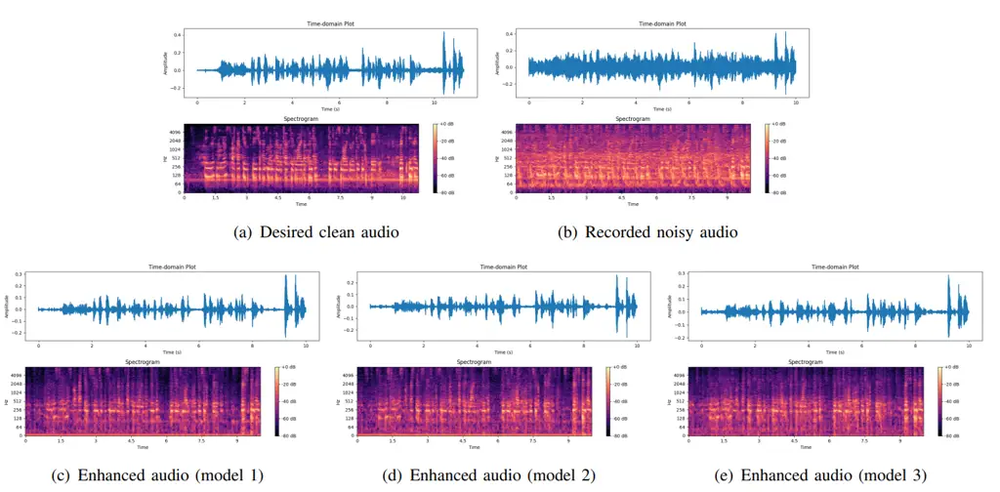

Fig. 10: Time plot and spectrogram of the input noisy audio and output
enhanced audio processed with different network architectures.

Overall, the results demonstrate a clear trade-off between processing
latency and enhancement performance. Longer input chunks provide richer
temporal context for lip-motion tracking and speaker discrimination, but
significantly increase processing delay. Conversely, reducing chunk size
and model complexity improves responsiveness but may degrade speech
reconstruction quality in challenging low-SNR conditions. Therefore,
selecting an optimal configuration requires balancing the latency
constraints of real-time feedback against the temporal context required
for robust AVSE.

## VI CONCLUSION

This work presented a comprehensive evaluation of a real-time,
cloud–edge–assisted audio-visual speech enhancement (AVSE) system
operating over a public 5G edge cloud. The proposed system integrates
CNN-based acoustic processing and OpenCV-driven facial feature
extraction with an LSTM fusion network to preserve temporal coherence,
and was deployed and evaluated using a Vodafone-compatible AWS
Wavelength edge in London. The results demonstrate that compute
placement at the network edge and network transport latency are primary
determinants of end-to-end performance for interactive multimedia and
perceptual enhancement applications.

Experimental analysis showed that real-time coherence is achieved only
when communication delay remains below the chunk duration
($`t_{\text{comm}}\leq t_{\text{chunk}}=40`$ ms). In practice, this
requirement was consistently met by 5G and wired Ethernet connections
for uncompressed 0.3 MB audio-video chunks, while other access networks
failed to maintain stable operation. Applying aggressive compression (up
to a factor of 80) reduced payloads to approximately 70 KB with
negligible perceptual degradation, significantly improving robustness
under constrained uplink conditions and enabling smoother real-time
streaming. These findings confirm that uplink capacity is often the
dominant bottleneck for interactive edge-based multimedia services.

We further observed that system responsiveness and enhancement quality
are jointly governed by network quality, chunk size, and model
complexity. Reducing temporal context and model size lowered processing
latency from approximately 1.2 s to 0.35 s, but at the cost of degraded
speech reconstruction, particularly in low-SNR conditions. This reveals
a fundamental trade-off between computational efficiency and enhancement
fidelity, underscoring the need for adaptive operating profiles that can
dynamically balance latency, throughput, and quality based on current
network and compute conditions. Stress testing identified safe operating
regions as well as the importance of fallback modes, such as audio-only
operation, to preserve service continuity during adverse network
conditions.

Overall, the results indicate that public 5G edge environments can
sustain real-time, interactive multimedia workloads, provided that
network and compute resources are carefully orchestrated. However,
performance margins remain tighter than in dedicated or private
infrastructures, making dynamic adaptation and edge proximity essential
architectural considerations. The insights derived from this study are
directly applicable to delay-sensitive services such as augmented
reality, interactive conferencing, and multimodal perception
enhancement.

Future work will extend this study by incorporating mobility and
multi-user scenarios, exploring GPU-accelerated edge instances for more
complex models, and evaluating performance across multiple geographic
regions and operator ecosystems. We also plan to investigate adaptive
chunking, lightweight streaming architectures, and edge-assisted
learning to further reduce latency while preserving enhancement fidelity
in real-world wireless environments.

## Acknowledgements

This work was supported by the UK Engineering and Physical Sciences
Research Council (EPSRC) Grant No. EP/T021063/1.

## References

- \[1\] A. Adeel, J. Ahmad, and A. Hussain (2018) Real-time lightweight
  chaotic encryption for 5g iot enabled lip-reading driven secure
  hearing-aid. arXiv preprint arXiv:1809.04966. Cited by: §II.
- \[2\] Amazon Web Services, Inc. 5G edge computing infrastructure – aws
  wavelength. Note:
  [https://aws.amazon.com/wavelength/](https://aws.amazon.com/wavelength/)Accessed:
  Jan. 2026 Cited by: §I.
- \[3\] A. Ephrat, I. Mosseri, O. Lang, T. Dekel, K. Wilson, A.
  Hassidim, W. T. Freeman, and M. Rubinstein (2018) Looking to listen at
  the cocktail party: a speaker-independent audio-visual model for
  speech separation. arXiv preprint arXiv:1804.03619. Cited by: §II.
- \[4\] European Telecommunications Standards Institute (ETSI)
  Multi-access edge computing (mec). Note:
  [https://www.etsi.org/technologies/multi-access-edge-computing](https://www.etsi.org/technologies/multi-access-edge-computing)Accessed:
  2026-01 Cited by: §I.
- \[5\] M. Gogate, K. Dashtipour, A. Adeel, and A. Hussain (2020)
  CochleaNet: a robust language-independent audio-visual model for
  real-time speech enhancement. Information Fusion 63, pp. 273–285.
  Cited by: §V-B.
- \[6\] M. Gogate, K. Dashtipour, and A. Hussain (2024) A lightweight
  real-time audio-visual speech enhancement framework. Proceedings of
  AVSEC, pp. 19–23. Cited by: §V-B.
- \[7\] M. Gogate, K. Dashtipour, and A. Hussain (2024) Robust real-time
  audio-visual speech enhancement based on dnn and gan. IEEE
  Transactions on Artificial Intelligence. Cited by: §V-B.
- \[8\] A. Gupta, A. Bishnu, M. Gogate, K. Dashtipour, T. Arslan, A.
  Adeel, A. Hussain, T. Ratnarajah, and M. Sellathurai (2023) 5G-iot
  cloud based demonstration of real-time audio-visual speech enhancement
  for multimodal hearing-aids. In 24th International Speech
  Communication Association Conference 2023, pp. 686–687. Cited by: §II.
- \[9\] J. Hou, S. Wang, Y. Lai, Y. Tsao, H. Chang, and H. Wang (2018)
  Audio-visual speech enhancement using multimodal deep convolutional
  neural networks. IEEE Transactions on Emerging Topics in Computational
  Intelligence 2 (2), pp. 117–128. Cited by: §II.
- \[10\] Y. Mao, C. You, J. Zhang, K. Huang, and K. B. Letaief (2017) A
  survey on mobile edge computing: the communication perspective. IEEE
  communications surveys & tutorials 19 (4), pp. 2322–2358. Cited by:
  §II.
- \[11\] N. Saleem, M. Gogate, K. Dashtipour, A. Hussain, U. Anwar, A.
  Adetomi, T. Arslan, and A. Hussain (2025) Audio-visual feature
  synchronization for robust speech enhancement in hearing aids. arXiv
  preprint arXiv:2508.19483. Cited by: §V-B.
- \[12\] Z. Yuan, T. Azzino, Y. Hao, Y. Lyu, H. Pei, A. Boldini, M.
  Mezzavilla, M. Beheshti, M. Porfiri, T. E. Hudson, et al. (2022)
  Network-aware 5g edge computing for object detection: augmenting
  wearables to “see” more, farther and faster. IEEE Access 10,
  pp. 29612–29632. Cited by: §II.
- \[13\] Z. Zhu, H. Yang, M. Tang, Z. Yang, S. E. Eskimez, and H.
  Wang (2023) Real-time audio-visual end-to-end speech enhancement. In
  ICASSP 2023-2023 IEEE International Conference on Acoustics, Speech
  and Signal Processing (ICASSP), pp. 1–5. Cited by: §II.
