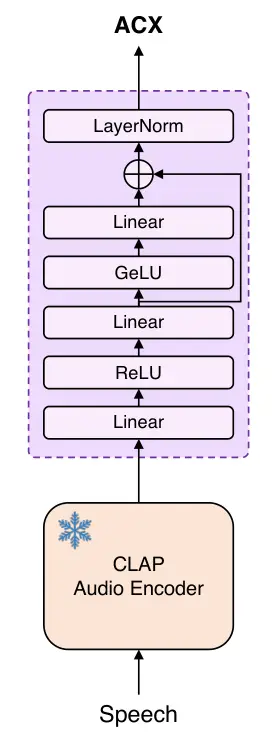
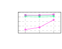
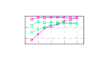

Chung Choi nocounter\]NAVER CloudSouth Korea

# Listen through the Sound: Generative Speech Restoration Leveraging Acoustic Context Representation

Soo-Whan    Min-Seok Affiliation: \[

###### Abstract

This paper introduces a novel approach to speech restoration by
integrating a context-related conditioning strategy. Specifically, we
employ the diffusion-based generative restoration model, UNIVERSE++, as
a backbone to evaluate the effectiveness of contextual representations.
We incorporate acoustic context embeddings extracted from the CLAP
model, which capture the environmental attributes of input audio.
Additionally, we propose an Acoustic Context (ACX) representation that
refines CLAP embeddings to better handle various distortion factors and
their intensity in speech signals. Unlike content-based approaches that
rely on linguistic and speaker attributes, ACX provides contextual
information that enables the restoration model to distinguish and
mitigate distortions better. Experimental results indicate that
context-aware conditioning improves both restoration performance and its
stability across diverse distortion conditions, reducing variability
compared to content-based methods.

###### keywords

Acoustic context representation, generative speech restoration

^(†)^(†)email: soowhan.chung@navercorp.com

## 1 Introduction

In our daily lives, when we record speech, we encounter not only the
speech itself but also unwanted background noise and reverberation from
the environment. At times, we face additional degradations, such as
spectral distortion, narrow bandwidths, and even undesired amplitude
clipping, depending on the recording environment or the device used. In
the past, to obtain high-quality speech from input signals, each
distortion was addressed with a separate model, then handled in a
cascading manner \[1, 2\]. However, recent advances in complexity and
methodology of deep learning have led to integrated approaches that
process multiple distortions together. Early discriminative methods \[3,
4\] focused on estimating clean speech features (e.g. spectrogram,
mel-spectrogram), much like traditional speech enhancement methods. When
generative adversarial networks (GANs) emerged, they \[5, 6\] further
boosted the performance of these approaches by generating missing
components effectively and substantially improving speech quality.

Recently, diffusion-based generative models \[7, 8, 9\] have shown
remarkable perceptual quality on processed speech, by re-generating
speech signals from random distributions. For instance, UNIVERSE \[10\]
introduced a score-matching approach to handle a variety of distortions,
achieving strong performance in restoring speech. Afterwards, UNIVERSE++
\[11\] modified the condition model of UNIVERSE to provide high-quality
speech features, and it improved stability of the restoration process as
well as perceptual quality. The core of these models is the use of
condition modules that adapt to various distortions. This design
enhances restoration performance by incorporating estimated speech
features alongside the diffusion model, rather than depending solely on
it.

However, generative models often produce hallucinations, especially when
provided with inadequate features during sampling or when handling
extremely difficult tasks. Speech restoration is a highly complex task
that involves both suppression and generation processes. When the
condition model cannot supply enough informative features, the
generative models show limited performance. In such cases, obtaining
condition information from pre-trained models may help reduce
performance degradation. Several works \[12, 13, 14\] have confirmed the
usefulness of this approach, particularly by leveraging self-supervised
learning (SSL) \[15, 16, 17\] models or speaker recognition models \[18,
19, 20\] that supply linguistic or speaker-related information for
speech restoration. These condition models, trained through contrastive
learning \[21, 22\] on real-world speech recordings, can provide
content-related information even for distorted speech.

In this paper, we propose a novel approach to conditional speech
restoration that leverages auxiliary acoustic cues. Instead of utilizing
content aligned with the clean speech signal being estimated, we employ
the acoustic context information present in the input, including
environmental attributes. In particular, we use the CLAP model \[23, 24,
25\] to extract embeddings that reflect the environmental attributes in
the input. Since CLAP is trained through correspondence between audio
and text captions, it can indicate the soundscape within the signal.
Traditional restoration models implicitly analyze distortions, which
sometimes lead to over-suppression or leftover noise depending on the
input. However, by explicitly providing the restoration model with
distortion information, our approach minimizes over-suppression and
leftover noise, leading to more stable and high-quality restoration
results.

Furthermore, we propose an advanced acoustic context (ACX)
representation that refines CLAP representations. Although CLAP is
effective at describing the soundscape of inputs, it does not fully
consider the intensity of each component in input speech. To distinguish
the intensity for more precise acoustic context information, CLAP
outputs are embedded into a more detailed latent space. Simple
projection layers are placed onto the CLAP audio encoder while keeping
its parameters frozen. For training, we prepare four different speech
samples to learn how to discriminate distortion types and their
intensities. We introduce this novel representation into the restoration
model along with CLAP and other content-based conditions. The following
sections provide the details of our context-aware speech restoration and
show its effectiveness in speech restoration. We will demonstrate that
this ACX representation is as competitive as conventional
representations in restoration tasks, and it has an advantage in more
severe environments.

(a)

(b)



(c)

Figure 1: Illustration of the model architecture. To compare the impact
across different conditioning methods, only one condition is enabled at
a time (SSL, Speaker, CLAP, ACX). (a) UNIVERSE++-based diffusion model;
(b) Downsampling (DS) and Upsampling (US) blocks; (c) ACX model.

## 2 Related Works

### 2.1 UNIVERSE & UNIVERSE++

UNIVERSE \[10\] is one of the pioneering methods using a score-based
diffusion model for generative speech restoration. It consists of two
networks: the score network and the condition network. The condition
network is trained on multiple mixture density objectives to predict
various target features (e.g. pitch and harmonicity). The UNIVERSE model
is trained on a wide range of distortions using large-scale datasets,
and it outperforms baseline models in perceptual quality, even with
relatively few sampling steps.

UNIVERSE++ \[11\] is an advanced version of UNIVERSE, which modifies the
model structure to ensure training stability and introduces adversarial
training for the condition network. Specifically, the condition network
adopts a GAN-based strategy to predict clean speech signals instead of
relying on the mixture density networks. The discriminator follows the
same recipe as HiFi-GAN \[26\], incorporating both multi-resolution and
multi-period discriminators. This approach makes the intermediate
embeddings of the decoder layers represent high-quality speech features,
thereby promoting the score network to predict the target speech signal
more efficiently. As a result, UNIVERSE++ has shown more stable and
effective results compared to UNIVERSE and other diffusion-based speech
enhancement methods.

### 2.2 Contrastive Language-Audio Pretraining (CLAP)

CLAP \[23, 24, 25\] has been in the spotlight for its ability to
represent the context of input audio by learning the correspondence
between audio and its textual caption. CLAP is trained via contrastive
learning with two encoders, each for audio and text, embedding their
respective modalities into a common latent space. The distance between
audio and text embeddings is minimized when they are paired, and
maximized otherwise. For training, large-scale audio datasets \[24, 27\]
were employed, including various sound sources such as speech, music,
ambient sounds, and sound effects.

In audio generation \[28, 29, 30\], CLAP has been utilized as a key
module to determine the types of sound and their attributes for
generated audio. AudioLDM \[28, 31\] has been trained using audio
embeddings and then generated audio with text prompts from CLAP text
encoder, circumventing data scarcity due to the limited availability of
paired audio-text datasets. This demonstrates that CLAP audio embeddings
effectively capture the overall acoustic context of input audio, making
them a key module for providing environmental context in various
generation tasks \[32, 33, 34\].






Figure 2: Cosine similarity of the context representations between
anchors and positive samples $`\mathcal{P}`$ (with the same distortion
type and intensity) and between anchors and negative samples
$`\mathcal{N}`$ (clean speech) for three types of distortion: (a) Noise,
(b) Reverberation, and (c) Bandlimiting distortion.

## 3 Proposed Method

### 3.1 Context-aware Speech Restoration

We propose a novel approach for conditional restoration that leverages
acoustic context information. Unlike content-aware methods that mainly
rely on speaker information or linguistic cues \[12, 13\], our approach
focuses on the acoustic context in the input speech. Since the CLAP
audio encoder is trained on audio captions describing various acoustic
scenes, it can effectively capture different sound sources, which makes
it well-suited for providing acoustic context in the restoration model.
Therefore, we use this audio encoder to supply acoustic context
information for the restoration instead of content-related information.
We specifically integrate this approach into UNIVERSE++, which has shown
impressive restoration performance. Although UNIVERSE++ excels at speech
restoration, it still struggles under harsh conditions that degrade its
conditional features. The acoustic context information would improve
overall restoration performance, especially under severe distortions.
Hence, we slightly modify the structure of UNIVERSE++ to integrate extra
conditional features, as shown in Fig. 1(a) and (b), and investigate the
impact of this conditioning strategy.

### 3.2 Acoustic Context (ACX) Representation

We also propose an advanced acoustic context representation built on
CLAP embeddings. Although CLAP effectively represents the overall
acoustic context, it does not fully capture the severity of
environmental distortions present in speech signals. For instance, while
it can identify ambient sounds or distinguish whether the speaker is
indoors or outdoors, it fails to quantify noise or reverberation levels.
Furthermore, because CLAP embeddings capture every sound in the input,
they also include speaker-related attributes such as gender or age,
which are irrelevant to the distortions we aim to remove.

To address these issues, we incorporate metric learning strategy to
obtain more precise ACX representation. Our strategy aims to learn
discriminability not only for different acoustic context types, but also
for their intensity, thereby capturing fine-grained variations in
distorted inputs. We add extra layers atop the pretrained CLAP encoder
to project its embeddings onto another latent space as shown in Fig.
1(c). For training, we prepare four different audio samples: anchor
($`\mathcal{A}`$), positive ($`\mathcal{P}`$), weak negative
($`\mathcal{N}_{w}`$), and hard negative ($`\mathcal{N}_{h}`$). The
anchor and the positive audio share identical acoustic conditions
including noise type, signal-to-noise ratio (SNR), room impulse response
(RIR), and cutoff frequency, yet they differ in speech content. In
contrast, the weak negative consists of different distortions compared
to the anchor, thus encouraging the representation to learn how to
discriminate among different acoustic contexts. For training efficiency,
we exploit other samples within a minibatch as the weak negatives. The
key sample in training is the hard negative, which pushes the
representation to provide a fine-grained description according to the
intensity of the distortions. Hard negatives are formed by reusing
anchor or positive speech with the same distortion type but at a
different intensity level from the positive sample. With this strategy,
we reduce the attributes about spoken terms on the embeddings.

We design the training criteria using both the L2 distance $`d`$ and the
cosine similarity $`s`$ between embeddings. For discriminability, the
anchor–positive distance is minimized and the weak negative is pushed
away from the anchor. Likewise, the anchor–positive cosine similarity is
maximized, while the anchor–weak negative similarity is minimized as
follows:

```math
\scriptsize\begin{gathered}L_{c}=-\sum_{n\in{\mathcal{A}}}\sum_{m\in{\{\mathcal{P},\mathcal{N}_{w}}\}}y_{m}\text{log}\biggl(\frac{\exp(s_{n,m})}{\sum_{m\in{\{\mathcal{P},\mathcal{N}_{w}}\}}\exp(s_{n,m})}\biggr)\\
L_{d}=-\sum_{n\in{\mathcal{A}}}\sum_{m\in{\{\mathcal{P},\mathcal{N}_{w}}\}}y_{m}\text{log}\biggl(\frac{\exp(d_{n,m}^{-1})}{\sum_{m\in{\{\mathcal{P},\mathcal{N}_{w}}\}}\exp(d_{n,m}^{-1})}\biggr)\\
y_{m}=\begin{cases}1,&m\in\mathcal{P}\\
0,&m\in\mathcal{N}_{w}\end{cases},\end{gathered} \tag{1}
```

where $`s_{x,y}=\cos(\phi(x),\phi(y))`$ and
$`d_{x,y}=||\phi(x)-\phi(y)||_{2}`$. $`\phi(\cdot)`$ is the ACX
representation model in Fig. 1(c).

To learn the intensity, the hard negative is treated differently from
the weak negative. The hard negative embedding should exhibit higher
similarity with the anchor than the weak negative. Nevertheless, it
remains farther from the anchor than the positive, thus preventing it
from becoming indistinguishable from the positive sample. Therefore, we
maximize the similarity between the anchor and the hard negative
embedding, but cap it at the maximum similarity observed for the
positive embedding. Also, we do not minimize the anchor–hard negative
distance but only maximize distance among negatives. The training
criteria for the intensity are given as follows:

```math
\scriptsize\begin{gathered}L_{nd}=-\sum_{n\in{\mathcal{N}_{w}}}\sum_{m\in{\mathcal{N}_{h}}}d_{n,m},\\
L_{nc}=-\sum_{n\in{\mathcal{A}}}\sum_{m\in{\{\mathcal{N}_{h},\mathcal{N}_{w}}\}}y_{m}\,\text{log}\Bigl(\frac{\exp(\hat{s}_{n,m})}{\sum_{m\in{\{\mathcal{N}_{h},\mathcal{N}_{w}}\}}\exp(\hat{s}_{n,m})}\Bigr),\\
y_{m}=\begin{cases}1,&m\in\mathcal{N}_{h}\\
0,&m\in\mathcal{N}_{w}\end{cases},\hat{s}_{n,m}=\begin{cases}\min(s_{n,m},p_{max}),&m\in\mathcal{N}_{h}\\
s_{n,m},&m\in\mathcal{N}_{w}\end{cases},\end{gathered} \tag{2}
```

where $`p_{max}`$ is the maximum similarity score between the anchor and
the positive within the minibatch. We trained the ACX model by
integrating training criteria as follows,

```math
\footnotesize L=L_{c}+L_{d}+L_{nd}+L_{nc}. \tag{3}
```

During training, the CLAP encoder is frozen to preserve its contextual
capacity.

|             |          |       |       |       |       |       |                        |       |       |       |           |        |       |         |
| ----------- | -------- | ----- | ----- | ----- | ----- | ----- | ---------------------- | ----- | ----- | ----- | --------- | ------ | ----- | ------- |
| Model       | SNR (dB) |       |       |       |       |       | Cutoff Frequency (kHz) |       |       |       | Room Size |        |       | Average |
|             | -5       | 0     | 5     | 10    | 15    | 20    | 1k                     | 3k    | 5k    | 7k    | Large     | Medium | Small |         |
| UNIVERSE    | 1.823    | 1.991 | 2.105 | 2.155 | 2.175 | 2.186 | 1.931                  | 2.079 | 2.128 | 2.143 | 2.219     | 2.227  | 2.254 | 2.109   |
| UNIVERSE++  | 2.118    | 2.358 | 2.515 | 2.594 | 2.646 | 2.659 | 2.232                  | 2.529 | 2.553 | 2.597 | 2.787     | 2.836  | 2.862 | 2.560   |
|    +HuBERT  | 2.117    | 2.392 | 2.565 | 2.641 | 2.685 | 2.701 | 2.301                  | 2.547 | 2.620 | 2.633 | 2.878     | 2.921  | 2.951 | 2.612   |
|    +RawNet3 | 2.166    | 2.395 | 2.561 | 2.631 | 2.684 | 2.704 | 2.269                  | 2.584 | 2.630 | 2.640 | 2.849     | 2.891  | 2.918 | 2.609   |
|    +CLAP    | 2.168    | 2.426 | 2.566 | 2.648 | 2.712 | 2.721 | 2.244                  | 2.610 | 2.641 | 2.646 | 2.847     | 2.886  | 2.922 | 2.618   |
|    +ACX     | 2.167    | 2.411 | 2.576 | 2.649 | 2.702 | 2.718 | 2.230                  | 2.598 | 2.642 | 2.666 | 2.865     | 2.908  | 2.930 | 2.620   |

Table 1: DNSMOS results across various evaluation sets at different
distortion intensities. Each dataset in a column has a fixed intensity
for the corresponding distortion, while other distortions remain random.

## 4 Experiments

### 4.1 Implementation Details

#### Datasets

We consider four environmental factors for experiments: noise,
reverberation, bandlimiting, and clipping. We use VCTK \[35\] and
LibriSpeech \[36\] as speech corpora, DEMAND \[37\] and WHAM \[38\] for
noise, and DNS-Challenge \[39\] and DiffRIR \[40\] for room acoustics.
For datasets with predefined training and test splits, we follow their
standard configurations. For VCTK and DEMAND, the training and test
samples are selected based on the Valentini dataset \[41\]. To evaluate
reverberation, we randomly select 10 RIR samples per room type from
DNS-Challenge and 5 per room type from DiffRIR for the test set.
Bandlimiting distortions are simulated using resampling and low-pass
filtering, applying a random cutoff frequency between 1kHz and 8kHz. For
clipping, we randomly clamp speech amplitudes by up to 50% to simulate
distortion. For structured evaluation, 13 test subsets are created, each
with 1,000 speech samples, isolating a specific distortion level while
applying others randomly. SNR levels range from -5dB to 20dB in 5dB
steps, reverberation is categorized by room size, and cutoff frequency
is set from 1kHz to 7kHz in 2kHz intervals. Additionally, restoration
performances are evaluated using the URGENT challenge dataset \[42\],
which includes a broader range of distortions.

#### Evaluation metrics

We adopt non-intrusive metrics to assess the perceptual quality of
restored speech. Specifically, DNSMOS \[43\] and SIGMOS \[44\], both
neural quality prediction models, are used for quantitative evaluation.
Also, to check the characteristics of the ACX representation, we measure
cosine similarity between embeddings.

#### Conditions

We evaluate four types of conditioning: speaker embeddings, SSL
features, CLAP embeddings, and ACX representation. RawNet3 \[19\] for
speaker embeddings is used, which outputs 256-dimensional vectors. Among
various SSL models, we choose HuBERT-base \[16\] and extract
768-dimensional framewise embeddings from its 9th layer. Both CLAP¹¹ 1
[https://huggingface.co/microsoft/msclap](https://huggingface.co/microsoft/msclap)
\[25\] and our proposed ACX representation produce a 1,024-dimensional
embedding per utterance.

#### Model structure

Experiments are built on UNIVERSE++²² 2
[https://github.com/line/open-universe](https://github.com/line/open-universe),
modifying input length to 5.12 seconds. Fig. 1(a) and (b) show a
detailed illustration of the diffusion network. Global conditions are
integrated through simple concatenation to avoid increasing the model
size. Specifically, we integrate utterance-wise conditions (i.e.
Speaker, CLAP, ACX) into the input of each decoder layer of UNIVERSE++
by concatenation followed by a linear projection. SSL features are fed
into the second decoder layer via a transformer decoder structure. On
top of the CLAP audio encoder, we stack two fully-connected layers and a
projection layer to extract ACX representation, as shown in Fig. 1(c).

### 4.2 Experiment Results

#### Representation Performances

We first evaluated the ACX representation to assess its ability to
differentiate various distortions and capture their intensity. To do
this, we prepared three test sets: noise, reverberation, and bandwidth
limitation. Each set contains 823 samples with the same distortion type
and intensity. For noise, SNR levels were tested from 0 to 30dB at 1dB
intervals. For reverberation, we used RIR samples categorized as small,
medium, and large rooms in the DNS-Challenge dataset. For bandlimit
distortion, we progressively reduced the bandwidth from 8kHz down to
1kHz.

Fig. 2 shows the cosine similarity between the anchor and clean sample
($`\mathcal{N}`$) and between the anchor and positive sample
($`\mathcal{P}`$). If the similarity for $`\mathcal{N}`$ decreases as
distortion worsens while the similarity for $`\mathcal{P}`$ remains
high, the embedding can be considered effective in representing both
distortion type and intensity. Otherwise, if both similarities stay
high, the embedding fails to capture intensity variations. In Fig. 2, we
observed that CLAP embeddings already exhibit moderate discriminability
and intensity-awareness. However, ACX shows a larger drop in similarity
as distortions become more severe, indicating that it represents
distortion intensity more precisely than CLAP across all distortion
types.

|             |        |        |          |        |
| ----------- | ------ | ------ | -------- | ------ |
| Model       | Blind  |        | NonBlind |        |
|             | DNSMOS | SIGMOS | DNSMOS   | SIGMOS |
| UNIVERSE    | 2.088  | 2.432  | 2.356    | 2.563  |
| UNIVERSE++  | 2.506  | 2.463  | 3.002    | 2.858  |
|    +HuBERT  | 2.579  | 2.567  | 3.040    | 2.944  |
|    +RawNet3 | 2.560  | 2.561  | 3.028    | 2.904  |
|    +CLAP    | 2.570  | 2.519  | 3.019    | 2.849  |
|    +ACX     | 2.583  | 2.583  | 3.053    | 2.940  |

Table 2: Evaluation results on URGENT-Challenge datasets.

#### Restoration Performances

Tab. 1 presents DNSMOS results across test sets with varying distortion
intensities. Compared to UNIVERSE and UNIVERSE++, models with additional
conditioning achieve better overall performance. CLAP and ACX outperform
content-aware restoration methods in most cases, except in the
reverberation subset, where HuBERT-based models achieve higher scores.
This is primarily because reverberation has minimal impact on linguistic
content, allowing HuBERT to provide effective guidance. However, in
other scenarios, models utilizing context information demonstrate clear
advantages. Both CLAP and ACX outperform RawNet3, which relies on
speaker-based conditioning. Unlike content-aware approaches, which
remove unmatched components from input speech, context-aware methods
explicitly incorporate distortion information to support the restoration
task. When comparing CLAP and ACX, there is little difference in overall
quality, but ACX outperforms CLAP in reverberation subsets. This is
because CLAP struggles to distinguish room acoustics, whereas ACX, as
shown in Fig. 2, effectively captures the intensity of reverberation,
providing better conditioning for the model.

Tab. 2 reports the restoration performance on the URGENT challenge
dataset. Although these samples include distortion types unseen during
training, context-based representations demonstrate strong performance,
even in comparison to content-based approaches. The speech samples in
this dataset contain moderate distortions that minimally obscure
information relevant to speech content. As a result, content-based
models, especially those using HuBERT, achieve strong performance.
Nonetheless, ACX performs best on the blind set, where restoration is
more challenging. This indicates that ACX provides more reliable
guidance across diverse real-world scenarios compared to other
conditioning approaches.

|             |        |       |        |       |
| ----------- | ------ | ----- | ------ | ----- |
| Model       | DNSMOS |       | SIGMOS |       |
|             | Mean   | Std.  | Mean   | Std.  |
| UNIVERSE    | 2.109  | 0.373 | 2.424  | 0.366 |
| UNIVERSE++  | 2.560  | 0.520 | 2.311  | 0.549 |
|    +HuBERT  | 2.612  | 0.570 | 2.408  | 0.574 |
|    +RawNet3 | 2.609  | 0.544 | 2.461  | 0.574 |
|    +CLAP    | 2.618  | 0.521 | 2.409  | 0.548 |
|    +ACX     | 2.620  | 0.531 | 2.491  | 0.544 |

Table 3: Mean and standard deviation of DNSMOS and SIGMOS on restoration
results.

#### Stability of Restoration Performances

While restoration quality naturally degrades as distortions worsen,
maintaining stable performance across all inputs remains essential. To
assess this stability, performance variations were analyzed by reporting
the mean and standard deviation of DNSMOS and SIGMOS for each
conditioning setup, as shown in Tab. 3. UNIVERSE and UNIVERSE++ show
relatively low variance due to the absence of additional conditioning
models, but their overall performance remains limited. HuBERT achieves
high restoration quality but exhibits large variability, as its
framewise feature extraction makes it sensitive to local distortions,
leading to unstable conditioning results. In contrast, RawNet, CLAP, and
ACX offer stable utterance-level features, delivering consistent
performance across datasets. ACX, in particular, adapts to different
environments by leveraging distortion level information, further
minimizing performance variations across datasets. These results confirm
that ACX is a highly effective conditioning method, offering both strong
performance and stability.

## 5 Conclusion

In this study, we introduced acoustic context as a novel conditioning
strategy in speech restoration task. We first utilized the CLAP model to
capture environmental attributes and further refined its embeddings into
acoustic context (ACX) representation, allowing the model to represent
both distortion type and intensity. We applied these proposed conditions
to UNIVERSE++ model and compared them with other content-related
conditions, HuBERT and RawNet3, which respectively supply linguistic and
speaker-related information. Experimental results demonstrated that
acoustic context information achieves competitive or superior
performance in restoration tasks while improving stability. These
findings highlight the effectiveness of ACX, and future work will
explore integrating context and content-based features for further
improvements.

## References

- \[1\] Y. Zhao _et al._, “Two-stage deep learning for
  noisy-reverberant speech enhancement,” _IEEE/ACM Transactions on Audio
  Speech and Language Processing_, vol. 27, no. 1, pp. 53–62, 2018.
- \[2\] M. Strake _et al._, “Separated noise suppression and speech
  restoration: Lstm-based speech enhancement in two stages,” in
  _WASPAA_, 2019.
- \[3\] T.-A. Hsieh _et al._, “Wavecrn: An efficient convolutional
  recurrent neural network for end-to-end speech enhancement,” _IEEE
  Signal Processing Letters_, vol. 27, pp. 2149–2153, 2020.
- \[4\] Y. Zhao and D. Wang, “Noisy-reverberant speech enhancement
  using denseunet with time-frequency attention.” in
  _INTERSPEECH_, 2020.
- \[5\] H. Liu _et al._, “Voicefixer: A unified framework for
  high-fidelity speech restoration,” in _INTERSPEECH_, 2022.
- \[6\] D. Kim _et al._, “Hd-demucs: General speech restoration with
  heterogeneous decoders,” in _ICASSP_, 2023.
- \[7\] Y.-J. Lu _et al._, “Conditional diffusion probabilistic model
  for speech enhancement,” in _ICASSP_, 2022.
- \[8\] J. Richter _et al._, “Speech enhancement and dereverberation
  with diffusion-based generative models,” _IEEE/ACM Transactions on
  Audio Speech and Language Processing_, vol. 31, pp. 2351–2364, 2023.
- \[9\] J.-M. Lemercier _et al._, “Storm: A diffusion-based stochastic
  regeneration model for speech enhancement and dereverberation,”
  _IEEE/ACM Transactions on Audio Speech and Language Processing_, vol.
  31, pp. 2724–2737, 2023.
- \[10\] J. Serrà _et al._, “Universal speech enhancement with
  score-based diffusion,” _arXiv preprint arXiv:2206.03065_, 2022.
- \[11\] R. Scheibler _et al._, “Universal score-based speech
  enhancement with high content preservation,” in _INTERSPEECH_, 2024.
- \[12\] K.-H. Hung _et al._, “Boosting self-supervised embeddings for
  speech enhancement,” in _INTERSPEECH_, 2022.
- \[13\] H. Yue _et al._, “Reference-based speech enhancement via
  feature alignment and fusion network,” in _AAAI_, 2022.
- \[14\] J. Byun _et al._, “An empirical study on speech restoration
  guided by self-supervised speech representation,” in _ICASSP_, 2023.
- \[15\] A. Baevski _et al._, “wav2vec 2.0: A framework for
  self-supervised learning of speech representations,” in
  _NeurIPS_, 2020.
- \[16\] W.-N. Hsu _et al._, “Hubert: Self-supervised speech
  representation learning by masked prediction of hidden units,”
  _IEEE/ACM Transactions on Audio Speech and Language Processing_, vol.
  29, pp. 3451–3460, 2021.
- \[17\] S. Chen _et al._, “Wavlm: Large-scale self-supervised
  pre-training for full stack speech processing,” _IEEE Journal of
  Selected Topics in Signal Processing_, vol. 16, no. 6, pp.
  1505–1518, 2022.
- \[18\] B. Desplanques _et al._, “Ecapa-tdnn: Emphasized channel
  attention, propagation and aggregation in tdnn based speaker
  verification,” in _INTERSPEECH_, 2020.
- \[19\] J.-w. Jung _et al._, “Pushing the limits of raw waveform
  speaker recognition,” in _INTERSPEECH_, 2022.
- \[20\] I. Yakovlev _et al._, “Reshape dimensions network for speaker
  recognition,” in _INTERSPEECH_, 2024.
- \[21\] A. v. d. Oord _et al._, “Representation learning with
  contrastive predictive coding,” _arXiv preprint
  arXiv:1807.03748_, 2018.
- \[22\] J. S. Chung _et al._, “In defence of metric learning for
  speaker recognition,” in _INTERSPEECH_, 2020.
- \[23\] B. Elizalde _et al._, “Clap learning audio concepts from
  natural language supervision,” in _ICASSP_, 2023.
- \[24\] Y. Wu _et al._, “Large-scale contrastive language-audio
  pretraining with feature fusion and keyword-to-caption augmentation,”
  in _ICASSP_, 2023.
- \[25\] B. Elizalde _et al._, “Natural language supervision for
  general-purpose audio representations,” in _ICASSP_, 2024.
- \[26\] J. Kong _et al._, “Hifi-gan: Generative adversarial networks
  for efficient and high fidelity speech synthesis,” in _NeurIPS_, 2020.
- \[27\] J. F. Gemmeke _et al._, “Audio set: An ontology and
  human-labeled dataset for audio events,” in _ICASSP_, 2017.
- \[28\] H. Liu _et al._, “Audioldm: Text-to-audio generation with
  latent diffusion models,” in _ICML_, 2023.
- \[29\] N. Majumder _et al._, “Tango 2: Aligning diffusion-based
  text-to-audio generations through direct preference optimization,” in
  _ACMMM_, 2024.
- \[30\] Z. Kong _et al._, “Audio flamingo: A novel audio language
  model with few-shot learning and dialogue abilities,” in _ICML_, 2024.
- \[31\] H. Liu _et al._, “Audioldm 2: Learning holistic audio
  generation with self-supervised pretraining,” _IEEE/ACM Transactions
  on Audio Speech and Language Processing_, vol. 32, pp.
  2871–2883, 2024.
- \[32\] Y. Lee _et al._, “Voiceldm: Text-to-speech with environmental
  context,” in _ICASSP_, 2024.
- \[33\] M. Kim _et al._, “Speak in the scene: Diffusion-based acoustic
  scene transfer toward immersive speech generation,” in
  _INTERSPEECH_, 2024.
- \[34\] J. Jung _et al._, “Voicedit: Dual-condition diffusion
  transformer for environment-aware speech synthesis,” in
  _ICASSP_, 2025.
- \[35\] J. Yamagishi _et al._, “CSTR VCTK Corpus: English
  multi-speaker corpus for CSTR voice cloning toolkit (version
  0.92),” 2019.
- \[36\] V. Panayotov _et al._, “Librispeech: an asr corpus based on
  public domain audio books,” in _ICASSP_, 2015.
- \[37\] J. Thiemann _et al._, “The diverse environments multi-channel
  acoustic noise database (demand): A database of multichannel
  environmental noise recordings,” in _Proceedings of Meetings on
  Acoustics_, vol. 19, no. 1. AIP Publishing, 2013.
- \[38\] G. Wichern _et al._, “Wham!: Extending speech separation to
  noisy environments,” in _INTERSPEECH_, 2019.
- \[39\] H. Dubey _et al._, “Icassp 2023 deep noise suppression
  challenge,” in _ICASSP_, 2023.
- \[40\] M. L. Wang _et al._, “Hearing anything anywhere,” in
  _CVPR_, 2024.
- \[41\] C. Valentini-Botinhao _et al._, “Speech enhancement for a
  noise-robust text-to-speech synthesis system using deep recurrent
  neural networks,” in _INTERSPEECH_, 2016.
- \[42\] W. Zhang _et al._, “Urgent challenge: Universality,
  robustness, and generalizability for speech enhancement,” in
  _INTERSPEECH_, 2024.
- \[43\] C. K. Reddy _et al._, “Dnsmos p.835: A non-intrusive
  perceptual objective speech quality metric to evaluate noise
  suppressors,” in _ICASSP_, 2022.
- \[44\] N. C. Ristea _et al._, “Icassp 2024 speech signal improvement
  challenge,” in _ICASSP_, 2024.
