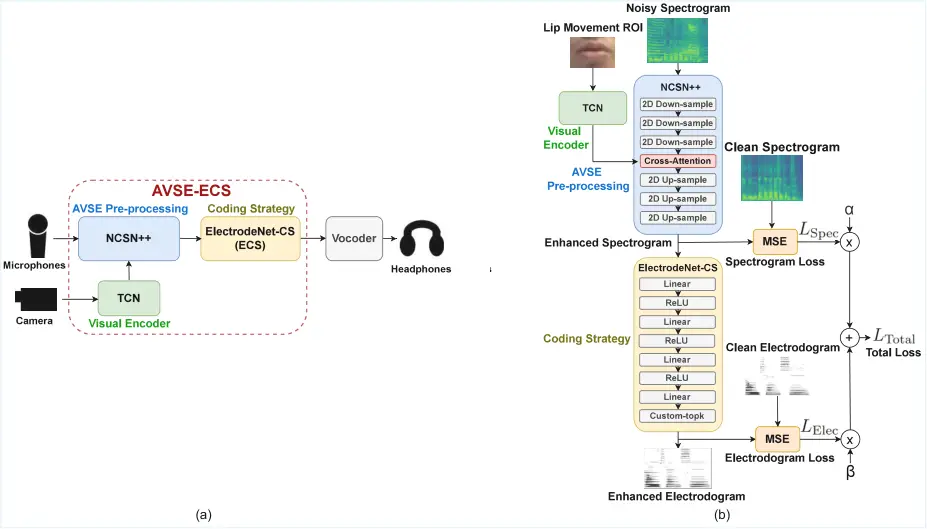

Research Center for Information Technology Innovation Technology,
Academia Sinica, Taipei 115201, Taiwan

# End-to-End Audio-Visual Learning for Cochlear Implant Sound Coding Simulations in Noisy Environments

Preprint: Author, JASA-EL

Meng-Ping Lin Affiliation: These authors contributed equally to this
work. Email: <mplin@media.ee.ntu.edu.tw> Affiliation: Graduate Institute
of Electronics Engineering and the Department of Electrical Engineering,
National Taiwan University, Taipei 106319, Taiwan    Enoch Hsin-Ho Huang
Affiliation: These authors contributed equally to this work.
Email: <enoch.huang@citi.sinica.edu.tw> Affiliation: Research Center for
Information Technology Innovation Technology, Academia Sinica, Taipei
115201, Taiwan    Shao-Yi Chien Email: <sychien@media.ee.ntu.edu.tw>
Affiliation: Graduate Institute of Electronics Engineering and the
Department of Electrical Engineering, National Taiwan University, Taipei
106319, Taiwan    Yu Tsao Email: <yu.tsao@citi.sinica.edu.tw>
Affiliation:  Corresponding author:  Affiliation: Department of
Electrical Engineering, Chung Yuan Christian University, Taoyuan 320314,
Taiwan

Published Online: 9 January 2026

###### Abstract

The cochlear implant (CI) is a successful biomedical device that enables
individuals with severe-to-profound hearing loss to perceive sound
through electrical stimulation, yet listening in noise remains
challenging. Recent deep learning advances offer promising potential for
CI sound coding by integrating visual cues. In this study, an
audio-visual speech enhancement (AVSE) module is integrated with the
ElectrodeNet-CS (ECS) model to form the end-to-end CI system, AVSE-ECS.
Simulations show that the AVSE-ECS system with joint training achieves
high objective speech intelligibility and improves the signal-to-error
ratio (SER) by 7.4666 dB compared to the advanced combination encoder
(ACE) strategy. These findings underscore the potential of AVSE-based CI
sound coding.

## I Introduction

The cochlear implant (CI) is a hearing device designed to help
individuals with severe-to-profound hearing loss regain partial hearing
\[35\]. The CI system involves an external, upgradable sound processor
that uses radio frequency to wirelessly link to a surgically implanted
internal device. The CI system transforms speech signals into electrical
pulse patterns, which are transmitted via the auditory nervous system to
the auditory cortex of the brain, enabling sound perception. Developed
through multidisciplinary collaboration, modern CIs now provide
impressive speech recognition performance. With well-designed sound
coding strategies that translate acoustic signals into electrode
stimulation patterns, such as the widely used advanced combination
encoder (ACE) strategy \[31\], most CI users can understand more than
80–90% of speech sentences in quiet conditions \[34\]. However, further
improvements are still needed, particularly in the processing of noisy
speech.

Speech enhancement (SE) provides a potential pathway for improving CI in
noisy environments. With the rapid development of deep learning, SE
approaches for CIs are gradually shifting from conventional signal
processing algorithms to data-driven neural networks \[20, 12, 24\].
Many SE approaches have been applied to CIs, including recent end-to-end
architectures \[10, 9\] that integrate both the pre-processing stage and
the sound coding strategy \[33, 16\], the core component responsible for
converting audio into electrical stimuli. However, these audio-only SE
(ASE) approaches, which rely solely on audio input, do not make use of
the visual cues available for processing background noise and
overlapping speech. In general audio applications, audio-visual speech
enhancement (AVSE), a common multimodal signal processing approach, has
been proposed to incorporate visual information such as lip movements
and facial expressions alongside audio signals, and has proven effective
in outperforming audio-only speech enhancement methods \[5, 6, 13, 17,
1, 25, 26\]. Therefore, the exploration of visual cues and AVSE models
for CI sound processing in noisy environments remains an important area
of ongoing research \[30, 19\].

A potential way to improve the CI system using an AVSE module is to
integrate it with the ElectrodeNet-CS (ECS) model \[15\]. The core
signal processing functions of the ACE coding strategy, envelope
detection and channel selection (CS), are not differentiable, making
them difficult to integrate with neural-network-based AVSE modules and
refine through data-driven regression. To overcome this limitation, the
ECS model replicates the core signal processing of ACE using a deep
neural network (DNN) with a dedicated CS function, achieving comparable
performance. Furthermore, the ECS coding strategy enables integration
with diverse front-end and post-processing components, as well as joint
training and end-to-end optimization. Consequently, the end-to-end
AVSE-ECS CI system, which incorporates the AVSE pre-processing module
and the ECS model, is proposed and validated using objective evaluations
in this study.

This paper is organized as follows. Section II explains the proposed
AVSE-based CI system. Section III describes the experimental setup for
objective evaluation. Section IV offers the results and discussion.
Section V draws the conclusion.

## II Method

### II.1 System Architecture

The system architecture of the proposed AVSE-ECS CI system is
illustrated in Fig. 1(a). The AVSE model incorporates auxiliary visual
cues to generate enhanced speech, which is further processed by the ECS
strategy into electrode stimulation patterns. A tone vocoder \[8\] is
used to convert electrode stimulation patterns into audible speech,
which can then be analyzed using objective evaluation methods.
Furthermore, this study introduces a joint training approach, and the
architecture for training the AVSE-ECS network is illustrated in Fig.
1(b). In this study, three CI network implementations are investigated:
ECS (Fig. 2(a)), ASE-ECS (Fig. 2(b)), and AVSE-ECS (Fig. 2(c)).

### II.2 Coding Strategy

This study adopts the DNN-based ECS model proposed in \[15\] as the
coding strategy, which is the core sound processing of the CI system.
This model consists of four dense layers with 1024, 512, 256, and 22
neurons, followed by a custom topk layer designed for the CS function.
The ECS model is pre-trained before being integrated into the AVSE-ECS
system. Pre-training involved paired spectral–temporal matrices across L
= 65 bins and M = 22 channels derived from clean speech processed with
the ACE strategy. The training was configured to preserve key
information in the $`N_{topk}=8`$ channels selected by the network,
while distributing lower envelope data across the remaining
$`M-N_{topk}`$ channels, using the L1 norm across all M channels.



Figure 1: (a) The architecture of the proposed cochlear implant (CI)
system, and the area enclosed by the dashed rectangle indicates the
AVSE-ECS network. (b) Overall joint-training architecture for the
AVSE-ECS network.

### II.3 Visual Encoder

The temporal convolution network (TCN) is employed as the visual encoder
as illustrated in Fig. 1. This model consists of a 3D convolutional
layer to process temporal sequences of frames, followed by a 2D
ResNet-18. The extracted visual features are then passed to the AVSE
model as visual embeddings. Note that a modified ResNet-18 visual
encoder is pre-trained using the Lip Reading in the Wild (LRW) dataset
\[7\]. To provide the most relevant visual cues for SE, the encoder
focuses on the mouth, referred to as the region of interest (ROI),
rather than utilizing the entire facial region. Facial landmarks are
detected using the Mediapipe face tracker \[23\], and the mouth ROI is
extracted accordingly. To reduce computational overhead during training,
the visual encoder is kept frozen and the embeddings are pre-extracted,
minimizing both memory usage and the number of training parameters.

### II.4 AVSE Pre-processing

For the AVSE pre-processing, this study adopts and modifies the NCSN++
model from \[28\]. As this original UNet is designed for generative
tasks, the timestep is set to 1 in this study, and the model’s output
directly serves as the enhanced speech. For audio feature preprocessing
before AVSE, the experimental settings are similar to \[21\]. Audio
signals are resampled to 16 kHz and converted into complex-valued STFT
representations. Using a window size of 510 and a periodic Hann window,
the resulting frequency dimension is F = 256. The hop length is set to 128. Each STFT spectrogram is truncated to T = 256 time frames, enabling
random cropping during batch training.

### II.5 Audio-Visual Fusion

This study explores the use of cross-attention blocks (red block in Fig.
1 (b)) to integrate audio and visual information. The attention
mechanism enables neural networks to focus on the most relevant input
parts, capture contextual dependencies, and facilitate alignment across
modalities. Following a similar approach to \[4\], the self-attention
blocks within the UNet architecture are modified by replacing the audio
keys and values with visual embeddings generated by the visual encoder.
Augmenting the audio input with lip movement information is intended to
utilize visual cues to enhance speech reconstruction and thereby improve
the overall performance of the SE system. To explain the design of the
audio-visual fusion module, the cross-attention mechanism is shown in
Fig. 2 (d). Audio features (in blue) and visual features (in green) are
provided as input, with dimensions indicated numerically.
$`{\bf M_{Q}}`$, $`{\bf M_{K}}`$, and $`{\bf M_{V}}`$ represent the
transformation layers for query, key, and value, respectively. They are
fused by the cross attention block, then reshaped as audio output.

Figure 2: Neural network implementations: (a) ECS, (b) ASE-ECS, (c)
AVSE-ECS, and (d) cross-attention block. As illustrated in Fig. 1, the
color blocks represent the modules of ECS (yellow), NCSN++ (blue), and
TCN visual encoder (green).

### II.6 Joint Training

Joint training, as shown in Fig. 1 (b), simultaneously optimizes both
the AVSE pre-processing module (blue block) and the ECS module (yellow
block) within an end-to-end framework. To guide the SE module toward
generating high-quality enhanced speech during the learning process, a
training objective called spectrogram loss is defined as follows:

```math
\begin{array}[]{l}L_{{\rm Spec}}={MSE}\left({\bf E},{\bf C}\right),\end{array} \tag{1}
```

where MSE is the mean squared error between $`{\bf E}`$, the enhanced
speech from the AVSE model, and $`{\bf C}`$, the clean ground truth. To
measure the distance for each enhanced-clean electrodogram pair, the
electrodogram loss is defined as

```math
\begin{array}[]{l}L_{{\rm Elec}}={MSE}\left({\bf\hat{E}},{\bf\hat{C}}\right),\end{array} \tag{2}
```

where $`{\bf\hat{E}}`$ is the enhanced electrodogram from the AVSE-ECS
model and $`{\bf\hat{C}}`$ is the clean electrodogram from the ECS
model. The clean electrodogram is derived from the output of the ECS
model when clean speech is provided as input. By narrowing the distance
between the clean electrodogram and the enhanced electrodogram, the
output electrode pattern in AVSE-ECS can be further refined, reducing
the impact of input noise and improving speech intelligibility.

By considering $`L_{\rm Spec}`$ and $`L_{\rm Elec}`$ concurrently, the
total loss is defined as

```math
\begin{array}[]{l}L_{{\rm Total}}=\alpha*L_{{\rm Spec}}+\beta*L_{{\rm Elec}},\end{array} \tag{3}
```

where $`{\alpha}`$ and $`{\beta}`$ are weights for $`L_{\rm Spec}`$ and
$`L_{\rm Elec}`$, respectively.

## III Experiments

This section presents the experimental setups in this study.

### III.1 Objective Evaluation Metrics

To assess the performance of CI systems, three commonly-used objective
evaluation metrics are employed: short-time objective intelligibility
(STOI) \[29\], extended short-time objective intelligibility (ESTOI)
\[18\], and normalized covariance measure (NCM) \[11\]. These metrics
estimate speech intelligibility by measuring the correlation between
CI-vocoded and clean speech. Furthermore, the neural models are compared
using the signal-to-error ratio (SER) \[22\], where the error components
include remaining noise after SE processing as well as artifacts and
distortions introduced by the SE model.

### III.2 Dataset

The audiovisual dataset used in this study is based on the Taiwan
Mandarin Hearing in Noise Test (TMHINT) speech material \[32\], which
consists of 16 phonemically balanced lists. Each list contains 20
sentences, with each sentence consisting of 10 syllables (Chinese
characters). The duration of each utterance ranges from approximately 2
to 4 seconds. The audio-only dataset and the audio-visual dataset are
both based on TMHINT sentences. The audio-only TMHINT dataset is used to
train the ECS model, as described in \[15\], with the exception that 320
clean sentences from Lists 1 to 8 are used in this study.

For training and inference of the AVSE-ECS system, the Taiwan Mandarin
Speech with Video (TMSV) dataset \[6\], consisting of speech and video
recordings of TMHINT sentences, is adopted. The method for using the
TMSV dataset is similar to that described in \[6\]. This dataset
includes speech recordings from 18 native Mandarin speakers (13 males
and 5 females). In this study, considering gender balance, 8 speakers (4
male, 4 female) from TMSV are selected for training and validation. For
each speaker with 320 utterances, sentences 1-190 are used for training,
and sentences 191-200 for validation. These speech files are mixed with
100 types of noise \[14\] at five signal-to-noise ratio (SNR) levels
(-12, -6, 0, 6, 12 dB). To reduce training time, a total of 12,000
utterances are randomly sampled. For evaluation, utterances 201–320 from
two unseen speakers (1 male, 1 female) are used. These are corrupted
with five noise types including music, street noise, engine noise, baby
cry, and pink noise, and mixed at SNR levels of -1, -4, -7, and -10 dB,
yielding a total of 4,800 noisy utterances. The training and testing
sets are fully mismatched in terms of speech content, noise types,
speakers, and SNR levels to ensure robust generalization.

### III.3 Training Configuration

According to the total loss $`L_{\rm Total}`$ introduced in Section 2.6,
two types of training configurations are designed to train the AVSE-ECS
Network: pre-trained and joint training. For the pre-trained method, the
AVSE model is trained independently and concatenated with ECS. For the
joint training method, an untrained AVSE network is connected to ECS,
and the training of the full AVSE-ECS network includes the spectrogram
loss $`L_{\rm Spec}`$ and the electrodogram loss $`L_{\rm Elec}`$. The
pre-trained method can be regarded as a special case of joint training,
which only includes $`L_{\rm Spec}`$ in the training stage by setting
$`{\beta}`$ = 0. Note that in all configurations, the ECS models are
pre-trained and concatenated after the AVSE model. During the joint
training stage, all the parameters in ECS are frozen, and only the
parameters in the AVSE model are tuned.

### III.4 Objective Evaluation

The following three experiments are conducted for objective evaluation.

1.  1.  ECS with clean and noisy speech
2.  2.  AVSE-ECS with different $`\beta`$ values
3.  3.  Comparison of ACE, ECS, ASE-ECS, AVSE-ECS

In the first experiment, the pre-trained ECS model is evaluated on the
TMSV test set using STOI, ESTOI, and NCM metrics under both clean and
noisy conditions. All evaluations are conducted on unseen speakers, with
the objective scores for the noisy condition averaged over different
noise types and SNR levels.

The second experiment examines how model weights in joint training
affect speech intelligibility. Following the pre-trained method with
$`\alpha`$ = 1, and different $`\beta`$ values are studied. The result
helps select $`\beta`$ for the next experiment.

The third experiment compares three CI network implementations: ECS
(Fig. 2(a)), ASE-ECS (Fig. 2(b)), and AVSE-ECS (Fig. 2(c)), with the
common ACE coding strategy as the baseline. Apart from the ECS model
without the SE function, the ASE-ECS model is an audio-only system in
which self-attention replaces the cross-attention mechanism used in the
AVSE-ECS model. AVSE-ECS, the proposed end-to-end CI system, is
evaluated using both the pre-trained method and the joint training
method. For all experiments, $`{\alpha}`$ is set to 1, and in the joint
training setup, $`{\beta}`$ is set to 0.5.

## IV Results and Discussion

### IV.1 ECS with clean and noisy speech

The overall objective intelligibility of the ECS model under clean and
noisy conditions is shown in Table 1. For clean speech, ECS achieves an
STOI score of 0.7604, which drops to 0.4870 under noisy conditions,
averaged across speakers, noise types and SNR levels. Similar declines
in ESTOI and NCM occur as conditions shift from clean to noisy. The ECS
model’s performance declines under noisy conditions, as it only
simulates the ACE strategy without SE capability.

|              |                    |                     |                   |
| ------------ | ------------------ | ------------------- | ----------------- |
| Input Speech | STOI$`{\uparrow}`$ | ESTOI$`{\uparrow}`$ | NCM$`{\uparrow}`$ |
| Clean        | 0.7604             | 0.5866              | 0.6809            |
| Noisy        | 0.4870             | 0.2073              | 0.3258            |

Table 1: Objective evaluation of the ECS model

|           |                    |                     |                   |
| --------- | ------------------ | ------------------- | ----------------- |
| $`\beta`$ | STOI$`{\uparrow}`$ | ESTOI$`{\uparrow}`$ | NCM$`{\uparrow}`$ |
| 1.0       | 0.6196             | 0.3705              | 0.5217            |
| 0.5       | 0.6305             | 0.3899              | 0.5211            |
| 0.25      | 0.6295             | 0.3879              | 0.5199            |

Table 2: Objective evaluation of the AVSE-ECS network with different
$`\beta`$ values under noisy conditions

### IV.2 AVSE-ECS with different $`\beta`$ values

Table 2 presents the objective evaluation results of AVSE-ECS with
different joint training setups. In noisy conditions, AVSE-ECS attains
STOI scores of 0.6295 ($`\beta`$ = 0.25), 0.6305 ($`\beta`$ = 0.5), and
0.6196 ($`\beta`$ = 1), averaged over speakers, noise types and SNR
levels. Similar trends in STOI and ESTOI scores appear across the three
$`\beta`$ values. These results suggest that emphasizing $`\beta`$, the
weight on the electrodogram loss $`L_{\rm Elec}`$, to 1 does not
necessarily improve speech intelligibility. On the other hand, a smaller
$`\beta`$ value of 0.25 limits the refinement of the electrodogram.
Among the tested values, $`\beta`$ = 0.5 results in the highest STOI and
ESTOI scores. Although $`\beta=1`$ achieves a slightly higher NCM score
(0.5217) compared to $`\beta=0.5`$ (0.5211), the difference is
considerably small. Therefore, the $`\beta`$ value of 0.5 is selected
for the subsequent experiment.

|          |                |                    |                     |                   |                                  |
| -------- | -------------- | ------------------ | ------------------- | ----------------- | -------------------------------- |
| Method   | Configuration  | STOI$`{\uparrow}`$ | ESTOI$`{\uparrow}`$ | NCM$`{\uparrow}`$ | $`\Delta`$SER (dB)$`{\uparrow}`$ |
| ACE      | \-             | 0.4870             | 0.2067              | 0.3262            | \-                               |
| ECS      | \-             | 0.4870             | 0.2073              | 0.3258            | 0.0761                           |
| ASE-ECS  | Pre-trained    | 0.5943             | 0.3557              | 0.4914            | 3.8075                           |
| AVSE-ECS | Pre-trained    | 0.6141             | 0.3672              | 0.5067            | 3.7291                           |
| AVSE-ECS | Joint training | 0.6305             | 0.3899              | 0.5211            | 7.4666                           |

Table 3: Objective evaluation of various CI implementations under noisy
conditions

### IV.3 Comparison of ACE, ECS, ASE-ECS, and AVSE-ECS

Table 3 compares various CI system implementations under noisy
conditions, with objective evaluation scores averaged across speakers,
noise types and SNR levels. The ECS model achieves an average STOI score
of 0.4870, comparable to the ACE strategy. With the pre-trained setup,
the audio-only ASE-ECS model achieves a STOI score of 0.5943, surpassing
the ECS strategy without the SE module. Incorporating visual cues in the
AVSE-ECS model further increases STOI scores to 0.6141 (pre-trained) and
0.6305 (joint training). Similar trends appear in ESTOI and NCM scores.

The average SER scores for all models are higher than that of the ACE
strategy. The SER difference for the ECS model compared to ACE is 0.0761
dB, while the scores for ASE-ECS (3.8075 dB) and pre-trained AVSE-ECS
(3.7291 dB) are close to each other. Moreover, the joint-training model
achieves the highest SER score, exceeding ACE by 7.4666 dB.

Therefore, integrating ASE and AVSE models improves objective speech
intelligibility over the ECS model, while the AVSE-ECS model with visual
cues outperforms the audio-only ASE-ECS model in STOI, ESTOI, and NCM
scores. In joint training that incorporates the clean electrodogram as
an auxiliary target, the AVSE model can directly generate enhanced
electrode stimulation patterns and achieve the highest scores in this
study.

### IV.4 Discussion

This study can be further extended. Beyond the comprehensive objective
evaluations, subjective listening tests are planned for the proposed
AVSE-ECS method with both normal-hearing participants using CI
simulations and actual CI users. Additionally, physiological
evaluations, such as responses to auditory stimuli processed by the
proposed approaches, may provide further objective evidence in human
subjects.

In this study, the objective evaluation relies on a single TMSV dataset
in one language, Mandarin Chinese. As highlighted in prior studies \[36,
27, 3\], regression-based tasks such as speech enhancement and speech
separation are generally less sensitive to language differences. As a
result, models trained on English speech data have shown effective
generalization to other languages. Moreover, to ensure the
cross-language, cross-speaker, cross-dataset, and cross-validation
generalizability of the proposed approach, further studies using diverse
datasets are planned. Analyses with a wider range of noise types are to
be conducted, as the present results indicate no clear differences among
the five noise types examined. Since audiovisual datasets are less
accessible than audio-only ones, further dataset collection and
development are needed in terms of size, diversity, and real-world
coverage. For each dataset, multiple runs with different random seeds
will be repeated to ensure the consistency and robustness of the
proposed system.

Issues in implementing AVSE in CI hardware need to be tackled. The
proposed AVSE system with end-to-end CI processing can be executed on a
personal computer, making it suitable for applications with relaxed
timing constraints, such as movie streaming, online courses, and
playback scenarios. Latency is challenging for real-time deployment on
CI sound processors, but integration with external edge devices such as
smartphones, tablets, or smart glasses can offload computation from
implant-side processors, enabling more advanced audiovisual processing
in everyday use. Looking ahead, we plan to reduce the model’s
computational load through techniques such as pruning and knowledge
distillation. Further investigations into the NCSN++ model, the proposed
AVSE backbone, will assess lightweight alternatives for hardware
implementation and seamless integration into the hearing assistance
ecosystem. In the future, advances in device processing power are
expected to reduce signal processing latency and make the AVSE module a
feasible application.

It is worth noting to consider a number of related topics. A recent
study demonstrates an analogous architecture to an end-to-end neural
amplifier designed for hearing aids \[2\]. Therefore, more advanced AVSE
pre-processing methods and end-to-end frameworks will be explored to
enhance the overall CI sound processing system. Furthermore, the role of
multisensory cues in CI perception will be investigated to provide more
natural sound and enhance communication and well-being for CI users.
Research on deep learning and CI sound processing is an ongoing journey.

## V Conclusion

This paper introduces a novel end-to-end CI system, AVSE-ECS, which
integrates an audio-visual speech enhancement (AVSE) model with a
deep-learning-based sound coding strategy, ElectrodeNet-CS (ECS). This
system exhibits strong noise suppression capabilities and effectively
mitigates severe performance degradation of the CI in noisy
environments. Joint training of the end-to-end system enhances electrode
stimulation patterns for greater clarity and recognizability, as
verified through experiments. Future work includes subjective listening
evaluations, cross-dataset generalization studies, and exploration of
alternative AVSE preprocessing frameworks. The methods and findings of
this study may provide insights into end-to-end CI coding strategies,
multimodal processing, and related fields.

## VI Author Declarations

### VI.1 Conflict of Interest

The authors have no conflicts to disclose.

### VI.2 Ethics Approval

This study was based solely on CI simulations and did not involve human
participants, patient data, or animal subjects.

## VII Data Availability

The data supporting the results of this research are available from the
corresponding author upon reasonable request.

## References

- \[1\] A. Adeel, M. Gogate, A. Hussain, and W. M. Whitmer (2021)
  Lip-reading driven deep learning approach for speech enhancement. IEEE
  Trans. Emerg. Top. Comput. Intell. 5 (3), pp. 481–490. Cited by: §I.
- \[2\] S. Ahmed, R. E. Zezario, H.-G. Yuan, A. Hussain, H.-M. Wang,
  W.-H. Chung, and Y. Tsao (2025) NeuroAMP: a novel end-to-end general
  purpose deep neural amplifier for personalized hearing aids. to appear
  in IEEE Trans. Artif. Intell. Cited by: §IV.4.
- \[3\] R. Chao, R. Nasretdinov, Y. C. F. Wang, A. Jukić, S.-W. Fu,
  and Y. Tsao (2025) Universal speech enhancement with regression and
  generative mamba. In Proc. Interspeech, Rio de Janeiro, Brazil. Cited
  by: §IV.4.
- \[4\] C.-W. Chen, J.-C. Hou, Y. Tsao, J.-C. Chen, and S.-Y.
  Chien (2024) DAVSE: a diffusion-based generative approach for
  audio-visual speech enhancement. In Proc. 3rd COG-MHEAR Workshop on
  Audio-Visual Speech Enhancement (AVSEC), Dublin, Ireland. Cited by:
  §II.5.
- \[5\] S.-Y. Chuang, Y. Tsao, C.-C. Lo, and H.-M. Wang (2020) Lite
  audio-visual speech enhancement. In Proc. Interspeech, Shanghai,
  China. Cited by: §I.
- \[6\] S.-Y. Chuang, H.-M. Wang, and Y. Tsao (2022) Improved lite
  audio-visual speech enhancement. IEEE/ACM Trans. Audio Speech Lang.
  Process. 30, pp. 1345–1359. Cited by: §I, §III.2.
- \[7\] J. S. Chung and A. Zisserman (2016) Lip reading in the wild. In
  Proc. ACCV, Cited by: §II.3.
- \[8\] M. F. Dorman, P. C. Loizou, A. J. Spahr, and E. Maloff (2002) A
  comparison of the speech understanding provided by acoustic models of
  fixed-channel and channel-picking signal processors for cochlear
  implants. J. Speech Lang. Hear. Res. 44, pp. 1–6. Cited by: §II.1.
- \[9\] T. Gajecki and W. Nogueira (2025) Adversarial learning for
  end-to-end cochlear speech denoising using lightweight deep learning
  models. In Proc. IEEE Int. Conf. Acoust. Speech Signal Process.
  (ICASSP), pp. 1–5. Cited by: §I.
- \[10\] T. Gajecki, Y. Zhang, and W. Nogueira (2023) A deep denoising
  sound coding strategy for cochlear implants. IEEE Trans. Biomed. Eng.
  70 (9), pp. 2700–2709. Cited by: §I.
- \[11\] R. L. Goldsworthy and J. E. Greenberg (2004) Analysis of
  speech-based speech transmission index methods with implications for
  nonlinear operations. J. Acoust. Soc. Amer. 116 (6), pp. 3679–3689.
  Cited by: §III.1.
- \[12\] F. Henry, M. Glavin, and E. Jones (2023) Noise reduction in
  cochlear implant signal processing: a review and recent developments.
  IEEE Rev. Biomed. Eng. 16, pp. 319–331. Cited by: §I.
- \[13\] J.-C. Hou, S.-S. Wang, Y.-H. Lai, Y. Tsao, H.-W. Chang, and
  H.-M. Wang (2018) Audio-visual speech enhancement using multimodal
  deep convolutional neural networks. IEEE Trans. Emerg. Top. Comput.
  Intell. 2 (2), pp. 117–128. Cited by: §I.
- \[14\] G. Hu (2004) 100 nonspeech environmental sounds. Note:
  Available online:
  http://www.cse.ohio-state.edu/pnl/corpus/HuCorpus.html Cited by:
  §III.2.
- \[15\] E. H.-H. Huang, R. Chao, Y. Tsao, and C.-M. Wu (2024)
  ElectrodeNet—A deep-learning-based sound coding strategy for cochlear
  implants. IEEE Trans. Cogn. Dev. Syst. 16 (1), pp. 346–357. Cited by:
  §I, §II.2, §III.2.
- \[16\] E. H.-H. Huang, C.-M. Wu, and H.-C. Lin (2021) Combination and
  comparison of sound coding strategies using cochlear implant
  simulation with mandarin speech. IEEE Trans. Neural Syst. Rehabil.
  Eng. 29, pp. 2407–2416. Cited by: §I.
- \[17\] E. Ideli, B. Sharpe, I. V. Bajić, and R. G. Vaughan (2019)
  Visually assisted time-domain speech enhancement. In Proc. GlobalSIP,
  Cited by: §I.
- \[18\] J. Jensen and C. H. Taal (2016) An algorithm for predicting the
  intelligibility of speech masked by modulated noise maskers. IEEE/ACM
  Trans. Audio Speech Lang. Process. 24 (11), pp. 2009–2022. Cited by:
  §III.1.
- \[19\] R. L. Lai, J.-C. Hou, I.-C. Chern, K.-H. Hung, Y.-T. Chen, M.
  Gogate, T. Arslan, A. Hussain, C.-W. Lin, and Y. Tsao (2025)
  Leveraging self-supervised audio-visual pretrained models to improve
  vocoded speech intelligibility in cochlear implant simulation. IEEE
  Trans. Biomed. Eng.. Note: to appear Cited by: §I.
- \[20\] Y. Lai, F. Chen, S. Wang, X. Lu, Y. Tsao, and C. Lee (2017) A
  deep denoising autoencoder approach to improving the intelligibility
  of vocoded speech in cochlear implant simulation. IEEE Trans. Biomed.
  Eng. 64 (7), pp. 1568–1578. Cited by: §I.
- \[21\] M.-P. Lin, J.-C. Hou, C.-W. Chen, S.-Y. Chien, J.-C. Chen, X.
  Lu, and Y. Tsao (2025) Bridging the multi-modality gaps of audio,
  visual and linguistic for speech enhancement. arXiv preprint
  arXiv:2501.13375. Cited by: §II.4.
- \[22\] Y. Liu, N. Nower, Y. Yan, and M. Unoki (2015) Restoration of
  instantaneous amplitude and phase of speech signal in noisy
  reverberant environments. In 2015 23rd European Signal Processing
  Conference (EUSIPCO), pp. 879–883. Cited by: §III.1.
- \[23\] C. Lugaresi, J. Tang, H. Nash, C. McClanahan, E. Uboweja, M.
  Hays, F. Zhang, C. Chang, M. G. Yong, J. Lee, et al. (2019) Mediapipe:
  a framework for building perception pipelines. arXiv preprint
  arXiv:1906.08172. Cited by: §II.3.
- \[24\] N. Mamun and J. H. L. Hansen (2024) Speech enhancement for
  cochlear implant recipients using deep complex convolution transformer
  with frequency transformation. IEEE/ACM Trans. Audio Speech Lang.
  Process. 32, pp. 2616–2629. Cited by: §I.
- \[25\] D. Michelsanti, Z.-H. Tan, S.-X. Zhang, Y. Xu, M. Yu, D. Yu,
  and J. Jensen (2021) An overview of deep-learning-based audio-visual
  speech enhancement and separation. IEEE/ACM Trans. Audio Speech Lang.
  Process. 29, pp. 1368–1396. Cited by: §I.
- \[26\] M. Sadeghi, S. Leglaive, X. Alameda-Pineda, L. Girin, and R.
  Horaud (2020) Audio-visual speech enhancement using conditional
  variational auto-encoders. IEEE/ACM Trans. Audio Speech Lang. Process.
  28, pp. 1788–1800. Cited by: §I.
- \[27\] A. Sankar, S. Anand, P. Varadhan, S. Thomas, M. Singal, S.
  Kumar, et al. (2024) IndicVoices-R: Unlocking a massive multilingual
  multi-speaker speech corpus for scaling indian TTS. Adv. Neural Inf.
  Process. Syst. 37, pp. 68161–68182. Cited by: §IV.4.
- \[28\] Y. Song, J. S.-Dickstein, D. P. Kingma, A. Kumar, S. Ermon,
  and B. Poole (2021) Score-based generative modeling through stochastic
  differential equations. In Proc. Int. Conf. Learn. Represent. (ICLR),
  Virtual Conference. Cited by: §II.4.
- \[29\] C. H. Taal, R. C. Hendriks, R. Heusdens, and J. Jensen (2011) A
  short-time objective intelligibility measure for time-frequency
  weighted noisy speech. IEEE/ACM Trans. Audio Speech Lang. Process. 19
  (7), pp. 2125–2136. Cited by: §III.1.
- \[30\] R.-Y. Tseng, T.-W. Wang, S.-W. Fu, C.-Y. Lee, and Y.
  Tsao (2021) A study of joint effect on denoising techniques and visual
  cues to improve speech intelligibility in cochlear implant simulation.
  IEEE Trans. Cogn. Dev. Syst. 13 (4), pp. 984–994. Cited by: §I.
- \[31\] A. E. Vandali, L. A. Whitford, K. L. Plant, G. M. Clark, et
  al. (2000) Speech perception as a function of electrical stimulation
  rate: using the nucleus 24 cochlear implant system. Ear Hear. 21 (6),
  pp. 608–624. Cited by: §I.
- \[32\] L. L. Wong, S. D. Soli, S. Liu, N. Han, and M.-W. Huang (2007)
  Development of the Mandarin hearing in noise test (MHINT). Ear Hear.
  28 (2), pp. 70S–74S. Cited by: §III.2.
- \[33\] J. Wouters, H. J. McDermott, and T. Francart (2015) Sound
  coding in cochlear implants: from electric pulses to hearing. IEEE
  Signal Process. Mag. 32 (2), pp. 67–80. Cited by: §I.
- \[34\] F. Zeng, S. Rebscher, W. Harrison, X. Sun, and H. Feng (2008)
  Cochlear implants: system design, integration, and evaluation. IEEE
  Rev. Biomed. Eng. 1, pp. 115–142. Cited by: §I.
- \[35\] F. Zeng (2022) Celebrating the one millionth cochlear implant.
  JASA-EL 2 (7). Cited by: §I.
- \[36\] Y. Zhang, R. J. Weiss, H. Zen, Y. Wu, Z. Chen, R. J.
  Skerry-Ryan, et al. (2019) Learning to speak fluently in a foreign
  language: multilingual speech synthesis and cross-language voice
  cloning. In Proc. Interspeech, Graz, Austria, pp. 2080–2084. Cited by:
  §IV.4.
