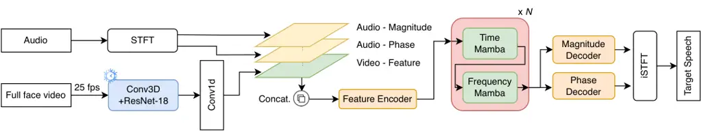

Chao Ren Li Hung Huang Fu Cheng Tsao Academia SinicaTaiwan National
Taiwan UniversityTaiwan NVIDIA

# Leveraging Mamba with Full-Face Vision for Audio-Visual Speech Enhancement

Rong    Wenze    You-Jin    Kuo-Hsuan    Sung-Feng    Szu-Wei   
Wen-Huang    Yu Affiliation: CITI Affiliation: CSIE Affiliation: 

###### Abstract

Recent Mamba-based models have shown promise in speech enhancement by
efficiently modeling long-range temporal dependencies. However, models
like Speech Enhancement Mamba (SEMamba) remain limited to single-speaker
scenarios and struggle in complex multi-speaker environments such as the
cocktail party problem. To overcome this, we introduce AVSEMamba, an
audio-visual speech enhancement model that integrates full-face visual
cues with a Mamba-based temporal backbone. By leveraging spatiotemporal
visual information, AVSEMamba enables more accurate extraction of target
speech in challenging conditions. Evaluated on the AVSEC-4 Challenge
development and blind test sets, AVSEMamba outperforms other monaural
baselines in speech intelligibility (STOI), perceptual quality (PESQ),
and non-intrusive quality (UTMOS), and achieves 1st place on the
monaural leaderboard.

###### keywords

speech enhancement, audio-visual speech enhancement, AVSEC-4 Challenge,
state-space models, Mamba

^(†)^(†)email: d13922037@ntu.edu.tw, yu.tsao@citi.sinica.edu.tw

## 1 Introduction

The cocktail party problem, which involves isolating a target speaker in
noisy, multi-speaker environments, remains a fundamental challenge in
speech enhancement. Human listeners excel in such conditions by
naturally integrating auditory and visual cues such as lip motion and
facial expressions. Audio-Visual Speech Enhancement (AVSE) systems aim
to replicate this multisensory processing to improve intelligibility
under adverse acoustic conditions.

AVSE methods have evolved notably in recent years. Early works focused
on lip motion to guide enhancement \[1, 2\], while later studies
addressed robustness to occlusions and facial variance \[3\]. Subsequent
efforts expanded visual input from the mouth region to the full face
\[4\], and incorporated SSL-based cross-modal consistency constraints
for better alignment \[5\]. More recently, DCUC-Net \[6\] leveraged a
Conformer-based architecture and scene-level visual cues beyond facial
regions to enhance separation quality.

While recent AVSE systems have shown strong performance, most
architectures rely on attention-based mechanisms that may struggle with
scalability in long sequences. Given the efficiency and favorable memory
scaling of state space models, we investigate AVSEMamba. This hybrid
AVSE system integrates full-face video and audio features through
Mamba-based temporal-frequency modeling. Our approach is designed to
handle visually guided speech enhancement under multi-speaker
conditions, and we validate its effectiveness on the AVSEC-4 Challenge
benchmark with consistent improvements in intelligibility, perceptual
quality, and ASR accuracy.

## 2 Related Work

In terms of temporal modeling, early AVSE systems employed CNNs and
RNNs, which were later replaced by Transformer-based architectures for
enhanced sequence modeling. However, Transformers scale quadratically
with input length, limiting their suitability for long-context or
real-time applications.

State space models (SSMs) offer an efficient alternative with linear
complexity. Among them, Mamba introduces input-conditioned selective
scanning, enabling scalable long-range modeling. SAV-Net \[7\]
introduced Mamba into audio-visual speech enhancement (AVSE) using
scene-level visual cues. Separately, SEMamba and its extension USEMamba
\[8, 9\] applied Mamba to monaural enhancement with low compute cost.
Building on this line, AVSEMamba incorporates full-face visual input
into a Mamba-based AVSE framework, enabling robust target speech
extraction in multi-speaker scenarios.

Figure 1: System architecture of the proposed AVSEMamba model.

## 3 Audio-Visual Speech Enhancement with Mamba

We propose a hybrid AVSEMamba architecture that extends the SEMamba
\[8\] framework by integrating full-face visual information for improved
performance in multi-speaker scenarios. The model leverages Mamba-based
state space modeling to capture long-range dependencies across both
temporal and frequency dimensions.

The system consists of two synchronized input streams:

- •
  Audio Stream: Raw waveforms are transformed via Short-Time Fourier
  Transform (STFT), producing magnitude and phase components, each
  processed by a convolutional frontend.
- •
  Visual Stream: Full-face video (25 fps) is passed through a pretrained
  and frozen 3D ResNet-18 to extract spatiotemporal embeddings. These
  are temporally aligned with the audio via a Conv1D layer.

The audio magnitude, phase, and visual features are concatenated and
passed through a shared Feature Encoder, which projects them into a
common representation space. This fused representation is then fed into
a stack of Mamba-based temporal-frequency modeling blocks, which operate
jointly across time and frequency axes. Finally, the network predicts
enhanced magnitude and phase components through separate decoders, and
the target speech waveform is reconstructed using inverse STFT, as
illustrated in Fig. 1.

By leveraging Mamba’s structured sequence modeling and full-face visual
context, our system captures both spatial-temporal and cross-modal
dependencies, resulting in robust enhancement performance under
occlusion, reverberation, and acoustic mismatch.

## 4 Experiments

We evaluate our proposed AVSEMamba model on the AVSEC-4 Challenge
dataset using monophonic audio input and prediction only. The dataset
comprises synchronized full-face video and audio data under various
acoustic and visual interference conditions. All evaluations are
conducted using mono audio, in contrast to the challenge’s default
binaural setup.

### 4.1 Dataset

The AVSEC-4 training set comprises 34,524 mono scenes with 605 target
speakers and interferers, sampled from 405 competing speakers, and 7,346
noise clips spanning 15 categories, including speech, non-speech (e.g.,
domestic and environmental), and music. Target speech is derived from
the LRS3 dataset.

The development set consists of 3,306 mono scenes (approximately 8
hours) with 85 target speakers and similar interferer sources. Audio is
sampled at 16 kHz with 16-bit depth.

### 4.2 Training Strategy

Models are trained for 450 epochs using the AdamW optimizer with a batch
size of 2. The loss function is a weighted combination of waveform
$`L_{1}`$ loss, STFT magnitude loss, complex spectral loss, phase loss,
and consistency loss.

### 4.3 Results on Development Set

As shown in Table 1, our AVSEMamba achieves notably improvements over
the noisy input and the Challenge-provided monaural baseline.
Specifically, our model improves MBSTOI by 93.1% (from 0.4161 to 0.8037)
and PESQ by 128.5% (from 1.30 to 2.97). Notably, the UTMOS score of our
model is also very close to that of the clean target (2.32 vs. 2.36).

|                  |        |      |       |
| ---------------- | ------ | ---- | ----- |
| Method           | MBSTOI | PESQ | UTMOS |
| Clean target     | \-     | \-   | 2.36  |
| Noisy Input      | 0.4161 | 1.30 | 1.32  |
| Baseline (Mono)  | \-     | 1.21 | 1.26  |
| Ours (AVSEMamba) | 0.8037 | 2.97 | 2.32  |

Table 1: Performance on the AVSEC-4 development set (mono audio). Note:
mono audio was duplicated for MBSTOI.

|                  |      |      |       |
| ---------------- | ---- | ---- | ----- |
| Method           | PESQ | STOI | UTMOS |
| Noisy Input      | 1.31 | 0.55 | 1.37  |
| Baseline (Mono)  | 1.25 | 0.33 | 1.26  |
| Ours (AVSEMamba) | 2.31 | 0.77 | 2.24  |

Table 2: Results on the AVSEC-4 Blind Test Set (Mono Audio).

### 4.4 Results on Blind Test Set

Table 2 summarizes the performance on the AVSEC-4 blind test set. PESQ
and STOI scores are reported by the official leaderboard (evaluated on a
subset), while UTMOS was computed on the full test set. Compared to the
noisy input, AVSEMamba achieves a 76.3% improvement in PESQ (1.31 →
2.31), a 40.0% gain in STOI (0.55 → 0.77), and a 63.5% increase in UTMOS
(1.37 → 2.24).

## 5 Conclusion

We presented AVSEMamba, a hybrid audio-visual speech enhancement
architecture that integrates full-face visual cues with Mamba-based
temporal-frequency modeling. By leveraging pre-trained spatiotemporal
visual features and efficient state-space modeling, AVSEMamba
effectively addresses visually guided enhancement in multi-speaker
conditions.

Evaluated on the AVSEC-4 Challenge, AVSEMamba achieved strong
performance across all metrics and ranked first in PESQ on the official
leaderboard, demonstrating the potential of state-space models for
audio-visual speech enhancement.

## 6 Acknowledgment

This work was supported in part by the NVIDIA Academic Grant Program.
The authors gratefully acknowledge NVIDIA Corporation for providing GPU
resources used in this research.

## References

- \[1\] T. Afouras, J. S. Chung, A. Senior, O. Vinyals, and
  A. Zisserman, “Deep audio-visual speech recognition,” _IEEE
  transactions on pattern analysis and machine intelligence_, vol. 44,
  no. 12, pp. 8717–8727, 2018.
- \[2\] A. Ephrat, I. Mosseri, O. Lang, T. Dekel, K. Wilson,
  A. Hassidim, W. T. Freeman, and M. Rubinstein, “Looking to listen at
  the cocktail party: A speaker-independent audio-visual model for
  speech separation,” _arXiv preprint arXiv:1804.03619_, 2018.
- \[3\] T. Afouras, J. S. Chung, and A. Zisserman, “My lips are
  concealed: Audio-visual speech enhancement through obstructions,”
  _arXiv preprint arXiv:1907.04975_, 2019.
- \[4\] S.-W. Chung, S. Choe, J. S. Chung, and H.-G. Kang, “Facefilter:
  Audio-visual speech separation using still images,” _arXiv preprint
  arXiv:2005.07074_, 2020.
- \[5\] I.-C. Chern, K.-H. Hung, Y.-T. Chen, T. Hussain, M. Gogate,
  A. Hussain, Y. Tsao, and J.-C. Hou, “Audio-visual speech enhancement
  and separation by utilizing multi-modal self-supervised embeddings,”
  in _2023 IEEE ICASSP workshop_. IEEE, 2023, pp. 1–5.
- \[6\] S. Ahmed, C.-W. Chen, W. Ren, C.-J. Li, E. Chu, J.-C. Chen,
  A. Hussain, H.-M. Wang, Y. Tsao, and J.-C. Hou, “Deep complex u-net
  with conformer for audio-visual speech enhancement,” _arXiv preprint
  arXiv:2309.11059_, 2023.
- \[7\] X. Qian, J. Gao, Y. Zhang, Q. Zhang, H. Liu, L. P. Garcia, and
  H. Li, “SAV-SE: Scene-aware audio-visual speech enhancement with
  selective state space model,” _IEEE Journal of Selected Topics in
  Signal Processing_, 2025.
- \[8\] R. Chao, W.-H. Cheng, M. La Quatra, S. M. Siniscalchi, C.-H. H.
  Yang, S.-W. Fu, and Y. Tsao, “An investigation of incorporating mamba
  for speech enhancement,” _in Proc. IEEE SLT_, 2024.
- \[9\] R. Chao, R. Nasretdinov, Y.-C. F. Wang, A. Jukić, S.-W. Fu, and
  Y. Tsao, “Universal speech enhancement with regression and generative
  mamba,” _arXiv preprint arXiv:2505.21198_, 2025.
