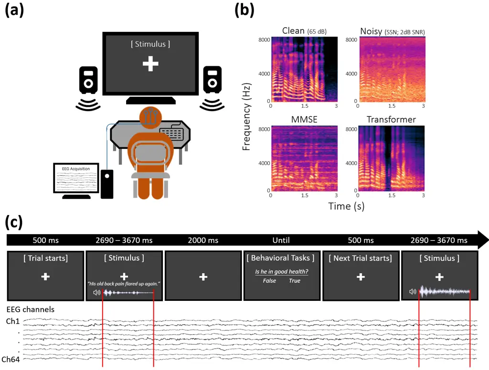
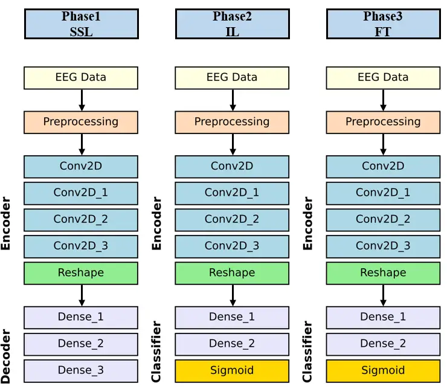
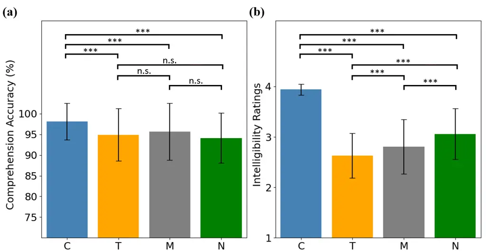
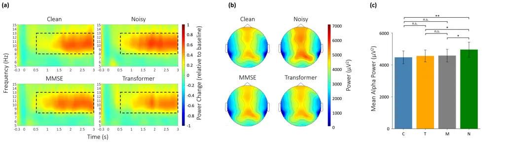
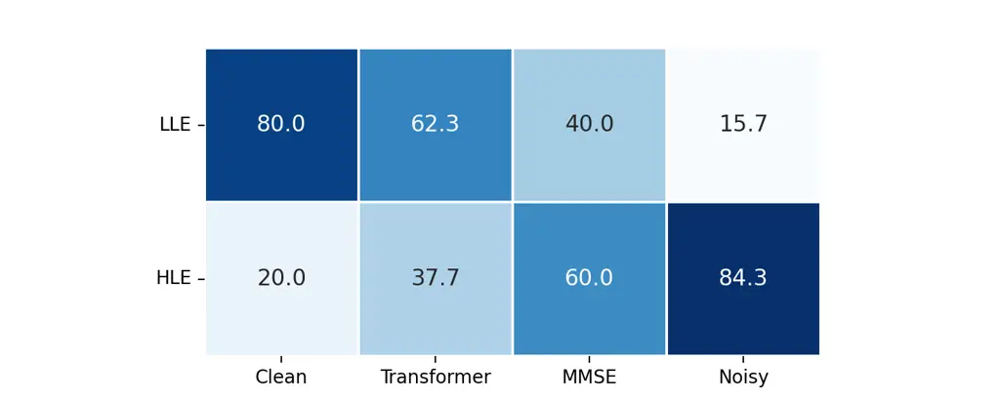
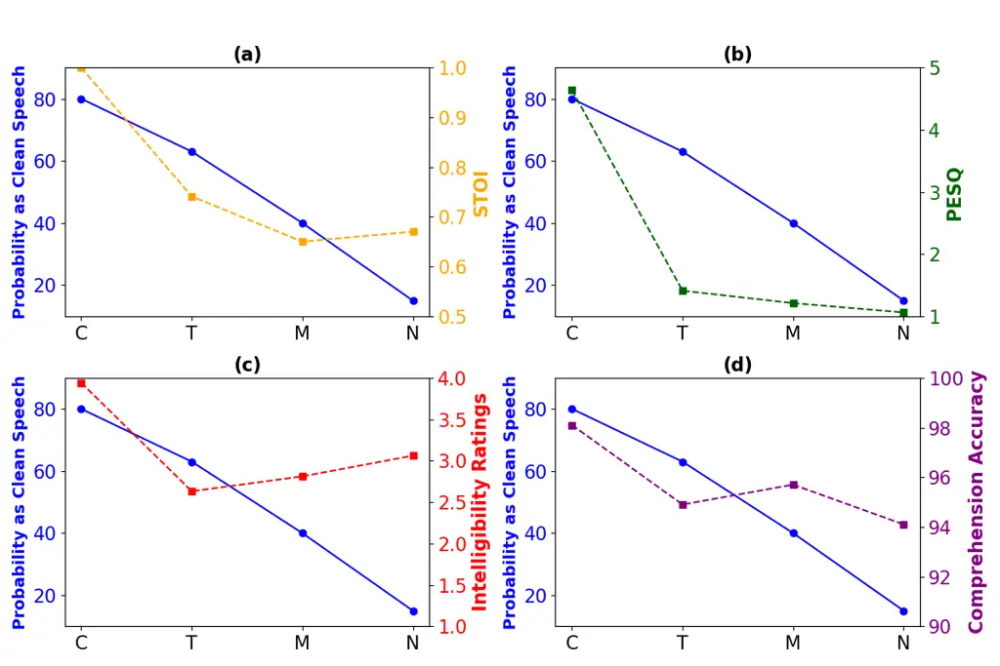

# EffortNet: A Deep Learning Framework for Objective Assessment of Speech Enhancement Technologies Using EEG-Based Alpha Oscillations

Ching-Chih Sung^(\*)    Cheng-Hung Hsin^(\*)    Yu-Anne Shiah    Bo-Jyun
Lin    Yi-Xuan Lai    Chia-Ying Lee    Yu-Te Wang    Borchin Su    Yu
Tsao ^(†)^(†)thanks: Ching-Chih Sung is with the Graduate Institute of
Communication Engineering, National Taiwan University, Taipei, Taiwan
(e-mail: d07942007@ntu.edu.tw)^(†)^(†)thanks: Cheng-Hung Hsin was with
the Research Center for Information Technology Innovation, Academia
Sinica, Taipei, Taiwan, and is with the Department of Foreign Languages
and Literatures, National Chung Hsing University, Taichung, Taiwan
(email: chhsin@nchu.edu.tw)^(†)^(†)thanks: Yu-Anne Shiah is with the
Research Center for Information Technology Innovation, Academia Sinica,
Taipei, Taiwan (email: anneshiah@citi.sinica.edu.tw)^(†)^(†)thanks:
Bo-Jyun Lin is with the Department of Mechanical Engineering, National
Taiwan University, Taipei, Taiwan, and also with the Research Center for
Information Technology Innovation, Academia Sinica, Taipei, Taiwan
(e-mail: b11502064@ntu.edu.tw)^(†)^(†)thanks: Yi-Xuan Lai is with the
Department of Computer Science, National Yang Ming Chiao Tung
University, Hsinchu, Taiwan; (e-mail:
doralai0721.mg10@nycu.edu.tw)^(†)^(†)thanks: Chia-Ying Lee is with the
Institute of Linguistics, Academia Sinica, Taipei, Taiwan; also with the
Institute of Cognitive Neuroscience, National Central University,
Taoyuan, Taiwan; and with the Research Center for Mind, Brain, and
Learning, National Chengchi University, Taipei, Taiwan (e-mail:
chiaying@gate.sinica.edu.tw)^(†)^(†)thanks: Yu-Te Wang is with the
Research Center for Information Technology Innovation, Academia Sinica,
Taipei, Taiwan (email: yutewang@citi.sinica.edu.tw)^(†)^(†)thanks:
Borching Su is with the Graduate Institute of Communication Engineering,
National Taiwan University, Taipei, Taiwan, (email: borching@ntu.edu.tw
)^(†)^(†)thanks: Yu Tsao is with the Research Center for Information
Technology Innovation, Academia Sinica, Taipei, Taiwan, and is also with
the Department of Electrical Engineering, Chung Yuan Christian
University, Taoyuan, Taiwan (e-mail:
yu.tsao@citi.sinica.edu.tw)^(†)^(†)thanks: \*These authors contributed
equally to this work.

###### Abstract

This paper presents EffortNet, a novel deep learning framework for
decoding individual listening effort from electroencephalography (EEG)
during speech comprehension. Listening effort represents a significant
challenge in speech-hearing research, particularly for aging populations
and those with hearing impairment. We collected 64-channel EEG data from
122 participants during speech comprehension under four conditions:
clean, noisy, MMSE-enhanced, and Transformer-enhanced speech.
Statistical analyses confirmed that alpha oscillations (8-13 Hz)
exhibited significantly higher power during noisy speech processing
compared to clean or enhanced conditions, confirming their validity as
objective biomarkers of listening effort. To address the substantial
inter-individual variability in EEG signals, EffortNet integrates three
complementary learning paradigms: self-supervised learning to leverage
unlabeled data, incremental learning for progressive adaptation to
individual characteristics, and transfer learning for efficient
knowledge transfer to new subjects. Our experimental results demonstrate
that EffortNet achieves $`80.9`$% classification accuracy with only
$`40`$% training data from new subjects, significantly outperforming
conventional CNN ($`62.3`$%) and STAnet ($`61.1`$%) models. The
probability-based metric derived from our model revealed that
Transformer-enhanced speech elicited neural responses more similar to
clean speech than MMSE-enhanced speech. This finding contrasted with
subjective intelligibility ratings but aligned with objective metrics.
The proposed framework provides a practical solution for personalized
assessment of hearing technologies, with implications for designing
cognitive-aware speech enhancement systems.

###### Index Terms: 

Listening effort; Speech intelligibility; EEG; Alpha oscillation;
Hearing assessment; Speech enhancement; Self-supervised learning;
Incremental learning; Fine-tuning

## I Introduction

In everyday communication, people frequently encounter noise that
compromises speech comprehension and increases listening effort \[1\].
This challenge is particularly significant given the aging global
population. The United Nations projects that the population over 65 will
increase to 2.2 billion by 2070, while currently 430 million people
($`5.5`$% of the global population) have hearing loss, with age-related
factors being a major cause \[2, 3\]. The consequences of hearing loss
extend beyond communication difficulties, as it is associated with a
higher risk of dementia \[4, 5, 6, 7, 8, 9\]. While hearing aids may
slow cognitive decline \[10, 11, 12\] and recent regulatory changes aim
to expand access (e.g., over-the-counter devices), technical limitations
such as distortion and residual noise in assistive hearing devices can
increase listening effort\[13, 14, 15\], preventing users from
developing consistent wearing habits. Moreover, current clinical
assessments such as pure tone audiometry may not fully capture
real-world speech understanding performance or the effort required in
daily communication\[16, 17\]. Consequently, developing practical and
reliable objective measurements for hearing assessment and listening
effort is crucial for both clinical applications and evaluating
assistive technologies in an aging global population.

However, accurately measuring listening effort presents significant
challenges due to its complex and multidimensional nature. Current
behavioral measures encompass diverse approaches, such as self-report
ratings, response times, and dual-task performance, yet extensive
research has revealed substantial inconsistencies among these measures
themselves \[18, 1, 19\]. For instance, self-reported effort often fails
to correlate with behavioral measures like dual-task performance or
response times \[20, 21, 22\]. These inconsistencies persist even when
measures are collected simultaneously during the same task \[22, 23\].
Research has found that limited numbers of correlational analyses
between different listening effort measures achieved statistical
significance\[19\]. Furthermore, behavioral measures also show limited
correlations with physiological indicators such as pupil dilation or EEG
patterns \[24, 22, 20, 21\]. This suggests that different measures may
tap into distinct dimensions of listening effort, such as cognitive
load, arousal, or motivational engagement, rather than reflecting a
unified construct \[18, 25, 1\].

While speech enhancement technologies aim to mitigate noise effects,
evaluating their effectiveness is complicated by additional measurement
challenges \[14, 15\]. The field of acoustic engineering has established
automatic metrics such as Perceptual Evaluation of Speech Quality (PESQ)
for quality assessment \[26\] and Short-Time Objective Intelligibility
(STOI) for intelligibility prediction \[27\]. The former models human
auditory perception while the latter analyzes temporal envelope
correlations between clean and degraded speech across frequency bands.
However, despite these objective metrics often suggesting improvements
with enhanced speech, human listeners frequently rate unprocessed noisy
speech higher in both quality and intelligibility, with limited
correlations between objective metrics and subjective ratings \[28, 29,
30, 31, 32, 33, 34\]. This discrepancy between automatic metrics and
behavioral assessments, combined with the inconsistencies within
behavioral measures themselves, underscores the fundamental difficulty
in capturing listening effort through traditional measurement
approaches.

Given these fundamental measurement challenges, electroencephalography
(EEG) has emerged as a particularly valuable approach for obtaining
objective biomarkers of speech processing\[25, 18, 15, 1\]. Unlike
behavioral measures that aggregate effects across multiple processing
stages and may not reflect identical underlying cognitive processes
\[35, 36\], neurophysiological indicators can provide more direct
insights into the neural mechanisms of listening effort. Recent EEG
studies have demonstrated the effectiveness of speech enhancement
technologies beyond traditional assessments \[14, 37, 38, 39, 40, 41,
42\]. For example, the event-related potential N400 has been utilized to
show that enhanced speech can facilitate semantic processing\[14\],
providing neurophysiological evidence of speech enhancement benefits
that might not be captured by traditional assessments.

Among various neural markers, alpha oscillations (8-13 Hz) have emerged
as a particularly promising proxy for listening effort \[18, 1, 25\].
Alpha oscillations serve as a central mechanism for auditory selective
inhibition during challenging listening conditions \[43, 44\], with
increased power reflecting the suppression of task-irrelevant
information and distractors \[45, 46\]. Studies have demonstrated that
alpha activity could index speech intelligibility, with suppressed alpha
power associated with successful comprehension and increased power
reflecting greater listening effort \[47, 48, 49, 50, 51, 52, 53, 54,
55, 56, 38, 39\]. Recently, research has demonstrated that effective
hearing aid algorithms significantly reduce alpha power during
speech-in-noise tasks, providing neurophysiological evidence of
alleviated listening effort beyond behavioral improvements \[38, 39\].
These converging findings establish alpha oscillations as robust
objective biomarkers for quantifying listening effort during speech
comprehension under various acoustic conditions.

Despite these promising findings, translating this knowledge into
practical applications faces significant challenges \[1\]. Statistical
analyses based on group-level data are insufficient for developing alpha
oscillations as a functional biomarker in real-world settings. To be
practically useful, there is a need for techniques that can detect and
interpret differences in the alpha oscillations at the individual level,
enabling personalized assessment and intervention. This individual-level
application presents several obstacles: EEG data exhibit substantial
inter-subject variability; recordings may contain artifacts that can
mask subtle alpha modulations; and collecting high-quality EEG data
requires specialized equipment and expertise, making data acquisition
for clinical applications challenging.

Deep learning (DL) approaches offer promising solutions to these
limitations. Recent advances in data-driven modeling techniques can
account for individual variability by identifying person-specific
patterns in neural activity. These methods can effectively handle noisy
data by learning to distinguish signal from noise and can generate
robust predictions with limited data samples. DL techniques have
demonstrated remarkable efficacy in the classification of EEG data
across various neurological applications \[57, 58\]. These methods can
detect subtle neural signatures associated with different cognitive
states and sensory processing conditions.

Among the various DL approaches, convolutional neural networks (CNNs)
have received widespread recognition in EEG classification tasks \[59,
60, 61, 62, 63, 64, 65\] due to their ability to automatically extract
relevant spatial and temporal features from high-dimensional
neurophysiological data. In speech-hearing research, DL models have been
applied to auditory spatial attention detection (ASAD) based on EEG
recordings. Vandecappelle et al. \[66\] demonstrated that CNNs can
effectively decode the directional focus of auditory attention from
frequency band information in EEG signals without requiring access to
clean speech envelopes, achieving over $`80`$% accuracy with only
1-second EEG windows. Research has further developed spatiotemporal
attention networks that integrate both spatial and temporal attention
mechanisms to improve performance in ASAD dataset\[67\].

Despite these advances, a major challenge in DL-based EEG analysis is
developing models that generalize effectively across different subjects
due to substantial inter-individual variability in EEG signals \[68,
58\]. Subject-dependent models achieve high accuracy but require
extensive individual calibration, while cross-subject and
subject-independent models typically experience significant performance
degradation when confronted with diverse neural activity patterns \[69,
70, 71, 72\]. Recent improvements in subject-independent approaches
include variational mode decomposition with deep neural networks \[70\],
generative adversarial networks for data augmentation \[71\], and
transfer learning methods \[73, 74, 75\] to enhance cross-subject model
performance.

Previous research has focused predominantly on alpha modulations during
auditory selective attention tasks. Limited studies have examined alpha
oscillations specifically as an index for listening effort and how
speech enhancement technologies might mitigate this effort. To address
this gap and the challenges of individual variability, we first
conducted a large-scale EEG experiment with 122 participants,
statistically examining alpha oscillations during speech comprehension
under clean, noisy, and enhanced conditions to create this extensive
dataset. This dataset provides a foundation for exploring both the
neural mechanisms underlying listening effort and the effectiveness of
DL methods in capturing individual-specific neural patterns.

Our approach integrates three complementary learning paradigms to
develop a personalized classification framework for alpha band EEG
activities: self-supervised learning (SSL) \[76, 77, 78\], incremental
learning (IL) \[79, 80\], and fine-tuning (F-T) \[81, 82, 83\]. SSL
leverages unlabeled data through augmentation techniques to improve
model robustness while reducing dependence on extensive labeled data. IL
enables progressive assimilation of individual-specific features across
multiple subjects, enhancing cross-individual adaptability. F-T based on
the model obtained through IL allows efficient adaptation to new
subjects, reducing the need for extensive new data collection.

By combining these paradigms with CNN-based models, our methodology aims
to reduce the cost of data labeling and cleaning, handle
inter-individual variability, and enhance model adaptability to data
from new subjects for real-world applications.

This study makes three primary contributions: (1) establishing a
large-scale EEG dataset for speech comprehension under clean, noisy, and
enhanced conditions; (2) demonstrating the practical utility of alpha
oscillations as a personalized assessment tool for listening effort; and
(3) validating an ensemble framework that incorporates a pretrained
model, a multi-subject foundation model, and a downstream task model
with a limited amount of training data. By developing methods that can
reliably detect and interpret alpha-based neural modulations at the
individual level, this study seeks to advance the application of neural
markers in personalized hearing assessment and speech enhancement
technology evaluation.

## II METHODS

### II-A EEG Data Collection

This study conducted an EEG experiment to collect data from healthy
young adults who were instructed to listen to speech under various
acoustic conditions. Participants were presented with spoken sentences
selected from a standardized corpus in four conditions (clean, noisy,
and two enhanced versions) while recording 64-channel EEG responses.
Participants performed comprehension and intelligibility assessment
tasks during the experiment. All EEG data were carefully preprocessed
for deep learning analysis of alpha oscillations.

#### II-A1 Participants

One hundred and twenty-two healthy young adults (68 females; age range:
20-30 years, $`mean`$ $`(M)=24.17`$, $`standard`$ $`deviation`$
$`(SD)=3.01`$) participated in this EEG study investigating cognitive
load during speech comprehension. All participants were right-handed
native Mandarin Chinese speakers with a mean of 16.06 years of education
($`SD=1.58`$). Participants reported no history of neurological or
psychiatric disorders, had normal or corrected-to-normal vision, and
demonstrated normal hearing thresholds $`(\leq 25\,\text{dB})`$ averaged
across 500, 1000, 2000, and 4000 Hz in their better ear, as confirmed by
pure-tone audiometry (PTA). Two participants with mild hearing loss
(32.5 and 37.5 dB) were retained in the analysis, as their thresholds
were substantially below the 65-dB sound pressure level (SPL) used in
the experimental paradigm. The study protocol, including participant
recruitment, experimental procedures, informed consent, and data privacy
measures, was approved by and conducted in accordance with the
guidelines of the local Institutional Review Board (IRB) at Academia
Sinica (Approval No. AS-IRB-BM-24029, \[2024-05-07\]).

#### II-A2 Stimuli

The experimental stimuli consisted of sentences from the Taiwanese
Mandarin Hearing in Noise Test (TMHINT) \[84, 85\]. The TMHINT corpus
contains phonemically and tonally balanced sentences presented in a
natural conversational style without colloquial expressions, with each
sentence comprising exactly 10 Chinese characters. These characteristics
provided a well-controlled stimulus set for investigating neural
responses to speech in noise. One male and one female native Mandarin
speaker recorded 52 sentences each (104 total) in a quiet room using a
16-bit format at a 16-kHz sampling rate \[32\]. The speakers maintained
natural speed, intonation, and prosody during recording, with each
utterance lasting approximately 3 seconds. All recordings were
normalized to 65 dB SPL to approximate typical conversational volume.
Speech-shaped noise (SSN) was added to all clean recordings at a
signal-to-noise ratio (SNR) of +2 dB, selected on the basis of
environmental studies \[86, 87\]. The noisy recordings were subsequently
processed using Transformer-based and minimum mean square error
(MMSE)-based speech enhancement models\[88, 89\]. The experimental
protocol included 104 sentences equally distributed across four
conditions (26 each: clean, noisy, Transformer-enhanced, and
MMSE-enhanced) and balanced between speakers (13 sentences per gender in
each condition).

#### II-A3 Procedure

The EEG experiment was conducted in a sound-attenuated, electrically
shielded room using MATLAB (R2014b) and Psychtoolbox 3. Each participant
was seated 90 cm from an LCD screen, with two loudspeakers positioned at
the same distance for binaural auditory stimulus presentation (see
Fig.1). Prior to EEG recording, participants received instructions to
minimize muscle and ocular artifacts during stimulus presentation and
completed eight practice trials to familiarize themselves with the
experimental procedures. A SPL meter verified that stimulus intensity
remained at 65 dB SPL, and researchers confirmed that all participants
could hear and read the stimuli clearly.

The formal experimental session consisted of 104 randomized trials
divided into four blocks of approximately 6 minutes each. Stimuli were
selected from the TMHINT corpus, consisting of four listening
conditions: clean, noisy, MMSE-enhanced, and Transformer-enhanced
speech. Each trial began with a 500-ms fixation cross, followed by a
spoken sentence presentation during fixation (2,690 to 3,670 ms). The
fixation remained onscreen for an additional 2,000 ms after stimulus
offset. Participants were instructed to maintain fixation on the central
white cross throughout stimulus presentation. For half of the trials,
comprehension was assessed through either true/false questions or forced
word-choice questions (25% each). For instance, following the sentence
”His old back pain flared up again,” participants might encounter either
”Is he in good health? –True / False” or ”Which word did you hear? -
back pain / rheumatism.” These two question types were counterbalanced
to ensure attention to both individual words and overall sentence
meaning. For the remaining trials, participants provided subjective
intelligibility ratings on a scale of 1 to 4 (4 being most
intelligible). Participants entered responses via keyboard after
question onset to minimize EEG artifacts, and trials advanced upon
response completion. EEG data were recorded continuously and
subsequently epoched based on stimulus onset (see Fig. 1).



Fig. 1: Experimental setup and procedure. (a) Simulated environment for
EEG recording. (b) Spectrograms of four listening conditions: clean,
noisy, MMSE-enhanced, and Transformer-enhanced speech. (c) Trial
structure showing fixation cross during stimulus presentation and EEG
recording timeline.

#### II-A4 EEG Data Acquisition and Preprocessing

EEG data were recorded using a 64-channel QuickCap system (Neuromedical
Supplies) with sintered Ag/AgCl electrodes. The recording reference
electrode was positioned on the scalp vertex between Cz and CPz, with
the ground electrode placed anterior to Fz. Data were digitized
continuously at 1,000 Hz using SynAmps2 (Neuroscan Inc.) and filtered
with a 400-Hz low-pass filter for offline analysis. The recordings were
subsequently re-referenced to the averaged mastoid electrodes (M1/M2).
Ocular activity was monitored using bipolar electrode pairs, with
vertical eye movements and blinks recorded from supraorbital and
infraorbital electrodes at the left eye, and horizontal movements
captured from electrodes at the outer canthi. All electrode impedances
were maintained below 5 k$`\Omega`$ throughout the recording session.
Data preprocessing was performed using the FieldTrip toolbox \[90\]. The
continuous EEG recordings were segmented into epochs time-locked to
sentence onset, with each epoch spanning from 0 to 2,690 ms
post-stimulus. Artifact correction was applied to epochs containing eye
movements and muscle activity that exceeded a voltage threshold of 70
$`\mu`$V. All trials were retained for subsequent model training,
validation, and testing.

This study focused on the alpha oscillations \[8-13 Hz\] in the EEG
signals from 16 electrodes (Fz, FCz, FC1, FC2, Cz, C1, C2, CPz, CP1,
CP2, Pz, P1, P2, POz, PO3, PO4), where inhibitory alpha activities are
present in the data. The EEG signals were processed using a fifth-order
Chebyshev Type II bandpass filter and subsequently downsampled to 200
Hz. Data from all EEG channels were normalized to ensure a mean of zero
and a variance of one. To ensure that the data contained only
stimulus-evoked neural activity, this study used EEG data time-locked to
stimulus onset and epoched to 2.691 seconds, the minimum time required
to complete a stimulus listening. Subsequently, discrete wavelet
transform (DWT) \[91\] was applied to the EEG signals to obtain a
time-frequency representation that preserves both temporal and spectral
information, which was then used as input to the model.

#### II-A5 Statistical Validation of the EEG Dataset

To validate our EEG dataset and examine the effects of different
listening conditions on alpha power, we conducted a repeated-measures
ANOVA analysis followed by post-hoc comparisons. Alpha power (8-13 Hz)
was calculated for each participant across the four listening
conditions: clean, noisy, MMSE-enhanced, and Transformer-enhanced
speech. For post-hoc pairwise comparisons, we used paired t-tests with
false discovery rate (FDR) correction to control for multiple
comparisons \[92\]. This analysis was used to determine whether alpha
power significantly differed between listening conditions, particularly
between unprocessed noisy speech and clean/enhanced conditions.
Statistical significance was set at $`p<.05`$ for all analyses. These
statistical procedures provided a firm basis for validating the
sensitivity of alpha oscillations as an objective measure of listening
effort across different acoustic conditions in our large-scale dataset.

### II-B Proposed Deep Learning Framework

This study proposed EffortNet, a three-phase training framework (see
Fig. 2) that integrates SSL, IL, and F-T to address the challenges of
cross-subject EEG signal decoding. In Phase 1, a masking-based SSL
approach was employed to learn generalizable feature representations
from a large amount of unlabeled EEG data, reducing the reliance on
labeled samples and enhancing cross-subject generalization. In Phase 2,
the model was initialized with the encoder pretrained in Phase 1, and IL
was incorporated to enable continual adaptation as subsequent subject
data were sequentially introduced. Finally, in Phase 3, the model was
fine-tuned to optimize performance on the target domain data for
personalized assessment.



Fig. 2: The architecture of EffortNet. Phase 1(self-supervised
learning): Unlabeled data from source domain; Phase 2(incremental
learning): Labeled data from the source domain; Phase 3(fine-tuning):
Labeled data from target domain.

#### II-B1 Phase 1: Self-Supervised Learning Pretraining on the Source Domain

Given an unlabeled dataset $`\mathcal{D}_{\text{src}}^{\text{u}}`$
collected from 100 subjects in the source domain, we first pretrain an
encoder $`f_{\theta}`$ and a decoder $`g_{\phi}`$ using a SSL
objective \[77, 93\], where $`\theta`$ and $`\phi`$ denote the trainable
parameters of the encoder and decoder, respectively.

In SSL, a masked version $`\tilde{X}`$ of the input $`X`$ is provided to
the model, and the model is trained to reconstruct the original signal.
The mean squared error (MSE) \[93\] is used as the loss function
$`\mathcal{L}(\cdot)`$ in this phase to compare the reconstructed output
with the original input.

The SSL loss in the source domain is defined as:

```math
\mathcal{L}_{\text{SSL}}(\theta,\phi)=\mathcal{L}(g_{\phi}(f_{\theta}(\tilde{X})),X) \tag{1}
```

We then optimize the encoder and decoder parameters by solving:

```math
(\theta^{*},\phi^{*})=\arg\min_{\theta,\phi}\mathcal{L}_{\text{SSL}}(\theta,\phi) \tag{2}
```

The resulting encoder parameters $`\theta^{*}`$ are then used to
initialize the subsequent training phases.

#### II-B2 Phase 2: Incremental Learning with Replay in the Source Domain

We adopt IL to enable continual adaptation to newly arriving data over
time \[94, 95\]. During this phase, the labeled dataset in the source
domain is partitioned into $`T=100`$ subsets, denoted as
$`\{\mathcal{D}^{1}_{\text{src}},\mathcal{D}^{2}_{\text{src}},\dots,\mathcal{D}^{T}_{\text{src}}\}`$,
where each $`\mathcal{D}^{t}_{\text{src}}`$ corresponds to the EEG
recordings from the $`t`$-th subject.

For each task $`t`$, the training data consists of two parts: the newly
introduced labeled samples $`(X^{t},Y^{t})`$ specific to task $`t`$, and
a subset of replayed labeled samples $`(X^{\prime},Y^{\prime})`$ drawn
from previous tasks.

```math
\mathcal{D}_{\text{src}}^{t}=\{(X^{t},Y^{t})\},\quad\{(X^{\prime},Y^{\prime})\}\subseteq\bigcup_{i=1}^{t-1}\mathcal{D}_{\text{src}}^{i} \tag{3}
```

The total loss at task $`t`$ for replay-based IL methods \[95, 80\],
denoted as $`\mathcal{L}_{\text{IL}}^{t}(\theta,\psi)`$, is composed of
two components: the loss on the current task data,
$`\mathcal{L}_{\text{current}}`$, and the loss on replayed samples from
previous tasks, $`\mathcal{L}_{\text{replay}}`$. The loss function used
in this phase is the cross-entropy loss\[80\], denoted as
$`\mathcal{L}(\cdot)`$.

A weighting hyperparameter $`\lambda`$ is used to balance the
contribution of the replay term. This can be expressed as:

```math
\displaystyle\mathcal{L}_{\text{IL}}^{t}(\theta,\psi)=\  \displaystyle\mathcal{L}_{\text{current}}(h_{\psi}(f_{\theta}(X^{t})),Y^{t})
```

```math
\displaystyle+\lambda\cdot\mathcal{L}_{\text{replay}}(h_{\psi}(f_{\theta}(X^{\prime})),Y^{\prime}) \tag{4}
```

In our implementation, we set the balancing hyperparameter to
$`\lambda=1`$. In the first task, the encoder $`f_{\theta}`$ is
initialized with parameters $`\theta^{*}`$ obtained from Phase 1. For
each subsequent task $`t>1`$, the encoder parameters $`\theta^{t}`$ are
updated incrementally based on the parameters learned from the previous
task, i.e., $`\theta^{t-1}`$. Each task $`t`$ uses a task-specific
classifier $`h_{\psi}`$, which is further trained based on the
parameters learned from the previous task $`(t{-}1)`$, resulting in the
classifier parameters $`\psi^{t}`$ for the current task.

The optimization for each task can be formally expressed as:

```math
(\theta^{t},\psi^{t})=\arg\min_{\theta,\psi}\mathcal{L}_{\text{IL}}^{t}(\theta,\psi),\quad\text{for }t=1,\dots,T \tag{5}
```

The resulting parameters $`(\theta^{T},\psi^{T})`$ from the source
domain are subsequently used to initialize the encoder and classifier in
the next phase, where we adapt the model to the target domain.

#### II-B3 Phase 3: Fine-Tuning on the Target Domain

To enable knowledge transfer, we use the parameters
$`(\theta^{T},\psi^{T})`$, corresponding to the encoder and classifier
respectively, obtained from Phase 2 as initialization for fine-tuning in
the target domain. Given a labeled dataset
$`\mathcal{D}_{\text{tgt}}^{\text{l}}=\{(X_{\text{tgt}},Y_{\text{tgt}})\}`$
in the target domain, we fine-tune\[96\] the model using supervised
learning.

The supervised loss on the target domain, denoted as
$`\mathcal{L}(\cdot)`$, is defined using the cross-entropy loss and is
minimized during this phase:

```math
\mathcal{L}_{\text{target}}(\theta,\psi)=\mathcal{L}(h_{\psi}(f_{\theta}(X_{\text{tgt}})),Y_{\text{tgt}}) \tag{6}
```

The model parameters are then optimized by solving:

```math
(\theta^{\text{F-T}},\psi^{\text{F-T}})=\arg\min_{\theta,\psi}\mathcal{L}_{\text{target}}(\theta,\psi) \tag{7}
```

This fine-tuning phase adapts the pretrained knowledge from the source
domain to the distributional characteristics and label structure of the
target domain. The resulting parameters
$`(\theta^{\text{F-T}},\psi^{\text{F-T}})`$ represent the final model
used for inference on the target domain.

#### II-B4 Convolutional Neural Network Architecture

The proposed deep learning framework was implemented using a
convolutional neural network (CNN) architecture \[97\]. The CNN
architecture consists of four convolutional layers designed to extract
both spatial and temporal features from the input EEG data. The reshape
layer transforms the multi-dimensional tensor output of the
convolutional layers into one-dimensional data, which serves as the
input to the dense layer. Subsequently, two fully connected dense layers
map the extracted features into high-level representations, thereby
capturing complex feature relationships. Finally, the Sigmoid activation
function generates probability values for binary classification tasks.

### II-C Training Setup

#### II-C1 Training and Evaluation Setup

The setup of this study follows a cross-subject training paradigm
involving both a source and a target domain. The source domain consists
of EEG data from 100 participants that were used to train the initial
model. The target domain contains data from 20 unseen participants. For
participant-specific adaptation, the model was fine-tuned using varying
proportions of labeled EEG data from the target participants, with the
remaining data used for evaluation.

Five-fold cross-validation was employed during the training process.
Training was conducted using cross-entropy loss and the Adam optimizer
(learning rate = $`1\times 10^{-4}`$), with implementation details
available on GitHub.

#### II-C2 Evaluation Metrics

For alpha-band classification, accuracy was used as the primary metric,
defined as:

```math
\displaystyle\text{Accuracy}=\frac{TP+TN}{TP+TN+FP+FN} \tag{8}
```

where TP, TN, FP, and FN denote true positives, true negatives, false
positives, and false negatives, respectively \[98\].

## III RESULTS

### III-A Behavioral Results

Participants’ comprehension accuracy remained high across conditions
(see Fig. 3 (a)), with mean accuracy of $`98.11`$% ($`SD=4.45`$) in the
clean condition, $`94.14`$% ($`SD=6.06`$) in the noisy condition,
$`95.70`$% ($`SD=6.86`$) in the MMSE-enhanced condition, and $`94.90`$%
($`SD=6.33`$) in the Transformer-enhanced condition. A one-way
repeated-measures ANOVA revealed a significant main effect of condition
on accuracy ($`F_{3,363}=12.72,p<.001`$). Paired $`t`$-tests showed that
accuracy was significantly higher in the clean condition compared with
the noisy ($`t=6.72,p<.001`$), MMSE-enhanced ($`t=4.17,p<.001`$), and
Transformer-enhanced ($`t=5.24,p<.001`$) conditions. No significant
differences were found between the noisy and MMSE-enhanced
($`t=-1.97,p=.307`$), noisy and Transformer-enhanced
($`t=-1.05,p=1.000`$), or between the two enhanced conditions
($`t=1.06,p=1.000`$).

Subjective intelligibility ratings are shown in Fig. 3 (b). The clean
condition received the highest ratings ($`M=3.94,SD=0.12`$), followed by
the noisy ($`M=3.06,SD=0.50`$), MMSE-enhanced ($`M=2.81,SD=0.54`$), and
Transformer-enhanced ($`M=2.63,SD=0.44`$) conditions. A one-way
repeated-measures ANOVA revealed a significant main effect of condition
($`F_{3,363}=490.13,p<.001`$). Paired $`t`$-tests indicated that all
pairwise comparisons were significant: clean vs. noisy
($`t=20.50,p<.001`$), clean vs. MMSE-enhanced ($`t=24.70,p<.001`$),
clean vs. Transformer-enhanced ($`t=35.00,p<.001`$), noisy vs.
MMSE-enhanced ($`t=9.35,p<.001`$), noisy vs. Transformer-enhanced
($`t=12.90,p<.001`$), and MMSE-enhanced vs. Transformer-enhanced
($`t=5.41,p<.001`$).



Fig. 3: Behavioral performance across the four listening conditions (C =
Clean, N = Noisy, M = MMSE-enhanced, T = Transformer-enhanced). (a) Mean
comprehension accuracy (in percent) for each condition. (b) Mean
subjective intelligibility ratings (1–4 scale) for each condition. Error
bars represent standard errors of the mean. Asterisks above brackets
denote significant pairwise differences based on paired $`t`$-tests:
$`p<.05`$ (\*), $`p<.01`$ (\*\*), $`p<.001`$ (\*\*\*). n.s. denotes not
significant.

### III-B EEG Results: Repeated-measures ANOVA Analysis

Fig. 4(a) shows averaged time-frequency representations across 122
participants using 16 frontocentral and centroparietal channels (Fz,
FC1, FCz, FC2, C1, Cz, C2, CP1, CPz, CP2, P1, Pz, P2, PO3, POz, and
PO4). The analysis revealed increased alpha power (8–13 Hz) relative to
baseline across all four listening conditions. The absolute alpha power
data are presented as topographic maps in Fig. 4(b), showing the spatial
distribution averaged over 0–2.69 s for each condition.

Mean alpha power values (± SE) were 4478.8 ± 400.7 for clean, 4962.6 ±
468.2 for noisy, 4586.9 ± 398.8 for MMSE-enhanced, and 4564.6 ± 370.8
for Transformer-enhanced conditions (see Fig. 4(a) and (b)). A
repeated-measures ANOVA revealed a significant main effect of listening
condition on alpha power ($`F_{(3,363)}`$ = 5.99, $`p<.01`$,
Greenhouse-Geisser corrected). As shown in Fig. 4(c), post-hoc analysis
showed that alpha power during noisy condition was significantly higher
compared with clean ($`p<.01`$, FDR-corrected), MMSE-enhanced
($`p<.05`$), and Transformer-enhanced ($`p<.05`$) conditions. No
significant differences were found between clean and MMSE-enhanced,
clean and Transformer-enhanced, or between MMSE-enhanced and
Transformer-enhanced conditions ($`ps>.05`$).



Fig. 4: (a) Time-frequency representations across four listening
conditions. Black dashed box highlights the alpha power (8–13 Hz)
analysis window. (b) Topographic maps of absolute alpha power for each
condition. (c) Mean alpha power across the four listening conditions (C
= Clean, N = Noisy, M = MMSE-enhanced, T = Transformer-enhanced). Error
bars: 95% confidence interval. Asterisks above brackets: \*$`p<.05`$,
\*\*$`p<.01`$, \*\*\*$`p<.001`$ (paired $`t`$ test); n.s., not
significant.

### III-C EEG Results: Deep Learning Analysis

As illustrated in Fig. 4(c), the noisy condition showed a significant
increase in the alpha-band power compared with the clean condition.
Therefore, our DL analysis first aimed to classify listening effort
based on alpha power between these two conditions.

#### III-C1 Performance Comparisons with Baseline Models

We adopted a commonly used ratio of training data at 0.8 as the baseline
condition for training the classification model. As shown in Fig. 5, the
EffortNet achieved a classification accuracy of $`84.3`$% while the
baseline CNN model and the STAnet achieved classification accuracies of
$`83.2`$% and $`81.2`$%, respectively. All three methods achieved
average classification accuracies over $`80`$%, confirming the
effectiveness of DL-based methods for classification tasks on EEG
signals.

#### III-C2 Effect of Training Data Ratio on Model Performance

We further examined the effect of reduced training data on model
performance, which was evaluated under various ratios of training data
(see Fig. 5).

When the training ratio was 0.8, all models achieved high classification
accuracy. EffortNet performed best at $`84.3`$%, followed by CNN at
$`83.2`$%, and STAnet at $`81.2`$%. At a training ratio of 0.6,
EffortNet maintained strong performance at $`82.9`$%, while both CNN and
STAnet showed significant decreases to $`62.7`$% and $`61.9`$%,
respectively. Similarly, with a training ratio of 0.4, EffortNet
continued to demonstrate robust performance at $`80.9`$%, substantially
outperforming CNN ($`62.3`$%) and STAnet ($`61.1`$%).

As the training ratio decreased to 0.2, all models experienced
considerable performance degradation. EffortNet’s accuracy dropped to
$`56.1`$%, while CNN and STAnet showed comparable performance at
$`55.6`$% and $`55.9`$%, respectively. Under the subject-independent
condition (training ratio = 0.0), all models performed at near-chance
levels: EffortNet at $`55.2`$%, CNN at $`55.7`$%, and STAnet at
$`55.6`$%.

Fig. 5: Classification performance comparisons between accuracy and
training data ratio.

#### III-C3 Performance on Unseen Participants

We subsequently examined the generalizability of EffortNet by evaluating
its performance on the data from 20 previously unseen participants
through fine-tuning with the training data ratio at 0.4. As shown in
Fig. 6, the EffortNet achieved an average accuracy of $`80.9`$%
($`SD=3.0`$). However, the baseline CNN model and the STAnet showed
average accuracies of $`62.4`$% ($`SD=6.5`$) and $`61.2`$% ($`SD=5.3`$),
respectively.

Fig. 6: Comparisons of the model performance on 20 unseen participants
with a training data ratio at 0.4. The horizontal dotted line represents
a reference point of accuracy at $`80`$%.

#### III-C4 Ablation Analysis on Model Performance

Fig. 7: Classification accuracies on the 20 unseen participants under
different phase configurations of the EffortNet model in the ablation
analysis. The horizontal dotted line represents a reference point of
accuracy at $`80`$%.

As shown in Fig. 7, the complete three-phase model achieved $`80.9`$%
($`SD=3.0`$) accuracy. Next, the model with a Phase 2 and 3
configuration achieved an accuracy of $`77.7`$% ($`SD=2.1`$). Finally,
the model with only a Phase 3 configuration showed an accuracy of
$`61.9`$% ($`SD=1.7`$). Overall, the complete three-phase model
demonstrated the best performance among all competing configurations,
with Phase 2 (IL) contributing to the model’s performance most.

### III-D Probability-based Metric using Alpha-band Power to Evaluate Speech Enhancement Effectiveness

As the EffortNet has demonstrated robust classification accuracies on
alpha power of the clean and noisy conditions, we subsequently utilized
this model to evaluate speech enhancement technologies by having the
model assess EEG responses from the MMSE- and Transformer-enhanced
conditions as more probable to be responses from the clean or noisy
conditions.

In this scenario, we defined the model’s predicted results as low
listening effort (LLE) when an alpha power response was classified as
being elicited by clean speech whereas the results were defined as high
listening effort (HLE) when an alpha power response was classified as
being elicited by noisy speech. As shown in Fig. 8, EffortNet was used
as a speech enhancement evaluator. The probabilities of alpha power
responses being predicted as LLE were $`80`$%, $`62.3`$%, $`40.0`$%, and
$`15.7`$% for clean, Transformer-enhanced, MMSE-enhanced, and noisy
conditions, respectively. This decreasing trend suggests that the
Transformer-based enhancement algorithm produced speech signals that
elicited brain responses more similar to clean speech than the
MMSE-based algorithm, with both enhancement methods producing responses
more similar to clean speech than the noisy condition.

We further compared these alpha-based classification results with those
from established automatic metrics and behavioral measures, as presented
in Fig. 9. The objective metrics showed trends consistent with our
neural measures, where the alpha-band metric (probability of alpha
activity resembling clean speech patterns) indicated that higher
probabilities correspond to lower listening effort. From Fig. 9(a), the
STOI scores (measuring speech intelligibility) under the acoustic
conditions clean, Transformer, MMSE, and noisy were 1.00, 0.74, 0.65,
and 0.64, respectively. Similarly, in Fig. 9(b), the PESQ scores
(measuring speech quality) were 4.64, 1.41, 1.21, and 1.06,
respectively. These results indicate a decreasing trend that closely
aligns with our EEG-based evaluation, suggesting that neural responses
may reflect objective speech measures.

In contrast, behavioral measures exhibited divergent trends. In Fig.
9(c), the subjective intelligibility ratings under clean, Transformer,
MMSE, and noisy conditions were 3.94, 2.63, 2.81, and 3.06,
respectively, where enhanced speech received lower ratings compared with
noisy speech, and the Transformer-enhanced speech was rated lower than
the MMSE-enhanced speech. In Fig. 9(d), participants achieved
comprehension accuracies of $`98.11`$%, $`94.90`$%, $`95.70`$%, and
$`94.14`$% under clean, Transformer, MMSE, and noisy conditions, with
participants performing worst in the noisy condition. This discrepancy
underscores the complementary role of neural metrics in capturing
cognitive responses that may not be reflected by subjective assessments
or behavioral performance alone.



Fig. 8: EffortNet confusion matrix showing predicted probabilities of
classifying alpha activity from four speech conditions as low listening
effort(LLE) or high listening effort(HLE).



Fig. 9: Comparison of the EffortNet-based alpha-band metric for
listening effort with standard evaluation measures in four listening
conditions (C = Clean, T = Transformer-enhanced, M = MMSE-enhanced, N =
Noisy): (a) STOI scores, (b) PESQ scores, (c) human intelligibility
ratings, and (d) comprehension accuracy.

## IV DISCUSSIONS

### IV-A Alpha Oscillations and Listening Effort

The comparison between our behavioral and EEG findings reveals a notable
divergence that aligns with the measurement inconsistencies highlighted
in the previous research. While comprehension accuracy showed minimal
differences between noisy and enhanced conditions, alpha power, which
indexes listening effort, demonstrated significant reductions in both
enhancement conditions compared with the noisy condition. This
dissociation illustrates the fundamental challenge in assessing
listening effort.

Our behavioral results indicate that participants maintained high
comprehension accuracy across all conditions, with only the clean
condition showing significantly higher performance. This ceiling effect
in comprehension is not uncommon in speech perception studies using
sentence material \[99, 14\], as participants can often compensate for
acoustic degradation through increased cognitive effort. However, this
compensation comes at a cost that behavioral measures may not fully
capture. Similarly, subjective intelligibility ratings showed a
different pattern, with participants rating noisy speech significantly
higher than both enhanced conditions, despite comparable comprehension
performance.

In contrast to these behavioral results, our EEG findings based on a
large-scale dataset from healthy young participants revealed that alpha
power was significantly higher during the noisy condition compared to
both clean and enhanced conditions. This increased alpha power during
noisy speech processing reflects greater listening effort, supporting
previous findings that alpha oscillations serve as a mechanism for
auditory selective inhibition during challenging listening conditions
\[43, 44\] and that increased power reflects the suppression of
task-irrelevant information \[45, 46\].

The observed dissociation between behavioral measures and
neurophysiological indicators substantiates recent research showing
limited correlations between different measures of listening effort
\[22, 25, 19\]. Different measurement domains likely tap into distinct
dimensions of listening effort rather than reflecting a unified
construct. Our results are consistent with previous findings that
demonstrated that physiological measures can detect changes in listening
effort even when behavioral performance remains stable\[20, 21, 99\].

Importantly, our EEG results provide neurophysiological evidence that
both enhancement algorithms (MMSE and Transformer) effectively reduced
listening effort compared with noisy speech, despite participants’
subjective impressions. This finding aligns with previous work by
Slugocki et al. \[38, 39\], who showed that effective hearing aid
algorithms can significantly reduce alpha power during speech-in-noise
tasks. The absence of significant differences in alpha power between
clean speech and enhanced conditions further suggests that both
enhancement algorithms successfully restored neural processing to levels
comparable to clean speech processing.

These findings underscore the value of alpha oscillations as an
objective biomarker for quantifying listening effort during speech
comprehension. While behavioral measures may be influenced by conscious
perception, task strategy, or motivation, alpha oscillations provide a
more direct window into the neural processes underlying listening
effort. This neurophysiological approach offers a promising solution to
the measurement challenges, which we have further addressed by utilizing
DL-based techniques at individual levels.

### IV-B Decoding Individual Listening Effort

While our statistical analyses confirmed significant differences in
alpha power across listening conditions at the group level, our DL-based
approach offers critical advantages for practical, individual-level
assessment of listening effort. The proposed EffortNet model enables
accurate classification of listening effort for clean or noisy speech
with accuracies exceeding $`80`$%, even with limited training data,
addressing the challenge of substantial inter-individual variability in
EEG signals.

Our DL framework integrates three complementary learning paradigms that
collectively overcome key challenges in EEG classification. SSL
effectively leverages unlabeled data through augmentation techniques,
reducing dependence on extensive labeled data while improving model
robustness against noise and signal variability. IL addresses the
non-independent and identically distributed nature of multi-subject EEG
data by progressively adapting to subject-specific distributions,
significantly outperforming traditional batch training methods. Our
ablation results confirm this advantage, showing that the IL method
contributed most significantly to model performance. Finally, F-T
enables efficient adaptation to new individuals by leveraging knowledge
from existing data, thereby reducing the need for extensive new data
collection and enhancing practicality in real-world applications. The
superior performance of EffortNet compared with conventional CNN and
STAnet models demonstrates its potential for deployment with limited
calibration data. This efficiency is particularly valuable in clinical
and commercial applications where user convenience and rapid adaptation
are essential.

### IV-C Personalized Assessment of Speech Enhancement Effectiveness

This study demonstrates how alpha oscillations, when analyzed through DL
approaches, can provide an objective, personalized evaluation of speech
enhancement technologies based on listening effort. By defining EEG
responses elicited by clean speech as indicative of LLE and those evoked
by noisy speech as HLE, we established an evaluation framework to
quantify the effectiveness of speech enhancement technologies at the
individual level.

The EffortNet classifier revealed a clear pattern across listening
conditions: $`80`$% of EEG responses to clean speech were classified as
LLE, compared to $`62.3`$% for Transformer-enhanced speech, $`40`$% for
MMSE-enhanced speech, and only $`15.7`$% for noisy speech. This gradient
demonstrates the classifier’s sensitivity to varying degrees of
listening effort across different acoustic conditions. Importantly, the
Transformer-based enhancement algorithm produced speech signals that
elicited brain responses more similar to clean speech than the
MMSE-based algorithm, with both enhancement methods producing responses
more similar to clean speech than the noisy condition.

Notably, our neural measure-based assessments aligned well with
established objective metrics but diverged from subjective ratings. The
STOI scores (measuring speech intelligibility) under clean,
Transformer-enhanced, MMSE-enhanced, and noisy conditions were 1.00,
0.74, 0.65, and 0.64, respectively, while PESQ scores (measuring speech
quality) were 4.64, 1.41, 1.21, and 1.06. These objective metrics showed
a decreasing trend consistent with our alpha-based classification. In
contrast, subjective intelligibility ratings exhibited an opposite
pattern, with participants rating enhanced speech lower than noisy
speech (3.94, 2.63, 2.81, and 3.06 for clean, Transformer-enhanced,
MMSE-enhanced, and noisy conditions, respectively).

This discrepancy between neural measures and subjective ratings echoes
the measurement inconsistencies we highlighted earlier \[18, 22, 19\].
While participants subjectively rated enhanced speech lower than noisy
speech, their neural responses indicated reduced listening effort with
enhanced speech. This finding aligns with previous research showing that
subjective perceptions may not reflect underlying cognitive processes
\[25, 1\], and highlights the value of neurophysiological measures in
capturing aspects of listening effort that may not be consciously
accessible. Further analysis revealed a parallel trend between alpha
power and objective speech metrics (STOI and PESQ), with lower alpha
power (indicating reduced listening effort) associated with higher
speech quality and intelligibility scores. This trend provides some
validation for our DL classification approach and demonstrates the
potential of alpha oscillations as an objective biomarker for evaluating
speech enhancement technologies.

The practical implications of this approach are significant. Traditional
evaluation of hearing assistance technologies often relies on subjective
ratings or speech recognition performance, which may not capture the
cognitive effort involved in listening. Our framework offers a
neurophysiologically-based method to evaluate the actual cognitive
impact of speech enhancement technologies, enabling more personalized
and effective interventions for individuals with hearing difficulties.
This approach could significantly influence the development and
selection of hearing assistance technologies, focusing on reducing
cognitive load during listening comprehension.

## V Conclusion

This study addresses a critical challenge in hearing
healthcare—developing reliable, objective measurements for evaluating
listening effort and assistive hearing technologies. Our work responds
to the call for improved methodologies to assess listening effort\[1\],
a multidimensional construct impacting quality of life, particularly in
aging populations at risk for dementia. We have demonstrated that alpha
oscillations serve as a robust biomarker of listening effort, with
increased power during noisy speech processing reflecting greater
cognitive demand. While statistical analyses revealed significant
group-level differences, this study’s innovation lies in the
personalized assessment enabled by our deep learning framework. The
EffortNet model addresses three fundamental challenges: it provides
objective assessment aligning with established metrics while capturing
cognitive processes not reflected in behavioral measures; it handles
individual variability through integrating SSL, IL, and F-T, maintaining
high classification accuracy with limited training data; and it enables
practical application requiring minimal user calibration.

Our probability-based metric revealed that Transformer-enhanced speech
elicits neural responses more similar to clean speech than MMSE-enhanced
speech. While subjective ratings favored unprocessed noisy speech, alpha
power measures demonstrated reduced effort with enhanced speech,
highlighting the disconnect between subjective perception and neural
processing. The parallel trend between alpha power and objective speech
metrics validates our approach and demonstrates EEG’s potential as a
complementary evaluation tool. By focusing on cognitive impact, our
framework offers comprehensive assessment of how these technologies
reduce listening effort. As global populations age and hearing loss
becomes prevalent, developing effective interventions to mitigate
cognitive decline is imperative. This study provides methodological
advances and practical tools for personalized hearing healthcare,
potentially influencing technology development focused on reducing
listening effort.

In summary, this study contributes through: (1) establishing a
large-scale EEG dataset for speech comprehension under various acoustic
conditions; (2) demonstrating alpha oscillations’ utility as a
personalized assessment tool; and (3) validating a DL technique
addressing individual variability while minimizing data requirements.
These advances represent important steps toward bridging laboratory
insights and clinical applications.

## Acknowledgment

The authors sincerely thank Dr. Syu-Siang Wang for his insightful
comments and suggestions on the early draft of the manuscript. We also
thank Wen-Yuan Ting for helpful suggestions on the manuscript. Finally,
we extend our heartfelt appreciation to all study participants for their
essential contributions.

## Data Availability

The codes and EEG dataset are available on GitHub.  
(https://github.com/JohnSung0501/EEG-Effort-Classification)

## References

## References

- \[1\] M. K. Pichora-Fuller, S. E. Kramer, M. A. Eckert, B. Edwards,
  B. W. Hornsby, L. E. Humes, U. Lemke, T. Lunner, M. Matthen, C. L.
  Mackersie _et al._, “Hearing impairment and cognitive energy: The
  framework for understanding effortful listening (FUEL),” _Ear Hear._,
  vol. 37, pp. 5S–27S, 2016.
- \[2\] United Nations, “World population prospects 2024: Summary of
  results,” United Nations Department of Economic and Social Affairs (UN
  DESA), New York, Technical Report UN DESA/POP/2024/TR/NO. 9, 2024.
- \[3\] World Health Organization, “World report on hearing,” World
  Health Organization, Geneva, Report, 2021, licence: CC BY-NC-SA 3.0
  IGO. \[Online\]. Available:
  https://www.who.int/publications/i/item/9789240020481
- \[4\] R. F. Uhlmann, E. B. Larson, T. S. Rees, T. D. Koepsell, and
  L. G. Duckert, “Relationship of hearing impairment to dementia and
  cognitive dysfunction in older adults,” _JAMA_, vol. 261, no. 13, pp.
  1916–1919, 1989.
- \[5\] F. R. Lin, E. J. Metter, R. J. O’Brien, S. M. Resnick, A. B.
  Zonderman, and L. Ferrucci, “Hearing loss and incident dementia,”
  _Arch. Neurol._, vol. 68, no. 2, pp. 214–220, 2011.
- \[6\] C.-M. Liu and C. T.-C. Lee, “Association of hearing loss with
  dementia,” _JAMA Netw. Open_, vol. 2, no. 7, pp.
  e198 112–e198 112, 2019.
- \[7\] J. A. Deal, J. Betz, K. Yaffe, T. Harris, E. Purchase-Helzner,
  S. Satterfield, S. Pratt, N. Govil, E. M. Simonsick, F. R. Lin
  _et al._, “Hearing impairment and incident dementia and cognitive
  decline in older adults: the health abc study,” _J. Gerontol. A Biol.
  Sci. Med. Sci._, vol. 72, no. 5, pp. 703–709, 2017.
- \[8\] G. Livingston, J. Huntley, A. Sommerlad, D. Ames, C. Ballard,
  S. Banerjee, C. Brayne, A. Burns, J. Cohen-Mansfield, C. Cooper
  _et al._, “Dementia prevention, intervention, and care: 2020 report of
  the Lancet commission,” _The Lancet_, vol. 396, no. 10248, pp.
  413–446, 2020, correction in: _The Lancet_, vol. 402, no. 10399, p.
  203, 2023, doi:10.1016/S0140-6736(23)02043-3.
- \[9\] R.-C. Yu, D. Proctor, J. Soni, L. Pikett, G. Livingston,
  G. Lewis, A. Schilder, D. Bamiou, R. Mandavia, R. Omar _et al._,
  “Adult-onset hearing loss and incident cognitive impairment and
  dementia–a systematic review and meta-analysis of cohort studies,”
  _Ageing Res. Rev._, p. 102346, 2024.
- \[10\] J. Z. Sarant, P. A. Busby, A. J. Schembri, R. J. Briggs, C. L.
  Masters, and D. C. Harris, “Cochlea: Longitudinal cognitive
  performance of older adults with hearing loss and cochlear implants at
  4.5-year follow-up,” _Brain Sci._, vol. 14, no. 12, p. 1279, 2024.
- \[11\] J. Z. Sarant, P. A. Busby, A. J. Schembri, C. Fowler, and D. C.
  Harris, “Enhance: a comparative prospective longitudinal study of
  cognitive outcomes after 3 years of hearing aid use in older adults,”
  _Front. Aging Neurosci._, vol. 15, p. 1302185, 2024.
- \[12\] F. R. Lin, J. R. Pike, M. S. Albert, M. Arnold, S. Burgard,
  T. Chisolm, D. Couper, J. A. Deal, A. M. Goman, N. W. Glynn _et al._,
  “Hearing intervention versus health education control to reduce
  cognitive decline in older adults with hearing loss in the usa
  (achieve): a multicentre, randomised controlled trial,” _Lancet_, vol.
  402, no. 10404, pp. 786–797, 2023.
- \[13\] N. Das, S. Chakraborty, J. Chaki, N. Padhy, and N. Dey,
  “Fundamentals, present and future perspectives of speech enhancement,”
  _Int. J. Speech Technol._, vol. 24, no. 4, pp. 883–901, 2021.
- \[14\] C.-H. Hsin, C.-Y. Lee, and Y. Tsao, “Exploring N400
  predictability effects during sustained speech comprehension: From
  listening-related fatigue to speech enhancement evaluation,” _Ear
  Hear._, vol. 46, no. 4, pp. 922–940, 2025.
- \[15\] B. Ohlenforst, A. A. Zekveld, E. P. Jansma, Y. Wang, G. Naylor,
  A. Lorens, T. Lunner, and S. E. Kramer, “Effects of hearing impairment
  and hearing aid amplification on listening effort: A systematic
  review,” _Ear Hear._, vol. 38, no. 3, pp. 267–281, 2017.
- \[16\] S. E. Hind, R. Haines-Bazrafshan, C. L. Benton, W. Brassington,
  B. Towle, and D. R. Moore, “Prevalence of clinical referrals having
  hearing thresholds within normal limits,” _Int. J. Audiol._, vol. 50,
  no. 10, pp. 708–716, 2011.
- \[17\] D. Ruggles, H. Bharadwaj, and B. G. Shinn-Cunningham, “Normal
  hearing is not enough to guarantee robust encoding of suprathreshold
  features important in everyday communication,” _Proc. Natl. Acad. Sci.
  U.S.A._, vol. 108, no. 37, pp. 15 516–15 521, 2011.
- \[18\] R. McGarrigle, K. J. Munro, P. Dawes, A. J. Stewart, D. R.
  Moore, J. G. Barry, and S. Amitay, “Listening effort and fatigue: What
  exactly are we measuring? a british society of audiology cognition in
  hearing special interest group ‘white paper’,” _Int. J. Audiol._,
  vol. 53, no. 7, pp. 433–445, 2014.
- \[19\] C. Shields, M. Sladen, I. A. Bruce, K. Kluk, and J. Nichani,
  “Exploring the correlations between measures of listening effort in
  adults and children: A systematic review with narrative synthesis,”
  _Trends Hear._, vol. 27, p. 23312165221137116, 2023.
- \[20\] R. McGarrigle, P. Dawes, A. J. Stewart, S. E. Kuchinsky, and
  K. J. Munro, “Measuring listening-related effort and fatigue in
  school-aged children using pupillometry,” _J. Exp. Child Psychol._,
  vol. 161, pp. 95–112, 2017.
- \[21\] ——, “Pupillometry reveals changes in physiological arousal
  during a sustained listening task,” _Psychophysiology_, vol. 54,
  no. 2, pp. 193–203, 2017.
- \[22\] S. Alhanbali, P. Dawes, R. E. Millman, and K. J. Munro,
  “Measures of listening effort are multidimensional,” _Ear Hear._,
  vol. 40, no. 5, pp. 1084–1097, 2019.
- \[23\] L. Decruy, D. Lesenfants, J. Vanthornhout, and T. Francart,
  “Top-down modulation of neural envelope tracking: The interplay with
  behavioral, self-report and neural measures of listening effort,”
  _Eur. J. Neurosci._, vol. 52, no. 5, pp. 3375–3393, Sep. 2020.
- \[24\] K. Kestens, L. Van Yper, S. Degeest, and H. Keppler, “The p300
  auditory evoked potential: a physiological measure of the engagement
  of cognitive systems contributing to listening effort?” _Ear Hear._,
  vol. 44, no. 6, pp. 1389–1403, 2023.
- \[25\] A. L. Francis and J. Love, “Listening effort: Are we measuring
  cognition or affect, or both?” _Wiley Interdiscip. Rev. Cogn. Sci._,
  vol. 11, no. 1, p. e1514, 2020.
- \[26\] A. W. Rix, J. G. Beerends, M. P. Hollier, and A. P. Hekstra,
  “Perceptual evaluation of speech quality (PESQ)-a new method for
  speech quality assessment of telephone networks and codecs,” in _Proc.
  IEEE Int. Conf. Acoust., Speech, Signal Process. (ICASSP)_,
  vol. 2. IEEE, 2001, pp. 749–752.
- \[27\] C. H. Taal, R. C. Hendriks, R. Heusdens, and J. Jensen, “An
  algorithm for intelligibility prediction of time–frequency weighted
  noisy speech,” _IEEE Trans. Audio Speech Lang. Process._, vol. 19,
  no. 7, pp. 2125–2136, 2011.
- \[28\] R. E. Zezario, S.-W. Fu, F. Chen, C.-S. Fuh, H.-M. Wang, and
  Y. Tsao, “Deep learning-based non-intrusive multi-objective speech
  assessment model with cross-domain features,” _IEEE/ACM Trans. Audio
  Speech Lang. Process._, vol. 31, pp. 54–70, 2023.
- \[29\] T. Rosenbaum, I. Cohen, E. Winebrand, and O. Gabso,
  “Differentiable mean opinion score regularization for perceptual
  speech enhancement,” _Pattern Recognit. Lett._, vol. 166, pp.
  159–163, 2023.
- \[30\] T. Manjunath, “Limitations of perceptual evaluation of speech
  quality on voip systems,” in _Proc. IEEE Int. Symp. Broadband
  Multimedia Syst. Broadcast. (BMSB)_. IEEE, 2009, pp. 1–6.
- \[31\] A. Hines, J. Skoglund, A. Kokaram, and N. Harte, “Robustness of
  speech quality metrics to background noise and network degradations:
  Comparing visqol, pesq and polqa,” in _Proc. IEEE Int. Conf. Acoust.,
  Speech, Signal Process. (ICASSP)_. IEEE, 2013, pp. 3697–3701.
- \[32\] Y.-W. Chen and Y. Tsao, “InQSS: a speech intelligibility and
  quality assessment model using a multi-task learning network,” in
  _Proc. Interspeech 2022_, 2022.
- \[33\] C.-C. Lo, S.-W. Fu, W.-C. Huang, X. Wang, J. Yamagishi,
  Y. Tsao, and H.-M. Wang, “Mosnet: Deep learning-based objective
  assessment for voice conversion,” in _Proc. Interspeech 2019_, 2019.
- \[34\] E. Cooper, W.-C. Huang, Y. Tsao, H.-M. Wang, T. Toda, and
  J. Yamagishi, “A review on subjective and objective evaluation of
  synthetic speech,” _Acoust. Sci. Technol._, vol. 45, no. 4, pp.
  161–183, 2024.
- \[35\] L. Kemmer, S. Coulson, E. De Ochoa, and M. Kutas, “Syntactic
  processing with aging: An event-related potential study,”
  _Psychophysiology_, vol. 41, no. 3, pp. 372–384, 2004.
- \[36\] E. F. Lau, P. J. Holcomb, and G. R. Kuperberg, “Dissociating
  n400 effects of prediction from association in single-word contexts,”
  _J. Cogn. Neurosci._, vol. 25, no. 3, pp. 484–502, 2013.
- \[37\] C. Slugocki, F. Kuk, and P. Korhonen, “Effects of directional
  microphone and noise reduction on subcortical and cortical
  auditory-evoked potentials in older listeners with hearing loss,” _Ear
  Hear._, vol. 41, no. 5, pp. 1282–1293, 2020.
- \[38\] ——, “Alpha-band dynamics of hearing aid wearers performing the
  repeat-recall test (RRT),” _Trends Hear_, vol. 28, pp. 1–15, 2024.
- \[39\] ——, “Using alpha-band power to evaluate hearing aid
  directionality based on multistream architecture,” _Am. J. Audiol._,
  vol. 33, no. 4, pp. 1164–1175, 2024.
- \[40\] ——, “Using the mismatch negativity to evaluate hearing aid
  directional enhancement based on multistream architecture,” _Ear
  Hear._, vol. 46, no. 3, pp. 747–757, 2025.
- \[41\] F. Yu, C.-T. Tan, and F. Chen, “An ERP study to evaluate the
  quality of speech processed by wiener filtering,” in _Proc. 11th Int.
  Symp. Chin. Spoken Lang. Process. (ISCSLP)_. IEEE, 2018, pp. 225–229.
- \[42\] ——, “Analyzing auditory evoked cortical response to
  noise-suppressed speech in cochlear implant users using mismatch
  negativity,” in _Proc. 9th Int. IEEE EMBS Conf. Neural Eng.
  (NER)_. IEEE, 2019, pp. 365–368.
- \[43\] A. Strauß, M. Wöstmann, and J. Obleser, “Cortical alpha
  oscillations as a tool for auditory selective inhibition,” _Front.
  Hum. Neurosci._, vol. 8, p. 350, 2014.
- \[44\] N. Weisz, T. Hartmann, N. Müller, I. Lorenz, and J. Obleser,
  “Alpha rhythms in audition: cognitive and clinical perspectives,”
  _Front. Psychol._, vol. 2, p. 73, 2011.
- \[45\] M. Wöstmann, B. Herrmann, B. Maess, and J. Obleser,
  “Spatiotemporal dynamics of auditory attention synchronize with
  speech,” _Proc. Natl. Acad. Sci. U.S.A._, vol. 113, no. 14, pp.
  3873–3878, 2016.
- \[46\] M. Wöstmann, M. Alavash, and J. Obleser, “Alpha oscillations in
  the human brain implement distractor suppression independent of target
  selection,” _J. Neurosci._, vol. 39, no. 49, pp. 9797–9805, Dec. 2019.
- \[47\] R. Becker, M. Pefkou, C. M. Michel, and A. G. Hervais-Adelman,
  “Left temporal alpha-band activity reflects single word
  intelligibility,” _Front. Syst. Neurosci._, vol. 7, p. 121, 2013.
- \[48\] A. Dimitrijevic, M. L. Smith, D. S. Kadis, and D. R. Moore,
  “Cortical alpha oscillations predict speech intelligibility,” _Front.
  Hum. Neurosci._, vol. 11, p. 88, 2017.
- \[49\] ——, “Neural indices of listening effort in noisy environments,”
  _Sci. Rep._, vol. 9, no. 1, p. 11278, 2019.
- \[50\] L. Drijvers, K. Mulder, and M. Ernestus, “Alpha and gamma band
  oscillations index differential processing of acoustically reduced and
  full forms,” _Brain Lang._, vol. 153, pp. 27–37, 2016.
- \[51\] J. Obleser, M. Wöstmann, N. Hellbernd, A. Wilsch, and B. Maess,
  “Adverse listening conditions and memory load drive a common alpha
  oscillatory network,” _J. Neurosci._, vol. 32, no. 36, pp.
  12 376–12 383, 2012.
- \[52\] J. Obleser and N. Weisz, “Suppressed alpha oscillations predict
  intelligibility of speech and its acoustic details,” _Cereb. Cortex_,
  vol. 22, no. 11, pp. 2466–2477, 2012.
- \[53\] B. T. Paul, M. Uzelac, E. Chan, and A. Dimitrijevic, “Poor
  early cortical differentiation of speech predicts perceptual
  difficulties of severely hearing-impaired listeners in multi-talker
  environments,” _Sci. Rep._, vol. 10, no. 1, p. 6141, 2020.
- \[54\] B. T. Paul, J. Chen, T. Le, V. Lin, and A. Dimitrijevic,
  “Cortical alpha oscillations in cochlear implant users reflect
  subjective listening effort during speech-in-noise perception,” _PLoS
  ONE_, vol. 16, no. 7, p. e0254162, 2021.
- \[55\] D. B. Ryan, M. A. Eckert, E. W. Sellers, K. S. Schairer, M. T.
  McBee, M. R. Jones, and S. L. Smith, “Impact of effortful word
  recognition on supportive neural systems measured by alpha and theta
  power,” _Ear Hear._, vol. 43, no. 5, pp. 1549–1562, 2022.
- \[56\] E. B. Petersen, M. Wöstmann, J. Obleser, S. Stenfelt, and
  T. Lunner, “Hearing loss impacts neural alpha oscillations under
  adverse listening conditions,” _Front. Psychol._, vol. 6, p.
  177, 2015.
- \[57\] J. Xie, J. Zhang, J. Sun, Z. Ma, L. Qin, G. Li, H. Zhou, and
  Y. Zhan, “A transformer-based approach combining deep learning network
  and spatial-temporal information for raw EEG classification,” _IEEE
  Trans. Neural Syst. Rehabil. Eng._, vol. 30, pp. 2126–2136, 2022.
- \[58\] M.-P. Hosseini, A. Hosseini, and K. Ahi, “A review on machine
  learning for EEG signal processing in bioengineering,” _IEEE Rev.
  Biomed. Eng._, vol. 14, pp. 204–218, 2020.
- \[59\] X. Zhang and D. Wu, “On the vulnerability of CNN classifiers in
  EEG-based BCIs,” _IEEE Trans. Neural Syst. Rehabil. Eng._, vol. 27,
  no. 5, pp. 814–825, 2019.
- \[60\] Y. Tao, W. Xu, G. Wang, Z. Yuan, M. Wang, M. Houston, Y. Zhang,
  B. Chen, X. Yan, and G. Wang, “Decoding multi-class EEG signals of
  hand movement using multivariate empirical mode decomposition and
  convolutional neural network,” _IEEE Trans. Neural Syst. Rehabil.
  Eng._, vol. 30, pp. 2754–2763, 2022.
- \[61\] Z. Tang, H. Wang, Z. Cui, X. Jin, L. Zhang, Y. Peng, and
  B. Xing, “An upper-limb rehabilitation exoskeleton system controlled
  by MI recognition model with deep emphasized informative features in a
  VR scene,” _IEEE Trans. Neural Syst. Rehabil. Eng._, vol. 31, pp.
  4390–4401, 2023.
- \[62\] P.-J. Lin, T. Jia, C. Li, T. Li, C. Qian, Z. Li, Y. Pan, and
  L. Ji, “CNN-based prognosis of BCI rehabilitation using EEG from first
  session BCI training,” _IEEE Trans. Neural Syst. Rehabil. Eng._,
  vol. 29, pp. 1936–1943, 2021.
- \[63\] L. Meng, X. Jiang, J. Huang, W. Li, H. Luo, and D. Wu, “User
  identity protection in EEG-based brain–computer interfaces,” _IEEE
  Trans. Neural Syst. Rehabil. Eng._, vol. 31, pp. 3576–3586, 2023.
- \[64\] R. Peng, C. Zhao, J. Jiang, G. Kuang, Y. Cui, Y. Xu, H. Du,
  J. Shao, and D. Wu, “tie-EEGnet: Temporal information enhanced EEGnet
  for seizure subtype classification,” _IEEE Trans. Neural Syst.
  Rehabil. Eng._, vol. 30, pp. 2567–2576, 2022.
- \[65\] D. Park, H. Park, S. Kim, S. Choo, S. Lee, C. S. Nam, and J.-Y.
  Jung, “spatio-temporal explanation of 3d-EEGnet for motor imagery EEG
  classification using permutation and saliency,” _IEEE Trans. Neural
  Syst. Rehabil. Eng._, vol. 31, pp. 4504–4513, 2023.
- \[66\] S. Vandecappelle, L. Deckers, N. Das, A. H. Ansari,
  A. Bertrand, and T. Francart, “EEG-based detection of the locus of
  auditory attention with convolutional neural networks,” _eLife_,
  vol. 10, p. e56481, Apr. 2021, originally posted as a preprint on
  bioRxiv: https://doi.org/10.1101/475673.
- \[67\] E. Su, S. Cai, L. Xie, H. Li, and T. Schultz, “STAnet: A
  spatiotemporal attention network for decoding auditory spatial
  attention from EEG,” _IEEE Trans. Biomed. Eng._, vol. 69, no. 7, pp.
  2233–2242, 2022.
- \[68\] H. Altaheri, G. Muhammad, M. Alsulaiman, S. U. Amin, G. A.
  Altuwaijri, W. Abdul, M. A. Bencherif, and M. Faisal, “Deep learning
  techniques for classification of electroencephalogram (EEG) motor
  imagery (mi) signals: A review,” _Neural Comput. Appl._, vol. 35,
  no. 20, pp. 14 681–14 722, 2023.
- \[69\] I. Sturm, S. Lapuschkin, W. Samek, and K.-R. Müller,
  “Interpretable deep neural networks for single-trial EEG
  classification,” _J. Neurosci. Methods_, vol. 274, pp. 141–145, 2016.
- \[70\] P. Pandey and K. Seeja, “Subject independent emotion
  recognition from EEG using vmd and deep learning,” _J. King Saud
  Univ.-Comput. Inf. Sci._, vol. 34, no. 5, pp. 1730–1738, 2022.
- \[71\] H. Zhang, H. Ji, J. Yu, J. Li, L. Jin, L. Liu, Z. Bai, and
  C. Ye, “Subject-independent EEG classification based on a hybrid
  neural network,” _Front. Neurosci._, vol. 17, p. 1124089, 2023.
- \[72\] O.-Y. Kwon, M.-H. Lee, C. Guan, and S.-W. Lee,
  “Subject-independent brain–computer interfaces based on deep
  convolutional neural networks,” _IEEE Trans. Neural Netw. Learn.
  Syst._, vol. 31, no. 10, pp. 3839–3852, 2019.
- \[73\] Y. Ma, W. Zhao, M. Meng, Q. Zhang, Q. She, and J. Zhang,
  “Cross-subject emotion recognition based on domain similarity of EEG
  signal transfer learning,” _IEEE Trans. Neural Syst. Rehabil. Eng._,
  vol. 31, pp. 936–943, 2023.
- \[74\] A. Li, Z. Wang, X. Zhao, T. Xu, T. Zhou, and H. Hu, “Mdtl: A
  novel and model-agnostic transfer learning strategy for cross-subject
  motor imagery BCI,” _IEEE Trans. Neural Syst. Rehabil. Eng._, vol. 31,
  pp. 1743–1753, 2023.
- \[75\] D. Liu, J. Zhang, H. Wu, S. Liu, and J. Long, “Multi-source
  transfer learning for EEG classification based on domain adversarial
  neural network,” _IEEE Trans. Neural Syst. Rehabil. Eng._, vol. 31,
  pp. 218–228, 2022.
- \[76\] X. Liu, F. Zhang, Z. Hou, L. Mian, Z. Wang, J. Zhang, and
  J. Tang, “Self-supervised learning: Generative or contrastive,” _IEEE
  Trans. Knowl. Data Eng._, vol. 35, no. 1, pp. 857–876, 2021.
- \[77\] M. H. Rafiei, L. V. Gauthier, H. Adeli, and D. Takabi,
  “Self-supervised learning for electroencephalography,” _IEEE Trans.
  Neural Netw. Learn. Syst._, vol. 35, no. 2, pp. 1457–1471, 2022.
- \[78\] X. Wang, Y. Ma, J. Cammon, F. Fang, Y. Gao, and Y. Zhang,
  “Self-supervised EEG emotion recognition models based on CNN,” _IEEE
  Trans. Neural Syst. Rehabil. Eng._, vol. 31, pp. 1952–1962, 2023.
- \[79\] G. M. Van de Ven, T. Tuytelaars, and A. S. Tolias, “Three types
  of incremental learning,” _Nat. Mach. Intell._, vol. 4, no. 12, pp.
  1185–1197, 2022.
- \[80\] Z. Deng, C. Li, R. Song, X. Liu, R. Qian, and X. Chen,
  “Centroid-guided domain incremental learning for EEG-based seizure
  prediction,” _IEEE Trans. Instrum. Meas._, vol. 73, pp. 1–13, 2023.
- \[81\] R. Ribani and M. Marengoni, “A survey of transfer learning for
  convolutional neural networks,” in _Proc. 32nd SIBGRAPI Conf.
  Graphics, Patterns Images Tutorials (SIBGRAPI-T)_. IEEE, 2019, pp.
  47–57.
- \[82\] Y. Wang, J. Wang, W. Wang, J. Su, and Z.-G. Hou,
  “Calibration-free transfer learning for EEG-based cross-subject motor
  imagery classification,” in _Proc. 19th IEEE Int. Conf. Autom. Sci.
  Eng. (CASE)_. IEEE, 2023, pp. 1–6.
- \[83\] Z. Wan, R. Yang, M. Huang, N. Zeng, and X. Liu, “A review on
  transfer learning in EEG signal analysis,” _Neurocomputing_, vol. 421,
  pp. 1–14, 2021.
- \[84\] L. L. Wong, S. D. Soli, S. Liu, N. Han, and M.-W. Huang,
  “Development of the mandarin hearing in noise test (mhint),” _Ear
  Hear._, vol. 28, no. 2, pp. 70S–74S, 2007.
- \[85\] L. L. Wong and V. Huang, “The taiwanese mandarin hearing in
  noise test,” _Int. J. Audiol._, vol. 47, no. 6, pp. 391–392, 2008.
- \[86\] K. Smeds, F. Wolters, and M. Rung, “Estimation of
  signal-to-noise ratios in realistic sound scenarios,” _J. Am. Acad.
  Audiol._, vol. 26, no. 02, pp. 183–196, 2015.
- \[87\] Y.-H. Wu, E. Stangl, O. Chipara, S. S. Hasan, A. Welhaven, and
  J. Oleson, “Characteristics of real-world signal to noise ratios and
  speech listening situations of older adults with mild to moderate
  hearing loss,” _Ear Hear._, vol. 39, no. 2, pp. 293–304, 2018.
- \[88\] Y. Ephraim and D. Malah, “Speech enhancement using a
  minimum-mean square error short-time spectral amplitude estimator,”
  _IEEE Trans. Acoust., Speech, Signal Process._, vol. 32, no. 6, pp.
  1109–1121, 1984.
- \[89\] Y.-J. Lu, C.-Y. Chang, C. Yu, C.-F. Liu, J.-w. Hung,
  S. Watanabe, and Y. Tsao, “Improving speech enhancement performance by
  leveraging contextual broad phonetic class information,” _IEEE/ACM
  Trans. Audio Speech Lang. Process._, vol. 31, pp. 2738–2750, 2023.
- \[90\] R. Oostenveld, P. Fries, E. Maris, and J.-M. Schoffelen,
  “Fieldtrip: open source software for advanced analysis of MEG, EEG,
  and invasive electrophysiological data,” _Comput. Intell. Neurosci._,
  vol. 2011, no. 1, p. 156869, 2011.
- \[91\] M. Shen, P. Wen, B. Song, and Y. Li, “An EEG based real-time
  epilepsy seizure detection approach using discrete wavelet transform
  and machine learning methods,” _Biomed. Signal Process. Control_,
  vol. 77, p. 103820, 2022.
- \[92\] Y. Benjamini and Y. Hochberg, “Controlling the false discovery
  rate: A practical and powerful approach to multiple testing,” _J. R.
  Stat. Soc. Ser. B (Methodol.)_, vol. 57, no. 1, pp. 289–300, 1995.
- \[93\] Z. Jia, L. Ren, and Y. Tang, “A contrastive representation
  domain adaptation method for industrial time-series cross-domain
  prediction,” _IEEE Trans. Ind. Inform._, vol. 21, no. 4, pp.
  3236–3245, Apr. 2025.
- \[94\] D.-W. Zhou, Q.-W. Wang, Z.-H. Qi, H.-J. Ye, D.-C. Zhan, and
  Z. Liu, “Class-incremental learning: A survey,” _IEEE Trans. Pattern
  Anal. Mach. Intell._, vol. 46, no. 12, pp. 9851–9873, 2024.
- \[95\] J. Zhong, Y. Jiao, and B.-K. Bao, “Replay-based incremental
  object detection with local response exploration,” _IEEE Trans.
  Multimedia_, vol. 27, pp. 4348–4360, 2025.
- \[96\] W. Li, W. Huan, B. Hou, Y. Tian, Z. Zhang, and A. Song, “Can
  emotion be transferred? A review on transfer learning for EEG-based
  emotion recognition,” _IEEE Trans. Cogn. Dev. Syst._, vol. 14, no. 3,
  pp. 833–846, 2022.
- \[97\] H. Zhi, Z. Yu, T. Yu, Z. Gu, and J. Yang, “A multi-domain
  convolutional neural network for EEG-based motor imagery decoding,”
  _IEEE Trans. Neural Syst. Rehabil. Eng._, vol. 31, pp.
  3988–3998, 2023.
- \[98\] M. Hossin and M. N. Sulaiman, “A review on evaluation metrics
  for data classification evaluations,” _Int. j. data min. knowl. manag.
  process_, vol. 5, no. 2, p. 1, Mar. 2015.
- \[99\] C.-H. Hsin, P.-C. Chao, and C.-Y. Lee, “Speech comprehension in
  noisy environments: Evidence from the predictability effects on the
  N400 and LPC,” _Front. Psychol._, vol. 14, p. 1105346, 2023.
