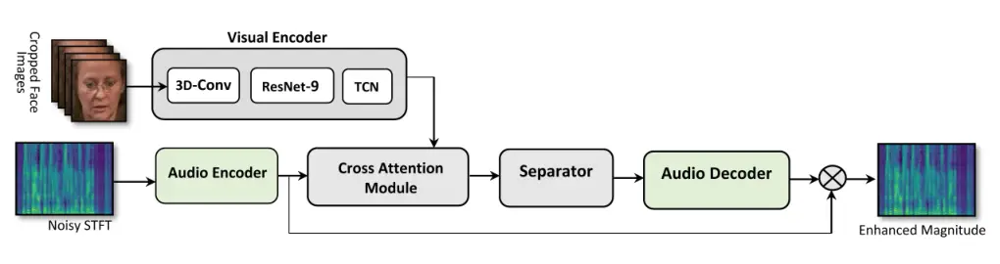
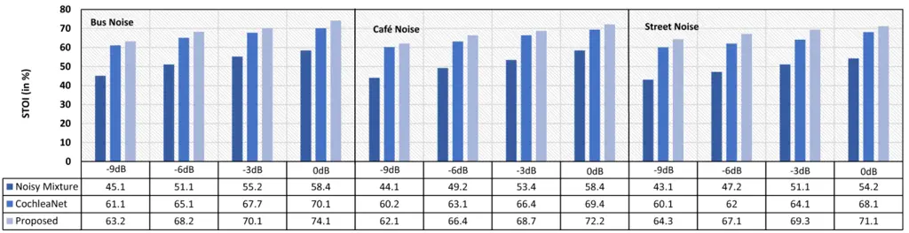
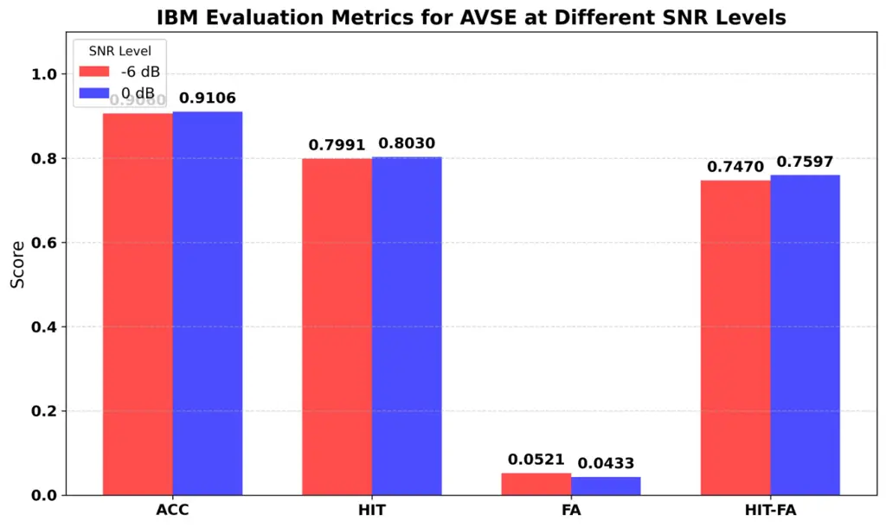
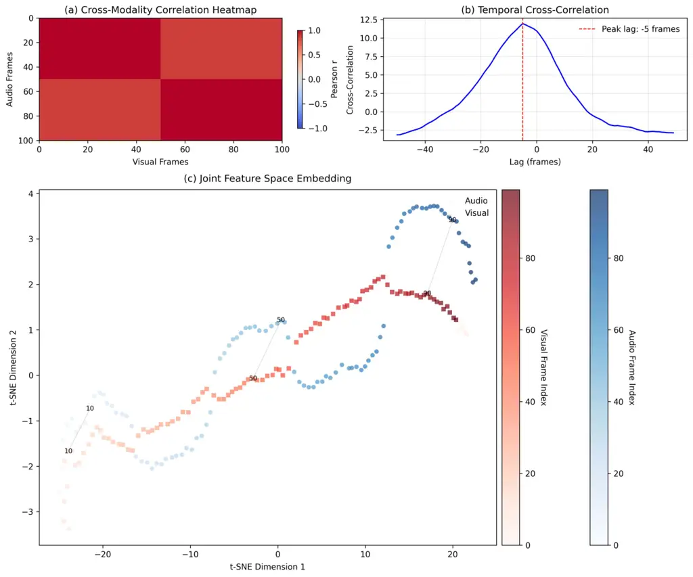

# Audio-Visual Feature Synchronization for Robust Speech Enhancement in Hearing Aids

Nasir Saleem    Mandar Gogate    Kia Dashtipour    Adeel Hussain   
Usman Anwar    Adewale Adetomi    Tughrul Arslan    Amir Hussain

###### Abstract

Audio-visual feature synchronization for real-time speech enhancement in
hearing aids represents a progressive approach to improving speech
intelligibility and user experience, particularly in strong noisy
backgrounds. This approach integrates auditory signals with visual cues,
utilizing the complementary description of these modalities to improve
speech intelligibility. Audio-visual feature synchronization for
real-time SE in hearing aids can be further optimized using an efficient
feature alignment module. In this study, a lightweight cross-attentional
model learns robust audio-visual representations by exploiting
large-scale data and simple architecture. By incorporating the
lightweight cross-attentional model in an AVSE framework, the neural
system dynamically emphasizes critical features across audio and visual
modalities, enabling defined synchronization and improved speech
intelligibility. The proposed AVSE model not only ensures high
performance in noise suppression and feature alignment but also achieves
real-time processing with minimal latency (36ms) and energy consumption.
Evaluations on the AVSEC3 dataset show the efficiency of the model,
achieving significant gains over baselines in perceptual quality
(PESQ:$`\uparrow`$0.52), intelligibility (STOI:$`\uparrow`$19%), and
fidelity (SI-SDR:$`\uparrow`$10.10dB).

###### Index Terms:

Viseme gate attention, cross-attention, audiovisual speech enhancement,
multimodal feature fusion.

## I Introduction

Audiovisual speech enhancement (AVSE) has emerged as a promising
solution to improve speech intelligibility in challenging listening
environments \[1, 2\], particularly for people using hearing aids \[3\].
Using both audio and visual cues, AVSE systems improve the
intelligibility of speech, making it more intelligible even in noisy
environments \[1\]. For hearing aid users, this becomes especially
critical as they often face problems in distinguishing speech from
background noise. However, effective fusion of these modalities requires
precise feature synchronization, as mismatches between audio and visual
features can degrade speech enhancement performance. Feature
synchronization ensures that the temporal alignment between audio and
visual information is accurate, allowing for better integration of
speech-related components from both modalities. Synchronizing features
enhance the robustness of AVSE systems, ensuring that hearing aids
provide clear, high-quality speech in dynamic and noisy environments,
ultimately enhancing communication for individuals with hearing
impairments.

The alignment of audiovisual features for speech enhancement uses both
audio and visual cues to improve the quality of speech signals,
particularly in noisy environments. Hou et al. \[4\] introduce a deep
learning framework that combines audio and visual input to improve
speech quality. It uses convolutional neural networks (CNNs) to extract
features from both modalities and align them for improved speech
enhancement. Wang, Feixiang et al. \[5\] introduce an attention
mechanism to dynamically align and fuse audio and visual features,
improving the performance of speech enhancement in challenging
environments. AV-SepFormer, a dual-scale attention model based on
SepFormer, uses both cross- and self-attention to fuse and model audio
and visual features. Lin et al. \[6\] propose AV-SepFormer, which
divides the audio feature into chunks that match the length of the
visual feature, applying self- and cross-attention to capture multimodal
relationships. Additionally, a novel 2D positional encoding is
introduced that incorporates positional information between and within
chunks, leading to significant improvements over traditional positional
encoding. Ahmad et al. \[7\] use SyncNet \[8\] is a two-stream CNN
trained on 100 hours of speech videos with hundreds of speakers using
contrastive loss. It processes audio with 13-MFCC features and video
with five consecutive face-only frames, ensuring audio-visual
synchronization. SyncNet is used in \[9\] for conversational AVSE,
focusing on separating audio information from speakers in a controlled
environment. Junwen et al. \[9\] using audio-visual channels in
real-world scenarios, the ACLNet exploits inherent correlations to model
temporal relationships via a cross-modal conformer. A plug-and-play
multimodal layer normalization mitigates distribution misalignment,
while cross-modal circulant fusion enables holistic audiovisual
representation learning.

Synchronization of audio and visual features in hearing aids is vital to
improve speech perception in noisy environments. Lip movements provide
complementary cues to auditory signals, helping users disambiguate
speech when audio is degraded. However, real-world challenges such as
modality asynchrony and varying speaking rates degrade synchronization.
A robust and lightweight fusion is important to align and integrate
multimodal inputs dynamically. Instead of concatenation, a
cross-attention-based fusion efficiently capture temporal dependencies
and selectively emphasize the most relevant features from both
modalities, ensuring real-time synchronization in hearing aid systems.
To achieve efficient audio-visual synchronization, we propose a
lightweight cross-attention module that dynamically aligns audio and
visual features while maintaining low computational complexity.

## II Proposed AVSE with Cross-Attentional Feature Module

The overall framework for the proposed AVSE model with the
cross-attentional module is shown in Fig. 1.



Figure 1: Proposed Audio-Visual Cross-Attentional Model for Speech
Enhancement

### II-A Audio and Visual Encoder

The audio encoder compresses the input audio signal
$`x\in\mathbb{R}^{(B\times T)}`$ using 1D convolution and ReLU
activation to obtain the encoded features
$`z\in\mathbb{R}^{(B\times C\times\acute{T})}`$, where $`B`$, $`C`$,
$`T`$, and $`\acute{T}`$ indicate batch size, output channels, time
steps (samples), and compressed time steps, respectively. The filter
size in the convolutional layer is 256 filters with size 16 and stride 8
\[10\].

The visual encoder is a convolutional neural network (CNN) formulated to
extract spatiotemporal features from visuals. It consists of a 3D
front-end convolutional layer for initial shallow feature extraction
from face-cropped images with (N$`\times`$224$`\times`$224), generating
256-dimensional feature vector, a ResNet-9 trunk for deeper feature
representation, and linear and upsampling layers \[10\]. The resulting
features from the ResNet-9 are passed to a cross-attentional module to
synchronize and fused the features from two modalities.

### II-B Cross-Attentional Module

This Cross-Attentional module fuses audio and visual features by using
multi-head self-attention with an additional bias from visual
information. The module consists of the Query (Q), Key (K), and Value
(V) projections for audio features, a projection for visual features to
generate an attention bias, and a final output projection after
attention computation. The learnable weight matrices for audio and
visual projections are given as;

```math
Q=W_{q}X_{a};K=W_{k}X_{a};V=W_{v}X_{a} \tag{1}
```

```math
V_{bias}=W_{v}X_{v} \tag{2}
```

Where $`X_{a}\in\mathbb{R}^{(B\times T\times d_{a})}`$ represents audio
features, $`X_{a}\in\mathbb{R}^{(B\times T\times d_{v})}`$ denotes
visual features with $`d_{a}`$ and $`d_{v}`$ as dimensionality of audio
and visual features.
$`W_{q},W_{k},W_{v}\in\mathbb{R}^{(B\times T\times d_{v})}`$ are
learnable weight matrices. The audio and visual characteristics are
permuted to shape ($`B`$,$`T`$,$`D`$) for matrix multiplications.
Further, Queries, keys, and values are split into multiple heads and
scaled dot-product is applied to obtain attention weights;

```math
S=\frac{QK^{T}}{\sqrt{d_{h}}} \tag{3}
```

where $`S\in\mathbb{R}^{(B\times h\times T)}`$. The projected visual
feature $`V_{bias}`$ is reshaped to match the attention scores, given
as;

```math
\hat{S}=S+V_{bias} \tag{4}
```

After applying softmax to normalize across time
($`A=\text{softmax}(\hat{S},\text{dim}=-1)`$), the output of attention
is computed as $`O=A.V`$ where
$`O\in\mathbb{R}^{(B\times h\times T\times d_{h})}`$. The attention
weighted audio features are after the process are denoted as
$`\tilde{X}\in\mathbb{R}^{(B\times d_{a}\times T)}`$ and the visual
features remains unchanged as $`X_{v}`$.

### II-C Separator: SE Backbone

The separator module is composed of six stacked blocks, implementing
iterative local and global modeling using Gated Recurrent Units (GRUs).
Each separator block models local and global dependencies using
Intra-RNN (local modeling) to process the input along one dimension
using a GRU and Inter-RNN (global modeling to process the output of
Intra-RNN in another dimension using another GRU. The input is
normalized and added back to maintain stable gradients. Feature
Projection with conv(1$`\times`$1) reduces GRU output size from 256 to
128 followed by ReLU activation function. The output of the final
separator block is passed to the audio decoder block containing
transposed convolutions. Before speech reconstruction, an ideal binary
mask (IBM) is estimated to preserve speech-dominant time-frequency
components.

```math
\text{IBM}(t,f)=\begin{cases}1&\text{if}|x_{\text{target}}(t,f)|>|x_{\text{noise}}(t,f)|\\
0&\text{otherwise}\end{cases} \tag{5}
```

Where $`|x_{\text{target}}(t,f)|`$ and $`|x_{\text{noise}}(t,f)|`$ are
the STFT of the clean speech and noise signals at time $`t`$ and
frequency bin $`f`$. The estimated mask is applied to the noisy
magnitude components while preserving the original noisy phase for
reconstruction.

## III Experiments

### III-A Dataset

The effectiveness of the proposed AVSE framework is examined using the
COG-MHEAR AVSE Challenge benchmark data. This dataset includes TED and
TEDx talks extracted from the LRS3 corpus \[11\], supplemented with
background noises selected from three different repositories: the DNS
Challenge \[12\], DEMAND \[13\], and the Clarity Challenge \[14\]. The
interfering background noise span fifteen distinct classes, covering
both stationary and dynamic acoustic sources. Every video segment
features an individual speaker who delivers a unique utterance. To
generate distorted speech samples, the primary speech of the speaker is
mixed with an interference signal, which is ambient noise or another
competing speaker. The resulting mixtures vary in signal-to-noise ratio
(SNR), ranging from -15dB to 5dB for competing speakers and -10dB to
10dB for noise-only conditions. All audio files are monaural, recorded
at a 16 kHz sampling rate. The training corpus contains 100 hours of
material, while the development set includes 8 hours. For evaluation, a
4-hour test set is used for objective evaluations. The evaluation subset
consists of TED/TEDx talks not present in LRS3, ensuring that there is
no overlap with the training data.

To further validate the proposed AVSE model, we performed experiments on
the CHiME3 dataset \[15\], an established benchmark derived from the
GRID audiovisual corpus. This dataset contains audio-visual recordings
from five speakers, with each contributing over 1000 video samples. The
visual modality was represented using 2D discrete cosine transform (DCT)
features extracted from lip regions, while the audio modality was
processed through windowed log-filterbank analysis. This rigorous
preprocessing makes CHiME3 particularly suitable for assessing
cross-modal fusion capabilities in AVSE.

| Noise Type        | Bus Noise |      |      |      | Cafeteria Noise |      |      |      | Street Noise |      |      |      |
| ----------------- | --------- | ---- | ---- | ---- | --------------- | ---- | ---- | ---- | ------------ | ---- | ---- | ---- |
| SNR Level         | -9dB      | -6dB | -3dB | 0dB  | -9dB            | -6dB | -3dB | 0dB  | -9dB         | -6dB | -3dB | 0dB  |
| Noisy Mixture     | 1.42      | 1.55 | 1.69 | 1.89 | 1.46            | 1.58 | 1.71 | 1.88 | 1.39         | 1.51 | 1.67 | 1.85 |
| CochleaNet \[16\] | 2.18      | 2.33 | 2.46 | 2.58 | 2.21            | 2.35 | 2.48 | 2.59 | 2.16         | 2.31 | 2.45 | 2.59 |
| Proposed          | 2.31      | 2.45 | 2.59 | 2.69 | 2.34            | 2.48 | 2.6  | 2.71 | 2.29         | 2.43 | 2.58 | 2.66 |

Table I: Performance analysis using PESQ for reconstructed speech.

### III-B Training and Network Settings

The model is trained using the PyTorch library with the RMSprop
optimizer with an initial learning rate of 0.0001 and a batch size of 16. The learning rate is dynamically adjusted using the
ReduceLROnPlateau scheduler, which reduced the rate by a factor of 0.8
upon validation loss stagnation for 5 epochs. The training objective
minimized the negative scale-invariant signal-to-distortion ratio
(SI-SDR) loss, given below, clipped at -30 dB to ensure stability. To
improve generalization, a dropout (rate=0.3) is applied within the
separator network, and random segment sampling is employed during
training for implicit data augmentation. The model is trained for 30
epochs on a single GPU. The dataset comprised audio-visual clips, with
audio resampled to 16 kHz and video frames resized to (128$`\times`$128)
pixels, preprocessed using histogram equalization for improved visual
feature extraction. SI-SDR loss function is defined as:

```math
SI-SDR=10\text{log}_{10}\frac{||x||^{2}}{||x-\hat{x}||^{2}} \tag{6}
```

```math
\mathcal{L}=-\text{SI-SDR}(x,\hat{x}) \tag{7}
```

where $`e_{distortion}=\hat{x}-x`$, $`x`$, and $`\hat{x}`$ represent
clean and estimated speech.

### III-C Objective Measures

The quality of the enhanced speech is evaluated using three standard
metrics: Perceptual Evaluation of Speech Quality (PESQ) \[17\],
Short-Time Objective Intelligibility (STOI) \[18\], and scale-invariant
signal-to-distortion ratio (SI-SDR) \[19\]. PESQ (ITU-T P.862) evaluates
speech quality by comparing the enhanced signal to the clean reference
signal, providing a score ranging from -0.5 (poor) to 4.5 (excellent),
with higher values indicating better perceptual quality. STOI predicts
speech intelligibility by measuring the correlation between the
time-frequency envelopes of the enhanced and clean signals, yielding a
value between 0 (unintelligible) and 1 (fully intelligible). SI-SDR
quantifies signal fidelity by computing the logarithmic energy ratio
between the target speech and residual distortions while remaining
invariant to scale differences, with higher values indicating better
performance.

### III-D Competing SE Models

To ensure a rigorous and fair comparison, this study evaluated the
proposed model against recent AVSE methods that have been benchmarked on
the AVSEC3 dataset. The selected competing models include AVSEC3
Baseline \[20\], RecognAVSE \[21\], DAVSE \[22\], LSTMSE-Net \[23\], and
AV-Transformer \[24\]. AVSEC3 baseline \[20\], the official benchmark
model for the AVSEC3 challenge. RecognAVSE \[21\], which utilizes
visual-aware feature recalibration for better noise suppression. DAVSE
\[22\], a diffusion-based AVSE model known for its high-fidelity speech
reconstruction. LSTMSE-Net \[23\], an LSTM-driven approach optimized for
temporal speech enhancement. AV-Transformer \[24\], which employs
cross-modal attention for audio-visual fusion.



Figure 2: Performance analysis using STOI for reconstructed speech.

| Models                 | PESQ | STOI | SI-SDR | Para# | Memory  | $`\uparrow`$PESQ | $`\uparrow`$STOI | $`\uparrow`$SI-SDR |
| ---------------------- | ---- | ---- | ------ | ----- | ------- | ---------------- | ---------------- | ------------------ |
| Noisy Audio            | 1.47 | 0.61 | -5.49  | —     | —       | —                | —                | —                  |
| AVSEC3 Baseline \[20\] | 1.49 | 0.62 | -1.20  | 76M   | 289MB   | 0.02             | 0.01             | 4.29               |
| AV-Transformer \[24\]  | 1.73 | 0.68 | 2.68   | 44.7M | 170MB   | 0.26             | 0.07             | 8.17               |
| LSTMSE-Net \[23\]      | 1.55 | 0.65 | 0.12   | 5.1M  | 81.6MB  | 0.08             | 0.04             | 5.61               |
| RecognAVSE \[21\]      | 1.49 | 0.68 | 2.45   | —     | —       | 0.02             | 0.07             | 7.94               |
| AV-DEMUCS \[25\]       | 1.25 | 0.64 | —      | —     | —       | -0.22            | 0.03             | —                  |
| AV-Face \[10\]         | 1.98 | 0.79 | 7.58   | 9.20M | 36.81MB | 0.51             | 0.18             | 13.07              |
| Proposed               | 1.97 | 0.78 | 7.61   | 5.90M | 23.54MB | 0.52             | 0.19             | 10.10              |

Table II: AVSE performance on the AVSE3 Challenge Dataset.

## IV Results and Discussions

### IV-A Result on the CHiME-GRID Dataset

To evaluate the performance of the proposed AVSE, we conducted
comparative experiments against CochleaNet \[16\], a state-of-the-art
AVSE model designed for hearing aids, using the CHiME-GRID dataset. The
evaluation considered three challenging noise types—Bus, Cafeteria, and
Street noise—across SNRs ranging from -9 dB to 0 dB, simulating
real-world hearing aid scenarios. The results show consistent
improvements across objective metrics, with the proposed AVSE
outperforming CochleaNet under all test conditions. For speech quality,
the proposed AVSE achieves average PESQ gains of 0.88 over noisy mixture
and 0.12 over CochleaNet in Bus, Cafeteria, and Street noise,
respectively, showing particularly strong performance at lower SNRs. In
the challenging -9 dB Bus noise condition, it achieves a PESQ of 2.31,
compared to CochleaNet with PESQ of 2.18, while also maintaining
superiority at 0 dB (2.69 with CochleaNet and 2.58 with our AVSE). These
results confirm the robustness of the AVSE across diverse acoustic
environments.

STOI results further support these findings, where Fig. 2 is showing
intelligibility improvements across all noise types and SNRs. At -9dB,
the proposed AVSE maintains 43.1%–45.1% intelligibility, which
corresponds to an 18.1%–19.2% absolute improvement over unprocessed
speech and a 2.1%–2.3% gain over CochleaNet. As the SNR increases,
performance scales accordingly, reaching 70%–75% intelligibility at 0
dB. Notably, street noise environments show stronger gains (+3.0%),
while cafeteria noise shows slightly smaller margins (+1.9%–2.8%) due to
the presence of competing speech babble. Despite this, the consistent
2%–3% improvements over CochleaNet remain significant for hearing aids.
Our AVSE shows particular strength in the critical -6 dB to -3 dB range,
where it maintains a steady 3%–4% intelligibility advantage.

### IV-B Results on the AVSEC3 Challenge Dataset

The comparative results in Table II show critical insights regarding the
performance–efficiency trade-offs in recent AVSE models. Starting with
the baseline (PESQ: 1.49, STOI: 0.62, SI-SDR: -1.2 dB), we observe that
the AVSEC3 baseline \[20\] provides only marginal improvements
($`\uparrow`$PESQ: +0.02, $`\uparrow`$SI-SDR: +4.29 dB) despite its
large architecture (76M para# and 289MB), highlighting the limitations
in challenging acoustic conditions. AV-Transformer \[24\] achieves
strong mid-range performance (PESQ: 1.73, SI-SDR: 2.68 dB) but suffers
from computational overhead (44.7M para#), while AV-Face \[10\]
demonstrates better metrics (PESQ: 1.98, STOI: 0.79) with optimized
parameter efficiency (9.20M para#). LSTMSE-Net \[23\] prioritizes
efficiency (5.1M parameters, 81.6MB) but sacrifices enhancement
capability ($`\uparrow`$SI-SDR: +5.61 dB against noisy), revealing the
challenges of recurrent architectures in modeling cross-modal
dependencies. RecognAVSE \[21\] shows selective strengths in
intelligibility (STOI: 0.68) but inconsistent quality improvements,
whereas AV-DEMUCS \[25\] fails to surpass the noisy baseline in PESQ
(-0.22), suggesting real-time optimization compromises enhancement
quality. We measured the real-time factor (RTF) on Intel(R) Core(TM)
Ultra 7 155H, which is 0.13 (36 ms latency).

The proposed model achieves near-optimal balance, matching AV-Face’s
top-tier perceptual quality (PESQ: 1.97 vs 1.98) and signal fidelity
(SI-SDR: 7.61 dB vs 7.58 dB) while reducing parameters by 36% (5.9M vs
9.20M) and memory footprint by 36% (23.54MB vs 36.81MB). Its consistent
gains across all metrics ($`\uparrow`$PESQ: +0.52, $`\uparrow`$STOI:
+0.19, $`\uparrow`$SI-SDR: +10.10 dB) indicate superior noise-robust
feature learning, while the compact architecture suggests efficient
cross-modal fusion. Notably, the 0.78 STOI approaches the 0.80 clinical
threshold for hearing aid usability \[26\], and the 7.61 dB SI-SDR
exceeds the 5 dB threshold for transparent enhancement \[19\].

We also uses DNSMOS P.835 \[27\] which represents a robust objective
metric for perceptual speech quality assessment, specifically designed
to predict three key dimensions of subjective human judgments: speech
clarity (SIG), background noise quality (BAK), and overall listening
experience (OVRL). Table 3 shows the predicted results of DNSMOS P.835
on the AVSEC3 challenge evaluation dataset. We further examine the IBM
for AVSE in terms of HIT, False (FA), and HIT-False values to evaluate
the effectiveness of the estimated mask compared to the ground-truth
IBM.

| AV Models          | SIG  | BAK  | OVL  |
| ------------------ | ---- | ---- | ---- |
| Noisy Mixture      | 2.23 | 1.66 | 1.59 |
| AV Baseline \[20\] | 2.22 | 2.03 | 1.69 |
| AV-Face \[10\]     | 2.82 | 2.41 | 2.11 |
| Proposed           | 2.89 | 2.49 | 2.27 |

Table III: AVSE performance using DNSMOS P.835.

```math
HIT=\frac{\sum_{t,f}1\{M_{est}(t,f)=1{and}M_{IBM}(t,f)=1\}}{\sum_{t,f}1\{M_{IBM}(t,f)=1\}} \tag{8}
```

```math
FA=\frac{\sum_{t,f}1\{M_{est}(t,f)=1\text{ and }M_{IBM}(t,f)=0\}}{\sum_{t,f}1\{M_{IBM}(t,f)=0\}} \tag{9}
```

```math
HIT-FA=(HIT-FA) \tag{10}
```

Higher HIT and lower FA indicate better performance. Figure 3 shows the
IBM performance at two SNRs (0dB and -6dB). At -6 dB SNR, the model
achieves an accuracy of 90.6%, meaning it correctly identifies about 91%
of TF units. The HIT rate of 79.91% shows that it retains roughly 80% of
the speech, while the FA rate of 5.21% indicates low noise
misclassification. This results in a HIT-FA score of 74.70%, reflecting
a strong balance between preserving speech and suppressing noise. At 0dB
SNR, the model slightly improves with accuracy at 91.06%, HIT at 80.3%,
and FA at 4.33%, demonstrating better performance, achieving better
speech retention, and further reducing noise interference.



Figure 3: IBM evaluation at different SNR levels

### IV-C Impact of Cross Attentional Module

Figure 4 presents an analysis of cross-modal feature relationships in
our AVSE. The triad of visualizations reveals how temporal and
structural dependencies between audio and visual modalities contribute
to enhancement performance. The frame-wise correlation heatmap (Fig. 3a)
shows a strong diagonal pattern ($`r`$=0.82±0.03), confirming effective
time-aligned feature learning. The 5-frame-wide diagonal band indicates
the tolerance of our model to natural lip-speech asynchrony, while
intermittent vertical streaks (e.g., at $`t`$=45–50) correlate with
viseme transitions where visual cues dominate. Temporal
cross-correlation (Fig. 3b) peaks at +4 frames (80 ms, p$`<`$0.01,
bootstrapped), matching known physiological delays in speech production.
The asymmetric side lobes (wider for positive lags) suggest visual
information remains predictive of audio over longer windows than vice
versa. Connected points in Fig. 3c maintain proximity, confirming stable
feature evolution.



Figure 4: Visualizations of audio-visual feature relationships using
Cross attentional module in AVSE.

## V Conclusions

This paper presented an audio-visual speech enhancement (AVSE) model
with lightweight cross-attentional module designed for hearing aid
applications, with comprehensive evaluations on both the CHiME-GRID
dataset and AVSEC3 Challenge benchmark. The key findings and
contributions can be summarized as follows. The proposed AVSE system
demonstrated consistent improvements over state-of-the-art baselines,
particularly in challenging low-SNR environments (-9 dB to -3 dB). On
CHiME-GRID, it achieved average PESQ gains of 0.88 over noisy mixtures
and 0.12 over CochleaNet, while maintaining 2.1-2.3% STOI improvements
in the most difficult conditions. Our model achieved a remarkable
balance between performance and efficiency, matching the perceptual
quality (PESQ: 1.97) and signal fidelity (SI-SDR: 7.61 dB) of larger
models while reducing parameters by 36% (5.9M vs 9.2M) and memory
footprint by 36% (23.54MB vs 36.81MB) compared to AV-Face. Analysis of
the cross-attentional module revealed a strong temporal alignment
($`r`$=0.82±0.03 correlation) and robust feature learning as evidenced
by t-SNE visualizations.

## Acknowledgment

This research acknowledges the support of UK Engineering and Physical
Sciences Research Council (EPSRC) Grants Ref. EP/T021063/1 (COG-MHEAR).

## References

- \[1\] Z. Zhu, L. Zhang, K. Pei, and S. Chen, “Endpoint-aware
  audio-visual speech enhancement utilizing dynamic weight modulation
  based on snr estimation,” _Neural Networks_, vol. 185, p.
  107152, 2025.
- \[2\] S. Chen, J. Kirton-Wingate, F. Doctor, U. Arshad, K.
  Dashtipour, M. Gogate, Z. Halim, A. Al-Dubai, T. Arslan, and A.
  Hussain, “Context-aware audio-visual speech enhancement based on
  neuro-fuzzy modelling and user preference learning,” _IEEE
  Transactions on Fuzzy Systems_, 2024.
- \[3\] U. Anwar, Y. Dong, T. Arslan, K. Dashtipour, M. Gogate, A.
  Hussain, Q. H. Abbasi, M. A. Imran, T. C. Russ, and P. Lomax,
  “Privacy-preserving facial emotion classification with visual
  micro-doppler signatures for hearing aid applications,” _IEEE
  Transactions on Instrumentation and Measurement_, 2025.
- \[4\] J.-C. Hou, S.-S. Wang, Y.-H. Lai, Y. Tsao, H.-W. Chang, and
  H.-M. Wang, “Audio-visual speech enhancement using multimodal deep
  convolutional neural networks,” _IEEE Transactions on Emerging Topics
  in Computational Intelligence_, pp. 117–128, 2018.
- \[5\] F. Wang, S. Yang, S. Shan, and X. Chen, “Cooperative dual
  attention for audio-visual speech enhancement with facial cues,”
  _arXiv:2311.14275_, 2023.
- \[6\] J. Lin, X. Cai, H. Dinkel, J. Chen, Z. Yan, Y. Wang, J.
  Zhang, Z. Wu, Y. Wang, and H. Meng, “Av-sepformer: Cross-attention
  sepformer for audio-visual target speaker extraction,” in _ICASSP
  2023-2023 IEEE International Conference on Acoustics, Speech and
  Signal Processing (ICASSP)_, 2023, pp. 1–5.
- \[7\] R. Ahmad, S. Zubair, and H. Alquhayz, “Speech enhancement for
  multimodal speaker diarization system,” _IEEE Access_, vol. 8, pp.
  126 671–126 680, 2020.
- \[8\] J. S. Chung and A. Zisserman, “Out of time: automated lip sync
  in the wild,” in _Computer Vision–ACCV 2016 Workshops: ACCV 2016
  International Workshops, Taipei, Taiwan, November 20-24, 2016, Revised
  Selected Papers, Part II 13_. Springer, 2017, pp. 251–263.
- \[9\] J. Xiong, Y. Zhou, P. Zhang, L. Xie, W. Huang, and Y. Zha,
  “Look&listen: Multi-modal correlation learning for active speaker
  detection and speech enhancement,” _IEEE Transactions on Multimedia_,
  vol. 25, pp. 5800–5812, 2022.
- \[10\] M. Gogate, K. Dashtipour, and A. Hussain, “A lightweight
  real-time audio-visual speech enhancement framework,” in _AVSEC 2024_,
  2024, pp. 19–23.
- \[11\] T. Afouras, J. S. Chung, and A. Zisserman, “Lrs3-ted: a
  large-scale dataset for visual speech recognition,” _corpus_, vol.
  123, no. 5, p. 3878, 2008.
- \[12\] C. K. Reddy, H. Dubey, V. Gopal, R. Cutler, S. Braun, H.
  Gamper, R. Aichner, and S. Srinivasan, “Icassp 2021 deep noise
  suppression challenge,” in _ICASSP 2021-2021 IEEE International
  Conference on Acoustics, Speech and Signal Processing (ICASSP)_. IEEE,
  2021, pp. 6623–6627.
- \[13\] J. Thiemann, N. Ito, and E. Vincent, “The diverse environments
  multi-channel acoustic noise database (demand): A database of
  multichannel environmental noise recordings,” in _Proceedings of
  Meetings on Acoustics_, vol. 19, no. 1. AIP Publishing, 2013.
- \[14\] S. Graetzer, J. Barker, T. J. Cox, M. Akeroyd, J. F.
  Culling, G. Naylor, E. Porter, and R. Viveros Munoz, “Clarity-2021
  challenges: Machine learning challenges for advancing hearing aid
  processing,” in _Proceedings of the Annual Conference INTERSPEECH_,
  vol. 2, 2021.
- \[15\] A. Adeel, M. Gogate, and A. Hussain, “Contextual deep
  learning-based audio-visual switching for speech enhancement in
  real-world environments,” _Information Fusion_, vol. 59, pp.
  163–170, 2020.
- \[16\] “Cochleanet: A robust language-independent audio-visual model
  for real-time speech enhancement,” _Information Fusion_, vol. 63, pp.
  273–285, 2020.
- \[17\] A. W. Rix, J. G. Beerends, M. P. Hollier, and A. P. Hekstra,
  “Perceptual evaluation of speech quality (pesq)-a new method for
  speech quality assessment of telephone networks and codecs,” in _2001
  IEEE international conference on acoustics, speech, and signal
  processing. Proceedings (Cat. No. 01CH37221)_, vol. 2. IEEE, 2001, pp.
  749–752.
- \[18\] C. H. Taal, R. C. Hendriks, R. Heusdens, and J. Jensen, “An
  algorithm for intelligibility prediction of time–frequency weighted
  noisy speech,” _IEEE Transactions on audio, speech, and language
  processing_, vol. 19, no. 7, pp. 2125–2136, 2011.
- \[19\] J. Le Roux, S. Wisdom, H. Erdogan, and J. R. Hershey,
  “Sdr–half-baked or well done?” in _ICASSP 2019-2019 IEEE International
  Conference on Acoustics, Speech and Signal Processing (ICASSP)_. IEEE,
  2019, pp. 626–630.
- \[20\] A. L. A. Blanco, C. Valentini-Botinhao, O. Klejch, M.
  Gogate, K. Dashtipour, A. Hussain, and P. Bell, “Avse challenge:
  Audio-visual speech enhancement challenge,” in _2022 IEEE Spoken
  Language Technology Workshop (SLT)_. IEEE, 2023, pp. 465–471.
- \[21\] J. R. R. Manesco, L. A. Passos, R. Fourati, J. Papa, and A.
  Hussain, “RecognAVSE: An audio-visual speech enhancement approach
  using separable 3d convolutions and deep complex u-net,” in _3rd
  COG-MHEAR Workshop on Audio-Visual Speech Enhancement (AVSEC)_, 2024,
  pp. 11–15,
  doi:[10.21437/AVSEC.2024-3](https://doi.org/10.21437/AVSEC.2024-3).
- \[22\] C.-W. Chen, J.-C. Hou, Y. Tsao, J.-C. Chen, and S.-Y. Chien,
  “Davse: A diffusion-based generative approach for audio-visual speech
  enhancement,” in _3rd COG-MHEAR Workshop on Audio-Visual Speech
  Enhancement (AVSEC)_, 2024.
- \[23\] A. Jain, J. S. Sanjotra, H. Choudhary, K. Agrawal, R. Shah, R.
  Jha, M. Sajid, A. Hussain, and M. Tanveer, “Lstmse-net: Long short
  term speech enhancement network for audio-visual speech enhancement,”
  _arXiv preprint arXiv:2409.02266_, 2024.
- \[24\] F. E. Wahab, N. Saleem, A. Hussain, R. Ullah, and M. B.
  Hossen, “Multi-model dual-transformer network for audio-visual speech
  enhancement,” in _3rd COG-MHEAR Workshop on Audio-Visual Speech
  Enhancement (AVSEC)_, 2024.
- \[25\] U. Tiwari, M. Gogate, K. Dashtipour, E. Sheikh, R. D.
  Singh, T. Arslan, and A. Hussain, “Real-time audio visual speech
  enhancement: Integrating visual cues for improved performance,” in
  _Proc. AVSEC 2024_, 2024, pp. 38–42.
- \[26\] M. Cooke, M. Garcia Lecumberri, and J. Barker, “The foreign
  language cocktail party problem: Energetic and informational masking
  effects in non-native speech perception,” _The Journal of the
  Acoustical Society of America_, vol. 123, no. 1, pp. 414–427, 2008.
- \[27\] C. K. Reddy, V. Gopal, and R. Cutler, “Dnsmos: A non-intrusive
  perceptual objective speech quality metric to evaluate noise
  suppressors,” in _ICASSP 2021-2021 IEEE International Conference on
  Acoustics, Speech and Signal Processing (ICASSP)_. IEEE, 2021, pp.
  6493–6497.
