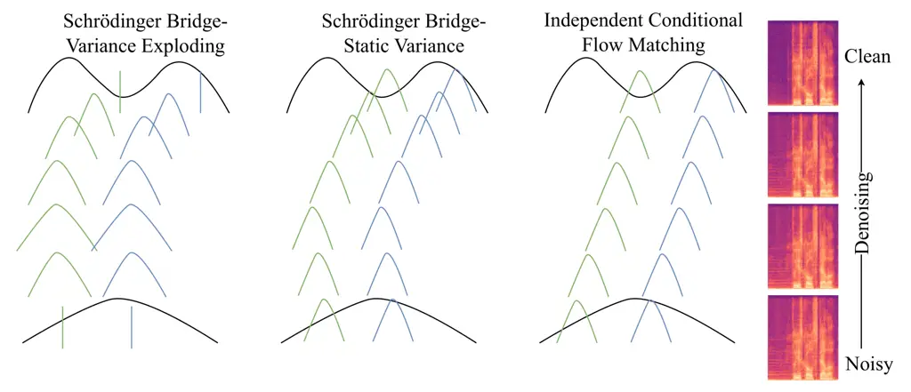

CFM  
conditional flow-matching

SGM  
score-based generative model

SNR  
signal-to-noise ratio

GAN  
generative adversarial network

VAE  
variational autoencoder

DDPM  
denoising diffusion probabilistic model

STFT  
short-time Fourier transform

iSTFT  
inverse short-time Fourier transform

SDE  
stochastic differential equation

ODE  
ordinary differential equation

OU  
Ornstein-Uhlenbeck

VE  
variance exploding

OUVE  
Ornstein-Uhlenbeck process with variance exploding

DNN  
deep neural network

PESQ  
Perceptual Evaluation of Speech Quality

SE  
speech enhancement

T-F  
time-frequency

ELBO  
evidence lower bound

WPE  
weighted prediction error

MAC  
multiply–accumulate operation

PSD  
power spectral density

RIR  
room impulse response

SNR  
signal-to-noise ratio

LSTM  
long short-term memory

POLQA  
Perceptual Objectve Listening Quality Analysis

SDR  
signal-to-distortion ratio

SI-SDR  
scale invariant signal-to-distortion ratio

ESTOI  
Extended Short-Term Objective Intelligibility

ELR  
early-to-late reverberation ratio

TCN  
temporal convolutional network

DRR  
direct-to-reverberant ratio

NFE  
number of function evaluations

RTF  
real-time factor

MOS  
mean opinion score

EMA  
exponential moving average

SB  
Schrödinger bridge

SGMSE  
score-based generative models for speech enhancement

EDM  
elucidating the design space of diffusion-based generative models

GPU  
graphics processing unit

VB-DMD  
Voicebank-Demand

SB-VE  
Schrödinger bridge with variance exploding diffusion coefficient

SB-SV  
Schrödinger bridge with static variance

ICFM  
independent conditional flow-matching

SE  
speech enhancement

FM  
flow matching

CNF  
continuous normalising flows

OT  
optimal transport

VE-SDE  
Stochastic differential equation with variance exploding diffusion
coefficient

DM  
diffusion model

ML  
machine learning

DDP  
direct data prediction

# Flowing Straighter with Conditional Flow Matching for Accurate Speech Enhancement

Mattias Cross Email: <mcross2@sheffield.ac.uk>    Anton Ragni
Email: <a.ragni@sheffield.ac.uk> Affiliation: School of Computer
Science, The University of Sheffield, Sheffield, UK

###### Abstract

Current flow-based generative speech enhancement methods learn curved
probability paths which model a mapping between clean and noisy speech.
Despite impressive performance, the implications of curved probability
paths are unknown. Methods such as Schrödinger bridges focus on curved
paths, where time-dependent gradients and variance do not promote
straight paths. Findings in machine learning research suggest that
straight paths, such as conditional flow matching, are easier to train
and offer better generalisation. In this paper we quantify the effect of
path straightness on speech enhancement quality. We report experiments
with the Schrödinger bridge, where we show that certain configurations
lead to straighter paths. Conversely, we propose independent conditional
flow-matching for speech enhancement, which models straight paths
between noisy and clean speech. We demonstrate empirically that a
time-independent variance has a greater effect on sample quality than
the gradient. Although conditional flow matching improves several speech
quality metrics, it requires multiple inference steps. We rectify this
with a one-step solution by inferring the trained flow-based model as if
it was directly predictive. Our work suggests that straighter
time-independent probability paths improve generative speech enhancement
over curved time-dependent paths.

^(†)^(†)volume: 277^(†)^(†)year: 2025^(†)^(†)workshop: Machine Learning
Meets Differential Equations: From Theory to
Applications^(†)^(†)editors: Cecília Coelho, Bernd Zimmering, M.
Fernanda P. Costa, Luís L. Ferrás, Oliver Niggemann

###### keywords

speech enhancement, conditional flow matching, neural ordinary
differential equations

## 1 Introduction



Figure 1: SB and ICFM learn a Gaussian probability path between
distributions. SB is sublinear with time-varying variance that starts
and ends at 0. ICFM is linear with constant variance.

Understanding what people say in noisy environments, such as a crowded
café, is tricky for computers. Suppressing background noise in speech
recordings, known as SE (SE), is a task that has seen many proposed
solutions involving flow-based generative methods. These methods solve
SE by estimating the distribution of clean speech, which can be
conditionally sampled from given noisy speech input (Richter et al.,
2025). The clean distribution is estimated with CNF (CNF), models that
learn a mapping between two distributions with a neural ODE (ODE) (Chen
et al., 2018). Neural ODE are ODE parameterised with a neural network to
estimate a velocity field that pushes samples from a source to a target
distribution, enabling a continuous mapping that can be computed with
ODE solvers. The SE problem is particularly well-suited to CNF because
samples of source-target pairs are similar: the source sample is the
target with added noise and potentially reverberation. There are many
methods for training CNF: DM (Sohl-Dickstein et al., 2015; Song et al.,
2021), SB (SB) (Chen et al., 2021; De Bortoli et al., 2021; Wang et al.,
2021), and FM (FM) (Lipman et al., 2023; Albergo et al., 2023; Liu
et al., 2022; Tong et al., 2024). DM and SB (SB) have received attention
as powerful SE methods (Jukić et al., 2024; Richter et al., 2025;
Richter et al., 2023), with FM being less explored at the time of
writing. The methods for training CNF described above define a Gaussian
probability path which interpolates between a pair of distributions;
each method is identifiable by its probability path and source
distribution (with the consistent target distribution being clean
speech; Figure 1). For example, SB defines a path that solves the SB
problem between the exact noisy and clean speech distributions
(elaborated in 2.2). This path is typically time-dependent, where “time”
describes progress along the path between the pair of distributions, and
where the ODE is a function of time. Since the SB path interpolates the
exact data, the ODE is accurate and does not require numerous ODE steps,
yielding practical inference speed. Despite the strong modelling power
of SB, time-dependent gradients and variance can cause curved paths.
Many works in the ML (ML) literature suggest that straight paths are
preferred over curves because they are easier to train and experience
less ODE sampling errors (Lipman et al., 2023; Albergo et al., 2023; Liu
et al., 2022; Tong et al., 2024), giving rise of FM. The goal of FM is
to induce straight paths by relaxing constraints on probability path
design to any velocity field (flow) that interpolates source- and
target-distributions. This relaxation allows various straighter paths to
be chosen, such as an optimal transport displacement interpolant
(McCann, 1997). This formulation produces straight paths with
time-independent velocity, resulting in faster training and ODE
inference, and higher sample quality (Lipman et al., 2023; Lipman
et al., 2024). The intuition behind this is that straighter paths are
easier to sample with ODE solvers, and fewer curves demand less
modelling power from the neural ODE. However, the originally proposed FM
is not well-suited for data-to-data tasks such as SE because it
considers paths from the standard normal distribution, not empirical
data such as the noisy speech distribution. To relax this, independent
conditional flow-matching (ICFM) generalises FM to the independent
coupling of two general distributions, e.g. a path between paired data
(Tong et al., 2024). Although SB produces state-of-the-art results for
SE, it is unknown if its time-dependent and potentially curved path
could be improved by using straighter paths. Further, time-independent
models such as ICFM have not been proposed for direct SE, although there
has been work on ICFM from audio-visual embeddings for SE (Jung et al.,
2024). Concurrent to our work, FM with time-varying variance has been
adapted to the SE task in FlowSE (Lee et al., 2025), and an alternative
time-varying FM set-up with modifications for improved one-step
performance has also been proposed (Korostik et al., 2025). Although
these two works are relevant, neither explores time-independent
variance. In light of this, we explore the impact of time-dependence on
the probability path for SE by comparing SB to ICFM (fig:sb_cfm_spec).
We show that although certain configurations of SB ensue
time-independent gradients, a time-independent variance is not
supported. To identify the significance of time-independent gradient and
variance on sample quality, we propose SB-SV (SB-SV), a model whose
gradient is equal to SB but with time-independent variance. As an
example of a model which, by design, has time-independent paths, we
propose and evaluate a novel formulation of independent conditional
flow-matching (ICFM) for SE. We find that speech quality metrics
increase when introducing SB-SV, which are then further improved with
ICFM. These observations suggest that time independence is important for
high sample quality. We also evaluate the link between the number of ODE
steps and speech quality. SB is robust to one-step ODE inference, but
our proposed models require thirty steps to achieve the best results. We
rectify this by proposing a simple approach for one-step inference with
DDP (DDP) of clean speech from noisy speech input. We find samples from
DDP to be on par, if not surpass, those produced by ODEs.

The rest of this paper outlines the SB method along with our proposed
SB-SV and ICFM for SE, including our DDP inference in 2. 3 details
experiments. Finally, the results are presented with a discussion in 4.

## 2 Flow-based models for speech enhancement

### 2.1 General definition

In generative SE, flow-based models are defined as models that learn a
marginal path $`p_{t}`$ between a prior $`p_{1}`$ and the clean speech
distribution $`p_{0}`$. A Gaussian probability path $`p_{t}`$ that
satisfies these boundaries can be defined by

```math
p_{t}(\mathbf{x}_{t}|\mathbf{x}_{0},\mathbf{y})\coloneq\mathcal{N}_{\mathbb{C}}(\mathbf{x}_{t};\boldsymbol{\mu}_{t}(\mathbf{x}_{0},\mathbf{y}),\sigma_{\mathbf{x}_{t}}^{2}\mathbf{I})\,, \tag{1}
```

where $`\mathbf{x}_{t}\!\in\!\mathbb{C}^{d}`$ is the process state at
time $`t\!\in\!\left[0,1\right]`$ and
$`\mathbf{y}\!\in\!\mathbb{C}^{d}`$ is a noisy speech sample, and
$`\mathbf{x}_{0}\sim p_{0}`$ is clean speech; $`\mathbb{C}^{d}`$ is the
complex STFT (STFT) domain. The prior $`p_{1}`$, mean
$`\boldsymbol{\mu}_{t}`$, and variance $`\sigma_{\mathbf{x}_{t}}^{2}`$
are not arbitrary and must be defined during model design (later
described in ()). For example, SGMSE (SGMSE) (Welker et al., 2022) and
ICFM (ICFM) define $`p_{1}`$ as a Gaussian distribution centred around
$`\mathbf{y}`$, and SB defines $`p_{1}`$ as the exact noisy data
distribution with samples $`\mathbf{y}`$. When computing the path
$`p_{t}`$ on new data, the clean speech $`\mathbf{x}_{0}`$ is unknown,
leaving $`p_{t}`$ intractable. Flow-based models aim to train a neural
ODE to estimate $`p_{t}`$ without requiring $`\mathbf{x}_{0}`$. This is
achieved by training a neural network $`F_{\theta}`$ to predict the
gradient of $`p_{t}`$. For a given discretisation schedule
$`(t_{N}=1,t_{N-1},\dots,t_{0}=0)`$ with $`N`$ steps, the neural ODE
sampler is

```math
\mathbf{x}_{t_{n-1}}=a_{n}\mathbf{x}_{t_{n}}+b_{n}F_{\theta}(\mathbf{x}_{t_{n}},\mathbf{y},t_{n})+c_{n}\mathbf{y},\quad\mathbf{x}_{t_{N}}=\mathbf{y} \tag{2}
```

where $`a_{n}`$, $`b_{n}`$, and $`c_{n}`$ are determined according to
the designed path (1), shown in () below. The rest of this section
outlines examples of the variety of paths possible with this framework,
specifically paths of varying straightness.

Figure 2: SB is defined by $`k`$ and $`c`$. The parameter $`k`$ defines
the base of the interpolation weight, and $`c`$ the variance scale (4).
SB is most linear when $`k=0.99`$

### 2.2 SB-VE (SB-VE)

The SB problem originally considers a group of particles that we assume
to move via Brownian motion, with position distribution observations
$`p_{x}`$ and $`p_{y}`$ at times 0 and 1 respectively (Schrödinger,
1932; Léonard, 2013). Then, imagine an unexpected (rare) event occurs
such that our observation at time 1 differs substantially from what
would be predicted by Brownian motion. The SB problem lies in finding
the most likely path between our two observations that adheres most to
Brownian motion. Formally, SB is defined as finding the probability path
$`p`$ between boundaries $`p_{x}`$ and $`p_{y}`$ that minimises the
Kullback-Leibler divergence $`D_{\text{KL}}`$ w.r.t. a pre-specified
Brownian reference $`p_{\text{ref}}`$

```math
\min_{p\in\mathcal{P}_{\left[0,1\right]}}D_{\text{KL}}(p,p_{ref})\quad s.t.\quad p_{0}=p_{x},p_{1}=p_{y} \tag{3}
```

where $`\mathcal{P}_{\left[0,1\right]}`$ is the space of all probability
paths between $`t=[0,1]`$. Many works in the ML community use the SB
problem to model exact distribution-to-distribution processes that flow
similarly to diffusion (De Bortoli et al., 2021; Chen et al., 2021;
Vargas, 2021). The diffusion-based SGMSE uses Brownian motion, but a
prior mismatch is introduced because the noisy speech distribution
cannot be accurately represented by Brownian motion (Lay et al. (2023).
Therefore, SB approaches for SE (Jukić et al., 2024; Wang et al., 2024)
allow a DM to be trained that respects the boundary conditions between
noisy and clean speech distributions. To solve the SB-problem, one can
use a closed-form solution between Gaussian measures, such as $`p_{0}`$
and $`p_{1}`$ (Bunne et al., 2023). We follow prior works (Jukić et al.,
2024; Richter et al., 2025) and solve the SB problem between noisy and
clean speech data with a stochastic differential equation with a
variance-exploding diffusion coefficient (Song et al., 2021) as a
Brownian reference

```math
\boldsymbol{\mu}_{t}(\mathbf{x}_{0},\mathbf{y})=\left(1-\frac{\sigma_{t}^{2}}{\sigma_{1}^{2}}\right)\mathbf{x}_{0}+\frac{\sigma_{t}^{2}}{\sigma_{1}^{2}}\mathbf{y},\quad\sigma_{\mathbf{x}_{t}}^{2}=\sigma_{t}^{2}\left(1-\frac{\sigma_{t}^{2}}{\sigma_{1}^{2}}\right),\quad\sigma_{t}^{2}=\frac{c(k^{2t}-1)}{2\log k}. \tag{4}
```

The hyperparameters $`c`$ and $`k`$ change the shape of the probability
path. fig:k*c shows how these values affect the interpolation weight
$`\frac{\sigma*{t}^{2}}{\sigma*{1}^{2}}`$ and the variance
$`\sigma*{\mathbf{x}_{0}}^{2}`$. Typical values are $`k=2.6`$ and
$`c=0.4`$ (Jukić et al., 2024), which results in sub-linear
interpolation between the data boundaries with exponentially increasing
variance satisfying
$`\sigma_{\mathbf{x}_{0}}^{2}=\sigma_{\mathbf{x}_{1}}^{2}=0`$. It can be
seen that the gradient and variance of this path are time-dependent, but
the gradient becomes more linear as $`k\rightarrow 1`$ (fig:k_c). As
stated in 2.1, clean data samples $`\mathbf{x}_{0}`$ are unknown during
inference, which motivates training a neural network $`F\_{\theta}`$ to
estimate the clean data given the current sample along the probability
path

```math
\mathcal{L}_{\text{DP}}\coloneq\lVert F_{\theta}(\mathbf{x}_{t},\mathbf{y},t)-\mathbf{x}_{0}\rVert^{2}_{2}, \tag{5}
```

where $`\mathbf{y}`$ and $`\mathbf{x}_{0}`$ are sampled from paired
data, $`t\sim\mathcal{U}[0,1]`$, and
$`\mathbf{x}_{t}\sim p_{t}(\mathbf{x}_{t}|\mathbf{x}_{0},\mathbf{y})`$.
This data prediction allows the gradient of $`p_{t}`$ to be indirectly
calculated and sampled with an SB ODE defined by Jukić et al. (2024) as

```math
a_{n}=\frac{\sigma_{t_{n-1}}\bar{\sigma}_{t_{n-1}}}{\sigma_{t_{n}}\bar{\sigma}_{t_{n}}},\quad b_{n}=\frac{1}{\sigma_{1}^{2}}\left(\bar{\sigma}_{t_{n-1}}^{2}-\frac{\bar{\sigma}_{t_{n}}\sigma_{t_{n-1}}\bar{\sigma}_{t_{n-1}}}{\sigma_{t_{n}}}\right),\quad c_{n}=\frac{1}{\sigma_{1}^{2}}\left(\sigma_{t_{n-1}}^{2}-\frac{\sigma_{t_{n}}\sigma_{t_{n-1}}\bar{\sigma}_{t_{n-1}}}{\bar{\sigma}_{t_{n}}}\right), \tag{6}
```

where $`\bar{\sigma}_{t}=\sigma_{1}-\sigma_{t}`$. The above allows us to
predict clean speech from noisy speech by solving the SB ODE (2). Not
only are the gradient and variance time-dependent, but the ODE solver is
also time-dependent.

### 2.3 Independent conditional flow-matching (ICFM)

ML research suggests that FM is a good form of flow-based model because
straight paths are easier to learn and result in fewer ODE errors,
improving sample quality (Liu et al., 2022; Albergo et al., 2023; Lipman
et al., 2023). Here, we outline our first proposed model as a method to
train ICFM for the SE task. As described in 1, ICFM is a generalisation
of FM which considers the optimal path between independently coupled
distributions. This is generally defined as McCann’s interpolation
(McCann, 1997), which we write as a probability path for SE

```math
\boldsymbol{\mu}_{t}(\mathbf{x}_{0},\mathbf{y})\coloneq(1-t)\mathbf{x}_{0}+t\mathbf{y},\quad\sigma_{\mathbf{x}_{t}}^{2}\coloneq c, \tag{7}
```

where $`c`$ is a hyperparameter controlling variance. As seen in the SB
probability path (4), the clean speech sample $`\mathbf{x}_{0}`$ is yet
again unknown during inference, requiring a model trained with the data
prediction loss (5). A trained neural data predictor can then be used as
a neural ODE (6) with the following coefficients

```math
a_{n}=1,\quad b_{n}=\frac{1}{N},\quad c_{n}=-\frac{1}{N}. \tag{8}
```

Compared to the SB, the gradient and variance of the ICFM probability
path ($`\mathbf{x}_{0}-\mathbf{y}`$ and $`c`$ respectively) do not
depend on $`t`$; the path is straight (time-independent). Contrary to
SB, which uses a data prediction loss, we can directly learn the
gradient of the probability path with an FM loss

```math
\mathcal{L}_{\text{FM}}\coloneq\lVert F_{\theta}(\mathbf{x}_{t},\mathbf{y},t)-(\mathbf{x}_{0}-\mathbf{y})\rVert^{2}_{2}, \tag{9}
```

which can be sampled with

```math
a_{n}=1,\quad b_{n}=\frac{1}{N},\quad c_{n}=0. \tag{10}
```

It can be shown that ICFM is a path between a Gaussian convolution over
the exact data boundaries (proposition 3.3 from Tong et al. (2024)),
contradicting the exact data interpolation SB provides. This means there
is added variance (noise) to the boundaries, which may cause inaccurate
predictions but may also help with regularisation.

### 2.4 SB-SV (SB-SV)

Up to this point, we have discussed two approaches for straighter paths:
a special case of SB-VE has straighter gradients ($`k=0.99`$), and ICFM
additionally has time-independent variance. Neither has solely
time-independent variance, leading to our second proposed model: SB-SV
(SB-SV). SB-SV is an example of a path with a time-dependent gradient
from (4) with a time-independent variance from (7). We define the SB-SV
path as

```math
\boldsymbol{\mu}_{t}(\mathbf{x}_{0},\mathbf{y})\coloneq\left(1-\frac{\sigma_{t}^{2}}{\sigma_{1}^{2}}\right)\mathbf{x}_{0}+\frac{\sigma_{t}^{2}}{\sigma_{1}^{2}}\mathbf{y},\quad\sigma_{\mathbf{x}_{t}}^{2}\coloneq c, \tag{11}
```

where $`\sigma_{t}`$ is defined as the same as in (4). SB-SV is trained
with the data prediction loss (5) and sampled with the SB ODE (6). Since
$`\sigma_{\mathbf{x}_{t}}^{2}`$ never reaches zero at the boundaries, it
no longer satisfies the boundary conditions of the SB problem, so it
must be seen as a modified SB model whose mean solves the SB problem,
but its variance does not. Trading exact data interpolation for
time-independent variance may lead to a model that is easier to sample,
but risks both a prior and target distribution mismatch due to the
variance assigned at the boundaries of the probability path. Although a
static variance promotes straighter paths, the variance added to the
target distribution may increase the number of ODE steps required to
overcome the error introduced by the variance. The impacts of this prior
mismatch and added variance are reported later in 4.

### 2.5 Inference with DDP (DDP)

To avoid such multi-step inference with ODE solvers, we propose a
formula that exploits the data predictive properties of flow-based
models to extract the clean speech data $`\mathbf{x}_{0}`$ directly from
noisy input $`\mathbf{y}`$. Given that models trained with the data
prediction loss (5) predict data, clean speech can be sampled in one
step with

```math
\mathbf{x}_{0}\coloneq F_{\theta}(\mathbf{y},\mathbf{y},1), \tag{12}
```

and models trained with FM (7) predict a gradient towards clean data
($`\mathbf{x}_{0}-\mathbf{y}`$), so we add $`\mathbf{y}`$ to the model
output

```math
\mathbf{x}_{0}\coloneq F_{\theta}(\mathbf{y},\mathbf{y},1)+\mathbf{y}. \tag{13}
```

The above formulae provide a one-step method for clean speech prediction
that does not require ODE solvers for all $`t`$.

## 3 Experimental Setup

To survey the advantages of straighter probability paths, we investigate
time-independent gradients and variance. We evaluate our proposed
methods, SB-SV (2.4), ICFM (2.3), and baseline SB-VE (2.2). SB-VE and
SB-SV have time-dependent gradient and time-independent variance,
respectively, and their gradients straighten as $`k\rightarrow 1`$.
Specifically, we train SB-VE and SB-SV with $`k=2.6`$ and $`k=0.99`$ to
compare the significance of a straighter gradient. Then, we employ ICFM
with both DP (5) and FM (9) loss. As stated in 2.3, ICFM has both
time-independent gradient and variance, promoting straighter paths. For
inference, we use the Euler method as an ODE solver, ranging from 1 to
50 steps, and compare with our proposed DDP method (2.5).

### 3.1 Metrics

Standard practice measures speech quality with intrusive and
non-intrusive metrics. For intrusive SE metrics, we measure PESQ (Rix
et al., 2001) for predicting speech quality, ESTOI (Jensen and Taal, 2016) as a measure of speech intelligibility and SI-SDR
(SI-SDR) (Le Roux et al., 2019) measured in dB. We also measure
non-intrusive metrics that predict quality from the predicted clean
speech alone. Firstly, we compute the common metric DNSMOS (Reddy
et al., 2021),¹¹ 1
https://github.com/microsoft/DNS-Challenge/tree/master/DNSMOS which
employs a neural network trained on human ratings ( MOS (MOS)).
Secondly, we use WhiSQA, a non-intrusive MOS prediction network shown to
correlate well with human judgment (Close et al., 2024; Close et al.,
2025).²² 2 https://github.com/leto19/WhiSQA All of the above metrics
score higher for better quality speech.

### 3.2 Model, baseline, and data

Following Jukić et al. (2024), we train all models until validation
SI-SDR converges, then choose the checkpoint with the best validation
PESQ. Unless stated, we run ODE samplers for 50 steps, with batch size 8
and the same STFT settings as Richter et al. (2025).

The neural estimator $`F_{\theta}`$ employs the NCSN++ architecture
(Song et al., 2021) using the same parameterisation described in Richter
et al. (2023). All experiments use the time-domain auxiliary loss (Jukić
et al., 2024). We release our code and speech samples,³³ 3
https://github.com/Mattias421/cfmse which build off the repository from
Richter et al. (2025). As a baseline, we use SB-VE (Jukić et al., 2024)
trained with our settings above. We train and test all experiments on
the VB-DMD (VB-DMD) dataset (Valentini-Botinhao et al., 2016), a common
benchmark for SE containing clean speech recordings from 28 speakers
with added background noise, e.g. café, traffic. We use speakers p226
and p287 for validation. Non-intrusive evaluation of the clean speech
yields 3.53 DNSMOS and 4.53 WhiSQA.

## 4 Results and discussion

|       |      |           |      |       |      |       |        |        |        |
| ----- | ---- | --------- | ---- | ----- | ---- | ----- | ------ | ------ | ------ |
| Path  | Loss | Inference | k    | $`c`$ | PESQ | ESTOI | SI-SDR | DNSMOS | WhiSQA |
| Noisy | \-   | \-        | \-   | \-    | 1.97 | 0.79  | 8.4    | 3.05   | 3.11   |
| SB-VE | DP   | ODE       | 2.6  | 0.4   | 2.92 | 0.87  | 19.3   | 3.56   | 4.46   |
| SB-VE | DP   | ODE       | 0.99 | 0.375 | 2.92 | 0.88  | 19.5   | 3.56   | 4.47   |
| SB-SV | DP   | ODE       | 2.6  | 0.15  | 2.98 | 0.88  | 19.4   | 3.58   | 4.51   |
| SB-SV | DP   | ODE       | 0.99 | 0.1   | 2.86 | 0.88  | 19.5   | 3.58   | 4.47   |
| ICFM  | DP   | ODE       | \-   | 0.1   | 2.98 | 0.88  | 20.1   | 3.59   | 4.49   |
| ICFM  | FM   | ODE       | \-   | 0.1   | 2.91 | 0.88  | 20.3   | 3.60   | 4.50   |
| SB-VE | DP   | DDP       | 2.6  | 0.4   | 2.92 | 0.87  | 19.4   | 3.55   | 4.45   |
| SB-SV | DP   | DDP       | 2.6  | 0.15  | 2.98 | 0.88  | 19.9   | 3.58   | 4.50   |
| SB-SV | DP   | DDP       | 0.99 | 0.1   | 2.99 | 0.88  | 20.0   | 3.57   | 4.50   |
| ICFM  | DP   | DDP       | \-   | 0.1   | 3.05 | 0.88  | 20.2   | 3.58   | 4.51   |
| ICFM  | FM   | DDP       | \-   | 0.1   | 3.00 | 0.88  | 20.4   | 3.59   | 4.51   |

Table 1: Mean speech quality metrics on VB-DMD of our SB-SV and ICFM
with FM loss and DDP inference over SB-VE (Jukić et al., 2024) baseline.
$`k=0.99`$ induces straightness and $`c`$ scales variance.

Figure 3: Comparing the baseline SB-VE with proposed models over various
ODE steps $`N`$.

Our results are displayed in tab:results. Our proposed straighter paths
SB-SV (2.4) and ICFM (2.3) suggest improved speech quality across all
metrics over the curved SB-VE (2.2). Interestingly, there is no apparent
benefit of using SB-SV or SB-VE with a more linear path ($`k=0.99`$). In
fact, PESQ and WhiSQA decrease when using SB-SV with $`k=0.99`$.
However, compared to SB-SV, the results show that using an exact linear
gradient with static variance with ICFM produces higher quality samples.
Using ICFM with the FM loss has a marginal improvement over DP. This
difference in training objectives suggests that direct gradient
estimation is more suitable for ICFM. Together, these findings support
the idea that straighter paths are more suitable for flow-based SE,
specifically by introducing time-independent variance. fig:N shows how
the number of ODE steps affects the performance of various model types
from tab:results. Although SB-VE performs better at 1 ODE step, ICFM
requires 20 steps to outperform SB-VE. SB-SV has a similar trend to
ICFM, suggesting that static variance reduces performance when using
fewer ODE steps. We speculate that models with static variance might
perform worse with one-step ODEs because they don’t exactly interpolate
the data (7), unlike SB-VE (4). On average, the samples of DDP are
either comparable to or of improved quality over those predicted with 50
ODE steps. Further, possible ODE errors in SB-SV $`k=0.99`$ are
circumvented by DDP. Our proposed ICFM with FM loss reports the highest
PESQ and SI-SDR. The results suggest that, although trained for ODE
solvers, flow-based models have prominent predictive properties. Another
reason ICFM performs well here could be attributed to variance at the
boundaries, alleviating potential overfitting caused by exact
interpolation.

## 5 Conclusion

This paper views the time-independence of path gradient and variance as
an analogue for straightness. We assessed the impact of probability path
straightness on flow-based model performance for SE. By comparing SB-VE
with SB-SV, we observed greater improvement with time-independent
variance over gradient, but overall found that speech quality metrics
were greater improved by using ICFM, which fixes both gradient and
variance. However, fixing variance degraded ODE solver performance, but
this can be circumvented by directly predicting the data at inference.

###### acknowledgments-disclosure-of-funding.

Thanks to Aaron Fletcher for proofreading. Thanks to George Close and
Robbie Sutherland for speech enhancement knowledge. This work was
supported by the UKRI AI Centre for Doctoral Training in Speech and
Language Technologies (SLT) and their Applications funded by UK Research
and Innovation \[grant number EP/S023062/1\]. For the purpose of open
access, the author has applied a Creative Commons Attribution (CC BY)
licence to any Author Accepted Manuscript version arising.

## References

- Albergo et al. (2023) Michael S. Albergo, Nicholas M. Boffi, and Eric
  Vanden-Eijnden. Stochastic Interpolants: A Unifying Framework for
  Flows and Diffusions, March 2023. URL
  [https://arxiv.org/abs/2303.08797v3](https://arxiv.org/abs/2303.08797v3).
- Bunne et al. (2023) Charlotte Bunne, Ya-Ping Hsieh, Marco Cuturi, and
  Andreas Krause. The Schrödinger Bridge between Gaussian Measures has a
  Closed Form. In _Proceedings of The 26th International Conference on
  Artificial Intelligence and Statistics_, pages 5802–5833. PMLR,
  April 2023. URL
  [https://proceedings.mlr.press/v206/bunne23a.html](https://proceedings.mlr.press/v206/bunne23a.html).
  ISSN: 2640-3498.
- Chen et al. (2018) Ricky T. Q. Chen, Yulia Rubanova, Jesse
  Bettencourt, and David K Duvenaud. Neural ordinary differential
  equations. In S. Bengio, H. Wallach, H. Larochelle, K. Grauman,
  N. Cesa-Bianchi, and R. Garnett, editors, _Advances in Neural
  Information Processing Systems_, volume 31. Curran Associates,
  Inc., 2018. URL
  [https://proceedings.neurips.cc/paper_files/paper/2018/file/69386f6bb1dfed68692a24c8686939b9-Paper.pdf](https://proceedings.neurips.cc/paper_files/paper/2018/file/69386f6bb1dfed68692a24c8686939b9-Paper.pdf).
- Chen et al. (2021) Tianrong Chen, Guan-Horng Liu, and Evangelos
  Theodorou. Likelihood training of Schrödinger bridge using
  forward-backward SDEs theory. In _International Conference on Learning
  Representations_, 2021.
- Close et al. (2024) George Close, Thomas Hain, and Stefan Goetze.
  Hallucination in perceptual metric-driven speech enhancement networks.
  In _2024 32nd European Signal Processing Conference (EUSIPCO)_, pages
  21–25, 2024.
  [10.23919/EUSIPCO63174.2024.10714927](https://doi.org/10.23919/EUSIPCO63174.2024.10714927).
- Close et al. (2025) George Close, Kris Hong, Thomas Hain, and Stefan
  Goetze. Whisqa: Non-intrusive speech quality prediction using whisper
  encoder features, 2025. URL
  [https://arxiv.org/abs/2508.02210](https://arxiv.org/abs/2508.02210).
- De Bortoli et al. (2021) Valentin De Bortoli, James Thornton, Jeremy
  Heng, and Arnaud Doucet. Diffusion Schrödinger Bridge with
  Applications to Score-Based Generative Modeling. In _Advances in
  Neural Information Processing Systems_, volume 34, pages 17695–17709.
  Curran Associates, Inc., 2021. URL
  [https://proceedings.neurips.cc/paper/2021/hash/940392f5f32a7ade1cc201767cf83e31-Abstract.html](https://proceedings.neurips.cc/paper/2021/hash/940392f5f32a7ade1cc201767cf83e31-Abstract.html).
- Jensen and Taal (2016) Jesper Jensen and Cees H Taal. An algorithm for
  predicting the intelligibility of speech masked by modulated noise
  maskers. _IEEE/ACM Transactions on Audio, Speech, and Language
  Processing_, 24(11):2009–2022, 2016.
- Jukić et al. (2024) Ante Jukić, Roman Korostik, Jagadeesh Balam, and
  Boris Ginsburg. Schrödinger bridge for generative speech enhancement.
  In _Proceedings of Interspeech_, pages 1175–1179, 2024.
  [10.21437/Interspeech.2024-579](https://doi.org/10.21437/Interspeech.2024-579).
- Jung et al. (2024) Chaeyoung Jung, Suyeon Lee, Ji-Hoon Kim, and
  Joon Son Chung. FlowAVSE: Efficient Audio-Visual Speech Enhancement
  with Conditional Flow Matching. pages 2210–2214, 2024.
  [10.21437/Interspeech.2024-701](https://doi.org/10.21437/Interspeech.2024-701).
  URL
  [https://www.isca-archive.org/interspeech_2024/jung24b_interspeech.html](https://www.isca-archive.org/interspeech_2024/jung24b_interspeech.html).
- Korostik et al. (2025) Roman Korostik, Rauf Nasretdinov, and Ante
  Jukić. Modifying Flow Matching for Generative Speech Enhancement. In
  _ICASSP 2025 - 2025 IEEE International Conference on Acoustics, Speech
  and Signal Processing (ICASSP)_, pages 1–5, April 2025.
  [10.1109/ICASSP49660.2025.10888705](https://doi.org/10.1109/ICASSP49660.2025.10888705).
  URL
  [https://ieeexplore.ieee.org/abstract/document/10888705](https://ieeexplore.ieee.org/abstract/document/10888705).
  ISSN: 2379-190X.
- Lay et al. (2023) Bunlong Lay, Simon Welker, Julius Richter, and Timo
  Gerkmann. Reducing the prior mismatch of stochastic differential
  equations for diffusion-based speech enhancement. In _Interspeech
  2023_, pages 3809–3813, 2023.
  [10.21437/Interspeech.2023-1445](https://doi.org/10.21437/Interspeech.2023-1445).
- Le Roux et al. (2019) Jonathan Le Roux, Scott Wisdom, Hakan Erdogan,
  and John R Hershey. SDR–half-baked or well done? In _IEEE
  International Conference on Acoustics, Speech and Signal Processing_,
  pages 626–630, 2019.
- Lee et al. (2025) Seonggyu Lee, Sein Cheong, Sangwook Han, and
  Jong Won Shin. FlowSE: Flow Matching-based Speech Enhancement. In
  _ICASSP 2025 - 2025 IEEE International Conference on Acoustics, Speech
  and Signal Processing (ICASSP)_, pages 1–5, April 2025.
  [10.1109/ICASSP49660.2025.10888274](https://doi.org/10.1109/ICASSP49660.2025.10888274).
  URL
  [https://ieeexplore.ieee.org/document/10888274](https://ieeexplore.ieee.org/document/10888274).
  ISSN: 2379-190X.
- Lipman et al. (2023) Yaron Lipman, Ricky T. Q. Chen, Heli Ben-Hamu,
  Maximilian Nickel, and Matthew Le. Flow matching for generative
  modeling. In _International Conference on Learning
  Representations_, 2023.
- Lipman et al. (2024) Yaron Lipman, Marton Havasi, Peter Holderrieth,
  Neta Shaul, Matt Le, Brian Karrer, Ricky T. Q. Chen, David Lopez-Paz,
  Heli Ben-Hamu, and Itai Gat. Flow Matching Guide and Code,
  December 2024. URL
  [http://arxiv.org/abs/2412.06264](http://arxiv.org/abs/2412.06264).
  arXiv:2412.06264 \[cs\].
- Liu et al. (2022) Xingchao Liu, Chengyue Gong, and Qiang Liu. Flow
  Straight and Fast: Learning to Generate and Transfer Data with
  Rectified Flow, September 2022. URL
  [http://arxiv.org/abs/2209.03003](http://arxiv.org/abs/2209.03003).
  arXiv:2209.03003 \[cs\].
- Léonard (2013) Christian Léonard. A survey of the Schr\\odinger
  problem and some of its connections with optimal transport,
  August 2013. URL
  [http://arxiv.org/abs/1308.0215](http://arxiv.org/abs/1308.0215).
  arXiv:1308.0215 \[math\].
- McCann (1997) Robert J. McCann. A Convexity Principle for Interacting
  Gases. _Advances in Mathematics_, 128(1):153–179, June 1997. ISSN
  0001-8708.
  [10.1006/aima.1997.1634](https://doi.org/10.1006/aima.1997.1634). URL
  [https://www.sciencedirect.com/science/article/pii/S0001870897916340](https://www.sciencedirect.com/science/article/pii/S0001870897916340).
- Reddy et al. (2021) Chandan KA Reddy, Vishak Gopal, and Ross Cutler.
  DNSMOS: A non-intrusive perceptual objective speech quality metric to
  evaluate noise suppressors. _IEEE International Conference on
  Acoustics, Speech and Signal Processing_, pages 6493–6497, 2021.
- Richter et al. (2023) Julius Richter, Simon Welker, Jean-Marie
  Lemercier, Bunlong Lay, and Timo Gerkmann. Speech enhancement and
  dereverberation with diffusion-based generative models. _IEEE/ACM
  Transactions on Audio, Speech, and Language Processing_,
  31:2351–2364, 2023.
  [10.1109/TASLP.2023.3285241](https://doi.org/10.1109/TASLP.2023.3285241).
- Richter et al. (2025) Julius Richter, Danilo De Oliveira, and Timo
  Gerkmann. Investigating training objectives for generative speech
  enhancement. In _ICASSP 2025 - 2025 IEEE International Conference on
  Acoustics, Speech and Signal Processing (ICASSP)_, pages 1–5, 2025.
  [10.1109/ICASSP49660.2025.10887784](https://doi.org/10.1109/ICASSP49660.2025.10887784).
- Rix et al. (2001) A.W. Rix, J.G. Beerends, M.P. Hollier, and A.P.
  Hekstra. Perceptual evaluation of speech quality (PESQ) - a new method
  for speech quality assessment of telephone networks and codecs. In
  _IEEE International Conference on Acoustics, Speech and Signal
  Processing_, pages 749–752, 2001.
- Schrödinger (1932) Erwin Schrödinger. Sur la théorie relativiste de
  l’électron et l’interprétation de la mécanique quantique. In _Annales
  de l’institut Henri Poincaré_, volume 2, pages 269–310, 1932.
- Sohl-Dickstein et al. (2015) Jascha Sohl-Dickstein, Eric Weiss, Niru
  Maheswaranathan, and Surya Ganguli. Deep Unsupervised Learning using
  Nonequilibrium Thermodynamics. In _Proceedings of the 32nd
  International Conference on Machine Learning_, pages 2256–2265. PMLR,
  June 2015. URL
  [https://proceedings.mlr.press/v37/sohl-dickstein15.html](https://proceedings.mlr.press/v37/sohl-dickstein15.html).
  ISSN: 1938-7228.
- Song et al. (2021) Yang Song, Jascha Sohl-Dickstein, Diederik P
  Kingma, Abhishek Kumar, Stefano Ermon, and Ben Poole. Score-based
  generative modeling through stochastic differential equations.
  _International Conference on Learning Representations_, 2021.
- Tong et al. (2024) Alexander Tong, Kilian Fatras, Nikolay Malkin,
  Guillaume Huguet, Yanlei Zhang, Jarrid Rector-Brooks, Guy Wolf, and
  Yoshua Bengio. Improving and generalizing flow-based generative models
  with minibatch optimal transport, March 2024. URL
  [http://arxiv.org/abs/2302.00482](http://arxiv.org/abs/2302.00482).
  arXiv:2302.00482 \[cs\].
- Valentini-Botinhao et al. (2016) Cassia Valentini-Botinhao, Xin Wang,
  Shinji Takaki, and Junichi Yamagishi. Investigating RNN-based speech
  enhancement methods for noise-robust text-to-speech. _ISCA Speech
  Synthesis Workshop_, pages 146–152, 2016.
- Vargas (2021) Francisco Vargas. Machine-learning approaches for the
  empirical Schrödinger bridge problem. Technical Report UCAM-CL-TR-958,
  University of Cambridge, Computer Laboratory, 2021. URL
  [https://www.cl.cam.ac.uk/techreports/UCAM-CL-TR-958.html](https://www.cl.cam.ac.uk/techreports/UCAM-CL-TR-958.html).
- Wang et al. (2021) Gefei Wang, Yuling Jiao, Qian Xu, Yang Wang, and
  Can Yang. Deep Generative Learning via Schrödinger Bridge. In
  _Proceedings of the 38th International Conference on Machine
  Learning_, pages 10794–10804. PMLR, July 2021. URL
  [https://proceedings.mlr.press/v139/wang21l.html](https://proceedings.mlr.press/v139/wang21l.html).
  ISSN: 2640-3498.
- Wang et al. (2024) Siyi Wang, Siyi Liu, Andrew Harper, Paul Kendrick,
  Mathieu Salzmann, and Milos Cernak. Diffusion-based speech enhancement
  with Schrödinger bridge and symmetric noise schedule. _arXiv preprint
  arXiv:2409.05116_, 2024.
- Welker et al. (2022) Simon Welker, Julius Richter, and Timo Gerkmann.
  Speech enhancement with score-based generative models in the complex
  STFT domain. In _Proceedings of Interspeech_, pages 2928–2932, 2022.
