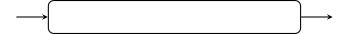
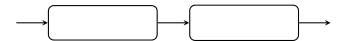
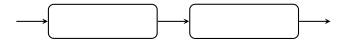
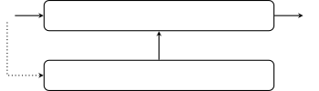
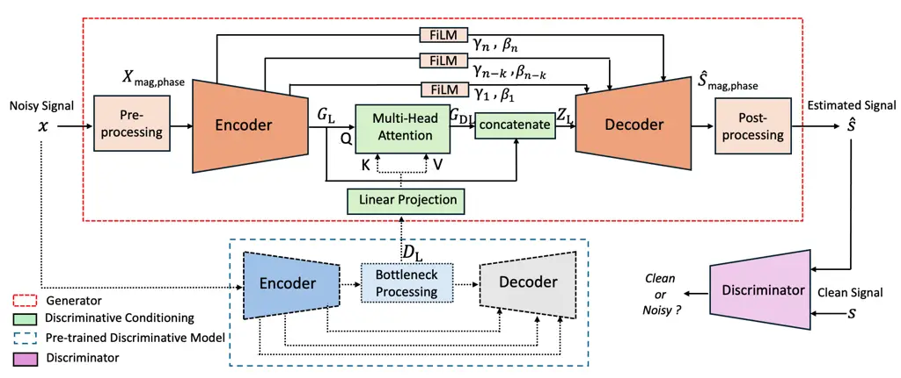
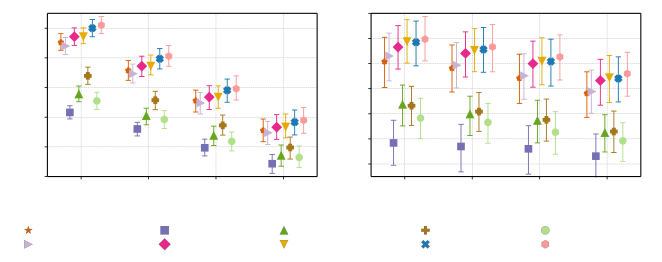
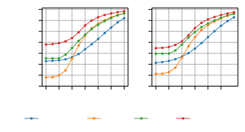
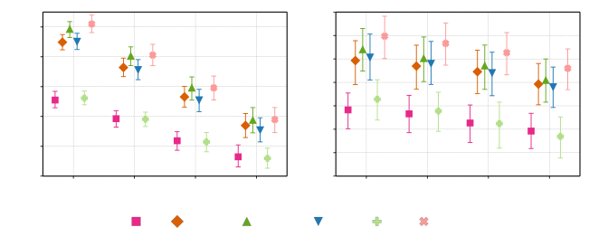
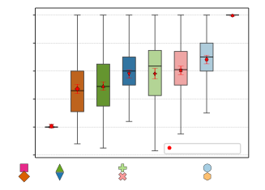
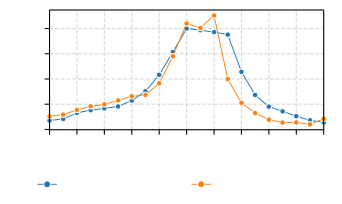

# Leveraging Discriminative Latent Representations for Conditioning GAN-Based Speech Enhancement

Shrishti Saha Shetu    Emanuël A. P. Habets    Andreas Brendel
^(†)^(†)thanks: The authors are with the International Audio
Laboratories Erlangen, a joint institution of the
Friedrich-Alexander-Universität Erlangen-Nürnberg (FAU) and Fraunhofer
IIS, 91058 Erlangen, Germany (e-mail:
shrishti.saha.shetu@iis.fraunhofer.de;
emanuel.habets@audiolabs-erlangen.de;
andreas.brendel@iis.fraunhofer.de).

###### Abstract

Generative speech enhancement methods based on generative adversarial
networks (GANs) and diffusion models have shown promising results in
various speech enhancement tasks. However, their performance in very low
signal-to-noise ratio (SNR) scenarios remains under-explored and
limited, as these conditions pose significant challenges to both
discriminative and generative state-of-the-art methods. To address this,
we propose a method that leverages latent features extracted from
discriminative speech enhancement models as generic conditioning
features to improve GAN-based speech enhancement. The proposed method,
referred to as DisCoGAN, demonstrates performance improvements over
baseline models, particularly in low-SNR scenarios, while also
maintaining competitive or superior performance in high-SNR conditions
and on real-world recordings. We also conduct a comprehensive evaluation
of conventional GAN-based architectures, including GANs trained
end-to-end, GANs as a first processing stage, and post-filtering GANs,
as well as discriminative models under low-SNR conditions. We show that
DisCoGAN consistently outperforms existing methods. Finally, we present
an ablation study that investigates the contributions of individual
components within DisCoGAN and analyzes the impact of the discriminative
conditioning method on overall performance.

###### Index Terms: 

low SNR, speech enhancement, GAN, latent feature conditioning

## I Introduction

SE (SE) aims to improve the quality and intelligibility of speech by
reducing noise and other distortions present in observed speech signals
\[1, 2, 3, 4\]. In recent years, significant progress has been made in
the SE domain through the use of various DNN (DNN)-based approaches,
leading to significant improvements in both speech quality and
intelligibility. Until recently, most DNN-based SE methods relied on
discriminative training techniques \[5, 6, 7, 8, 9, 10, 11, 12\]. These
methods have shown impressive performance in moderate to high SNR (SNR)
conditions and have been benchmarked across numerous standard datasets
\[13, 14\]. However, recent studies \[15, 16\] have shown that under
very low SNR conditions, where the desired speech is often heavily
masked by dominant noise components, many of these SOTA (SOTA)
discriminative SE methods are unable to effectively suppress noise
without also distorting or suppressing the speech, leading to a
significant decline in overall speech quality.

In contrast, generative SE approaches promise the potential for superior
performance in these scenarios by learning the distribution of clean
speech signals. This allows them to generate the desired speech signal
by conditioning it on its noisy counterpart. However, most SOTA
generative SE methods are designed for moderate SNR conditions and can
be grouped into two main categories: GAN (GAN)-based methods \[17, 18,
19, 20, 21, 22\] and, more recently, diffusion-based techniques \[23,
24, 25, 26, 27\]. Recent diffusion-based approaches have shown
effectiveness in improving speech quality in various adverse acoustical
conditions, including low SNR scenarios \[28, 29\]. However, diffusion
models typically require batch processing with multiple reverse
diffusion steps during inference to achieve high-quality SE, which
limits their applicability in frame-by-frame, causal, or semi-causal
real-time processing scenarios.

To this end, GAN-based methods dominate practical applications, as they
do not impose significant constraints on the SE model in training or
inference: The generator in a GAN model can be trained E2E (E2E) with an
adversarial loss and can be deployed for inference similarly to
discriminative methods, enabling efficient real-time inference \[19,
21\]. As a result, GANs have been also widely applied in many speech
reconstruction tasks \[30\], including noise reduction, packet loss
concealment, declipping, and speech inpainting. These problems are
closely related to SE in very low SNR conditions, where substantial
portions of the speech signal may be lost due to additive noise and
other degradations, requiring generative modeling to reconstruct the
clean speech signal. Most SOTA systems for speech reconstruction employ
a two-stage architecture that integrates both generative and
discriminative models. In the typical configuration, referred to here as
GAN-first, a GAN-based restoration module is followed by a
discriminative enhancement or post-filtering module \[31, 32, 33\].
Alternatively, in post-filtering GANs, referred to here as GAN-last, a
GAN is applied after a discriminative or traditional signal processing
method \[34, 35, 36\]. However, none of these two-stage GAN-first and
GAN-last-based methods facilitate the flow of intermediate or latent
representations between processing modules. These methods either operate
directly on the noisy input or solely on the output of prior stages,
without leveraging latent feature representations.

In our previous work, we addressed this limitation by deriving
conditioning information for generative SE from a surrogate
discriminative SE task \[37\]. The effectiveness of this approach was
demonstrated through a GAN-based SE system designed for low SNR
scenarios. The motivation for this approach is that the discriminative
model’s ability to separate speech from noise should make the features
extracted in its bottleneck layer highly informative for conditioning
the GAN, thereby improving its SE performance. Compared to conventional
GAN-first or GAN-last methods, our approach also simplifies the overall
system by allowing the discriminative and generative models to run in
parallel, eliminating the need to use the decoder of the discriminative
model during training of the GAN model and inference. In this work, our
specific contributions are as follows:

- •
  We propose the use of latent feature representations from
  discriminative models as generic conditioning features for GAN-based
  SE, referred to as DisCoGAN (DisCoGAN). The effectiveness of this
  approach is validated using features extracted from various pretrained
  discriminative SE models. Furthermore, we propose a
  time-frequency-domain SEANet-based generator architecture \[38, 39\]
  tailored for the DisCoGAN framework.
- •
  We conduct a comprehensive evaluation of existing GAN-based
  approaches—namely E2E, GAN-first, and GAN-last methods under low SNR
  conditions, and compare their performance with our proposed DisCoGAN
  method.
- •
  We assess the effectiveness of the DisCoGAN method in both low and
  high SNR conditions by benchmarking its performance on various
  standard synthetic and real-world recording datasets, and compare it
  with many discriminative and generative baselines.
- •
  We perform an ablation study to investigate the contribution of
  different components within the DisCoGAN framework, including the
  impact of the discriminative latent feature conditioning method.

In this work, we show that in low SNR scenarios, the proposed DisCoGAN
outperforms conventional GAN-based methods as well as baseline
generative and discriminative models across all intrusive and
non-intrusive objective and subjective metrics. In high SNR scenarios,
DisCoGAN achieves comparable or superior results relative to baseline
GAN-based and diffusion-based methods. We further demonstrate that
DisCoGAN generalizes well to real environments by benchmarking its
performance on real test recordings, where it also achieves comparable
performance to baseline methods.

The remainder of this paper is structured as follows. Sections II
and III present the problem formulation and the proposed methods.
Section IV details the overall DisCoGAN architecture, covering the
generator model, discriminative conditioning approach, discriminator
architecture, and a brief overview of the various discriminative models
used to extract latent conditioning features. Section V describes the
training and evaluation datasets, objective evaluation metrics,
different DisCoGAN variants, and baseline methods. Section VI presents
the objective and subjective results obtained in different experimental
scenarios, followed by the ablation study. Finally, the conclusion is
provided in Sec. VII.

## II Problem Formulation



(a) E2E GAN: $`\hat{\mathbf{s}}=\mathcal{G}_{\theta}(\mathbf{x})`$



(b) GAN-first:
$`\hat{\mathbf{s}}=\mathcal{F}_{\Theta}(\mathcal{G}_{\theta}(\mathbf{x}))`$



(c) GAN-last:
$`\hat{\mathbf{s}}=\mathcal{G}_{\theta}(\mathcal{F}_{\Theta}(\mathbf{x}))`$



(d) Proposed DisCoGAN:
$`\hat{\mathbf{s}}=\mathcal{G}_{\theta}(\mathbf{x},\mathbf{D}_{\text{L}})`$

Fig. 1: Illustration of existing GAN-based approaches and the proposed
DisCoGAN method.

We assume an additive signal model, where the noisy signal
$`\mathbf{x}\in\mathbb{R}^{N}`$ is the sum of the clean speech
$`\mathbf{s}\in\mathbb{R}^{N}`$ and noise
$`\mathbf{v}\in\mathbb{R}^{N}`$, where $`N`$ denotes the length of the
signal in samples. In classical conditional GAN-based SE methods, the
objective is to generate an estimate $`\hat{\mathbf{s}}`$ of the clean
speech signal $`\mathbf{s}`$, given the conditional information and the
noise prior $`p(\mathbf{z})`$. However, recent studies have shown that
during GAN training, the noise prior $`p(\mathbf{z})`$ is effectively
ignored when strong conditional information is provided \[40\]. Hence,
realizations $`\mathbf{z}`$ of the noise prior $`p(\mathbf{z})`$ are not
utilized as additional input in the proposed \[41, 18\] GAN framework.

In the literature, E2E GAN-based SE methods \[19, 41, 18\], as well as
two-stage GAN-first methods for speech reconstruction tasks \[38, 39\],
typically use the noisy speech signal $`\mathbf{x}`$ as the only
conditioning information. In this approach, the generator
$`\mathcal{G}_{\theta}`$ (where $`\theta`$ represents the parameters of
the generator model), as illustrated in Figs. 1a and 1b, implicitly
learns the marginal PDF (PDF) of the clean speech signal $`\mathbf{s}`$,
given by

```math
p_{G}(\mathbf{s})=\int p_{x}(\mathbf{x})\,\delta(\mathbf{s}-\mathcal{G}_{\theta}(\mathbf{x}))\,d\mathbf{x}, \tag{1}
```

where $`\delta(\cdot)`$ denotes the Dirac delta distribution, and
$`p_{x}(\mathbf{x})`$ is the PDF of the noisy signal $`\mathbf{x}`$.

In contrast, GAN-last methods, as illustrated in Fig. 1c, utilize an
estimated clean speech signal $`\hat{\mathbf{s}}_{\text{disc}}`$,
obtained from a discriminative SE module or other speech synthesis
approaches, as conditioning information \[35, 34, 42, 43\]. These
methods learn the marginal PDF in this form

```math
p_{G}(\mathbf{s})=\int p_{\hat{\mathbf{s}}_{\text{disc}}}(\hat{\mathbf{s}}_{\text{disc}})\,\delta\big(\mathbf{s}-\mathcal{G}_{\theta}(\hat{\mathbf{s}}_{\text{disc}})\big)\,d\hat{\mathbf{s}}_{\text{disc}}, \tag{2}
```

where
$`p_{\hat{\mathbf{s}}_{\text{disc}}}(\hat{\mathbf{s}}_{\text{disc}})`$
denotes the PDF of the clean speech estimated by the discriminative
model.

Recent studies \[33, 36\], have shown that the two-stage GAN-first and
GAN-last (Fig. 1b and Fig. 1c) methods often outperform E2E approaches
(Fig. 1a). However, existing two-stage approaches do not facilitate the
exchange of intermediate or latent information between generative and
discriminative modules. These design choices can render the second stage
of the processing chain under-utilized in certain scenarios and entirely
dependent on the conditioning signals $`\hat{\mathbf{s}}_{\text{gen}}`$
and $`\hat{\mathbf{s}}_{\text{disc}}`$, obtained from the first
processing stage of GAN-first and GAN-last methods, respectively. We
hypothesize that, in very low SNR scenarios, where the first stage fails
to generate a reliable clean speech estimates
$`\hat{\mathbf{s}}_{\text{gen}}`$ and $`\hat{\mathbf{s}}_{\text{disc}}`$
from its noisy prior $`p(\mathbf{x})`$, the second stage cannot
contribute effectively. In such scenarios, the existing two-stage
methods may result in suboptimal performance in very low SNR scenarios
\[37\].

## III Proposed Method

In this work, we leverage the latent features extracted from the
bottleneck of a discriminative SE model as conditioning features for
GAN-based SE. The discriminative model’s ability to distinguish between
speech and noise yields encoded bottleneck features that may differ from
those learned by the GAN encoder itself. Since these features are
derived from a dedicated discriminative objective, it renders
particularly valuable for conditioning the GAN, thereby enhancing the
performance of the generative SE method \[37\]. The conditioning
information for the GAN-based SE model is learned through a surrogate
discriminative SE model, as illustrated in Fig. 1d. This design also
enables a parallel model architecture where the discriminative model’s
decoder can be discarded during GAN training and inference, reducing
overall computational complexity. We refer to the proposed method that
conditions a GAN with such discriminatively learned features as
DisCoGAN.

Let $`\mathbf{D}_{\text{L}}`$ denote the output of the encoder of a
pre-trained discriminative SE model $`\mathcal{F}_{\Theta}`$, such that
$`\mathbf{D}_{\text{L}}=\mathcal{F}_{\Theta_{\text{enc}}}(\mathbf{x})`$,
where $`\Theta_{\text{enc}}`$ represents the encoder parameters of the
discriminative model $`\mathcal{F}`$. The generator
$`\mathcal{G}_{\theta}`$ estimates the clean speech signal
$`\hat{\mathbf{s}}=\mathcal{G}_{\theta}(\mathbf{x},\mathbf{D}_{\text{L}})`$
and learns to approximate the marginal PDF of the clean speech signal
$`\mathbf{s}`$,

```math
p_{G}(\mathbf{s})=\iint p(\mathbf{x},\mathbf{D}_{\text{L}})\,\delta(\mathbf{s}-\mathcal{G}_{\theta}(\mathbf{x},\mathbf{D}_{\text{L}}))\,d\mathbf{x}\,d\mathbf{D}_{\text{L}}, \tag{3}
```

where $`p(\mathbf{x},\mathbf{D}_{\text{L}})`$ is the joint PDF of the
noisy input signal $`\mathbf{x}`$ and the latent features
$`\mathbf{D}_{\text{L}}`$. The learning objective of the proposed
conditional GAN can be expressed as

```math
\begin{split}\min_{\theta}\max_{\varphi}\;&\mathbb{E}_{\mathbf{s}\sim p_{s}}\left[\mathcal{L}_{\text{D}}(\varphi,\mathbf{s})\right]+\mathbb{E}_{\mathbf{x}\sim p_{x}}\left[\mathcal{L}_{\text{G}}(\varphi,\theta,\mathbf{x},\mathbf{D}_{\text{L}})\right],\end{split} \tag{4}
```

where $`\mathcal{L}_{\text{D}}`$ and $`\mathcal{L}_{\text{G}}`$ denote
the discriminator and generator loss functions, respectively, and
$`\varphi`$ denotes the discriminator parameters.

### III-A Learning Objectives

The training loss of DisCoGAN consists of three components:
reconstruction loss $`\mathcal{L}_{\text{rec}}`$, adversarial loss
$`\mathcal{L}_{\text{adv}}`$, and feature matching loss
$`\mathcal{L}_{\text{feat}}`$. The reconstruction loss consists of time-
and frequency-domain loss components $`\mathcal{L}_{\text{t}}`$ and
$`\mathcal{L}_{\text{f}}`$, respectively. In the time domain a
$`\ell_{1}`$ loss is employed

```math
\mathcal{L}_{\text{t}}(\mathbf{s},\hat{\mathbf{s}})=\mathbb{E}_{\mathbf{s},\hat{\mathbf{s}}}\|\mathbf{s}-\hat{\mathbf{s}}\|_{1}. \tag{5}
```

In the frequency domain, both $`\ell_{1}`$ and Frobenius distances are
minimized on Mel and magnitude spectra at multiple resolutions. With
$`\mathbf{S}_{i},\hat{\mathbf{S}}_{i}\in\mathbb{C}^{F_{i}\times T_{i}}`$
denoting the STFT (STFT) of the target and of the estimated signal
$`\mathbf{s}`$ and $`\hat{\mathbf{s}}`$, respectively. The
frequency-domain loss $`\mathcal{L}_{\text{f}}`$ is given by

```math
\displaystyle\mathcal{L}_{\text{f}}(\mathbf{s},\hat{\mathbf{s}})=\mathbb{E}_{\mathbf{s},\hat{\mathbf{s}}}\Bigg[\frac{1}{|\mathcal{Q}|}\sum_{i\in\mathcal{Q}}\big( \displaystyle\|\mathbf{P}_{i}-\widehat{\mathbf{P}}_{i}\|_{1}+\|\mathbf{P}_{i}-\widehat{\mathbf{P}}_{i}\|_{\text{F}} \tag{6}
```

```math
\displaystyle+\|\mathbf{M}_{i}-\widehat{\mathbf{M}}_{i}\|_{1}+\|\mathbf{M}_{i}-\widehat{\mathbf{M}}_{i}\|_{\text{F}}\big)\Bigg],
```

where $`\mathbf{P}_{i}`$ and $`\mathbf{M}_{i}`$ respectively denote the
log power and Mel spectrograms of the target signal, and
$`\|\cdot\|_{\text{F}}`$ is the Frobenius norm. Multiple STFT
resolutions $`i\in\mathcal{Q}=\{5,\ldots,10\}\}`$ use window sizes
$`2^{i}`$ and hop lengths of $`2^{i}/4`$, with $`|\mathcal{Q}|`$ denotes
the number of resolutions. The overall reconstruction loss is
$`\mathcal{L}_{\text{rec}}={\lambda_{\text{t}}}\mathcal{L}_{\text{t}}+{\lambda_{\text{f}}}\mathcal{L}_{\text{f}}`$,
where $`{\lambda_{\text{t}}}`$ and $`{\lambda_{\text{f}}}`$ denote the
weighting factors for the time-domain and frequency-domain loss
components, respectively.

The adversarial loss contains the loss term $`\mathcal{L}_{\text{adv}}`$
to train the generator $`\mathcal{G}_{\theta}`$, and the loss term
$`\mathcal{L}_{\text{D}}`$ to train the discriminator
$`\mathcal{D}_{\phi}`$:

```math
\mathcal{L}_{\text{adv}}(\hat{\mathbf{s}})=\mathbb{E}_{\mathbf{x},\mathbf{D}_{\text{L}}}\left[\frac{1}{K}\sum_{k,t=1}^{K,T_{k}}\frac{1}{T_{k}}\left[1-\mathcal{D}_{k,t}(\mathcal{G}_{\theta}(\mathbf{x},\mathbf{D}_{\text{L}}))\right]_{+}\right], \tag{7}
```

```math
\displaystyle\mathcal{L}_{\text{D}}(\mathbf{s},\hat{\mathbf{s}})={} \displaystyle\mathbb{E}_{\mathbf{s}}\left[\frac{1}{KT_{k}}\sum_{k,t=1}^{K,T_{k}}\left[1-\mathcal{D}_{k,t}(\mathbf{s})\right]_{+}\right] \tag{8}
```

```math
\displaystyle+\mathbb{E}_{\mathbf{x},\mathbf{D}_{\text{L}}}\left[\frac{1}{KT_{k}}\sum_{k,t=1}^{K,T_{k}}\left[1+\mathcal{D}_{k,t}(\mathcal{G}_{\theta}(\mathbf{x},\mathbf{D}_{\text{L}}))\right]_{+}\right],
```

where $`\left[\mathbf{x}\right]_{+}=\max(0,\mathbf{x})`$ denotes the
hinge function, $`K`$ is the number of discriminators and
$`\mathcal{D}_{k,t}`$ denotes the $`k`$th discriminator evaluated at
time frame $`t`$. The feature matching loss
$`\mathcal{L}_{\text{feat}}`$ is employed to measure the difference in
intermediate features of the discriminator between target clean speech
$`\mathbf{s}`$ and generated clean speech $`\hat{\mathbf{s}}`$

```math
\mathcal{L}_{\text{feat}}(\mathbf{s},\hat{\mathbf{s}})=\mathbb{E}_{\mathbf{s},\hat{\mathbf{s}}}\left[\frac{1}{KL}\sum_{k,t,l=1}^{K,T_{k},L}\frac{1}{T_{k}}\left\|\mathcal{D}^{(l)}_{k,t}(\mathbf{s})-\mathcal{D}^{(l)}_{k,t}(\hat{\mathbf{s}})\right\|_{1}\right], \tag{9}
```

Here, $`L`$ is the number of layers, and $`\mathcal{D}^{(l)}_{k,t}`$
represents the outputs of layer $`l`$ of the $`k`$th discriminator
evaluated at time step $`t`$. The total generator loss
$`\mathcal{L}_{\text{G}}`$ is chosen as

```math
\mathcal{L}_{G}=\mathcal{L}_{rec}+\lambda_{\text{adv}}\mathcal{L}_{\text{adv}}+\lambda_{\text{feat}}\mathcal{L_{\text{feat}}}, \tag{10}
```

where $`\lambda_{\text{adv}}`$ and $`\lambda_{\text{feat}}`$ denote the
weighting factors for the adversarial loss and the feature matching
loss, respectively.



Fig. 2: Overview of DisCoGAN: a TF-domain SEANet-based GAN conditioned
with discriminative latent features.

## IV DisCoGAN Architecture

The DisCoGAN model (Fig. 2) consists of three main components: i) A
generator learning the marginal PDF of clean speech $`p(\mathbf{s})`$,
ii) a pre-trained discriminative SE model extracting the conditioning
features $`\mathbf{D}_{\text{L}}`$, and iii) a discriminator for
adversarial training of the generator. The discriminative and generative
encoders process the noisy time-domain signal $`\mathbf{x}`$. The output
$`\mathbf{D}_{\text{L}}`$ of the discriminative encoder is used to
adjust the output $`\mathbf{G}_{\text{L}}`$ of the generative encoder
using a masked multi-head attention mechanism. The manipulated latent
representation $`\mathbf{G}_{\text{DL}}`$ is stacked with
$`\mathbf{G}_{\text{L}}`$, resulting in $`\mathbf{Z}_{\text{L}}`$, which
is then processed with the generative decoder to generate the
estimate $`\hat{\mathbf{s}}`$ of the clean speech signal $`\mathbf{s}`$.

### IV-A Generator Architecture

We use a SEANet-based model as the generator \[38\], which has a
UNet-like structure with a symmetric encoder-decoder network with
skip-connections. As the original SEANet operates in the time-domain, we
adapt the architecture to the TF domain by employing 2D Conv (Conv)
layers in the encoder and decoder, following the approach in \[39\]. In
the pre-processing block, the noisy signal $`\mathbf{x}`$ is
STFT-transformed
$`\mathbf{X}=\mathrm{STFT}(\mathbf{x})\in\mathbb{C}^{F\times T}`$, and
its log magnitude and phase
$`\mathbf{X}_{{\text{mag},\text{phase}}}\in\mathbb{R}^{3\times F\times T}`$
are computed and concatenated in channel dimension, i.e.,

```math
\displaystyle\mathbf{X}_{\textrm{mag,phase}} \displaystyle=\mathrm{concat}\left(\log(|\mathbf{X}|),\frac{\Re(\mathbf{X})}{|\mathbf{X}|},\frac{\Im(\mathbf{X})}{|\mathbf{X}|}\right). \tag{11}
```

The generator $`\mathcal{G}_{\theta}`$ outputs estimated clean speech
spectral features
$`\hat{\mathbf{S}}_{{\text{mag},\text{phase}}}\in\mathbb{R}^{3\times F\times T}`$,
which consist of the magnitude and phase components
$`\left[\hat{\mathbf{S}}_{\textrm{mag}},\hat{\mathbf{S}}_{\textrm{r}},\hat{\mathbf{S}}_{\textrm{i}}\right]`$.
The estimated time-domain speech signal $`\hat{\mathbf{s}}`$ is obtained
as

```math
\hat{\mathbf{s}}=\mathrm{ISTFT}\left(\mathrm{Softplus}(\hat{\mathbf{S}}_{\textrm{mag}})\odot\left(\hat{\mathbf{S}}_{\textrm{r}}+j\hat{\mathbf{S}}_{\textrm{i}}\right)\right), \tag{12}
```

where the inverse $`\mathrm{STFT}`$ is denoted as $`\mathrm{ISTFT}`$,
$`j=\sqrt{-1}`$ is the imaginary unit, and $`\odot`$ is the Hadamard
product. The $`\mathrm{Softplus}(\cdot)`$ activation is defined as
$`\mathrm{Softplus}(\mathbf{x})=\log(1+e^{\mathbf{x}}),`$ which ensures
non-negativity while retaining smooth gradients \[44\]. Here, the
exponential is always applied element-wise.

#### IV-A1 Encoder-Decoder

The encoder consists of a $`2`$D Conv with $`32`$ channels with a
kernel-size of $`(2,4)`$ followed by $`8`$ Conv blocks, each consisting
of a single Conv residual unit and a downsampling layer \[39\].
Downsampling is performed only in the frequency dimension via strided
Conv with a stride factor of $`2`$ per layer. Each residual unit
comprises two Conv layers with a kernel of size $`(3\times 3)`$, a
dilation factor of $`2`$ in the frequency dimension, and a skip
connection. The channel number in the downsampling layers doubles with
each block, up to a maximum of $`C=512`$ channels, reducing the
frequency dimension to $`F=1`$ eventually, which results in an output
shape of $`(B,C=512,F=1,T)`$. Here, $`B`$ and $`T`$ represent the batch
size and number of frames, respectively. For simplicity of
representation, the batch dimension is omitted in the following. These
resulting features are processed with a two-layer LSTM of $`512`$ units
for temporal sequence modeling and a final $`1`$D Conv layer with
$`128`$ output channels, representing the dimension of the generative
models latent representation
$`\mathbf{G}_{\text{L}}\in\mathbb{R}^{128\times T}`$. The decoder
mirrors the encoder architecture, incorporating FiLM (FiLM)-based skip
connections between corresponding encoder and decoder Conv blocks. Each
decoder Conv block uses transpose Conv to upsample the frequency
dimension by a factor of $`2`$ per layer, followed by a residual unit
similar to the encoder architecture.

#### IV-A2 FiLM Conditioning for Encoder-Decoder

We implement a modified residual FiLM layer \[45\] to condition the
decoder outputs using the encoder features of the generator through skip
connections. In this way, we modulate the decoder features
$`\mathbf{D_{\text{f}}}_{n}\in\mathbb{R}^{C\times F\times T}`$ at each
Conv block $`n`$ using the corresponding encoder features
$`\mathbf{E_{\text{f}}}_{n}\in\mathbb{R}^{C\times F\times T}`$. Each
FiLM module computes a scale factor
$`\gamma_{n}=\mathrm{ReLU}\left(\mathrm{Conv}_{\gamma}(\mathbf{E_{\text{f}}}_{n})\right)`$
and a shift factor
$`\beta_{n}=\mathrm{Sigmoid}\left(\mathrm{Conv}_{\beta}(\mathbf{E_{\text{f}}}_{n})\right)`$
from the encoder features $`\mathbf{E_{\text{f}}}_{n}`$ using two
separate $`2`$D Conv with a kernel of size $`(1\times 3)`$. These
factors are then multiplied by Conv attention weights
$`\mathbf{A}_{n}\in\mathbb{R}^{1\times F\times T}`$ obtained from two
sequential 2D Conv with $`\mathrm{ReLU}`$ and $`\mathrm{Sigmoid}`$
activations, which first reduce the number of conditioning channels by a
factor of $`8`$ and then upsample it to the desired dimension with a
pointwise convolution. The final FiLM-modulated decoder features are
obtained using a residual affine transformation:

```math
\displaystyle\gamma_{n}^{\prime} \displaystyle=\gamma_{n}\odot\mathbf{A}_{n},\quad\beta_{n}^{\prime}=\beta_{n}\odot\mathbf{A}_{n}, \tag{13}
```

```math
\displaystyle\mathbf{D_{\text{f}}}_{n}^{\mathrm{out}} \displaystyle=\mathbf{D_{\text{f}}}_{n}+\left(\gamma_{n}^{\prime}\odot\mathbf{D_{\text{f}}}_{n}+\beta_{n}^{\prime}\right).
```

#### IV-A3 Discriminative Conditioning

We obtain the generative and discriminative latent features
$`\mathbf{G}_{\text{L}}\in\mathbb{R}^{T\times d_{\text{g}}}`$ and
$`\mathbf{D}_{\text{L}}\in\mathbb{R}^{T\times d_{\text{d}}}`$,
respectively, from the encoder of the generator and a pretrained
discriminative SE model. Here, $`d_{\text{g}}`$ and $`d_{\text{d}}`$
denote the latent feature dimensions. To condition the generative
features $`\mathbf{G}_{\text{L}}`$, we first align the time dimension of
$`\mathbf{D}_{\text{L}}`$ to match that of $`\mathbf{G}_{\text{L}}`$
using linear interpolation \[46\]. Next, to match the feature dimension,
we apply a linear transformation:

```math
\widetilde{\mathbf{D}}_{\text{L}}=\mathbf{D}_{\text{L}}\overline{\mathbf{W}}_{\text{d}}+\mathbf{B}_{\text{d}}\in\mathbb{R}^{T\times d_{\text{g}}}, \tag{14}
```

where
$`\overline{\mathbf{W}}_{\text{d}}=\mathrm{blockdiag}(\mathbf{W}_{\text{d}},..,..,\mathbf{W}_{\text{d}})\in\mathbb{R}^{Td_{\text{d}}\times Td_{\text{g}}}`$
and
$`\mathbf{B}_{\text{d}}=\mathrm{blockdiag}(\mathbf{b}_{\text{d}},..,..,\mathbf{b}_{\text{d}})\in\mathbb{R}^{Td_{\text{g}}}`$
are learnable block diagonal matrices. In the rest of the paper, for
simplicity, we assume the time dimension $`T=1`$, reducing
representation to standard weight matrix $`\mathbf{W}_{\text{d}}`$ and
bias vector $`\mathbf{b}_{\text{d}}`$ forms. We then apply masked
multi-head attention \[47\] with a fixed lookahead of $`L=20`$ frames.
The generator features
$`\mathbf{G}_{\text{L}}\in\mathbb{R}^{T\times d_{\text{g}}}`$ serve as
queries, while the transformed discriminative features
$`\widetilde{\mathbf{D}}_{\text{L}}\in\mathbb{R}^{T\times d_{\text{g}}}`$
serve as keys and values:

```math
\mathbf{Q}=\mathbf{G}_{\text{L}}\mathbf{W}^{\text{Q}},\quad\mathbf{K}=\widetilde{\mathbf{D}}_{\text{L}}\mathbf{W}^{\text{K}},\quad\mathbf{V}=\widetilde{\mathbf{D}}_{\text{L}}\mathbf{W}^{\text{V}}, \tag{15}
```

where
$`\mathbf{W}^{\text{Q}},\mathbf{W}^{\text{K}},\mathbf{W}^{\text{V}}\in\mathbb{R}^{d_{\text{g}}\times d_{\text{g}}}`$
are learnable projection matrices. The attention output is computed as

```math
\mathbf{G}_{\text{DL}}=\mathrm{Softmax}\left(\frac{\mathbf{Q}\mathbf{K}^{\top}}{\sqrt{d_{\text{g}}}}+\mathcal{M}\right)\mathbf{V}, \tag{16}
```

where the attention mask $`\mathcal{M}\in\{0,-\infty\}^{T\times T}`$ is
defined by

```math
\mathcal{M}_{p,q}=\begin{cases}0,&q\in\{p,\min(p+L,T)\}\\
-\infty,&\text{otherwise}\end{cases}. \tag{17}
```

We implement the masked multi-head attention mechanism with two
attention heads using the PyTorch 2.3 default implementation. Finally,
the attention output $`\mathbf{G}_{\text{DL}}`$ is concatenated with the
original generative features along the feature dimension to produce the
conditioned representation:

```math
\mathbf{Z}_{\text{L}}=\mathrm{concat}\left(\mathbf{G}_{\text{L}},\mathbf{G}_{\text{DL}}\right)\in\mathbb{R}^{T\times 2d_{\text{g}}}. \tag{18}
```

### IV-B Discriminative Models

We experiment with $`4`$ groups of discriminative SE methods ( Tab. I)
to extract the discriminative features $`\mathbf{D}_{\text{L}}`$ based
on 1) estimating a complex-valued ideal ratio mask for attenuating noise
components, 2) mapping the time-domain waveform, 3) decoupling the
estimation of magnitude and phase components in multiple stages, and 4)
mapping the complex-valued spectrum. As a representative for each of
these groups, we investigate the DCCRN \[5\], DDAEC \[48\],
TaylorSENet \[49\] and GCRN \[50\] methods.

|             |               |            |            |                  |            |       |
| ----------- | ------------- | ---------- | ---------- | ---------------- | ---------- | ----- |
| Model       | Window Length | Hop Length | FFT Length | Latent Dimension | Params (M) | GMACS |
| DCCRN       | 400           | 100        | 512        | 1024             | 3.67       | 11.30 |
| DDAEC       | 512           | 256        | NA         | 512              | 4.82       | 18.34 |
| TaylorSENet | 320           | 160        | 320        | 322              | 5.45       | 6.43  |
| GCRN        | 320           | 160        | 320        | 1024             | 9.77       | 2.42  |

TABLE I: Specifications of discriminative SE models.

#### IV-B1 DCCRN

The DCCRN \[5\] employs a complex-valued UNet-like symmetric
encoder-decoder architecture with recurrent processing in the bottleneck
to estimate a complex ideal ratio mask $`\mathbf{M}`$. The complex Conv
for a TF-domain noisy input
$`\mathbf{X}=\mathbf{X}_{\textrm{r}}+j\mathbf{X}_{\textrm{i}}`$ and a
Conv kernel
$`\mathbf{W}=\mathbf{W}_{\textrm{r}}+j\mathbf{W}_{\textrm{i}}`$ is
defined as

```math
\mathbf{Y}=\mathbf{X}\mathbf{W}=(\mathbf{X}_{\textrm{r}}\mathbf{W}_{\textrm{r}}-\mathbf{X}_{\textrm{i}}\mathbf{W}_{\textrm{i}})+j(\mathbf{X}_{\textrm{r}}\mathbf{W}_{\textrm{i}}+\mathbf{X}_{\textrm{i}}\mathbf{W}_{\textrm{r}}). \tag{19}
```

The encoder, consisting of five such complex-valued Conv layers, outputs
$`\mathbf{H}=\mathbf{H}_{\textrm{r}}+j\mathbf{H}_{\textrm{i}}`$, which
is processed by a complex-valued LSTM and a linear projection:

```math
\displaystyle[\mathbf{H}^{\prime}_{\textrm{r}},\mathbf{H}^{\prime}_{\textrm{i}}] \displaystyle=[\mathrm{LSTM}_{\textrm{r}}(\mathbf{H}_{\textrm{r}},\mathbf{H}_{\textrm{i}}),\ \mathrm{LSTM}_{\textrm{i}}(\mathbf{H}_{\textrm{r}},\mathbf{H}_{\textrm{i}})] \tag{20}
```

```math
\displaystyle\mathbf{D}_{\text{L}} \displaystyle=\mathbf{W}\mathrm{concat}\left(\mathbf{H}^{\prime}_{\textrm{r}},\mathbf{H}^{\prime}_{\textrm{i}}\right)+\mathbf{b}\in\mathbb{R}^{T\times 1024},
```

with learnable parameters $`\mathbf{W}`$ and $`\mathbf{b}`$ and the
conditioning information
$`\mathbf{D}_{\text{L}}\in\mathbb{R}^{T\times 1024}`$.

#### IV-B2 DDAEC

DDAEC \[48\] is a fully convolutional, symmetric time-domain
encoder-decoder model for real-time SE. It uses dilated Conv and densely
connected blocks to capture long-range temporal dependencies. The input
signal $`\mathbf{x}`$ is divided into overlapping frames and encoded
into a latent representation
$`\mathbf{D}_{\text{L}}\in\mathbb{R}^{T\times 512}`$, which is used as
the conditioning information. The decoder reconstructs the enhanced
signal using sub-pixel convolutions and skip connections, followed by
frame-wise overlap-and-add.

#### IV-B3 TaylorSENet

TaylorSENet \[49\] approaches SE as a Taylor series expansion with two
stages: a zeroth-order approximation and a higher-order refinement. The
coarse estimate $`\hat{\mathbf{S}}_{0}`$ is obtained using a UNet-style
network $`\mathcal{U}_{\psi}`$ and the noisy phase
$`\theta_{\mathbf{X}}`$:

```math
\hat{\mathbf{S}}_{0}=\mathcal{U}_{\psi}(|\mathbf{X}|)\odot|\mathbf{X}|\odot e^{j\theta_{\mathbf{X}}}. \tag{21}
```

In our work, we use $`\hat{\mathbf{S}}_{0}`$ as the discriminative
conditioning information $`\mathbf{D}_{l}\in\mathbb{R}^{T\times 322}`$,
obtained by reshaping the frequency and feature dimensions.

#### IV-B4 GCRN

The gated convolutional recurrent network (GCRN) \[50\] learns a
complex-valued spectral mapping using an encoder-decoder architecture
with $`\mathrm{LSTM}`$s in the bottleneck. The encoder comprises five
Conv layers, and two decoders estimate the real and imaginary parts of
the spectrogram separately, treating them as related subtasks. Given the
TF-domain input features
$`\mathbf{X}_{\textrm{r}},\mathbf{X}_{\textrm{i}}`$, the encoder
downsamples the input via Conv blocks, and the decoder upsamples the
latent features via transposed Conv blocks to produce
$`\hat{\mathbf{S}}_{\textrm{r}},\hat{\mathbf{S}}_{\textrm{i}}`$. Both
blocks utilize gated linear units ($`\mathrm{GLU}`$s) \[51\]:

```math
\mathbf{Y}=\tanh(\mathbf{X}\mathbf{W}_{1}+\mathbf{b}_{1})\odot\mathrm{Sigmoid}(\mathbf{X}\mathbf{W}_{2}+\mathbf{b}_{2}), \tag{22}
```

where $`\mathbf{W}_{1},\mathbf{W}_{2}`$ are Conv kernels,
$`\mathbf{b}_{1},\mathbf{b}_{2}`$ are biases. GLUs enhance information
flow, enabling GCRN to outperform traditional spectral mapping and
masking-based methods  \[50\]. The discriminative latent conditioning
information is extracted via

```math
\mathbf{D}_{\text{L}}=\mathrm{LSTM}(\mathrm{ConvGLUEncoder}(\mathbf{X}_{\textrm{r}},\mathbf{X}_{\textrm{i}}))\in\mathbb{R}^{T\times 1024}. \tag{23}
```

### IV-C Discriminator Architecture

We adopt a multi-scale STFT discriminator following \[52\]. It comprises
multiple sub-networks with identical architectures, each operating on
real and imaginary parts of the STFT representation of the input
concatenated along the channel axis at different time–frequency
resolutions. We employ three STFT configurations with window lengths of
$`2048`$, $`1024`$, and $`512`$. Each sub-network starts with a 2D Conv
layer with kernel size $`(3\times 8)`$ and 32 channels, followed by
three 2D Conv layers with dilation rates of 1, 2, and 4 (along time) and
a frequency stride of 2. A final 2D Conv layer with kernel size
$`(3\times 3)`$ and stride $`(1,1)`$ produces the output. LeakyReLU
activations and weight normalization are applied throughout,
following \[39\].

## V Experimental Details

### V-A Training Datasets

#### V-A1 Low- and High-SNR Datasets

We created training datasets using the Interspeech 2020 DNS Challenge
dataset \[13\] by combining clean speech and noise at random SNRs:
$`[-25,0]`$ dB for a low-SNR dataset and $`[-5,30]`$ dB for a high-SNR
dataset, both comprising approximately 1000 hours of audio. To introduce
reverberation, $`50\%`$ of the clean utterances were convolved with
randomly selected RIR (RIR)s from the Interspeech RIR dataset \[13\],
which contains approximately 100k measured and synthetic RIRs with
reverberation times between $`0.3`$ and $`1.5`$ s.

#### V-A2 VB-DMD Dataset

The VoiceBank-DEMAND (VB-DMD) dataset \[14\] contains clean utterances
mixed with items from the DEMAND \[53\] noise set, including babble, and
speech-shaped noise at SNR $`\in\{0,5,10,15\}`$ dB.

### V-B Evaluation Datasets

#### V-B1 Low-SNR Dataset

To assess performance under extremely low SNR conditions, we curated a
dataset of $`1200`$ samples, each $`10`$ s long: To this end, we mixed
clean items from the synthetic, non-reverberant DNS Challenge test
set \[13\] containing $`150`$ clean utterances with noise at SNR
$`\in[-15,0]`$ dB. For each utterance, $`8`$ noise samples were randomly
selected from the ESC-50 dataset \[54\], using a curated set of $`20`$
distinct noise types: rain, sea waves, crackling fire, crickets, wind,
crow, washing machine, vacuum cleaner, hand saw, engine, dog, fireworks,
car horn, keyboard typing, door knock, glass breaking, chainsaw, siren,
helicopter, and thunderstorm. The dataset was grouped into four SNR
groups: $`[-15,-12]`$,$`[-11,-8]`$, $`[-7,-4]`$, and $`[-3,0]`$ dB.

¹¹footnotetext: The code for creating low-SNR evaluation datasets is
available at this [GitHub
repository](https://github.com/fhgainr/Low-SNR-Eval-Data).

#### V-B2 VB-DMD Dataset

The VB-DMD test set \[14\] used utterances from two unseen speakers
(“p226” and “p287”), mixed with DEMAND, babble, and speech-shaped noise
at SNR $`\in\{2.5,7.5,12.5,17.5\}`$ dB.

#### V-B3 DNS Non-Reverb Test Dataset

Noisy samples were created by mixing unseen clean utterances from the
Graz University corpus \[55\] (contained in the DNS Challenge
non-reverberant test set \[13\]) with noises from $`12`$ VoIP-relevant
categories, at SNR $`\in[0,25]`$ dB.

#### V-B4 DNS Real Recordings

As part of the DNS Challenge \[13\], 300 noisy speech samples have been
collected via Amazon Mechanical Turk using various devices and
environments, covering a wide SNR range but lacking clean references.

### V-C Objective Metrics

To evaluate the proposed method and compare it with baseline methods, we
used widely adopted intrusive and non-intrusive objective metrics.

#### V-C1 Intrusive Metrics

When clean references were available, we used several intrusive
(full-reference) metrics: The perceptual evaluation of speech quality
(PESQ) \[56\] provides scores from $`1`$ (poor) to $`4.5`$ (excellent),
including narrowband and wideband variants. The frequency-weighted
segmental SNR (FwSegSNR) \[57\] measures segmental SNR with perceptual
weighting in the frequency domain. The scale-invariant
signal-to-distortion ratio (SI-SDR) \[58\] calculates overall quality
independent of the amplitude scaling. We also reported WER (WER) and CER
(CER) using Whisper ASR \[59\] and JiWER \[60\], where reference
transcriptions were generated from the clean speech signals.

#### V-C2 Non-Intrusive Metrics

In cases where clean references were unavailable (e.g., real
recordings), we employed non-intrusive metrics: DNSMOS \[61\] is a
DNN-based model trained to predict mean opinion scores (MOS) based on
human ratings collected via ITU-T P.808 compliant evaluations \[62\].
The extended DNSMOS P.835 model \[63\] provides scores across speech
quality (SIG), background noise quality (BAK), and overall quality
(OVRL), following ITU-T P.835 \[64\]. Finally, SCOREQ \[65\] estimates
speech quality using contrastive learning, offering both non-intrusive
and full-reference variants.

### V-D Listening Test

Objective metrics often do not correlate with human perception,
especially in low SNR conditions where assessing speech quality,
intelligibility, and noise reduction is challenging \[66\]. To address
this, we conducted a multi-stimuli listening test \[67\] with fourteen
participants via the webMUSHRA framework \[68\]. Participants rated the
overall quality of twelve randomly selected examples from the low SNR
test set, each enhanced by different algorithms. The clean signal was
the reference, and the unprocessed noisy signal was included as an
anchor. Scores were reported on a $`0–100`$ scale.



Fig. 3: PESQ and FwSegSNR improvements of DisCoGAN models on the low SNR
evaluation dataset using various discriminative conditioning models. The
model name in parentheses indicates the discriminative model used for
extracting latent features for conditioning the GAN model.

### V-E DisCoGAN Training Details

We trained the models at a $`16`$ kHz sampling rate in two steps. First,
we trained the discriminative models (Sec. IV-B), namely DDAEC \[48\],
GCRN \[50\], DCCRN \[5\], and TaylorSENet \[49\] using the low SNR
training dataset. All models were trained with their original
configurations as specified in the respective papers. It is important to
note that all of these models used different window lengths and hop
sizes, resulting in varying time resolutions as described in Table I.

In the next step, we trained DisCoGAN while extracting latent features
$`\mathbf{D}_{\text{L}}`$ from the discriminative model with frozen
parameters as mentioned in Sec. IV-B. To match the time dimension of
$`\mathbf{D}_{\text{L}}`$, with the generative latent features
$`\mathbf{G}_{\text{L}}`$, as mentioned in Sec. IV-A3, linear
interpolation \[46\] was performed. We followed similar training
procedures as outlined in \[39\] for training the generator and
discriminator of the GAN model. Training was performed on a Tesla-A100
GPU with a batch size of $`16`$ for $`600`$ k iterations. To avoid
dominance of the discriminator, it was updated only when its loss
exceeded that of the generator. The hyperparameters
$`\lambda_{\text{t}}`$, $`\lambda_{\text{f}}`$,
$`\lambda_{\text{adv}}`$, and $`\lambda_{\text{feat}}`$ were set to
$`1.0`$, $`1.0`$, $`\frac{1}{9}`$, and $`\frac{100}{9}`$, respectively.
For the generator STFT parameters, we used an FFT length of $`512`$, a
window size of $`512`$, and a hop length of $`160`$.

### V-F Discussed Models

We compared our proposed approach against a set of generative and
discriminative baselines. Many of these baselines were trained from
scratch, while for others, we either employed publicly available
pre-trained models or reported the objective metrics as presented in the
original publications for the respective datasets.

#### V-F1 Proposed DisCoGAN Models

We trained the DisCoGAN model with four different discriminative
conditioning models (Sec. IV-B): DisCoGAN (GCRN), DisCoGAN (DCCRN),
DisCoGAN (DDAEC), and DisCoGAN (TaylorSENet), where the model name in
parentheses indicates the discriminative conditioning model. Unless
specified otherwise, DisCoGAN (GCRN) is used as the default variant
throughout the paper.

#### V-F2 E2E GAN Models

For E2E GAN-based baselines, we trained NoCoGAN and SEANet, E2E DisCoGAN
(GCRN). NoCoGAN shares the same architecture as DisCoGAN, but without
discriminative conditioning (Sec. IV) and was trained using a similar
procedure, detailed in Sec. V-E. The E2E DisCoGAN (GCRN) shares the same
configuration as the proposed DisCoGAN (GCRN). However, in this case,
the encoder of the GCRN model was trained from scratch alongside the
generator of the DisCoGAN model, using the same learning objective
described in Section III-A. Additionally, we trained SEANet \[38\] with
an additional bottleneck LSTM. We also included HiFi-GAN \[69\], SEGAN
\[17\], and MetricGAN+ \[18\] as representative generative baselines
from the literature.

#### V-F3 Two Stage GANs

For GAN-last-based baselines, where a generative model follows a
discriminative SE stage, we trained GCRN+NoCoGAN and GCRN+DisCoGAN. For
the GAN-first approaches, where the generative model is followed by a
discriminative model, we trained NoCoGAN+GCRN and DisCoGAN+GCRN. In both
configurations, the second-stage model is trained on the output of the
first-stage model with frozen weights.

#### V-F4 Discriminatives Methods

We also trained multiple discriminative baseline models, including all
conditioning models: GCRN, DCCRN, DDAEC, and TaylorSENet. Additionally,
we trained NoCoGAN-D and DisCoGAN-D, sharing the same architectures as
NoCoGAN and DisCoGAN, respectively, but are trained solely with the
reconstruction loss $`\mathcal{L}_{\text{rec}}`$, without adversarial
losses.

#### V-F5 Additional Generative Model Baselines

The diffusion-based models SGMSE \[70\], SGMSE+ \[23\], CDiffuse \[24\],
and the VAE-based RVAE \[71\] were also included as baselines.

|                   |                     |                    |               |              |             |                 |               |              |             |                        |               |              |             |
| ----------------- | ------------------- | ------------------ | ------------- | ------------ | ----------- | --------------- | ------------- | ------------ | ----------- | ---------------------- | ------------- | ------------ | ----------- |
|                   |                     | $`\Delta`$PESQ (↑) |               |              |             | SI-SDR (↑) (dB) |               |              |             | $`\Delta`$FwSegSNR (↑) |               |              |             |
| Method            | Model               | \[-15,-12\] dB     | \[-11,-8\] dB | \[-7,-4\] dB | \[-3,0\] dB | \[-15,-12\] dB  | \[-11,-8\] dB | \[-7,-4\] dB | \[-3,0\] dB | \[-15,-12\] dB         | \[-11,-8\] dB | \[-7,-4\] dB | \[-3,0\] dB |
| E2E               | NoCoGAN             | 0.51               | 0.71          | 0.91         | 1.10        | 16.85           | 15.51         | 14.20        | 12.42       | 5.63                   | 6.84          | 7.63         | 8.16        |
|                   | E2E DisCoGAN (GCRN) | 0.50               | 0.70          | 0.89         | 1.08        | 16.86           | 15.46         | 14.06        | 12.25       | 5.77                   | 7.03          | 7.87         | 8.61        |
| GAN-first         | NoCoGAN+GCRN        | 0.49               | 0.68          | 0.89         | 1.07        | 16.94           | 15.56         | 14.23        | 12.39       | 4.95                   | 6.17          | 7.01         | 7.46        |
|                   | DisCoGAN+GCRN       | 0.56               | 0.76          | 0.99         | 1.18        | 17.53           | 16.06         | 14.78        | 12.91       | 6.86                   | 8.10          | 8.92         | 9.49        |
| GAN-last          | GCRN+NoCoGAN        | 0.41               | 0.58          | 0.75         | 0.92        | 15.73           | 14.71         | 13.39        | 11.36       | 3.27                   | 4.23          | 4.89         | 4.97        |
|                   | GCRN+DisCoGAN       | 0.47               | 0.64          | 0.85         | 1.05        | 16.12           | 15.27         | 13.99        | 12.27       | 4.46                   | 5.86          | 6.64         | 7.22        |
| Proposed DisCoGAN | DisCoGAN (GCRN)     | 0.58               | 0.79          | 1.01         | 1.22        | 17.48           | 16.06         | 14.81        | 12.96       | 7.19                   | 8.53          | 9.33         | 9.94        |

TABLE II: Evaluation of the proposed DisCoGAN method against other
GAN-based SE approaches in extremely low SNR scenarios. The result of
the best-performing model per SNR group is denoted in bold.

## VI Results

We first evaluate DisCoGAN using various pretrained discriminative
conditioning models (Sec. VI-A). We then compare DisCoGAN with existing
GAN-based approaches, including E2E, GAN-first and GAN-last methods in
low SNR scenarios (Sec. VI-B). Finally, we assess DisCoGAN’s performance
across diverse SNR conditions and real-world data (Secs. VI-C and VI-D),
and present ablation results focusing on sensitivity and temporal
dependencies of the conditioning discriminative latent features
(Sec. VI-F).

### VI-A DisCoGAN with Diverse Conditioning Models

Figure 3 shows the PESQ and FwSegSNR improvements of DisCoGAN
conditioned with different discriminative models. All DisCoGAN variants
outperform the baseline discriminative models, NoCoGAN and E2E DisCoGAN
(GCRN). Among them, DisCoGAN (GCRN) achieves the best results with mean
PESQ and FwSegSNR improvements of $`1.22`$ and $`9.94`$ dB,
respectively, in the $`[0,-3]`$ dB SNR group. Similar trends are
observed in other SNR groups. The DCCRN model outperforms other
discriminative models with PESQ improvements of $`0.88`$, $`0.71`$,
$`0.55`$, and $`0.40`$ across decreasing SNR intervals. TaylorSENet and
GCRN follow in performance. However, DisCoGAN (GCRN) showed the best
performance even though GCRN was inferior relative to DCCRN when used
directly for SE. DisCoGAN (DCCRN) is second in performance, while
DisCoGAN (TaylorSENet) and DisCoGAN (DDAEC) show a slightly lower
performance. An important point to note is that E2E DisCoGAN (GCRN)
performs comparably to NoCoGAN, achieving slightly lower PESQ but better
FwSegSNR improvements. This suggests that the performance gains observed
in the proposed DisCoGAN variants are not due to the added complexity of
using an additional feature encoder. Instead, the improvement can be
attributed to the use of latent features from a pretrained
discriminative SE model to condition the GAN.



Fig. 4: Pearson $`\rho`$ and Spearman $`\rho_{s}`$ correlation
coefficients of the latent features at various SNR levels.

To understand the performance differences among the DisCoGAN variants,
we analyze the Pearson ($`\rho`$) and Spearman ($`\rho_{s}`$)
correlation coefficients between latent features extracted at various
SNR levels and those from extraced clean speech. For this we first
process the clean speech signal and its noisy counterparts at different
SNR levels using the different discriminative conditioning models
(Sec. IV-B). Then, we compute how strongly the latent features at each
SNR level correlate with those from the clean speech. We hypothesize
that effective discriminative conditioning features should show low
correlation at low SNR and high correlation at high SNR to properly
represent the SNR and various noise conditions. As shown in Fig. 4, the
DDAEC model achieves the highest correlation at high SNRs and maintains
strong correlation even at low SNRs. In contrast, TaylorSENet shows low
correlation at $`\text{SNR}=-30`$ dB ($`\rho=0.06`$,
$`\rho_{\textrm{s}}=0.02`$) and high correlation at $`\text{SNR}=30`$ dB
($`\rho=0.84`$, $`\rho_{\textrm{s}}=0.86`$), though still lower than
DCCRN, GCRN, and DDAEC ($`\rho=0.93`$, $`0.93`$, and $`0.97`$,
respectively, at 30 dB). This can be explained by its architecture
(Sec. IV-B3), which includes a degraded noisy phase component, which
limits high-SNRs performance. GCRN and DCCRN follow the hypothesized
trends, with DCCRN even showing a negative correlation at low SNRs. This
characteristic likely contributes to the superior performance observed
in the DisCoGAN variants DisCoGAN (GCRN) and DisCoGAN (DCCRN) that
utilize the discriminative latent features from GCRN and DCCRN. In the
rest of the paper, we use DisCoGAN (GCRN) as the default DisCoGAN
variant for comparison, as it achieves the best performance among all
variants.



Fig. 5: PESQ and FwSegSNR improvement for the DisCoGAN vs baseline
generative and discriminative models in low SNR scenarios.

 

Fig. 6: Spectrograms of (a) a noisy speech signal corrupted by strong
noise at -8 dB SNR from (b) a clean speech signal, enhanced by: (c)
NoCoGAN-D (d) DisCoGAN-D (e) NoCoGAN and (f) DisCoGAN.

²²footnotetext: Demo audio samples are provided at this [demo
site](https://fhgainr.github.io/DisCoGAN-Journal/).

|                |            |                |               |              |             |                     |               |              |             |                     |               |              |             |
| -------------- | ---------- | -------------- | ------------- | ------------ | ----------- | ------------------- | ------------- | ------------ | ----------- | ------------------- | ------------- | ------------ | ----------- |
|                |            | SCOREQ MOS (↑) |               |              |             | SCOREQ Distance (↓) |               |              |             | DNSMOS P808_MOS (↑) |               |              |             |
| Method         | Model      | \[-15,-12\] dB | \[-11,-8\] dB | \[-7,-4\] dB | \[-3,0\] dB | \[-15,-12\] dB      | \[-11,-8\] dB | \[-7,-4\] dB | \[-3,0\] dB | \[-15,-12\] dB      | \[-11,-8\] dB | \[-7,-4\] dB | \[-3,0\] dB |
| Unprocessed    | Noisy      | 1.50           | 1.65          | 1.81         | 2.04        | 1.36                | 1.31          | 1.27         | 1.19        | 2.52                | 2.63          | 2.73         | 2.83        |
|                | Clean      | 4.57           | 4.59          | 4.59         | 4.59        | 0                   | 0             | 0            | 0           | 4.00                | 4.02          | 4.01         | 4.03        |
| Discriminative | GCRN       | 1.95           | 2.25          | 2.60         | 2.98        | 1.16                | 1.06          | 0.94         | 0.79        | 3.03                | 3.26          | 3.44         | 3.64        |
|                | NoCoGAN-D  | 2.30           | 2.67          | 3.01         | 3.32        | 1.05                | 0.91          | 0.77         | 0.63        | 3.18                | 3.41          | 3.54         | 3.71        |
|                | DisCoGAN-D | 2.39           | 2.76          | 3.13         | 3.47        | 1.01                | 0.87          | 0.72         | 0.56        | 3.23                | 3.47          | 3.62         | 3.79        |
| Generative     | NoCoGAN    | 2.29           | 2.67          | 3.04         | 3.39        | 1.04                | 0.91          | 0.77         | 0.61        | 3.70                | 3.83          | 3.90         | 3.98        |
|                | DisCoGAN   | 2.51           | 2.92          | 3.34         | 3.69        | 0.97                | 0.81          | 0.65         | 0.49        | 3.84                | 3.95          | 4.00         | 4.06        |

TABLE III: Evaluation of DisCoGAN and generative and discriminative
baselines using non-intrusive and intrusive metrics for low SNRs.

### VI-B Comparison with Existing GAN-Based Approaches

In Table II, we report the performance of DisCoGAN compared to GAN-based
SE baselines, including E2E and two-stage GANs on the low-SNR dataset.
DisCoGAN outperforms all other methods for all objective metrics and SNR
groups. In particular, in terms of $`\Delta\text{FwSegSNR}`$, DisCoGAN
shows at least a $`2.5`$ dB gain over the best GAN-last models, and an
average $`0.4`$ dB improvement over the best performing GAN-first model
in all SNR groups. GAN-last methods show the worst performance for all
metrics. This aligns with the poor performance of the GCRN model shown
in Fig. 3, where, for extremely low SNRs, we observed, the
discriminative GCRN model tends to suppress speech components that
cannot be recovered by the subsequent generative model. However,
GCRN+DisCoGAN outperforms GCRN+NoCoGAN, as DisCoGAN takes advantage of
both noisy latent features and estimated clean speech from the preceding
discriminative model, showing the effectiveness of the proposed
discriminative conditioning technique. The GAN-first DisCoGAN+GCRN model
performs similarly to DisCoGAN alone but shows slight drops in PESQ and
FwSegSNR, likely because the discriminative model suppresses noise but
may also remove parts of the generated content it deems noisy, improving
SI-SDR while slightly degrading other metrics.

### VI-C Performance Across Various SNR Scenarios

#### VI-C1 Low-SNR Scenarios

We report the mean $`\Delta\text{PESQ}`$ and $`\Delta\text{FwSegSNR}`$
for DisCoGAN and the baselines for the low-SNR dataset in Fig. 5.
DisCoGAN consistently outperforms all baselines for both metrics and SNR
groups. Interestingly, the discriminatively trained models NoCoGAN-D and
DisCoGAN-D achieve objective scores comparable with their GAN-based
counterparts. However, by inspecting the spectrograms in Fig. 6, we see
that discriminative models often produce overly smooth high-frequency
components when speech is heavily masked by noise. In contrast,
GAN-based models generate fine-grained, speech-like high-frequency
structures overlooked by traditional objective metrics, suggesting an
inherent bias of these metrics toward discriminative SE methods.

We further evaluate these methods using the DNN-based intrusive and
non-intrusive metrics, SCOREQ and DNSMOS, in Tab. III. DisCoGAN
outperforms all baselines for both metrics, with a clear margin over its
discriminative counterpart, DisCoGAN-D. Although SCOREQ results are
similar for NoCoGAN and NoCoGAN-D, DNSMOS shows a stronger advantage for
GAN-based models. In particular, at higher SNRs, e.g., $`[-7,0]`$ dB,
DisCoGAN sometimes scores equal to or above the clean reference,
highlighting DisCoGAN’s generative capabilities and possible leniency of
non-intrusive metrics toward hallucinated content. Table IV presents WER
and CER results, showing DisCoGAN’s effectiveness with up to $`5\%`$
improvement over competing methods for SNRs down to $`-7`$ dB. However,
at very low SNRs ( $`-10`$ dB), where speech is almost unintelligible,
ASR performance degrades sharply, with a WER exceeding $`200\%`$ on
noisy signals. In these conditions, discriminative models outperform
generative ones, likely because generative models hallucinate content,
increasing recognition errors. It is also important to note that WER/CER
results may include overestimated or underestimated scores, as the ASR
system might either compensate for halucinated content or introduce
hallucinations.

|            |                |               |              |             |
| ---------- | -------------- | ------------- | ------------ | ----------- | ----- | ----- | ----- | ----- |
|            | WER (↓) $`     | `$ CER (↓)    |              |             |       |
| Method     | \[-15,-12\] dB | \[-11,-8\] dB | \[-7,-4\] dB | \[-3,0\] dB |
| Noisy      | 496 $`         | `$ 730        | 250 $`       | `$ 239      | 90 $` | `$ 66 | 39 $` | `$ 24 |
| GCRN       | 181 $`         | `$ 179        | 88 $`        | `$ 76       | 73 $` | `$ 58 | 43 $` | `$ 29 |
| NoCoGAN-D  | 87 $`          | `$ 75         | 72 $`        | `$ 60       | 51 $` | `$ 37 | 29 $` | `$ 18 |
| DisCoGAN-D | 91 $`          | `$ 82         | 62 $`        | `$ 54       | 44 $` | `$ 28 | 29 $` | `$ 17 |
| NoCoGAN    | 113 $`         | `$ 116        | 900 $`       | `$ 105      | 43 $` | `$ 28 | 31 $` | `$ 19 |
| DisCoGAN   | 104 $`         | `$ 96         | 68 $`        | `$ 46       | 39 $` | `$ 25 | 26 $` | `$ 16 |

TABLE IV: WER/CER (in $`\%`$) on low-SNR evaluation dataset.

|          |                  |                |             |                 |          |
| -------- | ---------------- | -------------- | ----------- | --------------- | -------- |
| Method   | Training Dataset | SCOREQ MOS (↑) | DNS MOS (↑) | SI-SDR (↑) (dB) | PESQ (↑) |
| Noisy    | –                | $`2.78`$       | $`3.15`$    | $`9.06`$        | $`1.58`$ |
| Clean    | –                | $`4.60`$       | $`4.01`$    | NA              | NA       |
| NoCoGAN  | Low SNR          | $`4.10`$       | $`4.06`$    | $`18.13`$       | $`3.12`$ |
|          | High SNR         | $`4.17`$       | $`4.04`$    | $`17.82`$       | $`3.22`$ |
| DisCoGAN | Low SNR          | 4.32           | 4.12        | 18.83           | $`3.26`$ |
|          | High SNR         | $`4.27`$       | $`4.08`$    | $`18.74`$       | 3.30     |

TABLE V: Results on the DNS challenge non-reverb dataset \[13\].

|                   |                  |            |          |                 |             |
| ----------------- | ---------------- | ---------- | -------- | --------------- | ----------- |
| Method            | Training Dataset | Params (M) | PESQ (↑) | SI-SDR (↑) (dB) | DNS MOS (↑) |
| Noisy             | –                | –          | $`1.97`$ | $`8.4`$         | $`3.09`$    |
| RVAE \[71\]       | VB-DMD           | –          | $`2.43`$ | $`16.4`$        | $`3.30`$    |
| HiFiGAN \[69\]    | VB-DMD           | –          | $`2.94`$ | –               | –           |
| MetricGAN+ \[18\] | VB-DMD           | –          | 3.13     | $`8.5`$         | $`3.37`$    |
| SEGAN \[17\]      | VB-DMD           | $`97.5`$   | $`2.16`$ | –               | –           |
| SGMSE+ \[23\]     | VB-DMD           | $`65`$     | $`2.93`$ | $`17.3`$        | $`3.56`$    |
| DisCoGAN          | VB-DMD           | $`44`$     | $`3.08`$ | $`18.06`$       | $`3.51`$    |
|                   | Low SNR          | $`44`$     | $`2.85`$ | $`17.83`$       | $`3.64`$    |
|                   | High SNR         | $`44`$     | $`2.95`$ | 18.63           | 3.65        |

TABLE VI: Results on the standard VB-DMD dataset \[14\].

|                   |            |          |          |          |
| ----------------- | ---------- | -------- | -------- | -------- |
| Method            | DNSMOS (↑) | SIG (↑)  | BAK (↑)  | OVRL (↑) |
| Noisy             | $`3.05`$   | $`3.05`$ | $`2.51`$ | $`2.26`$ |
| RVAE \[71\]       | $`3.29`$   | $`3.16`$ | $`2.91`$ | $`2.44`$ |
| CDiffuse \[24\]   | $`3.14`$   | $`3.15`$ | $`3.19`$ | $`2.55`$ |
| MetricGAN+ \[18\] | $`3.26`$   | $`2.88`$ | $`3.39`$ | $`2.45`$ |
| SGMSE \[72\]      | $`3.38`$   | $`3.22`$ | $`3.02`$ | $`2.52`$ |
| SGMSE+ \[23\]     | $`3.64`$   | 3.42     | $`3.82`$ | 3.04     |
| DisCoGAN          | 3.65       | $`3.32`$ | 3.91     | $`2.98`$ |

TABLE VII: Results on the DNS real recordings test set \[13\].

#### VI-C2 High-SNR Scenarios

To evaluate DisCoGAN’s generalization abilities, we tested it on the DNS
Challenge non-reverberant dataset and trained it on low and high SNR
data (Sec. V-A1). Table V shows that DisCoGAN consistently outperforms
NoCoGAN. Models trained on low SNR data achieve better SI-SDR, while
high-SNR training improves PESQ. Notably, DNSMOS rates GAN-based methods
higher than the clean reference, e.g., DisCoGAN scores $`4.12`$ versus
$`4.01`$ for clean speech, suggesting that generative outputs are more
perceptually appealing to the DNN-based MOS predictor, despite slight
deviations from the ground truth. Table VI shows results of DisCoGAN
trained on various datasets and evaluated on VB-DMD testset in
comparison to other generative baselines. DisCoGAN trained on high SNRs
achieves the best SI-SDR ($`18.63\,\mathrm{dB}`$) and DNSMOS ($`3.65`$)
values. DisCoGAN trained on VB-DMD yields a PESQ of $`3.08`$, the
second-best result after MetricGAN+, which was optimized for PESQ but
scores lower in SI-SDR and DNSMOS. Importantly, DisCoGAN trained on low
SNR data, representing an unmatched test condition, still outperforms
baselines with SI-SDR of $`17.83\,\mathrm{dB}`$, DNSMOS $`3.64`$, and
competitive PESQ of $`2.85`$, demonstrating strong generalization
capability.



Fig. 7: Results of the multi-stimuli listening test. The red circles
indicate the mean rating scores along with the $`95\%`$ confidence
interval.

### VI-D Performance on Real Data

Complementing experiments on simulated data, we evaluate the SE
performance of DisCoGAN and baseline generative methods on real-world
noisy recordings from the DNS real recordings dataset. As shown in
Tab. VII, DisCoGAN outperforms all baselines with $`3.65`$ in DNSMOS and
$`3.91`$ in BAK (MOS), respectively. In SIG (MOS) and OVRL (MOS),
DisCoGAN ranks second, behind SGMSE+ with scores of $`3.42`$ and
$`3.04`$. Notably, SGMSE+ performs joint dereverberation and denoising,
which boosts SIG and OVRL, while DisCoGAN focuses solely on noise
reduction. These results highlight DisCoGAN’s robustness in real-world
noisy conditions.

### VI-E Listening Test

The listening test results, as shown in Fig. 7, show that DisCoGAN was
also preferred by human listeners, achieving the highest mean and median
rating scores of $`68.17`$ and $`70`$, respectively. The baselines E2E
NoCoGAN, and the two-stage NoCoGAN+GCRN and GCRN+NoCoGAN, perform
similarly, with mean scores of $`57.78`$, $`60.47`$, and $`58.13`$. The
discriminative models receive the lowest ratings: GCRN obtains a mean
score of $`47.22`$, while DisCoGAN-D scores $`49.27`$. These results
support our hypothesis (Sec. VI-C1) that traditional objective metrics
such as PESQ, SI-SDR, and FwSegSNR may favor discriminative models. For
instance, DisCoGAN-D performs comparably to DisCoGAN on those metrics,
but is rated significantly lower by human listeners. We also observe a
higher variance in the rating scores of the GAN-last model
(GCRN+NoCoGAN). Although it achieves a higher median rating than the
GAN-first model (NoCoGAN+GCRN), its mean score is lower. As discussed in
Sec. VI-B, at extremely low SNRs, the GCRN model tends to suppress
speech components that cannot be recovered by the subsequent GAN model,
thereby lowering the average perceived quality.

|               |                    |                           |                             |
| ------------- | ------------------ | ------------------------- | --------------------------- |
|               | $`\Delta`$PESQ (↑) | $`\Delta`$SI-SDR (↑) (dB) | $`\Delta`$FwSegSNR (↑) (dB) |
| DisCoGAN      | $`1.22`$           | $`12.74`$                 | $`9.94`$                    |
| – Disc. Cond. | $`1.10`$\_(-9.8%)  | $`12.21`$\_(-4.2%)        | $`8.16`$\_(-17.9%)          |
| – FiLM        | $`1.07`$\_(-12.3%) | $`12.04`$\_(-5.5%)        | $`7.61`$\_(-23.4%)          |
| – Skip Conns. | $`0.82`$\_(-32.8%) | $`3.28`$\_(-74.3%)        | $`-0.27`$\_(-102.7%)        |

TABLE VIII: Impact of component removal on DisCoGAN performance.

|                  |                    |              |             |                           |              |             |
| ---------------- | ------------------ | ------------ | ----------- | ------------------------- | ------------ | ----------- |
| Input SNR        | $`\Delta`$PESQ (↑) |              |             | $`\Delta`$SI-SDR (dB) (↑) |              |             |
|                  | \[-11,-8\] dB      | \[-7,-4\] dB | \[-3,0\] dB | \[-11,-8\] dB             | \[-7,-4\] dB | \[-3,0\] dB |
| Clean            | $`0.47`$           | $`0.62`$     | $`0.76`$    | $`11.85`$                 | $`11.27`$    | $`9.88`$    |
| 30dB             | $`0.56`$           | $`0.79`$     | $`1.01`$    | $`13.54`$                 | $`13.20`$    | $`11.86`$   |
| 25dB             | $`0.60`$           | $`0.83`$     | $`1.07`$    | $`13.97`$                 | $`13.52`$    | $`12.21`$   |
| 20dB             | $`0.65`$           | $`0.89`$     | $`1.14`$    | $`14.46`$                 | $`13.76`$    | $`12.52`$   |
| 15dB             | $`0.70`$           | $`0.94`$     | $`1.19`$    | $`14.92`$                 | $`14.06`$    | $`12.76`$   |
| 10dB             | $`0.74`$           | $`0.98`$     | $`1.22`$    | $`15.35`$                 | $`14.44`$    | $`12.91`$   |
| 5dB              | $`0.77`$           | $`1.00`$     | $`1.22`$    | $`15.73`$                 | $`14.70`$    | 13.05       |
| Matching (Noisy) | 0.79               | 1.01         | 1.22        | $`16.06`$                 | $`14.81`$    | $`12.96`$   |
| -5dB             | $`0.78`$           | $`0.99`$     | $`1.18`$    | 16.18                     | 14.91        | $`13.00`$   |
| -10dB            | $`0.76`$           | $`0.96`$     | $`1.13`$    | $`16.18`$                 | $`14.85`$    | $`12.80`$   |
| -15dB            | $`0.74`$           | $`0.93`$     | $`1.06`$    | $`16.04`$                 | $`14.57`$    | $`12.05`$   |
| -20dB            | $`0.70`$           | $`0.85`$     | $`0.86`$    | $`15.57`$                 | $`13.25`$    | $`9.43`$    |
| -25dB            | $`0.64`$           | $`0.69`$     | $`0.56`$    | $`14.77`$                 | $`11.14`$    | $`4.79`$    |
| -30dB            | $`0.52`$           | $`0.46`$     | $`0.31`$    | $`12.99`$                 | $`7.66`$     | $`1.12`$    |
| Noise            | $`0.05`$           | $`0.02`$     | $`-0.05`$   | $`7.00`$                  | $`2.40`$     | $`-2.74`$   |

TABLE IX: Mean $`\Delta`$PESQ and $`\Delta`$SI-SDR improvements for
DisCoGAN across different conditioning SNR levels (rows) and input SNR
ranges (columns).

### VI-F Ablation Study

#### VI-F1 Component-wise Ablation of DisCoGAN

The ablation study in Table VIII shows that removing discriminative
conditioning significantly reduces performance for all metrics, i.e.,
$`\Delta`$PESQ is reduced by 9.8%, $`\Delta`$SI-SDR by 4.2%, and
$`\Delta`$FwSegSNR by 17.9%. While removing the FiLM conditioning in
skip connections further degraded performance, the largest declines
occurred when both components were removed, causing drops of 32.8%,
74.3%, and 102.7%, respectively.

#### VI-F2 Sensitivity to Non-Matching Latent Features

Here, we evaluated DisCoGAN’s performance when the discriminative
conditioning model received either matching or non-matching inputs
relative to the generator input during inference. The generator always
received the original noisy signal, while the conditioning model was fed
signals at various SNRs $`\in[-30,30]`$ dB, including clean, noise-only,
and the matching noisy signal. Table IX shows stable performance when
the conditioning signal’s SNR was close to that of the generator input,
with a bias toward higher SNRs, e.g., in the $`[-3,0]`$ dB group, PESQ
improvement remained unchanged even when the input to the conditioning
model was at $`5`$ or $`10`$ dB. SI-SDR improved slightly when the input
to the conditioning model had matched or slightly lower SNR than the
input, e.g., in the $`[-11,-8]`$ dB group, SI-SDR increased by around
$`0.8\%`$ when conditioned at $`-5`$ and $`-10`$ dB, respectively. These
results suggest that optimally selected or processed conditioning
signals may further improve SE performance. Overall, the model’s latent
features appear to not directly represent clean speech or noise but
rather more abstract non-stationary features that slightly emphasize
speech characteristics.



Fig. 8: Effect of temporal misalignment of the latent features of the
conditioning discriminative model on DisCoGAN performance.

#### VI-F3 Robustness against Temporal Misalignment of Latent Features

We evaluated the effect of shifting the latent features by
$`k_{1}\geq 0`$ frames on DisCoGAN on low SNR dataset. We applied causal
(right) and non-causal (left) shifts to $`\mathbf{D}_{\text{L}}`$:

```math
\displaystyle\text{Causal:} \displaystyle\mathbf{D}_{\text{L}}[n,f]\leftarrow\mathbf{D}_{\text{L}}[n-k_{1},f],\quad
```

```math
\displaystyle\text{Non-causal:} \displaystyle\mathbf{D}_{\text{L}}[n,f]\leftarrow\mathbf{D}_{\text{L}}[n+k_{1},f].
```

Here, $`n`$ and $`f`$ are frame and feature indices. As shown in Fig. 8,
PESQ improvements for DisCoGAN (GCRN) and DisCoGAN (DCCRN) remain stable
up to a 20–30 frame causal shift, suggesting DisCoGAN’s lookahead
compensates for small delays. Non-causal shifts cause immediate
degradation, e.g., a $`10`$-frame shift drops DisCoGAN (GCRN)
$`\Delta`$PESQ from $`1.22`$ to $`1.08`$. DisCoGAN (GCRN) shows greater
sensitivity to such shifts, likely due to differences in their STFT
configurations (Tab. IV-B); GCRN’s hop size aligns with the generator,
whereas DCCRN operates at a higher resolution. Overall, neither model
fails entirely under frame shifts, suggesting that the discriminative
conditioning method uses both local and global temporal context rather
than relying solely on frame-level alignment.

## VII Conclusions

In this work, we demonstrated the effectiveness of discriminative latent
features as generic conditioning information to improve the performance
of GAN-based SE methods. Our proposed DisCoGAN method outperformed
existing GAN-based techniques, including end-to-end, two-stage, and
post-filtering methods—in low SNR scenarios, as well as state-of-the-art
generative approaches in high SNR conditions and real-world scenarios.
The ablation study showed that the proposed discriminative conditioning
method uses both local and global temporal context rather than relying
solely on frame-level alignment.

## Acknowledgments

The authors thank the Erlangen Regional Computing Center (RRZE) for
providing compute resources and technical support.

## References

- \[1\] S. Boll, “Suppression of acoustic noise in speech using spectral
  subtraction,” IEEE Trans. Acoust., Speech, Signal Process., vol. 27,
  pp. 113–120, 2003.
- \[2\] K. Paliwal, B. Schwerin, and K. Wójcicki, “Speech enhancement
  using a minimum mean-square error short-time spectral modulation
  magnitude estimator,” Speech Commun., vol. 54, pp. 282–305, 2012.
- \[3\] I. Cohen, “Noise spectrum estimation in adverse environments:
  Improved minima controlled recursive averaging,” IEEE Trans. Audio,
  Speech, Language Process., vol. 11, pp. 466–475, 2003.
- \[4\] I. Cohen and B. Berdugo, “Speech enhancement for non-stationary
  noise environments,” Signal Process., vol. 81, pp. 2403–2418, 2001.
- \[5\] Y. Hu, Y. Liu, S. Lv, M. Xing, S. Zhang, Y. Fu, J. Wu, B. Zhang,
  and L. Xie, “DCCRN: Deep complex convolution recurrent network for
  phase-aware speech enhancement,” in Proc. INTERSPEECH, 2021.
- \[6\] L. Liu, H. Guan, J. Ma, W. Dai, G. Wang, and S. Ding, “A mask
  free neural network for monaural speech enhancement,” in Proc.
  INTERSPEECH, 2023.
- \[7\] H. Schröter, A. Maier, A. N. Escalante-B., and T. Rosenkranz,
  “DeepFilternet2: Towards real-time speech enhancement on embedded
  devices for full-band audio,” in Proc. Int. Workshop Acoust. Signal
  Enhanc., 2022.
- \[8\] H.-S. Choi, S. Park, J. H. Lee, H. Heo, D. Jeon, and K. Lee,
  “Real-time denoising and dereverberation with tiny recurrent U-Net,”
  in Proc. IEEE Int. Conf. Acoust., Speech, Signal Process., 2021.
- \[9\] S. Zhao, B. Ma, K. N. Watcharasupat, and W.-S. Gan, “FRCRN:
  Boosting feature representation using frequency recurrence for
  monaural speech enhancement,” in Proc. IEEE Int. Conf. Acoust.,
  Speech, Signal Process., 2022.
- \[10\] S. S. Shetu, S. Chakrabarty, O. Thiergart, and E. Mabande,
  “Ultra low complexity deep learning based noise suppression,” in Proc.
  IEEE Int. Conf. Acoust., Speech, Signal Process., 2024.
- \[11\] D. Wang and J. Chen, “Supervised speech separation based on
  deep learning: An overview,” IEEE/ACM Trans. Audio, Speech, Language
  Process., vol. 26, pp. 1702–1726, 2018.
- \[12\] Y. Luo and N. Mesgarani, “Tasnet: time-domain audio separation
  network for real-time, single-channel speech separation,” in Proc.
  IEEE Int. Conf. Acoust., Speech, Signal Process., 2018.
- \[13\] C. K. A. Reddy, V. Gopal, R. Cutler, E. Beyrami, R. Cheng,
  H. Dubey, S. Matusevych, R. Aichner, A. Aazami, S. Braun, et al., “The
  InterSpeech 2020 deep noise suppression challenge: Datasets,
  subjective testing framework, and challenge results,” in Proc.
  INTERSPEECH, 2020.
- \[14\] C. V. Botinhao, X. Wang, S. Takaki, and J. Yamagishi,
  “Investigating RNN-based speech enhancement methods for noise-robust
  text-to-speech,” in Proc. INTERSPEECH, 2016.
- \[15\] X. Hao, X. Su, S. Wen, Z. Wang, Y. Pan, F. Bao, and W. Chen,
  “Masking and inpainting: A two-stage speech enhancement approach for
  low SNR and non-stationary noise,” in Proc. IEEE Int. Conf. Acoust.,
  Speech, Signal Process., 2020.
- \[16\] S. S. Shetu, E. A. P. Habets, and A. Brendel, “Comparative
  analysis of discriminative deep learning-based noise reduction methods
  in low SNR scenarios,” in Proc. Int. Workshop Acoust. Signal Enhanc.,
  2024, pp. 36–40.
- \[17\] S. Pascual, A. Bonafonte, and J. Serra, “SEGAN: Speech
  enhancement generative adversarial network,” in Proc.
  INTERSPEECH, 2017.
- \[18\] S.-W. Fu, C. Yu, T. Hsieh, P. Plantinga, M. Ravanelli, X. Lu,
  and Y. Tsao, “MetricGAN+: An improved version of MetricGAN for speech
  enhancement,” in Proc. INTERSPEECH, 2021.
- \[19\] R. Cao, S. Abdulatif, and B. Yang, “CMGAN: Conformer-based
  metric GAN for speech enhancement,” in Proc. INTERSPEECH, 2022.
- \[20\] M. Strauss, N. Pia, N. K. S. Rao, and B. Edler, “SEFGAN:
  Harvesting the power of normalizing flows and GANs for efficient
  high-quality speech enhancement,” in Proc. IEEE Workshop Appl. Signal
  Process. Audio Acoust., 2023.
- \[21\] H. Chen, J. Zhang, Y. Fu, X. Zhou, R. Wang, Y. Xu, and D. Ke,
  “TFDense-GAN: a generative adversarial network for single-channel
  speech enhancement,” EURASIP J. Adv. Signal Process., vol. 2025, pp.
  10, 2025.
- \[22\] N. Elgiriyewithana and ND Kodikara, “A comprehensive review on
  generative models for speech enhancement,” in Proc. Int. Conf. Robot.
  Autom. Artif. Intell., 2024, pp. 236–252.
- \[23\] J. Richter, S. Welker, J.-M. Lemercier, B. Lay, and
  T. Gerkmann, “Speech enhancement and dereverberation with
  diffusion-based generative models,” IEEE/ACM Trans. Audio, Speech,
  Language Process., pp. 2351–2364, 2023.
- \[24\] Y.-J. Lu, Z.-Q. Wang, S. Watanabe, A. Richard, C. Yu, and
  Y. Tsao, “Conditional diffusion probabilistic model for speech
  enhancement,” in Proc. IEEE Int. Conf. Acoust., Speech, Signal
  Process., 2022.
- \[25\] J.-M. Lemercier, J. Richter, S. Welker, and T. Gerkmann,
  “StoRM: A diffusion-based stochastic regeneration model for speech
  enhancement and dereverberation,” IEEE/ACM Trans. Audio, Speech,
  Language Process., vol. 31, pp. 2724–2737, 2023.
- \[26\] H. Yen, F. Germain, G. Wichern, and J. Le Roux, “Cold diffusion
  for speech enhancement,” in Proc. IEEE Int. Conf. Acoust., Speech,
  Signal Process., 2023, pp. 1–5.
- \[27\] S. Zhao, Z. Pan, K. Zhou, Y. Ma, C. Zhang, and B. Ma,
  “Conditional latent diffusion-based speech enhancement via dual
  context learning,” in Proc. IEEE Int. Conf. Acoust., Speech, Signal
  Process., 2025.
- \[28\] R. Scheibler, Y. Fujita, Y. Shirahata, and T. Komatsu,
  “Universal score-based speech enhancement with high content
  preservation,” in Proc. INTERSPEECH, 2024, pp. 1165–1169.
- \[29\] H. Wang and D. Wang, “Cross-domain diffusion based speech
  enhancement for very noisy speech,” in Proc. IEEE Int. Conf. Acoust.,
  Speech, Signal Process., 2023, pp. 1–5.
- \[30\] N.-C. Ristea, A. Saabas, R. Cutler, B. Naderi, S. Braun, and
  S. Branets, “ICASSP 2024 speech signal improvement challenge,” in
  Proc. IEEE Int. Conf. Acoust., Speech, Signal Process., 2024.
- \[31\] Q. Hu, T. Tan, M. Tang, Y. Hu, C. Zhu, and J. Lu, “General
  speech restoration using two-stage generative adversarial networks,”
  in Proc. IEEE Int. Conf. Acoust., Speech, Signal Process., 2024.
- \[32\] G. Yu, R. Han, C. Xu, H. Zhao, N. Li, C. Zhang, X. Zheng,
  C. Zhou, Q. Huang, and B. Yu, “KS-Net: Multi-band joint speech
  restoration and enhancement network,” in Proc. IEEE Int. Conf.
  Acoust., Speech, Signal Process., 2024.
- \[33\] F. Hao, H. Zhang, L. Dai, X. Luo, X. Li, and C. Zheng, “Renet:
  A time-frequency domain general speech restoration network,” in Proc.
  IEEE Int. Conf. Acoust., Speech, Signal Process., 2024.
- \[34\] T. Kaneko, S. Takaki, H. Kameoka, and J. Yamagishi, “Generative
  adversarial network-based postfilter for STFT spectrograms,” in Proc.
  INTERSPEECH, 2017.
- \[35\] S. Korse, N. Pia, K. Gupta, and G. Fuchs, “PostGAN: A gan-based
  post-processor to enhance the quality of coded speech,” in Proc. IEEE
  Int. Conf. Acoust., Speech, Signal Process., 2022, pp. 831–835.
- \[36\] S. Serbest, T. Stojkovic, M. Cernak, and A. Harper,
  “DeepFilterGAN: A full-band real-time speech enhancement system with
  GAN-based stochastic regeneration,” arXiv preprint
  arXiv:2505.23515, 2025.
- \[37\] S. S. Shetu, E. A. P. Habets, and A. Brendel, “GAN-based speech
  enhancement for low SNR using latent feature conditioning,” in Proc.
  IEEE Int. Conf. Acoust., Speech, Signal Process., 2025, pp. 1–5.
- \[38\] M. Tagliasacchi, Y. Li, K. Misiunas, and D. Roblek, “SEANet: A
  multi-modal speech enhancement network,” in Proc. INTERSPEECH, 2020.
- \[39\] Z. Du, S. Zhang, K. Hu, and S. Zheng, “FunCodec: A fundamental,
  reproducible and integrable open-source toolkit for neural speech
  codec,” in Proc. IEEE Int. Conf. Acoust., Speech, Signal
  Process., 2023.
- \[40\] P. Isola, J.-Y. Zhu, T. Zhou, and A. A Efros, “Image-to-image
  translation with conditional adversarial networks,” in Proc. IEEE
  Conf. Comput. Vis. Pattern Recognit., 2017, pp. 1125–1134.
- \[41\] S.-W. Fu, C.-F. Liao, Y. Tsao, and S.-D. Lin, “MetricGAN:
  Generative adversarial networks based black-box metric scores
  optimization for speech enhancement,” in Proc. Int. Conf. Mach. Learn.
  (ICML), 2019, pp. 2031–2041.
- \[42\] T. Kaneko, H. Kameoka, N. Hojo, Y. Ijima, K. Hiramatsu, and
  K. Kashino, “Generative adversarial network-based postfilter for
  statistical parametric speech synthesis,” in Proc. IEEE Int. Conf.
  Acoust., Speech, Signal Process., 2017, pp. 4910–4914.
- \[43\] P. Sani, J. Bauer, F. Zalkow, E. A. P. Habets, and C. Dittmar,
  “Improving the naturalness of synthesized spectrograms for TTS using
  ganbased post-processing,” in Proc. ITG Speech Commun. Conf., 2023.
- \[44\] I. Goodfellow, Y. Bengio, and A. Courville, Deep learning,
  vol. 1, MIT press Cambridge, 2016.
- \[45\] E. Perez, F. Strub, H. de Vries, V. Dumoulin, and A. Courville,
  “FiLM: Visual reasoning with a general conditioning layer,” in Proc.
  AAAI Conf. Artif. Intell., 2018.
- \[46\] S. C. Chapra, R. P. Canale, et al., Numerical methods for
  engineers, vol. 1221, Mcgraw-hill New York, 2011.
- \[47\] A. Vaswani, “Attention is all you need,” in Proc. Adv. Neural
  Inf. Process. Syst., 2017.
- \[48\] A. Pandey and D. Wang, “Densely connected neural network with
  dilated convolutions for real-time speech enhancement in the time
  domain,” in Proc. IEEE Int. Conf. Acoust., Speech, Signal
  Process., 2020.
- \[49\] A. Li, S. You, G. Yu, C. Zheng, and X. Li, “Taylor, can you
  hear me now? a Taylor-unfolding framework for monaural speech
  enhancement,” in Proc. Int. Joint Conf. Artif. Intell., 2022.
- \[50\] K. Tan and D. Wang, “Learning complex spectral mapping with
  gated convolutional recurrent networks for monaural speech
  enhancement,” IEEE/ACM Trans. Audio, Speech, Language Process., vol.
  28, pp. 380–390, 2019.
- \[51\] A. Van den Oord, N. Kalchbrenner, L. Espeholt, O. Vinyals,
  A. Graves, et al., “Conditional image generation with pixelcnn
  decoders,” in Proc. Adv. Neural Inf. Process. Syst., 2016.
- \[52\] A. Défosséz, J. Copet, G. Synnaeve, and Y. Adi, “High fidelity
  neural audio compression,” Trans. Mach. Learn. Res., 2023.
- \[53\] J. Thiemann, N. Ito, and E. Vincent, “The diverse environments
  multi-channel acoustic noise database (demand): A database of
  multichannel environmental noise recordings,” in Proc. Meet.
  Acoust., 2013.
- \[54\] K. J. Piczak, “ESC: Dataset for environmental sound
  classification,” in Proc. ACM Int. Conf. Multimedia, 2015.
- \[55\] G. Pirker, M. Wohlmayr, S. Petrik, and F. Pernkopf, “A pitch
  tracking corpus with evaluation on multipitch tracking scenario,” in
  Proc. INTERSPEECH, 2011.
- \[56\] A. W. Rix, J. G. Beerends, M. P. Hollier, and A. P. Hekstra,
  “Perceptual evaluation of speech quality (PESQ)-a new method for
  speech quality assessment of telephone networks and codecs,” in Proc.
  IEEE Int. Conf. Acoust., Speech, Signal Process., 2001.
- \[57\] J. Ma, Y. Hu, and P. C. Loizou, “Objective measures for
  predicting speech intelligibility in noisy conditions based on new
  band-importance functions,” J. Acoust. Soc. Am., vol. 125, pp.
  3387–3405, 2009.
- \[58\] J. Le Roux, S. Wisdom, H. Erdogan, and J. R. Hershey,
  “SDR–half-baked or well done?,” in Proc. IEEE Int. Conf. Acoust.,
  Speech, Signal Process., 2019.
- \[59\] A. Radford, J. W. Kim, T. Xu, G. Brockman, C. McLeavey, and
  I. Sutskever, “Robust speech recognition via large-scale weak
  supervision,” in Proc. Int. Conf. Mach. Learn. (ICML), 2023, pp.
  28492–28518.
- \[60\] A. C. Morris, V. Maier, and P. D. Green, “From WER and RIL to
  MER and WIL: Improved evaluation measures for connected speech
  recognition.,” in Proc. INTERSPEECH, 2004.
- \[61\] C. K. A. Reddy, V. Gopal, and R. Cutler, “DNSMOS: A
  non-intrusive perceptual objective speech quality metric to evaluate
  noise suppressors,” in Proc. IEEE Int. Conf. Acoust., Speech, Signal
  Process., 2021.
- \[62\] B. Naderi and R. Cutler, “An open source implementation of
  ITU-T recommendation p. 808 with validation,” Proc. INTERSPEECH, 2020.
- \[63\] C. K. A. Reddy, V. Gopal, and R. Cutler, “DNSMOS P. 835: A
  non-intrusive perceptual objective speech quality metric to evaluate
  noise suppressors,” in Proc. IEEE Int. Conf. Acoust., Speech, Signal
  Process., 2022.
- \[64\] ITU-T, “P. 835: Subjective test methodology for evaluating
  speech communication systems that include noise suppression
  algorithm,” ITU, Geneva, 2003.
- \[65\] A. Ragano, J. Skoglund, and A. Hines, “SCOREQ: Speech quality
  assessment with contrastive regression,” Proc. Adv. Neural Inf.
  Process. Syst., 2024.
- \[66\] Y. Hu and P. C. Loizou, “Evaluation of objective quality
  measures for speech enhancement,” IEEE Trans. Audio, Speech, Language
  Process., vol. 16, pp. 229–238, 2008.
- \[67\] ITU-R, “Method for the subjective assessment of intermediate
  quality level of audio systems,” ITU, Geneva, vol. 2, 2014.
- \[68\] M. Schoeffler, S. Bartoschek, F.-R. Stöter, M. Roess,
  S. Westphal, B. Edler, and J. Herre, “webMUSHRA—a comprehensive
  framework for web-based listening tests,” J. Open Res. Softw., vol.
  6, 2018.
- \[69\] J. Su, Z. Jin, and A. Finkelstein, “HiFi-GAN: High-fidelity
  denoising and dereverberation based on speech deep features in
  adversarial networks,” Proc. INTERSPEECH, 2020.
- \[70\] S. Welker, J. Richter, and T. Gerkmann, “Speech enhancement
  with score-based generative models in the complex STFT domain,” Proc.
  INTERSPEECH, 2022.
- \[71\] S. Leglaive, X. Alameda-Pineda, L. Girin, and R. Horaud, “A
  recurrent variational autoencoder for speech enhancement,” in Proc.
  IEEE Int. Conf. Acoust., Speech, Signal Process., 2020.
- \[72\] S. Welker, J. Richter, and T. Gerkmann, “Speech enhancement
  with score-based generative models in the complex STFT domain,” in
  Proc. INTERSPEECH, 2022, pp. 2928–2932.
