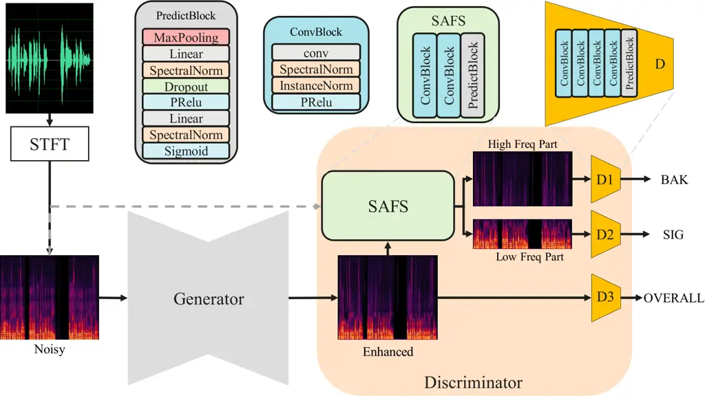
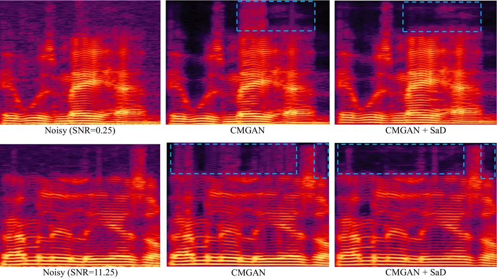

Yuan^(∗) Liu^(∗) Chen Zhou Liu Chen Hu HuaweiChina HuaweiChina

# SaD: A Scenario-Aware Discriminator for Speech Enhancement

Xihao    Siqi    Yan    Hang    Chang    Hanting    Jie
Affiliation: Noah’s Ark Lab Affiliation: Consumer Business Group

###### Abstract

Generative adversarial network-based models have shown remarkable
performance in the field of speech enhancement. However, the current
optimization strategies for these models predominantly focus on refining
the architecture of the generator or enhancing the quality evaluation
metrics of the discriminator. This approach often overlooks the rich
contextual information inherent in diverse scenarios. In this paper, we
propose a scenario-aware discriminator that captures scene-specific
features and performs frequency-domain division, thereby enabling a more
accurate quality assessment of the enhanced speech generated by the
generator. We conducted comprehensive experiments on three
representative models using two publicly available datasets. The results
demonstrate that our method can effectively adapt to various generator
architectures without altering their structure, thereby unlocking
further performance gains in speech enhancement across different
scenarios.

###### keywords

speech enhancement, frequency band slice, generative adversarial network

^(†)^(†)email:
{yuanxihao,liusiqi37,chenyan176,zhouhang25,liuchang3,chenhanting,hujie23}@huawei.com^(\*)^(\*)footnotetext:
These authors contributed equally to this work

## 1 Introduction

Speech enhancement (SE) is of paramount importance in modern
communication systems and has garnered significant attention due to its
applications in various fields such as telecommunications, hearing aids,
and speech recognition. The advent of deep learning has revolutionized
SE, with deep neural network (DNN)-based approaches \[1, 2, 3, 4\]
consistently demonstrating superior performance compared to traditional
signal-processing-based methods \[5, 6\].

A notable milestone in this domain was achieved with the introduction of
SEGAN \[7\], which pioneered the application of generative adversarial
network (GAN) to SE tasks and revealed their potential for further
enhancing model performance. Since then, an increasing number of studies
\[8, 9, 10, 11, 12, 13\] have focused on investigating and optimizing
GAN-based models for SE, highlighting the growing interest in leveraging
adversarial training to address the challenges of speech enhancement.

The GAN-like model comprises two core components: the generator and the
discriminator, with the latter being crucial for evaluating the quality
of generated results and guiding the generator to produce high-quality
outputs. SEGAN employs a discriminator that merely distinguishes whether
the generated result is a noisy signal or a clean speech signal, thereby
neglecting the quality of the generated result and leading to suboptimal
performance. MetricGAN \[8\] further introduces a metric-based
discriminator that evaluates the perceptual evaluation of speech quality
(PESQ) \[14\] and short-time objective intelligibility (STOI) \[15\],
significantly improving performance and achieving state-of-the-art
(SOTA) results in SE tasks at the time. Inspired by MetricGAN,
subsequent works such as MetricGAN+ \[16\], CMGAN \[10\], and
Multi-CMGAN \[11\] have optimized the metric evaluation aspect within
the discriminator to further enhance the performance of GAN-based models
in SE tasks.



Figure 1: Overview of SaD. The Scenario-Aware Frequency Splitter
receives the enhanced speech generated by the Generator and the original
noisy speech as inputs, and predicts the frequency division points to
partition the enhanced speech into high-frequency and low-frequency
components. Three distinct pre-trained metric estimation discriminators
are employed to evaluate the quality of the high-frequency component,
low-frequency component, and the original enhanced speech, respectively.

In practical SE scenarios, environmental noise and human speech exhibit
diverse distributions, resulting in varying frequency and
signal-to-noise ratio (SNR) profiles. Despite extensive research on SE
GAN models, existing efforts have predominantly focused on optimizing
the discriminator through metric-based computations, with limited
consideration of real-world scenario information. These discriminators
often overlook the actual frequency distribution characteristics of
different scenarios when evaluating quality. For instance, the frequency
distribution of human speech is typically concentrated within the 1-4
kHz range, with speech being the dominant component below 4 kHz
(low-frequency portion) and noise being the dominant component above 4
kHz (high-frequency portion). However, the actual frequency range of
human speech varies among individuals (e.g., between male and female
voices), implying that the precise frequency division point between high
and low frequencies is not always strictly 4 kHz. Additionally, the
frequency distribution of noise and the SNR vary across different
scenarios, leading to differing proportions of speech and noise in
various frequency bands.

To address this challenge, several existing methods have been proposed
to enhance model performance by partitioning the frequency spectrum and
fine-tuning individual frequency bands. For instance, Suband-KD \[17\]
employs a fixed frequency band division strategy, training distinct
teacher models for each band and subsequently distilling knowledge into
a target model. However, this approach does not account for the actual
characteristics of the acoustic scene. Another method, DFKD \[18\],
estimates the frequency band division point by identifying the
first-order derivative change extreme points in the frequency domain.
While this technique incorporates scene characteristics to some extent,
it relies heavily on empirical computation, which may not always yield
optimal results. Therefore, fully integrating scene-specific
characteristics and conducting a fine-grained evaluation of the
denoising quality across different frequency bands is of paramount
importance for enhancing the model’s noise reduction capabilities.

In this paper, we introduce a scenario-aware discriminator (SaD) for
speech enhancement to achieve finer differentiation and quality
assessment of noise reduction across various acoustic scenarios. Drawing
inspiration from the DFKD method, we propose a frequency band division
approach based on weakly-supervised learning. This method enables the
model to integrate scene-specific characteristics and adaptively
generate frequency band divisions. Subsequently, distinct quality
evaluation metrics are applied according to the signal characteristics
of each band. By focusing more granularly on the signal distribution
characteristics within different frequency bands, the model’s
performance is further enhanced. Our approach has been validated across
multiple datasets and models, demonstrating significant improvements in
both noise reduction and speech retention capabilities.

The remainder of this paper is structured as follows. Section 2 provides
a detailed overview of the proposed method, highlighting its
complexities. Section 3 delves into the specifics of the experiments,
covering the dataset, implementation, and analysis of the results.
Finally, Section 5 presents concluding remarks and outlines potential
directions for future research.

## 2 Methodology

### 2.1 System Overview

Our proposed method reconfigures the discriminator for SE GAN-like
models (e.g., MetricGAN, CMGAN). Specifically, we introduce a
scenario-aware frequency splitter (SAFS) that adaptively partitions the
enhanced speech generated by the generator into high-frequency and
low-frequency components. The quality of these two frequency components
is subsequently evaluated separately. Our approach is compatible with
various generators of different architectures and has been validated as
effective across multiple GAN-like models.

As illustrated in Fig. 1, the generator is assumed to accept
time-frequency domain noisy speech processed by the short-time fourier
transform (STFT) and transform it into enhanced speech. The SAFS in the
proposed SaD module fuses the original noisy speech with the enhanced
speech generated by the generator and predicts a division point. Based
on this division point, the enhanced speech is divided into two parts:
the low-frequency part, where speech is the dominant component, and the
high-frequency part, where noise is the dominant component.
Subsequently, distinct discriminators evaluate the quality of the
signals in the high-frequency and low-frequency parts, as well as in the
full-frequency band, and update the network parameters accordingly.
Inspired by CMGAN, we combine the ConvBlock and PredictBlock to form the
SAFS module and discriminator module, respectively.

### 2.2 Scenario-Aware Frequency Spliter

Another critical challenge is the absence of frequency division labels
in existing SE datasets. Our experimental findings indicate that a fully
unsupervised training approach is highly susceptible to pattern
collapse. To mitigate this issue, we propose a weakly supervised
training method leveraging the first-order derivative change extreme
points. Specifically, we adopt the method of DFKD to calculate the
frequency division point of the clean speech as the label for frequency
division and utilize this label to guide the initial training phase of
the SaD-GAN network. As the network converges, we remove the frequency
division label and switch to an unsupervised training process. This
transition allows the network to adaptively identify the optimal
crossover frequency point in the later stages of training, in
conjunction with the generator’s actual speech enhancement capabilities
and the characteristics of the current scenario.

Let $`\mathcal{F}`$ represent the SAFS, which takes as input the
original noisy speech $`X`$ and the enhanced speech $`\hat{Y}`$
generated by the generator. The SAFS predicts the frequency division
point $`\hat{m}`$. The ground-truth label $`m`$ is estimated using the
methodology of DFKD. In the early stages of training, the loss function
$`Loss_{m}`$ is employed to supervise the SAFS.

```math
\hat{m}=\mathcal{F}(X,\hat{Y}) \tag{1}
```

```math
\displaystyle\hat{Y}_{high}=\hat{Y}[:\hat{m}],\hat{Y}_{low}=\hat{Y}[\hat{m}:] \tag{2}
```

```math
Loss_{m}=\|m-\hat{m}\|_{2} \tag{3}
```

### 2.3 Quality Assessment of Different Frequencies

The quality assessment method of DNSMOS \[19\] aligns more closely with
human auditory perception. Recent studies leveraging DNSMOS have
demonstrated its efficacy in discriminating quality and achieving
satisfactory performance in SE tasks. However, this approach is not
directly applicable to scenarios involving frequency division.
Specifically, when the SaD partitions enhanced speech, the uncertainty
of the division point introduces a dynamic signal, where the lengths of
the high- and low-frequency bands are not fixed. Conversely, the
conventional DNSMOS framework accepts only full-band inputs and
evaluates three key metrics: background intrusiveness (BAK), speech
distortion (SIG), and overall quality (OVERALL). This method is
insufficient for accurately assessing the quality of individual high- or
low-frequency components. To address this limitation and accommodate
SaD, we retrained the discriminator and developed a system for
evaluating the quality of high- and low-frequency separation.

To collect dynamic inputs for high- and low-frequency components, we
adopt the approach of DFKD to partition the original clean speech from
the training set into two frequency bands: high-frequency and
low-frequency parts. Subsequently, we input the original clean speech
into the pre-trained DNSMOS model to obtain the BAK, SIG, and OVERALL
scores. The high-frequency part is then fed into the discriminator
$`\mathcal{D}_{1}`$, which is supervised by the BAK score, while the
low-frequency part is fed into the discriminator $`\mathcal{D}_{2}`$,
supervised by the SIG score. Additionally, the enhanced speech is fed
into the discriminator $`\mathcal{D}_{3}`$, which is supervised by the
OVERALL score to ensure overall quality control. In this manner,
$`\mathcal{D}_{1}`$ and $`\mathcal{D}_{2}`$ receive dynamic input
signals and accurately estimate the noise suppression ability in the
high-frequency part and the vocal retention ability in the low-frequency
part, respectively.

```math
Loss_{BAK}=\|\mathcal{D}_{1}(\hat{Y}_{high})-BAK\|_{2} \tag{4}
```

```math
Loss_{SIG}=\|\mathcal{D}_{2}(\hat{Y}_{low})-SIG\|_{2} \tag{5}
```

```math
Loss_{OVL}=\|\mathcal{D}_{3}(\hat{Y})-OVERALL\|_{2} \tag{6}
```

Furthermore, the SNR information is crucial in SE tasks. However,
previous SE GAN studies have often overlooked this aspect, with training
processes typically calculating the discriminator loss
($`Loss_{\mathcal{D}}`$) solely based on final predicted metrics such as
PESQ and STOI. This approach often necessitates complex parameter tuning
to balance losses corresponding to different sub-metrics, thereby
optimizing the network’s overall performance.

By further analyzing the optimization goals of SE tasks within the
context of scene SNR, it becomes evident that for high-SNR scenarios
with minimal background noise, the primary objective of the network
should be to preserve speech quality. Conversely, in low-SNR scenarios
with significant background noise, noise suppression becomes more
critical for enhancing speech intelligibility.

Based on these observations, we propose an SNR-driven loss balancing
method. Here, the entire network is trained such that the SaD module
adaptively adjusts the weights of different loss sub-items according to
the SNR value of the current scenario. Specifically, $`SNR_{max}`$
denotes the maximum SNR value over the whole training dataset, the
weight of $`Loss_{BAK}`$ is increased for low-SNR scenes, while the
weight of $`Loss_{SIG}`$ is increased for high-SNR scenes. This adaptive
weighting ensures that the network prioritizes noise suppression in
challenging scenarios and speech preservation in simpler scenarios.

```math
\displaystyle Loss_{\mathcal{D}}= \displaystyle Loss_{m}+Loss_{OVL}+ \tag{7}
```

```math
\displaystyle\alpha*Loss_{BAK}+(1-\alpha)*Loss_{SIG}
```

```math
\displaystyle\text{where}\ \alpha=\frac{SNR}{SNR_{max}}
```

```math
Loss_{total}=Loss_{\mathcal{G}}+\gamma*Loss_{\mathcal{D}} \tag{8}
```

Finally, the total loss ($`Loss_{total}`$) during the training of the
SaD-GAN model is obtained by combining the generator loss
($`Loss_{\mathcal{G}}`$) and the discriminator loss
($`Loss_{\mathcal{D}}`$), with their respective contributions regulated
by the hyperparameter $`\gamma`$. It is important to note that our
proposed method does not alter the generator architecture of the SE GAN
model. Consequently, $`Loss_{\mathcal{G}}`$ remains strictly consistent
with the original formulations in the literature and may vary across
different implementations.

## 3 Experiments

### 3.1 Datasets

To validate the effectiveness of our proposed methods, we conducted
experiments using the DNS2020 challenge dataset \[20\] and the
VoiceBank+DEMAND dataset \[21\].

The dataset employed in the DNS2020 challenge comprises 500 hours of
pristine speech recordings from 2,150 unique speakers, augmented with
65,000 noise clips representing 150 distinct audio classes. These noise
clips were meticulously sourced from publicly available datasets,
including Audioset, Freesound, and YouTube. To facilitate the training
process, each audio clip was uniformly segmented into fixed intervals of
6 seconds. Subsequently, the entire training corpus was resampled at a
consistent sampling rate of 16 kHz to ensure uniformity across all data
points. Additionally, the SNR levels were randomly sampled from a
uniform distribution ranging between 0 and 20 dB, thereby introducing
variability to simulate diverse acoustic environments.

The VoiceBank+DEMAND dataset includes a training set of 11,572
recordings from 28 speakers, mixed with background noise from the DEMAND
\[22\] database and artificial sources at SNRs of 0, 5, 10, and 15 dB.
The test set consists of 824 utterances from two speakers, combined with
unseen DEMAND noise at SNRs of 2.5, 7.5, 12.5, and 17.5 dB.

|                   |                       |       |       |       |       |
| ----------------- | --------------------- | ----- | ----- | ----- | ----- |
| Model             | VoiceBANK+DEMAND test |       |       |       |       |
|                   | PESQ                  | CSIG  | CBAK  | COVL  | STOI  |
| MetricGAN         | 2.697                 | 3.861 | 2.428 | 3.291 | 0.876 |
| MetricGAN + SaD   | 2.928                 | 3.927 | 2.51  | 3.439 | 0.868 |
| CMGAN†            | 3.406                 | 4.595 | 2.831 | 4.076 | 0.958 |
| CMGAN + SaD       | 3.622                 | 4.659 | 3.24  | 4.223 | 0.947 |
| Multi-CMGAN       | 3.393                 | 4.421 | 3.349 | 3.953 | 0.942 |
| Multi-CMGAN + SaD | 3.402                 | 4.465 | 3.372 | 3.982 | 0.943 |

Table 1: Performance comparison on VoiceBANK+DEMAND. †denotes the
results tested by official open-source code, otherwise reproduced by
ourselves.

|                   |              |       |       |       |       |
| ----------------- | ------------ | ----- | ----- | ----- | ----- |
| Model             | DNS2020-test |       |       |       |       |
|                   | PESQ         | CSIG  | CBAK  | COVL  | STOI  |
| MetricGAN         | 2.647        | 3.903 | 2.516 | 3.303 | 0.912 |
| MetricGAN + SaD   | 2.663        | 3.88  | 2.457 | 3.304 | 0.894 |
| CMGAN             | 3.107        | 4.283 | 3.156 | 3.717 | 0.926 |
| CMGAN + SaD       | 3.135        | 4.445 | 3.197 | 3.833 | 0.936 |
| Multi-CMGAN       | 3.013        | 4.353 | 3.186 | 3.717 | 0.944 |
| Multi-CMGAN + SaD | 3.115        | 4.378 | 3.239 | 3.779 | 0.948 |

Table 2: Performance comparison on DNS2020.

### 3.2 Implementation Details

To validate the generalizability of the proposed SaD module, we
conducted experiments on several state-of-the-art SE GAN models,
including MetricGAN, CMGAN, and the latest SOTA model, MultiCMGAN. These
models were trained and tested on two above-mentioned benchmark
datasets: DNS2020 and VoiceBank+DEMAND.

During the training process, the discriminator in each model was
replaced with the SaD module, while the generator architecture remained
unchanged. For MetricGAN, the BLSTM architecture was employed as the
generator, whereas for CMGAN and MultiCMGAN, the conformer architecture
was utilized.

In the initial 10 epochs of SaD training, we employed the DFKD method to
compute the division point labels, providing supervised guidance for the
training process. Subsequently, the supervision was removed, enabling
the network to adaptively learn the division points in an unsupervised
manner. This approach ensures that the SaD module can dynamically adjust
to varying acoustic environments while maintaining robust generalization
capabilities.

For models with publicly available weights, we directly utilized these
weights to evaluate their performance on the corresponding test sets.
For models whose weights are not yet open-source, we meticulously
adhered to the descriptions and hyperparameter settings outlined in the
original literature, and trained and tested these models on the
respective datasets.

In terms of evaluation metrics, we measured the PESQ, STOI, and the mean
opinion score (MOS) \[23\] predictor, which includes three sub-metrics:
speech distortion (CSIG), background noise intrusiveness (CBAK), and
overall speech quality (COVL). Specifically, CSIG, CBAK, and COVL assess
the signal distortion, background interference, and overall quality on a
common scale, respectively. PESQ and STOI quantify the perceived quality
and intelligibility of the speech signal, respectively.

|                       |                       |       |       |       |       |
| --------------------- | --------------------- | ----- | ----- | ----- | ----- |
| Model                 | VoiceBANK+DEMAND test |       |       |       |       |
|                       | PESQ                  | CSIG  | CBAK  | COVL  | STOI  |
| CMGAN + SaD           | 3.622                 | 4.659 | 3.24  | 4.223 | 0.947 |
| w/o weakly supervised | 3.539                 | 4.646 | 3.103 | 4.158 | 0.849 |
| w/o DNSMOS fine-tune  | 3.449                 | 4.553 | 3.328 | 4.058 | 0.94  |
| w/o SNR loss weight   | 3.59                  | 4.636 | 3.139 | 4.182 | 0.951 |

Table 3: Ablation studies with CMGAN on VoiceBANK+DEMAND.

### 3.3 Experimental Results and Discussions

#### 3.3.1 Main Results

As presented in Table 1, our proposed method was evaluated on three
distinct models using the VoiceBank+DEMAND dataset. When the generator
was kept consistent and only the discriminator was replaced with the
proposed SaD module, our method consistently outperformed the original
models across nearly all metrics. Notably, the PESQ scores for MetricGAN
and CMGAN were enhanced by 0.2 points. Significant improvements were
also observed in speech distortion, background intrusiveness, and
overall quality. Among these models, CMGAN exhibited the most pronounced
enhancement, with an increase of over 0.2 points in the overall quality
score.

To further validate the effectiveness of our approach, additional
experiments were conducted on the DNS2020 dataset, as detailed in Table 2. Our method demonstrated consistent improvements across all three
models. Specifically, CMGAN and MultiCMGAN exhibited superior
performance compared to their original counterparts across all metrics.
While some metrics for MetricGAN also surpassed the original model, the
improvements were less pronounced than those observed in CMGAN and
MultiCMGAN.

#### 3.3.2 Ablation Study

We conducted additional ablation studies using CMGAN on the
VoiceBank+DEMAND dataset, with results presented in Table 3. When the
SAFS was trained entirely in an unsupervised manner throughout the
training process, the PESQ, CSIG, CBAK, COVL, and STOI metrics exhibited
decreases of 0.083, 0.013, 0.137, 0.065, and 0.098, respectively.
Similarly, omitting the pre-fine-tuning of DNSMOS for dynamic inputs led
to a notable decline in most metrics, with the exception of CBAK.
Additionally, removing the SNR-driven loss weighting resulted in
degraded performance across metrics other than STOI. However, individual
metrics alone do not provide a comprehensive assessment of the model’s
overall effectiveness, a point we will further elaborate on in the
subsequent discussion of subjective evaluations.

#### 3.3.3 Subjective Effect Analysis

To address the instability of certain metrics, such as STOI, we further
analyzed the subjective enhancement effects of SaD. As illustrated in
Figure 2, we randomly selected two distinct scenarios from the
VoiceBank+DEMAND test set, with signal-to-noise ratios (SNRs) of 0.25
and 11.25 dB, respectively. The top row, from left to right, displays
the results for the Noisy (SNR = 0.25 dB), CMGAN, and CMGAN+SaD
conditions. The bottom row, from left to right, shows the results for
the Noisy (SNR = 11.25 dB), CMGAN, and CMGAN+SaD conditions.

The CMGAN results were obtained using the official open-source weights
and code for inference. Comparing the noisy and CMGAN results reveals
that CMGAN tends to generate spurious high-frequency harmonics that do
not exist in the original signal. In contrast, CMGAN+SaD effectively
suppresses these pseudo-harmonics in both low-SNR and high-SNR
scenarios, thereby improving the actual listening experience.



Figure 2: Frequency Analysis for Diverse Acoustic Scenarios. The upper
and lower rows depict the time-frequency representations of two distinct
scenarios. From left to right: the leftmost plot illustrates the input
noisy signal, the middle plot shows the enhancement result obtained
using the official CMGAN open-source code, and the rightmost plot
presents the enhanced result achieved with CMGAN + SaD.

## 4 Conclusions

This study introduces a scenario-aware discriminator tailored for SE
models based on the GAN framework. Our approach integrates the
time-frequency characteristics of the current acoustic scenario,
partitions the enhanced speech generated by the generator into high- and
low-frequency bands, and employs distinct quality evaluation metrics for
each band. We further incorporate SNR information to distinguish the
actual optimization objectives of the SE task. Based on this, we propose
an SNR-driven method for adaptively adjusting loss weights, which
effectively mitigates the need for extensive hyperparameter tuning
during the training process of GAN-like models. Experimental results
demonstrate that our method can further unlock the performance potential
of various generator architectures, significantly enhancing their speech
enhancement capabilities. The effectiveness of our approach is validated
across multiple datasets and models, thereby confirming its feasibility
and generalizability.

## References

- \[1\] Y. Hu, Y. Liu, S. Lv, M. Xing, S. Zhang, Y. Fu, J. Wu, B. Zhang,
  and L. Xie, “Dccrn: Deep complex convolution recurrent network for
  phase-aware speech enhancement,” _arXiv preprint
  arXiv:2008.00264_, 2020.
- \[2\] K. Tan and D. Wang, “A convolutional recurrent neural network
  for real-time speech enhancement.” in _Interspeech_, vol. 2018, 2018,
  pp. 3229–3233.
- \[3\] A. Défossez, N. Usunier, L. Bottou, and F. Bach, “Demucs: Deep
  extractor for music sources with extra unlabeled data remixed,” _arXiv
  preprint arXiv:1909.01174_, 2019.
- \[4\] A. E. Bulut and K. Koishida, “Low-latency single channel speech
  enhancement using u-net convolutional neural networks,” in _ICASSP
  2020-2020 IEEE International Conference on Acoustics, Speech and
  Signal Processing (ICASSP)_. IEEE, 2020, pp. 6214–6218.
- \[5\] S. Boll, “Suppression of acoustic noise in speech using spectral
  subtraction,” _IEEE Transactions on acoustics, speech, and signal
  processing_, vol. 27, no. 2, pp. 113–120, 1979.
- \[6\] J. Lim and A. Oppenheim, “All-pole modeling of degraded speech,”
  _IEEE Transactions on Acoustics, Speech, and Signal Processing_,
  vol. 26, no. 3, pp. 197–210, 1978.
- \[7\] S. Pascual, A. Bonafonte, and J. Serra, “Segan: Speech
  enhancement generative adversarial network,” _arXiv preprint
  arXiv:1703.09452_, 2017.
- \[8\] S.-W. Fu, C.-F. Liao, Y. Tsao, and S.-D. Lin, “Metricgan:
  Generative adversarial networks based black-box metric scores
  optimization for speech enhancement,” in _International Conference on
  Machine Learning_. PmLR, 2019, pp. 2031–2041.
- \[9\] J. Su, Z. Jin, and A. Finkelstein, “Hifi-gan: High-fidelity
  denoising and dereverberation based on speech deep features in
  adversarial networks,” _arXiv preprint arXiv:2006.05694_, 2020.
- \[10\] R. Cao, S. Abdulatif, and B. Yang, “Cmgan: Conformer-based
  metric gan for speech enhancement,” _arXiv preprint
  arXiv:2203.15149_, 2022.
- \[11\] G. Close, W. Ravenscroft, T. Hain, and S. Goetze,
  “Multi-cmgan+/+: Leveraging multi-objective speech quality metric
  prediction for speech enhancement,” in _ICASSP 2024-2024 IEEE
  International Conference on Acoustics, Speech and Signal Processing
  (ICASSP)_. IEEE, 2024, pp. 351–355.
- \[12\] V. Zadorozhnyy, Q. Ye, and K. Koishida, “Scp-gan:
  Self-correcting discriminator optimization for training consistency
  preserving metric gan on speech enhancement tasks,” _arXiv preprint
  arXiv:2210.14474_, 2022.
- \[13\] N. Babaev, K. Tamogashev, A. Saginbaev, I. Shchekotov, H. Bae,
  H. Sung, W. Lee, H.-Y. Cho, and P. Andreev, “Finally: fast and
  universal speech enhancement with studio-like quality,” _Advances in
  Neural Information Processing Systems_, vol. 37, pp. 934–965, 2025.
- \[14\] A. W. Rix, J. G. Beerends, M. P. Hollier, and A. P. Hekstra,
  “Perceptual evaluation of speech quality (pesq)-a new method for
  speech quality assessment of telephone networks and codecs,” in _2001
  IEEE international conference on acoustics, speech, and signal
  processing. Proceedings (Cat. No. 01CH37221)_, vol. 2. IEEE, 2001, pp.
  749–752.
- \[15\] C. H. Taal, R. C. Hendriks, R. Heusdens, and J. Jensen, “An
  algorithm for intelligibility prediction of time–frequency weighted
  noisy speech,” _IEEE Transactions on audio, speech, and language
  processing_, vol. 19, no. 7, pp. 2125–2136, 2011.
- \[16\] S.-W. Fu, C. Yu, T.-A. Hsieh, P. Plantinga, M. Ravanelli,
  X. Lu, and Y. Tsao, “Metricgan+: An improved version of metricgan for
  speech enhancement,” _arXiv preprint arXiv:2104.03538_, 2021.
- \[17\] X. Hao, S. Wen, X. Su, Y. Liu, G. Gao, and X. Li, “Sub-band
  knowledge distillation framework for speech enhancement,” _arXiv
  preprint arXiv:2005.14435_, 2020.
- \[18\] X. Yuan, S. Liu, H. Chen, L. Zhou, J. Li, and J. Hu, “Dynamic
  frequency-adaptive knowledge distillation for speech enhancement,”
  _arXiv preprint arXiv:2502.04711_, 2025.
- \[19\] C. K. Reddy, V. Gopal, and R. Cutler, “Dnsmos: A non-intrusive
  perceptual objective speech quality metric to evaluate noise
  suppressors,” in _ICASSP 2021-2021 IEEE International Conference on
  Acoustics, Speech and Signal Processing (ICASSP)_. IEEE, 2021, pp.
  6493–6497.
- \[20\] C. K. Reddy, V. Gopal, R. Cutler, E. Beyrami, R. Cheng,
  H. Dubey, S. Matusevych, R. Aichner, A. Aazami, S. Braun _et al._,
  “The interspeech 2020 deep noise suppression challenge: Datasets,
  subjective testing framework, and challenge results,” _arXiv preprint
  arXiv:2005.13981_, 2020.
- \[21\] C. Valentini-Botinhao, X. Wang, S. Takaki, and J. Yamagishi,
  “Investigating rnn-based speech enhancement methods for noise-robust
  text-to-speech.” in _SSW_, 2016, pp. 146–152.
- \[22\] J. Thiemann, N. Ito, and E. Vincent, “The diverse environments
  multi-channel acoustic noise database (demand): A database of
  multichannel environmental noise recordings,” in _Proceedings of
  Meetings on Acoustics_, vol. 19, no. 1, 2013.
- \[23\] Y. Hu and P. C. Loizou, “Evaluation of objective quality
  measures for speech enhancement,” _IEEE Transactions on audio, speech,
  and language processing_, vol. 16, no. 1, pp. 229–238, 2007.
