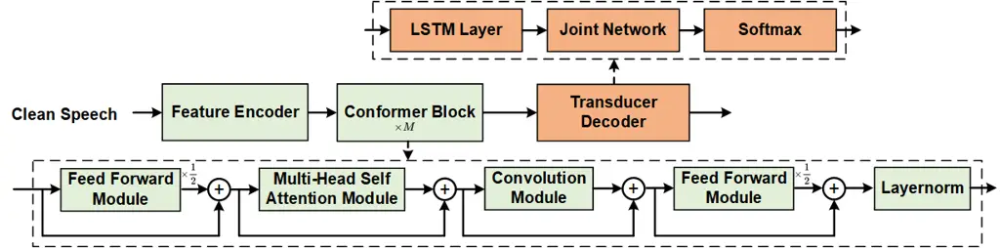
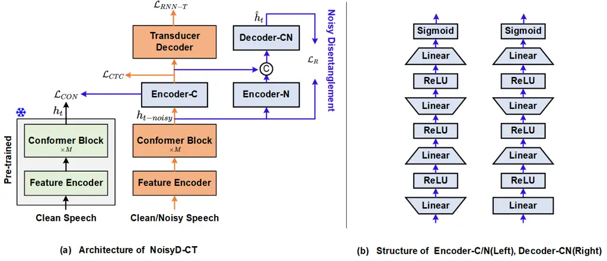
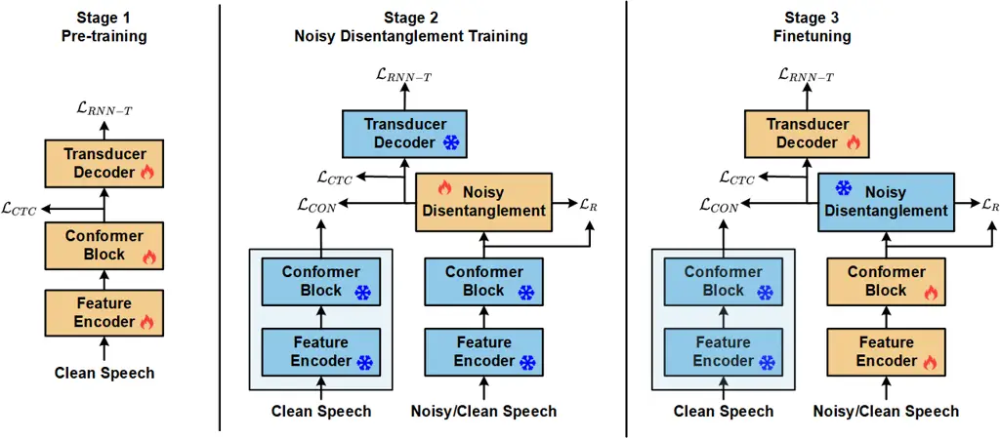
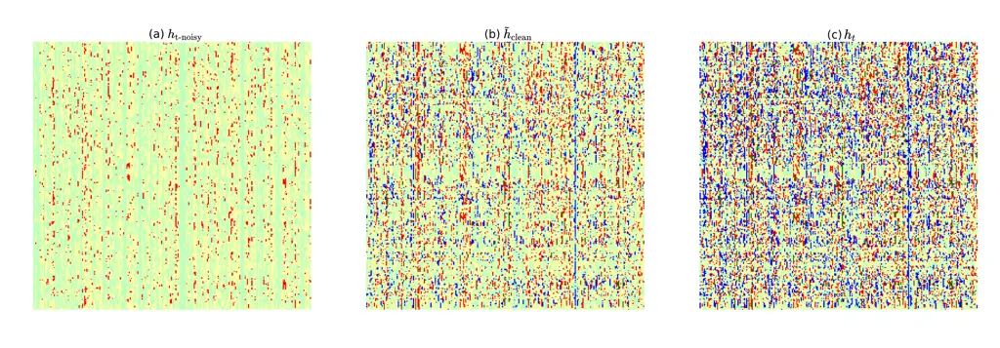

# Noisy Disentanglement with Tri-stage Training for Noise-Robust Speech Recognition

Journal: Neural Networks

Shuangyuan Chen Affiliation: Shanghai Engineering Research Center of
Intelligent Education and Bigdata, Shanghai Normal University, Shanghai,
China    Shuang Wei Affiliation: Shanghai Engineering Research Center of
Intelligent Education and Bigdata, Shanghai Normal University, Shanghai,
China    Dongxing Xu Affiliation: Unisound AI Technology Co., Ltd.,
Beijing, China    Yanhua Long Corresponding author: Yanhua Long is the
corresponding author (yanhua@shnu.edu.cn). This work is supported by the
National Natural Science Foundation of China (Grant No.62071302).
Affiliation: Shanghai Engineering Research Center of Intelligent
Education and Bigdata, Shanghai Normal University, Shanghai, China
Affiliation: Unisound AI Technology Co., Ltd., Beijing, China

###### Abstract

To enhance the performance of end-to-end (E2E) speech recognition
systems in noisy or low signal-to-noise ratio (SNR) conditions, this
paper introduces NoisyD-CT, a novel tri-stage training framework built
on the Conformer-Transducer architecture. The core of NoisyD-CT is a
especially designed compact noisy disentanglement (NoisyD) module
(adding only 1.71M parameters), integrated between the Conformer blocks
and Transducer Decoder to perform deep noise suppression and improve ASR
robustness in challenging acoustic noise environments. To fully exploit
the noise suppression capability of the NoisyD-CT, we further propose a
clean representation consistency loss to align high-level
representations derived from noisy speech with those obtained from
corresponding clean speech. Together with a noisy reconstruction loss,
this consistency alignment enables the NoisyD module to effectively
suppress noise while preserving essential acoustic and linguistic
features consistent across both clean and noisy conditions, thereby
producing cleaner internal representations that enhance ASR performance.
Moreover, our tri-stage training strategy is designed to fully leverage
the functionalities of both the noisy disentanglement and speech
recognition modules throughout the model training process, ultimately
maximizing performance gains under noisy conditions. Our experiments are
performed on the LibriSpeech and CHiME-4 datasets, extensive results
demonstrate that our proposed NoisyD-CT significantly outperforms the
competitive Conformer-Transducer baseline, achieving up to 25.7% and
10.6% relative word error rate reductions on simulated and real-world
noisy test sets, respectively, while maintaining or even improving
performance on clean speech test sets. The source code, model checkpoint
and data simulation scripts will be available at
https://github.com/litchimo/NoisyD-CT.

###### Keywords: 

End-to-end speech recognition , Noise robustness , Noisy Disentanglement
, Conformer-Transducer

## 1 Introduction

With the rapid advancement of technologies such as neural network
architectures, automatic speech recognition (ASR) has achieved
remarkable progress in recent years \[1\] \[2\] \[3\]. Traditional ASR
systems are primarily designed in a modular fashion, comprising
components like feature extraction, acoustic modeling, and language
modeling, relying heavily on manually crafted features and statistical
modeling techniques \[4\] \[5\] \[6\]. However, the independent
optimization of these modules poses limitations, making it challenging
for the overall system to achieve optimal performance. With the rise of
deep learning, end-to-end speech recognition methods based on neural
networks have become mainstream, significantly improving
performance \[7\] \[8\]. Nevertheless, in complex noisy environments or
under low signal-to-noise ratio (SNR) conditions, end-to-end ASR models
are highly susceptible to environmental noise, leading to signal
distortion and substantial performance degradation \[9\].

To address this issue, many studies have incorporated speech enhancement
(SE) models as the front-end of automatic speech recognition (ASR)
systems \[10\]. For the SE module, both traditional methods \[11\] and
neural network-based approaches can be employed, with implementations
possible in both the time domain \[12\] \[13\] and frequency
domain \[14\] \[15\]. Additional, the SE module and the ASR module can
be trained either independently \[16\] or jointly \[17\]. However, the
training objectives of SE modules typically focus on improving speech
quality, such as minimizing mean squared error (MSE) or enhancing
signal-to-noise ratio (SNR). In contrast, ASR models are generally
optimized based on word error rate (WER) \[18\]. This mismatch between
the objectives of the SE and ASR modules can lead to distortions in the
speech processed by the SE module, thereby negatively affecting the
performance of the ASR system. Consequently, while the SE-based approach
has limitations, alternative methods that eliminate the SE module
entirely and employ end-to-end models for improved noise robustness
remain relatively unexplored.

To overcome these challenges and achieve superior performance with
enhanced robustness, we propose the NoisyD-CT framework. Based on the
Conformer-Transducer (Conformer-T) architecture, which has been widely
adopted as a state-of-the-art model in speech recognition, the NoisyD-CT
framework has made three key innovations as follow:

1.  1.  Introduce a noisy disentanglement module to improve noise-robust ASR
        performance. Due to the limited performance of the
        Conformer-Transducer model in speech recognition under complex noisy
        conditions, we incorporate an additional noisy disentanglement
        module within the framework. Specifically, we introduce three
        lightweight modules (1.71M parameters) between the encoder and
        decoder of the Conformer-T. These modules perform deep noise
        suppression on the representations obtained from the encoder, aiming
        to generate as clean a representation as possible, which is then fed
        into the decoder. This enhancement significantly improves the
        overall noise robustness of the model.
2.  2.  Propose a tri-stage training strategy. The tri-stage training
        strategy is designed to maximize the performance of each module in
        the whole NoisyD-CT, addressing the limitations of traditional
        single-stage training. Initially, each module is trained
        independently to ensure it effectively learns its specific function.
        Once the individual modules have been optimized, they are integrated
        and undergo joint training, refining their interactions to enhance
        overall ASR performance.
3.  3.  Propose a clean representation consistency loss together with a
        noisy reconstruction loss to further enhance the NoisyD-CT. The
        original Conformer-T model is trained using only Connectionist
        Temporal Classification (CTC) loss and RNN-T loss. In our approach,
        we extend this by incorporating two additional losses, leveraging
        both clean representations and reconstructed noisy representations
        to guide the model training. This integrated strategy enhances ASR
        performance in noisy conditions while maintaining performance on
        clean speech tasks.

The rest of this paper is organized as follows. Section 2 presents the
review of related works. In Section 3, we briefly describe the
fundamental of the Conformer-Transducer based ASR architecture. In
Section 4, we introduce the proposed NoisyD-CT framework, including the
model structure and tri-stage training strategy. The experimental setup
and results are presented in Section 5 and Section 6. Finally, we
conclude our work in Section 7.

## 2 Review of Related Works



Figure 1: The framework of Conformer-Transducer.

Noise-robust speech recognition aims to enhance the performance of
speech recognition systems in complex noisy environments or under low
signal-to-noise ratio (SNR) conditions. This technology is particularly
significant for real-world scenarios where environmental noise is
prevalent \[19\]. The challenges of noise-robust ASR include the
diversity and complexity of noise types, interference and distortion in
audio signals \[20\], as well as the robustness and generalization
capability of models. To address these challenges, previous research has
primarily focused on two key areas: (i) SE-based noise-robust ASR; (ii)
Self-supervised learning in noisy ASR.

SE-based noise-robust ASR: To improve the noise robustness of ASR
systems and achieve better results under noisy conditions, a widely
adopted approach is to incorporate a speech enhancement (SE)
module \[21\]. This approach is particularly effective in challenging
noisy conditions, such as scenarios with signal-to-noise ratios (SNR)
approaching 0 dB, where speech intelligibility becomes critical for
accurate recognition. To address this, some studies have proposed a
cascaded framework, where the SE module operates as a front-end to
enhances speech intelligibility before feeding the output into the ASR
system \[16\]. However, since the objectives of SE and ASR modules are
not aligned and they are trained independently in some studies, issues
such as speech distortion introduced by the SE module can negatively
impact the performance of the downstream ASR system. Evidence from the
DNS 2023 Challenge \[22\] underscores this issue: while the TEA-PSE3.0
model achieved a high OVRL MOS score of 2.71, its word accuracy (WAcc)
in speech recognition was only 0.761. This highlights a critical
limitation that higher MOS, PESQ, and other speech enhancement
subjective scores do not necessarily translate to higher speech
recognition accuracy \[23\].To bridge this gap, later research has
explored joint training of SE and ASR models \[24\]. By adopting
strategies like multi-task learning \[25\], these approaches maximize
the correlation between the SE and ASR modules, allowing them to
complement each other \[26\]. Ultimately, these advancements enable SE
modules to enhance speech intelligibility and contribute to improved ASR
performance. However, challenges remain, as optimizing SE for
intelligibility does not always align with ASR objectives, potentially
introducing distortions that degrade recognition accuracy.

Self-supervised learning in noisy ASR: To enhance ASR performance under
noisy conditions, another widely adopted approach is self-supervised
learning (SSL). By leveraging large amounts of unlabeled noisy speech
data, self-supervised learning can help build robust ASR systems. For
example, to enhance noise robustness, Wav2vec-Switch \[27\] extends
wav2vec2.0 (w2v2) \[28\] by incorporating a contrastive loss that
encodes raw noise into the contextual speech representations. Building
on the same w2v2 baseline,  \[29\] proposes an enhanced w2v2 by
minimizing the discrepancy between noisy and clean features, thereby
obtaining more robust speech representations. Similarly,  \[30\] utilize
a teacher-student framework to encode denoised representations extracted
from noisy data.  \[31\] introduces an additional auxiliary
reconstruction module to further improve the noise robustness of learned
SSL representations. Additionally, disentangled HuBERT (deHuBERT) \[32\]
incorporates a novel pair of auxiliary loss functions that promote noise
invariance in HuBERT’s contextual representations. While self-supervised
learning significantly improves ASR robustness in both known and unseen
noisy conditions, it comes with challenges such as large-model size and
high computational resource requirements. Moreover, without careful
fine-tuning, the learned representations may not always align optimally
with ASR objectives, potentially limiting their performance upper-bound.

Other studies have tried to integrate SE modules with self-supervised
learning to enhance ASR robustness in noisy environments. For
example, \[33\] proposed the PASE+, which incorporates an online speech
distortion module to contaminate the input signals with a variety of
random disturbances. By applying various random perturbations to corrupt
the input signal before self-supervised learning, PASE+ demonstrates
strong performance in noisy environments. \[34\] employs a
dual-attention fusion module to combine SE’s ability to enhance speech
quality with self-supervised pretraining’s noise robustness, mitigating
information loss and speech distortion. However, this method is limited
to offline ASR tasks and is unsuitable for real-time applications. To
further refine integration,  \[35\] introduce a knowledge
distillation-based joint training method, which constructs a pipeline
where the ASR and SE models are treated as teacher and student models,
respectively. By converting their outputs into a unified acoustic token
space, this method bridges their objective gap, improving linguistic
information extraction and speech quality. Additionally, \[36\] combine
SE modules with Generative Adversarial Networks (GANs) \[37\] to enhance
ASR performance in both known and unknown noise environments. While
these methods significantly improve ASR robustness in noisy conditions,
they come with notable trade-offs: 1) The introduction of additional
modules, such as dual-attention fusion or GAN-based frameworks,
substantially increases the model’s parameter count, leading to higher
computational complexity; 2) Although these approaches enhance
performance in noisy environments, they often result in a significant
performance drop when processing clean speech. This highlights the
challenge of balancing robustness in noisy conditions with maintaining
high accuracy in clean speech scenarios.

In this study, we focus on enhancing ASR performance in complex noisy
environments while minimizing the increase in parameter count and
ensuring no degradation on clean datasets. To achieve this, we propose
NoisyD-CT, a novel end-to-end framework that leverages synthetically
generated noisy data to improve ASR robustness under noisy conditions.
By integrating noisy disentanglement methods and optimized training
strategies, NoisyD-CT strengthens noise robustness without compromising
system efficiency or performance on clean speech.

## 3 Conformer-Transducer based E2E ASR



Figure 2: The framework of proposed NoisyD-CT E2E ASR.

In this paper, all our contributions are based on the
Conformer-Transducer (Conformer-T), an end-to-end ASR model originally
proposed in \[38\] \[39\]. The Conformer-T has demonstrated
state-of-the-art performance across various ASR tasks by seamlessly
integrating the Conformer’s local feature modeling with the Transducer’s
streaming processing capabilities. These advantages have made
Conformer-T increasingly popular in recent end-to-end ASR systems,
making it the ideal choice as the baseline model for this study. The
whole architecture of Conformer-T is shown in Figure 1. As a standard
transducer architecture, Conformer-T consists of a Feature Encoder,
followed by $`M`$ Conformer blocks as the encoder, and a Transducer
Decoder.

Feature Encoder: The Feature Encoder consists of a stack of
two-dimensional convolutional layers. We denote
$`x=[x_{1},x_{2},...,x_{T}]`$ as an acoustic feature input with $`T`$
frames, which are extracted from the raw audio clip and
$`y=[y_{1},y_{2},...,y_{U}]`$ as the corresponding transcription label
sequence of length $`U`$. Feature Encoder downsamples acoustic feature
$`x`$ into latent acoustic representations
$`z=[z_{1},z_{2},...,z_{t}](t<T)`$. The corresponding equation is as
follows:

```math
z=FeatureEncoder(x) \tag{1}
```

The Feature Encoder not only reduces the computational demand of the
entire model but also highlights the essential information needed for
automatic speech recognition.

Conformer Blocks: After the Feature Encoder, $`M`$ Conformer blocks,
serving as the main part of the encoder, extract high-dimensional
acoustic feature representations $`h_{t}`$ from latent acoustic
representations $`z`$. Each Conformer block consists of the following
components in sequence: a Feed Forward network(FFN) module, a Multi-Head
Self Attention (MHSA) module, a Convolution (CONV) module, and a FFN
module at the end. Furthermore, Layernorm and residual connections are
applied to stabilize training and allow for deeper stacking of layers.
The overall process is illustrated as follows:

```math
\displaystyle z_{FFN_{1}} \displaystyle=z+\frac{1}{2}FFN(z) \tag{2}
```

```math
\displaystyle z_{MHSA} \displaystyle=z_{FFN_{1}}+MHSA(z_{FFN_{1}})
```

```math
\displaystyle z_{CONV} \displaystyle=z_{MHSA}+CONV(z_{MHSA})
```

```math
\displaystyle z_{FFN_{2}} \displaystyle=z_{CONV}+\frac{1}{2}FFN(z_{CONV})
```

```math
\displaystyle h_{t} \displaystyle=Layernorm(z_{FFN_{2}})
```

The advantage of this architecture lies in its ability to learn
long-range global interaction information from the attention module,
while also effectively capturing local features through the
convolutional module. Additionally, the two half-step feed-forward
layers demonstrate superior performance in capturing complex patterns
and dependencies within the input sequence.

Transducer Decoder: The LSTM layer, the joint network, and the Softmax
layer form the Transducer Decoder together. After the Conformer blocks,
the LSTM layer generates a high-dimensional label representation
$`h_{u}(u<U)`$ using the previous non-blank label $`y_{u-1}`$ from the
transcription label sequence $`y`$ as input. The joint network then
combines the high-dimensional acoustic representations $`h_{t}`$ with
the label representations $`h_{u}`$, and passes them through a Softmax
layer to predict the probability of the next label. Moreover, RNN-T
loss \[40\] is also employed. Given $`\mathcal{A}(y)`$, the set of all
possible alignment $`l`$ with special blank token between input $`x`$
and output $`y`$,the loss function can be computed as the following
negative log posterior:

```math
\mathcal{L}_{RNN-T}=-log\textit{P}(y|x)=-log\sum_{l\in\mathcal{A}(y)}\textit{P}(l|x) \tag{3}
```

Moreover, as in \[41\], we also train Conformer-T with an auxiliary CTC
loss to learn frame-level representation. For a given acoustic input
$`x`$ and a label sequence $`y`$, CTC finds all possible alignments
$`\mathcal{B}(x,y)`$ by computing all potential paths, with the
following calculation:

```math
\mathcal{L}_{CTC}=-log\textit{P}(y|x)=-log\sum_{\pi\in\mathcal{B}(x,y)}\textit{P}(\pi|x) \tag{4}
```

So the overall loss of Conformer-T is defined as:

```math
\mathcal{L}_{Conformer-T}=\mu\mathcal{L}_{CTC}+\gamma\mathcal{L}_{RNN-T} \tag{5}
```

where $`\mu,\gamma\in[0,1]`$ are tunable loss weights.

## 4 Proposed Methods

In this section, we provide a detailed description of the proposed
NoisyD-CT ASR framework, which is designed to enhance the noise
robustness of end-to-end speech recognition systems. The overall model
architecture is presented in Section 4.1. The noisy disentanglement
module is detailed in Section 4.2, and Section 4.3 describes the
tri-stage training strategy including pre-training, noisy
disentanglement training, and fine-tuning.

### 4.1 Architecture

To achieve robust recognition of noisy speech, we propose the NoisyD-CT
E2E framework, as illustrated in Figure 2(a). This framework builds upon
the traditional Conformer-Transducer architecture outlined in Section 3,
with key components including a separate pre-trained Feature Encoder and
pre-trained Conformer blocks, Conformer-Transducer and the Noisy
Disentanglement. The structure of the pre-trained Feature Encoder and
Conformer blocks follows the same design as their counterparts in the
complete Conformer-T architecture. After being trained on a clean speech
dataset, their parameters are fixed and used to generate
high-dimensional clean representation for each corresponding noisy
speech representation target. This alignment of high-level
representations between noisy and clean speech provides a strong noise
suppression guidance for the proposed noisy disentanglement module
(NoisyD). Leveraging this alignment, the NoisyD module in Figure 2(a)
performs a comprehensive disentanglement operation, which separates the
high-dimensional noisy representations into distinct noise and clean
speech components, effectively minimizing interference from noise and
preserving the semantic information within the clean speech
representation. The NoisyD enhanced acoustic representations are then
fed into a Transducer Decoder to produce the transcriptions.
Furthermore, to ensure each module of the proposed NoisyD-CT retains its
specific functionality while resolving misaligned objectives, we propose
a tri-stage training strategy. This strategy enables the whole framework
to jointly enhance the noise-robust ASR performance. It should be noted
that during ASR inference, the pre-trained Feature Encoder, pre-trained
Conformer blocks and the Encoder-N and Decoder-CN of the NoisyD module
in Figure 2(a) are all discarded.

### 4.2 Noisy Disentanglement

In real-world noisy environments, noise often disrupts the effective
information carried by speech, leading to a significant decline in ASR
performance, especially under low signal-to-noise ratio (SNR)
conditions. To address this issue, the noisy disentanglement (NoisyD) is
introduced into the overall NoisyD-CT framework. It aims to obtain clean
representations from noise corrupted speech at the high-dimensional
feature representation level, which is more robust to noise interference
compared to processing at the raw speech feature level.

As illustrated in Figure 2(a), the noisy disentanglement module
comprises three key components: Encoder-C, Encoder-N, and Decoder-CN.
Additionally, the framework incorporates the clean representation
consistency loss $`\mathcal{L}_{CON}`$ and the noisy speech
reconstruction loss $`\mathcal{L}_{R}`$. These loss functions play a
crucial role in ensuring a comprehensive disentanglement process,
facilitating the extraction of clean speech representations from noisy
inputs.

Specifically, as shown in Figure 2(a), given $`x`$ as the clean speech’s
acoustic feature and $`x_{noisy}`$ as the acoustic features of
clean/noisy speech. By replacing $`x`$ with $`x_{noisy}`$ in Eq.(1) and
Eq.(2), we obtain the high-dimensional acoustic noisy representation
$`h_{t-noisy}`$, which serves as the input to the NoisyD module. As
demonstrated in Figure 2(b), the structures of Encoder-C, Encoder-N, and
Decoder-CN each consist of four linear layers with activation functions.
ReLU is used as the primary activation function, while a Sigmoid
activation function is applied after the final linear layer. This
structural design allows the modules to progressively learn complex
features and extract the desired information while ensuring minimal
additional model parameter overhead. The Encoder-C and Encoder-N share
an identical architectural design but are tailored for distinct
high-level representation extractions. Specifically, Encoder-C is
responsible for extracting the purified clean representation
$`\tilde{h}_{\text{clean}}`$, which is primarily used as input to the
Transducer Decoder for further decoding. On the other hand, Encoder-N is
designed to extract the pure noise representation
$`\tilde{h}_{\text{noisy}}`$, which is then concatenated with the clean
representation and fed into Decoder-CN. While Decoder-CN follows a
similar structural design, it differs in the dimensionality of its first
linear layer. Its primary function is to reconstruct the
high-dimensional acoustic representation $`\hat{h}_{\text{t}}`$, thereby
indirectly facilitating the extraction of clean representations. The
overall process unfolds as follows:

```math
\displaystyle\tilde{h}_{\text{clean}} \displaystyle=\text{Encoder-C}(h_{t-noisy}) \tag{6}
```

```math
\displaystyle\tilde{h}_{\text{noisy}} \displaystyle=\text{Encoder-N}(h_{t-noisy})
```

```math
\displaystyle\hat{h}_{\text{t}} \displaystyle=\text{Decoder-CN}(Concat(\tilde{h}_{\text{clean}},\tilde{h}_{\text{noisy}}))
```

To achieve the noise suppression function of the NoisyD module, two MSE
losses are introduced: the clean representation consistency loss
$`\mathcal{L}_{CON}`$ and the noisy reconstruction loss
$`\mathcal{L}_{\text{R}}`$. $`\mathcal{L}_{CON}`$ plays a crucial role
by enforcing the alignment of high-level representations derived from
noisy speech with those obtained from their target clean speech. This
alignment enables the NoisyD module to suppress noise while preserving
the essential acoustic and linguistic information that are consistent
across both clean and noisy conditions. As a result, the whole model is
guided to separate noise more effectively, leading to “cleaner” internal
representations that enhance the downstream Transducer Decoder’s
performance. By minimizing the representation distance between $`h_{t}`$
and $`\tilde{h}_{clean}`$, the $`\mathcal{L}_{CON}`$ is defined as
follows:

```math
\mathcal{L}_{CON}=\frac{1}{N}\sum_{i=1}^{N}\left(h^{i}_{\text{t}}-\tilde{h}_{clean}^{i}\right) \tag{7}
```

where $`N`$ is the batch size, $`h_{t}`$ represents the high-dimensional
acoustic representation obtained from the clean speech input processed
by the frozen pre-trained Feature Encoder and Conformer blocks, as
detailed in Section 3.

The noisy reconstruction loss $`\mathcal{L}_{\text{R}}`$ promotes the
extraction of pure noise representation $`\tilde{h}_{\text{noisy}}`$ by
Encoder-N, which does not contain valid linguistic and semantic content,
by minimizing the distance between the reconstructed acoustic
representation $`\hat{h}_{\text{t}}`$ and the extracted high-dimensional
acoustic representations $`h_{t-noisy}`$. This, in turn, indirectly
enhances the noise suppression ability of Encoder-C. Formally, the
$`\mathcal{L}_{\text{R}}`$ is defined as:

```math
\mathcal{L}_{R}=\frac{1}{N}\sum_{i=1}^{N}\left(\hat{h}^{i}_{t}-h^{i}_{t-noisy}\right) \tag{8}
```

With Eq.(5), the whole loss function of our NoisyD-CT E2E framework is
then formulated as:

```math
\mathcal{L}_{NoisyD-CT}=\mathcal{L}_{Conformer-T}+\alpha\mathcal{L}_{CON}+\beta\mathcal{L}_{R} \tag{9}
```

where $`\alpha,\beta\in[0,1]`$ are the weighting parameters.
$`\mathcal{L}_{Conformer-T}`$ is detailed in Section 3.

### 4.3 Tri-stage Training Strategy



Figure 3: Block diagram of tri-stage training strategy on the NoisyD-CT
framework.

In the proposed NoisyD-CT architecture, a single-stage training approach
can introduce interference between the noisy disentanglement process and
the core ASR task, often leading to degraded performance. To eliminate
this issue and fully leverage each module’s functionality, we propose a
tri-stage training strategy in this section. As shown in Figure 3, this
strategy first isolates the Conformer-Transducer’s training to ensure
robust speech recognition capabilities under clean conditions, then
incrementally incorporates the noisy disentanglement module to refine
noise suppression, and finally fine-tunes the entire network. By
separating these learning objectives into distinct phases, the model
more effectively disentangles noise while preserving linguistic
information, ultimately maximizing the performance gains in noisy ASR
scenarios. The whole strategy is described in the following sections.

Pre-training: In this initial stage, a standard Conformer-Transducer
model is trained on the clean speech training set with the standard
objective of achieving state-of-the-art (SOTA) performance on clean
speech. Specifically, only $`\mathcal{L}_{CTC}`$ and
$`\mathcal{L}_{RNN-T}`$ are used for optimization, providing a robust
set of initialization parameters for the subsequent stages. This
approach not only reduces overall training time but also endows the
Feature Encoder and Conformer blocks with the capability to extract
high-quality acoustic representations $`\hat{h}_{t}`$. In addition, such
a strong foundation can also guarantee the effectiveness of the proposed
$`\mathcal{L}_{CON}`$ for noisy disentanglement and then ultimately
enhancing ASR performance under noisy conditions.

Noisy Disentanglement Training: As shown in Figure 3, the second stage
isolates the training of the noisy disentanglement (NoisyD) module from
the rest of the network. All parameters for the Feature Encoder,
Conformer blocks, and Transducer Decoder (previously obtained in the
pre-training stage) are kept fixed, ensuring that the knowledge acquired
from clean speech remains intact. As clearly shown in the figure, the
clean speech and its simulated noisy speech are separately fed into the
parallel structured pre-trained Feature Encoder and Conformer blocks,
providing paired clean-noisy high-level representations for the
implementation of $`\mathcal{L}_{CON}`$ in NoisyD training. The whole
NoisyD module alone is then optimized using the overall model loss
function of $`\mathcal{L}_{NoisyD-CT}`$, focusing on its noise
suppression capabilities without adversely affecting the other
components.

By preventing any noise-related gradient updates from propagating to the
pre-trained modules, this stage preserves the acoustic and linguistic
representations already learned. At the same time, the dedicated
training of NoisyD highlights its ability to disentangle and suppress
noise, producing an effective initialization for the next fine-tuning
stage. As a result, the entire system can later be jointly refined with
minimal interference, ultimately achieving superior recognition
performance under noisy conditions.

Fine-tuning: In the final stage, only the backbone modules (the Feature
Encoder, Conformer blocks, and Transducer Decoder) of standard
Conformer-Transducer within the proposed NoisyD-CT framework are
fine-tuned, while the parameters of all other blocks remain frozen, as
obtained from the initial pre-training and noisy disentanglement stages.
This fine-tuning stage is performed using all the complete set of paired
clean-clean and clean-noisy training data, and it is optimized via the
overall loss function $`\mathcal{L}_{NoisyD-CT}`$. This fine-tuning
stage is very crucial, because it adapts the main Conformer-Transducer
network to effectively handle both clean and noisy inputs, thereby
maximizing the benefits of the noise suppression achieved in Stage 2
while simultaneously boosting ASR performance.

While Stage 1 only uses clean data, it is important to note that both
the noisy disentanglement training (Stage 2) and the fine-tuning stage
(Stage 3) utilize the entire paired dataset, comprising both clean-clean
(the same speech recording) and clean-noisy training pairs. In Stage 2,
when clean-clean pairs are input, the value of $`\mathcal{L}_{CON}`$ is
theoretically near zero. Incorporating these pairs during model training
can prevent the noisy disentanglement module from excessively
suppressing the clean speech input, thus ensuring the good ASR
performance on speech under both clean and noisy application scenarios.
This tri-stage training design choice guarantees that, at inference,
only the right part of Feature Encoder, Conformer blocks at the
Conformer-Transducer backbone, Encoder-C from the NoisyD module, and the
Transducer Decoder are employed, achieving an good balance between noise
suppression, ASR performance, and model complexity.

## 5 Experimental Setup

In this section, we provide a detailed description of the datasets and
experimental configuration used during the system training, validation
and evaluation.

### 5.1 Datasets

We use the open-source LibriSpeech dataset \[42\] as our clean speech
corpus, utilizing the train-clean-100 and train-clean-360 subsets for
training, the dev-clean and dev-other sets for validation, and the
test-clean and test-other sets for evaluation. For noisy speech
simulation, noise samples are sourced from the CHiME-4 Challenge
dataset \[43\], which comprises real-world noise recordings captured
with six-channel distant microphone arrays and close microphones in four
distinct environments: buses(BUS), cafes(CAF), pedestrian areas(PED),
street intersections(STR). To generate synthetic noisy speech, we
randomly select one-channel noise samples from the CHiME-4 dataset and
mix them with LibriSpeech clean recordings at randomly chosen
signal-to-noise ratios (SNRs) ranging from –5 dB to 15 dB. This process
produces synthetic noisy speech data that are paired one-to-one with the
clean speech, forming noisy-clean training pairs (train-noisy-100 vs.
train-clean-100, train-noisy-360 vs. train-clean-360). To avoid data
leakage and ensure a fair evaluation, we ensure that the noise segments
used in the training and test sets are non-overlapping. The resulting
synthetic noisy data is then combined with the clean LibriSpeech data
and shuffled to form the final training and validation sets.

Within our tri-stage training strategy, only the LibriSpeech clean
dataset is used during the pre-training stage. In the subsequent noisy
disentanglement training and fine-tuning stages, both clean and noisy
speech are organized into clean-noisy and clean-clean training pairs to
form the training dataset.

To validate the effectiveness of our approach under both simulated and
real noisy conditions, we construct multiple noisy test sets. We select
fixed SNRs from the set -5, 0, 5, 10, 15 dB, using the test-clean subset
of LibriSpeech as the clean base. Noise samples from the CHiME-4 dataset
are then randomly selected to synthesize noisy test sets at these SNR
levels. Specifically, 20 distinct simulated noisy test sets are created
based on the four noise types (BUS, CAF, PED, STR) and the five SNR
values, thereby evaluating the robustness of our method across various
noisy conditions. Additionally, four real-noise test sets from the
CHiME-4 Challenge, comprising recordings from the same four
environments, are used to assess the performance under real noisy
conditions.

To further evaluate generalization to unseen noise conditions, we
construct an additional noisy test set based on the DEMAND
dataset \[44\], which comprises 18 distinct types of real-world noise
categorized into six groups: four inside or near-field environments
(Domestic, Office, Public and Transportation) and two open-air
environments (Street, Nature). Notably, none of these noise types are
used during training, making the DEMAND dataset suitable for
out-of-domain evaluation. We randomly select single-channel 16 kHz noise
samples from DEMAND and mix them with utterances from the LibriSpeech
test-clean subset at five fixed SNR levels (–5, 0, 5, 10, and 15 dB),
forming the DEMAND simulated noisy test set for evaluating the model’s
robustness under acoustically diverse and unseen noise conditions.

### 5.2 Setups

The acoustic feature inputs used in our experiments are 80-dimensional
log-mel filterbanks, which are normalized using global-level mean
normalization. SpecAugment \[45\] is applied to augment the acoustic
features during training. The vocabulary is composed of 5,000 byte-pair
encoding (BPE)  \[46\] units. It is important to note that the results
presented in this study are only from the acoustic model, as no
additional language model is incorporated during inference.

For the encoder in Conformer-T model, we use a stack of 15 Conformer
encoder layers. Each Conformer layer consists of a 1024-dimensional
feed-forward module and a 256-dimensional attention module with 4
self-attention heads. For the Transducer Decoder, we use a single-layer,
256-dimensional LSTM-based RNN-T, thus resulting in a 30.53M model size.
To facilitate model convergence, we apply a warmup mechanism with 15,000
steps, and a dropout rate of 0.1 is used for regularization to mitigate
overfitting.

During the model training, the scaling factor $`\mu`$ and $`\gamma`$ in
Eq.(9) is set to 0.3 and 1. For the noisy disentanglement training and
fine-tuning stages, the loss weights of $`\alpha`$ and $`\beta`$ are set
to 0.3 and 1, respectively. The Word Error Rate (WER) is used for
evaluating our model’s ASR performance.

## 6 Results and Discussions

### 6.1 E2E ASR Baseline

| ID  | Training Data | Params  | Dev   |       | Test  |       |
| --- | ------------- | ------- | ----- | ----- | ----- | ----- |
|     |               |         | Clean | Other | Clean | Other |
| B1  | Clean         | 30.53 M | 9.3   | 23.0  | 9.5   | 23.7  |
| B2  | Clean+Noisy   | 30.53 M | 8.1   | 21.0  | 8.3   | 21.7  |
| B3  | Clean+Noisy   | 32.12 M | 8.1   | 20.3  | 8.2   | 21.3  |

Table 1: WER% of different Conformer-Transducer baselines on Librispeech
dataset. ‘Clean’ and ‘Noisy’ represent using train-clean-100 and
train-noisy-100 dataset as model training, respectively. B3 incorporates
one additional Conformer encoder layer compared to B2.

Table 1 summarizes the WERs of various Conformer-Transducer baselines
trained on different datasets and with different parameter sizes. System
B1 is trained only on the 100 hours of Librispeech clean data. System B2
and B3 trained on both 100 hours of clean data and 100 hours of
simulated noisy data; B3, in particular, adds an additional Conformer
encoder layer compared to B2, resulting in a similar model size to that
of our proposed NoisyD-CT system.

As the table indicates, augmenting the training data with simulated
noise (B2) substantially lowers the WER on both the clean and other test
sets compared to B1, even though the model size remains unchanged. This
improvement underscores the benefits of increased training data
diversity, even if a mismatch between training and testing conditions.
Moreover, when comparing B2 and B3, the slight increase in model size
(via one extra Conformer encoder layer) further boosts ASR performance
on both the development and test sets.

| ID     | Params  | WER under SNR(dB) |      |      |      |      | Avg  |
| ------ | ------- | ----------------- | ---- | ---- | ---- | ---- | ---- |
|        |         | -5                | 0    | 5    | 10   | 15   |      |
| B2     | 30.53 M | 44.8              | 26.0 | 17.6 | 14.3 | 12.5 | 23.0 |
| B3     | 32.12 M | 43.5              | 24.7 | 16.0 | 12.5 | 10.9 | 21.5 |
| B3+Tri | 32.12 M | 44.8              | 26.0 | 16.3 | 12.2 | 10.6 | 22.0 |

Table 2: WER% of different Conformer-Transducer baselines on simulated
noisy test sets (taking the Librispeech test-clean as clean speech base)
at different SNRs. Each SNR level covers BUS, CAF, PED, STR four noise
types.

| ID  | Model       | Noisy Disentanglement Training                 |                               |                                       | Fine-tuning |     |                               |                                       | LibriSpeech Test Sets |       |       |       | Noisy Test Sets   |      |      |      |      |
| --- | ----------- | ---------------------------------------------- | ----------------------------- | ------------------------------------- | ----------- | --- | ----------------------------- | ------------------------------------- | --------------------- | ----- | ----- | ----- | ----------------- | ---- | ---- | ---- | ---- |
|     |             | Trainable                                      | Loss                          |                                       | Trainable   |     | Loss                          |                                       | Dev                   |       | Test  |       | WER under SNR(dB) |      |      |      |      |
|     |             | ND                                             | $`\mathcal{L}_{Conformer-T}`$ | $`\mathcal{L}_{CON}+\mathcal{L}_{R}`$ | C-T         | ND  | $`\mathcal{L}_{Conformer-T}`$ | $`\mathcal{L}_{CON}+\mathcal{L}_{R}`$ | Clean                 | Other | Clean | Other | -5                | 0    | 5    | 10   | 15   |
| B3  | Conformer-T | \-                                             | \-                            | \-                                    | \-          | \-  | \-                            | \-                                    | 8.1                   | 20.3  | 8.2   | 21.3  | 43.5              | 24.7 | 16.0 | 12.5 | 10.9 |
| S1  | NoisyD-CT   | ✓                                              | ✓                             | ✓                                     | ✓           | ✓   | ✓                             | ✓                                     | 7.9                   | 19.2  | 8.1   | 19.8  | 42.7              | 23.0 | 14.2 | 10.8 | 9.5  |
| S2  |             | ✓                                              | \-                            | ✓                                     | ✓           | \-  | ✓                             | \-                                    | 8.0                   | 19.3  | 8.2   | 19.9  | 42.8              | 23.4 | 14.6 | 11.3 | 9.9  |
| S3  |             | ✓                                              | ✓                             | ✓                                     | ✓           | \-  | ✓                             | ✓                                     | 8.0                   | 19.3  | 8.2   | 19.7  | 41.8              | 22.2 | 13.5 | 10.2 | 9.0  |
| S4  |             | w/o Encoder-N, Decoder-CN, $`\mathcal{L}_{R}`$ |                               |                                       |             |     |                               |                                       | 8.0                   | 19.6  | 8.1   | 20.2  | 42.6              | 23.3 | 14.6 | 10.9 | 9.3  |

Table 3: WER% of Conformer-T and the proposed NoisyD-CT with different
training strategies. ‘ND’ represents the noisy disentanglement module,
‘C-T’ represents the Conformer-Transducer backbone. The pre-trained
Feature Encoder and Conformer Blocks used to produce $`h_{t}`$ are
frozen during both the noisy disentanglement training and fine-tuning
stages. ‘w/o Encoder-N, Decoder-CN, $`\mathcal{L}_{R}`$’ setting in S4
denotes a simplified NoisyD-CT variant where only Encoder-C and
$`\mathcal{L}_{CON}`$ are used, without Encoder-N, Decoder-CN and
$`\mathcal{L}_{R}`$. The training data of NoisyD-CT models is the same
as the B3.

Table 2 presents the WERs of the Conformer-Transducer baselines (B2, B3
and B3+Tri) on simulated noisy test sets across different SNR levels.
The results show that incorporating an additional Conformer encoder
layer in B3 consistently improves performance over B2, reducing WER
across all SNR conditions, particularly at higher SNR levels. The
reduction in WER is more pronounced in high-SNR conditions (e.g., 15
dB), suggesting that the increased model size is especially beneficial
for learning cleaner acoustic patterns. However, the gap between B2 and
B3 narrows at lower SNRs, indicating that the advantage of increased
model size diminishes as noise levels rise, likely due to the model’s
limited ability in handling ASR under highly and challenging noisy
environments.

Moreover, beyond B3, we also build an additional baseline called B3+Tri
to provide comprehensive system comparison with the proposed tri-stage
trained NoisyD-CT. The only difference between B3 and B3+Tri lies the
model training strategy. B3+Tri applies the similar tri-stage training
schedule, as the proposed NoisyD-CT, while B3 is trained from scratch
with random initialization. Specifically, the similar tri-stage training
schedule of B3+Tri first pre-trained on clean speech under the same
conditions as Stage 1 of NoisyD-CT, and then further trained on the
combined clean-noisy speech dataset for a number of steps equivalent to
Stages 2 and 3 as in NoisyD-CT. This baseline helps isolate the
contribution of the training schedule itself from that of the proposed
NoisyD-CT architecture and associated losses. Compared to B3, the B3+Tri
model shows marginal improvements at higher SNR levels such as 10 dB and
15 dB, but performs worse at lower SNR levels like –5 dB and 0 dB.
Overall, the average WER increases from 21.5% (B3) to 22.0% (B3+Tri),
indicating that the tri-stage training alone does not yield consistent
or meaningful improvements. Since B3 achieves the best performance
across various test conditions and has a model size comparable to our
proposed NoisyD-CT model, we adopt it as the primary baseline for
further comparisons.

### 6.2 Ablation Results of Tri-stage Training and NoisyD components

Table 3 compares the performance of our proposed NoisyD-CT model and the
baseline system (B3) under various training strategies, evaluated on
both the LibriSpeech test sets and simulated noisy speech at different
SNR levels. The table is designed to illustrate how different approaches
to noisy disentanglement training and fine-tuning affect overall speech
recognition performance. Furthermore, to assess the effectiveness and
necessity of noise suppression block (NoisyD) in the NoisyD-CT
framework, we conducted an additional experiment based on the B3
baseline, with the Encoder-N, Decoder-CN and $`\mathcal{L}_{R}`$ of
NoisyD are removed. Specifically, B3 serves as the competitive baseline;
S1 trains the noisy disentanglement module using the full model loss
while freezing the other modules, followed by a fine-tuning step on the
entire network (except the fixed pre-trained feature encoder and
conformer blocks used to produce $`h_{t}`$). S2 similarly freezes the
main modules while training the NoisyD module with only
$`\mathcal{L}_{CON}+\mathcal{L}_{R}`$, then fine-tunes the
Conformer-Transducer backbone using $`\mathcal{L}_{Conformer-T}`$. S3
implements the complete NoisyD-CT framework using our proposed tri-stage
training strategy, as detailed in Section 4.3. S4 denotes a simplified
NoisyD-CT variant where only Encoder-C and $`\mathcal{L}_{CON}`$ are
used, while the Encoder-N, Decoder-CN and $`\mathcal{L}_{R}`$ are
removed. Importantly, this variant is trained using the same tri-stage
training strategy as S3, ensuring a fair comparison under identical
training conditions.

The results demonstrate that NoisyD-CT outperforms B3 under all examined
conditions, either on the LibriSpeech development and evaluation test
sets, or on the simulated noisy test sets at different SNR levels,
confirming the advantages of incorporating a noisy disentanglement
mechanism and fine-tuning strategy. Among the three variations (S1, S2,
and S3), S3 yields the most substantial gains, particularly under
higher-SNR with relatively clean conditions. For example, the WER at a
low SNR level decreases from 42.8% to 41.8%, while in cleaner
conditions, the WER is reduced from 9.9% to 9.0%. Compared to B3, S4
yields moderate improvements on both clean and noisy test sets. For
instance, the WER drops from 43.5% to 42.6% at –5 dB, and from 10.9% to
9.3% at 15 dB. However, this performance remains significantly inferior
to the full NoisyD-CT model (S3). These results confirm that while
Encoder-C, aided by the clean consistency loss, contributes to improved
robustness, it is insufficient on its own.

Moreover, our full NoisyD-CT model (S3) consistently outperforms B3+Tri
(shown in Table 2), across all SNR conditions. For example, at 0 dB SNR,
WER is reduced from 26.0% (B3+Tri) to 22.2% (S3). These findings
highlight not only the effectiveness of the proposed NoisyD-CT
architecture itself but also the critical role played by the tri-stage
training strategy in enhancing noise robustness and overall ASR
performance.

### 6.3 Noise Condition-wise Results

|     |             |                   |      |      |      |      |      |      |      |      |      |      |      |      |      |      |      |      |      |      |      |
| --- | ----------- | ----------------- | ---- | ---- | ---- | ---- | ---- | ---- | ---- | ---- | ---- | ---- | ---- | ---- | ---- | ---- | ---- | ---- | ---- | ---- | ---- |
| ID  | Model       | WER under SNR(dB) |      |      |      |      |      |      |      |      |      |      |      |      |      |      |      |      |      |      |      |
|     |             | BUS               |      |      |      |      | CAF  |      |      |      |      | PED  |      |      |      |      | STR  |      |      |      |      |
|     |             | -5                | 0    | 5    | 10   | 15   | -5   | 0    | 5    | 10   | 15   | -5   | 0    | 5    | 10   | 15   | -5   | 0    | 5    | 10   | 15   |
| B3  | Conformer-T | 21.7              | 15.0 | 12.1 | 10.7 | 10.0 | 53.2 | 29.4 | 17.9 | 13.5 | 11.5 | 61.4 | 32.7 | 19.3 | 13.7 | 11.4 | 37.7 | 21.8 | 14.9 | 12.1 | 10.6 |
| S3  | NoisyD-CT   | 19.5              | 12.6 | 9.9  | 8.9  | 8.5  | 51.9 | 26.9 | 15.1 | 10.8 | 9.3  | 59.7 | 30.2 | 16.4 | 11.2 | 9.4  | 36.1 | 19.2 | 12.4 | 9.8  | 8.9  |

Table 4: WER% of noise condition-wise results of competitive baseline B3
and the proposed NoisyD-CT models.

|     |             |             |       |       |       |                   |      |      |      |      |
| --- | ----------- | ----------- | ----- | ----- | ----- | ----------------- | ---- | ---- | ---- | ---- |
| ID  | Model       | LibriSpeech |       |       |       | Noisy Test Sets   |      |      |      |      |
|     |             | Dev         |       | Test  |       | WER under SNR(dB) |      |      |      |      |
|     |             | Clean       | Other | Clean | Other | -5                | 0    | 5    | 10   | 15   |
| B3+ | Conformer-T | 7.4         | 16.6  | 7.9   | 16.7  | 33.2              | 18.0 | 13.0 | 11.4 | 10.9 |
| S3+ | NoisyD-CT   | 7.2         | 14.2  | 7.8   | 14.3  | 32.0              | 15.8 | 10.3 | 8.7  | 8.1  |

Table 5: WER% comparison between the Conformer-Transducer and the
proposed NoisyD-CT with tri-stage training on the LibriSpeech 360hrs
trainset.

Different from the results in Table 2 and 3, Table 4 presents a
comparison of results between the competitive baseline B3 and our
proposed NoisyD-CT S3 across five different SNR conditions in four
different noise type environments. Overall, S3 outperforms B3 across all
conditions, demonstrating better performance in noisy environments.
Specifically, both B3 and S3 perform relatively better in the BUS noise
environment, followed by the STR noise environment, while the CAF and
PED noise environments yield the lowest performance. Comparing the
results of B3 and S3, our proposed method consistently shows a similar
improvement across all four noise environments at the same SNR level,
with an enhancement of around 16.8% to 20% at SNR = 10dB. This could be
due to the more uniform noise characteristics in the BUS environment,
while the STR environment may include more diverse sounds like passing
vehicles and pedestrians. Similarly, the CAF and PED environments
contain a variety of low-frequency noise, making it more challenging to
distinguish between speech and noise, thereby reducing the system’s
performance. Despite these challenges, our proposed NoisyD-CT still
improves the noise robustness of the speech recognition system in
various scenarios.

By comparing the performance of S3 and B3 under different SNR conditions
within the same noise environment, it is evident that the higher SNR,
the more WER decreases. This is understandable because a higher SNR
means that the environment or application scenarios are relatively clean
or quiet, reducing interference and allowing the model to better
distinguish clear speech, thus improving ASR performance. Notably, under
high SNR (15 dB), the interference from noise is greatly reduced, and
the model performance shows a marked improvement. All these findings
show that our proposed NoisyD-CT framework demonstrates excellent
performance across all noise environments, indicating its superior noise
robustness over the standard Conformer-Transducer model.

### 6.4 Results with 360 hrs LibriSpeech Source

Table 5 demonstrates the performance of both the competitive Conformer-T
baseline and our proposed NoisyD-CT with tri-stage training, each
trained on a larger dataset comprising 360-hours of LibriSpeech clean
speech (train-clean-360) and 360-hours of simulated noisy speech
(train-noisy-360). These configurations are denoted as B3+ and S3+ in
the table. Notably, NoisyD-CT (S3+) outperforms the baseline across the
LibriSpeech test sets and various SNR conditions. On the clean test
sets, the WER decreases from 7.9% to 7.8% on test-clean, and from 16.7%
to 14.3% on test-other, reflecting consistent improvements also observed
on dev-clean and dev-other. The larger WER reductions for dev-other and
test-other suggest that NoisyD-CT more effectively handles noisy or
challenging acoustic conditions.

In addition, on the simulated noisy test sets, S3+ achieves at least a
3.6% relative WER reduction at SNR = -5, with improvements up to 25.7%
at SNR = 15. These gains highlight NoisyD-CT’s ability to retain or even
enhance performance under clean conditions while substantially improving
ASR performance in noisy environments. Moreover, when compared to the
100-hour training results in Tables 1 and 2, the larger 360-hour dataset
yields nearly double the relative reduction in WER, indicating stronger
generalization and robustness to noise.



Figure 4: Visualization of the (a) noisy representation $`h_{t-noisy}`$
, (b) the disentangled clean representation $`\tilde{h}_{clean}`$, and
(c) the ground-truth clean representation $`h_{t}`$ .

| ID  | Model       | Real-noisy Test Sets |      |      |      |
| --- | ----------- | -------------------- | ---- | ---- | ---- |
|     |             | BUS                  | CAF  | PED  | STR  |
| B3+ | Conformer-T | 39.6                 | 34.3 | 32.3 | 29.2 |
| S3+ | NoisyD-CT   | 38.3                 | 31.3 | 30.4 | 26.1 |

Table 6: WER% on the CHiME-4 Challenge real-world noisy test sets with
models of B3+ and S3+.

Table 6 presents the performance of our proposed NoisyD-CT with
tri-stage training mechanisim on the CHiME-4 real-world noisy test sets.
In the BUS noise environment, the WER decreases slightly from 39.6% to
38.3%. In contrast, in the STR noise environment, our NoisyD-CT achieves
a remarkable 10.6% relative WER reduction than the Conformer-Transducer
baseline. This demonstrates that our method remains effective in
real-world noisy environments. However, the extent of performance
improvement varies significantly depending on the type of noise
environment, which may be attributed to the inherent differences in
speech characteristics across different noise types.

| ID  | Model       | WER under SNR(dB) |      |      |      |      |
| --- | ----------- | ----------------- | ---- | ---- | ---- | ---- |
|     |             | -5                | 0    | 5    | 10   | 15   |
| B3+ | Conformer-T | 19.4              | 13.6 | 11.6 | 10.9 | 10.6 |
| S3+ | NoisyD-CT   | 17.0              | 11.0 | 8.8  | 8.2  | 7.9  |

Table 7: WER% on the DEMAND simulated noisy test sets with models of B3+
and S3+.

Table 7 presents WERs of the baseline Conformer-Transducer model (B3+)
and our proposed NoisyD-CT model (S3+) on the DEMAND simulated noisy
test sets across five fixed SNR levels ranging from the set -5, 0, 5,
10, 15 dB. Notably, the DEMAND dataset contains entirely unseen noise
types during training, making this a strong benchmark for evaluating
generalization. Across all SNR conditions, NoisyD-CT (S3+) consistently
outperforms the baseline (B3+), demonstrating substantial improvements
in noise robustness. At –5 dB, where the noise is most severe, S3+
reduces the WER from 19.4% to 17.0%, a relative improvement of 12.4%. At
higher SNRs, the observed improvements are more prominent and
significant. For instance, at 15 dB, S3+ achieves a WER of 7.9%,
compared to 10.6% for B3+, marking a relative improvement of 25.5%.
These results clearly demonstrate that our proposed NoisyD-CT framework
not only performs well under matched noisy conditions, but also
generalizes effectively to completely unseen and acoustically diverse
noise types.

### 6.5 Visualization

Figure 4 illustrates the ability of our proposed NoisyD-CT framework to
disentangle noisy speech into a clean representation. The example shown
corresponds to a simulated noisy utterance with ID 26-496-0021.wav,
containing STR noise at a SNR of 7. The three subfigures are: (a) the
high- dimensional noisy representation $`h_{t-noisy}`$, output by the
backbone Conformer blocks when processing the noisy input; (b) the
disentangled clean representation $`\tilde{h}_{clean}`$, generated by
the Encoder-C of the NoisyD-CT model; and (c) the ground-truth clean
representation $`h_{t}`$, obtained from the pre-trained Feature Encoder
and Conformer blocks when the corresponding clean speech is provided as
input.

From Figure 4, the visual comparison reveals that the disentangled clean
representation $`\tilde{h}_{clean}`$ in (b) closely aligns with the
clean representation of ground-truth $`h_{t}`$ in (c), indicating that
the noise has been effectively suppressed while preserving the acoustic
characteristics of clean speech. This strong similarity highlights the
effectiveness of our proposed NoisyD-CT model’s noisy disentanglement
mechanism and provides additional evidence of its ability to improve ASR
performance under noisy conditions.

## 7 Conclusion

In this paper, we introduced NoisyD-CT, an end-to-end framework designed
to enhance the noise robustness of the state-of-the-art
Conformer-Transducer speech recognition system. The core of this
framework is a lightweight noisy disentanglement module, placed between
the final Conformer blocks and the Transducer Decoder, which increases
the model size by only a small margin (approximately 1.71M parameters).
To train this module effectively, we proposed a tri-stage training
approach that enables the extraction of cleaner representations from
noisy inputs. Experimental results on both simulated noisy test sets
with varying SNR levels and real-world CHiME-4 data demonstrate
significant ASR performance gains. Notably, the proposed NoisyD-CT
framework preserves, and in some cases even improves ASR performance on
clean speech compared to the baseline Conformer-Transducer model trained
only on clean training data. This highlights NoisyD-CT’s robust noise
suppression ability and strong generalization without sacrificing
performance on clean inputs. Our future work will focus on generalizing
our proposed methods on larger-scale noisy ASR datasets and tasks.

## References

- \[1\] J. K. Chorowski, D. Bahdanau, D. Serdyuk, K. Cho, Y. Bengio,
  Attention-based models for speech recognition, in: Proc. NeurIPS,
  2015, pp. 577–585.
- \[2\] B. Li, A. Gulati, J. Yu, A better and faster end-to-end model
  for streaming ASR, in: Proc. ICASSP, 2021, pp. 5634–5638.
- \[3\] S. Kim, T. Hori, S. Watanabe, Joint CTC-attention based
  end-to-end speech recognition using multi-task learning, in: Proc.
  ICASSP, 2017, pp. 4835–4839.
- \[4\] L. Dong, S. Xu, B. Xu, Speech-transformer: A no-recurrence
  sequence-to-sequence model for speech recognition, in: Proc. ICASSP,
  2018, pp. 5884–5888.
- \[5\] G. Hinton, L. Deng, D. Yu, Deep neural networks for acoustic
  modeling in speech recognition: The shared views of four research
  groups, IEEE Signal processing magazine, Vol. 29, 2012, pp. 82–97.
- \[6\] J. H. Martin, D. Jurafsky, Speech and language processing: An
  introduction to natural language processing, computational
  linguistics, and speech recognition, Vol. 23, Pearson/Prentice Hall
  Upper Saddle River, 2009.
- \[7\] W. Xiong, L. Wu, F. Alleva, J. Droppo, X. Huang, A. Stolcke, The
  microsoft 2017 conversational speech recognition system, in: Proc.
  ICASSP, 2018, pp. 5934–5938.
- \[8\] J. Li, et al., Recent advances in end-to-end automatic speech
  recognition, APSIPA Transactions on Signal and Information Processing,
  Vol. 11, 2022.
- \[9\] M. L. Seltzer, D. Yu, Y. Wang, An investigation of deep neural
  networks for noise robust speech recognition, in: Proc. ICASSP, 2013,
  pp. 7398–7402.
- \[10\] F. Weninger, H. Erdogan, S. Watanabe, Speech enhancement with
  LSTM recurrent neural networks and its application to noise-robust
  ASR, in: Proc. LVA/ICA, 2015, pp. 91–99.
- \[11\] P. Scalart, et al., Speech enhancement based on a priori signal
  to noise estimation, in: Proc. ICASSP, 1996, pp. 629–632.
- \[12\] A. Pandey, D. Wang, A new framework for CNN-based speech
  enhancement in the time domain, IEEE/ACM Transactions on Audio,
  Speech, and Language Processing, Vol. 27, 2019, pp. 1179–1188.
- \[13\] A. Defossez, G. Synnaeve, Y. Adi, Real time speech enhancement
  in the waveform domain, in: Proc. Interspeech, 2020, pp. 3291–3295.
- \[14\] D. Michelsanti, Z. Tan, Conditional generative adversarial
  networks for speech enhancement and noise-robust speaker verification,
  in: Proc. Interspeech, 2017, pp. 2008–2012.
- \[15\] Z. Wang, P. Wang, D. Wang, Complex spectral mapping for
  single-and multi-channel speech enhancement and robust ASR, IEEE/ACM
  transactions on audio, speech, and language processing, Vol. 28, 2020,
  pp. 1778–1787.
- \[16\] M. Fujimoto, H. Kawai, One-pass single-channel noisy speech
  recognition using a combination of noisy and enhanced features, in:
  Proc. Interspeech, 2019, pp. 486–490.
- \[17\] Z. Wang, D. Wang, A joint training framework for robust
  automatic speech recognition, IEEE/ACM Transactions on Audio, Speech,
  and Language Processing, Vol. 24, 2016, pp. 796–806.
- \[18\] C. Fan, J. Yi, J. Tao, Gated recurrent fusion with joint
  training framework for robust end-to-end speech recognition, IEEE/ACM
  Transactions on Audio, Speech, and Language Processing, Vol. 29, 2020,
  pp. 198–209.
- \[19\] C. Donahue, B. Li, R. Prabhavalkar, Exploring speech
  enhancement with generative adversarial networks for robust speech
  recognition, in: Proc. ICASSP, 2018, pp. 5024–5028.
- \[20\] A. Pandey, C. Liu, Y. Wang, Y. Saraf, Dual application of
  speech enhancement for automatic speech recognition, in: Proc. SLT,
  2021, pp. 223–228.
- \[21\] K. Kinoshita, T. Ochiai, M. Delcroix, T. Nakatani, Improving
  noise robust automatic speech recognition with single-channel
  time-domain enhancement network, in: Proc. ICASSP, 2020, pp.
  7009–7013.
- \[22\] H. Dubey, A. Aazami, V. Gopal, et al., ICASSP 2023 deep noise
  suppression challenge, IEEE Open Journal of Signal Processing, 2024.
- \[23\] Y. Ju, J. Chen, S. Zhang, TEA-PSE 3.0:
  Tencent-Ethereal-Audio-Lab personalized speech enhancement system for
  ICASSP 2023 DNS-Challenge, in: Proc. ICASSP, 2023, pp. 1–2.
- \[24\] B. Liu, S. Nie, S. Liang, W. Liu, M. Yu, L. Chen, S. Peng,
  C. Li, Jointly adversarial enhancement training for robust end-to-end
  speech recognition, in: Proc. Interspeech, 2019, pp. 491–495.
- \[25\] D. Ma, N. Hou, H. Xu, E. S. Chng, et al., Multitask-based joint
  learning approach to robust ASR for radio communication speech, in:
  Proc. APSIPA ASC, 2021, pp. 497–502.
- \[26\] Z. Li, C. Liang, T. Lohrenz, M. Sach, B. Möller,
  T. Fingscheidt, An efficient and noise-robust audiovisual encoder for
  audiovisual speech recognition, in: Proc. Interspeech, 2023, pp.
  1583–1587.
- \[27\] Y. Wang, J. Li, H. Wang, Y. Qian, C. Wang, Y. Wu,
  Wav2vec-switch: Contrastive learning from original-noisy speech pairs
  for robust speech recognition, in: Proc. ICASSP, 2022, pp. 7097–7101.
- \[28\] A. Baevski, Y. Zhou, A. Mohamed, M. Auli, wav2vec 2.0: A
  framework for self-supervised learning of speech representations, in:
  Proc. NeurIPS, Vol. 33, 2020, pp. 12449–12460.
- \[29\] Q. Zhu, J. Zhang, Z. Zhang, M. Wu, X. Fang, L. Dai, A
  noise-robust self-supervised pre-training model based speech
  representation learning for automatic speech recognition, in: Proc.
  ICASSP, 2022, pp. 3174–3178.
- \[30\] W. Huang, Z. Zhang, Y. T. Yeung, X. Jiang, Q. Liu, SPIRAL:
  Self-supervised perturbation-invariant representation learning for
  speech pre-training, in: Proc. ICLR, 2022.
- \[31\] H. Wang, Y. Qian, X. Wang, Improving noise robustness of
  contrastive speech representation learning with speech reconstruction,
  in: Proc. ICASSP, 2022, pp. 6062–6066.
- \[32\] D. Ng, R. Zhang, J. Q. Yip, Z. Yang, De’hubert: Disentangling
  noise in a self-supervised model for robust speech recognition, in:
  Proc. ICASSP, 2023, pp. 1–5.
- \[33\] M. Ravanelli, J. Zhong, S. Pascual, Multi-task self-supervised
  learning for robust speech recognition, in: Proc. ICASSP, 2020, pp.
  6989–6993.
- \[34\] Q. Zhu, J. Zhang, Z. Zhang, L. Dai, A joint speech enhancement
  and self-supervised representation learning framework for noise-robust
  speech recognition, in: IEEE/ACM Transactions on Audio, Speech, and
  Language Processing, Vol. 31, 2023, pp. 1927–1939.
- \[35\] G. W. Lee, H. K. Kim, D. Kong, Knowledge distillation-based
  training of speech enhancement for noise-robust automatic speech
  recognition, IEEE Access, Vol. 12, 2024, pp. 72707–72720.
- \[36\] H. Hu, T. Tan, Y. Qian, Generative adversarial networks based
  data augmentation for noise robust speech recognition, in: Proc.
  ICASSP, 2018, pp. 5044–5048.
- \[37\] I. Goodfellow, J. PougetAbadie, M. Mirza, Generative
  adversarial nets, Proc. NeurIPS, Vol. 27, 2014.
- \[38\] A. Gulati, J. Qin, C. Chiu, N. Parmar, Conformer:
  convolution-augmented transformer for speech recognition, in: Proc.
  Interspeech, 2020, pp. 5036–5040.
- \[39\] Q. Zhang, H. Lu, H. Sak, Transformer Transducer: A streamable
  speech recognition model with Transformer encoders and RNN-T Loss, in:
  Proc. ICASSP, 2020, pp. 7829–7833.
- \[40\] A. Graves, Sequence transduction with recurrent neural
  networks, in: Proc. ICML, 2012.
- \[41\] J. Jeon, E. Kim, Multitask learning and joint optimization for
  transformer-RNN-transducer speech recognition, in: Proc. ICASSP, 2021,
  pp. 6793–6797.
- \[42\] V. Panayotov, G. Chen, D. Povey, S. Khudanpur, Librispeech: an
  ASR corpus based on public domain audio books, in: Proc. ICASSP, 2015,
  pp. 5206–5210.
- \[43\] E. Vincent, S. Watanabe, A. A. Nugraha, J. Barker, R. Marxer,
  An analysis of environment, microphone and data simulation mismatches
  in robust speech recognition, Computer Speech & Language, Vol. 46,
  2017, pp. 535–557.
- \[44\] J. Thiemann, N. Ito, E. Vincent, DEMAND: A Collection of
  Multi-channel Recordings of Acoustic Noise in Diverse Environments,
  Zenodo (2013).
- \[45\] D. S. Park, W. Chan, Y. Zhang, C. Chiu, B. Zoph, E. D. Cubuk,
  Q. V. Le, Specaugment: A simple data augmentation method for automatic
  speech recognition, in: Proc. Interspeech, 2019, pp. 2613–2617.
- \[46\] R. Sennrich, B. Haddow, A. Birch, Neural machine translation of
  rare words with subword units, arXiv preprint arXiv:1508.07909, 2015.
