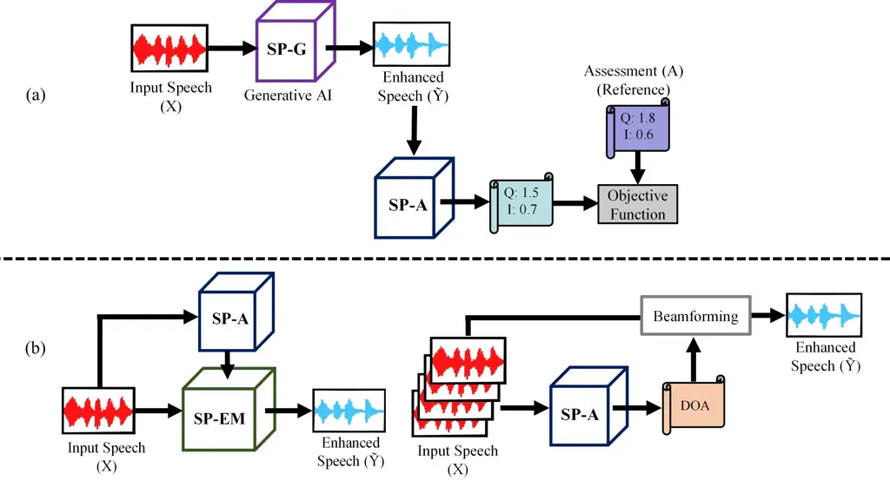

# From Evaluation to Optimization: Neural Speech Assessment for Downstream Applications

Yu Tsao  
Research Center for Information Technology Innovation    Academia Sinica
   Taipei    Taiwan  
E-mail: yu.tsao@citi.sinica.edu.tw

###### Abstract

The evaluation of synthetic and processed speech has long been a
cornerstone of audio engineering and speech science. Although subjective
listening tests remain the gold standard for assessing perceptual
quality and intelligibility, their high cost, time requirements, and
limited scalability present significant challenges in the rapid
development cycles of modern speech technologies. Traditional objective
metrics, while computationally efficient, often rely on a clean
reference signal, making them intrusive approaches. This presents a
major limitation, as clean signals are often unavailable in real-world
applications. In recent years, numerous neural network–based speech
assessment models have been developed to predict quality and
intelligibility, achieving promising results. Beyond their role in
evaluation, these models are increasingly integrated into downstream
speech processing tasks. This review focuses on their role in two main
areas: (1) serving as differentiable perceptual proxies that not only
assess but also guide the optimization of speech enhancement and
synthesis models; and (2) enabling the detection of salient speech
characteristics to support more precise and efficient downstream
processing. Finally, we discuss current limitations and outline future
research directions to further advance the integration of speech
assessment into speech processing pipelines.

## 1 Introduction

The development of advanced speech processing systems, ranging from
enhancement and dereverberation to synthesis and conversion, has long
been driven by the goal of improving speech quality and intelligibility
for human listeners. Yet, progress toward this objective has been
hindered by a persistent disconnect between the metrics used for
algorithmic optimization and the complex, nuanced nature of human
auditory perception. This perceptual gap stems from the limitations of
traditional evaluation and optimization paradigms, which either depend
on computationally convenient yet perceptually misaligned mathematical
measures or on human-centered subjective tests that, while accurate, are
costly, time-consuming, and difficult to scale. Recognizing this gap is
critical to understanding the transformative role of modern neural
speech assessment methodologies \[1\].

Neural speech assessment models have recently emerged as a prominent
research focus and are increasingly integrated into a wide range of
speech processing tasks. In speech enhancement, notable examples include
DNSMOS \[2\], MOSA-Net \[3\], PESQ-DNN \[4\], SpeechBERTScore \[5\],
VQScore \[6\], Quality-Net \[7\], STOI-Net \[8\], and
SpeechLMScore \[9\].

For voice conversion and text-to-speech (TTS) systems, widely adopted
speech assessment models, such as MOSNet \[10\], MBNet \[11\],
NORESQA \[12\], NORESQA-MOS \[13\], LDNet \[14\], SSL-MOS \[15\],
UTMOS \[16\], SOMOS \[17\], LE-SSL-MOS \[18\], and TTSDS2 \[19\], have
demonstrated effectiveness in numerous benchmark evaluations \[20, 21,
22\] and have been employed as evaluation metrics in various speech
processing challenges \[23, 24\].

More recently, multimodal neural speech assessment approaches have been
proposed, incorporating additional information such as contextual
cues \[25\] and visual signals \[26\] to improve accuracy and alignment
with human perception. In parallel, emerging research has investigated
the use of alternative biomarkers, such as physiological or cognitive
indicators, as objective measures for predicting speech quality and
listening effort \[27, 28\].

Beyond their role as evaluation tools, neural speech assessment models
have been shown to enhance the performance of speech processing
pipelines \[29, 30, 31, 32, 33, 34, 35, 36, 37, 38, 39\]. This review
focuses on their application in downstream speech processing tasks,
which can be broadly classified into two categories, as illustrated in
Fig. 1:

\(1\) Perceptually aligned and differentiable metrics – models that not
only evaluate but also guide the training of speech enhancement and
synthesis systems \[29, 36, 40\].

\(2\) Speech property identification – models that detect key speech
characteristics, enabling more targeted and effective downstream
processing \[23, 34, 41, 42\].

Figure 1: Neural speech assessment supports two major downstream
applications: (1) serving as a differentiable perceptual proxy to guide
the optimization of speech generation models, and (2) enabling the
detection of key speech characteristics for more precise and efficient
downstream processing. Left: model selection in an ensemble framework;
Right: DOA estimation for beamforming. SP-G: speech generation model;
SP-A: speech assessment model; SP-EM: speech generation using an
ensemble system.

For the first category, traditional signal-level loss functions, such as
mean squared error (MSE) and mean absolute error (MAE), are
computationally efficient and differentiable, making them suitable for
training speech synthesis models. However, these measures correlate
suboptimally with human perception and often produce over-smoothed,
unnatural outputs. Subjective listening tests, such as MOS, provide the
most accurate perceptual evaluation but are costly, time-consuming, and
prone to biases, with limited discriminative power for top-performing
systems.

Objective metrics like perceptual evaluation of speech quality
(PESQ) \[43\] and perceptual objective listening quality assessment
(POLQA)  \[44\], better approximate perception than MSE and MAE, yet
they struggle with non-differentiable, preventing their direct use as
training objectives. In addition, these metrics are intrusive, meaning
they require a reference signal for comparison when assessing the target
speech.

These limitations have driven the development of neural speech
assessment models: non-intrusive, differentiable, and data-driven
perceptual proxies trained to approximate human judgments or established
metrics. Importantly, these models can be integrated into training
pipelines as perceptually aligned loss functions, enabling direct
optimization toward human-perceived quality. Frameworks such as
MetricGAN \[29\] and its extensions \[32, 45, 46, 47, 48, 49, 50, 51\]
exemplify this paradigm shift, turning evaluation from a passive,
post-hoc process into an active, perception-driven component of model
learning.

More recently, neural assessment–driven optimization has emerged not as
a mere incremental enhancement to existing tasks, but as a foundational
technology that enables entirely new capabilities and addresses
long-standing challenges in speech processing. By extending the concept
of a learned perceptual loss function, researchers have expanded the
boundaries of what is possible—enabling fully unsupervised learning from
real-world data, direct optimization for subjective human preferences,
and intelligent, perception-aware control of complex audio systems.

For the second category, neural speech assessment models can effectively
characterize the properties of speech signals, enabling tasks such as
filtering out low-quality speech \[23\] or selecting the most suitable
speech processing model for a given input. In \[41, 42\], a speech
enhancement framework was proposed that employs an ensemble of
specialized models, guided by Quality-Net—a pre-trained, non-intrusive
neural network that predicts PESQ scores without requiring a clean
reference. This ensemble-based strategy has demonstrated superior
generalization performance compared to a single, general-purpose model.

Finally, neural speech assessment can be integrated with traditional
acoustic beamforming systems to further enhance performance. Accurate
direction-of-arrival (DOA) estimation is critical in beamforming but
remains challenging, particularly under very low signal-to-interference
ratio (SIR) conditions. In \[34\], STOI-Net, a non-intrusive neural
speech assessment model that predicts short-time objective
intelligibility (STOI) \[52\] scores, is used to estimate the DOA by
evaluating predicted scores for speech signals from a set of candidate
angles. The angle yielding the highest STOI score is selected as the
target DOA, after which a beamforming algorithm is applied to focus on
that direction and extract the target speech.

## 2 Neural Speech Assessment Models as Differentiable Perceptual Proxies

Neural speech assessment models are learning to ‘listen’ and to
‘evaluate’ speech in alignment with human judgment, and, being fully
differentiable, can be seamlessly integrated into model training
pipelines.

### 2.1 The Surrogate Concept: Differentiable Mirrors of Black-Box Metrics

The core concept is to train a neural network to approximate a complex,
non-differentiable function. Once trained, this network—serving as a
“surrogate”—can replace the original function as a differentiable loss.
A notable example is Quality-Net \[7\], a Bidirectional Long Short-Term
Memory (BLSTM) model, designed as a differentiable proxy for the PESQ
metric. Quality-Net takes the spectrograms of a degraded signal and its
clean reference as input, and is trained to predict the PESQ score that
the original algorithm would produce. By learning this mapping, it
transforms the ‘black-box’ PESQ function into a ‘white-box’ that
provides usable gradients for backpropagation, enabling a speech
enhancement model to be fine-tuned to directly maximize its predicted
PESQ score.

### 2.2 Advancing the Paradigm: From Intrusive Metrics to Human Judgments

While creating surrogates for intrusive metrics like PESQ was a
significant breakthrough, the need for a clean reference signal remained
a key limitation. The next stage of advancement focused on developing
models capable of operating non-intrusively and, ultimately, on training
models directly from human subjective ratings—bypassing traditional
objective metrics altogether.

- •
  Non-Intrusive Proxies: Models such as Quality-Net \[7\] and
  STOI-Net \[8\] were designed to predict metric scores using only the
  degraded signal. Quality-Net estimates PESQ scores, while STOI-Net
  predicts STOI scores, each by implicitly learning the acoustic
  characteristics critical to speech quality and intelligibility,
  respectively. Such non-intrusive assessment is essential for
  real-world, real-time applications where a clean reference signal is
  unavailable.
- •
  Learning Directly from Humans: The most advanced neural assessors are
  trained on large-scale datasets of human-rated speech. For example,
  DNSMOS \[2\] is trained on extensive collections of noisy clips, each
  annotated by human listeners with MOS ratings for signal quality,
  background noise, and overall quality. Similarly, MaskQSS \[36\] is a
  specialized model designed to predict the MOS of speech distorted by
  face masks, trained on a custom database of human-rated, mask-recorded
  speech. This human-in-the-loop approach enables models to learn a
  direct mapping from acoustic features to human preference, capturing
  perceptual subtleties overlooked by traditional metrics and
  facilitating the development of highly specialized assessors for
  specific application domains.

### 2.3 From Assessor to Optimizer: The MetricGAN Framework

The true strength of differentiable neural assessment lies in its
ability to be integrated into the training process as an active,
adaptive loss function. The MetricGAN framework exemplifies this
paradigm, repurposing a Generative Adversarial Network (GAN) \[53\]
architecture to directly optimize for any black-box evaluation metric.

The MetricGAN framework consists of two parts:

- •
  Generator (G): The speech enhancement model being optimized.
- •
  Discriminator (D): A neural speech assessment model that serves as a
  surrogate for the target metric (e.g., PESQ). Rather than classifying
  real vs. fake, it is trained to predict the score that the target
  metric would assign to a given speech sample.

The training follows a minimax game in which the discriminator learns to
become an increasingly accurate predictor of the target metric for the
specific types of speech produced by the generator. In turn, the
generator receives gradients from the discriminator, guiding it to
produce outputs that maximize the predicted score. The discriminator
thus serves as a learned, adaptive loss function, continuously refining
its understanding of the quality landscape based on the generator’s
evolving artifacts. This provides a more robust and contextually
relevant training signal than a static, pre-trained model.

The MetricGAN+ \[45\] framework introduced several engineering
enhancements to stabilize training and improve performance. These
include training the discriminator on the original noisy speech (in
addition to clean and enhanced speech) to provide stronger reference
anchors, employing an experience replay buffer to prevent catastrophic
forgetting, and integrating a learnable, per-frequency sigmoid
activation in the generator for more flexible noise suppression.
Together, these improvements yielded significant performance gains,
underscoring the strong relationship between the quality of the learned
loss function and the resulting perceptual quality of the output.

### 2.4 The Unsupervised Revolution with MetricGAN-U

A major bottleneck in supervised speech enhancement is the reliance on
large, parallel corpora of noisy and clean speech, which are costly to
produce. The MetricGAN-U (Unsupervised) framework \[32\] removes this
constraint by combining the MetricGAN architecture with a non-intrusive
neural assessment model, such as DNSMOS (for quality) or SRMR (for
dereverberation). By training the discriminator to predict the score of
a non-intrusive metric, the entire system can be optimized using only
noisy speech. This represents a transformative shift, enabling the
training of high-quality enhancement models on vast amounts of
authentic, in-the-wild data, thereby improving real-world robustness and
performance.

### 2.5 Direct Optimization of Human Preference

The ultimate goal is to optimize a system directly for subjective human
preference. The human-in-the-loop paradigm achieves this by using a
neural assessor trained on subjective data as the optimization target.
The HL-StarGAN system \[36\] for enhancing face-masked speech
illustrates this approach. Researchers first developed the MaskQSS
assessor by collecting a database of face-masked speech and obtaining
MOS ratings from human listeners. MaskQSS was trained to predict these
MOS scores, and the enhancement model (generator) was then trained with
a loss function that encouraged outputs predicted to achieve the highest
possible MaskQSS score. After several iterations, we obtain the final
HLStarGAN model. This two-stage training process creates a direct
optimization pipeline that integrates the target subjective experience
into the speech generation model, guided by the neural assessor.

## 3 Neural Speech Assessment as a Decision Engine

### 3.1 Optimal Model Selection in an Ensemble System

In  \[41\] and  \[42\], two novel speech enhancement systems were
introduced that leverage neural speech assessment models as intelligent
model selection frameworks to improve generalization, particularly in
unseen conditions. Both approaches use Quality-Net to identify the
optimal enhancement model for a given noisy utterance.

In  \[41\], the Specialized Speech Enhancement Model Selection (SSEMS)
approach was proposed, in which specialized models are trained on data
grouped by predefined attributes such as speaker gender and
signal-to-noise ratio (SNR). During inference, all specialized models
process the noisy input, and Quality-Net selects the output with the
highest predicted quality.

In  \[42\], the more advanced Zero-Shot Model Selection (ZMOS) framework
was proposed. This data-driven approach applies zero-shot learning
principles, using Quality-Net both to cluster training data via its
latent “quality embeddings” and to perform model selection. This enables
the system to choose the most suitable model for a given input without
running all models, thereby improving efficiency.

Together, these works establish a powerful paradigm for adaptive speech
enhancement, demonstrating that a learned, non-intrusive quality metric
can serve as an effective runtime selection criterion, leading to
significantly more robust performance across diverse noise conditions.

### 3.2 Intelligibility-Aware Beamforming System

Beamforming frameworks typically rely on accurate estimation of the DOA,
yet obtaining a reliable DOA is challenging, particularly under very low
SIR conditions. In  \[34\], the Intelligibility-Aware Null-Steering
(IANS) framework was proposed to address this challenge by optimally
determining the DOA and enhancing speech intelligibility through
beamforming.

IANS operates in two stages. First, a Null-Steering Beamformer (NSBF)
generates multiple candidate signals by steering a suppression null
across different angles. Second, a pre-trained deep learning model,
STOI-Net, predicts the intelligibility of each candidate, and the system
selects the signal with the highest predicted score—shifting the focus
from conventional spatial filtering to direct intelligibility
optimization.

Experimental results show that IANS significantly improves both
intelligibility (STOI) and perceptual quality (PESQ) for noise-corrupted
speech, achieving performance comparable to traditional beamformers with
access to the true DOA of speech and noise. Moreover, IANS exhibits
cross-lingual robustness, performing effectively on both English and
Mandarin datasets without retraining STOI-Net. These results highlight
direct intelligibility optimization as a powerful, language-independent
alternative to conventional beamforming.

## 4 Conclusion

Neural speech assessment has transformed audio processing by bridging
the gap between computational metrics and human perception. By serving
as differentiable surrogates for complex objective measures and
subjective judgments, models such as MetricGAN have enabled direct
optimization for perceptual quality, achieving substantial gains over
traditional approaches. These methods are now impacting a range of
domains, including speech enhancement, text-to-speech, and voice
conversion.

Despite this progress, key challenges remain. Generalization and
calibration are major concerns, as models trained on subjective MOS data
often underperform when applied to unseen conditions or systems.
Multi-metric optimization is another frontier—future assessors must
jointly account for multiple perceptual dimensions such as clarity,
naturalness, and intelligibility, potentially through multiple
discriminators or multi-objective training schemes. Interpretability and
diagnostics are also pressing needs, allowing developers to understand
why a model assigns certain quality scores and to obtain actionable
feedback for improvement.

Looking ahead, the ultimate goal is personalization, where neural
assessment models adapt to individual listener preferences and hearing
profiles. Such systems could optimize output in real time for specific
users, enabling hearing aids, communication platforms, and media
services to deliver perceptually ideal audio. This shift from passive
evaluation to active, user-specific optimization represents a pivotal
step for next-generation audio technologies.

## References

- \[1\] E. Cooper, W.-C. Huang, Y. Tsao, H.-M. Wang, T. Toda, and
  J. Yamagishi, “A review on subjective and objective evaluation of
  synthetic speech,” _Acoustical Science and Technology_, vol. 45,
  no. 4, pp. 161–183, 2024.
- \[2\] C. K. Reddy, V. Gopal, and R. Cutler, “DNSMOS: A non-intrusive
  perceptual objective speech quality metric to evaluate noise
  suppressors,” in _Proc. ICASSP 2021_.
- \[3\] R. E. Zezario, S.-W. Fu, F. Chen, C.-S. Fuh, H.-M. Wang, and
  Y. Tsao, “Deep learning-based non-intrusive multi-objective speech
  assessment model with cross-domain features,” _IEEE/ACM Transactions
  on Audio, Speech, and Language Processing_, vol. 31, pp. 54–70, 2022.
- \[4\] Z. Xu, Z. Zhao, and T. Fingscheidt, “Coded speech quality
  measurement by a non-intrusive PESQ-DNN,” _IEEE/ACM Transactions on
  Audio, Speech, and Language Processing_, vol. 31, pp. 3404–3417, 2023.
- \[5\] T. Saeki, S. Maiti, S. Takamichi, S. Watanabe, and
  H. Saruwatari, “SpeechBERTScore: Reference-aware automatic evaluation
  of speech generation leveraging NLP evaluation metrics,” in _Proc.
  INTERSPEECH 2024_.
- \[6\] S.-W. Fu, K.-H. Hung, Y. Tsao, and Y.-C. F. Wang,
  “Self-supervised speech quality estimation and enhancement using only
  clean speech,” in _Proc. ICLR 2024_.
- \[7\] S.-W. Fu, Y. Tsao, H.-T. Hwang, and H.-M. Wang, “Quality-Net: An
  end-to-end non-intrusive speech quality assessment model based on
  BLSTM,” in _Proc. INTERSPEECH 2018_.
- \[8\] R. E. Zezario, S.-W. Fu, C.-S. Fuh, Y. Tsao, and H.-M. Wang,
  “STOI-Net: A deep learning based non-intrusive speech intelligibility
  assessment model,” in _Proc. APSIPA ASC 2020_.
- \[9\] S. Maiti, Y. Peng, T. Saeki, and S. Watanabe, “SpeechLMScore:
  Evaluating speech generation using speech language model,” in _Proc.
  ICASSP 2023_.
- \[10\] C.-C. Lo, S.-W. Fu, W.-C. Huang, X. Wang, J. Yamagishi,
  Y. Tsao, and H.-M. Wang, “MOSNet: Deep learning based objective
  assessment for voice conversion,” in _Proc. INTERSPEECH 2019_.
- \[11\] Y. Leng, X. Tan, S. Zhao, F. Soong, X.-Y. Li, and T. Qin,
  “MBNet: MOS prediction for synthesized speech with mean-bias network,”
  in _Proc. ICASSP 2021_.
- \[12\] P. Manocha, B. Xu, and A. Kumar, “NORESQA: A framework for
  speech quality assessment using non-matching references,” in _Proc.
  NeurIPS 2021_.
- \[13\] P. Manocha and A. Kumar, “Speech quality assessment through MOS
  using non-matching references,” in _Proc. INTERSPEECH 2022_.
- \[14\] W.-C. Huang, E. Cooper, J. Yamagishi, and T. Toda, “LDNet:
  Unified listener dependent modeling in MOS prediction for synthetic
  speech,” in _Proc. ICASSP 2022_.
- \[15\] E. Cooper, W.-C. Huang, T. Toda, and J. Yamagishi,
  “Generalization ability of MOS prediction networks,” in _Proc. ICASSP
  2022_.
- \[16\] T. Saeki, D. Xin, W. Nakata, T. Koriyama, S. Takamichi, and
  H. Saruwatari, “UTMOS: Utokyo-SaruLab system for VoiceMOS Challenge
  2022,” in _Proc. INTERSPEECH 2022_.
- \[17\] G. Maniati, A. Vioni, N. Ellinas, K. Nikitaras, K. Klapsas,
  J. S. Sung, G. Jho, A. Chalamandaris, and P. Tsiakoulis, “SOMOS: The
  samsung open MOS dataset for the evaluation of neural text-to-speech
  synthesis,” in _Proc. INTERSPEECH 2022_.
- \[18\] Z. Qi, X. Hu, W. Zhou, S. Li, H. Wu, J. Lu, and X. Xu,
  “LE-SSL-MOS: Self-supervised learning MOS prediction with listener
  enhancement,” in _Proc. ASRU 2023_.
- \[19\] C. Minixhofer, O. Klejch, and P. Bell, “TTSDS2: Resources and
  benchmark for evaluating human-quality text to speech systems,” _arXiv
  preprint arXiv:2506.19441_, 2025.
- \[20\] W.-C. Huang, E. Cooper, Y. Tsao, H.-M. Wang, T. Toda, and
  J. Yamagishi, “The VoiceMOS Challenge 2022,” in _Proc. INTERSPEECH
  2022_.
- \[21\] E. Cooper, W.-C. Huang, Y. Tsao, H.-M. Wang, T. Toda, and
  J. Yamagishi, “The VoiceMOS Challenge 2023: Zero-shot subjective
  speech quality prediction for multiple domains,” in _Proc. ASRU 2023_.
- \[22\] W.-C. Huang, S.-W. Fu, E. Cooper, R. E. Zezario, T. Toda, H.-M.
  Wang, J. Yamagishi, and Y. Tsao, “The VoiceMOS Challenge 2024: Beyond
  speech quality prediction,” in _Proc. SLT 2024_.
- \[23\] W. Zhang, R. Scheibler, K. Saijo, S. Cornell, C. Li, Z. Ni,
  A. Kumar, J. Pirklbauer, M. Sach, S. Watanabe _et al._, “URGENT
  Challenge: Universality, robustness, and generalizability for speech
  enhancement,” in _Proc. INTERSPEECH 2024_.
- \[24\] A. L. A. Blanco, C. Valentini-Botinhao, O. Klejch, M. Gogate,
  K. Dashtipour, A. Hussain, and P. Bell, “AVSE Challenge: Audio-visual
  speech enhancement challenge,” in _Proc. SLT 2023_.
- \[25\] S. Wang, W. Yu, X. Chen, X. Tian, J. Zhang, L. Lu, Y. Tsao,
  J. Yamagishi, Y. Wang, and C. Zhang, “Qualispeech: A speech quality
  assessment dataset with natural language reasoning and descriptions,”
  in _Proc. ACL 2025_.
- \[26\] S. Ahmed, R. E. Zezario, N. Saleem, A. Hussain, H.-M. Wang, and
  Y. Tsao, “A study on speech assessment with visual cues,” in _Proc.
  INTERSPEECH 2025_.
- \[27\] I. H. Parmonangan, “Common brain activity features
  discretization for predicting perceived speech quality,” _Procedia
  Computer Science_, vol. 216, pp. 774–783, 2023.
- \[28\] C.-H. Hsin, C.-Y. Lee, and Y. Tsao, “Exploring N400
  predictability effects during sustained speech comprehension: From
  listening-related fatigue to speech enhancement evaluation,” _Ear and
  Hearing_, vol. 46, no. 4, pp. 922–940, 2025.
- \[29\] S.-W. Fu, C.-F. Liao, Y. Tsao, and S.-D. Lin, “MetricGAN:
  Generative adversarial networks based black-box metric scores
  optimization for speech enhancement,” in _Proc. ICML 2019_.
- \[30\] K. M. Nayem and D. S. Williamson, “Incorporating embedding
  vectors from a human mean-opinion score prediction model for monaural
  speech enhancement.” in _Proc. INTERSPEECH 2021_.
- \[31\] Z. Xu, M. Strake, and T. Fingscheidt, “Deep noise suppression
  with non-intrusive PESQNet supervision enabling the use of real
  training data,” in _Proc. INTERSPEECH 2021_.
- \[32\] S.-W. Fu, C. Yu, K.-H. Hung, M. Ravanelli, and Y. Tsao,
  “MetricGAN-U: Unsupervised speech enhancement/dereverberation based
  only on noisy/reverberated speech,” in _Proc. ICASSP 2022_.
- \[33\] Z. Xu, M. Strake, and T. Fingscheidt, “Deep noise suppression
  maximizing non-differentiable pesq mediated by a non-intrusive
  PESQNet,” _IEEE/ACM Transactions on Audio, Speech, and Language
  Processing_, vol. 30, pp. 1572–1585, 2022.
- \[34\] W.-Y. Ting, S.-S. Wang, Y. Tsao, and B. Su, “IANS:
  Intelligibility-aware null-steering beamforming for dual-microphone
  arrays,” in _Proc. MLSP 2023_.
- \[35\] K. M. Nayem and D. S. Williamson, “Attention-based speech
  enhancement using human quality perception modeling,” _IEEE/ACM
  Transactions on Audio, Speech, and Language Processing_, vol. 32, pp.
  250–260, 2023.
- \[36\] S.-S. Wang, J.-Y. Chen, B.-R. Bai, S.-H. Fang, and Y. Tsao,
  “Unsupervised face-mask speech enhancement using generative
  adversarial networks with human-in-the-loop assessment metrics,”
  _IEEE/ACM Transactions on Audio, Speech, and Language Processing_,
  vol. 32, pp. 3826–3837, 2024.
- \[37\] R. Chao, W.-H. Cheng, M. La Quatra, S. M. Siniscalchi, C.-H. H.
  Yang, S.-W. Fu, and Y. Tsao, “An investigation of incorporating Mamba
  for speech enhancement,” in _Proc. SLT 2024_.
- \[38\] H. Wu, A. Aroudi, B. Xu, A. Pandey, F. Nesta, A. Kumar,
  A. Reich, and K. Tan, “Reexamining the efficacy of MetricGAN for
  speech enhancement,” in _Proc. ICASSP 2025_.
- \[39\] Y.-X. Lu, Y. Ai, and Z.-H. Ling, “Explicit estimation of
  magnitude and phase spectra in parallel for high-quality speech
  enhancement,” _Neural Networks_, p. 107562, 2025.
- \[40\] W. Jiang, F. Wen, and K. Yu, “MOS-GAN: Mean opinion score GAN
  for unsupervised speech enhancement,” _IEEE Signal Processing
  Letters_, 2025.
- \[41\] R. E. Zezario, S.-W. Fu, X. Lu, H.-M. Wang, Y. Tsao _et al._,
  “Specialized speech enhancement model selection based on learned
  non-intrusive quality assessment metric.” in _Proc. INTERSPEECH 2019_.
- \[42\] R. E. Zezario, C.-S. Fuh, H.-M. Wang, and Y. Tsao, “Speech
  enhancement with zero-shot model selection,” in _Proc. EUSIPCO 2021_.
- \[43\] A. W. Rix, J. G. Beerends, M. P. Hollier, and A. P. Hekstra,
  “Perceptual evaluation of speech quality (PESQ)-a new method for
  speech quality assessment of telephone networks and codecs,” in _Proc.
  ICASSP 2001_.
- \[44\] Y. Gaoxiong and Z. Wei, “The perceptual objective listening
  quality assessment algorithm in telecommunication: Introduction of
  ITU-T new metrics POLQA,” in _Proc. ICCC 2012_.
- \[45\] S.-W. Fu, C. Yu, T.-A. Hsieh, P. Plantinga, M. Ravanelli,
  X. Lu, and Y. Tsao, “MetricGAN+: An improved version of MetricGAN for
  speech enhancement,” in _Proc. INTERSPEECH 2021_.
- \[46\] R. Cao, S. Abdulatif, and B. Yang, “CMGAN: Conformer-based
  Metric-GAN for speech enhancement,” _Proc. INTERSPEECH 2022_.
- \[47\] G. Close, T. Hain, and S. Goetze, “MetricGAN+/-: Increasing
  robustness of noise reduction on unseen data,” in _Proc. EUSIPCO
  2022_.
- \[48\] J. Cheng, R. Liang, L. Zhao, C. Huang, and B. W. Schuller,
  “Speech denoising and compensation for hearing aids using an
  FTCRN-based metric GAN,” _IEEE Signal Processing Letters_, vol. 30,
  pp. 374–378, 2023.
- \[49\] W. Shin, B. H. Lee, J. S. Kim, H. J. Park, and S. W. Han,
  “MetricGAN-OKD: multi-metric optimization of MetricGAN via online
  knowledge distillation for speech enhancement,” in _Proc. ICML 2023_.
- \[50\] Z. Hou, Q. Hu, T. Sun, Y. Hu, C. Zhu, and K. Chen,
  “Convolutional recurrent MetricGAN with spectral dimension compression
  for full-band speech enhancement,” in _Proc. ICASSP 2023_.
- \[51\] Y. Mai and S. Goetze, “MetricGAN+KAN: Kolmogorov-Arnold
  networks in metric-driven speech enhancement systems,” in _Proc.
  ICASSP 2025_.
- \[52\] C. H. Taal, R. C. Hendriks, R. Heusdens, and J. Jensen, “An
  algorithm for intelligibility prediction of time–frequency weighted
  noisy speech,” _IEEE Transactions on Audio, Speech, and Language
  Processing_, vol. 19, no. 7, pp. 2125–2136, 2011.
- \[53\] I. Goodfellow, J. Pouget-Abadie, M. Mirza, B. Xu,
  D. Warde-Farley, S. Ozair, A. Courville, and Y. Bengio, “Generative
  adversarial networks,” _Communications of the ACM_, vol. 63, no. 11,
  pp. 139–144, 2020.
