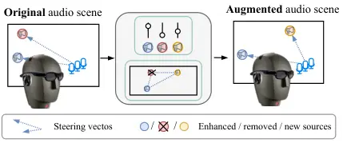
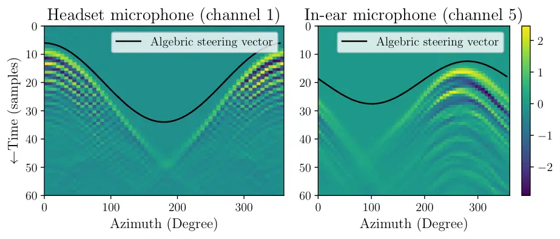
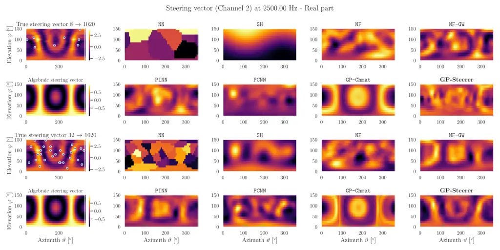
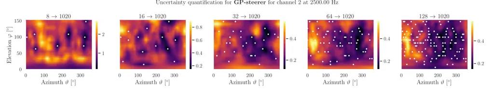

# Gaussian Process Regression of Steering Vectors With Physics-Aware Deep Composite Kernels for Augmented ListeningThanks:  Manuscript received xxx yyy, 2025; revised xxx yyy, 2026; accepted xxx yyy, 2026. Date of publication xxx yyy, 2026; date of current version xxx yyy, 2026. This study was supported by JST FOREST No. JPMJFR2270, JSPS KAKENHI Nos. JP23K16912, JP23K16913, JP24H00742, and 24H00748. ANR Project SAROUMANE (ANR-22-CE23-0011), and Hi! Paris Project MASTER-AI. The associate editor coordinating the review of this manuscript and approving it for publication was Prof. XXXX. (Corresponding author: Diego Di Carlo). Thanks:  Diego Di Carlo, Aditya Arie Nugraha, Yoshiaki Bando are with the Center for Advanced Intelligence Project (AIP), RIKEN, Tokyo 103-0027, Japan (e-mail: diego.dicarlo@riken.jp). Shoichi Koyama is with National Institute of Informatics, Tokyo, Japan. Mathieu Fontaine is with LTCI, Télécom Paris, Institut Polytechnique de Paris, France. Kazuyoshi Yoshii is with the Graduate School of Engineering, Kyoto University, Kyoto 615-8510, Japan, and also with the AIP, RIKEN, Japan. The experimental code will be shared upon acceptance. This work has been submitted to the IEEE for possible publication. Copyright may be transferred without notice, after which this version may no longer be accessible.

Diego Di Carlo    Shoichi Koyama    Aditya Arie Nugraha
Affiliation: Mathieu Fontaine,  Yoshiaki Bando,  Kazuyoshi Yoshii, 

###### Abstract

This paper investigates continuous representations of steering vectors
over frequency and microphone/source positions for augmented listening
(e.g., spatial filtering and binaural rendering), enabling
user-parameterized control of the reproduced sound field. Steering
vectors have typically been used for representing the spatial response
of a microphone array as a function of the look-up direction. The basic
algebraic representation of these quantities assuming an idealized
environment cannot deal with the scattering effect of the sound field.
One may thus collect a discrete set of real steering vectors measured in
dedicated facilities and super-resolve (i.e., upsample) them. Recently,
physics-aware deep learning methods have been effectively used for this
purpose. Such deterministic super-resolution, however, suffers from the
overfitting problem due to the non-uniform uncertainty over the
measurement space. To solve this problem, we integrate an expressive
representation based on the neural field (NF) into the principled
probabilistic framework based on the Gaussian process (GP).
Specifically, we propose a physics-aware composite kernel that models
the directional incoming waves and the subsequent scattering effect. Our
comprehensive comparative experiment showed the effectiveness of the
proposed method under data insufficiency conditions. In downstream tasks
such as speech enhancement and binaural rendering using the simulated
data of the SPEAR challenge, the oracle performances were attained with
less than ten times fewer measurements.

###### Index Terms: 

Augmented listening, head-related transfer function (HRTF), Gaussian
process, physics-informed neural networks (PINN), spatial audio, array
manifold.

## I Introduction



Fig. 1: A typical remixing workflow for augmented listening. The
acoustic scene is first analyzed (e.g., DOA estimation and separation)
and then spatially remixed before rendering. While semantic content can
be modified, spatial information (e.g., steering vectors shown as
arrows) must remain coherent to convey realism.

Augmented listening (AL) \[1\] refers to modifying the user’s perceived
sounds in real time for a better auditory experience. It aims to equally
help both normal-hearing and hearing-impaired people to hear better what
they attend to in real noisy echoic situations. As depicted in Fig. 1,
for example, personalized sound zones can be produced by manipulating
the sound field according to the individual preference \[2\].

Behind such real-time applications, both audio analysis (e.g.,
localization and separation) and synthesis (e.g., reproduction) have
actively been studied at the intersection of acoustics, signal
processing, and machine learning (ML) \[3\]. Acoustics offers a solid
mathematical representation of sound as a field, i.e., a continuous
function over space and time, and a central goal is to reconstruct this
quantity at unobserved locations from finite measurements \[4\]. In
signal processing, sound is typically assumed to be generated from a
specific source and modified by a filter representing the sound
propagation (e.g., in room acoustics and reverberation) and spatial
information (e.g., source location and array geometry).

Since estimating sources and propagation filters from microphone
observations is ill-posed, recent work combines classical array
processing with data-driven (deep) learning for joint analysis and
synthesis \[3, 5\]. However, many state-of-the-art (SOTA) methods still
rely on idealized sound-propagation models (e.g., free-field or
simplified room models) to generate training data or design inductive
bias.

In the speech enhancement for augmented reality (SPEAR) challenge \[6\]
using noisy speech recordings obtained with a head-worn microphone
array, a deep learning-based method ranked first in both the objective
and subjective criteria, while a classic baseline the isotropic minimum
variance distortionless response (MVDR) beamformer \[7\], came second in
subjective assessments. Both methods rely heavily on pre-measured
propagation filters, also known as steering vectors (SV) \[8\],
highlighting their central role in the AL pipeline.



Fig. 2: Comparison between amplitude of measured and algebraic steering
vectors on the azimuthal plane in the time domain, available in the
SPEAR Challenge data.

SVs encode the array response as a function of the direction of the
incoming sound \[8\]. Their estimation has been a key technique in
spatial audio processing such as speech enhancement \[9\], sound source
localization \[10\], and sound scene synthesis \[11\]. Specifically, an
SV comprises the complex, frequency-dependent transfer functions from a
far-field direction to each array microphone. Under this definition, SVs
may include both the listener’s head-related transfer functions (HRTFs)
as well as multichannel room impulse responses \[9\]. Their estimation
can be viewed as a structured instance of sound-field estimation in
which the field is parameterized by direction. The objective of this
paper is to learn a continuous (HRTF-like) SV model over direction (and
frequency) from sparse measurements using head-worn microphones where
dense acquisition is time-consuming, enabling beamforming and rendering
for augmented listening.

While continuous HRTF representations have been studied extensively
(e.g., spherical-harmonic/subspace-based interpolation), The continuous
nature of SVs naturally calls for the use of a neural field (NF), a
deterministic nonlinear function over a continuous domain, parametrized
by a deep neural network (DNN) \[12\]. In general, a NF is trained from
a limited number of SVs measured at sampling points (on a grid) over
space and frequency, achieving resolution-free SV upsampling
(interpolation). This approach, however, can neither deal with
uncertainty originating from the noisy, sparse SV measurements over the
continuous domain nor guarantee the fidelity at measurement points.
Physics can only be weakly incorporated into supervised learning, either
through additional losses for regularization (physics-informed approach)
or parametrization of the function (physics-constrained approach) \[4\].

To overcome these limitations, in this paper we propose a statistically
principled method for SV upsampling based on the Gaussian process
regression (GPR) with NF-based deep kernel learning (DKL). To compute
the covariance between any pair of SVs over space and frequency, we
define a physics-aware composite kernel as the product of multiple
NF-based kernels corresponding to the directional propagation and the
subsequent scattering. This kernel is used for formulating a prior GP in
the noiseless SV space strictly obeying the physical laws. Given noisy
SV measurements at sparse sampling points, we optimize the kernel
parameters, i.e., NFs and noise variance, such that the likelihood is
maximized. We then compute a predictive GP that gives the distributional
estimates of noiseless SVs at arbitrary points including the measurement
points.

At the heart of this work is a marriage of physics (deduction) and
statistics (induction) in the DKL-GPR framework for resolution-free SV
upsampling. A key advantage of our method is to deal with the
uncertainty about the SV function over space and frequency, i.e.,
consider all possible SV functions, in both the DKL and GPR, achieving
robust and interpretable prediction of noiseless SVs from noisy sparse
measurements. Another significant contribution of this work is
demonstrating our algorithm’s practical utility within an AL pipeline.
Specifically, we show that upsampling the SVs increases the spatial
selectivity of an MVDR beamformer, thereby yielding improved speech
enhancement performance.

## II Related Work

Steering vector (SV) maps frequency and look direction to the complex
propagation gains received by a microphone array \[8\]. Under free-field
conditions, it admits a closed-form geometric expression, whereas in
realistic environments, room propagation, scattering and microphone
directivity must be incorporated \[13\]. Fig. 2 depicts the difference
between algebraic and measured SVs for several directions on the
azimuthal plane in the presence of a human head as scattering object.

SVs can be numerically simulated based on acoustics using
general-purpose acoustic simulators starting from the geometry and
acoustics properties of the scattering objects \[14\]. Nevertheless,
real-world complexity limits their accuracy, motivating data-driven
estimation method \[15\] and blind separation methods \[9, 16\], albeit
still challenged by robustness issues.

Alternatively, one may directly measure SVs under target conditions.
However, for ad-hoc devices and personalized configurations, such
measurements are often available only at a sparse set of spatial
locations due to acquisition time and cost \[17\]. Spatial upsampling
has thus been studied for improving the spatial resolution of SVs,
especially for field reconstruction (SFR) \[4\] and virtual auditory
display with HRTFs \[18\].

### II-A Sound Field Reconstruction

Sound-field reconstruction (SFR) aims to infer the acoustic field, a
continuous function over space and time, at locations where no
measurements are available, using observations acquired by a set of
microphones. The target field has been expressed with expansions of
plane wave \[19, 20, 21, 22\], spherical harmonics (SH) \[23\],
acoustics modes \[24\], or equivalent sources \[25\]. These functions
are used for regularized linear regression \[23, 22\] or kernel ridge
regression \[20\]. Besides their theoretical guarantees, these methods
have several limitations. First, some expansions, e.g., SH on the unit
sphere, and Bessel functions on a bounded domain, rely on orthogonal
expansion, whose truncation order relates to the number of available
observations. Second, these models typically focus on reconstructing
relatively small zones featuring several microphones, which in our
survey of representative works (\[19, 20, 21, 22, 23, 24, 25\]), are
rarely composed of fewer than 5 microphones, with the best performance
typically achieved when using more than 16.

Deep learning (DL) has recently been a key technique for SFR. For
example, UNet-like architectures were used to estimate the low
frequencies of the sound field (up to $`300\text{\,}\mathrm{Hz}`$) \[26,
27\]. Generative models such as generative adversarial networks
(GANs) \[28\], deep image priors \[29\], diffusion models \[30\], and
neural processes \[31\], have been proven to be effective for SFR.
Specifically, the GAN-based method \[28\] reports benefits in
reconstructing higher-frequency components (up to
4 $`\mathrm{k}\mathrm{H}\mathrm{z}`$). The pure data-driven nature of
these methods, however, can suffer from the discrepancy between training
and test acoustic conditions. While acoustic simulation can support data
augmentation \[32\], their intrinsic accuracy-speed trade-off limits the
realism and diversity of generated conditions, leaving unseen real-world
acoustics uncovered.

To address this issue, physics-driven ML methods have been proposed. In
general, physics is incorporated as an inductive bias for ensuring
output structure, overcoming data scarcity, and reducing the opaqueness
of deep models. Physics-driven ML can be further categorized into
physics-informed \[33, 34, 35, 20\] and physics-constrained
approaches \[28, 36, 37, 38, 39\]. The former, known as physics-informed
neural networks (PINNs), directly represent a target field parametrized
by a DNN and optimize it with a multi-objective loss including a
regularization term evaluating the residual for a PDE. Such DNNs are
hard to train in practice due to multiple loss terms \[40\]. Besides,
the deviation of physics only minimized, meaning that physical
properties are not guaranteed at output. Instead, physics-constrained
approaches estimate expansion coefficients for known basis functions
with DNNs \[37, 28, 39\] or Bayesian models \[38, 36\], demonstrating
superiority over traditional methods for interior SFR at low frequencies
with several microphones.

This study extends the physics-driven ML approach for reconstructing an
exterior acoustic field surrounding a human head using only six
microphones, up to speech-relevant frequencies (up to
$`8\text{\,}\mathrm{kHz}`$). Note that most existing models are
deterministic and lack uncertainty quantification. This has recently
been addressed using the GPR \[41\] for sound field
reconstruction \[19\]. We use the GPR in combination of NF-based DKL for
SV upsampling.

|                  |                                  |                                  |                                |                                    |
| ---------------- | -------------------------------- | -------------------------------- | ------------------------------ | ---------------------------------- |
|                  |                                  |                                  | HRTF upsampling                | Sound Field Reconstr.              |
| Recent reviews   |                                  |                                  | \[18, 42, 3\]                  | \[4, 3\]                           |
|                  |                                  |                                  |                                |                                    |
| Data-driven      | (Local) weighted interpolation   |                                  | \[18\]                         | $`\sim`$                           |
|                  | (Global) Subspace methods        |                                  | \[43\]                         | $`\sim`$                           |
|                  | Deep learning                    |                                  | \[44, 45, 46\]                 | \[26, 27, 29, 30\]                 |
|                  | $`\ldots`$ with Gaussian Process |                                  | \[47\]                         | \[31\]                             |
|                  | $`\ldots`$ with multimodalies    |                                  | \[48\]                         | $`\sim`$                           |
|                  | $`\ldots`$ with Neural Fields    |                                  | \[45, 49\]                     | $`\sim`$                           |
|                  | Manifold Learning                |                                  | \[50, 51, 52\]                 | $`\sim`$                           |
| Knowledge-driven | Geometric-based                  |                                  | \[53, 54, 55, 56\]             | $`\sim`$                           |
|                  | Parametric (DSP)-based           |                                  | \[57, 58, 59, 60\]             | $`\sim`$                           |
|                  | Physics-based                    | Physics-constrained              | \[61, 62, 56, 63, 64, 65, 66\] | \[21, 22, 67, 19, 20, 23, 24, 25\] |
|                  |                                  | $`\ldots`$ with Deep Learning    | \[37\]                         | \[28, 20, 39\]                     |
|                  |                                  | $`\ldots`$ with Gaussian Process | \[54, 68\]                     | \[19, 36, 38\]                     |
|                  |                                  | Physics-informed                 | \[34\]                         | \[33, 34, 35\]                     |
|                  |                                  |                                  |                                |                                    |

TABLE I: Schematic organization of the selected literature related to
acoustic steering vector upsampling.

### II-B HRTF Upsampling

HRTF upsampling is a special case of SFR featuring the human head and
torso as scattering objects. Application to binaural rendering motivates
two main assumptions. First, the setup corresponds to far-field anechoic
binaural in-ear microphones; second, the focus is usually on
interpolating real log-magnitude coefficients of the filters, rather
than complex-valued spectra \[60\]. In contrast to a recent survey of
HRTF interpolation \[42\] we here describe a complementary taxonomy
focusing on data-driven or knowledge-driven methods.

Classic data-driven methods interpolate local measurements using
extension of linear interpolation methods (e.g., barycentric or natural
neighbor) \[18\]. Subspace methods have been proposed to reduce the
complexity, enabling fast global interpolation \[43\]. These methods
perform well with dense measurements (10–15^(∘) spacing), but become
unreliable with sparser sampling (e.g., 30–40^(∘) spacing) \[46\].

Recently, data-driven models with DL have been investigated for spatial
upsampling \[44, 45, 46\] and extended to other modalities, e.g.,
anthropometric features and images \[48\]. Notably, NF-based methods
enable HRTF upsampling and representation as a function of sound source
directions \[12\]. Such an approach has also been used for auralization
of audio signals \[45\] and unifying HRTFs measured on different spatial
grids \[49\].

Knowledge-driven approaches address HRTF upsampling as a regression
problem whose solutions are constrained or regularized by
physics-inspired models. Classic approaches rely on the geometrical
approximation to compute interpolation coefficients \[53, 54, 55\] or
spherical interpolation \[56\]. Furthermore, DSP-based methods
demonstrate the possibility of smoothly interpolating the parameter
space of filters modeling the HRTF spectrum \[57, 58\] which has been
recently extended to use NFs as backend \[60\].

Finally, physics-driven methods use the Helmholtz equation (or its
parameterized homogeneous solution) to constraint model output \[61, 37,
68\] or regularize a PINN model \[34\]. In HRTF upsampling, most of the
above methods operate in the SH domain, whose expansion coefficients
being typically estimated via regularized least-squares \[61, 62, 56\].
However, reconstruction quality is sensitive to the measurement grid:
while structured grids yield consistent results \[69\], random sparse
sampling significantly degrades performance \[65\]. To address this,
methods leveraging neural networks \[37\], Bayesian inference \[68\],
time-alignment \[70, 65\] or directional equalization  \[64, 66\] have
been proposed.

The studies above have addressed upsampling ego-centric acoustic
measurements at the two ears. In contrast, we investigate the
underexplored case of very sparse measurements using head-mounted
microphones. While interpolation is often applied independently across
frequencies, \[54\] proposed a joint spatial-spectral GPR framework. We
extend this direction by introducing a physically grounded kernel that
incorporates inter-channel dependencies.

### II-C Array Processing

In array processing, the array manifold maps a lookup direction to a
signal space of SVs \[71\]. The correct modeling of this quantity
enables high-resolution direction of arrival (DOA) estimation and source
signal enhancement. The interpolation of array manifold from discrete
measurement was addressed in early studies, but due to suboptimal
performances, it evolves into a calibration problem \[72\]. If the array
geometry is known, SVs can be computed geometrically, then, the
calibration aims to recover unknown complex gain and phase factors to
compensate for the mismatch, typically using maximum-likelihood-based
approaches \[72\]. To the best of our knowledge, no studies address
interpolation of array manifold, nor have they used deep learning models
to model this continuous object.

Finally, some multichannel array processing frameworks for sound source
separations can be used to estimate array responses. Here, sound
propagation impinging on an array is modeled through
frequency-independent spatial covariance matrices (SCMs), whose
principal components may identify with SVs \[73\], which can be
parameterized continuously by the source direction \[16, 74\].
Alternatively, SVs can represent relative transfer functions (RTFs),
describing the ratio between the ATF of two sensors \[9\]. Some works in
sound source localization and separation use manifold learning
techniques to define the continuous locus of RTFs as a function of
source direction or location \[50, 52, 75\].

## III Proposed Method

Fig. 3: Measurement grid and reference system used in this study and
illustration of the steering vector interpolation problem.

In the frequency domain, the homogeneous Helmholtz equation describes
the evolution of the complex acoustic pressure field $`h\in\mathbb{C}`$
as a function of position $`\mathbf{q}\in\mathbb{R}^{3}`$ and the
angular frequency $`\omega\in\mathbb{R}`$ as \[76\]

```math
\nabla^{2}h(\omega,\mathbf{q})+\frac{\omega^{2}}{c^{2}}h(\omega,\mathbf{q})=0, \tag{1}
```

where $`\nabla^{2}`$ is the 3-dimensional Laplacian operator (with
respect to space coordinate) and $`c`$ is the speed of sound.

In the presence of a point source, the Helmholtz equation is
inhomogeneous at $`\mathbf{s}`$, while it is homogeneous everywhere
else. It’s closed form solution is the free-space Green’s function
(point-source solution). Thus, assuming a direct-path free space
propagation, a single-frequency point source at position
$`\mathbf{s}\in\mathbb{R}^{3}`$ emits a pressure wave in the form of

```math
h^{d}(\omega,\mathbf{m},\mathbf{s})=\frac{1}{4\pi r}e^{-\jmath\omega r/c}, \tag{2}
```

where $`r=\|\mathbf{m}-\mathbf{s}\|_{2}`$ is the distance between the
source and the measurement location, and $`\jmath=\sqrt{-1}`$.

The presence of a object (e.g., the user’s head) diffracts the sound
wave and modifies the pressure field. Most of the studies model an
observed sound field as a sum of an incidental wave and the wave that is
scattered around the head \[19\]. In this paper, we express a sound
field as a component $`h^{d}`$ being modified by the propagation
$`h^{s}`$ around the head, i.e., as filtering \[77\], which in the
frequency domain writes as

```math
h(\omega,\mathbf{m},\mathbf{s})=h^{d}(\omega,\mathbf{m},\mathbf{s})h^{s}(\omega,\mathbf{m},\mathbf{s}). \tag{3}
```

Equivalently, $`h^{s}`$ can be interpreted as time-aligned HRTF, while
$`h^{d}`$ captures the remaining direct-path term\[65\].

### III-A Spatial Sound Field Model

The acoustic sound field $`x(\omega,\mathbf{m},\mathbf{s})`$ measured at
the sensor position $`\mathbf{m}`$ produced by a sound source emitting a
signal $`s(\omega)`$ at location $`\mathbf{s}`$, can be then computed as

```math
x(\omega,\mathbf{m},\mathbf{s})=h(\omega,\mathbf{m},\mathbf{s})s(\omega). \tag{4}
```

Alternatively, the sound field can be represented as a linear
combination of spatial basis functions \[78\]. In particular, on the
spherical surface $`\mathbb{S}^{2}`$, centered around the coordinate
origin, it can be represented by the coefficients
$`c_{lm}\in\mathbb{C}`$ of a spherical harmonics (SH) expansion, where
$`l`$ and $`m`$ are the order and degree of the SH, respectively, with
basis $`Y_{l}^{m}(\Omega)\in\mathbb{C}`$ being a function of the
direction $`\Omega=(\vartheta,\varphi)\in\mathbb{S}^{2}`$, where
$`\vartheta`$ and $`\varphi`$ are the polar (colatitude) and azimuthal
angles, respectively. The reciprocity principle is applied to the sound
pressure of a sound source in the ear of the subject on the surface of a
sphere. Therefore, $`x(\omega,\mathbf{m},\mathbf{s})`$ can be
reinterpreted as a field radiated from the sensor $`\mathbf{m}`$, which
satisfies the exterior Helmholtz equation on the sphere, evaluated at
the far field direction $`\Omega`$. Since the exterior Helmholtz field
restricted to a sphere of fixed radius defines square-integrable
boundary data, completeness of the SH $`Y_{l}^{m}`$ on
$`\mathbb{S}^{2}`$ yields the following expansion:

```math
x(\omega,\mathbf{m},\mathbf{s})=\sum_{l=0}^{\infty}\sum_{m=-l}^{l}c_{lm}(\omega,\mathbf{m})Y_{l}^{m}\left(\Omega_{\mathbf{s},{\bar{{\mathbf{m}}}}}\right), \tag{5}
```

where $`\Omega_{\mathbf{s},\bar{{\mathbf{m}}}}`$ is the direction
corresponding to the vector $`\mathbf{s}-\bar{{\mathbf{m}}}`$, with
$`\bar{{\mathbf{m}}}`$ being the array center. For a fixed radius at a
sufficiently distant location, the radial term is absorbed into the
coefficients as a constant, which also captures the delay from
$`\mathbf{m}`$ and the source’s spectral characteristic.

The SH bases of order $`l`$ and degree $`m`$ are defined as

```math
Y_{l}^{m}(\Omega)=(-1)^{m}\sqrt{\frac{(2l+1)}{4\pi}\frac{(l-|m|)!}{(l+|m|)!}}P_{l}^{|m|}(\cos\vartheta)e^{\jmath m\varphi} \tag{6}
```

where $`P_{l}^{|m|}(\cdot)`$ associated Legendre function \[79\].

In practice, the number and location of available measurements limits
the maximum SH expansion order $`L<\infty`$ which leads to negligible
spatial aliasing if $`\nicefrac{{\omega r}}{{c}}\leq L`$  \[78\], where
$`r`$ is the radius of the region of interest. A common rule states that
a minimum of $`D=(L+1)^{2}`$ directions per frequency is needed to
resolve up to order $`L`$.

Finally, assuming the source signal to be an ideal impulse
$`s(\omega)=1,\;\forall\,\omega`$, the scalar field in Eq. 4 equals the
sum of the directional and scattered scalar fields of Eq. 3, that is,
$`x(\omega,\mathbf{m},\mathbf{s})=h^{d}(\omega,\mathbf{m},\mathbf{s})h^{s}(\omega,\mathbf{m},\mathbf{s})`$.

At a sufficiently distant fixed radius, $`h^{d}`$ and $`h^{s}`$ can be
treated as angular functions, allowing them to be expanded using SH as
in Eq. (5). Since $`h^{d}`$ and $`h^{s}`$ are both square-integrable on
$`\mathbb{S}^{2}`$, their pointwise product is also square-integrable on
$`\mathbb{S}^{2}`$ and, by completeness of $`\{Y_{l}^{m}\}`$, admits the
same SH expansion. This is valid boundary data for a unique exterior
radiating Helmholtz solution on $`\mathbb{S}^{2}`$ \[77\]. Hence, this
product represents physically consistent boundary data, corresponding to
a physically realizable acoustic field in the exterior domain.

### III-B Observation Model and Predictions with GP

Let $`y_{n}:=y(\mathbf{z}_{n})`$ denote the $`n`$-th noisy measurement
of the sound field $`x`$ generated from a single source, such that

```math
y_{n}=x(\mathbf{z}_{n})+\varepsilon_{n},\quad\varepsilon_{n}\sim\mathcal{N}_{\mathbb{C}}(0,\sigma^{2}), \tag{7}
```

where $`\varepsilon_{n}`$ is a zero-mean Gaussian noise with variance
$`\sigma^{2}`$.
$`\mathbf{z}_{n}=[\omega_{n},\mathbf{m}_{n},\mathbf{s}_{n}]\in\mathbb{R}\times\mathbb{R}^{3}\times\mathbb{S}^{2}`$
is the collocation point composed of space-frequency coordinate, as
illustrated in Fig. 3.

Let
$`\mathbf{y}=[y(\mathbf{z}_{1}),\ldots,y(\mathbf{z}_{N})]^{\mathsf{T}}\in\mathbb{C}^{FJI}`$
and
$`\mathbf{Z}=[\mathbf{z}_{1},\ldots,\mathbf{z}_{N}]^{\mathsf{T}}\in\mathbb{R}^{N\times 6}`$
be the vector of $`N=FIJ`$ measurements of the sound field at $`F`$
frequencies, $`I`$ microphone and $`J`$ source positions, respectively.
Assuming the source to be a perfect impulse $`s(\omega)=1`$, the model
in Eq. 7 writes $`y_{n}=h(\mathbf{z}_{n})+\varepsilon_{n}`$. Thus, given
$`\mathbf{y}`$ and $`\mathbf{Z}`$, we here focus on the regression
problem of estimating the underlying continuous function $`h`$, that is,
the reconstruction of the sound field at another frequency and locations
$`\mathbf{z}_{\ast}`$.

Following \[80\], we assume the prior distribution over
$`\mathbf{h}=[h(\mathbf{z}_{1}),\ldots,y(\mathbf{z}_{N})]^{\mathsf{T}}`$
is a complex Gaussian expressed as

```math
\mathrm{p}(\mathbf{h}\,|\,\mathbf{Z})\sim\mathcal{N}_{\mathbb{C}}(\mathbf{0},\mathbf{K}), \tag{8}
```

where $`\mathbf{K}\in\mathbb{C}^{N\times N}`$ is the Gram matrix whose
element
$`k_{nn^{\prime}}=k_{\bm{\theta}}(\mathbf{z}_{n},\mathbf{z}_{n^{\prime}})\in\mathbb{C}`$
is based on the kernel function parameterized by parameters
$`\bm{\theta}`$. The kernel function $`k(\cdot,\cdot)`$ models the
correlation between points of the underlying function $`h`$.

The predictive distribution for the test coordinate
$`\mathbf{z}_{\star}`$ is given by
$`\mathrm{p}(\mathbf{h}_{\star}\;|\;\mathbf{z}_{\star},\mathbf{y},\mathbf{Z})\sim\mathcal{N}_{\mathbb{C}}(\bm{\mu}_{\star},\bm{\Sigma}_{\star})`$,
where the mean $`\bm{\mu}_{\star}`$ and the covariance
$`\bm{\Sigma}_{\star}`$ are calculated as

```math
\displaystyle\bm{\mu}_{\star} \displaystyle=\mathbf{k}_{\star}^{\mathsf{H}}(\mathbf{K}+\sigma^{2}\mathbf{I})^{-1}\mathbf{y}, \tag{9}
```

```math
\displaystyle\bm{\Sigma}_{\star} \displaystyle=k_{\bm{\theta}}(\mathbf{z}_{\star},\mathbf{z}_{\star})-\mathbf{k}_{\star}^{\mathsf{H}}(\mathbf{K}+\sigma_{n}^{2}\mathbf{I})\mathbf{k}_{\star}, \tag{10}
```

where $`\cdot^{\mathsf{H}}`$ denoting Hermitian transposition and
$`\mathbf{k}_{\star}=[k_{\bm{\theta}}(\mathbf{z}_{\star},\mathbf{z}_{1}),\ldots,k_{\bm{\theta}}(\mathbf{z}_{\star},\mathbf{z}_{n})]`$
is the vector of covariances between the test point and the $`N`$
training points \[41\].

### III-C Physics-aware Composite Kernel Design

In this study, we assume that the kernel function can be decomposed as

```math
k_{\bm{\theta}}(\mathbf{z}_{fij},\mathbf{z}^{\prime}_{fij})=k^{\omega}_{\bm{\theta}}(\omega_{f},\omega_{f^{\prime}})k^{d}_{\bm{\theta}}(\mathbf{z}_{fij},\mathbf{z}^{\prime}_{fij})k^{s}_{\bm{\theta}}(\mathbf{z}_{fij},\mathbf{z}^{\prime}_{fij}), \tag{11}
```

where
$`\mathbf{z}_{fji}^{\prime}\triangleq[\omega_{f^{\prime}},\mathbf{m}_{i^{\prime}},\mathbf{s}_{j^{\prime}}]`$
is shorthand for readability. This model extends the one proposed
in \[80\] featuring only the $`k^{\omega}`$ and $`k^{s}`$.

As in \[80\], the spectral kernel $`k^{\omega}_{\bm{\theta}}`$ is
defined as an inverse-quadratic function, yielding an exponentially
decaying temporal response with smooth spectral profile:

```math
k^{\omega}_{\bm{\theta}}(\omega_{f},\omega_{f^{\prime}})=\frac{\alpha}{\ell^{2}+(\omega_{f}-\omega_{f^{\prime}})^{2}}, \tag{12}
```

where $`\alpha`$ controls the overall scale and $`\ell`$ governs the
decay rate. This corresponds to modeling the spectrum of a
continuous-time auto-regressive AR(1) process \[41, Appendix B.2.1\].

The kernel $`k^{s}_{\bm{\theta}}`$ models the spatial distribution of
the scattering components for fixed microphones. This is derived by the
spherical harmonics expansions for an exterior sound field  \[37\] that
is,

```math
\displaystyle k^{s}_{\bm{\theta}}(\mathbf{z}_{fij},\mathbf{z}^{\prime}_{fij}) \displaystyle=\Psi(\mathbf{z}_{fij})\Psi^{\ast}(\mathbf{z}^{\prime}_{fij}), \tag{13}
```

```math
\displaystyle\Psi(\mathbf{z}_{fij}) \displaystyle=\sum_{l=0}^{N}\sum_{m=-l}^{l}c_{lm}(\mathbf{z}_{fij})Y_{l}^{m}(\Omega_{\mathbf{s}_{j},\mathbf{q}_{0}}), \tag{14}
```

where $`(\cdot)^{\ast}`$ denotes complex conjugate and
$`\mathbf{q}_{0}`$ is the reference point of the system, i.e., the head
center.

The kernel $`k^{d}_{\bm{\theta}}`$ accounting for the directional
components is derived from the plane wave kernel \[19\]. Here, we use
SVs as in the definition of rank-1 SCMs \[9\], that is,

```math
k^{d}_{\bm{\theta}}(\mathbf{z}_{fij},\mathbf{z}^{\prime}_{fij})=h^{d}(\omega_{f},\mathbf{m}_{i},\mathbf{s}_{j})\left(h^{d}(\omega_{f^{\prime}},\mathbf{m}_{i^{\prime}},\mathbf{s}_{j^{\prime}})\right)^{\ast}, \tag{15}
```

where $`h^{d}(\mathbf{z}_{fij})`$ is the free-field anechoic propagation
of Eq. 2. This kernel models the dominant inter-microphone phase
structure predicted by the free-field model for a given frequency and
source direction. Moreover, it accounts for a global delay and the
rotation symmetries found in HRTF measurements \[81\]. This
approximation is mainly valid when relative phases are governed by the
direct path and is used here to cope with sparse measurements.

### III-D Parameters Estimation

Fig. 4: Overview of steering vector upsampling models considered in this
work. The input $`\mathbf{z}_{\star}`$ encodes frequency, microphone
index, and direction, and $`h(\mathbf{z}_{\star})`$ denotes the
corresponding complex-valued steering vector. The proposed GPSteerer (in
green) uses physics-grounded kernels based on spherical harmonics (SH)
expansion, neural field (NF), and algebraic anechoic steering vectors to
estimate $`h(\mathbf{z}_{\star})`$ using Gaussian-process regression
(GPR). Parameter estimation leverages a neural field (NF) model,
realized as an MLP conditioned on a positional encoding (P.E.) of
$`\mathbf{z}_{\star}`$.

The parameters to be optimized are the ones of the kernel function
$`k_{\bm{\theta}}(\cdot,\cdot)`$ used to compute the prior covariance
matrix: the decay rate $`\ell`$, the global scale $`\alpha`$, the
$`L`$-order complex SH coefficients
$`\mathbf{c}(\mathbf{z}_{fij})=[c_{1}(\mathbf{z}_{fij}),\ldots,c_{(L+1)^{2}}(\mathbf{z}_{fij})]^{\mathsf{T}}\in\mathbb{C}^{(L+1)^{2}\times 1}`$,
and the noise variance $`\sigma^{2}`$.

We propose to use a neural field (NF) with parameters
$`\bm{\theta}_{\text{NF}}`$ to estimate the mapping from
$`\mathbf{z}_{ijf}`$ to the SH coefficients $`\mathbf{c}`$, that is,

```math
\mathbf{c}(\mathbf{z}_{fij})=\text{NF}(\mathbf{z}_{fij};\bm{\theta}_{\text{NF}}). \tag{16}
```

Fig. 4 illustrates the proposed architecture and pipelines, featuring
sinusoidal positional encoding (P.E.) \[82\] and an MLP equipped with
hyperbolic tangent activation functions, together with several
variances.

#### III-D1 Loss Function

The model parameters are optimized by minimizing the following
regularized loss function:

```math
\mathcal{L}=-\log p(\mathbf{y}\,|\,\bm{\theta}_{\text{NF}},\ell,\alpha,\sigma^{2})+\mathcal{L}_{\text{reg}}, \tag{17}
```

where
$`p(\mathbf{y}\,|\,\bm{\theta}_{\text{NF}},\ell,\alpha,\sigma^{2})=\mathcal{N}_{\mathbb{C}}\left(\mathbf{y}\,|\,\mathbf{0},\mathbf{K}+\sigma^{2}\mathbf{I}\right)`$
is the likelihood with respect to the model parameters.

The regularization term $`\mathcal{L}_{\mathrm{reg}}`$ is introduced to
enforce smoothness in the spatial domain by encouraging sparsity and
decay of the spherical harmonics spectrum (SHS) \[83\]:

```math
\mathcal{L}_{\text{reg}}=\lambda_{\ell_{1}}\sum_{nl}|C_{nl}|+\lambda_{\text{exp}}\sum_{nl}\text{ReLU}(\mathbf{C}_{n(l+1)}-C_{nl}), \tag{18}
```

where the SHS is given by
$`C_{nl}=\sqrt{\frac{1}{2l+1}\sum_{m}|c_{lm}(\mathbf{z}_{n})|_{2}^{2}}`$.

#### III-D2 Initialization

To initialize the SH coefficients $`c_{lm}`$: given $`D`$ measurements,
we pre-compute $`c_{lm}^{\text{SH}}`$ for
$`l\leq\lfloor\sqrt{D}-1\rfloor`$ and we sum them to the estimation of
the NF, as

```math
c_{lm}(\mathbf{z}_{n})=\begin{cases}c_{\bm{\theta},lm}(\mathbf{z}_{n})+c_{lm}^{\text{SH}}(\mathbf{z}_{n})&\text{if}\>\>l\leq\lfloor\sqrt{D}-1\rfloor,\\
c_{\bm{\theta},lm}(\mathbf{z}_{n})&\text{otherwise},\end{cases} \tag{19}
```

where $`c_{\bm{\theta},lm}(\mathbf{z}_{n})`$ is the $`lm`$-th output of
the NF in Eq. 16. Linear interpolation is used to interpolate the
pre-computed coefficients $`c_{lm}^{\text{SH}}`$ over unseen
frequencies.

Prior empirical investigation showed poor reconstruction of the low
frequencies compared to a SH-based linear regression baseline model
which achieved almost perfect reconstruction for
$`f\leq$100\text{\,}\mathrm{Hz}$`$. Thus, we use SH-based interpolation
to synthetically augment the dataset and pre-train our proposed model
for few iterations.

## IV Compared Methods

### IV-A Linear and Kernel Regression-Based Methods

A common approach in SFR and HRTF upsampling is to represent a sound
field $`h(\mathbf{z})`$ at space-frequency coordinate $`\mathbf{z}`$ as
a linear combination of basis functions, as

```math
\ h(\mathbf{z})=\sum_{l=1}^{L}\gamma_{l}\psi_{l}(\mathbf{z})=\bm{\psi}(\mathbf{z})^{\mathsf{T}}\bm{\gamma}, \tag{20}
```

where
$`\bm{\gamma}=[\gamma_{1},\ldots,\gamma_{L}]^{\mathsf{T}}\in\mathbb{C}^{L}`$
are coefficients and
$`\bm{\psi}(\mathbf{z})=[\psi_{1},\ldots,\psi_{L}]^{\mathsf{T}}\in\mathbb{C}^{L}`$
are the spherical harmonics of Eq. 14 or other basis functions. The
coefficients $`\bm{\gamma}`$ can be computed using linear ridge
regression, as

```math
\displaystyle\hat{\bm{\gamma}} \displaystyle=\left(\bm{\Psi}^{\mathsf{H}}\bm{\Psi}+\lambda\mathbf{I}\right)^{-1}\bm{\Psi}^{\mathsf{H}}\mathbf{y}, \tag{21}
```

where
$`\bm{\Psi}=[\psi(\mathbf{x}_{1}),\ldots,\psi(\mathbf{x}_{N})]\in\mathbb{C}^{N\times L}`$,
$`\mathbf{I}`$ is the identity matrix, and $`\cdot^{\mathsf{H}}`$
denotes Hermitian transposition. The above problem is typically
ill-posed and under-determined which call for regularization techniques,
such as smoothness or sparsity assumptions \[21\]. In case of
multichannel observations, the regression is typically performed for
each microphone independently.

Based on the representer theorem \[84\], $`h`$ can be represented by a
weighted sum of kernel functions $`k`$ as

```math
h(\mathbf{z})=\sum_{n=1}^{N}\alpha_{n}k(\mathbf{z},\mathbf{z}_{n})=\mathbf{k}(\mathbf{z})^{\mathsf{T}}\bm{\alpha}, \tag{22}
```

where
$`\bm{\alpha}=[\alpha_{1},\ldots,\alpha_{N}]^{\mathsf{T}}\in\mathbb{C}^{N}`$
are the coefficients and
$`\mathbf{k}(\mathbf{z})=[k(\mathbf{z},\mathbf{z}_{1}),\ldots,k(\mathbf{z},\mathbf{z}_{N})]^{\mathsf{T}}\in\mathbb{C}^{N}`$
is the vector of kernel functions. In the kernel ridge
regression \[84\], an estimate of $`\bm{\alpha}`$ is computed as

```math
\hat{\bm{\alpha}}=(\mathbf{K}+\lambda\mathbf{I})^{-1}\mathbf{y}, \tag{23}
```

where $`\mathbf{K}\in\mathbb{C}^{N\times N}`$ is the Gram matrix with
elements $`k_{nn^{\prime}}=k(\mathbf{z}_{n},\mathbf{z}_{n}^{\prime})`$.
Then $`h`$ is interpolated by substituting $`\hat{\bm{\alpha}}`$ in
Eq. 22.

### IV-B Gaussian Process Regression-Based Method

GPR is the Bayesian extension to kernel ridge regression. In \[19\], GPR
for SFR involves two spatial kernel functions derived by plane wave
decomposition: an anisotropic (i.e., direction-dependent) stationary
kernel to model directional components (e.g., direct path and early
echoes) and an isotropic stationary kernel for the late reverberation.
In \[80\], HRTF in both space and frequency is assumed to be a zero-mean
GP process. Here, the joint covariance function is defined as the
product of an AR(1) process and a stationary covariance based on the
Matérn $`3/2`$ function of the chordal distance expressed as

```math
\displaystyle k \displaystyle=k^{\omega}(\omega_{f},\omega_{f^{\prime}})k^{s}(\Omega_{j},\Omega_{j^{\prime}}), \tag{24}
```

```math
\displaystyle k^{s}(\Omega_{j},\Omega_{j^{\prime}}) \displaystyle=\left(1+\frac{\sqrt{3}C_{jj^{\prime}}}{\ell_{d}}\right)\exp\left(-\frac{\sqrt{3}C_{jj^{\prime}}}{\ell_{d}}\right), \tag{25}
```

where $`k^{\omega}`$ is defined as in Eq. 12, $`C_{jj^{\prime}}`$ is the
chordal distance¹¹ 1
$`C_{jj^{\prime}}=2\sqrt{\sin^{2}\left(\nicefrac{{\vartheta_{j}-\vartheta_{i}}}{{2}}\right)+\sin\vartheta_{i}\sin\vartheta_{j}\sin^{2}\left(\nicefrac{{\varphi_{i}-\varphi_{j}}}{{2}}\right)}`$
between DOAs $`\Omega_{j}`$ and $`\Omega_{j^{\prime}}`$, and
$`\ell_{d}`$ the length-scale.

### IV-C Neural Field-Based Methods

A NF is a coordinate-based neural network that maps a point
$`\mathbf{z}\in\mathbb{R}^{d}`$ to the function value
$`h\in\mathbb{C}^{l}`$ \[12\], for relatively low $`d`$ and $`l`$. The
fundamental property of NF is to be grid-free: although the training set
is discrete, $`\{\mathbf{z}_{n}\}_{n}\subset\mathbb{R}^{d}`$, the model
can evaluate any point in $`\mathbb{R}^{d}`$. This property enables
continuous prediction at inference and for regularization.

Due to spectral bias, standard MLP networks fail to learn a
high-frequency function from low dimensional data \[85\], yielding
over-smooth outputs. To address this issue, two main approaches have
been proposed: using random Fourier features \[85\] or sinusoidal
activation functions \[86\]. In general, the superiority of the two
approaches depends on the specific problem of interest. The recent work
of \[82\] compared the two approaches against a similar, yet simpler
encoding, featuring only sinusoidal features, as

```math
\mathtt{PE}(\mathbf{z})=[\sin(2\pi\mathbf{W}_{1}\mathbf{z}+\mathbf{b}_{1})]. \tag{26}
```

This encoding is then processed by a tanh-MLP backbone, as

```math
\hat{h}(\mathbf{z})=\mathcal{F}_{\bm{\theta}}(\mathbf{z})=\mathtt{MLP}_{\tanh}(\mathtt{PE}(\mathbf{z})). \tag{27}
```

NF has been recently applied for continuous representation of
sounds \[86\], acoustics impulse response \[87, 88\] and HRTF upsampling
and personalization \[49, 60, 89\]. Among these, some studies focus on
using geometric properties of far-field propagation to guide the
training, also named geometric wrapping (GW) \[87\], or relying on a
parametric model of the HRTF filters \[60\]. Besides, each work proposed
different MLP configurations (positional encoding, activation
functions), and training objectives (magnitude-only loss, combination of
magnitude- and phase-based loss terms, etc.) whose performances depend
on the specific nature of data.

#### IV-C1 Geometric Wrapping

GW can be seen as an adaptation of inter-aural phase difference
equalization when processing minimum phase HRTF \[90\]. The propagation
effects at the $`i`$-th microphone in $`\mathbf{m}_{i}`$, attending the
$`j`$-th source in $`\mathbf{s}_{j}`$ at frequency $`\omega_{f}`$ with
respect to the reference $`\mathbf{q}`$, reads

```math
\displaystyle a(\underbrace{\omega_{f},\mathbf{m}_{i}\,|\,\mathbf{s}_{j}}_{\mathbf{z}_{n}},\mathbf{q})=\frac{d_{ij}}{d_{j}}\exp(-\jmath\omega_{f}(d_{ij}-d_{j})/c), \tag{28}
```

where $`d_{ij}=\|\mathbf{s}_{j}-\mathbf{m}_{i}\|_{2}`$ and
$`d_{j}=\|\mathbf{s}_{j}-\mathbf{q}\|_{2}`$ are the source distances
from the microphone and the references, respectively. Finally, the
output of the NF featuring GW is given by

```math
\hat{h}_{\text{GW}}(\mathbf{z}_{n})=a(\mathbf{z}_{n},\mathbf{q})\mathcal{F}_{\bm{\theta}}(\mathbf{z}_{n}). \tag{29}
```

#### IV-C2 Physics-Informed Neural Networks

PINNs \[91\] are NFs encoding the solution of a PDE which is used as an
objective during fitting. In case of inverse problems, a data-fit term
based on the available measurements is also used. In the case of
frequency-domain SFR, the loss function used to optimize the PINN’s
network parameters reads \[34\]

```math
\displaystyle\mathcal{L}_{\bm{\theta}} \displaystyle=\frac{\lambda_{\text{rec}}}{N}\sum_{n=1}^{N}\left(h_{n}-\hat{h}(\omega_{n},\mathbf{q}_{n})\right)^{2}
```

```math
\displaystyle\quad+\frac{\lambda_{\text{PDE}}}{M}\sum_{n=1}^{M}\left(\nabla_{\mathbf{q}_{n}}^{2}\hat{h}(\omega_{n},\mathbf{q}_{n})+\frac{\omega_{n}^{2}}{c^{2}}\hat{h}(\omega_{n},\mathbf{q}_{n})\right)^{2}, \tag{30}
```

with $`\lambda_{\text{rec}}`$ and $`\lambda_{\text{PDE}}`$ being
hyperparameters regulating the importance of each term.

The studies in \[92, 33\] proposed a similar approach in the time domain
for RIR interpolation, which requires computing the gradient with
respect to spatial and temporal coordinates. The frequency-based
modeling is useful to compute GW \[89\] and simplifies the PDE for
PINNs \[34\], but it needs to deal with complex values. While
complex-valued MLP is currently under investigation, preliminary studies
by the authors showed that returning the real and imaginary part was
performing the best.

Training PINNs is known to be challenging in practice \[40\], for which
several techniques have been proposed, such as, meta-learning for
multi-objective optimization, optimizer-switching, strategic sampling to
evaluate the PDE residuals, and architecture design choice \[93\].
Self-adaptive learning rate annealing, proposed in \[93\], can be used
to automatically balance the losses during training. Specifically, the
norm of the gradients of each weighted loss is set to be equal to each
other, so that
$`\|\nabla_{\theta}\mathcal{L}_{\text{PDE}}\|_{2}=\|\nabla_{\theta}\mathcal{L}_{\text{rec}}\|_{2}=\|\nabla_{\theta}\mathcal{L}_{\text{PDE}}\|_{2}+\|\nabla_{\theta}\mathcal{L}_{\text{rec}}\|_{2}`$,
as

```math
\displaystyle\lambda_{\text{PDE}} \displaystyle=\frac{\|\nabla_{\theta}\mathcal{L}_{\text{PDE}}\|_{2}+\|\nabla_{\theta}\mathcal{L}_{\text{rec}}\|_{2}}{\|\nabla_{\theta}\mathcal{L}_{\text{PDE}}\|_{2}}, \tag{31}
```

```math
\displaystyle\lambda_{\text{rec}} \displaystyle=\frac{\|\nabla_{\theta}\mathcal{L}_{\text{rec}}\|_{2}+\|\nabla_{\theta}\mathcal{L}_{\text{PDE}}\|_{2}}{\|\nabla_{\theta}\mathcal{L}_{\text{rec}}\|_{2}}. \tag{32}
```

At every training iteration, the evaluation of the PDE residual requires
sampling the continuous input domain. The location and distribution of
these residual points impact the training stability and the performance
as the model’s gradient may vary significantly over the input domain. A
simple, yet an effective approach, used in this study, consists of using
residual points that are uniformly resampled every certain number of
iterations \[94\].

## V Evaluation

### V-A Datasets

We evaluate our method using the SPEAR Challenge dataset \[6\], an
extension of the EasyCom corpus \[95\], which features real-world
egocentric audio-visual recordings in dynamic, noisy, and reverberant
conditions. Data were collected using AR glasses equipped with four
microphones, a camera, and binaural in-ear microphones, along with
clock-synchronized head pose and close-talking reference signals.

A key limitation of the original EasyCom corpus is the absence of
ground-truth binaural signals for objective evaluation. SPEAR addresses
this by providing simulated replicas of the environments, including
additional acoustic conditions and conversational setups. It also
includes anechoic acoustic transfer functions (ATFs) for all six
microphones (AR glasses and in-ear) over $`1020`$ directions on a
spherical grid measured on a head and torso simulator in an anechoic
chamber. We use the manufacturer-supplied array geometry for the glasses
and manually calibrated position of the in-ear microphones.

### V-B Experimental settings

#### V-B1 Task, Metrics, and Data

Given a set of SVs observed at $`N_{\text{obs}}\in\{8,16,32,64,128\}`$
locations (train set), the goal is to estimate the SVs for all the
directions on the sphere, here represented by the $`1020`$ available
measurements (test set).

As is common in SFR, we consider the following performance metrics. The
normalized mean squared error (nMSE) in decibels per frequency captures
the reconstruction error between the target and estimation and it is
computed as \[76\]

```math
\text{nMSE}(f)=10\log_{10}\left(\frac{\sum_{ij}|h_{fij}-\hat{h}_{fij}|^{2}}{\sum_{ij}|h_{fij}|^{2}}\right)\quad[\text{dB}]. \tag{33}
```

To quantify the phase reconstruction in the time domain and the spatial
similarity of the filters, we use the cosine similarity between
estimated and target filters for each direction $`j`$,

```math
\text{CSIM}(\Omega_{j})=\frac{1}{I}\sum_{i}\frac{\sum_{t}\eta_{tji}\hat{\eta}_{tji}}{\sum_{t}\eta_{tji}^{2}\sum_{t}\hat{\eta}_{tji}^{2}}\quad\in[-1,1], \tag{34}
```

where $`\eta_{tji}`$ and $`\hat{\eta}_{tij}`$ are the time-domain
representation of $`T`$ samples of $`h_{fij}`$ and $`\hat{h}_{fij}`$,
respectively.

Training observations were sampled on the unit sphere using the
following procedure, depicted in Fig. 5a. The $`1020`$ evaluation
directions were first clustered into regions using a
$`N_{\text{obs}}`$-point Fibonacci spherical grid as centroids. Then,
one direction was randomly selected from each cluster, except for the
frontal cluster, where the fixed point $`\Omega=(0,\pi)`$ was always
included. We think this sampling strategy approximates users’
measurements and mitigates bias in downstream spatial filtering tasks,
where users typically face their interlocutors. Finally, $`10\%`$ of
these measurement is used as a held-out validation set for model
selection.

For NF-based models, the training data are reshaped to support
continuous regression over frequency, microphone, and source position.
This introduces an imbalance as the spectral axis is denser than the
spatial ones. To mitigate this, we first subsample the frequency axis by
a factor of two. The resulting set is then partitioned into eight equal
subsets per direction and channel (see Fig. 5b), from which $`10\%`$ of
the points are randomly selected.

(a)

(b)

Fig. 5: Fig. 5a shows the Mollweide projection of observed coordinates
for two upsampling factors against the observation coordinates in the
EasyCom dataset. Stars and colors denote clusters and centroids for a
quasi-uniform sampling. Fig. 5b illustrates the sampling strategy to
select the validation data.

#### V-B2 Configuration of Compared Methods

We compare our models against three baseline interpolation methods:
nearest neighbors (NN) from SciPy library, regularized spherical cubic
splines (SP) from the MNE library\[96\], and regularized spherical
harmonics (SH). The hyperparameters (SP: smoothness $`10^{-5}`$, 50
Legendre terms, stiffness 3; SH: smoothing $`10^{-5}`$, order
$`L=\lfloor\sqrt{N_{\text{obs}}}-1\rfloor`$) were tuned on the held-out
validation set.

All neural field variants (standard NF, physics-informed PINN, SH-based
physics-constrained PCNN, and a geometry-warped NF-GW) share the same
architecture: a 3-layer MLP with 128 hidden units, $`\tanh`$
activations, and a 128-dimensional sinusoidal positional encoding. Input
coordinates are non-dimensionalized \[93\] and scaled by the gain vector
$`\mathbf{g}=[g_{f},g_{\mathbf{s}_{x}},g_{\mathbf{s}_{y}},g_{\mathbf{s}_{z}},g_{\mathbf{m}_{x}},g_{\mathbf{m}_{y}},g_{\mathbf{m}_{z}}]=[10,1,1,1,1,1,1]`$
to balance resolution across different dimensions.

In terms of model capacity, the NF-based variants (NF, NF-GW, PINN,
PCNN) have on the order of $`10^{4}`$ trainable parameters, whereas the
effective parameterization of the SP and SH baselines grows with the
number of available observations (approximately
$`10^{3}\times N_{\text{obs}}`$). In contrast, the GP-based baseline
GP-Chmat involves only 5 kernel parameters. The complete breakdown
across models and upsampling factors is reported in the supplementary
material.

Training used a batch size of $`B=1024`$ and the Adam optimizer with a
base learning rate of $`10^{-5}`$, preceded by a linear warm-up from
$`10^{-4}`$ over 1000 steps, and followed by exponential decay (rate 0.9
every 1000 steps, with a floor at $`10^{-5}`$). Empirical tuning showed
that gradient clipping at 1 and disabling weight decay improved
performance. All models were implemented in JAX and complex-valued SH
were computed with a JAX-based differentiable implementation \[97\].

#### V-B3 Configuration of Proposed Model

The proposed model, GP-Steerer, follows the same architectural setup as
the NF-based baselines but differs in its objective: instead of directly
regressing the steering vector, it predicts a parameterization of the
kernel function. Consequently, the NF parameters must align with the
kernel’s functional structure. The best-performing configuration uses a
2-layer MLP, a learning rate ramping from $`10^{-4}`$ to $`10^{-3}`$,
and input coordinate gains set to
$`\mathbf{g}_{f}=\mathbf{g}_{\mathbf{s}}=1`$, and
$`\mathbf{g}_{\mathbf{m}}=100`$. Prior experiments showed that
performances are relatively insensitive to the gains on frequency and
source position, likely due to the kernel’s modeling.

Overall, the proposed model has fewer than $`9\times 10^{4}`$ trainable
parameters, i.e., about $`2.5\times`$ larger than the NF-only baselines,
yet smaller than SH and SP when $`N_{\text{obs}}=128`$.

Fig. 6: Interpolation results: normalized mean squared error (left) and
cosine similarity per number of observed directions.

Fig. 7: Interpolation results: (top) Cosine similarity (CSIM) versus
(angular) distance from an observed sample. (bottom) Normalized Mean
Squared Error (nMSE) in dB versus frequency.

### V-C Steering Vector Upsampling

In this section, we compare the proposed method GP-Steerer for steering
vector spatial and spectral upsampling against the three classical
baselines described earlier (NN, SP, SH), four NF-based approaches (NF,
NF-GW, PINN, PCNN) and a GP regression-based method (GP-Chmat). For each
upsampling factor, results are averaged over 3 random samplings of
source positions on the sphere.

Fig. 6 reports the averaged interpolation results in terms of nMSE and
CSIM. As expected, the performances of all the methods decrease with the
sparsity of the observations. Nonetheless, it is clear to see the
benefit of the proposed method over the compared methods, both in low
and higher spatial sampling regimes. Quantitatively, for the densest
setting ($`128\rightarrow 1020`$), GP-Steerer achieves a median nMSE of
approximately $`-13`$ dB and a median CSIM of approximately $`0.95`$,
whereas the strongest baselines remain around $`-11`$ dB and $`0.85`$.
In the sparsest setting ($`8\rightarrow 1020`$), all methods cluster
near $`0`$ dB nMSE with CSIM typically below $`0.4`$.

Among the baseline methods, SP yields better spatial interpolation
results as the performance of SH is affected by the non-regularity of
measurements’ location. Being a purely data-driven approach trained on
limited data, the NF struggles to produce accurate approximations,
although its interpolation ability improves with denser observations.
Incorporating prior knowledge (e.g., the GW) enhances spatial coherence,
but yields limited gains in nMSE, denoting a priority towards physically
plausible solutions over pointwise accuracy.

The PINN exhibits a similar trend: while its PDE-based regularization
improves spatial coherence, it performs worse than baselines in terms of
nMSE. This likely stems from the challenge of balancing data- and
physics-driven losses in multi-objective optimization. Moreover, since
the PDE regularization lacks boundary conditions, the solution may drift
toward anechoic solutions. Similarly, GP-Chmat benefits from smoothness
priors and physical constraints at low sample counts, but also
saturates, probably due to the limited expressiveness of the kernel
function.



Fig. 8: Qualitative results of interpolation: real part of the
reconstructed steering vector at channel 2 at
$`2.5\text{\,}\mathrm{kHz}`$ for 2 sampling factors and different
methods. A part for the algebraic steering vectors, all values are
normalized by the the maximum range of the ground-truth data. The
steering vector are computed with the algebraic model.



Fig. 9: Uncertainty quantification as standard deviation of the
predicted steering vector at channel 2 at $`2.5\text{\,}\mathrm{kHz}`$
of the proposed model (GP-Steerer) for different upsampling factors.
White dots denote measurement locations.

Additional insights are shown in Fig. 7 (top), where CSIM is plotted
against angular distance $`\Delta\alpha_{jr}=2\arcsin(C_{jr}/2)`$, with
$`C_{jr}`$ as in Eq. 25, between each test direction $`j`$ and its
nearest training direction $`r`$. Two regimes emerge: local methods (NN,
SH, SP) preserve nearby observations and achieve high CSIM
($`\approx 0.8`$) for
$`\Delta\alpha<$10\text{\,}\mathrm{\SIUnitSymbolDegree}$`$, making them
suitable for downstream tasks like frontal beamforming. However, their
performance rapidly degrades with distance. In contrast, learning-based
models with embedded priors (NF-GW, PINN, GP-Chmat) generalize better at
larger angular separations, denoting some degree of generalization,
though performing poorly on reconstructing known measurements. The
proposed method combines the strengths of both approaches: its GP
formulation preserves observed measurements for accurate local
interpolation, while its physics-informed kernel enables competitive
reconstruction at distant, unseen locations.

The large variance observed in the results in Fig. 6 mainly reflects
frequency-dependent performance: low-frequency bins are reconstructed
more accurately than high-frequency bins at low values of
$`N_{\text{obs}}`$, and pooling them yields broader distributions. To
make this explicit, we report the nMSE averaged across configurations
over positive frequency bins in Fig. 7 (bottom). As expected,
performance degrades with frequency, reflecting the spatial resolution
limits governed by sampling density\[78\]. The SH baseline performs well
at low frequencies—interpolating below $`2\text{\,}\mathrm{kHz}`$ with
nMSE better than $`-15\text{\,}\mathrm{dB}`$ using 32 observations, but
overfits at higher frequencies, introducing spurious artifacts (positive
nMSE in dB). SP yields similarly strong low-frequency performance
without such artifacts. Other methods, including NF- and GP-based
models, typically reach $`-10\text{\,}\mathrm{dB}`$ at best. While
suboptimal in relative terms, these results align with prior work:\[4\]
reports comparable performance above $`1.4\text{\,}\mathrm{kHz}`$,
and\[19\] reports values in the range $`[-10,5]~$\mathrm{dB}$`$ for
sparse-field reconstructions.

The proposed model surpasses all baselines above
$`2\text{\,}\mathrm{kHz}`$, confirming its advantage in high-frequency
reconstruction. Below this threshold, the error remains under
$`-10\text{\,}\mathrm{dB}`$, highlighting the benefit of the
initialization with low-order SH. Interestingly, all methods perform
poorly beyond $`2\text{\,}\mathrm{kHz}`$. Due to the cost of
constructing full covariance matrices, GP-based methods (GP-Chmat and
GP-Steerer) operate with only $`F=127`$ frequencies, yet still
interpolate effectively across the spectrum, thanks to the smooth
spectral kernel.

To illustrate the above findings, Fig. 8 reports the real part of the
frequency-domain SVs for one channel at $`2.5\text{\,}\mathrm{kHz}`$ for
two upsampling factors. It can be noticed that baseline NN, SH, NF,
fails to capture the underlying nature of the measurements. Meanwhile,
incorporating physical or geometric priors as in NF-GW, PINN and PCNN
improves alignment with the algebraic ground truth with 32 measurements.
GP-Chmat offers a qualitatively better match by leveraging the algebraic
steering vectors as kernels, though its chordal-distance kernel fails to
capture the complexity of scattering effects. In contrast, the proposed
GP-Steerer model employing a mixture of SH-based kernels, effectively
balancing data- and physics-driven cues. This approach produces a good
balance between a data- and physical-driven solution that helps, even in
the challenging scenario of only 8 directions.

Finally, the proposed model inherits from the GPR framework the ability
to perform uncertainty quantification (UQ). Fig. 9 illustrates the UQ of
the predicted SV at channel 2 and $`2.5\text{\,}\mathrm{kHz}`$, across
different upsampling factors. For each direction, SV’s UQ can be
identified as the standard deviation, which can be derived
from Eq. 10 \[41\]. As the number of input measurements increases, the
model’s uncertainty significantly decreases, highlighting its ability to
provide more confident predictions with denser sampling. High
uncertainty is localized in regions distant from the input directions,
particularly in sparse configurations, and progressively vanishes with
better spatial coverage. This demonstrates the model’s capacity to yield
principled uncertainty estimates.

### V-D Downstream Task: Speech Enhancement

In this section, we evaluate SV interpolation methods in the context of
speech enhancement using the SPEAR challenge datasets. The goal is to
enhance the binaural image of a target speaker in realistic acoustic
scenes, characterized by head motion and overlapping speech. In this
study, we assume oracle DOAs are given and focus on the effect of SV
interpolation on enhancement quality.

#### V-D1 Metrics

We selected a subset of metrics from the SPEAR challenge to evaluate
enhancement performance. Energetic metrics include signal-to-distortion
ratio (SDR), signal-to-artifact ratio (SAR), and image-to-spatial
distortion ratio (ISR), and frequency-wise segmental SNR (fwSegSNR), all
expressed in dB. Speech quality is assessed via PESQ (range $`[0,5]`$),
modified binaural STOI (MBSTOI, $`[0,1]`$). As mentioned in  \[6\],
MBSTOI and fwSegSNR demonstrated strong correlation with subjective
ratings. All scores are reported as improvements over the unprocessed
baseline (passthrough) and computed using the official evaluation
script \[6\].

#### V-D2 Data

Each audio signal in the datasets is a 1-minute long excerpt at
$`48\text{\,}\mathrm{kHz}`$, which we downsampled to
$`16\text{\,}\mathrm{kHz}`$, to match the maximum frequency of the
proposed SV interpolation models. Following the evaluation framework of
the challenge, the mixtures are transformed in the STFT domain using
Hamming windows of $`16\text{\,}\mathrm{ms}`$ and $`50\%`$ overlap. Our
research utilizes the simulated datasets from the SPEAR Challenge
(datasets D2, D3, D4), which offer reference binaural recordings for
objective evaluation. These datasets differ in acoustics conditions and
amount of voice overlap.

#### V-D3 Beamformer Design

Let
$`\mathbf{x}(f,t)=[x_{1}(f,t),\ldots,x_{I}(f,t)]^{\mathsf{T}}\in\mathbb{C}^{I\times 1}`$
denotes the vector of observed signals $`x_{i}(f,t)`$ at time frame
$`t`$, frequency index $`f`$, microphone index $`i`$. The beamformer
output is

```math
r(f,t)=\mathbf{w}^{\mathsf{H}}(f)\mathbf{x}(f,t), \tag{35}
```

where $`\mathbf{w}\in\mathbb{C}^{I\times 1}`$ is the beamformer weights.
For notation simplicity,
$`\mathbf{h}(f,\Omega)=[h(\omega_{f},\mathbf{m}_{i},\Omega)]_{i}\in\mathbb{C}^{I\times 1}`$
will denote the narrow-band steering vector pointing at DOA $`\Omega`$,
and $`(f,t)`$ will be omitted unless specified.

The weights of the MVDR beamformer can be derived as \[9\],

```math
\mathbf{w}={(\mathbf{d}^{\mathsf{H}}{\mathbf{R}}^{-1}\mathbf{d})}^{-1}{\mathbf{R}}^{-1}\mathbf{d}, \tag{36}
```

where $`\mathbf{d}=\mathbf{h}(\Omega_{s})\in\mathbb{C}^{I\times 1}`$ is
the steering vector for the target DOA $`\Omega_{s}`$,
$`\mathbf{R}\in\mathbb{C}^{I\times I}`$ is the noise covariance whose
invertibility and numerical stability are ensured via a
frequency-independent diagonal loading, i.e.,
$`\mathbf{R}+\rho\mathbf{I}`$, where $`\rho`$ is selected according to
the condition-number \[7\].

The Isotropic-MVDR (Iso-MVDR), also known as a super-directive
beamformer, assumes a stationary spherically isotropic noise spatial
covariance matrix (SCM)  \[9\] and is the baseline method in the SPEAR
challenge. The associated SCM writes \[7\]

```math
\mathbf{R}=\sum_{j\in\mathcal{J}}w_{j}\mathbf{h}(\Omega_{j})\mathbf{h}^{\mathsf{H}}(\Omega_{j}), \tag{37}
```

where $`w_{j}`$ is the quadrature weight for each DOA given by

```math
w_{j}=\frac{2\sin\vartheta}{N_{\varphi}N_{\vartheta}}\sum_{m=0}^{N_{\vartheta}/2-1}\frac{\sin((2m+1)\vartheta_{j})}{2m+1} \tag{38}
```

where $`\vartheta_{j}`$ is the inclination of the $`j`$-th DOA, and the
number of azimuths and inclinations are $`N_{\varphi}`$ and
$`N_{\vartheta}`$, respectively.

The SPEAR challenge baseline corresponds to NN-Oracle using the SVs at
all the $`1020`$ direction $`\mathcal{J}`$ to compute the $`\mathbf{R}`$
and to interpolate over the SVs. For any other upsampling method,
$`\mathbf{R}`$ is constructed using SVs resolved at the oracle full-grid
locations $`\mathcal{J}`$. Since $`\mathbf{R}`$ is independent of source
position and time, it can be precomputed.

Fig. 10: Relationship between interpolation quality (nMSE, CSIM) and
speech enhancement performance (SDR, SAR, ISR, fwSegSNR, PESQ, MBSTOI)
across selected methods. Enhancement metrics are reported as
improvements over the unprocessed baseline. Marker size reflects the
upsampling factor. Horizontal line denotes oracle methods NN-Oracle.

Fig. 11: Beampatterns of a super-directive MVDR at the
$`2\text{\,}\mathrm{kHz}`$. Each panel corresponds to a different source
direction and upsampling factor.

#### V-D4 Experimental Evaluation

This section analyzes enhancement metrics across upsampling factors in
relation with the SV interpolation accuracy, and examines representative
beampatterns at specific directions.

Fig. 10 reports the relationship between interpolation fidelity,
measured in nMSE and CSIM, and downstream speech enhancement performance
across multiple metrics, SDR, SAR, ISR, fwSegSNR, PESQ, MBSTOI. Each
panel plots the median enhancement improvement gains against the median
interpolation performance. For readability, SH, GP-Chmat, and NF are
excluded due to underperformance in both tasks; complete results are
provided in the supplementary materials.

In general, performances improve with increased spatial sampling.
Moreover, for most metrics, enhancement gains correlate strongly with
interpolation quality, underscoring the critical role of steering vector
accuracy in downstream beamforming. Classic methods like NN and SP show
a clear, monotonic improvement trajectory, approaching oracle-level
performance with only 128 observations. Notably, a saturation effect is
observed for SP, which reaches near-oracle performance with only 128
measurements. NN follows a similar, albeit slightly lower, trend.

Concerning NF-based models, PCNN offers competitive results with severe
distortion-to-artifacts trade-off, whereas, NF-GW, PINN exhibit greater
variability and lack a consistent trend, likely due to sensitivity to
initialization and hyperparameter tuning. In particular, PINN shows weak
correlation, pointing to difficulties in balancing a multi-objective
loss.

The proposed method GP-Steerer shows strong and consistent alignment
between interpolation and enhancement quality for most metrics. However,
its SDR and ISR trends are less stable, suggesting room for improvement
in the underlying interpolation loss or its sensitivity to spectral
balance in the covariance model. In particular, small but incoherent
high-frequency phase mismatches in the estimated SVs may propagate
through the covariance estimate and translate into signal-level
artifacts after beamforming, even when nMSE/CSIM improve. Despite this,
the results confirm that combining GP regression with physically
structured kernels can significantly enhance the generalization ability
of neural field approaches. Moreover, oracle performances in some
metrics are achieved with very few measurements: GP-Steerer outperforms
NN-Oracle in SDR, ISR and PESQ with $`N_{\text{obs}}=8`$, and SAR with
$`N_{\text{obs}}=8`$. Alas, surpassing oracle fwSegSNR and MBSTOI would
require $`N_{\text{obs}}>128`$.

Finally, the strong performance of local methods, like SP and NN, may be
attributed to the bias toward frontal DOAs in the dataset: 19% of
segments involve targets within
$`15\text{\,}\mathrm{\SIUnitSymbolDegree}`$, and nearly 50% fall within
$`25\text{\,}\mathrm{\SIUnitSymbolDegree}`$. In this region, local
interpolators perform nearly perfectly (cfr. Fig. 7), providing them
with a structural advantage in real-world scenarios.

Azimuthal beampatterns at $`2\text{\,}\mathrm{kHz}`$ at different target
directions ($`0\text{\,}\mathrm{\SIUnitSymbolDegree}`$,
$`30\text{\,}\mathrm{\SIUnitSymbolDegree}`$, and
$`90\text{\,}\mathrm{\SIUnitSymbolDegree}`$), for upsampling factor
$`N_{\text{obs}}=8,16,32`$ are shown in Fig. 11. Almost all methods can
reliably steer the beam towards the frontal direction even with few
measured vectors, confirming the preservation of the frontal
measurement. In contrast, steering at
$`90\text{\,}\mathrm{\SIUnitSymbolDegree}`$ proves more challenging due
to the lack of nearby training points and potential spatial aliasing. As
$`N_{\text{obs}}`$ increases, spatial selectivity improves, though some
methods still exhibit spurious side lobes—likely due to array asymmetry.
The beampatterns of PINN are not shown due to significant inconsistency
and out-of-scale response, hinting at a mismatch between physics‐based
regularization and the actual data.

## VI Conclusion

We introduced a novel model that combines Gaussian Process regression
(GPR) with Neural Fields (NF) to effectively upsample sparse steering
vector (SV) measurements. Unlike prior knowledge-driven methods that
rely on rigid constraints or complex regularization, our method
leverages a physically motivated composite kernel and Bayesian inference
to achieve both flexibility and consistency.

Experimental results demonstrate that the proposed method outperforms
classical interpolation and recent deep learning techniques based on NF,
particularly at high frequencies and in extrapolation scenarios, where
existing methods often fail. Crucially, it maintains high fidelity to
observed SVs, a key requirement for downstream robustness. In speech
enhancement tasks, our model achieves near-oracle performance using less
than 10% of the original measurements.

While these findings are promising, several avenues remain for future
exploration. First, integrating more accurate physical models, such as
those derived from HRTF scattering analyses, may further improve kernel
design. Second, the computational complexity of GPR with large
covariance matrices calls for scalable approximations, already explored
in the literature. Third, the fixed geometry used here involved manually
tuned in-ear microphone positions, which could be refined by modeling
them as latent variables within the GPR framework. Finally, although
this study was based on close-to-real simulations for objective
evaluation, perceptual validation through listening tests is essential,
particularly in light of the promising results in the SPEAR challenge
context.

## References

- \[1\] R. M. Corey, “Microphone array processing for augmented
  listening,” Ph.D. dissertation, University of Illinois at
  Urbana-Champaign, 2019.
- \[2\] T. Betlehem, W. Zhang, M. A. Poletti, and T. D. Abhayapala,
  “Personal sound zones: Delivering interface-free audio to multiple
  listeners,” _IEEE Signal Process. Mag._, vol. 32, no. 2, pp.
  81–91, 2015.
- \[3\] M. Cobos, J. Ahrens, K. Kowalczyk, and A. Politis, “An overview
  of machine learning and other data-based methods for spatial audio
  capture, processing, and reproduction,” _EURASIP J. Audio, Speech,
  Music Process._, vol. 2022, no. 1, p. 10, 2022.
- \[4\] S. Koyama, J. G. Ribeiro, T. Nakamura, N. Ueno, and M. Pezzoli,
  “Physics-informed machine learning for sound field estimation:
  Fundamentals, state of the art, and challenges,” _IEEE Signal Process.
  Mag._, vol. 41, no. 6, pp. 60–71, 2025.
- \[5\] S. Lee, H.-S. Choi, and K. Lee, “Differentiable artificial
  reverberation,” _IEEE/ACM Trans. Audio, Speech, Language Process._,
  vol. 30, pp. 2541–2556, 2022.
- \[6\] V. Tourbabin, P. Guiraud, S. Hafezi, P. A. Naylor, A. H. Moore,
  J. Donley, and T. Lunner, “The SPEAR challenge – review of results,”
  in _Proc. Forum Acusticum_, 2023, pp. 623–629.
- \[7\] S. Hafezi, A. H. Moore, P. Guiraud, P. A. Naylor, J. Donley,
  V. Tourbabin, and T. Lunner, “Subspace hybrid beamforming for
  head-worn microphone arrays,” in _Proc. IEEE Int. Conf. Acoust.,
  Speech, Signal Process._, 2023, pp. 1–5.
- \[8\] H. L. Van Trees, _Optimum array processing: Part IV of
  detection, estimation, and modulation theory_. John Wiley &
  Sons, 2002.
- \[9\] S. Gannot, E. Vincent, S. Markovich-Golan, and A. Ozerov, “A
  consolidated perspective on multimicrophone speech enhancement and
  source separation,” _IEEE/ACM Trans. Audio, Speech, Language
  Process._, vol. 25, no. 4, pp. 692–730, 2017.
- \[10\] G. Chardon, “Theoretical analysis of beamforming steering
  vector formulations for acoustic source localization,” _J. Sound
  Vibration_, vol. 517, p. 116544, 2022.
- \[11\] W. Zhang, P. N. Samarasinghe, H. Chen, and T. D. Abhayapala,
  “Surround by sound: A review of spatial audio recording and
  reproduction,” _Appl. Sci._, vol. 7, no. 5, p. 532, 2017.
- \[12\] Y. Xie, T. Takikawa, S. Saito, O. Litany, S. Yan, N. Khan,
  F. Tombari, J. Tompkin, V. Sitzmann, and S. Sridhar, “Neural fields in
  visual computing and beyond,” _Comput. Graphics Forum_, vol. 41,
  no. 2, pp. 641–676, 2022.
- \[13\] V. Valimaki, J. D. Parker, L. Savioja, J. O. Smith, and J. S.
  Abel, “Fifty years of artificial reverberation,” _IEEE Audio, Speech,
  Language Process._, vol. 20, no. 5, pp. 1421–1448, 2012.
- \[14\] F. Brinkmann, W. Kreuzer, J. Thomsen, S. Dombrovskis,
  K. Pollack, S. Weinzierl, and P. Majdak, “Recent advances in an open
  software for numerical hrtf calculation,” _Journal of the Audio
  Engineering Society_, no. 7/8, pp. 502–514, 2023.
- \[15\] L. Bahrman, M. Fontaine, J. Le Roux, and G. Richard, “Speech
  dereverberation constrained on room impulse response characteristics,”
  in _Proc. INTERSPEECH_, 2024, pp. 622–626.
- \[16\] Y. Bando, K. Sekiguchi, Y. Masuyama, A. A. Nugraha,
  M. Fontaine, and K. Yoshii, “Neural full-rank spatial covariance
  analysis for blind source separation,” _IEEE Signal Process. Lett._,
  vol. 28, pp. 1670–1674, 2021.
- \[17\] B. Rafaely, “Analysis and design of spherical microphone
  arrays,” _IEEE Trans. Speech Audio Process._, vol. 13, no. 1, pp.
  135–143, 2004.
- \[18\] C. Pörschmann, J. M. Arend, D. Bau, and T. Lübeck, “Comparison
  of spherical harmonics and nearest-neighbor based interpolation of
  head-related transfer functions,” in _Proc. AES Int. Conf. Audio
  Virtual Augmented Reality_, 2020.
- \[19\] D. Caviedes-Nozal, N. A. Riis, F. M. Heuchel, J. Brunskog,
  P. Gerstoft, and E. Fernandez-Grande, “Gaussian processes for sound
  field reconstruction,” _J. Acoust. Soc. Amer._, vol. 149, no. 2, pp.
  1107–1119, 2021.
- \[20\] J. G. Ribeiro, S. Koyama, R. Horiuchi, and H. Saruwatari,
  “Sound field estimation based on physics-constrained kernel
  interpolation adapted to environment,” _IEEE/ACM Trans. Audio, Speech,
  Language Process._, 2024.
- \[21\] N. Bertin, L. Daudet, V. Emiya, and R. Gribonval, “Compressive
  sensing in acoustic imaging,” in _Compressed Sensing and its
  Applications: MATHEON Workshop 2013_. Springer, 2015, pp. 169–192.
- \[22\] S. Koyama and L. Daudet, “Sparse representation of a spatial
  sound field in a reverberant environment,” _IEEE J. Sel. Topics Signal
  Process._, vol. 13, no. 1, pp. 172–184, 2019.
- \[23\] M. Pezzoli, M. Cobos, F. Antonacci, and A. Sarti,
  “Sparsity-based sound field separation in the spherical harmonics
  domain,” in _Proc. IEEE Int. Conf. Acoust., Speech, Signal Process._,
  2022, pp. 1051–1055.
- \[24\] O. Das, P. Calamia, and S. V. A. Gari, “Room impulse response
  interpolation from a sparse set of measurements using a modal
  architecture,” in _Proc. IEEE Int. Conf. Acoust., Speech, Signal
  Process._, 2021, pp. 960–964.
- \[25\] N. Antonello, E. De Sena, M. Moonen, P. A. Naylor, and
  T. Van Waterschoot, “Room impulse response interpolation using a
  sparse spatio-temporal representation of the sound field,” _IEEE/ACM
  Trans. Audio, Speech, Language Process._, vol. 25, no. 10, pp.
  1929–1941, 2017.
- \[26\] F. Lluis, P. Martinez-Nuevo, M. Bo Møller, and
  S. Ewan Shepstone, “Sound field reconstruction in rooms: Inpainting
  meets super-resolution,” _J. Acoust. Soc. Amer._, vol. 148, no. 2, pp.
  649–659, 2020.
- \[27\] M. S. Kristoffersen, M. B. Møller, P. Martínez-Nuevo, and
  J. Østergaard, “Deep sound field reconstruction in real rooms:
  Introducing the ISOBEL sound field dataset,” _arXiv preprint
  arXiv:2102.06455_, 2021.
- \[28\] X. Karakonstantis and E. Fernandez-Grande, “Generative
  adversarial networks with physical sound field priors,” _J. Acoust.
  Soc. Amer._, vol. 154, no. 2, pp. 1226–1238, 2023.
- \[29\] M. Pezzoli, D. Perini, A. Bernardini, F. Borra, F. Antonacci,
  and A. Sarti, “Deep prior approach for room impulse response
  reconstruction,” _Sensors_, vol. 22, no. 7, p. 2710, 2022.
- \[30\] F. Miotello, L. Comanducci, M. Pezzoli, A. Bernardini,
  F. Antonacci, and A. Sarti, “Reconstruction of sound field through
  diffusion models,” in _Proc. IEEE Int. Conf. Acoust., Speech, Signal
  Process._, 2024, pp. 1476–1480.
- \[31\] Z. Liang, W. Zhang, and T. D. Abhayapala, “Sound field
  reconstruction using neural processes with dynamic kernels,” _EURASIP
  Journal on Audio, Speech, and Music Processing_, vol. 2024, no. 1,
  p. 13, 2024.
- \[32\] N. J. Bryan, “Impulse response data augmentation and deep
  neural networks for blind room acoustic parameter estimation,” in
  _ICASSP 2020-2020 IEEE International Conference on Acoustics, Speech
  and Signal Processing (ICASSP)_. IEEE, 2020, pp. 1–5.
- \[33\] M. Pezzoli, F. Antonacci, A. Sarti _et al._, “Implicit neural
  representation with physics-informed neural networks for the
  reconstruction of the early part of room impulse responses,” in _Proc.
  Forum Acusticum_, 2023, pp. 2177–2184.
- \[34\] F. Ma, S. Zhao, and I. S. Burnett, “Sound field reconstruction
  using a compact acoustics-informed neural network,” _J. Acoust. Soc.
  Amer._, vol. 156, no. 3, pp. 2009–2021, 2024.
- \[35\] X. Karakonstantis, D. Caviedes-Nozal, A. Richard, and
  E. Fernandez-Grande, “Room impulse response reconstruction with
  physics-informed deep learning,” _J. Acoust. Soc. Amer._, vol. 155,
  no. 2, pp. 1048–1059, 2024.
- \[36\] D. Caviedes-Nozal and E. Fernandez-Grande, “Spatio-temporal
  Bayesian regression for room impulse response reconstruction with
  spherical waves,” _IEEE/ACM Trans. Audio, Speech, Language
  Process._, 2023.
- \[37\] Y. Ito, T. Nakamura, S. Koyama, and H. Saruwatari,
  “Head-related transfer function interpolation from spatially sparse
  measurements using autoencoder with source position conditioning,” in
  _Proc. Int. Workshop Acoust. Signal Enhancement_, 2022, pp. 1–5.
- \[38\] X. Feng, J. Cheng, S. Chen, and Y. Shen, “Room impulse response
  reconstruction using pattern-coupled sparse Bayesian learning with
  spherical waves,” _IEEE Signal Process. Lett._, 2024.
- \[39\] H. Bi and T. D. Abhayapala, “Point neuron learning: A new
  physics-informed neural network architecture,” _EURASIP J. Audio,
  Speech, Music Process._, vol. 2024, no. 1, p. 56, 2024.
- \[40\] F. M. Rohrhofer, S. Posch, C. Gößnitzer, and B. C. Geiger, “On
  the apparent Pareto front of physics-informed neural networks,” _IEEE
  Access_, 2023.
- \[41\] C. E. Rasmussen and C. K. Williams, _Gaussian processes for
  machine learning_. MIT press Cambridge, MA, 2006, vol. 2, no. 3.
- \[42\] V. Bruschi, L. Grossi, N. A. Dourou, A. Quattrini, A. Vancheri,
  T. Leidi, and S. Cecchi, “A review on head-related transfer function
  generation for spatial audio,” _Applied Sciences_, vol. 14, no. 23, p.
  11242, 2024.
- \[43\] B.-S. Xie, “Recovery of individual head-related transfer
  functions from a small set of measurements,” _J. Acoust. Soc. Amer._,
  vol. 132, no. 1, pp. 282–294, 2012.
- \[44\] Z. Jiang, J. Sang, C. Zheng, A. Li, and X. Li, “Modeling
  individual head-related transfer functions from sparse measurements
  using a convolutional neural network,” _J. Acoust. Soc. Amer._, vol.
  153, no. 1, pp. 248–259, 2023.
- \[45\] I. D. Gebru, D. Marković, A. Richard, S. Krenn, G. A. Butler,
  F. De la Torre, and Y. Sheikh, “Implicit HRTF modeling using temporal
  convolutional networks,” in _Proc. IEEE Int. Conf. Acoust., Speech,
  Signal Process._, 2021, pp. 3385–3389.
- \[46\] A. O. Hogg, M. Jenkins, H. Liu, I. Squires, S. J. Cooper, and
  L. Picinali, “HRTF upsampling with a generative adversarial network
  using a gnomonic equiangular projection,” _IEEE/ACM Trans. Audio,
  Speech, Language Process._, 2024.
- \[47\] E. Thuillier, C. Jin, and V. Välimäki, “HRTF interpolation
  using a spherical neural process meta-learner,” _IEEE/ACM Trans.
  Audio, Speech, Language Process._, 2024.
- \[48\] T.-Y. Chen, T.-H. Kuo, and T.-S. Chi, “Autoencoding hrtfs for
  DNN based HRTF personalization using anthropometric features,” in
  _Proc. IEEE Int. Conf. Acoust., Speech, Signal Process._, 2019, pp.
  271–275.
- \[49\] Y. Zhang, Y. Wang, and Z. Duan, “HRTF field: Unifying measured
  HRTF magnitude representation with neural fields,” in _Proc. IEEE Int.
  Conf. Acoust., Speech, Signal Process._, 2023, pp. 1–5.
- \[50\] R. Duraiswami and V. C. Raykar, “The manifolds of spatial
  hearing,” in _Proc. IEEE Int. Conf. Acoust., Speech, Signal Process._,
  vol. 3, 2005, pp. iii–285.
- \[51\] A. Deleforge, F. Forbes, and R. Horaud, “Acoustic space
  learning for sound-source separation and localization on binaural
  manifolds,” _Int. J. of Neural Systems_, vol. 25, no. 01, p. 21, 2015.
- \[52\] F. Grijalva, L. C. Martini, D. Florencio, and S. Goldenstein,
  “Interpolation of head-related transfer functions using manifold
  learning,” _IEEE Signal Process. Lett._, vol. 24, no. 2, pp.
  221–225, 2017.
- \[53\] V. Pulkki, “Virtual sound source positioning using vector base
  amplitude panning,” _Journal of the audio engineering society_,
  vol. 45, no. 6, pp. 456–466, 1997.
- \[54\] Y. Luo, D. N. Zotkin, H. Daume, and R. Duraiswami, “Kernel
  regression for head-related transfer function interpolation and
  spectral extrema extraction,” in _Proc. IEEE Int. Conf. Acoust.,
  Speech, Signal Process._, 2013, pp. 256–260.
- \[55\] X. Chen, F. Ma, Y. Zhang, A. Bastine, and P. N. Samarasinghe,
  “Head-related transfer function interpolation with a spherical cnn,”
  _arXiv preprint arXiv:2309.08290_, 2023.
- \[56\] D. N. Zotkin, R. Duraiswami, and N. A. Gumerov, “Regularized
  HRTF fitting using spherical harmonics,” in _Proc. IEEE Workshop Appl.
  Signal Process. Audio Acoust._, 2009, pp. 257–260.
- \[57\] K. Watanabe, S. Takane, and Y. Suzuki, “Interpolation of
  head-related transfer functions based on the common-acoustical-pole
  and residue model,” _Acoust. Sci. Technol._, vol. 24, no. 5, pp.
  335–337, 2003.
- \[58\] P. Nowak and U. Zölzer, “Spatial interpolation of hrtfs
  approximated by parametric iir filters,” in _Proc. DAGA_, 2022.
- \[59\] J. W. Lee and K. Lee, “Neural fourier shift for binaural speech
  rendering,” in _Proc. IEEE Int. Conf. Acoust., Speech, Signal
  Process._, 2023, pp. 1–5.
- \[60\] Y. Masuyama, G. Wichern, F. G. Germain, Z. Pan, S. Khurana,
  C. Hori, and J. Le Roux, “Niirf: Neural iir filter field for HRTF
  upsampling and personalization,” in _Proc. IEEE Int. Conf. Acoust.,
  Speech, Signal Process._, 2024, pp. 1016–1020.
- \[61\] M. J. Evans, J. A. Angus, and A. I. Tew, “Analyzing
  head-related transfer function measurements using surface spherical
  harmonics,” _J. Acoust. Soc. Amer._, vol. 104, no. 4, pp.
  2400–2411, 1998.
- \[62\] R. Duraiswami, D. N. Zotkin, and N. A. Gumerov, “Interpolation
  and range extrapolation of HRTFs \[head related transfer functions\],”
  in _Proc. IEEE Int. Conf. Acoust., Speech, Signal Process._, vol. 4,
  2004, pp. iv–iv.
- \[63\] J. Ahrens, M. R. Thomas, and I. Tashev, “HRTF magnitude
  modeling using a non-regularized least-squares fit of spherical
  harmonics coefficients on incomplete data,” in _Proc. Asia Pacific
  Signal Inf. Process. Assoc. Annu. Summit Conf._, 2012, pp. 1–5.
- \[64\] C. Pörschmann, J. M. Arend, and F. Brinkmann, “Directional
  equalization of sparse head-related transfer function sets for spatial
  upsampling,” _IEEE/ACM Trans. Audio, Speech, Language Process._,
  vol. 27, no. 6, pp. 1060–1071, 2019.
- \[65\] Z. Ben-Hur, D. L. Alon, R. Mehra, and B. Rafaely, “Efficient
  representation and sparse sampling of head-related transfer functions
  using phase-correction based on ear alignment,” _IEEE/ACM Trans.
  Audio, Speech, Language Process._, vol. 27, no. 12, pp.
  2249–2262, 2019.
- \[66\] J. M. Arend, F. Brinkmann, and C. Pörschmann, “Assessing
  spherical harmonics interpolation of time-aligned head-related
  transfer functions,” _J. Audio Eng. Soc._, vol. 69, no. 1/2, pp.
  104–117, 2021.
- \[67\] S. Damiano, F. Borra, A. Bernardini, F. Antonacci, and
  A. Sarti, “Soundfield reconstruction in reverberant rooms based on
  compressive sensing and image-source models of early reflections,” in
  _Proc. IEEE Workshop Appl. Signal Process. Audio Acoust._, 2021, pp.
  366–370.
- \[68\] G. D. Romigh, R. M. Stern, D. S. Brungart, and B. D. Simpson,
  “A bayesian framework for the estimation of head-related transfer
  functions,” _J. Acoust. Soc. Amer._, vol. 137, no. 4_Supplement, pp.
  2323–2323, 2015.
- \[69\] J. M. Arend and C. Pörschmann, _Spatial upsampling of sparse
  head-related transfer function sets by directional
  equalization-influence of the spherical sampling
  scheme_. Universitätsbibliothek der RWTH Aachen Aachen, Germany, 2019.
- \[70\] F. Brinkmann and S. Weinzierl, “Comparison of head-related
  transfer functions pre-processing techniques for spherical harmonics
  decomposition,” in _Proc. AES Int. Conf. Audio Virtual Augmented
  Reality_, 2018.
- \[71\] A. Manikas, _Differential geometry in array
  processing_. Imperial College Press, 2004.
- \[72\] L. Qiong, G. Long, and Y. Zhongfu, “An overview of
  self-calibration in sensor array processing,” in _Proc. Int. Symp.
  Antennas Propag. EM Theory_, 2003, pp. 279–282.
- \[73\] S. Markovich, S. Gannot, and I. Cohen, “Multichannel eigenspace
  beamforming in a reverberant noisy environment with multiple
  interfering speech signals,” _IEEE Audio, Speech, Language Process._,
  vol. 17, no. 6, pp. 1071–1086, 2009.
- \[74\] Y. Sumura, D. Di Carlo, A. A. Nugraha, Y. Bando, and K. Yoshii,
  “Joint audio source localization and separation with distributed
  microphone arrays based on spatially-regularized multichannel nmf,” in
  _Proc. Int. Workshop Acoust. Signal Enhancement_, 2024, pp. 145–149.
- \[75\] B. Laufer-Goldshtein, R. Talmon, S. Gannot _et al._,
  “Data-driven multi-microphone speaker localization on manifolds,”
  _Foundations and Trends® in Signal Processing_, vol. 14, no. 1–2, pp.
  1–161, 2020.
- \[76\] N. Ueno, S. Koyama _et al._, “Sound field estimation: Theories
  and applications,” _Foundations and Trends® in Signal Processing_,
  vol. 19, no. 1, pp. 1–98, 2025.
- \[77\] D. Colton, “The inverse scattering problem for time-harmonic
  acoustic waves,” _SIAM review_, vol. 26, no. 3, pp. 323–350, 1984.
- \[78\] E. G. Williams, _Fourier acoustics: sound radiation and
  nearfield acoustical holography_. Academic press, 1999.
- \[79\] T. D. Abhayapala and A. Gupta, “Spherical Harmonic Analysis of
  Wavefields Using Multiple Circular Sensor Arrays,” _IEEE Transactions
  on Audio, Speech, and Language Processing_, vol. 18, no. 6, pp.
  1655–1666, 2010.
- \[80\] Y. Luo, D. N. Zotkin, and R. Duraiswami, “Gaussian process data
  fusion for heterogeneous HRTF datasets,” in _Proc. IEEE Workshop Appl.
  Signal Process. Audio Acoust._, 2013, pp. 1–4.
- \[81\] R. O. Duda and W. L. Martens, “Range dependence of the response
  of a spherical head model,” _J. Acoust. Soc. Amer._, vol. 104, no. 5,
  pp. 3048–3058, 1998.
- \[82\] J. C. Wong, C. C. Ooi, A. Gupta, and Y.-S. Ong, “Learning in
  sinusoidal spaces with physics-informed neural networks,” _IEEE Trans.
  Artif. Intell._, vol. 5, no. 3, pp. 985–1000, 2022.
- \[83\] H. N. Pollack, S. J. Hurter, and J. R. Johnson, “Heat flow from
  the earth’s interior: analysis of the global data set,” _Reviews of
  Geophysics_, vol. 31, no. 3, pp. 267–280, 1993.
- \[84\] K. P. Murphy, _Machine learning: A probabilistic
  perspective_. MIT press, 2012.
- \[85\] M. Tancik, P. Srinivasan, B. Mildenhall, S. Fridovich-Keil,
  N. Raghavan, U. Singhal, R. Ramamoorthi, J. Barron, and R. Ng,
  “Fourier features let networks learn high frequency functions in low
  dimensional domains,” _Advances in neural information processing
  systems_, vol. 33, pp. 7537–7547, 2020.
- \[86\] V. Sitzmann, J. Martel, A. Bergman, D. Lindell, and
  G. Wetzstein, “Implicit neural representations with periodic
  activation functions,” _Advances in neural information processing
  systems_, vol. 33, pp. 7462–7473, 2020.
- \[87\] A. Richard, D. Markovic, I. D. Gebru, S. Krenn, G. A. Butler,
  F. Torre, and Y. Sheikh, “Neural synthesis of binaural speech from
  mono audio,” in _Proc. Int. Conf. Learn. Representations_, 2021.
- \[88\] K. Su, M. Chen, and E. Shlizerman, “Inras: Implicit neural
  representation for audio scenes,” _Advances in Neural Information
  Processing Systems_, vol. 35, pp. 8144–8158, 2022.
- \[89\] D. Di Carlo, A. A. Nugraha, M. Fontaine, Y. Bando, and
  K. Yoshii, “Neural steerer: Novel steering vector synthesis with a
  causal neural field over frequency and direction,” in _Proc. IEEE Int.
  Conf. Acoust., Speech, Signal Process. Workshop_, 2024, pp. 740–744.
- \[90\] D. J. Kistler and F. L. Wightman, “A model of head-related
  transfer functions based on principal components analysis and
  minimum-phase reconstruction,” _J. Acoust. Soc. Amer._, vol. 91,
  no. 3, pp. 1637–1647, 1992.
- \[91\] M. Raissi, P. Perdikaris, and G. E. Karniadakis,
  “Physics-informed neural networks: A deep learning framework for
  solving forward and inverse problems involving nonlinear partial
  differential equations,” _Journal of Computational physics_, vol. 378,
  pp. 686–707, 2019.
- \[92\] X. Karakonstantis and E. F. Grande, “Room impulse response
  reconstruction using physics-constrained neural networks,” in _10th
  Convention of the European Acoustics Association_. European Acoustics
  Association, 2023.
- \[93\] S. Wang, S. Sankaran, H. Wang, and P. Perdikaris, “An expert’s
  guide to training physics-informed neural networks,” _arXiv preprint
  arXiv:2308.08468_, 2023.
- \[94\] C. Wu, M. Zhu, Q. Tan, Y. Kartha, and L. Lu, “A comprehensive
  study of non-adaptive and residual-based adaptive sampling for
  physics-informed neural networks,” _Computer Methods in Applied
  Mechanics and Engineering_, vol. 403, p. 115671, 2023.
- \[95\] J. Donley, V. Tourbabin, J.-S. Lee, M. Broyles, H. Jiang,
  J. Shen, M. Pantic, V. K. Ithapu, and R. Mehra, “EasyCom: An augmented
  reality dataset to support algorithms for easy communication in noisy
  environments,” _arXiv preprint arXiv:2107.04174_, 2021.
- \[96\] A. Gramfort, M. Luessi, E. Larson, D. A. Engemann,
  D. Strohmeier, C. Brodbeck, R. Goj, M. Jas, T. Brooks, L. Parkkonen,
  and M. S. Hämäläinen, “MEG and EEG data analysis with MNE-Python,”
  _Frontiers in Neuroscience_, vol. 7, no. 267, pp. 1–13, 2013.
- \[97\] F. Bigi, G. Fraux, N. J. Browning, and M. Ceriotti, “Fast
  evaluation of spherical harmonics with sphericart,” _J. Chem. Phys._,
  no. 159, p. 064802, 2023.
