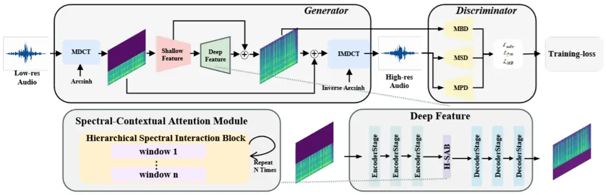
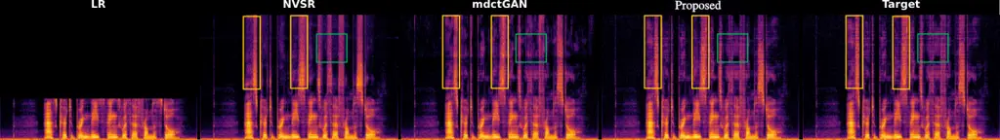
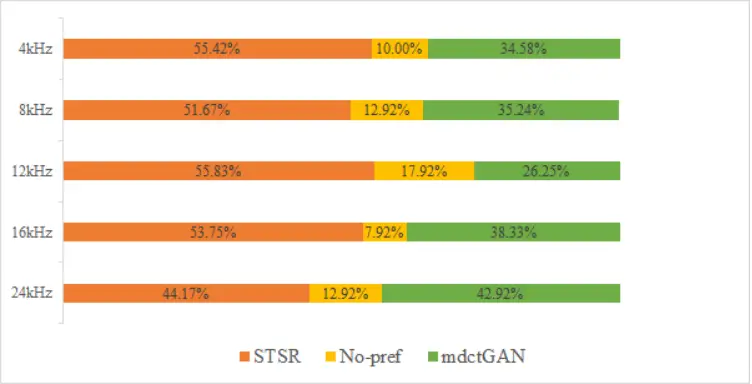

Yuan Wang Xiao Wu Hu Lv Wuhan University, WuhanChina Jianghan
University, WuhanChina Xiaomi Corporation, BeijingChina

# STSR: High-Fidelity Speech Super-Resolution via Spectral-Transient Context Modeling

Jiajun    Xiaochen    Yuhang    Yulin    Chenhao    Xueyang
Affiliation: National Engineering Research Center for Multimedia
Software, School of Computer Science Affiliation: School of Artificial
Intelligence Affiliation: 

###### Abstract

Speech super-resolution (SR) reconstructs high-fidelity wideband speech
from low-resolution inputs—a task that necessitates reconciling global
harmonic coherence with local transient sharpness. While diffusion-based
generative models yield impressive fidelity, their practical deployment
is often stymied by prohibitive computational demands. Conversely,
efficient time-domain architectures lack the explicit frequency
representations essential for capturing long-range spectral dependencies
and ensuring precise harmonic alignment. We introduce STSR, a unified
end-to-end framework formulated in the MDCT domain to circumvent these
limitations. STSR employs a Spectral-Contextual Attention mechanism that
harnesses hierarchical windowing to adaptively aggregate non-local
spectral context, enabling consistent harmonic reconstruction up to 48
kHz. Concurrently, a sparse-aware regularization strategy is employed to
mitigate the suppression of transient components inherent in compressed
spectral representations. STSR consistently outperforms state-of-the-art
baselines in both perceptual fidelity and zero-shot generalization,
providing a robust, real-time paradigm for high-quality speech
restoration. \[to ensure author anonymity, the link to the samples will
be added after the review process\]

###### keywords

speech super-resolution, bandwidth extension (BWE), spectral-transient
aware, MDCT, Swin Transformer, generative adversarial networks

^(†)^(†)email: yjj2002@whu.edu.cn, wuyulin@whu.edu.cn,
huchenhao@xiaomi.com



Figure 1: Overall architecture of STSR.

## 1 Introduction

Speech super-resolution (SR), or bandwidth extension (BWE), entails
reconstructing high-fidelity wideband spectra from bandwidth-limited
inputs. This task remains pivotal for augmenting intelligibility and
perceptual quality in real-time telecommunications and the restoration
of legacy recordings \[1, 2\].

Prior discriminative deep learning models \[3, 4\] primarily formulate
SR as a deterministic regression task. While these methods successfully
recover low-frequency envelopes, their reliance on minimizing
sample-wise L1 or L2 distances inevitably precipitates a
regression-to-the-mean effect. This yields over-smoothed high-frequency
spectra that lack acoustic crispness—a deficiency that becomes
particularly pronounced as target sampling rates reach 48 kHz.

To synthesize more realistic spectral textures, recent research has
embraced generative modeling. Advanced frameworks such as VoiceFixer,
WSRGlow, and AudioSR \[1, 5, 6, 7, 8\] capitalize on iterative priors to
hallucinate fine-grained high-band details. Although these
diffusion-style or flow-based refinement processes significantly enhance
perceptual fidelity, the necessity of multi-step sampling imposes
prohibitive computational overhead and latency, rendering them
impractical for real-time deployment.

Driven by the need for efficiency, recent efforts have shifted toward
end-to-end architectures to maximize computational throughput and
circumvent error accumulation. Representative models, such as the
time-domain state-space framework Wave-U-Mamba \[9, 10, 11, 12, 13, 14\]
and the unified Transformer–convolution architecture HiFi-SR \[15\],
offer a distinct advantage: they enable rapid inference and eliminate
the feature mismatch inherent in two-stage pipelines like NVSR \[16\].
However, while operating exclusively in the waveform domain effectively
captures temporal evolution, it lacks an explicit representation of
frequency structures. Consequently, time-domain modeling alone struggles
to capture the non-local vertical correlations between low-frequency
fundamentals and their distant high-band harmonics, a limitation that
significantly constrains reconstruction fidelity at 48 kHz.

An alternative paradigm performs vocoder-free SR directly in the
Modified Discrete Cosine Transform (MDCT) domain. By bypassing
magnitude-to-waveform conversion, this approach circumvents the
artifacts typical of two-stage pipelines. Despite these structural
merits, current MDCT-based solutions like mdctGAN \[17, 18\] remain
suboptimal. Their reliance on standard convolutional kernels restricts
modeling to local spectral neighborhoods, hindering the maintenance of
harmonic consistency across the wideband spectrum. Moreover, the
heavy-tailed nature of MDCT coefficients necessitates aggressive range
compression (e.g., arcsinh) for training stability; unfortunately, this
preprocessing tends to flatten sharp spectral peaks, leading to the
over-smoothing of transient components and a loss of perceptual attack.

In this paper, we present STSR, a unified MDCT-domain framework designed
to reconcile long-range spectral consistency with transient fidelity
while meeting the stringent requirements of real-time speech SR. We
treat the spectrogram as a structured representation and employ a
hierarchical window attention mechanism to adaptively aggregate
non-local spectral context, ensuring precise harmonic alignment across
the band. To offset the information loss induced by spectral
compression, we introduce a sparse-aware loss that enforces transient
constraints and preserves acoustic sharpness. Finally, a
high-frequency-focused hybrid discriminator concentrates adversarial
pressure on synthesized spectra while maintaining global temporal
coherence, enabling real-time single-channel upsampling with robust
zero-shot generalization.

Our main contributions are as follows:

1.  1.  A spectral–transient aware MDCT framework that jointly addresses
        envelope reconstruction and transient preservation;
2.  2.  A spectral-context attention mechanism that explicitly captures
        non-local dependencies along the frequency axis;
3.  3.  A high-band-focused hybrid discriminator that concentrates
        adversarial pressure on generated frequencies without destabilizing
        the low-frequency base;
4.  4.  A sparse-aware loss tailored to compressed MDCT representations,
        significantly mitigating transient over-smoothing.

## 2 Method

The STSR framework operates directly within the signed MDCT domain.
Unlike magnitude-only spectrograms, MDCT coefficients implicitly
encapsulate both energy and phase information via their signed values.
To accommodate negative values where standard logarithmic compression is
ill-defined, we employ a pseudo-logarithmic mapping strategy commonly
utilized in high-fidelity audio synthesis \[17\]. Specifically, we
leverage the inverse hyperbolic sine ($`\operatorname{arcsinh}`$), which
approximates logarithmic scaling for high-amplitude components while
maintaining sign integrity and linearity near the origin. Operationally,
the MDCT coefficients $`X`$ are scaled by a gain factor $`g`$ (where
$`g{=}800`$) and transformed via base-10 pseudo-logarithmic compression:

```math
\displaystyle S \displaystyle=\frac{\operatorname{arcsinh}(g\cdot X)}{\ln(10)}, \tag{1}
```

```math
\displaystyle X \displaystyle=\frac{\sinh(S\cdot\ln(10))}{g}.
```

This transformation effectively regularizes the heavy-tailed
distribution of spectral data while ensuring perfect invertibility,
thereby facilitating robust waveform reconstruction.

### 2.1 Spectral Branch (Generator)

Although $`\operatorname{arcsinh}`$ compression facilitates training
stability, it inherently attenuates fine-grained spectral details and
transient cues. Standard convolutional generators often fail to recover
these degraded components, as their representation power is
fundamentally constrained by the locality of their receptive fields.
Drawing upon recent advances in attention-based restoration \[19, 20,
21\], we propose a Hierarchical Spectral-Contextual Attention mechanism
explicitly tailored to the spectral anisotropy of speech.

Since global self-attention across the entire spectrogram is precluded
by prohibitive computational complexity, we implement Spectral
Interaction Blocks that leverage windowed self-attention. This design
partitions the frequency axis into local windows to capture localized
harmonic structures, including fundamental frequencies and their
immediate partials. To facilitate information flow across these
boundaries, a shifted-window mechanism is employed in alternating
layers. This strategy enables the modeling of long-range
spectro-temporal evolutions—such as formant transitions—that are
essential for speech SR yet remain elusive for conventional CNNs.

We architect a compact U-Net using these attention blocks, incorporating
skip connections to preserve low-level spectral features. Additionally,
a global residual path is integrated to bias the model toward explicitly
learning high-frequency residuals. The resulting architecture
constitutes a unified, single-stage vocoder-free framework that
effectively reconciles local transient sharpness with global harmonic
consistency.

### 2.2 Hybrid Discriminator

The discriminator architecture is pivotal in synthesizing high-fidelity
waveforms. We leverage the Multi-Period (MPD) and Multi-Scale (MSD)
discriminators from HiFi-GAN \[22\] to enforce temporal coherence and
suppress phase artifacts. While these time-domain modules effectively
capture periodic structures and global patterns, they exhibit limited
sensitivity to fine-grained spectral artifacts within the reconstructed
high-frequency regime.

To rectify this, we introduce a High-Band Multi-Band Discriminator
(HB-MBD) that operates directly on MDCT magnitudes. Given that the
low-frequency band is provided as ground-truth input, subjecting this
region to adversarial pressure can induce spectral degradation or
optimization instability. We therefore delineate frequency boundaries
based on sampling rates to isolate the reconstruction target: let
$`f_{hi}`$ and $`f_{lo}`$ denote the Nyquist frequencies of the target
high-resolution output and the low-resolution input, respectively.

To preserve the integrity of the low-band, discriminative focus is
restricted to the interval $`[f_{lo},f_{hi})`$. Specifically, parallel
PatchGAN heads are deployed across distinct sub-bands uniformly
distributed within this range, complemented by a full-band head to
ensure global spectral consistency. This configuration confines
adversarial feedback to the synthesized components, preventing the model
from compromising low-band fidelity for high-band hallucination. The
resulting optimization yields crisper harmonics and fricatives without
destabilizing the fundamental frequencies.



Figure 2: Spectrogram comparison (16kHz$`\rightarrow`$48kHz). STSR
exhibits sharper harmonic structures, more complete high-band energy,
and clearer transients with fewer artifacts, surpassing prior models in
both detail and fidelity.

### 2.3 Training Objectives

STSR is optimized via a composite objective function designed to
reconcile the trade-off between perceptual fidelity and spectral
precision.

Adversarial Loss. To synthesize realistic waveforms, we leverage the
Least Squares GAN (LS-GAN) formulation \[23\]. The discriminator
ensemble $`\mathcal{D}`$ comprises time-domain modules (MPD and MSD) and
the proposed frequency-domain HB-MBD, denoted as $`D_{wav}`$ and
$`D_{spec}`$, respectively. Given the ground-truth audio $`y`$ and the
low-resolution input $`x`$, the generator $`G`$ and discriminators $`D`$
engage in the following minimax game:

```math
\displaystyle\mathcal{L}_{adv}(D) \displaystyle=\mathbb{E}_{y}[(1-D(y))^{2}]+\mathbb{E}_{x}[D(G(x))^{2}] \tag{2}
```

```math
\displaystyle\mathcal{L}_{adv}(G) \displaystyle=\mathbb{E}_{x}[(1-D(G(x)))^{2}]
```

The total adversarial objective is formulated as a weighted sum across
all discriminator sub-units in both the time and frequency domains.

Feature Matching Loss. We incorporate feature matching loss to stabilize
the adversarial landscape and facilitate high-fidelity synthesis \[22\].
This loss minimizes the $`L_{1}`$ distance between internal feature maps
of the discriminators for real and synthesized samples:

```math
\mathcal{L}_{fm}(G)=\sum_{k=1}^{K}\sum_{l=1}^{L_{k}}\frac{1}{N_{l}}\left\lVert D_{k}^{(l)}(y)-D_{k}^{(l)}(G(x))\right\rVert_{1} \tag{3}
```

where $`K`$ denotes the number of discriminators, $`L_{k}`$ is the layer
count for the $`k`$-th discriminator, and $`N_{l}`$ is the number of
elements within the $`l`$-th feature map.

Transient Constraint (Sparse-Aware Loss). While standard $`L_{1}`$
reconstruction losses treat spectral bins uniformly, MDCT coefficients
are inherently sparse, characterized by high-energy harmonics and
transient peaks set against a near-zero background. Although
$`\operatorname{arcsinh}`$ compression is essential for numerical
stability, it inevitably compresses the dynamic range, which may amplify
background artifacts and blur transient boundaries. A naive global
$`L_{1}`$ objective fails to differentiate these regimes, often yielding
over-smoothed reconstructions where transient attacks lose their
acoustic crispness.

To rectify this, we propose a content-adaptive sparse loss that
decouples signal reconstruction from noise suppression. We formulate a
dynamic soft mask derived from the ground-truth energy profile. Let
$`S`$ and $`\hat{S}`$ represent the compressed signed MDCT coefficients
of the ground truth $`y`$ and the prediction $`G(x)`$, respectively. A
content weight map $`w_{c}`$ is computed via a sigmoid function centered
on the spectral envelope:

```math
\displaystyle w_{c} \displaystyle=\sigma(\alpha\cdot(|S|-\tau)) \tag{4}
```

```math
\displaystyle w_{s} \displaystyle=1-w_{c}
```

where $`\sigma`$ denotes the sigmoid function and $`\alpha`$ modulates
the transition steepness. Rather than utilizing a fixed threshold,
$`\tau`$ is dynamically determined as the 0.8-quantile of $`|S|`$ for
each utterance, ensuring robust performance across diverse volume levels
and recording environments.

The resulting objective combines two complementary terms:

```math
\mathcal{L}_{sparse}(G)=\underbrace{\left\lVert w_{c}\odot(S-\hat{S})\right\rVert_{1}}_{\text{Signal Fidelity}}+\lambda_{s}\underbrace{\left\lVert w_{s}\odot\hat{S}\right\rVert_{1}}_{\text{Sparsity Regularization}} \tag{5}
```

The former prioritizes active spectral regions (harmonics and
transients), enforcing fidelity where energy is prominent. The latter
penalizes spurious activations in background regions, effectively
suppressing GAN-induced artifacts in sparse frequency bins. By
re-weighting the optimization landscape, this strategy counteracts
compression-induced smoothing and restores the natural sparsity of the
speech signal.

Total Objective. The global loss function integrates these terms with a
multi-resolution STFT loss $`\mathcal{L}_{stft}`$ \[24\] to ensure
stable convergence:

```math
\displaystyle\mathcal{L}_{G} \displaystyle=\lambda_{adv}^{(t)}(\mathcal{L}_{adv}^{wav}+\mathcal{L}_{adv}^{spec})+\lambda_{fm}\mathcal{L}_{fm} \tag{6}
```

```math
\displaystyle+\lambda_{stft}\mathcal{L}_{stft}+\lambda_{sparse}\mathcal{L}_{sparse}
```

To maintain optimization stability in the MDCT domain, a linear warm-up
schedule is applied to the adversarial weight $`\lambda_{adv}^{(t)}`$,
allowing the generator to capture fundamental spectral structures prior
to full adversarial refinement.

## 3 Experiments

### 3.1 Datasets

STSR was trained and evaluated on the VCTK corpus \[25\], which
encompasses approximately 44 hours of 48 kHz recordings from 110 English
speakers. To ensure data integrity, we utilized the mic1 channel and
excluded speakers p280 and p315 following established protocols. The
remaining data were partitioned into 100 speakers for training and 8 for
evaluation. To assess cross-domain robustness, we performed zero-shot
evaluation on the HiFi-TTS dataset \[26\], which contains high-fidelity
44.1 kHz recordings. To maintain pipeline consistency, these recordings
were resampled to 48 kHz prior to processing.

### 3.2 Evaluation Metrics

Model performance was quantitatively assessed using Log-Spectral
Distance (LSD) \[27\]. Let $`S`$ and $`\tilde{S}`$ denote the magnitude
spectrograms of the ground-truth and synthesized speech signals,
respectively. The LSD is defined as:

```math
\displaystyle\text{LSD}(S,\tilde{S}) \displaystyle=\frac{1}{T}\sum_{t=1}^{T}\sqrt{\frac{1}{F}\sum_{f=1}^{F}\left(\log_{10}\frac{S(t,f)^{2}}{\tilde{S}(t,f)^{2}}\right)^{2}} \tag{7}
```

where $`T`$ and $`F`$ represent the number of time frames and frequency
bins, respectively. As a frequency-domain metric, LSD quantifies the
logarithmic divergence between spectra in decibels (dB). Lower LSD
values reflect superior perceptual fidelity, with a value of zero
signifying identical spectral profiles. Comparative results against
baseline systems, including WSRGlow \[5\], NVSR \[16\],
Wave-U-Mamba \[9\], and mdctGAN \[17\], are summarized in Table 1.

For subjective evaluation, we conducted an ABX listening test. In each
trial, listeners were presented with two system outputs (A and B)
alongside a reference (X) and tasked with identifying which sample
exhibited higher similarity to the reference. This streamlined protocol
facilitates a direct comparison of perceptual quality while minimizing
participant fatigue; aggregated preference scores are reported in
Figure 3.

|              |      |      |       |       |      |                   |
| ------------ | ---- | ---- | ----- | ----- | ---- | ----------------- |
| Model        | 4kHz | 8kHz | 16kHz | 24kHz | AVG  | Params            |
| Unprocessed  | 6.08 | 5.15 | 4.85  | 3.84  | 4.98 | -                 |
| WSRGlow      | 1.12 | 0.98 | 0.85  | 0.79  | 0.94 | 229.9M$`\times`$4 |
| NVSR         | 0.98 | 0.91 | 0.81  | 0.70  | 0.85 | 99.0M             |
| Wave-U-Mamba | 0.97 | 0.87 | 0.75  | 0.70  | 0.82 | 4.2M              |
| mdctGAN      | 1.09 | 0.93 | 0.83  | 0.71  | 0.89 | 101.0M            |
| STSR         | 0.95 | 0.84 | 0.73  | 0.65  | 0.79 | 66.2M             |
| (w/o HB-MBD) | 0.99 | 0.86 | 0.77  | 0.71  | 0.83 | -                 |
| (w/o Sparse) | 0.98 | 0.85 | 0.74  | 0.69  | 0.81 | -                 |

Table 1: Objective evaluation results (LSD) and model size (Params, M).
Lower LSD is better (The best results have been bolded).

### 3.3 Implementation Details

STSR was trained on a single NVIDIA A100 GPU for 200k iterations with a
batch size of 16. To mitigate overfitting to fixed spectral cutoffs,
low-resolution inputs were synthesized on-the-fly: during each
iteration, a cutoff frequency $`r\in[4,32]`$ kHz was stochastically
sampled, followed by low-pass filtering, downsampling, and subsequent
upsampling back to 48 kHz. This dynamic degradation strategy compels the
model to reconstruct diverse spectral bands from 48,460-sample audio
segments.

The framework utilizes a four-stage hierarchical encoder-decoder
architecture optimized to balance model capacity with computational
efficiency. Encoder stages were configured with depths of
$`\{2,2,8,2\}`$, while the number of attention heads scaled from 4 to 32
to facilitate robust multi-scale dependency modeling. Input MDCT
coefficients were computed using a 1024-sample window and a 512-sample
hop length, utilizing a Kaiser-Bessel Derived (KBD) window
($`\alpha{=}6`$) with an $`\operatorname{arcsinh}`$ gain of $`g{=}800`$.
Optimization was conducted via the AdamW optimizer ($`\beta_{1}{=}0.8`$,
$`\beta_{2}{=}0.99`$, weight decay $`0.01`$) with an initial learning
rate of $`2\times 10^{-4}`$ and an exponential decay factor of $`0.999`$
per epoch. Adversarial weights $`\lambda_{wav}^{(t)}`$ and
$`\lambda_{spec}^{(t)}`$ underwent a linear warm-up over the initial 20k
iterations to stabilize the nascent training phase.

| Model   | 4kHz | 8kHz | 16kHz | 24kHz | AVG  |
| ------- | ---- | ---- | ----- | ----- | ---- |
| NVSR    | 1.39 | 1.23 | 0.93  | 0.82  | 1.09 |
| mdctGAN | 1.41 | 1.21 | 0.95  | 0.84  | 1.10 |
| STSR    | 1.33 | 1.21 | 0.89  | 0.78  | 1.05 |

Table 2: Cross-dataset generalization on HiFi-TTS (LSD). Lower is
better. Zero-shot: no fine-tuning (The best results have been bolded).



Figure 3: ABX subjective test results of mdctGAN and STSR

## 4 Results and Discussion

Table 1 summarizes objective performance on the VCTK test set. STSR
attains an average LSD of 0.79, consistently surpassing the
regression-based NVSR (0.85). Compared to the lightweight
Wave-U-Mamba \[9\] (4.2M parameters), STSR yields superior spectral
fidelity (0.79 vs. 0.82), with the performance gain most evident in the
challenging 16 kHz$`\rightarrow`$48 kHz task (0.73 vs. 0.75). These
results suggest that while time-domain state-space models are
parameter-efficient, our MDCT-domain attention mechanism more
effectively captures the fine-grained harmonic structures essential for
high-fidelity restoration, justifying the associated computational cost
(66.2M parameters).

Ablation studies underscore the efficacy of each proposed module
(Table 1). Excising the HB-MBD increases the average LSD to 0.83,
confirming that frequency-domain adversarial feedback is pivotal for
refining high-band textures. Similarly, omitting the Transient
Constraint degrades the score to 0.81, validating that sparsity-aware
regularization effectively mitigates the smoothing artifacts induced by
$`\operatorname{arcsinh}`$ compression.

To evaluate generalization, VCTK-trained models were tested directly on
the unseen HiFi-TTS dataset \[26\] without fine-tuning. As shown in
Table 2, STSR yields a superior average LSD of 1.05, outperforming both
NVSR (1.09) and mdctGAN (1.10). This consistent performance across
distribution shifts indicates that STSR learns robust, generalized
spectro-temporal dependencies.

Subjectively, ABX listening tests (Figure 3) reveal a distinct
preference for STSR over the mdctGAN baseline. This preference is most
pronounced at 16 kHz input bandwidths—a critical threshold where
fundamental frequencies are preserved but high-frequency harmonics are
entirely absent—confirming that STSR delivers perceptually crisper
audio.

## 5 Conclusions

We presented STSR, a MDCT-domain framework designed to reconcile global
harmonic coherence with local transient sharpness. Our architecture
integrates a hierarchical spectral-contextual attention mechanism to
capture long-range dependencies and a sparse-aware regularization
strategy to counteract compression-induced smoothing. Experimental
results demonstrate that STSR surpasses state-of-the-art baselines in
both objective metrics and perceptual quality, while exhibiting robust
zero-shot generalization. Notably, the model achieves a real-time
throughput of 12.5$`\times`$ on a single NVIDIA A100 GPU, satisfying the
stringent latency requirements of practical applications without
compromising reconstruction fidelity.

## References

- \[1\] H. Liu, Q. Kong, Q. Tian, Y. Zhao, D. Wang, C. Huang, and Y.
  Wang (2022) VoiceFixer: a unified framework for high-fidelity speech
  restoration. In Proc. Interspeech, pp. 4232–4236. External Links:
  [Document](https://dx.doi.org/10.21437/Interspeech.2022-11026), ISSN
  2958-1796 Cited by: §1, §1.
- \[2\] Y. Lu, Y. Ai, H. Du, and Z. Ling (2024) Towards high-quality and
  efficient speech bandwidth extension with parallel amplitude and phase
  prediction. External Links: 2401.06387,
  [Link](https://arxiv.org/abs/2401.06387) Cited by: §1.
- \[3\] V. Kuleshov, S. Z. Enam, and S. Ermon (2017) Audio
  super-resolution using neural networks. In Proc. ICLR (Workshop
  Track), External Links:
  [Link](https://openreview.net/forum?id=S1gNakBFx) Cited by: §1.
- \[4\] T. Y. Lim, R. A. Yeh, Y. Xu, M. N. Do, and M.
  Hasegawa-Johnson (2018) Time-frequency networks for audio
  super-resolution. In Proc. ICASSP, pp. 646–650. External Links:
  [Document](https://dx.doi.org/10.1109/ICASSP.2018.8462049) Cited by:
  §1.
- \[5\] K. Zhang, Y. Ren, C. Xu, and Z. Zhao (2021) WSRGlow: a
  glow-based waveform generative model for audio super-resolution. In
  Proc. Interspeech, pp. 1649–1653. External Links:
  [Document](https://dx.doi.org/10.21437/Interspeech.2021-892), ISSN
  2958-1796 Cited by: §1, §3.2.
- \[6\] H. Liu, K. Chen, Q. Tian, W. Wang, and M. D. Plumbley (2024)
  AudioSR: versatile audio super-resolution at scale. In Proc. ICASSP,
  pp. 1076–1080. External Links:
  [Document](https://dx.doi.org/10.1109/ICASSP48485.2024.10447246) Cited
  by: §1.
- \[7\] E. Moliner, F. Elvander, and V. Välimäki (2024) Blind audio
  bandwidth extension: a diffusion-based zero-shot approach. IEEE/ACM
  Transactions on Audio, Speech, and Language Processing 32,
  pp. 5092–5105. External Links:
  [Document](https://dx.doi.org/10.1109/TASLP.2024.3507566), ISSN
  2329-9290 Cited by: §1.
- \[8\] J. Yun, S. Kim, and S. Lee (2025) FLowHigh: towards efficient
  and high-quality audio super-resolution with single-step flow
  matching. In Proc. ICASSP, pp. 1–5. External Links:
  [Document](https://dx.doi.org/10.1109/ICASSP49660.2025.10888772) Cited
  by: §1.
- \[9\] Y. Lee and C. Kim (2025) Wave-U-Mamba: an end-to-end framework
  for high-quality and efficient speech super resolution. External
  Links: 2409.09337, [Link](https://arxiv.org/abs/2409.09337) Cited by:
  §1, §3.2, §4.
- \[10\] G. Yu, X. Zheng, N. Li, R. Han, C. Zheng, C. Zhang, C. Zhou, Q.
  Huang, and B. Yu (2024) BAE-Net: a low complexity and high fidelity
  bandwidth-adaptive neural network for speech super-resolution. In
  Proc. ICASSP, Cited by: §1.
- \[11\] X. Liu, S. He, and X. Zhang (2025) HWB-Net: a novel
  high-performance and efficient hybrid waveform bandwidth extension
  method. In Proc. Interspeech, Cited by: §1.
- \[12\] X. Liu, M. Yang, S. Chen, and J. H.L. Hansen (2025) A neural
  codec approach for noise-robust bandwidth expansion. In Proc.
  Interspeech, Cited by: §1.
- \[13\] Y. Lu, Y. Ai, Z. Sheng, and Z. Ling (2024) Multi-stage speech
  bandwidth extension with flexible sampling rate control. External
  Links: 2406.02250, [Link](https://arxiv.org/abs/2406.02250) Cited by:
  §1.
- \[14\] T. I. Tamiti, B. Joshi, R. Hasan, R. Hasan, T. Athay, N. Mamun,
  and A. Barua (2025) A high-fidelity speech super resolution network
  using a complex global attention module with spectro-temporal loss.
  External Links: 2507.00229, [Link](https://arxiv.org/abs/2507.00229)
  Cited by: §1.
- \[15\] S. Zhao, K. Zhou, Z. Pan, et al. (2025) HiFi-SR: a unified
  generative transformer-convolutional adversarial network for
  high-fidelity speech super-resolution. In Proc. ICASSP, pp. 1–5.
  External Links:
  [Document](https://dx.doi.org/10.1109/ICASSP49660.2025.10888627) Cited
  by: §1.
- \[16\] H. Liu, W. Choi, X. Liu, Q. Kong, Q. Tian, and D. Wang (2022)
  Neural vocoder is all you need for speech super-resolution. In Proc.
  Interspeech, pp. 4227–4231. External Links:
  [Document](https://dx.doi.org/10.21437/Interspeech.2022-11017), ISSN
  2958-1796 Cited by: §1, §3.2.
- \[17\] C. Shuai, C. Shi, L. Gan, and H. Liu (2023) mdctGAN: taming
  transformer-based gan for speech super-resolution with modified dct
  spectra. In Proc. Interspeech, pp. 5112–5116. External Links:
  [Document](https://dx.doi.org/10.21437/Interspeech.2023-113), ISSN
  2958-1796 Cited by: §1, §2, §3.2.
- \[18\] H. Bao and X. Zhang (2025) Frequency-domain enhanced extreme
  bandwidth extension network with ICCRN for superior speech quality. In
  Proc. Interspeech, Cited by: §1.
- \[19\] Z. Liu, Y. Lin, Y. Cao, H. Hu, Y. Wei, Z. Zhang, S. Lin, and B.
  Guo (2021) Swin transformer: hierarchical vision transformer using
  shifted windows. In Proc. ICCV, pp. 10012–10022. External Links:
  [Document](https://dx.doi.org/10.1109/ICCV48922.2021.00986) Cited by:
  §2.1.
- \[20\] J. Liang, J. Cao, G. Sun, K. Zhang, L. Van Gool, and R.
  Timofte (2021) SwinIR: image restoration using swin transformer. In
  Proc. ICCVW, pp. 1833–1844. External Links:
  [Document](https://dx.doi.org/10.1109/ICCVW54120.2021.00210) Cited by:
  §2.1.
- \[21\] M. V. Conde, U. Choi, M. Burchi, and R. Timofte (2023) Swin2SR:
  SwinV2 transformer for compressed image super-resolution and
  restoration. In Computer Vision – ECCV 2022 Workshops, pp. 669–687.
  External Links:
  [Document](https://dx.doi.org/10.1007/978-3-031-25063-7%5F42) Cited
  by: §2.1.
- \[22\] J. Kong, J. Kim, and J. Bae (2020) HiFi-GAN: generative
  adversarial networks for high-fidelity neural vocoder. In Proc.
  NeurIPS, pp. 17022–17033. Cited by: §2.2, §2.3.
- \[23\] X. Mao, Q. Li, H. Xie, R. Y. K. Lau, Z. Wang, and S.
  Paul (2017) Least squares generative adversarial networks. In Proc.
  ICCV, pp. 2813–2821. External Links:
  [Document](https://dx.doi.org/10.1109/ICCV.2017.304) Cited by: §2.3.
- \[24\] R. Yamamoto, E. Song, and J. Kim (2020) Parallel WaveGAN: a
  fast waveform generation model based on generative adversarial
  networks with multi-resolution spectrogram. In Proc. ICASSP,
  pp. 6199–6203. External Links:
  [Document](https://dx.doi.org/10.1109/ICASSP40776.2020.9053795) Cited
  by: §2.3.
- \[25\] C. Veaux, J. Yamagishi, and K. MacDonald (2019) CSTR vctk
  corpus: english multi-speaker corpus for cstr voice cloning toolkit.
  University of Edinburgh, The Centre for Speech Technology Research
  (CSTR). Cited by: §3.1.
- \[26\] E. Bakhturina, V. Lavrukhin, B. Ginsburg, and Y. Zhang (2021)
  Hi-fi multi-speaker english TTS dataset. In Proc. Interspeech,
  pp. 2776–2780. External Links:
  [Document](https://dx.doi.org/10.21437/Interspeech.2021-1599), ISSN
  2958-1796 Cited by: §3.1, §4.
- \[27\] A. H. Gray and J. D. Markel (1976) Distance measures for speech
  processing. IEEE Transactions on Acoustics, Speech, and Signal
  Processing 24 (5), pp. 380–391. External Links:
  [Document](https://dx.doi.org/10.1109/TASSP.1976.1162849), ISSN
  0096-3518 Cited by: §3.2.
