# Test-Time Adaptation for Speech Enhancement via Domain Invariant Embedding Transformation

Tobias Raichle    Niels Edinger    Bin Yang

###### Abstract

Deep learning-based speech enhancement models achieve remarkable
performance when test distributions match training conditions, but often
degrade when deployed in unpredictable real-world environments with
domain shifts. To address this challenge, we present LaDen (latent
denoising), the first test-time adaptation method specifically designed
for speech enhancement. Our approach leverages powerful pre-trained
speech representations to perform latent denoising, approximating clean
speech representations through a linear transformation of noisy
embeddings. We show that this transformation generalizes well across
domains, enabling effective pseudo-labeling for target domains without
labeled target data. The resulting pseudo-labels enable effective
test-time adaptation of speech enhancement models across diverse
acoustic environments. We propose a comprehensive benchmark spanning
multiple datasets with various domain shifts, including changes in noise
types, speaker characteristics, and languages. Our extensive experiments
demonstrate that LaDen consistently outperforms baseline methods across
perceptual metrics, particularly for speaker and language domain shifts.

###### Index Terms: 

Deep learning, domain invariant embedding, speech enhancement, test-time
adaptation,

^(†)^(†)address: Institute of Signal Processing and System Theory  
University of Stuttgart

## 1 INTRODUCTION

### 1.1 Motivation

Modern deep learning based speech enhancement (SE) models have achieved
remarkable success and are able to deliver natural sounding denoised
speech even for very noisy recordings. However, previous works focus
mostly on the performance on a small number of benchmark datasets, e.g.
the ubiquitous VoiceBank+DEMAND (VBD) \[1\] dataset, whereas
generalization has not received as much attention. This has resulted in
SE models performing exceptionally well, as long as the target data
distribution closely matches the training distribution, but diminished
performance under distribution shifts. Table 1 shows that the SE model
CMGAN \[2\] trained on the source EARS-W \[3\] dataset performs
significantly worse on the target datasets (EARS-D and VBD) than the
same model trained directly on those target domains. Since SE models are
commonly deployed in unpredictable environments, generalization is a key
factor for successful, practical speech enhancement systems. Due to this
unpredictability, training SE models on all possible target
distributions is not feasible. To nonetheless achieve generalization,
models must be able to adapt themselves to any test environment without
relying on labeled data from the specific target domain. Methods that
perform adaptation under these conditions can be summarized under
unsupervised domain adaptation (UDA).

In practice, adaptation methods cannot rely on the availability of
labeled source data at test time. Besides the privacy concerns of
sharing labeled source data, it is not practical to store and re-process
the large source domain dataset during adaptation \[4\]. This is
especially true for speech enhancement, since these models are commonly
deployed to edge devices with limited storage and compute resources.
Additionally, real-world deployments demand adaptation to happen
simultaneously to inference, as separate adaptation phases would
introduce unacceptable latency. Online adaptation using only the source
model and unlabeled target data is known as test-time adaptation (TTA)
and presents the most general and practical adaptation paradigm \[5\].
While there are previous works covering UDA in the context of speech
enhancement, to the best of our knowledge, this is the first work
exploring TTA for speech enhancement.

The main contributions of this work can be summarized as follows:

- •
  We explore the application of TTA to speech enhancement and propose a
  comprehensive benchmark for evaluation, spanning various domain
  shifts, including different noise types, speaker characteristics, and
  languages.
- •
  We propose and empirically verify DIET (domain invariant embedding
  transformation) as an effective method for translating between noisy
  and clean speech in embedding spaces.
- •
  Based on DIET we introduce LaDen (latent denoising), a novel approach
  that enables TTA for speech enhancement.
- •
  By conducting a large number of experiments, we identify the strengths
  and limitations of the proposed method across different domain shifts.

|              | EARS-D            |                     | VBD               |                     |
| ------------ | ----------------- | ------------------- | ----------------- | ------------------- |
|              | PESQ $`\uparrow`$ | SI-SDR $`\uparrow`$ | PESQ $`\uparrow`$ | SI-SDR $`\uparrow`$ |
| No denoising | 1.398             | -1.109              | 1.970             | 8.444               |
| Source CMGAN | 2.701             | 4.091               | 3.234             | 10.094              |
| Target CMGAN | 2.763             | 11.823              | 3.399             | 20.071              |

Table 1: Comparison between the source CMGAN trained on the EARS-W \[3\]
dataset and models trained on the respective target domain (target
CMGAN). EARS-D denotes the dataset introduced in Section 4. SI-SDR in
dB.

### 1.2 Problem Setting

Given a recording of corrupted speech $`\bm{y}\in\mathcal{A}`$, the goal
of SE is to estimate the uncorrupted speech $`\bm{x}\in\mathcal{A}`$,
where $`\mathcal{A}`$ denotes the set of all audio signals \[6\].
Generally, corruptions can include additive noise, reverberation and
echoes, limited bandwidth or compression artifacts. While the proposed
method can be applied to all distortion types, this work only considers
additive noise and leaves other corruptions for future research. Thus,
the setting can be modeled by

```math
\displaystyle\bm{y}=\bm{x}+\bm{n},
```

where $`\bm{n}\in\mathcal{A}`$ denotes the additive noise. The task of
the SE model $`{f_{\theta}:\mathcal{A}\rightarrow\mathcal{A}}`$ is to
estimate the clean signal $`\hat{\bm{x}}\in\mathcal{A}`$

```math
\displaystyle\hat{\bm{x}}=f_{\theta}(\bm{y}).
```

The source SE model $`f_{\theta}`$ is trained using the labeled source
dataset
$`{\mathcal{D}_{\mathrm{S}}\subset\mathcal{A}\times\mathcal{A}}`$,
consisting of pairs of clean and noisy speech segments.

Given the trained source model, the task of TTA is to adapt the model
with only the unlabeled target dataset
$`{\mathcal{D}_{\mathrm{T}}\subset\mathcal{A}}`$, while simultaneously
performing inference. We assume a distribution shift between the source
($`\mathrm{S}`$) and target ($`\mathrm{T}`$) datasets that can manifest
itself in a shift in the speech distribution $`p_{X}`$ and/or the noise
distribution $`p_{N}`$, resulting in the mismatch
$`p_{\mathrm{S};X,N}\neq p_{\mathrm{T};X,N}`$ and therefore
$`p_{\mathrm{S};Y}\neq p_{\mathrm{T};Y}`$. However, the predictive
distribution $`p_{X|Y}`$, i.e., the SE task, stays the same
$`p_{\mathrm{S};X|Y}(\bm{x}|\bm{y})=p_{\mathrm{T};X|Y}(\bm{x}|\bm{y})`$
\[7, 8\]. TTA assumes the model $`f_{\theta}`$ as given, i.e. no changes
to the source training or model architecture can be made. This is in
contrast to test-time training (TTT), where an auxiliary self-supervised
task is added during source training to be used later for
adaptation \[9\].

In the field of TTA concerning classification, most methods rely on the
probabilistic model output to perform adaptation \[10\]. The main
approaches can be summarized under entropy minimization \[4\], feature
alignment \[7, 11\] and pseudo-labeling \[12\], each with various
extensions to improve stability \[13, 5\], generalization \[12, 14\] or
efficiency \[15\]. Clearly, entropy minimization does not easily
translate to SE because SE models output a direct estimate of the clean
signal instead of a probability distribution. Feature alignment
typically enforces consistency of model features under label-preserving
input perturbations \[16\]. However, as SE models modify their input,
they cannot be invariant to augmentations that affect the speech
component. Designing an output preserving augmentation is therefore
non-trivial, as the assumption of general invariance to small
perturbations is not valid. Further, designing a consistency metric that
is well aligned with the perceptual SE task poses an additional
challenge. A subset of feature alignment methods update the model’s
batch normalization statistics \[11\], but this has limited
applicability in SE, where many architectures (including those used in
this study) do not rely on batch normalization layers. Similarly to
entropy minimization, estimating pseudo-labels, i.e., computing a proxy
for the clean signal, is not straightforward for SE, as the direct
signal estimation in SE as a regression task does not offer a comparable
way of assigning an estimated label in classification. An effective
method for computing pseudo-labels thus remains a key challenge in
achieving TTA for SE.

## 2 RELATED WORK

As SE methods commonly experience a domain shift in practical
deployments, applying UDA to SE has been an active field of research. In
\[17\], the authors propose phrasing the domain adaptation problem as an
optimal transport problem. Put simply, given a target sample, the most
similar noisy source sample is identified and the corresponding clean
source sample is used as a pseudo-label to perform adaptation. Since
this approach assumes access to the source dataset, it is not compatible
with the TTA setting. \[18\] leverages a two-stage approach, that,
similarly to TTT \[9\], uses masked spectrogram prediction as a
self-supervised auxiliary task to adapt the model. Not only does this
approach also rely on source data, it is also inherently offline since
the adaptation precedes the SE training. RemixIT \[19\] leverages
self-training using a student-teacher approach. Given a set of noisy
target samples, a trained teacher model estimates the clean speech and
noise components. These estimates are used to create a weakly labeled
dataset by permuting the components to create new bootstrapped pairs of
clean and noisy speech. The SE student model is then adapted using this
dataset. This UDA approach does not rely on source data and therefore
conforms to the source-free online TTA paradigm studied in this work,
although it has never been explored in this setting. It is therefore
used as a baseline in this work. The UDA method that is most closely
related to this work is SSRA (self-supvervised representation based
adaptation) \[10\]. The approach is similar to \[17\] in that the most
similar source samples are identified and used as pseudo-labels.
However, SSRA identifies and compares the most similar source samples in
the latent space spanned by wav2vec \[20\]. It can be interpreted as a
transfer of PFPL \[21\] to the UDA paradigm. PFPL (phone-fortified
perceptual-loss) proposes improving supervised SE training by minimizing
the Wasserstein distance between clean and noisy embeddings. In \[22\],
distilling a source-trained general SE teacher model into a smaller,
personalized student model is phrased as a TTA problem. However, while
their approach conforms to the TTA paradigm, it does not address
adapting beyond the generalization capability of the trained teacher.

While these methods have advanced speech enhancement adaptation, they
either rely on source data or operate offline, motivating our latent
denoising approach that addresses these limitations.

## 3 METHODOLOGY

### 3.1 Domain Invariant Embedding Transformation

The proposed method solves the problem of pseudo-labeling by
constructing pseudo-labels in a semantic embedding space spanned by a
speech encoder $`g:\mathcal{A}\rightarrow\mathbb{R}^{d}`$ like
wav2vec \[20\] or WavLM \[23\] via a domain invariant embedding
transformation (DIET). The approach is based on the hypothesis that the
relationship between noisy speech $`\bm{y}`$ and clean speech
$`\bm{x}`$, which is highly complicated on the signal level, simplifies
to a simple relationship between the noisy embeddings
$`\bm{y}^{\prime}=g(\bm{y})`$ and the clean embeddings
$`\bm{x}^{\prime}=g(\bm{x})`$. Figure 1(a) illustrates this principle.
This implies that a simple model can be used to translate between noisy
and clean embeddings. For this work, a linear transformation is used to
model this relationship in the embedding space by

```math
\displaystyle\bm{x}^{\prime}\approx\mathbf{A}\bm{y}^{\prime} \tag{1}
```

with $`\mathbf{A}\in\mathbb{R}^{d\times d}`$. Given a number of samples
$`K\geq d`$, the transformation can be estimated via

```math
\displaystyle\mathbf{A}=\mathbf{X}^{\prime}\mathbf{Y}^{\prime+}, \tag{2}
```

where
$`\mathbf{X}^{\prime},\mathbf{Y}^{\prime}\in\mathbb{R}^{d\times K}`$
denote $`K`$ stacked embedding vectors $`\bm{x}^{\prime}`$ and
$`\bm{y}^{\prime}`$, respectively and
$`\mathbf{Y}^{\prime+}\in\mathbb{R}^{K\times d}`$ denotes the
Moore-Penrose inverse of $`\mathbf{Y}^{\prime}`$.

Crucially, our experiments show that the transformation $`\mathbf{A}`$
generalizes across domains with surprising accuracy. Hence, it is
largely domain invariant. Table 2 shows the cosine similarity
$`{\operatorname{sim}(\bm{x}^{\prime},\bm{y}^{\prime})=\frac{\bm{x}^{\prime T}\bm{y}^{\prime}}{\|\bm{x}^{\prime}\|\cdot\|\bm{y}^{\prime}\|}}`$
between ground truth clean embeddings $`\bm{x}^{\prime}`$ and estimated
clean embeddings $`\mathbf{A}\bm{y}^{\prime}`$ using the speech encoder
$`g`$ from \[23\] and the DIET matrix $`\mathbf{A}`$ fitted on the
EARS-W dataset.

|                                                                   | EARS-W | EARS-D | VBD    | VBW    | $`\text{DNS}_{\text{EN}}`$ |
| ----------------------------------------------------------------- | ------ | ------ | ------ | ------ | -------------------------- |
| $`\operatorname{sim}(\bm{x}^{\prime},\bm{y}^{\prime})`$           | 0.8618 | 0.9062 | 0.8857 | 0.7627 | 0.8765                     |
| $`\operatorname{sim}(\bm{x}^{\prime},\mathbf{A}\bm{y}^{\prime})`$ | 0.9941 | 0.9927 | 0.9766 | 0.9727 | 0.9663                     |

Table 2: DIET accuracy, i.e. the average cosine similarity between
ground truth clean embeddings $`\bm{x}^{\prime}`$ and noisy embeddings
$`\bm{y}^{\prime}`$ as well as transformed noisy embeddings
$`\mathbf{A}\bm{y}^{\prime}`$ for different target datasets.
$`\mathbf{A}`$ was estimated using the EARS-W training split and is
evaluated on the respective test split. The datasets are described in
detail in Section 4. Highest similarity is bold.

### 3.2 Latent Denoising

Based on DIET, $`\mathbf{A}`$ can be estimated offline using the labeled
source dataset $`\mathcal{D}_{\mathrm{S}}`$, before using it online to
compute pseudo-labels for the unlabeled target dataset
$`\mathcal{D}_{\mathrm{T}}`$. This approach therefore does not violate
the TTA paradigm. Figure 1(b) illustrates the principle of the
adaptation approach LaDen. The loss function
$`\mathcal{L}_{\mathrm{LD}}`$ is defined as the cosine distance, i.e.,
one minus the cosine similarity, between the pseudo-label
$`\mathbf{A}\bm{y}^{\prime}`$ and the embedding of the SE output
$`\hat{\bm{x}}^{\prime}`$

```math
\displaystyle\mathcal{L}_{\mathrm{LD}}=1-\operatorname{sim}(\hat{\bm{x}}^{\prime},\mathbf{A}\bm{y}^{\prime}). \tag{3}
```

This self-supervised loss is then used to adapt the parameters of the SE
model.

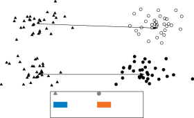

(a) Domain invariant embedding transformation (DIET).

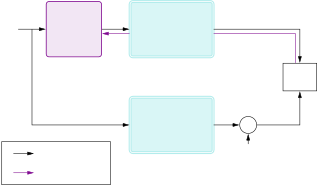

(b) Schematic of the proposed method LaDen.

Figure 1: Using latent pseudo-labels for TTA.

For this work, we employ WavLM rather than other speech encoders like
wav2vec, because WavLM’s pre-training includes a denoising task. This
exposure to noisy speech during pre-training appears to create more
robust and informative embeddings for both clean and noisy
speech \[24\], enabling more accurate linear mapping in Eq. 1.
Concretely, the CNN encoder of WavLM Large \[23\] is used to generate
the embeddings with a dimension of $`d=512`$. Using only the CNN encoder
reduces the number of parameters from 316M to 4.2M. Additionally, since
the encoder’s weights are frozen, the computational overhead is further
reduced. As WavLM splits the recording into frames and generates an
embedding for each frame, the mean embedding of all frames per utterance
is used.

This latent denoising approach effectively addresses the pseudo-labeling
challenge in test-time adaptation for speech enhancement by leveraging
DIET to model the relationship between noisy and clean speech in the
embedding space, while remaining computationally efficient.

### 3.3 Envelope Regularization

While latent representations effectively capture semantic speech
content, they often lack precise temporal information, in part due to
their invariance to small time-shifts. To address this, we propose
envelope regularization to preserve the temporal structure of the
enhanced output. Our approach leverages the observation that speech
dominates the signal envelope of noisy recordings. As depicted in
Figure 2, we extract envelopes from both the SE output
$`\hat{\bm{x}}_{\mathrm{SE}}`$ and a spectral subtraction (SS) baseline
$`\hat{\bm{x}}_{\mathrm{SS}}`$ \[6\] using the magnitude of the Hilbert
transform $`\bm{h}_{\mathrm{H}}`$ \[25\]. Preliminary experiments showed
that using spectral subtraction as a reference outperformed direct
comparison with the noisy envelope, providing a cleaner temporal guide
while remaining computationally efficient.


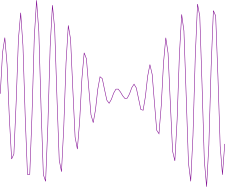

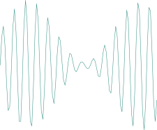

$`*`$$`*`$$`\bm{h}_{\mathrm{H}}`$

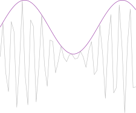

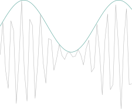

$`\mathcal{L}_{\mathrm{R}}`$$`\bm{y}`$$`\hat{\bm{x}}_{\mathrm{SE}}`$$`\hat{\bm{x}}_{\mathrm{SS}}`$$`\tilde{\bm{x}}_{\mathrm{SE}}`$$`\tilde{\bm{x}}_{\mathrm{SS}}`$

Figure 2: Envelope regularization

The regularization loss is computed frame-wise as the weighted cosine
similarity between these envelopes, with weights $`\bm{\rho}`$
determined by the signal energy to focus on frames with speech activity

```math
\displaystyle\mathcal{L}_{\mathrm{R}}=\sum_{i}\rho_{i}\cdot\operatorname{sim}(\tilde{\bm{x}}_{\mathrm{SE},i},\tilde{\bm{x}}_{\mathrm{SS},i}). \tag{4}
```

To compute the weight $`\rho_{i}`$ for frame $`i`$, the softmax over the
frame powers of $`\hat{\bm{x}}_{\mathrm{SE}}`$ is computed

```math
\displaystyle\rho_{i}=\underset{i}{\operatorname{softmax}}\left(\tfrac{1}{\tau}\|\hat{\bm{x}}_{\mathrm{SE},i}\|^{2}\right), \tag{5}
```

where $`\tau\in\mathbb{R}`$ represents a temperature parameter and
$`\hat{\bm{x}}_{\mathrm{SE},i}`$ denotes the $`i`$-th frame of the SE
output. Notably, the loss gradient is not calculated with respect to the
weights $`\rho_{i}`$.

The combined LaDen loss can be written as

```math
\displaystyle\mathcal{L}=\mathbb{I}_{\mathcal{L}_{\mathrm{LD}}\leq\gamma}\left(\mathcal{L}_{\mathrm{LD}}+\lambda\mathcal{L}_{\mathrm{R}}\right), \tag{6}
```

where $`\lambda=0.1`$ is a weighting factor and
$`\mathbb{I}_{\mathcal{L}_{\mathrm{LD}}\leq\gamma}`$ is an indicator
function that enforces an upper threshold of $`\gamma=0.05`$ to the
latent denoising loss. This serves to reduce the impact of outliers and
is comparable to using a threshold on the model’s confidence \[13\].

For adaptation stability and computational efficiency, we only adapt the
layer normalization and output layers of the model’s parameters \[4\].

### 3.4 Weight Averaging

Inspired by ROID \[5\], a continual weight averaging is used to prevent
unstable optimization and catastrophic forgetting. After each
optimization step $`t`$, a linear interpolation between the adapted
weights $`\theta_{t}`$ and the source weights $`\theta_{\mathrm{S}}`$ is
performed

```math
\displaystyle\theta_{t}\leftarrow\beta\theta_{t}+(1-\beta)\theta_{\mathrm{S}}. \tag{7}
```

This creates a favorable balance between adaptation capability and
stability, allowing the model to learn from target data while
maintaining the robust performance of the source model.

## 4 EXPERIMENTS

### 4.1 Datasets

The source model is trained on the EARS datasets \[3\], containing 100h
of clean speech from 107 speakers across seven speech styles (regular,
loud, whisper, etc.). Following the original publication, we utilize the
EARS-WHAM dataset (denoted EARS-W), which combines EARS recordings with
ambient noise from the WHAM! dataset \[26\] at SNR values ranging from
-2.5 to 17.5 dB for training and 0 to 20 dB for testing. All experiments
use a sampling rate of 16 kHz.

To evaluate the TTA methods, we construct multiple target datasets
representing different domain shifts. In accordance with the TTA
paradigm, adaptation is limited to the test-time, i.e., only the test
split is used.

#### 4.1.1 Noise domain shift

We create EARS-DEMAND (EARS-D) by combining clean EARS speech with noise
from the DEMAND dataset \[27\], following the same mixing procedure
described in \[3\] with SNR values ranging from -2.5 to 17.5 dB. As the
noisy environments recorded for DEMAND differ from the environments in
WHAM!, this isolates adaptation to unseen background environments. The
standard test split is used for adaptation, containing 4 hours of speech
from 6 speakers.

#### 4.1.2 Speaker and noise domain shifts

We utilize VoiceBank+DEMAND (VBD) \[1\] and create VoiceBank+WHAM (VBW)
by mixing VoiceBank speech \[28\] with WHAM! noise according to the EARS
mixing procedure. For both datasets the standard test split, containing
35 minutes from two speakers, is used for adaptation.

#### 4.1.3 Language domain shift

To assess the adaptation performance to unseen languages, we employ the
DNS dataset \[29\] which contains speech in six languages (English,
Russian, German, Italian, Spanish, and French) with between 18 and 90
minutes of speech per language for adaptation. For this work, the
dataset is used without additional room impulse responses. While
reverberation presents an important challenge for speech enhancement
systems, we focus exclusively on additive noise scenarios in this
initial exploration of TTA for SE, leaving reverberant conditions for
future work.

This comprehensive benchmark enables evaluation across multiple
realistic domain shifts that speech enhancement systems encounter in
practice.

### 4.2 Models


(a) Model architecture

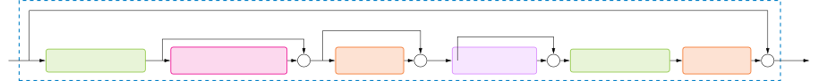

(b) Residual block

Figure 3: Architecture of the AM model.

The proposed method is evaluated using two model architectures that
represent a wide range of SE architectures. The first architecture
represents simple amplitude masking (AM) approaches common in many SE
systems. Figure 3(a) illustrates the overall architecture of the model.
It consists of $`L`$ residual blocks that sequentially transform the
input STFT features to an amplitude mask. Each residual block (detailed
in 3(b)) contains MLP layers that operate along the frequency-dimension
with shared weights across time steps, self-attention that applies
scaled dot-product attention along the time dimension, and Conv2D layers
using multi-dilated convolutions for joint time-frequency processing.
The input MLP expands the frequency dimension to 256, while the output
MLP projects back to the original frequency dimension. The enhanced
magnitude is combined with the noisy phase before transforming to the
time domain via an iSTFT. The model is trained using a mean squared
error (MSE) loss that focuses on signal reconstruction quality. In this
work we used $`L=3`$ residual blocks, resulting in a total of
approximately 1.5M parameters, of which 123K are adapted. In the
following, this architecture is denoted as _AM_.

Secondly, the popular CMGAN \[2\] is used to represent the current trend
of state-of-the-art models. It combines an encoder-decoder structure
based on DenseNet \[30\] with Conformer blocks \[31\] and implicitly
estimates phase components rather than just the magnitude. Following
current trends in SE, CMGAN prioritizes perceptual performance over
signal level metrics through a MetricGAN \[32\] based loss function. Of
the 1.8M generator parameters, 6K are adapted. Complete architectural
details and hyperparameters are provided in \[2\] and our open-source
framework.

### 4.3 Baselines

To assess the proposed method, the unadapted source models and
RemixIT (\[19\], see Section 2) are used as baselines. As RemixIT was
not designed with TTA in mind, it is adjusted to work in the TTA
setting. To conform to the online setting, i.e. only one epoch with
simultaneous adaptation and denoising, the teacher is updated every
$`U=8`$ batches instead of after each epoch. We use an exponentially
moving average teacher as proposed in \[19\] to maintain stability given
the short update intervals. Additionally, permuting speech and noise
estimates is performed for each batch individually. As recommended
in \[19\], the MSE loss is used to adapt the model on the bootstrapped
dataset.

### 4.4 Metrics

All considered TTA methods are evaluated using standard SE metrics for
evaluating speech quality. As is common in SE, this work puts an
emphasis on perceptual metrics. These include PESQ \[33\] and the
composite measures CSIG, CBAK and COVL \[34\]. To also evaluate the
signal level quality, the metrics SSNR and SI-SDR are used \[6\]. As TTA
requires simultaneous adaptation and inference, the average of the
metrics over the adaptation period is reported. Depending on the
dataset, the adaptation period comprises between 100 and 900 utterances,
each lasting 1-30s.

### 4.5 Experimental Details

The AdamW optimizer \[35\] is used for both source training and
adaptation, with learning rates $`\alpha`$ of $`1\cdot 10^{-3}`$ and
$`5\cdot 10^{-4}`$, respectively. Additionally, the code framework is
published along with instruction on how to reproduce the results. ¹¹ 1
Code available at:
[https://github.com/tobiaaa/SETTA](https://github.com/tobiaaa/SETTA) All
experiments were conducted using a single Nvidia A6000 GPU. The central
experiments are repeated 10 times to assess the statistical significance
of the results. Since TTA does not depend on random model
initializations, the main cause of randomness is the order of the data,
which varies between experiments.

## 5 RESULTS

### 5.1 Result Analysis

Table 3 shows the performance of the AM architecture averaged across the
target datasets. As LaDen’s adaptation objective is based on WavLM
embeddings, which contain high-level, perceptual information, the
adapted model performs better on the perceptual metrics than on the
signal level metrics. This also explains the relatively small gain on
the CBAK metric. WavLM’s encoder, trained with a HuBERT-like masked
prediction loss \[36\], prioritizes distinguishing between time frames.
Since background noise is typically more stationary than speech, it
receives less representation in the embeddings, resulting in adaptation
that focuses less on the background.

|       |         | $`\overline{\text{PESQ}}`$ $`\uparrow`$ | $`\overline{\text{CSIG}}`$ $`\uparrow`$ | $`\overline{\text{CBAK}}`$ $`\uparrow`$ | $`\overline{\text{COVL}}`$ $`\uparrow`$ | $`\overline{\text{SSNR}}`$ $`\uparrow`$ | $`\overline{\text{SI-SDR}}`$ $`\uparrow`$ |
| ----- | ------- | --------------------------------------- | --------------------------------------- | --------------------------------------- | --------------------------------------- | --------------------------------------- | ----------------------------------------- |
| AM    | Source  | 2.05                                    | 3.07                                    | 2.78                                    | 2.52                                    | 7.42                                    | 12.28                                     |
|       | RemixIT | 2.06$`\pm`$.006                         | 3.10$`\pm`$.007                         | 2.80$`\pm`$.005                         | 2.54$`\pm`$.006                         | 7.48$`\pm`$.03                          | 12.47$`\pm`$.04                           |
|       | LaDen   | 2.13$`\pm`$.005                         | 3.13$`\pm`$.007                         | 2.80$`\pm`$.005                         | 2.59$`\pm`$.006                         | 7.01$`\pm`$.04                          | 12.33$`\pm`$.04                           |
| CMGAN | Source  | 2.60                                    | 3.75                                    | 3.02                                    | 3.15                                    | 6.00                                    | 11.32                                     |
|       | RemixIT | 2.60$`\pm`$.006                         | 3.77$`\pm`$.006                         | 3.03$`\pm`$.007                         | 3.17$`\pm`$.007                         | 5.92$`\pm`$.07                          | 11.52$`\pm`$.07                           |
|       | LaDen   | 2.62$`\pm`$.002                         | 3.81$`\pm`$.002                         | 3.07$`\pm`$.002                         | 3.20$`\pm`$.002                         | 6.31$`\pm`$.03                          | 12.09$`\pm`$.02                           |

Table 3: Results for both architectures averaged over the datasets
($`\mu\pm 2\sigma`$). SSNR and SI-SDR in dB.

To assess the performance in more detail, Figure 4 shows the performance
per dataset for PESQ and scale-invariant signal-to-distortion ratio
(SI-SDR). The metrics are displayed as the difference to the source
performance. With the exception of the EARS-D dataset, LaDen achieves a
significantly larger perceptual improvement over the source performance
than RemixIT. On the EARS-D dataset, neither of the TTA methods
outperforms the source model. In the context of the remarkable accuracy
of DIET on this dataset (cf. Table 2), the proposed pseudo-labeling is
likely not the main limiting factor. This suggests that the source model
generalizes well for shifts only in the noise distribution, leaving
little room for improvement through adaptation (cf. Table 1). In case of
speaker and language domain shifts, the source model does not generalize
as well and latent denoising (LaDen) demonstrates significant and
consistent improvements. On the signal level metrics, RemixIT achieves a
more consistent gain compared to LaDen. As an exception, LaDen achieves
outstanding results across all metrics on the VBD datasets using the AM
architecture. While the exact reasons for this pattern require further
investigation, it suggests that the AM model has significant room for
improvement on speaker and noise domain shifts that LaDen is able to
fill.

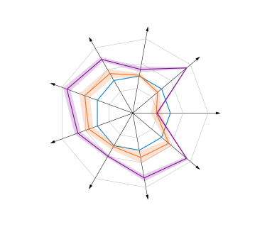

(a) $`\Delta`$PESQ $`\uparrow`$

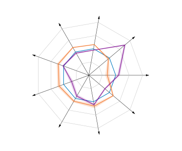

(b) $`\Delta`$SI-SDR \[dB\] $`\uparrow`$


Figure 4: TTA results relative to the source performance using the AM
model ($`\mu\pm 2\sigma`$).

The results of TTA for SE using the CMGAN architecture are listed in
Table 3. Notably, the baseline source performance reflects the
perceptual focus of MetricGAN used in CMGAN. Interestingly, in this
setting, LaDen achieves a significant gain on the signal level metrics
without diminishing the outstanding perceptual performance. In contrast,
RemixIT is not able to substantially improve upon the source performance
on any of the metrics.

Examining the dataset specific perceptual results depicted in
Figure 5(a), RemixIT closely adheres to the source performance, whereas
LaDen’s results are more mixed, achieving a significant gain on the
DNS-based datasets, at the cost of diminished performance on the EARS-D
and VoiceBank-based datasets. The contrasting behavior on the VBD
dataset using the two architectures suggests that the amenability to
adaptation depends on the underlying model architecture and source
training. On the signal level performance however (cf. Figure 5(b)),
LaDen achieves a consistent gain over the source model and RemixIT.
Interestingly, CMGAN exhibits a similar pattern for the EARS-D dataset
as the AM architecture, confirming that no significant perceptual gain
can be achieved in noise-only domain shifts.

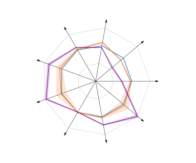

(a) $`\Delta`$PESQ $`\uparrow`$

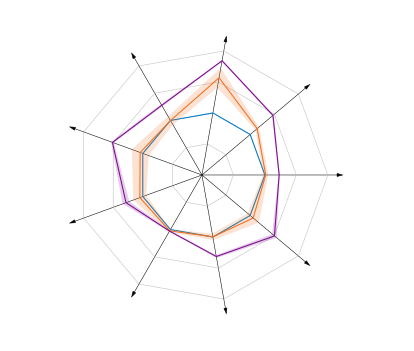

(b) $`\Delta`$SI-SDR \[dB\] $`\uparrow`$


Figure 5: TTA results relative to the source performance using CMGAN
($`\mu\pm 2\sigma`$).

These results highlight LaDen’s versatility as a TTA method for speech
enhancement. Particularly noteworthy is LaDen’s ability to enhance
CMGAN’s signal level performance without compromising its perceptual
quality. CMGAN’s MetricGAN loss puts a strong emphasis on perceptual
performance, leaving little room for improvement. Conversely, the MSE
loss of the AM architecture prioritizes signal reconstruction. In both
cases, LaDen is able to complement the strengths of the trained source
model by improving upon their respective shortcomings.

### 5.2 Ablation Study

Table 4 presents the incremental impact of each component in our
proposed method across both perceptual and signal level metrics. The
basic latent denoising approach shows notable improvements in perceptual
quality across both datasets, but exhibits mixed results for signal
level metrics. Adding envelope regularization addresses this limitation
by enforcing temporal structure. For VBD it provides substantial
improvements in both perceptual and signal level metrics. However, for
EARS-D, we observe a decrease in performance, likely due to the
prevalence of silent segments in this dataset where the regularization
introduces artifacts, which is mitigated via the proposed power
weighting. The final addition of weight averaging stabilizes the
adaptation process, preventing performance degradation over time.
Evidently, no single configuration is ideal across all datasets and
metrics, necessitating a balanced approach when adapting to unknown
domain shifts.

|                                 |                   |                     |                   |                     |     |
| ------------------------------- | ----------------- | ------------------- | ----------------- | ------------------- | --- |
|                                 | EARS-D            |                     | VBD               |                     |     |
|                                 | PESQ $`\uparrow`$ | SI-SDR $`\uparrow`$ | PESQ $`\uparrow`$ | SI-SDR $`\uparrow`$ |     |
| Source                          | 1.974             | 5.102               | 2.424             | 11.487              |     |
| $`\mathcal{L}_{\mathrm{LD}}`$   | 2.038             | 6.986               | 2.614             | 11.175              |     |
| \+ $`\mathcal{L}_{\mathrm{R}}`$ | 1.864             | 4.782               | 2.642             | 12.432              |     |
| \+ $`\bm{\rho}`$                | 1.887             | 5.064               | 2.543             | 13.097              |     |
| \+ EMA                          | 2.033             | 6.558               | 2.591             | 12.000              |     |

Table 4: Ablation study on the AM architecture. $`\bm{\rho}`$ and EMA
represent the power weights and weight averaging introduced in
Section 3, respectively. SI-SDR in dB.

## 6 DISCUSSION

The TTA results demonstrate that LaDen provides effective adaptation for
speech enhancement across multiple domain shifts and model
architectures. While neither TTA method succeeds with noise-only domain
shifts, LaDen consistently outperforms RemixIT on perceptual metrics,
particularly for domain shifts involving speakers or languages.
Furthermore, LaDen’s ability to improve CMGAN’s signal level performance
without compromising its perceptual quality highlights the complementary
nature of latent denoising to both the MSE loss of the AM model, as well
as the perceptual approach of CMGAN.

The effectiveness of DIET suggests that while domain shifts may be
complex at the signal level, they become more manageable in the latent
space. Besides DIET’s impressive estimation accuracy, its ability to
estimate reliable pseudo-labels further validates the underlying
principle. There are multiple reasons for a simple, even linear
relationship between the embeddings of clean speech and noisy speech.
Previous studies found that large encoders semantically disentangle the
structure of their input space \[37\]. In the context of natural
language processing, this means semantic concepts are represented by
directions in the embedding space, where causally separable concepts are
represented by orthogonal vectors \[37\]. The proposed DIET translates
this to the independent concepts of speech and noise in the embedding
space of speech encoders. This phenomenon is also known in vision where
nonlinear transformations (e.g., lighting, composition) can be
linearized in learned embeddings \[38\].

Our approach reveals fundamental differences between TTA for SE and
classification tasks. Unlike classification, where entropy serves as a
natural adaptation signal and confidence heuristic, speech enhancement
requires more sophisticated proxies for adaptation quality. Furthermore,
whereas the accuracy suffices in comparing classification TTA methods,
SE TTA methods cannot be judged solely on their effectiveness, but also
on the alignment of their adaptation objective to the task at hand, e.g.
the trade-off between perceptual and signal level performance.

Future research should address several promising directions. Extending
LaDen to handle reverberant conditions represents an important next
step, possibly requiring specialized latent representations that capture
room acoustics. Improving adaptation for noise-only shifts, despite
their currently limited gains, could benefit scenarios with highly
non-stationary noise. Finally, the extent to which DIET is applicable to
other domains such as image-to-image transformation in computer vision
or medical image enhancement like MRI artifact removal presents a
compelling challenge for future research.

## 7 CONCLUSION

We presented LaDen, the first test-time adaptation method specifically
designed for speech enhancement. By leveraging speech representations
from an existing speech encoder and performing latent denoising through
a domain invariant embedding transformation of noisy embeddings, our
approach enables effective adaptation across multiple domain shifts
(noise, speaker, language) without requiring labeled target data. Our
comprehensive evaluation demonstrated LaDen’s ability to improve
perceptual quality across varied acoustic conditions, with particular
effectiveness for speaker and language domain shifts. LaDen’s consistent
performance across different model architectures and training objectives
highlights its versatility as a practical solution for real-world speech
enhancement systems that must adapt to previously unseen environments.
This work establishes a foundation for future research on test-time
adaptation methods specifically designed for generative audio tasks.

## References

- \[1\] Cassia Valentini-Botinhao, Xin Wang, Shinji Takaki, and Junichi
  Yamagishi, “Investigating rnn-based speech enhancement methods for
  noise-robust text-to-speech,” in 9th ISCA Workshop on Speech Synthesis
  Workshop (SSW 9), 2016, pp. 146–152.
- \[2\] Ruizhe Cao, Sherif Abdulatif, and Bin Yang, “Cmgan:
  Conformer-based metric gan for speech enhancement,” in Proc.
  Interspeech 2022, 2022, pp. 936–940.
- \[3\] Julius Richter et al., “EARS: An anechoic fullband speech
  dataset benchmarked for speech enhancement and dereverberation,” in
  ISCA Interspeech, 2024, pp. 4873–4877.
- \[4\] Dequan Wang, Evan Shelhamer, Shaoteng Liu, Bruno Olshausen, and
  Trevor Darrell, “Tent: Fully test-time adaptation by entropy
  minimization,” in International Conference on Learning
  Representations, 2020.
- \[5\] Robert A Marsden, Mario Döbler, and Bin Yang, “Universal
  test-time adaptation through weight ensembling, diversity weighting,
  and prior correction,” in Proceedings of the IEEE/CVF Winter
  Conference on Applications of Computer Vision, 2024, pp. 2555–2565.
- \[6\] Philipos C. Loizou, Speech Enhancement: Theory and Practice, CRC
  Press, Inc., USA, 2nd edition, 2013.
- \[7\] Kazuki Adachi, Shin’ya Yamaguchi, Atsutoshi Kumagai, and Tomoki
  Hamagami, “Test-time adaptation for regression by subspace alignment,”
  in The Thirteenth International Conference on Learning
  Representations, 2025.
- \[8\] Pascal Schlachter and Bin Yang, “Comet: Contrastive mean teacher
  for online source-free universal domain adaptation,” in 2024
  International Joint Conference on Neural Networks (IJCNN). IEEE, 2024,
  pp. 1–9.
- \[9\] Yu Sun, Xiaolong Wang, Zhuang Liu, John Miller, Alexei Efros,
  and Moritz Hardt, “Test-time training with self-supervision for
  generalization under distribution shifts,” in International conference
  on machine learning. PMLR, 2020, pp. 9229–9248.
- \[10\] Ching Hua Lee et al., “Leveraging self-supervised speech
  representations for domain adaptation in speech enhancement,” in
  ICASSP, 2024, pp. 10831–10835.
- \[11\] Steffen Schneider, Evgenia Rusak, Luisa Eck, Oliver Bringmann,
  Wieland Brendel, and Matthias Bethge, “Improving robustness against
  common corruptions by covariate shift adaptation,” Advances in neural
  information processing systems, vol. 33, pp. 11539–11551, 2020.
- \[12\] Mario Döbler, Robert A Marsden, and Bin Yang, “Robust mean
  teacher for continual and gradual test-time adaptation,” in
  Proceedings of the IEEE/CVF Conference on Computer Vision and Pattern
  Recognition, 2023, pp. 7704–7714.
- \[13\] Shuaicheng Niu et al., “Efficient test-time model adaptation
  without forgetting,” in International conference on machine learning.
  PMLR, 2022, pp. 16888–16905.
- \[14\] Jonghyun Lee et al., “Entropy is not enough for test-time
  adaptation: From the perspective of disentangled factors,” in 12th
  International Conference on Learning Representations, ICLR 2024, 2024.
- \[15\] Qin Wang, Olga Fink, Luc Van Gool, and Dengxin Dai, “Continual
  test-time domain adaptation,” in Proceedings of the IEEE/CVF
  Conference on Computer Vision and Pattern Recognition, 2022, pp.
  7201–7211.
- \[16\] Shuai Wang, Daoan Zhang, Zipei Yan, Jianguo Zhang, and Rui Li,
  “Feature alignment and uniformity for test time adaptation,” in
  Proceedings of the IEEE/CVF Conference on Computer Vision and Pattern
  Recognition, 2023, pp. 20050–20060.
- \[17\] Hsin-Yi Lin, Huan-Hsin Tseng, Xugang Lu, and Yu Tsao,
  “Unsupervised noise adaptive speech enhancement by
  discriminator-constrained optimal transport,” Advances in Neural
  Information Processing Systems, vol. 34, pp. 19935–19946, 2021.
- \[18\] Katerina Zmolikova, Michael Syskind Pedersen, and Jesper
  Jensen, “Masked spectrogram prediction for unsupervised domain
  adaptation in speech enhancement,” IEEE Open Journal of Signal
  Processing, vol. 5, pp. 274–283, 2024.
- \[19\] Efthymios Tzinis, Yossi Adi, Vamsi K Ithapu, Buye Xu, Paris
  Smaragdis, and Anurag Kumar, “RemixIT: Continual self-training of
  speech enhancement models via bootstrapped remixing,” IEEE Journal of
  Selected Topics in Signal Processing, vol. 16, no. 6, pp.
  1329–1341, 2022.
- \[20\] Alexei Baevski, Yuhao Zhou, Abdelrahman Mohamed, and Michael
  Auli, “wav2vec 2.0: A framework for self-supervised learning of speech
  representations,” Advances in neural information processing systems,
  vol. 33, pp. 12449–12460, 2020.
- \[21\] Tsun-An Hsieh, Cheng Yu, Szu-Wei Fu, Xugang Lu, and Yu Tsao,
  “Improving perceptual quality by phone-fortified perceptual loss using
  wasserstein distance for speech enhancement,” in Proc. Interspeech
  2021, 2021, pp. 196–200.
- \[22\] Sunwoo Kim and Minje Kim, “Test-time adaptation toward
  personalized speech enhancement: Zero-shot learning with knowledge
  distillation,” in 2021 IEEE Workshop on Applications of Signal
  Processing to Audio and Acoustics (WASPAA). IEEE, 2021, pp. 176–180.
- \[23\] Sanyuan Chen et al., “Wavlm: Large-scale self-supervised
  pre-training for full stack speech processing,” IEEE Journal of
  Selected Topics in Signal Processing, vol. 16, no. 6, pp.
  1505–1518, 2022.
- \[24\] Shu-wen Yang et al., “A large-scale evaluation of speech
  foundation models,” IEEE/ACM Transactions on Audio, Speech, and
  Language Processing, 2024.
- \[25\] Alan V. Oppenheim and Ronald W. Schafer, Discrete-Time Signal
  Processing, Prentice-Hall, Upper Saddle River, New Jersey, 1999.
- \[26\] Gordon Wichern et al., “Wham!: Extending speech separation to
  noisy environments,” arXiv preprint arXiv:1907.01160, 2019.
- \[27\] Joachim Thiemann, Nobutaka Ito, and Emmanuel Vincent, “The
  diverse environments multi-channel acoustic noise database (demand): A
  database of multichannel environmental noise recordings,” The Journal
  of the Acoustical Society of America, vol. 133, pp. 3591, 05 2013.
- \[28\] Christophe Veaux, Junichi Yamagishi, and Simon King, “The voice
  bank corpus: Design, collection and data analysis of a large regional
  accent speech database,” in 2013 International Conference Oriental
  COCOSDA held jointly with 2013 Conference on Asian Spoken Language
  Research and Evaluation (O-COCOSDA/CASLRE), 2013, pp. 1–4.
- \[29\] Harishchandra Dubey et al., “Icassp 2022 deep noise suppression
  challenge,” in ICASSP, 2022.
- \[30\] Ashutosh Pandey and DeLiang Wang, “Densely connected neural
  network with dilated convolutions for real-time speech enhancement in
  the time domain,” in ICASSP 2020 - 2020 IEEE International Conference
  on Acoustics, Speech and Signal Processing (ICASSP), 2020, pp.
  6629–6633.
- \[31\] Anmol Gulati et al., “Conformer: Convolution-augmented
  transformer for speech recognition,” in Proc. Interspeech 2020, 2020,
  pp. 5036–5040.
- \[32\] Szu-Wei Fu, Chien-Feng Liao, Yu Tsao, and Shou-De Lin,
  “Metricgan: Generative adversarial networks based black-box metric
  scores optimization for speech enhancement,” in International
  Conference on Machine Learning. PmLR, 2019, pp. 2031–2041.
- \[33\] Antony W. Rix, John G. Beerends, Mike Hollier, and Andries P.
  Hekstra, “Perceptual evaluation of speech quality (pesq)-a new method
  for speech quality assessment of telephone networks and codecs,” 2001
  IEEE International Conference on Acoustics, Speech, and Signal
  Processing. Proceedings (Cat. No.01CH37221), vol. 2, pp. 749–752
  vol.2, 2001.
- \[34\] Yi Hu and Philipos C. Loizou, “Evaluation of objective quality
  measures for speech enhancement,” IEEE Transactions on Audio, Speech,
  and Language Processing, vol. 16, no. 1, pp. 229–238, 2008.
- \[35\] Ilya Loshchilov and Frank Hutter, “Decoupled weight decay
  regularization,” in International Conference on Learning
  Representations, 2019.
- \[36\] Wei-Ning Hsu, Benjamin Bolte, Yao-Hung Hubert Tsai, Kushal
  Lakhotia, Ruslan Salakhutdinov, and Abdelrahman Mohamed, “Hubert:
  Self-supervised speech representation learning by masked prediction of
  hidden units,” IEEE/ACM transactions on audio, speech, and language
  processing, vol. 29, pp. 3451–3460, 2021.
- \[37\] Kiho Park, Yo Joong Choe, and Victor Veitch, “The linear
  representation hypothesis and the geometry of large language models,”
  in International Conference on Machine Learning. PMLR, 2024, pp.
  39643–39666.
- \[38\] Lewis Smith, Lisa Schut, Yarin Gal, and Mark van der Wilk,
  “Capsule networks–a probabilistic perspective,” arXiv preprint
  arXiv:2004.03553, 2020.
