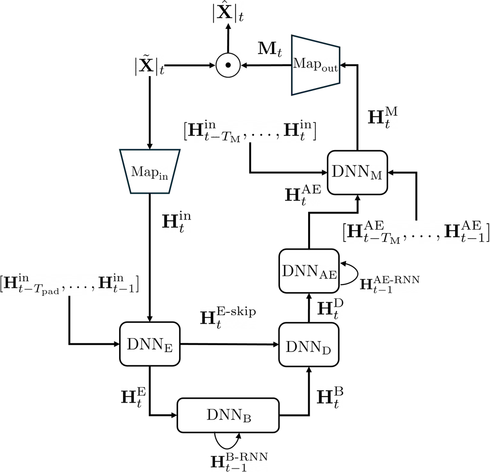

# Lightweight DNN for Full-Band Speech Denoising on Mobile Devices: Exploiting Long and Short Temporal Patterns

Konstantinos Drossos Affiliation: Nokia Technologies  
Espoo, Finland  
konstaninos.drosos@nokia.com    Mikko Heikkinen Affiliation: Nokia
Technologies  
Tampere, Finland  
mikko.heikkinen@nokia.com    Paschalis Tsiaflakis Affiliation: Nokia
Bell Labs  
Antwerp, Belgium  
paschalis.tsiaflakis@nokia-bell-labs.com

###### Abstract

Speech denoising (SD) is an important task of many, if not all, modern
signal processing chains used in devices and for everyday-life
applications. While there are many published and powerful deep neural
network (DNN)-based methods for SD, few are optimized for
resource-constrained platforms such as mobile devices. Additionally,
most DNN-based methods for SD are not focusing on full-band (FB)
signals, i.e. having 48 kHz sampling rate, and/or low latency cases. In
this paper we present a causal, low latency, and lightweight DNN-based
method for full-band SD, leveraging both short and long temporal
patterns. The method is based on a modified UNet architecture employing
look-back frames, temporal spanning of convolutional kernels, and
recurrent neural networks for exploiting short and long temporal
patterns in the signal and estimated denoising mask. The DNN operates on
a causal frame-by-frame basis taking as an input the STFT magnitude,
utilizes inverted bottlenecks inspired by MobileNet, employs causal
instance normalization for channel-wise normalization, and achieves a
real-time factor below 0.02 when deployed on a modern mobile phone. The
proposed method is evaluated using established speech denoising metrics
and publicly available datasets, demonstrating its effectiveness in
achieving an (SI-)SDR value that outperforms existing FB and low latency
SD methods.

###### Index Terms: 

speech denoising, full-band, low latency, real-time, UNet, deep neural
networks, mobile devices

## I Introduction

Speech denoising (SD) is crucial task in most applications of
communications \[1, 2\]. From large, complex systems to small devices
with real-time requirements, there is almost always the need for
denoising a speech signal. Especially with the proliferation of
technological advances and applications, SD is widely and commonly used
as the first step of speech signal enhancement in a processing chain.
Recent advances in SD show that methods employing computationally
complex deep neural networks (DNNs) outperform legacy/traditional
digital signal processing (DSP) based methods. For example, the method
in \[3\] yields results that outperform oracle performance, whereas
methods in \[4\] employ DNNs that can restore a speech signal by
alleviating multiple degradations like noise, clicking, packet loss,
etc. Although such results are impressive, the DNNs in these methods are
too computationally complex to be deployed in small devices for
real-time usage. Additionally, the speech signals used in the
aforementioned methods typically operate at or below 16 kHz sampling
rate.

The above two considerations (i.e. complexity and sampling rate) are
important and can prove to be restrictive factors for communication
applications that are using high-fidelity and full-band audio (i.e. with
48 kHz sampling rate). For example, modern day handheld or mobile
devices that want to use modern voice codecs with full-band audio, like
3GPP Immersive Voice and Audio Services  \[5\], have to find ways to
sidestep the above issues. Some recently published SD methods are
focusing on the denoinsing/enhancement of speech signals with real-time
(or almost real-time) processing and, in some cases, with using
full-band speech signals. In \[6, 7, 8\] are presented SD methods that
exhibit reduced computational complexity, with some of them using the
well-known UNet architecture \[9\].

While the above methods are focusing on the computational complexity
issue, they are using signals that operate on 16 Hz sampling rate. But,
there are other methods that seem to tackle the complexity issue while
using full-band signals, like \[2, 10, 11\]. Though, some of these
methods seem to have inherent latency, as they are commonly using
look-ahead frames (LAFs), for example \[2\]. In the most common case
where an SD method is used in a larger signal processing chain, LAFs can
significantly impact the total algorithmic/processing delay of the
signal processing chain. Thus, using LAFs may be deemed undesirable for
many low latency applications. Additionally, some of the existing
low-complexity, full-band methods process both phase and magnitude
spectrum, for example \[2\]. Again, when SD is used in a larger signal
processing chain, affecting the phase of the input noisy mixture might
be unwanted and have side effects to the rest of the processing chain.

In this paper we focus on communication applications using high-fidelity
audio and full-band audio (i.e. 48kHz sampling rate) and we present a
UNet-variant SD method that prioritizes the three considerations of the
computational complexity, very low latency, and full-band speech
signals. Our method is causal, operates on a single frame of short-time
Fourier transform (STFT) magnitude, employs learning of short and long
temporal patterns in the encoding, decoding, and mask prediction
processes, is extremely lightweight (with a real-time factor below
0.02), is focused on full-band signals, and is of low latency (no LAFs)
and real-time. We evaluate our method using established speech denoising
metrics and publicly available datasets, obtaining state-of-the-art
(SI-)SDR on full-band datasets. To the best of our knowledge, our method
is outperforming existing methods as a full-band SD method, using no
LAFs and having very small real-time factor. The rest of the paper is as
follows. Section II holds the presentation of the SD method while
Section III presents the followed evaluation process. In Section IV are
the obtained results with their discussion, and Section V concludes the
paper.

## II Proposed method

Our method takes as an input a STFT magnitude vector of a full-band
noisy speech signal at time-step (or frame) $`t`$ and with $`F`$
frequency bands, $`|\tilde{\mathbf{X}}|_{t}\in\mathbb{R}_{\geq 0}^{F}`$,
and outputs its denoised version, $`|\hat{\mathbf{X}}|_{t}`$. To do so,
our method exploits short and long temporal patterns in input signal and
learned representations by employing different auxiliary outputs at
previous time-steps, two CNN-based modules with kernels that span
multiple time-steps, and two RNN-based modules that apply recurrence
over the time dimension. Additionally, our method is causal and does not
exploit any future time-step information nor require access to
look-ahead frames.

There are seven sub-modules in our method, namely: i) a learned
mapping/filter-bank $`\text{Map}_{\text{in}}`$, ii) a CNN-based encoder
$`\text{DNN}_{\text{E}}`$, iii) an RNN-based bottleneck
$`\text{DNN}_{\text{B}}`$, iv) a CNN-based decoder
$`\text{DNN}_{\text{D}}`$, v) an RNN-based autoencoder
$`\text{DNN}_{\text{AE}}`$, vi) a CNN-based mask predictor
$`\text{DNN}_{\text{M}}`$, and vii) a learned output mapping
$`\text{Map}_{\text{out}}`$. The latter outputs a frequency mask at time
step $`t`$, $`\mathbf{M}_{t}`$. $`\mathbf{M}_{t}`$ is applied to
$`|\tilde{\mathbf{X}}|_{t}`$, yielding $`|\hat{\mathbf{X}}|_{t}`$, while
the phase of the input noisy signal, $`\angle\tilde{\mathbf{X}}_{t}`$,
is left unaltered and used to synthesize back the time-domain predicted
signal from $`|\hat{\mathbf{X}}|_{t}`$. Figure 1 illustrates our method
and its sub-modules.



Fig. 1: Illustration of the proposed method with the sub-modules. Output
matrices’ notation is of the form $`\mathbf{H}^{L}_{t}`$, where $`L`$ is
the corresponding sub-module index/short-hand, seen at the name of the
sub-module, $`t`$ is the time-step index, and $`T_{\text{pad}}`$ and
$`T_{\text{M}}`$ are the number of previous time-steps used in CNN-based
sub-modules. The RNN index signifies specifically the RNN component of
sub-modules, and the skip index, skip connections.

### II-A Input mapping and encoder

$`\text{Map}_{\text{in}}`$ is the first sub-module of our method and is
tasked with pre-processing the input vector, normalizing it and reducing
its input dimensionality. To do so, $`\text{Map}_{\text{in}}`$ consists
of a learned normalization process and a learnable mapping function,
$`F\mapsto F^{\prime}`$ with $`F>F^{\prime}`$. The mapping function is
implemented by a feed-forward neural network (FNN) followed by another
normalization process and a nonlinearity. The output of
$`\text{Map}_{\text{in}}`$ is
$`\mathbf{H}^{\text{in}}_{t}\in\mathbb{R}^{F^{\prime}}`$, obtained as

```math
\mathbf{H}^{\text{map-in}}_{t}=\text{Map}_{\text{in}}(|\tilde{\mathbf{X}}|_{t}). \tag{1}
```

Our method utilizes the input mapping sub-module as a way to globally
reduce the complexity of the method, by enforcing a reduced
dimensionality space since the very beginning of the processing. This,
effectively, makes the method to operate on its own input dimensionality
space, defined by $`F^{\prime}`$.

Next is the CNN-based encoder, $`\text{DNN}_{\text{E}}`$, designed after
the UNet architecture \[9\]. $`\text{DNN}_{\text{E}}`$ takes as an input
the $`\mathbf{H}^{\text{map-in}}_{t}`$ and a number of previous outputs
from $`\text{Map}_{\text{in}}`$ equal to $`T_{\text{pad}}`$,
$`[\mathbf{H}^{\text{map-in}}_{t-T_{\text{pad}}},\ldots,\mathbf{H}^{\text{map-in}}_{t-1}]`$.
The encoder first learns a short-time-pattern informed representation of
the current input $`\mathbf{H}^{\text{map-in}}_{t}`$, and then extracts
from the latter an encoded version $`\mathbf{H}^{\text{E}}_{t}`$, as

```math
\displaystyle\mathbf{H}^{\text{E}}_{t} \displaystyle=\text{DNN}_{\text{E}}(\mathbf{H}^{\text{in-pad}}),\text{ where} \tag{2}
```

```math
\displaystyle\mathbf{H}^{\text{in-pad}} \displaystyle=[(\mathbf{H}^{\text{map-in}}_{t-T_{\text{pad}}})^{\mathrm{T}};\ldots;(\mathbf{H}^{\text{map-in}}_{t})^{\mathrm{T}}]^{\mathrm{T}}\text{, and} \tag{3}
```

$`\mathbf{H}^{\text{E}}_{t}\in\mathbb{R}^{C^{N_{\text{E}}}_{\text{E, out}}\times F^{N_{\text{E}}}}`$,
$`\mathbf{H}^{\text{in-pad}}\in\mathbb{R}^{T_{\text{in-pad}}\times F_{\text{in-pad}}}`$,
and $`T_{\text{in-pad}}`$ and $`F_{\text{in-pad}}`$ are the time and
frequency related dimensions of $`\mathbf{H}^{\text{in-pad}}`$.
$`\text{DNN}_{\text{E}}`$ consists of $`1+N_{\text{E}}`$ concatenated
CNN blocks. The first CNN block consists of a 2D CNN, followed by a
normalization process and a nonlinearity. The kernel of the 2D CNN at
the first CNN block spans $`T_{\text{pad}}`$ time-steps in the time
dimension, outputs $`C^{1}_{\text{E, in}}=T_{\text{pad}}`$ channels, and
the convolution operation has appropriate padding and strides to reduce
the time dimension to 1 and not alter the frequency dimension.
Essentially, the first CNN block tries to map the short temporal
patterns of $`\mathbf{H}^{\text{in-pad}}`$ in the channel dimension of
its output.

The other $`N_{\text{E}}`$ CNN blocks of the encoder consist of three 1D
CNNs, modeled after MobileNet v2 \[12\]. The first is a point-wise 1D
CNN, with unit kernel, that increases channel dimension of the learned
features from $`C^{n_{\text{E}}}_{\text{E, in}}`$ to
$`C^{n_{\text{E}}}_{\text{E}}`$, the second is a depth-wise 1D CNN, with
$`K^{n_{\text{E}}}_{\text{E}}`$ kernel using
$`S^{n_{\text{E}}}_{\text{E}}`$ stride, that operates on the increased
channel/dimensionality space. The third 1D CNN is also point-wise, with
unit kernel, that brings down the dimensionality of the features from
$`C^{n_{\text{E}}}_{\text{E}}`$ to $`C^{n_{\text{E}}}_{\text{E, out}}`$.
All three 1D CNNs are followed by a normalization process and only the
first two have a nonlinearity following the normalization.

Our method uses the UNet architecture as the basis for the encoder in
order to, on the one-hand, utilize a widely adopted architecture with
proven well performance in the speech denoising task and, on the other
hand, enable the adoption of complexity reduction techniques that have
been developed and applied for CNN-based modules. Regarding the
complexity aspect, our method employs the MobileNet v2 structure and the
inverted bottlenecks, allowing both effective processing of the learned
features and reduced complexity and number of learnable parameters.
Additionally, to take advantage of short-time temporal patters, the
encoder of our method takes as an input previous outputs of the mapping
process, further showing the impact of the mapping process and enhancing
the temporal perception of the encoder.

### II-B Bottleneck

$`\mathbf{H}^{\text{E}}_{t}`$ is given as an input to the bottleneck
$`\text{DNN}_{\text{B}}`$ of our method. $`\text{DNN}_{\text{B}}`$
process its input, exploiting long temporal patterns between the current
and previous inputs, and then outputs $`\mathbf{H}^{\text{B}}_{t}`$ as

```math
\mathbf{H}^{\text{B}}_{t}=\text{DNN}_{\text{B}}(\mathbf{H}^{\text{E}}_{t})\text{,} \tag{4}
```

where $`\mathbf{H}^{\text{B}}_{t}`$ and $`\mathbf{H}^{\text{E}}_{t}`$
have same dimensionality. $`\text{DNN}_{\text{B}}`$ consists of a 1D CNN
that maps all features to the channel dimension, effectively creating a
1D vector from the 2D (channel and feature dimensions) of its input, an
RNN that process the output of the 1D CNN, and then another 1D CNN that
maps back the output of the RNN to the same dimensionality of
$`\mathbf{H}^{\text{E}}_{t}`$. Effectively, the bottleneck utilizes the
1D CNNs to map the input of the bottleneck back and forth to a vector,
so the RNN can use that vector. The RNN is employed in order to discover
and exploit long temporal patterns at the output of the encoder,
enhancing both the temporal perception of the whole method and the
decoding process.

Given the above, the input to the first 1D CNN of the bottleneck is
shuffled at its dimensions, where the features and channels dimensions
are swapped. The 1D CNN applies a unit kernel reducing the number of
channels to 1, effectively creating a vector. This vector is given as an
input to the RNN of the bottleneck, along with the previous output of
the RNN, which is indicated as $`\mathbf{H}^{\text{B-RNN}}_{t-1}`$ in
Figure 1. Finally, the last 1D CNN of the bottleneck takes as an input
the output of the RNN, restores the channels back to the number of
channels before the first 1D and the dimensions are again swapped to
match the dimensionality of $`\mathbf{H}^{\text{E}}_{t}`$.

### II-C Decoder

The decoder of our method, $`\text{DNN}_{\text{D}}`$, takes as an input
the output of the bottleneck and the skip connections from the encoder,
$`\text{DNN}_{\text{D}}`$, and gradually expands the output of
bottleneck to match the dimensionality defined by the input mapping
process, $`\text{Map}_{\text{in}}`$, i.e., restore the feature dimension
to $`F^{\prime}`$, as

```math
\mathbf{H}^{\text{D}}_{t}=\text{DNN}_{\text{D}}(\mathbf{H}^{\text{B}}_{t},\mathbf{H}^{\text{E-skip}}_{t})\text{,} \tag{5}
```

where $`\mathbf{H}^{\text{D}}_{t}\in\mathbb{R}^{F^{\prime}}`$,
$`\mathbf{H}^{\text{E-skip}}_{t}`$ are the skip connections from the
encoder, as also shown in Figure 1, and the concatenation of the skip
connection with the input to each CNN block is performed at the channel
dimension. $`\text{DNN}_{\text{D}}`$ is also based on UNet architecture,
employing a series of $`N_{\text{D}}=N_{\text{E}}`$ CNN blocks based on
transposed convolutions and skip connections with the corresponding
blocks of the encoder, $`\text{DNN}_{\text{E}}`$. Obtaining and handling
the skip connections is according to the UNet model \[9\].

Each of the CNN blocks of the decoder consists of one 1D CNN and one 1D
transposed CNN, each of those followed by a normalization process and a
nonlinearity. The first CNN maps extract from its inputs (the previous
layer and the skip connection) learned features and then the second CNN
expands the frequency dimension to match the input of the corresponding
encoder CNN block, like in the typical UNet architecture/model.

### II-D Output processing

The output of the decoder, $`\mathbf{H}^{\text{D}}_{t}`$ is further
processed by the RNN-based autoencoder, $`\text{DNN}_{\text{AE}}`$, in
order to further utilize long temporal patterns. In the bottleneck, the
RNN that is employed exploits long temporal patterns at the output of
the encoder and thus focusing on enhancing the learning of and mapping
to the clean-speech manifold, by the encoder and bottleneck. Though, at
the $`\text{DNN}_{\text{AE}}`$, the RNN is employed to exploit long
temporal patterns closer to the mask prediction, enhancing the temporal
structure of the features that drive the prediction of the denoising
mask.

Given that $`\mathbf{H}^{\text{D}}_{t}`$ is a vector,
$`\text{DNN}_{\text{AE}}`$ consists of a FNN that takes as an input
$`\mathbf{H}^{\text{D}}_{t}`$ and reduces its dimensionality, an RNN
that takes as an input the output of the first FNN, and another FNN that
increases the dimensionality of the output vector from the RNN, back to
$`F^{\prime}`$. Both FNNs are followed by a normalization process and
the first FNN also includes a nonlinearity after the normalization. The
output of the $`\text{DNN}_{\text{AE}}`$, is

```math
\mathbf{H}^{\text{AE}}_{t}=\text{DNN}_{\text{AE}}(\mathbf{H}^{\text{D}}_{t})\text{, } \tag{6}
```

where $`\mathbf{H}^{\text{AE}}_{t}\in\mathbb{R}^{F^{\prime}}`$.

$`\mathbf{H}^{\text{AE}}_{t}`$ is then given as an input to a further 2D
CNN, the $`\text{DNN}_{\text{M}}`$, along with $`T_{\text{M}}`$ vectors
of the mapped noisy magnitude spectrogram,
$`[\mathbf{H}^{\text{M}}_{t-T_{\text{M}}},\ldots,\mathbf{H}^{\text{M}}_{t}]`$,
and previous outputs of the $`\text{DNN}_{\text{AE}}`$,
$`[\mathbf{H}^{\text{AE}}_{t-T_{\text{M}}},\ldots,\mathbf{H}^{\text{AE}}_{t-1}]`$,
as

```math
\displaystyle\mathbf{H}^{\text{M}}_{t} \displaystyle=\text{DNN}_{\text{M}}(\mathbf{H}^{\text{AE}},\mathbf{H}^{\text{in}})\text{, where} \tag{7}
```

```math
\displaystyle\mathbf{H}^{\text{in}} \displaystyle=[\mathbf{H}^{\text{in}}_{t-T_{\text{M}}},\ldots,\mathbf{H}^{\text{in}}_{t}]\text{,} \tag{8}
```

```math
\displaystyle\mathbf{H}^{\text{AE}} \displaystyle=[\mathbf{H}^{\text{AE}}_{t-T_{\text{M}}},\ldots,\mathbf{H}^{\text{AE}}_{t}]\text{, and} \tag{9}
```

$`\mathbf{H}^{\text{AE}}`$ and $`\mathbf{H}^{\text{in}}`$ are
concatenated at the channel dimension. Effectively,
$`\text{DNN}_{\text{M}}`$ is tasked with predicting the denoising mask
in the reduced dimensionality of $`F^{\prime}`$ features, using current
and $`T_{\text{M}}`$ previous vectors of the mapped noisy input
spectrogram, $`\mathbf{H}^{\text{in}}`$, and the output of the
$`\text{DNN}_{\text{AE}}`$. Thus, exploiting short temporal patterns in
the correspondence of the noisy input and the RNN-based autoencoder
output. Must be noted that there is no normalization or nonlinearity
following the $`\text{DNN}_{\text{M}}`$.

### II-E Denoising mask prediction and application

The denoising mask, $`\mathbf{M}_{t}`$, is predicted by
$`\text{Map}_{\text{out}}`$ as

```math
\mathbf{M}_{t}=\text{Map}_{\text{out}}(\mathbf{H}^{\text{M}}_{t})\text{,} \tag{10}
```

where $`\text{Map}_{\text{out}}`$ is a learnable mapping function,
$`F^{\prime}\mapsto F`$, mapping the output of $`\text{DNN}_{\text{M}}`$
back to the dimensionality of $`|\tilde{\mathbf{X}}|_{t}`$.
$`\text{Map}_{\text{out}}`$ is implemented by an FNN, followed by a
sigmoid function that constricts the output of the FNN at the $`[0,1]`$
range and, thus, ensuring the value range of $`\mathbf{M}_{t}`$.

Finally, the predicted magnitude spectrogram of the denoised speech
signal is obtained by

```math
|\hat{\mathbf{X}}|_{t}=|\tilde{\mathbf{X}}|_{t}\odot\mathbf{M}_{t}\text{,} \tag{11}
```

where $`\odot`$ is the Hadamard (element-wise) product.

## III Evaluation

For optimizing and evaluating our method we use the publicly available
datasets from the DNS-Challenge \[13\] and VCTK test set \[14, 15\],
respectively. We assess the performance using typical speech-denoising
metrics aligned with existing published methods, and we do model
selection and parameter optimization using a validation split of the
training data along with the early stopping policy.

|           | SD-SDR | SI-SDR | STOI | PESQ-WB | MSIG | MOVRL |
| --------- | ------ | ------ | ---- | ------- | ---- | ----- |
| PercepNet | \-     | \-     | \-   | 2.54    | \-   | \-    |
| DFv1      | \-     | 16.63  | 0.94 | 2.81    | 4.14 | 3.46  |
| DFv3      | \-     | \-     | 0.94 | 3.17    | 4.34 | 3.77  |
| Ours      | 24.64  | 22.34  | 0.94 | 2.82    | 3.58 | 3.29  |

TABLE I: Results of our method (Ours), PercepNet (PNet), DeepFilter v1
(DFv1), and v3 (DFv3). Value of “-” means that the corresponding info is
not available.

### III-A Data and data pre-processing

We use the DNS-challenge dataset \[13\] (referred to as dev-set from now
on) as our training and validation data, and the VCTK test set \[15\],
which is a subset of the complete VCTK dataset \[14\] and referred to as
test-set from now on, as our testing data since it is the only
clean-speech and freely-available testing dataset with 48kHz sampling
rate. Our dev-set (i.e., the DNS-challenge dataset) consists of several
clean-speech datasets, including the complete VCTK dataset, and the
different noise datasets. The test-set is a subset of the VCTK dataset
that is used for full-band systems testing in many previous work,
e.g. \[2, 11\].

For having a fair testing process, we excluded any overlapping clean
speech files of VCTK dataset between the test-set and the dev-set.
Furthermore, to ensure an appropriate level of quality for the dev-set,
we employed the DNSMOS \[16\] and filtered the dev-set by removing all
clean speech files that had $`\text{MOS-SIG}<4.0`$ and
$`\text{MOS-OVRL}<3.9`$. Then, we randomly split the remaining data in
the dev-set to training and validation splits, using a ratio of 80-20%,
respectively, for both clean-speech and noise. Finally, we resampled as
necessary the files in the dev-set to 48 kHz sampling rate and split all
clean speech and noise files to non-overlapping segments of four seconds
duration, with padding at the beginning if needed.

For the input to our method, we sample each clean speech signal and
mixed it maximum two noise files, with an integer signal-to-noise ratio
value uniformly sampled from the range of $`-10`$ to $`25`$, obtaining
$`\tilde{\mathbf{X}}`$. Then, we scale the absolute peak amplitude of
$`\tilde{\mathbf{X}}`$ to a randomly sampled value between $`0.001`$ to
$`0.999`$, and we apply STFT with 2048 points ($`\approx 40`$ms) and 50%
overlap, obtaining the magnitude spectrogram and phase,
$`|\tilde{\mathbf{X}}|`$ and $`\angle\tilde{\mathbf{X}}`$, respectively,
both sequences of $`T`$ vectors with $`F`$ elements each.

|                              | $`\mathbf{N_{\text{params}}}`$ (M) | MACS (G)           | RTF   |
| ---------------------------- | ---------------------------------- | ------------------ | ----- |
| $`\text{Ours}_{\text{w/}}`$  | 0.451                              | 0.0064             | 0.014 |
| $`\text{Ours}_{\text{w/o}}`$ | 0.253                              | 0.0061             | 0.012 |
| PNet                         | 8.000                              | 0.8000             | \-    |
| DFv1                         | 1.780 (or 2.310)                   | 0.3500 (or 0.3600) | 0.040 |

TABLE II: $`N_{\text{params}}`$, MACS, and RTF of
$`\text{Ours}_{\text{w/}}`$, $`\text{Ours}_{\text{w/o}}`$, PNet, and
DFv1 (no available values for DFv3). Must be noted that the RTFs are
obtained on different devices and the presented numbers might be
pessimistic for our method, given the hardware used for calculating the
corresponding RTFs.

### III-B Method hyper-parameters and training

Our method is implemented having hard-swish \[17\] as all nonlinearities
and causal instance norm as the choice for all normalization processes,
apart $`\text{Map}_{\text{out}}`$ where a sigmoid is used. The reason
for the former is to reduce the computational complexity and for the
latter the observed performance improvement on the validation split. We
use $`F^{\prime}=96`$ elements as size of the mapping,
$`T_{\text{pad}}=32`$ and $`T_{\text{M}}=3`$ elements as the look-back
for learning short-term structures in the input pre-processing and
output processing of the mask, and $`N_{\text{E}}=N_{\text{D}}=6`$
encoder and decoder blocks, respectively. It has to be noted that our
method uses no look-ahead frames, significantly differentiating our
method from others that are using look-ahead frames and thus inducing
extra latency equal to the number of look-ahead frames.

We used $`C^{n_{\text{E}}}_{\text{E}}=256`$ as the output channels of
the first CNN and $`C^{n_{\text{E}}}_{\text{E, out}}=16`$ as the output
channels of the third CNN in each encoder block, except the
$`C^{N_{\text{E}}}_{\text{E, out}}=64`$. Kernels,
$`K^{n_{\text{E}}}_{\text{E}}`$, were 5, 3, 5, 3, 5, and 3, for
$`n_{\text{E}}=1,\ldots,6`$, with corresponding strides
$`S^{n_{\text{E}}}_{\text{E}}`$ 2, 1, 2, 1, 2, and 2, and proper padding
for halving the features with stride equals 2. Input and output channels
for the second CNN of the decoder are 64 and the kernels and the strides
of the second CNN in the decoder are symmetric to the encoder. All RNNs
of our method are gated recurrent units (GRUs), having only one
layer.\[18\]

We do training for our method using the training split of our dev-set
and randomly sampling all $`|\tilde{\mathbf{X}}|`$, creating batches of
32 sequences. We utilize $`\angle\tilde{\mathbf{X}}`$ along with the
$`|\hat{\mathbf{X}}|`$ in order to synthesize $`\hat{\mathbf{X}}`$ and
use SI-SDR between $`\hat{\mathbf{X}}`$ and $`\mathbf{X}`$ as a loss
function. We employ the early stopping policy using the improvement of
the validation loss, with a patience of 200 epochs. We use Adam
optimizer \[19\] with an initial learning rate of $`1e^{-4}`$ and
default values for the other hyper-parameters, reducing further the
learning rate when the validation loss was not improving for 10
consecutive epochs. Additionally, observing the norm of the gradients
and the loss curves during training, we clipped the gradients of the
parameters to have a $`2-`$norm of maximum 0.5.

### III-C Metrics and baselines

We assess the performance of our method by the signal-to-distortion
(SDR) ratio, both the scale-dependent (SD-SDR) and scale-invariant
(SI-SDR) \[20\] versions, the short-time-objective-intelligibility
(STOI) \[21\], the wide-band perceptual evaluation of speech quality
(PESQ-WB) \[22\], and the DNSMOS outputs of signal (MOS-SIG) and overall
(MOS-OVRL) \[16\]. Also, to assess the computational complexity of our
method, we calculate the average inference time over 100 forward passes.
To do so, we exported our model to TFLite format and used the benchmark
tool provided by TFLite, on a Pixel 7 phone, using its CPU and no
accelerators. From the inference time we calculate the real-time factor
for our method. Since other methods use hard-coded features (like ERB)
while our method uses a learned one, and for a fair comparison, we
provide the real-time factor of our method with and without the input
and output mapping processes. We compare our obtained results against
the previous, full-band, speech-denoising methods PercepNet \[11\],
DeepFilterNet (DF) v1 \[2\], and DF v3 \[23\].

## IV Results and discussion

In Table I are the obtained metrics for our method and other existing
methods on full-band speech denoising, employing SD- and SI-SDR, STOI,
PESQ-WB, DNSMOS-SIG (MSIG), and DNSMOS-OVRL (MOVRL). Also, in Table II
are numbers of parameters ($`N_{\text{params}}`$), multiply-accumulate
operations per second (MACS), and the obtained real-time factors (RTFs)
of our method with and without the input/output mapping, Ours*(w/) and
Ours*(w/o), respectively, and the others methods included in Table I.
RTFs of the others methods in Table II are after \[24\] and are
calculated on a notebook while ours on a mobile phone.

As can be seen from Table I, our method provides the highest SI-SDR with
a difference of over 6 dB, although it has the lowest complexity and
latency of all, meaning that our method does not employ any look-ahead
frames, and is the one with the smallest MACs and RTF (as seen in
Table II). At the same time, our method is on par with the other methods
regarding STOI and also surpasses all but one other methods on PESQ-WB.
The only other method that surpasses our own at the PESQ-WB is the third
version of DF. The lower PESQ-WB score of our method, despite better
SI-SDR and equivalent STOI, is likely because PESQ-WB only evaluates up
to 8 kHz, potentially missing enhancements our model makes in the 8 to
24 kHz region.

In contrast, DFv.3 has utilized considerable focus on processing the
frequency regions of the input signal that are valid for a sampling rate
of 16 kHz, aligning better with the PESQ evaluation range. Additionally,
PESQ-WB penalizes spectral and temporal artifacts that may arise from
our fullband processing, even if they are perceptually negligible. These
findings, and given the high STOI values, suggest that our method
achieves a better overall signal reconstruction (as shown by higher
SI-SDR), without compromising intelligibility, even if PESQ-WB is
conservative in scoring fullband methods. The above could also explain
the discrepancies between the DNSMOS values, between our method and the
compared ones. Though, this is just a hypothesis and further exploration
is needed.

Regarding complexity, and as can be seen from Table II, our method is
significantly less complex and faster. Specifically, our method exhibits
less MACS by a significant factor of $`10^{2}`$ while it is almost as
four times faster, even with the learned input/output mapping and with
the RTF measured on a mobile phone. Even though the utilized devices for
measuring the RTFs are not the same, both our and the device used for
the other methods in Table II, use single threaded execution and no
accelerators. Additionally, our method is evaluated on a mobile phone,
while the others methods in Table II on a laptop. Finally, the DNN of
our method without the input and output mapping (Ours*(w/o)) yields
$`\approx 14\%`$ smaller RTF compared with Ours*(w/), highlighting the
impact of the mapping, either learned or hard-coded (like ERB), to the
RTF of the SD, low-latency methods.

## V Conclusion

In this paper is presented a real-time (with extreme small real-time
factor), low latency (without look-ahead frames) DNN-based method for
full-band speech denoising. The method is according to the UNet
architecture, employing look-back frames and RNNs to model short and
long-term temporal patterns, in both the latent space and the output
mask. The method outperforms existing methods in SDR related metrics. It
performs relatively less good on metrics like PESQ-WB and DNSMOS, but we
conjecture that this is because these latter measures are tailored
mainly to the 16 kHz range, whereas our proposed method is developed for
a 48 kHz range. Finally, the presented method appears to be
significantly faster and less complex, having almost four times smaller
real-time factor and less MACS by a factor of around $`10^{2}`$, and
thus making the method particularly well-suited for deployment on mobile
and resource-constrained devices.

## References

- \[1\] S. Pascual, A. Bonafonte, and J. Serrà, “Segan: Speech
  enhancement generative adversarial network,” 2017. \[Online\].
  Available: https://arxiv.org/abs/1703.09452
- \[2\] H. Schroter, A. N. Escalante-B, T. Rosenkranz, and A. Maier,
  “Deepfilternet: A low complexity speech enhancement framework for
  full-band audio based on deep filtering,” in _IEEE International
  Conference on Acoustics, Speech and Signal Processing (ICASSP)_, 2022.
- \[3\] Y. Luo and N. Mesgarani, “Conv-TasNet: Surpassing Ideal
  Time–Frequency Magnitude Masking for Speech Separation,” _IEEE/ACM
  Trans. Audio, Speech and Lang. Proc._, vol. 27, no. 8, p. 1256–1266,
  Aug. 2019.
- \[4\] G. Yu _et al._, “Ks-net: Multi-band joint speech restoration and
  enhancement network for 2024 icassp ssi challenge,” in _IEEE
  International Conference on Acoustics, Speech, and Signal Processing
  Workshops (ICASSPW)_, 2024.
- \[5\] M. Multrus, S. Bruhn, J. Torres, E. Fotopoulou, T. Toftgård,
  E. Norvell, S. Döhla, Y. Gao, H.-y. Su, L. Laaksonen _et al._,
  “Immersive voice and audio services (ivas) codec-the new 3gpp standard
  for immersive communication,” in _157th AES Convention_, 2024.
- \[6\] H.-S. Choi, S. Park, J. H. Lee, H. Heo, D. Jeon, and K. Lee,
  “Real-time denoising and dereverberation wtih tiny recurrent u-net,”
  in _IEEE International Conference on Acoustics, Speech and Signal
  Processing (ICASSP)_, 2021.
- \[7\] S. S. Shetu, S. Chakrabarty, O. Thiergart, and E. Mabande,
  “Ultra low complexity deep learning based noise suppression,” in _IEEE
  International Conference on Acoustics, Speech and Signal Processing
  (ICASSP)_, 2024.
- \[8\] X. Rong, T. Sun, X. Zhang, Y. Hu, C. Zhu, and J. Lu, “Gtcrn: A
  speech enhancement model requiring ultralow computational resources,”
  in _IEEE International Conference on Acoustics, Speech and Signal
  Processing (ICASSP)_, 2024.
- \[9\] O. Ronneberger, P. Fischer, and T. Brox, “U-Net: Convolutional
  Networks for Biomedical Image Segmentation,” in _Medical Image
  Computing and Computer-Assisted Intervention (MICCAI 2015)_, Nov.
  2015, pp. 234–241.
- \[10\] J.-M. Valin, “A hybrid dsp/deep learning approach to real-time
  full-band speech enhancement,” _20th IEEE International Workshop on
  Multimedia Signal Processing (MMSP)_, 2017.
- \[11\] J.-M. Valin, U. Isik, N. Phansalkar, R. Giri, K. Helwani, and
  A. Krishnaswamy, “A perceptually-motivated approach for
  low-complexity, real-time enhancement of fullband speech,” in
  _Interspeech 2020_, 2020.
- \[12\] M. Sandler _et al._, “MobileNetV2: Inverted Residuals and
  Linear Bottlenecks,” in _IEEE/CVF Conference on Computer Vision and
  Pattern Recognition (CVPR)_, Jun. 2018, pp. 4510–4520.
- \[13\] H. Dubey, A. Aazami, V. Gopal, B. Naderi, S. Braun, R. Cutler,
  A. Ju, M. Zohourian, M. Tang, M. Golestaneh, and R. Aichner, “ICASSP
  2023 Deep Noise Suppression Challenge,” in _IEEE International
  Conference on Acoustics, Speech and Signal Processing (ICASSP)_, 2023.
- \[14\] C. Veaux, J. Yamagishi, and K. MacDonald, “CSTR VCTK Corpus:
  English Multi-speaker Corpus for CSTR Voice Cloning Toolkit,” in
  _University of Edinburgh. The Centre for Speech Technology Research
  (CSTR)_, 2019.
- \[15\] C. Valentini-Botinhao, X. Wang, S. Takaki, and J. Yamagishi,
  “Investigating rnn-based speech enhancement methods for noise-robust
  text-to-speech,” in _9th ISCA Workshop on Speech Synthesis Workshop
  (SSW 9)_, 2016.
- \[16\] C. K. Reddy, V. Gopal, and R. Cutler, “DNSMOS: A Non-Intrusive
  Perceptual Objective Speech Quality metric to evaluate Noise
  Suppressors,” in _IEEE International Conference on Acoustics, Speech
  and Signal Processing (ICASSP)_, 2021.
- \[17\] A. Howard _et al._, “Searching for MobileNetV3,” in _IEEE/CVF
  International Conference on Computer Vision (ICCV)_, 2019.
- \[18\] K. Cho, B. van Merriënboer, D. Bahdanau, and Y. Bengio, “On the
  properties of neural machine translation: Encoder–decoder approaches,”
  in _Proceedings of SSST-8, Eighth Workshop on Syntax, Semantics and
  Structure in Statistical Translation_, D. Wu, M. Carpuat, X. Carreras,
  and E. M. Vecchi, Eds. Doha, Qatar: Association for Computational
  Linguistics, Oct. 2014, pp. 103–111. \[Online\]. Available:
  https://aclanthology.org/W14-4012/
- \[19\] D. P. Kingma and J. Ba, “Adam: A method for stochastic
  optimization,” 2017. \[Online\]. Available:
  https://arxiv.org/abs/1412.6980
- \[20\] J. L. Roux, S. Wisdom, H. Erdogan, and J. R. Hershey, “SDR –
  Half-baked or Well Done?” in _IEEE International Conference on
  Acoustics, Speech and Signal Processing (ICASSP)_, 2019.
- \[21\] C. H. Taal, R. C. Hendriks, R. Heusdens, and J. Jensen, “A
  short-time objective intelligibility measure for time-frequency
  weighted noisy speech,” in _IEEE International Conference on
  Acoustics, Speech and Signal Processing (ICASSP)_, 2010.
- \[22\] A. Rix, J. Beerends, M. Hollier, and A. Hekstra, “Perceptual
  evaluation of speech quality (PESQ)-a new method for speech quality
  assessment of telephone networks and codecs,” in _IEEE International
  Conference on Acoustics, Speech, and Signal Processing. Proceedings
  (ICASSP)_, 2001.
- \[23\] H. Schröter, T. Rosenkranz, A. N. Escalante-B., and A. Maier,
  “Deepfilternet: Perceptually motivated real-time speech
  enhancement,” 2023. \[Online\]. Available:
  https://arxiv.org/abs/2305.08227
- \[24\] H. Schröter, A. N. Escalante, T. Rosenkranz, and A. K. Maier,
  “Deepfilternet2: Towards Real-Time Speech Enhancement on Embedded
  Devices for Full-Band Audio,” _2022 International Workshop on Acoustic
  Signal Enhancement (IWAENC)_, 2022.
