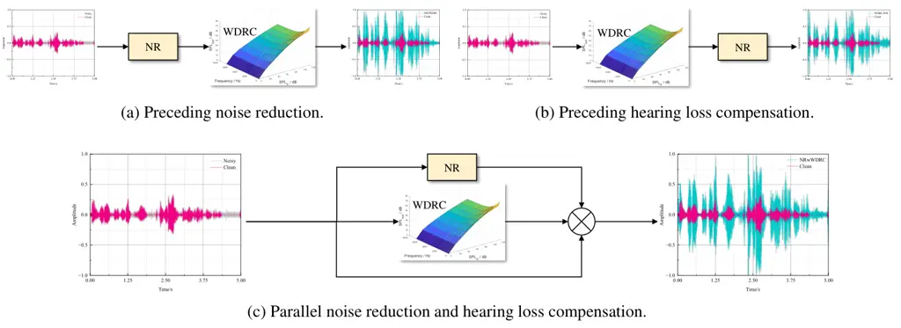
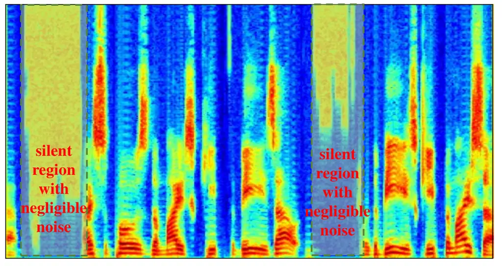
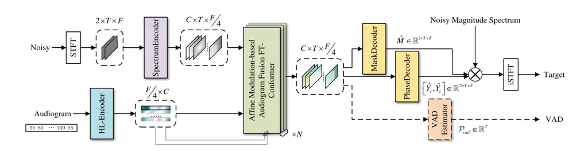
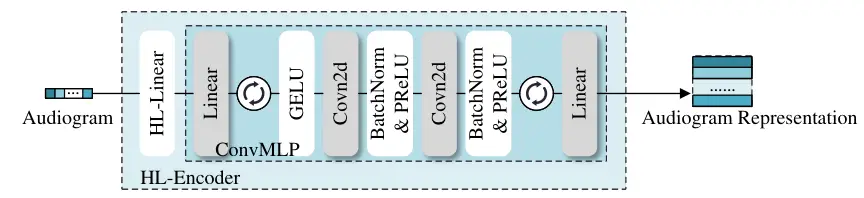
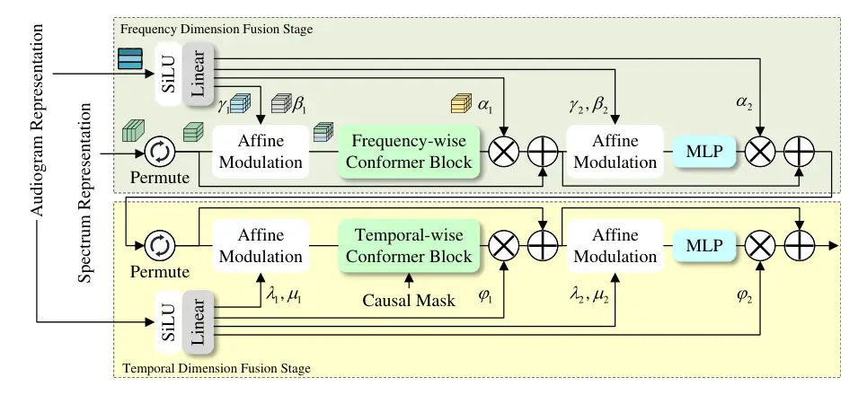
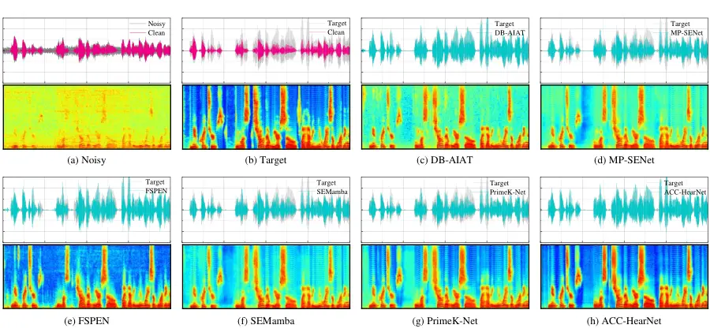

\[orcid=0009-0002-4411-3325\]

\[orcid=0000-0002-6813-4203\]

\[orcid=0009-0007-4209-6695\]

\[orcid=0000-0002-7136-7876\]

\[orcid=0000-0002-5000-2966\]

\[orcid=0000-0001-9060-6361\]

\[orcid=0009-0005-0008-5272\]

\[orcid=0000-0002-6478-8699\]

^(†)^(†)highlights: Linear interpolation provides a more suitable
approach for extending the resolution of audiograms. Affine modulation
fusion outperforms the in-context fusion strategy for audiogram and
spectrum integration. Voice activation probability information
contributes to personalized speech enhancement in hearing aids.

# Affine Modulation-based Audiogram Fusion Network for Joint Noise Reduction and Hearing Loss Compensation

Ye Ni niye@seu.edu.cn    Ruiyu Liang 101101220@seu.edu.cn    Xiaoshuai
Hao haoxiaoshuai@xiaomi.com    Jiaming Cheng 230198469@seu.edu.cn   
Qingyun Wang wangqingyun@njit.edu.cn    Chengwei Huang huangcwx@126.com
   Cairong Zou cairong@seu.edu.cn    Wei Zhou zhouw26@cardiff.ac.uk   
Weiping Ding dwp9988@163.com    Björn W. Schuller schuller@tum.de
organization=School of Information Science and Engineering, Southeast
University, city=Nanjing, postcode=210096, country=China
organization=School of Communication Engineering, Nanjing Institute of
Technology,city=Nanjing, postcode=211167, country=China
organization=Xiaomi EV, addressline=Xiaomi Campus, Anningzhuang Road,
Haidian District, postcode=100085, state=Beijing, country=China
organization=Cardiff University, city=Cardiff, country=United Kingdom
organization=School of Artificial Intelligence and Computer Science,
Nantong University, city=Nantong, postcode=226019, country=China
organization=CHI — Chair of Health Informatics, Technical University of
Munich University Hospital, city=Munich, postcode=81675, country=Germany
organization=GLAM — Group on Language, Audio, & Music, Imperial College
London, city=London, postcode=SW7 2AZ, country=United Kingdom

###### Abstract

Hearing aids (HAs) are widely used to provide personalized speech
enhancement (PSE) services, improving the quality of life for
individuals with hearing loss. However, HA performance significantly
declines in noisy environments as it treats noise reduction (NR) and
hearing loss compensation (HLC) as separate tasks. This separation leads
to a lack of systematic optimization, overlooking the interactions
between these two critical tasks, and increases the system complexity.
To address these challenges, we propose a novel audiogram fusion
network, named AFN-HearNet, which simultaneously tackles the NR and HLC
tasks by fusing cross-domain audiogram and spectrum features. We propose
an audiogram-specific encoder that transforms the sparse audiogram
profile into a deep representation, addressing the alignment problem of
cross-domain features prior to fusion. To incorporate the interactions
between NR and HLC tasks, we propose the affine modulation-based
audiogram fusion frequency-temporal Conformer that adaptively fuses
these two features into a unified deep representation for speech
reconstruction. Furthermore, we introduce a voice activity detection
auxiliary training task to embed speech and non-speech patterns into the
unified deep representation implicitly. We conduct comprehensive
experiments across multiple datasets to validate the effectiveness of
each proposed module. The results indicate that the AFN-HearNet
significantly outperforms state-of-the-art in-context fusion joint
models regarding key metrics such as HASQI and PESQ, achieving a
considerable trade-off between performance and efficiency. The source
code and data will be released at
https://github.com/deepnetni/AFN-HearNet.

###### keywords

Audiogram and spectrum fusion ,Adaptive feature fusion ,Cross-domain
integrating ,Personalized speech enhancement

^(†)^(†)corresponding: Corresponding authors.

## 1 Introduction

According to the World Health Organization, by 2050, over 700 million
people—around one in ten—are projected to experience disabling hearing
loss. If left untreated, hearing loss can lead to various complications,
including social isolation and even dementia. In this context, hearing
aids (HAs) play a crucial role in improving the hearing-specific
health-related quality of life for individuals with hearing loss \[18\].
By enhancing understanding during conversations, HAs enable users to
connect more effectively with family, friends, and colleagues. This
personalized speech enhancement (PSE) service not only improves
communication but also helps reduce the risk of associated issues,
fostering better overall well-being.



Figure 1: Examples of NR and HLC processes in hearing aids include:
serial concatenation, such as (a) preceding NR and (b) preceding HLC,
each followed by another component; and (c) parallel NR and HLC, where
both NR and the WDRC algorithm are applied independently to the noisy
speech.



Figure 2: Example of a compensated speech spectrogram, where dashed
boxes indicate silent regions with negligible noise.

To restore audibility, HAs commonly employ hearing loss compensation
(HLC), a nonlinear amplification strategy that reshapes the acoustic
input to accommodate the limited dynamic range of listeners with hearing
impairment. The most widely used approach is the wide dynamic range
compression (WDRC) algorithm, which mimics the function of outer hair
cells in the cochlea by providing level-dependent amplification, thereby
improving audibility while maintaining loudness comfort. Despite being
the most effective means of hearing rehabilitation, HLC inevitably
amplifies not only speech but also background noise, which substantially
degrades listening comfort and may impose additional perceptual burdens
on hearing-impaired listeners under noisy conditions. To alleviate this
issue, HAs typically utilize a noise reduction (NR) component to
suppress background noise prior to amplification. Fig. 1 illustrates the
existing topologies of NR and HLC modules in HAs. Although traditional
NR algorithms \[1, 47, 2\] are very robust when dealing with stationary
noise, their performance is degraded in a nonstationary noisy
environment \[31\]. Whether configured in a series or parallel manner,
the enhanced speech often retains considerable residual interference,
which reveals the inherent limitations of traditional HA frameworks in
adapting to complex acoustic conditions. As illustrated in Fig. 2, even
when residual noise seems negligible, the WDRC algorithm can still
induce pronounced spectral distortions, particularly in non-speech
segments and within the high-frequency range. Consequently, HAs often
perform poorly in noisy environments \[64, 10\], where individuals with
hearing loss require the most assistance.

Recently, deep neural networks (DNN) models utilizing the
frequency-temporal sequence modules, e.g., FT-LSTM \[46, 36\] and
FT-Conformer \[5\], have emerged as powerful backbones for speech
enhancement, providing a promising option to address NS and HLC tasks.
Building on these advances, considerable efforts have been dedicated to
developing DNN-based systems for HAs \[70, 24, 3, 11\], focusing on
optimizing NR, HLC, or both components. In this line, DNN-based NR
models \[63, 66, 74, 39\] have demonstrated strong performance in
enhancing speech clarity under noisy conditions, while DNN-based HLC
models \[15, 38\] have achieved notable success in improving the
auditory experience of individuals with hearing loss. However, these
approaches typically focus on independently optimizing a single module,
thereby overlooking the crucial interplay between NR and HLC tasks,
while the absence of systematic joint optimization further constrains
their overall effectiveness. Various studies \[53, 54, 51\] have
confirmed that simply concatenating NR and HLC components in series
remains inadequate. This limitation highlights the need for a unified
framework that can jointly model both processes.

In this work, we propose the affine modulation-based audiogram fusion
network (AFN-HearNet), which simultaneously performs NR and HLC by
fusing audiogram and spectral features within a unified architecture.
One of the major challenges lies in the effective integration of
audiogram information into the speech spectrum representation, which is
essential for jointly addressing enhancement and compensation tasks.
While spectral features are dynamic, high-dimensional, and
time-dependent, the audiogram is a static, low-dimensional profile that
reflects hearing loss levels at discrete frequency bands but lacks
temporal structure. Current studies \[8, 77\] address the resolution gap
by extending audiograms through repeat-embedding methods.
Fletcher–Munson equal-loudness contours \[19\], along with subsequent
psychoacoustic studies, indicate that human hearing sensitivity varies
smoothly between standard audiometric test frequencies. This smoothness
assumption provides a principled basis for reconstructing intermediate
frequency thresholds through linear interpolation. Building on this
insight, we propose an audiogram-specific encoder that transforms the
sparse hearing loss profile into a deep representation, thereby
mitigating the spectral alignment problem. Inspired by the auditory
model CASP \[32\], which incorporates a modulation filterbank \[13\] to
explain human sensitivity to temporal–spectral fluctuations, we propose
the affine modulation-based audiogram fusion frequency–temporal
Conformer (AMFT-Conformer) to effectively fuse audiogram and spectral
features. Unlike existing in-context fusion strategies that merely
concatenate shallowly aligned features before encoding, our approach
first applies independent encoders to transform the audiogram and
spectral modalities. It then employs affine modulation, where the
audiogram serves as a conditional input to directly scale, shift, and
gate the statistical distribution of deep spectral representations,
functioning as a neural analogue of auditory modulation filtering to
adaptively inject individualized information across both frequency and
temporal dimensions. This design allows the model to adaptively inject
individualized information across both frequency and temporal
dimensions, providing a more natural way to capture how specific levels
of hearing loss influence speech perception across different frequency
bands and time segments. Furthermore, since the FIG6 prescription
formula tends to introduce excessive gain in non-speech segments and
thereby causes distortion, we incorporate a voice activity detection
(VAD) auxiliary training task. This enables AFN-HearNet to effectively
distinguish between speech and non-speech segments, ultimately improving
overall performance. The main contributions of this work can be
summarized as follows:

- •
  We propose a novel audiogram-specific encoder that leverages a linear
  interpolation strategy to expand sparse audiogram measurements into
  dense representations. This interpolation-based alignment yields a
  physiologically plausible feature representation, enabling more
  effective integration with speech spectra.
- •
  We propose an affine modulation-based audiogram fusion
  frequency–temporal Conformer, which incorporates audiogram information
  as conditional auxiliary input to modulate noisy speech spectra,
  thereby achieving adaptive cross-modal fusion that injects
  individualized hearing profiles into spectral representations across
  both frequency and temporal dimensions.
- •
  We incorporate a VAD auxiliary task that implicitly drives the
  AMFT-Conformer to learn speech activity information, enabling
  AFN-HearNet to identify and focus on segments containing speech.
- •
  Comprehensive experiments are conducted across multiple datasets to
  validate the effectiveness of each proposed module. The results
  demonstrate that the AFN-HearNet outperforms state-of-the-art (SOTA)
  in-context fusion joint models in key metrics such as HASQI and PESQ.

The remainder of the paper is organized as follows: Section 2 introduces
related works. Section 3 presents the problem formulation, followed by a
detailed description of the proposed framework in Section 4. The
experimental setup is outlined in Section 5, while Section 6 covers the
results and analysis. Finally, conclusions are presented in Section 7.

## 2 Related work

### 2.1 DNN-based denoising and hearing compensation methods



Figure 3: The overall architecture of the AFN-HearNet model.

Due to their excellent nonlinear approximation and temporal modeling
capabilities, DNN-based models \[26, 82, 50, 75, 40, 28\] have shown
remarkable performance in speech enhancement tasks, making them a
promising solution for PSE tasks. Most existing DNN-based approaches
follow the conventional HA processing pipeline, focusing on optimizing
either the NR or the HLC component independently, or sequentially
combining the two. For the NR task, prior studies \[63, 66, 39, 74\]
explore the potential of the DNN-based NR components for HAs, where
filter coefficients are estimated by a DNN model based on input
features. Regarding the HLC task, studies \[15, 38\] propose neural
networks for compensating sensorineural hearing loss. While these
approaches improve audibility, they typically optimize each component in
isolation, without explicitly modeling the interactions between NR and
HLC. To address the interactions between NR and HLC, two-stage joint
optimization frameworks \[70, 81\] are proposed, in which both
components are trained under a unified objective. In contrast, joint
models \[8, 23\] employ a unified architecture to simultaneously perform
both NR and HLC tasks. For instance, the HA-MGAN \[8\] jointly addresses
NR and HLC tasks by fusing audiogram and spectral features, whereas
BSRNN \[23\] employs a multi-task learning framework to achieve joint
optimization of the two tasks. However, although the existing in-context
fusion in joint models demonstrates effectiveness, it is still
constrained by unresolved issues such as audiogram–spectrum alignment
and temporal mismatch. Current approaches typically concatenate the two
modality features directly, neglecting cross-modal interactions and
relying on overly simplistic fusion mechanisms. As a result, the
subsequent encoder is forced to implicitly reconcile information from
misaligned features, which constrains overall performance.

In practice, it is infeasible to measure frequency-wise paired data
between audiogram information and spectral features, making precise
alignment unattainable. To address this resolution alignment problem,
HEROS-GAN \[73\] leverages optimal transport theory to maximize
supervisory information from unpaired data and injects Laplacian energy
into the generator, transforming low-cost sensor signals into high-cost
equivalents. Previous studies \[8, 15, 41, 77\] utilize a
repeat-embedding method to expand the audiogram before concatenating it
with spectral features, where each sub-band is assigned the same hearing
threshold. In contrast, \[23\] employs a learnable fully connected layer
to directly extract gated conditional features for deep spectral
representations, thereby skipping the alignment step. Different from
prior approaches, our method combines a psychoacoustically inspired
linear interpolation strategy for audiogram expansion with a dedicated
audiogram-specific encoder, enabling the extraction of discriminative
patterns that more faithfully capture individualized hearing
characteristics.

### 2.2 Fusion schemes for integrating cross-model features

Multi-modal fusion plays a critical role in personalized speech
enhancement, where effective integration of audiogram and acoustic
features is essential. Beyond basic in-context fusion, more
sophisticated mechanisms are proposed for multi-modal feature
integration. The gated fusion mechanism \[16, 52\] adaptively regulates
the information flow by learning to select and integrate the most
relevant components from noisy and enhanced features. Bilinear
pooling \[6, 42, 21\] employs outer product operations to capture
second-order dependencies between modalities, enabling more expressive
cross-feature representations. Attention-based fusion \[12, 55\]
leverages feature representations from one modality to compute attention
weights for another, thereby guiding the fusion process by emphasizing
more informative and semantically relevant components. However, most of
the aforementioned fusion strategies implicitly assume temporal or
semantic compatibility across modalities, relying on time-varying cues
to estimate fusion weights or model cross-modal interactions. Such
assumptions are not well aligned with the inherent asymmetry between
audiogram and spectrum features. In contrast, affine
transformation \[79\] offers a principled mechanism for cross-modal
feature fusion, where one modality serves as conditional auxiliary
information to guide the computation of the other. In parallel, auditory
models \[13\] employ modulation operations to capture human sensitivity
to temporal–spectral fluctuations and to simulate hearing loss in both
normal-hearing and hearing-impaired listeners. Motivated by these
insights, we introduce affine modulation into time–frequency modeling
and further propose a post-gating strategy to emulate auditory masking
effects, thereby enabling more effective fusion of audiogram and
spectrum features.

## 3 Problem description

Considering a hearing aid that utilizes a serial concatenation
configuration as shown in Fig. 1(a), where NR is followed by HLC, with
clean speech $`s(n)`$ and ambient noise $`e(n)`$, the received
microphone signal $`y(n)=s(n)+e(n)`$ can be expressed in the frequency
domain using the short-time Fourier transform (STFT) as follows:

```math
Y(l,k)=S(l,k)+E(l,k), \tag{1}
```

where $`l`$ and $`k`$ indicate the index of the frame and frequency bin,
respectively. In the hearing aid system, a front-end NR algorithm is
typically introduced to filter out noise by applying complex ratio
masking $`M`$ to the input spectrum:

```math
\hat{S}(l,k)=Y(l,k)M(l,k). \tag{2}
```

Next, the enhanced speech is fed into a WDRC algorithm that utilizes a
FIG6 fitting formula to estimate the target SPL for each sub-band based
on the input sub-band SPLs and the audiogram $`HL`$. Following this, the
logarithmic gain $`G(l,b)`$ in decibels for loudness compensation can be
expressed as:

```math
\displaystyle G(l,b) \displaystyle=\text{SPL}_{\text{target}}(l,b)-\text{SPL}_{\text{input}}(l,b), \tag{3}
```

```math
\displaystyle\text{SPL}_{\text{target}}(l,b) \displaystyle=\text{FIG6}(\hat{S}(l);HL), \tag{4}
```

where $`b`$ denotes the sub-band index. All frequency bins within the
same sub-band share the same gain. Consequently, the total gain for the
PSE output spectrum $`\hat{X}`$ based on the noisy microphone spectrum
is given by:

```math
\hat{X}(l,k)=Y(l,k)\left[M\left(l,k\right)\cdot\bar{G}(l,b)\right],k\in b. \tag{5}
```

where $`\bar{G}(l,b)=10^{\frac{G\left(l,b\right)}{20}}`$. Therefore, to
develop a model that jointly enhances and compensates for the noisy
speech, the core task is to determine the joint masking parameters
$`M(l,k)\cdot\bar{G}(l,b)`$, given the individual hearing loss
audiogram.



Figure 4: Detailed architecture of the audiogram encoder module.

## 4 Methodology

### 4.1 Overview

The proposed audiogram fusion PSE network can be represented as a
mapping function that takes a distorted noisy waveform
$`Y\in\mathbb{R}^{L\times 1}`$ and a hearing-impaired audiogram
$`HL\in\mathbb{R}^{1\times N}`$ as inputs and outputs the monaural
de-noised and compensated waveform $`\hat{X}\in\mathbb{R}^{L\times 1}`$,
denoted as $`\mathcal{F}:(Y,HL)\mapsto\hat{X}`$. The architecture of the
AFN-HearNet is illustrated in Fig. 3 and consists of four key
components: (1) a dual encoder structure that integrates a spectrum
encoder to capture essential features while reducing dimensionality,
along with an audiogram-specific HL-Encoder that transforms audiogram
information for feature alignment; (2) cascaded AMFT-Conformer modules
that fuses the cross-domain features by utilizing HL-Encoder outputs to
adaptively modulate the unified deep representations during the
frequency-wise and temporal-wise feature modeling process; (3) dual-path
decoders that reconstruct the spectrum from both the magnitude and phase
domains; and (4) an auxiliary VAD estimator that improves the
information density and focus of unified deep representations by
identifying speech-active regions.

### 4.2 Spectrum encoder and decoder

An STFT operation first converts the noisy waveform into a complex
spectrogram $`Y\in\mathbb{R}^{2\times T\times F}`$. We utilize the
spectrum encoder and decoders from MetricGAN \[5\] to build the backbone
network for processing and reconstructing the speech signals. The
encoder begins with two cascaded down-sample convolutional blocks,
followed by a dilated DenseNet \[58\]. Each down-sample block consists
of a convolution layer, a layer normalization, and a PReLU activation
function, which reduces the frequency dimension by half. Dual-path
spectrum decoders operate independently to reconstruct the output
components from the fused unified deep representation produced by the
cascaded AMFT-Conformer. Each path incorporates a sub-pixel block
consisting of two SPConvTransposed modules \[20\] that up-sample the
frequency dimension by a factor of two. Specifically, the mask decoder
is designed to predict a masking filter
$`\hat{M}\in\mathbb{R}^{T\times F}`$ that will be element-wise
multiplied with the input magnitude $`Y_{m}\in\mathbb{R}^{T\times F}`$.
In contrast, the phase decoder estimates the real $`\hat{Y}_{r}`$ and
imaginary $`\hat{Y}_{i}`$ components of the output spectrum, allowing
for the indirect reconstruction of the phase components since structural
information is absent in the phase spectrogram \[78\]. Finally, the
spectrum reconstruction progress can be described as:

```math
\displaystyle\hat{X} \displaystyle=(\hat{M}\odot Y_{m})\cdot e^{j\angle\phi} \tag{6}
```

```math
\displaystyle\angle\phi \displaystyle=\arctan(\hat{Y}_{i}/\hat{Y}_{r}),
```

where $`\odot`$ refers to the element-wise multiplication. Finally, an
inverse short-time Fourier transform is applied to convert the
reconstructed spectrum back into the time domain, yielding the output
compensated speech.

### 4.3 Audiogram-specific encoder

Since audiograms quantify hearing loss thresholds at a limited set of
standard clinical frequencies (typically 250, 500, 1000, 2000, 4000, and
8000 Hz), their feature representation is inherently sparse. However,
speech spectrum possess a much finer spectral resolution, and
perceptually relevant spectral information may occur at intermediate
frequencies not directly measured in the audiogram. We propose a simple
yet effective method, HL-Linear, a linear interpolation technique that
extends sparse clinical measurements
($`\mathbb{R}^{6}\mapsto\mathbb{R}^{F}`$) into a high-resolution
representation aligned with the spectral resolution of the input speech.

Fig. 4 illustrates the architecture of the audiogram-specific encoder.
Specifically, given the input audiogram $`HL=[h_{0},\cdots,h_{5}]`$
measured at the frequency components
$`[f_{0},\cdots,f_{5}]=[250,500,1000,2000,4000,8000]`$, the hearing loss
value for any frequency component $`f_{k}`$ within the $`i`$-th sub-band
$`[f_{i+1},f_{i}]`$ can be computed as:

```math
\displaystyle HL(k)=h_{i}+\frac{h_{i+1}-h_{i}}{f_{i+1}-f_{i}}\cdot(f_{k}-f_{i}). \tag{7}
```

The interpolated audiogram is then processed by a convolutional
multi-layer perceptron (ConvMLP) module, which acts as a transformation
function $`\mathcal{F}:\mathbb{R}^{F}\mapsto\mathbb{R}^{C\times F}`$.
The ConvMLP module performs channel expansion by integrating an MLP and
two convolution modules, leveraging the local perceptual capabilities of
convolutional layers and the global feature learning capability of the
MLP. Specifically, the extended audiogram first passes through a
feature-expanding linear layer, followed by a GELU activation function.
Next, it goes through two cascaded convolution blocks, each
incorporating a batch normalization (BN) and a PReLU activation layer.
Finally, the channel dimension is adjusted using a linear layer. The
transformation progress can be expressed as:

```math
\displaystyle H^{\prime}_{e} \displaystyle=GELU\left(\mathcal{R}\left(H_{e}\cdot W_{f}+b_{f};\mathbb{R}^{CF}\mapsto\mathbb{R}^{C\times F}\right)\right), \tag{8}
```

```math
\displaystyle H^{\prime}_{e} \displaystyle=\delta_{i}\left(\mathcal{B}_{i}\left(Conv\left(H^{\prime}_{e};\theta_{i}\right)\right)\right),~~i\in[0,1]
```

```math
\displaystyle\hat{H}_{e} \displaystyle=\mathcal{R}\left(H^{\prime}_{e};\mathbb{R}^{C\times F}\mapsto\mathbb{R}^{F\times C}\right)\cdot W_{c}+b_{c},
```

where $`H_{e}\in\mathbb{R}^{F}`$ denotes the extended audiogram;
$`\cal R`$ refers to the rearrange operation; $`\delta_{i}`$,
$`\mathcal{B}_{i}`$, and $`Conv(\cdot;\theta_{i})`$ denote the PReLU,
BN, and convolution operations of $`i`$-th layer. $`W`$ and $`b`$ with
subscripts $`f/c`$ correspond to the parameters of the first and last
linear layers, respectively.

### 4.4 Affine modulation-based audiogram fusion

Figure 5: The differences between existing in-context and our proposed
affine modulation audiogram fusion strategy.



Figure 6: Details architecture of the modulation fusion AMFT-Conformer
module.

Fig. 5(a) illustrates the process of the existing in-context fusion
strategy. It aligns the audiogram features with spectrum components
through a feature embedding method, then concatenates these features and
integrates them with a multi-layer convolutional encoder, a common
fusion method for combining features from multiple models \[27, 25\].
However, since the fusion stage relies entirely on convolution
operations and is processed only once, it fails to capture complex
patterns or temporal dependencies within the features adequately,
resulting in limited effectiveness. In contrast, as shown in Fig. 5(b),
the affine modulation fusion strategy aligns features in the latent
domain by employing independent encoding for different features. This
fusion strategy combines affine modulation with frequency and
temporal-wise Conformer modules that incorporate attention mechanisms,
facilitating both local and global feature integration. By utilizing the
cascaded structure, it effectively merges features from different
levels, refining the unified deep representation to capture complex
patterns. Building on this foundation, the detailed architecture of the
modulation fusion module, AMFT-Conformer, is shown in Fig. 6. It
consists of two fusion stages: the frequency dimension fusion stage
(FFusion-Conformer) and the temporal dimension fusion stage
(TFusion-Conformer), both operating over the channel dimension. Each
stage contains a stage-oriented Conformer followed by an MLP block, with
an affine modulation module positioned in front of each. The
AMFT-Conformer takes the down-sampled deep representations from the
spectrum encoder $`Z\in\mathbb{R}^{C\times T\times\bar{F}}`$ as the
input feature, and the transformed audiogram
$`\hat{H}_{e}\in\mathbb{R}^{C\times\bar{F}}`$ from the HL-Encoder as the
personalized representation.

In the FFusion-Conformer stage, the down-sampled spectrum representation
$`Z\in\mathbb{R}^{C\times T\times\bar{F}}`$ is first rearranged by
permuting its dimensions to obtain a frequency-oriented form
$`Z_{f}\in\mathbb{R}^{T\times\bar{F}\times C}`$. The audiogram-derived
representation $`\hat{H}_{e}`$ is processed through a SiLU–Linear
transformation module, consisting of a SiLU activation followed by a
linear layer, to produce two groups of frequency-adaptive affine
modulation parameters, denoted as
$`[\gamma_{i},\beta_{i},\alpha_{i}]\in\mathbb{R}^{1\times\bar{F}\times C}`$
where $`i\in[1,2]`$. This progress can be represented as:

```math
\left[\gamma_{1},\beta_{1},\alpha_{1},\gamma_{2},\beta_{2},\alpha_{2}\right]^{T}=W_{mf}\sigma_{\text{SiLU}}(\hat{H}_{e})+b_{mf}, \tag{9}
```

where $`W_{mf}`$ and $`b_{mf}`$ denote the parameters of the
transformation linear layer. These parameters enable stage-specific
feature modulation, where the first group
$`(\gamma_{1},\beta_{1},\alpha_{1})`$ scales and shifts the
frequency-oriented representation $`Z_{f}`$ prior to processing by the
frequency-wise Conformer block. In this way, the Conformer’s
self-attention and convolutional submodules operate on features that
have already been re-weighted and aligned to the listener’s hearing
profile. The subsequent gating operation further allows the network to
selectively enhance frequency bands of higher perceptual importance
while suppressing less relevant spectral components. The frequency-wise
modulation process can be expressed as:

```math
Z^{\prime}_{f}=\left[\mathcal{T}\left(Z_{f}\odot\left(I+\gamma_{1}\right)+\beta_{1}\right)\right]\odot\alpha_{1}+Z_{f}, \tag{10}
```

where $`\mathcal{T}`$ refers to the Conformer block, and $`I`$ denotes
the all-ones matrix $`\in\mathbb{R}^{1\times\bar{F}\times C}`$.
Similarly, the second post-attention modulation step, parameterized by
$`(\gamma_{2},\beta_{2},\alpha_{2})`$, re-scales, shifts, and gates the
intermediate representation, thereby introducing additional non-linear
transformations that reallocate channel-wise energy while preserving the
inherent sequential structure of the features. This operation can be
computed as:

```math
\displaystyle\hat{Z}_{f} \displaystyle=\left[MLP\left(Z^{\prime}_{f}\odot\left(I+\gamma_{2}\right)+\beta_{2}\right)\right]\odot\alpha_{2}+Z^{\prime}_{f}. \tag{11}
```

The TFusion-Conformer stage adopts the same architecture as the
FFusion-Conformer but operates along the temporal dimension, applying
modulation and Conformer processing to time-oriented feature sequences
in the form $`Z_{t}\in\mathbb{R}^{\bar{F}\times T\times C}`$. While the
audiogram is inherently time-invariant, effective compensation is
time-dependent, as the compensation gain must be adapted to the dynamic
characteristics of speech. Temporal-wise modeling enables the network to
capture such variations, including transient events and fluctuations in
speech energy. In the AMFT-Conformer, this capability is realized
through the TFusion-Conformer stage, which performs temporal fusion to
integrate personalized hearing profiles with dynamic speech features for
time-aware compensation.

### 4.5 VAD auxiliary module

Since the FIG6 compensation algorithm estimates the target gain based on
the input SPL, non-speech segments become more susceptible to the
influence of residual noise. In the case of high SPL background noise,
the preceding speech enhancement algorithm has already suppressed its
stationary components, thereby substantially reducing the residual noise
energy and bringing the SPL closer to that of quiet segments.
Consequently, the SPL of non-speech segments is reduced to extremely low
levels. Although these noise components are of low energy, they still
fall within the FIG6 amplification region, which is typically inactive
only below 20 dB SPL, a condition that is rarely met in real-world
acoustic environments. As a result, these components are subject to
excessive gain amplification, leading to perceptible distortion in
non-speech segments, as illustrated in Fig. 2.

We propose a VAD auxiliary training module that takes the unified deep
representation output by the AMFT-Conformer as input. This module
implicitly encodes latent feature patterns of both speech and non-speech
segments within the unified deep representation, effectively building
awareness of the acoustic context in the feature latent space. This
information about the acoustic context is particularly useful for
addressing the noise amplification issue in silent segments caused by
the WDRC loudness compensation algorithm based on the FIG6 formula while
maintaining the model’s inference efficiency. Since the VAD estimator is
only active during training, it introduces no additional parameters or
computational overhead during deployment.

The module begins with an average pooling layer to aggregate the global
features of each channel, followed by a point-wise convolution block,
where each convolution operation is succeeded by layer normalization and
a PReLU activation function. Next, we employ a GRU layer to model
temporal dependencies, effectively capturing sequential patterns and
variations over frames. Finally, the output is fed into a fully
connected layer that reduces the dimensionality and passes through a
sigmoid function to estimate the speech activity probabilities. Given
the input unified deep representation
$`H\in\mathbb{R}^{C\times T\times F}`$, the process of estimating the
VAD probability $`P_{vad}\in\mathbb{R}^{T\times 1}`$ can be expressed as
follows:

```math
\displaystyle P_{vad} \displaystyle=\sigma\left(\text{GRU}\left(H^{\prime}\right)\cdot W+b\right), \tag{12}
```

```math
\displaystyle H^{\prime} \displaystyle=\delta\left\{\mathcal{B}_{LN}\left[\mathcal{R}\left(\text{PWConv}\left({\cal G}\left(H\right)\right);\mathbb{R}^{C\times T\times 1}\mapsto\mathbb{R}^{T\times C}\right)\right]\right\},
```

where
$`\mathcal{G}(H)=\frac{1}{F}\sum\nolimits_{i=0}^{F-1}H[...,i]\in\mathbb{R}^{C\times T\times 1}`$
represents the average pool operation across the frequency dimension for
each channel, and PWConv refers to the convolution layer with $`(1,1)`$
kernels. Symbols $`\sigma`$, $`\delta`$, $`\mathcal{B}_{LN}`$, and
$`\cal{R}`$ denote the sigmoid, PReLU, layer normalization, and
rearrange operations, respectively. $`W`$ and $`b`$ represent the
parameter matrices of the linear layer.

### 4.6 Loss function

In this work, we introduce the Hearing Aid Speech Quality Index (HASQI)
metric \[35\] as a key optimization target due to its established role
in evaluating HLC effectiveness. Since the HASQI function is
non-differentiable, we adopt the MetricGAN framework \[20, 8\], which
enables gradient-based optimization of black-box metrics through
adversarial training. For spectrum reconstruction objectives, we
introduce the multi-resolution STFT loss \[14\], which operates on the
spectrogram magnitudes. This loss is an expectation of various STFT
losses configured with different frames and hop lengths, which can be
computed as:

```math
\displaystyle\mathcal{L}_{stft}(X,\hat{X}) \displaystyle=0.5\times(\mathcal{L}_{sc}(X,\hat{X})+\mathcal{L}_{mag}(X,\hat{X})), \tag{13}
```

```math
\displaystyle\mathcal{L}_{sc}(X,\hat{X}) \displaystyle=\frac{\|~|\text{STFT}({X})|-|\text{STFT}(\hat{X})|~\|_{F}}{\|~|\text{STFT}({X})|~\|_{F}},
```

```math
\displaystyle\mathcal{L}_{mag}(X,\hat{X}) \displaystyle=\frac{1}{T}\|\log|\text{STFT}(X)|-\log|\text{STFT}(\hat{X})|~\|_{1},
```

where the $`\|\cdot\|_{F}`$ and $`\|\cdot\|_{1}`$ represent the
Frobenius and $`L_{1}`$ norms, respectively. $`X`$ denotes the
compensated clean target and $`\hat{X}`$ refers to the enhanced speech
of the AFN-HearNet model. In this work, we setup the frame sizes to
$`[1024,512,256]`$ and corresponding hop lengths to $`[512,256,128]`$.
Additionally, we introduce the perceptual metric for speech quality
evaluation (PMSQE) \[48\] loss to optimize for human auditory
perception, and employ a focal loss to train the VAD auxiliary task.

Overall, given the hearing-impaired audiogram $`HL`$, compensated clean
speech $`X`$, and enhanced output $`\hat{X}`$, and the ground-truth as
well as estimated VAD labels $`V`$ and $`\hat{V}`$, the joint losses for
the entire framework are described as follows:

```math
\displaystyle{\cal L}_{G} \displaystyle=\alpha\cdot\mathbb{E}\left[\left\|D_{\text{fix}}\left(X,\hat{X},HL\right)-1\right\|^{2}\right] \tag{14}
```

```math
\displaystyle+\lambda\cdot{\cal L}_{PMSQE}\left(X,\hat{X}\right)+{\cal L}_{stft}\left(X,\hat{X}\right)+0.3\cdot\mathcal{L}_{focal}(V,\hat{V}),
```

```math
\displaystyle{\cal L}_{D} \displaystyle=\mathbb{E}\left[\left\|{D\left(X,X,HL\right)-1}\right\|^{2}\right]
```

```math
\displaystyle+\mathbb{E}\left[\left\|D\left(X,\hat{X},HL\right)-\text{HASQI}\left(X,\hat{X},HL\right)\right\|^{2}\right],
```

where $`{\cal L}_{G}`$ and $`{\cal L}_{D}`$ denote the loss functions to
train the generator of AFN-HearNet and a corresponding discriminator of
$`D`$ proposed in MetricGAN, respectively. $`\alpha`$ and $`\lambda`$
are used to balance the various loss values. Given that GAN training is
highly sensitive to the weighting of loss terms \[56\], a further
analysis is presented in Appendix A.

## 5 Experiments

### 5.1 Datasets

Input: The total number of synthetic samples $`N`$, and the duration of
each sample $`T`$.

Data: Audio dataset $`\mathcal{D}`$, and audiogram collection
$`\mathcal{H}`$.

Output: Loudness compensation dataset $`\mathcal{D}_{train}`$.

1 for _$`N`$ iterations_ do

     // 1. Prepare the speech and the noisy pair.

      2 Initialize collection $`\mathcal{D}_{train}=[]`$;

      3 repeat

           4 Sample a clean speech $`s_{0}`$ from $`\mathcal{D}`$;

           5 $`t\leftarrow\mathcal{U}(0,\text{len}(s)-T)`$;

           6 $`s\leftarrow s_{0}[t:t+T]`$;

      7 until _$`\text{activity}(s)\geq 0.6`$_;

      8 Sample a noise $`e`$ signal from $`\mathcal{D}`$;

      9 Sample mode from \[’release’, ’attack’, ’bypass’\] with
$`p=[0.4,0.3,0.3]`$;

      10 if _’release’ == mode_ then

          /\* sample a gain from uniform distribution to amplify speech
\*/

           11 Sample a gain $`G`$ from
$`\mathcal{U}(\text{rms}_{dB}(s)+5,-10)`$;

      12 else if _’attack’ == mode_ then

          /\* gain to attenuate speech \*/

           13 Sample a gain $`G`$ from
$`\mathcal{U}(-35,\text{rms}_{dB}(s)-5)`$;

      14 $`x_{G}\leftarrow\text{applyGain}(s,G,t_{d})`$;

      15 $`e\leftarrow+`$ adding gaussian noise in range
$`[\text{rms}_{dB}(e)-10,\text{rms}_{dB}(e)]`$ with $`p=0.7`$;

      16 Sample a SNR from $`[-5,15]`$;

      17 $`e_{snr}\leftarrow`$ Adjust noise $`e`$ based on speech
$`x_{G}`$ and SNR;

      18 $`x_{noisy}\leftarrow s_{G}+e_{snr}`$;

     // 2. Hearing compensation.

      19 Sample an audiogram $`hl`$ from $`\mathcal{H}`$;

     // Compensation with VAD information.

      20
$`s_{hl}\leftarrow\mathcal{F}_{vad}(\text{WDRC}(s_{G},hl),s_{G})`$;

     Result: One sample ($`x_{noisy},hl`$) with target $`s_{hl}`$;

      21 $`\mathcal{D}_{train}\leftarrow(x_{noisy},hl,s_{hl})`$;

22 end for

Algorithm 1 The procedure of synthesizing samples.

To conduct the experiments, we utilized two synthetic datasets derived
from widely used public datasets: one dataset based on the
DNS-Challenge \[59\] and another based on the
LibriSpeech \[57\]+Demand \[69\] dataset. The DNS-Challenge¹¹ 1
https://github.com/microsoft/DNS-Challenge dataset consists of 500 h
clean speech from 2150 speakers and 180 h noise. The LibriSpeech²² 2
https://www.openslr.org/12/ corpus consists of approximately 1000 h of
read English speech, and we utilize the clean speech from several
subsets, i.e., train-clean-100, dev-clean, and test-clean, along with
noise from the Demand³³ 3
https://zenodo.org/records/1227121#.YXtsyPlBxjU corpus. The audiograms
used in the experiments were sourced from the National Health and
Nutrition Examination Survey (NHANES) \[8\]. The dataset consists of 114
audiograms obtained following standard measurement procedures for
pure-tone audiometry, covering ascending, sloping, and flat audiogram
curve types. Each participant contributed both left- and right-ear
audiograms. The average age of the hearing-impaired participants was
68.4 years, with 27 males and 30 females. The mean hearing threshold at
500 Hz, 1 kHz, 2 kHz, and 4 kHz is used to calculate pure tone average,
and the degree of deafness was categorized according to the severity of
the hearing loss: 10 audiograms with thresholds below 40 dB were
classified as mild or less severe; 61 audiograms with thresholds between
40 dB and 70 dB as moderate or moderately severe; and 43 audiograms
exceeding 70 dB as severe or profound \[4\].

The detailed procedures for synthesizing datasets are outlined in
Algorithm 1. First, sample a clean speech $`s`$ that exhibits over 60 %
speech activity, along with a noise $`e`$. To simulate different
scenarios of loudness compensation, where small signals are released
while large signals are attenuated according to their SPL, we transform
the clean speech $`s`$ by either amplifying, suppressing, or leaving
unchanged, with respective probabilities of $`[0.4,0.3,0.3]`$. The
transformed clean speech is denoted as $`x_{G}`$. During the
amplification phase, the clean speech energy is increased by at least
5 dB, but not exceeding an upper limit of -10 dB. Conversely, in the
suppression phase, the clean speech energy decreases by at least 5 dB,
reaching a minimum of $`-35`$ dB. After that, with a probability of 0.7,
Gaussian white noise is added to the sampled noise. The noisy
$`x_{noisy}`$ is synthesized by combining the clean speech with this
noise according to an SNR sampled from a uniform distribution ranging
from $`[-5,15]`$ dB. Then, we apply the WDRC algorithm, based on the
FIG6 fitting formula, which takes the transformed speech $`s_{G}`$ and
audiogram vector $`hl`$ as inputs, to generate the target speech
$`s_{hl}`$. To address the problem of excessive gain in silent segments
resulting from the FIG6 fitting formula, we replace the compensated
non-speech segments of target speech with the original speech segments
before compensation. In total, we synthesized 72000 training samples
($`\sim`$100 h) and 1440 validation samples ($`\sim`$2 h), each lasting
5 s, for both the DNS-Challenge dataset and LibriSpeech+Demand dataset.
The no-reverberation test set of the DNS-Challenge dataset contains 150
samples, while the LibriSpeech+Demand test set includes 1440 samples
($`\sim`$2 h) for comparison with other baselines. Ablation studies are
conducted on the DNS-Challenge dataset, with evaluations performed on
both the no-reverberation DNS-Challenge test set and a synthesized test.
This synthesized test set combines speech from the LibriSpeech
test-clean subset with noise from the NoiseX-92 corpus \[71\] under SNRs
from $`-5`$ dB to 15 dB in 5 dB increments, with each SNR containing 720
samples ($`\sim`$1 h). The NoiseX-92 corpus consists of 15 different
types of real-world noise recordings, including babble, factory noise,
and street noise.

|                        |                                                 |                                         |                          |
| ---------------------- | ----------------------------------------------- | --------------------------------------- | ------------------------ |
| Module                 | Input size                                      | Hyperparameters                         | Output size              |
| Spectrum Encoder       | $`2\times T\times 257`$                         | -                                       | $`48\times T\times 65`$  |
|       - Down-sample_1  | $`2\times T\times 257`$                         | $`1\times 3,(1,2)`$                     | $`48\times T\times 129`$ |
|       - Down-sample_2  | $`48\times T\times 129`$                        | $`1\times 3,(1,2)`$                     | $`48\times T\times 65`$  |
|       - DilatedDense_i | $`48\times T\times 65`$                         | $`2\times 3,(1,1),(2^{i},1)`$           | $`48\times T\times 65`$  |
| Audiogram Encoder      | $`1\times 6`$                                   | -                                       | $`65\times 48`$          |
|       - HL-Linear      | $`1\times 6`$                                   | -                                       | $`1\times 257`$          |
|       - Linear_1       | $`1\times 257`$                                 | $`(257,1028)`$                          | $`1\times 1028`$         |
|       - Permute_1      | $`1\times 1028`$                                | -                                       | $`4\times 1\times 257`$  |
|       - Conv2d_1       | $`4\times 1\times 257`$                         | $`1\times 3,(1,2)`$                     | $`16\times 1\times 129`$ |
|       - Conv2d_2       | $`16\times 1\times 257`$                        | $`1\times 3,(1,2)`$                     | $`64\times 1\times 65`$  |
|       - Permute_2      | $`64\times 1\times 65`$                         | -                                       | $`65\times 64`$          |
|       - Linear_2       | $`65\times 64`$                                 | $`(64,48)`$                             | $`65\times 48`$          |
| AMFT-Conformer         | $`48\times T\times 65`$ $`65\times 1\times 48`$ | -                                       | $`48\times T\times 65`$  |
|       - F-Conformer    | $`T\times 65\times 48`$                         | Heads: 4                                | $`T\times 65\times 48`$  |
|       - T-Conformer    | $`65\times T\times 48`$                         | Heads: 4                                | $`65\times T\times 48`$  |
| Mask Decoder           | $`48\times T\times 65`$                         | -                                       | $`1\times T\times 257`$  |
|       - Sub-pixel_1    | $`48\times T\times 65`$                         | $`1\times 3,(1,1)`$ $`1\times 2,(1,1)`$ | $`48\times T\times 129`$ |
|       - Sub-pixel_2    | $`48\times T\times 129`$                        | $`1\times 3,(1,1)`$ $`1\times 2,(1,1)`$ | $`1\times T\times 257`$  |
| Phase Decoder          | $`48\times T\times 65`$                         | -                                       | $`2\times T\times 257`$  |
|       - Sub-pixel_1    | $`48\times T\times 65`$                         | $`1\times 3,(1,1)`$ $`1\times 2,(1,1)`$ | $`48\times T\times 129`$ |
|       - Sub-pixel_2    | $`48\times T\times 129`$                        | $`1\times 3,(1,1)`$ $`1\times 2,(1,1)`$ | $`2\times T\times 257`$  |
| VAD Estimator          | $`48\times T\times 65`$                         | -                                       | $`T\times 1`$            |
|       - AveragePool    | $`48\times T\times 65`$                         | $`1\times 65,(1,65)`$                   | $`48\times T\times 1`$   |
|       - Permute        | $`48\times T\times 1`$                          | -                                       | $`T\times 48`$           |
|       - GRU            | $`T\times 48`$                                  | 128                                     | $`T\times 128`$          |
|       - Linear         | $`T\times 128`$                                 | $`(128,1)`$                             | $`T\times 1`$            |

Table 1: The proposed model architecture. $`T`$ denotes the number of
frames.

### 5.2 Implementation details

All speech recordings were sampled at a frequency of 16 kHz. The audio
waveform is converted to the frequency domain using STFT with a Hanning
window of 512 (32 ms) and a hop size of 256 (16 ms). In our work, we set
the number of middle channels to 48 and the number of cascaded
AMFT-Conformer modules to 2. A more detailed description of the network
parameters is given in Table 1. The hyperparameters of convolution
layers for the encoder and decoder are specified as follows:
filterHeight $`\times`$ filterWidth, stride (along frame, frequency),
and dilation (along frame, frequency) if applicable. The parameters
$`\alpha,\lambda`$, and $`\mu`$ for the discriminator, PMSQE, and
multi-resolution STFT loss are set to 0.5, 0.3, and 1, respectively. We
utilize the Adam optimizer with a learning rate of $`5e^{-4}`$, which is
decayed by a factor of 0.5 every 10 epochs. The proposed model is
trained for a total of 25 epochs.

### 5.3 Comparative baselines

To assess the performance of both benchmarks fully, we conducted a fair
comparison with several baselines that jointly address the NR and HLC
tasks using the in-context fusion strategy. This comparison includes
classical models such as CMGAN, as well as SOTA models like SEMamba and
MP-SENet.

For the DNS-Challenge benchmark, we consider the following seven
baselines: WDRC-FIG6 \[33\], a traditional HLC algorithm that employs
the FIG6 fitting formula; CRN \[67\], the first model developed using
the encoder-decoder architecture in the field of speech enhancement;
DCCRN \[29\], which revises both convolutional and recurrent structures
to effectively handle complex-valued operations; CMGAN \[5\], a
Conformer-based metric generative adversarial network that employs
two-stage Conformer blocks to model temporal and frequency dependencies;
NUNet_TLS \[30\] that utilizes two-level skip connections in a U-Net
architecture, along with causal time-frequency attention, to improve the
dynamic representation of speech context across multiple scales;
CompNet \[17\], a dual-stage model that enhances noisy speech in the
time domain and uses a post-processing module to filter magnitude and
refine phase; HA-MGAN \[8\], the first joint framework that applies a
metric generative adversarial strategy for simultaneous NR and HLC
tasks. For the LibriSpeech+Demand benchmark, we introduce the five
additional baselines. DB-AIAT \[80\] is a dual-branch
attention-in-attention transformer-based model developed to handle both
coarse- and fine-grained regions of the spectrum in parallel.
MP-SENet \[45\] concurrently denoises magnitude and phase spectra
through a codec architecture with convolution-augmented transformers,
and utilizes multi-level losses for joint training. FSPEN \[76\] is an
ultra-lightweight network designed for real-time speech enhancement in
resource-constrained environments, utilizing both full-band and sub-band
structures to extract global and local features. SEMamba \[7\] is a
scalable state-space model developed for speech enhancement, utilizing a
Mamba-based regression approach to characterize speech signals while
incorporating signal-level distances and metric-oriented loss functions.
PrimeK-Net \[43\] is a speech enhancement framework centered on
computational efficiency, and it incorporates a group prime kernel
feedforward network that extracts deep temporal and frequency features
with linear complexity.

### 5.4 Evaluation metrics

We employed a comprehensive set of objective metrics to evaluate both
individual module contributions and overall system performance. For
speech enhancement quality assessment, we adopt the Perceptual
Evaluation of Speech Quality (PESQ) \[62\] in both narrow and wide bands
configurations, along with the Short-Time Objective Intelligibility
(STOI) \[65\] metric for quantifying speech intelligibility
improvements. To assess speech quality for hearing-impaired listeners,
we incorporate the HASQI \[35\] metric, a key indicator of hearing aid
performance. Furthermore, we introduce the signal-to-distortion ratio
(SDR) \[37\], which measures the overall distortions of the enhanced
signal relative to the clean reference, and scale-invariant
signal-to-noise ratio (SI-SNR) \[72\], which provides a robust
assessment of amplitude scaling.

## 6 Results and analysis

The experimental results are analyzed and discussed in detail in this
section.

### 6.1 Ablation Study

|                                            |         |       |                |         |         |       |        |          |                                |         |         |       |        |          |
| ------------------------------------------ | ------- | ----- | -------------- | ------- | ------- | ----- | ------ | -------- | ------------------------------ | ------- | ------- | ----- | ------ | -------- |
| Models                                     | \#Param | FLOPs | Validation set |         |         |       |        |          | Test set with no reverberation |         |         |       |        |          |
|                                            | (M)     | (G/s) | HASQI          | WB-PESQ | NB-PESQ | SDR   | SI-SNR | STOI (%) | HASQI                          | WB-PESQ | NB-PESQ | SDR   | SI-SNR | STOI (%) |
| Noisy                                      | -       | -     | 0.59           | 1.11    | 1.29    | 3.65  | 2.45   | 80.68    | 0.61                           | 1.09    | 1.29    | 3.74  | 2.87   | 84.77    |
| FT-LSTM based model:                       |         |       |                |         |         |       |        |          |                                |         |         |       |        |          |
| HA-MGAN                                    | 0.71    | 2.66  | 0.66           | 2.43    | 3.01    | 10.11 | 9.08   | 89.84    | 0.69                           | 2.40    | 2.99    | 10.26 | 9.56   | 92.57    |
| +VAD                                       | 0.92    | 2.67  | 0.73           | 2.57    | 3.13    | 12.18 | 11.48  | 91.38    | 0.77                           | 2.56    | 3.11    | 12.36 | 11.95  | 94.35    |
| +HL-Linear                                 | 0.71    | 2.66  | 0.72           | 2.57    | 3.13    | 11.78 | 11.00  | 91.20    | 0.76                           | 2.57    | 3.13    | 12.01 | 11.54  | 94.16    |
| +AMFT-LSTM & HL-Encoder                    | 1.64    | 3.75  | 0.74           | 2.59    | 3.15    | 12.23 | 11.52  | 91.43    | 0.77                           | 2.64    | 3.19    | 12.42 | 11.98  | 94.46    |
| +AMFT-LSTM & HL-Encoder & VAD              | 1.86    | 3.76  | 0.74           | 2.59    | 3.15    | 12.40 | 11.71  | 91.58    | 0.78                           | 2.62    | 3.17    | 12.59 | 12.14  | 94.55    |
| FT-Conformer based model:                  |         |       |                |         |         |       |        |          |                                |         |         |       |        |          |
| AFA-HearNet-base                           | 0.71    | 3.07  | 0.76           | 2.60    | 3.16    | 13.42 | 12.95  | 91.94    | 0.80                           | 2.70    | 3.23    | 13.57 | 13.33  | 95.17    |
| +VAD                                       | 0.88    | 3.08  | 0.76           | 2.59    | 3.15    | 13.48 | 13.00  | 92.10    | 0.80                           | 2.68    | 3.21    | 13.63 | 13.39  | 95.31    |
| +HL-Linear                                 | 0.71    | 3.07  | 0.76           | 2.61    | 3.17    | 13.58 | 13.11  | 92.19    | 0.80                           | 2.71    | 3.24    | 13.72 | 13.48  | 95.34    |
| +AMFT-Conformer & HL-Encoder               | 1.11    | 3.38  | 0.77           | 2.65    | 3.20    | 13.86 | 13.39  | 92.51    | 0.81                           | 2.75    | 3.27    | 13.92 | 13.68  | 95.51    |
| +AMFT-Conformer & HL-Encoder & VAD (prop.) | 1.28    | 3.39  | 0.77           | 2.67    | 3.22    | 13.75 | 13.28  | 92.57    | 0.81                           | 2.75    | 3.29    | 13.86 | 13.62  | 95.55    |

Table 2: Ablation studies on the DNS-Challenge dataset. The best
performances of each metric for the two FT-Sequence base models are
highlighted in bold.

|                                            |       |       |       |       |       |       |         |       |       |       |       |       |          |       |       |       |       |       |
| ------------------------------------------ | ----- | ----- | ----- | ----- | ----- | ----- | ------- | ----- | ----- | ----- | ----- | ----- | -------- | ----- | ----- | ----- | ----- | ----- |
| Models                                     | HASQI |       |       |       |       |       | WB-PESQ |       |       |       |       |       | NB-PESQ  |       |       |       |       |       |
|                                            | SNR   |       |       |       |       |       | SNR     |       |       |       |       |       | SNR      |       |       |       |       |       |
|                                            | -5 dB | 0 dB  | 5 dB  | 10 dB | 15 dB | Avg   | -5 dB   | 0 dB  | 5 dB  | 10 dB | 15 dB | Avg   | -5 dB    | 0 dB  | 5 dB  | 10 dB | 15 dB | Avg   |
| Noisy                                      | 0.15  | 0.21  | 0.29  | 0.33  | 0.38  | 0.27  | 1.04    | 1.04  | 1.06  | 1.07  | 1.11  | 1.06  | 1.13     | 1.17  | 1.22  | 1.29  | 1.38  | 1.24  |
| FT-LSTM based model:                       |       |       |       |       |       |       |         |       |       |       |       |       |          |       |       |       |       |       |
| HA-MGAN                                    | 0.40  | 0.51  | 0.60  | 0.65  | 0.70  | 0.57  | 1.32    | 1.57  | 1.90  | 2.20  | 2.52  | 1.90  | 1.80     | 2.20  | 2.64  | 2.97  | 3.27  | 2.58  |
| +VAD                                       | 0.43  | 0.56  | 0.67  | 0.72  | 0.78  | 0.63  | 1.36    | 1.62  | 1.99  | 2.32  | 2.70  | 2.00  | 1.83     | 2.26  | 2.73  | 3.10  | 3.43  | 2.67  |
| +HL-Linear                                 | 0.43  | 0.55  | 0.66  | 0.72  | 0.77  | 0.63  | 1.36    | 1.63  | 2.01  | 2.34  | 2.72  | 2.01  | 1.85     | 2.29  | 2.76  | 3.12  | 3.44  | 2.69  |
| +AMFT-LSTM & HL-Encoder                    | 0.44  | 0.56  | 0.67  | 0.73  | 0.78  | 0.64  | 1.38    | 1.65  | 2.03  | 2.37  | 2.75  | 2.04  | 1.87     | 2.31  | 2.78  | 3.14  | 3.47  | 2.71  |
| +AMFT-LSTM & HL-Encoder & VAD              | 0.45  | 0.57  | 0.68  | 0.73  | 0.79  | 0.64  | 1.38    | 1.65  | 2.02  | 2.38  | 2.74  | 2.03  | 1.87     | 2.31  | 2.78  | 3.15  | 3.47  | 2.72  |
| FT-Conformer based model:                  |       |       |       |       |       |       |         |       |       |       |       |       |          |       |       |       |       |       |
| AFA-HearNet-base                           | 0.45  | 0.58  | 0.69  | 0.75  | 0.81  | 0.66  | 1.40    | 1.67  | 2.06  | 2.43  | 2.83  | 2.08  | 1.87     | 2.32  | 2.80  | 3.19  | 3.54  | 2.74  |
| +VAD                                       | 0.45  | 0.58  | 0.69  | 0.76  | 0.81  | 0.66  | 1.39    | 1.66  | 2.03  | 2.40  | 2.79  | 2.05  | 1.86     | 2.29  | 2.77  | 3.17  | 3.52  | 2.72  |
| +HL-Liner                                  | 0.45  | 0.58  | 0.70  | 0.76  | 0.82  | 0.66  | 1.40    | 1.68  | 2.06  | 2.44  | 2.83  | 2.08  | 1.88     | 2.32  | 2.81  | 3.20  | 3.54  | 2.75  |
| +AMFT-Conformer & HL-Encoder               | 0.47  | 0.59  | 0.70  | 0.76  | 0.82  | 0.67  | 1.42    | 1.70  | 2.08  | 2.44  | 2.83  | 2.09  | 1.91     | 2.35  | 2.83  | 3.21  | 3.55  | 2.77  |
| +AMFT-Conformer & HL-Encoder & VAD (prop.) | 0.47  | 0.59  | 0.70  | 0.76  | 0.82  | 0.67  | 1.44    | 1.71  | 2.09  | 2.45  | 2.84  | 2.11  | 1.93     | 2.37  | 2.85  | 3.23  | 3.56  | 2.79  |
| Models                                     | SDR   |       |       |       |       |       | SI-SNR  |       |       |       |       |       | STOI (%) |       |       |       |       |       |
|                                            | SNR   |       |       |       |       |       | SNR     |       |       |       |       |       | SNR      |       |       |       |       |       |
|                                            | -5 dB | 0 dB  | 5 dB  | 10 dB | 15 dB | Avg   | -5 dB   | 0 dB  | 5 dB  | 10 dB | 15 dB | Avg   | -5 dB    | 0 dB  | 5 dB  | 10 dB | 15 dB | Avg   |
| Noisy                                      | -6.03 | -1.62 | 1.20  | 3.22  | 4.36  | 0.23  | -6.58   | -2.31 | 1.20  | 3.22  | 4.36  | -0.02 | 67.36    | 73.20 | 78.84 | 81.87 | 84.98 | 77.25 |
| FT-LSTM based model:                       |       |       |       |       |       |       |         |       |       |       |       |       |          |       |       |       |       |       |
| HA-MGAN                                    | 3.23  | 6.25  | 8.47  | 9.87  | 11.04 | 7.77  | 2.21    | 5.34  | 7.63  | 8.91  | 10.05 | 6.83  | 75.48    | 83.02 | 88.09 | 90.14 | 92.41 | 85.83 |
| +VAD                                       | 3.45  | 6.90  | 9.72  | 11.75 | 13.55 | 9.07  | 2.61    | 6.21  | 9.15  | 11.09 | 12.89 | 8.39  | 76.39    | 84.24 | 89.50 | 91.73 | 94.10 | 87.19 |
| +HL-Linear                                 | 3.54  | 6.87  | 9.59  | 11.47 | 13.10 | 8.91  | 2.68    | 6.16  | 8.97  | 10.75 | 12.37 | 8.19  | 76.73    | 84.35 | 89.51 | 91.66 | 93.96 | 87.24 |
| +AMFT-LSTM & HL-Encoder                    | 3.72  | 7.09  | 9.85  | 11.84 | 13.65 | 9.23  | 2.84    | 6.37  | 9.25  | 11.16 | 12.98 | 8.52  | 76.67    | 84.54 | 89.69 | 91.83 | 94.13 | 87.37 |
| +AMFT-LSTM & HL-Encoder & VAD              | 3.64  | 7.07  | 9.92  | 12.00 | 13.86 | 9.30  | 2.78    | 6.35  | 9.31  | 11.30 | 13.18 | 8.58  | 77.19    | 84.76 | 89.83 | 91.94 | 94.24 | 87.59 |
| FT-Conformer based model:                  |       |       |       |       |       |       |         |       |       |       |       |       |          |       |       |       |       |       |
| AFA-HearNet-base                           | 3.77  | 7.36  | 10.42 | 12.76 | 14.99 | 9.86  | 2.91    | 6.71  | 9.95  | 12.25 | 14.55 | 9.27  | 77.43    | 85.25 | 90.45 | 92.52 | 94.77 | 88.08 |
| +VAD                                       | 3.74  | 7.31  | 10.36 | 12.77 | 15.08 | 9.85  | 2.91    | 6.69  | 9.92  | 12.28 | 14.65 | 9.29  | 77.42    | 85.27 | 90.50 | 92.62 | 94.90 | 88.14 |
| +HL-Linear                                 | 3.97  | 7.49  | 10.50 | 12.87 | 15.15 | 10.00 | 3.08    | 6.84  | 10.03 | 12.38 | 14.73 | 9.41  | 77.35    | 85.40 | 90.56 | 92.67 | 94.91 | 88.18 |
| +AMFT-Conformer & HL-Encoder               | 4.06  | 7.61  | 10.67 | 13.02 | 15.33 | 10.14 | 3.23    | 6.94  | 10.19 | 12.51 | 14.89 | 9.55  | 78.60    | 85.90 | 90.81 | 92.83 | 95.04 | 88.64 |
| +AMFT-Conformer & HL-Encoder & VAD (prop.) | 4.15  | 7.66  | 10.67 | 12.97 | 15.26 | 10.14 | 3.25    | 6.98  | 10.17 | 12.46 | 14.82 | 9.54  | 78.39    | 85.92 | 90.84 | 92.89 | 95.07 | 88.62 |

Table 3: Ablation studies on the LibriSpeech+NoiseX-92 test set, where
speech and noise were mixed at various SNR levels.

|                                  |          |                 |                 |                 |                 |                 |                 |
| -------------------------------- | -------- | --------------- | --------------- | --------------- | --------------- | --------------- | --------------- |
| Modules                          | Test set | HASQI           |                 | WB-PESQ         |                 | NB-PESQ         |                 |
|                                  |          | $`p`$-value^(†) | $`p`$-value^(‡) | $`p`$-value^(†) | $`p`$-value^(‡) | $`p`$-value^(†) | $`p`$-value^(‡) |
| VAD                              | DNS      | $`0.00^{+}`$    | $`0.00^{+}`$    | $`0.00^{+}`$    | 0.08            | $`0.00^{+}`$    | $`0.02^{+}`$    |
| HL-Linear                        |          | $`0.00^{+}`$    | $`0.00^{+}`$    | $`0.00^{+}`$    | 0.06            | $`0.00^{+}`$    | 0.05            |
| AMFT-Sequence & HL-Encoder       |          | $`0.00^{+}`$    | $`0.00^{+}`$    | $`0.00^{+}`$    | $`0.00^{+}`$    | $`0.00^{+}`$    | $`0.00^{+}`$    |
| AMFT-Sequence & HL-Encoder & VAD |          | $`0.00^{+}`$    | $`0.00^{+}`$    | $`0.00^{+}`$    | $`0.00^{+}`$    | $`0.00^{+}`$    | $`0.00^{+}`$    |
| VAD                              | Libri    | $`0.00^{+}`$    | $`0.03^{+}`$    | $`0.00^{+}`$    | $`0.00^{+}`$    | $`0.00^{+}`$    | $`0.00^{+}`$    |
| HL-Linear                        |          | $`0.00^{+}`$    | $`0.00^{+}`$    | $`0.00^{+}`$    | 0.09            | $`0.00^{+}`$    | $`0.01^{+}`$    |
| AMFT-Sequence & HL-Encoder       |          | $`0.00^{+}`$    | $`0.00^{+}`$    | $`0.00^{+}`$    | $`0.00^{+}`$    | $`0.00^{+}`$    | $`0.00^{+}`$    |
| AMFT-Sequence & HL-Encoder & VAD |          | $`0.00^{+}`$    | $`0.00^{+}`$    | $`0.00^{+}`$    | $`0.00^{+}`$    | $`0.00^{+}`$    | $`0.00^{+}`$    |
| Modules                          | Test set | SDR             |                 | SI-SNR          |                 | STOI            |                 |
|                                  |          | $`p`$-value^(†) | $`p`$-value^(‡) | $`p`$-value^(†) | $`p`$-value^(‡) | $`p`$-value^(†) | $`p`$-value^(‡) |
| VAD                              | DNS      | $`0.00^{+}`$    | $`0.00^{+}`$    | $`0.00^{+}`$    | $`0.00^{+}`$    | $`0.00^{+}`$    | $`0.00^{+}`$    |
| HL-Linear                        |          | $`0.00^{+}`$    | $`0.00^{+}`$    | $`0.00^{+}`$    | $`0.00^{+}`$    | $`0.00^{+}`$    | $`0.00^{+}`$    |
| AMFT-Sequence & HL-Encoder       |          | $`0.00^{+}`$    | $`0.00^{+}`$    | $`0.00^{+}`$    | $`0.00^{+}`$    | $`0.00^{+}`$    | $`0.00^{+}`$    |
| AMFT-Sequence & HL-Encoder & VAD |          | $`0.00^{+}`$    | $`0.00^{+}`$    | $`0.00^{+}`$    | $`0.00^{+}`$    | $`0.00^{+}`$    | $`0.00^{+}`$    |
| VAD                              | Libri    | $`0.00^{+}`$    | 0.19            | $`0.00^{+}`$    | 0.05            | $`0.00^{+}`$    | $`0.00^{+}`$    |
| HL-Linear                        |          | $`0.00^{+}`$    | $`0.00^{+}`$    | $`0.00^{+}`$    | $`0.00^{+}`$    | $`0.00^{+}`$    | $`0.00^{+}`$    |
| AMFT-Sequence & HL-Encoder       |          | $`0.00^{+}`$    | $`0.00^{+}`$    | $`0.00^{+}`$    | $`0.00^{+}`$    | $`0.00^{+}`$    | $`0.00^{+}`$    |
| AMFT-Sequence & HL-Encoder & VAD |          | $`0.00^{+}`$    | $`0.00^{+}`$    | $`0.00^{+}`$    | $`0.00^{+}`$    | $`0.00^{+}`$    | $`0.00^{+}`$    |

Table 4: The Student’s t-test $`p`$-value for the significance analysis
of the improvements of the proposed modules compared to the baseline
model, where ^(†) and ^(‡) denote the significance analyses for the
FT-LSTM and FT-Conformer base model, respectively. Superscript ⁺
indicates that the improvement of two pairs is statistically significant
at the 95% confidence level. DNS and Libri refer to the DNS-challenge
and LibriSpeech+NoiseX-92 test sets, respectively.

For our ablation study, we develop various variants trained on the
DNS-Challenge dataset to investigate the effectiveness of each proposed
component. These variants are built on two base models:
AFN-HearNet-base, revised from the widely used FT-Conformer backbone
network of CMGAN \[5\], and HA-MGAN \[8\], the FT-LSTM backbone network
that first jointly performs NR and HLC tasks. Both models utilize the
HL-Embedded method \[8\] to extend the input hearing loss audiogram. For
each base model, the +HL-Linear variant replaces the HL-Embedded module
with linear interpolation to transform the audiogram features, while the
+VAD variant incorporates the VAD auxiliary task during training. The
+AMFT-Conformer&HL-Encoder variant combines the HL-Encoder and
AMFT-Conformer with the base model, whereas the +AMFT-LSTM&HL-Encoder
variant integrates the HL-Encoder and AMFT-LSTM that replaces the
Conformer module in AMFT-Conformer with an LSTM sequence module. Both
variants replace the in-context fusion strategy with our proposed affine
modulation fusion strategy.

To ensure the integrity of the experiments, the ablation study is
conducted on two test sets aimed at validating the effectiveness of each
block and assessing their generalization capabilities across different
noisy distributions. The first experiment was conducted on the
DNS-Challenge validation and test sets, while the second was performed
on the LibriSpeech+NoiseX-92 test set. The detailed results are shown in
Table 2 and Table 3. Additionally, Table 4 illustrates the Student’s
t-test significance analysis results of each proposed component.

#### 6.1.1 Impact of audiogram linear fitting interpolation for feature alignment

The audiogram linear interpolation method first extends the sparse
audiogram features and aligns them with the spectrum features in terms
of frequency components. By comparing the results of the two baselines
to those of the +HL-Linear variants in Table 2 and Table 3, we can
conclude that the linear interpolation method outperforms the
HL-Embedded interpolation method across both baselines. It significantly
improves the performance ($`p<0.05`$) of the FT-LSTM baseline across all
metrics on both test sets. Specifically, there are relative improvements
of 10.1% in HASQI, 7.1% in WB-PESQ, 4.7% in NB-PESQ, 17.1% in SDR, 20.7%
in SI-SNR, and 1.7% in STOI on the DNS-Challenge test set. In the case
of the FT-Conformer baseline, the linear interpolation method shows
marginal significance ($`p<0.07`$) in improving the WB- and NB-PESQ
metrics, along with significant improvements in other metrics.

These findings underscore the importance of the proposed linear
interpolation strategy. By transforming sparse clinical measurements
into dense, spectrum-aligned representations, the HL-Linear method
provides a more physiologically plausible approach to audiogram-based
feature expansion. This not only enhances speech quality and
intelligibility metrics but also demonstrates the general utility of
explicit audiogram interpolation across different neural architectures.

#### 6.1.2 Impact of affine modulation-based adaptive audiogram fusion

The results on the DNS-Challenge test set in Table 2 illustrate that
both +AMFT-LSTM and +AMFT-Conformer variants significantly outperform
their baselines using the in-context fusion strategy ($`p<0.05`$) across
all metrics. Specifically, the +AMFT-LSTM variant demonstrates notable
improvements with HASQI, WB-PESQ, NB-PESQ, SDR, SI-SNR, and STOI metrics
increasing by 11.6%, 10.0%, 6.7%, 21.1%, 25.3%, and 2.0%, respectively.
While maintaining the high score of 0.81 in the HASQI metric, the
+AMFT-Conformer variant increases the WB-PESQ metric from 2.70 to 2.75,
NB-PESQ from 3.23 to 3.27, SDR from 13.57 to 13.92, SI-SNR from 13.33 to
13.68, and STOI from 95.17 to 95.55 compared to its baseline. Moreover,
Table 3 demonstrates the consistency results that both the
+AMFT-Conformer and +AMFT-LSTM variants significantly outperform their
respective baselines across all SNR conditions and evaluation metrics.

These cross-dataset consistency results confirm the superiority of the
affine modulation-based fusion strategy compared to the in-context
fusion strategy, demonstrating its effectiveness in enhancing both
perceptual quality and intelligibility while maintaining robustness
across diverse acoustic conditions.

Figure 7: Results of the ablation study variants under matched and
mismatched acoustic conditions. DNS–DNS and Libri–Libri correspond to
matched settings, where training and testing are conducted on the
DNS-Challenge dataset and the LibriSpeech+DEMAND dataset, respectively.
DNS–Libri denotes the double-mismatch condition $`\mathcal{C}_{d}`$, in
which models are trained on DNS-Challenge but evaluated on
LibriSpeech+DEMAND dataset.

#### 6.1.3 Impact of VAD auxiliary training task

The VAD auxiliary training task implicitly drives the AMFT-Sequence
modules to incorporate speech activity information into the unified deep
representation. It is interesting to find out that the effectiveness of
the VAD auxiliary training task varies across the two baselines. For the
FT-LSTM baseline using an in-context fusion strategy, the results of the
+VAD variant in Table 2 and Table 3 demonstrate that incorporating the
speech activity information significantly increases the performance
across all metrics. The +VAD variant improves the HASQI, WB-PESQ,
NB-PESQ, SDR, SNR, and STOI scores on both the validation and test sets,
with notable increases in SDR from 10.11 to 12.18 on the validation set
and SI-SNR from 9.08 to 11.48. However, the improvements on the
FT-Conformer baseline are modest, with SDR increasing only from 13.57 to
13.63 and STOI from 95.17 to 95.31 on the test set.

The VAD auxiliary training achieves similar performance results with the
affine modulation-based feature fusion strategy. The improvements for
the +ACFT-Conforme&HL-Encoder&VAD are more modest compared to the
+ACFT-Conforme&HL-Encoder variant. Table 2 illustrates that on the
validation set, NB-PESQ increases from 3.20 to 3.22, and STOI rises from
92.51 to 92.57. On the test set, NB-PESQ improves from 3.27 to 3.29, and
STOI increases from 95.51 to 95.55. These observations suggest that the
Conformer’s self-attention mechanism may already be implicitly learning
to differentiate speech from non-speech segments by leveraging its
capacity to model long-range dependencies and global context.
Specifically, inter-frame attention computes pairwise similarities
between frames via query-key dot products, effectively capturing
relationships rooted in diverse acoustic representations and temporal
dynamics. As a result, after applying a sigmoid activation (or softmax
normalization), the attention weights corresponding to speech–speech
interactions are considerably higher than those between speech and
noise, or between noise frames \[9\]. This inherent characteristic of
self-attention may already compensate for the benefits provided by
explicit VAD information. Consequently, incorporating VAD supervision
yields relatively smaller performance gains, as its information becomes
partially redundant. This highlights the strong representational
capacity of the Conformer, which reduces the marginal utility of
auxiliary cues that overlap with the patterns already captured by the
architecture itself. In summary, the VAD auxiliary training task is a
valuable addition, particularly for the simpler FT-LSTM base model,
while its utility for the FT-Conformer base model is more limited but
still positive.

To further improve the effectiveness of auxiliary supervision, future
work may explore tasks that offer more orthogonal information to the
Conformer’s internal representations. For instance, noise type
classification or SNR estimation has been investigated in prior works as
complementary information for guiding speech enhancement \[49, 34\].
These tasks introduce domain-relevant cues that are less likely to be
implicitly modeled by the self-attention mechanism, and thus may offer
additional improvements when combined with architectures like the
Conformer.

#### 6.1.4 Generalization gap analysis

To assess the generation gap \[22\] of each variant under unseen
acoustic conditions, all variants are further trained on the
LibriSpeech+DEMAND dataset. We define the DNS-Challenge dataset as the
double-mismatch acoustic condition,
$`\mathcal{C}_{d}=\left(\mathcal{S}^{\text{speech}}_{\text{DNS}},\mathcal{S}^{\text{noise}}_{\text{DNS}}\right)`$,
where both the speech and noise sources differ from those in the
LibriSpeech+Demand test set, i.e.,
$`\mathcal{S}^{\text{speech}}_{\text{DNS}}\neq\mathcal{S}^{\text{speech}}_{\text{LibriSpeech}},\mathcal{S}^{\text{noise}}_{\text{DNS}}\neq\mathcal{S}^{\text{noise}}_{\text{Demand}}`$.
The variants trained on LibriSpeech+DEMAND can thus be regarded as
reference variants, enabling a clearer separation between the effect of
exposure to new data and the effect of increased task difficulty in
speech enhancement.

Figure 8: The impact of different configurations on model performance
and complexity, with respect to the number of middle channels and the
frequency dimension down-sampling factor. Each line in panels (a)-(c)
comprises three points representing C36, C48, and C60, respectively,
displaying the metrics on the LibriSpeech+NoiseX-92 test set. Meanwhile,
panel (d) presents the results on the DNS-Challenge test set.

Figure 9: Proportional contribution of MACs from different network
modules to the total computational cost.

The improvements between the unprocessed noisy signal and the enhanced
output are denoted as $`\Delta`$metric, such as $`\Delta`$HASQI and
$`\Delta`$SDR, as illustrated in Fig. 7. Across all variants, the
matched conditions, i.e., DNS-DNS and Libri-Libri, consistently achieve
higher metrics than the mismatched setting $`\mathcal{C}_{d}`$,
reflecting the performance degradation caused by condition mismatch.
Although all variants experience performance drops under speech and
noise mismatches, the +AMFT-Conformer & VAD, i.e., AFN-HearNet, variant
maintains relatively higher scores, indicating stronger generalization
to unseen acoustic conditions. Additionally, the +AMFT-Conformer & VAD
variant is the only one that outperforms its corresponding reference
model across all metrics on the mismatched test set, with the exception
of HASQI. This is evidenced by the generation gap
$`G_{E}=\tfrac{\Delta E-\Delta E_{\text{ref}}}{\Delta E_{\text{ref}}}`$,
yielding –11.11% for HASQI, 3.29% for WB-PESQ, 2.65% for NB-PESQ, 3.00%
for SDR, 2.79% for SI-SNR, and 4.61% for STOI.

These findings suggest that although the VAD auxiliary training task
does not yield substantial improvements for the Conformer backbone under
matched conditions, it nevertheless provides complementary benefits by
enhancing robustness under mismatched conditions. This advantage may be
attributed to the fact that the Conformer primarily learns speech
distribution patterns through implicit learning during sequence
modeling, whereas the VAD module leverages explicit supervision to
discriminate speech from noise, thereby yielding stronger generalization
capability across unseen domains.

#### 6.1.5 Complexity analysis

For the HAs system, there is a crucial trade-off between performance and
model statistical characteristics, including model size and complexity.
The computational complexity and parameter size of the AFN-HearNet are
primarily influenced by two key factors: the number of intermediate
channels and the dimensionality of the downsampled frequency bins. The
intermediate channels determine the feature processing dimension within
the AMFT-Conformer block, with higher dimensions necessitating greater
computational and memory resources. Additionally, the dimensionality of
the downsampled frequency bins directly affects both the temporal steps
in the F-Conformer and the number of parallel processing units in the
T-Conformer.

|                              |             |             |       |         |         |          |        |          |
| ---------------------------- | ----------- | ----------- | ----- | ------- | ------- | -------- | ------ | -------- |
| Method                       | \#Param (M) | FLOPs (G/s) | HASQI | WB-PESQ | NB-PESQ | SDR (dB) | SI-SNR | STOI (%) |
| Unprocessed                  | -           | -           | 0.61  | 1.09    | 1.29    | 3.74     | 2.87   | 84.77    |
| WDRC-FIG6 \[33\]             | -           | -           | 0.62  | 1.49    | 1.98    | 8.27     | 8.15   | 91.52    |
| CRN \[67\]                   | 13.06       | 1.04        | 0.72  | 2.02    | 2.63    | 12.44    | 12.11  | 91.90    |
| DCCRN \[29\]                 | 3.67        | 5.63        | 0.74  | 2.23    | 2.88    | 13.25    | 12.83  | 93.40    |
| CMGAN \[5\]                  | 0.67        | 6.59        | 0.74  | 1.88    | 2.42    | 13.60    | 13.33  | 93.58    |
| NUNet_TLS \[30\]             | 2.82        | 5.48        | 0.78  | 2.13    | 2.79    | 13.98    | 13.71  | 93.98    |
| CompNet \[17\]               | 3.87        | 7.13        | 0.74  | 1.89    | 2.45    | 13.08    | 12.65  | 93.53    |
| HA-MGAN \[8\]                | 0.71        | 2.64        | 0.77  | 2.66    | 3.21    | 11.67    | 11.11  | 93.90    |
| AFN-HearNet-small (proposed) | 0.91        | 1.93        | 0.79  | 2.68    | 3.21    | 13.51    | 13.24  | 95.13    |
| AFN-HearNet (proposed)       | 1.28        | 3.39        | 0.81  | 2.75    | 3.29    | 13.86    | 13.62  | 95.55    |

Table 5: Results of various baselines on the DNS-Challenge test set.

|                  |                     |                     |                     |                      |                       |                     |
| ---------------- | ------------------- | ------------------- | ------------------- | -------------------- | --------------------- | ------------------- |
| Method           | HASQI               | WB-PESQ             | NB-PESQ             | SDR                  | SI-SNR                | STOI                |
| WDRC-FIG6 \[33\] | $`\star\star\star`$ | $`\star\star\star`$ | $`\star\star\star`$ | $`\star\star\star`$  | $`\star\star\star`$   | $`\star\star\star`$ |
| CRN \[67\]       | $`\star\star\star`$ | $`\star\star\star`$ | $`\star\star\star`$ | $`\star\star\star`$  | $`\star\star\star`$   | $`\star\star\star`$ |
| DCCRN \[29\]     | $`\star\star\star`$ | $`\star\star\star`$ | $`\star\star\star`$ | $`\star`$ (0.13)     | $`\star\star`$ (0.05) | $`\star\star\star`$ |
| CMGAN \[5\]      | $`\star\star\star`$ | $`\star\star\star`$ | $`\star\star\star`$ | $`\star`$ (0.49)     | $`\star`$ (0.45)      | $`\star\star\star`$ |
| NUNet_TLS \[30\] | $`\star\star\star`$ | $`\star\star\star`$ | $`\star\star\star`$ | $`\triangle`$ (0.78) | $`\triangle`$ (0.84)  | $`\star\star\star`$ |
| CompNet \[17\]   | $`\star\star\star`$ | $`\star\star\star`$ | $`\star\star\star`$ | $`\star\star\star`$  | $`\star\star\star`$   | $`\star\star\star`$ |
| HA-MGAN \[8\]    | $`\star\star\star`$ | $`\star`$ (0.26)    | $`\star`$ (0.33)    | $`\star\star\star`$  | $`\star\star\star`$   | $`\star\star\star`$ |

- The symbols $`\triangle`$/$`\star`$,
  $`\triangle\triangle`$/$`\star\star`$, and
  $`\triangle\triangle\triangle`$/$`\star\star\star`$ refer to
  significance levels of $`(p>0.1)`$, $`(0.05<p<0.1)`$, and
  $`(p<0.05)`$, respectively. Specifically, $`\star`$ indicates that
  AFN-HearNet outperforms the baseline, while $`\triangle`$ indicates
  the opposite.

Table 6: Results of the statistical analysis based on two-tailed
Student’s t-test on the DNS-Challenge test set for each baseline with
respect to AFN-HearNet.

To evaluate the model’s sensitivity to these factors and gain insights
into the trade-offs between model complexity and performance, we
conducted experiments with different configurations, denoted as
C$`m`$DF$`n`$, derived from the Cartesian product of middle channels
$`m\in[32,48,60]`$ and frequency dimension down-sampled factor
$`n\in[4,8]`$. For example, C36DF8 refers to the model with 36
intermediate channels and frequency down-sampled by a factor of 8,
achieved by doubling the number of stacked down-sampling layers in the
spectrum encoder. The results in Fig. 8(a)-(c) demonstrate that as the
number of channels increases from C36 to C60 in the DF4 configuration,
the parameters rise from 0.91 M to 1.76 M, representing a 1.9$`\times`$
increase, while the floating point operations per second (FLOPs)
increase from 1.93 G to 5.25 G, reflecting a 2.7$`\times`$ surge.
Similarly, in the DF8 configuration, this channel expansion rises
parameters from 0.94 M to 1.83 M, also a 1.9$`\times`$ increment, and
FLOPs from 1.18 G to 3.20 G, marking a 2.7$`\times`$ increment.
Additionally, performance metrics indicate that this increase in
complexity yields diminishing returns. Fig. 8(d) illustrates that while
C60DF4 achieves the highest scores across all metrics, C48DF4 manages to
retain 90% of these scores with 40% fewer FLOPs. Although the DF8
variants consistently demonstrate better efficiency, requiring 39% fewer
FLOPs than the DF4 variants with the same number of channels, there are
substantial decreases in all metrics, which is unacceptable. Therefore,
adjusting the channel dimension is a more effective way to reduce model
complexity. Consequently, we choose the C48DF4 configuration as the
AFN-HearNet, and the C36DF4 variant as the AFN-HearNet-small, given its
performance at a lower complexity level.

To further analyze the computational characteristics of the proposed
model, we decompose the multiply–accumulate operations (MACs) by major
network modules and present their proportional contributions to the
overall computational cost, as shown in Fig. 9. Under the C48D4
configuration (i.e., AFN-HearNet), 29.28% of the total parameters and
39.16% of the total MACs are contributed by the intermediate
AMFT-Conformer module. Within this module, the frequency–temporal
modeling Conformer accounts for 30.8% of the overall computational
complexity, while the embedded modulation fusion submodule contributes
8.36%. Furthermore, the analysis shows that although the dilated
DenseNet exhibits strong global feature extraction capabilities, it is a
computation-intensive module, accounting for 15.13% of the total
computational cost despite having relatively few parameters.
Consequently, the dilated DenseNet-based SpectrumEncoder, MaskDecoder,
and PhaseDecoder contribute 15.99%, 20.73%, and 20.81% of the total
MACs, respectively. In this work, we propose a personalized speech
enhancement model operating under causal constraints with a theoretical
latency of 16 ms, prioritizing performance while maintaining flexibility
in optimizing the core computational load. Specifically, the modulation
fusion can be decoupled from the FT-modeling module, and the Conformer
component can be substituted with a more lightweight alternative. In
addition, model compression can be further achieved through knowledge
distillation, enabling a lightweight student model to learn from the
original network, which may achieve a 2–4× reduction in model size with
only a slight degradation in quality \[68\].

### 6.2 Comparisons with advanced approaches

Figure 10: Performance–efficiency trade-offs for different models on the
DNS-Challenge test set, showing the relationship between GFLOPs and
HASQI, WB-PESQ, and SDR. The red dashed line indicates the Pareto
frontier.

Figure 11: Metric results from various joint models on the DNS-Challenge
test set. The median is indicated by empty diamonds within the violin
plots.

#### 6.2.1 Results on DNS-challenge dataset

|                        |             |             |       |         |         |          |        |          |
| ---------------------- | ----------- | ----------- | ----- | ------- | ------- | -------- | ------ | -------- |
| Method                 | \#Param (M) | FLOPs (G/s) | HASQI | WB-PESQ | NB-PESQ | SDR (dB) | SI-SNR | STOI (%) |
| Unprocessed            | -           | -           | 0.61  | 1.09    | 1.29    | 3.74     | 2.87   | 84.77    |
| SGMSE^(†) \[60\]       | 65.6        | -           | -     | 2.77    | 3.31    | 16.73    | 16.61  | 96.83    |
| SGMSE+FIG6 \[60\]      |             |             | 0.83  | 2.56    | 3.17    | 15.67    | 15.48  | 96.28    |
| AFN-HearNet (proposed) | 1.28        | 3.39        | 0.81  | 2.75    | 3.29    | 13.86    | 13.62  | 95.55    |

Table 7: Results of diffusion baseline on the DNS-Challenge test set.
^(†) denotes the performance of normal speech enhancement.

Fig. 11 presents the violin plots of results for all baselines on the
DNS-Challenge test set, effectively illustrating the distribution of
objective metrics across different methods. The plots indicate that
AFN-HearNet not only achieves a better central tendency but also
exhibits a relatively narrow distribution compared to all baselines.
Table 5 shows the mean results of each model on the DNS-Challenge test
set. The results demonstrate that the AFN-HearNet achieves the highest
scores across key speech quality metrics, including HASQI, WB-PESQ,
NB-PESQ, and STOI, and considerably outperforms the second-best
baseline, HA-MGAN, with improvements of 5.19%, 3.38%, 2.49%, and 1.76%,
respectively. While the NUNet_TLS achieves marginally higher scores in
signal-level metrics, with an SDR of 13.98 and an SI-SNR of 13.71, the
proposed AFN-HearNet demonstrates competitive performance with an SDR of
13.86 and an SI-SNR of 13.62. Moreover, the AFN-HearNet delivers
substantial improvements across all other key metrics. Specifically, the
AFN-HearNet outperforms the NUNet_TLS by 3.85% in HASQI, achieving 0.81
compared to 0.78; 29.11% in WB-PESQ, with 2.75 compared to 2.13; 17.92%
in NB-PESQ, with 3.29 compared to 2.79; and 1.67% in STOI, achieving
95.55 compared to 93.98. Additionally, the AFN-HearNet exhibits
advantages in parameter count and computational complexity, requiring
only 45% and 62% of the resources used by NUNet_TLS, respectively,
highlighting the superiority of our model compared to NUNet_TLS.

A two-tailed Student’s t-test is employed to rigorously assess the
statistical significance of the observed performance differences between
AFN-HearNet and each baseline method, with the corresponding results
reported in Table 6. Overall, AFN-HearNet significantly outperforms all
baselines in most metrics, especially in perceptual quality scores, such
as HASQI, WB-PESQ, NB-PESQ, and STOI, where significant improvements
($`p<0.05`$) are observed across nearly all comparisons. For the SDR and
SI-SNR metrics, AFN-HearNet achieves statistically significant
improvements over most methods; however, for a few methods (e.g., DCCRN,
CMGAN, and NUNet_TLS), the differences are not statistically significant
($`p>0.1`$), indicating negligible performance gaps.

Fig. 10 illustrates the performance–efficiency trade-off among all
compared methods, where the horizontal axis represents computational
cost in GFLOPs and the vertical axis denotes the metric scores. The red
dashed line highlights the Pareto frontier, indicating methods that
achieve the best possible performance for a given computational budget.
Both AFN-HearNet and its small variant lie on the Pareto frontier,
demonstrating their competitive efficiency–performance profiles.
Although NUNet_TLS also appears on the Pareto frontier for the SDR
metric, it requires 61.65% more computational resources than
AFN-HearNet, yet offers only a negligible SDR gain of 0.12 dB

|                              |             |             |       |         |         |          |        |          |
| ---------------------------- | ----------- | ----------- | ----- | ------- | ------- | -------- | ------ | -------- |
| Method                       | \#Param (M) | FLOPs (G/s) | HASQI | WB-PESQ | NB-PESQ | SDR (dB) | SI-SNR | STOI (%) |
| Unprocessed                  | -           | -           | 0.30  | 1.10    | 1.27    | 3.67     | 2.50   | 80.63    |
| DB-AIAT \[80\]               | 1.05        | 13.12       | 0.71  | 1.79    | 2.37    | 14.32    | 13.86  | 90.17    |
| MP-SENet \[45\]              | 2.13        | 19.46       | 0.69  | 2.18    | 2.88    | 10.89    | 9.63   | 91.46    |
| FSPEN \[76\]                 | 0.03        | 0.08        | 0.61  | 1.94    | 2.44    | 9.75     | 8.95   | 86.26    |
| SEMamba \[7\]                | 1.18        | 12.74       | 0.68  | 2.35    | 2.95    | 10.95    | 9.64   | 91.70    |
| PrimeK-Net \[43\]            | 1.41        | 11.18       | 0.72  | 2.62    | 3.20    | 11.46    | 10.12  | 93.06    |
| AFN-HearNet-small (proposed) | 0.91        | 1.93        | 0.75  | 2.57    | 3.12    | 13.15    | 12.63  | 91.65    |
| AFN-HearNet (proposed)       | 1.28        | 3.39        | 0.77  | 2.67    | 3.20    | 13.72    | 13.28  | 92.35    |

Table 8: Results of various baselines on the LibriSpeech+Demand test
set.

|                   |                     |                     |                     |                                 |                                 |                                 |
| ----------------- | ------------------- | ------------------- | ------------------- | ------------------------------- | ------------------------------- | ------------------------------- |
| Method            | HASQI               | WB-PESQ             | NB-PESQ             | SDR                             | SI-SNR                          | STOI                            |
| DB-AIAT \[80\]    | $`\star\star\star`$ | $`\star\star\star`$ | $`\star\star\star`$ | $`\triangle\triangle\triangle`$ | $`\triangle\triangle\triangle`$ | $`\star\star\star`$             |
| MP-SENet \[45\]   | $`\star\star\star`$ | $`\star\star\star`$ | $`\star\star\star`$ | $`\star\star\star`$             | $`\star\star\star`$             | $`\star\star\star`$             |
| FSPEN \[76\]      | $`\star\star\star`$ | $`\star\star\star`$ | $`\star\star\star`$ | $`\star\star\star`$             | $`\star\star\star`$             | $`\star\star\star`$             |
| SEMamba \[7\]     | $`\star\star\star`$ | $`\star\star\star`$ | $`\star\star\star`$ | $`\star\star\star`$             | $`\star\star\star`$             | $`\star\star\star`$             |
| PrimeK-Net \[43\] | $`\star\star\star`$ | $`\star`$ (0.11)    | $`\star`$ (0.69)    | $`\star\star\star`$             | $`\star\star\star`$             | $`\triangle\triangle\triangle`$ |

Table 9: Results of the statistical analysis based on two-tailed
Student’s t-test on the LibriSpeech+Demand test set for each baseline
with respect to AFN-HearNet.

Unlike above masking- or mapping-based speech enhancement baselines that
directly estimate clean spectral components from noisy inputs, the
diffusion model \[44, 60, 61\] adopts a fundamentally different
generative paradigm, reconstructing enhanced speech through iterative
denoising. We further train the SGMSE \[60\] diffusion model on the
DNS-Challenge dataset as a standard speech enhancement module, followed
by the FIG6 HLC algorithm to achieve personalized speech enhancement.
This two-stage configuration conforms to the classic hearing-aid
compensation framework, enabling evaluation of a diffusion model–based
approach within this established paradigm. Under conditions of a large
model footprint and non-causal processing, diffusion models tend to
deliver superior performance, benefiting from their iterative refinement
process and strong generative prior. However, by comparing the results
of SGMSE and SGMSE+FIG6, we observe that although SGMSE alone achieves
strong denoising performance, the subsequent application of the HLC
algorithm consistently degrades all quality metrics. Notably, WB/NB PESQ
scores decrease from 2.77/3.31 to 2.56/3.17. This degradation suggests
that the two-stage compensation paradigm, in which speech enhancement
and hearing compensation operate as decoupled processes, fails to
preserve the intricate interdependencies between noise suppression and
perceptual compensation, thereby introducing additional distortions. In
contrast, the jointly optimized AFN-HearNet demonstrates a clear
advantage in speech quality, indicating that integrating enhancement and
compensation within a unified framework better preserves perceptual
fidelity.

#### 6.2.2 Results on LibriSpeech+Demand dataset

Figure 12: Performance–efficiency trade-offs for different baselines on
the LibriSpeech+Demand test set.



Figure 13: Comparison of waveform and spectrum enhancement results from
various joint models on the LibriSpeech+Demand test set.

Fig. 13 visualizes the results of various models on the
LibriSpeech+Demand test set, demonstrating that our AFN-HearNet and
DB-AIAT joint model outperform others in terms of speech compensation.
Additionally, the AFN-HearNet shows better performance than DB-AIAT in
the NR task. This finding aligns with Table 8, which illustrates the
detailed results of various baselines on the LibriSpeech+Demand test
set. The statistical analysis confirms that AFN-HearNet achieves
significant improvements ($`p`$ ¡ 0.05) over all baselines in HASQI,
WB-PESQ, and NB-PESQ, with the exception of PrimeK-Net, for which the
differences are not statistically significant ($`p`$ ¿ 0.1). Although
the DB-AIAT baseline achieves the highest scores in SDR at 14.32 and
SI-SNR at 13.86, the AFN-HearNet closely follows with scores of 13.72
and 13.28. Despite the marginal difference in SDR and SI-SNR, the
AFN-HearNet demonstrates considerable overall performance across other
metrics, highlighting its competitiveness. Specifically, in terms of
HASQI, WB-PESQ, and NB-PESQ, the AFN-HearNet significantly outperforms
the DB-AIAT by 8.45%, 49.16%, and 35.02%, respectively. Compared to the
PrimeK-Net’s STOI performance of 93.06, the AFN-HearNet maintains a
comparable intelligibility score of 92.35 and excels in other key
metrics, achieving improvements of 6.94% in HASQI, 1.91% in WB-PESQ,
19.72% in SDR, and 31.23% in SI-SNR.

These results demonstrate that the AFN-HearNet offers a more
comprehensive performance with lower computational costs. Specifically,
it attains the highest HASQI and WB-PESQ scores while requiring only
3.39 G FLOPs, which is less than one-third of PrimeK-Net (11.18 G) and
approximately one-quarter of DB-AIAT (13.12 G). This corresponds to
computational cost reductions of 69.69% and 74.16%, respectively
Additionally, Fig. 12 illustrates the performance–efficiency trade-offs
of AFN-HearNet and the baselines on the LibriSpeech test set, with FLOPs
plotted against HASQI, WB-PESQ, and SDR. Both AFN-HearNet and its small
variant occupy positions along the Pareto frontier. These results
demonstrate that the AFN-HearNet offers a more comprehensive performance
with lower computational costs.

## 7 Conclusion

In this paper, we propose a novel joint model named AFN-HearNet that
delivers PSE tailored to the individual’s hearing capabilities. By
fusing cross-domain features of the spectrum and the hearing loss
audiogram, the AFN-HearNet tackles the NR and HLC tasks simultaneously,
effectively addressing the interactions between these two tasks and
enabling systematic optimization. We propose an audiogram-specific
encoder that transforms the sparse audiogram features into personalized
deep representations, addressing the alignment problem in cross-domain
feature fusion. Following the encoders, the AMFT-Conformer integrates
affine modulation and Conformer’s attention mechanisms, iteratively
fusing the spectrum deep representations and the audiogram-derived
personalized representations at different levels. In the speech
reconstruction stage, we introduce a VAD auxiliary training task that
implicitly embeds speech and non-speech patterns into the unified deep
representations, which helps the model better distinguish between speech
and non-speech segments, further improving the overall performance.
Experimental results show that the AFN-HearNet significantly outperforms
SOTA in-context fusion joint approaches across the key metrics of HASQI
and PESQ. Moreover, it maintains a low parameter count and computational
complexity, representing a considerable trade-off between performance
and efficiency. In future work, we plan to explore extensions for
binaural HA scenarios by leveraging spatial audio cues to enhance the
listening experience. Additionally, we aim to investigate knowledge
distillation techniques to reduce model complexity, making it more
suitable for resource-constrained devices.

## 8 Acknowledgments

This work was supported in part by the National Key Research and
Development Program of China under Grant No. 2020YFC2004003, the
National Natural Science Foundation of China under Grant No. 61871213,
and by the China Scholarship Council under Grant No. 202406090186.

## Extra information

## Appendix A Impact of different weighting factors on generative loss

Among the generative loss function defined in Equation (14), the
adversarial loss $`\mathcal{L}_{adv}`$ and the perceptual loss
$`\mathcal{L}_{pmsqe}`$ aim to jointly optimize the key metrics HASQI
and PESQ, whose performance is directly influenced by the weighting
factors (i.e., $`\alpha`$ and $`\lambda`$). We evaluate different weight
combinations by first fixing $`\alpha=1.00`$ with
$`\lambda\in\{0.30,0.45,2.00\}`$, and then fixing $`\lambda=0.30`$ with
$`\alpha\in\{0.50,1.00,1.50,2.50\}`$. Results in Table 10 indicate that,
when fixing the HASQI adversarial loss weight $`\alpha=1.00`$,
increasing the PMSQE loss weight $`\lambda`$ leads to consistent
improvements in WB/NB-PESQ, SDR, and SI-SNR metrics, but with a slight
decrease in the STOI metric. These results demonstrate that emphasizing
the PMSQE perceptual loss facilitates improvements in perceptual
quality. Nevertheless, they also highlight that the optimization
objectives for perceptual speech quality and intelligibility are not
inherently aligned. As $`\alpha`$ increases from 0.5 to 1.5, the
evaluation metrics remain relatively stable. Nevertheless, a substantial
degradation is observed at $`\alpha=2.5`$, suggesting that an overly
large adversarial loss weight adversely affects the overall
reconstruction performance.

|                 |                  |       |         |         |       |        |       |
| --------------- | ---------------- | ----- | ------- | ------- | ----- | ------ | ----- |
| Weight Factors  |                  | HASQI | WB-PESQ | NB-PESQ | SDR   | SI-SNR | STOI  |
|                 | $`\lambda=0.30`$ | 0.81  | 2.75    | 3.27    | 13.92 | 13.68  | 95.51 |
| $`\alpha=1.00`$ | $`\lambda=0.45`$ | 0.81  | 2.78    | 3.29    | 13.95 | 13.71  | 95.49 |
|                 | $`\lambda=2.00`$ | 0.81  | 2.84    | 3.35    | 13.64 | 13.33  | 95.42 |
| $`\alpha=0.50`$ | $`\lambda=0.30`$ | 0.81  | 2.76    | 3.28    | 13.92 | 13.66  | 95.49 |
| $`\alpha=1.00`$ |                  | 0.81  | 2.75    | 3.27    | 13.92 | 13.68  | 95.51 |
| $`\alpha=1.50`$ |                  | 0.81  | 2.76    | 3.28    | 13.98 | 13.72  | 95.52 |
| $`\alpha=2.50`$ |                  | 0.80  | 2.70    | 3.24    | 13.79 | 13.51  | 95.31 |

Table 10: Performance of models trained with GAN loss on the
DNS-Challenge dataset using different loss weight configurations.

## References

- \[1\] Abd El-Fattah, M., Dessouky, M.I., Diab, S., Abd El-Samie,
  F., 2008. Speech enhancement using an adaptive wiener filtering
  approach. Progress In Electromagnetics Research M 4, 167–184.
- \[2\] Abd El-Fattah, M.A., Dessouky, M.I., Abbas, A.M., Diab, S.M.,
  El-Rabaie, E.S.M., Al-Nuaimy, W., Alshebeili, S.A., Abd El-samie,
  F.E., 2014. Speech enhancement with an adaptive wiener filter.
  International Journal of Speech Technology 17, 53–64.
- \[3\] Akeroyd, M.A., Bailey, W., Barker, J., Cox, T.J., Culling, J.F.,
  Graetzer, S., Naylor, G., Podwińska, Z., Tu, Z., 2023. The 2nd clarity
  enhancement challenge for hearing aid speech intelligibility
  enhancement: Overview and outcomes, in: ICASSP 2023-2023 IEEE
  International Conference on Acoustics, Speech and Signal Processing
  (ICASSP), IEEE. pp. 1–5.
- \[4\] Alshuaib, W.B., Al-Kandari, J.M., Hasan, S.M., 2015.
  Classification of hearing loss. Update on hearing loss 4, 29–37.
- \[5\] Cao, R., Abdulatif, S., Yang, B., 2022. Cmgan: Conformer-based
  metric gan for speech enhancement. arXiv preprint arXiv:2203.15149 .
- \[6\] Carreira, J., Caseiro, R., Batista, J., Sminchisescu, C., 2012.
  Semantic segmentation with second-order pooling, in: European
  conference on computer vision, Springer. pp. 430–443.
- \[7\] Chao, R., Cheng, W.H., La Quatra, M., Siniscalchi, S.M., Yang,
  C.H.H., Fu, S.W., Tsao, Y., 2024. An investigation of incorporating
  mamba for speech enhancement. arXiv preprint arXiv:2405.06573 .
- \[8\] Cheng, J., Liang, R., Zhao, L., Huang, C., Schuller, B.W., 2023.
  Speech denoising and compensation for hearing aids using an
  ftcrn-based metric gan. IEEE Signal Processing Letters 30, 374–378.
- \[9\] Cheng, J., Liang, R., Zhou, L., Zhao, L., Huang, C., Schuller,
  B.W., 2024. Residual fusion probabilistic knowledge distillation for
  speech enhancement. IEEE/ACM Transactions on Audio, Speech, and
  Language Processing 32, 2680–2691.
- \[10\] Corey, R.M., Singer, A.C., 2021. Modeling the effects of
  dynamic range compression on signals in noise. The Journal of the
  Acoustical Society of America 150, 159–170.
- \[11\] Cornell, S., Wang, Z.Q., Masuyama, Y., Watanabe, S., Pariente,
  M., Ono, N., Squartini, S., 2023. Multi-channel speaker extraction
  with adversarial training: The wavlab submission to the clarity icassp
  2023 grand challenge, in: ICASSP 2023-2023 IEEE International
  Conference on Acoustics, Speech and Signal Processing (ICASSP), IEEE.
  pp. 1–2.
- \[12\] Dai, Y., Gieseke, F., Oehmcke, S., Wu, Y., Barnard, K., 2021.
  Attentional feature fusion, in: Proceedings of the IEEE/CVF winter
  conference on applications of computer vision, pp. 3560–3569.
- \[13\] Dau, T., Kollmeier, B., Kohlrausch, A., 1997. Modeling auditory
  processing of amplitude modulation. i. detection and masking with
  narrow-band carriers. The Journal of the Acoustical Society of America
  102, 2892–2905.
- \[14\] Defossez, A., Synnaeve, G., Adi, Y., 2020. Real time speech
  enhancement in the waveform domain. arXiv preprint arXiv:2006.12847 .
- \[15\] Drgas, S., Bramsløw, L., Politis, A., Naithani, G., Virtanen,
  T., 2023. Dynamic processing neural network architecture for hearing
  loss compensation. IEEE/ACM Transactions on Audio, Speech, and
  Language Processing 32, 203–214.
- \[16\] Fan, C., Yi, J., Tao, J., Tian, Z., Liu, B., Wen, Z., 2020.
  Gated recurrent fusion with joint training framework for robust
  end-to-end speech recognition. IEEE/ACM Transactions on Audio, Speech,
  and Language Processing 29, 198–209.
- \[17\] Fan, C., Zhang, H., Li, A., Xiang, W., Zheng, C., Lv, Z., Wu,
  X., 2023. Compnet: Complementary network for single-channel speech
  enhancement. Neural Networks 168, 508–517.
- \[18\] Ferguson, M.A., Kitterick, P.T., Chong, L.Y., Edmondson-Jones,
  M., Barker, F., Hoare, D.J., 2017. Hearing aids for mild to moderate
  hearing loss in adults. Cochrane Database of Systematic Reviews .
- \[19\] Fletcher, H., Munson, W.A., 1933. Loudness, its definition,
  measurement and calculation. Bell System Technical Journal 12,
  377–430.
- \[20\] Fu, S.W., Liao, C.F., Tsao, Y., Lin, S.D., 2019. Metricgan:
  Generative adversarial networks based black-box metric scores
  optimization for speech enhancement, in: International Conference on
  Machine Learning, PMLR. pp. 2031–2041.
- \[21\] Gao, Y., Beijbom, O., Zhang, N., Darrell, T., 2016. Compact
  bilinear pooling, in: Proceedings of the IEEE conference on computer
  vision and pattern recognition, pp. 317–326.
- \[22\] Gonzalez, P., Alstrøm, T.S., May, T., 2023. Assessing the
  generalization gap of learning-based speech enhancement systems in
  noisy and reverberant environments. IEEE/ACM Transactions on Audio,
  Speech, and Language Processing 31, 3390–3403.
- \[23\] Gonzalez, P., Dau, T., May, T., 2025. Controllable joint noise
  reduction and hearing loss compensation using a differentiable
  auditory model. arXiv preprint arXiv:2507.09372 .
- \[24\] Graetzer, S., Barker, J., Cox, T.J., Akeroyd, M., Culling,
  J.F., Naylor, G., Porter, E., Viveros Munoz, R., 2021. Clarity-2021
  challenges: Machine learning challenges for advancing hearing aid
  processing, in: Proceedings of the Annual Conference of the
  International Speech Communication Association, INTERSPEECH.
- \[25\] Hao, X., Diao, Y., Wei, M., Yang, Y., Hao, P., Yin, R., Zhang,
  H., Li, W., Zhao, S., Liu, Y., 2025. Mapfusion: A novel bev feature
  fusion network for multi-modal map construction. arXiv preprint
  arXiv:2502.04377 .
- \[26\] Hao, X., Xu, C., Xie, L., 2023. Neural speech enhancement with
  unsupervised pre-training and mixture training. Neural Networks 158,
  216–227.
- \[27\] Hao, X., Zhang, H., Yang, Y., Zhou, Y., Jung, S., Park, S.I.,
  Yoo, B., 2024. Mbfusion: A new multi-modal bev feature fusion method
  for hd map construction, in: 2024 IEEE International Conference on
  Robotics and Automation (ICRA), IEEE. pp. 15922–15928.
- \[28\] Hu, D., Si, Q., Bao, F., Zhang, H., 2025. Distributed
  energy-saving speech enhancement in wireless acoustic sensor networks.
  Information Fusion 113, 102593.
- \[29\] Hu, Y., Liu, Y., Lv, S., Xing, M., Zhang, S., Fu, Y., Wu, J.,
  Zhang, B., Xie, L., 2020. Dccrn: Deep complex convolution recurrent
  network for phase-aware speech enhancement. arXiv preprint
  arXiv:2008.00264 .
- \[30\] Hwang, S., Park, Y., Park, S., 2022. Monoaural speech
  enhancement using a nested u-net with two-level skip connections., in:
  INTERSPEECH, pp. 191–195.
- \[31\] Jannu, C., Vanambathina, S.D., 2023. Weibull and nakagami
  speech priors based regularized nmf with adaptive wiener filter for
  speech enhancement. International Journal of Speech Technology 26,
  197–209.
- \[32\] Jepsen, M.L., Ewert, S.D., Dau, T., 2008. A computational model
  of human auditory signal processing and perception. The Journal of the
  Acoustical Society of America 124, 422–438.
- \[33\] Killion, M.C., 1993. The 3 types of sensorineural hearing loss:
  Loudness and intelligibility considerations. Hear. J. 46, 31–36.
- \[34\] Kowalewski, B., Dau, T., May, T., 2020. Perceptual evaluation
  of signal-to-noise-ratio-aware dynamic range compression in hearing
  aids. Trends in Hearing 24, 2331216520930531.
- \[35\] Kressner, A.A., Anderson, D.V., Rozell, C.J., 2012. Evaluating
  the generalization of the hearing aid speech quality index (hasqi).
  IEEE transactions on audio, speech, and language processing 21,
  407–415.
- \[36\] Le, X., Chen, H., Chen, K., Lu, J., 2021. Dpcrn: Dual-path
  convolution recurrent network for single channel speech enhancement.
  arXiv preprint arXiv:2107.05429 .
- \[37\] Le Roux, J., Wisdom, S., Erdogan, H., Hershey, J.R., 2019.
  Sdr–half-baked or well done?, in: ICASSP 2019-2019 IEEE International
  Conference on Acoustics, Speech and Signal Processing (ICASSP), IEEE.
  pp. 626–630.
- \[38\] Leer, P., Jensen, J., Carney, L.H., Tan, Z.H., Østergaard, J.,
  Bramsløw, L., 2025. Hearing-loss compensation using deep neural
  networks: A framework and results from a listening test. IEEE
  Transactions on Audio, Speech and Language Processing .
- \[39\] Lei, T., Hou, Z., Hu, Y., Yang, W., Sun, T., Rong, X., Wang,
  D., Chen, K., Lu, J., 2023. A low-latency hybrid multi-channel speech
  enhancement system for hearing aids, in: ICASSP 2023-2023 IEEE
  International Conference on Acoustics, Speech and Signal Processing
  (ICASSP), IEEE. pp. 1–2.
- \[40\] Li, Y., Zhang, W.T., Lou, S.T., 2024. A dual-region speech
  enhancement method based on voiceprint segmentation. Neural Networks
  180, 106683.
- \[41\] Liang, R., Xie, Y., Cheng, J., Pang, C., Schuller, B., 2024. A
  non-invasive speech quality evaluation algorithm for hearing aids with
  multi-head self-attention and audiogram-based features. IEEE/ACM
  Transactions on Audio, Speech, and Language Processing 32, 2166–2176.
- \[42\] Lin, T.Y., RoyChowdhury, A., Maji, S., 2015. Bilinear cnn
  models for fine-grained visual recognition, in: Proceedings of the
  IEEE international conference on computer vision, pp. 1449–1457.
- \[43\] Lin, Z., Wang, J., Li, R., Shen, F., Xuan, X., 2025.
  Primek-net: Multi-scale spectral learning via group prime-kernel
  convolutional neural networks for single channel speech enhancement,
  in: ICASSP 2025-2025 IEEE International Conference on Acoustics,
  Speech and Signal Processing (ICASSP), IEEE. pp. 1–5.
- \[44\] Lu, Y.J., Tsao, Y., Watanabe, S., 2021. A study on speech
  enhancement based on diffusion probabilistic model, in: 2021
  Asia-Pacific Signal and Information Processing Association Annual
  Summit and Conference (APSIPA ASC), IEEE. pp. 659–666.
- \[45\] Lu, Y.X., Ai, Y., Ling, Z.H., 2023. MP-SENet: A speech
  enhancement model with parallel denoising of magnitude and phase
  spectra, in: Proc. Interspeech, pp. 3834–3838.
- \[46\] Luo, Y., Chen, Z., Yoshioka, T., 2020. Dual-path rnn: efficient
  long sequence modeling for time-domain single-channel speech
  separation, in: ICASSP 2020-2020 IEEE International Conference on
  Acoustics, Speech and Signal Processing (ICASSP), IEEE. pp. 46–50.
- \[47\] Madhu, N., Spriet, A., Jansen, S., Koning, R., Wouters,
  J., 2012. The potential for speech intelligibility improvement using
  the ideal binary mask and the ideal wiener filter in single channel
  noise reduction systems: Application to auditory prostheses. IEEE
  Transactions on Audio, Speech, and Language Processing 21, 63–72.
- \[48\] Martin-Donas, J.M., Gomez, A.M., Gonzalez, J.A., Peinado,
  A.M., 2018. A deep learning loss function based on the perceptual
  evaluation of the speech quality. IEEE Signal processing letters 25,
  1680–1684.
- \[49\] May, T., Kowalewski, B., Dau, T., 2018.
  Signal-to-noise-ratio-aware dynamic range compression in hearing aids.
  Trends in hearing 22, 2331216518790903.
- \[50\] Mehrish, A., Majumder, N., Bharadwaj, R., Mihalcea, R., Poria,
  S., 2023. A review of deep learning techniques for speech processing.
  Information Fusion 99, 101869.
- \[51\] Morvan, P., Buisson-Savin, J., Boiteux, C., Bailly-Masson, E.,
  Buhl, M., Thai-Van, H., 2024. Factors in the effective use of hearing
  aids among subjects with age-related hearing loss: A systematic
  review. Journal of Clinical Medicine 13, 4027.
- \[52\] Narayanan, A., Siravuru, A., Dariush, B., 2020. Gated recurrent
  fusion to learn driving behavior from temporal multimodal data. IEEE
  Robotics and Automation Letters 5, 1287–1294.
- \[53\] Ngo, K., Doclo, S., Spriet, A., Moonen, M., Wouters, J.,
  Jensen, S.H., 2008. An integrated approach for noise reduction and
  dynamic range compression in hearing aids, in: 2008 16th european
  signal processing conference, IEEE. pp. 1–5.
- \[54\] Ngo, K., Spriet, A., Moonen, M., Wouters, J., Jensen,
  S.H., 2012. A combined multi-channel wiener filter-based noise
  reduction and dynamic range compression in hearing aids. Signal
  Processing 92, 417–426.
- \[55\] Ni, Y., Pang, C., Huang, C., Zou, C., 2024. Msa-dpcrn: A
  multi-scale asymmetric dual-path convolution recurrent network with
  attentional feature fusion for acoustic echo cancellation, in: Proc.
  Interspeech 2024, pp. 162–166.
- \[56\] Pan, Z., Yu, W., Wang, B., Xie, H., Sheng, V.S., Lei, J.,
  Kwong, S., 2020. Loss functions of generative adversarial networks
  (gans): Opportunities and challenges. IEEE Transactions on Emerging
  Topics in Computational Intelligence 4, 500–522.
- \[57\] Panayotov, V., Chen, G., Povey, D., Khudanpur, S., 2015.
  Librispeech: an asr corpus based on public domain audio books, in:
  2015 IEEE international conference on acoustics, speech and signal
  processing (ICASSP), IEEE. pp. 5206–5210.
- \[58\] Pandey, A., Wang, D., 2020. Densely connected neural network
  with dilated convolutions for real-time speech enhancement in the time
  domain, in: ICASSP 2020-2020 IEEE International Conference on
  Acoustics, Speech and Signal Processing (ICASSP), IEEE. pp. 6629–6633.
- \[59\] Reddy, C.K., Gopal, V., Cutler, R., Beyrami, E., Cheng, R.,
  Dubey, H., Matusevych, S., Aichner, R., Aazami, A., Braun, S.,
  et al., 2020. The interspeech 2020 deep noise suppression challenge:
  Datasets, subjective testing framework, and challenge results. arXiv
  preprint arXiv:2005.13981 .
- \[60\] Richter, J., Welker, S., Lemercier, J.M., Lay, B., Gerkmann,
  T., 2023. Speech enhancement and dereverberation with diffusion-based
  generative models. IEEE/ACM Transactions on Audio, Speech, and
  Language Processing 31, 2351–2364.
- \[61\] Richter, J., Welker, S., Lemercier, J.M., Lay, B., Peer, T.,
  Gerkmann, T., 2024. Causal diffusion models for generalized speech
  enhancement. IEEE Open Journal of Signal Processing 5, 780–789.
- \[62\] Rix, A.W., Beerends, J.G., Hollier, M.P., Hekstra, A.P., 2001.
  Perceptual evaluation of speech quality (pesq)-a new method for speech
  quality assessment of telephone networks and codecs, in: 2001 IEEE
  international conference on acoustics, speech, and signal processing.
  Proceedings (Cat. No. 01CH37221), IEEE. pp. 749–752.
- \[63\] Schröter, H., Rosenkranz, T., Escalante-B, A.N., Maier,
  A., 2022. Low latency speech enhancement for hearing aids using deep
  filtering. IEEE/ACM Transactions on Audio, Speech, and Language
  Processing 30, 2716–2728.
- \[64\] Souza, P.E., Jenstad, L.M., Boike, K.T., 2006. Measuring the
  acoustic effects of compression amplification on speech in noise. The
  Journal of the Acoustical Society of America 119, 41–44.
- \[65\] Taal, C.H., Hendriks, R.C., Heusdens, R., Jensen, J., 2011. An
  algorithm for intelligibility prediction of time–frequency weighted
  noisy speech. IEEE Transactions on audio, speech, and language
  processing 19, 2125–2136.
- \[66\] Tammen, M., Doclo, S., 2022. Deep multi-frame mvdr filtering
  for binaural noise reduction. arxiv.
- \[67\] Tan, K., Wang, D., 2018. A convolutional recurrent neural
  network for real-time speech enhancement., in: Interspeech, pp.
  3229–3233.
- \[68\] Thakker, M., Eskimez, S.E., Yoshioka, T., Wang, H., 2022. Fast
  real-time personalized speech enhancement: End-to-end enhancement
  network (e3net) and knowledge distillation. arXiv preprint
  arXiv:2204.00771 .
- \[69\] Thiemann, J., Ito, N., Vincent, E., 2013. Demand: a collection
  of multi-channel recordings of acoustic noise in diverse environments.
  (No Title) .
- \[70\] Tu, Z., Zhang, J., Ma, N., Barker, J., et al., 2021. A
  two-stage end-to-end system for speech-in-noise hearing aid
  processing. Proc. Clarity , 3–5.
- \[71\] Varga, A., Steeneken, H., 1993. Ii. noisex-92: a database and
  an experiment to study the effect of additive noise on speech
  recognition systems. Speech Commun 12, 247–251.
- \[72\] Vincent, E., Gribonval, R., Févotte, C., 2006. Performance
  measurement in blind audio source separation. IEEE transactions on
  audio, speech, and language processing 14, 1462–1469.
- \[73\] Wang, Y., Zhao, Y., 2025. Heros-gan: Honed-energy regularized
  and optimal supervised gan for enhancing accuracy and range of
  low-cost accelerometers, in: Proceedings of the AAAI Conference on
  Artificial Intelligence, pp. 21348–21356.
- \[74\] Westhausen, N.L., Kayser, H., Jansen, T., Meyer, B.T., 2024.
  Real-time multichannel deep speech enhancement in hearing aids:
  Comparing monaural and binaural processing in complex acoustic
  scenarios. IEEE/ACM Transactions on Audio, Speech, and Language
  Processing .
- \[75\] Xu, X., Tu, W., Yang, Y., 2024. Adaptive selection of local and
  non-local attention mechanisms for speech enhancement. Neural Networks
  174, 106236.
- \[76\] Yang, L., Liu, W., Meng, R., Lee, G., Baek, S., Moon,
  H.G., 2024. Fspen: An ultra-lightweight network for real time speech
  enahncment, in: ICASSP 2024-2024 IEEE International Conference on
  Acoustics, Speech and Signal Processing (ICASSP), IEEE. pp.
  10671–10675.
- \[77\] Yang, Y., Liang, R., Ni, Y., Xie, Y., Zou, C., Schuller,
  B.W., 2025. A non-intrusive speech quality evaluation framework for
  hearing aids based on speech label assistance and multi-task learning
  strategy. IEEE Transactions on Audio, Speech and Language Processing .
- \[78\] Yin, D., Luo, C., Xiong, Z., Zeng, W., 2020. Phasen: A
  phase-and-harmonics-aware speech enhancement network, in: Proceedings
  of the AAAI conference on artificial intelligence, pp. 9458–9465.
- \[79\] Yousefi, M., Hansen, J.H., 2021. Speaker conditioning of
  acoustic models using affine transformation for multi-speaker speech
  recognition, in: 2021 IEEE Automatic Speech Recognition and
  Understanding Workshop (ASRU), IEEE. pp. 283–288.
- \[80\] Yu, G., Li, A., Zheng, C., Guo, Y., Wang, Y., Wang, H., 2022.
  Dual-branch attention-in-attention transformer for single-channel
  speech enhancement, in: ICASSP 2022-2022 IEEE international conference
  on acoustics, speech and signal processing (ICASSP), IEEE. pp.
  7847–7851.
- \[81\] Zhang, H., Moore, B.C., Jiang, F., Diao, M., Ji, F., Li, X.,
  Zheng, C., 2025. Neural-wdrc: A deep learning wide dynamic range
  compression method combined with controllable noise reduction for
  hearing aids. Trends in Hearing 29, 23312165241309301.
- \[82\] Zhang, H., Wang, D., 2023. Deep mcanc: A deep learning approach
  to multi-channel active noise control. Neural Networks 158, 318–327.

^(†)^(†)biography: Ye Ni received the M.S. degree from Nanjing
University, Nanjing, China, in 2022. He is currently working toward a
Ph.D. degree from Southeast University, Nanjing, China. His research
interests include deep learning-based speech enhancement, acoustic echo
cancellation, and signal processing. ^(†)^(†)biography: Ruiyu Liang
(Member, IEEE) received the Ph.D. degree from Southeast University,
Nanjing, China, in 2012. He is a Professor at the Nanjing Institute of
Technology, Nanjing, China. His research interests include speech signal
processing and signal processing for hearing aids. ^(†)^(†)biography:
Xiaoshuai Hao received his Ph.D. from the Institute of Information
Engineering, Chinese Academy of Sciences, in 2023. He is currently a
research expert in multimodal algorithms for autonomous driving and
robotics at Xiaomi EV. His research interests include embodied
intelligence, multimodal learning, and autonomous driving. Dr. Hao has
published over 30 papers in top-tier journals and conferences, including
TIP, Information Fusion, NeurIPS, ICLR, ICML, CVPR, ICCV, ECCV, ACL,
AAAI, and ICRA. He has achieved significant success in international
competitions, securing top-three placements at prestigious conferences
such as CVPR and ICCV. Additionally, he serves on the editorial board of
Data Intelligence and is an organizer for the RoDGE Workshop at ICCV
2025 and the RoboSense Challenge at IROS 2025. ^(†)^(†)biography:
Jiaming Cheng received the B.E. degree from Nanjing Normal University,
Nanjing, China, in 2019. He is currently working toward a Ph.D. degree
from Southeast University, Nanjing, China. His research interests
include speech enhancement and deep learning. ^(†)^(†)biography: Qingyun
Wang Qingyun Wang received the M.S. degree in Computer Engineering and
the Ph. D. degree in Information and Communication Engineering from
Southeast University, Nanjing, China, in 2001 and 2011 respectively. Now
she is a professor of Nanjing Institute of Technology, Nanjing, China.
Her current research interests include acoustic signal processing,
speech enhancement and microphone array signal processing.

^(†)^(†)biography: Chengwei Huang (Member, IEEE) received his
undergraduate degree in 2006, and Ph.D. for speech emotion recognition
from Southeast University (China) in 2013. His main research interests
include affective computing, signal processing, and digital health. He
conducted research on human-computer interaction as an associate
professor in Soochow University from 2013 to 2014. He is currently with
the Zhejiang Laboratory as a principal investigator studying digital
health, learning, and well-being. ^(†)^(†)biography: Cairong Zou
received the B.S., M.S., and Ph.D. degrees from Southeast University,
China, in 1984, 1987, and 1991, respectively, in electrical engineering.
He was a Postdoctoral Fellow with the Department of Electrical and
Computer Engineering, Concordia University, Canada, in 1992. He is
currently a Professor with Southeast University. ^(†)^(†)biography: Wei
Zhou (IEEE Senior Member) is an Assistant Professor at Cardiff
University, United Kingdom. Previously, Wei studied and worked at other
institutions such as the University of Waterloo (Canada), the National
Institute of Informatics (Japan), the University of Science and
Technology of China, Intel, Microsoft Research, and Alibaba Group. Dr
Zhou is now an Associate Editor of IEEE Transactions on Neural Networks
and Learning Systems (TNNLS), ACM Transactions on Multimedia Computing,
Communications, and Applications (TOMM), and Pattern Recognition. Wei’s
research interests span multimedia computing, perceptual image
processing, and computational vision. ^(†)^(†)biography: Weiping Ding
(M’16-SM’19) received the Ph.D. degree in Computer Science, Nanjing
University of Aeronautics and Astronautics, Nanjing, China, in 2013.
From 2014 to 2015, he was a Postdoctoral Researcher at the Brain
Research Center, National Chiao Tung University, Hsinchu, Taiwan, China.
In 2016, he was a Visiting Scholar at National University of Singapore,
Singapore. From 2017 to 2018, he was a Visiting Professor at University
of Technology Sydney, Australia. Now he is the Full Professor of Nantong
University. His main research directions involve granular data mining
and multimodal machine learning. He has published over 380 articles,
including over 190 IEEE Transactions papers. His twenty
authored/co-authored papers have been selected as ESI Highly Cited
Papers. He serves as an Associate Editor/Area Editor/Editorial Board
member of more than 10 international prestigious journals, such as IEEE
Transactions on Neural Networks and Learning Systems, IEEE Transactions
on Fuzzy Systems, IEEE Transactions on Intelligent Transportation
Systems, Information Fusion, Neurocomputing, Applied Soft Computing, et
al. He was the Leading Guest Editor of Special Issues in several
prestigious journals, including IEEE Transactions on Evolutionary
Computation, IEEE Transactions on Fuzzy Systems, et al.
^(†)^(†)biography: Björn W. Schuller (Fellow, IEEE) received the
diploma, the doctoral degree, and the habilitation and Adjunct Teaching
Professorship in the subject area of signal processing and machine
intelligence, all in electrical engineering and information technology
from the Technical University of Munich (TUM), Germany, in 1999, 2006,
and 2012, respectively. He is a Full Professor of artificial
intelligence, and the Head of GLAM – the Group on Language, Audio &
Music, Imperial College London, U.K., a Full Professor and Chair of
Health Informatics at TUM, co-founding CEO and current CSO of audEERING.
He is also with Munich’s MCML, MDSI, and MIBE. Previous stations include
the University of Augsburg and Passau, Germany, as Full Professor, the
French CNRS, and Joanneum Research in Graz, Austria. He is President
Emeritus and Fellow of the AAAC, Fellow of the ACM, BCS, DIRDI, ELLIS,
IEEE, and ISCA. He authored or coauthored five books and more than 1500
publications in peer reviewed books, journals, and conference
proceedings leading to more than 65k citations (h-index = 116).
