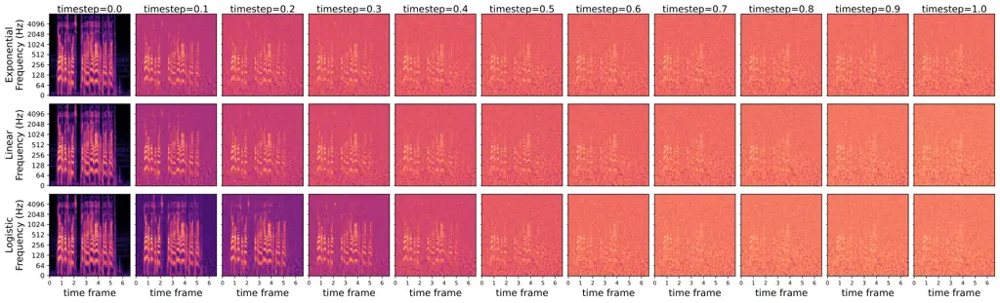
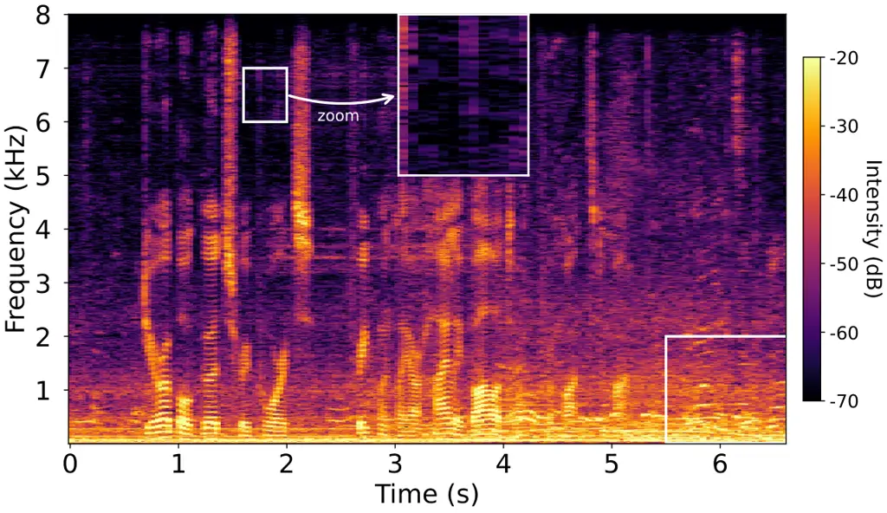
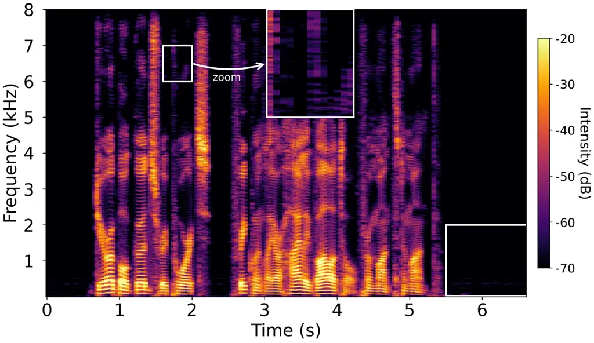
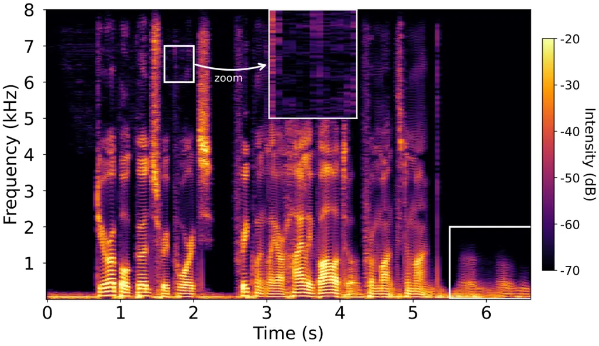
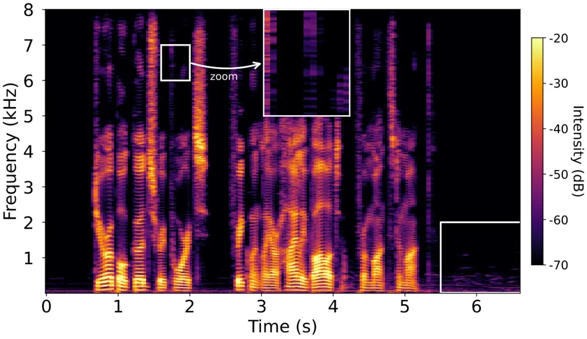

# Target matching based generative model for speech enhancement

Taihui Wang    Rilin Chen    Tong Lei    Andong Li    Jinzheng Zhao   
Meng Yu    Dong Yu ^(†)^(†)thanks: Manuscript received – –, 2025;
revised – –, 2025.^(†)^(†)thanks: Taihui Wang, Rilin Chen, and Jinzheng
Zhao are with Tencent AI Lab, Beijing 100193, China, and also with
Tencent Multimodal Models Department, Beijing 100193, China.
(Corresponding author: Rilin Chen)^(†)^(†)thanks: Lei Tong is with
Tencent AI Lab, Shenzhen, China.^(†)^(†)thanks: Andong Li is with the
Key Laboratory of Noise and Vibration Research, Institute of Acoustics,
Chinese Academy of Sciences, Beijing, 100190, China.^(†)^(†)thanks: Meng
Yu and Dong Yu are with Tencent AI Lab, Bellevue, WA,
USA.^(†)^(†)thanks: Email: {taihuiwang, rilinchen, coffeyzhao,
fayelei}@tencent.com, liandong@mail.ioa.ac.cn, {raymondmyu,
dyu}@global.tencent.com.

###### Abstract

The design of mean and variance schedules for the perturbed signal is a
fundamental challenge in generative models. While score-based and
Schrödinger bridge-based models require careful selection of the
stochastic differential equation to derive the corresponding schedules,
flow-based models address this issue via vector field matching. However,
this strategy often leads to hallucination artifacts and inefficient
training and inference processes due to the potential inclusion of
stochastic components in the vector field. Additionally, the widely
adopted diffusion backbone, NCSN++, suffers from high computational
complexity. To overcome these limitations, we propose a novel
target-based generative framework that enhances both the flexibility of
mean/variance schedule design and the efficiency of training and
inference processes. Specifically, we eliminate the stochastic
components in the training loss by reformulating the generative speech
enhancement task as a target signal estimation problem, which therefore
leads to more stable and efficient training and inference processes. In
addition, we employ a logistic mean schedule and a bridge variance
schedule, which yield a more favorable signal-to-noise ratio trajectory
compared to several widely used schedules and thus leads to a more
efficient perturbation strategy. Furthermore, we propose a new diffusion
backbone for audio, which significantly improves the efficiency over
NCSN++ by explicitly modeling long-term frame correlations and
cross-band dependencies. The key advantages of the proposed framework
are fourfold: (1) it supports arbitrary mean and variance schedules,
offering greater design flexibility; (2) it ensures efficient training
and inference by optimizing a deterministic target objective; (3) it
leverages the signal-level loss to improve the target estimation
accuracy; and (4) it uses a new dual-path spectro-temporal diffusion
backbone for audio, which is efficient and further supports scalable
model configurations. Experimental results demonstrate the superiority
of the proposed approach in speech enhancement performance, model size
and computational efficiency.

###### Index Terms: 

Speech enhancement, score matching, flow matching, target matching,
logistic mean schedule, diffusion backbone for audio.

## I Introduction

The degradation of speech signals in noisy environments persists as a
pervasive challenge, not only impairing human auditory perception but
also compromising the performance of machine-driven speech processing
applications, such as automatic speech recognition \[1\] and speaker
verification \[2\]. Consequently, the development of advanced speech
enhancement techniques targeting noise suppression \[3\] have become a
fundamental requirement for enabling clear speech communication and
ensuring the reliability of downstream systems.

Traditional statistical-model-based speech enhancement approaches
typically rely on modeling the statistical properties of speech signals
\[4\], yet their performance remains fundamentally constrained due to
the inherent limitations of statistical models in accurately
characterizing real-world acoustic environments. In contrast, deep
learning-based speech enhancement frameworks have demonstrated superior
performance by adopting data-driven methodologies to directly learn
either the spectral mapping or time-frequency masking functions between
noisy observations and clean speech signals \[5, 6, 7\]. Nevertheless,
discriminative approaches frequently introduce perceptually unnatural
artifacts, primarily due to their inability to accurately model the
underlying statistical distribution of speech signals. Moreover, these
methods often exhibit poor generalization performance, as they tend to
overfit to specific training data patterns and struggle to adapt to
unseen acoustic conditions. These limitations have motivated the
adoption of generative modeling paradigms that explicitly learn the data
distribution of clean speech signals, such as the generative adversarial
networks \[8\], variational autoencoders \[9\], and denoising diffusion
probabilistic models \[10\].

Within these generative speech enhancement methods, the score-matching
\[11\] based diffusion models have emerged as a particularly promising
framework \[12, 13, 14\]. These methods transform the noisy prior
distribution to the clean speech distribution step by step based on the
learned time-conditioned score model, where a neural network is trained
to match the time-varying score function given the time-conditioned
perturbed signal. It can be proved that the perturbed signal follows the
Gaussian distribution with the time-varying mean and variance \[15\],
which is called mean and variance schedules. The closed-form solutions
of the mean and variance schedules are derived based on the predefined
stochastic differential equation (SDE). Several different SDEs have been
utilized in order to design effective mean and variance schedules, such
as the Ornstein-Uhlenbeck process with the variance exploding (OUVE)
\[12, 13\] or variance preserving (OUVP) \[14\], and the Brownian bridge
process with exponential diffusion (BBED) \[16\]. It can be concluded
from these works that the mean and variance schedule have a significant
impact on the performance of the score-matching based diffusion models
\[14\]. The reason is that the mean and variance schedules determine the
effectiveness and efficiency of adding Gaussian noise when training the
score model. This motivates us to explore more optimized mean and
variance scheduling strategies. However, we note that the design of the
mean and variance schedule in diffusion models is very difficult,
because they cannot be defined directly but be solved from the
predefined SDE.

To address this problem, flow-matching (FM) based generative methods
\[17, 18\] model the distribution transport problem using an ordinary
differential equation (ODE) governed by a vector field, rather than
relying on the score function within an SDE. Unlike the score which is
calculated using the predefined SDE, the vector field can be directly
derived from predefined mean and variance schedules. This flexibility
enables us to design customized mean and variance schedules for
generating more efficient perturbed signals. Several mean and variance
schedules have been proposed for the speech enhancement task \[19, 20,
21\]. In \[20\], the linear and time-varying mean and variance schedules
are used to design a speech enhancement method. However, we observe that
employing a time-variant variance schedule leads to a stochastic vector
field, which can not be learned efficiently. Consequently, the inference
process becomes inefficient, requiring a large number of steps.
Additionally, this stochastic vector field is likely to introduce
hallucination artifacts in low frequency regions under low
signal-to-noise ratio (SNR) conditions, where speech-spectrum-shaped
noise devoid of actual linguistic content is generated.

As discussed above, a neural network must be used to parameterize the
score function in the score-matching based methods or the vector field
in the flow-matching based methods, and hence designing an efficient
neural network architecture is important. The network architecture
design of generative models is inherently more complex than that of
discriminative models, as it necessitates the processing of multiple
timesteps. The widely used backbone in audio tasks is the Noise
Conditional Score Network++ (NCSN++), which was first proposed in \[11\]
for the image generation task and then has been widely used in
speech-related tasks. NCSN++ is well-suited for image signals because
its 2D convolutional operations inherently capture spatial locality and
translation invariance, while its multi-scale noise scheduling mechanism
effectively models structured dependencies among pixels. However, we
argue that this architecture is not directly applicable to audio
signals, as time-frequency representations require decoupled processing
of temporal and frequency dimensions. Specifically, the temporal
dimension demands modeling long-range dependencies (e.g., contextual
coherence in speech), whereas the frequency dimension must resolve
harmonic structures and energy distributions. In contrast, 2D
convolutions in image processing struggle to explicitly disentangle
these time-frequency characteristics, potentially leading to phase
misalignment or over-smoothed spectra in audio reconstruction.

To address these fundamental limitations, we propose a target-matching
(TM) based generative framework that reformulates the distribution
transport problem. Unlike flow-matching methods requiring estimation of
stochastic vector fields, our approach directly predicts the
deterministic target signal through a neural network. This design
eliminates stochastic components in the optimization objective,
consequently enabling faster training convergence, requiring fewer
inference steps for stable output, and reducing the hallucination
artifacts over conventional flow-matching methods. Morever, the target
signal’s physical interpretability enables us to use the signal-level
loss to enhance the estimation accuracy, which cannot be achieved in
score or flow matching methods, because the score and flow has no clean
physical meaning in the signal level. The proposed framework also
supports the flexible design of mean and variance schedules, and hence
we adopt more complex logistic mean and bridge variance schedules to
generate the perturbed signal, which yilds a more efficient noise
scheduling process compared to the widely used linear mean and variance
schedules. Moreover, we propose a new diffusion backbone for audio (DBA)
signal processing, which uses the dual-path architecture to model
long-term frame correlations and cross-band dependencies. Compared to
the widely used NCSN++, the proposed DBA is more efficient and supports
scalable model configurations. Ablation studies on the noise schedules,
estimation targets and diffusion backbones show the effectiveness of the
proposed framework, and the comparison results show the superiority of
the proposed generative methods over other generative methods.

## II Problem Formulation

In the short-time Fourier transform (STFT) domain, let $`x_{1}(f,k)`$
denote the observed single-channel noisy speech signal by the
microphone, where $`f\in\{1,...,F\}`$ denotes the frequency bin index,
and $`k\in\{1,...,K\}`$ denotes the frame index. The noisy speech signal
can be represented as

```math
x_{1}(f,k)=x_{0}(f,k)+n(f,k), \tag{1}
```

where $`x_{0}(f,k)`$ and $`n(f,k)`$ denote the clean speech and noise
signals, respectively. In the following discussion, we model all
time-frequency bins independently, and thus the index $`f`$ and $`k`$
are omitted for conciseness unless stated otherwise.

The target of speech enhancement is to estimate the clean speech signal
from a noisy speech signal. Generative models are introduced and treat
the speech enhancement task as a distribution transport problem, i.e.,
from the noisy speech distribution $`q_{1}(x_{1})`$ to the clean speech
distribution $`q_{0}(x_{0})`$. The distribution transport problem can be
modeled using the differential equation (DE), and the corresponding
inverse DE can be used to recover the clean speech distribution given
the noisy speech distribution \[13, 22, 20\]. The inverse DE often
cannot be tractable and hence the parametric neural network is employed
to estimate the non-tractable component in the inverse DE. Once the
parametric neural network is trained, the clean speech distribution can
be obtained using the inverse DE with this estimator from the noisy
speech distribution.

Therefore, the core problem in the generative speech enhancement is the
design of the DE and the parametric neural network.

## III Related Works

In this section, we provide a concise introduction to two classes of
generative speech enhancement methods: score-matching (based on SDE) and
flow-matching (based on ODE) approaches. We review their respective
methodologies and highlight their current limitations. Additionally, we
introduce the NCSN++ backbone commonly adopted by these methods.

### III-A Score-matching based Method

In the score-matching based speech enhancement \[13\], an SDE is
formulated to characterize the distribution transport from clean speech
$`x_{0}`$ to noisy speech $`x_{1}`$ as

```math
x_{t}=f(x_{t},t,x_{1})dt+g(t)dw, \tag{2}
```

where $`x_{t}`$ denotes the perturbed signal at timestep $`t`$, $`w`$
denotes a standard Wiener process, and $`f(x_{t},t,x_{1})`$ and $`g(t)`$
denote the drift and diffusion coefficients, respectively. The clean
distribution is gradually converged into the noisy distribution through
the SDE. Following Anderson and Song \[23\], Eq. (2) admits the
following reverse-time SDE

```math
dx_{t}=[f(x_{t},t,x_{1})-g^{2}(t)\nabla_{x_{t}}\log p_{t}(x_{t}\mid x_{1})]dt+g(t)d\bar{w}, \tag{3}
```

where $`\overline{w}`$ denotes the backward standard Wiener process, and
$`\nabla_{x_{t}}\log p_{t}(x_{t}|x_{1})`$ is the gradient of the
log-probability density function, i.e., the score function. It is shown
that the current state $`x_{t}`$ follows the Gaussian distribution with
the mean schedule $`\mu_{t}(x_{0},x_{1})`$ and the variance schedule
$`\sigma^{2}(t)`$, which leads to the score function
$`\nabla_{x_{t}}\log p_{t}(x_{t}|x_{1})=-(x_{t}-\mu_{t}(x_{0},x_{1}))/\sigma^{2}(t)`$.
The closed-form solutions for mean and variance schedules can be
obtained based on Eqs. (5.50, 5.53) in Sarkka $`\&`$ Solin \[15\] given
the predefined SDE. The Ornstein-Uhlenbeck SDE is adopted in \[12, 13\]
and leads to the following mean schedule

```math
{\mu}_{t}\left({x}_{0},x_{1}\right)=\mathrm{e}^{-\gamma t}x_{0}+\left(1-\mathrm{e}^{-\gamma t}\right)x_{1}, \tag{4}
```

where $`\gamma`$ is a constant to control the transition. This solution
is related to the unknown clean signal $`x_{0}`$, and thus a neural
network is used as the estimator of the parametric score function
$`s_{\theta}(x_{t},x_{1},t)`$, which is trained using the score matching
loss

```math
\mathcal{L}_{sm}(\theta)=\mathbb{E}_{x_{t}|x_{1},t,x_{0}}\left[\left|s_{\theta}(x_{t},x_{1},t)-\nabla_{x_{t}}\log p_{t}(x_{t}|x_{1})\right|^{2}\right]. \tag{5}
```

Once the score network $`s_{\theta}(x_{t},x_{1},t)`$ is trained, we can
iteratively obtain the clean speech signal $`x_{0}`$ from $`x_{1}`$
based on the reverse SDE (3). In this process, the score network
progressively refines the estimate by taking the time-varying perturbed
signal $`x_{t}`$ as input.

The perturbed signals play a fundamental role in score-matching methods,
as they govern the temporal evolution of the marginal distribution.
These signals are generated during the training process according to the
predefined SDE, which determines their mean and variance schedules.
While existing scheduling approaches (e.g., OUVE, BBED, SBVE, SBVP)
provide formal theoretical guarantees, we identify significant
challenges in developing novel scheduling schemes due to fundamental
constraints. The key limitation arises from the inherent coupling
between schedule design and SDE formulation, because mean and variance
trajectories have to strictly conform to the predefined SDE structure.
This architectural constraint substantially limits the design
flexibility of score-matching methods, potentially restricting their
adaptability to diverse generative tasks and hindering further
performance improvements.

### III-B Flow-matching based Method

The flow matching is introduced to solve this problem above. In these
methods, the transformation from the noisy speech distribution to the
clean speech distribution is modeled by an ODE without considering the
random Wiener process and is given by

```math
\frac{dx_{t}}{dt}=u\left(x_{0},t,x_{1}\right), \tag{6}
```

where $`u\left(x_{0},t,x_{1}\right)`$ is the vector field that governs
the dynamics of the perturbed signal $`x_{t}`$, i.e., the flow, along
the probability path. Considering a special case of an ODE whose
marginal probability path
$`p_{t}\left(x_{t}|\mu_{t}\left(x_{1},x_{0}\right),\sigma_{t}^{2}\right)`$
is Gaussian, the vector fields can be derived based on \[17\] as

```math
u\left(x_{0},t,x_{1}\right)=\frac{\sigma_{t}^{\prime}}{\sigma_{t}}\left(x_{t}-\mu_{t}\left(x_{1},x_{0}\right)\right)+\mu_{t}^{\prime}\left(x_{1},x_{0}\right), \tag{7}
```

where $`\sigma_{t}^{\prime}=\frac{d}{dt}\sigma_{t}`$ and
$`\mu_{t}^{\prime}\left(x_{1},x_{0}\right)=\frac{d}{dt}\mu_{t}\left(x_{1},x_{0}\right)`$
denote the time derivative of $`\sigma_{t}`$ and
$`\mu_{t}\left(x_{1},x_{0}\right)`$, respectively. Note that the
standard deviation $`\sigma_{t}`$ is constrained to be non-zero. Like
the score function, the vector field is intractable owing to the
ignorance of the prior knowledge of clean speech, and thus a neural
network is employed to estimate the vector field using the following
flow matching loss

```math
\mathcal{L}_{fm}(\theta)=\mathrm{E}_{x_{t}\mid x_{1},t,x_{0}}\left[\left|u_{\theta}\left(x_{t},t,x_{1}\right)-u\left(x_{0},t,x_{1}\right)\right|^{2}\right], \tag{8}
```

which measures the mean square error (MSE) between estimated and true
vector field. Once the vector field network is trained, we can obtain
the clean speech signal $`x_{0}`$ from $`x_{1}`$ based on the ODE solver
for the Eq. (6).

In contrast to score-matching methods where perturbed signals are
constrained by predefined SDEs, flow-matching methods achieve greater
flexibility by directly specifying mean and variance schedules through
vector-field estimation. This fundamental difference in formulation
allows flow-matching approaches to bypass the architectural constraints
inherent in score-based methods.

(a) Comparison of different mean schedules

(b) Comparison of SNR curves of different mean schedules

Fig. 1: Comparison of different mean schedules and their SNR curves.
Note that $`x_{0}`$ and $`x_{1}`$ are set to 0.2 and 1, respectively.



Fig. 2: Comparison of spectrograms transport using different mean
schedules

The flow-matching method is characterized by the pre-defined mean and
variance schedules. The widely used mean and variance schedules are

```math
\mu_{t}\left(x_{0},x_{1}\right)=(1-t)x_{0}+tx_{1}, \tag{9}
```

and

```math
\sigma_{t}=t\sigma, \tag{10}
```

where $`\sigma`$ is a hyperparameter to determine the standard deviation
of $`x_{1}`$. This indicate that both the mean $`\mu_{t}`$ and standard
deviation $`\sigma_{t}`$ follow linear trajectories over time.
Substituting this mean and variance schedules into Eq. (7), we have the
vector field

```math
u\left(x_{t},t,x_{1}\right)=\frac{1}{t}\left(x_{t}-\mu_{t}\left(x_{0},x_{1}\right)\right)+\left(x_{1}-x_{0}\right). \tag{11}
```

Through our analysis in Section IV.C, we find that the vector field
inherently contains the stochastic component due to the time-varying
variance schedule. This stochastic component results in inefficient
training and inference processes. Moreover, we find that these
stochastic components lead to unstable estimations in speech enhancement
tasks, resulting in both residual noise retention and hallucination
artifacts, where the system generates speech-like noise devoid of actual
speech content.

### III-C NCSN++ Backbone

As mentioned above, a neural network is employed to parameterize the
intractable score function or vector field. The most widely used
backbone in audio-related tasks is the NCSN++, which is a U-Net-based
diffusion model originally designed for image generation \[11\] . While
this approach works well for images, as 2D convolutions inherently
capture spatial locality and multi-scale noise scheduling effectively
models pixel dependencies, it shows significant limitations when
processing audio signals. First, NCSN++ struggles to properly
disentangle time-frequency representations: its 2D convolutions cannot
explicitly model the distinct characteristics of temporal (long-range
dependencies, e.g., speech coherence) and spectral (harmonic structures,
energy distribution) dimensions, often leading to phase misalignment or
over-smoothed spectra in audio reconstruction. Second, its computational
cost is prohibitive for high-resolution audio tasks. With an extensive
parameter space of approximately 65 million trainable weights, the
network requires roughly 133 billion floating-point operations per
second audio signal sampled at 16 kHz, making it inefficient for
large-scale or real-time audio applications.

## IV The Proposed Method

### IV-A Motivation and Strategy

We try to investigate more efficient mean and variance schedules for the
perturbed signal, i.e., non-linear mean and variance schedules, which
may bring performance improvement. However, we find inherent limitations
in both score-matching and flow-matching frameworks. In the
score-matching framework, selecting a suitable SDE is very difficult,
particularly for complex mean and variance schedules. In the
flow-matching framework, the vector field is too complicated with the
stochastic component and often leads to inefficient training and
inference. These fundamental limitations motivate our proposed
target-matching based generative model. In addition, we design a new
diffusion backbone for the audio signal, which can process audio signal
more efficiently than the widely used NCSN++ backbone.

### IV-B The Logistic Mean and Bridge Variance Schedules

Like score-matching and flow-matching frameworks, we assume that the
marginal distribution is Gaussian

```math
p(x_{t})=\mathcal{N}(x_{t};\mu_{t}(x_{1},x_{0}),\sigma^{2}(t)). \tag{12}
```

We propose the mean follows the logistic schedule as

```math
\mu_{t}(x_{0},x_{1})=x_{0}+\frac{x_{1}-x_{0}}{e^{k/2}-1}\left(\frac{1+e^{k/2}}{1+e^{-k(t-0.5)}}-1\right), \tag{13}
```

where $`k`$ denotes the steepness of the transition between the initial
value $`x_{0}`$ and the target value $`x_{1}`$. A larger $`k`$ yields a
steeper transition in the logistic mean schedule, causing the
interpolation between $`x_{0}`$ and $`x_{1}`$ more abruptly around
$`t=0.5`$.

We compare the logistic mean schedule in Eq. (13) with two other popular
mean schedules: the OUVE schedule (Eq. (4)) used in the score-based
method and the linear schedule (Eq. (9)) used in the flow-based method.
Fig. 1 shows these three mean schedules and their SNR curves. It can be
observed that the logistic mean schedule has three advantages. Firstly,
it is more generalized than the linear schedule and nearly reduce to the
linear schedule when the steepness is small. Secondly, as noted in
\[24\], the OUVE schedule exhibits a mean mismatch at the final time,
whereas the logistic mean schedule has less mismatch than both the OUVE
and linear mean schedule. Thirdly, the logistic mean schedule has a more
linear SNR reduction curve, which is likey to brings more effective
perturbation. This can be attributed to the expanded dynamic range in
our logistic mean schedule, which achieves a significantly broader SNR
trajectory compared to conventional linear and OUVE schedules.
Specifically, near the initial diffusion phase around $`t=0`$, signals
retain substantially higher SNR levels that preserve critical speech
components with minimal spectral distortion. Conversely, at the terminal
phase around $`t=1`$, the schedule incorporates lower SNR conditions .

To provide an intuitive comparison, we examine the spectrograms of these
three mean schedules at different timesteps, as shown in Fig. 2. Our
observations reveal that all three schedules perturb the signal by
introducing increasing noise as the timestep $`t`$ evolves from 0 to 1.
However, the exponential mean schedule (Eq. 4) exhibits two notable
limitations. The first is that spectrograms for $`t>0.1`$ predominantly
demonstrate low SNR, which will over perturb the signal and leads to
inefficient inference. The second is that the final perturbed signal at
$`t=1`$ remains insufficiently transformed. The linear schedule
effectively mitigates these issues, while our proposed method
demonstrates superior performance in achieving more balanced and
effective perturbation throughout the entire diffusion process.

Different to the widely used variance exploding, variance preserving,
and linear schedules, we use the bridge variance schedule

```math
\sigma_{t}=\sigma\sqrt{t(1-t)}, \tag{14}
```

where $`\sigma`$ is a hyperparameter that controls the maximal Gaussian
distribution. Note that $`\sigma_{t}`$ is constrained to be non-zero,
and thus the timestep is constrained by $`0<t<1`$. Compared to the
linear variance schedule Eq. (10) and the constant variance schedule
used in \[21\], the bridge variance reduces to $`0`$ at $`t=0`$ and
$`t=1`$ and thus is more suitable in the speech enhancement task,
because both the clean and noisy signals are determined but not
stochastic.

(a) Overall Architecture

(b) Residual Block Structure

(c) Time-Frequency Block Detail

(d) Time Block

(e) Frequency Block

Fig. 3: Overall and detailed architecture of the proposed neural
network, showing (a) Overall Architecture, (b) Residual block detail,
(c) Time-frequency block, (d) Time block detail, and (e) Frequency block
detail. The operations $`\oplus`$ and $`\otimes`$ denote the
element-wise addition and multiplication, respectively.

### IV-C Target Matching

Based on the pre-difined mean and variance schedules, the perturbed
signal can be generated using the reparameterization trick

```math
x_{t}=\mu_{t}\left(x_{0},x_{1}\right)+\sigma_{t}z_{t}, \tag{15}
```

where $`z_{t}`$ is a random variable drawn from a standard Gaussian
distribution at timestep $`t`$. Substituting Eq. (15) into Eq. (7), the
vector field is given by

```math
u\left(x_{t},t,x_{1}\right)={\sigma_{t}^{\prime}}z_{t}+\mu_{t}^{\prime}\left(x_{0},x_{1}\right). \tag{16}
```

It can be observed that the vector field $`u\left(x_{t},t,x_{1}\right)`$
is stochastic due to the existence of $`z_{t}`$ as long as the variance
schedule is time-varying ($`\sigma_{t}^{\prime}\neq 0`$) and thus
results in inefficient training and inference processes.

To avoid this problem, we propose to match the output of the neural
network to the target signal instead of the vector field, which gives
the following target matching loss function

```math
\mathcal{L}_{tm}(\theta)=\mathbb{E}_{x_{t}\mid x_{1},t,x_{0}}\left[\left|x_{\theta}\left(x_{t},x_{1},t\right)-x_{0}\right|^{2}\right], \tag{17}
```

which measures the MSE between estimated and true target signals.
Compared to the flow-matching loss in Eq. (8), the proposed target
matching loss has two advantages. The first advantage is that the
predicted target does not contain any random component and hence leads
to efficient training and inference processes. Second, the target
matching framework enables us to incorporate signal characteristics
through signal loss. Unlike vector fields, target signals possess
clearer physical interpretations. In speech enhancement tasks, for
instance, the target signal represents the spectral characteristics of
clean speech, while vector fields typically correspond to noise
components. Therefore, target signals exhibit more structured properties
compared to vector fields and hence can be estimated more effectively.
Furthermore, in score-based and flow-based methods, clean speech signals
cannot be directly acquired but must be sampled after multiple Neural
Function Evaluations (NFEs).

We introduce two signal loss in this paper to validate the superiority
of the proposed method. The first signal loss is the frequency-domain
multi-scale Mel-spectrum loss

```math
\mathcal{L}_{mel}(\theta)=\sum_{j=1}^{J}\mathcal{L}_{mel}^{j}(\theta), \tag{18}
```

where $`J`$ denotes the scale number of Mel filterbands. The $`j`$-th
Mel loss is the MSE between the estimated and true Mel-spectragrams

```math
\mathcal{L}_{mel}^{j}(\theta)=\frac{1}{L^{j}F_{mel}^{j}}\sum_{l,f}\left\|\hat{X}_{l,f_{mel}}^{j}-X_{l,f_{mel}}^{j}\right\|_{1}, \tag{19}
```

where the Mel-spectrograms
$`\left\{\hat{X}_{l,f_{mel}}^{j},X_{l,f_{mel}}^{j}\right\}\in\mathbb{R}^{L^{j}\times F_{mel}^{j}}`$
are calculated as
$`X_{l,f_{mel}}^{j}=|X^{j}|\mathcal{A}^{j}\quad\text{and}\quad\hat{X}_{l,f_{mel}}^{j}=|\tilde{X}^{j}|\mathcal{A}^{j}`$,
and $`\mathcal{A}^{j}\in\mathbb{R}^{F\times F_{mel}^{j}}`$ is the
$`j`$-th linear Mel filter. The parameters used in computing each
Mel-spectrum loss, including the STFT window size, hop size, and number
of Mel bands, exhibit variability across configurations. This
multi-scale Mel-spectrum loss \[25\] mitigates information degradation
inherent in dimensionality reduction and downsampling operations during
Mel-spectrogram generation. By optimizing spectral representations
across heterogeneous time-frequency resolutions, this approach better
preserves discriminative audio attributes, yielding enhanced
reconstruction fidelity and increased training stability.

The second signal loss is the time-domain scale-invariant SNR (SISNR)
loss, which evaluates the waveform similarity between the estimated
speech samples $`\hat{\mathbf{x}}`$ and target speech samples
$`\mathbf{x}`$ using

```math
\mathcal{L}_{SISNR}(\theta)=-10\log_{10}\left(\frac{\|\hat{\mathbf{x}}\|^{2}_{2}}{\|\mathbf{s}-\hat{\mathbf{x}}\|^{2}_{2}+\epsilon}\right), \tag{20}
```

where $`\|\cdot\|_{2}`$ represents the the Euclidean norm of a vector,
$`\epsilon=10^{-8}`$ a small constant for numerical stability, and

```math
\hat{\mathbf{x}}=\frac{\langle\mathbf{x},\mathbf{s}\rangle\mathbf{x}}{\|\mathbf{x}\|^{2}_{2}+\epsilon}, \tag{21}
```

with $`\langle\cdot,\cdot\rangle`$ denoting the inner product between
two vectors. This scale-invariant metric provides robust evaluation of
waveform reconstruction quality while being insensitive to amplitude
scaling.

The composite loss combines the target matching loss and signal-level
loss, and is formulated as

```math
\mathcal{L}(\theta)=\mathcal{L}_{tm}(\theta)+\lambda_{1}\mathcal{L}_{mel}(\theta)+\lambda_{2}\mathcal{L}_{si-SNR}(\theta), \tag{22}
```

where $`\lambda_{1}`$ and $`\lambda_{2}`$ denotes the weight
hyperparameters.

### IV-D Diffusion Backbone for Audio

In this paper, we propose a novel diffusion backbone for audio
processing, named DBA, to estimate the target signal. Fig. 3 shows the
detailed architecture of the proposed DBA. The network input is formed
by concatenating $`x_{t}`$ and $`x_{1}`$ along the channel dimension;
each is a two-channel tensor concatenating the real and imaginary
components of a complex spectrogram. This yields an input shape of
$`B\times 4\times F\times K`$, where $`B`$ denotes the batch size, and
the output is the estimated target signal $`\hat{x}_{0}`$ of size
$`B\times 2\times F\times K`$.

As shown in Fig. 3a, the proposed backbone integrates a U-Net with $`L`$
time-frequency (TF) blocks, and both of them are conditoned by a
timestep encoder. The timestep encoder uses a sequential architecture: a
Fourier feature mapping followed by linear layers and activation
functions. It transforms a scalar timestep $`t`$ into a vector embedding
$`\bm{t}_{emb}`$, which serves as a conditional input to all modules.
The U-Net is composed of residual blocks. As shown in Fig. 3b, the
adopted residual block differs from the original one used in NCSN++ in
two key aspects. First, while NCSN++ relies on finite impulse response
filters for downsampling and upsampling, our method adopts strided
convolutions instead. Second, unlike NCSN++’s approach of simultaneously
applying downsampling/upsampling operations across both time and
frequency dimensions, our residual block selectively operates only on
the frequency dimension while preserving the original resolution in the
time dimension. This targeted modification in the frequency domain
allows for more efficient processing while maintaining temporal
resolution. Prior to entering the residual block, the input signal
passes through a 2D convolutional layer for feature transformation,
where the channel dimension is projected from 4 to $`C`$.

The TF block is designed to exploit inter-frame and inter-band
correlations through a dual-path mechanism, which has demonstrated
strong performance in speech enhancement and separation tasks due to its
effectiveness in modeling speech time-frequency spectrograms \[26\]. As
shown in Fig. 3c, within each TF block, T-block and F-block operations
are applied iteratively to refine the input features. Compared to the
widely used dual-path method, we introduce two different parts into the
proposed TF block inspired by \[27\]. First, we introduce weighted
residual connections, where $`\alpha`$ and $`\beta`$ respectively denote
the weights on T-block and F-block. This enables stable training with
stacked TF blocks for deeper architectures. Second, we employ channel
attention to explore inter-channel information interactions before
processing in each T-block and F-block. Note that to condition the TF
block on the timestep, we insert the $`\bm{t}_{emb}`$ both into the
T-block and F-block. For the T-block, we use the squeezed TCN module
proposed in \[28\] where the channel is squeezed into $`C^{\prime}`$
using the first Conv2d and unsqueezed back to $`C`$ using the last
Conv2d. As shown in Fig. 3d, we add the channel adapted time embedding
to the feature. For the F-block, we use the cross-band block proposed in
\[29\] where the channel is squeezed into $`C^{\prime}`$ before the
group linear layer and unsqueezed back to the original dimension after
the group linear layer. As shown in Fig. 3e, we add the channel adapted
time embedding to the feature.

### IV-E Sampling Method

| Algorithm 1 Training process                                                     |
| -------------------------------------------------------------------------------- |
|    Input: Training pairs $`(x_{1},x_{0})`$                                       |
|    For each epoch do:                                                            |
|     Sample timestep $`t\sim\mathcal{U}([t_{eps},T])`$                            |
|     Compute $`\mu_{t}(x_{1},x_{0})`$ and $`\sigma_{t}`$ using Eqs. (13) and (14) |
|     Sample $`z\sim\mathcal{N}(0,1)`$                                             |
|     Generate perturbed signal: $`x_{t}=\mu_{t}(x_{1},x_{0})+\sigma_{t}z`$        |
|     Estimate $`\hat{x}_{0}=x_{\theta}(x_{t},x_{1},t)`$                           |
|     Compute loss $`\mathcal{L}`$                                                 |
|     Backpropagate to update $`x_{\theta}`$                                       |
|    Output: Optimized target predictor $`x_{\theta}(x_{t},x_{1},t)`$              |

| Algorithm 2 Inference process                                                     |
| --------------------------------------------------------------------------------- |
|    Input: noisy signal $`x_{1}`$, target predictor $`x_{\theta}(x_{t},x_{1},t)`$, |
|       number of sampling steps $`N`$                                              |
|    Initialization: $`x_{T}=x_{1}`$, $`t=T`$, $`n=1`$                              |
|    while $`n\leq N`$ do:                                                          |
|     Compute the vector field $`u_{\theta}(x_{t},x_{1},t)`$ using Eq. (23)         |
|     Update signal: $`x_{T-n/N}=x_{t}+u_{\theta}(x_{t},x_{1},t)/N`$                |
|     Estimate $`x_{\theta}(x_{t},x_{1},t)`$                                        |
|     Update time: $`t=T-n/N`$, $`n=n+1`$                                           |
|    Output: $`{x}_{0}`$                                                            |

Once the target estimator completes training, the initial point
$`x_{T}`$ is first drawn from the noisy signal. The vector field then
can be obtained using the estimated target $`x_{\theta}(x_{t},x_{1},t)`$
as

```math
\displaystyle u_{\theta}(x_{t},x_{1},t) \displaystyle=\frac{\sigma_{t}^{\prime}}{\sigma_{t}}\left(x_{t}-\mu_{t}\left(x_{\theta}(x_{t},x_{1},t),x_{1}\right)\right) \tag{23}
```

```math
\displaystyle+\mu_{t}^{\prime}\left(x_{1},x_{\theta}(x_{t},x_{1},t)\right).
```

Subsequently, we use the Euler ODE solver to iteratively recover the
clean signal

```math
\displaystyle x_{T-n/N} \displaystyle\approx x_{t}+u_{\theta}(x_{t},x_{1},t)/N, \tag{24}
```

```math
\displaystyle t \displaystyle=T-n/N, \tag{25}
```

where $`N`$ represents the total number of timesteps, $`n`$ is the
current step, and $`t`$ is initialized as $`T`$ (0.97 for numerical
stability in this paper). The use of Euler solver provides a
straightforward and efficient method for solving the ODE, ensuring
stable and reproducible sampling results.

We summarize the training and inference processes in Algorithm 1 and
Algorithm 2, respectively. At training time, the DBA-parameterized
target predictor $`x_{\theta}(x_{t},x_{1},t)`$ is optimized to
approximate the clean signal given the noisy signal, timestep and
perturbed signal. The timestep is uniformly sampled from the interval
$`[\epsilon,T]`$, where $`\epsilon`$ is a small positive constant
(typically 0.03) to avoid numerical instabilities near zero, and $`T`$
represents the maximum diffusion time. The perturbed signal is sampled
as $`x_{t}=\mu_{t}(x_{1},x_{0})+\sigma_{t}z`$ where $`z`$ is sampled
from a standard normal distribution with zero mean and identity
covariance. The $`\mu_{t}(x_{1},x_{0})`$ and $`\sigma_{t}`$ is
calculated using the predefined mean and variance schedules,
respectively. At the inference process, the $`x_{1}`$ is sampled as the
noisy input signal, and then the estimated signal is calculated
iteratively using the Euler ODE solver.

## V Experimental Settings

### V-A Datasets

We consider two widely used noisy speech datasets, namely
VoiceBank-DEMAND (VB-DMD) and WSJ0-CHiME3. The VB-DMD dataset is a
publicly available dataset generated by mixing clean speech from the
VCTK dataset \[30\] with eight real-recorded noise samples from the
DEMAND database \[31\] and two artificially generated noise samples
(babble and speech shape) at SNRs of 0, 5, 10, and 15 dB. The SNRs for
the test set are 2.5, 7.5, 12.5, and 17.5 dB. The training dataset is
split into a training and validation dataset, using speakers “p226” and
“p287” for validation, as in \[14\], \[16\], \[20\]. The WSJ0-CHIME3 is
generated using WSJ0 clean speech \[32\] and CHiME3 noise \[33\] and the
mixture SNR is sampled uniformly in \[-6, 14\] dB \[18\]. Approximately
13k utterances (25 h) are generated for the training set, 1.2k
utterances (2 h) for the validation set and 650 utterances (1.5 h) for
the test set.

### V-B Experimental Setup

Following \[13\], we process all speech signals at 16 kHz by first
computing complex-valued spectrograms
$`\mathbf{Y}_{c}\in\mathbb{C}^{256\times 256}`$ using STFT with the
window size of 510 samples, hopsize of 128 samples, and segments of 256
frames, then apply element-wise magnitude compression
$`\mathbf{Y}=\beta|\mathbf{Y}_{c}|^{\alpha}e^{j\angle\mathbf{Y}_{c}}`$
with $`\alpha=0.5`$ and $`\beta=0.33`$, subsequently stacking
real/imaginary parts to form two-channel representations
$`\mathbf{Y}\in\mathbb{R}^{2\times 256\times 256}`$. The neural network
$`x_{\theta}(x_{t},x_{1},t)`$ is trained for 200 epochs using Adam
optimizer ($`\eta=10^{-4}`$, batch size 8) with 0.999 exponential moving
average on parameters, where enhanced signals are obtained by inverting
the spectrogram transformations while preserving time-domain
characteristics through the reversible processing pipeline.

We use only the target matching loss in the following experiments unless
otherwise noted. When the composite loss is used, the weight
hyperparameters $`\lambda_{1}`$ and $`\lambda_{2}`$ are set to 0.1 and
0.01, respectively. The multi-scale Mel loss configuration follows
\[34\] with $`J=6`$, where the frame sizes of the STFT are set to
$`\{32,64,128,256,512,1024,2048\}`$ and the corresponding numbers of Mel
frequency bins are $`\{5,10,20,40,80,160,210\}`$. For all scales, the
maximum frequency is fixed at the Nyquist frequency (half the sampling
rate). The number of fast Fourier transform points is set to the frame
size, and the hop size is defined as one-quarter of the frame size.

The NFE is set to 4 in the Euler solver (24), unless otherwise noted.

| Models | $`C`$ | $`C^{\prime}`$ | $`L`$ | Param (M) | Flops (G) |
| ------ | ----- | -------------- | ----- | --------- | --------- |
| NCSN++ | 64    | –              | –     | 66        | 133       |
| DBA-S  | 32    | 96             | 4     | 3.7       | 30        |
| DBA-M  | 64    | 128            | 4     | 10.44     | 88.69     |
| DBA-L  | 96    | 192            | 4     | 23.47     | 199.31    |

TABLE I: Architectural Configurations and Computational Complexity of
DBA Variants vs. NCSN++

| Models | PESQ             | SI-SDR            | ESTOI            | SIG              | BAK              | OVL              | DNSMOS           |
| ------ | ---------------- | ----------------- | ---------------- | ---------------- | ---------------- | ---------------- | ---------------- |
| NCSN++ | $`2.61\pm 0.60`$ | $`16.15\pm 4.21`$ | $`0.89\pm 0.08`$ | $`2.96\pm 0.35`$ | $`3.46\pm 0.54`$ | $`2.42\pm 0.30`$ | $`3.90\pm 0.24`$ |
| DBA-S  | $`2.72\pm 0.57`$ | $`16.24\pm 3.97`$ | $`0.90\pm 0.07`$ | $`2.95\pm 0.35`$ | $`3.50\pm 0.53`$ | $`2.43\pm 0.29`$ | $`3.91\pm 0.24`$ |
| DBA-M  | $`2.81\pm 0.57`$ | $`16.79\pm 3.95`$ | $`0.91\pm 0.07`$ | $`2.95\pm 0.35`$ | $`3.49\pm 0.53`$ | $`2.43\pm 0.30`$ | $`3.92\pm 0.23`$ |
| DBA-L  | $`2.86\pm 0.56`$ | $`17.08\pm 3.89`$ | $`0.91\pm 0.06`$ | $`2.94\pm 0.35`$ | $`3.51\pm 0.51`$ | $`2.43\pm 0.29`$ | $`3.93\pm 0.23`$ |

TABLE II: Speech Enhancement Metrics (Mean $`\pm`$ Standard Deviation)
of Different Backbones on WSJ0-CHIME3 dataset

### V-C Baseline Models

We compare the proposed generative model with seven baseline models.

SGMSE \[13\]: A score-based generative model for speech enhancement.

StoRM \[35\]: A hybrid stochastic regeneration model consists of a
predictive NCSN++ module and a diffusion-based SGMSE+ module.

SBVP \[22\]: A speech enhancement model based on the Schrödinger bridge
with the variance preserving noise schedule.

SBVE \[22\]: A speech enhancement model based on the Schrödinger bridge
with the variance exploding noise schedule.

CFM \[20\]: A speech enhancement model based on conditional flow
matching, where the mean and the covariance for the conditional
probability path are configured to move linearly from noisy speech to
clean speech and decrease linearly, respectively.

Modified FM \[19\]: A flow matching method for speech enhancement, with
several training- and inference-time modifications.

For all above baseline models, we used their official results reported
in the original paper.

### V-D Evaluation Metrics

To assess the performance of speech enhancement methods, we use both the
intrusive and non-intrusive metrics. For the instrusive metric, the
wideband perceptual evaluation of speech quality (PESQ) scores \[36\],
extended short-time objective intelligibility (ESTOI) \[37\] and
time-domain scale-invariant signal-to-distortion ratio (SI-SDR) \[38\]
are used. For the non-intrusive metrics, the DNSMOS P. 808 \[39\], and
DNSMOS P.835 \[40\] including SIG, BAK, and OVRL are used. Higher values
for these metrics indicate a better speech enhancement performance.

## VI Results and Discussions

### VI-A Investigation on the Backbone

In this experiment, we investigate the effectiveness of the proposed
DBA. Table I compares the architectural configuration, parameter counts
and computational complexity between the proposed DBA variants (DBA-S,
DBA-M, and DBA-L) and the widely adopted NCSN++ baseline. The DBA
architecture introduces several modifications, including a reduced
number of feature channels ($`C`$), squeezed dimensions
($`C^{\prime}`$), and the number of TF blocks ($`L`$), resulting in
significantly improved parameter efficiency. Specifically, the DBA-M
model with $`C=64`$ achieves comparable performance to NCSN++ ($`C=64`$)
while reducing the parameters by 84.2$`\%`$ (from 66M to 10.44M) and
computational cost by 33.3$`\%`$ (from 133G to 88.69G Flops). The
compact DBA-S variant further demonstrates the scalability of our
architecture, achieving even greater efficiency with only 3.7M
parameters and 30G Flops.

Table II presents the speech enhancement performance on the WSJ0-CHiME3
dataset, evaluated using multiple metrics. The results demonstrate that
all DBA variants outperform the NCSN++ baseline across all evaluation
metrics. Notably, all the three DBA variants achieves the better
performance than the NCSN++ baseline. This superior performance, coupled
with the substantial reduction in computational complexity shown in
Table 1, validates the effectiveness and efficiency of the proposed DBA
architecture for speech enhancement tasks. The consistent performance
improvement across all metrics, particularly for the DBA configuration,
suggests that our architectural modifications successfully enhance the
model’s capability to recover speech signals while maintaining
computational efficiency. The scalability of the DBA framework is
further evidenced by the progressive performance improvement from DBA-S
to DBA-L, demonstrating the architecture’s adaptability to different
computational budgets. The standard DBA-M is used for the following
experiments.

(a) PESQ

(b) SI-SDR

(c) ESTOI

(d) DNSMOS

Fig. 4: Comparison of training and inference convergence on difference
metrics, best viewed in color. The ‘e’ in the legend denotes epoch.

### VI-B Investigation on the Noise Schedule

To validate the effectiveness of our proposed mean and variance
scheduling methods, we compare three distinct configurations as detailed
in the Table III. The first approach (Schedule 1) employs the
conventional mean and variance trajectories used in the traditional
flow-matching based methods. The third approach (Schedule 3) adopts our
proposed mean and variance scheduling trajectories. The second approach
(Schedule 2) combines the conventional mean trajectory with our proposed
variance schedule. Experimental results for the speech enhancement on
the WSJ0-CHiME3 dataset under these scheduling methods are presented in
the Table IV. It can be observed that the noise schedule has a
significant impact on the enhancement performance. Compared to the
traditional method (Schedule 1), incorporating our bridged variance
schedule alone yields significant improvements in PESQ and SI-SDR,
albeit at a marginal cost to ESTOI performance. Critically, augmenting
this with our logistic mean schedule not only mitigates the ESTOI
degradation but also delivers comprehensive improvements across all
metrics. These results demonstrate the effectiveness of the proposed
mean and variance schedules.

| Method     | Mean schedule $`\mu_{t}(x_{1},x_{0})`$                                                  | Variance schedule $`\sigma_{t}`$ |
| ---------- | --------------------------------------------------------------------------------------- | -------------------------------- |
| Schedule 1 | $`tx_{0}+(1-t)x_{1}`$                                                                   | $`\sigma t`$                     |
| Schedule 2 | $`tx_{0}+(1-t)x_{1}`$                                                                   | $`\sigma\sqrt{t(1-t)}`$          |
| Schedule 3 | $`x_{0}+\frac{x_{1}-x_{0}}{e^{k/2}-1}\left(\frac{1+e^{k/2}}{1+e^{-k(t-0.5)}}-1\right)`$ | $`\sigma\sqrt{t(1-t)}`$          |

TABLE III: Difference noise schedule

| Models     | PESQ             | SI-SDR            | ESTOI            |
| ---------- | ---------------- | ----------------- | ---------------- |
| Schedule 1 | $`2.58\pm 0.59`$ | $`15.66\pm 4.04`$ | $`0.90\pm 0.07`$ |
| Schedule 2 | $`2.76\pm 0.55`$ | $`16.26\pm 4.06`$ | $`0.89\pm 0.08`$ |
| Schedule 3 | $`2.80\pm 0.57`$ | $`16.82\pm 3.95`$ | $`0.91\pm 0.07`$ |

TABLE IV: Speech Enhancement Metrics (Mean $`\pm`$ Standard Deviation)
for Different Schedules

| Loss         | PESQ             | SI-SDR            | ESTOI            | SIG              | BAK              | OVL              | DNSMOS           |
| ------------ | ---------------- | ----------------- | ---------------- | ---------------- | ---------------- | ---------------- | ---------------- |
| TM only      | $`2.80\pm 0.57`$ | $`16.82\pm 3.95`$ | $`0.91\pm 0.07`$ | $`2.97\pm 0.35`$ | $`3.38\pm 0.57`$ | $`2.40\pm 0.30`$ | $`3.93\pm 0.23`$ |
| TM+Mel       | $`2.89\pm 0.54`$ | $`15.55\pm 4.18`$ | $`0.91\pm 0.07`$ | $`2.83\pm 0.31`$ | $`3.96\pm 0.15`$ | $`2.60\pm 0.26`$ | $`3.89\pm 0.23`$ |
| TM+Mel+SISNR | $`2.92\pm 0.55`$ | $`15.97\pm 4.21`$ | $`0.91\pm 0.06`$ | $`2.83\pm 0.32`$ | $`3.96\pm 0.15`$ | $`2.60\pm 0.27`$ | $`3.91\pm 0.23`$ |

TABLE V: The Speech Enhancement Metrics (Mean $`\pm`$ Standard
Deviation) of the Proposed Method Using Different Signal Losses

### VI-C Investigation on the Target Matching

In this subsection, we validate the training and inference efficiency of
the proposed target matching method over the flow matching method. Fig.
4 illustrates the variation curves of different evaluation metrics
versus inference steps at various training epochs for both methods. Both
TM and FM employ the DBA-M network architecture with logistic and bridge
scheduling strategies.

We observe from Fig. 4 that when FM is trained for 200 epochs, its
performance improves with increasing inference steps but demonstrates
notable instability. As the training extends to 800 epochs, the
inference outcomes become more stable. In contrast, the proposed TM
method achieves stable inference performance after only 200 training
epochs. This comparative result effectively demonstrates the superior
training efficiency of our TM approach. The reason lies in its
deterministic optimization objective, where the loss function (Eq. (17))
directly minimizes the MSE between the estimated and true clean speech
signals, thereby providing stable gradient updates. In contrast, FM
optimizes a stochastic objective through its loss function (Eq. (8)),
which introduces inherent noise in the vector field and leads to
significant gradient fluctuations during training. Furthermore, it can
be observed that all metrics of the FM method require more than 10
inference steps to converge, particularly the SI-SDR. In contrast, the
proposed TM method typically achieves convergence within just 4 steps.
This result clearly demonstrates the superior inference efficiency of
our TM approach. In addition, we observed that more inference steps lead
to decreased PESQ scores, which may be attributed to excessive noise
suppression that compromises audio quality. This phenomenon has also
been noted in other generative approaches such as FM \[19\] and SBVE
\[22\].

It can be observed from Fig. 4 that as the number of steps increases,
the DNSMOS and ESTOI scores achieved by the FM method gradually increase
and approach those obtained by the proposed TM method. Notably, however,
the PESQ and SI-SDR scores of the FM method remain significantly lower
than those of the proposed TM method. This persistent gap could
potentially stem from the FM method’s propensity to generate
hallucination artifacts, which adversely affects perceptual quality
metrics like PESQ and signal-level metrics like SI-SDR that rely on
accurate alignment. To investigate this hypothesis, we present and
compare the spectrograms of signals enhanced by both the FM and TM
methods. Fig. 5 compares the spectrograms of clean, noisy and processed
audio samples by TM and FM, using the utterance ”440c020w.wav” from the
WSJ0-CHIME test set. By examining the rectangular regions in the left of
the four subfigures, it can be observed that the FM method tends to
retain noise components that resemble speech-like distributions. This
behavior makes FM prone to hallucination artifacts—a common issue in
generative models under low SNR conditions—whereby meaningless
speech-like sounds are generated, as illustrated in the right of Fig.
5b. In contrast, this phenomenon does not occur in the proposed TM-based
generative approach. A plausible explanation is that, unlike FM, which
relies on stochastic estimation, our method optimizes for a
deterministic target, thereby reducing such artifacts.



(a) The spectrogram of the noisy speech



(b) The spectrogram of the clean speech



(c) The spectrogram of the enhanced speech using FM



(d) The spectrogram of the enhanced speech using the proposed TM

Fig. 5: Comparison of different speech spectrogram representations.

### VI-D Investigation on the Signal Loss

We evaluate the impact of the signal-level loss function on the
performance of the proposed TM method. Experimental results are
summarized in Table V. In the baseline configuration (TM only), only the
TM loss (Eq. 17) is optimized. The second configuration (TM+Mel) employs
the composite loss (Eq. 22) with $`\lambda_{1}=0.1`$ and
$`\lambda_{2}=0`$.

It can be observed that incorporating the Mel-spectrum loss
significantly enhances the perceptual quality and suppresses the
background noise, albeit at the cost of a reduction in SI-SDR and a
marginal degradation in the SIG metric. The integration of the SISNR
loss function consistently enhances the PESQ metric, while
simultaneously mitigating degradations in SI-SDR and DNSMOS induced by
the TM-Mel loss function. These results demonstrate that incorporating
signal-level loss functions significantly influences the perceptual
quality of enhanced audio, thereby validating a core advantage of the
proposed method: its flexible integration of arbitrary signal-level loss
functions, which is not feasible in score-matching or flow-matching
approaches.

|                      |                  |                 |                  |
| -------------------- | ---------------- | --------------- | ---------------- |
| Method               | PESQ             | SI-SDR          | ESTOI            |
| Noisy                | $`1.35\pm 0.30`$ | $`4.0\pm 5.8`$  | $`0.63\pm 0.18`$ |
| SGMSE+ \[13\]        | $`2.28\pm 0.60`$ | $`13.1\pm 4.9`$ | $`0.85\pm 0.11`$ |
| STORM \[35\]         | $`2.53\pm 0.60`$ | $`14.8\pm 4.3`$ | $`0.87\pm 0.09`$ |
| SB-VP \[22\]         | $`2.62\pm 0.53`$ | $`14.9\pm 4.3`$ | $`0.88\pm 0.07`$ |
| SB-VE \[22\]         | $`2.58\pm 0.53`$ | $`14.7\pm 4.2`$ | $`0.88\pm 0.07`$ |
| FM                   | $`2.32\pm 0.66`$ | $`15.8\pm 4.3`$ | $`0.88\pm 0.09`$ |
| Modified FM \[19\]   | $`2.68\pm 0.58`$ | $`16.2\pm 4.2`$ | $`0.89\pm 0.08`$ |
| TM+DBA-M             | $`2.80\pm 0.57`$ | $`16.8\pm 4.0`$ | $`0.91\pm 0.07`$ |
| TM+DBA-M+Signal loss | $`2.92\pm 0.55`$ | $`16.0\pm 4.1`$ | $`0.91\pm 0.06`$ |

TABLE VI: Comparison Results (Mean $`\pm`$ Standard Deviation) of
Different Methods on WSJ0-CHIME3 dataset

| Method      | PESQ             | SI-SDR            | ESTOI            | DNSMOS           |
| ----------- | ---------------- | ----------------- | ---------------- | ---------------- |
| noisy       | $`1.97\pm 0.75`$ | $`8.4\pm 5.6`$    | $`0.79\pm 0.15`$ | $`3.09\pm 0.39`$ |
| OUVE \[13\] | $`2.93\pm 0.62`$ | $`17.3\pm 3.3`$   | $`0.87\pm 0.10`$ | $`3.56\pm 0.28`$ |
| SBVE \[22\] | $`2.91\pm 0.76`$ | $`19.42\pm 3.52`$ | $`0.88\pm 0.10`$ | $`3.59\pm 0.30`$ |
| CFM \[20\]  | $`3.12\pm 0.05`$ | $`18.95\pm 0.23`$ | $`0.88\pm 0.01`$ | $`3.58\pm 0.02`$ |
| TM-DBA-M    | $`3.17\pm 0.70`$ | $`19.44\pm 3.35`$ | $`0.89\pm 0.09`$ | $`3.57\pm 0.30`$ |

TABLE VII: Comparison Results (Mean $`\pm`$ Standard Deviation) of
Different Methods on VB-DMD dataset

### VI-E Comparison Results on Speech Denoising

We compare the proposed method against state-of-the-art generative
speech enhancement models, as discussed in Section V.C. As shown in
Table VI, the proposed method achieves superior performance across PESQ,
SI-SDR, and ESTOI scores on the the WSJ0-CHiME3 dataset, demonstrating
its effectiveness in joint perceptual quality, signal fidelity, and
intelligibility optimization. Further improvement in the PESQ metric can
be achieved by adopting the signal loss, but this comes at the cost of a
reduction in the SI-SDR metric.

Table VII further compares the models on the VB-DMD dataset, where the
proposed method attains the highest PESQ, SI-SDR and ESTOI scores.
However, its DNSMOS is marginally lower than the optimal baseline. We
note that the superiority of the proposed method is less pronounced on
the VB-DMD dataset compared to the results on the WSJ0-CHiME3 dataset.
This may be attributed to VB-DMD’s higher average signal-to-noise ratio
(SNR $`>`$5 dB), which aligns with our analysis in Section VI.C: the
proposed method exhibits stronger hallucination suppression in low-SNR
regimes, while its advantage diminishes in high-SNR conditions.

## VII Conclusion

We have proposed a novel target matching-based generative framework for
speech enhancement, addressing key limitations in existing diffusion and
flow-based approaches. Our method introduces a logistic mean schedule
and bridge variance schedule, which provides a more favorable SNR
trajectory compared to traditional linear schedules and enables flexible
and efficient training. By reformulating the problem as target matching
rather than score or flow estimation, we eliminate stochastic components
in the optimization objective, leading to more stable training and
faster inference. Additionally, we have designed a dual-path
spectro-temporal diffusion backbone explicitly optimized for audio
signals, which significantly improves computational efficiency over the
widely used NCSN++ architecture. Experimental results demonstrate that
our framework achieves state-of-the-art performance across multiple
datasets (VB-DMD and WSJ0-CHiME3) and metrics (PESQ, SI-SDR, ESTOI),
while reducing model complexity by 84.2$`\%`$ in parameters and
33.3$`\%`$ in Flops compared to NCSN++.

## References

- \[1\] S. Araki, A. Yamamoto, T. Ochiai, K. Arai, A. Ogawa,
  T. Nakatani, and T. Irino, “Impact of residual noise and artifacts in
  speech enhancement errors on intelligibility of human and machine,” in
  _Proc. ISCA Interspeech_, Aug. 2023, pp. 2503–2507.
- \[2\] W. Rao, C. Xu, E. S. Chng, and H. Li, “Target speaker extraction
  for multi-talker speaker verification,” in _Proc. ISCA Interspeech_,
  Sep. 2019.
- \[3\] P. C. Loizou, _Speech enhancement: theory and practice_. CRC
  press, 2007.
- \[4\] J. Benesty, S. Makino, and J. Chen, _Speech
  Enhancement_. Springer Science & Business Media, Mar. 2006.
- \[5\] D. Wang and J. Chen, “Supervised speech separation based on deep
  learning: An overview,” _IEEE/ACM Transactions on Audio, Speech, and
  Language Processing_, vol. 26, no. 10, pp. 1702–1726, Oct. 2018.
- \[6\] K. Kuang, F. Yang, J. Li, and J. Yang, “Three-stage hybrid
  neural beamformer for multi-channel speech enhancement,” _The Journal
  of the Acoustical Society of America_, vol. 153, no. 6, pp. 3378–3378,
  Jun. 2023.
- \[7\] Z. Sun, A. Li, R. Chen, H. Zhang, M. Yu, Y. Zhou, and D. Yu,
  “Smru: Split-and-merge recurrent-based unet for acoustic echo
  cancellation and noise suppression,” in _Proc. IEEE SLT_, 2024, pp.
  317–324.
- \[8\] S. Pascual, A. Bonafonte, and J. Serrà, “SEGAN: Speech
  enhancement generative adversarial network,” in _Proc. ISCA
  Interspeech_, 2017, pp. 3642–3646.
- \[9\] H. Fang, G. Carbajal, S. Wermter, and T. Gerkmann, “Variational
  autoencoder for speech enhancement with a noise-aware encoder,” in
  _Proc. IEEE ICASSP_, pp. 676–680.
- \[10\] Y.-J. Lu, Z.-Q. Wang, S. Watanabe, A. Richard, C. Yu, and
  Y. Tsao, “Conditional diffusion probabilistic model for speech
  enhancement,” in _Proc. IEEE ICASSP_, May 2022, pp. 7402–7406.
- \[11\] Y. Song, J. Sohl-Dickstein, D. P. Kingma, A. Kumar, S. Ermon,
  and B. Poole, “Score-based generative modeling through stochastic
  differential equations,” in _Proc. ICLR_, 2021.
- \[12\] S. Welker, J. Richter, and T. Gerkmann, “Speech enhancement
  with score-based generative models in the complex stft domain,” in
  _Proc. ISCA Interspeech_, pp. 2928–2932.
- \[13\] J. Richter, S. Welker, J.-M. Lemercier, B. Lay, and
  T. Gerkmann, “Speech enhancement and dereverberation with
  diffusion-based generative models,” _IEEE/ACM Transactions on Audio,
  Speech, and Language Processing_, vol. 31, pp. 2351–2364, 2023.
- \[14\] P. Gonzalez, Z.-H. Tan, J. Østergaard, J. Jensen, T. S.
  Alstrøm, and T. May, “Investigating the design space of diffusion
  models for speech enhancement,” _IEEE/ACM Transactions on Audio,
  Speech, and Language Processing_, vol. 32, pp. 4486–4500, 2024.
- \[15\] S. Särkkä and A. Solin, _Applied Stochastic Differential
  Equations_, 1st ed. Cambridge University Press, 2019.
- \[16\] B. Lay, J.-M. Lermercier, J. Richter, and T. Gerkmann, “Single
  and few-step diffusion for generative speech enhancement,” in _Proc.
  IEEE ICASSP_, pp. 626–630.
- \[17\] Y. Lipman, R. T. Q. Chen, H. Ben-Hamu, M. Nickel, and M. Le,
  “Flow matching for generative modeling,” in _Proc. ICLR_, Feb. 2023.
- \[18\] A. Tong, N. Malkin, G. Huguet, Y. Zhang, J. Rector-Brooks,
  K. FATRAS, G. Wolf, and Y. Bengio, “Improving and generalizing
  flow-based generative models with minibatch optimal transport,” in
  _Proc. ICML_, Jun. 2023.
- \[19\] R. Korostik, R. Nasretdinov, and A. Jukić, “Modifying flow
  matching for generative speech enhancement,” in _Proc. IEEE ICASSP_,
  Apr. 2025, pp. 1–5.
- \[20\] S. Lee, S. Cheong, S. Han, and J. W. Shin, “FlowSE: Flow
  matching-based speech enhancement,” in _Proc. IEEE ICASSP_, Apr. 2025,
  pp. 1–5.
- \[21\] C. Jung, S. Lee, J.-H. Kim, and J. S. Chung, “FlowAVSE:
  Efficient audio-visual speech enhancement with conditional flow
  matching,” in _Proc. ISCA Interspeech_. ISCA, Sep. 2024, pp.
  2210–2214.
- \[22\] A. Jukić, R. Korostik, J. Balam, and B. Ginsburg, “Schrödinger
  bridge for generative speech enhancement,” in _Proc. ISCA
  Interspeech_, Sep. 2024, pp. 1175–1179.
- \[23\] B. D. O. Anderson, “Reverse-time diffusion equation models,”
  _Stochastic Processes and their Applications_, vol. 12, no. 3, pp.
  313–326.
- \[24\] B. Lay, S. Welker, J. Richter, and T. Gerkmann, “Reducing the
  prior mismatch of stochastic differential equations for
  diffusion-based speech enhancement,” in _Proc. ISCA Interspeech_,
  2023, pp. 3809–3813.
- \[25\] R. Kumar, P. Seetharaman, A. Luebs, I. Kumar, and K. Kumar,
  “High-fidelity audio compression with improved RVQGAN,” in _Proc.
  NIPS_, A. Oh, T. Naumann, A. Globerson, K. Saenko, M. Hardt, and
  S. Levine, Eds., 2023.
- \[26\] Z.-Q. Wang, S. Cornell, S. Choi, Y. Lee, B.-Y. Kim, and
  S. Watanabe, “TF-GridNet: Integrating full- and sub-band modeling for
  speech separation,” _IEEE/ACM Transactions on Audio, Speech, and
  Language Processing_, vol. 31, pp. 3221–3236, 2023.
- \[27\] Z. Lin, J. Wang, R. Li, F. Shen, and X. Xuan, “PrimeK-Net:
  Multi-scale spectral learning via group prime-kernel convolutional
  neural networks for single channel speech enhancement,” in _Proc. IEEE
  ICASSP_, Apr. 2025, pp. 1–5.
- \[28\] A. Li, W. Liu, C. Zheng, C. Fan, and X. Li, “Two heads are
  better than one: A two-stage complex spectral mapping approach for
  monaural speech enhancement,” _IEEE/ACM Transactions on Audio, Speech,
  and Language Processing_, vol. 29, pp. 1829–1843, 2021.
- \[29\] C. Quan and X. Li, “SpatialNet: Extensively learning spatial
  information for multichannel joint speech separation, denoising and
  dereverberation,” _IEEE/ACM Transactions on Audio, Speech, and
  Language Processing_, vol. 32, pp. 1310–1323, 2024.
- \[30\] J. Yamagishi, C. Veaux, K. MacDonald _et al._, “CSTR VCTK
  corpus: English multi-speaker corpus for CSTR voice cloning toolkit
  (version 0.92),” _University of Edinburgh. The Centre for Speech
  Technology Research (CSTR)_, pp. 271–350, 2019.
- \[31\] J. Thiemann, N. Ito, and E. Vincent, “The diverse environments
  multi-channel acoustic noise database (DEMAND): A database of
  multichannel environmental noise recordings,” in _Proc. Meetings on
  Acoustics_, vol. 19, no. 1, 2013.
- \[32\] J. S. Garofolo, D. Graff, D. Paul, and D. Pallett, “Csr-i
  (WSJ0) complete,” _Linguistic Data Consortium_, 1993.
- \[33\] J. Barker, R. Marxer, E. Vincent, and S. Watanabe, “The third
  ‘CHiME’ speech separation and recognition challenge: Dataset, task and
  baselines,” in _Proc. IEEE ASRU_, Dec. 2015, pp. 504–511.
- \[34\] T. Lei, A. Li, R. Chen, D. Yu, M. Yu, J. Lu, and C. Zheng,
  “BridgeVoC: Insights into using Schrödinger bridge for neural
  vocoders,” in _Proc. ICLR_, 2025.
- \[35\] J.-M. Lemercier, J. Richter, S. Welker, and T. Gerkmann,
  “StoRM: A diffusion-based stochastic regeneration model for speech
  enhancement and dereverberation,” _IEEE/ACM Transactions on Audio,
  Speech, and Language Processing_, vol. 31, pp. 2724–2737, 2023.
- \[36\] ITU-T, “Perceptual evaluation of speech quality (PESQ): An
  objective method for end-to-end speech quality assessment of
  narrow-band telephone networks and speech codecs,” _ITU-T
  Recommendation P.862, Int. Telecommunication Union, Geneva_, 2001.
- \[37\] J. Jensen and C. H. Taal, “An algorithm for predicting the
  intelligibility of speech masked by modulated noise maskers,”
  _IEEE/ACM Transactions on Audio, Speech, and Language Processing_,
  vol. 24, no. 11, pp. 2009–2022, Nov. 2016.
- \[38\] J. L. Roux, S. Wisdom, H. Erdogan, and J. R. Hershey, “SDR –
  half-baked or well done?” in _Proc. IEEE ICASSP_, May 2019, pp.
  626–630.
- \[39\] C. K. Reddy, V. Gopal, and R. Cutler, “DNSMOS: A non-intrusive
  perceptual objective speech quality metric to evaluate noise
  suppressors,” in _Proc. IEEE ICASSP_, 2021, pp. 6493–6497.
- \[40\] C. K. Reddy, V. Gopal, and R. Cutler, “DNSMOS p. 835: A
  non-intrusive perceptual objective speech quality metric to evaluate
  noise suppressors,” in _Proc. IEEE ICASSP_, 2022, pp. 886–890.
