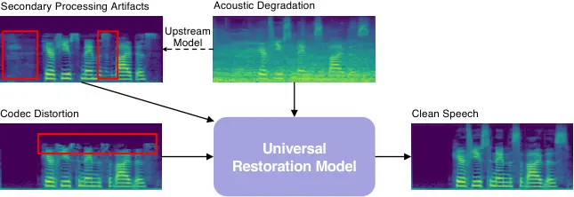
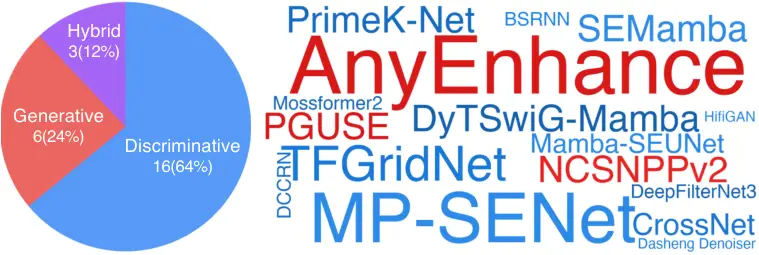
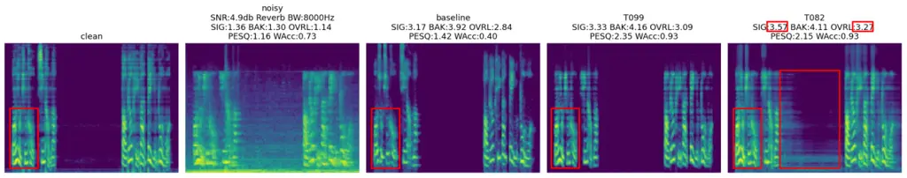
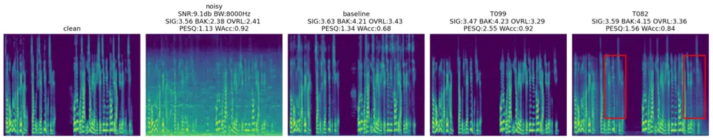
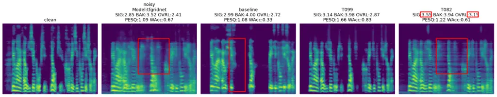
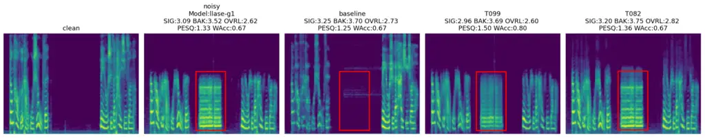

# The CCF AATC 2025 Speech Restoration Challenge: A Retrospective

Junan Zhang    Mengyao Zhu    Xin Xu    Hui Bu    Zhenhua Ling   
Zhizheng Wu ^(†)^(†)thanks: J. Zhang and Z. Wu are affiliated with The
Chinese University of Hong Kong, Shenzhen. e-mail:
[junanzhang@link.cuhk.edu.cn](mailto:junanzhang@link.cuhk.edu.cn)^(†)^(†)thanks:
M. Zhu is affiliated with Audio Department, Huawei CBG.^(†)^(†)thanks:
X. Xu and H. Bu are affiliated with Beijing AISHELL Technology Co.,
Ltd.^(†)^(†)thanks: Z. Ling is affiliated with University of Science and
Technology of China.^(†)^(†)thanks: Z. Wu is the corresponding author.
e-mail: [wuzhizheng@cuhk.edu.cn](mailto:wuzhizheng@cuhk.edu.cn)

###### Abstract

Real-world speech communication is rarely affected by a single type of
degradation. Instead, it suffers from a complex interplay of acoustic
interference, codec compression, and, increasingly, secondary artifacts
introduced by upstream enhancement algorithms. To bridge the gap between
academic research and these realistic scenarios, we introduced the CCF
AATC 2025 Speech Restoration Challenge. This challenge targets universal
blind speech restoration, requiring a single model to handle three
distinct distortion categories: acoustic degradation, codec distortion,
and secondary processing artifacts. In this paper, we provide a
comprehensive retrospective of the challenge, detailing the dataset
construction, task design, and a systematic analysis of the 25
participating systems. We report three key findings that define the
current state of the field: (1) Efficiency vs. Scale: Contrary to the
trend of massive generative models, top-performing systems demonstrated
that lightweight discriminative architectures ($`<`$10M parameters) can
achieve state-of-the-art performance, balancing restoration quality with
deployment constraints. (2) The Generative Trade-off: While generative
and hybrid models excel in theoretical perceptual metrics, breakdown
analysis reveals they suffer from “reconstruction bias” in high-SNR
codec tasks and struggle with hallucination in complex secondary
artifact scenarios. (3) The Metric Gap: Most critically, our rank
correlation analysis exposes a strong negative correlation
($`\rho=-0.8`$) between widely-used reference-free metrics (e.g.,
DNSMOS) and human MOS when evaluating hybrid systems. This indicates
that current metrics may over-reward artificial spectral smoothness at
the expense of perceptual naturalness. This paper aims to serve as a
reference for future research in robust speech restoration and calls for
the development of next-generation evaluation metrics sensitive to
generative artifacts.

###### Index Terms: 

Speech restoration, secondary artifacts, objective metric evaluation,
generative vs. discriminative models.

## I Introduction



Fig. 1: Overview of the universal blind speech restoration challenge. A
single model must recover clean speech from three degradation types
without knowing the distortion source: (1) Acoustic degradation from
noise and reverberation. (2) Secondary processing artifacts created by
passing degraded speech through an upstream enhancement model (dashed
arrow), with red boxes indicating residual noise and spectral artifacts.
(3) Codec distortion, where red boxes highlight high-frequency cutoff
and quantization noise from mp3 compression.

|           |                                   |                      |                  |                                |
| --------- | --------------------------------- | -------------------- | ---------------- | ------------------------------ |
| Type      | Name                              | Acoustic Degradation | Codec Distortion | Secondary Processing Artifacts |
| Challenge | DNS Challenge \[1\]               | ✓                    | ✗                | ✗                              |
|           | URGENT Challenge 2024 \[2\]       | ✓                    | ✗                | ✗                              |
|           | URGENT Challenge 2025 \[3\]       | ✓                    | ✓                | ✗                              |
|           | CCF AATC 2025: Speech Restoration | ✓                    | ✓                | ✓                              |
| Method    | Voicefixer \[4\]                  | ✓                    | ✗                | ✗                              |
|           | AnyEnhance \[5\]                  | ✓                    | ✗                | ✗                              |
|           | Apollo \[6\]                      | ✗                    | ✓                | ✗                              |
|           | Diffiner \[7\]                    | ✗                    | ✗                | ✓                              |
|           | SpeechRefiner \[8\]               | ✗                    | ✗                | ✓                              |

TABLE I: Comparison of existing challenges and representative methods.
Unlike previous benchmarks focusing on isolated degradations, CCF AATC
2025 targets universal restoration across acoustic, codec, and secondary
artifacts.

Speech restoration, the process of recovering clean speech from degraded
signals, is a cornerstone of modern audio engineering. While significant
progress has been made in isolated sub-tasks such as denoising \[1\],
dereverberation \[9\], and bandwidth extension \[6\], real-world
communication pipelines present a far more complex landscape. Speech
signals in the wild typically suffer from a cascade of distortions \[4,
2, 5, 10, 11, 12\], including acoustic interference, lossy compression,
and upstream processing errors.

Current benchmarks, as summarized in Table I, largely focus on subsets
of these problems. The DNS Challenges \[1\] primarily target acoustic
degradation, while recent efforts like the URGENT Challenge 2025 \[3\]
have begun to incorporate codec artifacts. However, a critical gap
remains: the prevalence of Secondary Processing Artifacts. In modern
Voice over Internet Protocol (VoIP) and conferencing systems, audio is
often pre-processed by imperfect enhancement algorithms (e.g., noise
gates or legacy denoisers) before transmission, introducing non-linear
artifacts such as musical noise, spectral holes, and phase
discontinuities. Restoring such processed speech requires a model to
distinguish between natural speech features and artificial algorithmic
residues—a capability that existing benchmarks have yet to
systematically evaluate.

To bridge this gap, we introduced the CCF AATC 2025 Speech Restoration
Challenge¹¹ 1 [https://ccf-aatc.org.cn/](https://ccf-aatc.org.cn/). This
challenge defines a novel task: Universal Blind Speech Restoration. As
illustrated in Fig. 1, participants must develop a single model capable
of handling three distinct input streams—(1) Acoustic Degradation, (2)
Codec Distortion, and (3) Secondary Processing Artifacts—without prior
knowledge of the distortion type. This setup pushes the boundaries of
model generalization, requiring systems to balance smoothing (for
denoising) with texture generation (for codec recovery) and artifact
removal.

In this paper, we provide a comprehensive retrospective of the
challenge, analyzing the submissions from 25 participating teams. These
systems represent a diverse cross-section of current methodologies,
including Time-Frequency (T-F) domain discriminative models, masked
generative models, and emerging hybrid architectures (e.g., gan-score
model-based integration). Beyond a simple leaderboard, our systematic
analysis yields three critical insights that define the current state of
the field:

- •
  Efficiency vs. Scale: Contrary to the prevailing trend of massive
  generative models, our results demonstrate that lightweight
  discriminative architectures (parameters $`<10`$M) dominate the top
  rankings. These models offer a superior trade-off between restoration
  fidelity (Word Accuracy) and computational cost, proving their
  viability for edge deployment.
- •
  The Generative Trade-off: While generative and hybrid models excel in
  generating perceptually smooth spectra, breakdown analysis reveals a
  “reconstruction bias.” In high-SNR tasks like Codec Restoration,
  generative models often aggressively resynthesize the signal, leading
  to lower phase fidelity (PESQ) and intelligibility compared to
  discriminative approaches.
- •
  The Metric Gap: Most critically, we expose a severe misalignment in
  evaluation metrics. Our correlation analysis reveals a strong negative
  correlation ($`\rho=-0.8`$) between widely used reference-free metrics
  (e.g., DNSMOS) and human subjective ratings (MOS) when evaluating
  hybrid systems. This indicates that current metrics over-reward
  artificial spectral smoothness at the expense of perceptual
  naturalness, calling for a paradigm shift in how we evaluate
  generative speech enhancement.

This paper aims to serve not only as a summary of the CCF AATC 2025
challenge but also as a reference for future research in robust,
universal speech restoration, highlighting the need for next-generation
metrics sensitive to generative artifacts and improved generative model
design.

## II Challenge Overview

### II-A Problem Formulation

The goal of this challenge is Universal Blind Speech Restoration. Let
$`x\in\mathbb{R}^{T}`$ denote a mono clean speech waveform of length
$`T`$. In real-world transmission, $`x`$ can be corrupted by three
distinct degradation mechanisms: acoustic degradation, codec distortion,
and secondary processing artifacts. The observed degraded signal $`y`$
is modeled as:

```math
y=\begin{cases}\mathcal{D}_{\text{ac}}(x,n,h)&\text{Type I: Acoustic}\\
\mathcal{D}_{\text{codec}}(x,r)&\text{Type II: Codec}\\
\mathcal{M}_{\theta}(\mathcal{D}_{\text{ac}}(x,n,h))&\text{Type III: Secondary}\end{cases} \tag{1}
```

where $`\mathcal{D}_{\text{ac}}`$ represents the acoustic degradation,
$`n`$ is the noise, $`h`$ is the room impulse response;
$`\mathcal{D}_{\text{codec}}`$ represents codec distortion and $`r`$ is
the bitrate; and $`\mathcal{M}_{\theta}`$ denotes a non-linear upstream
enhancement model with parameters $`\theta`$. Note that Type III
degradation is composite, applying algorithmic artifacts onto
acoustically degraded speech. Specifically the three degradation types
are:

- •
  Acoustic Degradation: We considered four types of acoustic
  degradation: reverberation, clipping, bandwidth limitation, and noise.
  To generate the acoustic degraded speech: given clean speech $`x`$,
  room impulse response $`h`$, and noise $`n`$, the acoustic degraded
  speech is generated as:
  $`y=\mathcal{D}_{\text{ac}}(x,n,h)=\text{LPF}(\text{Clip}(x\ast h))+n`$,
  where LPF is the low-pass filter, Clip is the clipping function.
- •
  Codec Distortion: We applied MP3 compression to the audio signals to
  emulate artifacts from transmission over band-limited channels.
  $`y=\mathcal{D}_{\text{codec}}(x,r)=\mathcal{E}_{\text{mp3}}(x,r)`$,
  where $`r`$ is the bitrate.
- •
  Secondary Processing Artifacts: We processed the acoustically degraded
  speech with a suite of speech enhancement models and used their
  outputs as an additional source of distortion:
  $`y=\mathcal{M}_{\theta}(\mathcal{D}_{\text{ac}}(x,n,h))`$, where
  $`\theta`$ is the parameters of the enhancement model.

The challenge requires learning a single restoration function
$`f_{\phi}:\mathbb{R}^{T}\to\mathbb{R}^{T}`$ such that
$`\hat{x}=f_{\phi}(y)`$ approximates $`x`$ with high fidelity, without
prior knowledge of the distortion type. More details about the dataset
construction are provided in Section II-B.

### II-B Degradation Pipeline

We implemented a customizable pipeline²² 2
[https://github.com/viewfinder-annn/anyenhance-v1-ccf-aatc/tree/main/data_simulation](https://github.com/viewfinder-annn/anyenhance-v1-ccf-aatc/tree/main/data_simulation)
to simulate the three distortion types defined in Eq. (1).

#### II-B1 Acoustic Degradation ($`\mathcal{D}_{\text{ac}}`$)

To simulate realistic recording environments, we introduced acoustic
distortions using the degradation pipeline from AnyEnhance \[5\]. The
pipeline consists of four stages:

- •
  Reverberation: ($`p=0.5`$) Convolution with RIRs $`h`$.
- •
  Clipping: ($`p=0.25`$) Mimics microphone saturation with quantile
  thresholds between $`[0.06,0.9]`$.
- •
  Bandwidth Limitation: ($`p=0.5`$) Applies low-pass filtering to
  simulate diverse capture devices. Cutoff frequencies are sampled from
  $`\{4,8,16,24,32\}`$ kHz using various resampling kernels
  (Kaiser-best, Kaiser-fast, Polyphase).
- •
  Additive Noise: ($`p=0.9`$) Mixes background noise $`n`$ with SNR
  sampled uniformly from $`[-5,20]`$ dB.

#### II-B2 Codec Distortion ($`\mathcal{D}_{\text{codec}}`$)

To simulate transmission artifacts over band-limited channels, we
applied mp3 compression using the torchaudio backend. We sampled
bitrates from a wide range: $`\{24,32,48,64,96,128\}`$ kbps. This
introduces characteristic artifacts such as high-frequency cutoff and
quantization noise, particularly at lower bitrates (24-32 kbps).

#### II-B3 Secondary Processing Artifacts ($`\mathcal{D}_{\text{sec}}`$)

This track simulates the artifacts introduced by imperfect upstream
enhancement. We selected 10 representative speech enhancement models,
including discriminative and generative models. The discriminative
models included Demucs \[13\], a popular real-time waveform-to-waveform
model; FRCRN \[14\], which boosts feature representation through
frequency recurrence; VoiceFixer \[4\], a two-stage general restoration
model; NSNet2 \[1\], the lightweight baseline from the ICASSP 2021 DNS
Challenge; and TF-GridNet \[15\], the time-frequency domain baseline
from the Interspeech 2024 Urgent Challenge. The generative models
consisted of SGMSE+ \[9\], a versatile score-based generative model;
StoRM \[16\], a hybrid model combining a predictive stage and a
generative stage; AnyEnhance \[5\], a unified masked generative model
with prompt-guidance and self-critic; MaskSR \[11\], a masked generative
model that predicts acoustic tokens; and LLaSE-G1 \[17\], a LLaMA-based
model designed to perform multiple enhancement tasks.

### II-C Dataset Construction

To support the challenge, we curated a large-scale training dataset and
provided a development set sampled at 44.1 kHz. All data was synthesized
from high-quality, clean speech corpora to create corresponding degraded
versions through the degradation pipeline described in Section II-B.

#### II-C1 Clean Speech Corpora

The source speech is derived from three high-quality corpora. We
strictly excluded specific speakers for development sets:

- •
  VCTK \[18\]: A multi-speaker English dataset with various accents.
  Excluded speakers p229, p236, p310.
- •
  AISHELL-3 \[19\]: A large-scale Mandarin Chinese speech corpus.
  Excluded speakers SSB0197, SSB0686, SSB1684.
- •
  EARS \[20\]: A high-quality English speech dataset recorded in
  controlled environments. Excluded speakers p031, p065, p066.

#### II-C2 Noise and RIR Data

To simulate diverse acoustic environments, we utilized noise recordings
from MUSAN \[21\], the Urgent Challenge subset (DNS5+Wham) \[2\],
FSD50K \[22\], and DESED \[23\]. Room Impulse Responses (RIRs) comprised
62,668 samples from SLR26, SLR28, and self-collected rirs from
AnyEnhance \[5\].

The training set was statically generated to ensure reproducibility. It
contains 153,475 clean utterances, totaling $`\sim`$300 hours. For every
clean utterance $`x_{i}`$, we generated three corresponding degraded
versions
$`\{y_{i}^{\text{ac}},y_{i}^{\text{codec}},y_{i}^{\text{sec}}\}`$. The
development set consists of 500 utterances from excluded speakers, with
the same distortion configuration as the training set, with 200
Acoustic, 100 Codec, and 200 Secondary.

### II-D Baseline System

We provided an official baseline system based on the AnyEnhance
framework \[5\]. The baseline is a lightweight, non-causal version of a
masked generative model. It consists of a semantic enhancement stage and
an acoustic enhancement stage, designed to progressively predict the
acoustic tokens of clean speech from the degraded speech. The baseline
model consists of 10 transformer layers (512 hidden dimension),
resulting in 45.68M parameters. It predicts acoustic tokens of DAC
tokenizer \[24\], so requires DAC’s decoder to decode the tokens into
speech. So the baseline model consists of 45.68M parameters for the
generative backbone and 36.50M parameters for the DAC decoder, resulting
in a total inference size of 82.18M. The complete source code,
pre-trained model, and detailed instructions for training and inference
were made publicly available in a GitHub repository³³ 3
[https://github.com/viewfinder-annn/anyenhance-v1-ccf-aatc](https://github.com/viewfinder-annn/anyenhance-v1-ccf-aatc).

[TABLE]

TABLE II: Evaluation metrics and scoring criteria for the challenge.

### II-E Benchmarking Methodology

To benchmark the competing systems, we designed a multi-stage evaluation
protocol that balances restoration quality, intelligibility, and
computational efficiency. The competition is divided into a Preliminary
Round (objective-only) and a Final Round (subjective and innovation
assessment). The detailed scoring criteria are summarized in Table II.

#### II-E1 Preliminary Round: Objective Benchmarking

The preliminary round serves as a quantitative filter. Teams are ranked
based on a composite Objective Score, derived from two key components:

- •
  Performance Metrics (40 points): We employ a composite ranking system
  based on three complementary metrics to assess different aspects of
  restoration quality:
  - –
    WAcc (Word Accuracy): Measures speech intelligibility. We prioritize
    this metric with a 50% weight (Ratio 2:1:1 against others) to
    penalize generative models that produce high-quality but
    hallucinated content. We use Whisper-large-v3⁴⁴ 4
    [https://huggingface.co/openai/whisper-large-v3](https://huggingface.co/openai/whisper-large-v3)
    as the ASR model.
  - –
    DNSMOS \[1\]: Estimates perceptual quality (SIG, BAK, OVRL) without
    a reference signal, accounting for 25% weight.
  - –
    PESQ \[25\]: Measures waveform fidelity and spectral magnitude
    consistent with the reference, accounting for 25% weight.

  Teams are ranked on each metric individually, and the weighted average
  rank determines the final metric score. The evaluation script is
  available in the baseline repository⁵⁵ 5
  [https://github.com/viewfinder-annn/anyenhance-v1-ccf-aatc/blob/main/evaluation](https://github.com/viewfinder-annn/anyenhance-v1-ccf-aatc/blob/main/evaluation).

- •
  Efficiency Constraints (20 points): To bridge the gap between academic
  research and industrial deployment, we explicitly evaluate model
  complexity. We enforce a “lightweight first” policy, where models are
  categorized into tiers based on parameter count. As shown in Table II,
  models under 10M parameters receive the maximum score, while those
  exceeding 100M receive the minimum. This design discourages the
  brute-force scaling of generative backbones and encourages efficient
  architectural innovations.

#### II-E2 Final Round: Subjective and Innovation Assessment

The top six teams from the preliminary round advance to the finals. The
evaluation expands to include human perception and algorithmic novelty:

1. Subjective Listening Test (20 points): Given the distinct perceptual
   characteristics of different distortions, our subjective evaluation
   focuses on the Acoustic Degradation subset, which exhibits the highest
   perceptual variance. We recruited listeners to rate the restored audio
   using the Mean Opinion Score (MOS) standard.

2. Solution Innovation (20 points): A panel of experts evaluates the
   technical novelty of the proposed solutions based on the submitted
   technical reports and code. Points are awarded for original
   architectural improvements (e.g., novel attention mechanisms, hybrid
   integration strategies) rather than simple hyper-parameter tuning or
   ensembling of existing models.

The final ranking is determined by the sum of the Preliminary Objective
Score and the Final Round scores (Subjective + Innovation).

## III Results and Analysis

In this section, we present a systematic evaluation of the participating
systems. We first detail the experimental setup, followed by a holistic
analysis of performance versus efficiency. Finally, we conduct a
breakdown analysis across distortion types and investigate the
correlation between objective metrics and human perception.

### III-A Experimental Setup

Test Dataset and Evaluation Protocol To assess generalization, we
constructed a blind test set of 300 utterances using held-out internal
clean speech mixed with noise from the TUT Urban Acoustic Scenes 2018
dataset \[26\] and unseen RIRs. The corresponding degradation types are
divided into three categories: (1) Acoustic Degradation (150 files); (2)
Codec Distortion (50 files) across various bitrates; and (3) Secondary
Artifacts (100 files) derived from the ten upstream models described in
Section II-C. The testset is available at ⁶⁶ 6
[https://github.com/viewfinder-annn/AnyEnhance-v1/releases/download/v0.1_aatc_testset/aatc_testset_v1_release.tar.gz](https://github.com/viewfinder-annn/AnyEnhance-v1/releases/download/v0.1_aatc_testset/aatc_testset_v1_release.tar.gz).

We employ the objective metrics described in Section II-E to evaluate
the performance of the submitted systems. For the subjective evaluation,
we focus on the Acoustic Degradation subset (150 utterances) to ensure
the validity of the MOS scores. We recruited 29 listeners. Each
utterance received at least 6 valid ratings after a rigorous filtering
process involving “probe samples” (check mechanisms) to ensure data
reliability.

|      |          |        |                                    |                  |                 |                 |                  |                  |            |                 |
| ---- | -------- | ------ | ---------------------------------- | ---------------- | --------------- | --------------- | ---------------- | ---------------- | ---------- | --------------- |
| Rank | Team ID  | Type   | Backbone                           | WAcc$`\uparrow`$ | SIG$`\uparrow`$ | BAK$`\uparrow`$ | OVRL$`\uparrow`$ | PESQ$`\uparrow`$ | Params (M) | Objective Score |
| \-   | Clean    | \-     | \-                                 | \-               | 3.541           | 4.126           | 3.296            | \-               | \-         | \-              |
| \-   | Noisy    | \-     | \-                                 | 0.772            | 2.891           | 3.019           | 2.469            | 1.906            | \-         | \-              |
| 1    | T099     | D      | MP-SENet \[27\]                    | 0.811            | 3.300           | 4.092           | 3.054            | 2.557            | 6.63       | 60.00           |
| 2    | T082     | Hybrid | SEMamba \[28\], NCSNPPv2 \[29\]    | 0.779            | 3.466           | 4.069           | 3.191            | 2.165            | 7.80       | 59.00           |
| 3    | T002     | D      | TFGridNet \[15\]                   | 0.779            | 3.398           | 4.070           | 3.135            | 2.317            | 9.42       | 58.00           |
| 4    | T081     | D      | DyTSwiG-Mamba \[30\]               | 0.766            | 3.362           | 4.072           | 3.098            | 2.420            | 1.55       | 57.00           |
| 5    | T146     | D      | MP-SENet \[27\]                    | 0.788            | 3.207           | 3.977           | 2.932            | 2.529            | 6.63       | 56.00           |
| 6    | T056     | D      | PrimeK-Net \[31\]                  | 0.762            | 3.388           | 4.087           | 3.127            | 2.345            | 1.41       | 55.00           |
| 7    | T066     | Hybrid | PGUSE \[32\]                       | 0.777            | 3.321           | 4.011           | 3.049            | 2.483            | 5.37       | 54.00           |
| 8    | T112     | D      | CrossNet \[33\]                    | 0.785            | 3.318           | 3.947           | 3.012            | 2.157            | 3.54       | 53.00           |
| 9    | T068     | D      | MP-SENet \[27\]                    | 0.764            | 3.347           | 4.000           | 3.081            | 2.348            | 4.10       | 52.00           |
| 10   | T130     | D      | Mamba-SEUNet \[34\]                | 0.759            | 3.304           | 4.079           | 3.051            | 2.258            | 6.32       | 51.00           |
| 11   | T032     | D      | MP-SENet \[27\]                    | 0.722            | 3.302           | 3.934           | 3.001            | 2.161            | 2.21       | 50.00           |
| 12   | T115     | D      | MP-SENet \[27\]                    | 0.720            | 3.324           | 3.897           | 2.989            | 2.013            | 6.29       | 48.00           |
| 13   | T076     | D      | DeepFilterNet3 \[35\]              | 0.711            | 3.139           | 3.957           | 2.868            | 2.065            | 2.10       | 47.00           |
| 14   | T071     | D      | DCCRN \[36\]                       | 0.635            | 3.119           | 3.740           | 2.784            | 1.850            | 3.51       | 46.00           |
| 15   | T079     | D      | BSRNN \[37\]                       | 0.731            | 3.441           | 3.905           | 3.111            | 2.205            | 26.35      | 41.00           |
| 16   | T052     | Hybrid | AnyEnhance \[5\], TFGridNet \[15\] | 0.692            | 3.353           | 4.012           | 3.072            | 2.134            | 86.29      | 35.00           |
| 17   | T108     | G      | AnyEnhance \[5\]                   | 0.635            | 3.340           | 4.070           | 3.063            | 1.772            | 82.18      | 34.00           |
| 18   | T132     | G      | AnyEnhance \[5\]                   | 0.634            | 3.357           | 4.062           | 3.088            | 1.738            | 82.68      | 33.00           |
| 19   | T117     | G      | AnyEnhance \[5\]                   | 0.624            | 3.365           | 4.075           | 3.099            | 1.741            | 82.18      | 32.00           |
| 20   | T104     | G      | AnyEnhance \[5\]                   | 0.620            | 3.404           | 4.069           | 3.134            | 1.711            | 82.18      | 30.00           |
| 21   | T009     | D      | Mossformer2 \[38\]                 | 0.676            | 3.191           | 3.917           | 2.883            | 1.981            | 55.26      | 29.00           |
| 22   | T017     | D      | Dasheng Denoiser \[39\]            | 0.727            | 3.177           | 3.865           | 2.886            | 1.777            | 138.50     | 29.00           |
| 23   | T093     | G      | AnyEnhance \[5\]                   | 0.631            | 3.224           | 4.065           | 2.966            | 1.640            | 80.34      | 28.00           |
| 24   | Baseline | G      | AnyEnhance \[5\]                   | 0.618            | 3.290           | 4.050           | 3.031            | 1.672            | 82.18      | 27.00           |
| 24   | T004     | D      | HifiGAN \[40\]                     | 0.441            | 3.308           | 3.958           | 2.998            | 1.260            | 50.98      | 26.00           |
| 25   | T111     | G      | AnyEnhance \[5\]                   | 0.002            | 2.449           | 3.689           | 1.895            | 1.232            | 82.18      | 26.00           |

TABLE III: Quantitative comparison of all teams, the baseline, and
reference signals (Clean/Noisy) on the final test set. Metrics include
Word Accuracy (WAcc) for speech intelligibility, DNSMOS (SIG, BAK, OVRL)
for perceptual quality, and PESQ. “Params” denotes the model parameter
count in millions. The best results among the participating teams are
highlighted in bold, and the second-best results are underlined.

### III-B Overview of Submitted Systems



Fig. 2: Overview of the model architectures adopted by the top 25 teams.
Left: The quantitative distribution of model paradigms, showing that
discriminative models are the most common choice. Right: A word cloud
visualization of the specific backbones and components, highlighting the
high frequency of “AnyEnhance” and “MP-SENet”. Colors in the table
correspond to the word cloud: Blue for Discriminative and Red for
Generative components.

We received 25 valid submissions among 104 registered teams. As
illustrated in Fig. 2 (Left), the solutions can be categorized into
three distinct paradigms: Discriminative (64%), Generative (24%), and
Hybrid (12%). Fig. 2 (Right) further provides a word cloud visualization
of the specific backbones employed, revealing the community’s preference
for established T-F domain architectures and the emerging interest in
state-space models.

- •
  Discriminative Models (D): This category represents the predominant
  choice, adopted by 16 teams. Time-Frequency (T-F) domain architectures
  remain the gold standard, with MP-SENet \[27\] and TF-GridNet \[15\]
  being the most popular backbones. Notably, there is a rising trend
  towards efficiency-oriented designs: several teams (e.g., T081, T130)
  incorporated Mamba/State Space Models \[41\] (e.g., DyTSwiG-Mamba,
  Mamba-SEUNet) to reduce computational complexity while maintaining
  receptive fields. As detailed in Table III, these models are
  characterized by their lightweight footprint, with most discriminative
  entries containing fewer than 10M parameters.
- •
  Generative Models (G): Six teams opted for generative approaches. The
  majority built upon the official baseline, AnyEnhance \[5\], a masked
  generative model. Unlike the compact discriminative models, these
  systems are significantly larger, typically exceeding 80M parameters
  (e.g., Baseline at 82.18M). This increased size is primarily due to
  the heavy dependencies on neural audio codecs (DAC) and large
  transformer backbones required for token prediction.
- •
  Hybrid Models (H): Three teams explored hybrid architectures that
  combine discriminative feature extraction with generative refinement.
  A representative example is T082, which integrates SEMamba \[28\] (a
  selective state-space model) with NCSNPPv2 \[29\] (a score-based
  diffusion component). This design aims to leverage the stability of
  discriminative learning and the perceptual quality of generative
  priors. However, this hybrid nature often results in variable
  parameter counts.

In summary, the competition submissions highlight a distinct dichotomy
in model scaling: discriminative approaches strive for extreme lightness
($`<`$10M) suitable for edge deployment, while generative approaches
prioritize capacity ($`>`$80M) to model complex distributions.

### III-C Overall Performance and Efficiency Analysis

Table III presents the quantitative comparison of the top-performing
teams, while Fig. 3 visualizes the relationship between model size and
final ranking. A joint analysis reveals two critical insights defining
the current state of speech restoration:

Fig. 3: Comparison of model parameter efficiency and final ranking. The
x-axis represents the parameter count (in millions) on a logarithmic
scale, and the y-axis represents the final competition rank. Colors
distinguish the team categories, while marker shapes indicate the model
architecture types (Discriminative, Generative, or Hybrid).

#### III-C1 The Efficiency Frontier:

Contrary to the prevailing trend in deep learning where ”larger is
better,” our results highlight a distinct low-resource Pareto Front. As
shown in Fig. 3, the top 6 participating teams all cluster in the
top-left corner, utilizing fewer than 10M parameters.

- •
  Lightweight Dominance: The winning team, T099 (MP-SENet), achieved
  state-of-the-art performance with only 6.63M parameters. Even more
  strikingly, T056 (PrimeK-Net) ranked 6th with an extremely compact
  footprint of 1.41M parameters, outperforming models 50$`\times`$ its
  size.
- •
  The Generative Burden: In contrast, generative models (marked as
  triangles in Fig. 3) mostly populate the bottom-right region. For
  instance, the Baseline and related entries (e.g., T108, T117) exceed
  80M parameters due to the heavy computational cost of neural codec
  decoders and autoregressive backbones. However, this increased
  capacity did not translate into superior objective scores, largely
  because they struggled to recover fine-grained phase information
  required for high PESQ, and their generative hallucinations penalized
  WAcc.

#### III-C2 Discriminative vs. Hybrid: The Fidelity-Quality Trade-off

A granular analysis of Table III reveals a fascinating divergence
between the top-ranked discriminative model (T099) and the top-ranked
hybrid model (T082).

- •
  Fidelity (T099): T099 dominates in metrics reflecting signal fidelity
  and intelligibility, achieving the highest WAcc (0.811) and PESQ
  (2.557). This suggests that discriminative mapping in the T-F domain
  remains the most effective strategy for preserving phonemic content
  and waveform alignment.
- •
  Perceptual Quality (T082): T082, which integrates a generative
  component, achieved the highest SIG (3.466) and OVRL (3.191) scores.
  This indicates that incorporating generative priors helps synthesize
  “perceptually” pleasing speech.

However, T082’s lower PESQ (2.165 vs. 2.557) and WAcc (0.779 vs. 0.811)
compared to T099 imply a trade-off: hybrid models gain perceptual
smoothness at the cost of signal fidelity. This duality sets the stage
for the breakdown analysis in the following sections.

Fig. 4: Radar chart comparing the Top 5 teams and the baseline across
six dimensions. All metrics are normalized to the \[0, 1\] range for
visualization. Note that for Efficiency, a larger value indicates fewer
parameters (calculated as $`1/\text{Params}`$), while for other metrics,
higher values indicate better performance.

To visualize these trade-offs, Fig. 4 presents the normalized metrics
across six dimensions. The rank 1 system T099 (Red) exhibits the largest
enclosed area with a balanced shape, demonstrating holistic robustness
across intelligibility, fidelity, and efficiency. In contrast, the
hybrid model T082 (Blue) shows a distinct “skewed” profile: it extends
furthest on the SIG axis (perceptual quality) but retreats significantly
on PESQ and Efficiency. This visual confirmation reinforces that, under
current constraints, lightweight discriminative models offer a superior
compromise compared to the specialized but computationally heavier
hybrid approaches.

|                                |      |          |                  |                 |                 |                  |                  |
| ------------------------------ | ---- | -------- | ---------------- | --------------- | --------------- | ---------------- | ---------------- |
| Distortion Type                | Rank | Team     | WAcc$`\uparrow`$ | SIG$`\uparrow`$ | BAK$`\uparrow`$ | OVRL$`\uparrow`$ | PESQ$`\uparrow`$ |
| Acoustic Degradation           | \-   | Clean    | \-               | 3.526           | 4.126           | 3.281            | \-               |
|                                | \-   | Noisy    | 0.731            | 2.408           | 2.026           | 1.837            | 1.306            |
|                                | \-   | Baseline | 0.530            | 3.221           | 4.047           | 2.976            | 1.505            |
|                                | 1    | T099     | 0.790            | 3.218           | 4.088           | 2.978            | 2.337            |
|                                | 2    | T082     | 0.756            | 3.491           | 4.034           | 3.191            | 1.960            |
|                                | 3    | T002     | 0.743            | 3.375           | 4.069           | 3.112            | 2.108            |
|                                | 4    | T081     | 0.730            | 3.313           | 4.070           | 3.051            | 2.165            |
|                                | 5    | T146     | 0.754            | 3.116           | 3.925           | 2.839            | 2.331            |
| Codec Distortion               | \-   | Clean    | \-               | 3.556           | 4.110           | 3.300            | \-               |
|                                | \-   | Noisy    | 0.989            | 3.547           | 4.091           | 3.282            | 4.112            |
|                                | \-   | Baseline | 0.929            | 3.537           | 4.099           | 3.274            | 2.638            |
|                                | 1    | T099     | 0.990            | 3.546           | 4.109           | 3.289            | 4.324            |
|                                | 2    | T082     | 0.977            | 3.528           | 4.127           | 3.285            | 3.619            |
|                                | 3    | T002     | 0.986            | 3.560           | 4.109           | 3.304            | 4.117            |
|                                | 4    | T081     | 0.994            | 3.567           | 4.129           | 3.321            | 4.159            |
|                                | 5    | T146     | 0.993            | 3.534           | 4.091           | 3.272            | 4.186            |
| Secondary Processing Artifacts | \-   | Clean    | \-               | 3.554           | 4.136           | 3.315            | \-               |
|                                | \-   | Noisy    | 0.743            | 3.254           | 3.961           | 2.978            | 1.758            |
|                                | \-   | Baseline | 0.607            | 3.312           | 4.042           | 3.041            | 1.489            |
|                                | 1    | T099     | 0.764            | 3.330           | 4.100           | 3.084            | 2.110            |
|                                | 2    | T082     | 0.735            | 3.368           | 4.088           | 3.113            | 1.808            |
|                                | 3    | T002     | 0.738            | 3.320           | 4.047           | 3.057            | 1.788            |
|                                | 4    | T081     | 0.728            | 3.353           | 4.046           | 3.078            | 2.013            |
|                                | 5    | T146     | 0.750            | 3.298           | 4.032           | 3.024            | 2.115            |

TABLE IV: Detailed performance comparison across three distortion types:
Acoustic Degradation, Codec Distortion, and Secondary Processing
Artifacts. The best results among participating teams are highlighted in
bold.

### III-D Breakdown Analysis by Distortion Type

To analyze the specific capabilities and limitations of different
modeling paradigms, we conduct a granular performance analysis across
the three distinct distortion categories as detailed in Table IV. This
breakdown reveals a fundamental trade-off between signal fidelity and
perceptual hallucination.

#### III-D1 Acoustic Degradation: The Fidelity-Smoothness Trade-off

This category, representing standard denoising and dereberveration
tasks, highlights the divergence in optimization goals. Discriminative
models, exemplified by T099, prioritize signal fidelity, achieving the
highest WAcc (0.790) and PESQ (2.337). These models effectively act as
precise non-linear filters, preserving phonemic edges essential for
intelligibility. In contrast, hybrid approaches like T082 excel in
spectral reconstruction, achieving the highest SIG score (3.491) and
OVRL (3.191). However, this comes at a cost: T082’s PESQ (1.960) is
notably lower than T099’s, suggesting that while the generated spectra
are smooth and noise-free (pleasing to DNSMOS), the phase coherence and
temporal alignment with the reference are compromised during the
generative refinement process.

#### III-D2 Codec Distortion: The Curse of Reconstruction Bias

The results on Codec Distortion provide the strongest evidence for the
“Reconstruction Bias” inherent in generative models. It is crucial to
note that the input signals, despite mp3 compression, maintain high
intelligibility and phase alignment (Input WAcc 0.989, PESQ 4.112).

- •
  Discriminative Success: Top-performing discriminative models (T099,
  T081, T146) correctly identify the high SNR nature of the input. They
  approximate an identity mapping while subtly correcting quantization
  artifacts, thereby preserving or slightly enhancing the high input
  PESQ (e.g., T099 improves PESQ to 4.324).
- •
  Generative Failure: Conversely, generative systems struggle to be
  conservative. The Baseline model drastically degrades the input,
  dropping WAcc to 0.929 and PESQ to 2.638. Even the top-tier hybrid
  model T082 degrades the input PESQ from 4.112 to 3.619. This indicates
  that without explicit constraints, generative models tend to
  aggressively resynthesize the speech based on learned priors rather
  than repairing the existing, high-quality structure, leading to
  unnecessary phase mismatches and artifact introduction.

#### III-D3 Secondary Processing Artifacts: The Generalization Bottleneck

This category represents the most challenging distortion type,
characterized by upstream artifacts that are highly non-predictable and
non-linear. All models exhibit a performance drop compared to other
categories. However, discriminative models (T099) again demonstrate
superior robustness in retaining content (WAcc 0.764) compared to hybrid
counterparts. The hybrid model T082, while achieving the highest
perceptual scores (SIG 3.368), suffers from the lowest PESQ (1.808)
among the top 5. This suggests that when faced with unfamiliar
artifacts, generative components are prone to hallucination, masking
artifacts by synthesizing plausible but phase-incoherent speech
textures, which satisfy reference-free metrics but deviate from the
ground truth.

(a) SIG

(b) BAK

(c) OVRL

(d) PESQ

(e) WAcc

Fig. 5: Rank-rank correlation analysis between subjective MOS and five
objective metrics. Each point represents a participating team. The
dashed line indicates the linear regression fit, and the shaded area
represents the 95% confidence interval. $`\rho`$ denotes the Spearman’s
rank correlation coefficient. A higher $`\rho`$ indicates better
alignment with human perception.

Fig. 6: MOS scores of the top 5 teams in the final round, with 95%
confidence interval.

### III-E Divergence between Objective and Subjective Quality

A critical discrepancy emerges when scrutinizing the alignment between
objective metrics and human perception. While discriminative models
(e.g., T099) maintain consistency across metrics, hybrid/generative
approaches expose a severe “Metric Gap”.

#### III-E1 The Uncanny Valley of Spectral Smoothness

As visualized in Fig. 6, the discriminative model T099 dominates the
subjective evaluation with a MOS of 4.033. In stark contrast, the hybrid
model T082, despite incorporating advanced generative priors, ranks
lowest among the top five systems (MOS 3.068).

This result presents a paradox when cross-referenced with Table IV:

- •
  The DNSMOS Illusion: T082 achieved the highest DNSMOS SIG score
  (3.491) in the competition, significantly outperforming T099 (3.218).
  Current reference-free metrics appear to over-reward the perfectly
  smooth spectral envelopes synthesized by generative models,
  interpreting the absence of noise as “high quality.”
- •
  Human Reality: Listeners significantly penalized T082. Qualitative
  feedback indicates that while the background was silent, the speech
  exhibited an “artificial robotic timbre” and subtle phase
  discontinuities—artifacts distinct from additive noise that DNSMOS
  fails to penalize. This confirms that T082 falls into an uncanny
  valley: statistically clean, yet perceptually unnatural.

#### III-E2 Rank-Rank Correlation Analysis

To quantify this misalignment, we calculated the Spearman’s rank
correlation coefficient ($`\rho`$) between objective metrics and human
MOS on the acoustic subset (Fig. 5). The results overturn conventional
wisdom in three aspects:

1.  1.  Inversion of Reference-Free Metrics (SIG/OVRL): Most alarmingly,
        DNSMOS SIG and OVRL exhibit a strong negative correlation
        ($`\rho=-0.8`$) with human ratings. This implies that for hybrid
        systems, optimizing for higher DNSMOS scores currently drives the
        model away from human preference. While the metric correctly
        assesses noise suppression (BAK $`\rho=0.8`$), it is fundamentally
        unable to distinguish between natural speech texture and
        over-smoothed, synthesized artifacts.
2.  2.  The Resurgence of Fidelity Metrics (PESQ): Contrary to the trend of
        disregarding intrusive metrics for generative tasks, PESQ
        demonstrates a strong positive correlation ($`\rho=0.800`$). This
        suggests that in the context of universal restoration, human
        listeners prioritize signal fidelity (waveform consistency) over
        aggressive hallucination. T099’s high PESQ (2.337) successfully
        predicted its subjective superiority, whereas T082’s lower PESQ
        (1.960) correctly signaled its perceptual degradation.

The current generation of reference-free metrics has not yet adapted to
the artifacts introduced by generative and hybrid models. They act as a
“smoothness detector” rather than a “naturalness detector,”
necessitating the development of next-generation metrics sensitive to
generative hallucinations.



(a) Acoustic Degradation Case 1: T082 exhibits severe spectral smearing
(red box) yet achieves the highest SIG score (3.57), illustrating metric
misalignment. The Baseline suffers from phoneme loss.



(b) Acoustic Degradation Case 2: Comparison of harmonic preservation.
T099 maintains sharp formant structures, whereas T082 introduces
temporal blurring artifacts in high frequencies.



(c) Secondary Processing Artifacts Case 1 (Input: TF-GridNet): All
models effectively sharpen the blurred input. Note that T082 still
introduces vertical smearing artifacts.



(d) Secondary Processing Artifacts Case 2 (Input: LLaSE-G1): The
upstream model introduces a ”spectral block” hallucination.
Discriminative (T099) and Hybrid (T082) models preserve this artifact,
while the Generative Baseline successfully removes it based on speech
priors.

Fig. 7: Spectrogram visualization of the top-performing Discriminative
(T099), Hybrid (T082), and Generative (Baseline) models across different
distortion types. Red boxes highlight critical artifacts: smearing in
Hybrid models (a, c) and hallucinations from upstream models (d).
Metrics (SIG/BAK/OVRL/PESQ/WAcc) are annotated above each spectrogram.

### III-F Case Study and Visualization

To visually validate our quantitative findings, we inspect spectrograms
from the three representative paradigms: Discriminative (T099),
Generative (Baseline), and Hybrid (T082). Fig. 7 presents samples from
Acoustic Degradation and Secondary Processing Artifacts.

#### III-F1 Acoustic Degradation

Fig. 7a and Fig. 7b highlight the trade-off between restoration fidelity
and spectral smoothness.

- •
  Generative Instability: The Baseline model, while removing noise,
  often damages the harmonic structure, leading to broken formants (red
  box in Fig. 7a) and lower intelligibility (WAcc 0.40).
- •
  Metric Hacking in Hybrid Models: A critical observation is the
  behavior of the hybrid model T082. As marked by the red boxes in
  Fig. 7a and 7b, T082 exhibits severe spectral smearing and temporal
  blurring, likely artifacts from the diffusion refinement process.
  Paradoxically, T082 achieves the highest DNSMOS SIG scores (e.g., 3.57
  vs. T099’s 3.33 in Case 1). This visual evidence confirms that current
  reference-free metrics over-penalize the residual noise in sharp
  discriminative outputs (T099) while failing to detect the unnatural
  “oversmoothing” artifacts introduced by generative components.

#### III-F2 Secondary Processing Artifacts

In this track, models must restore speech processed by upstream
enhancement models.

- •
  Restoration of Discriminative Artifacts: In Fig. 7c, the input is
  blurred by TF-GridNet. All three models successfully sharpen the
  spectrum. However, T082 again introduces vertical smearing artifacts
  (red box), further confirming its tendency towards temporal
  inconsistency.
- •
  The Potential of Generative Priors: Fig. 7d presents a unique scenario
  where the upstream model (LLaSE-G1) introduced a spectral
  hallucination—a synthetic block of energy in the silence region (see
  Input spectrogram). Interestingly, both the discriminative (T099) and
  hybrid (T082) models treated this artifact as valid speech content and
  preserved it. In contrast, the generative baseline completely removed
  this hallucination. This suggests that pure generative models, driven
  by strong speech priors, have the unique potential to identify and
  reject semantically improbable structures that discriminative
  models—bound by input fidelity—fail to filter out.

## IV Conclusion

This paper presented a comprehensive retrospective of the CCF AATC 2025
Speech Restoration Challenge, establishing a benchmark for universal
blind speech restoration. Through a rigorous evaluation of 25
participating systems, we demonstrated that lightweight discriminative
models currently offer the superior trade-off between fidelity and
efficiency, outperforming large-scale generative approaches that suffer
from reconstruction bias in high-SNR scenarios. Most critically, our
analysis exposed a severe misalignment between objective metrics and
human perception, highlighting that widely used reference-free metrics
may actively penalize naturalness in the era of generative enhancement.
We hope these insights serve as a catalyst for the development of
adaptive restoration architectures and perception-aligned evaluation
protocols.

## References

- \[1\] C. K. Reddy, H. Dubey, V. Gopal, R. Cutler, S. Braun, H.
  Gamper, R. Aichner, and S. Srinivasan (2021) ICASSP 2021 deep noise
  suppression challenge. In Proceedings of the IEEE International
  Conference on Acoustics, Speech and Signal Processing, Cited by: TABLE
  I, §I, §I, 2nd item, §II-B3.
- \[2\] W. Zhang, R. Scheibler, K. Saijo, S. Cornell, C. Li, Z. Ni, J.
  Pirklbauer, M. Sach, S. Watanabe, T. Fingscheidt, and Y. Qian (2024)
  URGENT challenge: universality, robustness, and generalizability for
  speech enhancement. In Proceedings of the Conference of the
  International Speech Communication Association, External Links:
  [Document](https://dx.doi.org/10.21437/Interspeech.2024-1239) Cited
  by: TABLE I, §I, §II-C2.
- \[3\] K. Saijo, W. Zhang, S. Cornell, R. Scheibler, C. Li, Z. Ni, A.
  Kumar, M. Sach, Y. Fu, W. Wang, et al. (2025) Interspeech 2025 urgent
  speech enhancement challenge. In Proceedings of the Conference of the
  International Speech Communication Association, pp. 858–862. Cited by:
  TABLE I, §I.
- \[4\] H. Liu, X. Liu, Q. Kong, Q. Tian, Y. Zhao, D. Wang, C. Huang,
  and Y. Wang (2022) Voicefixer: a unified framework for high-fidelity
  speech restoration. arXiv preprint arXiv:2204.05841. Cited by: TABLE
  I, §I, §II-B3.
- \[5\] J. Zhang, J. Yang, Z. Fang, Y. Wang, Z. Zhang, Z. Wang, F. Fan,
  and Z. Wu (2025) AnyEnhance: a unified generative model with
  prompt-guidance and self-critic for voice enhancement. IEEE
  Transactions on Audio, Speech and Language Processing. Cited by: TABLE
  I, §I, §II-B1, §II-B3, §II-C2, §II-D, 2nd item, TABLE III, TABLE III,
  TABLE III, TABLE III, TABLE III, TABLE III, TABLE III, TABLE III.
- \[6\] K. Li and Y. Luo (2025) Apollo: band-sequence modeling for
  high-quality audio restoration. In IEEE International Conference on
  Acoustics, Speech and Signal Processing, pp. 1–5. Cited by: TABLE I,
  §I.
- \[7\] R. Sawata, N. Murata, Y. Takida, T. Uesaka, T. Shibuya, S.
  Takahashi, and Y. Mitsufuji (2023) Diffiner: a versatile
  diffusion-based generative refiner for speech enhancement. In
  Proceedings of the Conference of the International Speech
  Communication Association, pp. 3824–3828. Cited by: TABLE I.
- \[8\] S. Li, S. Wang, Z. Liu, Z. Jiang, Y. Wang, and H. Li (2025)
  SpeechRefiner: towards perceptual quality refinement for front-end
  algorithms. In Proceedings of the Conference of the International
  Speech Communication Association, pp. 3828–3832. Cited by: TABLE I.
- \[9\] J. Richter, S. Welker, J. Lemercier, B. Lay, and T.
  Gerkmann (2023) Speech enhancement and dereverberation with
  diffusion-based generative models. IEEE/ACM Transactions on Audio,
  Speech, and Language Processing. Cited by: §I, §II-B3.
- \[10\] Y. Wang, J. Zheng, J. Zhang, X. Zhang, H. Liao, and Z.
  Wu (2025) Metis: a foundation speech generation model with masked
  generative pre-training. arXiv preprint arXiv:2502.03128. Cited by:
  §I.
- \[11\] X. Li, Q. Wang, and X. Liu (2024) MaskSR: masked language model
  for full-band speech restoration. arXiv preprint arXiv:2406.02092.
  Cited by: §I, §II-B3.
- \[12\] J. Zhang, X. Zhang, J. Yang, Y. Wang, F. Fan, and Z. Wu (2025)
  Multi-metric preference alignment for generative speech restoration.
  arXiv preprint arXiv:2508.17229. Cited by: §I.
- \[13\] A. Défossez, G. Synnaeve, and Y. Adi (2020) Real time speech
  enhancement in the waveform domain. In Proceedings of the Conference
  of the International Speech Communication Association, External Links:
  [Document](https://dx.doi.org/10.21437/INTERSPEECH.2020-2409) Cited
  by: §II-B3.
- \[14\] S. Zhao, B. Ma, K. N. Watcharasupat, and W. Gan (2022) FRCRN:
  boosting feature representation using frequency recurrence for
  monaural speech enhancement. In Proceedings of the IEEE International
  Conference on Acoustics, Speech and Signal Processing, Cited by:
  §II-B3.
- \[15\] Z. Wang, S. Cornell, S. Choi, Y. Lee, B. Kim, and S.
  Watanabe (2023) TF-gridnet: integrating full-and sub-band modeling for
  speech separation. IEEE/ACM Transactions on Audio, Speech, and
  Language Processing. Cited by: §II-B3, 1st item, TABLE III, TABLE III.
- \[16\] J. Lemercier, J. Richter, S. Welker, and T. Gerkmann (2023)
  Storm: a diffusion-based stochastic regeneration model for speech
  enhancement and dereverberation. IEEE/ACM Transactions on Audio,
  Speech, and Language Processing. Cited by: §II-B3.
- \[17\] B. Kang, X. Zhu, Z. Zhang, Z. Ye, M. Liu, Z. Wang, Y. Zhu, G.
  Ma, J. Chen, L. Xiao, et al. (2025) LLaSE-g1: incentivizing
  generalization capability for llama-based speech enhancement. arXiv
  preprint arXiv:2503.00493. Cited by: §II-B3.
- \[18\] J. Yamagishi, C. Veaux, and K. MacDonald (2019) CSTR VCTK
  Corpus: english multi-speaker corpus for CSTR voice cloning toolkit.
  University of Edinburgh. The Centre for Speech Technology Research.
  External Links: [Document](https://dx.doi.org/10.7488/ds/2645) Cited
  by: 1st item.
- \[19\] Y. Shi, H. Bu, X. Xu, S. Zhang, and M. Li (2020) AISHELL-3: a
  multi-speaker mandarin tts corpus and the baselines. arXiv preprint
  arXiv:2010.11567. Cited by: 2nd item.
- \[20\] J. Richter, Y. Wu, S. Krenn, S. Welker, B. Lay, S. Watanabe, A.
  Richard, and T. Gerkmann (2024) EARS: an anechoic fullband speech
  dataset benchmarked for speech enhancement and dereverberation. arXiv
  preprint arXiv:2406.06185. Cited by: 3rd item.
- \[21\] D. Snyder, G. Chen, and D. Povey (2015) Musan: a music, speech,
  and noise corpus. arXiv preprint arXiv:1510.08484. Cited by: §II-C2.
- \[22\] E. Fonseca, X. Favory, J. Pons, F. Font, and X. Serra (2021)
  Fsd50k: an open dataset of human-labeled sound events. IEEE/ACM
  Transactions on Audio, Speech, and Language Processing. Cited by:
  §II-C2.
- \[23\] N. Turpault, R. Serizel, A. P. Shah, and J. Salamon (2019)
  Sound event detection in domestic environments with weakly labeled
  data and soundscape synthesis. In Proceedings of the Workshop on
  Detection and Classification of Acoustic Scenes and Events, Cited by:
  §II-C2.
- \[24\] R. Kumar, P. Seetharaman, A. Luebs, I. Kumar, and K.
  Kumar (2024) High-fidelity audio compression with improved rvqgan.
  Advances in Neural Information Processing Systems. Cited by: §II-D.
- \[25\] I. Rec (2005) P.862.2: wideband extension to recommendation
  p.862 for the assessment of wideband telephone networks and speech
  codecs. International Telecommunication Union. Cited by: 3rd item.
- \[26\] A. Mesaros, T. Heittola, and T. Virtanen (2018) A multi-device
  dataset for urban acoustic scene classification. arXiv preprint
  arXiv:1807.09840. Cited by: §III-A.
- \[27\] Y. Lu, Y. Ai, and Z. Ling (2023) MP-senet: a speech enhancement
  model with parallel denoising of magnitude and phase spectra. In
  Proceedings of the Conference of the International Speech
  Communication Association, pp. 3834–3838. Cited by: 1st item, TABLE
  III, TABLE III, TABLE III, TABLE III, TABLE III.
- \[28\] R. Chao, W. Cheng, M. La Quatra, S. M. Siniscalchi, C. H.
  Yang, S. Fu, and Y. Tsao (2024) An investigation of incorporating
  mamba for speech enhancement. In IEEE Spoken Language Technology
  Workshop, pp. 302–308. Cited by: 3rd item, TABLE III.
- \[29\] J. Richter, D. De Oliveira, and T. Gerkmann (2025)
  Investigating training objectives for generative speech enhancement.
  In IEEE International Conference on Acoustics, Speech and Signal
  Processing, pp. 1–5. Cited by: 3rd item, TABLE III.
- \[30\] Y. Xiong and Z. Huang (2024) DyTSwiG-mamba: a speech
  enhancement model with dyt swiglu transformer and mamba. Note:
  [https://github.com/Yj-Xiong/DyTSwiG-SE](https://github.com/Yj-Xiong/DyTSwiG-SE)
  Cited by: TABLE III.
- \[31\] Z. Lin, J. Wang, R. Li, F. Shen, and X. Xuan (2025) PrimeK-net:
  multi-scale spectral learning via group prime-kernel convolutional
  neural networks for single channel speech enhancement. In IEEE
  International Conference on Acoustics, Speech and Signal Processing,
  pp. 1–5. Cited by: TABLE III.
- \[32\] J. Zhang, H. Yan, and X. Li (2025) A composite
  predictive-generative approach to monaural universal speech
  enhancement. IEEE Transactions on Audio, Speech and Language
  Processing. Cited by: TABLE III.
- \[33\] V. A. Kalkhorani and D. Wang (2024) CrossNet: leveraging
  global, cross-band, narrow-band, and positional encoding for
  single-and multi-channel speaker separation. arXiv preprint
  arXiv:2403.03411. Cited by: TABLE III.
- \[34\] J. Wang, Z. Lin, T. Wang, M. Ge, L. Wang, and J. Dang (2025)
  Mamba-seunet: mamba unet for monaural speech enhancement. In IEEE
  International Conference on Acoustics, Speech and Signal Processing,
  pp. 1–5. Cited by: TABLE III.
- \[35\] H. Schröter, T. Rosenkranz, A. N. Escalante-B., and A.
  Maier (2023) DeepFilterNet: perceptually motivated real-time speech
  enhancement. In Proceedings of the Conference of the International
  Speech Communication Association, pp. 2008–2009. Cited by: TABLE III.
- \[36\] Y. Hu, Y. Liu, S. Lv, M. Xing, S. Zhang, Y. Fu, J. Wu, B.
  Zhang, and L. Xie (2020) DCCRN: deep complex convolution recurrent
  network for phase-aware speech enhancement. In Proceedings of the
  Conference of the International Speech Communication Association,
  pp. 2472–2476. Cited by: TABLE III.
- \[37\] J. Yu, H. Chen, Y. Luo, R. Gu, and C. Weng (2023) High fidelity
  speech enhancement with band-split rnn. In Proceedings of the
  Conference of the International Speech Communication Association,
  pp. 2483–2487. Cited by: TABLE III.
- \[38\] S. Zhao, Y. Ma, C. Ni, C. Zhang, H. Wang, T. H. Nguyen, K.
  Zhou, J. Q. Yip, D. Ng, and B. Ma (2024) Mossformer2: combining
  transformer and rnn-free recurrent network for enhanced time-domain
  monaural speech separation. In IEEE International Conference on
  Acoustics, Speech and Signal Processing, pp. 10356–10360. Cited by:
  TABLE III.
- \[39\] X. Sun, H. Dinkel, Y. Niu, L. Wang, J. Zhang, and J.
  Luan (2025) Efficient speech enhancement via embeddings from
  pre-trained generative audioencoders. In Proceedings of the Conference
  of the International Speech Communication Association, pp. 4848–4852.
  Cited by: TABLE III.
- \[40\] J. Kong, J. Kim, and J. Bae (2020) HiFi-gan: generative
  adversarial networks for efficient and high fidelity speech synthesis.
  Advances in Neural Information Processing Systems. Cited by: TABLE
  III.
- \[41\] A. Gu and T. Dao (2024) Mamba: linear-time sequence modeling
  with selective state spaces. In First conference on language modeling,
  Cited by: 1st item.
