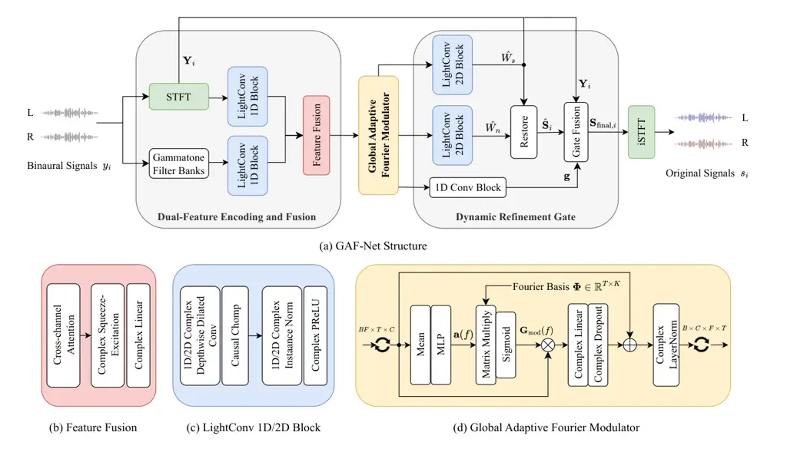

# A Lightweight Fourier-based Network for Binaural Speech Enhancement with Spatial Cue Preservation

Xikun Lu    Yujian Ma    Xianquan Jiang    Xuelong Wang    Jinqiu
Sang^(\*) ^(†)^(†)thanks: \* Corresponding author: Jinqiu Sang
(jqsang@mail.ecnu.edu.cn)

###### Abstract

Binaural speech enhancement faces a severe trade-off challenge, where
state-of-the-art performance is achieved by computationally intensive
architectures, while lightweight solutions often come at the cost of
significant performance degradation. To bridge this gap, we propose the
Global Adaptive Fourier Network (GAF-Net), a lightweight deep complex
network that aims to establish a balance between performance and
computational efficiency. The GAF-Net architecture consists of three
components. First, a dual-feature encoder combining short-time Fourier
transform and gammatone features enhances the robustness of acoustic
representation. Second, a channel-independent globally adaptive Fourier
modulator efficiently captures long-term temporal dependencies while
preserving the spatial cues. Finally, a dynamic gating mechanism is
implemented to reduce processing artifacts. Experimental results show
that GAF-Net achieves competitive performance, particularly in terms of
binaural cues (ILD and IPD error) and objective intelligibility
(MBSTOI), with fewer parameters and computational cost. These results
confirm that GAF-Net provides a feasible way to achieve high-fidelity
binaural processing on resource-constrained devices.

###### Index Terms: 

Binaural speech enhancement, complex neural network, lightweight model,
Fourier network.

^(†)^(†)address: ¹ Shanghai Institute of Artificial Intelligence for
Education, East China Normal University, China  
² Boin Hearing Technology (Shanghai) Co., LTD, China  
³ School of Computer Science and Technology, East China Normal
University, China

## 1 Introduction

Speech enhancement (SE) aims to improve speech quality and
intelligibility by reducing background noise \[7, 25\]. However, for
binaural listening devices such as hearing aids, it is essential to
enhance speech clarity and preserve the spatial perception encoded by
binaural cues \[3\]. While single-channel SE methods excel at noise
reduction, their inherent design destroys the critical inter-channel
relationships that constitute spatial cues \[11, 16\], making them
unsuitable for binaural scenarios. This work focuses on binaural speech
enhancement (BSE) to jointly optimize noise suppression and preserve
binaural cues.

Statistical signal processing methods are initially applied to BSE
tasks, such as the minimum variance distortionless response
beamformer \[8, 2\] and the multichannel Wiener filter \[20, 19, 14\].
These methods perform well and efficiently under stationary acoustic
conditions, but their performance degrades significantly in real-world
non-stationary noisy environments. To overcome these limitations,
studies have shifted towards deep-learning-based methods, particularly
those performing end-to-end modeling in the complex domain \[18, 10\],
which can generate higher-fidelity speech by jointly optimizing
amplitude and phase.

Various deep learning strategies have emerged in the BSE field. Some
studies attempt to maximize the signal-to-noise ratio (SNR) by
processing binaural channels independently \[15\], at the expense of
spatial fidelity. Other studies introduce complex-valued networks, but
their design choices hinder the ability to fully exploit the advantages
of complex-domain processing \[13\]. The demand for higher performance
has led to the emergence of more sophisticated architectures, including
parallel networks \[9, 16\] and complex Transformers \[17\], with the
latter achieving state-of-the-art results. However, their large model
size and computational overhead pose significant deployment barriers. To
address this, efficient models have been proposed \[22\], which reduce
complexity by selectively processing low-frequency components.

Despite these advances, existing methods still face several key
limitations. First, the prevalent reliance on single short-time Fourier
transform (STFT) features, of which the inherent trade-off between time
and frequency resolution limits the model’s acoustic representation
capabilities. Second, a fundamental trade-off exists in effectively
modeling long-range temporal dependencies: high-performance
architectures like Transformers are computationally prohibitive, while
lightweight alternatives often lack sufficient receptive field.

To address these challenges, this paper introduces the Global Adaptive
Fourier Network (GAF-Net), a novel lightweight complex-valued network
designed to achieve a balance among performance and efficiency. The
effectiveness of our approach stems from three architectural
innovations. First, We propose a dual-feature encoding and fusion module
that simultaneously processes STFT-based features and psychoacoustically
inspired features to form more robust input representations. Second, we
introduce a lightweight Global Adaptive Fourier Modulator (GAFM) as the
network backbone, which efficiently models global temporal dynamics in
the Fourier domain while maintaining inter-channel independence to
preserve spatial cues. Finally, we employ a soft-boundary dynamic gating
mechanism to suppress processing artifacts and enhance perceptual
naturalness by dynamically blending enhanced and original spectrograms.



Figure 1: The proposed GAF-Net model, which mainly consists of
dual-feature encoding and fusion, global adaptive Fourier modulator, and
dynamic refinement gate. Different modules are marked with different
colors.

## 2 Proposed method

The objective of BSE is to recover clean speech signals $`s_{i}(t)`$
from noisy mixtures $`y_{i}(t)=s_{i}(t)+n_{i}(t)`$, where
$`i\in\{L,R\}`$, while preserving spatial cues. This task is typically
addressed in the time-frequency (T-F) domain, where the relationship is
$`\mathbf{Y}_{i}=\mathbf{S}_{i}+\mathbf{N}_{i}`$. We propose a deep
complex network, $`\mathcal{G}`$, that learns a direct mapping from the
noisy to the estimated clean spectrograms:
$`\mathcal{G}:(\mathbf{Y}_{L},\mathbf{Y}_{R})\to(\mathbf{S}_{L},\mathbf{S}_{R})`$.
As depicted in Fig. 1, our model employs an encoder-decoder architecture
featuring three core components: a dual-feature encoding and fusion
module, a GAFM backbone, and a Dynamic Refinement Gate (DRG).

### 2.1 Dual-Feature Encoding and Fusion

To construct a comprehensive acoustic representation, a dual-stream
encoder architecture is employed. The primary path generates standard
complex STFT spectrograms, whereas the secondary path utilizes a
gammatone filterbank to produce a perceptually-motivated representation.
The spectrogram features from each path are first processed by separate
encoders consisting of $`M`$ layers of LightConv 1D blocks to extract
high-level representations, denoted as $`\mathbf{Z}_{\text{stft}}`$ and
$`\mathbf{Z}_{\text{gamma}}`$, respectively. These representations are
then fused using a cross-channel attention mechanism. Specifically, the
magnitude of the gammatone features is used to generate an attention map
that modulates the STFT feature path:

```math
\mathbf{Z}_{\text{attended}}=\mathbf{Z}_{\text{stft}}\odot\sigma(\text{Conv}(|\mathbf{Z}_{\text{gamma}}|)) \tag{1}
```

where $`\sigma(\cdot)`$ is the sigmoid function. The fused features are
further channel-wise recalibrated through a complex
Squeeze-and-Excitation (SE) block to generate an overall representation
for the backbone network.

### 2.2 Global Adaptive Fourier Modulator

We propose the GAFM as the backbone of our model to efficiently model
long-range temporal dependencies. Unlike self-attention mechanisms,
which require quadratic complexity, GAFM integrates information by
dynamically synthesizing a global filter for each input sequence.

Let the input to a GAFM block be the complex latent feature
$`\mathbf{Z}_{\text{bb}}\in\mathbb{C}^{B\times C\times F\times T}`$. For
each frequency-specific slice $`\mathbf{Z}_{f}`$, the module first
extracts a compact global context vector
$`\mathbf{c}_{f}=\mathbb{E}_{T}[|\mathbf{Z}_{f}|]`$ by averaging the
feature magnitudes along the temporal dimension. This context vector is
then fed into a small multilayer perceptron (MLP) to generate a set of
mixing coefficients
$`\mathbf{a}(f)=\text{MLP}(\mathbf{c}_{f})\in\mathbb{R}^{K}`$. These
coefficients are then used to form a linear combination of a fixed,
predefined Fourier basis matrix
$`\mathbf{\Phi}\in\mathbb{R}^{T\times K}`$, thereby synthesizing a
content-adaptive gating signal $`\mathbf{G}_{\text{mod}}(f)`$:

```math
\mathbf{G}_{\text{mod}}(f)=\sigma(\tau\cdot\mathbf{\Phi}\cdot\mathbf{a}(f)) \tag{2}
```

where $`\sigma(\cdot)`$ is the sigmoid function. Note that since the
synthesis gate $`\mathbf{G}_{\text{mod}}(f)`$ is a real-valued gate, its
element-wise multiplication with the original input $`\mathbf{Z}_{f}`$
only modulates the magnitude of the complex features while strictly
preserving their phase. This phase-preserving property is crucial for
maintaining the Interaural Time Difference (ITD), a key cue for spatial
localization \[23\]. Finally, the modulated features are integrated into
a standard residual block:

```math
\mathbf{Z}_{\text{out},f}=\mathbb{C}\text{LN}(\mathbf{Z}_{f}+\mathbb{C}\text{Dropout}(\mathbb{C}\text{Linear}(\mathbf{Z}_{f}\odot\mathbf{G}_{\text{mod}})) \tag{3}
```

where $`\mathbb{C}\text{Linear}`$ denotes a complex linear layer,
$`\mathbb{C}\text{LN}`$ denotes complex layer normalization, and dropout
is applied in a way that preserves the complex structure. By performing
these operations in parallel across all frequencies, GAFM efficiently
models the global temporal context while ensuring the integrity of
spatial information.

### 2.3 Binaural Decoding and Dynamic Refinement Gate

The decoder stage reconstructs the enhanced binaural signals from the
backbone’s output features $`\mathbf{Z}_{\text{out}}`$. To this end, two
parallel decoder heads are used to estimate Relative Acoustic Transfer
Functions (RATFs) \[5, 6\]. The target speech RATF is denoted as
$`\hat{\mathbf{W}}_{s}`$, and the noise RATF is denoted as
$`\hat{\mathbf{W}}_{n}`$. The decoder head consists of $`N`$ layers of
LightConv 2D blocks.

Given the noisy observations and the estimated RATFs, the clean speech
spectrograms $`\hat{\mathbf{S}}_{i}`$ can be recovered using the
following closed-form solution:

```math
\displaystyle\hat{\mathbf{S}}_{L}=\hat{\mathbf{W}}_{s}\cdot\hat{\mathbf{S}}_{R},\quad\hat{\mathbf{S}}_{R} \displaystyle=\frac{(\mathbf{Y}_{L}-\hat{\mathbf{W}}_{n}\mathbf{Y}_{R})(\hat{\mathbf{W}}_{s}-\hat{\mathbf{W}}_{n})^{*}}{(\hat{\mathbf{W}}_{s}-\hat{\mathbf{W}}_{n})^{2}+\epsilon} \tag{4}
```

where $`\epsilon`$ is a small constant for numerical stability. To
suppress potential processing artifacts and enhance model robustness, we
introduce the DRG. This module generates a frequency-dependent gate
$`\mathbf{g}\in[0,1]^{B\times F}`$, which can be understood as a
confidence map of the model’s enhancement result at each frequency. The
gate is derived from the temporal aggregation information of the
backbone features:

```math
\mathbf{g}=\sigma(\text{Conv}_{1\times 1}((\text{AvgPool}_{T}(|\mathbf{Z}_{\text{out}}|))) \tag{5}
```

The final output $`\mathbf{S}_{\text{final}}`$ is obtained by weighted
summation of the network-estimated clean spectrogram
$`\hat{\mathbf{S}}`$ and the original noisy spectrogram $`\mathbf{Y}`$,
controlled by $`\mathbf{g}`$:

```math
\mathbf{S}_{\text{final},i}=\mathbf{g}\odot\hat{\mathbf{S}}_{i}+(1-\mathbf{g})\odot\mathbf{Y}_{i} \tag{6}
```

This mechanism enables the model to trust its enhancement in
high-confidence frequency regions ($`\mathbf{g}\to 1`$) while restoring
to the original signal in the low-confidence areas
($`\mathbf{g}\to 0`$), thereby achieving a dynamic balance between
denoising and fidelity. The refined binaural complex spectrogram is then
transformed back to the time domain via the inverse STFT (iSTFT).

| Input SNR      | -6 dB               |                             |                                             |                                             | -3 dB               |                             |                                             |                                             | 0 dB                |                             |                                             |                                             |
| -------------- | ------------------- | --------------------------- | ------------------------------------------- | ------------------------------------------- | ------------------- | --------------------------- | ------------------------------------------- | ------------------------------------------- | ------------------- | --------------------------- | ------------------------------------------- | ------------------------------------------- |
| Method         | MBSTOI $`\uparrow`$ | $`\Delta`$PESQ $`\uparrow`$ | $`\mathcal{L}_{\text{ILD}}`$ $`\downarrow`$ | $`\mathcal{L}_{\text{IPD}}`$ $`\downarrow`$ | MBSTOI $`\uparrow`$ | $`\Delta`$PESQ $`\uparrow`$ | $`\mathcal{L}_{\text{ILD}}`$ $`\downarrow`$ | $`\mathcal{L}_{\text{IPD}}`$ $`\downarrow`$ | MBSTOI $`\uparrow`$ | $`\Delta`$PESQ $`\uparrow`$ | $`\mathcal{L}_{\text{ILD}}`$ $`\downarrow`$ | $`\mathcal{L}_{\text{IPD}}`$ $`\downarrow`$ |
| DBSEnh \[13\]  | 0.63                | 0.04                        | 7.36                                        | 1.16                                        | 0.67                | 0.04                        | 7.34                                        | 1.11                                        | 0.75                | 0.05                        | 6.69                                        | 1.01                                        |
| BiTasNet \[9\] | 0.69                | 0.02                        | 4.17                                        | 1.26                                        | 0.73                | 0.04                        | 3.98                                        | 1.16                                        | 0.75                | 0.03                        | 3.96                                        | 1.14                                        |
| BCCTN \[17\]   | 0.71                | 0.08                        | 5.91                                        | 1.08                                        | 0.78                | 0.14                        | 5.60                                        | 1.02                                        | 0.80                | 0.25                        | 4.89                                        | 0.86                                        |
| LBCCN \[22\]   | 0.73                | 0.14                        | 7.14                                        | 1.11                                        | 0.80                | 0.16                        | 6.05                                        | 1.01                                        | 0.81                | 0.13                        | 6.52                                        | 1.00                                        |
| GAF-Net        | 0.77                | 0.09                        | 5.23                                        | 0.99                                        | 0.80                | 0.14                        | 4.89                                        | 1.02                                        | 0.84                | 0.19                        | 4.62                                        | 0.89                                        |
| Input SNR      | 3 dB                |                             |                                             |                                             | 6 dB                |                             |                                             |                                             | 9 dB                |                             |                                             |                                             |
| Method         | MBSTOI $`\uparrow`$ | $`\Delta`$PESQ $`\uparrow`$ | $`\mathcal{L}_{\text{ILD}}`$ $`\downarrow`$ | $`\mathcal{L}_{\text{IPD}}`$ $`\downarrow`$ | MBSTOI $`\uparrow`$ | $`\Delta`$PESQ $`\uparrow`$ | $`\mathcal{L}_{\text{ILD}}`$ $`\downarrow`$ | $`\mathcal{L}_{\text{IPD}}`$ $`\downarrow`$ | MBSTOI $`\uparrow`$ | $`\Delta`$PESQ $`\uparrow`$ | $`\mathcal{L}_{\text{ILD}}`$ $`\downarrow`$ | $`\mathcal{L}_{\text{IPD}}`$ $`\downarrow`$ |
| DBSEnh \[13\]  | 0.80                | 0.05                        | 6.41                                        | 1.00                                        | 0.84                | 0.10                        | 5.94                                        | 0.89                                        | 0.84                | 0.12                        | 5.56                                        | 0.83                                        |
| BiTasNet \[9\] | 0.78                | 0.08                        | 3.82                                        | 1.18                                        | 0.81                | 0.11                        | 3.80                                        | 1.12                                        | 0.78                | 0.10                        | 3.67                                        | 1.13                                        |
| BCCTN \[17\]   | 0.84                | 0.32                        | 4.40                                        | 0.76                                        | 0.86                | 0.46                        | 4.13                                        | 0.67                                        | 0.91                | 0.62                        | 3.70                                        | 0.57                                        |
| LBCCN \[22\]   | 0.85                | 0.23                        | 5.80                                        | 0.96                                        | 0.88                | 0.27                        | 4.73                                        | 0.86                                        | 0.87                | 0.25                        | 4.62                                        | 0.84                                        |
| GAF-Net        | 0.85                | 0.27                        | 3.79                                        | 0.82                                        | 0.88                | 0.26                        | 3.46                                        | 0.71                                        | 0.88                | 0.24                        | 3.32                                        | 0.66                                        |
| Input SNR      | 12 dB               |                             |                                             |                                             | 15 dB               |                             |                                             |                                             | Average             |                             |                                             |                                             |
| Method         | MBSTOI $`\uparrow`$ | $`\Delta`$PESQ $`\uparrow`$ | $`\mathcal{L}_{\text{ILD}}`$ $`\downarrow`$ | $`\mathcal{L}_{\text{IPD}}`$ $`\downarrow`$ | MBSTOI $`\uparrow`$ | $`\Delta`$PESQ $`\uparrow`$ | $`\mathcal{L}_{\text{ILD}}`$ $`\downarrow`$ | $`\mathcal{L}_{\text{IPD}}`$ $`\downarrow`$ | MBSTOI $`\uparrow`$ | $`\Delta`$PESQ $`\uparrow`$ | $`\mathcal{L}_{\text{ILD}}`$ $`\downarrow`$ | $`\mathcal{L}_{\text{IPD}}`$ $`\downarrow`$ |
| DBSEnh \[13\]  | 0.87                | 0.07                        | 5.38                                        | 0.80                                        | 0.89                | 0.08                        | 4.79                                        | 0.71                                        | 0.78                | 0.06                        | 6.18                                        | 0.93                                        |
| BiTasNet \[9\] | 0.82                | 0.30                        | 3.74                                        | 1.10                                        | 0.82                | 0.52                        | 3.69                                        | 1.10                                        | 0.77                | 0.13                        | 3.86                                        | 1.17                                        |
| BCCTN \[17\]   | 0.92                | 0.60                        | 3.63                                        | 0.56                                        | 0.90                | 0.58                        | 3.35                                        | 0.50                                        | 0.84                | 0.35                        | 4.59                                        | 0.79                                        |
| LBCCN \[22\]   | 0.89                | 0.24                        | 4.35                                        | 0.78                                        | 0.92                | 0.30                        | 3.83                                        | 0.72                                        | 0.85                | 0.20                        | 5.32                                        | 0.88                                        |
| GAF-Net        | 0.89                | 0.27                        | 3.00                                        | 0.50                                        | 0.94                | 0.27                        | 2.53                                        | 0.44                                        | 0.86                | 0.22                        | 3.86                                        | 0.75                                        |

Table 1: Objective evaluation results under different input SNR
conditions. The best results are marked in bold.

### 2.4 Loss Function

The proposed network is trained by optimizing a composite loss function
$`\mathcal{L}_{\text{total}}`$, which consists of a primary
task-oriented loss $`\mathcal{L}_{\text{task}}`$, and an regularization
term $`\mathcal{L}_{\text{reg}}`$:

```math
\mathcal{L}_{\text{total}}=\mathcal{L}_{\text{task}}+\mathcal{L}_{\text{reg}} \tag{7}
```

The primary task loss function $`\mathcal{L}_{\text{task}}`$ follows the
design in \[17\] and is a weighted sum of four objectives, aiming to
synergistically optimize denoising performance, speech intelligibility,
and the preservation of binaural cues:

```math
\mathcal{L}_{\text{task}}=\alpha\mathcal{L}_{\text{SNR}}+\beta\mathcal{L}_{\text{STOI}}+\gamma\mathcal{L}_{\text{ILD}}+\kappa\mathcal{L}_{\text{IPD}} \tag{8}
```

The time-domain terms $`\mathcal{L}_{\text{SNR}}`$ and
$`\mathcal{L}_{\text{STOI}}`$ represent noise suppression and
intelligibility. The time-frequency terms, $`\mathcal{L}_{\text{ILD}}`$
and $`\mathcal{L}_{\text{IPD}}`$, ensure accurate reconstruction of
spatial information by penalizing the mean absolute error between the
Interaural Level Difference (ILD) and Interaural Phase Difference (IPD)
of the clean and enhanced signals.

The regularization term $`\mathcal{L}_{\text{reg}}`$ is applied to the
gating signal $`\mathbf{g}`$ of the DRG to provide fine-grained control
over its behavior. It consists of three parts:

```math
\mathcal{L}_{\text{reg}}=\lambda_{s}\mathcal{R}_{\text{sparse}}(\mathbf{g})+\lambda_{e}\mathcal{R}_{\text{entropy}}(\mathbf{g})+\lambda_{tv}\mathcal{R}_{\text{TV}}(\mathbf{g}) \tag{9}
```

The three parts are: 1) an L1 sparse regularizer
($`\mathcal{R}_{\text{sparse}}`$) to promote conservative augmentation
strategy; 2) a negative entropy regularizer
($`\mathcal{R}_{\text{entropy}}`$) to encourage decisive, binary-like
gating decisions; and 3) a Total Variation (TV) regularizer
($`\mathcal{R}_{\text{TV}}`$) to enforce spectral smoothness.

## 3 Experiments

### 3.1 Datasets

We construct a binaural speech dataset for training and testing our
model. Clean monaural speech signals are sourced from the VCTK
corpus \[24\], from which we generate 40,000 training, 5,000 validation,
and 5,000 test samples, each with a duration of 2 seconds. To ensure a
robust evaluation of generalization, a strict partitioning of data
resources is enforced. Both the speakers from the VCTK corpus and the
Head-Related Impulse Responses (HRIRs) from the HUTUBS database \[4\]
are split into training, validation, and test-exclusive subsets. This
speaker- and HRIR-disjoint strategy guarantees that the model encounters
neither familiar speakers nor familiar acoustic transfer functions
during validation and testing. During data synthesis, each monaural
speech utterance is spatialized into a binaural signal by convolving it
with a pair of HRIRs randomly selected from the corresponding subset.
The target speech source is placed at a random azimuth in the horizontal
plane, from -90° to +90°. Noise signals are drawn from the NOISEX-92
database \[21\] and are synthesized into a diffuse isotropic noise field
by convolving non-overlapping segments of a noise source with all
available HRIRs on the horizontal plane for a given subject and summing
the results. For the training and validation sets, noisy mixtures are
generated at a random SNR continuously drawn from -7 dB to 16 dB. For
the test set, fixed SNR levels ranging from -6 dB to 15 dB in 3 dB steps
are used to facilitate a balanced performance assessment. The noise
types used for training include white, pink, factory, and babble noise.
During evaluation, an additional unseen noise type (car engine noise) is
introduced to assess the model’s noise generalization capability. All
audio data are generated at a sampling rate of 16 kHz.

### 3.2 Implementation Details

All audio signals are processed at a sampling rate of 16 kHz. For
feature extraction, we employ an STFT with a 256-point FFT and a
128-sample hop size. The parallel Gammatone filterbank is configured
with 64 channels. The model’s encoder consists of two layers of
LightConv 1D blocks ($`M=2`$), the backbone network is one layer of
GAFM, and the decoder is two layers of LightConv 2D blocks ($`N=2`$).
For training, the AdamW optimizer is used with an initial learning rate
of $`2\times 10^{-4}`$. The model is trained for 100 epochs with a batch
size of 20, using a multi-step learning rate scheduler. Early stopping
is enabled to terminate training if the validation loss does not improve
for 8 consecutive epochs. The weighting coefficients
$`\alpha,\beta,\gamma,`$ and $`\kappa`$ for the composite loss function
are set to 1, 10, 1, and 10, respectively. The regularization weight
$`\lambda_{s}`$, $`\lambda_{e}`$, and $`\lambda_{tv}`$ are all set to
$`1\times 10^{-4}`$. Further implementation details and full parameter
settings can be found in our open-source code.¹¹ 1
[https://github.com/Luxikun669/GAF-Net](https://github.com/Luxikun669/GAF-Net)

### 3.3 Evaluation Metrics

To comprehensively evaluate model performance, four standard objective
metrics are employed. The gain of perceptual evaluation of speech
quality ($`\Delta`$PESQ) \[12\] quantifies the model’s perceptual
quality improvement relative to the noisy input. The ILD error
($`\mathcal{L}_{\text{ILD}}`$) \[17\] and IPD error
($`\mathcal{L}_{\text{IPD}}`$) \[17\] are used to measure the
reconstruction accuracy of spatial cues such as sound source
localization. Finally, the Binaural Short-Time Objective Intelligibility
(MBSTOI) \[1\] serves as a comprehensive metric that jointly assesses
speech intelligibility and the integrity of binaural cues.

| Method   | \# Param. $`\downarrow`$    | MACs $`\downarrow`$    | RTF $`\downarrow`$ |
| -------- | --------------------------- | ---------------------- | ------------------ |
| DBSEnh   | 10.5 M                      | 0.99 G                 | 0.026              |
| BiTasNet | 1.7 M                       | 4.97 G                 | 0.148              |
| BCCTN    | 11.1 M                      | 16.38 G                | 0.237              |
| LBCCN    | 38.0 K                      | 0.30 G                 | 0.092              |
| GAF-Net  | 129.0 K                     | 2.79 G                 | 0.150              |

Table 2: Parameter count and computational complexity.

| Method         | MBSTOI $`\uparrow`$ | $`\Delta`$PESQ $`\uparrow`$ | $`\mathcal{L}_{\text{ILD}}`$ $`\downarrow`$ | $`\mathcal{L}_{\text{IPD}}`$ $`\downarrow`$ |
| -------------- | ------------------- | --------------------------- | ------------------------------------------- | ------------------------------------------- |
| GAF-Net        | 0.86                | 0.22                        | 3.86                                        | 0.75                                        |
| w/o Gammatone  | 0.81                | 0.11                        | 5.10                                        | 0.77                                        |
| w/o GAFM       | 0.83                | 0.20                        | 4.99                                        | 0.80                                        |
| w/o DRG        | 0.85                | 0.31                        | 4.61                                        | 1.00                                        |
| Global DRG^(a) | 0.85                | 0.19                        | 4.73                                        | 0.76                                        |

- a
  Global DRG generates a fixed gating factor $`\mathbf{g}`$ for each
  frequency.

Table 3: Ablation study of the proposed model components.

## 4 Results and discussion

We evaluate the performance of the proposed GAF-Net and compare it with
several baseline models \[13, 9, 17, 22\]. As shown in Table 1, GAF-Net
performs well on key metrics that impact the binaural listening
experience. The GAF-Net model’s strength lies in its accurate
reconstruction of binaural intelligibility and spatial cues. GAF-Net
achieves the highest average MBSTOI score, as well as the lowest average
$`\mathcal{L}_{\text{IPD}}`$ and $`\mathcal{L}_{\text{ILD}}`$,
outperforming all baseline models. Furthermore, $`\Delta`$PESQ result is
suboptimal. Across speech quality metrics, the results reveal a profound
trade-off. While large models like BCCTN demonstrate superior
$`\Delta`$PESQ, this often comes at the expense of higher spatial
distortion and significant computational overhead. In contrast, GAF-Net
maintains strong competitiveness on these metrics while also leading the
way in binaural fidelity.

Furthermore, we found that GAF-Net achieves a remarkable balance between
performance and efficiency, as shown in Table 2. GAF-Net contains only
129.0 K parameters and 2.79 GMACs, with a computational cost of only
1.2% of larger models like BCCTN, yet surpasses them on key binaural
performance metrics. Compared to LBCCN, GAF-Net achieves significant
performance improvements with a slight increase in resources. Its
real-time factor (RTF)²² 2 The RTF is measured with Intel(R) Xeon(R)
Gold 6146 CPU. demonstrates its suitability for deployment on
resource-constrained devices. Therefore, GAF-Net stands out as a
computationally efficient and high-performance solution, successfully
bridging the performance and efficiency gap between existing methods.

The ablation study in Table 3 deconstructs the source of the GAF-Net
model’s performance advantage. Removing features such as gammatone
features or the GAFM backbone leads to an overall drop in performance,
confirming the importance of dual-feature representation and global
context modeling. Notably, analysis of DRG reveals a key trade-off:
removing DRG improves $`\Delta`$PESQ, but significantly worsens
$`\mathcal{L}_{\text{IPD}}`$. This suggests that DRG intelligently
trades off a degree of aggressive denoising in exchange for a
significant reduction in spatial distortion and audible artifacts, which
is crucial for a high-fidelity binaural listening experience.

## 5 Conclusion

This paper introduced GAF-Net, a lightweight deep complex network
designed to address the performance-efficiency trade-off in binaural
speech enhancement. With its innovative architecture, GAF-Net
efficiently models global context while preserving spatial cues. With
only 129 K parameters, it achieves SOTA results on key metrics such as
spatial completeness ($`\mathcal{L}_{\text{IPD}}`$ and
$`\mathcal{L}_{\text{ILD}}`$) and binaural clarity (MBSTOI). It also
maintains strong competitiveness in speech quality compared to larger
models. These findings validate GAF-Net as an efficient, low-resource
solution for high-fidelity binaural audio applications. However, the
current study is primarily limited to controlled anechoic environments
to validate specific binaural cue preservation. Future work will focus
on evaluating its robustness in reverberant environments and extending
its core components to other multichannel audio tasks.

## 6 ACKNOWLEDGEMENTS

This work was supported by Shanghai Municipal Commission of Economy and
Informatization (No. 2024-GZL-RGZN-02001).

## References

- \[1\] A. H. Andersen, J. M. de Haan, Z. Tan, and J. Jensen (2018)
  Refinement and validation of the binaural short time objective
  intelligibility measure for spatially diverse conditions. Speech
  Commun. 102, pp. 1–13. Cited by: §3.3.
- \[2\] H. As’ ad, M. Bouchard, and H. Kamkar-Parsi (2019) A robust
  target linearly constrained minimum variance beamformer with spatial
  cues preservation for binaural hearing aids. IEEE/ACM Trans. Audio,
  Speech, Lang. Process. 27 (10), pp. 1549–1563. Cited by: §1.
- \[3\] J. Blauert (1997) Spatial hearing: the psychophysics of human
  sound localization. MIT press. Cited by: §1.
- \[4\] F. Brinkmann, M. Dinakaran, R. Pelzer, P. Grosche, D. Voss,
  and S. Weinzierl (2019) A cross-evaluated database of measured and
  simulated HRTFs including 3D head meshes, anthropometric features, and
  headphone impulse responses. J. Audio Eng. Soc. 67 (9), pp. 705–718.
  Cited by: §3.1.
- \[5\] Z. Feng, Y. Tsao, and F. Chen (2021) Estimation and correction
  of relative transfer function for binaural speech separation networks
  to preserve spatial cues. In Proc. APSIPA ASC, pp. 1239–1244. Cited
  by: §2.3.
- \[6\] Z. Feng, Y. Tsao, and F. Chen (2022) Recurrent neural
  network-based estimation and correction of relative transfer function
  for preserving spatial cues in speech separation. In Proc. EUSIPCO,
  pp. 155–159. Cited by: §2.3.
- \[7\] S. Gannot, E. Vincent, S. Markovich-Golan, and A. Ozerov (2017)
  A consolidated perspective on multimicrophone speech enhancement and
  source separation. IEEE/ACM Trans. Audio, Speech, Lang. Process. 25
  (4), pp. 692–730. Cited by: §1.
- \[8\] E. Hadad, D. Marquardt, S. Doclo, and S. Gannot (2015)
  Theoretical analysis of binaural transfer function mvdr beamformers
  with interference cue preservation constraints. IEEE/ACM Trans. Audio,
  Speech, Lang. Process. 23 (12), pp. 2449–2464. Cited by: §1.
- \[9\] C. Han, Y. Luo, and N. Mesgarani (2020) Real-time binaural
  speech separation with preserved spatial cues. In Proc. ICASSP,
  pp. 6404–6408. Cited by: §1, Table 1, Table 1, Table 1, §4.
- \[10\] Y. Hu, Y. Liu, S. Lv, M. Xing, S. Zhang, Y. Fu, J. Wu, B.
  Zhang, and L. Xie (2020) DCCRN: Deep complex convolution recurrent
  network for phase-aware speech enhancement. arXiv preprint
  arXiv:2008.00264. Cited by: §1.
- \[11\] X. Leng, J. Chen, and J. Benesty (2021) On the compromise
  between noise reduction and speech/noise spatial information
  preservation in binaural speech enhancement. J. Acoust. Soc. Am. 149
  (5), pp. 3151–3162. Cited by: §1.
- \[12\] A. W. Rix, J. G. Beerends, M. P. Hollier, and A. P.
  Hekstra (2001) Perceptual evaluation of speech quality (PESQ)-a new
  method for speech quality assessment of telephone networks and codecs.
  In Proc. ICASSP, Vol. 2, pp. 749–752. Cited by: §3.3.
- \[13\] X. Sun, R. Xia, J. Li, and Y. Yan (2019) A deep learning based
  binaural speech enhancement approach with spatial cues preservation.
  In Proc. ICASSP, pp. 5766–5770. Cited by: §1, Table 1, Table 1, Table
  1, §4.
- \[14\] M. Tammen and S. Doclo (2025) Imposing correlation structures
  for deep binaural spatio-temporal wiener filtering. IEEE Trans. Audio,
  Speech, Lang. Process. 33 (), pp. 1278–1292. External Links:
  [Document](https://dx.doi.org/10.1109/TASLPRO.2025.3548454) Cited by:
  §1.
- \[15\] V. Tokala, M. Brookes, and P. A. Naylor (2022) Binaural speech
  enhancement using stoi-optimal masks. In Proc. IWAENC, pp. 1–5. Cited
  by: §1.
- \[16\] V. Tokala, E. Grinstein, M. Brookes, S. Doclo, J. Jensen,
  and P. A. Naylor (2023) Binaural speech enhancement using complex
  convolutional recurrent networks. In Proc. ACSSC, pp. 1130–1134. Cited
  by: §1, §1.
- \[17\] V. Tokala, E. Grinstein, M. Brookes, S. Doclo, J. Jensen,
  and P. A. Naylor (2024) Binaural speech enhancement using deep complex
  convolutional transformer networks. In Proc. ICASSP, pp. 681–685.
  Cited by: §1, §2.4, Table 1, Table 1, Table 1, §3.3, §4.
- \[18\] C. Trabelsi, O. Bilaniuk, Y. Zhang, D. Serdyuk, S.
  Subramanian, J. F. Santos, S. Mehri, N. Rostamzadeh, Y. Bengio,
  and C. J. Pal (2017) Deep complex networks. arXiv preprint
  arXiv:1705.09792. Cited by: §1.
- \[19\] T. Van den Bogaert, S. Doclo, J. Wouters, and M. Moonen (2009)
  Speech enhancement with multichannel wiener filter techniques in
  multimicrophone binaural hearing aids. J. Acoust. Soc. Am. 125 (1),
  pp. 360–371. Cited by: §1.
- \[20\] T. Van den Bogaert, J. Wouters, S. Doclo, and M. Moonen (2007)
  Binaural cue preservation for hearing aids using an interaural
  transfer function multichannel wiener filter. In Proc. ICASSP, Vol. 4,
  pp. IV–565. Cited by: §1.
- \[21\] A. Varga and H. J. Steeneken (1993) Assessment for automatic
  speech recognition: II. NOISEX-92: A database and an experiment to
  study the effect of additive noise on speech recognition systems.
  Speech Commun. 12 (3), pp. 247–251. Cited by: §3.1.
- \[22\] J. Wang, J. Zhang, S. Chen, and M. Sun (2025) A lightweight and
  real-time binaural speech enhancement model with spatial cues
  preservation. In Proc. ICASSP, pp. 1–5. Cited by: §1, Table 1, Table
  1, Table 1, §4.
- \[23\] B. Xie (2013) Head-related transfer function and virtual
  auditory display. J. Ross Publishing. Cited by: §2.2.
- \[24\] J. Yamagishi, C. Veaux, K. MacDonald, et al. (2019) CSTR VCTK
  Corpus: English multi-speaker corpus for CSTR voice cloning toolkit
  (version 0.92). University of Edinburgh. The Centre for Speech
  Technology Research (CSTR), pp. 271–350. Cited by: §3.1.
- \[25\] C. Zheng, H. Zhang, W. Liu, X. Luo, A. Li, X. Li, and B. C.
  Moore (2023) Sixty years of frequency-domain monaural speech
  enhancement: from traditional to deep learning methods. Trends Hear.
  27, pp. 23312165231209913. Cited by: §1.
