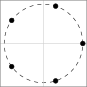
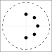
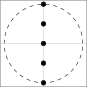
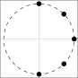
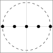
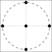
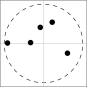

# AmbiDrop: Array-Agnostic Speech Enhancement Using Ambisonics Encoding And Dropout-Based Learning

Michael Tatarjitzky    Boaz Rafaely

###### Abstract

Multichannel speech enhancement leverages spatial cues to improve
intelligibility and quality, but most learning-based methods rely on
specific microphone array geometry, unable to account for geometry
changes. To mitigate this limitation, current array-agnostic approaches
employ large multi-geometry datasets but may still fail to generalize to
unseen layouts. We propose AmbiDrop (Ambisonics with Dropouts), an
Ambisonics-based framework that encodes arbitrary array recordings into
the spherical harmonics domain using Ambisonics Signal Matching (ASM). A
deep neural network is trained on simulated Ambisonics data, combined
with channel dropout for robustness against array-dependent encoding
errors, therefore omitting the need for a diverse microphone array
database. Experiments show that while the baseline and proposed models
perform similarly on the training arrays, the baseline degrades on
unseen arrays. In contrast, AmbiDrop consistently improves SI-SDR, PESQ,
and STOI, demonstrating strong generalization and practical potential
for array-agnostic speech enhancement.

###### Index Terms: 

Speech enhancement, Ambisonics, array-agnostic modeling, deep learning

^(†)^(†)address: School of Electrical and Computer Engineering, Ben
Gurion University of the Negev, Beer-Sheva, Israel

## 1 Introduction

Speech enhancement aims to improve the intelligibility and perceptual
quality of speech in noisy and reverberant environments, with broad
applications in teleconferencing, hearing aids, and human-machine
interfaces. While single-channel deep neural networks (DNNs) have
achieved impressive results \[11\], multichannel methods can exploit
spatial cues for further gains. Multichannel speech enhancement has
progressed from classical beamforming such as delay-and-sum, MVDR, and
super-directive methods \[19, 2\] to DNNs that jointly model spectral
and spatial information \[6, 7\]. However, most DNN-based methods assume
a fixed microphone array geometry, thereby reducing robustness in
real-world scenarios where array configurations vary across devices,
form factors, and usage conditions.

To overcome the limitations of specific-array training, recent research
has explored array-agnostic deep learning approaches for speech
enhancement. One prominent strategy employs
_transform-average-concatenate_ (TAC) layers \[9, 8, 20\], which
aggregate information across channels in a permutation-invariant manner,
enabling networks to handle an arbitrary number of microphones. Another
line of work applies meta-learning \[10\], allowing models to adapt to
new array geometries with limited data, but still requiring exposure to
a wide variety of array configurations during training. Alternative
methods incorporate more complex architectural designs—such as spatial
transformers or space-object cross-attention (SOCA) blocks \[17\]—which
reduce the need for multiple training arrays but often result in heavy
models and reduced robustness when facing unseen array layouts. Overall,
while these methods improve flexibility, they remain constrained: some
depend on large-scale training across diverse geometries, while others
generalize poorly to out-of-distribution arrays, highlighting the
persistent challenge of achieving truly array-agnostic enhancement.

In this work, we address the limitations of current multichannel speech
enhancement methods by proposing a robust, truly array-agnostic approach
that omits the need for an extensive multi-geometry training data while
maintaining performance for a wide range of microphone arrays. The
objective is to improve the generalization of DNN-based enhancement
systems across diverse and unseen real-world array configurations.

To achieve this aim we introduce AmbiDrop, a DNN-based enhancement model
trained on array-independent ideal Ambisonics representations \[21\] to
overcome the constraints of array-dependent training. Since accurate
Ambisonics encoding may be challenging for most non-spherical arrays
\[15\], with array-specific encoding errors, we incorporate input
dropout during training to enhance robustness against missing or
inaccurately encoded Ambisonics channels. This approach enables the
representation of a broad range of previously unseen array
configurations. While previous studies have used spherical harmonics
(SH) as network inputs \[12, 13, 14\], they did not target the design of
an explicitly array-agnostic network as proposed here. At inference,
microphone signals are transformed into Ambisonics signals using
Ambisonics Signal Matching (ASM) \[5\] prior to processing by the
network. This preprocessing ensures that each channel has a consistent
spatial interpretation, regardless of the original array geometry,
thereby providing a stable, geometry-independent input representation
that enables fast training without the need of extensive array data,
leading to robust enhancement across diverse array configurations.

Finally, we evaluate the proposed framework on different unseen
microphone arrays. The results show that while the baseline model with
microphone signals as input performs well only on the arrays it was
trained on, AmbiDrop maintains strong performance across all unseen
array configurations, confirming its robustness and generalization
capability. Moreover, informal subjective evaluations suggest that the
enhanced signals exhibit only mild artifacts.


(a) Training stage


(b) Inference stage

Figure 1: Schematic diagram of the proposed model: (a) training and (b)
inference.

## 2 Background

In this section, we present the signal model, the Ambisonics
preprocessing framework, and the DNN architecture used in the remainder
of the paper. The spherical coordinate system $`(r,\theta,\phi)`$
represents the radius, elevation, and azimuth respectively, while the
wave number is defined as $`k=\frac{2\pi}{c}f`$, where $`c`$ is the
speed of sound and $`f`$ is the frequency.

### 2.1 Array Signal Model

Consider $`M`$ omnidirectional microphones of an arbitrary array
positioned in a sound field, with each microphone at coordinates
$`(r_{m},\theta_{m},\phi_{m})`$, $`\forall\,1\leq m\leq M`$. Assume the
sound field is composed of $`Q`$ plane waves with directions of arrival
(DOA) $`(\theta_{q},\phi_{q})`$, $`\forall\,1\leq q\leq Q`$, denoted as
$`\Omega_{Q}`$. The plane waves represent direct sound from sources or
their reflections from enclosure boundaries. The array steering matrix
is defined as $`\mathbf{V}(k)`$ with dimensions $`M\times Q`$ where each
element $`[\mathbf{V}(k)]_{m,q}`$ is the frequency-dependent transfer
function between the $`q`$-th plane wave and the $`m`$-th microphone.
The signal recorded at the microphones can then be expressed as:

```math
\mathbf{x}(k)=\mathbf{V}(k)\,\mathbf{s}(k)+\mathbf{n}(k), \tag{1}
```

Here, $`\mathbf{x}(k)`$ is a vector of length $`M`$, where each element
$`x_{m}(k)`$ corresponds to the $`m`$-th microphone signal,
$`\forall\,1\leq m\leq M`$. Similarly,
$`\mathbf{s}(k)=[s_{1}(k),...,s_{Q}(k)]`$ is a vector of length $`Q`$,
where each element $`s_{q}(k)`$ denotes the amplitude at the origin of
the plane wave arriving from the $`q`$-th DOA,
$`\forall\,1\leq q\leq Q`$. The term $`\mathbf{n}(k)`$ represents
additive noise at the microphones, assumed to be i.i.d. across
microphones and uncorrelated with the source signals $`\mathbf{s}(k)`$.

### 2.2 Ambisonics Encoding

The Ambisonics signal vector can be obtained from the source signals
vector as (see Eq. 2.43 in \[15\]):

```math
\mathbf{a}_{nm}(k)=\mathbf{Y}^{H}_{\Omega_{Q}}\,\mathbf{s}(k), \tag{2}
```

Here $`\mathbf{a}_{nm}(k)=[a_{00}(k),\dots,a_{N_{a}N_{a}}(k)]^{T}`$
denotes the Ambisonics signals up to order $`N_{a}`$, with length of
$`(N_{a}+1)^{2}`$. The matrix
$`\mathbf{Y}^{H}_{\Omega_{Q}}=[\mathbf{y}_{00},\dots,\mathbf{y}_{N_{a}N_{a}}]`$
is the SH matrix of dimensions $`Q\times(N_{a}+1)^{2}`$, where each
vector
$`\mathbf{y}_{nm}=[y_{nm}(\theta_{1},\phi_{1}),\dots,y_{nm}(\theta_{Q},\phi_{Q})]^{T}`$
is of length $`Q`$ containing the SH basis functions of order $`n`$ and
degree $`m`$ evaluated at the $`Q`$ DOAs $`(\theta_{q},\phi_{q})`$, for
all $`1\leq q\leq Q`$ with $`0\leq n\leq N_{a}`$ and $`-n\leq m\leq n`$.

Ambisonics Signal Matching (ASM) \[5\] is a method for encoding
Ambisonics signals from arbitrary microphone array configurations using
a linear mapping from the microphone signals to the $`(n,m)`$-th
Ambisonics coefficient:

```math
\hat{a}_{nm}(k)=\mathbf{c}_{nm}^{H}\mathbf{x}(k), \tag{3}
```

where $`0\leq n\leq N_{a}`$ and $`-n\leq m\leq n`$. Here,
$`\mathbf{c}_{nm}`$ is an $`M\times 1`$ vector of filter coefficients
designed to minimize the normalized mean square error (NMSE) between the
true and estimated Ambisonics coefficients:

```math
\varepsilon_{\mathrm{Amb}}=\frac{E\left[\lVert\hat{a}_{nm}(k)-a_{nm}(k)\rVert_{2}^{2}\right]}{E\left[\lVert a_{nm}(k)\rVert_{2}^{2}\right]}, \tag{4}
```

where $`E[\cdot]`$ denotes the expectation operator and
$`\lVert\cdot\rVert_{2}`$ is the $`\ell_{2}`$ vector norm. Assuming the
noise vector $`\mathbf{n}(k)`$ is spatially white with power
$`\sigma_{n}^{2}`$ and the sound field is diffuse—modeled as $`Q`$
uncorrelated plane waves such that
$`\mathbf{R}_{s}(k)=\sigma_{s}^{2}\mathbf{I}`$—the optimal filter
coefficients are obtained by solving (4), yielding:

```math
\mathbf{c}_{nm}^{\mathrm{opt}}(k)=\left(\mathbf{V}(k)\mathbf{V}^{H}(k)+\frac{\sigma_{n}^{2}}{\sigma_{s}^{2}}\mathbf{I}\right)^{-1}\mathbf{V}(k)\mathbf{y}_{nm}, \tag{5}
```

Substituting (5) into (3) produces the estimated Ambisonics signals. To
encode all Ambisonics channels, the following condition must hold
\[15\]:

```math
(N_{a}+1)^{2}\leq M. \tag{6}
```

It was shown in \[5\] that some Ambisonics channels may not be
accurately encoded, depending on array geometry and the array steering
matrix.

### 2.3 DNN Architecture

In this paper, we employ a speech enhancement network based on
FT-JNF \[18\]. We consider a speech enhancement task in which the goal
is to extract the target speaker from a noisy and reverberant recording.

Applying the short-time Fourier transform (STFT) to $`x_{m}(t)`$, the
signal in the $`m`$-th microphone, yields the time–frequency
representation $`X_{m}(t,f)`$ where $`(t,f)`$ is a time-frequency bin.
In the presence of noise, the noisy microphone signal $`X_{m}(t,f)`$ can
be modeled as:

```math
X_{m}(t,f)=Y_{m}(t,f)+N_{m}(t,f), \tag{7}
```

where $`Y_{m}(t,f)`$ includes the clean speech of the target speaker,
$`S(t,f)`$, as recorded by the $`m`$-th microphone and $`N_{m}(t,f)`$
represents the noise component captured by the $`m`$-th microphone,
which may include interfering speakers, reverberation and background
noise. The multichannel microphone array signal is represented as
$`\mathbf{X}(t,f)=[X_{1}(t,f),...,X_{M}(t,f)]`$, a tensor of dimensions
$`M\times T\times F`$.

The network estimates a complex ideal ratio mask (cIRM) from
multichannel inputs by jointly exploiting spatial, spectral, and
temporal information. The enhanced signal is obtained by applying the
estimated mask $`M(t,f)`$ to a reference noisy channel $`X_{1}(t,f)`$,
here chosen as the first microphone channel:

```math
\hat{S}(t,f)=M(t,f)\cdot X_{1}(t,f) \tag{8}
```

The network consists of three layers, two bidirectional long short-term
memory (BLSTM) layers, followed by a linear layer.



(a) full circle $`r=0.1m`$



(b) semi circle $`r=0.05m`$



(c) ULA (Y-axis)


(d) X shape


(e) random1


(f) random2

Figure 2: Training arrays ($`M=5`$, radius $`=0.10\,m`$).


(g) full circle $`r=0.05m`$



(h) semi circle $`r=0.1m`$



(i) ULA (X-axis)



(j) plus shape



(k) random3


(l) random4

Figure 3: Test arrays ($`M=5`$, radius $`=0.10\,m`$).

## 3 Proposed Method

We propose a novel method for array-agnostic speech enhancement that
eliminates the need for training on multiple microphone array
geometries. Our approach leverages Ambisonics representations as network
input, which, as shown in (2), depend solely on the sources and
reverberant sound field rather than a specific microphone array.
However, such an idealized representation of the sound field cannot be
directly obtained from real recordings, due to the typically irregular
arrangements of the microphones. Nevertheless, the proposed training
with dropouts accounts for this aspect, as explained below.

### 3.1 Training Stage

During training (Fig. 1(a)), the network is provided exclusively with
simulated Ambisonics signals up to order $`N_{a}`$, ensuring complete
independence from array geometry. The input $`\mathbf{a}_{nm}(t)`$ is
transformed via STFT to $`\mathbf{A}_{nm}(t,f)`$, which is then passed
through a channel-wise dropout layer before entering the FT-JNF module.
The omnidirectional harmonic $`A_{00}(t,f)`$ serves as the reference
channel due to its directional uniformity. The network estimates a
complex ideal ratio mask (cIRM), which is applied to the reference
channel as in (8) to produce the STFT representation of the enhanced
signal. The time-domain enhanced signal is then reconstructed via
inverse STFT. Training is optimized using the SI-SDR loss \[16\].

### 3.2 Inference Stage

At inference (Fig. 1(b)), multichannel microphone signals from arbitrary
arrays are transformed into Ambisonics signals using ASM \[5\]. These
are then processed through the same chain as in training, except the
dropout layer is bypassed, allowing the model to exploit all available
input channels.

### 3.3 Insight Into The Dropout Process

ASM encoding may yield imperfect estimates of certain Ambisonics
channels, depending on the array geometry \[5\]. In particular, poorly
estimated channels tend to have low amplitude, approaching zero in cases
that estimation is not possible (see Section 4 in \[5\]). This behavior
is analogous to dropout in neural networks, where some input channels
are randomly suppressed. By incorporating channel-wise dropout during
training, we implicitly simulate this phenomenon, thereby enhancing
robustness against imperfect Ambisonics encoding in real-world data. A
preliminary ablation study showed that removing channel-wise dropout
degraded generalization, highlighting its importance.

### 3.4 Insight Into The Impact of Ambisonics Input

Training DNNs directly on microphone array signals requires exposure to
multiple array geometries, since spatial relations across channels vary
with array layout. In contrast, Ambisonics signals provide a fixed
channel count with a consistent spatial relations across channels. This
stability simplifies the training process, allowing the network to learn
spatial cues from a uniform representation and thereby generalize to
unseen arrays without relying on a large multi-geometry dataset.

|                 |          |                          |          |                   |          |                   |          |
| --------------- | -------- | ------------------------ | -------- | ----------------- | -------- | ----------------- | -------- |
| Dataset         | Method   | SI-SDR (dB) $`\uparrow`$ |          | PESQ $`\uparrow`$ |          | STOI $`\uparrow`$ |          |
|                 |          | Noisy                    | Enhanced | Noisy             | Enhanced | Noisy             | Enhanced |
| Training Arrays | Baseline | -7.2                     | 5.6      | 1.18              | 1.73     | 0.58              | 0.84     |
|                 | Proposed | -7.7                     | 3.9      | 1.20              | 1.84     | 0.58              | 0.83     |
| Test Arrays     | Baseline | -7.2                     | -7.4     | 1.18              | 1.32     | 0.58              | 0.64     |
|                 | Proposed | -6.6                     | 5.4      | 1.14              | 1.90     | 0.58              | 0.86     |
| AR glasses      | Baseline | -3.0                     | -40.1    | 1.22              | 1.34     | 0.68              | 0.28     |
|                 | Proposed | -9.0                     | -2.0     | 1.18              | 1.59     | 0.59              | 0.75     |

Table 1: Mean performance on train, test, and AR glasses arrays. Each
metric (SI-SDR, PESQ, STOI) is reported for noisy and enhanced signals
under the baseline and proposed models.

## 4 Experiment

In this section, we evaluate AmbiDrop (Section 3) in a multi-speaker
scenario, where the task is to extract one target speaker from a mixture
of six speakers. For comparison, we use the FT-JNF network with
microphone signals input as an array-dependent baseline.

### 4.1 Setup

We generated multiple scenes using the image method \[1\] implemented in
MATLAB. The room and source configurations followed the setup in \[18\]
(section 4.A), with the only difference being the microphone array
designs. All simulated arrays were planar (2D), with five microphones
placed within a circle of radius 0.1 m, and with their steering vectors
modeled under free-field conditions. In addition, we incorporated a real
far-field array steering vector from head-worn AR glasses provided in
the EasyCom dataset \[3\].

For the baseline model, training and validation data were generated
using six different arrays with diverse geometries (see Fig. 3), to
encourage generalization across array types. The clean reference signal
was defined as the direct path of the target speaker, captured by the
reference microphone located closest to the target source, and additive
noise was introduced at an SNR of 30 dB.

For AmbiDrop, the training and validation datasets consisted of ideal
simulated Ambisonics signals up to order $`N_{a}=2`$, generated directly
from the source signals and reverberation components constructed using
the image method. The clean reference signal was defined as the
omnidirectional spherical harmonic coefficient $`a_{00}(t)`$ of the
direct path of the target speaker. Since this study focuses exclusively
on 2D arrays, we restricted the Ambisonics representation to 2D
Ambisonics (circular harmonics), which is the subset of harmonics with
the highest azimuthal resolution, i.e., $`m=\pm n`$ (see Chapter 1.2 in
\[15\]), resulting in a five-channel input.

During inference, both models were evaluated on three datasets
containing the same speech mixtures but with different array geometries.
The first consisted of the same array geometries used for training the
baseline model, while the second included six previously unseen arrays
with distinct geometrical layouts (see Fig. 3). The third dataset
incorporated a real-world AR glasses array, using the first five
microphones of the array (see Fig. 2 in \[3\]). For AmbiDrop, microphone
signals were first transformed into Ambisonics representations via ASM
(Section 2.2) assuming an SNR of 30 dB.

We used clean speech signals from the WSJ0 dataset \[4\], sampled at
16 kHz. The baseline and AmbiDrop used 6000 training and 1002 validation
samples, with 300 test samples per array and no dataset overlap.

### 4.2 Methodology

For training and validation, 6-second segments of clean and noisy
signals were extracted and aligned to the clean speech onset. The STFT
used a 32-ms Hamming window with 50% overlap.

For the DNN (see Section 2.3) in both of the models, the BLSTM layers
were configured with 256 and 128 units, respectively. The output of the
final linear layer had size 2, corresponding to the real and imaginary
components of the estimated mask. In AmbiDrop (see Section 3), we
applied channel-wise dropout, randomly dropping up to three channels
with probability 0.4. Both models were trained with a batch size of 8,
weight decay of $`10^{-5}`$, and the Adam optimizer with a learning rate
of 0.001. Each network was trained for 250 epochs, and the model
corresponding to the epoch with the lowest validation loss was selected.

Model performance was evaluated using three objective metrics:
scale-invariant signal-to-distortion ratio (SI-SDR), perceptual
evaluation of speech quality (PESQ), and short-time objective
intelligibility (STOI).

### 4.3 Results

As described in Section 4.1, we conducted three experiments, and the
results are summarized in table 1. In the first experiment, the arrays
belonged to the baseline model’s training set but were unseen for
AmbiDrop. Both approaches achieved comparable performance across all
evaluation metrics, with the baseline showing a slight advantage in
SI-SDR (1.7 dB), reflecting its specialization on the seen geometries.
AmbiDrop, despite never being exposed to these arrays during training,
maintained similar performance, demonstrating strong generalization.
Notably, while AmbiDrop achieved slightly lower SI-SDR, it outperformed
the baseline in PESQ. This suggests that although both models were
trained with SI-SDR as the optimization objective, AmbiDrop was able to
preserve perceptual quality more effectively, leading to improved PESQ
as a beneficial side effect.

In the second and third experiments, the models were tested on unseen
configurations: six simulated layouts and a real AR glasses array. In
these settings, the baseline suffered substantial performance
degradation, whereas AmbiDrop maintained strong results across all
metrics, with only a moderate drop in performance for the AR glasses
array. Possible cause for the latter could be the different array
configuration which includes scattering from the head and microphone
distribution that is not strictly in two dimensions. These findings
highlight AmbiDrop’s superior robustness and ability to generalize
effectively to both synthetic and real-world arrays, confirming its
practicality for diverse deployment scenarios.

## 5 Conclusions

This work introduced AmbiDrop, a novel Ambisonics-based framework for
array-agnostic speech enhancement. By leveraging Ambisonics encoding as
a geometry-independent representation and incorporating channel-wise
dropout to mitigate encoding errors, the method eliminates the need for
training across multiple microphone geometries.

Through experiments on simulated and real-world arrays, we demonstrated
that the proposed approach maintains competitive performance on arrays
that are seen for the baseline, while substantially outperforming the
baseline model when evaluated on unseen arrays. Notably, AmbiDrop
generalizes effectively even to a real-world AR glasses array,
confirming its robustness to both synthetic and practical array
configurations. While experiments included only arrays with 5
microphones, the Ambisonics representation could potentially generalize
to other microphone counts, an aspect which is beyond the scope of this
study. Overall, AmbiDrop provides a scalable and practical solution for
multichannel speech enhancement across diverse recording devices.

Future work is proposed to focus on evaluating the AmbiDrop framework
with alternative DNN architectures and dropout processes, and validate
its performance on real-world datasets.

## References

- \[1\] J. B. Allen and D. A. Berkley (1979) Image method for
  efficiently simulating small-room acoustics. J. Acoust. Soc. Am. 65
  (4), pp. 943–950. Cited by: §4.1.
- \[2\] J. Bitzer and K.-U. Simmer (2001) Superdirective microphone
  arrays. In Microphone arrays: Signal processing techniques and
  applications, M. Brandstein and D. Ward (Eds.), pp. 19–38. Cited by:
  §1.
- \[3\] J. Donley, V. Tourbabin, J.-S. Lee, M. Broyles, H. Jiang, J.
  Shen, M. Pantic, V. K. Ithapu, and R. Mehra (2021) EasyCom: an
  augmented reality dataset to support algorithms for easy communication
  in noisy environments. arXiv preprint arXiv:2107.04174. Cited by:
  §4.1, §4.1.
- \[4\] J. S. Garofolo, D. Graff, D. Paul, and D. Pallett (2007) CSR-I
  (WSJ0) Complete. Note: Linguistic Data Consortium, PhiladelphiaLDC
  Catalog No. LDC93S6A Cited by: §4.1.
- \[5\] Y. Gayer, V. Tourbabin, Z. Ben-Hur, J. Donley, and B.
  Rafaely (2024) Ambisonics encoding for arbitrary microphone arrays
  incorporating residual channels for binaural reproduction. In Proc.
  IEEE Int. Conf. Acoust., Speech Signal Process. Workshops (ICASSP),
  pp. 244–248. Cited by: §1, §2.2, §2.2, §3.2, §3.3.
- \[6\] R. Haeb-Umbach, T. Nakatani, M. Delcroix, C. Boeddeker, and T.
  Ochiai (2024) Microphone array signal processing and deep learning for
  speech enhancement: combining model-based and data-driven approaches
  to parameter estimation and filtering. IEEE Signal Process. Mag. 41
  (6), pp. 12–23. External Links:
  [Document](https://dx.doi.org/10.1109/MSP.2024.3451653) Cited by: §1.
- \[7\] G. Huang, J. R. Jensen, J. Chen, J. Benesty, M. G.
  Christensen, A. Sugiyama, G. Elko, and T. Gaensler (2025) Advances in
  microphone array processing and multichannel speech enhancement. In
  Proc. IEEE Int. Conf. Acoust., Speech Signal Process. (ICASSP),
  pp. 1–5. External Links:
  [Document](https://dx.doi.org/10.1109/ICASSP49660.2025.10888510) Cited
  by: §1.
- \[8\] A. Jukić, J. Balam, and B. Ginsburg (2023) Flexible multichannel
  speech enhancement for noise-robust frontend. In Proc. IEEE Workshop
  Appl. Signal Process. Audio Acoust. (WASPAA), pp. 1–5. Cited by: §1.
- \[9\] Y. Luo, Z. Chen, N. Mesgarani, and T. Yoshioka (2020) End-to-end
  microphone permutation and number invariant multi-channel speech
  separation. In Proc. IEEE Int. Conf. Acoust., Speech Signal Process.
  (ICASSP), pp. 6394–6398. Cited by: §1.
- \[10\] A. Mannanova, K. Tesch, J.-M. Lemercier, and T. Gerkmann (2024)
  Meta-learning for variable array configurations in end-to-end few-shot
  multichannel speech enhancement. In Proc. Int. Workshop Acoustic
  Signal Enhancement (IWAENC), pp. 200–204. Cited by: §1.
- \[11\] D. O’Shaughnessy (2024) Speech enhancement—a review of modern
  methods. IEEE Trans. Human-Machine Syst. 54 (1), pp. 110–120. Cited
  by: §1.
- \[12\] J. Pan, S. He, H. Zhang, and X. Zhang (2023) Hierarchical
  modeling of spatial cues via spherical harmonics for multi-channel
  speech enhancement. arXiv preprint arXiv:2309.10393. Cited by: §1.
- \[13\] J. Pan, P. Shen, H. Zhang, and X. Zhang (2024) Innovative
  directional encoding in speech processing: leveraging spherical
  harmonics injection for multi-channel speech enhancement. In Proc.
  Int. Joint Conf. Artif. Intell. (IJCAI), pp. 6451–6459. Cited by: §1.
- \[14\] J. Pan, H. Zhang, and X. Zhang (2025) Enhancing multi-channel
  speech with limited microphones via spherical harmonic transform. In
  Proc. IEEE Int. Conf. Acoust., Speech Signal Process. (ICASSP),
  pp. 1–5. Cited by: §1.
- \[15\] B. Rafaely (2015) Fundamentals of spherical array processing.
  1st edition, Springer Topics in Signal Processing, Springer, Berlin,
  Germany. External Links:
  [Document](https://dx.doi.org/10.1007/978-3-662-45664-4) Cited by: §1,
  §2.2, §2.2, §4.1.
- \[16\] J. L. Roux, S. Wisdom, H. Erdogan, and J. R. Hershey (2019)
  SDR—half-baked or well done?. In Proc. IEEE Int. Conf. Acoust., Speech
  Signal Process. (ICASSP), Brighton, UK, pp. 626–630. Cited by: §3.1.
- \[17\] H. Taherian, S. E. Eskimez, T. Yoshioka, H. Wang, Z. Chen,
  and X. Huang (2022) One model to enhance them all: array geometry
  agnostic multi-channel personalized speech enhancement. In Proc. IEEE
  Int. Conf. Acoust., Speech Signal Process. (ICASSP), pp. 271–275.
  Cited by: §1.
- \[18\] K. Tesch and T. Gerkmann (2023) Insights into deep nonlinear
  filters for improved multi-channel speech enhancement. IEEE/ACM Trans.
  Audio, Speech, and Language Process. 31, pp. 563–575. Cited by: §2.3,
  §4.1.
- \[19\] H. L. V. Trees (2002) Optimum array processing: part iv of
  detection, estimation, and modulation theory. Wiley-Interscience, New
  York, NY, USA. Cited by: §1.
- \[20\] T. Yoshioka, X. Wang, D. Wang, M. Tang, Z. Zhu, Z. Chen, and N.
  Kanda (2022) VarArray: array-geometry-agnostic continuous speech
  separation. In Proc. IEEE Int. Conf. Acoust., Speech Signal Process.
  (ICASSP), pp. 6027–6031. Cited by: §1.
- \[21\] F. Zotter and M. Frank (2019) Ambisonics: a practical 3d audio
  theory for recording, studio production, sound reinforcement, and
  virtual reality. Springer Nature, Cham, Switzerland. Cited by: §1.
