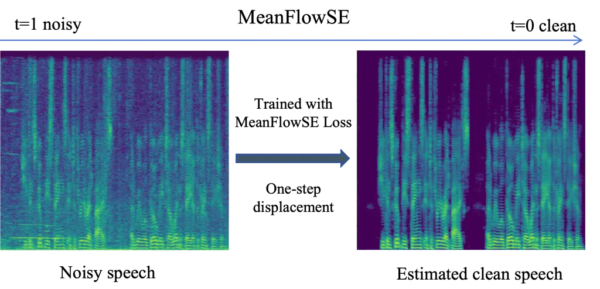

# MEANFLOWSE: ONE-STEP GENERATIVE SPEECH ENHANCEMENT VIA CONDITIONAL MEAN FLOW

Duojia Li^(⋆)    Shenghui Lu^(†)    Hongchen Pan^(⋆)    Zongyi Zhan^(⋆)
   Qingyang Hong^(†∗)    Lin Li^(⋆∗) ^(†)^(†)thanks: \*Corresponding
authors: Lin Li and Qingyang Hong.  
 This work was supported in part by the National Natural Science
Foundation of China under Grants 62371407 and 62276220.

###### Abstract

Multistep inference is a bottleneck for real-time generative speech
enhancement because flow and diffusion-based systems learn an
instantaneous velocity field and therefore rely on iterative ordinary
differential equation solvers. We introduce MeanFlowSE, a conditional
generative model that learns the average velocity over finite intervals
along a trajectory. Using a Jacobian–vector product to instantiate the
MeanFlow identity, we derive a local training objective that directly
supervises finite-interval displacement while remaining consistent with
the instantaneous-field constraint on the diagonal. At inference,
MeanFlowSE performs single-step generation via a backward-in-time
displacement, removing the need for multistep solvers; an optional
few-step variant offers additional refinement. On VoiceBank–DEMAND, the
single-step model achieves strong intelligibility, fidelity, and
perceptual quality with substantially lower computational cost than
multistep baselines. The method requires no knowledge distillation or
external teachers, providing an efficient, high-fidelity framework for
real-time generative speech enhancement. The proposed method is
open-sourced at
[https://github.com/liduojia1/MeanFlowSE](https://github.com/liduojia1/MeanFlowSE).

###### Index Terms: 

speech enhancement, generative models, flow matching, mean flow,
one-step inference

^(†)^(†)address: ^(⋆) School of Electronic Science and Engineering,
Xiamen University, China  
^(†) School of Informatics, Xiamen University, China  
liduojia@stu.xmu.edu.cn; qyhong@xmu.edu.cn; lilin@xmu.edu.cn

## 1 Introduction

Speech enhancement (SE) aims to recover clean speech from noisy signals,
playing a vital role in communication systems and robust automatic
speech recognition (ASR) \[13, 1\]. Discriminative methods estimate
spectral masks or clean-speech features \[4, 15\], yet in adverse
conditions they can produce over-smoothed or distorted outputs, reducing
perceptual quality and intelligibility \[16\]. Recent deterministic
architectures such as ZipEnhancer \[30\] and Mamba-SEUNet \[31\] have
also shown strong performance for monaural SE.



Figure 1: One-step backward-in-time displacement. Trained with the
MeanFlowSE loss, the model maps the noisy spectrogram at $`t{=}1`$ to an
enhanced estimate via a single finite-interval displacement along the
conditional path toward $`t{=}0`$

Generative models provide an alternative by learning the clean–speech
distribution and inverting the noise corruption process \[3, 25\].
Diffusion or score-based methods in the short-time Fourier transform
(STFT) domain have achieved strong performance, yet their reliance on
numerous function evaluations (NFE) limits real-time applicability.
Several efforts aim to mitigate this issue: CDiffuSE employs conditional
reverse sampling to improve fidelity, yet still relies on long sampling
chains \[14\]; SGMSE stabilizes complex spectral synthesis with
predictor–corrector methods, but retains high computational cost \[32\];
Correcting the reverse process (CRP) learns a correction term to reduce
sampling steps, albeit requiring additional fine-tuning \[8\]; the
Schrödinger Bridge (SB) formulation treats SE as a stochastic control
problem, yet remains multi-step and sensitive to discretization \[6\].
Among normalizing flow techniques, flow matching (FM) offers a
deterministic alternative counterpart to diffusion \[18, 11\].
Conditional flow matching (CFM) further regulates the instantaneous
velocity field along a prescribed path \[11\]. FlowSE implements CFM for
speech with a linear–Gaussian conditional path achieving performance
comparable to diffusion models with fewer steps; yet it still depends on
iterative numerical integration of the instantaneous velocity, falling
short of efficient one-step inference \[9\].

In this paper, we propose MeanFlowSE, a generative speech enhancement
model that learns an average‑velocity field, capturing finite‑interval
displacement rather than an instantaneous slope. Our approach employs
the MeanFlow identity \[2\] using a Jacobian–vector product objective,
specifically adapted for conditional speech enhancement. This objective
supervises the finite‑interval average field while naturally reducing to
standard CFM on the diagonal ($`r{=}t`$). During inference, the learned
displacement replaces iterative numerical ordinary differential equation
(ODE) integration, enabling one‑step generation and few‑step refinement
under a unified framework (Fig. 1). Evaluated on VoiceBank-DEMAND,
MeanFlowSE achieves performance competitive with or superior to strong
flow and diffusion baselines, while operating at a significantly lower
real-time factor (RTF). The model is trained from scratch without
knowledge distillation \[22\] and remains compatible with
inference-acceleration techniques from related domains, such as
rectified flows and consistency models \[12, 23\].

## 2 RELATED WORK

### 2.1 FlowSE

FlowSE \[9\] learns a deterministic instantaneous velocity field by
conditional flow matching on a prescribed linear–Gaussian path. Let
$`x_{1}`$ denote the clean speech signal and $`y`$ the corresponding
noisy observation. A time variable $`t\in[0,1]`$ parameterizes the
interpolation from $`y`$ to $`x_{1}`$ through the linear schedules:

```math
\displaystyle\mu_{t}(x_{1},y) \displaystyle=t\,x_{1}+(1-t)\,y, \tag{1}
```

```math
\displaystyle\sigma_{t} \displaystyle=(1-t)\,\sigma, \tag{2}
```

where $`\sigma>0`$ controls the noise level. Here, $`\mu_{t}`$ defines
the path mean between $`y`$ and $`x_{1}`$, while $`\sigma_{t}`$
specifies the standard deviation of the Gaussian perturbation used to
sample $`x_{t}`$ around $`\mu_{t}`$. Along this path, differentiating
the state with respect to $`t`$ and eliminating the auxiliary variable
yields the closed-form on-path instantaneous velocity target:

```math
v_{t}(x_{t}\mid x_{1},y)=\frac{\sigma_{t}^{\prime}}{\sigma_{t}}\big(x_{t}-\mu_{t}\big)+\mu_{t}^{\prime}=\frac{x_{1}-x_{t}}{1-t}, \tag{3}
```

with $`\mu_{t}^{\prime}=x_{1}-y`$ and $`\sigma_{t}^{\prime}=-\sigma`$.
The conditional flow-matching loss regresses a network
$`v_{\theta}(x_{t},t,y)`$ to the target:

```math
\mathcal{L}_{\mathrm{CFM}}=\mathbb{E}_{(x_{1},y),\,t}\!\left[\big\|\,v_{\theta}(x_{t},t,y)-v_{t}(x_{t}\mid x_{1},y)\,\big\|_{2}^{2}\right], \tag{4}
```

where $`x_{t}`$ lies on the path defined by Eqs.(1) and (2) and $`t`$ is
sampled uniformly on $`[0,1-\delta]`$ for a small $`\delta>0`$ to avoid
the singular limit $`t\!\to\!1`$. Inference initializes from the
noisy-side prior $`x_{0}\sim\mathcal{N}(y,\sigma^{2}I)`$ and proceeds on
a grid $`0=t_{0}<\cdots<t_{N}=1`$ by the explicit Euler update:

```math
x_{t_{i}}=x_{t_{i-1}}+v_{\theta}\!\big(x_{t_{i-1}},t_{i-1},y\big)\,\Delta t(i), \tag{5}
```

where the step size is defined as $`\Delta t(i)=t_{i}-t_{i-1}`$. This
rule implements the forward integration of the learned vector field
along the interpolation path.

### 2.2 Mean Flows

Mean Flows \[2\] introduces the average velocity field to describe
finite-interval motion, in contrast to the instantaneous velocity field
used in conventional flow matching. Let the dynamics follow the marginal
instantaneous field $`v(z_{t},t)`$, i.e., $`z_{t}^{\prime}=v(z_{t},t)`$,
where $`z_{t}\!\in\!\mathbb{C}^{D}`$ denotes the interpolation path at
time $`t\!\in\![0,1]`$, and $`(\cdot)^{\prime}`$ is the derivative with
respect to $`t`$. For any $`r<t`$, the average velocity is defined by:

```math
u(z_{t},r,t)=\frac{1}{t-r}\int_{r}^{t}v(z_{\tau},\tau)\,d\tau, \tag{6}
```

where displacement over elapsed time yields the definition
$`u(z_{t},t,t)=v(z_{t},t)`$. Differentiating $`(t-r)u`$ with respect to
$`t`$ gives the MeanFlow identity:

```math
u(z_{t},r,t)=v(z_{t},t)-(t-r)\,\frac{d}{dt}u(z_{t},r,t), \tag{7}
```

where the total derivative is expanded by the chain rule \[2\] as:

```math
\frac{d}{dt}u(z_{t},r,t)=v(z_{t},t)\,\partial_{z}u+\partial_{t}u. \tag{8}
```

This identity yields a computable local supervision rule. Parameterizing
the average field with a network $`u_{\theta}`$, and holding $`r`$ fixed
at $`(z_{t},t)`$, one forms the regression target:

```math
u_{\mathrm{tgt}}=v(z_{t},t)-(t-r)\Big(v(z_{t},t)\,\partial_{z}u_{\theta}+\partial_{t}u_{\theta}\Big), \tag{9}
```

and the loss with stop-gradient $`\mathrm{sg(\cdot)}`$ on the target:

```math
\mathcal{L}=\mathbb{E}\!\left[\left\|\,u_{\theta}(z_{t},r,t)-\mathrm{sg}(u_{\mathrm{tgt}})\,\right\|_{2}^{2}\right]. \tag{10}
```

Once $`u_{\theta}`$ is learned, sampling replaces ODE integration with a
displacement rule:

```math
z_{r}=z_{t}-(t-r)\,u_{\theta}(z_{t},r,t), \tag{11}
```

Mean Flows provides both a training objective and a displacement-based
sampling rule in Eq. (11) \[2\]. This formulation transports the state
from $`t`$ to an earlier $`r`$ in a single update and recovers Euler
integration in the small-step limit.

## 3 Method

Motivated by the Mean Flows principle, we propose to learn an average
velocity field for conditional speech enhancement. The proposed method
operates in the complex STFT domain with paired samples $`(x_{1},y)`$,
where $`x_{1}`$ denotes the clean speech signal and $`y`$ the
corresponding noisy observation. To ensure consistency between training
and inference, we adopt the dual linear–Gaussian conditional path:

```math
\displaystyle\mu_{t} \displaystyle=(1-t)\,x_{1}+t\,y, \tag{12}
```

```math
\displaystyle\sigma_{t} \displaystyle=(1-t)\,\sigma_{\min}+t\,\sigma_{\max}, \tag{13}
```

where $`t\in[0,1]`$, so that $`t=0`$ is the clean endpoint
$`(\mu_{0}=x_{1},\ \sigma_{0}=\sigma_{\min})`$ and $`t=1`$ is the noisy
endpoint $`(\mu_{1}=y,\ \sigma_{1}=\sigma_{\max})`$. This dual
parameterization reverses the endpoint convention of FlowSE. Training
points are drawn on the path via: $`\ x_{t}\;=\;\mu_{t}+\sigma_{t}\,z`$,
where $`z\sim\mathcal{N}(0,I)`$.

Differentiation along the path gives the on-path instantaneous target:

```math
v_{t}(x_{t}\mid x_{1},y)=\mu_{t}^{\prime}+\sigma_{t}^{\prime}z=\frac{\sigma_{t}^{\prime}}{\sigma_{t}}\,(x_{t}-\mu_{t})+\mu_{t}^{\prime}, \tag{14}
```

with $`\mu_{t}^{\prime}=y-x_{1}`$ and
$`\sigma_{t}^{\prime}=\sigma_{\max}-\sigma_{\min}`$. This target is used
only at sampled points on the path.

### 3.1 Average velocity and the MeanFlowSE identity

Iteratively integrating a local slope can accumulate error on curved
trajectories. Instead, we estimate the finite-interval average velocity,
defined as the constant rate that yields the net displacement between
two time points.

Let $`v(x,t\mid y)`$ denote the marginal instantaneous field that
governs the conditional dynamics $`x_{t}^{\prime}=v(x_{t},t\mid y)`$.
For any $`r<t`$, define the average velocity as the mean slope that
reproduces the displacement on $`[r,t]`$:

```math
u(x_{t},r,t\mid y)=\frac{1}{t-r}\int_{r}^{t}v(x_{\tau},\tau\mid y)\,d\tau, \tag{15}
```

so $`u(x_{t},t,t\mid y)=v(x_{t},t\mid y)`$. Differentiating $`(t-r)u`$
with respect to $`t`$ yields the MeanFlowSE identity:

```math
u(x_{t},r,t\mid y)=v(x_{t},t\mid y)-(t-r)\frac{d}{dt}u(x_{t},r,t\mid y), \tag{16}
```

where the total derivative is taken along the conditional trajectory:

```math
\frac{d}{dt}u(x_{t},r,t\mid y)=v(x_{t},t\mid y)\!\cdot\!\nabla_{x}u+\partial_{t}u. \tag{17}
```

The intractable path integral in Eq.(15) is replaced in Eqs. (16)-(17)
by local terms evaluated at $`(x_{t},t)`$, where the diagonal case
$`r=t`$ simplifies to $`u=v`$.

### 3.2 MeanFlowSE loss

The core idea of our approach is to train a single network
$`u_{\theta}(x,r,t,y)`$ so that it satisfies the identity given in
Eqs. (16)-(17) at training samples $`(x_{t},r,t)`$ drawn from the path
in Eqs. (12)-(13). By substituting the closed-form target $`v_{t}`$ from
Eq. (14) into Eq. (16), and then expanding the total derivative in
Eq. (17) with $`(y,r)`$ held fixed, we obtain the first-order training
objective:

```math
u_{\mathrm{tgt}}=v_{t}-c\,(t-r)\!\left[v_{t}\!\cdot\!\nabla_{x}u_{\theta}+\partial_{t}u_{\theta}\right], \tag{18}
```

The first order target in Eq. (18) coincides with the Mean Flow identity
when $`c=1`$; we adopt $`c=0.5`$ as a stabilizing first order correction
to enhance stability without altering the fixed point. Motivated by the
original Mean Flow framework, a stop-gradient operation is applied to
the target to prevent higher-order backpropagation through the
Jacobian–vector product term.

We train the network to approximate this target by minimizing the
MeanFlowSE loss with stop-gradient, which avoids higher-order
backpropagation and yields a well-posed fixed point:

```math
\mathcal{L}_{\mathrm{MFSE}}=\mathbb{E}\!\left[\left\|u_{\theta}(x_{t},r,t,y)-\mathrm{sg}(u_{\mathrm{tgt}})\right\|_{2}^{2}\right]. \tag{19}
```

At the boundary $`r=t`$, the target in Eq.(18) reduces to
$`u_{\mathrm{tgt}}=v_{t}`$, causing Eq.(19) to coincide exactly with the
conditional flow matching objective along the diagonal. In practice, we
incorporate a small fraction of boundary samples during training.
Derivatives are computed using automatic differentiation, supplemented
by a numerically stable centered finite-difference method as a fallback;
only $`(x,t)`$ are differentiated, while $`(y,r)`$ are treated as
constants.

### 3.3 One-step inference

Since the network learns a finite-interval displacement field, inference
no longer requires integrating instantaneous velocities. We apply a
backward-in-time Euler step update that directly transports the noisy
endpoint to the enhanced estimate. After training, numerical ODE
integration is replaced by a displacement driven by the learned field:

```math
x_{t_{k+1}}\;=\;x_{t_{k}}\;-\;\Delta_{k}\,u_{\theta}\!\left(x_{t_{k}},\,r=t_{k+1},\,t=t_{k}\mid y\right), \tag{20}
```

where $`k`$ denotes the time-step index ($`k=0,\dots,N-1`$),
$`\Delta_{k}=t_{k}-t_{k+1}>0`$, and $`\{t_{k}\}_{k=0}^{N}`$ is a
monotone decreasing grid
$`T_{\mathrm{rev}}=t_{0}>t_{1}>\cdots>t_{N}=t_{\varepsilon}`$.

The reverse-time initialization uses the noisy-side marginal
$`x_{T_{\mathrm{rev}}}\sim\mathcal{N}\!\big(y,\sigma^{2}(T_{\mathrm{rev}})I\big)`$,
where $`T_{\mathrm{rev}}\in(0,1]`$ is the reverse-time start and
$`t_{\varepsilon}\in[0,1)`$ is the terminal time used for numerical
stability.

A single-step inference rule follows:

```math
\hat{x}_{t_{\varepsilon}}\;=\;x_{T_{\mathrm{rev}}}\;-\;(T_{\mathrm{rev}}-t_{\varepsilon})\,u_{\theta}\!\left(x_{T_{\mathrm{rev}}},\,r=t_{\varepsilon},\,t=T_{\mathrm{rev}}\mid y\right). \tag{21}
```

| System             | NFE | DNSMOS           |                  |                   | PESQ $`\uparrow`$ | ESTOI $`\uparrow`$ | SI-SDR $`\uparrow`$ | SpkSim $`\uparrow`$ | RTF $`\downarrow`$ |
| ------------------ | --- | ---------------- | ---------------- | ----------------- | ----------------- | ------------------ | ------------------- | ------------------- | ------------------ |
|                    |     | SIG $`\uparrow`$ | BAK $`\uparrow`$ | OVRL $`\uparrow`$ |                   |                    |                     |                     |                    |
| Noisy              | -   | 3.346            | 3.126            | 2.697             | 1.970             | 0.787              | 8.445               | 0.888               | -                  |
| SGMSE              | 30  | 3.488            | 3.985            | 3.176             | 2.922             | 0.863              | 17.396              | 0.891               | 1.81               |
| FlowSE             | 5   | 3.478            | 4.051            | 3.202             | 3.047             | 0.873              | 19.145              | 0.889               | 0.23               |
| Schrödinger Bridge | 30  | 3.486            | 4.062            | 3.216             | 2.901             | 0.872              | 19.448              | 0.886               | 1.07               |
| CDiffuSE           | 200 | 3.434            | 3.727            | 2.994             | 2.513             | 0.798              | 13.665              | 0.812               | 6.94               |
| StoRM              | 50  | 3.487            | 4.031            | 3.204             | 2.891             | 0.868              | 18.518              | 0.891               | 2.61               |
| MeanFlowSE (Ours)  | 1   | 3.471            | 4.073            | 3.207             | 2.942             | 0.881              | 19.975              | 0.892               | 0.11               |

Note: In this paper, bold indicates the best score in each column and
underline indicates the second best.

Table 1: PERFORMANCE COMPARISONS WITH THE STATE-OF-THE-ART SPEECH
ENHANCEMENT SYSTEMS ON THE VOICEBANK–DEMAND DATASET.

| System            | NFE | ESTOI $`\uparrow`$ | SI-SDR $`\uparrow`$ | SpkSim $`\uparrow`$ | RTF $`\downarrow`$ |
| ----------------- | --- | ------------------ | ------------------- | ------------------- | ------------------ |
| FlowSE            | 1   | 0.872              | 19.560              | 0.880               | 0.16               |
| FlowSE            | 5   | 0.873              | 19.145              | 0.889               | 0.23               |
| FlowSE            | 10  | 0.870              | 18.428              | 0.891               | 0.38               |
| FlowSE            | 20  | 0.868              | 18.099              | 0.890               | 0.71               |
| MeanFlowSE (Ours) | 1   | 0.881              | 19.975              | 0.892               | 0.11               |

Table 2: QUALITY–EFFICIENCY TRADE-OFF: FLOWSE VS. MEANFLOWSE

## 4 Experiments

We evaluate on the VoiceBank-DEMAND (VB-DMD) corpus at 16 kHz using the
standard splits, where validation speakers are held out and both test
speakers and SNRs remain unseen \[28, 26\]. All systems share the same
STFT front end (Hann window, centered frames) and waveform
normalization: signals are peak-normalized by the noisy input, and
complex spectra are represented as $`|z|^{0.5}\exp(j\angle z)`$ with a
global scale factor of 0.15.

Our enhancement network is based on NCSN++ with self-attention \[24, 20,
27\]. We concatenate $`(x_{t},y)`$ along the channel dimension and
condition the model on Gaussian Fourier features of $`t`$ and
$`\Delta=t-r`$, enabling it to predict a complex-valued vector field.
Training minimizes the MeanFlowSE loss in Eq. (19) by mixing diagonal
samples ($`\Delta=0`$) and off-diagonal samples ($`\Delta>0`$) drawn
from the dual path in Eqs. (12)–(13). We train with Adam \[7\] using a
learning rate of $`10^{-4}`$, an exponential moving average (EMA) decay
of 0.999, and gradient clipping at 1.0. To stabilize training, we adopt
curriculum learning: we first train on instantaneous velocity, then
gradually increase the weight of the average-velocity objective.

Baselines include CDiffuSE \[14\], SGMSE \[32\], and StoRM \[10\]. We
also evaluate reverse-process correction \[8\], Schrödinger
Bridge \[6\], and FlowSE \[9\] following the authors’ recommended
settings. NFE denotes the number of forward passes per utterance.
Metrics include PESQ \[19\], ESTOI \[5\], SI-SDR \[21\], DNSMOS
P.835 \[17\] (SIG/BAK/OVRL), and speaker similarity (SpkSim) \[29\]. We
also report the real-time factor (RTF), measured end-to-end with batch
size one on a single V100.

## 5 Results

Table 1 presents a system-level comparison on the VB-DMD under an
identical front end and normalization. With only one function
evaluation, MeanFlowSE attains the highest overall quality, an ESTOI of
0.881 and SI-SDR of 19.975 dB. It also attains the best BAK of 4.073,
along with a competitive OVRL score of 3.207, a speaker similarity of
0.892, and a PESQ of 2.942. Notably, MeanFlowSE achieves the lowest RTF
of 0.11 in the comparison. In contrast, prior systems based on
diffusion, bridge, and flow require between 5 and 200 evaluation steps,
yielding RTFs ranging from 0.23 to 6.94 under the same setup. Table 2
further analyzes the quality–efficiency trade-off between FlowSE and
MeanFlowSE by varying the number of function evaluations for FlowSE.
MeanFlowSE achieves the best overall performance across the reported
metrics while retaining the lowest real-time factor, even with a single
function evaluation. Direct supervision of finite-interval displacement
reduces the error accumulation of multi-step integration over noisy
instantaneous fields.

These results underscore the impact of the underlying modeling strategy.
Methods such as SGMSE, StoRM, Schrödinger’s Bridge, CDiffuSE, and FlowSE
integrate an instantaneous field with a multi-step ODE solver, where
quality improvements come at the cost of increased inference time. In
contrast, MeanFlowSE learns an average velocity field that directly
predicts the finite-interval displacement and enables a single
backward-in-time update during inference. By compressing the generative
trajectory to just one step, MeanFlowSE maintains high signal fidelity
and intelligibility while delivering the superior background noise
suppression and the lowest computational cost. Overall, the results
indicate that average-velocity learning advances the quality–efficiency
frontier for generative speech enhancement without distillation or
external teachers.

## 6 Conclusion

We propose MeanFlowSE, a single-step generative SE model that learns an
average velocity field. Using the MeanFlow identity on a conditional
path, we derive a tractable objective whose optimum matches the
finite-interval displacement, enabling displacement-based inference
without ODEs. MeanFlowSE achieves competitive quality against strong
multistep baselines at much lower cost. Limitations include the
linear–Gaussian path and first-order derivatives; future work will
explore more flexible paths and real-world evaluation.

## References

- \[1\] Y. Ephraim and D. Malah (1984) Speech enhancement using a
  minimum mean-square error short-time spectral amplitude estimator.
  IEEE Transactions on Acoustics, Speech, and Signal Processing 32 (6),
  pp. 1109–1121. Cited by: §1.
- \[2\] Z. Geng, M. Deng, X. Bai, J. Z. Kolter, and K. He (2025) Mean
  flows for one-step generative modeling. Note: arXiv:2505.13447
  External Links: 2505.13447 Cited by: §1, §2.2, §2.2, §2.2.
- \[3\] J. Ho, A. Jain, and P. Abbeel (2020) Denoising diffusion
  probabilistic models. In 34th Conference on Neural Information
  Processing Systems (NeurIPS 2020), pp. 6840–6851. Cited by: §1.
- \[4\] Y. Hu, Y. Liu, S. Lv, M. Xing, S. Zhang, Y. Fu, J. Wu, B. Zhang,
  and L. Xie (2020) DCCRN: deep complex convolution recurrent network
  for phase-aware speech enhancement. In Proc. Interspeech, Virtual Only
  Conference. Cited by: §1.
- \[5\] J. Jensen and C. H. Taal (2016) An algorithm for predicting the
  intelligibility of speech masked by modulated noise maskers. IEEE/ACM
  Transactions on Audio, Speech, and Language Processing 24 (11),
  pp. 2009–2022. Cited by: §4.
- \[6\] A. Jukić, R. Korostik, J. Balam, and B. Ginsburg (2024)
  Schrödinger bridge for generative speech enhancement. Note:
  arXiv:2407.16074 External Links: 2407.16074 Cited by: §1, §4.
- \[7\] D. P. Kingma and J. Ba (2014) Adam: a method for stochastic
  optimization. In International Conference on Learning Representations
  (ICLR), San Diego, CA, USA. Cited by: §4.
- \[8\] B. Lay, J. M. Lemercier, J. Richter, and T. Gerkmann (2024)
  Single and few-step diffusion for generative speech enhancement. In
  ICASSP 2024 - 2024 IEEE International Conference on Acoustics, Speech
  and Signal Processing (ICASSP), pp. 626–630. Cited by: §1, §4.
- \[9\] S. Lee, S. Cheong, S. Han, and J. W. Shin (2025) FlowSE: flow
  matching-based speech enhancement. In ICASSP 2025 - 2025 IEEE
  International Conference on Acoustics, Speech and Signal Processing
  (ICASSP), pp. 1–5. Cited by: §1, §2.1, §4.
- \[10\] J. M. Lemercier, J. Richter, S. Welker, and T. Gerkmann (2023)
  StoRM: a diffusion-based stochastic regeneration model for speech
  enhancement and dereverberation. IEEE/ACM Transactions on Audio,
  Speech, and Language Processing 31, pp. 2724–2737. Cited by: §4.
- \[11\] Y. Lipman, R. T. Q. Chen, H. Ben-Hamu, M. Nickel, and M.
  Le (2023) Flow matching for generative modeling. In The Eleventh
  International Conference on Learning Representations (ICLR), Kigali,
  Rwanda. Cited by: §1.
- \[12\] X. Liu, C. Gong, and Q. Liu (2023) Flow straight and fast:
  learning to generate and transfer data with rectified flow. In
  International Conference on Learning Representations (ICLR), Kigali,
  Rwanda. Cited by: §1.
- \[13\] P. C. Loizou (2007) Speech enhancement: theory and practice.
  CRC Press, Boca Raton, FL. Cited by: §1.
- \[14\] Y. J. Lu, Z. Q. Wang, S. Watanabe, A. Richard, C. Yu, and Y.
  Tsao (2022) Conditional diffusion probabilistic model for speech
  enhancement. In ICASSP 2022 - 2022 IEEE International Conference on
  Acoustics, Speech and Signal Processing (ICASSP), pp. 7402–7406. Cited
  by: §1, §4.
- \[15\] Y. Luo and N. Mesgarani (2019) Conv-tasnet: surpassing ideal
  time-frequency magnitude masking for speech separation. IEEE/ACM
  Transactions on Audio, Speech, and Language Processing 27 (8),
  pp. 1256–1266. Cited by: §1.
- \[16\] S. Pascual, A. Bonafonte, and J. Serra (2017) SEGAN: speech
  enhancement generative adversarial network. In Proc. Interspeech,
  Stockholm, Sweden, pp. 1–5. Cited by: §1.
- \[17\] C. K. A. Reddy, V. Gopal, and R. Cutler (2022) DNSMOS p.835: a
  non-intrusive perceptual objective speech quality metric to evaluate
  noise suppressors. In ICASSP 2022 - 2022 IEEE International Conference
  on Acoustics, Speech and Signal Processing (ICASSP), pp. 886–890.
  Cited by: §4.
- \[18\] D. Rezende and S. Mohamed (2015) Variational inference with
  normalizing flows. In Proceedings of the 32nd International Conference
  on Machine Learning (ICML), pp. 1530–1538. Cited by: §1.
- \[19\] A. W. Rix, J. G. Beerends, M. P. Hollier, and A. P.
  Hekstra (2001) Perceptual evaluation of speech quality (PESQ)–a new
  method for speech quality assessment of telephone networks and codecs.
  In ICASSP 2001 - 2001 IEEE International Conference on Acoustics,
  Speech and Signal Processing (ICASSP), pp. 749–752. External Links:
  [Document](https://dx.doi.org/10.1109/ICASSP.2001.941023) Cited by:
  §4.
- \[20\] O. Ronneberger, P. Fischer, and T. Brox (2015) U-net:
  convolutional networks for biomedical image segmentation. In Medical
  Image Computing and Computer-Assisted Intervention – MICCAI 2015,
  pp. 234–241. Cited by: §4.
- \[21\] J. L. Roux, S. Wisdom, H. Erdogan, and J. R. Hershey (2019) SDR
  – half-baked or well done?. In ICASSP 2019 - 2019 IEEE International
  Conference on Acoustics, Speech and Signal Processing (ICASSP),
  pp. 626–630. Cited by: §4.
- \[22\] T. Salimans and J. Ho (2022) Progressive distillation for fast
  sampling of diffusion models. In International Conference on Learning
  Representations (ICLR), Virtual Only Conference. Cited by: §1.
- \[23\] Y. Song, P. Dhariwal, M. Chen, and I. Sutskever (2023)
  Consistency models. In Proceedings of the 40th International
  Conference on Machine Learning (ICML), pp. 32211–32252. Cited by: §1.
- \[24\] Y. Song and S. Ermon (2020) Improved techniques for training
  score-based generative models. In 34th Conference on Neural
  Information Processing Systems (NeurIPS 2020), pp. 12438–12448. Cited
  by: §4.
- \[25\] Y. Song, J. Sohl-Dickstein, D. P. Kingma, A. Kumar, S. Ermon,
  and B. Poole (2021) Score-based generative modeling through stochastic
  differential equations. In International Conference on Learning
  Representations (ICLR), Virtual Only Conference. Cited by: §1.
- \[26\] J. Thiemann, N. Ito, and E. Vincent (2013) The diverse
  environments multi-channel acoustic noise database (demand): a
  database of multichannel environmental noise recordings. Proceedings
  of Meetings on Acoustics 19 (1), pp. 035081. Cited by: §4.
- \[27\] A. Vaswani, N. Shazeer, N. Parmar, J. Uszkoreit, L.
  Jones, A. N. Gomez, L. Kaiser, and I. Polosukhin (2017) Attention is
  all you need. In 31st Conference on Neural Information Processing
  Systems (NIPS 2017), pp. 1–11. Cited by: §4.
- \[28\] C. Veaux, J. Yamagishi, and S. King (2013) The voice bank
  corpus: design, collection and data analysis of a large regional
  accent speech database. In 2013 International Conference Oriental
  COCOSDA held jointly with 2013 Conference on Asian Spoken Language
  Research and Evaluation, pp. 1–4. Cited by: §4.
- \[29\] H. Wang, C. Liang, S. Wang, Z. Chen, B. Zhang, X. Xu, Y. Deng,
  and Y. Qian (2023) Wespeaker: a research and production oriented
  speaker embedding learning toolkit. In ICASSP 2023 - 2023 IEEE
  International Conference on Acoustics, Speech and Signal Processing
  (ICASSP), pp. 1–5. Cited by: §4.
- \[30\] H. Wang and B. Tian (2025) ZipEnhancer: dual-path down-up
  sampling-based zipformer for monaural speech enhancement. In ICASSP
  2025 - 2025 IEEE International Conference on Acoustics, Speech and
  Signal Processing (ICASSP), pp. 1–5. Cited by: §1.
- \[31\] J. Wang, Z. Lin, T. Wang, M. Ge, L. Wang, and J. Dang (2025)
  Mamba-seunet: mamba unet for monaural speech enhancement. In ICASSP
  2025 - 2025 IEEE International Conference on Acoustics, Speech and
  Signal Processing (ICASSP), pp. 1–5. Cited by: §1.
- \[32\] S. Welker, J. Richter, and T. Gerkmann (2022) Speech
  enhancement with score-based generative models in the complex STFT
  domain. Note: arXiv:2203.17004 External Links: 2203.17004 Cited by:
  §1, §4.
