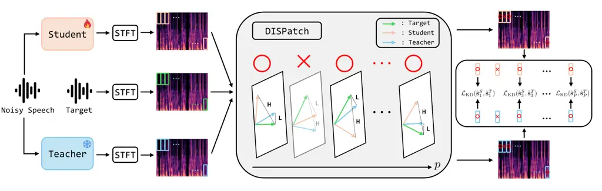
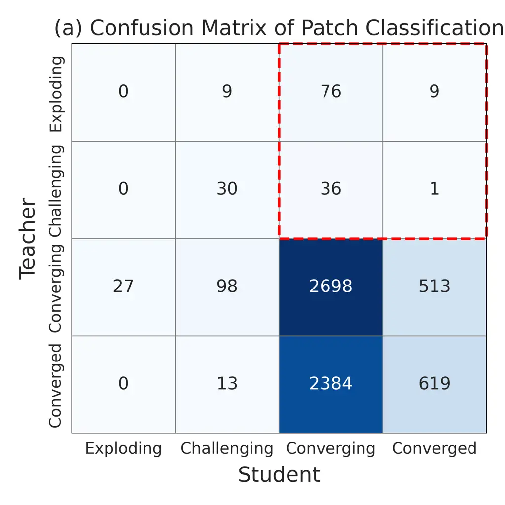
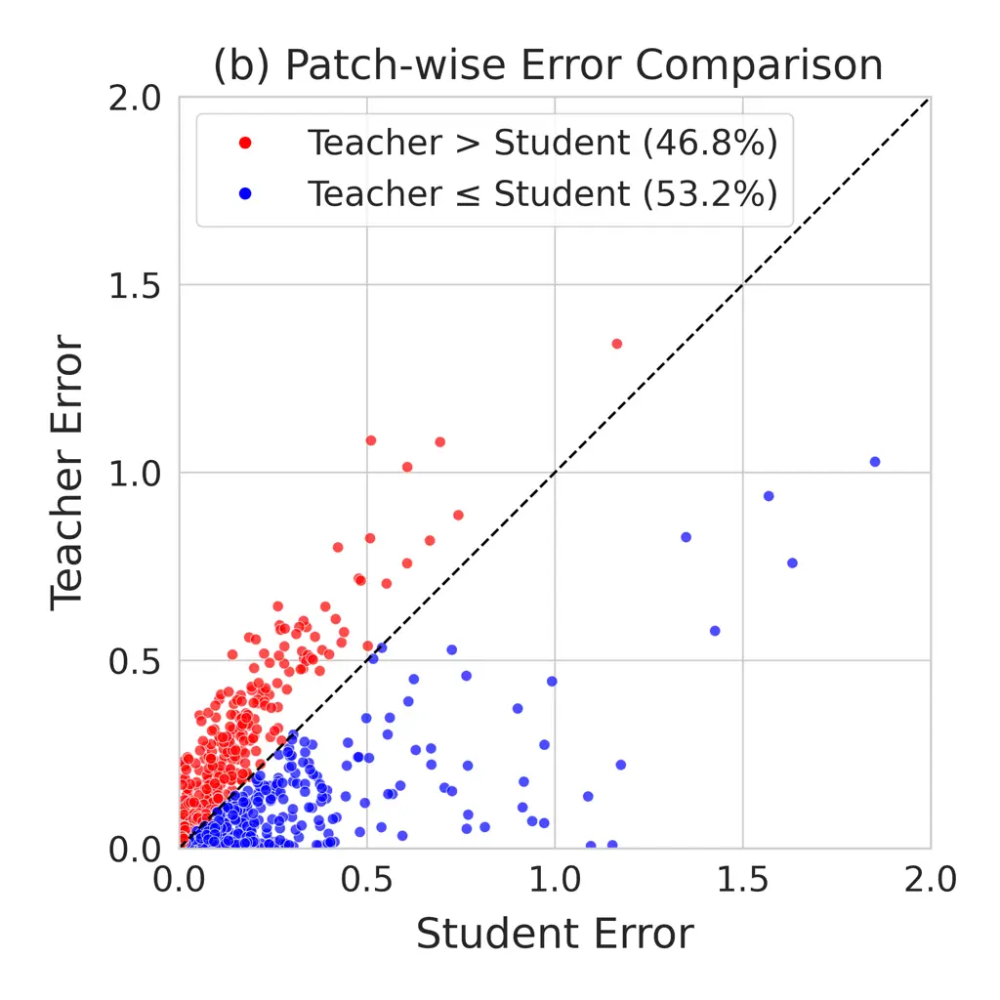

# DISPATCH: Distilling Selective Patches for Speech Enhancement

Dohwan Kim    Jung-Woo Choi\sthanksCorresponding author

###### Abstract

In speech enhancement, knowledge distillation (KD) compresses models by
transferring a high-capacity teacher’s knowledge to a compact student.
However, conventional KD methods train the student to mimic the
teacher’s output entirely, which forces the student to imitate the
regions where the teacher performs poorly and to apply distillation to
the regions where the student already performs well, which yields only
marginal gains. We propose Distilling Selective Patches (DISPatch), a KD
framework for speech enhancement that applies the distillation loss to
spectrogram patches where the teacher outperforms the student, as
determined by a Knowledge Gap Score. This approach guides optimization
toward areas with the most significant potential for student improvement
while minimizing the influence of regions where the teacher may provide
unreliable instruction. Furthermore, we introduce Multi-Scale Selective
Patches (MSSP), a frequency-dependent method that uses different patch
sizes across low- and high-frequency bands to account for spectral
heterogeneity. We incorporate DISPatch into conventional KD methods and
observe consistent gains in compact students. Moreover, integrating
DISPatch and MSSP into a state-of-the-art frequency-dependent KD method
considerably improves performance across all metrics. ¹¹ 1
https://github.com/rlaehghks5/DISPATCH

###### Index Terms: 

knowledge distillation, selective distillation, frequency-dependent
learning, speech enhancement

^(†)^(†)address: School of Electrical Engineering, KAIST, Daejeon,
Republic of Korea  
{dohwan, jwoo}@kaist.ac.kr

## 1 Introduction

While deep neural networks have demonstrated strong performance in
speech enhancement \[4, 10, 16\], their high computational demands pose
significant challenges for practical applications, particularly in
resource-constrained settings like on-device AI, where hardware
limitations, power consumption, and monetary costs are critical
concerns. Consequently, model compression has become a crucial research
direction for developing computationally efficient speech enhancement
models. Several compression strategies have been explored, including
pruning \[7\], which removes redundant weights; quantization \[3\],
which reduces the numerical precision of model parameters; and Knowledge
Distillation (KD) \[9, 22, 18\]. This paper focuses on KD, a
teacher-student paradigm in which a compact student model is trained to
mimic a larger teacher model, thereby inheriting the teacher’s
knowledge.

KD has been actively explored in the speech domain, such as speaker
verification \[19, 24\], speech separation \[2, 27\], and speech
enhancement \[8, 21, 25, 20, 26\]. A prominent line of work is
response-based KD, which trains a student to mimic the teacher’s output
\[19, 2, 27, 8, 26\]. This output can be diverse, ranging from logits or
posterior probabilities to time-frequency output. Some approaches \[24,
21, 25\] combine response-based and feature-based KD to align
intermediate representations, leveraging complementary information.

In speech enhancement, distilling time–frequency output has become a
prominent response-based KD strategy because this approach can
effectively capture the rich time-frequency structure of speech. This
approach has given rise to notable frequency-dependent methods, such as
Subband-KD \[8\] and Dynamic Frequency-Adaptive Knowledge Distillation
(DFKD) \[26\]. DFKD addresses the limitation of Subband-KD arising from
static band partitioning by introducing a frequency adapter that
dynamically partitions the spectrogram into low- and high-frequency
regions and optimizes each region with distinct losses. This dynamic
frequency-dependent approach allows DFKD to significantly outperform
Subband-KD and ABC-KD \[25\], a hybrid of response- and feature-based
distillation. Although DFKD has shown strong performance, it remains
limited by relying on the entire teacher output, which may contain
low‑quality time–frequency regions.

KD generally assumes that the teacher provides reliable supervision.
However, this premise overlooks two critical issues in practice. The
first limitation concerns the student’s existing proficiency. Distilling
knowledge in regions where the student has already converged yields
minimal benefit. The second challenge stems from the inherent
imperfections of the teacher model, which may result from overfitting to
the training dataset. Therefore, forcing the student to learn from
flawed regions in the teacher’s output is detrimental, as it leads the
student to replicate the teacher’s weakness instead of its strengths. As
a result, indiscriminate distillation not only diverts the student’s
focus from the regions where the teacher’s guidance is most needed but
also, more importantly, can cause the student to imitate the teacher’s
erroneous output, leading to a degradation in performance. Therefore, it
is crucial to adopt a selective strategy that allows the student to
learn only from beneficial supervision. Although several adaptive
strategies have been proposed, such as importance-weighted KD \[15, 6\]
and uncertainty-aware KD \[12, 11\], they still presuppose that the
teacher is uniformly superior to the student for a given input.
Consequently, they inevitably transfer local artifacts even under
reduced weights, neglecting that the student may locally outperform the
teacher.



Figure 1: Overview of DISPatch framework. DISPatch framework separates
spectrograms into patches and selectively applies KD loss to those
exhibiting a high Knowledge Gap, where the teacher’s error is low (L)
and the student’s is high (H). Patch size: $`2C\times N\times 1`$ .

Recent work on large language models has demonstrated that their
accelerated convergence and improved performance can be achieved through
selective training strategies \[17\]. This approach involves training
the model exclusively on useful tokens, identified by a reference model
trained on a high-quality dataset. Inspired by this principle, we
propose Distilling Selective Patches (DISPatch). This strategy distills
only the most useful spectrogram patches, leveraging KD’s selectivity
and mitigating the limitations discussed above. The overall architecture
of DISPatch is illustrated in Fig.1. We introduce a Knowledge Gap Score
(KGS) to enable a more targeted transfer of the teacher’s knowledge by
identifying and distilling only the most valuable patches, rather than
imposing the KD loss across the entire spectrogram. DISPatch explicitly
ignores regions where the teacher is unreliable or where the student is
already proficient. Moreover, recognizing that speech characteristics
vary across frequencies, we introduce Multi-Scale Selective Patches
(MSSP). This is a frequency-dependent strategy that adapts the distinct
patch sizes to different frequency regions for more tailored
distillation. We show consistent gains by applying DISPatch to
response-based KD, and further improvements when integrating DISPatch
and MSSP into DFKD.

## 2 METHODOLOGY

### 2.1 Not All Spectrogram Regions Are Equal

To demonstrate the presence of informative regions in the output of
teacher and student models, we follow the approach proposed in \[17\]
and analyze spectrogram patches on the DNS2020 Challenge dataset using
ConvTasNet \[14\]. For this preliminary analysis, we set up a teacher
and a student model; their detailed configurations are described in
Section 3.2. Let
$`\mathbf{S},\hat{\mathbf{S}}\in\mathbb{R}^{2C\times F\times T}`$ denote
the clean target and the estimated complex spectrogram, respectively.
Here, $`C`$, $`F`$, and $`T`$ denote the numbers of channels, frequency
bins, and time frames. To quantify the error on the local level, we
separate the complex spectrogram into $`P`$ patches:
$`\mathbf{s}_{p},~\hat{\mathbf{s}}_{p}\in\mathbb{R}^{2C\times N\times 1}`$
($`p\in\{0,\,\cdots,\,P-1\}`$), where $`N=FT/P`$ is the number of
frequency bins in each patch and each patch has a single time frame. In
practice, we use zero padding along the frequency axis so that $`F`$
becomes a multiple of $`N`$. Specifically, padding is used only at the
high-frequency end of the spectrogram, and padded bins are ignored in
all computations. Then, we define the patch-wise magnitude error:

```math
e_{p}=\left\||\mathbf{s}_{p}|-|\hat{\mathbf{s}}_{p}|\right\|_{2}^{2} \tag{1}
```

where $`|\mathbf{s}_{p}|`$ and $`|\hat{\mathbf{s}}_{p}|`$ are the
magnitudes of the $`p`$-th patch in the target and estimated complex
spectrograms, respectively. Then, for each patch of a given sample in
the training data, we record the error every 1k training steps to
construct an error sequence
$`(e_{p}^{(0)},\,e_{p}^{(1)},\,\cdots,\,e_{p}^{(J)})`$ for $`J+1`$
observation points. To assess error convergence during training, we
perform a linear regression by fitting a first-order polynomial as shown
below:





Figure 2: Analysis of patch-level teacher-student misalignment. (a)
Confusion matrix of patch classification. (b) Scatter plot comparing
patch-wise errors between the teacher and the student.

```math
f(a_{p},b_{p})=\min_{a_{p},b_{p}}\sum_{j=0}^{J}\left|e_{p}^{(j)}-(a_{p}j+b_{p})\right|^{2} \tag{2}
```

For each patch, the change between the first and last points in the
fitted line $`\Delta e_{p}=a_{p}\cdot J`$ is calculated to determine the
convergence of the error. Additionally, we compute the average error
across all patches at the final iteration point, given by:

```math
e_{\mathrm{mean}}=\frac{1}{P}\sum_{p=0}^{P-1}e_{p}^{(J)} \tag{3}
```

Based on $`\Delta e_{p}`$ and $`e_{\mathrm{mean}}`$, we classify each
patch into one of four categories. Patches are labeled Converging if
$`\Delta e_{p}<-0.01`$, and Exploding if $`\Delta e_{p}>0.01`$. The
patches with stable error $`(-0.01\leq\Delta e_{p}\leq 0.01)`$ are
labeled Converged if $`e^{(J)}_{p}\leq e_{\mathrm{mean}}`$, and
Challenging if $`e^{(J)}_{p}>e_{\mathrm{mean}}`$. Note that decision
thresholds other than 0.01 (e.g., 0.02 or 0.03) result in similar patch
distributions.

Contrary to the common assumption that the teacher consistently provides
superior supervision, our patch-level analysis of a single speech sample
reveals misalignment between the teacher and student. Fig.2 (a)
visualizes the patch classification mismatch between the two models.
Although the student has stabilized in many regions (Converged or
Converging), a significant subset exists where the teacher remains
unstable (Exploding or Challenging) despite the student’s proficiency
(highlighted in the red box). Furthermore, Fig.2 (b) confirms that at
the $`J`$-th point, the teacher’s error exceeds the student’s in 46.8%
of patches. This empirical evidence exposes two critical risks of
indiscriminate distillation: the transfer of harmful artifacts by
forcing the student to mimic the teacher’s flawed regions, and the
diversion of the student’s focus to regions where the student already
excels, rather than where distillation is truly needed.

### 2.2 DISPatch: Distilling Selective Patches

Based on our previous analysis, we propose Distilling Selective Patches
(DISPatch), which selectively distills knowledge from patches where the
teacher outperforms the student. To achieve this, we first define a
patch-wise error metric
$`\varepsilon(\mathbf{s}_{p},\,\hat{\mathbf{s}}_{p})`$. The patch-wise
error metric $`\varepsilon`$ is designed to be flexible. It can be
defined as a simple magnitude spectrogram distance (e.g., L1 or L2) or
as a more advanced objective, such as the one proposed in DFKD \[26\].
Using this metric, we compute the patch-wise error for both the student
and teacher models with respect to the target speech:

```math
E_{p}^{S}=\varepsilon(\mathbf{s}_{p},\,\hat{\mathbf{s}}_{p}^{S}),~~E_{p}^{T}=\varepsilon(\mathbf{s}_{p},\,\hat{\mathbf{s}}_{p}^{T}) \tag{4}
```

where superscripts S and T denote the student and the teacher,
respectively. To quantify the knowledge gap between the student and the
teacher in each patch, we introduce the Knowledge Gap Score (KGS), an
intuitive metric designed to focus distillation on patches where the
teacher’s guidance is most beneficial:

```math
KGS_{p}=E^{S}_{p}-E^{T}_{p}. \tag{5}
```

A higher $`KGS_{p}`$ indicates a greater knowledge disparity, suggesting
that the teacher’s knowledge in that patch is particularly valuable for
distillation. Consequently, we selectively transfer knowledge only from
patches with high $`KGS_{p}`$values. The distillation loss is applied
exclusively to the top $`k`$% of patches ranked by their $`KGS_{p}`$:

```math
\mathcal{L}_{\mathrm{DISPatch}}=\frac{1}{P\cdot k\%}\sum_{i=0}^{P-1}I_{k\%}({KGS}_{p})\cdot\mathcal{L}_{\mathrm{KD}}(\hat{\mathbf{s}}_{p}^{S},\hat{\mathbf{s}}_{p}^{T}) \tag{6}
```

where $`\mathcal{L}_{\mathrm{KD}}`$ is a KD loss for $`p`$-th patch, and
$`I_{k\%}`$ is the indicator function defined as:

```math
I_{k\%}({KGS}_{p})=\begin{cases}1&\text{if }{KGS}_{p}\text{ ranks in the top }k\%,\\
0&\text{otherwise}\end{cases} \tag{7}
```

DISPatch allows for the dynamic selection of critical patches within
each speech sample, imposing the KD loss to match the teacher’s output
only on a selected informative subset. In summary, selecting patches
based on high $`KGS_{p}`$ enables the model to avoid suboptimal
distillation by naturally excluding regions where the teacher is
unreliable or the student already performs well.

### 2.3 MSSP: Multi-Scale Selective Patches

A single, uniform patch size is suboptimal for DISPatch because it fails
to account for the heterogeneous characteristics of speech signals
across frequency bands. Acoustic phonetics shows that low-frequency
regions are typically dominated by fine-grained structured information
such as formants, which are crucial for vowel identity \[5\]. In
contrast, high-frequency regions often contain broader, less-structured
energy patterns, such as those found in fricatives \[13\]. Therefore, we
propose Multi-Scale Selective Patches (MSSP), which uses a smaller patch
size for low frequencies and a larger one for high frequencies to
account for these heterogeneous characteristics.

To implement MSSP, we identify the dynamic crossover point by adopting
the frequency adapter from DFKD \[26\], which determines the boundary
for each time frame. DFKD dynamically partitions output into low- and
high-frequency bands via the frequency adapter and uses
frequency-dependent KD objectives to balance speech preservation at low
frequencies and noise suppression at high frequencies. In practice, a
phase-only cosine loss is used in the low-frequency band, while the
high-frequency band uses a combination of amplitude L2 and phase losses.
The combination of MSSP and DFKD is conceptually aligned, as both adopt
frequency‑dependent objectives. Accordingly, we integrate MSSP into DFKD
to evaluate the effect of employing distinct patch sizes across low and
high frequencies.

### 2.4 Training Setup with DISPatch

The overall training objective, $`\mathcal{L}_{\mathrm{total}}`$, is
defined as a weighted sum of speech enhancement loss
($`\mathcal{L}_{\mathrm{SE}}`$) and our proposed selective distillation
loss ($`\mathcal{L}_{\mathrm{DISPatch}}`$) as follows:

```math
\mathcal{L}_{\mathrm{total}}=\alpha\cdot\mathcal{L}_{\mathrm{SE}}+(1-\alpha)\cdot\mathcal{L}_{\mathrm{DISPatch}} \tag{8}
```

where $`\alpha`$ is a hyperparameter that balances the contribution of
the two loss terms. In our experiments, we set $`\alpha`$ to 0.5, giving
equal weight to direct supervision and selective knowledge distillation.
To avoid overfitting the weighting to any particular method, we fix
$`\alpha`$ across all models and different KD objectives, rather than
tuning it per method. For $`\mathcal{L}_{\mathrm{SE}}`$, we adopt the
objective function originally proposed for each respective model.

|                      |        |        |                    |          |              |         |         |                  |         |         |
| -------------------- | ------ | ------ | ------------------ | -------- | ------------ | ------- | ------- | ---------------- | ------- | ------- |
| Model                | Param. | MAC/s  | Methods            | DISPatch | DNS2020-test |         |         | VoiceBank+DEMAND |         |         |
|                      |        |        |                    |          | WB-PESQ      | NB-PESQ | STOI(%) | WB-PESQ          | NB-PESQ | STOI(%) |
| ConvTasNet (Teacher) | 9.71M  | 8.05G  | Scratch            | X        | 2.792        | 3.337   | 96.71   | 2.770            | 3.582   | 94.12   |
| ConvTasNet (Student) | 1.75M  | 0.57G  | Scratch            | X        | 2.563        | 3.122   | 96.05   | 2.585            | 3.424   | 93.44   |
|                      |        |        | L1                 | X        | 2.584        | 3.135   | 96.11   | 2.584            | 3.429   | 93.57   |
|                      |        |        | L1                 | O        | 2.602        | 3.165   | 96.16   | 2.614            | 3.450   | 93.79   |
|                      |        |        | L2                 | X        | 2.563        | 3.127   | 95.98   | 2.556            | 3.400   | 93.37   |
|                      |        |        | L2                 | O        | 2.602        | 3.157   | 96.10   | 2.603            | 3.431   | 93.39   |
|                      |        |        | DFKD               | X        | 2.623        | 3.170   | 96.08   | 2.583            | 3.458   | 93.70   |
|                      |        |        | DFKD               | O        | 2.650        | 3.208   | 96.12   | 2.589            | 3.490   | 93.81   |
|                      |        |        | DFKD + MSSP(10/40) | O        | 2.677        | 3.226   | 96.17   | 2.618            | 3.505   | 94.02   |
| DCCRN-CL (Teacher)   | 9.22M  | 15.33G | Scratch            | X        | 2.764        | 3.318   | 96.38   | 2.655            | 3.591   | 92.94   |
| DCCRN-CL (Student)   | 2.24M  | 3.84G  | Scratch            | X        | 2.691        | 3.247   | 96.08   | 2.582            | 3.482   | 92.96   |
|                      |        |        | L1                 | X        | 2.660        | 3.236   | 96.07   | 2.631            | 3.454   | 92.98   |
|                      |        |        | L1                 | O        | 2.709        | 3.270   | 96.13   | 2.678            | 3.497   | 93.20   |
|                      |        |        | L2                 | X        | 2.690        | 3.241   | 95.96   | 2.587            | 3.446   | 92.96   |
|                      |        |        | L2                 | O        | 2.726        | 3.283   | 96.08   | 2.675            | 3.486   | 93.04   |
|                      |        |        | DFKD               | X        | 2.719        | 3.279   | 96.06   | 2.635            | 3.476   | 93.04   |
|                      |        |        | DFKD               | O        | 2.757        | 3.291   | 96.10   | 2.618            | 3.490   | 93.13   |
|                      |        |        | DFKD + MSSP(10/40) | O        | 2.758        | 3.301   | 96.10   | 2.719            | 3.535   | 93.29   |

Table 1: Comparison of DISPatch-Augmented Knowledge Distillation Methods
on DCCRN-CL and ConvTasNet

## 3 EXPERIMENTS

### 3.1 Datasets

For training, we use the dataset from the DNS2020 challenge \[23\],
which consists of more than 500 and 100 hours of clean speech and noise,
respectively. The speech and noise are mixed at various Signal-to-Noise
Ratios (SNRs) uniformly sampled from 0 to 20 dB, and all audio clips are
4-second segments sampled at 16 kHz. To demonstrate the effectiveness of
DISPatch, we conduct evaluations on both the DNS2020 challenge test set
and the VoiceBank+DEMAND \[1\] test set, also sampled at 16kHz.

### 3.2 Implementation Details

We evaluate DISPatch using ConvTasNet (Deep w/ PReLU) \[14\] and
DCCRN-CL \[10\]. For the implementation of ConvTasNet (Deep w/ PReLU),
the teacher (9.71M) and student (1.75M) are configured with
hyperparameters {N, L, B, H, Sc, P, X, R} set to {512, 16, 128, 512,
128, 3, 8, 3} and {128, 40, 128, 256, 128, 3, 7, 2}, respectively. The
DCCRN-CL teacher (9.22M) and student (2.24M) are configured with encoder
channels of {64, 128, 256, 256, 512, 512} and {32, 64, 128, 128, 256,
256}, respectively. Additionally, the teacher is configured with two
complex LSTM layers and 256 hidden units, while the student has one
layer and 128 units. Both models are trained for 100 epochs with an
initial learning rate of $`1\times 10^{-3}`$, which is halved when the
validation loss does not improve for three consecutive epochs; training
is stopped if no improvement is seen for ten epochs. We use Adam and
apply gradient clipping with a maximum L2 norm of 5 and a batch size of 16.

For the analysis in Section 2.1, we set the patch size $`N`$ to 20. We
used the same setting for DISPatch with a single patch size and set the
patch selection ratio $`k`$ to 80. We evaluated the effectiveness of
DISPatch on response-based KD methods, including L1, L2, and DFKD.
DISPatch is applied using the STFT with a Hann window of 32 ms and a hop
size of 8 ms, corresponding to 75% overlap. The additional computational
cost of DISPatch is approximately 1.2% per epoch when used with DFKD on
ConvTasNet. All hyperparameters related to DISPatch are kept consistent
across both models and all KD objectives.

### 3.3 Experimental Results

Table 1 indicates that magnitude distance-based KD methods (L1, L2)
offer marginal gains over the scratch baseline and often result in
performance degradation. In contrast, applying DISPatch consistently
improves all metrics for both architectures, substantially outperforming
the methods without DISPatch and surpassing the scratch baseline in most
cases. The gains persist with DFKD, highlighting the broad effectiveness
of focusing distillation on informative patches. These results clearly
highlight the benefit of distilling from only the most informative
patches. The most significant gains are achieved when integrating DFKD
with both DISPatch and MSSP (10/40 for low/high), achieving the highest
performance across both test sets. These results demonstrate that MSSP
further amplifies the strengths of DFKD, which is a frequency-dependent
method, by using asymmetric patch scales for low- and high-frequency
bands.

| Model      | low/high | DNS2020-test |         |         | VoiceBank+DEMAND |         |         |
| ---------- | -------- | ------------ | ------- | ------- | ---------------- | ------- | ------- |
|            |          | WB-PESQ      | NB-PESQ | STOI(%) | WB-PESQ          | NB-PESQ | STOI(%) |
| ConvTasNet | 20/20    | 2.650        | 3.208   | 96.12   | 2.589            | 3.490   | 93.81   |
|            | 10/20    | 2.630        | 3.191   | 96.01   | 2.555            | 3.470   | 93.66   |
|            | 20/40    | 2.662        | 3.211   | 96.12   | 2.626            | 3.483   | 93.76   |
|            | 10/40    | 2.677        | 3.226   | 96.17   | 2.618            | 3.505   | 94.02   |
| DCCRN-CL   | 20/20    | 2.757        | 3.291   | 96.10   | 2.618            | 3.490   | 93.13   |
|            | 10/20    | 2.746        | 3.295   | 96.09   | 2.690            | 3.506   | 93.28   |
|            | 20/40    | 2.745        | 3.298   | 96.11   | 2.668            | 3.506   | 93.16   |
|            | 10/40    | 2.758        | 3.301   | 96.10   | 2.719            | 3.535   | 93.29   |

Table 2: Performance Comparison of MSSP

To validate the effectiveness of MSSP and identify a proper patch
configuration, we compare DFKD with DISPatch using a uniform patch size
(20/20) against DFKD incorporating MSSP and DISPatch, as detailed in
Table 2. The values of patch sizes are chosen to test the impact of
local (10) and broader (40) scopes for low and high frequencies against
the uniform baseline (20). For both models and across two datasets, the
configuration applying a smaller patch size in low frequencies and a
larger patch size in high frequencies (10/40) achieves the highest
scores, outperforming using only a small low-frequency patch (10/20) or
only a large high-frequency patch (20/40) when compared to the uniform
patch size (20/20). These results support our hypothesis that tailoring
patch sizes to the distinct acoustic characteristics of different
frequency bands enables a better enhancement of the student’s
capabilities.

For an ablation study on the components of KGS, we adopt objective L2 to
align with the analysis setup in Section 2.1, and we evaluate patch
selection criteria where Top-$`k`$ and Bottom-$`k`$ denote selecting the
highest and lowest $`k`$% patches, respectively. Each patch selection
criterion is selected using one of the individual components of
$`KGS_{p}`$($`E^{S}_{p}`$, $`E^{T}_{p}`$). Table 3 shows that the
proposed $`KGS_{p}`$ is the most effective selection criterion, whereas
relying on a single component degrades performance. First, the patches
selected by Top-$`k`$ by $`E^{T}_{p}`$ or Bottom-$`k`$ by $`E^{S}_{p}`$
are not priorities for distillation, as they select patches with high
teacher error and patches where the student’s error is already low.
Second, although selecting patches with Bottom-$`k`$ by $`E^{T}_{p}`$
and Top-$`k`$ by $`E^{S}_{p}`$ are individually informative, $`KGS_{p}`$
still outperforms them. This gap occurs because each single component
criterion fails to exclude its uninformative or harmful complement,
respectively. For example, Bottom-$`k`$ by $`E^{T}_{p}`$ fails to filter
out patches where the student is already proficient (low $`E^{S}_{p}`$),
and Top-$`k`$ by $`E^{S}_{p}`$ fails to avoid patches where the teacher
also performs poorly (high $`E^{T}_{p}`$). In contrast, $`KGS_{p}`$
selects patches based on the difference ($`E^{S}_{p}-E^{T}_{p}`$),
inherently considering both counterparts to identify regions with the
most significant potential for student improvement.

| Selection Criterion           | DNS2020-test |         |         | VoiceBank+DEMAND |         |         |
| ----------------------------- | ------------ | ------- | ------- | ---------------- | ------- | ------- |
|                               | WB-PESQ      | NB-PESQ | STOI(%) | WB-PESQ          | NB-PESQ | STOI(%) |
| Top-$`k`$ by $`KGS`$          | 2.602        | 3.157   | 96.10   | 2.603            | 3.431   | 93.39   |
| Top-$`k`$ by $`E^{T}_{p}`$    | 2.551        | 3.110   | 95.94   | 2.559            | 3.401   | 93.46   |
| Bottom-$`k`$ by $`E^{T}_{p}`$ | 2.570        | 3.134   | 96.07   | 2.556            | 3.430   | 93.30   |
| Top-$`k`$ by $`E^{S}_{p}`$    | 2.587        | 3.146   | 96.10   | 2.577            | 3.418   | 93.38   |
| Bottom-$`k`$ by $`E^{S}_{p}`$ | 2.566        | 3.136   | 95.97   | 2.585            | 3.430   | 93.23   |

Table 3: Ablation Study on the Components of KGS

## 4 CONCLUSIONS

This work introduces DISPatch, a KD framework that transfers knowledge
only from useful spectrogram patches determined via a KGS, effectively
avoiding low‑confidence teacher regions and already reliable areas of
the student. DISPatch is simple to plug into existing response-based KD
objectives that utilize a spectrogram. Moreover, MSSP respects spectral
heterogeneity by using fine-grained low- and coarser high-frequency
patches, significantly improving the student’s speech enhancement
performance. Future work will extend the principle of selective transfer
to other speech tasks, such as speech separation and speech restoration,
and investigate the suitable top-$`k`$ setting and a wider range of
patch sizes.

## 5 Acknowledgements

This work is supported by the National Research Foundation of Korea
(NRF) grant (No. RS-2024-00337945) and STEAM research grant (No.
RS-2024-00464269) funded by the Ministry of Science and ICT of Korea
government (MSIT), the BK21 FOUR program through the NRF grant funded by
the Ministry of Education of Korea government (MOE).

## References

- \[1\] C. V. Botinhao, X. Wang, S. Takaki, and J. Yamagishi (2016)
  Investigating RNN-based speech enhancement methods for noise-robust
  text-to-speech. In 9th ISCA speech synthesis workshop, Cited by: §3.1.
- \[2\] X. Chen, G. Liu, J. Shi, J. Xu, and B. Xu (2018) Distilled
  binary neural network for monaural speech separation. In IJCNN, Cited
  by: §1.
- \[3\] M. Courbariaux, Y. Bengio, and J. David (2015) Training deep
  neural networks with low precision multiplications. In ICLR workshop,
  Cited by: §1.
- \[4\] A. Defossez, G. Synnaeve, and Y. Adi (2020) Real time speech
  enhancement in the waveform domain. In Interspeech, Cited by: §1.
- \[5\] R. L. Diehl (2008) Acoustic and auditory phonetics: the adaptive
  design of speech sound systems. Philosophical Transactions of the
  Royal Society B: Biological Sciences 363 (1493), pp. 965–978. Cited
  by: §2.3.
- \[6\] G. Ham, Y. Cho, J. Lee, M. Kang, G. Choi, and D. Kim (2024)
  Difficulty level-based knowledge distillation. Neurocomputing 606,
  pp. 128375. Cited by: §1.
- \[7\] S. Han, J. Pool, J. Tran, and W. J. Dally (2015) Learning both
  weights and connections for efficient neural networks. In NeurIPS,
  Cited by: §1.
- \[8\] X. Hao, S. Wen, X. Su, Y. Liu, G. Gao, and X. Li (2020) Sub-band
  knowledge distillation framework for speech enhancement. In
  Interspeech, Cited by: §1, §1.
- \[9\] G. Hinton, O. Vinyals, and J. Dean (2015) Distilling the
  knowledge in a neural network. In NeurIPS workshop, Cited by: §1.
- \[10\] Y. Hu, Y. Liu, S. Lv, M. Xing, S. Zhang, Y. Fu, J. Wu, B.
  Zhang, and L. Xie (2020) DCCRN: deep complex convolution recurrent
  network for phase-aware speech enhancement. In Interspeech, Cited by:
  §1, §3.2.
- \[11\] T. Huang, W. Dong, F. Wu, X. Li, and G. Shi (2023)
  Uncertainty-driven knowledge distillation for language model
  compression. IEEE/ACM Transactions on Audio, Speech, and Language
  Processing 31, pp. 2850–2858. Cited by: §1.
- \[12\] X. Jin, C. Lan, W. Zeng, and Z. Chen (2020) Uncertainty-aware
  multi-shot knowledge distillation for image-based object
  re-identification. In AAAI, Cited by: §1.
- \[13\] A. Jongman, R. Wayland, and S. Wong (2000) Acoustic
  characteristics of English fricatives. The Journal of the Acoustical
  Society of America 108 (3), pp. 1252–1263. Cited by: §2.3.
- \[14\] B. Kadıoğlu, M. Horgan, X. Liu, J. Pons, D. Darcy, and V.
  Kumar (2020) An empirical study of Conv-TasNet. In ICASSP, Cited by:
  §2.1, §3.2.
- \[15\] S. Kim, G. Ham, S. Lee, D. Jang, and D. Kim (2024) Maximizing
  discrimination capability of knowledge distillation with energy
  function. Knowledge-Based Systems 296, pp. 111911. Cited by: §1.
- \[16\] D. Lee and J. Choi (2023) Deft-an: dense frequency-time
  attentive network for multichannel speech enhancement. IEEE Signal
  Processing Letters 30, pp. 155–159. Cited by: §1.
- \[17\] Z. Lin, Z. Gou, Y. Gong, X. Liu, Y. Shen, R. Xu, C. Lin, Y.
  Yang, J. Jiao, N. Duan, et al. (2024) Rho-1: not all tokens are what
  you need. In NeurIPS, Cited by: §1, §2.1.
- \[18\] A. M. Mansourian, R. Ahmadi, M. Ghafouri, A. M. Babaei, E. B.
  Golezani, Z. Y. Ghamchi, V. Ramezanian, A. Taherian, K. Dinashi, A.
  Miri, and S. Kasaei (2025) A comprehensive survey on knowledge
  distillation. arXiv preprint arXiv:2503.12067. Cited by: §1.
- \[19\] V. Mingote, A. Miguel, A. Ortega, and E. Lleida (2023) Class
  token and knowledge distillation for multi-head self-attention speaker
  verification systems. Digital Signal Processing 133, pp. 103859. Cited
  by: §1.
- \[20\] R. D. Nathoo, M. Kegler, and M. Stamenovic (2024) Two-step
  knowledge distillation for tiny speech enhancement. In ICASSP, Cited
  by: §1.
- \[21\] H. J. Park, W. Shin, J. S. Kim, and S. W. Han (2024) Leveraging
  non-causal knowledge via cross-network knowledge distillation for
  real-time speech enhancement. IEEE Signal Processing Letters 31 (),
  pp. 1129–1133. External Links:
  [Document](https://dx.doi.org/10.1109/LSP.2024.3388956) Cited by: §1.
- \[22\] W. Park, D. Kim, Y. Lu, and M. Cho (2019) Relational knowledge
  distillation. In CVPR, Cited by: §1.
- \[23\] C. K. A. Reddy, V. Gopal, R. Cutler, E. Beyrami, R. Cheng, H.
  Dubey, S. Matusevych, R. Aichner, A. Aazami, S. Braun, P. Rana, S.
  Srinivasan, and J. Gehrke (2020) The interspeech 2020 deep noise
  suppression challenge: datasets, subjective testing framework, and
  challenge results. In Interspeech, Cited by: §3.1.
- \[24\] D. Truong, R. Tao, J. Q. Yip, K. Aik Lee, and E. S. Chng (2024)
  Emphasized non-target speaker knowledge in knowledge distillation for
  automatic speaker verification. In ICASSP, External Links:
  [Link](http://dx.doi.org/10.1109/ICASSP48485.2024.10447160),
  [Document](https://dx.doi.org/10.1109/icassp48485.2024.10447160) Cited
  by: §1.
- \[25\] Y. Wan, Y. Zhou, X. Peng, K. Chang, and Y. Lu (2023) ABC-kd:
  attention-based-compression knowledge distillation for deep
  learning-based noise suppression. In Interspeech, Cited by: §1, §1.
- \[26\] X. Yuan, S. Liu, H. Chen, L. Zhou, J. Li, and J. Hu (2025)
  Dynamic frequency-adaptive knowledge distillation for speech
  enhancement. In ICASSP, Cited by: §1, §1, §2.2, §2.3.
- \[27\] J. Zhang, C. Zorila, R. Doddipatla, and J. Barker (2021)
  Teacher-student mixit for unsupervised and semi-supervised speech
  separation. In Interspeech, Cited by: §1.
