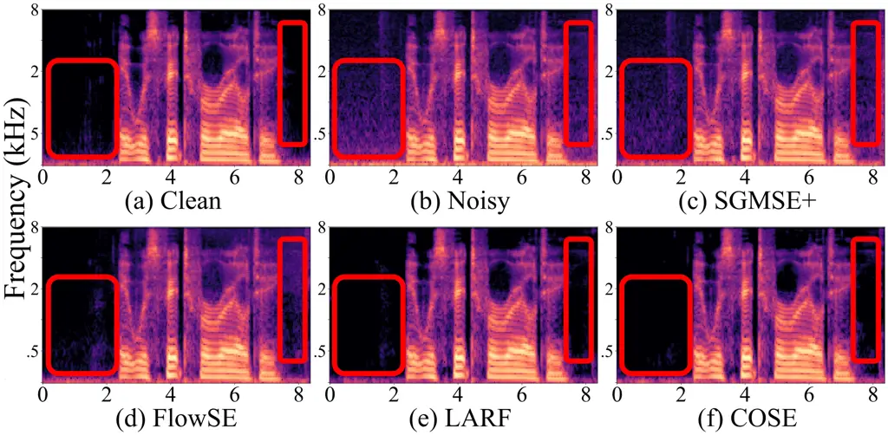

# Compose Yourself: Average-Velocity Flow Matching for One-Step Speech Enhancement

Gang Yang^(†)    Yue Lei^(†)    Wenxin Tai^(†)    Jin Wu^(†)    Jia
Chen^(†)    Ting Zhong^(†)    Fan Zhou^(†)\sthanksCorresponding author

###### Abstract

Diffusion and flow matching (FM) models have achieved remarkable
progress in speech enhancement (SE), yet their dependence on multi-step
generation is computationally expensive and vulnerable to discretization
errors. Recent advances in one-step generative modeling, particularly
MeanFlow, provide a promising alternative by reformulating dynamics
through average velocity fields. In this work, we present COSE, a
one-step FM framework tailored for SE. To address the high training
overhead of Jacobian-vector product (JVP) computations in MeanFlow, we
introduce a velocity composition identity to compute average velocity
efficiently, eliminating expensive computation while preserving
theoretical consistency and achieving competitive enhancement quality.
Extensive experiments on standard benchmarks show that COSE delivers up
to 5x faster sampling and reduces training cost by 40%, all without
compromising speech quality. Code is available at
[https://github.com/ICDM-UESTC/COSE](https://github.com/ICDM-UESTC/COSE).

###### Index Terms: 

generative model, speech enhancement, flow matching, average velocity

^(†)^(†)address: ^(†) University of Electronic Science and Technology of
China, Chengdu, Sichuan, China

## 1 Introduction

Speech enhancement (SE) aims to restore clean speech signals from
recordings corrupted by noise, reverberation, and encoding
artifacts \[1\]. It benefits both human perception and downstream tasks
such as automatic speech recognition (ASR) \[2\]. Traditional methods
based on statistical signal processing have been widely studied, but
they often struggle to handle non-stationary or complex noise. The
advent of deep learning has since driven significant progress by
learning to directly map noisy speech to its clean counterpart \[3\].
Recently, generative models \[4, 5, 6\] have gained prominence,
excelling at capturing complex speech distributions and offering a
powerful approach that preserves both speech quality and
intelligibility.

Among generative models, diffusion and flow matching (FM) approaches
have emerged as promising solutions for speech enhancement,
demonstrating strong robustness to unseen noise \[6\] and are considered
promising solutions for speech enhancement \[7, 8, 9, 10, 11\].
Diffusion models use a forward stochastic differential equation (SDE) to
transform clean speech, FM models directly learn a deterministic
velocity field defined by an ordinary differential equation (ODE).
Despite their impressive performance, these models still face
challenges. Errors from large-step discretization degrade few-step
performance, and both approaches remain computationally costly, often
requiring five or more function evaluations (NFEs) during sampling \[12,
13, 14\].

Currently, a growing body of work has attempted to bridge this
efficiency gap through one-step generation techniques in FM \[15, 16\].
These methods avoid the error accumulation inherent in multi-step
generation \[17\] and are considered promising for improving
computational efficiency. Among these, the recently proposed MeanFlow
framework \[16\] is particularly notable. It provides an elegant
mathematical formulation of generative dynamics by introducing the
concept of average velocity over a time interval. This approach enables
direct one-step generation via learned velocity fields, which holds
great promise for multi-step generative speech enhancement by
significantly improving the efficiency of generation.

In this work, we propose COSE  (Compose velOcity in Speech Enhancement),
a framework that integrates Meanflow \[16\] into SE, enabling efficient,
one-step generation. Further, by leveraging the properties of ODEs, we
compute the average velocity via the velocity composition identity,
which avoids Jacobian–vector product (JVP) calculations and
substantially reduces training overhead. Specifically, we incorporate
Meanflow into SE by modeling the average velocity between two points on
a curved trajectory, enabling the model to generate clean speech in one
step. Building on this, we exploit the uniqueness property of ODEs to
decompose displacements into compositions of two segment velocities,
thereby eliminating the extra cost of direct JVP computations. Moreover,
we show that velocity composition yields an solution equivalent to other
one-step generation methods, consistent with the self-consistency
principle underlying the trajectory properties of flow matching.

Our main contributions are: (1) We introduce COSE, a novel framework
that integrates Meanflow into speech enhancement to enable efficient
one-step generation. (2) We analyze that JVP computation incurs
significant overhead. Instead, we leveraged ODE properties to calculate
average velocity, effectively avoiding JVP and its associated
computational cost. (3) Our extensive experiments on standard benchmarks
demonstrate that COSE achieves at least 5x faster sampling and reduces
GPU memory and training time by 40% compared to MeanFlow, while
maintaining equivalent performance.

## 2 Preliminary

### 2.1 Speech Enhancement

Speech enhancement (SE) improves intelligibility and quality by
suppressing noise while preserving natural speech characteristics. In
the single-channel setting, the noisy signal can be expressed as:

```math
\boldsymbol{y}=\boldsymbol{x}+\boldsymbol{n}, \tag{1}
```

where $`\boldsymbol{x}`$ is the clean speech and $`\boldsymbol{n}`$ is
additive noise. The objective is to estimate $`\boldsymbol{x}`$ from
$`\boldsymbol{y}`$.

Figure 1: Overview of velocity modeling. Left: Comparison between
instantaneous and average velocity. The green line represents a
generative trajectory between clean speech distribution and Gaussian
noise distribution. Right: An example of velocity composition identity.
For a midpoint $`m`$ between time steps $`t_{1}`$ and $`t_{2}`$, the two
sub-average velocities can synthesize the average velocity of the large
step.

### 2.2 Flow Matching for Speech Enhancement

Flow Matching (FM) models generative modeling as the learning of
continuous-time velocity fields. It aims to learn a continuous-time
trajectory $`\boldsymbol{x}_{t}\in\mathbb{R}^{d}`$, where $`t\in[0,1]`$
from a simple distribution to a complex clean speech distribution. A
linear interpolation trajectory is commonly employed to construct
intermediate states between a clean speech $`\boldsymbol{x}_{0}`$ and a
sample from the prior
$`\boldsymbol{x}_{1}\sim\mathcal{N}(0,\boldsymbol{\mathrm{I}})`$ \[18\]:

```math
\boldsymbol{x}_{t}=(1-t)\boldsymbol{x}_{0}+t\boldsymbol{x}_{1},\quad\boldsymbol{x}_{1}\sim\mathcal{N}(0,\boldsymbol{\mathrm{I}}), \tag{2}
```

which defines a conditional distribution
$`p_{t}(\boldsymbol{x}_{t}\mid\boldsymbol{x}_{0})`$ from which
intermediate states can be sampled explicitly. The evolution of
$`\boldsymbol{x}_{t}`$ is governed by a time-dependent instantaneous
velocity field $`v_{t}(\boldsymbol{x}_{t})`$, described by the following
ordinary differential equation (ODE):

```math
\frac{d\boldsymbol{x}_{t}}{dt}=v_{t}(\boldsymbol{x}_{t}),\quad t\in[0,1]. \tag{3}
```

Then a neural network
$`v_{\theta}(\boldsymbol{x}_{t},t,\boldsymbol{y})`$ is trained to
approximate the velocity field with the Conditional Flow Matching (CFM)
objective \[19\]:

```math
\mathcal{L}_{\text{CFM}}(\theta)=\mathbb{E}_{t\sim\mathcal{U}(0,1),\,\boldsymbol{x}_{0},\,\boldsymbol{x}_{1}\sim\mathcal{N}(0,I)}\left\|v_{\theta}(\boldsymbol{x}_{t},t,\boldsymbol{y})-(\boldsymbol{x}_{1}-\boldsymbol{x}_{0})\right\|^{2}, \tag{4}
```

where $`\boldsymbol{x}_{t}`$ is sampled from eq. 2 and
$`\boldsymbol{y}`$ represents the noisy speech.

During inference, eq. 3 is solved numerically using the Euler method
with trained $`v_{\theta}(\boldsymbol{x}_{t},t)`$ to generate clean
speech:

```math
\boldsymbol{x}_{t-\Delta t}=\boldsymbol{x}_{t}-\Delta t\,v_{\theta}(\boldsymbol{x}_{t},t,\boldsymbol{y}),\quad\forall t\in[0,1], \tag{5}
```

where $`\Delta t=1/N`$, and $`N`$ represents the number of function
evaluations (NFEs). By iteratively solving  eq. 5, the speech can be
refined from the noisy version to the clean version.

## 3 Methodology

In this section, we extend MeanFlow to speech enhancement and introduce
a velocity composition identity to avoid computationally expensive
operations. A overview of the velocity modeling approach is illustrated
in fig. 1.

### 3.1 MeanFlow for Speech Enhancement

Some recent work \[16, 15\] has observed that although the interpolated
trajectories are designed to be straight during training, FM models can
only predict the marginal velocity based on the current state during
inference, which will naturally cause the trajectory to bend and deviate
from the original straight line, leading one-step generation to fail
completely.

To address this challenge, MeanFlow builds an explicit model of the
average velocity between two points on curved trajectory \[16\], as
illustrated in fig. 1 left. Specifically, we first define the
displacement $`k(\boldsymbol{x}_{t_{1}},t_{1},t_{2},\boldsymbol{y})`$
between two time steps $`t_{1}`$ and $`t_{2}`$ as the integral of the
instantaneous velocity field over that time interval as:

```math
k(\boldsymbol{x}_{t_{1}},t_{1},t_{2},\boldsymbol{y})=\int_{t_{2}}^{t_{1}}v(\boldsymbol{x}_{\tau},\tau,\boldsymbol{y})d\tau, \tag{6}
```

where $`\boldsymbol{x}_{t_{1}}`$ represents intermediate states at time
step $`t`$, $`\boldsymbol{y}`$ represents noisy speech, and
$`v(\boldsymbol{x}_{\tau},\tau,\boldsymbol{y})`$ represents
instantaneous velocity. The average velocity
$`u(\boldsymbol{x}_{t_{1}},t_{1},t_{2},\boldsymbol{y})`$ is then defined
as this displacement divided by the time interval:

```math
u(\boldsymbol{x}_{t_{1}},t_{1},t_{2},\boldsymbol{y})\triangleq\frac{k(\boldsymbol{x}_{t_{1}},t_{1},t_{2},\boldsymbol{y})}{t_{1}-t_{2}}=\frac{1}{t_{1}-t_{2}}\int_{t_{2}}^{t_{1}}v(\boldsymbol{x}_{\tau},\tau,\boldsymbol{y})d\tau. \tag{7}
```

By differentiating both sides of the equation with respect to $`t_{1}`$
simultaneously, this identity can be transformed into:

```math
u(\boldsymbol{x}_{t_{1}},t_{1},t_{2},\boldsymbol{y})=v(\boldsymbol{x}_{t},t_{1},\boldsymbol{y})-(t_{1}-t_{2})\frac{d}{dt_{1}}u(\boldsymbol{x}_{t_{1}},t_{1},t_{2},\boldsymbol{y}), \tag{8}
```

where
$`\frac{d}{dt_{1}}u(\boldsymbol{x}_{t_{1}},t_{1},t_{2},\boldsymbol{y})`$
denotes the total derivative of the average velocity function $`u`$ with
respect to time $`t_{1}`$.

According to eq. 8, we can train a neural network
$`u_{\theta}(\boldsymbol{x}_{t_{1}},t_{1},t_{2},\boldsymbol{y})`$ to
directly model this average velocity field. The training objective
encourages the network to satisfy the MeanFlow Identity:

```math
\mathcal{L}(\theta)=\mathbb{E}_{\boldsymbol{x}_{0},\boldsymbol{y},t_{1},t_{2}}\left\|u_{\theta}(\boldsymbol{x}_{t_{1}},t_{1},t_{2},\boldsymbol{y})-\text{sg}\left(u_{\text{tgt}}\right)\right\|_{2}^{2}, \tag{9}
```

where
$`u_{\text{tgt}}=v(\boldsymbol{x}_{t_{1}},t_{1},\boldsymbol{y})-(t_{1}-t_{2})\frac{d}{d{t_{1}}}u_{\theta}(\boldsymbol{x}_{t_{1}},t_{1},t_{2},\boldsymbol{y})`$.
Following \[16\], we adopt the stop-gradient operation, denoted as
$`\text{sg}(\cdot)`$, and replace
$`v(\boldsymbol{x}_{t_{1}},t_{1},\boldsymbol{y})`$ with
$`\boldsymbol{x}_{1}-\boldsymbol{x}_{0}`$.

In eq. 9,
$`\frac{d}{dt_{1}}u_{\theta}(\boldsymbol{x}_{t_{1}},t_{1},t_{2},\boldsymbol{y})`$
is computed as the Jacobian–vector product (JVP) between
$`[\partial_{x}u,\partial_{t_{1}}u,\partial_{t_{2}}u,\partial_{y}u]`$
and the tangent vector $`[v,1,0,0]`$, which can be implemented via
PyTorch’s JVP function. However, MeanFlow’s reliance on JVP incurs
significant overhead, limiting training efficiency.

### 3.2 Revisiting ODE Properties for Efficient Training

Computational Overhead of JVP. The JVP computes the directional
derivative of a function along a given tangent vector. Modern automatic
differentiation frameworks, such as PyTorch \[20\], use dual numbers to
efficiency implement it as:

```math
\displaystyle u(\boldsymbol{x}_{t_{1}}+\boldsymbol{v}\delta,\,t_{1}+\delta,\,t_{2},\,\boldsymbol{y})=u(\boldsymbol{x}_{t_{1}},t_{1},t_{2},\boldsymbol{y})+\left(\frac{\partial u}{\partial\boldsymbol{x}_{t_{1}}}\!\cdot\!\boldsymbol{v}+\frac{\partial u}{\partial t_{1}}\right)\!\delta,
```

where $`\delta`$ is an infinitesimal for differentiation, and
$`u(\boldsymbol{x}_{t_{1}},t_{1},t_{2},\boldsymbol{y})`$ corresponds to
the forward output, and the second term corresponds to the JVP result.
This approach requires only a single forward pass and theoretically
introduces a slight computational cost. However, in practice,
maintaining dual-numbered computations incurs memory allocations,
additional arithmetic operations, and expanded computation graphs,
leading to noticeable computational and memory costs \[21\].
Furthermore, JVP implementations differ across frameworks (e.g., PyTorch
vs. JAX), adding development complexity and reducing portability. To
address these limitations, we revisit the MeanFlow training method and
propose a general solution that entirely circumvents JVP, achieving
efficient and memory-friendly training.

Velocity Composition of ODE. Inspired by previous work \[15, 17\], we
derive a more general training framework for one-step generative models
from the fundamental perspective of the uniqueness of ODE solutions.
This framework allows us to bypass costly JVP computations.
Specifically, the ODE describes the deterministic evolution of a system.
In line with previous studies \[19, 22\], we assume that the
instantaneous velocity field is locally Lipschitz continuous in the
region traversed by the generated trajectories, denoted as
$`\mathcal{X}_{t}`$:

```math
\forall\boldsymbol{x}_{1},\boldsymbol{x}_{2}\in\mathcal{X}_{t},\quad\|v(\boldsymbol{x}_{1},\tau,\boldsymbol{y})-v(\boldsymbol{x}_{2},\tau,\boldsymbol{y})\|\leq L\|\boldsymbol{x}_{1}-\boldsymbol{x}_{2}\|, \tag{10}
```

where $`\mathcal{X}_{t}`$ represents the set of states visited by the
ODE solution during generation. Under this Lipschitz condition, the ODE
satisfies the semigroup property \[23\]: its evolution from time
$`t_{2}`$ to $`t_{1}`$ can be decomposed into a two-step process, first
from $`t_{2}`$ to an intermediate time $`m`$, and then from $`m`$ to
$`t_{1}`$. This can be formalized as:

```math
\displaystyle\Phi_{t_{2}\to t_{1}} \displaystyle=\Phi_{m\to t_{1}}\circ\Phi_{t_{2}\to m},\quad s=t_{2}+\alpha(t_{1}-t_{2}), \tag{11}
```

where $`\Phi_{m\to t_{1}}`$ is the evolution operator, namely
$`\Phi_{t_{2}\to t_{1}}(\boldsymbol{x}_{t_{2}})=\boldsymbol{x}_{t_{1}}`$
and $`\alpha\in[0,1]`$, which maps the state at time $`t_{2}`$ to its
corresponding state at time $`t_{1}`$ along the ODE trajectory.
Consequently, the total displacement can be expressed as the sum of two
sub-displacements:

```math
k(\boldsymbol{x}_{t_{1}},t_{1},t_{2},\boldsymbol{y})=k(\boldsymbol{x}_{t_{1}},t_{1},m,\boldsymbol{y})+k(\boldsymbol{x}_{m},m,t_{2},\boldsymbol{y}), \tag{12}
```

According to the definition in eq. 7 and  eq. 12, we can further
transform them into the following interpolation identity:

```math
\begin{split}u(\boldsymbol{x}_{t_{1}},t_{1},t_{2},\boldsymbol{y})&=u(\boldsymbol{x}_{m},m,t_{2},\boldsymbol{y})\\
\quad+&\alpha(u(\boldsymbol{x}_{t_{1}},t_{1},m,\boldsymbol{y})-u(\boldsymbol{x}_{m},m,t_{2},\boldsymbol{y})),\end{split} \tag{13}
```

which can be interpreted as the velocity composition identity, combining
two velocities into one, as shown in fig. 1 right. Here, the parameter
$`\alpha`$ is randomly sampled from $`[0,1]`$, encouraging the model to
learn consistency across different temporal granularities during
training. Based on eq. 13, we train the loss fuction of COSE without
requiring expensive JVP operations as:

```math
\mathcal{L}_{\text{COSE}}(\theta)=\mathbb{E}_{t,\boldsymbol{x}_{t},\boldsymbol{y}}\left\|u_{\theta}(\boldsymbol{x}_{t_{1}},t_{1},t_{2},\boldsymbol{y})-\text{sg}\left(u_{\text{tgt}}\right)\right\|_{2}^{2}, \tag{14}
```

where $`\text{sg}(\cdot)`$ denotes the stop-gradient operator
following \[16\] and $`u_{\text{tgt}}`$ defined as:

```math
u_{\text{tgt}}=u_{\theta}(\boldsymbol{x}_{m},m,t_{2},\boldsymbol{y})+\alpha(u_{\theta}(\boldsymbol{x}_{t_{1}},t_{1},m,\boldsymbol{y})-u_{\theta}(\boldsymbol{x}_{m},m,t_{2},\boldsymbol{y})).
```

The overall training procedure is summarized in  algorithm 1.

Beyond this, we establish a connection between velocity composition
identity and self-consistency loss functions, ensuring the learning of a
self-consistent and unidirectional average velocity field. Specifically,
we divide the time interval $`[t_{2},t_{1}]`$ into two steps based on
intermediate point $`m`$ and let $`d_{1}=t_{1}-m`$ and $`d_{2}=m-t_{2}`$
represent the time intervals between $`t_{1}`$, $`m`$, and $`t_{2}`$.
Based on this,  eq. 13 can be transformed into:

```math
\begin{split}u_{\theta}(\boldsymbol{x}_{t_{1}},t_{1},t_{2},\boldsymbol{y})&=\alpha\cdot u(\boldsymbol{x}_{t_{1}},t_{1},t_{1}-d_{1},\boldsymbol{y})\\
\quad+&(1-\alpha)\cdot u(\boldsymbol{x}_{t_{1}-d_{1}},t_{1}-d_{1}-d_{2},\boldsymbol{y}),\\
\end{split} \tag{15}
```

where
$`\boldsymbol{x}_{t_{1}-d_{1}}=\boldsymbol{x}_{t_{1}}-u_{\theta}(\boldsymbol{x}_{t_{1}},t_{1},d_{1},\boldsymbol{y})`$.
We observe that eq. 15 is algebraically equivalent to the
self-consistency identity in  \[15, eq. (4)\], which enables propagating
generation across step scales (multi→few→one) and joint end-to-end
training \[17\]. COSE builds on this principle to provide a flexible and
general framework that accommodates arbitrary time intervals and diverse
evolution patterns.

0:  Neural network $`u_{\theta}`$, a batch of clean data $`x`$ and noisy
data $`\boldsymbol{y}`$, optimizer.

1:  Sample time points $`t_{2},t_{1}`$ such that
$`0\leq t_{2}\leq t_{1}\leq 1`$.

2:  Sample $`\alpha\sim\mathcal{U}(0,1)`$, set
$`m=t_{1}+\alpha(t_{2}-t_{1})`$.

3:  Sample prior $`\epsilon\sim\mathcal{N}(0,I)`$.

4:  Construct flow path point at time $`t`$:
$`\boldsymbol{x}_{t_{1}}=(1-t_{1})x+t_{1}\epsilon`$.

5:  $`u_{2}=u_{\theta}(\boldsymbol{x}_{t_{1}},t_{1},m,\boldsymbol{y})`$,
$`\boldsymbol{x}_{m}=\boldsymbol{x}_{t_{1}}-(t_{1}-m)u_{2}`$.

6:  $`u_{1}=u_{\theta}(\boldsymbol{x}_{m},m,t_{2},\boldsymbol{y})`$,
$`\boldsymbol{x}_{t_{2}}=\boldsymbol{x}_{m}-(m-t_{2})u_{1}`$.

7:
 $`u_{t_{1}t_{2}}=u_{\theta}(\boldsymbol{x}_{t_{1}},t_{1},t_{2},\boldsymbol{y})`$,
$`u_{\text{tgt}}=u_{1}+\alpha(u_{2}-u_{1})`$

8:  Update $`\theta`$ via
$`\nabla_{\theta}\mathcal{L}_{\text{COSE}},\mathcal{L}_{\text{COSE}}=\|u_{t_{1}t_{2}}-\text{sg}(u_{\text{tgt}})\|_{2}^{2}`$

Algorithm 1 COSE Training Algorithm

## 4 Experiments

|               |     |                   |              |                  |             |                  |                     |                     |                    |                    |                    |
| ------------- | --- | ----------------- | ------------ | ---------------- | ----------- | ---------------- | ------------------- | ------------------- | ------------------ | ------------------ | ------------------ |
| Method        | NFE | VoiceBank- DEMAND |              |                  |             |                  | CHiME-4             |                     |                    |                    |                    |
|               |     | PESQ              | ESTOI        | SI-SDR           | SI-SIR      | SI-SAR           | PESQ                | ESTOI               | SI-SDR             | SI-SIR             | SI-SAR             |
| Mixture       | -   | 1.97^(±0.75)      | 0.79^(±0.15) | 8.4^(±5.6)       | 8.5^(±5.6)  | 47.5^(±10.4)     | 1.27^(±0.16)        | 0.68^(±0.08)        | 7.5^(±2.1)         | 7.5^(±2.1)         | 46.7^(±10.3)       |
| NCSN++ \[8\]  | 1   | 2.87^(±0.74)      | 0.87^(±0.10) | 19.1^(±3.5)      | 31.5^(±7.2) | 20.0^(±3.5)      | 1.27^(±0.16)        | 0.68^(±0.08)        | 7.4^(±2.1)         | 7.4^(±2.1)         | 42.4^(±5.4)        |
| SGMSE+ \[8\]  | 15  | 2.80^(±0.58)      | 0.86^(±0.10) | 17.2^(±3.6)      | 26.9^(±5.2) | 17.9^(±3.5)      | 1.82^(±0.29)        | 0.82^(±0.07)        | 13.5^(±2.3)        | 25.2^(±3.4)        | 13.9^(±2.2)        |
| SGMSE+ \[8\]  | 5   | 1.15^(±0.08)      | 0.63^(±0.10) | 7.9^(±1.8)       | 18.6^(±4.1) | 8.4^(±1.6)       | 1.09^(±0.04)        | 0.58^(±0.09)        | 5.3^(±1.6)         | 15.2^(±2.1)        | 5.8^(±1.6)         |
| SGMSE+ \[8\]  | 1   | 1.06^(±0.10)      | 0.02^(±0.02) | $`-`$25.3^(±1.7) | 23.3^(±9.9) | $`-`$25.3^(±1.7) | 1.08^(±0.14)        | 0.02^(±0.02)        | $`-`$26.6^(±1.2)   | 22.8^(±8.9)        | $`-`$26.6^(±1.2)   |
| StoRM \[24\]  | 15  | 2.77^(±0.57)      | 0.87^(±0.10) | 18.5^(±3.3)      | 30.9^(±6.7) | 19.1^(±3.3)      | 1.82^(±0.30)        | 0.84^(±0.06)        | $`14.5^{\pm 2.2}`$ | $`26.0^{\pm 3.8}`$ | $`14.8^{\pm 2.2}`$ |
| StoRM \[24\]  | 5   | 1.25^(±0.09)      | 0.70^(±0.10) | 11.5^(±1.4)      | 29.8^(±6.1) | 11.6^(±1.4)      | $`1.19^{\pm 0.08}`$ | $`0.72^{\pm 0.08}`$ | $`9.9^{\pm 1.6}`$  | $`24.5^{\pm 3.3}`$ | $`10.0^{\pm 1.6}`$ |
| StoRM \[24\]  | 1   | 1.04^(±0.02)      | 0.10^(±0.03) | $`-`$16.9^(±1.5) | 22.2^(±7.0) | $`-`$16.9^(±1.5) | $`1.05^{\pm 0.12}`$ | $`0.10^{\pm 0.03}`$ | $`-`$17.7^(±1.1)   | 18.3^(±3.4)        | $`-`$17.7^(±1.1)   |
| VPIDM \[9\]   | 15  | 2.92^(±0.61)      | 0.87^(±0.10) | 18.8^(±2.5)      | 28.4^(±5.3) | 19.4^(±1.9)      | $`1.67^{\pm 0.20}`$ | 0.80^(±0.07)        | 14.2^(±1.9)        | $`23.2^{\pm 2.9}`$ | 13.5^(±2.9)        |
| VPIDM \[9\]   | 5   | 1.85^(±0.12)      | 0.83^(±0.10) | 14.6^(±2.1)      | 17.7^(±3.9) | 14.9^(±1.6)      | $`1.03^{\pm 0.01}`$ | 0.33^(±0.07)        | $`-`$6.7^(±1.5)    | $`12.2^{\pm 1.8}`$ | $`-`$6.6^(±1.5)    |
| VPIDM \[9\]   | 1   | 1.04^(±0.01)      | 0.29^(±0.06) | $`-`$7.2^(±1.5)  | 14.3^(±3.7) | $`-`$7.2^(±1.5)  | $`1.04^{\pm 0.01}`$ | 0.29^(±0.06)        | $`-`$7.2^(±1.5)    | $`14.3^{\pm 3.7}`$ | $`-`$7.2^(±1.5)    |
| FlowSE \[19\] | 5   | 2.96^(±0.73)      | 0.87^(±0.10) | 18.8^(±3.5)      | 31.7^(±7.0) | 19.8^(±3.5)      | 1.73^(±0.31)        | 0.84^(±0.06)        | 14.2^(±2.3)        | 24.3^(±3.5)        | 14.7^(±2.3)        |
| FlowSE \[19\] | 1   | 1.37^(±0.15)      | 0.74^(±0.10) | 12.1^(±2.0)      | 22.2^(±4.6) | 12.7^(±1.7)      | 1.06^(±0.03)        | 0.53^(±0.09)        | 2.0^(±1.5)         | 16.1^(±2.3)        | 2.1^(±1.5)         |
| LARF \[14\]   | 5   | 2.98^(±0.75)      | 0.87^(±0.10) | 18.8^(±3.4)      | 26.6^(±7.4) | 20.2^(±3.5)      | 1.67^(±0.27)        | 0.84^(±0.07)        | 14.8^(±2.4)        | 25.7^(±3.8)        | 15.2^(±2.3)        |
| LARF \[14\]   | 1   | 2.97^(±0.70)      | 0.87^(±0.10) | 19.2^(±3.7)      | 26.4^(±5.6) | 20.7^(±3.7)      | 1.66^(±0.28)        | 0.83^(±0.07)        | 14.5^(±2.3)        | 25.6^(±3.8)        | 15.5^(±2.3)        |
| COSE          | 1   | 3.02^(±0.74)      | 0.87^(±0.10) | 19.3^(±3.4)      | 31.7^(±6.2) | 19.8^(±3.5)      | 1.76^(±0.29)        | 0.84^(±0.07)        | 14.3^(±2.5)        | 26.1^(±3.7)        | 14.6^(±2.4)        |

Table 1: Speech enhancement results on VoiceBank-DEMAND and ChiME-4
datasets. All experimental results are presented as mean $`\pm`$
standard deviation. The best results are highlighted in bold.

| Method   | PESQ         | ESTOI        | SI-SDR      | Time (ms/step) | Memory |
| -------- | ------------ | ------------ | ----------- | -------------- | ------ |
| NCSN++   | 2.87^(±0.74) | 0.87^(±0.10) | 19.1^(±3.5) | 70             | 3733   |
| FlowSE   | 1.25^(±0.11) | 0.71^(±0.10) | 10.8^(±2.0) | 70             | 3733   |
| MeanFlow | 3.00^(±0.73) | 0.87^(±0.10) | 19.1^(±3.4) | 195            | 14005  |
| COSE     | 3.02^(±0.74) | 0.87^(±0.10) | 19.3^(±3.4) | 112            | 8441   |

Table 2: Performance and training overhead of one-step generation.

### 4.1 Experimental Settings

Datasets. Our method is evaluated on the VoiceBank-DEMAND (VBD) \[25\]
and CHiME-4 \[26\] datasets. The VBD training set contains recordings
from 28 speakers (14 female, 14 male) with 8 noise types. For testing,
we use the VBD test set with two unseen speakers and two new noise
types. For a robust cross-dataset evaluation, we follow \[6, 11\] and
use the fifth-microphone recordings from CHiME-4, which feature
real-world noise from four environments: street, walking area,
cafeteria, and bus.

Implementation Details. Following previous work \[16\], we extend the
NCSN++ architecture with a Fourier-embedded channel and concatenated
$`(t_{1},t_{2})`$ steps to model average velocity, with negligible
parameter overhead. We also adopt the same training setup: sampling
timestep from a $`\mathrm{lognorm}(-0.4,1.0)`$, setting $`t_{2}=t_{1}`$
with 50% probability, and using the adaptive L2 loss
$`\mathcal{L}=w|\Delta|_{2}^{2\gamma}`$, where
$`w=1/(|\Delta|_{2}^{2}+c)^{p}`$ and $`c=10^{-3}`$.

Metrics. We quantitatively evaluate performance using several standard
metrics: Perceptual Evaluation of Speech Quality (PESQ) \[27\] for
perceived quality, Extended Short-Time Objective Intelligibility
(ESTOI) \[28\] for intelligibility, and the scale-invariant measures
SI-SDR, SI-SIR, and SI-SAR \[29\].

Configurations. We follow \[8\] in using the same backbone and audio
preprocessing, applying a 512-sample STFT with a 128-sample hop to
obtain 256 frequency bins. Models are trained for 200 epochs on a single
NVIDIA 4090 GPU with a learning rate of $`5\times 10^{-5}`$.

Baselines. We compare our proposed methodology with three baseline
models: SGMSE+ \[8\], StoRM \[24\], VPIDM \[9\], FlowSE \[13, 30\],
LARF \[14\]. For FlowSE, we adopt the method from two concurrent
conference works \[13, 30\] and re-implement it following the diffusion
schedule and architecture in \[19, 13\], as we did not reproduce the
reported results in our setting using the available implementation.
Following prior work \[9\], we also incorporate the NCSN++ \[8\]
architecture as a discriminative model in our comparisons.

### 4.2 Experimental Results

Overall Performance. Table 1 summarizes COSE’s speech enhancement
results on VBD and CHiME-4 datasets, compared with a range of
diffusion-based and flow-matching baselines. In terms of overall
performance, COSE achieves superior one-step generation: on VBD, it
outperforms diffusion models such as SGMSE+ \[8\], StoRM \[24\], and
VPIDM \[9\] even when with 15 steps, and it also surpasses advanced
flow-matching methods such as FlowSE \[13, 30, 19\] and LARF \[14\]. On
CHiME-4, COSE remains competitive, confirming its robustness under
diverse acoustic conditions.

Table 1 also provides detailed results across different sampling steps
for diffusion-based and FM baselines. It reveals that diffusion-based
baselines maintain acceptable quality at 15 steps but degrade rapidly as
the step count decreases, with one-step PESQ collapsing to around 1.0.
Similarly, FlowSE \[19\], which models instantaneous velocities, fails
entirely in one-step generation because the large-step discretization
leads to severe trajectory deviation. In contrast, COSE consistently
produces high-quality results in just one step and surpasses
LARF \[14\]. These embody the ability of average velocity modeling to
reduce cumulative errors and generate in one step.

Ablation Study. Table 2 summarizes the one-step performance and training
overhead of different methods.The result shows that although MeanFlow is
effective, it incurs substantial computational overhead: each training
step takes 195ms and consumes 14,005MB of GPU memory, approximately
2.75× higher than that of NCSN++ and FlowSE, significantly limiting its
practicality. In contrast, COSE adopts the velocity composition identity
in place of the MeanFlow identity, effectively avoiding the costly JVP
operations. This leads to a notable reduction in training overhead, with
training time reduced by approximately 43% and GPU memory usage by about
40%, while further improving performance. Although COSE has less
training overhead than MeanFlow, its cost remains higher than NCSN++ due
to two additional forward per training step.

Case Study. Figure 2 shows a visual case, where red rectangles
demonstrate that COSE outperforms other baseline models in noise removal
while preserving speech details. This advantage originates from COSE’s
one-step generation capability, which avoids cumulative errors and
improves generation quality.



Figure 2: Visualization of magnitude spectrum.

## 5 Conclusion

In this work, we proposed COSE, an one-step flow matching framework that
aims to guide speech enhancement process with average velocity. Our
method circumvents costly JVP computations by leveraging a velocity
composition identity. This approach significantly reduces training
overhead and provides a solution equivalent to other one-step generation
methods. Experiments on standard benchmarks demonstrate that COSE
achieves competitive enhancement quality with significantly improved
efficiency, showing the promise of one-step flow matching for practical
SE applications. We hope this work encourages further development of
one-step generation in SE. In future work, we plan to explore the
generalization of our approach across a broader range of model
architectures and datasets.

## References

- \[1\] J. S. Lim and A. V. Oppenheim, “Enhancement and bandwidth
  compression of noisy speech,” Proceedings of the IEEE, vol. 67, no.
  12, pp. 1586–1604, 2005.
- \[2\] B. Li, A. Gulati, J. Yu, T. N. Sainath, C.-C. Chiu,
  A. Narayanan, S.-Y. Chang, R. Pang, Y. He, J. Qin, et al., “A better
  and faster end-to-end model for streaming ASR,” in IEEE International
  Conference on Acoustics, Speech, and Signal Processing (ICASSP). IEEE,
  2021, pp. 5634–5638.
- \[3\] C. Zheng, H. Zhang, W. Liu, X. Luo, A. Li, X. Li, and B. C. J.
  Moore, “Sixty years of frequency-domain monaural speech enhancement:
  From traditional to deep learning methods,” Trends in Hearing, vol.
  27, 2023.
- \[4\] Y. Tsao, P. Plantinga, M. Ravanelli, S.-W. Fu, C. Yu, T.-A.
  Hsieh, and X. Lu, “MetricGAN+: An improved version of MetricGAN for
  speech enhancement,” Interspeech, 2021.
- \[5\] B. Kang, X. Zhu, Z. Zhang, Z. Ye, M. Liu, Z. Wang, Y. Zhu,
  G. Ma, J. Chen, L. Xiao, C. Weng, W. Xue, and L. Xie, “LLaSE-G1:
  Incentivizing generalization capability for LLaMA-based speech
  enhancement,” in Annual Meeting of the Association for Computational
  Linguistics (ACL), 2025.
- \[6\] Y.-J. Lu, Z.-Q. Wang, S. Watanabe, A. Richard, C. Yu, and
  Y. Tsao, “Conditional diffusion probabilistic model for speech
  enhancement,” in IEEE International Conference on Acoustics, Speech,
  and Signal Processing (ICASSP). IEEE, 2022, pp. 1–5.
- \[7\] H. Yen, F. G. Germain, G. Wichern, and J. Le Roux, “Cold
  diffusion for speech enhancement,” in IEEE International Conference on
  Acoustics, Speech, and Signal Processing (ICASSP). IEEE, 2023, pp.
  1–5.
- \[8\] J. Richter, S. Welker, J.-M. Lemercier, B. Lay, and T. Gerkmann,
  “Speech enhancement and dereverberation with diffusion-based
  generative models,” IEEE/ACM Transactions on Audio, Speech, and
  Language Processing, vol. 31, pp. 2351–2364, 2023.
- \[9\] Z. Guo, Q. Wang, J. Du, J. Pan, Q.-F. Liu, and C.-H. Lee, “A
  variance-preserving interpolation approach for diffusion models with
  applications to single channel speech enhancement and recognition,”
  IEEE/ACM Transactions on Audio, Speech, and Language Processing, 2024.
- \[10\] P. Gonzalez, Z.-H. Tan, J. Østergaard, J. Jensen, T. S.
  Alstrøm, and T. May, “Investigating the design space of diffusion
  models for speech enhancement,” IEEE/ACM Transactions on Audio,
  Speech, and Language Processing, 2024.
- \[11\] W. Tai, Y. Lei, F. Zhou, G. Trajcevski, and T. Zhong, “DOSE:
  Diffusion dropout with adaptive prior for speech enhancement,” in
  Advances in Neural Information Processing Systems (NeurIPS), 2024,
  vol. 36.
- \[12\] R. Korostik, R. Nasretdinov, and A. Jukić, “Modifying flow
  matching for generative speech enhancement,” in IEEE International
  Conference on Acoustics, Speech, and Signal Processing (ICASSP). IEEE,
  2025, pp. 1–5.
- \[13\] S. Lee, S. Cheong, S. Han, and J. W. Shin, “FlowSE: Flow
  matching-based speech enhancement,” in IEEE International Conference
  on Acoustics, Speech, and Signal Processing (ICASSP). IEEE, 2025, pp.
  1–5.
- \[14\] Z. Li and N. Inoue, “Locally aligned rectified flow model for
  speech enhancement towards single-step diffusion,” in Proc.
  Interspeech, 2024, pp. 2195–2199.
- \[15\] K. Frans, D. Hafner, S. Levine, and P. Abbeel, “One step
  diffusion via shortcut models,” in International Conference on
  Learning Representations (ICLR), 2025.
- \[16\] Z. Geng, M. Deng, X. Bai, J. Z. Kolter, and K. He, “Mean flows
  for one-step generative modeling,” arXiv preprint, 2025.
- \[17\] L. Yang, Z. Zhang, Z. Zhang, X. Liu, M. Xu, W. Zhang, C. Meng,
  S. Ermon, and B. Cui, “Consistency flow matching: Defining straight
  flows with velocity consistency,” arXiv preprint, 2024.
- \[18\] X. Liu, C. Gong, and Q. Liu, “Flow straight and fast: Learning
  to generate and transfer data with rectified flow,” in International
  Conference on Learning Representations (ICLR), 2023.
- \[19\] Y. Lipman, R. T. Q. Chen, H. Ben-Hamu, M. Nickel, and M. Le,
  “Flow matching for generative modeling,” in International Conference
  on Learning Representations (ICLR), 2023.
- \[20\] A. Paszke, S. Gross, S. Chintala, G. Chanan, E. Yang,
  Z. DeVito, Z. Lin, A. Desmaison, L. Antiga, and A. Lerer, “Automatic
  differentiation in pytorch,” in NIPS 2017 Autodiff Workshop, 2017.
- \[21\] A. G. Baydin, B. A. Pearlmutter, A. A. Radul, and J. M.
  Siskind, “Automatic differentiation in machine learning: a survey,”
  Journal of machine learning research, pp. 1–43, 2018.
- \[22\] L. Li, S. Hurault, and J. M. Solomon, “Self-consistent velocity
  matching of probability flows,” in Advances in Neural Information
  Processing Systems (NeurIPS), 2023, vol. 36, pp. 57038–57057.
- \[23\] G. Teschl, Ordinary differential equations and dynamical
  systems, vol. 140, American Mathematical Soc., 2012.
- \[24\] J.-M. Lemercier, J. Richter, S. Welker, and T. Gerkmann,
  “StoRM: A diffusion-based stochastic regeneration model for speech
  enhancement and dereverberation,” IEEE/ACM Transactions on Audio,
  Speech, and Language Processing, vol. 31, pp. 2724–2737, 2023.
- \[25\] C. Veaux, J. Yamagishi, and S. King, “The voice bank corpus:
  Design, collection and data analysis of a large regional accent speech
  database,” in International Conference Oriental COCOSDA. IEEE, 2013,
  pp. 1–4.
- \[26\] E. Vincent, S. Watanabe, A. A. Nugraha, J. Barker, and
  R. Marxer, “An analysis of environment, microphone and data simulation
  mismatches in robust speech recognition,” Computer Speech & Language,
  vol. 46, pp. 535–557, 2017.
- \[27\] A. W. Rix, J. G. Beerends, M. P. Hollier, and A. P. Hekstra,
  “Perceptual evaluation of speech quality (PESQ) - a new method for
  speech quality assessment of telephone networks and codecs,” in IEEE
  International Conference on Acoustics, Speech, and Signal Processing
  (ICASSP), 2001, pp. 749–752.
- \[28\] J. Jensen and C. H. Taal, “An algorithm for predicting the
  intelligibility of speech masked by modulated noise maskers,” IEEE/ACM
  Transactions on Audio, Speech, and Language Processing, vol. 24, no.
  11, pp. 2009–2022, 2016.
- \[29\] J. Le Roux, S. Wisdom, H. Erdogan, and J. R. Hershey,
  “SDR–half-baked or well done?,” in IEEE International Conference on
  Acoustics, Speech, and Signal Processing (ICASSP). IEEE, 2019, pp.
  626–630.
- \[30\] Z. Wang, Z. Liu, X. Zhu, Y. Zhu, M. Liu, J. Chen, L. Xiao,
  C. Weng, and L. Xie, “FlowSE: Efficient and high-quality speech
  enhancement via flow matching,” in Proc. Interspeech, 2025, pp.
  4858–4862.
