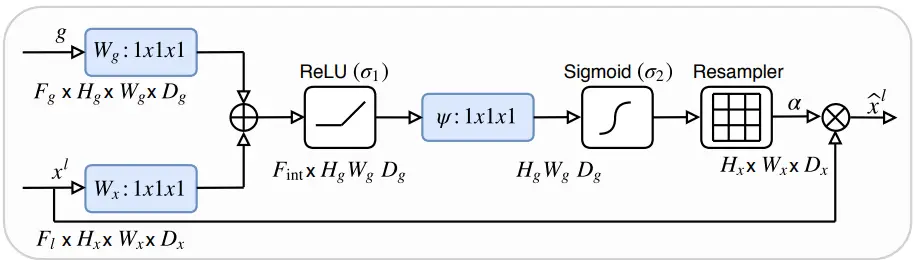
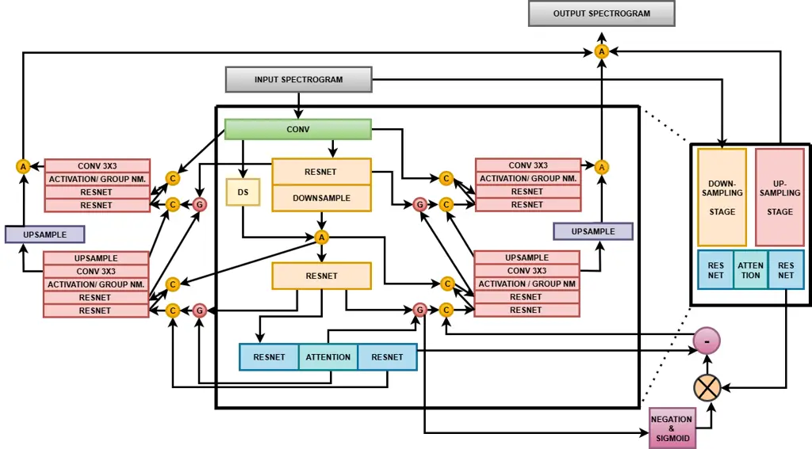
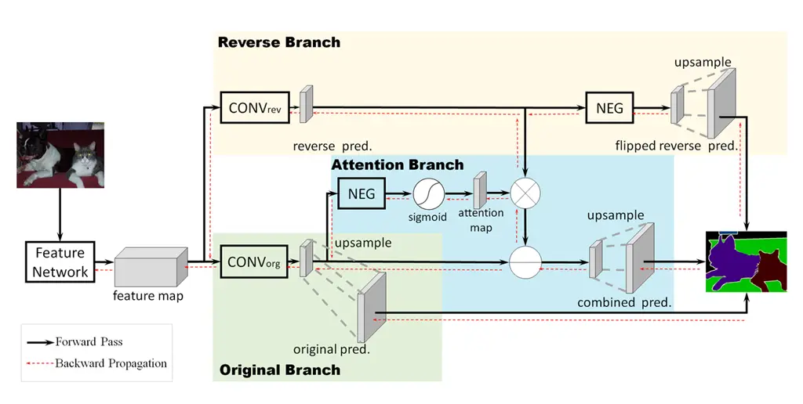
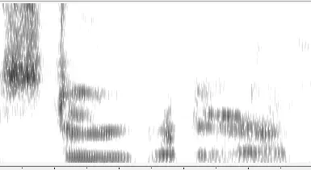
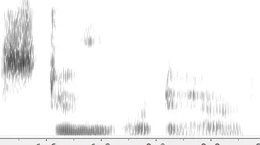

# Reverse Attention for Lightweight Speech Enhancement on Edge Devices

Shuubham Ojha    Felix Gervits    Carol Espy-Wilson

###### Abstract

This paper introduces a lightweight deep learning model for real-time
speech enhancement, designed to operate efficiently on
resource-constrained devices. The proposed model leverages a compact
architecture that facilitates rapid inference without compromising
performance. Key contributions include infusing soft attention-based
attention gates in the U-Net architecture which is known to perform well
for segmentation tasks and is optimized for GPUs. Experimental
evaluations demonstrate that the model achieves competitive speech
quality and intelligibility metrics, such as PESQ and Word Error Rates
(WER), improving the performance of similarly sized baseline models. We
are able to achieve a 6.24% WER improvement and a 0.64 PESQ score
improvement over un-enhanced waveforms.

###### Index Terms: 

speech enhancement, predictive models, edge devices, real time
processing

^(†)^(†)address: ¹ Dept. of Electrical and Computer Engineering  
University of Maryland, College Park, MD, USA ² DEVCOM, Army Research
Lab,  
Boston, MA, USA

## 1  Introduction

^(†)^(†)footnotetext: This material is based on research that is in part
supported by the Army Research Laboratory, Grant No. W911NF2120076.

Real-time speech enhancement is a critical component in numerous
applications, including mobile communication, hearing aids, and
voice-controlled systems. The primary objective is to improve the
intelligibility and quality of speech signals by reducing background
noise and reverberation, thus facilitating clearer communication in
challenging acoustic environments. Achieving this in real time
necessitates the development of lightweight models capable of processing
audio streams with minimal latency and computational overhead. Recent
advancements have led to the emergence of compact deep learning
architectures tailored for real-time speech enhancement. One such system
is Deep Filter Net 3 \[1\] with 2.3 M parameters \[2\] which is designed
to have low processing times for use in hearing aids.

The significance of real-time speech enhancement extends beyond mere
noise reduction. In mobile communication, background noise can severely
degrade speech intelligibility, leading to misunderstandings and
communication breakdown. In hearing aids, real-time processing is
essential to adapt to dynamic acoustic environments, ensuring users
receive clear and intelligible speech. Furthermore, in applications such
as voice-controlled systems and automatic speech recognition, real-time
enhancement is crucial to maintain system responsiveness and accuracy.

This paper explores the use of the Attention Gating (AG) mechanism to
extract coarse scale information for use in gating to disambiguate
irrelevant and noisy responses in skip connections. We also explore the
use of reverse attention (RA) networks for speech enhancement. RA is an
advanced mechanism that encourages neural networks to focus on the less
confident or misclassified regions of a feature map by explicitly
attending to the complement of the current attention response. Unlike
traditional attention, which enhances the most salient regions of an
image, RA inverts the focus - it suppresses high-response areas and
guides the model to concentrate on background regions, weak object
boundaries, and previously ignored details. This is especially valuable
in segmentation tasks, where the precise delineation of object
boundaries and the identification of hard-to-detect regions are critical
for performance.

Our key contribution in this paper is to explore RA and AG approaches in
conjunction with each other to improve the ability of the enhancement
model to capture fine-grained details that are often lost in traditional
architectures. We tune the number of channels in our proposed
architecture so that the size of our model is comparable to other
well-known models that are designed for edge devices. Finally, we train
our model and the baseline models on an in-house dataset that is a mix
of everyday and military noises.

## 2  Background

Existing approaches to speech enhancement can be broadly divided into
predictive and generative. Predictive methods are generally based on
discriminative models for image segmentation. Noisy spectrograms are
viewed as images upon which a segmentation task has to be performed to
classify speech as the ”foreground” and noise as the ”background”, the
latter being finally removed to give enhanced speech. This approach uses
an encoder-decoder mechanism with GRUs \[3\], LSTMs \[4\] and more
recently attention layers \[5\] which help models in focusing on
specific areas of interest but at a significant computation and memory
cost. These models tend to leave noise artifacts, especially in the
presence of background speech at negative signal-to-noise ratios (SNRs),
or cause speech deletion by being too aggressive \[1\].

Most two-stage generative methods in the literature \[6\]\[7\]\[8\]
cascade a generator to the predictor to regenerate speech deleted by an
aggressive predictor. An important limitation of this approach is that
these models are large, with several million parameters and not suitable
for real-time speech enhancement over edge devices. Consequently, in
this work we scale down generative models in model complexity and
investigate mechanisms to improve speech enhancement and recognition
performance of the smaller vanilla model.

## 3  Methodology

Figure 1: The Attention Gate from \[9\]

Figure 2: The proposed architecture showing the down sampling stage in
beige, up sampling stage in light greyish red and intermediate stage in
light blue-green. Reverse attention increases the model width as shown
by the box on the extreme right. The negation & sigmoid, followed by
element wise multiplication simulates the modulation in RAN. The network
on the right upsamples the negation of input features while that on the
left upsamples original features, had there been no RA mechanism.

### 3.1 Attention Gates

AG is a neural network that allows a model to focus on the most relevant
features while suppressing irrelevant ones via adaptive weighing.
Recently, AGs have achieved relevance in the field of medical image
segmentation. In \[9\], the authors were able to achieve significant
improvements in locating the pancreas within CT scans. The CT pancreas
segmentation problem is particularly challenging owing to the low tissue
contrast of the pancreas in CT scans and high variability in organ size
among different subjects. Their gate design is presented in Fig. 1.
$`x^{l}`$ represents the input feature map (in our case this comes from
the decoder end of the U-Net). $`g`$ represents a gating signal (in our
case from the encoder end), which signifies the focus regions for
subsequent decoding. It contains contextual information to emphasize the
important locations in the input features. As shown in the figure, the
input features and gating signal are input to the attention gate to
obtain attention coefficients $`\alpha`$. The final output is the
element-wise product of $`\alpha`$ and $`x^{l}`$.

The robustness of AGs led to its use in the domain of speech enhancement
\[5\], \[10\]. In this work, we employ AGs over skip connections between
the encoder and decoder ends of the U-Net backbone and demonstrate
performance improvements compared to the vanilla U-Net architecture.

### 3.2 Reverse Attention

RA enhances a model’s ability to capture fine-grained details,
especially around object boundaries and ambiguous regions. Traditional
segmentation models often struggle in areas where object features are
weak or blended with the background, leading to coarse or imprecise
results. RA addresses this by explicitly teaching the model to learn not
only what the object is, but also what it is not. The idea, introduced
in the Reverse Attention Network (RAN), involves a three-branch
architecture: a direct prediction branch that learns standard object
features, a reverse branch that is trained on the inverse of the object
(essentially background or non-object regions), and a RA branch that
focuses on confusing or low-confidence areas identified by the model.
This third branch amplifies weak activations in those regions, guiding
the network to refine its segmentation output where it initially
struggled. This is shown in Fig 3.

Figure 3: The Reverse Attention Network from \[11\]

### 3.3 Proposed Architecture

The proposed architecture is presented in Fig 2. The basic architecture
is given by the central black outline. The encoder on the left is a
series of four cascaded Resnet layers, each followed by a downsampling
stage, which downsamples by a factor of two. The intermediate stage is
given two Resnet layers with an Attention layer in between to derive
context (the blue - green boxes). The attention gates are shown by
circled G whereas the circled C is a combiner that combines the gate
output with the output of the corresponding upsampling stage. We realize
the combiner as an adder. In our implementation, the gating signal comes
from a deeper stage of the U-Net decoder while the input feature comes
from a shallower stage of the encoder. The circled A in yellow denote an
adder which adds the output of the 3 X 3 convolution layers in adjacent
upsampling stages.

The input and output spectrogram are two channel tensors each, which
denote the real and imaginary parts of the complex STFT. The first
convolution layer, shown in light green, increases the number of
channels to a tunable number via 1 X 1 convolution to obtain detailed
abstract features. The wider tensor propagates through the network until
it is collapsed into a two channel tensor again by the 3 X 3 convolution
layer on the up sampling side. The outputs of the 3 x 3 convolution is
upsampled via (purple) upsamplers and added together to produce a two
channel output spectrogram. Upsampling by a factor of two is performed
to compensate for the prior down sampling, since only tensors of the
same size can be added.

In our experiments we set the light green convolution layer to increase
the number of channels from 2 to 16 and 32 respectively. Further we use
a model with depth 4, meaning that we use 4 X (Resnet + Downsamplers)
stacked together on the left hand side and 4 X (Resnet + Activation +
Convolution layers) stacked on the right hand side. However, due to
space limitations we present an abridged illustration where we show only
2 stages on each side.

The black outline box on the right is a repetition of the central box.
Its encoder output is multiplied with the negation of the central
encoder passed through the sigmoid activation function. This simulates
the modulation of the (negated) reverse features by the original encoded
feature as in Fig 3. The residual between positive and negative features
is fed to the middle decoder, which corresponds to the central branch in
the Fig 3. The decoder on the left is the original decoding branch had
there been no reverse mechanism. This corresponds to the lower branch in
Fig 3. The right-most decoding branch upsamples the negation of the
original features which simulates the uppermost branch of Fig 3. The
output of the three decoders is added to generate a segmented estimate
of the clean-speech spectrogram.

## 4  Experiments

### 4.1 Dataset Preparation

To train the speech enhancement models, 19,992 audio waveforms were
taken from the train split of Librispeech train-clean-100. These files
were divided equally among 27 noises, which ranged from everyday noises
such as baby cries to ambient noises from military settings such as
helicopters. For each noise type, an equal number of waveforms were
randomly chosen to be mixed with it at 5 different SNRs: -3dB, 0dB, 3dB,
6dB and 12dB. These SNRs were selected to model the wide range of
scenarios that a general-purpose ASR system might encounter \[12\].
Owing to the relatively large inference time for diffusion models such
as StoRM, we kept our validation set to a minimum. The validation set
consisted of 10 waveforms from the Librispeech validation set. The set
was divided into 5 groups of 2, each for one SNR. The noises used for
each set were from the office and crowd domains, as background chatter
is considered to be one of the most challenging in the domain of speech
enhancement due to the irregular structure of these noises. For the test
set, we used 10 noises from the training set. Each noise was combined
with 20 utterances from the Librispeech test set at the same five SNRs.
Thus, the total number of utterances in the test set was 1000, totaling
around 4 hours in duration.

### 4.2 Performance Evaluation

We trained models for at most 200 epochs or convergence with a patience
of 50, whichever is earlier. We evaluate the performance of our model
against the NCSNpp-based denoiser only model from \[13\], trained in the
32 channel configuration that makes it comparable to our model in
parameter count. We use our model (from Fig 2) as a backbone for the
two-stage configuration, with predictor and generator cascaded together
as done by the authors in \[13\]. We find that the NCSNpp-based
predictor-only architecture with 32 channels (parameter count 1.7M) is
comparable to our generator + predictor model with 16 channels
(parameter count 2.3M). We used both models in depth 4 configuration, as
our experiments indicated that increasing depth in general causes the %
WER to increase and PESQ scores to decline.

|     |        |        |        |        |        |
| --- | ------ | ------ | ------ | ------ | ------ |
| SNR | Ours   |        | Input  | NCSNpp | DFNet3 |
|     | w. RA  | w AG   |        |        |        |
| -3  | 1.7684 | 1.6942 | 1.2661 | 1.3889 | 1.9055 |
| 0   | 2.0322 | 1.9221 | 1.3174 | 1.4851 | 2.1701 |
| 3   | 2.2935 | 2.1549 | 1.3948 | 1.6233 | 2.4562 |
| 6   | 2.5435 | 2.3972 | 1.4705 | 1.7766 | 2.7388 |
| 12  | 2.9996 | 2.8324 | 1.59   | 2.194  | 3.3037 |

Table 1: Average PESQ (speech quality) scores at different SNRs for
proposed architecture (16 channel configuration), NCSNpp predictor (32
channel configuration) and trained DeepFilterNet 3 models.

To demonstrate the efficacy of reverse attention we also calculate the %
Word Error Rate (WER) and Perceptual Evaluation of Speech Quality (PESQ)
scores without the reverse attention mechanism. We observe that the use
of attention gates only provides an improvement of about 4% in the WER
metric compared to the NCSNpp architecture, and the use of reverse
attention gives an additional 3%, averaged across noise types and SNRs.
Further, we compare our metrics with Deep Filter Net 3, a well known,
light weight 2.13 M parameter model with low processing times. We train
and test DF Net 3 on the same dataset as described in section 4.1. Our
model outperforms DF Net 3 on the % WER metric at all SNRs. We attribute
this to the aggressive noise suppression tendency of DF Net 3 which
causes speech deletion, leading to missing phonemes (Fig. 4).

|     |       |       |        |                 |
| --- | ----- | ----- | ------ | --------------- |
| SNR | Ours  |       | NCSNpp | DeepFilterNet 3 |
|     | w. RA | w AG  |        |                 |
| -3  | 24.19 | 24.43 | 37.09  | 41.5            |
| 0   | 13.58 | 14.59 | 22.06  | 27.9            |
| 3   | 6.87  | 10.43 | 12.65  | 18.97           |
| 6   | 2.76  | 8.04  | 8.5    | 13.87           |
| 12  | 2.11  | 7.43  | 5.29   | 12.66           |

Table 2: Average % WER (speech quality) scores at different SNRs for
proposed architecture (16 channel configuration), NCSNpp predictor (32
channel configuration) and trained DeepFilterNet 3 models.

## 5  Discussion

In this work, we focused on enhancement for resource-constrained
hardware such as smartphones or hearing aids, which require low memory,
processing time and parameter count ($`<`$ 10 M) to perform with limited
energy consumption \[14\]\[15\]. An important limitation of our design
is that even though the use of RA improved the % WER and PESQ scores
compared to the AG only configuration, the use of RA almost doubles the
number of trainable parameters of model. It also has a longer processing
time, especially when used in the predictor + generator mode. However,
even with this increased parameter count, our model’s parameter count is
comparable to Deep Filter Net 3, a well-known light weight speech
enhancement model designed for use in hearing aids. DF Net 3’s use of a
specialized filter bank (ERB filters) in it’s preprocessing stage,
reduces the frequency resolution of the spectrogram, making it amenable
for human ear perception, leading to higher PESQ scores. As a future
research direction we would like to integrate DF Net 3’s filters with
our proposed approach to boost our PESQ scores.

Figure 4: Output from our proposed generative model, PESQ score:1.64
(above) and DF Net 3, PESQ score:1.98 (below). Speech weakening is
apparent. PESQ is for waveforms longer than the segments above.

## 6  Conclusions

In this paper, we present a light weight speech enhancement
architecture, employing attention gates over skip connections and
integrating the reverse attention network on the U-Net backbone. We
produced improvements in both ASR loss and perceptibility (PESQ scores)
of the enhanced waveforms with respect to to the predictor-only model
output as well as unenhanced waveforms. We also outperform DF Net 3, a
light weight speech enhancement baseline on the % WER metric.

## References

- \[1\] Hendrik Schroter, Alberto N. Escalante-B, Tobias Rosenkranz, and
  Andreas Maier, “Deepfilternet: A low complexity speech enhancement
  framework for full-band audio based on deep filtering,” in ICASSP
  2022 - 2022 IEEE International Conference on Acoustics, Speech and
  Signal Processing (ICASSP), 2022, pp. 7407–7411.
- \[2\] Tomer Rosenbaum, Emil Winebrand, Omer Cohen, and Israel Cohen,
  “Deep-learning framework for efficient real-time speech enhancement
  and dereverberation,” Sensors, vol. 25, no. 3, 2025.
- \[3\] Kaibei Peng, Xiaoming Sun, Haowei Chen, Zhen He, and Jianrong
  Wang, “A speech enhancement method using attention mechanism and gated
  recurrent unit,” in 2021 3rd International Conference on Industrial
  Artificial Intelligence (IAI), 2021, pp. 1–5.
- \[4\] Wen-Yu Wu, Pin-Hsuan Li, Kai-Wen Liang, and Pao-Chi Chang,
  “Convolutional recurrent neural network with attention gates for
  real-time single-channel speech enhancement,” in 2021 International
  Symposium on Intelligent Signal Processing and Communication Systems
  (ISPACS), 2021, pp. 1–2.
- \[5\] Feng Deng, Tao Jiang, Xiao-Rui Wang, Chen Zhang, and Yan Li,
  “Naagn: Noise-aware attention-gated network for speech enhancement,”
  in Interspeech 2020, 2020, pp. 2457–2461.
- \[6\] Jixun Yao, Hexin Liu, CHEN CHEN, Yuchen Hu, Ensiong Chng, and
  Lei Xie, “Gense: Generative speech enhancement via language models
  using hierarchical modeling,” in International Conference on
  Representation Learning, Y. Yue, A. Garg, N. Peng, F. Sha, and R. Yu,
  Eds., 2025, vol. 2025, pp. 69229–69249.
- \[7\] Ante Jukić, Roman Korostik, Jagadeesh Balam, and Boris Ginsburg,
  “Schrödinger bridge for generative speech enhancement,” 07 2024.
- \[8\] Tong Lei, Qinwen Hu, Ziyao Lin, Andong Li, Rilin Chen, Meng Yu,
  Dong Yu, and Jing Lu, “Fnse-sbgan: Far-field speech enhancement with
  schrödinger bridge and generative adversarial networks,” Applied
  Acoustics, vol. 242, pp. 111050, 2026.
- \[9\] Ozan Oktay, Jo Schlemper, Loïc Le Folgoc, Matthew C. H. Lee,
  Mattias P. Heinrich, Kazunari Misawa, Kensaku Mori, Steven G.
  McDonagh, Nils Y. Hammerla, Bernhard Kainz, Ben Glocker, and Daniel
  Rueckert, “Attention u-net: Learning where to look for the pancreas,”
  CoRR, vol. abs/1804.03999, 2018.
- \[10\] Haozhe Chen and Xiaojuan Zhang, “Cga-mgan: Metric gan based on
  convolution-augmented gated attention for speech enhancement,”
  Entropy, vol. 25, no. 4, 2023.
- \[11\] Chunyang Xia Ye Wang Qin Huang, Chihao Wu and C.-C. Jay Kuo,
  “Semantic segmentation with reverse attention,” in Proceedings of the
  British Machine Vision Conference (BMVC), Gabriel Brostow
  Tae-Kyun Kim, Stefanos Zafeiriou and Krystian Mikolajczyk, Eds.
  September 2017, pp. 18.1–18.13, BMVA Press.
- \[12\] Shuubham Ojha, Felix Gervits, and Carol Espy-Wilson, “Speaking
  with robots in noisy environments,” in 2025 20th ACM/IEEE
  International Conference on Human-Robot Interaction (HRI), 2025, pp.
  1057–1061.
- \[13\] Jean-Marie Lemercier, Julius Richter, Simon Welker, and Timo
  Gerkmann, “Storm: A diffusion-based stochastic regeneration model for
  speech enhancement and dereverberation,” IEEE/ACM Transactions on
  Audio, Speech, and Language Processing, vol. 31, pp. 2724–2737, 2023.
- \[14\] Monisankha Pal, Arvind Ramanathan, Ted Wada, and Ashutosh
  Pandey, “Speech enhancement deep-learning architecture for efficient
  edge processing,” 2024.
- \[15\] Artem Dementyev, Chandan K. A. Reddy, Scott Wisdom, Navin
  Chatlani, John R. Hershey, and Richard F. Lyon, “Towards
  sub-millisecond latency real-time speech enhancement models on
  hearables,” 2025.
