# DeepASA: An Object-Oriented Multi-Purpose Network for Auditory Scene Analysis

Dongheon Lee Affiliation: Korea Advanced Institute of Science and
Technology (KAIST)    Younghoo Kwon Affiliation: Daejeon, Republic of
Korea    Jung-Woo Choi Affiliation: {donghen0115, k0hoo,
jwoo}@kaist.ac.kr

###### Abstract

We propose DeepASA, a multi-purpose model for auditory scene analysis
that performs multi-input multi-output (MIMO) source separation,
dereverberation, sound event detection (SED), audio classification, and
direction-of-arrival estimation (DoAE) within a unified framework.
DeepASA is designed for complex auditory scenes where multiple, often
similar, sound sources overlap in time and move dynamically in space. To
achieve robust and consistent inference across tasks, we introduce an
object-oriented processing (OOP) strategy. This approach encapsulates
diverse auditory features into object-centric representations and
refines them through a chain-of-inference (CoI) mechanism. The pipeline
comprises a dynamic temporal kernel-based feature extractor, a
transformer-based aggregator, and an object separator that yields
per-object features. These features feed into multiple task-specific
decoders. Our object-centric representations naturally resolve the
parameter association ambiguity inherent in traditional track-wise
processing. However, early-stage object separation can lead to failure
in downstream ASA tasks. To address this, we implement temporal
coherence matching (TCM) within the chain-of-inference, enabling
multi-task fusion and iterative refinement of object features using
estimated auditory parameters. We evaluate DeepASA on representative
spatial audio benchmark datasets, including ASA2, MC-FUSS, and STARSS23.
Experimental results show that our model achieves state-of-the-art
performance across all evaluated tasks, demonstrating its effectiveness
in both source separation and auditory parameter estimation under
diverse spatial auditory scenes. The demo video, samples and code are
available at
[https://huggingface.co/spaces/donghoney22/DeepASA](https://huggingface.co/spaces/donghoney22/DeepASA).

## 1 Introduction

Auditory scene analysis (ASA) seeks to extract information about
individual sound sources from complex auditory environments Bregman
(1984). This includes identifying the class of each source, its onset
and offset times, and its direction of arrival (DoA) Brown and Cooke
(1994). In humans, ASA is facilitated by the brain’s ability to organize
sound into perceptual streams by integrating multiple auditory cues such
as pitch, timing, and spatial location, in a complementary fashion
Cherry (1953); Bregman (1994); S. et al. (2011).

Inspired by this ability, computational auditory scene analysis (CASA)
research Brown and Cooke (1994); Wang and Brown (2006) has aimed to
replicate similar functionality using auditory cues like pitch,
onset/offset, interaural level differences (ILDs), and interaural time
differences (ITDs). With the rise of deep learning, a wide array of
models has emerged to tackle specific ASA tasks, including audio tagging
(AT) Kong et al. (2017); Gong et al. (2021); Schmid et al. (2023), sound
event detection (SED) Mesaros et al. (2021); Cakır et al. (2017); Shao
et al. (2024), DoAE Grumiaux et al. (2022); Diaz-Guerra et al. (2020);
Wang et al. (), and blind source separation (BSS) Wang and Chen (2018);
Luo and Mesgarani (2019); Kavalerov et al. (2019).

However, unlike the human auditory system, these task-specific models
typically lack the capacity for relational reasoning across tasks and
cues. As a result, they often fail when critical auditory cues are
missing or degraded He (2021). Recent work highlights the benefit of
combining multiple auditory cues. For instance, target sound extraction
(TSE), which uses class Veluri et al. (2023); Delcroix et al. (2022),
activation Wang et al. (2022); Kim et al. (2024), and spatial cues
Jenrungrot et al. (2020); Gu and Luo (2024), outperforms universal sound
separation (USS) in challenging scenarios Kong et al. (2023); Zmolikova
et al. (2023). Similarly, joint SED and DoAE in sound event localization
and detection (SELD) has been shown to enhance performance by leveraging
interdependent auditory information Adavanne et al. (2018); He et al.
(2021).

Building on this evidence, we propose a general-purpose ASA model that
emulates this cue integration process. Our model separates object-level
auditory streams at an early stage and performs multiple downstream ASA
tasks by exploiting the complementary relationships among estimated
cues.

Contribution. We introduce DeepASA, a unified architecture for general
auditory scene analysis, with two core contributions:

1\. Object-Oriented Processing (OOP): We design an encoder-decoder
framework that isolates features of individual sound objects. The
encoder incorporates a dynamic short-time Fourier transform (STFT)
module and a transformer-based feature aggregator. These are followed by
an object feature separator that disentangles per-object auditory
representations. These object-centric features are then passed to
multiple sub-decoders, each responsible for estimating a specific
auditory parameter (e.g., class, DoA, activation) without requiring
manual association or permutation invariant training between estimated
auditory parameters.

2\. Chain-of-Inference (CoI) architecture: To emulate the human auditory
system’s ability to recover missing cues by reasoning from others, we
propose a chain-of-inference architecture. This component progressively
refines object representations by fusing the outputs of ASA sub-decoders
using a temporal coherence-based attention mechanism. It enables the
model to reinforce incomplete or ambiguous estimates via complementary
information.

We validate DeepASA on multiple spatial audio benchmarks. Ablation
studies on the newly proposed ASA2 dataset¹¹ 1
[https://huggingface.co/datasets/donghoney22/ASA2_dataset](https://huggingface.co/datasets/donghoney22/ASA2_dataset)
show that task-specific sub-decoders mutually enhance one another when
conditioned on shared object features, yielding strong results with an
SI-SDRi of 11.2 dB and a SELD score of 0.206. We also demonstrate that
DeepASA pretrained by the ASA2 dataset can be generalized to various
spatial audio benchmarks through fine-tuning with CoI. The fine-tuned
DeepASA achieves state-of-the-art (SOTA) results, including an SI-SDRi
of 18.5 dB on MC-FUSS for multichannel universal sound separation Aizawa
et al. (2023); Wisdom et al. (2021), a SELD score of 0.253 on STARSS23
Shimada et al. (2023).

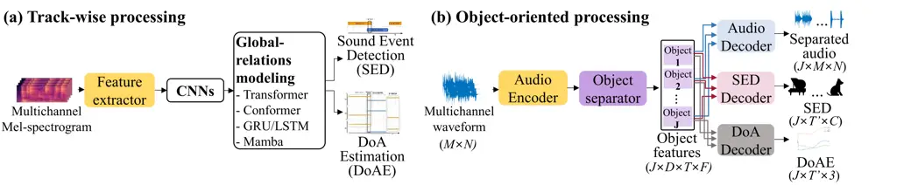

Figure 1: Comparison between (a) traditional track-wise processing and
(b) proposed object-oriented processing

## 2 Method

### 2.1 Overall framework: DeepASA

The multichannel audio mixture $`\mathbf{x}\in\mathbb{R}^{M\times N}`$,
where $`M`$ is the number of microphones and $`N`$ is the number of time
samples of the waveform, can be modeled as the summation of $`J`$
reverberant foreground signals and background noise $`\mathbf{v}`$. The
$`j`$-th foreground source can be further decomposed as the
superposition of direct sound $`\mathbf{s}_{j}`$ and reverberation
$`\mathbf{h}_{j}`$.

```math
\displaystyle\textbf{x}[n] \displaystyle=\sum_{j=1}^{J}(\textbf{s}_{j}[n]+\textbf{h}_{j}[n])+\textbf{v}[n]. \tag{1}
```

We aim to estimate the auditory information of up to $`J`$ foreground
sources, including classes, activations of onsets and offsets, DoA
trajectories, and multichannel waveforms of the direct and reverb audio
signals, as well as one multichannel noise signal, from the multichannel
audio mixture.

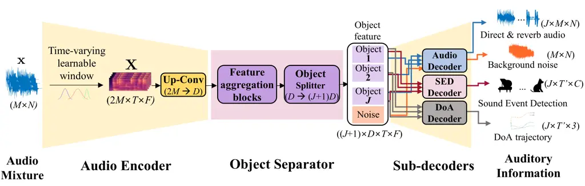

Figure 2: Basic architecture of DeepASA

As illustrated in Figure 2, the overall architecture of DeepASA
comprises three components: audio encoder, object separator, and
sub-decoders. The audio encoder extracts basic features from the
$`M`$-channel input mixture. The object separator separates audio
features extracted from the audio encoder into $`J+1`$ object features,
each of which encapsulates the auditory information of a single sound
object. The sub-decoders then estimate the auditory information from
each object feature. $`D,T^{\prime}`$ and $`C`$ are denoted as channel
dimension, time frames and number of classes.

The proposed framework separates each sound object at a feature level,
which is referred to as object-oriented processing (OOP) in this work.
One advantage of OOP is that the object-wise permutation of the
separated features is consistently inherited across all sub-decoders.
For example, the $`j`$-th object estimated by the audio, SED, DoA
decoders all include the waveforms, SED, DoA information from the same
sound source. The characteristic is the major difference to the
conventional track-wise processing Adavanne et al. (2018); Nguyen et al.
(2022); Shul and Choi (2024); Xue et al. (2023); Hu et al. (2023); Wang
et al. (2023a), for which multiple source information can be aligned on
the same track when they do not overlap in time. The OOP eliminates the
requirement for pairing different auditory information and also enables
the selective attention of estimated information across different
objects and auditory information.

### 2.2 Audio encoder

Dynamic STFT with time-varying learnable window The audio encoder of
DeepASA incorporates our proposed architecture, Dynamic STFT, for
adaptive temporal focusing on the input waveform. Conventional STFT uses
a fixed analysis window at all times, yet the locations and durations of
salient information within time frames can vary across the waveform.
Accordingly, we employ a learnable Gaussian window whose mean
$`(\mu_{t})`$ and standard deviation $`(\sigma_{t})`$ are predicted at
every frame, forming $`\boldsymbol{\mu}\in\mathbb{R}^{T}`$ and
$`\boldsymbol{\sigma}\in\mathbb{R}^{T}`$ vectors for the total number of
time frames $`T`$. The frame-wise mean $`(\mu_{t})`$ aligns the center
of the analysis window on the most informative region, while
$`(\sigma_{t})`$ sculpts its taper: a large $`\sigma_{t}`$ flattens the
analysis window toward a rectangle, sharpening spectral focus with a
thin main lobe, whereas a small $`\sigma_{t}`$ contracts it toward an
impulse, enhancing temporal focus.

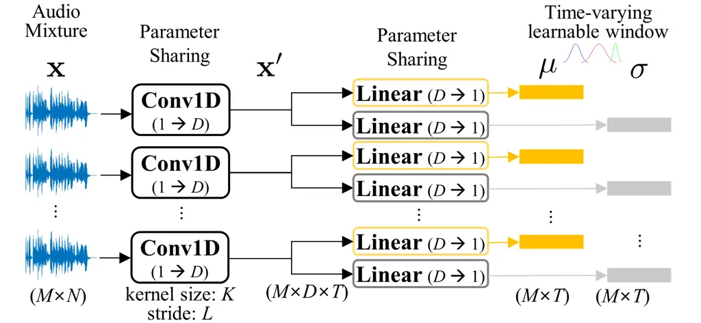

Figure 3: Time-varying learnable window

The process of extracting $`\boldsymbol{\mu}`$ and
$`\boldsymbol{\sigma}`$ is depicted in Figure 3. For each microphone
channel, a parameter-shared 1D convolution with the same kernel size and
stride as the window size $`K`$ and hop size $`L`$ used in STFT is
applied, producing outputs
$`\mathbf{x}^{\prime}\in\mathbb{R}^{D\times T}`$ for each microphone.
Two parallel linear layers then project $`\mathbf{x}^{\prime}`$ to the
mean and standard deviation, producing
$`\boldsymbol{\mu},\boldsymbol{\sigma}\in\mathbb{R}^{T}`$ for every
microphone channel.

Processing STFT with the time-varying learnable window, the multichannel
waveform is converted into a complex spectrogram
$`\mathbf{X}\in\mathbb{R}^{2M\times T\times F}`$ where $`F`$ is the
number of frequency bins. These complex spectrograms are then fed
directly into an Up-Conv block composed of a 2D convolution layer
followed by layer normalization, to increase the channel dimension from
$`2M`$ to $`D`$ while preserving the temporal and spectral dimensions.
For training a learnable window, the parameters are frozen at the
beginning of the training, and when the model has converged, they are
unfrozen and trained together.

### 2.3 Object separator

Feature aggregation As the feature aggregation block of the proposed
network, we modified the DeFT-Mamba Lee and Choi (2025) model designed
for the USS task (Figure 4(a)). DeFT-Mamba is a comprehensive feature
aggregation model utilizing Mamba and transformer layers to capture
temporal, spectral, and interchannel relations in multidimensional data.
To lighten the model, we adopt Mamba-FFN only for T-Hybrid Mamba and use
a conventional feedforward network (FFN) for F-Hybrid Mamba. Then, we
remove the unfolding process from the gated convolutional block (GCB)
while keeping the gating module and the convolution kernel.

Object splitter The features arranged by the modified DeFT-Mamba are
transformed into $`J+1`$ object features through the object splitting
layer given by a 2D convolution kernel. The separated $`J`$ object
features corresponding to foreground sources pass through the direct and
reverb decoders of the audio decoder, the SED decoder, and the DoA
decoder. The last object among the separated objects is treated as a
noise object, which is separately utilized by the noise decoder in the
audio decoder to estimate background noise.

### 2.4 Sub-decoders

The sub-decoders decode each object feature into the direct,
reverberant, and noise audio signals, class, activation, and DoA
outputs. The detailed architectures of sub-decoders are depicted in
Figure 4(b).

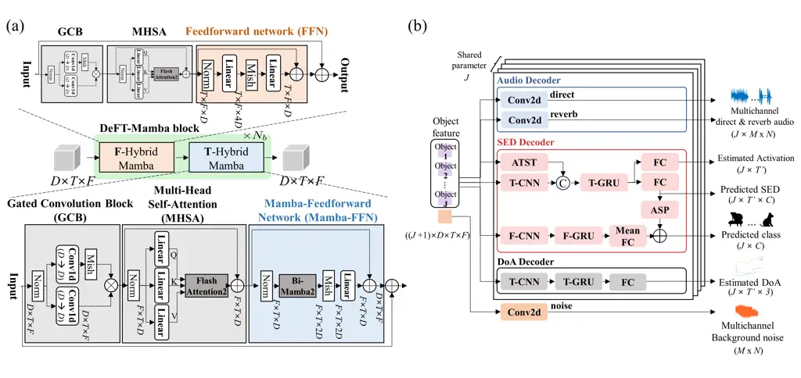

Figure 4: Detailed architecture of (a) feature aggregation block, and
(b) sub-decoders

MIMO Audio decoder The audio decoder aims to estimate a maximum of $`J`$
foreground source signals and 1 background noise signal corresponding to
individual sound objects. In the conventional multi-input single-output
(MISO) model, spatial information is lost in the decoded single-channel
signal, and the audio decoder cannot assist DoAE in the DoA decoder.
Therefore, the audio decoder in DeepASA is designed as a multi-input
multi-output (MIMO) architecture, facilitating spatial information in
the separated object features. To further assist the development of
spatial information and dereverberation, the audio decoder is trained to
separate direct sound $`\textbf{s}_{j}`$ and reverberant sound
$`\textbf{h}_{j}`$ of each object across all microphone channels. In
addition, for reducing the influence of background noise, the last
object from the object separator is separately processed by the noise
decoder trained to estimate the background noise v. When active
foreground sources are fewer than $`J`$, inactive sources are trained to
estimate zero target signals.

SED decoder The SED decoder decodes the object features of each sound
source into the predicted class probability ($`1\times C`$), the binary
object activation curve for event onset and offset
($`T\textquoteright\times 1`$), and the predicted SED map
($`T\textquoteright\times C`$). Here, $`T\textquoteright`$ and $`C`$
denote the number of time frames and the number of classes,
respectively. The predicted SED map is only used in the training stage
to guide the joint detection of a sound event and class. In the
inference stage, we use the SED map produced by multiplying the
predicted class and activation curve, resulting in a single SED map for
each sound source. This is to exclude the possibility of more than one
class being mapped to the SED map for each sound object. The SED decoder
combines a pre-trained audio teacher-student transformer (ATST) Shao et
al. (2024) with two separate convolutional recurrent neural network
(CRNN) Cakır et al. (2017)-based branches summarizing time and frequency
information. CRNN consists of multiple repetitions of Conv2d and
Maxpool2d (denoted as CNN), followed by GRU and FC layers. Specifically,
among the three red branches of the SED decoder, the middle path with
seven Conv+Maxpool layers outputting ($`J\times T^{\prime}\times D`$) is
the T-CRNN path, and the bottom path with two Conv+Maxpool layers
outputting ($`J\times F^{\prime}\times D`$) corresponds to the F-CRNN
path. We employ the pre-trained ATST to utilize various features learned
from AudioSet, a large-scale dataset containing a wide range of audio
classes Gemmeke et al. (2017). The features from ATST are combined with
auxiliary features developed from another Conv2d layer. The concatenated
features are analyzed in time by Time (T)-GRU and summarized to predict
the sound event map. For predicting a single-channel activation curve,
adaptive statistical pooling (ASP) Okabe et al. (2018) and one fully
connected layer are applied along the class dimension. The class
probability is predicted by superposing the logit derived from Frequency
(F)-CRNN, which prioritizes the spectral information using Conv2d layers
and F-GRU, with the logit obtained from ASP. For inactive sources, the
class decoder is trained to predict an equal probability of $`1/C`$
across all $`C`$ classes, while the sound event and activation decoders
are trained to produce zero values for all time frames. The detailed
specifications of the SED decoder are provided in Appendix A.

DoA decoder The DoA decoder has the CRNN structure and outputs a stream
of DoA vectors in Cartesian coordinates ($`x`$, $`y`$, $`z`$). The DoA
output estimates a DoA vector with a magnitude of 1 when a source is
present, and assigns all $`x`$, $`y`$, $`z`$ values to 0 when no source
is detected, allowing for the estimation of the activity and incident
angle. DoA is estimated for each time frame, enabling the trajectory
prediction for moving sources.

### 2.5 Chain-of-inference

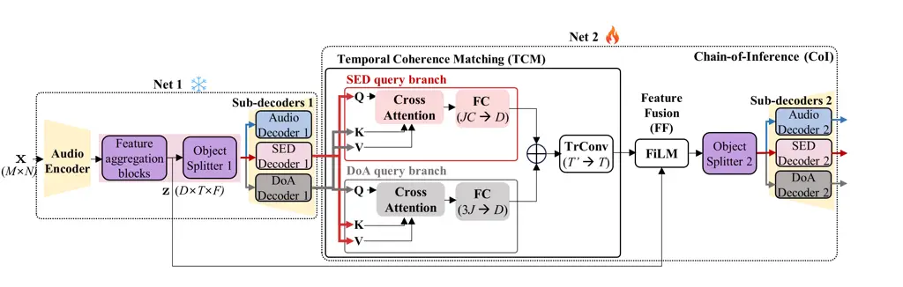

Figure 5: Detailed architecture of chain-of-inference

The initial estimation through sub-decoders can include misalignment
between auditory parameters. For example, the DoA vector stream can
exhibit different onsets and offsets with the sound event map. These
asynchronous estimations are refined from the object separation level
through the fusion of initial estimations. This refinement step,
chain-of-inference, consists of two processing steps: temporal coherence
matching (TCM) and feature fusion (FF) (Figure 5).

Temporal coherence matching In TCM, temporal coherence between SED and
DoAE is evaluated through the multi-clue attention mechanism. One branch
of multi-clue attention takes SED as queries and DoA as keys and values,
and the attention output is added to SED to refine the SED information.
Conversely, the other multi-clue attention branch uses DoA as queries
and SED as keys and values. The SED decoder outputs three components,
but ultimately, the SED map of $`T^{\prime}\times C`$ is constructed for
each object from the predicted class probability ($`1\times C`$) and
object activation ($`T^{\prime}\times 1`$). DoA decoder also generates
T’x3 output for each object. The alignment between the SEDs and DoAs is
accomplished in TCM through the cross-attention by assigning the time
dimension as a sequence dimension. The outputs of the two multi-clue
attentions are passed through two individual linear layers to produce
the $`D`$-channel clues and then superposed for fusion. The fused clue
is interpolated by a transposed convolution layer to match its time
dimension $`T^{\prime}`$ with that of object features ($`T`$).

Feature fusion In the feature fusion block, the fused clue is utilized
to refine the object feature separation. TCM output is processed by a
feature-wise linear modulation (FiLM) layer Perez et al. (2018), which
outputs values of $`\beta`$ and $`\gamma`$ for each channel and time
frame. The output of the FiLM layer is then combined with the output
from the feature aggregation module ($`\mathbf{z}`$) to inject
information required for object separation. The object features refined
by the object splitter 2 are then plugged again into the sub-decoders 2
to improve ASA parameter estimation.

For efficient training of the CoI architecture, we utilize multi-stage
training. That is, Net 1 of Figure 5 is trained first, then Net 2 is
trained with up to the third DeFT-Mamba block of Net 1 frozen.

## 3 Experimental Settings

### 3.1 Datasets

The proposed architecture is trained and evaluated on three spatial
audio datasets: ASA2, MC-FUSS, and STARSS23. Auditory Scene Analysis
dataset V2 (ASA2) provides ground truth signals and labels for all
acoustic parameters addressed in this study, including comprehensive
auditory information for moving source separation and scene analysis in
noisy, reverberant environment. ASA2 is based on the ASA dataset Lee and
Choi (2025), but we modified it extensively to enable the comprehensive
tasks discussed in this study. ASA2 supports (1) the separation of
direct and reverberation components (for dereverberation), (2) MIMO
separation, as compared to MISO separation of the ASA dataset, and (3)
an increased maximum number of foreground sound sources, from four to
five. The balance in the number of audio clips has been changed to be
proportional to the number of sources constituting the scene.
Multichannel-Free Universal Sound Separation (MC-FUSS) Aizawa et al.
(2023) is a benchmark dataset for multichannel USS, including mixtures
of 1–4 sound sources, with one being the background source. For a fair
comparison on the MC-FUSS dataset, we trained DeepASA both from scratch
and with fine-tuning of the pre-trained model on the ASA 2 dataset.
Also, we compared the effect of pre-trained ATST in the MC-FUSS dataset.
STARSS23 Shimada et al. (2023) is a dataset for the SELD task,
addressing various sound events with 3.8 hours of audio-video data
collected from real environments. This dataset generally requires data
augmentation, so additional data augmentation of 80 hours was conducted
using a spatial scaper Roman et al. (2024). In this experiment, other
SELD models were also trained using the large auxiliary datasets. The
DCASE 2023 challenge allowed the use of external datasets and
pre-trained models, so we applied this rule. All datasets were set to a
16 kHz sampling rate and a 4-second duration.

### 3.2 Training and model configuration

For the STFT, the Gaussian window of 40 ms length and hop size of 20 ms
(50% overlap) was used. The initial weight for the mean and standard
deviation of the window was set to 0 and 6.67 ms, ensuring
$`6\times\sigma`$ covers the full window range. The number of feature
aggregation modules was $`6`$, and the channel dimension for the DeepASA
was $`64`$. The initial learning rate $`4\times 10^{-4}`$ was used for
the Adam optimizer during pre-training, and $`4\times 10^{-4}`$ and
$`5\times 10^{-5}`$ were used for fine-tuning to the MC-FUSS and
STARSS23 datasets, respectively. The learning rate was halved if the
validation loss did not decrease for five consecutive epochs. The model
was trained for 100 epochs, and the model from the epoch with the lowest
validation loss was selected as the final model. The batch size was set
to 2. The training was performed on eight GeForce RTX 3090 GPUs.

The direct and reverb decoders in the audio decoder were trained with
the source-aggregated signal-to-distortion ratio (SA-SDR) loss von
Neumann et al. (2022) with permutation invariant training (PIT) Yu et
al. (2017). We configured a reference channel among multichannel signals
and applied different weights (1:0.1) to the losses of the reference and
the other channels. The noise decoder was trained by the scale-invariant
signal-to-distortion ratio (SI-SDR) loss Le Roux et al. (2019). We
employed one noise decoder, so the noise decoder was not trained with
PIT. The joint loss was calculated by summing the losses with weights
1:1:0.01 for direct, reverb, and noise decoders. The losses for the SED
decoder were cross-entropy, binary cross-entropy, and mean-square-error
(MSE), for the class decoder, activation decoder, and sound event
decoder, respectively. The MSE loss was used for the DoA decoder, which
was summed with all aforementioned losses with equal weights. In
evaluation, scale-invariant signal-to-distortion ratio improvement
(SI-SDRi) (dB) and signal-to-distortion ratio improvement (SDRi) (dB)
were used for USS performance evaluation, while SELD metrics (error rate
(ER,%), F1-score (F1,%), localization error (LE, degrees), localization
recall (LR, %)) Adavanne et al. (2018) were employed for SED and DoAE.
We measured the model complexity by the parameter size and computational
complexity.

[TABLE]

Table 1: Ablation study on the proposed model using the ASA2 dataset.
The models with (+) or (-) indicate the addition or removal of the
corresponding blocks from the baseline. The (+) in the parameter size
indicates the parameter size of the pre-trained ATST.

## 4 Results

### 4.1 Ablation study of DeepASA blocks

We conducted ablation studies to assess the contribution of each module
in DeepASA. Each row block of Table 1 corresponds to the ablation of a
specific component. For sequential consistency, the final configuration
from the previous block was used as the baseline for the subsequent
analysis.

Framework The first ablation study is about incorporating the MIMO
separation task, SED, and DoA decoders. The baseline was the MISO USS
model Lee and Choi (2025), and USS performance was measured based on the
reconstruction of the reference channel. When MIMO USS is introduced,
the separation performance of the reference channel decreases. This can
be attributed to the features extracted for all channels rather than a
single channel. Introducing the SELD task using the SELDNet Adavanne et
al. (2018) sub-decoder enhances the USS performance as well, showing
that auditory scene analysis can effectively guide the source separation
task. The SELD performance is further improved when the CRNN
architectures are employed as SED and DoA decoders. Notably, USS
performance metrics are recovered to those of the baseline, indicating
that a sophisticated SELD decoder can effectively improve SELD
performance with minimal impact on the USS task.

Object separator Next, we examine the impact of downsizing on the
baseline model (DeFT-Mamba-MIMO + SED, DoA decoder). The performance
reduction by omitting unfold was negligible, showing only -0.1 dB
difference in SI-SDRi. Furthermore, when F-Mamba is removed, a
performance degradation of 0.3 dB in SI-SDR and 0.002 in SELD score is
observed. However, this comes with significant lightweighting in
parameter size (0.9 M) and computational complexity (10.9 GMac/s), so we
adopted the conventional FFN in the F-HybridMamba block.

SED decoder The efficacy of more sophisticated sub-decoders is tested in
this section. Recent work has shown that combining pre-trained ATST and
CRNN achieves high performance in sound event detection Schmid et al.
(2024). The SELD score is also significantly improved when the baseline,
combined with the ATST + T-CRNN decoder, is fine-tuned to the ASA2
dataset. This stresses the importance of using the class decoder
specialized to the classification task. Similarly, we combined the
F-CRNN architecture to capture and emphasize global frequency relations,
improving the SELD score further up to 0.266. Since the improvement was
less only with the F-CRNN decoder, we can conclude that capturing both
local and global time-frequency relationships is critical for effective
SED.

Audio decoder With the best SED decoder suggested above, we conducted
the model analysis for the audio decoder. The first improvement was
adding a noise decoder that estimates multichannel background noise.
Both separation and SED performance are significantly improved when the
noise decoder performing noise estimation is added. As analyzed in
detail in Appendix B, the noise decoder enhances the separation
performance of domestic sounds that share similar time-frequency
characteristics with background noise. Next, separate decoders for the
direct and reverberant sounds were employed to estimate
$`\mathbf{s}_{j}`$ and $`\mathbf{h}_{j}`$, respectively, instead of
$`\mathbf{s}_{j}+\mathbf{h}_{j}`$ estimated by the baseline audio
decoder. Here, the USS performance was evaluated by measuring SI-SDRi
and SDRi on $`\mathbf{s}_{j}+\mathbf{h}_{j}`$ for fair comparison to
previous cases. While this change slightly reduces separation
performance, DoAE performance (LE and LR) is markedly improved. This
suggests that learning to separate direct audio positively impacts DoA
accuracy by suppressing reverberant signals. A detailed analysis of the
direct/reverb decoders is provided in Appendix C.

Dynamic STFT Lastly, the effectiveness of dynamic STFT was validated.
The first comparison set is the model using a learnable but
time-invariant window, which was designed by applying mean pooling over
the temporal dimension before passing it through the linear layers of a
time-varying learnable window. This model shows negligible performance
improvement compared to the baseline STFT-based model. In contrast, the
time-varying learnable window increases all performance metrics,
demonstrating the importance of dynamic temporal adjustment of the
window position and length in feature extraction and separation. The
detailed comparisons with various dynamic convolution kernels are
presented in Appendix D.

### 4.2 Ablation study of chain-of-inference (CoI)

The results of the CoI ablation study are presented in Table 2. The
baseline model corresponds to the best-performing configuration without
CoI, identified in Table 1. To isolate the effect of individual auditory
cues, we ablated the CoI module by including only a single query branch,
either the SED or DoA branch in the Temporal Coherence Matching (TCM)
module. Additionally, the audio decoder 2 was removed from Net 2 to
eliminate the influence of two-stage training on the audio separation
task. In these ablated configurations, USS performance was evaluated
using the output from audio decoder 1 only.

| Model variation            |                | USS                  |                   | SED               |                 | DoAE              |                 | SELD $`\downarrow`$ | Complexities   |         |
| -------------------------- | -------------- | -------------------- | ----------------- | ----------------- | --------------- | ----------------- | --------------- | ------------------- | -------------- | ------- |
|                            |                | SI-SDRi $`\uparrow`$ | SDRi $`\uparrow`$ | ER $`\downarrow`$ | F1 $`\uparrow`$ | LE $`\downarrow`$ | LR $`\uparrow`$ |                     | Param.         | MAC/s   |
| without chain-of-inference |                | 11.0                 | 11.7              | 28.8              | 70.2            | 18.5              | 76.9            | 0.230               | 8.2 (+96.8) M  | 99.1 G  |
| without audio decoder 2    | (+) SED branch | 11.0                 | 11.8              | 26.6              | 71.8            | 18.2              | 76.5            | 0.221               | 10.3 (+96.8) M | 101.6 G |
|                            | (+) DoA branch | 11.0                 | 11.8              | 28.2              | 70.6            | 17.6              | 76.0            | 0.228               | 10.3 (+96.8) M | 101.6 G |
|                            | (+) SED & DoA  | 11.0                 | 11.7              | 26.5              | 73.0            | 17.3              | 77.2            | 0.214               | 12.1 (+96.8) M | 104.0 G |
| + Chain-of-inference       |                | 11.2±0.1             | 12.0±0.1          | 25.0±0.4          | 74.1±0.3        | 17.0±0.3          | 78.1±0.4        | 0.206±0.001         | 12.1 (+96.8) M | 104.0 G |

Table 2: Ablation study for the chain-of-inference architecture

The results reveal that incorporating the SED branch improves sound
event detection (as indicated by enhanced ER and F1-score), while
incorporating the DoA branch improves DoA estimation (as shown by
reduced localization error, LE). These findings suggest that
cross-attention with SED or DoA queries selectively refines the
corresponding auditory information. Notably, combining both branches
(SED & DoA) leads to further improvements in both metrics, indicating
that when one cue is unreliable, the other can compensate to support
more accurate inference. In the final configuration, the full CoI
architecture was restored, with Net 2 including audio decoder 2. In this
setting, the USS output from audio decoder 2 was used for evaluation.
The complete CoI architecture yields the best overall performance,
achieving 12.0 dB SI-SDRi on the USS task and a SELD score of 0.206.
These results confirm that the proposed CoI mechanism effectively
enhances estimation across auditory domains by explicitly modeling
interdependencies and enabling complementary cue integration. We run
five trials and report the average and standard deviation for the final
model. A more detailed analysis of CoI’s contribution is provided in
Appendix E

### 4.3 Generalization to spatial audio benchmarks & comparison with SOTA models

We evaluated the generalization capability of DeepASA on two spatial
audio benchmarks: MC-FUSS for USS and STARSS23 for SELD, and compared it
to SOTA models. DeepASA was pre-trained on the ASA2 dataset and
fine-tuned using the ground-truth parameters available in each target
dataset. Since no existing model can simultaneously perform USS, SED,
and DoAE tasks, comparison models were trained individually for the
subset of tasks they support.

USS performance comparison on MC-FUSS dataset Table 3 presents a
comparison between DeepASA (excluding the CoI, SED, and DoA decoders)
and existing SOTA models for universal sound separation (USS). Despite
being unable to utilize the CoI module during fine-tuning on MC-FUSS,
DeepASA outperforms existing USS models, particularly in scenes with a
larger number of foreground sources. This performance gain is largely
attributed to the noise decoder’s explicit estimation of background
noise and the benefits of fine-tuning from pre-trained weights.

|                                   |                                  |      |      |      |       |                |        |
| --------------------------------- | -------------------------------- | ---- | ---- | ---- | ----- | -------------- | ------ |
| Training                          | Model                            | J=2  | J=3  | J=4  | Total | Param.         | MAC/s  |
| From scratch                      | ByteDance-uss Kong et al. (2023) | 14.8 | 14.4 | 12.7 | 14.0  | 28.0 (+80.7) M | 40.1 G |
|                                   | MC-BSRNN Gu and Luo (2024)       | 15.7 | 15.2 | 11.4 | 14.1  | 12.2 M         | 15.3 G |
|                                   | TF-GridNet Wang et al. (2023b)   | 17.2 | 16.1 | 12.5 | 15.3  | 14.7 M         | 462 G  |
|                                   | DeFTAN-II Lee and Choi (2024)    | 17.6 | 16.3 | 12.8 | 15.6  | 4.1 M          | 66.1 G |
|                                   | SpatialNet Quan and Li (2024)    | 17.8 | 16.5 | 13.1 | 15.8  | 7.3 M          | 71.8 G |
|                                   | DeFT-Mamba Lee and Choi (2025)   | 18.4 | 17.1 | 13.8 | 16.4  | 3.6 M          | 83.8 G |
|                                   | DeepASA (SEP, w/o ATST)          | 18.5 | 18.2 | 15.7 | 17.5  | 2.9 M          | 77.3 G |
| Fine-tuning (pre-trained on ASA2) | DeFT-Mamba Lee and Choi (2025)   | 18.4 | 17.1 | 14.1 | 16.6  | 3.6 M          | 83.8 G |
|                                   | DeepASA (SEP, w/o ATST)          | 18.8 | 19.0 | 17.4 | 18.4  | 2.9 M          | 77.3 G |
|                                   | DeepASA (SEP)                    | 18.9 | 19.1 | 17.6 | 18.5  | 2.9 M          | 77.3 G |

Table 3: USS performance comparison on MC-FUSS dataset

SELD performance comparison on STARSS23 dataset We evaluate two versions
of DeepASA (with and without CoI) against SOTA SELD models, including
top-ranking submissions from the DCASE 2023 challenge. DeepASA achieves
the highest overall performance on the STARSS23 dataset, even without
employing the audio decoder. Both versions of DeepASA surpass the
performance of the top-ranked model Wang et al. (2023a), which relied on
class-dependent separation networks and model ensembling. It is worth
noting that DeepASA was pre-trained on the ASA2 dataset prior to
fine-tuning. To control for the effect of pre-training, we further
compared DeepASA to publicly available models that were also trained
using ASA2. As detailed in Appendix F, DeepASA consistently achieves
SOTA performance across all evaluated tasks under the same training
conditions. These results collectively demonstrate the strength of
DeepASA across diverse ASA tasks and datasets, validating the
effectiveness of combining class, activation, and DoA trajectory
information through the object-oriented processing (OOP) and
chain-of-inference (CoI) architecture.

[TABLE]

Table 4: SELD performance comparison on STARSS23 dataset

## 5 Related Works

Universal Sound Separation (USS) USS addresses the challenge of
separating various sound sources in an auditory scene where multiple
sources overlap Kavalerov et al. (2019); Wisdom et al. (2021). Humans
perform source separation by leveraging various characteristics of
individual sources, such as class, activation, and DoA. However,
existing USS methods rely on time-frequency representations, which may
limit their ability to exploit such source-specific attributes Kong et
al. (2023); Gu and Luo (2024). To address this, the proposed method
draws inspiration from human segregation processing and integrates
multiple audio cues within a unified framework, resulting in improved
performance on the USS task.

Target Sound Extraction (TSE) TSE refers to the separation of specific
sound sources from audio mixture, with a focus on the auditory
information of the source Veluri et al. (2023); Delcroix et al. (2022).
TSE plays a significant role in the source separation area, where
spatial and temporal characteristics are leveraged to extract the target
sound Wang et al. (2022); Kong et al. (2023). A limitation of TSE is
that humans must explicitly provide clues such as class, activation, and
DoA. However, the network itself needs to iteratively infer these clues
and use them to refine the separation process. To overcome this
limitation, the proposed method introduces a strategy in which the clues
inferred by the network are integrated to improve separation
performance.

Sound Event Localization and Detection (SELD) The SELD task involves
performing both SED and DoAE within a single model Adavanne et al.
(2018); Nguyen et al. (2022); Shul et al. (2025). Nevertheless, most
previous SELD models first analyze auditory cues using separate DNN
branches for SED and DoA, and then perform track-wise separation into
auditory stream Shimada et al. (2021); Cao et al. (2021); Vo and Han
(2024); Mu et al. (2024b); Mu et al. (2024a). This approach can lead to
incorrect pairing of SED and DoA outputs, and especially causes
performance degradation when handling polyphonic audio. Additionally,
models like Wang et al. (2023a) have improved performance by
incorporating a pre-trained target sound extraction model Luo and
Mesgarani (2019) but cannot reuse features learned from separation for
SELD. Instead, the proposed architecture reutilizes multiple auditory
information estimated from common per-object features to refine the
separation and SELD performance.

## 6 Conclusion

We proposed DeepASA for unified auditory scene analysis and separation,
employing a multi-decoder architecture that utilizes relations between
auditory information for both source separation and analysis tasks. The
model leverages chain-of-inference to refine performance in USS, SED,
and DoAE tasks. Experimental results demonstrated the effectiveness of
sub-decoders and multi-clue attention in improving feature extraction.
Our results show significant performance improvements over existing
methods in various downstream datasets.

Broader impacts This paper focuses on the framework that emulates how
humans perform ASA by utilizing various types of auditory information to
segregate sound objects to solve the cocktail party problem. We believe
that DeepASA offers a unified framework that not only advances the state
of the art in auditory scene analysis and sound separation but also
opens new directions for research at the intersection of spatial
hearing, multi-task learning, and object-centric audio modeling.

Limitations and future work The main limitation is the large parameter
size of the ATST adopted for the SED decoder. In this work, the
separated object features are reprocessed by the patch-based ATST to
keep the advantage of ATST pre-trained on a large set of audio
classification datasets. For the aspect of the bias of the dataset, the
reverberation time was set between 0.2 and 0.6 seconds, so the
performance of the model may degrade in environments with reverberation
times longer than 0.6 seconds. Additionally, because the background
noise was simulated with an SNR range of 6 to 30 dB, the performance of
the model is also expected to decline when the background noise has an
SNR below 0 dB and is louder than the foreground source. Next, regarding
the potential misuse, since this model can extract speech of individual
speakers and analyze their types and directions, there is a concern that
it could be exploited for eavesdropping.

Future research could explore pre-training the novel classification
layer designed to be compatible with object features, using a large
audio dataset like ATST.

## Acknowledgements and Disclosure of Funding

This work was supported by the National Research Foundation of Korea
(NRF) grant (No. RS-2024-00337945) and STEAM research grant (No.
RS-2024-00464269) funded by the Ministry of Science and ICT of Korea
government (MSIT), the BK21 FOUR program through the NRF grant funded by
the Ministry of Education of Korea government (MOE), and the Center for
Applied Research in Artificial Intelligence (CARAI) funded by DAPA and
ADD (UD230017TD).

## References

- \[1\] A. S. Bregman (1984) Auditory scene analysis. In Proceedings of
  the 7th International Conference on Pattern Recognition, Cited by: §1.
- \[2\] G. J. Brown and M. Cooke (1994) Computational auditory scene
  analysis. Computer Speech & Language. Cited by: §1, §1.
- \[3\] E. C. Cherry (1953) Some experiments on the recognition of
  speech, with one and with two ears. Journal of the acoustical society
  of America. Cited by: §1.
- \[4\] A. S. Bregman (1994) Auditory scene analysis: the perceptual
  organization of sound. MIT press. Cited by: §1.
- \[5\] S. A. S., M. E., and C. M. (2011) Temporal coherence and
  attention in auditory scene analysis. Trends in Neurosciences.
  External Links:
  [Document](https://dx.doi.org/https%3A//doi.org/10.1016/j.tins.2010.11.002),
  [Link](https://www.sciencedirect.com/science/article/pii/S0166223610001670)
  Cited by: §1.
- \[6\] D-L. Wang and G. J. Brown (2006) Computational auditory scene
  analysis: principles, algorithms, and applications. Wiley-IEEE press.
  Cited by: §1.
- \[7\] Q. Kong, Y. Xu, W. Wang, and M. D. Plumbley (2017) A joint
  detection-classification model for audio tagging of weakly labelled
  data. In IEEE International Conference on Acoustics, Speech and Signal
  Processing, Cited by: Table 9, §1.
- \[8\] Y. Gong, Y-A. Chung, and J. Glass (2021) PSLA: improving audio
  tagging with pretraining, sampling, labeling, and aggregation.
  IEEE/ACM Transactions on Audio, Speech, and Language Processing. Cited
  by: §1.
- \[9\] F. Schmid, K. Koutini, and G. Widmer (2023) Efficient
  large-scale audio tagging via transformer-to-cnn knowledge
  distillation. In IEEE International Conference on Acoustics, Speech
  and Signal Processing, Cited by: §1.
- \[10\] A. Mesaros, T. Heittola, T. Virtanen, and M. D. Plumbley (2021)
  Sound event detection: A tutorial. IEEE Signal Processing Magazine.
  Cited by: §1.
- \[11\] E. Cakır, G. Parascandolo, T. Heittola, H. Huttunen, and T.
  Virtanen (2017) Convolutional recurrent neural networks for polyphonic
  sound event detection. IEEE/ACM Transactions on Audio, Speech, and
  Language Processing. Cited by: §1, §2.4.
- \[12\] N. Shao, X. Li, and X. Li (2024) Fine-tune the pretrained ATST
  model for sound event detection. In IEEE International Conference on
  Acoustics, Speech and Signal Processing, Cited by: Appendix D, §1,
  §2.4.
- \[13\] P-A. Grumiaux, S. Kitić, L. Girin, and A. Guérin (2022) A
  survey of sound source localization with deep learning methods. The
  Journal of the Acoustical Society of America. Cited by: §1.
- \[14\] D. Diaz-Guerra, A. Miguel, and J. R. Beltran (2020) Robust
  sound source tracking using SRP-PHAT and 3D convolutional neural
  networks. IEEE/ACM Transactions on Audio, Speech, and Language
  Processing. Cited by: §1.
- \[15\] Y. Wang, B. Yang, and X. Li FN-SSL: full-band and narrow-band
  fusion for sound source localization. Cited by: §1.
- \[16\] D-L. Wang and J. Chen (2018) Supervised speech separation based
  on deep learning: an overview. IEEE/ACM transactions on audio, speech,
  and language processing. Cited by: §1.
- \[17\] Y. Luo and N. Mesgarani (2019) Conv-TasNet: surpassing ideal
  time–frequency magnitude masking for speech separation. IEEE/ACM
  transactions on audio, speech, and language processing. Cited by: §1,
  §5.
- \[18\] I. Kavalerov, S. Wisdom, H. Erdogan, B. Patton, K. Wilson, J.
  Le Roux, and J. R. Hershey (2019) Universal sound separation. In IEEE
  Workshop on Applications of Signal Processing to Audio and Acoustics,
  Cited by: §1, §5.
- \[19\] W. He (2021) Deep learning approaches for auditory perception
  in robotics. Ph.D. Thesis, EPFL. Cited by: §1.
- \[20\] B. Veluri, J. Chan, M. Itani, T. Chen, T. Yoshioka, and S.
  Gollakota (2023) Real-time target sound extraction. In IEEE
  International Conference on Acoustics, Speech and Signal Processing,
  Cited by: §1, §5.
- \[21\] M. Delcroix, J. B. Vázquez, T. Ochiai, K. Kinoshita, Y. Ohishi,
  and S. Araki (2022) SoundBeam: target sound extraction conditioned on
  sound-class labels and enrollment clues for increased performance and
  continuous learning. IEEE/ACM Transactions on Audio, Speech, and
  Language Processing. Cited by: §1, §5.
- \[22\] H. Wang, D. Yang, C. Weng, J. Yu, and Y. Zou (2022) Improving
  target sound extraction with timestamp information. Cited by: §1, §5.
- \[23\] M-S. Kim, Y. Kim, and J-H. Chang (2024) Improving target sound
  extraction with timestamp knowledge distillation. In IEEE
  International Conference on Acoustics, Speech and Signal Processing,
  Cited by: §1.
- \[24\] T. Jenrungrot, V. Jayaram, S. Seitz, and I.
  Kemelmacher-Shlizerman (2020) The cone of silence: speech separation
  by localization. Advances in Neural Information Processing Systems.
  Cited by: §1.
- \[25\] R. Gu and Y. Luo (2024) ReZero: region-customizable sound
  extraction. IEEE/ACM Transactions on Audio, Speech, and Language
  Processing. Cited by: §1, Table 3, §5.
- \[26\] Q. Kong, K. Chen, H. Liu, X. Du, T. Berg-Kirkpatrick, S.
  Dubnov, and M. D. Plumbley (2023) Universal source separation with
  weakly labelled data. arXiv preprint arXiv:2305.07447. Cited by:
  Appendix F, §1, Table 3, §5, §5.
- \[27\] K. Zmolikova, M. Delcroix, T. Ochiai, K. Kinoshita, J.
  Černockỳ, and D. Yu (2023) Neural target speech extraction: an
  overview. IEEE Signal Processing Magazine. Cited by: §1.
- \[28\] S. Adavanne, A. Politis, J. Nikunen, and T. Virtanen (2018)
  Sound event localization and detection of overlapping sources using
  convolutional recurrent neural networks. IEEE Journal of Selected
  Topics in Signal Processing. Cited by: Appendix D, §1, §2.1, §3.2,
  Table 1, §4.1, §5.
- \[29\] Y. He, N. Trigoni, and A. Markham (2021) SoundDet: polyphonic
  moving sound event detection and localization from raw waveform. In
  International Conference on Machine Learning, Cited by: §1.
- \[30\] T. Aizawa, Y. Bando, K. Itoyama, K. Nishida, K. Nakadai, and M.
  Onishi (2023) Unsupervised domain adaptation of universal source
  separation based on neural full-rank spatial covariance analysis. In
  IEEE 33rd International Workshop on Machine Learning for Signal
  Processing, Cited by: §1, §3.1.
- \[31\] S. Wisdom, H. Erdogan, D. PW. Ellis, R. Serizel, N.
  Turpault, E. Fonseca, J. Salamon, P. Seetharaman, and J. R.
  Hershey (2021) What’s all the fuss about free universal sound
  separation data?. In IEEE International Conference on Acoustics,
  Speech and Signal Processing, Cited by: §1, §5.
- \[32\] K. Shimada, A. Politis, P. Sudarsanam, D. A. Krause, K.
  Uchida, S. Adavanne, A. Hakala, Y. Koyama, N. Takahashi, S. Takahashi,
  et al. (2023) STARSS23: an audio-visual dataset of spatial recordings
  of real scenes with spatiotemporal annotations of sound events.
  Advances in neural information processing systems. Cited by: §1, §3.1.
- \[33\] T. N. T. Nguyen, K. N. Watcharasupat, N. K. Nguyen, D. L.
  Jones, and W-S. Gan (2022) SALSA: spatial cue-augmented
  log-spectrogram features for polyphonic sound event localization and
  detection. IEEE/ACM Transactions on Audio, Speech, and Language
  Processing. Cited by: §2.1, §5.
- \[34\] Y. Shul and J-W. Choi (2024) CST-former: transformer with
  channel-spectro-temporal attention for sound event localization and
  detection. In IEEE International Conference on Acoustics, Speech and
  Signal Processing, Cited by: §2.1, Table 4.
- \[35\] L. Xue, H. Liu, and Y. Zhou (2023) ATTENTION mechanism network
  and data augmentation for sound event localization and detection.
  Technical report DCASE2023 Challenge. Cited by: §2.1, Table 4.
- \[36\] J. Hu, Y. Cao, M. Wu, F. Yang, W. Wang, M. D. Plumbley, and J.
  Yang (2023) A data generation method for sound event localization and
  detection in real spatial sound scenes. Technical report DCASE2023
  Challenge. Cited by: §2.1.
- \[37\] Q. Wang, Y. Jiang, S. Cheng, M. Hu, Z. Nian, P. Hu, Z. Liu, Y.
  Dong, M. Cai, J. Du, and C-H. Lee (2023) THE NERC-SLIP system for
  sound event localization and detection of DCASE2023 challenge.
  Technical report DCASE2023 Challenge. Cited by: §2.1, §4.3, Table 4,
  Table 4, §5.
- \[38\] D. Lee and J-W. Choi (2025) DeFT-Mamba: universal multichannel
  sound separation and polyphonic audio classification. In IEEE
  International Conference on Acoustics, Speech and Signal Processing,
  Cited by: Appendix D, Table 9, Appendix F, §2.3, §3.1, Table 1, §4.1,
  Table 3, Table 3.
- \[39\] J. F. Gemmeke, D. P. W. Ellis, D. Freedman, A. Jansen, W.
  Lawrence, R. C. Moore, M. Plakal, and M. Ritter (2017) Audio set: an
  ontology and human-labeled dataset for audio events. In IEEE
  International Conference on Acoustics, Speech and Signal Processing,
  Cited by: §2.4.
- \[40\] K. Okabe, T. Koshinaka, and K. Shinoda (2018) Attentive
  statistics pooling for deep speaker embedding. arXiv preprint
  arXiv:1803.10963. Cited by: Appendix A, §2.4.
- \[41\] E. Perez, F. Strub, H. De Vries, V. Dumoulin, and A.
  Courville (2018) FiLM: visual reasoning with a general conditioning
  layer. In Proceedings of the AAAI conference on artificial
  intelligence, Cited by: §2.5.
- \[42\] I. R. Roman, C. Ick, S. Ding, A. S. Roman, B. McFee, and J. P.
  Bello (2024) Spatial scaper: a library to simulate and augment
  soundscapes for sound event localization and detection in realistic
  rooms. In IEEE International Conference on Acoustics, Speech and
  Signal Processing, Cited by: §3.1.
- \[43\] T. von Neumann, K. Kinoshita, C. Boeddeker, M. Delcroix, and R.
  Haeb-Umbach (2022) SA-SDR: a novel loss function for separation of
  meeting style data. In IEEE International Conference on Acoustics,
  Speech and Signal Processing, Cited by: §3.2.
- \[44\] D. Yu, M. Kolbæk, Z-H. Tan, and J. Jensen (2017) Permutation
  invariant training of deep models for speaker-independent multi-talker
  speech separation. In IEEE International Conference on Acoustics,
  Speech and Signal Processing, pp. 241–245. Cited by: §3.2.
- \[45\] J. Le Roux, S. Wisdom, H. Erdogan, and J. R. Hershey (2019)
  SDR–half-baked or well done?. In IEEE International Conference on
  Acoustics, Speech and Signal Processing, Cited by: §3.2.
- \[46\] F. Schmid, P. Primus, T. Morocutti, J. Greif, and G.
  Widmer (2024) Improving audio spectrogram transformers for sound event
  detection through multi-stage training. arXiv preprint
  arXiv:2408.00791. Cited by: Appendix A, Table 1, §4.1.
- \[47\] Z-Q. Wang, S. Cornell, S. Choi, Y. Lee, B-Y. Kim, and S.
  Watanabe (2023) TF-GridNet: integrating full-and sub-band modeling for
  speech separation. IEEE/ACM Transactions on Audio, Speech, and
  Language Processing. Cited by: Table 9, Appendix F, Table 3.
- \[48\] D. Lee and J-W. Choi (2024) DeFTAN-II: efficient multichannel
  speech enhancement with subgroup processing. IEEE/ACM Transactions on
  Audio, Speech, and Language Processing. Cited by: Table 3.
- \[49\] C. Quan and X. Li (2024) SpatialNet: extensively learning
  spatial information for multichannel joint speech separation,
  denoising and dereverberation. IEEE/ACM Transactions on Audio, Speech,
  and Language Processing. Cited by: Table 9, Appendix F, Table 3.
- \[50\] D. Mu, Z. Zhang, and H. Yue (2024) MFF-EINV2: multi-scale
  feature fusion across spectral-spatial-temporal domains for sound
  event localization and detection. arXiv preprint arXiv:2406.08771.
  Cited by: Table 9, Table 4, §5.
- \[51\] Y. Shul, D. Choi, and J-W. Choi (2025) CST-former:
  multidimensional attention-based transformer for sound event
  localization and detection in real scenes. arXiv preprint
  arXiv:2504.12870. Cited by: Table 4, §5.
- \[52\] K. Shimada, N. Takahashi, Y. Koyama, S. Takahashi, E.
  Tsunoo, M. Takahashi, and Y. Mitsufuji (2021) Ensemble of ACCDOA-and
  EINV2-based systems with D3Nets and impulse response simulation for
  sound event localization and detection. arXiv preprint
  arXiv:2106.10806. Cited by: §5.
- \[53\] Y. Cao, T. Iqbal, Q. Kong, F. An, W. Wang, and M. D.
  Plumbley (2021) An improved event-independent network for polyphonic
  sound event localization and detection. In IEEE International
  Conference on Acoustics, Speech and Signal Processing, Cited by: Table
  9, §5.
- \[54\] Q. T. Vo and D. K. Han (2024) Resnet-conformer network with
  shared weights and attention mechanism for sound event localization,
  detection, and distance estimation. Technical report Technical report,
  DCASE2024 Challenge. Cited by: §5.
- \[55\] D. Mu, Z. Zhang, H. Yue, Z. Wang, J. Tang, and J. Yin (2024)
  Seld-mamba: selective state-space model for sound event localization
  and detection with source distance estimation. arXiv preprint
  arXiv:2408.05057. Cited by: Table 9, §5.
- \[56\] T. H. Falk, C. Zheng, and W-Y. Chan (2010) A non-intrusive
  quality and intelligibility measure of reverberant and dereverberated
  speech. IEEE Transactions on Audio, Speech, and Language Processing.
  Cited by: Appendix C.
- \[57\] S-H. Kim, H. Nam, and Y-H. Park (2022) Temporal dynamic
  convolutional neural network for text-independent speaker verification
  and phonemic analysis. In IEEE International Conference on Acoustics,
  Speech and Signal Processing, pp. 6742–6746. Cited by: Appendix D,
  Appendix D.
- \[58\] R. R. Selvaraju, M. Cogswell, A. Das, R. Vedantam, D. Parikh,
  and D. Batra (2017) Grad-cam: visual explanations from deep networks
  via gradient-based localization. In IEEE International Conference on
  Computer Vision, pp. 618–626. Cited by: Appendix D.
- \[59\] S. Niu, J. Du, Q. Wang, L. Chai, H. Wu, Z. Nian, L. Sun, Y.
  Fang, J. Pan, and C-H. Lee (2023) An experimental study on sound event
  localization and detection under realistic testing conditions. In IEEE
  International Conference on Acoustics, Speech and Signal Processing,
  Cited by: Table 9.

## Appendix / Technical Appendices and Supplementary Material

This appendix is organized as follows:

- •
  Appendix A provides detailed specifications for the SED decoder.
- •
  Appendix B provides an in-depth analysis of the impact of the noise
  decoder on classification.
- •
  Appendix C presents experiments on the effects of the direct and
  reverb decoders on DoAE.
- •
  Appendix D examines the experimental results using the time-varying
  learnable window.
- •
  Appendix E presents an analysis of the chain-of-inference mechanism.
- •
  Appendix F compares the proposed method with SOTA models on the ASA2
  dataset and includes a real-world demonstration.
- •
  Appendix G presents the experimental results along with the number of
  sound sources.

## Appendix A Detailed specifications of the SED decoder

In this section, we provide detailed specifications of the SED decoder.
The SED decoder consists of three branches: ATST, T-CRNN, and F-CRNN.
The specifications of the SED decoder are presented in Table 5. First,
in the ATST branch, the object features are converted into patches of
length $`T_{p}=4,F_{p}=64`$. The sequence length corresponds to the
number of these transformed patches, and the patches are reshaped along
the channel dimension. Since the pre-trained ATST takes a single-channel
mel spectrogram as input, a linear layer is added before ATST to match
the embedding dimension, followed by adaptive pooling to align the time
frame to $`T^{\prime}=40`$. In the T-CRNN branch, seven convolution
layers are used, as in \[46\], followed by a linear layer after
concatenating the output of the ATST branch. The channel dimension and
pooled frequency dimension are then reshaped into a single dimension,
with the time dimension treated as the sequence dimension, and passed
through a T-GRU. Finally, in the F-CRNN branch, pooling is focused on
the time dimension, followed by two convolution layers, after which the
channel dimension and pooled time dimension are reshaped into a single
dimension, and the frequency dimension is treated as the sequence
dimension before passing through an F-GRU. The combined output of the
ATST and T-CRNN branches then passes through a fully connected layer
with an output dimension of 1 to produce the object activation curve, a
fully connected layer with an output dimension of $`C=13`$ (the number
of classes) to produce the sound event map, and is subsequently combined
with the output of the F-CRNN after passing through attentive statistics
pooling (ASP) \[40\] and a fully connected layer, producing the final
class output.

|                                                            |                     |                  |                      |
| ---------------------------------------------------------- | ------------------- | ---------------- | -------------------- |
| SED decoder                                                |                     |                  |                      |
| ATST branch                                                | T-CRNN branch       |                  | F-CRNN branch        |
| patchification $`\frac{TF}{T_{p}F_{p}}\times DT_{p}F_{p}`$ | (3,3)@64, LN, Mish  |                  | (3,3)@64, LN, Mish   |
|                                                            | Pool 2×5            |                  |                      |
|                                                            | (3,3)@64, LN, Mish  |                  |                      |
|                                                            | Pool 2×1            |                  | Pool 4×5             |
|                                                            | (3,3)@64, LN, Mish  |                  |                      |
| FC 768                                                     | Pool 2×1            |                  |                      |
| Pre-trained ATST                                           | (3,3)@64, LN, Mish  |                  | (3,3)@64, LN, Mish   |
|                                                            | Pool 2×1            |                  |                      |
|                                                            | (3,3)@64, LN, Mish  |                  |                      |
| AdaptivePool1D(250 → 40)                                   | Pool 2×1            |                  | Pool 4×4             |
|                                                            | (3,3)@64, LN, Mish  |                  |                      |
| FC320                                                      | Pool 2×1            |                  |                      |
| FC320                                                      |                     |                  | GRU 320              |
| GRU 320                                                    |                     |                  |                      |
| FC512, Dropout, FC1                                        | FC512, Dropout FC13 |                  | Global pooling       |
|                                                            | softmax             | FC64, Tanh, FC13 | FC512, Dropout, FC13 |
|                                                            |                     | softmax          |                      |
|                                                            |                     | FC13             |                      |
| Activation                                                 | SED                 | Class            |                      |

Table 5: Detailed specifications of the SED decoder

## Appendix B Impact of the noise decoder on classification

We conducted a detailed analysis to investigate the impact of the noise
decoder on classification. Figure 6 presents a class-wise comparison of
classification recall performance between the cases with and without the
use of the noise decoder. Without the noise decoder, the classification
recall for domestic sounds is 49.4%, which is lower than other classes.
This is due to the similar time-frequency characteristics of domestic
sounds and background noise (from the TAU-SNoise DB²² 2
[https://zenodo.org/records/6408611](https://zenodo.org/records/6408611)),
leading the model to misclassify domestic sounds as noise and remove
them. However, after adding the noise decoder, the classification recall
for domestic sounds increased significantly to 64.9%, showing an
improvement of 15.5% points. Furthermore, the recall performance for
almost classes improved. These results indicate that although the noise
decoder estimates the noise waveform, it significantly influences
classification performance.

In Figure 7, the t-SNE analysis further confirmed that without the noise
decoder, domestic sounds (represented in purple) have unclear boundaries
with other classes, but when the noise decoder is employed, the
boundaries between the domestic sound and other classes are more clearly
delineated. This suggests that the noise decoder explicitly estimates
the noise, allowing the model to better distinguish between foreground
sources and noise. In summary, employing a noise decoder addresses the
issue in previous approaches where the undenoised background noise
degraded classification performance.

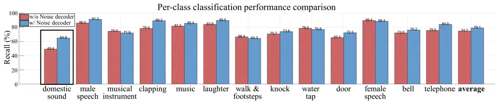

Figure 6: Per-class classification performance with and without noise
decoder

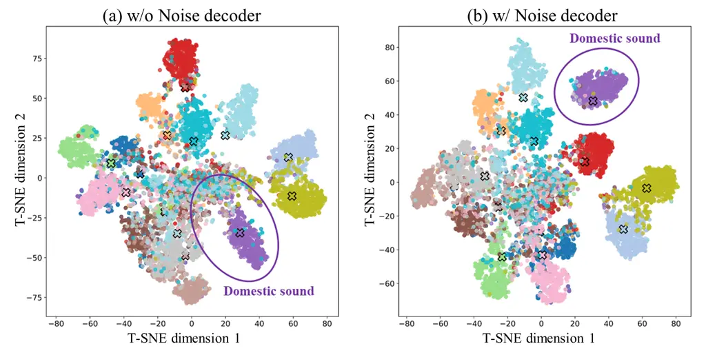

Figure 7: T-SNE comparison with and without noise decoder

## Appendix C Effect of direct and reverb decoder on DoAE

To investigate the effect of estimating direct and reverberant
foreground signals separately on DoAE, we conducted a detailed analysis.
Estimating direct and reverberant signals separately introduces the
dereverberation task in addition to the denoising and separation tasks,
which can lead to a decrease in overall separation performance. However,
as shown in Figure 8, the LE histogram for DoAE reveals an increase in
the number of samples with LE within 10 degrees, while the number of
samples with LE greater than 10 degrees decreases. This indicates that
even though the direct and reverb decoders are part of the audio
decoder, they positively influence DoAE performance.

To understand how the dereverberation task affects DoAE, we performed a
cosine similarity analysis between the convolution kernel weights.
Figure 9 compares the cosine similarity between the first convolution
kernel weights of the DoA decoder and those of the direct and reverb
decoders. The results show that the similarity between the DoA decoder
and the direct decoder is higher than that between the DoA decoder and
the reverb decoder. This suggests that the DoA decoder relies more on
the direct components than the reverb components for DoAE. In
reverberant environments, DoAE is more challenging compared to anechoic
environments. This observation implies that learning to separate direct
and reverb components within the object features can improve DoAE by
ensuring that the direct components are properly embedded in the
features.

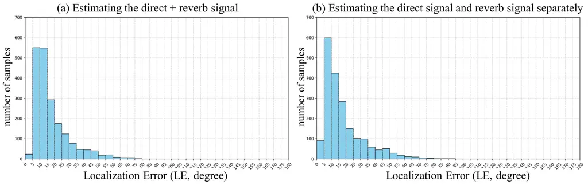

Figure 8: Comparison of LE histograms when estimating (a) direct +
reverb signals together and (b) direct and reverb separately.

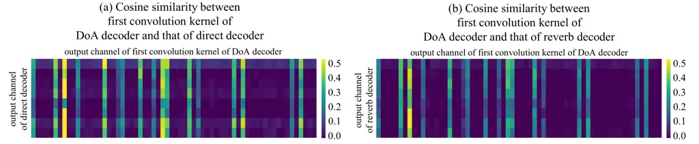

Figure 9: Comparison of cosine similarity between the weight of the
first convolution kernel of the DoA decoder and the convolution kernel
weights of (a) direct decoder and (b) reverb decoder

Furthermore, to evaluate the performance of dereverberation, we compared
the results of reverberant, direct (dereverberation,
$`\text{SI\text{-}SDR}_{\mathbf{s}}`$) and reverb source separation
($`\text{SI\text{-}SDR}_{\mathbf{h}}`$), as well as the
speech-to-reverberation modulation ratio (SRMR) \[56\]. SRMR is only
calculated for classes corresponding to male and female speech. The
experimental results demonstrate that the proposed model performs well
in dereverberation, achieving performance comparable to full source
separation. Additionally, with an SRMR of 6.5, the model indicates
strong dereverberation effectiveness.

| SI-SDR | $`\textbf{SI\text{-}SDR}_{\mathbf{s}}`$ | $`\textbf{SI\text{-}SDR}_{\mathbf{h}}`$ | SRMR |
| ------ | --------------------------------------- | --------------------------------------- | ---- |
| 10.8   | 10.8                                    | 10.1                                    | 6.5  |

Table 6: Dereverberation performance of proposed model

## Appendix D Detailed analysis on time-varying learnable window

In this section, we present experiments to investigate the role and
functionality of the time-varying learnable window. In the audio
encoder, the short-time Fourier transform (STFT) is widely used to
convert a waveform into a complex spectrogram. Unlike speech separation,
which considers only the speech class, USS involves various classes,
necessitating dynamic adjustments to the configuration of the window.
Although many conventional methods rely on fixed windows \[28, 12, 38\],
this reliance limits their performance \[57\]. To address this
limitation, we propose a time-varying learnable window that can
dynamically adjust the window configuration for both USS and ASA.

[TABLE]

Table 7: Ablation study results of time-variant learnable window

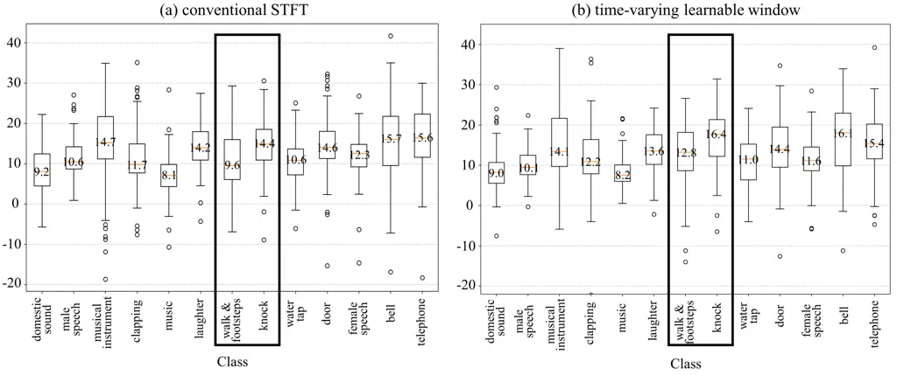

Figure 10: Comparison of source separation performance for each class:
(a) conventional STFT, (b) time-varying learnable window

We conducted a detailed ablation study on the effect of the time-varying
learnable window. The results are presented in Table 7. Initially, we
compared encoding methods using complex STFT and learnable 1D
convolution kernels. The performance of complex STFT generally exceeded
that of the 1D convolution kernel, suggesting that while the 1D
convolution kernel extracts learnable features, complex STFT is more
effective at explicitly capturing frequency information in the feature
representation. Additionally, the time-invariant learnable window learns
a fixed window across time, resulting in a window length that is similar
to that of the STFT. The time-invariant learnable window can be obtained
by performing mean pooling in the temporal dimension before being passed
through the linear layers of the time-varying learnable window. Next, we
examined TDY-CNN \[57\], which learns attention weights for each time
frame to control how much information is passed through, capturing
phoneme variation. However, this approach has the limitation of being
unable to adjust the frequency band information. In contrast, the
proposed method allows for control over the frequency band by adjusting
the width of the main lobe.

Figure 10 presents a comparison of separation performance for each
class. The results show a significant improvement in the separation
performance of sporadic sounds, such as door and knock events. Despite
being transient, the time-varying learnable window effectively captures
the characteristics of these sound objects, allowing the model to
improve separation performance.

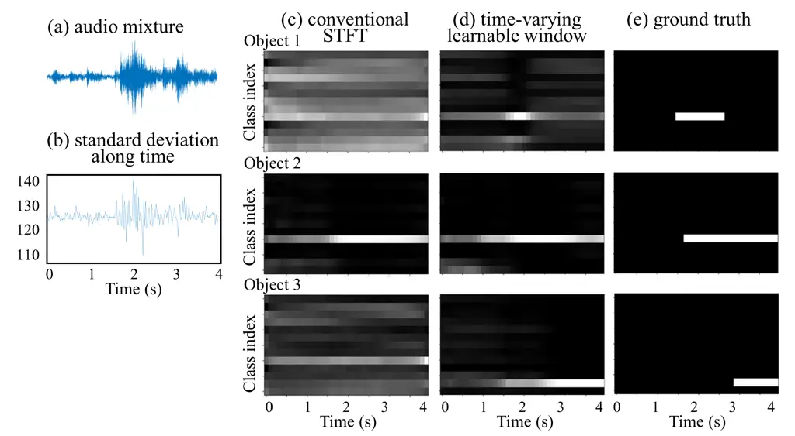

Figure 11: (a) Time-domain waveform of the audio mixture, (b) window
length along the time frame, SED results for (c) conventional STFT, (d)
time-varying learnable window, (e) ground truth.

Figure 11 shows a comparison of the sample between conventional STFT and
the proposed time-varying learnable window. Figure 11(a) shows the
time-domain waveform of the audio mixture, and Figure 11(b) plots its
frame-wise standard deviation over time. Figure 11(c), (d), and (e)
present the SED result of conventional STFT, that of time-varying
learnable window, and ground truth, respectively, with binary values
between 0 and 1 (black indicates 0, white indicates 1). The results show
that with conventional STFT, object 1 was not captured, and object 3
failed in both classification and activation estimation. However, using
the proposed method, the model can detect object 1, which improves the
sound event detection performance of object 3.

Finally, Figure 12 shows a GradCAM \[58\] analysis of the separated
object features immediately after the object splitter, to examine how
well the object features encapsulate the properties of the corresponding
sound objects. The model with conventional STFT struggled with object
separation, as regions of speech are still embedded within telephone
regions. In contrast, the proposed method more effectively isolates the
telephone regions by suppressing most of the speech-related components.
This demonstrates that the proposed approach effectively separates sound
objects based on auditory information.

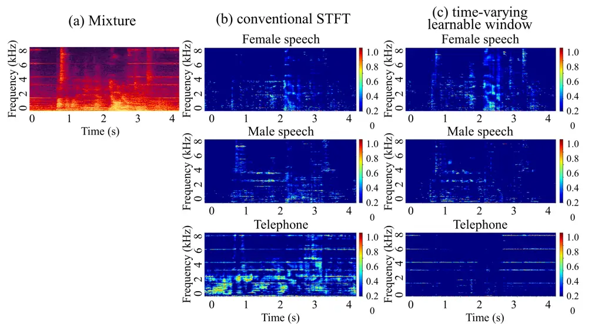

Figure 12: (a) Spectrogram of the audio mixture, GradCAM results for (b)
conventional STFT, (c) time-varying learnable window.

## Appendix E Detailed study on Chain-of-Inference

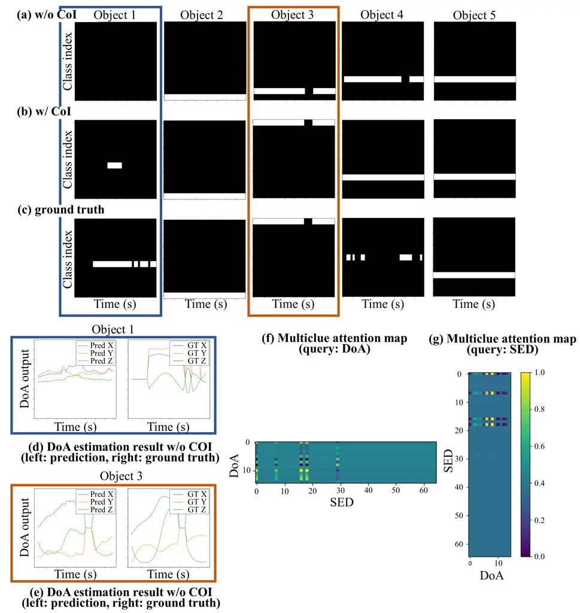

Figure 13: SED result (a) without CoI, (b) with CoI, (c) ground truth,
and (d) DoAE result of object 1 without CoI model, (e) DoAE of object 3
without CoI, multiclue attention map for (f) DoA query, (g) SED query

In this section, we conduct a case study to understand the underlying
mechanism of the CoI. It was observed that the model struggled with SED
before applying the CoI, whereas the SED performance improved after its
application. We then analyzed the fundamental reasons for this
improvement. Figure 13(a), (b), and (c) present the SED output for the
model without CoI, the model with CoI, and the ground truth,
respectively. By comparing the performance before and after applying
CoI, an improvement is observed in the SED estimation for object 1 and
object 3. To investigate the cause of this difference, we examined the
DoAE results for object 1 and object 3 before applying CoI in
Figure 13(d) and (e), and the multi-clue attention maps with SED as the
query and DoA as the query in Figure 13(f) and (g), respectively. In the
DoAE results, for object 1, DoA vectors below the onset threshold (0.5)
suggest the potential presence of an object, while for object 3, the
estimated DoA closely matches the ground truth. This indicates that the
classification of object 3 was refined through CoI by leveraging the
nearly accurate DoAE. Furthermore, examining the attention maps, the
attention map with SED as the query identified four objects, whereas the
one with DoA as the query identified five. This demonstrates the
successful correction of object 1, which was mistakenly classified as
silence, by utilizing DoA information.

| Stage           | USS                  |                   | SED               |                 | DoAE              |                 | SELD $`\downarrow`$ | Complexities   |         |
| --------------- | -------------------- | ----------------- | ----------------- | --------------- | ----------------- | --------------- | ------------------- | -------------- | ------- |
|                 | SI-SDRi $`\uparrow`$ | SDRi $`\uparrow`$ | ER $`\downarrow`$ | F1 $`\uparrow`$ | LE $`\downarrow`$ | LR $`\uparrow`$ |                     | Param.         | MAC/s   |
| without CoI     | 11.0                 | 11.7              | 28.8              | 70.2            | 18.5              | 76.9            | 0.230               | 8.2 (+96.8) M  | 99.1 G  |
| CoI (1st stage) | 11.2                 | 12.0              | 25.0              | 74.1            | 17.0              | 78.1            | 0.206               | 12.1 (+96.8) M | 104.0 G |
| CoI (2nd stage) | 11.1                 | 11.9              | 26.8              | 72.3            | 17.2              | 77.5            | 0.216               | 16.0 (+96.8 M) | 118.9 G |

Table 8: Performance comparison by repeating chain-of-inference

Additionally, the CoI mechanism utilizes the high-level information
(DoA, SED) to refine the object feature separation based on the temporal
coherence matching (TCM), so using the same mechanism multiple times can
bias the results towards the direction of prioritizing TCM. We present
the results of performing the chain-of-inference multiple times as
Table 8. As a result, using CoI only once resulted in the highest
performance.

## Appendix F Comparison with SOTA models for ASA2 dataset and real-world demonstration

Comparison USS and SELD performance on ASA2 dataset We compared the
performance of the proposed DeepASA model on the ASA2 dataset with that
of other SOTA models in Table 9. First, the proposed model achieved
superior USS performance compared to other models \[26, 47, 49, 38\],
even though it operates with a MIMO setup and performs a dereverberation
task. Despite having a lightweight feature aggregation module compared
to DeFT-Mamba, the model still achieved SOTA performance. This
improvement is likely due to the ability of the model to utilize various
auditory information, such as class, activation, DoA, and noise,
enabling better separation of foreground sources. Next, in terms of SELD
performance, the proposed model significantly outperformed existing
models. This is because ASA2 consists entirely of polyphonic audio, and
earlier approaches that estimate the outputs directly from mixtures are
unsuitable for such overlapped sources. Our model avoids this limitation
by separating the objects.

| model                   | USS                  |                   | SED               |                 | DoAE              |                 | SELD $`\downarrow`$ | Complexities   |         |
| ----------------------- | -------------------- | ----------------- | ----------------- | --------------- | ----------------- | --------------- | ------------------- | -------------- | ------- |
|                         | SI-SDRi $`\uparrow`$ | SDRi $`\uparrow`$ | ER $`\downarrow`$ | F1 $`\uparrow`$ | LE $`\downarrow`$ | LR $`\uparrow`$ |                     | Param.         | MAC/s   |
| ByteDance-uss \[7\]     | 5.2                  | 8.3               | \-                | \-              | \-                | \-              | \-                  | 28 (+80.7) M   | 40.1 G  |
| TF-GridNet \[47\]       | 8.7                  | 10.7              | \-                | \-              | \-                | \-              | \-                  | 14.7 M         | 462 G   |
| SpatialNet \[49\]       | 9.6                  | 10.2              | \-                | \-              | \-                | \-              | \-                  | 7.3 M          | 71.8 G  |
| DeFT-Mamba \[38\]       | 10.4                 | 11.3              | \-                | \-              | \-                | \-              | \-                  | 3.6 M          | 83.8 G  |
| EINV2 \[53\]            | \-                   | \-                | 48.5              | 39.5            | 27.1              | 51.5            | 0.431               | 51.5 M         | 6.7 G   |
| ResNet Conformer \[59\] | \-                   | \-                | 45.7              | 41.0            | 26.6              | 53.7            | 0.414               | 13.6 M         | 7.6 G   |
| SELD-Mamba \[55\]       | \-                   | \-                | 43.5              | 42.7            | 25.5              | 56.7            | 0.396               | 75.1 M         | 4.3 G   |
| MFF-EINV2 \[50\]        | \-                   | \-                | 42.1              | 43.2            | 25.8              | 60.7            | 0.381               | 54.8 M         | 14.3 G  |
| DeepASA (w/o ATST)      | 11.0                 | 11.7              | 30.1              | 69.5            | 18.5              | 74.8            | 0.240               | 8.2 M          | 91.0 G  |
| DeepASA                 | 11.0                 | 11.7              | 28.8              | 70.2            | 18.5              | 76.9            | 0.230               | 8.2 (+96.8) M  | 99.1 G  |
| (+) Chain-of-inference  | 11.2±0.1             | 12.0±0.1          | 25.0±0.4          | 74.1±0.3        | 17.0±0.3          | 78.1±0.4        | 0.206±0.001         | 12.1 (+96.8) M | 104.0 G |

Table 9: Comparison with SOTA models on ASA2 dataset

Real-world demonstration To evaluate the applicability of the proposed
method and dataset in real-world scenarios, we experimented using a
pre-trained model without fine-tuning. The experiment was carried out in
a real office environment, where three sound objects (male speech,
music, and a telephone) were placed. Among these, the male speech was a
moving source. The miniDSP ambiMIK-1 was utilized for capturing the
sound, which is different from the microphone configuration for the
pre-training dataset. The results demonstrate that the pre-trained
DeepASA model can be applied to USS, SED, and DoAE tasks in real-world
conditions, confirming its feasibility. A demo video of the real-world
experiment and example results from the ASA2 dataset are available on
the page linked below³³ 3
[https://huggingface.co/spaces/donghoney22/DeepASA](https://huggingface.co/spaces/donghoney22/DeepASA).

Additionally, we conducted an experiment by fine-tuning the pretrained
DeepASA over datasets generated from real-world room impulse responses
(RIRs). The fine-tuned model was then evaluated by unseen real-world
RIRs. From Table 10, the experimental results show a slight decrease in
USS performance, as well as in most of SELD performance. This
performance degradation can be attributed to the discrepancy in the
hidden representation of simulation and real RIRs. Ideally, training
with a large set of RIRs, including both simulated and measured RIRs,
would improve the generalizability of models.

|                      |                   |                   |                 |                   |                 |      |                     |
| -------------------- | ----------------- | ----------------- | --------------- | ----------------- | --------------- | ---- | ------------------- |
| RIR                  | USS               |                   | SED             |                   | DoAE            |      | SELD $`\downarrow`$ |
| SI-SDRi $`\uparrow`$ | SDRi $`\uparrow`$ | ER $`\downarrow`$ | F1 $`\uparrow`$ | LE $`\downarrow`$ | LR $`\uparrow`$ |      |                     |
| simulated RIR        | 11.0              | 11.7              | 28.8            | 70.2              | 18.5            | 76.9 | 0.230               |
| real RIR             | 10.6              | 11.4              | 32.7            | 66.4              | 13.4            | 72.3 | 0.254               |

Table 10: Comparison between datasets with simulated and real-world RIRs

## Appendix G Experimental results along with the number of sound sources

We performed inference when the number of sound sources was within the
maximum estimable range \[2, 5\]. and when it exceeded the maximum
estimable range \[6, 7\]. The experimental results are presented in
Table 11. When the number of foreground sources is 6 or 7, resulting in
a sharp decline in performance. The experimental results show that when
there are 6 sources, two sources are not separated, leading to very low
performance only for the two sources. When there are 7 sources, three
sources are mixed and mapped to one track in most cases, resulting in
very low performance for three of the sources.

|                   |                  |                      |                   |                   |                 |                   |                 |                     |
| ----------------- | ---------------- | -------------------- | ----------------- | ----------------- | --------------- | ----------------- | --------------- | ------------------- |
| Number of sources |                  | USS                  |                   | SED               |                 | DoAE              |                 | SELD $`\downarrow`$ |
|                   |                  | SI-SDRi $`\uparrow`$ | SDRi $`\uparrow`$ | ER $`\downarrow`$ | F1 $`\uparrow`$ | LE $`\downarrow`$ | LR $`\uparrow`$ |                     |
| 2                 |                  | 17.7                 | 17.1              | 22.1              | 82.4            | 10.5              | 88.5            | 0.143               |
| 3                 |                  | 14.6                 | 14.5              | 22.4              | 80.8            | 13.1              | 86.3            | 0.160               |
| 4                 |                  | 8.5                  | 10.6              | 33.8              | 65.6            | 20.9              | 72.5            | 0.269               |
| 5                 |                  | 7.9                  | 10.3              | 34.9              | 64.5            | 22.1              | 71.3            | 0.280               |
| 6                 | Total            | 2.4                  | 5.9               | 47.7              | 48.5            | 40.3              | 54.5            | 0.418               |
|                   | Top 4 average    | 7.0                  | 9.6               | 38.2              | 61.2            | 25.6              | 66.7            | 0.311               |
|                   | Bottom 2 average | -6.8                 | -1.5              | 69.1              | 23.1            | 69.7              | 30.1            | 0.636               |
| 7                 | Total            | 0.2                  | 4.5               | 59.0              | 36.6            | 51.7              | 42.4            | 0.521               |
|                   | Top 4 average    | 6.6                  | 9.1               | 38.9              | 60.6            | 29.2              | 64.5            | 0.325               |
|                   | Bottom 2 average | -8.3                 | -1.6              | 85.8              | 4.6             | 81.7              | 12.9            | 0.784               |

Table 11: Experimental results along with the number of sound sources
