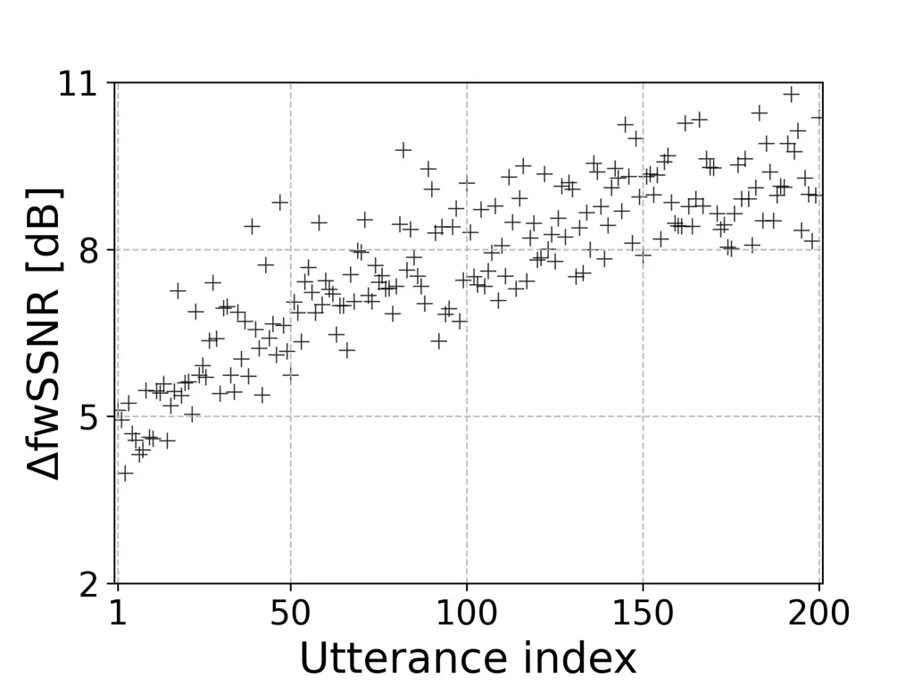
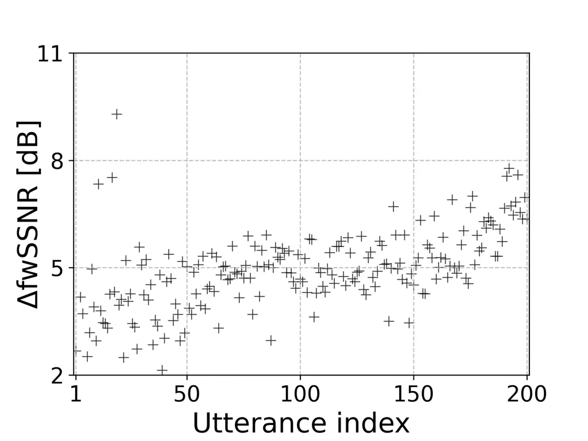

# Influence of Clean Speech Characteristics on Speech Enhancement Performance

Mingchi Hou     Ina Kodrasi ^(†)^(†)thanks: This work was supported by
the Swiss National Science Foundation project 200021_215187 on
“Pathological Speech Enhancement”.

###### Abstract

Speech enhancement (SE) performance is known to depend on noise
characteristics and signal-to-noise ratio (SNR), yet intrinsic
properties of the clean speech signal itself remain an underexplored
factor. In this work, we systematically analyze how clean speech
characteristics influence enhancement difficulty across multiple
state-of-the-art SE models, languages, and noise conditions. We extract
a set of pitch, formant, loudness, and spectral flux features from clean
speech and compute correlations with objective SE metrics, including
frequency weighted segmental SNR and PESQ. Our results show that formant
amplitudes are consistently predictive of SE performance, with higher
and more stable formants leading to larger enhancement gains. We further
demonstrate that performance varies substantially even within a single
speaker’s utterances, highlighting the importance of intra-speaker
acoustic variability. These findings provide new insights into SE
challenges, suggesting that intrinsic speech characteristics should be
considered when designing datasets, evaluation protocols, and
enhancement models.

###### Index Terms: 

speech enhancement, intrinsic acoustic features, intra-speaker
variability

^(†)^(†)address: ¹Idiap Research Institute, Switzerland  
²École Polytechnique Fédérale de Lausanne, Switzerland

## 1 Introduction

Speech enhancement (SE) has seen significant progress in recent years,
driven by advances in deep learning and the availability of large-scale
corpora. Many neural approaches for SE learn direct mappings from noisy
to clean speech, commonly through spectral mask prediction \[1, 2\] or
spectral coefficient estimation \[3\]. While effective, these methods
may show limited robustness in unseen noise conditions \[4\]. To address
these limitations, researchers have explored generative modeling
approaches \[5, 6, 7\]. Generative approaches, such as
diffusion-based \[6\] and Schrödinger Bridge-based \[8\] models, model
speech probabilistically rather than deterministically, improving
performance across diverse scenarios.

Although the performance of state-of-the-art SE models has considerably
imporoved, the recent URGENT challenge shows that certain acoustic
scenarios (such as e.g., wideband or impulse noise) as well as specific
speech samples remain particularly challenging to enhance \[9\]. These
challenges frequently lead to degraded intelligibility and quality,
highlighting persistent weaknesses in the design of state-of-the-art
models. As demonstrated in \[9\], a critical issue in this context is
the lack of reliable objective indicators of the difficulty of enhancing
a given speech sample. Traditional analyses have primarily emphasized
degradation characteristics such as noise type or signal-to-noise ratio
(SNR) as contributors to enhancement difficulty. While these aspects are
undeniably important, they do not fully characterize the difficulty of
enhancing a given speech sample. For instance, utterances with high SNR
values may still contain characteristics that render them hard to
process, and even under identical noise conditions and SNRs, different
utterances can yield noticeably different results \[9\]. This mismatch
complicates the design of SE training corpora with balanced difficulty
distribution, as current measures do not provide sufficient insight into
which samples are inherently difficult and why \[9\].

An underexplored perspective is that the difficulty of SE not only
depends on the properties of the degradation, but also on intrinsic
characteristics of the underlying clean speech signal. Speech is
acoustically diverse, with phoneme articulation, temporal dynamics,
spectral richness, and voice quality varying significantly across
speakers, utterances, and contexts. These intrinsic acoustic features
influence how degradations manifest, and consequently, how recoverable
the speech is after enhancement. For example, \[10\] has shown that
Lombard speech, a speaking style with altered pitch, loudness, and
spectral characteristics, can considerably affect enhancement
performance, illustrating the role of intrinsic speech variability.

Speaker-aware SE methods further highlight that intrinsic
characteristics of the clean speech signal influence enhancement
performance \[11, 12, 13, 14, 15, 16\]. These methods condition models
on speaker embeddings or fine-tune them on speaker-specific data,
improving intelligibility and perceptual quality for speakers whose
acoustic characteristics are underrepresented in the training
data \[16\]. These approaches typically assume that variability is
primarily among speakers, treating all utterances from a speaker
uniformly. While these results confirm that clean speech characteristics
influence SE performance, they do not clarify which specific speech
characteristics are most critical, nor how variability within a single
speaker’s utterances affects enhancement difficulty.

Our work directly investigates which intrinsic acoustic features of
clean utterances systematically influence enhancement difficulty by
analyzing correlations between acoustic measures and objective SE
metrics. Specifically, we analyze correlations between SE performance
and a set of pitch, formant, loudness, and spectral flux features,
extracted from the underlying clean utterances. Our analysis considers
multiple SE models, languages, noise types, and SNRs, allowing us to
assess whether these intrinsic characteristics consistently relate to
enhancement difficulty across different systems and linguistic contexts.
By grounding the analysis in clean speech properties rather than
degradation conditions alone, we aim to establish a new lens for
understanding SE challenges. This perspective provides complementary
insights to traditional noise-based measures and can support more
principled dataset design and difficulty-aware SE evaluation.

## 2 Analysis Framework

To investigate the relationship between intrinsic speech characteristics
and enhancement difficulty, we adopt the following strategy. We first
consider a representative set of state-of-the-art SE models trained
following standard practices in the literature (cf. Sections 2.1
and 3.2). A test set is generated by taking clean speech samples of the
same length and creating multiple noisy versions of each sample using a
fixed set of noise signals and SNRs (cf. Section 3). This ensures that
all external factors aside from the intrinsic properties of the speech
signals are kept constant across the dataset. For each clean speech
sample in the test set, a set of acoustic features is extracted to
characterize it (cf. Section 2.2). SE models are then applied to the
noisy signals, and performance improvements are computed using the
objective metrics frequency-weighted segmental SNR (fwSSNR) \[17\] and
PESQ \[18\]. For each clean sample, these improvements are averaged
across all considered noisy versions of it. Finally, correlations
between the sample-level acoustic features and these average performance
improvements are analyzed to identify which intrinsic speech properties
systematically influence enhancement difficulty. To assess whether
observed trends generalize across languages, the analysis is separately
performed for two languages, with models trained and tested on English
and models trained and tested on Spanish. In the following, we briefly
review the considered SE systems and provide a more detailed description
of the acoustic features used.

### 2.1 Speech enhancement models

We analyze a representative set of state-of-the-art SE models that span
different modeling paradigms, including mask-based prediction, complex
regression, diffusion, and optimal transport. In the following, we
briefly summarize the systems considered in our analysis. Details on the
implementation and training of these models are presented in Section 3.

_Magnitude spectrogram masking (MM)._  Mask-based models enhance speech
by selectively suppressing noise-dominated time–frequency components in
the noisy spectrogram \[19\]. Our MM system uses a deep neural network
(DNN) to predict an ideal ratio mask, constrained to $`[0,1]`$ via a
sigmoid activation. The model is optimized with the scale-invariant
signal-to-distortion ratio \[20\].

_Complex spectrogram regression (CR)._  While MM models leave the noisy
phase unaltered, regression-based methods directly estimate both
magnitude and phase. Our CR system uses a DNN that predicts the real and
imaginary parts of the clean short-time Fourier transform (STFT)
coefficients \[21\], trained with a time-domain mean square error (MSE)
loss against the clean reference.

_Score-based diffusion (SGMSE+)._  Diffusion models enhance speech by
reversing a gradual noise corruption process \[22\]. Our SGMSE+ system
trains a DNN to estimate the score function that guides this reverse
process, augmented with an affine drift term and a predictor–corrector
sampler for improved stability and reconstruction quality \[23\].

_Schrödinger Bridge (SB)._  The SB formulation casts SE as an optimal
transport problem between noisy and clean speech distributions \[24,
8\]. Instead of diffusing clean signals toward noise, the SB approach
learns an interpolation that directly couples noisy inputs with their
clean counterparts. Our SB system employs an SDE-based sampler to
generate enhanced waveforms \[8\].

### 2.2 Acoustic features

To investigate how intrinsic speech characteristics may influence
enhancement difficulty, we extract a set of acoustic features using the
openSMILE toolkit \[25\]. In the following, we describe the considered
acoustic features and the rationale behind their selection.

_Pitch._  Pitch characterizes the harmonic structure of an utterance and
its prosodic patterns, which can influence enhancement performance.
Utterances with low pitch may be challenging to enhance because their
harmonics are closely spaced and more easily masked by noise. Similarly,
low pitch variability (i.e., monotone speech) reduces temporal and
spectral cues, potentially making it harder for models to distinguish
speech from background noise. To quantify pitch characteristics for an
utterance, we consider the mean and standard deviation of the
fundamental frequency $`f_{0}`$ extracted using robust tracking and
smoothing \[26\].

_Formants._  Formants describe the resonant frequencies of the vocal
tract and shape the spectral envelope of speech, providing important
spectral cues. Low formant amplitudes can reduce the local SNR, making
speech harmonics more easily masked by noise. High variability in
formant amplitudes indicates rapidly fluctuating spectral peaks, which
may be difficult for SE models to track and reconstruct accurately.
Conversely, low variability indicates flat formants, potentially
providing fewer dynamic cues to distinguish speech from noise. To
quantify formant characteristics, we consider the mean and standard
deviation of the amplitudes of the first three formants ($`F_{1}`$,
$`F_{2}`$, $`F_{3}`$) extracted using linear predictive coding and
peak-picking in the smoothed spectrum \[26\].

_Loudness._  Loudness characterizes the perceived intensity of speech.
Utterances with low loudness levels may be challenging for SE models,
because low-energy segments can be easily masked by noise. Furthermore,
high loudness variability within an utterance indicates rapid intensity
fluctuations, which may be difficult for models to track. Conversely,
low loudness variability may provide fewer dynamic cues, potentially
reducing the ability of SE models to distinguish speech from noise. To
quantify loudness characteristics, we consider the utterance-level mean
and standard deviation of the loudness level computed using a
psychoacoustic model with short-term smoothing \[26\].

_Spectral flux._  Spectral flux measures the frame-to-frame change of
the short-term spectrum, reflecting how the spectral envelope evolves
over time. Unlike formant amplitudes, which describe static resonances
at a given time, spectral flux captures the dynamics of those resonances
and other spectral components. Utterances with high spectral flux, for
instance due to rapid consonant–vowel transitions or expressive
articulation, present frequent and abrupt changes that may challenge SE
models. Conversely, low spectral flux indicates relatively stable
spectra, which may provide fewer dynamic cues and challenge SE models
when the noise spectrum overlaps strongly with speech. To capture these
dynamics, we compute both the mean and standard deviation of spectral
flux across each utterance as in \[26\].

## 3 Experimental settings

### 3.1 Datasets

_Clean speech datasets._  To assess the generalizability of our findings
across languages, we use two clean speech datasets, i.e., the English
Wall Street Journal (WSJ0) dataset \[27\] and the Crowdsourced Latin
American Spanish (CROWD) dataset \[28\]. WSJ0 is a widely adopted
benchmark in SE research \[23, 8\], comprising $`120`$ speakers and
$`28.6`$ hours of recordings. For training and evaluation, we follow the
official partitioning into $`101`$ training, $`10`$ validation, and
$`8`$ test speakers. Although CROWD is larger than WSJ0, we use a subset
of it to ensure a fair comparison. This subset is constructed so that
the training, validation, and test sets contain the same number of
speakers as in WSJ0, totaling $`26.7`$ hours of audio. All signals are
downsampled to $`16`$ kHz. To ensure that test performance is not
influenced by varying signal lengths and depends only on the intrinsic
properties of the clean signals, the available test utterances are
segmented into $`2`$ second chunks, and $`200`$ chunks are randomly
selected per speaker. This procedure results in $`1,600`$ clean test
samples per dataset (i.e., $`200`$ chunks from each of the $`8`$ test
speakers).

_Noisy mixtures._  To generate noisy mixtures, we use four noise types
(bus, cafe, pedestrian area, and street) from the CHiME3 dataset \[29\].
All noise signals are first downsampled to $`16`$ kHz. Following common
practice in the literature \[30, 8\], the noisy training and validation
sets are created by randomly selecting a noise file and adding it to a
clean signal with an SNR randomly chosen between $`-6`$ dB and $`14`$
dB. For the noisy test set, to ensure that performance depends only on
the intrinsic properties of the clean signals and is not influenced by
varying noise types or SNRs, multiple noisy versions of each clean test
sample are generated using the fixed set of three SNRs ($`-5`$ dB, $`5`$
dB, and $`15`$ dB) and the same $`2`$ second chunk from each of the four
noise types. This procedure results in $`19200`$ noisy test samples per
dataset (i.e., $`12`$ noisy versions for each of the $`1600`$ clean test
samples).

### 3.2 Model architectures and training

As in \[30\], signals are transformed to the STFT domain using a window
size of $`510`$ samples and a hop size of $`128`$ samples. To compress
the dynamic range, the STFT coefficients are further processed with
$`\alpha=0.5`$ and $`\beta=0.33`$ as in \[8\].

MM is implemented using a $`5`$-layer BiLSTM \[2\]. CR follows the NCSN+
U-Net architecture, modified for complex inputs as in \[30\]. SGMSE+
uses denoising score matching with hyperparameters
$`\sigma_{\min}=0.05`$, $`\sigma_{\max}=0.5`$, $`\gamma=1.5`$, and a
$`30`$-step predictor–corrector sampler \[23\]. SB uses a
variance-exploding schedule with hyperparameters $`\sigma_{\min}=0.7`$,
$`\sigma_{\max}=1.82`$, and $`50`$-step SDE sampling. Both SGMSE+ and SB
use NCSN+ backbones with noise-scheduling layers and exponential moving
average with a weight decay of $`0.999`$ \[8\]. The number of trainable
parameters for MM, CR, SGMSE+, and SB is $`7.6`$ million, $`22.1`$
million, $`25.2`$ million, and $`25.2`$ million, respectively.

Training is performed using the Adam optimizer with a batch size of
$`8`$, a learning rate of $`10^{-4}`$, and a maximum of $`1000`$ epochs.
Training stops if the validation loss does not decrease for $`20`$
consecutive epochs. The CR, SGMSE+, and SB models are trained on an
NVIDIA H100 GPU, whereas MM is trained on an RTX 3090 GPU.

|        |       |              |            |           |              |              |            |              |            |          |            |          |            |
| ------ | ----- | ------------ | ---------- | --------- | ------------ | ------------ | ---------- | ------------ | ---------- | -------- | ---------- | -------- | ---------- |
| Model  | Lang. | $`f_{0}`$    |            | $`F_{1}`$ |              | $`F_{2}`$    |            | $`F_{3}`$    |            | Loudness |            | Flux     |            |
|        |       | $`\mu`$      | $`\sigma`$ | $`\mu`$   | $`\sigma`$   | $`\mu`$      | $`\sigma`$ | $`\mu`$      | $`\sigma`$ | $`\mu`$  | $`\sigma`$ | $`\mu`$  | $`\sigma`$ |
| MM     | En.   | $`0.50`$     | $`-0.05`$  | $`0.65`$  | $`-0.61`$    | $`0.68`$     | $`-0.64`$  | $`\bf 0.69`$ | $`-0.66`$  | $`0.37`$ | $`-0.58`$  | $`0.20`$ | $`-0.52`$  |
|        | Sp.   | $`0.28`$     | $`0.16`$   | $`0.62`$  | $`-0.60`$    | $`0.64`$     | $`-0.63`$  | $`\bf 0.65`$ | $`-0.61`$  | $`0.43`$ | $`-0.46`$  | $`0.34`$ | $`-0.48`$  |
| CR     | En.   | $`0.41`$     | $`-0.03`$  | $`0.75`$  | $`-0.73`$    | $`0.77`$     | $`-0.74`$  | $`\bf 0.78`$ | $`-0.77`$  | $`0.49`$ | $`-0.65`$  | $`0.30`$ | $`-0.59`$  |
|        | Sp.   | $`0.21`$     | $`0.06`$   | $`0.70`$  | $`-0.67`$    | $`\bf 0.72`$ | $`-0.71`$  | $`\bf 0.72`$ | $`-0.70`$  | $`0.60`$ | $`-0.52`$  | $`0.48`$ | $`-0.48`$  |
| SGMSE+ | En.   | $`0.37`$     | $`-0.03`$  | $`0.68`$  | $`-0.67`$    | $`0.70`$     | $`-0.67`$  | $`\bf 0.72`$ | $`-0.71`$  | $`0.46`$ | $`-0.64`$  | $`0.26`$ | $`-0.59`$  |
|        | Sp.   | $`0.17`$     | $`0.05`$   | $`0.51`$  | $`\bf-0.54`$ | $`0.51`$     | $`-0.50`$  | $`0.51`$     | $`-0.46`$  | $`0.50`$ | $`-0.38`$  | $`0.50`$ | $`-0.28`$  |
| SB     | En.   | $`0.38`$     | $`-0.01`$  | $`0.70`$  | $`-0.68`$    | $`0.72`$     | $`-0.69`$  | $`\bf 0.74`$ | $`-0.72`$  | $`0.48`$ | $`-0.66`$  | $`0.28`$ | $`-0.60`$  |
|        | Sp.   | $`\bf 0.45`$ | $`0.08`$   | $`0.30`$  | $`-0.33`$    | $`0.34`$     | $`-0.37`$  | $`0.35`$     | $`-0.37`$  | $`0.30`$ | $`-0.10`$  | $`0.27`$ | $`-0.16`$  |

Table 1: Pearson correlation coefficients between $`\Delta`$fwSSNR of
the considered SE models and acoustic features. Models are separately
trained and tested on English (En.) and Spanish (Sp.) datasets. $`\mu`$
and $`\sigma`$ denote the mean and standard deviation of the considered
acoustic features. Values in bold indicate the highest correlation for
each model and dataset. Statistically insignificant correlations are
grayed.

|        |       |              |            |           |            |              |            |              |              |           |            |           |            |
| ------ | ----- | ------------ | ---------- | --------- | ---------- | ------------ | ---------- | ------------ | ------------ | --------- | ---------- | --------- | ---------- |
| Model  | Lang. | $`f_{0}`$    |            | $`F_{1}`$ |            | $`F_{2}`$    |            | $`F_{3}`$    |              | Loudness  |            | Flux      |            |
|        |       | $`\mu`$      | $`\sigma`$ | $`\mu`$   | $`\sigma`$ | $`\mu`$      | $`\sigma`$ | $`\mu`$      | $`\sigma`$   | $`\mu`$   | $`\sigma`$ | $`\mu`$   | $`\sigma`$ |
| MM     | En.   | $`0.39`$     | $`0.09`$   | $`0.36`$  | $`-0.34`$  | $`0.40`$     | $`-0.39`$  | $`\bf 0.41`$ | $`\bf-0.41`$ | $`0.31`$  | $`-0.22`$  | $`0.21`$  | $`-0.22`$  |
|        | Sp.   | $`\bf 0.51`$ | $`0.04`$   | $`-0.07`$ | $`0.05`$   | $`-0.03`$    | $`-0.02`$  | $`-0.03`$    | $`-0.06`$    | $`-0.06`$ | $`0.32`$   | $`-0.11`$ | $`0.08`$   |
| CR     | En.   | $`0.46`$     | $`0.04`$   | $`0.47`$  | $`-0.45`$  | $`0.52`$     | $`-0.51`$  | $`\bf 0.53`$ | $`-0.52`$    | $`0.33`$  | $`-0.29`$  | $`0.20`$  | $`-0.27`$  |
|        | Sp.   | $`\bf 0.54`$ | $`-0.06`$  | $`0.16`$  | $`-0.12`$  | $`0.21`$     | $`-0.26`$  | $`0.22`$     | $`-0.33`$    | $`0.12`$  | $`0.05`$   | $`-0.05`$ | $`-0.18`$  |
| SGMSE+ | En.   | $`0.41`$     | $`0.01`$   | $`0.41`$  | $`-0.40`$  | $`0.45`$     | $`-0.44`$  | $`\bf 0.46`$ | $`\bf-0.46`$ | $`0.30`$  | $`-0.30`$  | $`0.16`$  | $`-0.27`$  |
|        | Sp.   | $`0.24`$     | $`-0.03`$  | $`0.24`$  | $`-0.21`$  | $`0.26`$     | $`-0.29`$  | $`0.26`$     | $`\bf-0.32`$ | $`0.29`$  | $`-0.06`$  | $`0.21`$  | $`-0.22`$  |
| SB     | En.   | $`0.47`$     | $`0.001`$  | $`0.42`$  | $`-0.41`$  | $`\bf 0.48`$ | $`-0.46`$  | $`\bf 0.48`$ | $`\bf-0.48`$ | $`0.32`$  | $`-0.28`$  | $`0.20`$  | $`-0.25`$  |
|        | Sp.   | $`\bf 0.42`$ | $`0.02`$   | $`-0.04`$ | $`0.03`$   | $`-0.01`$    | $`-0.05`$  | $`-0.003`$   | $`-0.09`$    | $`-0.03`$ | $`0.29`$   | $`-0.11`$ | $`0.06`$   |

Table 2: Pearson correlation coefficients between $`\Delta`$PESQ of the
considered SE models and acoustic features. Models are separately
trained and tested on English (En.) and Spanish (Sp.) datasets. $`\mu`$
and $`\sigma`$ denote the mean and standard deviation of the considered
acoustic features. Values in bold indicate the highest correlation for
each model and dataset. Statistically insignificant correlations are
grayed.

|                         |           |                  |                  |                  |                  |                  |                  |                  |                  |
| ----------------------- | --------- | ---------------- | ---------------- | ---------------- | ---------------- | ---------------- | ---------------- | ---------------- | ---------------- |
| Measure                 | Quartile  | MM               |                  | CR               |                  | SGMSE+           |                  | SB               |                  |
|                         |           | English          | Spanish          | English          | Spanish          | English          | Spanish          | English          | Spanish          |
| $`\Delta`$fwSSNR \[dB\] | $`Q_{4}`$ | $`4.35\pm 1.13`$ | $`4.19\pm 1.18`$ | $`7.01\pm 1.11`$ | $`6.03\pm 1.32`$ | $`6.10\pm 0.96`$ | $`4.76\pm 0.93`$ | $`8.06\pm 1.12`$ | $`5.75\pm 1.14`$ |
|                         | $`Q_{1}`$ | $`1.86\pm 0.96`$ | $`2.14\pm 1.15`$ | $`3.93\pm 1.03`$ | $`3.52\pm 0.98`$ | $`3.84\pm 0.81`$ | $`3.60\pm 0.81`$ | $`5.37\pm 0.97`$ | $`4.92\pm 1.30`$ |
| $`\Delta`$PESQ          | $`Q_{4}`$ | $`1.10\pm 0.13`$ | $`0.90\pm 0.15`$ | $`1.46\pm 0.15`$ | $`1.25\pm 0.19`$ | $`1.00\pm 0.13`$ | $`0.63\pm 0.13`$ | $`1.59\pm 0.18`$ | $`1.02\pm 0.19`$ |
|                         | $`Q_{1}`$ | $`0.91\pm 0.24`$ | $`0.98\pm 0.40`$ | $`1.14\pm 0.29`$ | $`1.14\pm 0.39`$ | $`0.78\pm 0.21`$ | $`0.52\pm 0.27`$ | $`1.29\pm 0.27`$ | $`1.08\pm 0.42`$ |

Table 3: Performance (mean $`\pm`$ standard deviation) of the considered
SE models on English and Spanish utterances in the highest ($`Q_{4}`$)
and lowest ($`Q_{1}`$) quartiles of mean $`F_{3}`$ values.

### 3.3 Evaluation and analysis

SE performance is evaluated using two objective metrics, i.e.,
fwSSNR \[17\] and PESQ \[31\]. For both metrics, the clean speech signal
is used as the reference signal. To facilitate comparison, we consider
the difference between the metrics of the enhanced signal and the noisy
mixtures, denoted as $`\Delta`$fwSSNR and $`\Delta`$PESQ.

For each clean test sample, the corresponding acoustic features
described in Section 2.2 are computed. For each clean sample there are
$`12`$ noisy versions, and the improvements $`\Delta`$fwSSNR and
$`\Delta`$PESQ are averaged across these versions. To quantify the
relationship between acoustic features and SE performance, Pearson
correlation coefficients are calculated between each acoustic feature
and the averaged metric values. The statistical significance of the
correlation values is assessed using a two-sided t-test with a p-value
threshold of $`0.001`$ \[32\].

## 4 Experimental Results

### 4.1 Correlation between acoustic features and SE performance

Table 1 presents the correlation coefficients between the considered
acoustic features and $`\Delta`$fwSSNR for all models and both datasets.
Overall, formant-related features (i.e., $`F_{1}`$, $`F_{2}`$, and
$`F_{3}`$) show the strongest correlations with $`\Delta`$fwSSNR across
models and languages. Mean formant values are positively correlated with
performance improvements, while their standard deviations are negatively
correlated. This indicates that speech signals with strong and stable
formant amplitudes are considerably easier for SE models to enhance. In
particular, the mean of $`F_{3}`$ typically exhibits the strongest
correlation, though $`F_{1}`$ and $`F_{2}`$ also show similarly strong
correlations. Other acoustic features also reveal meaningful patterns,
particularly in English. Signals with stable loudness and spectral
dynamics tend to enhance more effectively, as reflected in strong
negative correlations of $`\Delta`$fwSSNR with their standard
deviations. While mean $`f_{0}`$ shows moderate effects for some models,
pitch variability has little impact, suggesting SE performance relies
more on overall pitch than expressive cues. Finally, it can be observed
that correlations are generally stronger in English than Spanish, though
the role of formant amplitudes remains consistent, and these trends
persist across noise types and SNR levels.

Table 2 shows the correlations between acoustic features and
$`\Delta`$PESQ. Overall, correlations are weaker for $`\Delta`$PESQ than
for $`\Delta`$fwSSNR. However, for the English dataset, the same general
trends are observed, with F₂ and F₃ showing the strongest correlations
across models. In Spanish however, the mean of $`f_{0}`$ tends to be the
most relevant predictor, while correlations with formant amplitudes are
often weak. This indicates a language-dependent effect, where PESQ
improvements are more reliably predicted by acoustic features in English
than in Spanish. We suspect this occurs due to the suboptimality in
using PESQ for predicting perceptual quality of Spanish samples, given
that it was not optimized for Spanish \[33, 34\].

(a) English Speaker

(b) Spanish Speaker

Figure 1: $`\Delta`$fwSSNR of the SB model across all utterances from
(a) an exemplary English speaker and (b) an exemplary Spanish speaker.
Utterances are sorted by increasing mean $`F_{3}`$ values.

### 4.2 SE performance across acoustic feature ranges

Since correlations alone do not reveal the magnitude of performance
differences, in this section we provide a more detailed analysis of how
performance varies for utterances with different acoustic
characteristics. Because $`F_{3}`$ showed the strongest correlations
with SE performance, we selected it for this analysis. We divided the
test samples into two groups based on the first and fourth quartiles of
their mean $`F_{3}`$ values. The first group $`Q_{1}`$ includes samples
in the lowest 25% of mean $`F_{3}`$ values, and the second group
$`Q_{4}`$ includes samples in the highest 25%. For each group, we
computed the average performance improvements in terms of
$`\Delta`$fwSSNR and $`\Delta`$PESQ. The results for all considered
models and both datasets are presented in Table 3. It can be observed
that utterances with higher mean $`F_{3}`$ are considerably easier to
enhance compared to those with lower mean $`F_{3}`$ values. In terms of
$`\Delta`$fwSSNR, all models exhibit performance gains of $`2`$ dB-$`3`$
dB for samples in $`Q_{4}`$ relative to $`Q_{1}`$ across both languages.
In terms of $`\Delta`$PESQ, utterances in $`Q_{4}`$ achieve
$`0.2`$-$`0.3`$ higher scores than those in $`Q_{1}`$ for English,
highlighting a clear perceptual advantage. Consistent with the results
presented in Section 4.1, the Spanish dataset shows smaller differences
in perceptual quality, with improvements between quartiles typically
around $`0.1`$ points. We attribute this to the limited reliability of
PESQ for Spanish \[34\].

### 4.3 Performance variability of utterances from the same speaker

Our previous results highlighted that intrinsic acoustic features,
particularly formant amplitudes, systematically influence enhancement
difficulty. While speaker-aware SE research often concentrates on
inter-speaker variability, these findings suggest that performance may
also vary substantially across utterances from the same speaker. To
examine the role of within-speaker variability, we analyze enhancement
performance across different utterances from the same speaker using the
SB model as an illustrative example. Fig. 1 presents scatter plots of
the obtained $`\Delta`$fwSSNR values for all utterances from one
exemplary English speaker and one exemplary Spanish speaker. It should
be noted that utterances are sorted by their mean $`F_{3}`$ values. The
results clearly show that enhancement performance can vary substantially
across utterances, even when produced by the same speaker. For both
speakers, $`\Delta`$fwSSNR values span a wide range, demonstrating that
utterance-level acoustic variability is a critical factor in SE
performance. Since we sorted utterances by their mean $`F_{3}`$ values,
part of this variability can be explained by differences in mean
$`F_{3}`$ across utterances. This observation complements the
speaker-aware SE literature by highlighting that intra-speaker
variability can be as influential as inter-speaker differences.

## 5 Conclusion and Outlook

This paper showed that intrinsic acoustic features of clean speech
systematically influence SE performance. By analyzing correlations with
features such as pitch, formants, loudness, and spectral flux, we
identified formant amplitudes as the most consistent predictor of
enhancement gains. Our analysis also revealed that utterances with
stable loudness and spectral flux are easier to enhance, while high
within-utterance variability can reduce performance. These insights
highlight the importance of considering intrinsic speech
characteristics, alongside noise conditions, when evaluating, training,
or benchmarking SE systems.

## References

- \[1\] M. Hasannezhad, Z. Ouyang, W.-P. Zhu, and B. Champagne, “An
  integrated cnn-gru framework for complex ratio mask estimation in
  speech enhancement,” in _Asia-Pacific Signal and Information
  Processing Association Annual Summit and Conference (APSIPA ASC)_,
  2020, pp. 764–768.
- \[2\] K. Kinoshita, T. Ochiai, M. Delcroix, and T. Nakatani,
  “Improving noise robust automatic speech recognition with
  single-channel time-domain enhancement network,” in _Proc. IEEE Int.
  Conf. on Acoustics, Speech and Signal Processing (ICASSP)_, 2020, pp.
  7009–7013.
- \[3\] L. Sun, J. Du, L.-R. Dai, and C.-H. Lee, “Multiple-target deep
  learning for lstm-rnn based speech enhancement,” in _2017 Hands-free
  Speech Communications and Microphone Arrays (HSCMA)_, 2017, pp.
  136–140.
- \[4\] P. Gonzalez, T. S. Alstrøm, and T. May, “Assessing the
  generalization gap of learning-based speech enhancement systems in
  noisy and reverberant environments,” _IEEE/ACM Trans. Audio, Speech
  and Lang. Proc._, vol. 31, p. 3390–3403, Sep. 2023.
- \[5\] J. Richter, S. Welker, J.-M. Lemercier, B. Lay, and T. Gerkmann,
  “Speech Enhancement and Dereverberation With Diffusion-Based
  Generative Models,” _IEEE/ACM Transactions on Audio, Speech, and
  Language Processing_, vol. 31, pp. 2351–2364, 2023.
- \[6\] Y.-J. Lu, Y. Tsao, and S. Watanabe, “A Study on Speech
  Enhancement Based on Diffusion Probabilistic Model,” _Proc. (APSIPA
  ASC)_, 2021.
- \[7\] Y.-J. Lu, Z.-Q. Wang, S. Watanabe, A. Richard, C. Yu, and
  Y. Tsao, “Conditional Diffusion Probabilistic Model for Speech
  Enhancement,” in _Proc. IEEE Int. Conf. on Acoustics, Speech and
  Signal Processing (ICASSP)_, May 2022, pp. 7402–7406.
- \[8\] A. Jukić, R. Korostik, J. Balam, and B. Ginsburg, “Schrödinger
  bridge for generative speech enhancement,” in _Proc.
  Interspeech_, 2024.
- \[9\] W. Zhang, K. Saijo, S. Cornell, R. Scheibler, C. Li, Z. Ni,
  A. Kumar, M. Sach, W. Wang, Y. Fu, S. Watanabe, T. Fingscheidt, and
  Y. Qian, “Lessons learned from the urgent 2024 speech enhancement
  challenge,” in _Proc. Interspeech_, Rotterdamn, The Netherlands, Aug.
  2025, pp. 853–857.
- \[10\] D. Michelsanti, Z.-H. Tan, S. Sigurdsson, and J. Jensen,
  “Deep-learning-based audio-visual speech enhancement in presence of
  lombard effect,” _Speech Communication_, vol. 115, pp. 38–50,
  Dec. 2019.
- \[11\] M. Kolbæk, Z.-H. Tan, and J. Jensen, “Speech intelligibility
  potential of general and specialized deep neural network based speech
  enhancement systems,” _IEEE/ACM Transactions on Audio, Speech, and
  Language Processing_, vol. 25, no. 1, pp. 153–167, 2017.
- \[12\] S. Kim and M. Kim, “Test-time adaptation toward personalized
  speech enhancement: Zero-shot learning with knowledge distillation,”
  in _IEEE Workshop on Applications of Signal Processing to Audio and
  Acoustics (WASPAA)_, 2021, pp. 176–180.
- \[13\] S. E. Eskimez, T. Yoshioka, H. Wang, X. Wang, Z. Chen, and
  X. Huang, “Personalized speech enhancement: new models and
  comprehensive evaluation,” in _Proc. IEEE Int. Conf. on Acoustics,
  Speech and Signal Processing (ICASSP)_, 2022, pp. 356–360.
- \[14\] Y. Ju, W. Rao, X. Yan, Y. Fu, S. Lv, L. Cheng, Y. Wang, L. Xie,
  and S. Shang, “Tea-pse: Tencent-ethereal-audio-lab personalized speech
  enhancement system for icassp 2022 dns challenge,” in _Proc. IEEE Int.
  Conf. on Acoustics, Speech and Signal Processing (ICASSP)_, 2022, pp.
  9291–9295.
- \[15\] T. Pärnamaa and A. Saabas, “Personalized Speech Enhancement
  Without a Separate Speaker Embedding Model,” in _Proc.
  Interspeech_. ISCA, Sep. 2024, pp. 4863–4867.
- \[16\] M. Hou and I. Kodrasi, “Variational autoencoder for
  personalized pathological speech enhancement,” in _Proc. European
  Signal Processing Conference_, Palermo, Italy, Sept. 2024.
- \[17\] Y. Hu and P. C. Loizou, “Evaluation of objective quality
  measures for speech enhancement,” _IEEE Transactions on Audio, Speech,
  and Language Processing_, vol. 16, no. 1, pp. 229–238, 2008.
- \[18\] A. Rix, J. Beerends, M. Hollier, and A. Hekstra, “Perceptual
  evaluation of speech quality (pesq)-a new method for speech quality
  assessment of telephone networks and codecs,” in _Proc. IEEE Int.
  Conf. on Acoustics, Speech and Signal Processing (ICASSP)_, vol. 2,
  2001, pp. 749–752.
- \[19\] T. Gerkmann and E. Vincent, “Spectral Masking and Filtering,”
  in _Audio Source Separation and Speech Enhancement_, 1st ed. Wiley,
  Sep. 2018, pp. 65–85.
- \[20\] J. L. Roux, S. Wisdom, H. Erdogan, and J. R. Hershey, “SDR –
  Half-baked or Well Done?” in _Proc. IEEE Int. Conf. on Acoustics,
  Speech and Signal Processing (ICASSP)_, May 2019, pp. 626–630.
- \[21\] Y. Song and S. Ermon, “Generative modeling by estimating
  gradients of the data distribution,” in _Proc. NeurIPS_, 2019.
- \[22\] Y. Song _et al._, “Score-based generative modeling through
  stochastic differential equations,” in _Proc. Int. Conf. Learning
  Representations (ICLR)_, May 2021.
- \[23\] J. Richter, S. Welker, J.-M. Lemercier, B. Lay, and
  T. Gerkmann, “Speech enhancement and dereverberation with
  diffusion-based generative models,” _IEEE/ACM Trans. on Audio, Speech,
  and Language Process._, vol. 31, pp. 2351–2364, 2023.
- \[24\] Z. Chen, G. He, K. Zheng, X. Tan, and J. Zhu, “Schrodinger
  Bridges Beat Diffusion Models on Text-to-Speech Synthesis,” _arXiv
  preprint arXiv:2312.03491_, Dec. 2023.
- \[25\] F. Eyben, M. Wöllmer, and B. Schuller, “openSMILE – the munich
  versatile and fast open-source audio feature extractor,” in _Proc. ACM
  International Conference on Multimedia_, Florence, Italy, Oct. 2010,
  pp. 1459–1462.
- \[26\] F. Eyben, K. R. Scherer, B. W. Schuller, J. Sundberg, E. Andre,
  C. Busso, L. Y. Devillers, J. Epps, P. Laukka, S. S. Narayanan, and
  K. P. Truong, “The geneva minimalistic acoustic parameter set (gemaps)
  for voice research and affective computing,” _IEEE Transactions on
  Affective Computing_, vol. 7, no. 2, pp. 190–202, July 2016.
- \[27\] Garofolo, John S., Graff, David, Paul, Doug, and Pallett,
  David, “CSR-I (WSJ0) Complete,” May 2007.
- \[28\] A. Guevara-Rukoz, I. Demirsahin, F. He, S.-H. C. Chu, S. Sarin,
  K. Pipatsrisawat, A. Gutkin, A. Butryna, and O. Kjartansson,
  “Crowdsourcing Latin American Spanish for Low-Resource
  Text-to-Speech,” in _Proc. Language Resources and Evaluation
  Conference_, Marseille, France, May 2020, pp. 6504–6513.
- \[29\] J. Barker, R. Marxer, E. Vincent, and S. Watanabe, “The third
  ‘CHiME’ speech separation and recognition challenge: Dataset, task and
  baselines,” in _IEEE Workshop on Automatic Speech Recognition and
  Understanding (ASRU)_, Dec. 2015, pp. 504–511.
- \[30\] J.-M. Lemercier, J. Richter, S. Welker, and T. Gerkmann,
  “StoRM: A Diffusion-Based Stochastic Regeneration Model for Speech
  Enhancement and Dereverberation,” _IEEE/ACM Transactions on Audio,
  Speech, and Language Processing_, vol. 31, pp. 2724–2737, 2023.
- \[31\] M. Torcoli, M. M. Halimeh, and E. A. P. Habets, “Navigating
  PESQ: Up-to-Date Versions and Open Implementations,” May 2025,
  arXiv:2505.19760 \[eess\].
- \[32\] J. Cohen, _Statistical power analysis for the behavioral
  sciences_, 2nd ed. New York, NY: Psychology Press, 2009.
- \[33\] ITU-T, “P.862.1:Mapping function for transforming P.862 raw
  result scores to MOS-LQO.” \[Online\]. Available:
  [https://www.itu.int/rec/T-REC-P.862.1-200311-W/en](https://www.itu.int/rec/T-REC-P.862.1-200311-W/en)
- \[34\] D. Konane, S. Tiemounou, and W. Y. S. B. Ouedraogo, “Impact of
  Languages and Accent on Perceived Speech Quality Predicted by
  Perceptual Evaluation of Speech Quality (PESQ) and Perceptual
  Objective Listening Quality Assessment (POLQA): Case of Moore, Dioula,
  French and English,” _Open Journal of Applied Sciences_, vol. 11,
  no. 12, pp. 1324–1332, Dec. 2021, publisher: Scientific Research
  Publishing.
