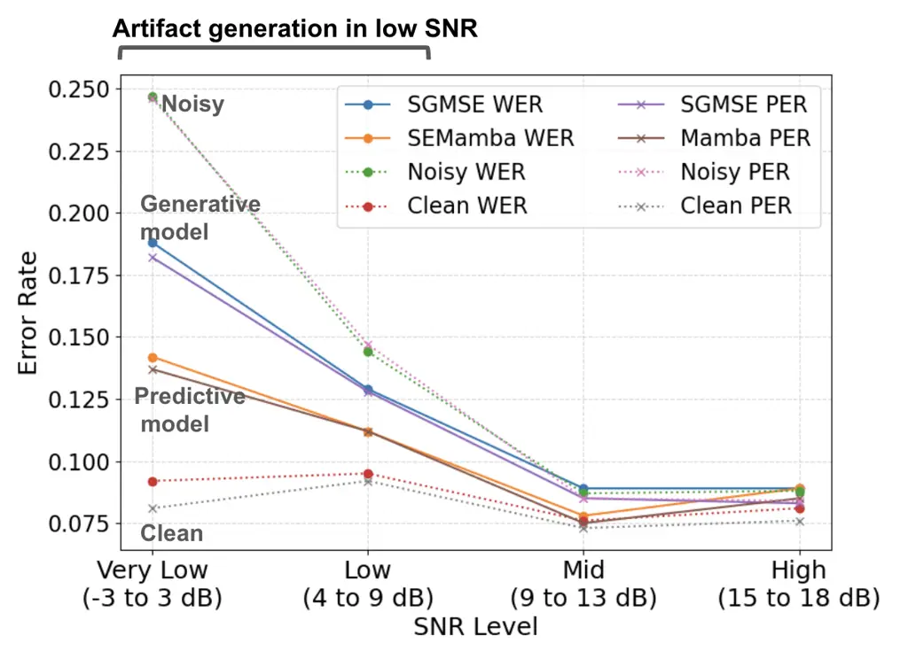
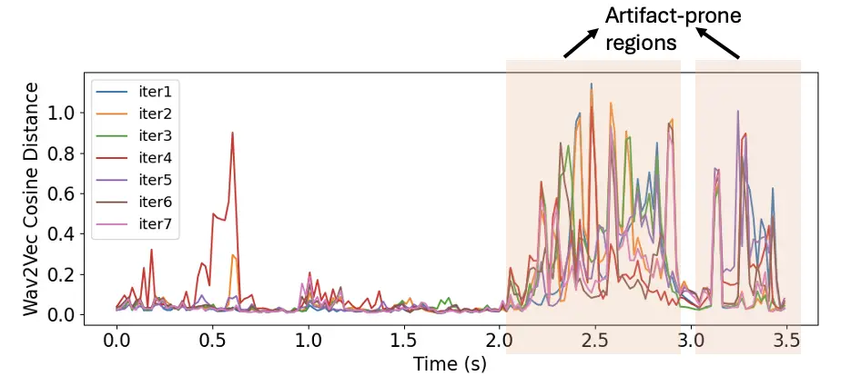
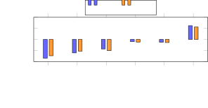
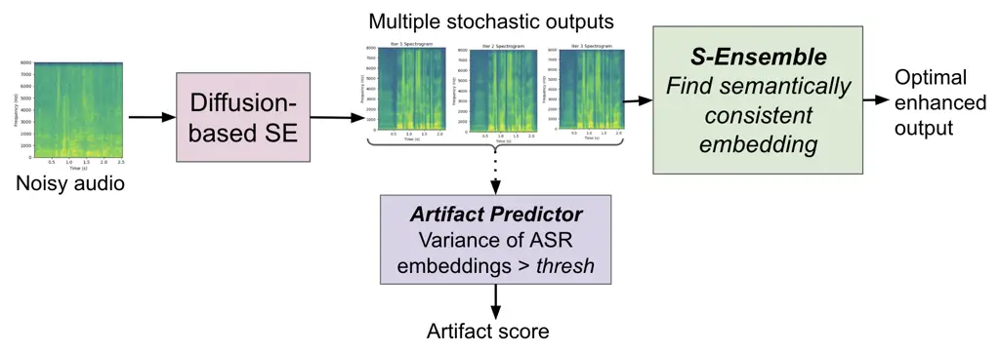
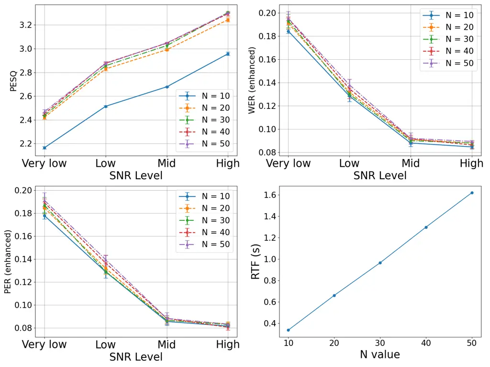

# ArtiFree: Detecting and Reducing Generative Artifacts in Diffusion-based Speech Enhancement

Bhawana Chhaglani^(\*) ^(†)^(†)thanks: ^(\*) This work was done when the
author was on an internship at Meta    Yang Gao    Julius Richter   
Xilin Li    Syavosh Zadissa    Tarun Pruthi    Andrew Lovitt

###### Abstract

Diffusion-based speech enhancement (SE) achieves natural-sounding speech
and strong generalization, yet suffers from key limitations like
generative artifacts and high inference latency. In this work, we
systematically study artifact prediction and reduction in
diffusion-based SE. We show that variance in speech embeddings can be
used to predict phonetic errors during inference. Building on these
findings, we propose an ensemble inference method guided by semantic
consistency across multiple diffusion runs. This technique reduces WER
by 15% in low-SNR conditions, effectively improving phonetic accuracy
and semantic plausibility. Finally, we analyze the effect of the number
of diffusion steps, showing that adaptive diffusion steps balance
artifact suppression and latency. Our findings highlight semantic priors
as a powerful tool to guide generative SE toward artifact-free outputs.

###### Index Terms: 

Speech enhancement, diffusion models, generative artifacts, ensemble
inference, semantic consistency

^(†)^(†)address: ^(∗)University of Massachusetts Amherst, ⁺Meta Reality
Labs, ^(±)Meta Superintelligence Labs

## 1 Introduction

Speech enhancement (SE) improves intelligibility and quality by
suppressing noise, enabling robust applications in telephony,
transcription, and assistive hearing devices. Generative models,
particularly diffusion-based approaches such as score-based generative
models for speech enhancement (SGMSE) \[1, 2\] and Schrödinger Bridge
(SB) \[3, 4\], have emerged as powerful alternatives to predictive
methods (e.g., CRNN \[5, 6\], SEMamba \[7\]). By learning the
distribution of clean speech given noisy speech, diffusion-based SE can
produce natural-sounding results and generalize to unseen noise
conditions. However, few challenges remain. First, diffusion models
often introduce _generative artifacts_, including phoneme
insertions/substitutions, hiss, breathing artifacts, and high-frequency
distortions, which degrade automatic speech recognition (ASR)
performance despite favorable perceptual scores. Second, the output of
these models is inherently stochastic, as it is sampled from the
posterior distribution of clean speech given noisy speech, leading to
natural variability across runs. Lastly, inference requires multiple
reverse diffusion steps, leading to high _latency_ unsuitable for
real-time deployment.

In this work, we ask: _How can we detect and reduce artifacts in
diffusion-based SE, while maintaining efficiency?_ Unlike predictive SE
models, which regress to the mean of the posterior under an MSE
objective and thus produce a single deterministic output, diffusion SE
models allow sampling multiple plausible outputs from the posterior.
However, not all sampled outputs are semantically correct: some contain
hallucinated or substituted phonemes. This raises the need for
strategies to _select_ the most semantically consistent sample rather
than averaging across them. Inspired by observations in StoRM \[8\], we
argue that while generative sampling provides diversity, semantic priors
are required to steer outputs toward artifact-free speech. Our work
proposes such a strategy through semantic consistency-based ensemble
inference. This strategy confirms that the model generates optimal
enhanced output by selecting the output with the most consistent speech
embeddings out of multiple sampling runs.

Contributions. This paper makes the following contributions. (1) We
explore intrusive and non-intrusive metrics for artifact detection,
demonstrating that PESQ/STOI fail to capture phoneme-level errors, and
propose variance of speech embeddings across multiple samples as an
inference-time indicator of artifact-prone regions. (2) We introduce an
ensemble inference method guided by semantic consistency, which reduces
phoneme artifacts and achieves up to 15% relative word error rate (WER)
improvement in low-SNR conditions. (3) We analyze the trade-off between
artifact reduction and latency, showing that while ensemble inference
increases real-time factor (RTF), reducing the number of diffusion steps
($`N`$) provides a favorable quality–efficiency balance. Specifically,
the adaptive $`N`$ approach yields WER improvements with a 27% reduction
in RTF, at the cost of a slight 0.1 drop in PESQ. Together, these
results provide new insights into the nature of generative artifacts in
diffusion SE and propose practical strategies to detect and reduce them
in high fidelity applications. We will make the Source code and
artifacts test set available.

## 2 Background

Diffusion-based generative models have recently advanced SE by learning
distributions over clean speech and progressively denoising noisy inputs
\[1, 2, 4, 9\]. SGMSE \[1\] solves a stochastic differential equation
with a learned score network, while the Schrödinger Bridge (SB) \[3, 4\]
casts speech enhancement as an optimal transport problem. These
approaches often outperform predictive baselines in terms of perceptual
quality and robustness \[2, 10\].

A key limitation, however, is the emergence of generative artifacts.
Unlike predictive models, which mainly distort or suppress existing
speech, diffusion-based SE can “hallucinate” new content. Artifacts
include phonetic errors such as insertions or substitutions, spurious
breathing or hissing, robotic tones, and high-frequency attenuation
\[10\]. These effects are most pronounced at low SNR as shown in Figure
1, where uncertainty drives the model to generate plausible but
incorrect phonetic structures, leading to poor ASR performance despite
high PESQ or STOI scores \[9\]. Existing metrics fail to fully capture
these errors: intrusive metrics emphasize energy-based distortions at
the signal-level, while non-intrusive predictors favor naturalness and
overrate generative outputs. Complementary measures such as Levenshtein
phoneme distance (LPD) and hallucination error rate (HER) have been
proposed to address this gap \[11, 12\].



Figure 1: ASR results of generative and predictive models in different
SNR levels of VoiceBank-DEMAND test set

Efforts to reduce artifacts in SE have largely focused on predictive
models, e.g., loss functions penalizing distortions \[13\] or
no-reference detectors for hum and hiss \[14\]. For generative SE, only
limited attempts exist: two-stage pipelines such as StoRM \[8\],
conditioning strategies like SBSE \[15\], and training- or sampling-time
regularization \[16, 17\]. Yet, phoneme hallucinations and spurious
vocalizations remain unsolved, motivating systematic frameworks for
artifact detection and reduction in diffusion SE.

## 3 Method

In this section, we describe the methodology of the proposed SE system
called ArtiFree. We investigate intrusive and non-intrusive metrics for
detecting and quantifying generative artifacts. We compute log spectral
distance (LSD), speech embedding distance (wav2vec cosine distance),
Voice Activity Detection (VAD) mismatch duration, formants bandwidth
divergence between clean and enhanced audio files. We also explore
non-intrusive metrics like wav2vec confidence score of the enhanced
audio file. Using manual listening test and spectral inspection, we
tagged artifact files and non-artifact files and observed that LSD is
sensitive to high-frequency attenuation and hiss sounds artifacts, and
can also capture phoneme errors. Wav2vec cosine distance uniquely
captured phoneme insertions, substitutions or deletions as it directly
encodes phoneme-level similarity. VAD mismatch depends highly on tuning
the VAD parameters and can sometimes detect breathing or click
artifacts. Formant bandwidth divergence failed to detect some phoneme
artifacts. So, we found for phoneme artifacts, wav2vec embedding
distance is the most suitable metric.  
Correlation Analysis: While analyzing correlation between artifact
metrics and speech quality metrics on VoiceBank test set (Figure 3), we
found that wav2vec cosine distance is only moderately correlated with
pesq (-0.61) and stoi (-0.53) while LSD shows higher correlation with
pesq (-0.85) and stoi (-0.74). VAD mismatch also shows moderate
correlation with PESQ/STOI. Formant divergence and wav2vec confidence
score show very low correlation with pesq and stoi. In this work, we
primarily focuses on phoneme-level artifacts, as these can introduce
errors in downstream tasks such as ASR, so we focus on speech embeddings
(wav2vec).



Figure 2: Cosine distance between clean and enhanced (multiple
iterations) wav2vec embedding for the same example in Figure 4



Figure 3: Correlation of artifact metrics with PESQ and STOI.

### 3.1 Artifact Prediction using Uncertainty Analysis

|                                                                              |
| ---------------------------------------------------------------------------- |
| THEY DID NOT REPLACE IT WITH A CONVICTION FOR CULPABLE HOMICIDE - clean file |
| THEY DID NOT REPLACE IT WITH A CONVICTION FOR PHELPOVAL HOMICIDE - iter 1    |
| THEY DID NOT REPLACE IT WITH HE CONVICTION FOR FELFOBLE VOMECIDE - iter 2    |
| THEY DID NOT REPLACE IT WITH THE CONVICTION PORCOPOVAL HOMICIDE - iter 3     |
| THEY DID NOT REPLACE IT WITH THE CONVICTION FOR PULPABLE HOMICIDE - iter 4   |
| THEY DID NOT REPLACE IT WITH A CONVICTION FOR COPOVEL HOMECADE - iter 5      |
| THEY DID NOT REPLACE IT WITH A CONVICTION FOR CULPABLE HOMECIDE - iter 6     |
| THEY DID NOT REPLACE IT WITH HE CONVICTION FOR CULPRABAL VOMECIDE - iter 7   |

Figure 4: Multiple enhanced versions of the same noisy input. While some
runs produce the correct phrase as shown in ASR transcriptions, others
hallucinate spurious words (highlighted in red). This illustrates
phoneme-level artifacts arising stochastically across diffusion samples.
The wav2vec embedding variance for this example is shown in Figure 2

As described earlier, typical SE metrics such as PESQ and STOI provide
only limited insight into generative artifacts. To address this
limitation, we use uncertainty analysis of speech embeddings. In
diffusion-based SE, repeated runs with the same input can yield
different outputs, since each sampling trajectory follows a stochastic
path \[10\]. We observe that a fixed ASR model produces varying
transcriptions for different enhanced samples (Figure 4), likely due to
artifacts generated under low-SNR conditions when the model is uncertain
about its output. In other words, hallucinations tend to occur in
regions with high prediction variance, suggesting that the model’s score
function experiences rapid gradient changes in those segments. As shown
in Figure 2, the variance between the speech embeddings is high in
artifact regions. Using this observation, we can predict the probability
of artifacts and their locations. As shown in algorithm 1, artifact
regions are detected by computing the variance of wav2vec frame-level
embeddings over time (Figure 2). Later, we find average variance over
time frames to get a single artifact score and compare it with threshold
$`\tau`$.

### 3.2 Artifact Reduction using Semantic Consistency

As shown in Figure 4, sometimes the model tends to hallucinate more, In
some iterations, the enhanced output is very close to the clean output,
resulting in less WER while other times the WER is very high.

1: Noisy input $`y`$, ensemble size $`S`$, threshold $`\tau`$,
generative SE model $`M`$, encoder $`E`$

2: Artifact score $`a`$, flag $`{I}_{artifact}`$

3: Generate $`S`$ enhanced candidates:
$`\{\hat{x}_{1},\hat{x}_{2},\ldots,\hat{x}_{S}\}\leftarrow M(y)`$

4: Extract frame-level embeddings for each candidate:
$`\{e_{1}(t),e_{2}(t),\ldots,e_{S}(t)\}`$ using $`E`$

5: Compute per-frame variance across ensemble members:
$`v(t)=\operatorname{Var}\big(\{e_{1}(t),e_{2}(t),\ldots,e_{S}(t)\}\big)`$

6: Compute artifact score as mean variance across frames:

```math
a=\frac{1}{T}\sum_{t=1}^{T}v(t)
```

7: if $`a>\tau`$ then

8:    Flag as artifact-prone, $`{I}_{artifact}=1`$

9: else

10:    $`{I}_{artifact}=0`$

11: end if

12: return artifact score $`a`$, flag $`{I}_{artifact}`$

Algorithm 1 Artifact Prediction via Embedding Variance

1: Enhanced candidates $`\{\hat{x}_{1},\ldots,\hat{x}_{S}\}`$,
embeddings $`\{e_{1},\ldots,e_{S}\}`$, reference embeddings
($`e_{\text{clean}}`$ or $`e_{\text{noisy}}`$)

2: Final optimal enhanced output $`\hat{x}`$

3: Compute semantic similarity matrix:
$`C[i,j]=\text{corr}(e_{i},e_{j})`$

4: Select candidate using one of the heuristics:

- •
  Ensemble centrality: choose $`\hat{x}_{i}`$ with max average
  $`C[i,:]`$
- •
  Clean correlation: choose $`\hat{x}_{i}`$ with highest correlation to
  $`e_{\text{clean}}`$
- •
  Noisy correlation: choose $`\hat{x}_{i}`$ with highest correlation to
  $`e_{\text{noisy}}`$

5: return selected output $`\hat{x}`$

Algorithm 2 Artifact Reduction via S-Ensemble

To solve this challenge, we aim to find the optimal enhanced output. We
propose an ensemble inference strategy guided by semantic consistency.
Given a noisy input, we generate $`S`$ enhanced outputs by sampling the
diffusion model with different random seeds. Each enhanced waveform is
passed through a self-supervised speech model (wav2vec) to extract
speech embeddings that capture phonetic structure. We then compute the
pairwise correlation between embeddings and select the sample that is
most semantically consistent according to one of the following
heuristics (Algorithm 2):  
Clean correlation: select the sample whose embedding is closest to the
clean reference (used only for analysis). This is just for understanding
the effectiveness of the approach, as clean audio is not available
during inference.  
Noisy correlation: select the sample most correlated with the noisy
input’s embedding, under the assumption that artifacts are not present
in noisy input, they are generated by the diffusion modeling.  
Ensemble centrality: select the sample whose embedding is most
consistent with the rest of the ensemble, i.e., closest to the centroid
of all samples.  
These heuristics can be used in inference and do not influence training
and model architecture. The correlation with clean speech serves as an
upper bound (the best we can achieve with this technique), while the
noisy correlation and ensemble centrality provide practical,
reference-free selectors. Semantic ensemble inference exploits the fact
that hallucinations vary across diffusion runs, whereas genuine content
remains consistent. By selecting the sample whose embedding is most
semantically aligned, we favor phoneme-preserving outputs and suppress
unstable artifacts. This requires no retraining, only multiple
generations, with inference cost scaling by $`S`$. As shown later,
reducing diffusion steps $`N`$ offsets this cost, making small ensembles
($`S{=}3`$–5) a practical solution for artifact-aware diffusion SE.



Figure 5: Proposed system framework

### 3.3 Effect of Reverse Diffusion Steps (N)

We evaluate the impact of varying the number of reverse diffusion steps
($`N`$) during inference. The plots in Fig. 6 show PESQ, PER, WER, and
real-time factor (RTF) across different $`N`$ values (RTF is the
inference latency defined in Section 4.1). As expected, larger $`N`$
values generally improve perceptual scores (PESQ, STOI) but at the cost
of significantly higher latency. In contrast, WER and PER are more
sensitive to $`N`$. First, at low SNR, there is high variance in WER/PER
due to phoneme artifacts. Second, low $`N`$ values yields slightly lower
WER/PER as less denoising steps means less chance of hallucinations. But
there could still be slight residual noise leading to low PESQ/STOI.



Figure 6: Effect of reverse diffusion steps on PESQ, WER, PER, and
latency on VoiceBank-DEMAND test set

Thus, lower N value often leads to less artifacts generation and
linearly reduces the latency of diffusion models. We try different N
schedules for different SNR ranges to show that adaptive N can provide
good performance-latency tradeoffs.

## 4 Evaluation

### 4.1 Experimental Setup

We evaluate on publicly available VoiceBank+DEMAND (VBD). The VBD test
set has 4 SNR levels: very low (-3 to 3 dB), low (4 to 8 dB), medium (9
to 13 dB), and high (13 to 18 dB). The low-SNR subsets is where
artifacts are mostly found. From the low SNR set, we create a artifact
test set which has the most prominent phoneme artifacts (noisy WER =
0.513 and clean WER = 0.115) through subjective listening. We use the
pretrained SGMSE model trained on VBD train set to get enhanced output.
For inference latency measurement, we use RTF which is the inference
time for 1 sec audio file. RTF is measured on Lenovo ThinkStation P8
\[GeForce RTX 4080\]. For extracting embedding and measuring WER and
PER, we use wav2vec 2.0 base model \[18\]. VBD test set has ground truth
transcriptions for comparison.

### 4.2 Inference-Time Artifact Prediction

By computing wav2vec embeddings for $`S`$ independent samples and
measuring the variance across them, we obtain an _artifact score_. We
extract $`S`$ enhanced outputs of same input using SGMSE model. We
evaluate prediction accuracy and the variance thresholds required for
different ensemble sizes $`S`$. In all cases, artifact detection
achieved 100% accuracy, the optimal threshold varied slightly with
$`S`$, ranging from $`0.0067`$ at $`S{=}3`$ to $`0.0095`$ at $`S{=}7`$.
While larger ensembles produce more stable thresholds, even a small
ensemble ($`S{=}3`$) is sufficient for perfect classification. This
shows that variance across embeddings is a robust indicator of phoneme
artifacts and can reliably flag uncertain regions during inference.
Thus, embedding variance across multiple diffusion iterations provides a
lightweight and highly accurate inference-time detector for phoneme
artifacts, enabling online artifact monitoring.

### 4.3 Artifact Reduction with S-Ensemble

We next evaluate our proposed ensemble inference strategy, which selects
the most semantically consistent sample among $`S`$ enhanced outputs. By
extracting wav2vec embedding and applying correlation-based heuristics,
we select the candidate most likely to represent the true phonetic
content. Table 1 shows WER on the low-SNR VBD artifact test set. The
baseline single-sample average WER across ten diffusion iterations was
0.438, significantly worse than the WER of clean reference audio
(0.115). _S-Ensemble_ substantially improves WER across ensemble sizes
$`S{=}3`$–10. Among the selection heuristics, correlation with the clean
reference provides the best possible performance, achieving up to 36.3%
relative WER reduction with $`S{=}10`$. The practical, reference-free
heuristics also yield consistent gains: most correlated improves WER by
14–16% across $`S`$, while most correlated with noisy achieves 7–15%
relative improvement.

| WER                 | S=3   | S=5   | S=7   | S=9   | S=10  |
| ------------------- | ----- | ----- | ----- | ----- | ----- |
| Ensemble centrality | 0.373 | 0.368 | 0.373 | 0.373 | 0.373 |
| Clean correlation   | 0.341 | 0.344 | 0.321 | 0.318 | 0.279 |
| Noisy correlation   | 0.377 | 0.405 | 0.372 | 0.380 | 0.385 |

Table 1: WER on low-SNR artifact test set using S-Ensemble with
different ensemble sizes $`S`$. Average single-sample WER of 10
iterations is 0.438. WER of clean set is 0.115 and noisy set is 0.513.

Thus, S-Ensemble effectively mitigates phoneme artifacts by exploiting
semantic consistency across multiple diffusion outputs. This confirms
that stochastic artifacts can be suppressed without retraining the
model, although at the cost of increased inference latency proportional
to $`S`$.

### 4.4 Adaptive Diffusion Steps ($`N`$)

To address the latency overhead of ensemble inference, we evaluate the
effect of varying the number of diffusion steps $`N`$. In the VBD
testset, we have noise additions in 4 different SNR levels. For each of
these SNR test set files, we use different N value to find the suitable
N value for a given SNR. Table 2 compares fixed and adaptive schedules.
Reducing $`N`$ lowers RTF substantially and slightly imporves WER. For
example, $`N{=}10`$ reduces RTF by 65%, improves WER by 4%, with a
modest 0.34 PESQ drop (-11.7%). Since PESQ/STOI scores show similar
values for different N ranging from 20 to 50, but drops at N=10 (See
Figure 6), adaptive schedules that allocate different $`N`$ values to
different SNR can optimize the quality-latency tradeoff. By using lower
$`N=10`$ value for high SNR and moderate $`N=20`$ for low SNR (to
preserve PESQ score), we achieve a 27% RTF improvement with minimal
quality loss.

| Heuristic         | RTF   | RTF $`\Delta`$ | PESQ $`\Delta`$ | WER $`\Delta`$ |
| ----------------- | ----- | -------------- | --------------- | -------------- |
| Fixed $`N{=}30`$  | 0.965 | –              | –               | –              |
| Fixed $`N{=}10`$  | 0.335 | -65.3%         | -11.7%          | -4.0%          |
| $`[40,30,20,10]`$ | 0.885 | -8.3%          | -3.1%           | -3.0%          |
| $`[10,20,30,40]`$ | 0.878 | -8.9%          | -3.4%           | -2.0%          |
| $`[20,30,20,10]`$ | 0.702 | -27.2%         | -3.4%           | -2.0%          |

Table 2: Trade-off between RTF, PESQ, and WER for different $`N`$
schedules for different SNR sets \[very low, low, mid, high\].
Improvements are reported as relative percentage changes compared to
fixed $`N{=}30`$.

Interestingly, we find that WER/PER vary more with $`N`$ than PESQ/STOI,
confirming that artifacts are primarily semantic rather than acoustic.
Lowering $`N`$ often reduces hallucinations by limiting stochastic
updates. This supports using SNR-aware adaptive $`N`$ for real-time
applications.

### 4.5 Optimizing $`S`$ and $`N`$

Finally, we investigate whether a small number of diffusion steps
combined with a small ensemble size can provide artifact reduction at no
additional latency cost. Table 3 reports results of different heuristics
for $`N{=}10`$ and $`S{=}3`$. While the baseline single-sample average
WER is 0.428, the proposed technique reduces WER by 17% depending on the
selection heuristic Notably, the most correlated with clean achieves a
WER of 0.357, corresponding to a 16.5% relative improvement. Since
$`N{=}10`$ lowers inference time by 65% compared to the default
$`N{=}30`$, using $`S{=}3`$ iterations restores the runtime to that of
the default setting while simultaneously reducing phoneme artifacts.
This demonstrates that carefully balancing $`N`$ and $`S`$ can achieve
both low-latency and artifact-aware enhancement.

| Method                                | WER   | PESQ  |
| ------------------------------------- | ----- | ----- |
| Baseline avg (3 runs) N=10            | 0.428 | 2.577 |
| Ensemble Centrality (Most consistent) | 0.384 | 2.578 |
| Clean correlation                     | 0.357 | 2.575 |
| Noisy correlation                     | 0.371 | 2.578 |

Table 3: Performance with $`N{=}10`$ and $`S{=}3`$ on low-SNR artifact
test set. WER of clean set is 0.115 and noisy set is 0.513. PESQ for
$`N{=}30`$ is 2.9 and $`N=10`$ is 2.57

## 5 Conclusion and Future Work

We presented an artifact-centered study of diffusion-based SE. We
predict artifacts using variance of speech embeddings and reduce
artifacts via a semantic consistency-based ensemble inference strategy.
We analyze the latency–artifact trade-off by varying reverse diffusion
steps. More broadly, our results suggest that artifact reduction can be
framed as augmenting the diffusion posterior with a semantic prior.
Wav2vec provides such a prior by embedding speech into a
lower-dimensional space that captures phonetic meaning. By sampling
multiple candidates from the generative model and ranking them according
to semantic consistency in this embedding space, we effectively steer
generation toward outputs that preserve meaning. Given a suitable
encoder, semantic priors an be used in other generative enhancement
tasks (dereverberation, bandwidth extension) or even beyond speech,
e.g., in audio-to-text or image restoration.

## References

- \[1\] Simon Welker, Julius Richter, and Timo Gerkmann, “Speech
  enhancement with score-based generative models in the complex STFT
  domain,” in ISCA Interspeech, 2022, pp. 2928–2932.
- \[2\] Julius Richter, Simon Welker, Jean-Marie Lemercier, Bunlong Lay,
  and Timo Gerkmann, “Speech enhancement and dereverberation with
  diffusion-based generative models,” IEEE/ACM Transactions on Audio,
  Speech, and Language Processing, vol. 31, pp. 2351–2364, 2023.
- \[3\] Ante Jukić, Roman Korostik, Jagadeesh Balam, and Boris Ginsburg,
  “Schrödinger bridge for generative speech enhancement,” in ISCA
  Interspeech, 2024, pp. 1175–1179.
- \[4\] Julius Richter, Danilo De Oliveira, and Timo Gerkmann,
  “Investigating training objectives for generative speech enhancement,”
  in IEEE International Conference on Acoustics, Speech and Signal
  Processing, 2025.
- \[5\] Dacheng Yin, Chong Luo, Zhiwei Xiong, and Wenjun Zeng, “Phasen:
  A phase-and-harmonics-aware speech enhancement network,” in AAAI
  Conference on Artificial Intelligence, 2020, vol. 34, pp. 9458–9465.
- \[6\] Yanxin Hu, Yun Liu, Shubo Lv, Mengtao Xing, Shimin Zhang, Yihui
  Fu, Jian Wu, Bihong Zhang, and Lei Xie, “DCCRN: Deep complex
  convolution recurrent network for phase-aware speech enhancement,” in
  ISCA Interspeech, 2020, pp. 2472–2476.
- \[7\] Rong Chao, Wen-Huang Cheng, Moreno La Quatra, Sabato Marco
  Siniscalchi, Chao-Han Huck Yang, Szu-Wei Fu, and Yu Tsao, “An
  investigation of incorporating Mamba for speech enhancement,” in IEEE
  Spoken Language Technology Workshop, 2024, pp. 302–308.
- \[8\] Jean-Marie Lemercier, Julius Richter, Simon Welker, and Timo
  Gerkmann, “StoRM: A diffusion-based stochastic regeneration model for
  speech enhancement and dereverberation,” IEEE/ACM Transactions on
  Audio, Speech, and Language Processing, vol. 31, pp. 2724–2737, 2023.
- \[9\] Danilo de Oliveira, Julius Richter, Jean-Marie Lemercier, Tal
  Peer, and Timo Gerkmann, “On the behavior of intrusive and
  non-intrusive speech enhancement metrics in predictive and generative
  settings,” in ITG Speech Communication Conference, 2023, pp. 260–264.
- \[10\] Jean-Marie Lemercier, Julius Richter, Simon Welker, Eloi
  Moliner, Vesa Välimäki, and Timo Gerkmann, “Diffusion models for audio
  restoration: A review,” IEEE Signal Processing Magazine, vol. 41, no.
  6, pp. 72–84, 2025.
- \[11\] Jan Pirklbauer, Marvin Sach, Kristoff Fluyt, Wouter Tirry,
  Wafaa Wardah, Sebastian Moeller, and Tim Fingscheidt, “Evaluation
  metrics for generative speech enhancement methods: Issues and
  perspectives,” in ITG Speech Communication Conference, 2023, pp.
  265–269.
- \[12\] Hanin Atwany, Abdul Waheed, Rita Singh, Monojit Choudhury, and
  Bhiksha Raj, “Lost in transcription, found in distribution shift:
  Demystifying hallucination in speech foundation models,” in Findings
  of the Association for Computational Linguistics, 2025, pp.
  23181–23203.
- \[13\] Haixin Guan, Wei Dai, Guangyong Wang, Xiaobin Tan, Peng Li, and
  Jiaen Liang, “Reducing speech distortion and artifacts for speech
  enhancement by loss function,” in ISCA Interspeech, 2024, pp.
  1730–1734.
- \[14\] David Higham, Ayush Bagla, and Veneta Haralampieva, “A
  no-reference model for detecting audio artifacts using pretrained
  audio neural networks,” in IEEE/CVF Winter Conference on Applications
  of Computer Vision, 2022, pp. 9–13.
- \[15\] Siyi Wang, Siyi Liu, Andrew Harper, Paul Kendrick, Mathieu
  Salzmann, and Milos Cernak, “Diffusion-based speech enhancement with
  Schrödinger bridge and symmetric noise schedule,” arXiv preprint
  arXiv:2409.05116, 2024.
- \[16\] Wenxin Tai, Yue Lei, Fan Zhou, Goce Trajcevski, and Ting Zhong,
  “DOSE: Diffusion dropout with adaptive prior for speech enhancement,”
  Advances in Neural Information Processing Systems, vol. 36, pp.
  40272–40293, 2023.
- \[17\] Satoru Emura, “Estimation of output SI-SDR solely from enhanced
  speech signals in diffusion-based generative speech enhancement
  method,” in IEEE European Signal Processing Conference, 2024, pp.
  236–240.
- \[18\] Alexei Baevski, Yuhao Zhou, Abdelrahman Mohamed, and Michael
  Auli, “wav2vec 2.0: A framework for self-supervised learning of speech
  representations,” Advances in neural information processing systems,
  vol. 33, pp. 12449–12460, 2020.
