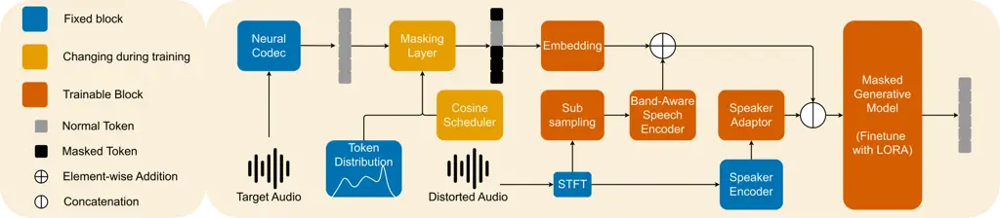

# MAGE: A Coarse-to-fine speech enhancer with Masked Generative Model

The Hieu Pham^(⋆)    Tan Dat Nguyen^(⋆)    Phuong Thanh Tran    Joon Son
Chung    Duc Dung Nguyen ^(†)^(†)thanks: \$⋆\$ These authors contributed
equally to this work.

###### Abstract

Speech enhancement remains challenging due to the trade-off between
efficiency and perceptual quality. In this paper, we introduce MAGE, a
Masked Audio Generative Enhancer that advances generative speech
enhancement through a compact and robust design. Unlike prior masked
generative models with random masking, MAGE employs a scarcity-aware
coarse-to-fine masking strategy that prioritizes frequent tokens in
early steps and rare tokens in later refinements, improving efficiency
and generalization. We also propose a lightweight corrector module that
further stabilizes inference by detecting low-confidence predictions and
re-masking them for refinement. Built on BigCodec and finetuned from
Qwen2.5-0.5B, MAGE is reduced to 200M parameters through selective layer
retention. Experiments on DNS Challenge and noisy LibriSpeech show that
MAGE achieves state-of-the-art perceptual quality and significantly
reduces word error rate for downstream recognition, outperforming larger
baselines. Audio examples are available at
[https://hieugiaosu.github.io/MAGE](https://hieugiaosu.github.io/MAGE).

###### Index Terms: 

Speech Enhancement, Masked Generative Model, Generative Model, Masking
Strategy

^(†)^(†)address: ¹AITech Lab, Ho Chi Minh City University of Technology,
VNUHCM, Vietnam  
²Korea Advanced Institute of Science and Technology, South Korea

## 1 Introduction

Speech enhancement (SE) \[15, 8\] is a fundamental task in speech
processing that seeks to separate clean and intelligible signals from
audio corrupted by diverse distortions. These degradations arise from
background noise, reverberation, microphone clipping, transmission
artifacts, and resampling effects, and they can severely impair both
human perception and machine processing. Achieving reliable SE is
therefore crucial for a wide range of downstream applications, including
personalized enhancement \[13\], robust speech recognition \[4\], and
scalable data collection \[16\].

Modern approaches fall broadly into two categories. Discriminative
models directly map noisy inputs to clean signals by optimizing losses
aligned with intrusive metrics such as SI-SDR, PESQ, and STOI. These
models are computationally efficient, with DPRCN \[7\] achieving PESQ
$`2.86`$ using only $`0.8`$M parameters and TF-GridNet \[21\] reaching
PESQ $`3.78`$ and STOI $`0.994`$ with $`9.8`$M parameters. Nonetheless,
despite progress in augmentation and adversarial training \[20\], their
performance often degrades when acoustic conditions differ from training
data. Generative models instead seek to model the underlying speech
distribution. Diffusion- and flow-based approaches such as SGMSE \[15\]
and StoRM \[8\] improve perceptual quality by reversing the corruption
process, yet they remain computationally heavy and data-demanding, even
with efficiency-oriented variants like SpeechFlow \[10\]. Discrete
representations facilitate language-model-driven SE, as demonstrated by
SELM \[22\], which leverages WavLM \[1\], and MaskSR \[9\] in
combination with DAC \[6\]. However, these systems are still large and
impractical for deployment. Recently, mask generative models (MGMs) such
as MaskSR and AnyEnhance \[24\] have shown state-of-the-art results, but
they typically require hundreds of millions to billions of parameters
and rely on random masking strategies that introduce inefficiency and
redundancy. This gap motivates the need for generative SE models that
deliver both perceptual quality and efficiency.

Figure 1: A comparison of DNS OVL scores on a real-world test set
against model size for several different methods



Figure 2: Training pipeline and model design of MAGE. Target audio is
first converted into sequence of tokens using a Neural Encodec. These
tokens are then masked according to their distribution to form a
coarse-to-fine masking strategy, as described in Sec. 2.3. Besides,
speaker identity is extracted by a Band-Aware Encoder and a pretrained
Speaker Encoder, enabling it to capture the acoustic characteristics.
The model is optimized using cross-entropy loss applied only on the
masked tokens.

In this work, we propose MAGE, a Masked Audio Generative Enhancer that
combines the perceptual advantages of generative modeling with the
efficiency needed for practical deployment. Unlike prior mask generative
models that rely on random masking and large parameter counts, MAGE
introduces a scarcity-aware coarse-to-fine masking strategy and a
lightweight corrector module, enabling more effective training and
stable inference. Finetuned from Qwen2.5-0.5B and speech tokens from
BigCodec, our proposed model is reduced to only 200M parameters while
maintaining strong performance. Extensive experiments on DNS Challenge
and noisy LibriSpeech show that MAGE achieves state-of-the-art
perceptual quality and significantly improves word error rate (WER) for
downstream automatic speech recognition, outperforming larger flow-based
and mask-based baselines. These results highlight MAGE as a compact,
generalizable, and robust framework for speech enhancement, advancing
the development of resource-efficient generative models for real-world
applications.

## 2 MAGE

### 2.1 Neural Encodec and Encoders

To extract discrete representations from target audio, we adopt
BigCodec \[5\], which provides stable tokenization and high-quality
reconstruction using a single codebook with 80 tokens per second. To
match this token rate, the distorted audio
$`{\bm{w}}_{\text{distorted}}`$ is converted into a complex spectrogram
$`\mathbf{S}\in\mathbb{C}^{F\times T}`$ and downsampled with 2D
convolutions. For conditioning, we leverage a TF-GridNet block \[21\],
which efficiently models cross-band frequency interactions while
remaining lightweight. The encoder output is projected into the
embedding space $`{\bm{x}}_{\text{cond}}\in\mathbb{R}^{D}`$ to condition
the generative model. In addition, this complex spectrogram is used to
extract speaker identity $`{\bm{x}}_{e}`$ with a pretrained speaker
encoder¹¹ 1
[https://github.com/resemble-ai/Resemblyzer](https://github.com/resemble-ai/Resemblyzer).

### 2.2 Mask Generative Model (MGM)

Given a token sequence $`{\bm{x}}=[x^{1},\ldots,x^{T}]`$ derived from
$`{\bm{w}}_{\text{distorted}}`$, the MGM learns to reconstruct masked
tokens over $`N`$ denoising steps. At each step $`i`$, tokens are masked
according to a binary vector $`{\bm{m}}_{(i)}`$ sampled from a Bernoulli
distribution:

```math
p(i)=\cos\!\left(\tfrac{\pi}{2}\tfrac{i}{N}\right), \tag{1}
```

where $`p(i)`$ follows a cosine schedule \[24, 9\]. We obtain the masked
sequence $`\tilde{{\bm{x}}}_{(i)}`$ by filling the mask token $`M`$ into
the positions selected for masking, while keeping the remaining tokens
unchanged. The masked sequence is then added element-wise with
$`{\bm{x}}_{\text{cond}}`$, and concatenated with the speaker embedding,
which is projected from $`{\bm{x}}_{e}`$ using a lightweight adaptor.
The resulting sequence is used as the input to the masked generative
model. The model parameters $`\theta`$ are optimized by predicting the
masked tokens:

```math
\mathcal{L}_{\text{mask}}=-\sum_{t=1}^{T}m^{t}_{(i)}\log P(x^{t}\mid\tilde{{\bm{x}}}_{(i)},{\bm{x}}_{\text{cond}},{\bm{x}}_{e};\theta). \tag{2}
```

Intuitively, this objective forces the model to learn conditional
distributions of tokens given both observed context and acoustic
information.

|                    |                 |                 |                 |                  |                 |                 |                 |                  |                 |                 |                 |
| ------------------ | --------------- | --------------- | --------------- | ---------------- | --------------- | --------------- | --------------- | ---------------- | --------------- | --------------- | --------------- |
| System             | With Reverb     |                 |                 |                  | Without Reverb  |                 |                 |                  | Real Recordings |                 |                 |
|                    | SIG$`\uparrow`$ | BAK$`\uparrow`$ | OVL$`\uparrow`$ | SSIM$`\uparrow`$ | SIG$`\uparrow`$ | BAK$`\uparrow`$ | OVL$`\uparrow`$ | SSIM$`\uparrow`$ | SIG$`\uparrow`$ | BAK$`\uparrow`$ | OVL$`\uparrow`$ |
| BigCodec Resyn. GT | 4.473           | 4.471           | 4.190           | 0.857            | 4.473           | 4.471           | 4.190           | 0.857            | –               | –               | –               |
| Noisy              | 1.760           | 1.497           | 1.392           | –                | 3.392           | 2.618           | 2.483           | –                | 3.053           | 2.510           | 2.255           |
| Conv-TasNet \[11\] | 2.415           | 2.710           | 2.010           | 0.939            | 3.092           | 3.341           | 3.001           | 0.945            | 3.102           | 2.975           | 2.410           |
| SGMSE \[15\]       | 2.730           | 2.741           | 2.430           | 0.899            | 3.501           | 3.710           | 3.137           | 0.934            | 3.297           | 2.894           | 2.793           |
| StoRM \[8\]        | 2.947           | 3.141           | 2.516           | 0.934            | 3.514           | 3.941           | 3.205           | 0.943            | 3.410           | 3.379           | 2.940           |
| ANYENHANCE \[24\]  | 3.500           | 4.040           | 3.204           | –                | 3.640           | 4.179           | 3.418           | –                | 3.488           | 3.977           | 3.161           |
| MaskSR-M \[9\]     | 3.531           | 4.065           | 3.253           | 0.827            | 3.586           | 4.116           | 3.339           | 0.929            | 3.430           | 4.025           | 3.136           |
| FlowSE \[25\]      | 3.614           | 4.110           | 3.340           | 0.809            | 3.690           | 4.200           | 3.451           | 0.940            | 3.643           | 4.100           | 3.271           |
| MAGE               | 3.530           | 4.149           | 3.107           | 0.724            | 4.407           | 4.515           | 4.151           | 0.817            | 3.830           | 4.302           | 3.500           |
| + Corrector        | 3.525           | 4.146           | 3.081           | 0.724            | 4.441           | 4.557           | 4.201           | 0.800            | 4.098           | 4.309           | 3.744           |
| + CTF              | 3.876           | 3.901           | 3.653           | 0.799            | 4.559           | 4.408           | 4.235           | 0.819            | 4.206           | 4.145           | 3.787           |
| + CTF & Corrector  | 3.864           | 3.961           | 3.372           | 0.789            | 4.580           | 4.338           | 4.223           | 0.821            | 4.191           | 3.924           | 3.666           |

Table 1: Performance comparison on DNS Challenge test set. DNSMOS scores
(SIG/BAK/OVL) and speaker cosine similarity (SSIM) are reported. Higher
values ($`\uparrow`$) indicate better performance. BigCodec Resyn. GT
denotes the ground-truth signal re-encoded and decoded to illustrate the
upper bound of the method.

### 2.3 Coarse-to-Fine (CTF) Strategy and Corrector

Uniform masking in Eq. 1 treats all tokens equally, ignoring the fact
that token frequencies are highly non-uniform. This creates a bias:
frequent tokens dominate training, while rare tokens are predicted less
reliably. In other words, the model learns ’popular’ predictions more
often than ’rare’ predictions, which leads to suboptimal generalization.

To mitigate this imbalance, we introduce a coarse-to-fine (CTF) masking
strategy. We compute a frequency vector
$`{\bm{f}}=[f^{1},\ldots,f^{T}]`$ for each input $`{\bm{x}}`$, where
$`f^{i}`$ is the document frequency \[17\] of token $`x^{i}`$ in the
training corpus. We then calculate an IDF-like score:

```math
{\bm{z}}=\log\!\left(\frac{N+1}{{\bm{f}}+1}\right), \tag{3}
```

where $`N`$ is the total number of samples of dataset. Higher
$`{\bm{z}}`$ indicates rarer tokens. The base masking probability for
each token is

```math
{\bm{p}}_{\text{base}}=\sigma\!\left(\frac{{\bm{z}}-\bar{{\bm{z}}}}{\mathrm{std}({\bm{z}})}\right), \tag{4}
```

where $`\sigma(\cdot)`$ is the sigmoid function, and $`\bar{{\bm{z}}}`$
and $`\mathrm{std}({\bm{z}})`$ denote the mean and standard deviation of
$`{\bm{z}}`$. To preserve the advantages of the cosine schedule while
making it token-dependent, we define the final CTF probability:

```math
{\bm{p}}_{\text{CTF}}=\min\!\left(\frac{E_{\text{cos}}}{E_{\text{base}}}\cdot{\bm{p}}_{\text{base}},1\right), \tag{5}
```

where $`E_{\text{cos}}=T\sin\!\left(\tfrac{\pi i}{2N}\right)`$ is the
expected number of masked tokens under the cosine schedule, and
$`E_{\text{base}}=\sum_{t=1}^{T}p^{t}_{\text{base}}`$ under the base
distribution. This adjustment ensures that frequent tokens are predicted
earlier, while rare tokens are emphasized in later steps, creating a
natural curriculum.

Corrector. Finally, to further improve robustness, we add a correction
stage. Unlike standard MGM which generates tokens once and commits to
them, MAGE allows re-masking and regeneration of previously decoded
tokens. This prevents error accumulation and enables iterative
refinement. Instead of random re-masking as in MaskSR \[9\], we train a
lightweight 4-layer BLSTM corrector that identifies low-confidence
tokens and re-masks them. During training, up to 30% of ground-truth
tokens are randomly corrupted, teaching the corrector to detect
inconsistencies. At inference, it selectively re-masks problematic
tokens and passes them back to the generative model for correction. This
design improves perceptual quality by enabling the model to self-revise.

|                    |                 |                 |                 |                   |
| ------------------ | --------------- | --------------- | --------------- | ----------------- |
| System             | LibriSpeech     |                 |                 |                   |
|                    | SIG$`\uparrow`$ | BAK$`\uparrow`$ | OVL$`\uparrow`$ | WER$`\downarrow`$ |
| SGMSE \[15\]       | 4.254           | 4.109           | 3.813           | 28.52             |
| StoRM \[8\]        | 4.030           | 4.241           | 3.986           | 27.34             |
| FlowSE \[25\]      | 3.539           | 2.923           | 2.634           | 35.53             |
| MAGE+CTF           | 4.449           | 4.301           | 4.076           | 25.27             |
| MAGE+CTF+Corrector | 4.517           | 4.301           | 4.141           | 23.45             |

Table 2: Performance on the noisy LibriSpeech test set. Reported
metrics: DNSMOS (SIG/BAK/OVL, $`\uparrow`$) and WER ($`\downarrow`$).

## 3 Experimental Setup

We finetune the masked language model from Qwen2.5-0.5B using
LoRA \[3\]. To reduce computational cost, only half of the original
layers are retained, resulting in a compact model with 200M parameters.
The MAGE speech encoder applies Short-time Fourier Transform with
$`n\_fft=256`$, $`window=256`$, $`hop\_size=100`$, followed by two
TF-GridNet blocks with embedding size of 48, BLSTM hidden size of 192,
and 4 heads attention. The language model is a reduced Qwen2.5-0.5B,
where only the odd-numbered layers are kept (layer 1 is the first), and
attention is configured in a non-autoregressive mode. LoRA is applied to
q_proj, v_proj, o_proj, up_proj, and down_proj with $`r=16`$,
$`\text{lora\_alpha}=32`$, and dropout 0.1. Training is performed with
AdamW (learning rate and weight decay $`1\times 10^{-4}`$), batch size
8, on a single RTX 4090 GPU.

The training corpus is constructed by augmenting clean speech from
LibriSpeech \[12\] and the DNS Challenge \[18\] with noise from
WHAM! \[23\] and DNS Challenge, and reverberation from OpenSLR28. The
final dataset contains 512k four-second utterances at 16 kHz, with a
composition of 50% noise-only, 30% noise+reverb, and 20% noise+reverb
combined with resampling and spectrogram augmentation.

We evaluate MAGE against both discriminative and generative baselines
using standard multiple metrics: SIG (signal distortion), BAK
(background intrusiveness), and OVL (overall quality) from ITU-T P.835
\[14\], as well as Speaker Similarity (SSIM), computed as the cosine
similarity between speaker embeddings from Wespeaker \[19\]. Results are
reported under three conditions: with reverberation, without
reverberation, and on real recordings. Higher values indicate better
performance for all metrics. We also use the released ASR model²² 2
[https://huggingface.co/nvidia/stt_en_conformer_transducer_xlarge](https://huggingface.co/nvidia/stt_en_conformer_transducer_xlarge)
to compute WER, reflecting intelligibility gains.

## 4 Results and Analysis

| System                   | Without Reverb  |                 |                 |
| ------------------------ | --------------- | --------------- | --------------- |
|                          | SIG$`\uparrow`$ | BAK$`\uparrow`$ | OVL$`\uparrow`$ |
| SSL Model (HuBERT) \[2\] | 4.362           | 4.518           | 4.220           |
| Transformer (8 layers)   | 3.414           | 4.002           | 3.276           |
| Transformer (6 layers)   | 3.322           | 3.842           | 3.155           |
| Band Aware               | 4.407           | 4.515           | 4.151           |

Table 3: Ablation study on different Speech Encoder

Table 1 compares MAGE with both discriminative and generative baselines
on the DNS Challenge test set. Conventional discriminative models such
as Conv-TasNet achieve strong SSIM scores but lag behind in perceptual
quality (SIG/BAK/OVL). Generative methods including SGMSE, StoRM, and
FlowSE offer improvements, yet remain limited in overall robustness.
Mask-based approaches such as MaskSR-M and ANYENHANCE further advance
BAK and OVL, but require considerably larger model sizes. In contrast,
MAGE achieves competitive or superior performance with only 200M
parameters. Notably, incorporating the coarse-to-fine (CTF) masking
strategy yields substantial gains, especially in OVL (up to 4.235
without reverb and 3.787 on real recordings). The corrector module
further stabilizes inference, and the combined CTF+Corrector
configuration achieves the best SIG score of 4.580 without reverb. For
reference, the BigCodec Resyn. GT row reports scores obtained by
reconstructing ground-truth clean audio directly through the codec,
representing the upper bound of codec fidelity, especially speaker
similarity.

Table 2 reports results on the noisy LibriSpeech benchmark, highlighting
downstream ASR performance. While prior generative models such as SGMSE
and StoRM reduce word error rate (WER) relative to the noisy baseline,
MAGE with CTF and Corrector achieves a WER of 23.45%, a relative
improvement of over 5% absolute compared to SGMSE. These findings
confirm that the enhanced audio produced by MAGE not only improves
perceptual quality but also provides tangible benefits for recognition
tasks.

Table 3 presents an ablation on the choice of speech encoder. SSL
models, such as HuBERT, deliver strong performance but are
computationally intensive. Lightweight transformer encoders reduce
complexity but exhibit degraded quality. Howerver, the band-aware
TF-GridNet encoder achieves a balance, reaching SIG 4.407, BAK 4.515,
and OVL 4.151, comparable to HuBERT while being more efficient. This
demonstrates that explicitly modeling cross-band spectral dependencies
is more parameter-efficient than adopting SSL encoders. Fig. 3 presents
an ablation on the number of inference steps for CTF and CTF+Corrector,
evaluated on real recordings with DNSMOS-OVL. Performance improves
rapidly up to 10 steps and stabilizes beyond 20 steps, with both
variants maintaining strong quality across the range. CTF alone reaches
a peak at 20 steps, while CTF+Corrector provides more stable performance
at higher step counts, indicating that corrective refinement helps
mitigate error accumulation without requiring excessive iterations.

Overall, these results show that MAGE effectively narrows the gap
between perceptual quality and efficiency. The combination of CTF
masking and corrective refinement delivers consistent improvements
across datasets and metrics, establishing MAGE as a compact yet robust
generative framework for speech enhancement. While MAGE achieves strong
results, some limitations remain. Its dependence on simulated
distortions may reduce generalization to real-world conditions, and the
evaluation focuses mainly on DNSMOS instead of metrics such as PESQ or
STOI.

Figure 3: Ablation study on the number of inference steps for CTF and
CTF + Corrector. The overall performance is measured using DNSMOS-OVL on
Real Recording DNS dataset

## 5 Conclusion

In this work, we introduced MAGE, a lightweight difficulty-aware mask
generative model for speech enhancement, finetuned from Qwen2.5-0.5B and
coupled with BigCodec. Using a coarse-to-fine masking strategy with an
auxiliary corrector, MAGE achieves strong perceptual quality and
robustness with only 200M parameters. Experiments on DNS Challenge and
LibriSpeech show that it outperforms discriminative and generative
baselines in noisy and reverberant conditions. Future work includes
extending to multilingual and streaming scenarios, joint training with
ASR/TTS, and scaling to larger codecs and multimodal inputs, aiming to
make MAGE a practical, generalizable solution for real-world deployment.

## References

- \[1\] S. Chen, C. Wang, Z. Chen, et al. (2022) WavLM: large-scale
  self-supervised pre-training for full stack speech processing. IEEE
  Journal of Selected Topics in Signal Processing. Cited by: §1.
- \[2\] W. Hsu, B. Bolte, Y. H. Tsai, et al. (2021) HuBERT:
  self-supervised speech representation learning by masked prediction of
  hidden units. IEEE/ACM Trans. on Audio, Speech, and Language
  Processing. External Links:
  [Document](https://dx.doi.org/10.1109/TASLP.2021.3122291) Cited by:
  Table 3.
- \[3\] E. J. Hu, Y. Shen, P. Wallis, et al. (2022) LoRA: low-rank
  adaptation of large language models. In Proc. ICLR, Cited by: §3.
- \[4\] K. Iwamoto, T. Ochiai, M. Delcroix, et al. (2022) How bad are
  artifacts?: analyzing the impact of speech enhancement errors on asr.
  In Proc. Interspeech, Cited by: §1.
- \[5\] S. Ji, Z. Jiang, W. Wang, et al. (2025) WavTokenizer: an
  efficient acoustic discrete codec tokenizer for audio language
  modeling. In Proc. ICLR, Cited by: §2.1.
- \[6\] R. Kumar, P. Seetharaman, A. Luebs, et al. (2023) High-fidelity
  audio compression with improved rvqgan. In NeurIPS, Cited by: §1.
- \[7\] X. Le, H. Chen, K. Chen, and J. Lu (2021) DPCRN: dual-path
  convolution recurrent network for single channel speech enhancement.
  In Proc. Interspeech, Cited by: §1.
- \[8\] J. Lemercier J. Richter et al. (2023) StoRM: a diffusion-based
  stochastic regeneration model for speech enhancement and
  dereverberation. IEEE/ACM Trans. on Audio, Speech, and Language
  Processing. Cited by: §1, §1, Table 1, Table 2.
- \[9\] X. Li, Q. Wang, and X. Liu (2024) MaskSR: masked language model
  for full-band speech restoration. In Proc. Interspeech, Cited by: §1,
  §2.2, §2.3, Table 1.
- \[10\] A. H. Liu, M. Le, A. Vyas, et al. (2024) Generative
  pre-training for speech with flow matching. In Proc. ICLR, Cited by:
  §1.
- \[11\] Y. Luo and N. Mesgarani (2019) Conv-TasNet: surpassing ideal
  time–frequency magnitude masking for speech separation. IEEE/ACM
  Trans. on Audio, Speech, and Language Processing. Cited by: Table 1.
- \[12\] V. Panayotov, G. Chen, D. Povey, and S. Khudanpur (2015)
  LibriSpeech: an asr corpus based on public domain audio books. In
  Proc. ICASSP, Cited by: §3.
- \[13\] T. Pärnamaa and A. Saabas (2024) Personalized speech
  enhancement without a separate speaker embedding model. In Proc.
  Interspeech, Cited by: §1.
- \[14\] C. K. A. Reddy, V. Gopal, and R. Cutler (2022) Dnsmos p.835: a
  non-intrusive perceptual objective speech quality metric to evaluate
  noise suppressors. In Proc. ICASSP, Cited by: §3.
- \[15\] J. Richter, S. Welker, J. Lemercier, et al. (2023) Speech
  enhancement and dereverberation with diffusion-based generative
  models. IEEE/ACM Trans. on Audio, Speech, and Language Processing.
  Cited by: §1, §1, Table 1, Table 2.
- \[16\] A. Sabra, C. Wronka, M. Mao, and S. Hijazi (2024) SECP: a
  speech enhancement-based curation pipeline for scalable acquisition of
  clean speech. In Proc. ICASSP, Cited by: §1.
- \[17\] K. Sparck Jones (1988) A statistical interpretation of term
  specificity and its application in retrieval. In Document Retrieval
  Systems, Cited by: §2.3.
- \[18\] M. Strake, B. Defraene, K. Fluyt, et al. (2020) INTERSPEECH
  2020 deep noise suppression challenge: a fully convolutional recurrent
  network (fcrn) for joint dereverberation and denoising. In Proc.
  Interspeech, Cited by: §3.
- \[19\] H. Wang, C. Liang, S. Wang, et al. (2023) Wespeaker: a research
  and production oriented speaker embedding learning toolkit. In Proc.
  ICASSP, Cited by: §3.
- \[20\] P. Wang, K. Tan, and D. Wang (2019) Bridging the gap between
  monaural speech enhancement and recognition with
  distortion-independent acoustic modeling. In Proc. Interspeech, Cited
  by: §1.
- \[21\] Z. Wang, S. Cornell, S. Choi, et al. (2023) TF-GridNet:
  integrating full- and sub-band modeling for speech separation.
  IEEE/ACM Trans. on Audio, Speech, and Language Processing. Cited by:
  §1, §2.1.
- \[22\] Z. Wang, X. Zhu, Z. Zhang, Y. Lv, N. Jiang, G. Zhao, and L.
  Xie (2024) SELM: speech enhancement using discrete tokens and language
  models. In Proc. ICASSP, Cited by: §1.
- \[23\] G. Wichern, J. Antognini, M. Flynn, et al. (2019) WHAM!:
  extending speech separation to noisy environments. In Proc.
  Interspeech, Cited by: §3.
- \[24\] J. Zhang, J. Yang, Z. Fang, et al. (2025) AnyEnhance: a unified
  generative model with prompt-guidance and self-critic for voice
  enhancement. IEEE Trans. on Audio, Speech, and Language Processing.
  Cited by: §1, §2.2, Table 1.
- \[25\] Ziqian Wang and Zikai Liu and Xinfa Zhu and others (2025)
  FlowSE: efficient and high-quality speech enhancement via flow
  matching. In Proc. Interspeech, Cited by: Table 1, Table 2.
