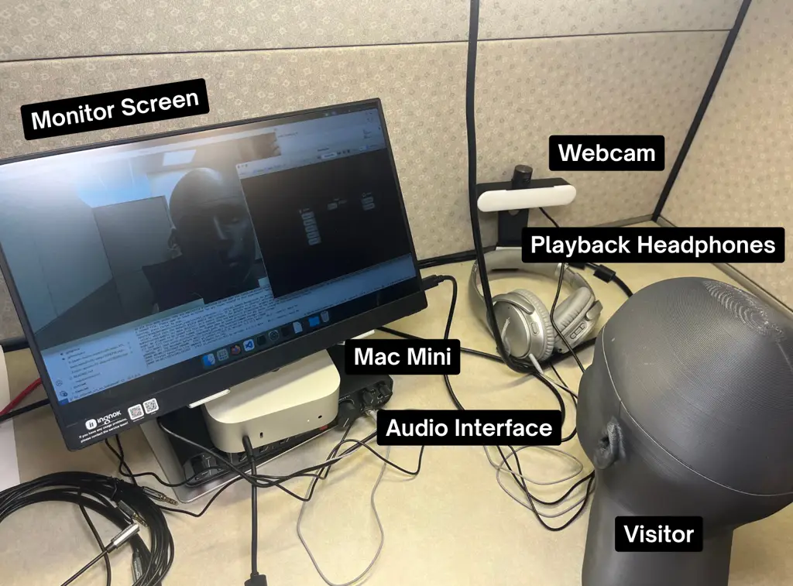
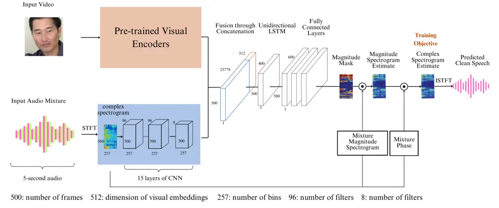

# Real-Time System for Audio-Visual Target Speech Enhancement

###### Abstract

We present a live demonstration for RAVEN, a real-time audio-visual
speech enhancement system designed to run entirely on a CPU. In
single-channel, audio-only settings, speech enhancement is traditionally
approached as the task of extracting clean speech from environmental
noise. More recent work has explored the use of visual cues, such as lip
movements, to improve robustness, particularly in the presence of
interfering speakers. However, to our knowledge, no prior work has
demonstrated an interactive system for real-time audio-visual speech
enhancement operating on CPU hardware. RAVEN fills this gap by using
pretrained visual embeddings from an audio-visual speech recognition
model to encode lip movement information. The system generalizes across
environmental noise, interfering speakers, transient sounds, and even
singing voices. In this demonstration, attendees will be able to
experience live audio-visual target speech enhancement using a
microphone and webcam setup, with clean speech playback through
headphones.

|                                                                                     |
| ----------------------------------------------------------------------------------- |
| Teng Ma^(1,2), Sile Yin¹, Li-Chia Yang¹, Shuo Zhang¹                                |
| ¹Bose Corporation, Framingham, USA   ²Georgia Institute of Technology, Atlanta, USA |

## 1 Introduction

Speech enhancement is commonly defined as the removal of background
noise \[1\], often focused on environmental sounds. However, real-world
acoustic environments are more complex, frequently involving transient
noises such as sudden bangs, as well as interfering speakers.
Traditional audio-only speech enhancement algorithms struggle with
separating out clean speech from competing speakers, unless provided
with enrollment audio from target speaker. These challenges prompt
researchers to explore the use of additional modalities, such as visual
information, to improve target speech enhancement performance in recent
years, as computing power increases\[2\]. There has been a rise in
audio-visual speech enhancement (AVSE) literature, from mask-based
approaches \[3, 4, 5\] to synthesis-based approaches\[6, 7, 8\],
achieving better results than only using audio\[9, 10\].

### 1.1 Motivation

Despite this increase in AVSE research, most existing systems operate in
a non-causal setting\[5, 9, 3\]. While having access to future
information may achieve strong performance, they are unsuitable for
real-time deployment. Although some real-time AVSE systems have been
proposed, their implementations and demonstrations are not made
available, making reproduction difficult \[11, 10, 12\]. Motivated by
this gap, we present a real-time AVSE algorithm and built an application
that enables users to test the speech enhancement algorithm in realistic
scenarios, as seen in Fig. 1. To our knowledge, this is the first
publicly available, real-time AVSE demonstration that can be run on a
CPU.

### 1.2 Application & Problem Scenario

Real-time AVSE systems are especially useful for video calls\[13\],
where the model can isolate and enhance the on-screen speaker’s voice.
This also applies to in-car communication systems\[14\], enabling clear
speech pickup even in noisy cabins with multiple speakers or background
music.

Beyond video calls, the technology extends to wearables equipped with
cameras, such as smart glasses or headphones, where it can provide users
with an audio feed of the clean speech of the speaker in their field of
view. This offers a potential solution to the longstanding cocktail
party problem, which refers to the human ability to focus auditory
attention on a single speaker in a noisy, multi-speaker setting\[15\].
In addition, AVSE algorithms also hold promise for application in
advanced audio-visual hearing aids\[16, 17\]. Conventional hearing aids
typically amplify all incoming sounds indiscriminately, which can
overwhelm users in noisy environments and limit intelligibility. In
contrast, audio-visual hearing aids could identify and prioritize speech
signal of interest by leveraging relevant visual cues.

Fig. 1: Setup of our real-time audio-visual speech enhancement system.
The audio-visual input is streamed into our Python application via the
webcam and the microphones. Visitors can hear the clean speech through
the playback headphones in real time.

## 2 System Design

Our real-time AVSE system consists of two main components: (1) a causal
AVSE model designed for real-time inference trained on VoxCeleb2 \[18\],
and (2) a real-time streaming pipeline that interfaces with live
audio-visual inputs, processes them through the AVSE model, and outputs
the enhanced speech signal. ¹¹ 1 The algorithm and training code are
released through Interspeech 2025\[19\]; however, the real-time system
has never been demonstrated live.

### 2.1 Model Architecture

Fig. 2: Architecture of our mask-based late fusion method. A batch
normalization layer is added after each CNN layer, and a ReLU layer is
added to each CNN and fully connected layer. A Sigmoid function is
applied to the magnitude mask to limit the mask values from 0 to 1.

As shown in Fig. 2, RAVEN uses a mask-based, late-fusion architecture.
The visual stream first crops the mouth region from the input video and
passes it through a pretrained visual encoder to extract lip movement
embeddings. The pretrained visual encoder, Visual Speech Recognition in
the Wild (VSRiW)\[20, 21\], is an end-to-end visual speech recognition
model that integrates feature extraction with a hybrid CTC/attention
back-end. The checkpoint that we used was trained on GRID, which results
in a Word Error Rate of 4.8. Its visual front end uses a ResNet encoder
with a 3D convolutional layer that has a kernel size of 5. It has a
padding of 2 on both sides along the time axis, which results in a
receptive field of 5 including a look-ahead of 2 video frames. The
visual stream has a frame rate of 25 frames per second.

The audio input mixture clips are synthesized to simulate our target
task by combining the target audio with the audio from another randomly
selected input video. Then the signal-to-noise ratio of the input audio
mixture is constrained to a range of -5 dB to 5 dB. We obtain the
time-frequency representations of these 5-second clips through
Short-Time Fourier Transform (STFT). We use a Hann window of length 400,
a hop size of 160, and 512 frequency bins (nfft), with a power-law
compression rate (p) of 0.3. These spectrograms are passed into a
15-layer convolutional neural network (CNN).

To align the audio and visual streams, the visual embeddings are
upsampled to 100 fps before they are concatenated with the audio
embeddings. The concatenated audio-visual features are subsequently fed
into a uni-directional Long Short-Term Memory (LSTM) network, the output
of which is passed through a series of three fully connected layers that
produce a predicted magnitude mask. This mask is applied element-wise to
the magnitude spectrogram of the noisy input mixture, yielding an
estimated magnitude spectrogram of the clean speech. To reconstruct the
enhanced speech waveform, the estimated clean magnitude spectrogram is
combined with the phase of the original noisy mixture to form an
estimated complex spectrogram. The resulting complex spectrogram is then
transformed back into the time domain using the inverse Short-Time
Fourier Transform (ISTFT).

The model is trained using a phase-sensitive approximation (PSA) loss
function, which minimizes the Mean Squared Error (MSE) between both the
predicted and ground truth magnitude as well as complex spectrogram to
mitigate for the loss of phase information during training, inspired by
\[22, 23\].

### 2.2 Components & Implementation

The system is implemented in Python. Audio streaming is handled using
PyAudio, while video is captured using OpenCV (cv2). Both modalities run
at 25 frames per second, corresponding to a 40 ms frame interval. The
visual encoder has a receptive field of 5, which includes a 2-frame
lookahead. In order to produce a meaningful visual embedding for the
current frame, we maintain a buffer of 5 frames. In this setup, the
current frame is the middle frame (the third frame) in the buffer. This
results in an algorithmic latency of 120 ms, as shown in Fig. 3. Since
the processing time per frame remains below 40 ms, the system meets
real-time performance requirements.

## 3 Demonstration & Interaction

The demonstration runs on a Mac Mini using our Python-based application.
Audio-visual input is captured through a microphone and webcam, and the
enhanced speech is played back in real time through headphones. As shown
in Fig. 1, the setup includes a Mac Mini, a monitor screen, audio
interface, a webcam, microphones, and headphones placed on a table.

Visitors will be able to interact with the system in real time. The
system works as such: the person that the webcam points at is the target
speaker, which could be the visitor themselves or another visitor, and
the clean target speech will be played back through the headphone in
real time. Visitors will be encouraged to test out different
interference conditions, such as clapping or singing, to evaluate the
model’s robustness and responsiveness.

Fig. 3: Latency diagram of the RAVEN system. To generate a meaningful
visual embedding for each frame, we buffer 5 frames of audio and video
input, streamed at 25 frames per second. This is required by the
pretrained visual encoder, which has a receptive field of 5 frames
including a 2-frame lookahead. The resulting algorithmic latency is 120
ms.

## REFERENCES

- \[1\] N. Das, S. Chakraborty, J. Chaki, N. Padhy, and N. Dey,
  “Fundamentals, present and future perspectives of speech enhancement,”
  _International Journal of Speech Technology_, vol. 24, no. 4, pp.
  883–901, 2021.
- \[2\] A. Adeel, M. Gogate, A. Hussain, and W. M. Whitmer, “Lip-Reading
  Driven Deep Learning Approach for Speech Enhancement,” _IEEE
  Transactions on Emerging Topics in Computational Intelligence_,
  vol. 5, no. 3, pp. 481–490, Jun. 2021.
- \[3\] T. Afouras, J. S. Chung, and A. Zisserman, “The conversation:
  Deep audio-visual speech enhancement,” _arXiv preprint
  arXiv:1804.04121_, 2018.
- \[4\] W. Wang, C. Xing, D. Wang, X. Chen, and F. Sun, “A robust
  audio-visual speech enhancement model,” in _ICASSP 2020 - 2020 IEEE
  International Conference on Acoustics, Speech and Signal Processing
  (ICASSP)_, 2020, pp. 7529–7533.
- \[5\] A. Ephrat, I. Mosseri, O. Lang, T. Dekel, K. Wilson,
  A. Hassidim, W. T. Freeman, and M. Rubinstein, “Looking to Listen at
  the Cocktail Party: A Speaker-Independent Audio-Visual Model for
  Speech Separation,” _ACM Transactions on Graphics_, vol. 37, no. 4,
  pp. 1–11, 2018.
- \[6\] K. Yang, D. Marković, S. Krenn, V. Agrawal, and A. Richard,
  “Audio-visual speech codecs: Rethinking audio-visual speech
  enhancement by re-synthesis,” in _Proceedings of the IEEE/CVF
  Conference on Computer Vision and Pattern Recognition (CVPR)_, June
  2022, pp. 8227–8237.
- \[7\] M. Sadeghi, S. Leglaive, X. Alameda-Pineda, L. Girin, and
  R. Horaud, “Audio-visual speech enhancement using conditional
  variational auto-encoders,” _IEEE/ACM Transactions on Audio, Speech,
  and Language Processing_, vol. 28, pp. 1788–1800, 2020.
- \[8\] C. Jung, S. Lee, J.-H. Kim, and J. S. Chung, “FlowAVSE:
  Efficient Audio-Visual Speech Enhancement with Conditional Flow
  Matching,” in _Interspeech_, 2024.
- \[9\] R. Mira, B. Xu, J. Donley, A. Kumar, S. Petridis, V. K. Ithapu,
  and M. Pantic, “La-voce: Low-snr audio-visual speech enhancement using
  neural vocoders,” in _ICASSP 2023 - 2023 IEEE International Conference
  on Acoustics, Speech and Signal Processing (ICASSP)_, 2023, pp. 1–5.
- \[10\] H. Chen, R. Mira, S. Petridis, and M. Pantic, “RT-LA-VocE:
  Real-Time Low-SNR Audio-Visual Speech Enhancement,” in
  _Interspeech_, 2024.
- \[11\] M. Gogate, K. Dashtipour, A. Adeel, and A. Hussain,
  “CochleaNet: A robust language-independent audio-visual model for
  real-time speech enhancement,” _Information Fusion_, vol. 63, pp.
  273–285, 2020.
- \[12\] Z. Zhu, H. Yang, M. Tang, Z. Yang, S. E. Eskimez, and H. Wang,
  “Real-Time Audio-Visual End-to-End Speech Enhancement,” in
  _International Conference on Acoustics, Speech & Signal Processing
  (ICASSP)_, 2023.
- \[13\] B. İnan, M. Cernak, H. Grabner, H. P. Tukuljac, R. C. Pena, and
  B. Ricaud, “Evaluating audiovisual source separation in the context of
  video conferencing,” in _Interspeech 2019_, 2019, pp. 4579–4583.
- \[14\] S.-Y. Chuang, H.-M. Wang, and Y. Tsao, “Improved Lite
  Audio-Visual Speech Enhancement,” _IEEE/ACM Transactions on Audio,
  Speech, and Language Processing_, 2022.
- \[15\] Y. Li, F. Wang, Y. Chen, A. Cichocki, and T. Sejnowski, “The
  effects of audiovisual inputs on solving the cocktail party problem in
  the human brain: An fmri study,” _Cerebral Cortex_, vol. 28, no. 10,
  pp. 3623–3637, 2018.
- \[16\] A. Adeel, J. Ahmad, H. Larijani, and A. Hussain, “A novel
  real-time, lightweight chaotic-encryption scheme for next-generation
  audio-visual hearing aids,” _Cognitive Computation_, vol. 12, no. 3,
  pp. 589–601, 2020.
- \[17\] J.-C. Hou, S.-S. Wang, Y.-H. Lai, Y. Tsao, H.-W. Chang, and
  H.-M. Wang, “Audio-visual speech enhancement using multimodal deep
  convolutional neural networks,” _IEEE Transactions on Emerging Topics
  in Computational Intelligence_, vol. 2, no. 2, pp. 117–128, 2018.
- \[18\] J. S. Chung, A. Nagrani, and A. Zisserman, “Voxceleb2: Deep
  speaker recognition,” in _Interspeech_, 2018. \[Online\]. Available:
  [https://api.semanticscholar.org/CorpusID:49211906](https://api.semanticscholar.org/CorpusID:49211906)
- \[19\] T. Ma, S. Yin, L.-C. Yang, and S. Zhang, “Real-Time
  Audio-Visual Speech Enhancement Using Pre-trained Visual
  Representations,” in _Interspeech 2025_, 2025, pp. 61–65.
- \[20\] P. Ma, S. Petridis, and M. Pantic, “End-to-end Audio-visual
  Speech Recognition with Conformers,” in _International Conference on
  Acoustics, Speech & Signal Processing (ICASSP)_, 2021.
- \[21\] ——, “Visual Speech Recognition for Multiple Languages in the
  Wild,” _Nature Machine Intelligence_, vol. 4, no. 11, pp. 930–939,
  2022, arXiv:2202.13084 \[cs\].
- \[22\] H. Erdogan, J. R. Hershey, S. Watanabe, and J. Le Roux,
  “Phase-sensitive and recognition-boosted speech separation using deep
  recurrent neural networks,” in _International Conference on Acoustics,
  Speech & Signal Processing (ICASSP)_, 2015.
- \[23\] Z.-Q. Wang, G. Wichern, and J. L. Roux, “On The Compensation
  Between Magnitude and Phase in Speech Separation,” _IEEE Signal
  Processing Letters_, vol. 28, pp. 2018–2022, 2021, arXiv:2108.05470
  \[cs\].
