# Query-Based Asymmetric Modeling with Decoupled Input-Output Rates for Speech Restoration

Ui-Hyeop Shin Affiliation: Department of Electronic Engineering, Sogang
University, Seoul, Korea Correspondence to: <dmlguq123@sogang.ac.kr>   
Jaehyun Ko Affiliation: Department of Artificial Intelligence, Sogang
University, Seoul, Korea    Woocheol Jeong Affiliation: Department of
Artificial Intelligence, Sogang University, Seoul, Korea    Hyung-Min
Park Affiliation: Department of Electronic Engineering, Sogang
University, Seoul, Korea Affiliation: Department of Artificial
Intelligence, Sogang University, Seoul, Korea Correspondence to:
<hpark@sogang.ac.kr>

###### Abstract

Speech restoration aims to recover clean speech from degraded recordings
affected by noise, reverberation, bandwidth reduction, or other
distortions, where input and output sampling rates may differ. Existing
approaches typically assume matched input–output rates and apply
redundant resampling, limiting native multi-rate processing. We
formulate this gap as the extended sampling-frequency-independent (xSFI)
setting, where a model must operate under decoupled input–output rates,
and propose TF-Restormer, a query-based xSFI modeling framework. The
model encodes only the observed input band and synthesizes the
unobserved high-frequency band through extension queries with
band-partitioned cross-attention, yielding an asymmetric encoder–decoder
that allocates capacity to analysis while keeping synthesis lightweight.
Trained with a perceptual loss, a scaled log-spectral loss, and
adversarial supervision via an SFI-STFT discriminator, TF-Restormer
attains balanced fidelity–perceptual quality as a single unified model,
without redundant resampling across denoising, dereverberation,
bandwidth extension, and combined-distortion benchmarks under multiple
sampling rates.

###### Keywords: 

Machine Learning, ICML

## 1 Introduction

Speech enhancement (Ephraim and Malah, 1984; Pascual et al., 2017) has
historically progressed through isolated sub-tasks with dedicated models
such as denoising (Hu et al., 2020; Ho et al., 2020),
dereverberation (Han et al., 2015; Wang and Wang, 2020),
declipping (Mack and Habets, 2019), and bandwidth extension or
super-resolution (Liu et al., 2022a; Lee and Han, 2021). In real-world
settings, multiple distortions often coincide and further obscure both
magnitude and phase, making coherent and faithful speech restoration
substantially more difficult. Crucially, this complexity is often
accompanied by a fundamental mismatch between the native input bandwidth
and the desired output sampling rate, a challenge that remains largely
unaddressed by conventional task-specific frameworks.

This growing complexity has prompted a shift toward general speech
restoration using generative models to handle diverse distortions (Liu
et al., 2022b; Serrà et al., 2022). Vocoder-based approaches (Kumar et
al., 2019; Kong et al., 2020a) reconstruct waveforms from compressed
representations such as Mel features (Liu et al., 2022b; Babaev et al.,
2024), improving perceptual quality but often treating speech as a
semantic abstraction rather than a physical signal. Waveform- or
complex-spectrum-based generative models (Oord et al., 2016; Serrà et
al., 2022; Welker et al., 2022; Richter et al., 2023), including GAN-
and diffusion-based methods, operate closer to the signal domain and can
improve fidelity, but their temporal compression or iterative sampling
limits streaming applicability.

Beyond the choice of generative modeling paradigm, existing approaches
commonly assume _a fixed input–output sampling-rate_ setting.
Restoration and super-resolution models (Kim et al., 2024; Lu et al., 2025) typically resample inputs to a predetermined target rate, which
fixes the spectral grid but ties the learned representation to a
specific output resolution. Consequently, inputs with different native
bandwidths require redundant resampling, and supporting multiple output
rates often requires rate-specific models or repeated conversion. These
limitations motivate a universal framework that analyzes the observed
bandwidth directly and synthesizes arbitrary output rates without
external resampling.

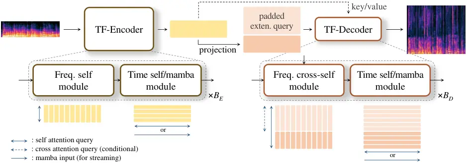

Figure 1: Overall architecture of TF-Restormer. A query-based asymmetric
encoder–decoder analyzes the native input bandwidth and reconstructs
missing high-frequency bands using learnable extension queries.

In parallel, discriminative models have been extensively developed in
the complex STFT domain (Choi et al., 2018; Hu et al., 2020). More
recently, time–frequency (TF) dual-path models have been
introduced (Dang et al., 2022; Wang et al., 2023), which alternate
sequence modeling along the time and frequency axes. By treating
frequency bins as ordered sequences rather than static feature
dimensions, this formulation naturally supports
sampling-frequency-independent (SFI) processing (Paulus and Torcoli,
2022; Zhang et al., 2023). The frequency axis can scale with the input
sampling rate while preserving a consistent STFT frame duration.
However, existing TF models still assume matched input–output rates.
Moreover, because they preserve fine-grained spectral representations
throughout the network, their computational cost grows substantially at
higher sampling rates, limiting direct application to super-resolution.

These observations motivate _extended SFI_ (xSFI) processing, which
retains the strengths of TF dual-path SFI while operating under
decoupled input–output rates rather than the matched-rate assumption. To
this end, we propose _TF-Restormer_, an xSFI model based on an
asymmetric encoder–decoder architecture for speech restoration under
diverse degradations as shown in Figure 1. Inspired by masked
autoencoders (MAE) (He et al., 2022), TF-Restormer concentrates heavy
computation in a TF dual-path encoder that analyzes the observed input
bandwidth, while a lightweight decoder reconstructs missing
high-frequency components through learnable extension queries using a
cross-self attention mechanism (Gupta et al., 2023). By explicitly
separating input-band analysis from output-band synthesis, this
asymmetric design enables a single model to operate across arbitrary
input–output sampling rate pairs without external resampling, while
preserving physical signal fidelity.

In summary, our contributions are as follows:

- •
  We formulate speech restoration under _decoupled input–output sampling
  rates_, where the standard learning assumption of matched spectral
  resolutions no longer holds, and propose a _query-based asymmetric_ TF
  encoder–decoder that analyzes the input bandwidth and synthesizes
  arbitrary output rates without external resampling.
- •
  Our asymmetric design enables a _single model_ to support general
  speech restoration including super-resolution, across heterogeneous
  input–output rate pairs, with unified training facilitated by a shared
  sampling-frequency-independent (SFI) STFT discriminator.
- •
  We improve robustness and practicality by enhancing the frequency
  module with a projection-based _spectral inductive bias_ and extending
  the time module to a causal variant, enabling stable restoration under
  severe degradations and real-time streaming inference.
- •
  We propose a _scaled log-spectral loss_ that stabilizes training under
  extreme distortions while mitigating oversmoothing, complementing
  perceptual (Babaev et al., 2024) and adversarial training (Mao et al.,
  2017).

## 2 Related Work

#### Vocoder- and diffusion-based restoration

Generative approaches have significantly improved speech quality.
Vocoder systems typically project speech into Mel features (Liu et al.,
2022b; Babaev et al., 2024) or learned representations (Koizumi et al.,
2023; Li et al., 2024) and synthesize waveforms with neural
vocoders (Oord et al., 2016; Kumar et al., 2019; Kong et al., 2020a).
They often achieve “studio-like” perceptual quality but reduce signal
fidelity, since intermediate features serve as perceptual cues rather
than physical signals. Diffusion-based methods from waveform (Kong et
al., 2020b; Serrà et al., 2022; Scheibler et al., 2024) or STFT
inputs (Lemercier et al., 2023; Richter et al., 2023) excel at
generating diverse realizations. However, each approach often relies on
temporal compression or iterative sampling, limiting real-time
streaming. More critically, both paradigms are typically bound to a
fixed-rate assumption, requiring external resampling to match a specific
target bandwidth. In contrast, we propose a single-pass complex spectral
prediction framework that avoids the abstraction bottleneck of vocoders
and the complexity of diffusion, while supporting variable input–output
rates.

#### TF dual-path models

TF dual-path models (Dang et al., 2022) alternate sequence modeling
along time and frequency, preserving spectral structure and naturally
supporting sampling-frequency-independent (SFI) designs (Zhang et al.,
2023). They have shown strong performance in enhancement (Cao et al.,
2022; Lu et al., 2023; Chao et al., 2024) and separation (Saijo et al.,
2024; Shin et al., 2025; Shin and Park, 2026). However, most prior
models employ symmetric block designs for time and frequency processing,
despite the distinct statistical characteristics of the two domains.
Under challenging degradations, this limitation becomes more pronounced,
motivating the use of projection-based frequency modules that inject
spectral inductive bias for more robust high-frequency recovery.
Furthermore, while existing dual-path models assume matched input-output
rates, we extend this paradigm to decoupled rates as xSFI, realized
through an asymmetric encoder-decoder that explicitly separates
observed-band analysis from unobserved-band synthesis.

#### Audio super-resolution

Conventional super-resolution models (Liu et al., 2022a; Han and Lee,
2022; Kim et al., 2024; Lu et al., 2025) typically assume a fixed target
rate, upsampling inputs before processing to fill missing bands. While
effective, this introduces redundancy and ties each model to a single
output rate. Our framework moves beyond this fixed-rate constraint by
framing super-resolution as a conditional spectral completion. Using
frequency extension queries within an asymmetric encoder–decoder,
TF-Restormer confines heavy processing to the input bandwidth and
restores missing bands as needed, supporting arbitrary, user-specified
output rates without rate-specific models.

## 3 TF-Restormer

### 3.1 xSFI input–output formulation

As an SFI model (Paulus and Torcoli, 2022), TF-Restormer addresses
arbitrary input sampling rates $`f_{E}`$ by constructing STFT with a
constant frame duration (SFI-STFT). Unlike conventional SFI that assumes
matched input–output rates, we introduce xSFI formulation, enabling
inference at user-specified output rates $`f_{D}`$. Given an input
$`x\hskip-1.42262pt\in\hskip-1.42262pt\mathbb{R}^{1\times N_{E}}`$ with
sampling rate $`f_{E}`$, its STFT is
$`\mathbf{X}\hskip-2.27621pt\in\hskip-2.27621pt\mathbb{R}^{F_{E}\times T\times 2}`$,
where $`F_{E}`$ and $`T`$ are the number of frequency bins and frames.
TF-Restormer then predicts
$`\mathbf{Y}\hskip-2.27621pt\in\hskip-2.27621pt\mathbb{R}^{F_{D}\times T\times 2}`$
corresponding to an output
$`y\hskip-1.42262pt\in\hskip-1.42262pt\mathbb{R}^{1\times N_{D}}`$ at
sampling rate $`f_{D}`$, satisfying
$`f_{E}\hskip-2.703pt:\hskip-2.703ptf_{D}\hskip-2.703pt=\hskip-2.703pt(F_{E}\hskip-2.703pt-\hskip-2.703pt1)\hskip-2.703pt:\hskip-2.703pt(F_{D}\hskip-2.703pt-\hskip-2.703pt1)`$
under the assumption of consistent frame duration. To ensure universal
applicability across sampling rates, we adopt a 40 ms window with a
20 ms hop. This choice yields integer sample counts, guaranteeing
consistent STFT construction at typical rates of
$`\{8,16,22.05,24,32,44.1,48\}`$ kHz without resampling.

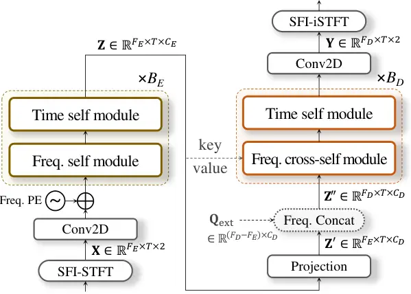

Figure 2: Architecture of TF-Restormer. The extension query
$`\mathbf{Q}_{\mathrm{ext}}`$ is concatenated to the projected feature
$`\mathbf{Z}^{\prime}`$ along the frequency axis, while encoder features
$`\mathbf{Z}`$ provide the key and value for frequency cross-attention.

### 3.2 Analysis encoder and extension decoder

As shown in Figure 1, TF-Restormer realizes the xSFI setting through a
conditional information-flow structure between the encoder and the
decoder: the encoder analyzes only the observed input band, the decoder
synthesizes the missing band via extension queries with band-partitioned
cross-attention, and when $`f_{E}=f_{D}`$ the cross-attention path is
bypassed entirely. This rate-conditional asymmetry concentrates capacity
on robust input analysis while keeping synthesis lightweight.

#### TF-encoder for input analysis

Figure 2 details this realization at the module level. The TF-encoder
analyzes the speech component from the input signals $`\mathbf{X}`$
within the native input bandwidth $`F_{E}`$, concentrating capacity on
robust feature extraction. Before the TF-encoder, the input complex
representation $`\mathbf{X}`$ is first projected to $`C_{E}`$ dimension
by 2d convolution (Conv2D) layer with kernel size of (3,3), followed by
layer normalization (LN) (Ba et al., 2016). Then, positional embeddings
are added along the frequency axis. In the encoder, the projected
feature is alternately processed by frequency and time self modules
$`B_{E}`$ times to capture speech component.

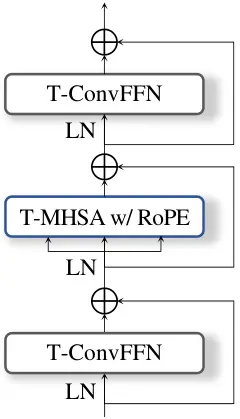

(a)

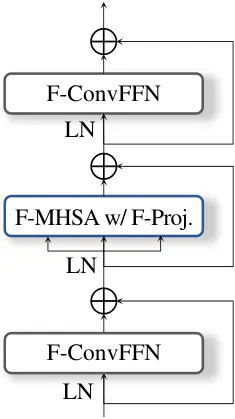

(b)

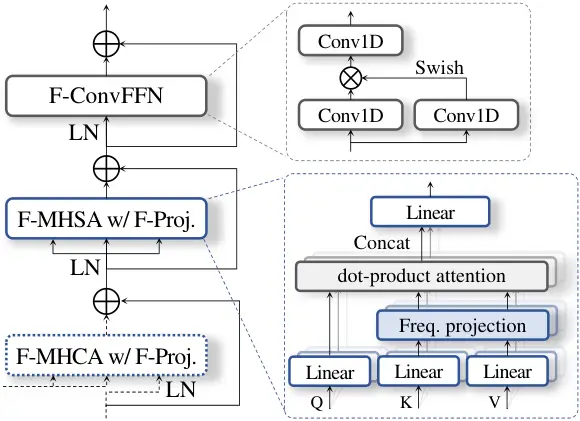

(c)

Figure 3: Unit modules of the TF encoder and decoder. The self modules
perform temporal or frequency-domain attention, while the frequency
cross-self module uses encoder features as keys and values for
cross-attention.

#### TF-decoder with extension query

The TF-decoder synthesizes the target output band by attending to the
encoder features through band-partitioned cross-attention. The encoder
features $`\mathbf{Z}`$ serve as key/value pairs in the frequency
cross-self modules and, in parallel, are projected to the decoder
channel dimension $`C_{D}`$ to form the lower-band decoder features
$`\mathbf{Z}^{\prime}`$. To reconstruct the missing high-frequency
regions, we introduce learnable extension queries,
$`\mathbf{Q}_{\text{ext}}\hskip-2.84526pt=\hskip-2.84526pt[\mathbf{q}_{F_{E}+1},\hskip-1.42262pt\dots,\hskip-1.42262pt\mathbf{q}_{F_{D}}]^{T}\hskip-2.84526pt\in\hskip-2.84526pt\mathbb{R}^{(F_{D}-F_{E})\times C_{D}}`$,
where $`\mathbf{q}_{f}`$ is a frequency-wise vector. These queries
function as frequency-specific latent priors optimized to capture the
characteristics of each sub-band. By slicing these queries from a
unified master vector $`\tilde{\mathbf{Q}}_{\text{ext}}`$¹¹ 1 The
$`40`$ ms SFI-STFT window fixes the frequency resolution at
$`\Delta_{\hskip-0.85358ptf}\hskip-1.70717pt=\hskip-1.70717pt25`$ Hz,
which divides every standard rate exactly into integer bin counts within
$`[F_{\text{min}},F_{\text{max}}]`$ = \[161, 961\] assuming the minimum
input rates $`f_{E}=`$8 kHz and maximum output rates $`f_{D}`$= 48 kHz.
defined over $`[F_{\text{min}},F_{\text{max}}]`$, the decoder maintains
consistent spectral alignment regardless of the specific sampling rates.
This ensures that the model treats a specific frequency bin with the
same learned representation, facilitating rate-invariant generalization.
In the frequency cross-self module, these queries explicitly guide the
cross-attention mechanism to retrieve relevant acoustic context from the
encoder features. Finally, the complex STFT values $`\mathbf{Y}`$ are
estimated from the decoder features through a Conv2D layer.

### 3.3 TF dual-path module design

In TF dual-path modules, given the feature with shape
$`\mathbb{R}^{T\hskip-0.56905pt\times\hskip-0.56905ptF\hskip-0.56905pt\times\hskip-0.56905ptC}`$
where $`F\hskip-2.84526pt\in\hskip-2.84526pt\{F_{E},F_{D}\}`$, time
modules process $`F`$ sequences with lengths of $`T`$ while frequency
modules consider the feature as $`T`$ sequences with lengths of $`F`$ as
illustrated in Figure 1.

#### Time and frequency self module

As shown in Figure 3a and  3b, self module consists of two
macaron-style (Lu\* et al., 2019) convolution feed-forward network
(ConvFFN) with Conv1D with kernel size $`K`$ for capturing local
contexts (Saijo et al., 2024; Shin and Park, 2026). In ConvFFN, the
expansion factor is 3 with SwiGLU as hidden activation. Between ConvFFN
modules, multi-head self-attention (MHSA) is used for global contexts
with $`H`$ heads. The time module performs MHSA on temporal frames with
rotary positional encoding (RoPE) (Su et al., 2024) to offer the
relative positions. On the other hand, the frequency self module applies
MHSA with the frequency projection layer to induce the structural bias
as frequency bins are more static sequence with a fixed length,
exhibiting a relatively consistent structural roles.

#### Frequency cross-self module

The frequency cross-self module in the decoder distinguishes between
observed and unobserved frequency bins at the level of query
construction. Specifically, for MHSA, the entire frequency axis is
treated symmetrically, and all frequency bins participate as queries,
keys, and values. In contrast, MHCA is applied only to the unobserved
high-frequency region $`\mathbf{Q}_{\text{ext}}`$ when $`f_{E}<f_{D}`$,
while the key–value are derived from the encoder features $`\mathbf{Z}`$
corresponding to the observed input bandwidth. Consistent with the
conditional information-flow structure, when
$`f_{E}\hskip-1.42262pt=\hskip-1.42262ptf_{D}`$ the MHCA path is
bypassed entirely.

#### Attention with structural bias

Linformer (Wang et al., 2020) introduced linear projections of key-value
to reduce the computations, while MLP-Mixer (Tolstikhin et al., 2021)
entirely replaced MHSA with static linear operations. Motivated by these
insights (Quan and Li, 2024b), we incorporate a frequency linear
projection (Figure 3c) to impose an inductive bias for the structural
consistency of frequency bins on top of the benefits of dynamic
attention. Since frequency bins exhibit consistent characteristics, we
share the same projection layer across all modules and key-value
mappings; this shared design emerges as the best choice in our ablation
(Table 6(b)), consistent with the same pattern in Linformer and
SpatialNet (Wang et al., 2020; Quan and Li, 2024b). Formally, for each
head $`h\hskip-2.84526pt=\hskip-2.84526pt1,\dots,\hskip-1.42262ptH`$,
given key-value
$`\mathbf{K}_{h,c},\hskip-1.42262pt\mathbf{V}_{h,c}\hskip-1.42262pt\in\hskip-1.42262pt\mathbb{R}^{T\times F}`$
at channel $`c`$, a projection matrix
$`\mathbf{A}_{h}\hskip-2.27621pt\in\hskip-1.42262pt\mathbb{R}^{{F_{\text{max}}}\times F_{\text{proj}}}`$
with dimension $`F_{\text{proj}}`$ and maximum bins $`F_{\text{max}}`$
is applied as

```math
\displaystyle\hskip-5.69054pt\tilde{\mathbf{K}}_{h,c}\hskip-2.84526pt \displaystyle= \displaystyle\hskip-2.84526pt[\mathbf{K}_{h,c},\mathbf{O}]\mathbf{A}_{h}\in\mathbb{R}^{T\times{F}_{\text{proj}}},\quad 1\leq c\leq C_{h}, \tag{1}
```

```math
\displaystyle\hskip-5.69054pt\tilde{\mathbf{V}}_{h,c}\hskip-2.84526pt \displaystyle= \displaystyle\hskip-2.84526pt[\mathbf{V}_{h,c},\mathbf{O}]\mathbf{A}_{h}\in\mathbb{R}^{T\times{F}_{\text{proj}}},\quad 1\leq c\leq C_{h}, \tag{2}
```

where $`\mathbf{O}\in\mathbb{R}^{T\times(F_{\text{max}}-F)}`$ is a
zero-padding matrix.

#### Streaming mode with Mamba

The modular design of the TF dual-path model further enables a seamless
extension to streaming mode by replacing the time module with Mamba
blocks (Gu and Dao, 2024; Quan and Li, 2024a). Causal-masked attention
is a viable alternative; we adopt Mamba following (Quan and Li, 2024a)
for its constant-memory inference on long-form audio. Refer to
Appendix C for detailed model configurations.

## 4 Training

The model is trained by two phases of pretraining and adversarial
training. The model is trained with $`f_{D}`$ randomly selected from
{16, 24, 44.1, 48}kHz at each step by downsampling target speech signals
from VCTK dataset (Yamagishi et al., 2019). Based on speech sources, we
simulated noisy reverberant signals by convolving the room impulse
response (RIR) and noise samples from the DNS dataset (Reddy et al.,
2020). We then applied various digital distortions including codecs and
downsampled the signal to the sampling rates $`f_{E}`$ of 8k or 16kHz,
which are common in practical restoration conditions (see Appendix A.1
for details). Because extension query could be undertrained if
distribution of the input and output sample rates is unbalanced in
training, we investigate these issues in Appendix F.

### 4.1 Pretraining

#### Perceptual loss

Following (Babaev et al., 2024), we incorporate a self-supervised
learning (SSL)-based perceptual loss to stabilize adversarial training
and encourage human-aligned quality. Specifically, extracting features
from a pretrained SSL model for both the enhanced and clean waveforms,
we minimize the mean-squared-error between these representations:

```math
\mathcal{L}_{\text{p}}(\theta)=\mathbb{E}_{m,n}\!\left[\,|\phi(g_{\theta}(x))_{m,n}-\phi(s)_{m,n}|^{2}\right],\vskip-1.42262pt \tag{3}
```

given that $`g_{\theta}(x)`$ is output of restoration model
$`g_{\theta}(\cdot)`$ with parameters of $`\theta`$.
$`\phi(\cdot)_{m,n}`$ denotes the $`m`$-th element of $`n`$-th frame
from its feature map. We utilize WavLM-conv (Chen et al., 2022b) as in
the previous study (Babaev et al., 2024).

#### Proposed scaled log-spectral loss

Because the perceptual loss is restricted to 16 kHz and it is beneficial
to guide spectral details to complement the looseness of perceptual
loss, a previous work adopted an $`\ell_{1}`$ distance on the magnitude
spectrum (Babaev et al., 2024). However, because TF-Restormer operates
directly on the complex spectrum, the model can be explicitly supervised
on both real and imaginary components in addition to the magnitude.
Therefore, when denoting the STFT of target signal $`s`$ by
$`S_{m,tf}\hskip-1.42262pt=\hskip-1.42262pt|S_{r,tf}\hskip-1.42262pt+\hskip-1.42262ptjS_{i,tf}|`$
and that of model’s predicted signal $`g_{\theta}(x)`$ by
$`Y_{m,tf}\hskip-1.42262pt=\hskip-1.42262pt|Y_{r,tf}\hskip-1.42262pt+\hskip-1.42262ptjY_{i,tf}|`$,
we can extend to the complex domain as
$`\mathcal{L}_{\ell_{1}}\hskip-1.42262pt(\theta)\hskip-1.42262pt=\hskip-1.42262pt\sum_{c\in\mathcal{C}}\alpha_{c}\hskip-2.27621pt\cdot\hskip-1.42262pt\mathbb{E}_{t,f}\hskip-0.85358pt\left[|Y_{c,tf}\hskip-1.42262pt-\hskip-1.42262ptS_{c,tf}|\right]`$,
where $`\mathcal{C}=\{r,i,m\}`$ denotes the component index set and
$`\alpha_{c}`$ are component weights.

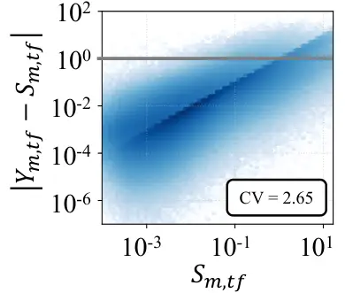

(a)

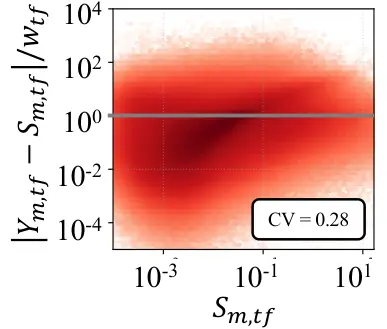

(b)

Figure 4: Spectral error versus source magnitude $`S_{m,tf}`$ on
VCTK-SR(noisy-distorted, $`16\to 48`$ kHz) testset from Table 3. The
gray horizontal line marks the log1p transition point at unit error
(gradient is $`\approx\!1`$ below and saturates toward $`0`$ above).
Insets report the coefficient of variation (CV) of the plotted error:
(a) raw error and (b) normalized error with
$`w_{tf}=\mathrm{E}_{t}[S_{m,tf}]`$.

However, even with complex supervision, severely degraded or missing
high-frequency regions yield unstable gradients and drive the model
toward oversmoothing under $`\ell_{1}/\ell_{2}`$ supervision (Babaev et
al., 2024). To address this, we design the loss to satisfy three
properties: (i) a _monotonically decreasing gradient_ at large errors,
(ii) a _unit-height gradient peak_ matching the $`\ell_{1}`$ upper
bound, which keeps the learning signal uniform, and (iii) $`w_{tf}`$
acting as a _transition-point_ parameter for the saturation onset. Among
functions satisfying all three²² 2 Appendix H extends the comparison to
the broader robust-loss family and leaves open whether
bilateral-saturation alternatives better suit spectral regression., the
scaled log1p form $`w\log(1+|d|/w)`$ provides the simplest
single-parameter form:

```math
\mathcal{L}_{{\rm s}}(\theta)\hskip-2.27621pt=\hskip-2.27621pt\sum_{c\in\mathcal{C}}\alpha_{c}\hskip-0.85358pt\cdot\hskip-0.85358pt\mathbb{E}_{t,f}\hskip-1.99168pt\left[\,w_{tf}\,\hskip-1.99168pt\log\!\left(1+\frac{|Y_{c,tf}\hskip-0.85358pt-\hskip-0.85358ptS_{c,tf}|}{w_{tf}}\right)\hskip-1.99168pt\right], \tag{4}
```

where $`w_{tf}`$ is scale factor that controls the relative scaling of
gradient.

For choosing the weight value $`w_{tf}`$, we empirically observed that
the distance $`|Y_{c,tf}\hskip-1.13809pt-\hskip-0.85358ptS_{c,tf}|`$ is
heteroscedastic and proportional to the source magnitude $`S_{m,tf}`$
(Figure 4a): low-magnitude bins lie far below the unit transition line,
where log1p reduces to a near-$`\ell_{1}`$ gradient and still introduces
the oversmoothing, while high-magnitude bins drift above the line into
the saturated regime. Setting $`w_{tf}=\text{E}_{t}[S_{m,tf}]`$ by
averaging over the frames of the ground-truth target aligns the error
distribution into a magnitude-invariant band centered around the
transition line, so every bin lives inside the log1p regime as intended:
the gradient concentrates on the well-aligned regions for refinement
while large-distance outliers are descended toward zero, suppressing
oversmoothing. We use
$`\alpha_{m}\hskip-1.70717pt=\hskip-1.70717pt0.6`$,
$`\alpha_{r}\hskip-1.70717pt=\hskip-1.70717pt0.2`$, and
$`\alpha_{i}\hskip-1.70717pt=\hskip-1.70717pt0.2`$.

### 4.2 Adversarial training

After pretraining the generator with $`\mathcal{L}_{\text{pre}}`$, we
introduce an adversarial loss component to reduce the artifacts and
predict severely distorted or missing components. For adversarial
training, we attach multi-scale STFT discriminators (Défossez et al., 2023) as $`i`$-th discriminator of $`\varphi_{i}`$ and apply least
square GAN (LS-GAN) loss (Mao et al., 2017). For generator, generator
LS-GAN and feature-matching loss (Kumar et al., 2019) terms are added,
respectively:

```math
\displaystyle\hskip-14.22636pt\mathcal{L}_{\rm gen}(\theta)\hskip-5.69054pt \displaystyle= \displaystyle\hskip-5.69054pt\lambda_{\rm g}\mathcal{L}_{\rm g}(\theta)+\lambda_{\rm fm}\mathcal{L}_{\rm fm}(\theta) \tag{5}
```

```math
\displaystyle\hskip 14.22636pt+\lambda_{\rm p}\mathcal{L}_{\rm p}(\theta)+\lambda_{\rm s}\mathcal{L}_{\rm s}(\theta)+\lambda_{\rm hf}\mathcal{L}_{\rm hf}(\theta),
```

```math
\displaystyle\hskip-14.22636pt\mathcal{L}_{\rm disc}(\varphi_{i})\hskip-5.69054pt \displaystyle= \displaystyle\hskip-5.69054pt\mathcal{L}_{\rm d}(\varphi_{i}),\quad i=1,...,I. \tag{6}
```

where
$`\mathcal{L}_{\text{hf}}=\mathcal{L}_{\text{pesq}}+10\cdot\mathcal{L}_{\text{utmos}}`$
is additional human-feedback loss (Babaev et al., 2024) for aesthetic
quality with differentiable PESQ loss and UTMOS loss (Saeki et al.,
2022). We performed adversarial training using
$`\mathcal{L}_{\text{gen}}(\theta)`$ with
$`\lambda_{\text{g}}\hskip-1.42262pt=\hskip-1.42262pt0.005`$,
$`\lambda_{\text{fm}}\hskip-1.42262pt=\hskip-1.42262pt0.1,\lambda_{\text{p}}\hskip-1.42262pt=\hskip-1.42262pt100`$,
$`\lambda_{\text{s}}\hskip-1.42262pt=\hskip-1.42262pt1`$, and
$`\lambda_{\text{hf}}\hskip-1.42262pt=\hskip-1.42262pt0.0001`$. Notably,
we assign small weights to $`\mathcal{L}_{\text{g}}`$ and
$`\mathcal{L}_{\text{hf}}`$ to avoid excessive generation artifacts.

#### Proposed multi-scale SFI-STFT discriminators

In conventional adversarial training, a dedicated generator for each
target sampling rate is trained with a corresponding discriminator as
well (Défossez et al., 2023; Babaev et al., 2024; Ju et al., 2024),
which introduces implementation overhead depending on the output sample
rates. For training of a single generator across diverse rates, we adopt
the strided-Conv2D STFT discriminator (Défossez et al., 2023) producing
two-dimensional maps for local real/fake supervision in the
time-frequency plane, and replace its STFT front-end with the SFI-STFT
formulation so that a single discriminator operates across sampling
rates with a consistent physical frame duration. This design maintains
sensitivity to spectral structure while remaining agnostic to absolute
frequency resolution, thereby supporting adversarial training across
different rates without redundant resampling or rate-specific
discriminators. We employ 5 SFI discriminators with STFT window
durations of {20, 40, 60, 80, 100} ms.

## 5 Evaluation

### 5.1 Test dataset and metrics

We evaluate a unified TF-Restormer on various datasets to validate
robustness across heterogeneous distortion conditions and arbitrary
input–output sample rates. For denoising (DN) and speech
super-resolution (SSR), we additionally report dedicated versions of
TF-Restormer for fair comparison; their training configurations are
summarized in Appendix A.3.

#### UNIVERSE data for general speech restoration (GSR)

As GSR model, we evaluate on 100 synthetic samples generated by UNIVERSE
authors (Serrà et al., 2022) to ensure comparability to prior works in
$`f_{E}=f_{D}=16`$kHz setting. The dataset introduces diverse simulated
degradations such as bandpass filtering, reverberation, codec
compression, and transmission artifacts.

#### VCTK+DEMAND for DN

We additionally evaluated the well-known Valentini denoising
dataset (Valentini-Botinhao and others, 2017) for direct comparison with
conventional enhancement models as speech enhancement benchmarking. The
evaluation set (824 utterances) consists of noisy mixtures from two
speakers under four SNR conditions (17.5, 12.5, 7.5, and 2.5 dB).

#### VCTK for SSR

For SSR evaluation, we construct paired data by downsampling 48 kHz
clean utterances from the VCTK-0.92 dataset (Yamagishi et al., 2019).
Beyond the clean case, we also create noisy-distorted conditions by
adding degradations such as noise, reverberation, band-pass filtering,
and codec effects, enabling a comprehensive evaluation of GSR with SSR.
Note that the training simulation follows a similar procedure, which may
provide a slight advantage to our model.

For the evaluation, we adopt non-intrusive perceptual estimators for
mean opinion score (MOS): DNSMOS (Reddy et al., 2022), UTMOS (Saeki et
al., 2022), and NISQA (Mittag et al., 2021) to assess the perceptual
quality. Also, to assess the perceptual signal fidelity of restored
signal compared to the reference, we employ perceptual evaluation of
speech quality (PESQ) (Rix et al., 2001), signal-to-distortion ratio
(SDR) (Le Roux et al., 2019), log-spectral distance (LSD), mel-cepstral
distortion (MCD) (Fukada et al., 1992). In addition, to evaluate the
reference-aware speech generation quality by capturing semantic
congruence, we report SpeechBERTScore(sBERT) (Saeki et al., 2024).

|                          |                 |            |         |         |           |                     |                     |
| ------------------------ | --------------- | ---------- | ------- | ------- | --------- | ------------------- | ------------------- |
| Model                    | Signal fidelity |            |         |         |           | Perceptual quality  |                     |
|                          | PESQ^(↑)        | SDR^(↑)    | LSD^(↓) | MCD^(↓) | sBERT^(↑) | UTMOS^(↑)           | DNSMOS^(↑)          |
| Input                    | 1.55            | 5.58       | 1.89    | 10.21   | 0.84      | 2.19                | 2.23                |
| Ground Truth             | 4.50            | $`\infty`$ | 0.00    | 0.00    | 1.00      | 4.26                | 3.33                |
| VoiceFixer               | 1.77            | -5.68      | 1.49    | 10.50   | 0.84      | 2.83                | 2.99                |
| StoRM                    | 1.76            | 9.01       | 1.67    | 6.87    | 0.84      | 2.70                | 2.94                |
| UNIVERSE^($`\dagger`$)   | 1.74            | 7.73       | 1.92    | 6.25    | 0.79      | 2.64                | 2.73                |
| UNIVERSE++^($`\dagger`$) | 1.80            | 8.42       | 1.76    | 5.96    | 0.81      | 2.71                | 2.82                |
| TF-Locoformer            | 2.13            | 11.61      | 2.00    | 6.26    | 0.89      | 2.95                | 2.86                |
| FINALLY                  | \-              | \-         | \-      | \-      | \-        | 4.21^($`\ddagger`$) | 3.25^($`\ddagger`$) |
| TF-Restormer (off)       | 2.30            | 11.12      | 1.45    | 5.08    | 0.91      | 4.08                | 3.25                |
| TF-Restormer (on)        | 2.00            | 8.89       | 1.47    | 6.01    | 0.87      | 3.77                | 3.14                |

Table 1: Results on UNIVERSE data for GSR. ^($`\dagger`$)We utilized
pretrained models from implementation code from UNIVERSE++ (Scheibler et
al., 2024). ^($`\ddagger`$)The results are reported in the original
paper (Babaev et al., 2024)

### 5.2 Validation of stability across diverse scenarios

In this section, we validate the operational stability of TF-Restormer
across a wide spectrum of restoration scenarios. For the UNIVERSE
dataset, we consider VoiceFixer (Liu et al., 2022b) as a Mel
vocoder-based baseline, StoRM (Lemercier et al., 2023), UNIVERSE (Serrà
et al., 2022), and UNIVERSE++ (Scheibler et al., 2024) as
diffusion-based baselines, TF-Locoformer as a recent TF dual-path
Transformer model, and FINALLY (Babaev et al., 2024) as a latest strong
Mel-vocoder method. As shown in Table 1, VoiceFixer improves MOS but
sacrifices fidelity due to its Mel representation, while FINALLY
achieves the highest perceptual quality yet lacks signal fidelity, a
trend confirmed in Table 2. Diffusion-based methods yield more balanced
results by directly operating in the waveform or complex STFT.
TF-Locoformer preserves signal-level fidelity but suffers from residual
perceptual artifacts and failure to recover lost details and naturalness
(MOS, LSD). In contrast, TF-Restormer provides balanced improvements for
signal fidelity and perceptual quality, with its streaming variant
maintaining competitive effectiveness under causal constraints. This
indicates its robustness across diverse degradations in a universal
restoration setting. Note that all the compared models are offline
methods.

|                                  |                 |            |         |         |           |                    |            |
| -------------------------------- | --------------- | ---------- | ------- | ------- | --------- | ------------------ | ---------- |
| Model                            | Signal fidelity |            |         |         |           | Perceptual quality |            |
|                                  | PESQ^(↑)        | SDR^(↑)    | LSD^(↓) | MCD^(↓) | sBERT^(↑) | UTMOS^(↑)          | DNSMOS^(↑) |
| Input                            | 1.98            |  8.56      | 1.27    | 5.40    | 0.91      | 2.90               | 2.45       |
| Ground Truth                     | 4.50            | $`\infty`$ | 0.00    | 0.00    | 1.00      | 4.07               | 3.16       |
| DB-AIAT                          | 3.27            | 21.30      | 0.90    | 1.77    | 0.95      | 3.83               | 3.13       |
| MP-SENet                         | 3.61            | 21.03      | 0.85    | 1.58    | 0.95      | 3.86               | 3.12       |
| TF-Locoformer                    | 3.30            | 23.82      | 0.92    | 3.58    | 0.95      | 3.93               | 3.20       |
| VoiceFixer                       | 2.40            | -1.12      | 0.97    | 7.40    | 0.90      | 3.50               | 3.08       |
| UNIVERSE                         | 2.84            | 18.77      | 1.17    | 2.20    | 0.92      | 3.75               | 3.03       |
| FINALLY                          | 2.94            |   4.60     | \-      | \-      | \-        | 4.32               | 3.22       |
| TF-Restormer (off)               | 3.41            | 19.45      | 0.75    | 1.54    | 0.95      | 4.14               | 3.14       |
| TF-Restormer (off)^($`\dagger`$) | 3.63            | 22.81      | 0.73    | 1.49    | 0.95      | 4.04               | 3.13       |
| TF-Restormer (on)                | 2.89            | 16.43      | 0.85    | 2.16    | 0.93      | 4.05               | 3.09       |

Table 2: Results on VCTK+DEMAND for denoising task.
^($`\dagger`$)Dedicated models trained specifically for denoising.

Next, we evaluate TF-Restormer on the VCTK+DEMAND focusing on denoising.
In Table 2, we compare against DB-AIAT (Yu et al., 2022), MP-SENet (Lu
et al., 2023), and TF-Locoformer as dedicated denoising models, and
VoiceFixer, UNIVERSE, and FINALLY as universal restoration baselines.
Since the input speech is already well preserved and only corrupted by
additive noise, it favors models that minimize unnecessary generation
and faithfully retain the input signal. Accordingly, dedicated denoising
models outperform universal restoration models in terms of signal
fidelity, as they are optimized to suppress noise without altering
intact regions. In contrast, restoration models risk degrading
reliability by over-modifying clean inputs, making them less trustworthy
for such simple cases. While not surpassing dedicated denoising models
in raw signal metrics, TF-Restormer achieves more consistent gains,
showing strong generalization despite being designed for universal
restoration. We additionally include a dedicated TF-Restormer variant;
as expected, this task-matched version achieves the higher
signal-fidelity scores.

Finally, we experiment on the SSR task in Table 3, using a single model
that directly supports arbitrary output sampling rates. For clean cases,
we compare against dedicated super-resolution models: NVSR (Liu et al.,
2022a), Frepainter (Kim et al., 2024), and AP-BWE (Lu et al., 2025), as
well as VoiceFixer as a universal restoration baseline. As in Table 2,
since the low-band of the input speech remains intact, dedicated models
that concentrate on reconstructing the upper bands are favored. Unlike
conventional approaches that rely on fixed input–output rates and often
require zero-padding or redundant resampling, TF-Restormer leverages
extension queries to dynamically expand the spectrum. With this
versatility, TF-Restormer shows stable performance comparable to the
dedicated models, faithfully retaining clean low-frequency regions while
effectively generating high-frequency components. When the training is
optimally aligned with the conventional method, the dedicated version of
the proposed model shows improved results. In addition, under
noisy-distorted conditions, TF-Restormer simultaneously restores
corrupted regions and reconstructs missing high bands, demonstrating
robust generalization beyond pure super-resolution. Overall, these
results suggest the advantage of our model as a universal restoration
framework that achieves bandwidth extension without sacrificing signal
fidelity or requiring explicit resampling.

| Method                            | 8 $`\rightarrow`$ 16kHz |           | 8 $`\rightarrow`$ 24kHz |           | 8 $`\rightarrow`$ 44.1kHz |           | 16 $`\rightarrow`$ 48kHz |           |
| --------------------------------- | ----------------------- | --------- | ----------------------- | --------- | ------------------------- | --------- | ------------------------ | --------- |
|                                   | LSD^(↓)                 | NISQA^(↑) | LSD^(↓)                 | NISQA^(↑) | LSD^(↓)                   | NISQA^(↑) | LSD^(↓)                  | NISQA^(↑) |
| clean (SSR only)                  |                         |           |                         |           |                           |           |                          |           |
| Input                             | 2.53                    | 3.78      | 2.91                    | 3.78      | 3.44                      | 3.78      | 3.17                     | 4.40      |
| NVSR^($`\dagger`$)                | 0.83                    | 4.15      | 0.89                    | 4.24      | 0.94                      | 4.16      | \-                       | \-        |
| Frepainter^($`\dagger`$)          | 1.33                    | 3.94      | 1.40                    | 3.79      | 1.37                      | 3.71      | 1.31                     | 4.01      |
| AP-BWE^($`\dagger`$)              | 0.90                    | 4.20      | 0.86                    | 4.34      | 0.88                      | 4.26      | 0.85                     | 4.33      |
| VoiceFixer^($`\dagger`$)          | 1.05                    | 4.20      | 1.05                    | 4.27      | 1.06                      | 4.21      | \-                       | \-        |
| TF-Restormer (off)                | 0.89                    | 4.53      | 0.95                    | 4.61      | 1.01                      | 4.54      | 0.97                     | 4.62      |
| TF-Restormer (off)^($`\ddagger`$) | 0.81                    | 4.42      | 0.82                    | 4.58      | 0.82                      | 4.40      | 0.81                     | 4.57      |
| Noisy-distorted (GSR + SSR)       |                         |           |                         |           |                           |           |                          |           |
| Input                             | 3.36                    | 1.91      | 3.49                    | 1.91      | 3.64                      | 1.91      | 3.48                     | 1.73      |
| VoiceFixer^($`\dagger`$)          | 1.36                    | 3.73      | 1.35                    | 3.91      | 1.40                      | 3.80      | \-                       | \-        |
| StoRM                             | 1.76                    | 3.97      | \-                      | \-        | \-                        | \-        | \-                       | \-        |
| UNIVERSE++                        | 1.79                    | 3.39      | \-                      | \-        | \-                        | \-        | \-                       | \-        |
| TF-Restormer (off)                | 1.16                    | 4.49      | 1.21                    | 4.54      | 1.18                      | 4.52      | 1.18                     | 4.54      |
| TF-Restormer (on)                 | 1.30                    | 4.42      | 1.31                    | 4.49      | 1.30                      | 4.46      | 1.26                     | 4.46      |

Table 3: Results on VCTK for SSR under clean and noisy-distorted
conditions. ^($`\dagger`$)The models require fixed output sampling rates
$`f^{\prime}`$, thus evaluated by upsampling the input of $`f_{E}`$ to
$`f^{\prime}\geq f_{D}`$ and downsampling the output back to the target
rate $`f_{D}`$. ^($`\ddagger`$)Dedicated models trained specifically for
super-resolution.

### 5.3 MOS evaluation on additional datasets

In Table 4, we evaluate TF-Restormer on real-recorded VoxCeleb (Nagrani
et al., 2017) utterances, the URGENT 2025 blind test set (Saijo et al.,
2025), the DNS Challenge 2020 real recordings (Reddy et al., 2020), and
the REVERB Challenge (Kinoshita et al., 2013) real recordings to examine
robustness in real and out-of-distribution(OOD) conditions. As paired
references are unavailable for these datasets, we report non-intrusive
MOS predictors here and we refer to audio demos to complement the lack
of MOS evaluation.

| Model        | UTMOS | DNSMOS |
| ------------ | ----- | ------ |
| Input        | 2.76  | 2.72   |
| VoiceFixer   | 2.60  | 3.08   |
| DEMUCS       | 3.51  | 3.27   |
| StoRM        | 3.29  | 3.17   |
| HiFi-GAN-2   | 3.67  | 3.32   |
| FINALLY      | 4.05  | 3.31   |
| TF-Restormer | 3.98  | 3.34   |

(a) VoxCeleb

|                  |       |       |        |
| ---------------- | ----- | ----- | ------ |
| Model            | UTMOS | NISQA | DNSMOS |
| Input            | 1.55  | 1.58  | 1.90   |
| Bobbsun(R.1)     | 2.09  | 3.22  | 2.88   |
| rc(R.2)          | 2.03  | 2.92  | 2.83   |
| Xiaobin(R.3)     | 2.16  | 3.24  | 2.92   |
| wataru9871(R.13) | 2.53  | 3.74  | 3.10   |
| LLaSE-G1         | 2.09  | 2.93  | 2.80   |
| UniSE            | 2.85  | 3.72  | 3.17   |
| TF-Restormer     | 3.37  | 4.37  | 3.13   |

(b) URGENT 2025 blind

| Model        | UTMOS | NISQA | DNSMOS |
| ------------ | ----- | ----- | ------ |
| Input        | 1.94  | 2.16  | 2.21   |
| Miipher      | 3.91  | 4.12  | 3.17   |
| VoiceFixer   | 2.35  | 3.53  | 2.88   |
| Resem.-Enh.  | 2.77  | 4.33  | 3.10   |
| UNIVERSE++   | 2.31  | 3.32  | 2.64   |
| AnyEnhance   | —     | —     | 3.17   |
| TF-Restormer | 3.50  | 4.36  | 3.13   |

(c) DNS 2020

| Model         | UTMOS | NISQA | DNSMOS |
| ------------- | ----- | ----- | ------ |
| Input         | 1.56  | 1.72  | 1.35   |
| TF-GridNet    | 2.34  | 1.95  | 2.93   |
| MP-SENet      | 2.09  | 1.84  | 3.01   |
| TF-Locoformer | 2.13  | 1.64  | 2.85   |
| TF-Restormer  | 3.14  | 2.13  | 3.30   |

(d) REVERB

Table 4: Evaluation of non-intrusive MOS results on real-recorded data
from VoxCeleb, URGENT 2025 blind, DNS 2020, and REVERB.

#### VoxCeleb real recordings

We evaluate TF-Restormer on 50 real-recorded utterances (Su et al., 2020) from VoxCeleb1 and compare with conventional methods including
DEMUCS (Défossez et al., 2019) and HiFi-GAN-2 (Su et al., 2021). As
shown in Table 4a, TF-Restormer achieves perceptual MOS scores (UTMOS,
DNSMOS) comparable to recent vocoder- and diffusion-based models. While
FINALLY (Babaev et al., 2024) remains one of the strongest
perceptual-quality systems, our unified architecture delivers similarly
natural outputs, demonstrating competitive robustness on real speech
recordings.

#### URGENT 2025 blind testsets

Finally, we report non-intrusive MOS metrics on the URGENT 2025 blind
test set compared to participating teams and latest models including
LLaSE-G1 (Kang et al., 2025) and UniSE (Yan et al., 2025). We report
this as OOD transfer evidence rather than a controlled in-domain
benchmark—our model is trained exclusively on VCTK without
URGENT-specific data—and TF-Restormer produces natural-sounding outputs
with strong non-intrusive MOS, indicating stable transfer to URGENT
blind conditions.

#### DNS Challenge 2020 real recordings

We further evaluate TF-Restormer on the DNS Challenge 2020
real-recording subset as an OOD restoration model (no DNS-specific
re-training). As shown in Table 4c, TF-Restormer attains the strongest
NISQA among the unified-restoration baselines (Miipher (Koizumi et al.,
2023), VoiceFixer, Resemble-Enhance³³ 3
[https://github.com/resemble-ai/resemble-enhance](https://github.com/resemble-ai/resemble-enhance),
UNIVERSE++, AnyEnhance (Zhang et al., 2025)), with UTMOS and DNSMOS
competitive with the best of these.

#### REVERB Challenge real recordings

We additionally evaluate on the REVERB Challenge real-recording subset
as an OOD restoration model (no REVERB-specific re-training), comparing
against discriminative dereverberation baselines (TF-GridNet, MP-SENet,
TF-Locoformer) trained on REVERB challenge training dataset. As shown in
Table 4d, TF-Restormer attains the strongest results across all
baselines, indicating natural-sounding dereverberation despite never
having seen REVERB-specific training data.

|                                                     |         |        |         |           |
| --------------------------------------------------- | ------- | ------ | ------- | --------- |
| Case                                                | Size(M) | MAC(G) | LSD^(↓) | NISQA^(↑) |
| VCTK (SSR, 8 $`\to`$ 16kHz)                         |         |        |         |           |
| encoder-only                                        | 11.6    | 151.3  | 2.12    | 4.21      |
| encoder-decoder w/o MHCA                            | 30.8    | 252.4  | 1.04    | 4.48      |
| encoder-decoder w/ MHCA                             | 30.1    | 240.8  | 0.89    | 4.53      |
| encoder-decoder w/ MHCA(small)                      | 10.9    | 89.2   | 1.36    | 4.38      |
| VCTK (SSR, 8 $`\to`$ 44.1kHz)                       |         |        |         |           |
| encoder-only                                        | 11.6    | 415.1  | 3.25    | 3.49      |
| encoder-decoder w/o MHCA                            | 30.8    | 340.4  | 1.35    | 4.26      |
| encoder-decoder w/ MHCA                             | 30.1    | 308.4  | 1.01    | 4.54      |
| encoder-decoder w/ MHCA(small)                      | 10.9    | 156.8  | 1.44    | 4.21      |
| VCTK-SR(noisy-distorted) (SSR+GSR, 8 $`\to`$ 16kHz) |         |        |         |           |
| encoder-only                                        | 11.6    | 151.3  | 2.23    | 3.72      |
| encoder-decoder w/o MHCA                            | 30.8    | 252.4  | 1.20    | 4.33      |
| encoder-decoder w/ MHCA                             | 30.1    | 240.8  | 1.16    | 4.54      |
| encoder-decoder w/ MHCA(small)                      | 10.9    | 89.2   | 1.48    | 4.20      |

Table 5: Ablation study on encoder-decoder design.
VCTK-SR(noisy-distorted) denotes noisy-distorted input from VCTK data in
Table 3.

### 5.4 Ablation study

To validate the effects of the proposed methods, we conduct an ablation
study on scaled log-spectral loss, decoder design, and frequency
projection module.

#### Encoder-decoder design

In Table 5, we first analyze the contribution of the encoder–decoder
structure (See Appendix F for detailed illustration.). The Encoder-only
model removes the decoder entirely and applies nine encoder blocks after
padding the extension queries at the input. Although this variant has a
small parameter count (11.6M), its MACs are extremely large (151-415G),
since the encoder must jointly infer the observed low band and
synthesize the missing high-frequency components. The w/o MHCA variant
restores the encoder–decoder structure but replaces the freq cross-self
module with the freq. self module used in the encoder, preventing the
decoder from conditioning on encoder features. Our proposed w/ MHCA
model incorporates cross–self frequency attention, enabling more
reliable reconstruction through encoder-conditioned queries.

To further isolate the effect of architectural design from model size,
we additionally include a reduced version of the proposed model (w/
MHCA(small)), whose parameter count matches that of the encoder-only
configuration. Despite having far fewer MACs than encoder-only, this
size-matched variant consistently outperforms the encoder-only model
across all bandwidth settings (Table 5(b)), confirming that the gains
arise from the explicit separation of analysis and reconstruction and
the use of cross-attention rather than increased parameter count or
computational cost.

|                              |      |       |
| ---------------------------- | ---- | ----- |
| STFT-Disc.                   | PESQ | UTMOS |
| UNIVERSE (GSR)               |      |       |
| Separate                     | 2.27 | 4.08  |
| Shared (SFI)                 | 2.29 | 4.10  |
| VCTK+DEMAND (DN)             |      |       |
| Separate                     | 3.28 | 4.07  |
| Shared (SFI)                 | 3.41 | 4.14  |
| VCTK (SSR., 8 $`\to`$ 16kHz) |      |       |
| Separate                     | 3.64 | 4.10  |
| Shared (SFI)                 | 3.70 | 4.11  |

(a) Effect of discriminator

|                             |         |      |       |
| --------------------------- | ------- | ---- | ----- |
| Case                        | Size(M) | PESQ | UTMOS |
| UNIVERSE (GSR)              |         |      |       |
| w/o F-proj.                 | 28.1    | 2.26 | 3.90  |
| w/ F-proj.(sep.)            | 63.6    | 2.31 | 4.11  |
| w/ F-proj.(sha.)            | 30.1    | 2.29 | 4.10  |
| VCTK+DEMAND (DN)            |         |      |       |
| w/o F-proj.                 | 28.1    | 3.21 | 4.03  |
| w/ F-proj.(sep.)            | 63.6    | 3.38 | 4.15  |
| w/ F-proj.(sha.)            | 30.1    | 3.41 | 4.14  |
| VCTK (SSR, 8 $`\to`$ 16kHz) |         |      |       |
| w/o F-proj.                 | 28.1    | 3.54 | 3.97  |
| w/ F-proj.(sep.)            | 63.6    | 3.55 | 3.94  |
| w/ F-proj.(sha.)            | 30.1    | 3.70 | 4.11  |

(b) Effects of frequency projection

Table 6: Ablation study on SFI-discriminator and frequency projection
layer in freq. module

#### SFI-STFT discriminator

As shown in Table 6a, a shared SFI-STFT discriminator consistently
outperforms separate rate-specific discriminators across all tasks.
Because the SFI representation aligns TF structure across sampling
rates, the unified discriminator receives more coherent supervision and
produces more stable gradients. In contrast, separate discriminators see
only partial bandwidth conditions, leading to weaker adversarial
signals. These results confirm that the shared SFI design is more
effective for multi-rate restoration.

#### Effects of frequency projection

Finally, we examine the influence of the frequency-projection (F-proj.)
module. Introducing projection provides an explicit structural prior
along the frequency axis, which stabilizes training and yields
consistent improvements over the no-projection baseline across tasks. In
the shared setting, a single projection matrix $`\mathbf{A}_{h}`$ is
shared across all frequency modules and all K/V mappings; in the
separate setting each module has its own independent projection matrix.
The difference in results between using shared and separate projections
is relatively small, though the separate version exhibits less stable
behavior in the super-resolution setting. More critically, the
non-shared design is highly inefficient, expanding the model to 63.6M
parameters. Given the similar performance and the large gap in model
size, the shared frequency-projection module offers the most practical
and efficient configuration.

#### Effects of scaled log-spectral loss

In Table 7, we assess whether auxiliary spectral losses provide
benefits. Using perceptual loss alone leads to less stable optimization,
whereas adding any spectral term consistently improves performance,
confirming the importance of spectral constraints. Among
regression-based losses, the $`\ell_{1}`$ loss on complex STFT
components (magnitude, real, imaginary) outperforms magnitude-only
variants by better preserving signal fidelity. Replacing $`\ell_{1}`$
with $`\ell_{2}`$ slightly degrades performance, likely due to
oversmoothing. These results indicate that perceptual loss is essential
for high-level quality but must be paired with an appropriate spectral
objective.

We next compare log- and scaled log-spectral formulations. A plain log1p
loss behaves similarly to $`\ell_{1}`$ because typical spectral
distances are far below 1, keeping its gradient near 1. The proposed
scaled log-spectral loss provides additional gains by adjusting gradient
magnitude according to the target spectrum: suitable scale values
balance well-aligned and poorly aligned regions, whereas overly small
scales collapse gradients and damage performance. Removing perceptual
loss noticeably harms both $`\ell_{1}`$ and s-log1p, and in this setting
$`\ell_{1}`$ remains more stable, showing that s-log1p is not effective
as a standalone objective. The best overall results arise when
$`w_{tf}`$ is adaptively derived from the target magnitude,
demonstrating that the proposed magnitude-adaptive scaling offers the
most reliable trade-off between fine spectral detail and global
coherence.

|                                         |                            |               |         |           |                         |         |           |
| --------------------------------------- | -------------------------- | ------------- | ------- | --------- | ----------------------- | ------- | --------- |
| Type of                                 | $`\mathcal{L}_{\text{p}}`$ | UNIVERSE(GSR) |         |           | VCTK(SSR,8$`\to`$16kHz) |         |           |
| spectral loss                           |                            | PESQ^(↑)      | MCD^(↓) | UTMOS^(↑) | PESQ^(↑)                | MCD^(↓) | UTMOS^(↑) |
| None                                    | ✓                          | 1.85          | 7.23    | 4.02      | 3.05                    | 2.47    | 4.11      |
| $`\ell_{1}`$-norm (mag.)                | ✓                          | 2.07          | 6.03    | 3.82      | 3.42                    | 2.10    | 4.10      |
| $`\ell_{1}`$-norm                       | ✓                          | 2.23          | 5.70    | 3.76      | 3.48                    | 1.86    | 4.07      |
| $`\ell_{2}`$-norm                       | ✓                          | 2.21          | 5.81    | 3.70      | 3.44                    | 1.88    | 4.06      |
| $`\ell_{1}`$-norm                       |                            | 2.19          | 5.89    | 3.71      | 3.35                    | 2.23    | 3.91      |
| log1p   ($`w=1`$)                       | ✓                          | 2.25          | 5.72    | 3.79      | 3.53                    | 1.83    | 4.06      |
| s-log1p ($`w=10^{-\hskip-1.42262pt3}`$) | ✓                          | 2.27          | 5.17    | 3.98      | 3.67                    | 1.37    | 4.07      |
| s-log1p ($`w=10^{-\hskip-1.42262pt4}`$) | ✓                          | 2.01          | 5.94    | 4.07      | 3.40                    | 2.43    | 4.10      |
| s-log1p ($`w=10^{-\hskip-1.42262pt3}`$) |                            | 2.18          | 6.05    | 3.74      | 3.27                    | 1.88    | 3.94      |
| s-log1p (adap. $`w_{tf}`$)              | ✓                          | 2.29          | 4.96    | 4.10      | 3.70                    | 1.29    | 4.10      |

Table 7: Ablation study on spectral loss. log1p denotes $`\log(1+d)`$
while s-log1p is the proposed scaled log1p $`w\log(1+d/w)`$ where $`d`$
is $`\ell_{1}`$ distance.

## 6 Conclusion

We presented TF-Restormer for speech restoration under the xSFI setting.
A query-based asymmetric encoder–decoder analyzes the observed input
bandwidth and reconstructs missing high-frequency components via
extension queries with band-partitioned cross-attention, and a
rate-conditional information flow lets a single model operate across
arbitrary input–output rate pairs without redundant resampling.

To stabilize unified training across heterogeneous rates and
distortions, we paired a shared multi-scale SFI-STFT discriminator with
the s-log1p loss whose transition-point parameter $`w_{tf}`$ is set by
the per-bin source magnitude, exploiting the near-perfect
heteroscedasticity between spectral error and source magnitude to
equalize the learning signal across frequency bins. Extensive
evaluations on denoising, SSR at multiple rate gaps, and GSR confirm
balanced gains in both signal fidelity and perceptual quality.

A formal subjective listening study (Appendix N) remains the principal
direction for future work; overall, TF-Restormer demonstrates that
explicit xSFI modeling, complemented by an adaptive spectral objective
and a rate-agnostic adversarial signal, is a practical path to universal
restoration.

## Acknowledgements

This work was partly supported by Institute of Information &
communications Technology Planning & Evaluation(IITP) grant funded by
the Korea government(MSIT)(RS-2022-II220621, Development of artificial
intelligence technology that provides dialog-based multi-modal
explainability) and National Research Foundation of Korea(NRF) grant
funded by the Korea government(MSIT)(RS-2026-25470024, Research on
Spatial Audio Reasoning with Large Language Models across Diverse
Microphone Arrays).

## Impact Statement

We use only public speech corpora and collect no new personal data. We
do not attempt speaker re-identification, and we do not redistribute raw
audio. Aware of potential misuse (e.g., covert monitoring), we will
apply access controls and intended-use restrictions and require legal
compliance for any release.

## References

- Ba et al. (2016) J. L. Ba, J. R. Kiros, and G. E. Hinton Layer
  Normalization. Cited by: §3.2.
- Babaev et al. (2024) N. Babaev, K. Tamogashev, A. Saginbaev, I.
  Shchekotov, H. Bae, H. Sung, W. Lee, H. Cho, and P. Andreev FINALLY:
  fast and universal speech enhancement with studio-like quality. In
  Proc. Adv. Neural Inf. Process. Syst. (NeurIPS), A. Globerson, L.
  Mackey, D. Belgrave, A. Fan, U. Paquet, J. Tomczak, and C. Zhang
  (Eds.), Vol. 37, pp. 934–965. External Links:
  [Document](https://dx.doi.org/10.52202/079017-0028) Cited by: 4th
  item, §1, §2, §4.1, §4.1, §4.1, §4.1, §4.2, §4.2, §5.2, §5.3, Table 1,
  Table 1.
- Braun et al. (2021) S. Braun, H. Gamper, C. K.A. Reddy, and I. Tashev
  Towards efficient models for real-time deep noise suppression. In
  Proc. IEEE Int. Conf. Acoust., Speech Signal Process. (ICASSP), Vol. ,
  pp. 656–660. Cited by: Table 15.
- Cao et al. (2022) R. Cao, S. Abdulatif, and B. Yang CMGAN:
  Conformer-based Metric GAN for Speech Enhancement. In Proc.
  Interspeech, pp. 936–940. Cited by: §2.
- Chao et al. (2024) R. Chao, W. Cheng, M. La Quatra, S. M.
  Siniscalchi, C. H. Yang, S. Fu, and Y. Tsao An Investigation of
  Incorporating Mamba for Speech Enhancement. arXiv preprint
  arXiv:2405.06573. Cited by: §2.
- Chao et al. (2025) R. Chao, R. Nasretdinov, Y. F. Wang, A. Jukic, S.
  Fu, and Y. Tsao Universal Speech Enhancement with Regression and
  Generative Mamba. In Proc. Interspeech, pp. 888–892. Cited by:
  Appendix J.
- Chen et al. (2022a) J. Chen, Z. Wang, D. Tuo, Z. Wu, S. Kang, and H.
  Meng Fullsubnet+: Channel attention fullsubnet with complex
  spectrograms for speech enhancement. In Proc. IEEE Int. Conf. Acoust.,
  Speech Signal Process. (ICASSP), pp. 7857–7861. Cited by: Table 15.
- Chen et al. (2022b) S. Chen, C. Wang, Z. Chen, Y. Wu, S. Liu, Z.
  Chen, J. Li, N. Kanda, T. Yoshioka, X. Xiao, J. Wu, L. Zhou, S.
  Ren, Y. Qian, Y. Qian, J. Wu, M. Zeng, X. Yu, and F. Wei WavLM:
  Large-scale self-supervised pre-training for full stack speech
  processing. IEEE Journal of Selected Topics in Signal Processing 16
  (6), pp. 1505–1518. External Links:
  [Document](https://dx.doi.org/10.1109/JSTSP.2022.3188113) Cited by:
  §4.1.
- Choi et al. (2018) H. Choi, J. Kim, J. Huh, A. Kim, J. Ha, and K. Lee
  Phase-aware speech enhancement with deep complex u-net. In Proc. Int.
  Conf. Learn. Represent. (ICLR), Cited by: §1.
- Dang et al. (2022) F. Dang, H. Chen, and P. Zhang DPT-FSNet: Dual-Path
  Transformer Based Full-Band and Sub-Band Fusion Network for Speech
  Enhancement. In Proc. IEEE Int. Conf. Acoust., Speech Signal Process.
  (ICASSP), pp. 6857–6861. Cited by: §1, §2.
- Défossez et al. (2023) A. Défossez, J. Copet, G. Synnaeve, and Y. Adi
  High Fidelity Neural Audio Compression. Transactions on Machine
  Learning Research. Cited by: §A.2, §4.2, §4.2.
- Défossez et al. (2019) A. Défossez, N. Usunier, L. Bottou, and F. Bach
  Music Source Separation in the Waveform Domain. arXiv preprint
  arXiv:1911.13254. Cited by: §5.3.
- Ephraim and Malah (1984) Y. Ephraim and D. Malah Speech enhancement
  using a minimum-mean square error short-time spectral amplitude
  estimator. IEEE Transactions on acoustics, speech, and signal
  processing 32 (6), pp. 1109–1121. Cited by: §1.
- Fukada et al. (1992) T. Fukada, K. Tokuda, T. Kobayashi, and S. Imai
  An adaptive algorithm for mel-cepstral analysis of speech. In Proc.
  IEEE Int. Conf. Acoust., Speech Signal Process. (ICASSP), Vol. 1,
  pp. 137–140 vol.1. Cited by: §5.1.
- Gu and Dao (2024) A. Gu and T. Dao Mamba: Linear-Time Sequence
  Modeling with Selective State Spaces. In Proc. Conf. Lang. Model.
  (COLM), Cited by: §3.3.
- Gupta et al. (2023) A. Gupta, J. Wu, J. Deng, and F. Li Siamese Masked
  Autoencoders. In Proc. Adv. Neural Inf. Process. Syst. (NeurIPS),
  pp. 40676–40693. Cited by: §1.
- Han et al. (2015) K. Han, Y. Wang, D. Wang, W. S. Woods, I. Merks,
  and T. Zhang Learning Spectral Mapping for Speech Dereverberation and
  Denoising. IEEE/ACM Transactions on Audio, Speech, and Language
  Processing 23 (6), pp. 982–992. Cited by: §1.
- Han and Lee (2022) S. Han and J. Lee NU-Wave 2: A General Neural Audio
  Upsampling Model for Various Sampling Rates. In Proc. Interspeech,
  pp. 4401–4405. Cited by: §2.
- Hao et al. (2021) X. Hao, X. Su, R. Horaud, and X. Li FullSubNet: a
  full-band and sub-band fusion model for real-time single-channel
  speech enhancement. In Proc. IEEE Int. Conf. Acoust., Speech Signal
  Process. (ICASSP), pp. 6633–6637. Cited by: Table 16.
- Hazrati et al. (2013) O. Hazrati, S. Sadjadi, P. Loizou, and J. Hansen
  Simultaneous suppression of noise and reverberation in cochlear
  implants using a ratio masking strategy. The Journal of the Acoustical
  Society of America 134, pp. 3759–65. External Links:
  [Document](https://dx.doi.org/10.1121/1.4823839) Cited by: Table 18.
- He et al. (2022) K. He, X. Chen, S. Xie, Y. Li, P. Dollár, and R.
  Girshick Masked Autoencoders Are Scalable Vision Learners. In Proc.
  IEEE/CVF Conf. Comput. Vis. Pattern Recognit. (CVPR), pp. 16000–16009.
  Cited by: §1.
- Ho et al. (2020) J. Ho, A. Jain, and P. Abbeel Denoising diffusion
  probabilistic models. In Proc. Adv. Neural Inf. Process. Syst.
  (NeurIPS), H. Larochelle, M. Ranzato, R. Hadsell, M.F. Balcan, and H.
  Lin (Eds.), Vol. 33, pp. 6840–6851. Cited by: §1.
- Hu et al. (2020) Y. Hu, Y. Liu, S. Lv, M. Xing, S. Zhang, Y. Fu, J.
  Wu, B. Zhang, and L. Xie DCCRN: Deep Complex Convolution Recurrent
  Network for Phase-Aware Speech Enhancement. In Proc. Interspeech,
  pp. 2472–2476. Cited by: Table 15, §1, §1.
- Jeub et al. (2009) M. Jeub, M. Schafer, and P. Vary A binaural room
  impulse response database for the evaluation of dereverberation
  algorithms. In Proc. Int. Conf. Digit. Signal Process. (DSP), pp. 1–5.
  Cited by: Appendix B.
- Ju et al. (2024) Z. Ju, Y. Wang, K. Shen, X. Tan, D. Xin, D. Yang, E.
  Liu, Y. Leng, K. Song, S. Tang, Z. Wu, T. Qin, X. Li, W. Ye, S.
  Zhang, J. Bian, L. He, J. Li, and S. Zhao NaturalSpeech 3: Zero-Shot
  Speech Synthesis with Factorized Codec and Diffusion Models. In Proc.
  Int. Conf. Mach. Learn. (ICML), Cited by: §4.2.
- Kang et al. (2025) B. Kang, X. Zhu, Z. Zhang, Z. Ye, M. Liu, Z.
  Wang, Y. Zhu, G. Ma, J. Chen, L. Xiao, C. Weng, W. Xue, and L. Xie
  ”LLaSE-g1: incentivizing generalization capability for LLaMA-based
  speech enhancement”. In Proc. Annu. Meet. Assoc. Comput. Linguist.
  (ACL), W. Che, J. Nabende, E. Shutova, and M. T. Pilehvar (Eds.),
  Vienna, Austria, pp. 13292–13305. Cited by: Table 17, §5.3.
- Kim et al. (2024) S. Kim, S. Lee, H. Choi, and S. Lee Audio
  Super-Resolution With Robust Speech Representation Learning of Masked
  Autoencoder. IEEE/ACM Transactions on Audio, Speech, and Language
  Processing 32, pp. 1012–1022. Cited by: §1, §2, §5.2.
- Kinoshita et al. (2013) K. Kinoshita, M. Delcroix, T. Yoshioka, T.
  Nakatani, E. Habets, R. Haeb-Umbach, V. Leutnant, A. Sehr, W.
  Kellermann, R. Maas, S. Gannot, and B. Raj The reverb challenge: a
  common evaluation framework for dereverberation and recognition of
  reverberant speech. In 2013 IEEE Workshop on Applications of Signal
  Processing to Audio and Acoustics, Vol. , pp. 1–4. External Links:
  [Document](https://dx.doi.org/10.1109/WASPAA.2013.6701894) Cited by:
  §5.3.
- Koizumi et al. (2023) Y. Koizumi, H. Zen, S. Karita, Y. Ding, K.
  Yatabe, N. Morioka, Y. Zhang, W. Han, A. Bapna, and M. Bacchiani
  Miipher: A Robust Speech Restoration Model Integrating Self-Supervised
  Speech and Text Representations. In Proc. IEEE Workshop Appl. Signal
  Process. Audio Acoust. (WASPAA), pp. 1–5. Cited by: §2, §5.3.
- Kong et al. (2020a) J. Kong, J. Kim, and J. Bae Hifi-GAN: Generative
  adversarial networks for efficient and high fidelity speech synthesis.
  In Proc. Adv. Neural Inf. Process. Syst. (NeurIPS), H. Larochelle, M.
  Ranzato, R. Hadsell, M.F. Balcan, and H. Lin (Eds.), Vol. 33,
  pp. 17022–17033. Cited by: §1, §2.
- Kong et al. (2020b) Z. Kong, W. Ping, J. Huang, K. Zhao, and B.
  Catanzaro Diffwave: A versatile diffusion model for audio synthesis.
  arXiv preprint arXiv:2009.09761. Cited by: §2.
- Kothapally and Hansen (2024) V. Kothapally and J. H. L. Hansen
  Monaural Speech Dereverberation Using Deformable Convolutional
  Networks. IEEE/ACM Transactions on Audio, Speech, and Language
  Processing 32 (), pp. 1712–1723. External Links:
  [Document](https://dx.doi.org/10.1109/TASLP.2024.3358720) Cited by:
  Table 18.
- Kumar et al. (2019) K. Kumar, R. Kumar, T. de Boissiere, L.
  Gestin, W. Z. Teoh, J. Sotelo, A. de Brébisson, Y. Bengio, and A. C.
  Courville MelGAN: generative adversarial networks for conditional
  waveform synthesis. In Proc. Adv. Neural Inf. Process. Syst.
  (NeurIPS), H. Wallach, H. Larochelle, A. Beygelzimer, F.
  d'Alché-Buc, E. Fox, and R. Garnett (Eds.), Vol. 32, pp. . Cited by:
  §1, §2, §4.2.
- Le Roux et al. (2019) J. Le Roux, S. Wisdom, H. Erdogan, and J. R.
  Hershey SDR–half-baked or well done?. In Proc. IEEE Int. Conf.
  Acoust., Speech Signal Process. (ICASSP), pp. 626–630. Cited by: §5.1.
- Lee and Han (2021) J. Lee and S. Han NU-Wave: A Diffusion
  Probabilistic Model for Neural Audio Upsampling. In Proc. Interspeech,
  pp. 1634–1638. Cited by: §1.
- Lemercier et al. (2023) J. Lemercier, J. Richter, S. Welker, and T.
  Gerkmann StoRM: A Diffusion-based Stochastic Regeneration Model for
  Speech Enhancement and Dereverberation. IEEE/ACM Transactions on
  Audio, Speech, and Language Processing 31, pp. 2724–2737. Cited by:
  §2, §5.2.
- Li et al. (2021) A. Li, W. Liu, C. Zheng, C. Fan, and X. Li Two heads
  are better than one: A two-stage complex spectral mapping approach for
  monaural speech enhancement. IEEE/ACM Trans. Audio, Speech, Language
  Process. 29, pp. 1829–1843. Cited by: Table 16.
- Li et al. (2022) A. Li, S. You, G. Yu, C. Zheng, and X. Li Taylor, Can
  You Hear Me Now? A Taylor-Unfolding Framework for Monaural Speech
  Enhancement. In Proc. IJCAI, pp. 4193–4200. Cited by: Table 16.
- Li et al. (2024) X. Li, Q. Wang, and X. Liu MaskSR: Masked Language
  Model for Full-band Speech Restoration. In Proc. Interspeech,
  pp. 2275–2279. Cited by: Table 17, §2.
- Liu et al. (2022a) H. Liu, W. Choi, X. Liu, Q. Kong, Q. Tian, and D.
  Wang Neural Vocoder is All You Need for Speech Super-resolution. In
  Proc. Interspeech, pp. 4227–4231. Cited by: §1, §2, §5.2.
- Liu et al. (2022b) H. Liu, X. Liu, Q. Kong, Q. Tian, Y. Zhao, D.
  Wang, C. Huang, and Y. Wang VoiceFixer: A Unified Framework for
  High-Fidelity Speech Restoration. In Proc. Interspeech, pp. 4232–4236.
  Cited by: §A.1, §1, §2, §5.2.
- Liu et al. (2023) L. Liu, H. Guan, J. Ma, W. Dai, G. Wang, and S. Ding
  A Mask Free Neural Network for Monaural Speech Enhancement. In Proc.
  Interspeech, pp. 2468–2472. Cited by: Table 16.
- Llombart et al. (2019) J. Llombart, D. Ribas, A. Miguel, L.
  Vicente, A. Ortega, and E. Lleida Speech Enhancement with Wide
  Residual Networks in Reverberant Environments. In Interspeech 2019,
  pp. 1811–1815. External Links:
  [Document](https://dx.doi.org/10.21437/Interspeech.2019-1745), ISSN
  2958-1796 Cited by: Table 18.
- Loshchilov and Hutter (2019) I. Loshchilov and F. Hutter Decoupled
  Weight Decay Regularization. In Proc. Int. Conf. Learn. Represent.
  (ICLR), Cited by: §A.2.
- Lu et al. (2025) Y. Lu, Y. Ai, H. Du, and Z. Ling Towards High-Quality
  and Efficient Speech Bandwidth Extension With Parallel Amplitude and
  Phase Prediction. IEEE Transactions on Audio, Speech and Language
  Processing 33, pp. 236–250. Cited by: §1, §2, §5.2.
- Lu et al. (2023) Y. Lu, Y. Ai, and Z. Ling MP-SENet: A Speech
  Enhancement Model with Parallel Denoising of Magnitude and Phase
  Spectra. In Proc. Interspeech, pp. 3834–3838. External Links:
  [Document](https://dx.doi.org/10.21437/Interspeech.2023-1441) Cited
  by: §2, §5.2.
- Lu\* et al. (2019) Y. Lu\*, Z. Li\*, D. He, Z. Sun, B. Dong, T.
  Qin, L. Wang, and T. Liu Understanding and Improving Transformer From
  a Multi-Particle Dynamic System Point of View.. In Proc. Int. Conf.
  Learn. Represent. (ICLR), Cited by: §3.3.
- Luo and Mesgarani (2019) Y. Luo and N. Mesgarani Conv-TasNet:
  Surpassing Ideal Time-Frequency Magnitude Masking for Speech
  Separation. IEEE/ACM Trans. Audio, Speech, Language Process. 27 (8),
  pp. 1256–1266. Cited by: Table 17.
- Mack and Habets (2019) W. Mack and E. A. P. Habets Declipping Speech
  Using Deep Filtering. In Proc. IEEE Workshop Appl. Signal Process.
  Audio Acoust. (WASPAA), pp. 200–204. Cited by: §1.
- Mao et al. (2017) X. Mao, Q. Li, H. Xie, R. Y. K. Lau, Z. Wang,
  and S. P. Smolley Least Squares Generative Adversarial Networks. In
  Proc. IEEE Int. Conf. Comput. Vis. (ICCV), pp. 2813–2821. Cited by:
  4th item, §4.2.
- Mittag et al. (2021) G. Mittag, B. Naderi, A. Chehadi, and S. Möller
  NISQA: a deep cnn-self-attention model for multidimensional speech
  quality prediction with crowdsourced datasets. In Proc. Interspeech,
  pp. 2127–2131. External Links:
  [Document](https://dx.doi.org/10.21437/Interspeech.2021-299), ISSN
  2958-1796 Cited by: §5.1.
- Nagrani et al. (2017) A. Nagrani, J. S. Chung, and A. Zisserman
  VoxCeleb: a large-scale speaker identification dataset. arXiv preprint
  arXiv:1706.08612. Cited by: §5.3.
- Nakamura et al. (2000) S. Nakamura, K. Hiyane, F. Asano, T. Nishiura,
  and T. Yamada Acoustical sound database in real environments for sound
  scene understanding and hands-free speech recognition. In Proc. Int.
  Conf. Lang. Resour. Eval. (LREC), Cited by: Appendix B.
- Oord et al. (2016) A. v. d. Oord, S. Dieleman, H. Zen, K. Simonyan, O.
  Vinyals, A. Graves, N. Kalchbrenner, A. Senior, and K. Kavukcuoglu
  WaveNet: A generative model for raw audio. arXiv preprint
  arXiv:1609.03499. Cited by: §1, §2.
- Pascual et al. (2017) S. Pascual, A. Bonafonte, and J. Serrà SEGAN:
  Speech Enhancement Generative Adversarial Network. In Proc.
  Interspeech, pp. 3642–3646. Cited by: §1.
- Paulus and Torcoli (2022) J. Paulus and M. Torcoli Sampling Frequency
  Independent Dialogue Separation. In 2022 30th European Signal
  Processing Conference (EUSIPCO), pp. 160–164. Cited by: §1, §3.1.
- Quan and Li (2024a) C. Quan and X. Li Multichannel long-term streaming
  neural speech enhancement for static and moving speakers. IEEE Signal
  Processing Letters 31 (), pp. 2295–2299. External Links:
  [Document](https://dx.doi.org/10.1109/LSP.2024.3418714) Cited by:
  §3.3.
- Quan and Li (2024b) C. Quan and X. Li SpatialNet: Extensively Learning
  Spatial Information for Multichannel Joint Speech Separation,
  Denoising and Dereverberation. IEEE/ACM Transactions on Audio, Speech,
  and Language Processing 32, pp. 1310–1323. Cited by: §3.3.
- Reddy et al. (2020) C. K. A. Reddy, V. Gopal, R. Cutler, E.
  Beyrami, R. Cheng, H. Dubey, S. Matusevych, R. Aichner, A. Aazami, S.
  Braun, P. Rana, S. Srinivasan, and J. Gehrke The INTERSPEECH 2020 Deep
  Noise Suppression Challenge: Datasets, Subjective Testing Framework,
  and Challenge Results. In Proc. Interspeech, pp. 2492–2496. Cited by:
  §A.1, Appendix L, §4, §5.3.
- Reddy et al. (2022) C. K. Reddy, V. Gopal, and R. Cutler DNSMOS P.
  835: A non-intrusive perceptual objective speech quality metric to
  evaluate noise suppressors. In Proc. IEEE Int. Conf. Acoust., Speech
  Signal Process. (ICASSP), pp. 886–890. Cited by: §5.1.
- Richter et al. (2023) J. Richter, S. Welker, J. Lemercier, B. Lay,
  and T. Gerkmann Speech Enhancement and Dereverberation with
  Diffusion-based Generative Models. IEEE/ACM Transactions on Audio,
  Speech, and Language Processing 31, pp. 2351–2364. Cited by: §1, §2.
- Rix et al. (2001) A. W. Rix, J. G. Beerends, M. P. Hollier, and A. P.
  Hekstra Perceptual evaluation of speech quality (PESQ)-a new method
  for speech quality assessment of telephone networks and codecs. In
  Proc. IEEE Int. Conf. Acoust., Speech Signal Process. (ICASSP),
  pp. 749–752. Cited by: §5.1.
- Rong et al. (2025) X. Rong, D. Wang, Q. Hu, Y. Wang, Y. Hu, and J. Lu
  TS-URGENet: A Three-stage Universal Robust and Generalizable Speech
  Enhancement Network. In Proc. Interspeech, pp. 863–867. External
  Links: [Document](https://dx.doi.org/10.21437/Interspeech.2025-734),
  ISSN 2958-1796 Cited by: Appendix J.
- Saeki et al. (2024) T. Saeki, S. Maiti, S. Takamichi, S. Watanabe,
  and H. Saruwatari SpeechBERTScore: Reference-Aware Automatic
  Evaluation of Speech Generation Leveraging NLP Evaluation Metrics. In
  Proc. Interspeech, pp. 4943–4947. Cited by: §5.1.
- Saeki et al. (2022) T. Saeki, D. Xin, W. Nakata, T. Koriyama, S.
  Takamichi, and H. Saruwatari UTMOS: UTokyo-SaruLab System for VoiceMOS
  Challenge 2022. In Proc. Interspeech, pp. 4521–4525. Cited by: §4.2,
  §5.1.
- Saijo et al. (2024) K. Saijo, G. Wichern, F. G. Germain, Z. Pan,
  and J. L. Roux TF-Locoformer: Transformer with Local Modeling by
  Convolution for Speech Separation and Enhancement. In Proc. Int.
  Workshop Acoust. Signal Enhance. (IWAENC), pp. 205–209. Cited by:
  Table 16, §2, §3.3.
- Saijo et al. (2025) K. Saijo, W. Zhang, S. Cornell, R. Scheibler, C.
  Li, Z. Ni, A. Kumar, M. Sach, Y. Fu, W. Wang, T. Fingscheidt, and S.
  Watanabe Interspeech 2025 URGENT Speech Enhancement Challenge. In
  Proc. Interspeech, pp. 858–862. Cited by: §5.3.
- Scheibler et al. (2024) R. Scheibler, Y. Fujita, Y. Shirahata, and T.
  Komatsu Universal Score-based Speech Enhancement with High Content
  Preservation. In Proc. Interspeech, pp. 1165–1169. Cited by: Table 10,
  Table 10, §2, §5.2, Table 1, Table 1.
- Schröter et al. (2022) H. Schröter, A. Maier, A.N. Escalante-B, and T.
  Rosenkranz Deepfilternet2: towards real-time speech enhancement on
  embedded devices for full-band audio. In Proc. Int. Workshop Acoust.
  Signal Enhance. (IWAENC), Vol. , pp. 1–5. Cited by: Table 15.
- Schroter et al. (2022) H. Schroter, A. N. Escalante-B, T. Rosenkranz,
  and A. Maier Deepfilternet: a low complexity speech enhancement
  framework for full-band audio based on deep filtering. In Proc. IEEE
  Int. Conf. Acoust., Speech Signal Process. (ICASSP), Vol. ,
  pp. 7407–7411. Cited by: Table 15.
- Serrà et al. (2022) J. Serrà, S. Pascual, J. Pons, R. O. Araz, and D.
  Scaini Universal speech enhancement with score-based diffusion. arXiv
  preprint arXiv:2206.03065. Cited by: §1, §2, §5.1, §5.2.
- Shin et al. (2025) U. Shin, B. H. Ku, and H. Park TF-CorrNet:
  Leveraging Spatial Correlation for Continuous Speech Separation. IEEE
  Signal Processing Letters 32, pp. 1875–1879. Cited by: §2.
- Shin and Park (2026) U. Shin and H. Park Asymmetric encoder-decoder
  based on time-frequency correlation for speech separation. External
  Links: 2603.29097, [Link](https://arxiv.org/abs/2603.29097) Cited by:
  §2, §3.3.
- Su et al. (2024) J. Su, M. Ahmed, Y. Lu, S. Pan, W. Bo, and Y. Liu
  RoFormer: Enhanced transformer with rotary position embedding.
  Neurocomputing 568, pp. 127063. External Links: ISSN 0925-2312,
  [Document](https://dx.doi.org/https%3A//doi.org/10.1016/j.neucom.2023.127063),
  [Link](https://www.sciencedirect.com/science/article/pii/S0925231223011864)
  Cited by: §3.3.
- Su et al. (2020) J. Su, Z. Jin, and A. Finkelstein HiFi-GAN:
  High-Fidelity Denoising and Dereverberation Based on Speech Deep
  Features in Adversarial Networks. In Proc. Interspeech, pp. 4506–4510.
  Cited by: §5.3.
- Su et al. (2021) J. Su, Z. Jin, and A. Finkelstein HiFi-GAN-2:
  Studio-quality speech enhancement via generative adversarial networks
  conditioned on acoustic features. In Proc. IEEE Workshop Appl. Signal
  Process. Audio Acoust. (WASPAA), pp. 166–170. Cited by: §5.3.
- Sun et al. (2025) Z. Sun, A. Li, T. Lei, R. Chen, M. Yu, C. Zheng, Y.
  Zhou, and D. Yu Scaling beyond Denoising: Submitted System and
  Findings in URGENT Challenge 2025. In Proc. Interspeech, pp. 873–877.
  Cited by: Appendix J.
- Thiemann et al. (2013) J. Thiemann, N. Ito, and E. Vincent The Diverse
  Environments Multi-channel Acoustic Noise Database (DEMAND): A
  database of multichannel environmental noise recordings. Proceedings
  of Meetings on Acoustics 19 (1), pp. 035081. Cited by: Appendix B.
- Tolstikhin et al. (2021) I. O. Tolstikhin, N. Houlsby, A.
  Kolesnikov, L. Beyer, X. Zhai, T. Unterthiner, J. Yung, A. Steiner, D.
  Keysers, J. Uszkoreit, M. Lucic, and A. Dosovitskiy MLP-Mixer: An
  all-MLP Architecture for Vision. In Proc. Adv. Neural Inf. Process.
  Syst. (NeurIPS), Vol. 34, pp. 24261–24272. Cited by: §3.3.
- Valentini-Botinhao et al. (2017) C. Valentini-Botinhao et al. Noisy
  speech database for training speech enhancement algorithms and tts
  models. Cited by: §5.1.
- Wang et al. (2017) H. Wang, Y. Wang, Q. Zhang, S. Xiang, and C. Pan
  Gated Convolutional Neural Network for Semantic Segmentation in
  High-Resolution Images. Remote Sensing 9 (5). External Links: ISSN
  2072-4292, [Document](https://dx.doi.org/10.3390/rs9050446) Cited by:
  Table 18.
- Wang et al. (2020) S. Wang, B. Z. Li, M. Khabsa, H. Fang, and H. Ma
  Linformer: Self-Attention with Linear Complexity. Cited by: §3.3.
- Wang et al. (2023) Z. Wang, S. Cornell, S. Choi, Y. Lee, B. Kim,
  and S. Watanabe TF-GridNet: Making time-frequency domain models great
  again for monaural speaker separation. In Proc. IEEE Int. Conf.
  Acoust., Speech Signal Process. (ICASSP), pp. 1–5. Cited by: §1.
- Wang and Wang (2020) Z. Wang and D. Wang Deep Learning Based Target
  Cancellation for Speech Dereverberation. IEEE/ACM Transactions on
  Audio, Speech, and Language Processing 28, pp. 941–950. Cited by: §1.
- Wang et al. (2024) Z. Wang, X. Zhu, Z. Zhang, Y. Lv, N. Jiang, G.
  Zhao, and L. Xie SELM: Speech Enhancement using Discrete Tokens and
  Language Models. In Proc. IEEE Int. Conf. Acoust., Speech Signal
  Process. (ICASSP), pp. 11561–11565. Cited by: Table 17.
- Welker et al. (2022) S. Welker, J. Richter, and T. Gerkmann Speech
  Enhancement with Score-Based Generative Models in the Complex STFT
  Domain. In Proc. Interspeech, pp. 2928–2932. Cited by: §1.
- Yamagishi et al. (2019) J. Yamagishi, C. Veaux, K. MacDonald, et al.
  Cstr vctk corpus: English multi-speaker corpus for cstr voice cloning
  toolkit (version 0.92). Cited by: §A.1, §4, §5.1.
- Yan et al. (2025) H. Yan, C. Liu, S. Xue, X. Liang, and Z. Xue UniSE:
  a unified framework for decoder-only autoregressive lm-based speech
  enhancement. External Links: 2510.20441 Cited by: Table 17, §5.3.
- Yao et al. (2025) J. Yao, H. Liu, C. Chen, Y. Hu, E. Chng, and L. Xie
  GenSE: generative speech enhancement via language models using
  hierarchical modeling. In Proc. Int. Conf. Learn. Represent. (ICLR),
  Cited by: Table 17.
- Yoshioka and Nakatani (2012) T. Yoshioka and T. Nakatani
  Generalization of Multi-Channel Linear Prediction Methods for Blind
  MIMO Impulse Response Shortening. IEEE Transactions on Audio, Speech,
  and Language Processing 20 (10), pp. 2707–2720. External Links:
  [Document](https://dx.doi.org/10.1109/TASL.2012.2210879) Cited by:
  Table 18.
- Yu et al. (2022) G. Yu, A. Li, C. Zheng, Y. Guo, Y. Wang, and H. Wang
  Dual-Branch Attention-In-Attention Transformer for Single-Channel
  Speech Enhancement. In Proc. IEEE Int. Conf. Acoust., Speech Signal
  Process. (ICASSP), pp. 7847–7851. Cited by: §5.2.
- Zhang et al. (2025) J. Zhang, J. Yang, Z. Fang, Y. Wang, Z. Zhang, Z.
  Wang, F. Fan, and Z. Wu AnyEnhance: a unified generative model with
  prompt-guidance and self-critic for voice enhancement. IEEE
  Transactions on Audio, Speech and Language Processing 33 (),
  pp. 3085–3098. Cited by: Table 17, §5.3.
- Zhang et al. (2023) W. Zhang, K. Saijo, Z. Wang, S. Watanabe, and Y.
  Qian Toward Universal Speech Enhancement For Diverse Input Conditions.
  In Proc. IEEE Autom. Speech Recognit. Underst. Workshop (ASRU),
  pp. 1–6. Cited by: Table 16, §1, §2.
- Zhang et al. (2021) Z. Zhang, Y. Xu, M. Yu, S. Zhang, L. Chen, D. S.
  Williamson, and D. Yu Multi-Channel Multi-Frame ADL-MVDR for Target
  Speech Separation. IEEE/ACM Transactions on Audio, Speech, and
  Language Processing 29 (), pp. 3526–3540. External Links:
  [Document](https://dx.doi.org/10.1109/TASLP.2021.3129335) Cited by:
  Table 18.
- Zhao et al. (2021) S. Zhao, T. H. Nguyen, and B. Ma Monaural Speech
  Enhancement with Complex Convolutional Block Attention Module and
  Joint Time Frequency Losses. In Proc. IEEE Int. Conf. Acoust., Speech
  Signal Process. (ICASSP), pp. 6648–6652. Cited by: Table 15, Table 16,
  Table 17.

## Appendix A Details of Training Procedure

### A.1 Simulation of training dataset

#### Clean speech source

The model is trained with VCTK training set. VCTK corpus (Yamagishi et
al., 2019) is a multi-speaker English corpus containing 110 speakers
with different accents. We split it into a training part VCTK-Train and
a testing part VCTK-Test. The version of VCTK we used is 0.92. To follow
the data preparation strategy of previous restoration studies Liu et al.
(2022b), only the  mic1 microphone data is used for experiments, and
p280 and p315 are omitted for the technical issues. For the remaining
108 speakers, the last 8 speakers, p360,p361,p362,p363,p364,p374,p376,s5
are split as test set VCTK-Test for super-resolution subtask. Within the
other 100 speakers, p232 and p257 are also excluded because they are
used in the test set VCTK-SR(noisy-distorted) and VCTK+DEMAND datasets.
Therefore, the remaining 98 speakers are used as training data.

#### Simulation pipeline

To simulate input signal for training, we randomly applied the various
distortions based on the pipeline as shown in Figure 5. In particular,
we sequentially applied physical and digital distortions. The physical
distortions include convolution of transfer function mainly caused by
reverberation at indoor environment. We used RIR samples from DNS
dataset (Reddy et al., 2020). Note that we compensated time-delay effect
from the convolution by applying direct component of RIR to the
corresponding target speech signal. Then, as a second physical
distortion, we added various background and interfering noises using
noise samples (Reddy et al., 2020) and simulated colored gaussian noise.
Each noise source is independently applied with signal-to-noise (SNR)
ratio ranging from 0 to 20 dB. Then, as a final stage of physical
distortion, we applied band pass filtering (BPF) to account for the
recording condition of microphone such as occlusion, hardware
properties, in this study, we mainly considered occlusion effect for the
simulation. Also, to remove the phase distortion from the BPF, we
applied as zero-phase filtering because the model does not need to
consider these effect, only to make the learning process complicated. As
a final step for physical simulation, we randomly scaled the level of
signals from -35 to -15 dB Full Scale (dBFS). We also scaled the speech
sources along with the corresponding input.

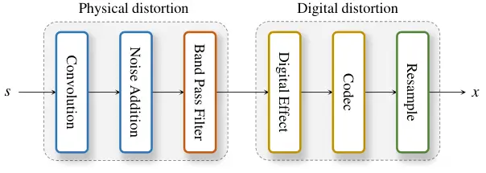

Figure 5: Noisy-distorted speech input simulation pipeline. The
simulation procedure is partitioned to physical distortion and digital
distortion.

Then, three kinds of digital distortions were simulated in sequence. We
randomly applied audio clipping, crystalizer, flanger, and crusher as
digital effects, each introducing characteristic nonlinear saturation,
spectral over-enhancement, comb filtering, or quantization noise
(detailed parameter ranges are summarized in Table 8). Afterward,
digital codec compression was applied to emulate transmission artifacts,
using either MP3 or OGG (Vorbis/Opus) encoding. Finally, the processed
signals were randomly downsampled to 8 or 16 kHz to simulate
low-bandwidth recording and communication scenarios.

|                        |       |                         |                         |                                                  |
| ---------------------- | ----- | ----------------------- | ----------------------- | ------------------------------------------------ |
| Augmentation           | Prob. | Param. name             | Range / Values          | Notes                                            |
| RIR convolution        | 0.50  | -                       | -                       | direct-path delay compensated                    |
| Sample Noise           | 1.00  | SNR (dB)                | $`[0,20]`$              | from DNS dataset                                 |
| Colored Gaussian Noise | 1.00  | SNR (dB)                | $`[0,20]`$              |                                                  |
|                        |       | exponent $`\beta`$      | $`[0.75,1.5]`$          |                                                  |
| Band-limiting (BPF)    | 0.5   | $`f_{1}`$ (Hz)          | $`[500,1500]`$          | zero-phase                                       |
| (occlusion FIR)        |       | $`f_{2}`$ (Hz)          | $`f_{1}+[200,500]`$     | transition band upper edge                       |
|                        |       | cut_gain                | $`(0.1,0.3)`$           | stopband gain, applied as $`g^{\beta}`$          |
|                        |       | $`\beta`$               | $`[0.25,1.00]`$         | (thus effective stopband $`\approx[0.22,0.55]`$) |
|                        |       | taps                    | odd in $`[31,61]`$      | firwin2, $`f_{s}{=}16`$k ( $`f_{N}{=}8`$k )      |
| Clipping               | 0.5   | level (dB)              | $`[-15,0]`$             | hard clipping threshold                          |
| Crystalizer            | 0.15  | intensity               | $`[1,4]`$               | spectral “sharpening”                            |
| Flanger                | 0.05  | depth                   | $`[1,5]`$               | short-delay comb filtering                       |
| Crusher (bit-depth)    | 0.10  | bits                    | $`[1,9]`$               | quantization/aliasing                            |
| Codec (any)            | 0.30  | —                       | —                       | one of the following                             |
|    MP3                 |       | bit rate (kbps)         | $`[4,16]`$              | variable bit-rate sampled uniformly              |
|    OGG                 |       | encoder                 | vorbis, opus            | random choice                                    |
| Frequency Masking      | 1.00  | $`F_{bw}`$ (freq. bins) | $`[0,10]`$              |                                                  |
|                        |       | \# masks                | $`[0,3]`$               | set to $`[0,1]`$ in adversarial training         |
| Time Masking           | 1.00  | $`T_{dur}`$ (frames)    | $`[0,10]`$              |                                                  |
|                        |       | \# masks                | $`[0,2]`$               | set to $`[0,1]`$ in adversarial training         |
| Downsample             | 1.00  | target $`f_{s}`$        | {8k (0.25), 16k (0.75)} |                                                  |

Table 8: Training-time distortions with probabilities and parameter
ranges.

### A.2 Training Details for Unified Model

For pretraining, TF-Restormer was optimized with a batch size of 2 on a
single NVIDIA RTX 6000 Ada 48GB GPU using AdamW (Loshchilov and Hutter,
2019). Pretraining was run for 200,000 steps on the VCTK dataset with
3-second utterances. Adversarial training was then applied for an
additional 200,000 steps. We used a learning rate of 2.0e-4 with betas
(0.9, 0.995), applying a decay of 0.9 every 10,000 steps after 100,000
steps during pretraining, and every 10,000 steps during adversarial
training.

Both stages used a 5,000-step linear warm-up for the generator. In
adversarial training, the discriminator was updated twice per generator
step (without warm-up), using AdamW with betas (0.8, 0.999). Following
multi-scale STFT discriminator designs (Défossez et al., 2023), we
employed our multi-scale SFI-STFT discriminator with STFT window sizes
of \[20, 40, 60, 80, 100\] ms to capture spectral details at multiple
resolutions.

Across all ablation variants, validation loss plateaued around 60k–70k
steps, and no architecture exhibited signs of overfitting. We observed
that checkpoint selection within this plateau region led to negligible
performance differences, indicating that the chosen training length is
sufficient for convergence and provides a fair comparison across
variants.

### A.3 Training Details for dedicated model

#### VCTK+DEMAND

Since noise reduction does not require generating new speech components,
prior work has shown that standard supervised learning is often
sufficient. Therefore, in the fine-tuning stage we use small weights in
adversarial loss ($`\lambda_{\text{g}}=0.001`$ and
$`\lambda_{\text{fm}}=0.01`$ and the human-feedback perceptual loss
($`\lambda_{\text{hf}}=10^{-5}`$). The model is trained to perform pure
denoising following the standard VCTK+DEMAND training partition. The
input and output sampling rates are both fixed to 16 kHz, and thus no
extension queries are used in this setting.

#### VCTK for Super-resolution

For super-resolution, the model is trained under the same protocol as
conventional SR systems, using clean low-band inputs as supervision.
Consequently, during adversarial fine-tuning the human-feedback loss is
again applied with a small weight ($`\lambda_{\text{hf}}=10^{-5}`$), as
the task primarily focuses on recovering missing high-frequency content.

|                        |       |                         |                     |                                                  |
| ---------------------- | ----- | ----------------------- | ------------------- | ------------------------------------------------ |
| Augmentation           | Prob. | Param. name             | Range / Values      | Notes                                            |
| RIR convolution        | 0.50  | -                       | -                   | direct-path delay compensated                    |
| Sample Noise           | 1.00  | SNR (dB)                | $`[5,20]`$          | from DNS dataset                                 |
| Colored Gaussian Noise | 1.00  | SNR (dB)                | $`[5,20]`$          |                                                  |
|                        |       | exponent $`\beta`$      | $`[0.75,1.5]`$      |                                                  |
| Band-limiting (BPF)    | 0.20  | $`f_{1}`$ (Hz)          | $`[2000,4000]`$     | zero-phase                                       |
| (occlusion FIR)        |       | $`f_{2}`$ (Hz)          | $`f_{1}+[200,500]`$ | transition band upper edge                       |
|                        |       | cut_gain                | $`(0.1,0.3)`$       | stopband gain, applied as $`g^{\beta}`$          |
|                        |       | $`\beta`$               | $`[0.25,0.75]`$     | (thus effective stopband $`\approx[0.22,0.55]`$) |
|                        |       | taps                    | odd in $`[31,61]`$  | firwin2, $`f_{s}{=}16`$k ( $`f_{N}{=}8`$k )      |
| Clipping               | 0.20  | level (dB)              | $`[-10,0]`$         | hard clipping threshold                          |
| Crystalizer            | 0.10  | intensity               | $`[1,2]`$           | spectral “sharpening”                            |
| Flanger                | 0.05  | depth                   | $`[1,3]`$           | short-delay comb filtering                       |
| Crusher (bit-depth)    | 0.10  | bits                    | $`[1,5]`$           | quantization/aliasing                            |
| Codec (any)            | 0.25  | —                       | —                   | one of the following                             |
|    MP3                 |       | bit rate (kbps)         | $`[16,64]`$         | variable bit-rate sampled uniformly              |
|    OGG                 |       | encoder                 | vorbis, opus        | random choice                                    |
| Frequency Masking      | 1.00  | $`F_{bw}`$ (freq. bins) | $`[0,5]`$           |                                                  |
|                        |       | \# masks                | $`[0,1]`$           |                                                  |
| Time Masking           | 1.00  | $`T_{dur}`$ (frames)    | $`[0,5]`$           |                                                  |
|                        |       | \# masks                | $`[0,1]`$           |                                                  |

Table 9: Distortions for constructing the VCTK-SR(noisy-distorted)
evaluation set, with probabilities and parameter ranges.

## Appendix B Simulation of VCTK Noisy Distorted Input

The noisy-distorted input from VCTK testset in Table 3 was generated by
corrupting clean VCTK utterances with additive noise from
DEMAND (Thiemann et al., 2013) and colored Gaussian noise, RIR samples
from RWCP (Nakamura et al., 2000) and AIR (Jeub et al., 2009) for
reverberation, and distortions such as clipping and band-limiting.
Additional digital effects including audio codecs (MP3, OGG) were
applied before resampling to various rates (8-48 kHz). This simulation
aligns the training pipeline while maintaining samples partitioning of
speech, noise, and RIR sources. As a result, the average SDR of input
data (in case of $`f_{E}=`$16kHz) is 2.11dB from 2937 utterances. 998
utterances (about 34%) are below SDR=0 dB and 234 utterances (about 8%)
are below SDR=-5 dB.

The details of parameter range are summarized in Table 9.

## Appendix C Details of Model Configuration

For TF-Restormer, $`C_{E}`$ and $`B_{E}`$ for encoder are set to 128 and
6 while $`C_{D}`$ and $`B_{D}`$ are set to 64 and 3. The kernel size in
ConvFFN and the number of heads in MHSA/MHCA are commonly set to $`K=7`$
and $`H=4`$, respectively. For frequency projection layer,
$`F_{\text{proj}}`$ is set to 512.

For offline TF-Restormer, each input mixture is normalized by dividing
it by its standard deviation and the enhanced output is rescaled by the
same factor. For streaming version of TF-Restormer, two mamba blocks are
used in the time module with $`d_{\text{state}}=16`$, causal Conv1D
kernel size $`3`$ with expansion factor $`4`$. For streaming version, we
still use the non-causal Conv2D layer for input and output projection
for robust restoration, therefore the latency increases by two frames,
total latency of 80ms (40 ms window, 20 ms hop). Overall, the model size
of TF-Restormer is 30.1M for offline mode and 19.0M for streaming mode,
which are smaller sizes compared to the existing models.

|                          |                |                          |         |       |
| ------------------------ | -------------- | ------------------------ | ------- | ----- |
| Model                    | Model Size (M) | $`f_{E}\to f_{D}`$ (kHz) | MACs(G) | RTF   |
| VoiceFixer               | 70.3           | 44.1 $`\to`$ 44.1        | 12.9    | 0.010 |
| StoRM                    | 55.1           | 16 $`\to`$ 16            | 156.4   | 0.520 |
| UNIVERSE^($`\dagger`$)   | 46.4           | 16 $`\to`$ 16            | 36.9    | 0.014 |
| UNIVERSE++^($`\dagger`$) | 84.2           | 16 $`\to`$ 16            | 36.9    | 0.015 |
| FINALLY^($`\ddagger`$)   | 454.0          | 16 $`\to`$ 48            | –       | –     |
| TF-Locoformer            | 14.9           | 16 $`\to`$ 16            | 246.9   | 0.025 |
|                          |                | 48 $`\to`$ 48            | 731.6   | 0.088 |
| TF-Restormer             | 30.1           |   8 $`\to`$ 16           | 240.8   | 0.009 |
|                          |                |   8 $`\to`$ 44.1         | 308.4   | 0.017 |
|                          |                | 16 $`\to`$ 16            | 440.9   | 0.034 |
|                          |                | 16 $`\to`$ 48            | 518.7   | 0.053 |
| TF-Restormer-streaming   | 19.0           |   8 $`\to`$ 16           | 114.7   | 0.012 |
|                          |                |   8 $`\to`$ 44.1         | 138.1   | 0.018 |
|                          |                | 16 $`\to`$ 16            | 214.5   | 0.035 |
|                          |                | 16 $`\to`$ 48            | 242.0   | 0.049 |

Table 10: Comparison of the model size and RTF. RTF is calculated on
NVIDIA RTX 4090. ^($`\dagger`$)We utilized pretrained models from open
implementation code from UNIVERSE++ (Scheibler et al., 2024).
^($`\ddagger`$)The model size of FINALLY includes WavLM whose model size
is 358M.

## Appendix D Comparison of the model size and RTF

In Table 10, we compare model size and multiply-accumulate operations
(MACs) for a 1-second-long input using ptflops package⁴⁴ 4
https://github.com/sovrasov/flops-counter.pytorch. We also measure
real-time factor (RTF) measured on 4-second-long samples with an NVIDIA
RTX 4090. Conventional models operate at fixed input–output sampling
rates, which results in fixed MACs regardless of the task configuration.
In contrast, TF-Restormer adapts its computation depending on the input
and output rates $`f_{E}`$ and $`f_{D}`$.

Among baselines, StoRM requires 50 diffusion steps, leading to very high
MACs and RTF despite its moderate model size. UNIVERSE and UNIVERSE++
reduce the number of steps (8 by default in the open implementation),
which lowers the runtime cost compared to StoRM, but their model sizes
remain relatively large and the diffusion process cannot be adapted for
streaming, representing a fundamental limitation. TF-Locoformer, built
on a dual-path design, involves higher computational complexity but
benefits from effective parallelism, so its RTF is not as large as its
MACs might suggest; its parameter size is also smaller than most
diffusion- or vocoder-based systems.

Our proposed TF-Restormer also follows a dual-path formulation, so the
raw MACs are relatively large. Nevertheless, RTF remains low in
practice, comparable to or even faster than prior dual-path models.
Crucially, TF-Restormer optimizes computation according to the input and
output sampling rates: for instance, in the $`8\rightarrow 16`$ kHz
setting, redundant high-frequency processing is skipped, yielding a very
low RTF. Also, the streaming variant maintains consistently low RTF
while preserving accuracy, demonstrating its suitability for real-time
applications.

#### Computational saving from observed-band encoding.

The encoder operates on the observed input band ($`F_{E}`$) only, while
symmetric models resample to the full output band ($`F_{D}`$). The
relative computational saving in the encoder portion is approximately
$`(F_{D}-F_{E})/F_{D}`$, yielding 50%, 67%, and 82% reductions for
$`8\to 16`$, $`8\to 24`$, and $`8\to 44.1`$ kHz settings, respectively
(Table 10).

## Appendix E Illustration of encoder-decoder structure ablation

Figure 6 provides detailed comparisons of the three decoder designs
considered in our ablation.

(a) Decoder-only. This variant directly inserts extension queries into
the decoder without an encoder counterpart. The decoder therefore bears
the full burden of modeling both the observed input band and the missing
high-frequency bands, resulting in heavier computation and weaker
inductive bias from the input.

(b) Encoder-decoder without MHCA. Here the encoder first analyzes the
input bandwidth, and the decoder has the same internal structure as the
encoder but receives projected extension queries. Although this design
separates analysis and reconstruction, the decoder relies only on
self-attention within the extended sequence, and does not explicitly
exploit encoder features for reconstruction.

(c) Encoder-decoder with MHCA (proposed). In our final design, the
decoder additionally uses a frequency cross-self module, where encoder
outputs serve as key-value inputs for cross-attention while extension
queries act as queries. This enables direct conditioning of
high-frequency synthesis on encoder features, while the self-attention
within the decoder refines spectral structure among extended bins. As a
result, the encoder specializes in processing the observed input, and
the lightweight decoder focuses on plausible high-frequency generation
guided by encoder information.

These illustrations highlight how the proposed encoder-decoder with MHCA
achieves a clear division of labor: the encoder concentrates on
input-bandwidth analysis, and the decoder selectively extends spectral
content with cross-conditioning, leading to better efficiency and
stability compared to the other two designs.

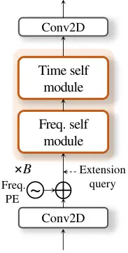

(a)

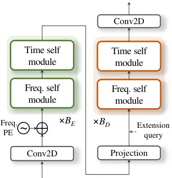

(b)

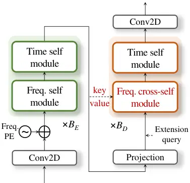

(c)

Figure 6: Unit modules in TF-Encoder and TF-Decoder. The (a) time module
is based on MHSA with RoPE while (b) the frequency encoder module is
based on MHSA with frequency projection layer. (c) The frequency decoder
module utilize MHCA based on key/value from the encoder features

|                |      |                 |         |           |                   |         |           |                  |         |           |
| -------------- | ---- | --------------- | ------- | --------- | ----------------- | ------- | --------- | ---------------- | ------- | --------- |
| $`f_{E}`$ (Hz) |      | 8 $`\to`$ 16kHz |         |           | 8 $`\to`$ 44.1kHz |         |           | 16 $`\to`$ 48kHz |         |           |
| 8k             | 16k  | LSD^(↓)         | MCD^(↓) | NISQA^(↑) | LSD^(↓)           | MCD^(↓) | NISQA^(↑) | LSD^(↓)          | MCD^(↓) | NISQA^(↑) |
| Input          |      | 3.36            | 11.38   | 1.91      | 3.64              | 11.47   | 1.91      | 3.48             | 11.37   | 1.73      |
| 0.01           | 0.99 | 1.48            | 5.83    | 4.01      | 1.46              | 7.12    | 4.41      | 1.15             | 2.82    | 4.55      |
| 0.10           | 0.90 | 1.21            | 2.82    | 4.48      | 1.24              | 3.20    | 4.46      | 1.17             | 2.85    | 4.56      |
| 0.25           | 0.75 | 1.16            | 2.78    | 4.49      | 1.18              | 3.08    | 4.52      | 1.18             | 2.86    | 4.54      |
| 0.50           | 0.50 | 1.14            | 2.74    | 4.50      | 1.17              | 3.05    | 4.52      | 1.20             | 2.89    | 4.53      |

(a) ablation of training $`f_{E}`$ distribution.

|                |      |       |      |               |         |           |                 |         |           |                   |         |           |                  |         |           |
| -------------- | ---- | ----- | ---- | ------------- | ------- | --------- | --------------- | ------- | --------- | ----------------- | ------- | --------- | ---------------- | ------- | --------- |
| $`f_{D}`$ (Hz) |      |       |      | 8$`\to`$16kHz |         |           | 8 $`\to`$ 24kHz |         |           | 8 $`\to`$ 44.1kHz |         |           | 16 $`\to`$ 48kHz |         |           |
| 16k            | 24k  | 44.1k | 48k  | LSD^(↓)       | MCD^(↓) | NISQA^(↑) | LSD^(↓)         | MCD^(↓) | NISQA^(↑) | LSD^(↓)           | MCD^(↓) | NISQA^(↑) | LSD^(↓)          | MCD^(↓) | NISQA^(↑) |
| Input          |      |       |      | 3.36          | 11.38   | 1.91      | 3.49            | 11.60   | 1.91      | 3.64              | 11.47   | 1.91      | 3.48             | 11.37   | 1.73      |
| 0.49           | 0.49 | 0.01  | 0.01 | 1.15          | 2.73    | 4.51      | 1.17            | 3.05    | 4.52      | 1.36              | 4.01    | 4.49      | 1.51             | 6.83    | 4.01      |
| 0.45           | 0.45 | 0.05  | 0.05 | 1.15          | 2.74    | 4.51      | 1.16            | 3.05    | 4.51      | 1.20              | 3.16    | 4.49      | 1.27             | 3.00    | 4.46      |
| 0.40           | 0.40 | 0.10  | 0.10 | 1.16          | 2.76    | 4.50      | 1.16            | 3.04    | 4.51      | 1.21              | 3.15    | 4.49      | 1.23             | 2.94    | 4.49      |
| 0.25           | 0.25 | 0.25  | 0.25 | 1.16          | 2.78    | 4.49      | 1.18            | 3.08    | 4.52      | 1.18              | 3.08    | 4.52      | 1.18             | 2.86    | 4.54      |

(b) ablation of training $`f_{D}`$ distribution

Table 11: Ablation study on input/output sampling-rate distributions to
evaluate the robustness of extension-query training. Grey rows denote
the default distribution used for baseline models.

## Appendix F Extension Query Under Imbalanced Sampling-Rate Distributions

Table 11 analyzes whether extension-query tokens become undertrained
when certain sampling rates appear too infrequently during training. For
the input-rate ablation (top subtable), performance remains nearly
identical to the balanced baseline as long as 8 kHz inputs constitute at
least 10% of the data. The differences across {0.10, 0.25, 0.50}
distributions are minimal in all target-rate settings, and even the best
scores often occur at moderately imbalanced ratios. Noticeable
degradation appears only in the extreme 1% case, where the model sees
almost no examples of low-band inputs; this leads to modest but
consistent drops, particularly for the largest gap ($`8\to 44.1`$ kHz).

A similar pattern is observed for the output-rate ablation (bottom
subtable). When high-frequency target rates (44.1 kHz or 48 kHz) have
extremely low probability (1–5%), reconstruction quality decreases for
those specific targets, as seen in elevated LSD/MCD values. However,
once each output rate is represented with a reasonable frequency (around
10% or more), the performance aligns closely with the uniformly balanced
case, and the differences across distributions remain small.

Overall, these results show that extension-query undertraining affects
performance only under highly skewed sampling-rate distributions.
TF-Restormer remains robust as long as each rate appears with moderate
frequency, and balanced or mildly imbalanced settings exhibit negligible
differences from the baseline.

(a)

(b)

Figure 7: Gradient magnitude $`|\partial\ell/\partial d|=w/(w+|d|)`$ of
the proposed s-log1p loss for several scale factors $`w`$. (a) Linear
distance axis emphasizes the decay rate — smaller $`w`$ values make the
gradient drop faster, increasing sensitivity to fine spectral
deviations. (b) Logarithmic distance axis reveals scale-invariance: the
gradient is a pure function of $`d/w`$, so all four curves are
decade-shifted copies of a single sigmoid centered at $`d=w`$ (black
dots, gradient $`=1/2`$); $`w`$ acts purely as a horizontal stretch in
$`(\log d)`$-space.

## Appendix G Effects of scaled log-spectral loss

Figure 7 illustrates the gradient behavior of the proposed scaled
log-spectral loss, defined as $`\partial\ell/\partial d=w/(d+w)`$ where
$`d=|y-s|`$ denotes the spectral distance and $`w`$ is a scale factor.
Unlike conventional $`\ell_{1}`$ or $`\ell_{2}`$ criteria, whose
gradients are either constant regardless of error magnitude
($`\ell_{1}`$) or increase proportionally with larger errors
($`\ell_{2}`$), the proposed formulation yields gradients that are
strongest near $`d\approx 0`$ and gradually diminish once $`d`$ exceeds
$`w`$. This mechanism emphasizes regions where the spectrum is already
well-aligned, thereby preserving fine details, while suppressing
unstable updates from heavily corrupted regions. The figure shows that
when $`d=w`$, the gradient magnitude stabilizes at $`0.5`$, providing a
natural balance between emphasizing accurate components and
de-emphasizing severely mismatched ones. As $`w`$ decreases, the loss
becomes more sensitive to smaller deviations, further suggesting subtle
spectral structures that are otherwise neglected in conventional losses.

## Appendix H Loss Family Comparison

Section 4.1 introduces s-log1p as the simplest single-parameter form
satisfying the three design criteria (i)–(iii). To make that claim
concrete, this appendix situates s-log1p within the broader robust-loss
family and examines each member under two parameterizations: the
_original_ forms used in the robust-estimation literature (Table 12,
columns 2–5) and their _peak-normalized_ variants (column 6). Table 12
consolidates both, and Figure 8 visualizes the peak-normalized gradient
profiles so that the remaining differences reflect shape rather than
scale.

| Loss           | Original $`\ell(d)`$                                            | $`\left          | \dfrac{\partial\ell}{\partial d}\right | `$                      | Peak height             | Scale-inv?                 | Peak-normalized $`\tilde{\ell}(d)`$                      |
| -------------- | --------------------------------------------------------------- | ---------------- | -------------------------------------- | ----------------------- | ----------------------- | -------------------------- | -------------------------------------------------------- | --- | --------- |
| $`\ell_{2}`$   | $`\dfrac{1}{2}\,d^{2}`$                                         | $`               | d                                      | `$                      | (diverges)              | —                          | —                                                        |
| $`\ell_{1}`$   | $`                                                              | d                | `$                                     | $`1`$                   | $`1`$                   | ✓                          | intrinsic                                                |
| Huber          | $`\begin{cases}\dfrac{d^{2}}{2w},&                              | d                | \leq w\\[6.0pt]                        |
| d              | -\dfrac{w}{2},&                                                 | d                | >w\end{cases}`$                        | $`\min\!\left(\dfrac{   | d                       | }{w},\,1\right)`$          | $`1`$                                                    | ✓   | intrinsic |
| Charbonnier    | $`\sqrt{d^{2}+w^{2}}-w`$                                        | $`\dfrac{        | d                                      | }{\sqrt{d^{2}+w^{2}}}`$ | $`1`$ (asymp.)          | $`\times`$ (slope $`1/w`$) | intrinsic (asymp.)                                       |
| Cauchy         | $`\dfrac{w^{2}}{2}\,\log\!\left(1+\dfrac{d^{2}}{w^{2}}\right)`$ | $`\dfrac{w^{2}\, | d                                      | }{w^{2}+d^{2}}`$        | $`\dfrac{w}{2}`$        | $`\times`$                 | $`w\log\!\left(1+\dfrac{d^{2}}{w^{2}}\right)`$           |
| Geman–McClure  | $`\dfrac{d^{2}}{2\,(d^{2}+w^{2})}`$                             | $`\dfrac{w^{2}\, | d                                      | }{(d^{2}+w^{2})^{2}}`$  | $`\propto\dfrac{1}{w}`$ | $`\times`$                 | $`\dfrac{8\,d^{2}}{3\sqrt{3}\,w\,(d^{2}+w^{2})}`$        |
| Welsch         | $`\dfrac{w^{2}}{2}\left(1-e^{-d^{2}/w^{2}}\right)`$             | $`               | d                                      | \,e^{-d^{2}/w^{2}}`$    | $`\propto w`$           | $`\times`$                 | $`\dfrac{w\sqrt{2e}}{2}\left(1-e^{-d^{2}/w^{2}}\right)`$ |
| s-log1p (ours) | $`w\log\!\left(1+\dfrac{                                        | d                | }{w}\right)`$                          | $`\dfrac{w}{w+          | d                       | }`$                        | $`1`$                                                    | ✓   | intrinsic |

Table 12: Robust-loss family compared along design criterion (ii).
Columns 2–3 list the original loss $`\ell(d)`$ and its gradient
magnitude $`|\partial\ell/\partial d|`$. Column 4 reports the supremum
of the gradient magnitude (_peak height_), and column 5 marks whether
that peak equals $`1`$ _independent of_ the scale parameter $`w`$ — the
scale-invariance condition required by criterion (ii) of Section 4.1.
Column 6 lists the peak-normalized variant $`\tilde{\ell}(d)`$ obtained
by rescaling the original gradient by a per-family multiplier ($`2/w`$
for Cauchy, $`16/(3\sqrt{3}\,w)`$ for Geman–McClure, $`\sqrt{2e}/w`$ for
Welsch) so that $`\sup|\partial\tilde{\ell}/\partial d|=1`$ and
integrating back; $`\ell_{1}`$, Huber, Charbonnier, and s-log1p already
have unit peak by construction. $`\ell_{2}`$ is unbounded and is
retained only as a reference point.

Figure 8: Gradient magnitude $`|\partial\ell/\partial d|`$ as a function
of the scale-invariant abscissa $`|d|/w`$ for the losses in Table 12
($`\ell_{2}`$ is omitted as its gradient diverges). Cauchy,
Geman–McClure, and Welsch are shown in their peak-normalized form
(column 6 of Table 12); $`\ell_{1}`$, Huber, Charbonnier, and s-log1p
already have unit peak in their original parameterization. With peak
height factored out, the seven curves separate into three structural
groups: _bounded_ ($`\ell_{1}`$, Huber, Charbonnier — gradient saturates
to a constant at large $`|d|`$), _cusp-descending_ (s-log1p — gradient
$`\to 1`$ as $`d\to 0`$ and $`\to 0`$ as $`|d|\to\infty`$), and
_bilateral-descending_ (Cauchy, Geman–McClure, Welsch — gradient
$`\to 0`$ at both $`|d|\to 0`$ and $`|d|\to\infty`$).

#### Original forms and the scale-invariance gap

Columns 2–3 of Table 12 list the standard formulations from the
robust-estimation literature. The gradient magnitudes partition into
three asymptotic regimes: _unbounded_ ($`\ell_{2}`$, whose gradient
diverges and remains susceptible to outliers), _bounded_ ($`\ell_{1}`$,
Huber, and Charbonnier, whose gradient saturates to a non-zero
constant), and _descending_ (s-log1p, Cauchy, Geman–McClure, and Welsch,
whose gradient decays to zero). Criterion (i) of Section 4.1 selects the
descending regime. Within these formulations, criterion (ii) — a
$`w`$-independent unit gradient peak — is satisfied _automatically_ only
by $`\ell_{1}`$, Huber, Charbonnier, and s-log1p. Cauchy, Geman–McClure,
and Welsch carry peak heights of $`w/2`$, $`\propto 1/w`$, and
$`\propto w`$ respectively, so in their original parameterization the
per-bin scaling $`w_{tf}=\mathrm{E}_{t}[S_{m,tf}]`$ adopted in
Section 4.1 would translate into systematically different gradient
magnitudes for low- and high-energy frequency bins. Restoring criterion
(ii) for those three losses therefore requires an _explicit_ per-family
rescaling, which is the contrast underlying the next paragraph.

#### Peak-normalized variants

The scale-invariance gap is repaired by multiplying the gradient of
Cauchy, Geman–McClure, and Welsch by a per-family scalar so that
$`\sup|\partial\tilde{\ell}/\partial d|=1`$ independent of $`w`$, and
integrating back to obtain the loss $`\tilde{\ell}(d)`$ listed in column
6: $`w\log(1+d^{2}/w^{2})`$ for normalized Cauchy,
$`\tfrac{8\,d^{2}}{3\sqrt{3}\,w(d^{2}+w^{2})}`$ for normalized
Geman–McClure, and $`\tfrac{w\sqrt{2e}}{2}(1-e^{-d^{2}/w^{2}})`$ for
normalized Welsch. The normalized Cauchy form is particularly
instructive: it parallels s-log1p as a $`w`$-scaled logarithm, with only
$`|d|/w`$ replaced by $`(d/w)^{2}`$ inside the log. The two forms
therefore sit one symbolic step apart at the formula level, yet differ
qualitatively in their gradient behavior at the origin — a distinction
that becomes the subject of the next paragraph. Figure 8 plots all seven
peak-normalized gradients on the scale-invariant axis $`|d|/w`$ so that
the comparison reflects shape alone.

#### Remaining structural difference: cusp vs. bilateral saturation

Once peak height is factored out, the descending forms diverge only in
their behavior near the origin. The s-log1p gradient retains an
$`\ell_{1}`$-like _cusp_ ($`\partial\ell/\partial d\to 1`$ as
$`d\to 0`$), so well-aligned regions still receive a strong refinement
signal. Normalized Cauchy, Geman–McClure, and Welsch instead exhibit
_bilateral saturation_, with the gradient vanishing at both $`|d|\to 0`$
and $`|d|\to\infty`$. The latter is not categorically inferior: it
concentrates learning capacity on the marginally-mispredicted region
near $`|d|\sim w`$, at the cost of attenuating gradient signal where the
prediction is already well-aligned but fine spectral detail can still
benefit from continued refinement. Which behavior better suits spectral
regression, where fine-grained alignment is itself the target, remains
an open empirical question that we leave for future investigation. The
narrower claim we make here is structural: among the descending forms in
Table 12, s-log1p is the only one that satisfies all three criteria of
Section 4.1 in its original parameterization, with $`w`$ as its single
transition-point hyperparameter; the bilateral-saturation alternatives
can be aligned with criterion (ii) only by introducing a second
per-family rescaling factor. This is the sense in which s-log1p is the
simplest single-parameter form within the family.

## Appendix I Heteroscedasticity of Spectral Errors

We supplement the body-level Figure 4 with per-dataset statistics
(Table 13) confirming that the choice of
$`w_{tf}=\mathrm{E}_{t}[S_{m,tf}]`$ generalizes beyond the single
illustrative condition (VCTK-SR(noisy-distorted) $`16{\to}48`$ kHz).

| Dataset                                   | Utt. $`\rho`$ | Freq. $`\rho`$ | CV raw $`\to`$ norm. | Reduction |
| ----------------------------------------- | ------------- | -------------- | -------------------- | --------- |
| VCTK+DEMAND                               | 0.49          | 0.96           | $`2.36\to 1.35`$     | 43%       |
| VCTK-SR(noisy-distorted, $`8\to 16`$ k)   | 0.50          | 0.94           | $`1.62\to 0.42`$     | 74%       |
| VCTK-SR(noisy-distorted, $`8\to 44.1`$ k) | 0.64          | 0.99           | $`2.28\to 0.34`$     | 85%       |
| VCTK-SR(noisy-distorted, $`8\to 48`$ k)   | 0.58          | 0.98           | $`2.65\to 0.28`$     | 89%       |

Table 13: Per-frequency-bin and per-utterance Spearman correlation
between the source magnitude $`\mathrm{E}[|S(f)|]`$ and the prediction
error $`\mathrm{E}[|S(f)-\hat{S}(f)|]`$, together with
coefficient-of-variation (CV) reduction from per-bin magnitude
normalization (raw $`\to`$ normalized). The per-bin correlation is
near-perfect (0.94–0.99 across all conditions; all $`p\approx 0`$), and
normalizing by source magnitude reduces CV by up to 89%, supporting the
magnitude-adaptive $`w_{tf}`$ choice.

The near-perfect per-bin correlation across heterogeneous
conditions—pure denoising (VCTK+DEMAND) and three super-resolution rate
gaps—shows that the magnitude–error proportionality is a structural
property of spectral regression rather than a condition-specific
artifact. Setting $`w_{tf}`$ to the per-bin source magnitude therefore
equalizes the learning signal across low- and high-energy bins,
consistent with variance-stabilizing transformations for heteroscedastic
regression.

|                                           |       |      |                           |           |         |         |         |                   |            |             |                       |           |            |
| ----------------------------------------- | ----- | ---- | ------------------------- | --------- | ------- | ------- | ------- | ----------------- | ---------- | ----------- | --------------------- | --------- | ---------- |
| Model(Team)                               | Model | Rank | intrusive signal fidelity |           |         |         |         | Semantic fidelity |            |             | Non-intrusive quality |           |            |
|                                           | Type  |      | PESQ^(↑)                  | ESTOI^(↑) | SDR^(↑) | MCD^(↓) | LSD^(↓) | sBERT^(↑)         | SpkSim^(↑) | CAcc(%)^(↑) | UTMOS^(↑)             | NISQA^(↑) | DNSMOS^(↑) |
| Input                                     | -     | -    | 1.37                      | 0.61      | 2.53    | 7.92    | 5.51    | 0.75              | 0.63       | 81.29       | 1.56                  | 1.69      | 1.84       |
| baseline                                  | D     | 9    | 2.43                      | 0.80      | 11.29   | 3.32    | 2.84    | 0.86              | 0.80       | 84.96       | 2.11                  | 2.89      | 2.94       |
| Bobbsun                                   | D     | 1    | 2.95                      | 0.86      | 14.33   | 3.01    | 2.83    | 0.91              | 0.85       | 88.92       | 2.09                  | 3.22      | 2.88       |
| USEM(rc)                                  | D     | 2    | 2.79                      | 0.85      | 13.11   | 2.93    | 2.94    | 0.90              | 0.84       | 88.05       | 2.30                  | 3.21      | 3.01       |
| USEM-Flow(rc)                             | G     | -    | 1.54                      | 0.59      | 4.49    | 6.10    | 3.91    | 0.76              | 0.66       | 69.07       | 1.79                  | 2.82      | 2.50       |
| TS-URGENet(Xiaobin)                       | D+G   | 3    | 2.74                      | 0.84      | 13.06   | 3.30    | 3.08    | 0.89              | 0.84       | 87.94       | 2.16                  | 3.24      | 2.92       |
| alindborg                                 | D+G   | 10   | 1.99                      | 0.76      | 7.49    | 4.51    | 3.73    | 0.84              | 0.77       | 81.70       | 2.49                  | 3.96      | 3.28       |
| wataru9871                                | G     | 13   | 1.36                      | 0.56      | -13.88  | 11.25   | 7.98    | 0.82              | 0.51       | 79.70       | 2.53                  | 3.74      | 3.10       |
| TF-Restormer (original)                   | D+G   | -    | 1.71                      | 0.71      | 4.19    | 4.84    | 4.32    | 0.84              | 0.73       | 80.21       | 3.57                  | 4.51      | 3.25       |
| TF-Restormer (dedicated)                  | D+G   | -    | 2.60                      | 0.83      | 11.78   | 3.18    | 2.91    | 0.88              | 0.82       | 84.28       | 2.47                  | 3.43      | 3.06       |
| TF-Restormer (dedicated w/ original loss) | D+G   | -    | 1.82                      | 0.72      | 5.24    | 4.80    | 4.45    | 0.83              | 0.75       | 81.53       | 3.08                  | 3.96      | 3.24       |

Table 14: Evaluation results on URGENT 2025 (non-blind test set)

## Appendix J Evaluation of Dedicated Model on the URGENT Challenge

In the main paper, we reported non-intrusive MOS results on the URGENT
blind test set using the unified TF-Restormer model. Since the blind set
does not provide clean references, only MOS-based evaluation is
possible. For completeness, we additionally train a dedicated URGENT
model and report objective fidelity metrics on the non-blind validation
set in the challenge (Table 14).

For the dedicated URGENT configuration, we follow the official training
recipe. Because the benchmark resamples all inputs to the target
sampling rate regardless of their original rate, we remove
high-frequency bins with negligible power prior to processing, which
reduces redundant computation under this matched-rate setting. Apart
from this preprocessing, the model is trained under the same conditions
required by the challenge.

It is important to note that the URGENT benchmark emphasizes
deterministic, fidelity-oriented enhancement (Sun et al., 2025; Chao et
al., 2025; Rong et al., 2025). Intrusive metrics are heavily weighted,
and top-ranked systems typically rely on large, deterministic
architectures optimized exclusively for matched-rate denoising. In
contrast, models based on a generative approach to improve perceptual
quality generally achieve lower intrusive scores despite producing more
natural listening quality.

Under such conditions, a dedicated TF-Restormer variant trained with the
URGENT recipe shows moderate improvement in signal fidelity compared to
the unified model; however, its performance remains below that of highly
specialized deterministic and multi-stage systems, and its perceptual
quality drops significantly. This outcome is expected: the strengths of
TF-Restormer—arbitrary input–output sampling-rate handling,
frequency-extension mechanisms, perceptually oriented losses, and
adversarial training—do not align with the evaluation objectives of
URGENT. Consequently, while the unified model yields strong
non-intrusive MOS on the blind test set, the dedicated URGENT-trained
version does not fully reflect the core advantages of our architecture.

To verify that the perceptual quality drop in the dedicated
URGENT-trained variant is primarily due to loss rebalancing rather than
the architecture, we additionally trained a dedicated variant with the
original (unified) loss configuration. This “dedicated w/ original loss”
variant recovers perceptual metrics (UTMOS 3.08, NISQA 3.96) close to
the unified model while modestly improving fidelity over the unified
baseline (PESQ 1.82 vs. the unified model’s 1.71), supporting the
interpretation that the URGENT loss rebalancing—not the
architecture—drives the perceptual–fidelity trade-off.

## Appendix K Comparison with Conventional Streaming Enhancement Models

We evaluate TF-Restormer-streaming against representative real-time
denoising models on the VCTK+DEMAND test set (Table 15), using PESQ,
STOI, and the composite metrics CSIG, CBAK, and COVL commonly adopted in
prior enhancement works. Unlike conventional streaming models, which are
trained specifically for denoising under matched conditions,
TF-Restormer-streaming inherits the full unified restoration and
bandwidth-extension objective and is trained to handle reverberation,
distortion, and bandwidth mismatch simultaneously. As a consequence, its
model size and computational cost are substantially larger than
lightweight denoisers such as NSNet2, DCCRN, or DeepFilterNet.

In terms of signal fidelity, specialized denoising models remain strong,
with FRCRN and DeepFilterNet2 achieving the highest PESQ, CBAK, or STOI
scores. Nevertheless, TF-Restormer-streaming attains competitive
perceptual quality, achieving the highest CSIG score among all models
and CBAK/COVL values close to the best discriminative systems. This is
notable given that TF-Restormer-streaming is not optimized for denoising
alone, but operates as a general-purpose restoration model that
simultaneously handles reverberant, noisy, and bandwidth-limited inputs.

Overall, these results show that TF-Restormer-streaming is, to our
knowledge, the first unified restoration and super-resolution model
capable of streaming operation, while still providing signal fidelity
comparable to denoising-oriented baselines. This demonstrates the
feasibility of extending multi-rate, multi-distortion restoration models
to real-time settings without sacrificing robustness.

| Model                                  | Size (M) | MACs (G/s) | PESQ | CSIG | CBAK | COVL | STOI  |
| -------------------------------------- | -------- | ---------- | ---- | ---- | ---- | ---- | ----- |
| Noisy                                  | -        | -          | 1.97 | 3.34 | 2.44 | 2.63 | 0.921 |
| NSNet2 (Braun et al., 2021)            | 6.2      | 0.43       | 2.47 | 3.23 | 2.99 | 2.90 | 0.903 |
| DCCRN (Hu et al., 2020)                | 3.7      | 14.36      | 2.54 | 3.74 | 3.13 | 2.75 | 0.938 |
| FullSubNet+ (Chen et al., 2022a)       | 8.7      | 30.06      | 2.88 | 3.86 | 3.42 | 3.57 | 0.940 |
| FRCRN (Zhao et al., 2021)              | 10.3     | 12.3       | 3.21 | 4.23 | 3.64 | 3.73 | -     |
| DeepFilterNet (Schroter et al., 2022)  | 1.8      | 0.11       | 2.81 | 4.14 | 3.31 | 3.46 | 0.942 |
| DeepFilterNet2 (Schröter et al., 2022) | 2.3      | 0.356      | 3.08 | 4.30 | 3.40 | 3.70 | 0.941 |
| TF-Restormer-streaming                 | 19.0     | 214.5      | 2.89 | 4.37 | 3.41 | 3.68 | 0.937 |

Table 15: Comparison of TF-Restormer-streaming with existing real-time
denoising models on the VCTK+DEMAND test set. We report standard
enhancement metrics (PESQ, STOI, CSIG, CBAK, COVL) along with model size
and MACs.

## Appendix L Evaluation on DNS Challenge Dataset

We further evaluate TF-Restormer on the 2020 DNS (Reddy et al., 2020)
test sets to examine both signal fidelity and perceptual quality.
Table 16 compares objective fidelity metrics against models specifically
optimized for denoising with DNS training dataset. Since our unified
model is trained to remove reverberation as well as noise, we report
fidelity scores only on the “No Reverb” subset, where the clean
references are aligned with our training objective. Under this setting,
the unified TF-Restormer shows lower fidelity than DNS-targeted systems
such as MFNet, USES, and TF-Locoformer. This gap is expected, as the
unified model (i) is trained solely on VCTK, (ii) actively removes
reverberation and other distortions, and (iii) incorporates perceptual
objectives that may deviate from strict waveform fidelity. When trained
in a DNS-specific manner without adversarial objectives, however, the
dedicated TF-Restormer variant matches or surpasses prior systems,
achieving competitive PESQ, STOI, and SI-SDR scores.

Table 17 presents perceptual DNSMOS scores on both “With Reverb” and “No
Reverb” subsets. Here, discriminative models tend to preserve the input
structure and thus achieve relatively conservative perceptual gains, as
seen with Conv-TasNet and FRCRN. Generative approaches such as SELM,
GenSE, MaskSR, and UniSE, which prioritize perceptual naturalness,
obtain noticeably higher OVRL scores. TF-Restormer shows perceptual
quality on par with these generative systems across all subsets, despite
not being trained exclusively for perceptual enhancement. In both
reverberant and non-reverberant conditions, it achieves strong SIG and
BAK scores and matches the best OVRL scores among recent models,
demonstrating that the proposed architecture can deliver high perceptual
quality while maintaining reasonable signal fidelity.

| System                             | PESQ | STOI(%) | SI-SDR(dB) |
| ---------------------------------- | ---- | ------- | ---------- |
| Noisy                              | 1.58 | 91.5    | 9.1        |
| FullSubNet (Hao et al., 2021)      | 2.78 | 96.1    | 17.3       |
| CTSNet (Li et al., 2021)           | 2.94 | 96.2    | 16.7       |
| TaylorSENet (Li et al., 2022)      | 3.22 | 97.4    | 19.2       |
| FRCRN (Zhao et al., 2021)          | 3.23 | 97.7    | 19.8       |
| MFNet (Liu et al., 2023)           | 3.43 | 97.9    | 20.3       |
| USES (Zhang et al., 2023)          | 3.46 | 98.1    | 21.2       |
| TF-Locoformer (Saijo et al., 2024) | 3.72 | 98.8    | 23.3       |
| TF-Restormer                       | 2.83 | 96.4    | 16.1       |

Table 16: Comparison of TF-Restormer with previous models on 2020 DNS
testsets in terms of signal fidelity. “No Reverb” subset is only
compared as the proposed TF-Restormer is trained to remove
reverberation.

| Model                                 | Type | With Reverb |      |      | No Reverb |      |      |
| ------------------------------------- | ---- | ----------- | ---- | ---- | --------- | ---- | ---- |
|                                       |      | SIG         | BAK  | OVRL | SIG       | BAK  | OVRL |
| Noisy                                 | \-   | 1.76        | 1.50 | 1.39 | 3.39      | 2.62 | 2.48 |
| Conv-TasNet (Luo and Mesgarani, 2019) | D    | 2.42        | 2.71 | 2.01 | 3.09      | 3.34 | 3.00 |
| FRCRN (Zhao et al., 2021)             | D    | 2.93        | 2.92 | 2.28 | 3.58      | 4.13 | 3.34 |
| SELM (Wang et al., 2024)              | G    | 3.16        | 3.58 | 2.70 | 3.51      | 4.10 | 3.26 |
| MaskSR (Li et al., 2024)              | G    | 3.53        | 4.07 | 3.25 | 3.59      | 4.12 | 3.34 |
| AnyEnhance (Zhang et al., 2025)       | G    | 3.50        | 4.04 | 3.20 | 3.64      | 4.18 | 3.42 |
| GenSE (Yao et al., 2025)              | G    | 3.49        | 3.73 | 3.19 | 3.65      | 4.18 | 3.43 |
| LLaSE-G1 (Kang et al., 2025)          | G    | 3.59        | 4.10 | 3.33 | 3.66      | 4.17 | 3.42 |
| UniSE(Yan et al., 2025)               | G    | 3.67        | 4.10 | 3.40 | 3.67      | 4.14 | 3.43 |
| TF-Restormer                          | D+G  | 3.60        | 4.12 | 3.35 | 3.65      | 4.18 | 3.43 |

Table 17: Comparison of TF-Restormer with previous models on 2020 DNS
testsets in terms of perceptual quality (DNS scores). “With Reverb”
subset contains reverberation while “No Reverb” subset only involves
noise. “D” and “G” denote discriminative and generative methods,
respectively.

| Model                             | CD$`\downarrow`$ | LLR$`\downarrow`$ | SNR$`{}_{\rm fw}\uparrow`$ | PESQ$`\uparrow`$ | SRMR$`\uparrow`$ |
| --------------------------------- | ---------------- | ----------------- | -------------------------- | ---------------- | ---------------- |
| Input                             | 3.975            | 0.574             | 3.617                      | 1.503            | 3.687            |
| WPE (Yoshioka and Nakatani, 2012) | 3.748            | 0.514             | 4.864                      | 1.722            | 4.220            |
| WRN (Llombart et al., 2019)       | 3.590            | 0.470             | 4.800                      | —                | 3.590            |
| GCRN (Hazrati et al., 2013)       | 2.534            | 0.325             | 10.753                     | 1.934            | 4.861            |
| TCN+SA (Wang et al., 2017)        | 2.200            | 0.240             | 13.060                     | 2.580            | 5.170            |
| D-MFMVDR (Zhang et al., 2021)     | 2.639            | 0.316             | 9.649                      | 2.167            | 4.892            |
| DCN (Kothapally and Hansen, 2024) | 2.001            | 0.225             | 13.326                     | 2.935            | 5.269            |
| TF-Restormer                      | 2.880            | 0.489             | 8.139                      | 2.825            | 8.004            |

Table 18: REVERB-Sim — comparison with prior dereverberation methods.
TF-Restormer is evaluated as OOD restoration (no REVERB-specific
training). TF-Restormer is the only row evaluated under our unified
setup.

|               | Fidelity         |                   |                            |                  |                  | Perceptual |        |       |       |       |
| ------------- | ---------------- | ----------------- | -------------------------- | ---------------- | ---------------- | ---------- | ------ | ----- | ----- | ----- |
| Model         | CD$`\downarrow`$ | LLR$`\downarrow`$ | SNR$`{}_{\rm fw}\uparrow`$ | PESQ$`\uparrow`$ | SRMR$`\uparrow`$ | UTMOS      | DNSMOS | NISQA | SIG   | BAK   |
| Input         | 3.975            | 0.574             | 3.617                      | 1.503            | 3.687            | 1.455      | 1.365  | 1.255 | 1.750 | 1.390 |
| TF-GridNet    | 2.110            | 0.216             | 14.458                     | 2.825            | 5.063            | 3.325      | 3.135  | 3.310 | 3.435 | 3.945 |
| MP-SENet      | 2.692            | 0.278             | 13.622                     | 2.811            | 4.960            | 3.225      | 3.190  | 3.500 | 3.450 | 4.035 |
| TF-Locoformer | 2.323            | 0.235             | 14.102                     | 2.642            | 4.972            | 3.202      | 3.063  | 3.056 | 3.366 | 3.920 |
| VoiceFixer    | 3.708            | 0.946             | 7.992                      | 1.278            | 4.938            | 2.858      | 3.088  | 4.072 | 3.388 | 3.927 |
| UNIVERSE++    | 5.213            | 0.901             | 5.731                      | 1.220            | 5.124            | 2.370      | 2.835  | 4.145 | 3.150 | 3.835 |
| TF-Restormer  | 2.880            | 0.489             | 8.139                      | 2.825            | 8.004            | 4.130      | 3.335  | 4.860 | 3.585 | 4.115 |

Table 19: REVERB-Sim — discriminative baselines (in-domain, trained on
REVERB data) and OOD restoration baselines (VoiceFixer, UNIVERSE++). All
results are averaged over far / near conditions. discriminative
baselines were trained under matched condition. TF-Restormer is
evaluated as the same single unified model.

|               | Fidelity         |                   |                            |                  |                  | Perceptual |        |       |       |       |
| ------------- | ---------------- | ----------------- | -------------------------- | ---------------- | ---------------- | ---------- | ------ | ----- | ----- | ----- |
| Model         | CD$`\downarrow`$ | LLR$`\downarrow`$ | SNR$`{}_{\rm fw}\uparrow`$ | PESQ$`\uparrow`$ | SRMR$`\uparrow`$ | UTMOS      | DNSMOS | NISQA | SIG   | BAK   |
| Input         | 5.694            | 0.962             | -0.271                     | 1.111            | 2.320            | 1.398      | 1.151  | 1.250 | 1.318 | 1.206 |
| TF-GridNet    | 3.654            | 0.604             | 10.101                     | 1.867            | 5.696            | 2.587      | 2.961  | 2.905 | 3.285 | 3.824 |
| MP-SENet      | 4.347            | 0.780             | 7.807                      | 1.493            | 5.217            | 2.072      | 2.641  | 2.607 | 3.082 | 3.416 |
| TF-Locoformer | 4.118            | 0.630             | 8.262                      | 1.581            | 5.388            | 2.159      | 2.517  | 2.537 | 2.921 | 3.402 |
| VoiceFixer    | 4.370            | 1.070             | 6.150                      | 1.350            | 4.989            | 2.227      | 2.852  | 3.534 | 3.177 | 3.660 |
| UNIVERSE++    | 6.123            | 1.115             | 3.418                      | 1.190            | 4.473            | 1.909      | 2.322  | 3.245 | 2.697 | 3.184 |
| TF-Restormer  | 3.582            | 0.707             | 7.130                      | 2.113            | 8.586            | 4.014      | 3.272  | 4.698 | 3.533 | 4.061 |

Table 20: REVERB-DNS — constructed by mixing DNS noise at $`-10`$ to
$`0`$ dB SNR into REVERB-Sim data. TF-Restormer uses the same single
model (no re-training); discriminative baselines were re-trained with
DNS noise added.

## Appendix M Evaluation on REVERB Dataset (SimData)

For controlled evaluation under real-world reverberation, we report
results on the REVERB-Sim simulated subset (paired references available)
and a combined REVERB-DNS condition with added background noise.
TF-Restormer is evaluated as an out-of-distribution restoration model
(no REVERB-specific re-training); the real-recording subset is reported
in Table 4d of the main paper.

Table 18 compares TF-Restormer with prior dereverberation methods (WPE,
WRN, GCRN, TCN+SA, D-MFMVDR, DCN) on REVERB-Sim, with baseline scores
taken from their respective publications. TF-Restormer trails the best
fidelity baseline (DCN) on CD, LLR, and SNR\_(fw), but substantially
leads on SRMR (8.00 vs. 5.27 for DCN), indicating stronger perceptual
dereverberation as a single OOD restoration model.

Table 19 extends the comparison to discriminative baselines trained
in-domain on REVERB (TF-GridNet, MP-SENet, TF-Locoformer) and to OOD
restoration baselines reproduced under matched conditions (VoiceFixer,
UNIVERSE++). In-domain discriminative models retain the fidelity
advantage, while TF-Restormer matches the strongest discriminative model
on PESQ and uniformly leads on SRMR and all non-intrusive perceptual
predictors (UTMOS, DNSMOS, NISQA, SIG, BAK) as a single unified model.

Table 20 reports the harder REVERB-DNS condition, constructed by mixing
DNS noise at $`-10`$ to $`0`$ dB SNR into REVERB-Sim data; the
discriminative baselines were re-trained with the added noise condition
while TF-Restormer is reused unchanged. The unified model attains the
best PESQ and leads on SRMR as well as on every non-intrusive perceptual
predictor, confirming that it degrades gracefully when noise compounds
reverberation.

## Appendix N Limitations and Future Works

Although TF-Restormer demonstrates balanced improvements in both signal
fidelity and perceptual quality, several limitations remain.

#### Hallucination under extreme degradation

When the input is severely degraded, observed-spectrum uncertainty can
introduce content or speaker artefacts — a fundamental trade-off between
adversarial training’s perceptual naturalness (via plausible
high-frequency hallucination) and purely supervised objectives’ fidelity
(often at the cost of oversmoothing).

#### Rate-distribution sensitivity

Severely imbalanced exposure to certain sampling rates ($`<`$1%) can
leave extension-query regions undertrained at the highest frequencies
(Appendix F); moderate coverage ($`\approx 10`$%) suffices in practice,
but this remains a limitation of the arbitrary-rate formulation.

#### Language-specific bias

Training on a single-language clean corpus, combined with the perceptual
loss’s reliance on a pretrained speech model (WavLM), may introduce
language-specific bias affecting cross-lingual generalization to
underrepresented phonetic patterns.

#### Multi-speaker conditions

The current formulation assumes a single target speaker and does not
handle multi-speaker conditions such as separation or extraction; given
that the TF dual-path architecture was originally proposed for
separation, multi-speaker restoration is a natural extension.

#### Subjective listening evaluation

A formal subjective listening study (e.g., MUSHRA or AB-preference
protocol with $`N=15`$–$`30`$ listeners and $`\sim 30`$ stimuli per
condition) would further strengthen the perceptual claims made via
non-intrusive MOS predictors (UTMOS, DNSMOS, NISQA), and is left as
future work. As an informal surrogate, we publicly release the full
implementation with pretrained weights at
[https://github.com/dmlguq456/TF_Restormer](https://github.com/dmlguq456/TF_Restormer)
and provide a demo page with audio examples covering all evaluation
scenarios at
[https://tf-restormer.github.io/demo](https://tf-restormer.github.io/demo),
enabling readers to reproduce reported results and perform their own
subjective inspection on representative samples.

#### Future Works

Future work includes reducing hallucination artifacts under extreme
degradations, improving robustness under highly imbalanced sampling-rate
distributions, extending the training pipeline to multilingual and more
diverse corpora, and integrating the framework with multi-speaker
modeling.
