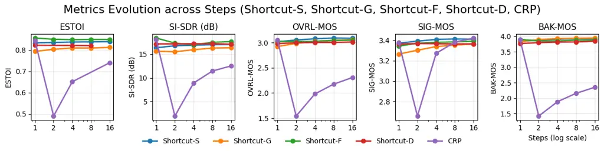
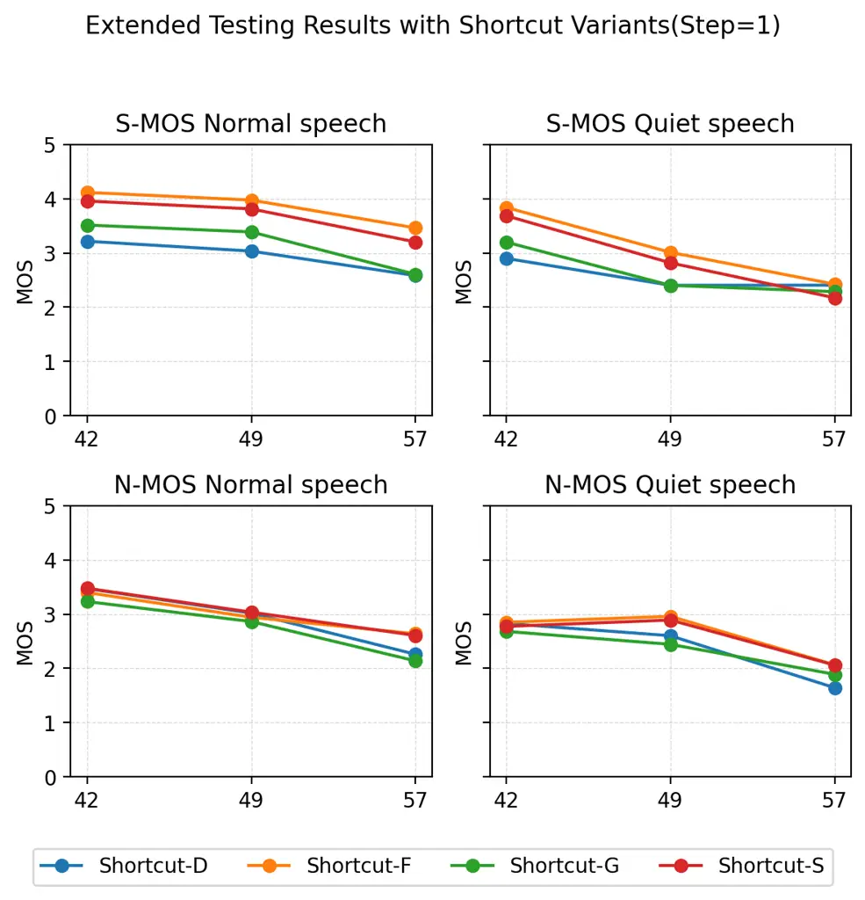

# Shortcut Flow Matching for Speech Enhancement: Step-Invariant flows via single stage training

Naisong Zhou^(†⋆),  Saisamarth Rajesh Phaye^(⋆),  Milos Cernak^(⋆), 
Tijana Stojković^(⋆),  Andy Pearce^(⋆) Andrea Cavallaro^(†),  Andy
Harper^(⋆) ^(†)^(†)thanks: This project was completed during an
internship at Logitech.

###### Abstract

Diffusion-based generative models have achieved state-of-the-art
performance for perceptual quality in speech enhancement (SE). However,
their iterative nature requires numerous Neural Function Evaluations
(NFEs), posing a challenge for real-time applications. On the contrary,
flow matching offers a more efficient alternative by learning a direct
vector field, enabling high-quality synthesis in just a few steps using
deterministic ordinary differential equation (ODE) solvers. We thus
introduce Shortcut Flow Matching for Speech Enhancement (SFMSE), a novel
approach that trains a single, step-invariant model. By conditioning the
velocity field on the target time step during a one-stage training
process, SFMSE can perform single, few, or multi-step denoising without
any architectural changes or fine-tuning. Our results demonstrate that a
single-step SFMSE inference achieves a real-time factor (RTF) of 0.013
on a consumer GPU while delivering perceptual quality comparable to a
strong diffusion baseline requiring 60 NFEs. This work also provides an
empirical analysis of the role of stochasticity in training and
inference, bridging the gap between high-quality generative SE and
low-latency constraints.

###### Index Terms: 

Flow matching, speech enhancement, shortcut conditioning, real-time
inference

^(†)^(†)address: ^(†)EPFL, Lausanne, CH, ^(⋆)Logitech, Lausanne, CH

## 1 Introduction

Speech enhancement (SE) must jointly optimize perceptual quality,
algorithmic latency, and compute budget. For natural conversation in
interactive settings, the end-to-end delay is typically expected to
remain well below a few hundred milliseconds. This places pressure on SE
models to deliver high-quality denoising under tight runtime
constraints.

Classical approaches such as Wiener filtering \[1\] assume relatively
stationary noise, are computationally light but their performance is
limited in challenging conditions. Data-driven SE has since advanced
robustness by learning from large corpora. Data-driven SE methods can be
grouped into _predictive_ and _generative_ models. Predictive models
(e.g., Conv-tasnet \[2\]) learn a direct mapping or masking from noisy
to clean signals \[3\]. Generative models (e.g., MelGAN \[4\]) learn a
conditional distribution and can generalize better when synthesis of
low-level detail is required.

Diffusion models deliver strong naturalness in audio generation and have
been adapted to SE in the complex STFT (short, overlapping window
Fourier transform producing complex time–frequency coefficients) and
waveform domains \[5, 6, 7\]. However, the reverse process is typically
computationally intensive, often requiring tens of reverse steps, each
composed of 1 or 2 NFE (often when predictor-corrector is used, like in
\[8\]) and thus conflicting with low-latency operation. Recent work has
explored acceleration, including consistency training for one/few-step
mappings \[9\], online/buffered formulations that amortize computation
over streaming windows \[10\], and second-stage corrections that enable
few-step sampling in CRP \[11\].

Flow matching \[12\] and rectified flow \[13\] learn the vector field
directly, i.e., a function
$`v_{\theta}(\mathbf{x},t,\mathbf{y})\in\mathbb{R}^{d}`$ that maps a
state and time (and conditioning) to its instantaneous velocity. The
associated ordinary differential equation (ODE) evolves
deterministically as
$`\dot{\mathbf{x}}_{t}=v_{\theta}(\mathbf{x}_{t},t,\mathbf{y})`$ (with
an initial condition), which can be integrated with coarse-step solvers
at inference. Shortcut flow matching \[14\] further conditions the
velocity on a target time step, enabling a single network to support
single-, few-, and multi-step trajectories. Recent SE studies within
conditional flow matching frameworks report competitive quality with
NFEs as low as five \[15, 16, 17\].

Contributions. We investigate shortcut flow matching for SE and make the
following contributions:

- •
  A shortcut-conditioned flow matching formulation for SE that exposes
  the target time step to the velocity field, enabling single, few, and
  multi-step inference with one model.
- •
  An empirical study of stochasticity in training/inference and its
  impact on stability and quality.
- •
  Real-time results: with a single NFE, our SFMSE attains quality
  comparable to diffusion baselines using the same backbone and
  representations at 60 NFEs, while achieving an RTF of 0.013 on a
  consumer GPU.

## 2 Background

### 2.1 Task Definition

Let $`\mathbf{Y},\mathbf{S},\mathbf{N}\in\mathbb{C}^{F\times T}`$ denote
the complex STFTs of the noisy speech, clean speech, and noise,
respectively, with an additive mixture model $`\mathbf{Y=S+N}`$. $`F`$
denotes number of frequency bins and $`T`$ is that of time windows.
Flow-based (e.g., diffusion, flow matching, Schrödinger bridges) speech
enhancement is posed as conditional generation, where models learn a
continuous path between a simple prior distribution $`p_{1}`$ and the
clean speech distribution $`p_{0}`$.

### 2.2 Diffusion and Flow Matching

The diffusion process is described with an Stochastic Differential
Equation (SDE):

```math
d\mathbf{x}_{t}\;=\;f(\mathbf{x}_{t},t)\,dt\;+\;g(t)\,d\mathbf{w}_{t}, \tag{1}
```

where $`f`$ is the drift, $`g`$ the diffusion schedule, and
$`\mathbf{w}_{t}`$ a standard Wiener process whose increments are
Gaussian with pre-computable variance. Discretizing with Euler–Maruyama
and a backward step $`\Delta t>0`$ from $`t_{k}`$ to
$`t_{k-1}=t_{k}-\Delta t`$ yields

```math
\displaystyle\mathbf{x}_{k-1}\;=\;\mathbf{x}_{k} \displaystyle+\;\Delta t\,\Big[f(\mathbf{x}_{k},t_{k})-g(t_{k})^{2}\,s_{\theta}(\mathbf{x}_{k},t_{k},\mathbf{y})\Big] \tag{2}
```

```math
\displaystyle+\;g(t_{k})\sqrt{\Delta t}\;\mathbf{z}_{k},\qquad\mathbf{z}_{k}\sim\mathcal{N}(\mathbf{0},\mathbf{I}),
```

showing a decomposition into a deterministic drift and a stochastic term
of scale $`g(t_{k})\sqrt{\Delta t}`$.

FM forgoes explicit score estimation and directly learns a
time–dependent velocity field $`v_{\theta}`$ whose ODE transports the
endpoint $`p_{1}(\cdot\mid\mathbf{y})`$ to
$`p_{0}(\cdot\mid\mathbf{y})`$ \[12, 13\]:

```math
\mathbf{x}_{t+d}=\mathbf{x}_{d}+v_{\theta}(\mathbf{x}_{t},t,\mathbf{y})*d. \tag{3}
```

The target velocity is typically induced by interpolation; in rectified
flow, a near-linear interpolation is used, which empirically improves
robustness under coarse ODE stepping \[13\].

Comparing Eq. (2) and the ODE update implied by Eq.(3), the reverse–SDE
step equals the same drift term plus an additive Gaussian perturbation.
Thus, at a high level the algorithmic difference is SDE (stochastic
drift + noise) versus ODE (deterministic velocity). Because FM dynamics
are deterministic, whether the overall generator is stochastic depends
on the endpoint: with a random $`p_{1}`$ (e.g., a standard or
observation–centred Gaussian) the model remains generative; with a
deterministic endpoint (e.g., $`\delta_{\mathbf{y}}`$), it reduces to a
conditional mapping. We therefore report an empirical comparison of
$`p_{1}`$ choices. For diffusion (and Schrödinger–bridge formulations),
observation–centred priors such as
$`\mathcal{N}(\mathbf{y},\sigma^{2}\mathbf{I})`$ and their
$`\sigma\!\to\!0`$ limit $`\delta_{\mathbf{y}}`$ are theoretically
admissible and often behave similarly in practice.

## 3 Method

### 3.1 Flow Matching for Speech Enhancement

We formulate conditional speech enhancement (SE) with flow matching (FM)
by learning a velocity field that transports probability mass from an
endpoint prior $`p_{1}(\mathbf{x}\mid\mathbf{y})`$ to the clean
conditional $`p_{0}(\mathbf{x}\mid\mathbf{y})`$ along an ODE. Let
$`\mathbf{y}`$ be the noisy observation and
$`\mathbf{x}_{t}\in\mathbb{C}^{F\times K}`$ the STFT-domain state at
time $`t\in[0,1]`$. The learnable field is
$`v_{\theta}(\mathbf{x}_{t},t,\mathbf{y})`$. This setup requires: (i)
conditionality—$`v_{\theta}`$ depends on $`\mathbf{y}`$ and the current
state $`\mathbf{x}_{t}`$; (ii) an endpoint prior
$`p_{1}(\cdot\mid\mathbf{y})`$ that is easy to sample and compatible
with enhancement; and (iii) a teacher/path design whose target velocity
is stable under coarse ODE steps.

Following rectified flow matching \[13\], we adopted linear
interpolation for intermediate states $`\mathbf{x_{t}}`$:

```math
\mathbf{x_{t}}\;=\;(1-t)\,\mathbf{x}_{0}+t\,\mathbf{x}_{1},\qquad v_{target}\;=\;\mathbf{x}_{1}-\mathbf{x}_{0}. \tag{4}
```

At inference, the learned ODE is integrated backward from $`p_{1}`$ to
recover $`\mathbf{x}_{0}`$ conditioned on $`\mathbf{y}`$, thus enhancing
the signal.

Prior FlowSE variants have integrated flow matching into SE by defining
conditional velocities via linear or stochastic interpolants, and
typically evaluating under a fixed few-step ODE schedule. Our approach
differs in that (i) we augment FM with step-aware shortcut conditioning
(Sec. 3.2), enabling a _single_ model to operate at one/few/many steps
without additional retraining; and (ii) we decouple stochasticity from
the dynamics by placing it solely in the endpoint prior
$`p_{1}(\cdot\mid\mathbf{y})`$, followed by deterministic ODE evolution.
We further report a controlled ablation over $`p_{1}`$ choices (Sec. 5)
to isolate the impact of endpoint randomness.

### 3.2 Enforcing $`dt`$ Constraints with Self-Consistency Losses

We follow the shortcut \[14\] training to enforce one-/few-/many-step
capability with a single network. The network produces a
step-conditioned update $`f_{\theta}(\mathbf{x},t,d,\mathbf{y})`$ that
approximates the finite-difference displacement from $`\mathbf{x}`$ over
a step of size $`dt`$ at time $`t`$. Training enforces self-consistency
across step sizes by matching a single $`2d`$ step with two smaller
sequential $`dt`$ steps:

```math
\displaystyle f_{\theta}(\mathbf{x},t,2dt,\mathbf{y}) \displaystyle\approx\tfrac{1}{2}\,f_{\theta}(\mathbf{x},t,dt,\mathbf{y}) \tag{5}
```

```math
\displaystyle+\tfrac{1}{2}\,f_{\theta}\!\big(\mathbf{x}+d\,f_{\theta}(\mathbf{x},t,dt,\mathbf{y}),\,t,\,d,\,\mathbf{y}\big).
```

We minimize the squared deviation from (5) over
$`(\mathbf{s},\mathbf{y})`$, $`t`$, and $`d`$. In the limit
$`d\!\to\!0`$, the quantity $`f_{\theta}(\mathbf{x},t,d,\mathbf{y})/d`$
converges to a time-dependent velocity, and (5) reduces to a
velocity-regression objective consistent with flow matching.

The sampling of $`(t,dt)`$ is simple and uses different examples for
different targets. Following \[14\], we split each batch with ratio
$`ratio\_sc`$: a fraction is used for self-consistency targets and the
remainder for flow-matching targets. For flow-matching targets, we
sample $`t`$ uniformly over a grid $`\{k\,dt_{\min}\}`$ (with
$`k\in\mathbb{N}^{+}`$) and fix $`dt=dt_{\min}`$. For self-consistency
targets, we first sample the step size from powers of two, $`dt=2^{-k}`$
with $`k\in\mathbb{N}^{+}`$, then draw admissible $`(t,dt)`$ pairs.
Additionally, with probability $`\rho\in[0,0.2]`$, we map selected pairs
to $`(t,dt)\!\mapsto\!(0,dt)`$ to emphasize the common entry state while
preserving uniform coverage elsewhere. Unless noted, we use
$`[dt_{\min},dt_{\max}]=[1/K_{\max},\,1/2]`$ and the same $`(t,dt)`$
distributions during training and evaluation.

Inference follows directly. For a single step ($`K=1`$), we take $`d=1`$
and compute

```math
\mathbf{x}_{0}\;=\;\mathbf{x}_{1}+f_{\theta}(\mathbf{x}_{1},\,0,\,d,\,\mathbf{y}). \tag{6}
```

For $`K`$ steps, we apply $`K`$ uniform updates with $`d=1/K`$, updating
the time argument accordingly. We report NFEs, RTF, and SE metrics for
$`K\in\{1,2,4,8,16\}`$.

### 3.3 Prior Distributions

To assess the effect of endpoint stochasticity, we compare four options
of $`p_{1}(\mathbf{x}\mid\mathbf{y})`$ while keeping the architecture,
loss, schedules, and preprocessing fixed.

- •
  Shortcut-G: A standard Gaussian
  $`\mathcal{N}(\mathbf{0},\mathbf{I})`$, which initializes trajectories
  far from the observation.
- •
  Shortcut-S: An observation-centered Gaussian
  $`\mathcal{N}(\mathbf{y},\sigma^{2}\mathbf{I})`$ with tunable variance
  $`\sigma^{2}`$. In SGMSE \[7\], the endpoint prior follows this form;
  for comparability, we use the same noise schedule, i.e., $`\sigma(t)`$
  with $`\sigma(1)=0.389`$.
- •
  Shortcut-D: A data-adaptive prior
  $`\mathcal{N}\!\big(\mathbf{y},\,\alpha\,\sigma^{2}(\mathbf{y})\,\mathbf{I}\big)`$,
  where $`\widehat{\sigma}^{2}(\mathbf{y})`$ estimates the
  sample-specific variance and $`\alpha=0.2`$ controls its magnitude.
- •
  Shortcut-F: The deterministic limit $`\delta_{\mathbf{y}}`$ obtained
  as $`\sigma\to 1`$, which removes endpoint randomness and yields a
  purely deterministic conditional mapping under the learned ODE. This
  shortcut F, also ingest clean signal y as classifer free guidance
  \[18\].

In all cases, we sample $`\mathbf{x}_{1}\sim p_{1}`$ (or set
$`\mathbf{x}_{1}=\mathbf{y}`$ for $`\delta_{\mathbf{y}}`$) and then
apply one or few-step updates using $`f_{\theta}`$ during inference.
This ablation isolates how the endpoint prior influences conditioning
near $`t\approx 1`$, one-/few-step accuracy.

|            |     |           |             |           |           |           |           |           |           |
| ---------- | --- | --------- | ----------- | --------- | --------- | --------- | --------- | --------- | --------- |
|            | NFE | ESTOI     | SI-SDR (dB) | POLQA     | OVRL-MOS  | SIG-MOS   | BAK-MOS   | P.800 MOS | NISQA MOS |
| Noisy      | –   | 0.79±0.11 | 8.45±4.23   | 3.47±0.06 | 2.69±0.39 | 3.34±0.39 | 3.12±0.56 | 3.05±0.29 | 3.17±0.06 |
| SGMSE      | 60  | 0.86±0.07 | 17.45±2.47  | 4.30±0.03 | 3.17±0.15 | 3.48±0.12 | 3.98±0.13 | 3.53±0.21 | 4.63±0.02 |
| SGMSE      | 1   | 0.02±0.02 | -25.32±1.28 | –         | 1.20±0.06 | 1.56±0.17 | 1.29±0.06 | 2.08±0.02 | 1.14±0.00 |
| CRP        | 1   | 0.84±0.09 | 18.04±3.37  | 4.33±0.04 | 3.05±0.23 | 3.38±0.20 | 3.90±0.21 | 3.53±0.23 | 4.38±0.03 |
| Shortcut-G | 1   | 0.79±0.09 | 15.60±2.44  | 3.95±0.05 | 2.92±0.21 | 3.26±0.19 | 3.83±0.14 | 3.37±0.22 | 3.93±0.03 |
| Shortcut-S | 1   | 0.83±0.08 | 16.32±2.56  | 3.93±0.04 | 3.02±0.18 | 3.37±0.15 | 3.84±0.18 | 3.45±0.21 | 3.94±0.04 |
| Shortcut-D | 1   | 0.82±0.09 | 17.14±2.76  | 3.80±0.06 | 2.98±0.19 | 3.36±0.16 | 3.77±0.20 | 3.41±0.21 | 3.84±0.04 |
| Shortcut-F | 1   | 0.86±0.08 | 18.39±2.92  | 4.16±0.04 | 3.02±0.21 | 3.34±0.18 | 3.90±0.17 | 3.47±0.23 | 4.29±0.03 |

Table 1: Performance of the proposed shortcut systems with the reference
SGMSE 60 NFEs system and baseline CRP 1 NFE. All systems are trained and
validated on the same VB-DMD data. The bold values show the 1 NFE
statistically best metrics.



Figure 1: Metrics evolution across steps for Shortcut-S/G/F/D and CRP.

## 4 Experimental setup

### 4.1 Datasets for training and evaluation

Following prior work\[7\]\[11\] we adopt the VoiceBank–DEMAND (VB-DMD)
dataset for training and testing \[19\], which consists of recordings
from 28 speakers and is a widely used public benchmark for
single-channel speech enhancement. Noisy mixtures are created by
combining clean utterances from the Voice Bank corpus with 10 DEMAND
noise types at RMS SNRs of 0, 5, 10, and 15 dB. The test set uses two
unseen speakers and five unseen noise types at SNRs of 2.5, 7.5, 12.5,
and 17.5 dB. The durations of the training, validation, and test splits
are 8 h 45 min, 37 min, and 34 min, respectively.

### 4.2 Baselines and Implementation Details

We train shortcut flow matching with an NCSN++ v2 \[8\] backbone to
obtain a model size comparable to multi-step references SGMSE \[7\] and
CRP \[11\], which we selected as our baselines. For the flow-matching
component we set the minimum step size to $`\mathrm{dt_{min}}=1/128`$.
For creating self-consistency targets, we sample with
$`\mathrm{rate_{sc}}=0.25`$, and we weight the self-consistency term by
$`\lambda_{\mathrm{sc}}=0.1`$. Audio preprocessing follows the original
SGMSE configuration. All shortcut models are trained on VB-DMD for 100
epochs using Adam with learning rate $`\eta=10^{-4}`$. For longer
recordings, we chunk audio into fixed-length non-overlapping chunks,
enhance each chunk individually and concatenate the enhanced outputs.
All evaluations are run on an NVIDIA RTX 4070Ti.

### 4.3 Metrics

We report both reference-based and reference-free metrics. The former
compares enhanced speech against clean ground truth and is used for both
in-domain and out-of-domain evaluation; the latter relies on learned
predictors and does not require references. Among all the quality
metrics, higher scores are better.

For reference-based metrics, we use POLQA \[20\] for perceptual quality
(1–4.5), ESTOI \[21\] for intelligibility (0–1), and SI-SDR \[22\] for
signal fidelity (dB).

For reference-free metrics, we use DNSMOS P.835 \[23\], reporting Speech
Quality (SIG), Background Noise Quality (BAK), and Overall Quality
(OVRL). We also reported NISQA MOS from \[24\]. In the subjective
listening test on VB-DMD, we reported the P800 MOS evaluation
score\[25\].

#### 4.3.1 3QUEST Metrics

In addition to the above mentioned metrics, we also include an analysis
using the 3QUEST algorithm in accordance with the Microsoft Teams
Certification specification for conferencing devices \[26\]. Nineteen
utterances from the IEEE sentences are replayed using a HATS system,
under ACQUA control, in an ETSI compliant acoustically treated room.
Following the guidelines from the Teams specification, noises commonly
found in conference room situations were replaying into the room along
with the speech (general meeting noise, notebook keyboard, PC keyboard,
projector).

Additionally, HVAC noise was also replayed at level of 42 dBA (normal),
49 dBA (loud), and 57 dBA (very loud) when measured at the recording
device, with speech reproduced at 89 dB SPL (normal) and 79 dB SPL
(quiet) at the mouth reference position, consistent with typical
Teams/Zoom certification settings. Each recording was approximately 79s.

For each recording, we apply the checkpoint trained on VB-DMD for
enhancement only.

Following the constraints in Teams certification \[26\] we report 3
metrics: NOBGN-SMOS which denotes the speech quality when no background
noise is replayed, simulating the conversations in a well treated
conference room; SMOS to denote the general speech quality in noisy
conditions; and NMOS for the noise denoising quality. The certification
includes thresholds on each metric for a device to be certificated, and
we include them in Table 2 for reference.

## 5 Results

Table 1 summarizes the performance and NFEs of the proposed SFMSE on the
VB-DMD datasets. For baselines, we directly used checkpoints form
SGMSE\[7\] and CRP was fine-tuned with $`n_{rev}`$=1, based on the
pretrained weights in \[27\]. We report the mean and 95% confidence
interval of each measure. We can see that our shortcut models have
roughly equivalent scores to SGMSE with 60 NFE. When compared with CRP,
our method generally performs slightly lower, but we do not require any
fine-tuning stage, and the confidence interval is smaller than CRP,
indicating better robustness and generalization capability.

The 4 shortcut variants represents the 4 different priors, as introduced
in Section 3.3. Among the 4 variants, the centered priors (Shortcut-S /
Shortcut-D) explicitly encode the belief that $`\mathbf{x}_{1}`$ should
lie near the observation $`\mathbf{y}`$ (e.g.,
$`\mathcal{N}(\mathbf{y},\sigma^{2}\mathbf{I})`$ or
$`\mathcal{N}(\mathbf{y},\alpha\,\sigma^{2}(\mathbf{y})\,\mathbf{I})`$),
which shortens the transport path and reduces target variance; under the
extremely low-step regime (NFE=1), this lower-variance target is easier
to learn and thus more stable than a pure Gaussian prior. In contrast,
the uncentered Gaussian prior initiates far from $`\mathbf{y}`$,
injecting task-irrelevant randomness and increasing bias/variance for a
single-step predictor, hence its weaker performance.

Interestingly, the deterministic endpoint prior (Shortcut-F,
$`\delta_{\mathbf{y}}`$) collapses endpoint stochasticity and produces
the sharpest one-step estimates in-distribution (best means across
several metrics). As this is trained and tested on the same datase, we
explore with the unseen 3QUEST dataset whether by excluding uncertainty
modeling it Shortcut -F would generalize worse under distribution shift.

Furthermore, we have shown in Figure1 the scores evolving with NFE
$`\in\{1,2,4,8,16\}`$ for the proposed model, with CRP model tuned on
$`N_{rev}`$ mentioned above. We observe that, in the single-step case,
shortcut variants have similar performance with CRP, and when the number
of steps used increases, shortcut can still have the same level of
performance without extra fine-tuning. With just a single-stage joint
training, the model achieves comparable enhancement quality to upper
bound in \[7\] with fewer steps at different scale.

|                        | NoBGN-SMOS | SMOS | NMOS |
| ---------------------- | ---------- | ---- | ---- |
| Teams Threshold \[26\] | 4.0        | 3.50 | 2.90 |
| Shortcut-F             | 4.16       | 4.09 | 3.69 |
| Shortcut-S             | 4.16       | 4.03 | 3.78 |
| Shortcut-D             | 4.05       | 3.87 | 3.82 |
| Shortcut-G             | 3.85       | 3.71 | 3.35 |

Table 2: Certification Results (Step=1) for the 3QUEST test



Figure 2: Extended testing results by variant for step=1. Each subplot
shows MOS under different SNR levels (42, 49, 57 dBA) for Normal and
Quiet speech, across both S-MOS and N-MOS conditions.

Table 2 and Figure 2 present the 3QUEST results on the additional
dataset. As shown in Table 2, all shortcut variants—except for
Shortcut-G—meet the Teams threshold for speech and noise cancellation
quality under noisy or good conference conditions. Shortcut-G falls
slightly below for NoBGN-SMOS, suggesting that it may be
over-suppressing parts of the audio. Figure 2 further indicates that the
shortcut models remain competitive under normal and loud HVAC noise
conditions, especially when with normal speech. At very high noise
levels (57 dBA), however, performance degrades. This is partly due to
the recording pipeline: an automatic gain control (AGC) stage, which
cannot be disabled during evaluation, tends to misclassify quiet speech
segments as noise and attenuate them. Consequently, the input waveforms
at 57dBA are already incomplete before enhancement.

## 6 Conclusion

We integrated Shortcut Flow Matching into speech enhancement. Our SFMSE
model (trained and evaluated on VB-DEMAND) with NFE=1 achieves
enhancement quality comparable to SGMSE at NFE=60. Relative to other
one-step or few-step methods, SFMSE eliminates two-stage fine-tuning and
achieves step-invariant performance through a single joint-training
stage, reducing computational cost and design complexity. By comparing
alternative priors, we analyzed the role of endpoint stochasticity in
flow matching and its effect on enhancement quality, and found that a
deterministic prior does not degrade generalization on the unseen 3QUEST
dataset. On a consumer-grade GPU, the system operates with an RTF of
0.013, satisfying real-time requirements.

However, SFMSE 1-step quality does not surpass a 1-step fine-tuned CRP
model. Future work targets improving overall quality with richer
conditioning (e.g., noise/context embeddings) and more precise
objectives (e.g., multi-resolution STFT/perceptual losses), as well as
streamable deployment and evaluation under causality.

The authors would like to thank Yuliia Shandra for their valuable
feedback and insights, and the anonymous listeners for their assistance.

## References

- \[1\] W.A. Gardner, “Cyclic Wiener filtering: theory and method,” IEEE
  Transactions on Communications, vol. 41, no. 1, pp. 151–163, 1993.
- \[2\] Yi Luo and Nima Mesgarani, “Conv-TasNet: Surpassing Ideal
  Time-Frequency Magnitude Masking for Speech Separation,” arXiv
  preprint arXiv:1809.07454, 2018.
- \[3\] Donald S. Williamson, Yuxuan Wang, and DeLiang Wang, “Complex
  Ratio Masking for Monaural Speech Separation,” IEEE/ACM Transactions
  on Audio, Speech, and Language Processing, vol. 24, no. 3, pp.
  483–492, 2016.
- \[4\] Kundan Kumar et al., “MelGAN: Generative adversarial networks
  for conditional waveform synthesis,” in NeurIPS, 2019.
- \[5\] Zhifeng Kong, Wei Ping, Jiaji Huang, Kexin Zhao, and Bryan
  Catanzaro, “DiffWave: A Versatile Diffusion Model for Audio
  Synthesis,” in ICLR, 2021.
- \[6\] Julius Richter et al., “CDiffuSE: Conditional Diffusion for
  Speech Enhancement,” in Interspeech, 2023.
- \[7\] Simon Welker, Julius Richter, and Timo Gerkmann, “Speech
  Enhancement with Score-Based Generative Models in the Complex STFT
  Domain,” in Interspeech, 2022.
- \[8\] Yang Song, Jascha Sohl-Dickstein, Diederik P Kingma, Abhishek
  Kumar, Stefano Ermon, and Ben Poole, “Score-Based Generative Modeling
  through Stochastic Differential Equations,” in International
  Conference on Learning Representations, 2021.
- \[9\] Yang Song, Prafulla Dhariwal, Mark Chen, and Ilya Sutskever,
  “Consistency Models,” arXiv preprint arXiv:2303.01469, 2023.
- \[10\] Bunlong Lay, Rostislav Makarov, and Timo Gerkmann, “Diffusion
  Buffer: Online Diffusion-based Speech Enhancement with Sub-Second
  Latency,” 2025.
- \[11\] Bunlong Lay, Jean-Marie Lemercier, Julius Richter, and Timo
  Gerkmann, “Single and Few-step Diffusion for Generative Speech
  Enhancement,” 2024.
- \[12\] Yaron Lipman, Ricky T. Q. Chen, Heli Ben-Hamu, Maximilian
  Nickel, and Matt Le, “Flow Matching for Generative Modeling,” arXiv
  preprint arXiv:2210.02747, 2022.
- \[13\] Xingchao Liu, Chengyue Gong, and Qiang Liu, “Flow Straight and
  Fast: Learning to Generate and Transfer Data with Rectified Flow,”
  arXiv preprint arXiv:2209.03003, 2022.
- \[14\] Kevin Frans, Danijar Hafner, Sergey Levine, and Pieter Abbeel,
  “One Step Diffusion via Shortcut Models,” arXiv preprint
  arXiv:2410.12557, 2024.
- \[15\] Seonggyu Lee, Sein Cheong, Sangwook Han, and Jong Won Shin,
  “FlowSE: Flow Matching-based Speech Enhancement,” 2025.
- \[16\] Ziqian Wang, Zikai Liu, Xinfa Zhu, Yike Zhu, Mingshuai Liu, Jun
  Chen, Longshuai Xiao, Chao Weng, and Lei Xie, “FlowSE: Efficient and
  High-Quality Speech Enhancement via Flow Matching,” 2025.
- \[17\] Mattias Cross and Anton Ragni, “Flowing Straighter with
  Conditional Flow Matching for Accurate Speech Enhancement,” 2025.
- \[18\] Jonathan Ho and Tim Salimans, “Classifier-free diffusion
  guidance,” 2022.
- \[19\] Cassia Valentini-Botinhao, Xin Wang, Shinji Takaki, and Junichi
  Yamagishi, “Noisy speech database for training speech enhancement
  algorithms and TTS models (VoiceBank-DEMAND),” 2017, Clean/noisy
  parallel data; 28spk/56spk splits.
- \[20\] John Beerends et al., “Perceptual Objective Listening Quality
  Assessment (POLQA),” Journal of the Audio Engineering Society, 2013.
- \[21\] Cees Taal, Richard Hendriks, et al., “An evaluation of
  objective measures for intelligibility prediction of time–frequency
  weighted noisy speech,” in Interspeech, 2011.
- \[22\] Jonathan Le Roux, Scott Wisdom, Hakan Erdogan, and John R.
  Hershey, “SDR – Half-baked or Well Done?,” in ICASSP 2019 - 2019 IEEE
  International Conference on Acoustics, Speech and Signal Processing
  (ICASSP), 2019, pp. 626–630.
- \[23\] Chandan K A Reddy, Vishak Gopal, and Ross Cutler, “Dnsmos
  P.835: A Non-Intrusive Perceptual Objective Speech Quality Metric to
  Evaluate Noise Suppressors,” in ICASSP 2022 - 2022 IEEE International
  Conference on Acoustics, Speech and Signal Processing (ICASSP), 2022,
  pp. 886–890.
- \[24\] Gabriel Mittag, Babak Naderi, Assmaa Chehadi, and Sebastian
  Möller, “NISQA: A Deep CNN-Self-Attention Model for Multidimensional
  Speech Quality Prediction with Crowdsourced Datasets,” in Interspeech 2021. Aug. 2021, ISCA.
- \[25\] ITUTP Recommendation, “P800, Methods for subjective
  determination of transmission quality, ITU-T,” 1996.
- \[26\] Microsoft, “Microsoft Teams V5 Certifications(Audio),”
  [https://learn.microsoft.com/en-us/microsoftteams/devices/certification-specifications](https://learn.microsoft.com/en-us/microsoftteams/devices/certification-specifications),
  2025, Accessed: 2025-09-18.
- \[27\] Bunlong Lay, Simon Welker, Julius Richter, and Timo Gerkmann,
  “Reducing the Prior Mismatch of Stochastic Differential Equations for
  Diffusion-based Speech Enhancement,” in Interspeech 2023, 2023, pp.
  3809–3813.
