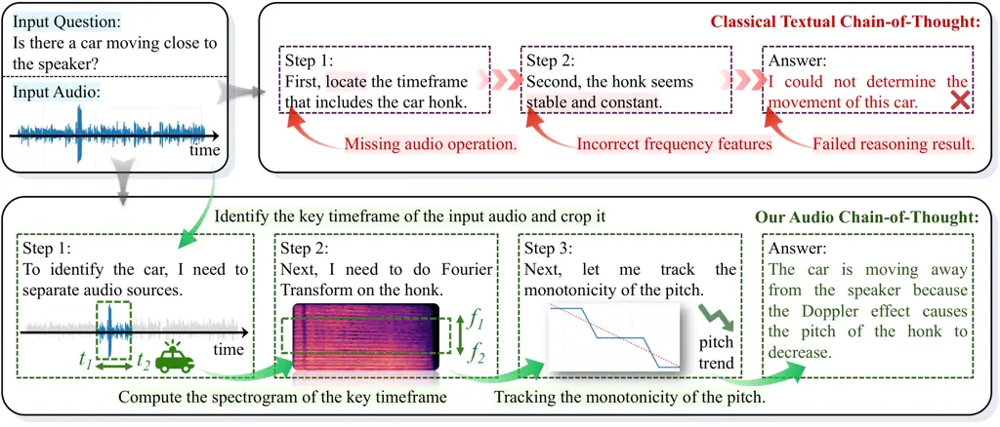

# thinking with sound: audio chain-of-thought enables multimodal reasoning in large audio-language models

Zhen Xiong Affiliation: University of Southern California    Yujun Cai
Affiliation: University of Queensland    Zhecheng Li
Affiliation: University of California, San Diego    Junsong Yuan
Affiliation: University of Buffalo    Yiwei Wang Affiliation: University
of California,
Merced[eric2i.github.io/Think-with-Sound](https://eric2i.github.io/Think-with-Sound)

###### Abstract

Recent Large Audio-Language Models (LALMs) have shown strong performance
on various audio understanding tasks such as speech translation and
Audio Q&A. However, they exhibit significant limitations on challenging
audio reasoning tasks in complex acoustic scenarios. These situations
would greatly benefit from the use of acoustic tools like noise
suppression, source separation, and precise temporal alignment, but
current LALMs lack access to such tools. To address this limitation, we
introduce Thinking-with-Sound (TwS), a framework that equips LALMs with
Audio CoT by combining linguistic reasoning with on-the-fly audio-domain
analysis. Unlike existing approaches that treat audio as static input,
TwS enables models to actively think with audio signals, performing
numerical analysis and digital manipulation through multimodal
reasoning. To evaluate this approach, we construct MELD-Hard1k, a new
robustness benchmark created by introducing various acoustic
perturbations. Experiments reveal that state-of-the-art LALMs suffer
dramatic performance degradation on MELD-Hard1k, with accuracy dropping
by more than 50% compared to clean audio. TwS achieves substantial
improvements in robustness, demonstrating both effectiveness and
scalability: small models gain 24.73% absolute accuracy, with
improvements scaling consistently up to 36.61% for larger models. Our
findings demonstrate that Audio CoT can significantly enhance robustness
without retraining, opening new directions for developing more robust
audio understanding systems.

|     |
| --- |
|     |

## 1 Introduction

Recent advances in Large Audio-Language Models (LALMs) have enabled
unified modeling of auditory and textual modalities (Tang et al., 2023;
Chu et al., 2024; Défossez et al., 2024; Fang et al., 2024). Unlike
traditional audio processing systems that function as task-specific
solvers, LALMs allow users to specify diverse audio-related tasks
through natural language instructions. This flexibility enables them to
perform various audio understanding tasks including audio
translation (de Seyssel et al., 2023), emotion recognition (Maimon
et al., 2025), and audio Q&A (Yang et al., 2024; Wang et al., 2024).
Notable examples include proprietary models like GPT-4o  (OpenAI et al., 2024) and open-source contributions such as Qwen2.5 Omni  (Xu et al., 2025) and Voxtral (Liu et al., 2025).

Despite these advances, current LALMs remain fundamentally limited in
their acoustic understanding capabilities (Lee et al., 2025). A critical
weakness lies in their limited understanding of audio signals,
particularly in analyzing temporal dynamics, spectral characteristics,
energy distributions, etc. The prevailing approach simply encodes audio
inputs into token representations that are then processed alongside text
tokens for mixed modality reasoning. While this makes good use of the
language modeling capabilities of LALMs, it fundamentally constrains the
models’ ability to perform fine-grained acoustic analysis. The models
lack mechanisms to iteratively reason about and manipulate audio in its
native domain, instead treating it as a static, one-time encoded input.
This architectural limitation becomes particularly pronounced when
handling degraded audio or tasks requiring precise acoustic
discrimination, where pure linguistic reasoning proves insufficient.

These limitations raise a critical question about how LALMs can be
enhanced to reasoning with audio. Current approaches treat audio as a
fixed input to be encoded once, but robust acoustic understanding may
require a fundamentally different paradigm. This motivates our central
research question: Can LALMs think actively with audio by iteratively
analyzing and manipulating audio signals throughout the reasoning
process?



Figure 1: Our framework equips a Large Audio-Language Model with complex
multimodal reasoning. Unlike traditional LALMs that struggle with
acoustic details, our TwS-enabled model generates Audio Chain-of-Thought
(CoT) (Wei et al., 2022) and flexibly invokes tools such as source
separation and frequency analysis. This integration of linguistic
reasoning with on-the-fly acoustic analysis enables accurate source
identification, timestamp localization, and frequency feature extraction
beyond standard inference pipelines.

In this work, we introduce a novel Thinking-with-Sound reasoning
framework (see Fig. 1 as overview) that enables large audio-language
models (LALMs) to go beyond the limitations of purely text-based
reasoning. Our approach allows the model to actively invoke appropriate
tools for manipulating auditory inputs, such that the reasoning process
alternates between linguistic thoughts and acoustic analysis. This
design better aligns with the way humans engage in deep analysis of
audio-sensitive tasks with tools, which bridges the modality gap between
language and audio under complex scenarios. By jointly leveraging LALM’s
intrinsic reasoning capabilities and tool-augmented interactions, the
model is guided to generate more coherent, reliable, and grounded
multimodal chains of thought, thereby unlocking its performance
bottleneck in challenging audio reasoning tasks.

For experiments, we adopt the Multimodal EmotionLines Dataset
(MELD) (Poria et al., 2019) as the base benchmark and construct a new
evaluation set, MELD-Hard1k, by introducing various types of
perturbations to the audio inputs. Experimental results show that, when
comparing performance on MELD and MELD-Hard1k, models of different
parameter scales suffer an average accuracy drop of more than 50%. This
directly highlights the substantial limitations of the zero-shot
generalization ability of current LALMs. By incorporating our proposed
Thinking-with-Sound (TwS) framework, we observe that even lightweight
models achieve an absolute accuracy improvement of 24.73%. Moreover, as
model size increases, the performance gains become more pronounced,
indicating that our method amplifies the inherent audio reasoning
capabilities of LALMs and demonstrates stronger generalizability and
scalability.

In summary, our contributions can be summarized as follows:

\(1\) We propose Thinking-with-Sound (TwS), a novel reasoning framework
that enables LALMs to perform audio CoT by interleaving linguistic
reasoning with acoustic analysis.

\(2\) We design MELD-Hard1k, a robustness-oriented benchmark that
introduces perturbations to systematically evaluate LALMs under
challenging audio conditions.

\(3\) We demonstrate through extensive experiments that TwS consistently
improves LALMs’ gaccuracy, robustness, and scalability across model
sizes, highlighting its effectiveness in unlocking the full audio
reasoning capabilities of LALMs.

## 2 Related Works

#### Large Audio-Language Model

LALMs represent a significant advancement beyond traditional ASR
systems, enabling comprehensive audio understanding and reasoning
capabilities. Recent work has explored various architectural approaches:
GAMA (Ghosh et al., 2024) integrates LLMs with multiple audio
representations through a custom Audio Q-Former. However, current LALMs
face reliability challenges, with studies showing that even advanced
models like Qwen2-Audio lack robustness awareness (Ma et al., 2025).
These limitations motivate our focus on enhancing LALM reasoning through
structured tool integration.

#### Multimodal Chain-of-Thought

Chain-of-Thought reasoning has proven effective for complex reasoning
tasks in language models (Wei et al., 2022; Kojima et al., 2022), with
extensions to multimodal settings showing particular promise. Multimodal
Chain-of-Thought (Zhang et al., 2023) demonstrates improved performance
by incorporating vision and language modalities in a two-stage reasoning
framework. Most similar to our work, Interleaved-modal Chain-of-Thought
(ICoT) (Gao et al., 2025) generates sequential reasoning steps with
paired visual and textual rationales, aligning more closely with human
cognitive processes and significantly outperforming text-only
approaches. Our work extends this paradigm from vision-language to
audio-language tasks, addressing the unique challenges of temporal audio
processing.

#### Tool-Augmented Language Models

Integrating external tools has become central to enhancing language
models. Toolformer (Schick et al., 2023) enabled autonomous API calls
via self-supervision, ReAct (Yao et al., 2023) combined reasoning with
tool use, and HuggingGPT (Shen et al., 2023) positioned LLMs as
controllers of specialized models. In audio, MusicAgent (Yu et al., 2023) and AudioGPT (Huang et al., 2023) explored LLM-based generation,
but their one-shot or pipeline designs lack the iterative refinement
needed for robust understanding. Since audio is inherently temporal and
sequential, effective modeling requires dynamic multi-step manipulation.
Our work addresses this gap by enabling LALMs to iteratively reason over
acoustic signals, refining interpretations through targeted
manipulations.

## 3 Methodology

### 3.1 Problem Formulation

We consider the setting of Large Audio-Language Models (LALMs), where
the goal is to process an audio input $`x_{a}\in\mathcal{X}`$ together
with a natural language instruction $`x_{t}\in\mathcal{V}^{*}`$ to
generate a response $`y\in\mathcal{V}^{*}`$. Here, $`\mathcal{X}`$
denotes the space of audio signals, and $`\mathcal{V}^{*}`$ represents
sequences of tokens from vocabulary $`\mathcal{V}`$. The response $`y`$
can encode various outputs including classifications, descriptions, or
structured formats, depending on the task specified by $`x_{t}`$.
Formally, we assume data triples $`(x_{a},x_{t},y)`$ are sampled from an
underlying distribution $`\mathcal{D}`$, and an LALM implements a
conditional distribution:

```math
f_{\theta}(y|x_{a},x_{t})=\prod_{i=1}^{|y|}f_{\theta}(y_{i}|y_{<i},x_{a},x_{t}) \tag{1}
```

where $`f_{\theta}`$ denotes a parameterized model trained on paired
audio-text data, and generation follows an autoregressive factorization.
For deterministic evaluation, we consider the mode of this distribution:
$`y=\arg\max_{y^{\prime}}f_{\theta}(y^{\prime}|x_{a},x_{t})`$.

### 3.2 Limitations of Current Text-Only Reasoning

Current LALMs employ a one-shot encoding paradigm where the audio signal
$`x_{a}`$ is compressed into a fixed sequence of embedding tokens
$`z_{a}=\text{Enc}(x_{a})\in\mathbb{R}^{L\times d}`$ through pre-trained
audio encoders (Radford et al., 2023; Baevski et al., 2020; Hsu et al.,
2021). This irreversible transformation discards fine-grained spectral
and temporal information, reducing rich acoustic features to static
embeddings that are then concatenated with text tokens and processed
through autoregressive generation. Once encoded, the model cannot
revisit the original waveform, analyze specific frequency bands, or
adaptively focus on relevant temporal segments.

This architectural constraint becomes particularly limiting in scenarios
requiring precise acoustic analysis. For instance, in speaker
diarization tasks, the model cannot dynamically isolate and re-examine
overlapping speech segments. Similarly, for emotion recognition in noisy
environments, the model lacks the ability to iteratively enhance signal
quality or selectively attend to emotion-bearing acoustic features like
pitch contours and formant transitions. The reasoning process is thus
confined to a sequence of latent states:

```math
\mathcal{R}=(r_{1},r_{2},\dots,r_{K}) \tag{2}
```

```math
r_{k}=f_{\theta}(r_{<k},z_{a},x_{t}) \tag{3}
```

where each state $`r_{k}`$ evolves through text-space transformations
without access to the underlying audio signal. Even when the model
generates chain-of-thought reasoning about acoustic properties, it
operates solely on the compressed representation $`z_{a}`$, unable to
verify hypotheses through targeted acoustic analysis or apply corrective
operations like noise suppression or temporal segmentation. This
fundamental limitation—treating audio as a static input rather than a
manipulable signal—constrains LALMs’ ability to achieve robust
understanding in challenging acoustic conditions.

### 3.3 Thinking-with-Sound Framework

We propose Thinking-with-Sound (TwS), a training-free framework that
augments LALMs with the ability to perform multi-step reasoning by
interleaving linguistic reflection with audio-domain operations. Unlike
conventional approaches that rely solely on text-based reasoning, TwS
empowers models to actively manipulate and analyze audio signals during
the inference process, leading to more robust and adaptive reasoning
under challenging acoustic conditions.

The key insight behind TwS is that effective and human-level audio
understanding often requires domain-specific operations that cannot be
adequately captured even through textual level reasoning tokens alone.
By allowing LALMs to invoke audio processing tools during reasoning, we
enable them to: 1) Understand audio input via various acoustic tools, 2)
Extract relevant features for fine-grained analysis, and 3) Iteratively
refine their understanding through multi-step audio manipulation.

#### General Framework.

We extend the standard reasoning process by introducing a set of
audio-domain operators $`\mathcal{T}=\{T_{1},\dots,T_{M}\}`$, where each
$`T_{m}:\mathcal{X}\rightarrow\mathcal{X}`$ is a transformation acting
on the raw audio signal $`x_{a}\in\mathcal{X}`$. The key idea is that at
each reasoning step $`k`$, the model can choose between two types of
actions: (1) generating linguistic reasoning tokens through the LALM, or
(2) applying an audio operator to transform the current audio signal.
The reasoning state $`r_{k}`$ evolves by incorporating the results of
both actions:

```math
r_{k+1}=\begin{cases}f_{\theta}(r_{k},\text{Enc}(x_{a}^{(k)}),x_{t}),&\phi(r_{k},x_{a}^{(k)},x_{t})=0,\\
f_{\theta}(r_{k},\text{Enc}(T_{m}(x_{a}^{(k)})),x_{t}),&\phi(r_{k},x_{a}^{(k)},x_{t})\neq 0\end{cases} \tag{4}
```

where $`f_{\theta}`$ denotes the LALM’s text generation function,
$`\text{Enc}(\cdot)`$ encodes audio into token representations, and
$`x_{t}`$ is the textual instruction, and $`\phi(\cdot)`$ is a decision
function that we will be defined in the following interleaved reasoning
mechanism. This formulation enables the model to iteratively refine its
understanding by dynamically manipulating the audio signal based on
evolving reasoning needs, rather than being constrained to a single
fixed audio encoding.

#### Interleaved Reasoning Mechanism $`\phi(\cdot)`$

Our training-free approach leverages the inherent tool-using
capabilities that existing LALMs learnt during their post-training
phases. The model’s decision to call an operator is formalized through:

```math
d_{k}=\phi(r_{k},x_{a}^{(k)},x_{t})\in\{0,1,\ldots,M\} \tag{5}
```

where $`d_{k}=0`$ indicates continuing linguistic reasoning and
$`d_{k}=m>0`$ indicates invoking operator $`T_{m}`$. The decision
function $`\phi`$ represents the model’s innate tool-selection
capability, which evaluates the current reasoning state, audio
condition, and task requirements to determine the action.

#### Audio Operator Set $`\mathcal{T}`$

The TwS framework is designed to be operator-agnostic, which ensures
that it can adapt to arbitrary audio processing operators and
domain-specific needs without architectural modifications. However, if
the provided operators are irrelevant or misleading, TwS may fail to
realize its full potential and, in the worst case, degenerate to the
performance of the baseline method. We provide technical details in
Appendix C.

#### Inference Algorithm.

The complete TwS inference procedure orchestrates the interleaved
reasoning process, as detailed in Algorithm 1.

Input: Audio $`x_{a}`$, instruction $`x_{t}`$, operators
$`\mathcal{T}`$, LALM $`f_{\theta}`$, max steps $`K_{\max}`$

Output: Final response $`y`$

1 $`\mathcal{R}\leftarrow`$ InitPrompt($`x_{t}`$, $`\mathcal{T}`$)

2 $`k\leftarrow 0`$

3 while _$`k<K_{\max}`$ and not IsTerminated($`\mathcal{R}`$)_ do

    4 $`k\leftarrow k+1`$

    5 $`z_{a}\leftarrow\text{Enc}(x_{a})`$

    6 $`r\leftarrow f_{\theta}(\mathcal{R},z_{a})`$ ; // Generate next
reasoning step

    7 if _$`m`$:= $`\phi(r,x_{a},x_{t})`$_ then

       8 $`\text{args}\leftarrow`$ ParseToolCall($`r`$);

       9 $`x_{a}\leftarrow\mathcal{T}[m](x_{a},\text{args})`$ ; // Apply
audio transformation

    10 $`\mathcal{R}\leftarrow\mathcal{R}\|r`$

11 $`y\leftarrow`$ ExtractAnswer($`\mathcal{R}`$)

12 return _$`y`$_

Algorithm 1 Thinking-with-Sound (TwS) Inference

This formulation captures the essential insight of TwS: the model uses
its pre-trained tool-calling abilities to dynamically invoke audio
operators during reasoning, creating an iterative process where
linguistic analysis and audio manipulation inform each other. The
framework requires no additional training and simply provides
domain-specific tools that LALMs can leverage through their existing
capabilities.

### 3.4 Theoretical Analysis of TwS

In this subsection, we will establish theoretical foundations that
explain TwS’s empirical effectiveness by analyzing how interleaved
linguistic-acoustic mutlimodal reasoning can reduce error under
perturbations.

#### Preliminaries.

Let $`\mathcal{X}`$ denote the raw audio signal space and we model the
encoding process as
$`\text{Enc}:\mathcal{X}\rightarrow\mathbb{R}^{L\times d}`$, which
compresses audio into fixed embeddings. Given, an ideally clean audio
input $`x_{a}`$ and a textual prompt $`x_{t}`$, standard LALMs generate
the corresponding answer by:
$`y=\arg\max_{o}f_{\theta}(o|\text{Enc}(x_{a}),x_{t})`$.

For perturbed input audio signal $`x_{a}^{\text{noisy}}=x_{a}+\delta`$,
we first formalize the error analysis:

###### Definition 3.1 (Task Loss).

Let $`\ell:\mathcal{Y}\times\mathcal{Y}\rightarrow\mathbb{R}_{+}`$ be a
task-specific loss function. For a model $`f_{\theta}`$ with true label
$`y^{*}`$, the expected loss is:

```math
\mathcal{L}(x_{a},x_{t};f_{\theta})=\mathbb{E}_{y^{*}}[\ell(f_{\theta}(\text{Enc}(x_{a}),x_{t}),y^{*})] \tag{6}
```

Under the assumption that $`f_{\theta}`$ is Lipschitz continuous with
constant $`L_{f}`$, we can bound the performance degradation:

```math
\mathcal{L}(x_{a}^{\text{noisy}},x_{t};f_{\theta})\leq\underbrace{\mathcal{L}(x_{a},x_{t};f_{\theta})}_{\text{Baseline Error}}+L_{f}\cdot\underbrace{\|\text{Enc}(x_{a}^{\text{noisy}})-\text{Enc}(x_{a})\|}_{\text{Encoding Deviation}} \tag{7}
```

This decomposition separates the inherent model error on clean data from
the additional error induced by acoustic perturbations through encoding
differences.

###### Definition 3.2 (Adaptive Operators).

An operator $`T\in\mathcal{T}`$ is $`(\epsilon,\rho)`$-adaptive for
perturbation type $`\delta`$ if for all $`x_{a}\in\mathcal{X}`$:

```math
\|\delta\|\leq\epsilon\implies\|T(x_{a}+\delta)-x_{a}\|\leq\rho\|\delta\| \tag{8}
```

where $`\rho<1`$ is the reduction factor. The operator set
$`\mathcal{T}`$ is $`(\epsilon,\rho)`$-covering if for each perturbation
type in the distribution, there exists an adaptive operator.

This definition captures the key insight: TwS succeeds when its operator
set contains tools that can reduce specific perturbations encountered
during inference.

###### Theorem 3.3 (Error Reduction via Interleaved Reasoning).

Let $`\mathcal{T}`$ be an $`(\epsilon,\rho)`$-covering operator set with
$`\rho<1`$. Assume the LALM’s tool selection has accuracy $`\alpha>0`$
(probability of selecting an appropriate operator). After $`K`$
reasoning steps with TwS, let $`x_{a}^{(K)}`$ denote the processed
audio. The expected encoding error satisfies:

```math
\mathbb{E}[\|\text{Enc}(x_{a}^{(K)})-\text{Enc}(x_{a})\|]\leq(1-\alpha(1-\rho))^{K}\|\text{Enc}(x_{a}^{\text{noisy}})-\text{Enc}(x_{a})\| \tag{9}
```

The proof is deferred to Appendix E.1

This theorem explains the empirical observation that TwS improvements
scale with model capacity: larger models have higher tool selection
accuracy $`\alpha`$, leading to faster error reduction.

###### Proposition 3.4 (Baseline Comparison).

For Lipschitz-continuous encoders (constant $`L_{\text{enc}}`$) and
LALMs (constant $`L_{f}`$), define $`L=L_{f}\cdot L_{\text{enc}}`$. TwS
with $`(\epsilon,\rho)`$-covering operators achieves:

```math
\mathcal{L}(x_{a}^{(K)},x_{t};f_{\theta})\leq L\cdot(1-\alpha(1-\rho))^{K}\|\delta\|+\mathcal{L}(x_{a},x_{t};f_{\theta}) \tag{10}
```

while baseline one-shot reasoning suffers:

```math
\mathcal{L}(x_{a}^{\text{noisy}},x_{t};f_{\theta})\leq L\cdot\|\delta\|+\mathcal{L}(x_{a},x_{t};f_{\theta}) \tag{11}
```

The proof is deferred to Appendix E.2

This formalizes why TwS recovers performance on perturbed audio while
baselines fail catastrophically.

###### Corollary 3.5 (Perturbation-Specific Gains).

If operator set $`\mathcal{T}`$ contains highly adaptive operators
($`\rho\ll 1`$) for perturbation type $`\delta_{1}`$ but weakly adaptive
operators ($`\rho\approx 1`$) for $`\delta_{2}`$, then:

```math
\frac{\text{Gain}(\delta_{1})}{\text{Gain}(\delta_{2})}\approx\frac{1-\rho_{1}}{1-\rho_{2}} \tag{12}
```

The proof is deferred to Appendix E.3.

###### Remark 3.6 (Model Scaling).

The tool selection accuracy $`\alpha`$ increases with model capacity due
to improved reasoning. This creates superlinear scaling in TwS benefits:
larger models both select better operators and benefit more from each
operation, explaining why larger model achieves more improvements than
smaller model.

These results establish that TwS’s effectiveness stems from: (1) having
adaptive operators, (2) the model’s ability to select appropriate tools,
and (3) iterative refinement that compounds improvements. In general,
the framework succeeds precisely because it enables LALMs to actively
analyze acoustic features that one-shot encoding pipeline cannot handle.

## 4 Experiments

### 4.1 Experimental Setup

#### Benchmarks.

We evaluate TwS on emotion recognition using the Multimodal EmotionLines
Dataset (MELD) (Poria et al., 2019). Additionally, to systematically
evaluate robustness, we carefully curated MELD-Hard1k by applying
controlled acoustic perturbations to 1,000 test utterances with human
verification. We introduce four categories of real-world corruptions:
additive noise (environmental interference), reverberation (room
acoustics), pitch shifting (speaker variability), and time stretching
(speech rate variations). This benchmark design allows us to isolate the
impact of specific acoustic challenges while maintaining ecological
validity.

#### Models.

We evaluate TwS across four state-of-the-art open-source LALMs spanning
different architectures and scales: Qwen2.5-Omni (3B, 7B) (Xu et al., 2025) and Voxtral (3B, 24B) (Liu et al., 2025). This selection enables
assessment of TwS’s generalizability across model families and its
scaling properties with parameter count.

#### Configuration and Metrics.

For TwS implementation, we configure the framework with a maximum of
$`K_{\max}=5`$ reasoning steps. Our training-free approach ensures fair
comparison with baseline models while leveraging LALMs’ inherent
tool-using capabilities. We measure emotion classification accuracy as
our primary metric, comparing baseline LALM performance against
TwS-enhanced models on both clean (MELD) and perturbed (MELD-Hard1k)
conditions.

See Appendix A for more implementation details.

### 4.2 Main Results

Table 1 presents our main experimental results comparing baseline
performance against our TwS method on both clean (MELD) and perturbed
(MELD-Hard1k) audio conditions. We evaluate four state-of-the-art LALMs
spanning different architectures and scales to assess the
generalizability and scalability of our approach.

|   Model           |   Params |   MELD (Clean) |             |              |   MELD-Hard1k (Perturbed) |             |                       |
| ----------------- | -------- | -------------- | ----------- | ------------ | ------------------------- | ----------- | --------------------- |
|                   |          |   Baseline     |   TwS       |   $`\Delta`$ |   Baseline                |   TwS       |   $`\Delta`$          |
|   Qwen2.5-Omni    |   3B     |   $`50.18`$    |   $`51.43`$ |   $`+1.25`$  |   $`27.44`$               |   $`52.17`$ |   $`+24.73`$          |
|                   |   7B     |   $`47.65`$    |   $`49.21`$ |   +1.56      |   $`12.36`$               |   $`48.97`$ |   $`+\textbf{36.61}`$ |
|   Audio-Flamingo3 |   7B     |   $`48.33`$    |   $`49.81`$ |   $`+1.48`$  |   $`18.71`$               |   $`50.16`$ |   $`+31.45`$          |
|   Voxtral         |   3B     |   $`44.95`$    |   $`45.38`$ |   $`+0.43`$  |   $`30.05`$               |   $`41.43`$ |   $`+11.38`$          |
|                   |   24B    |   $`51.62`$    |   $`53.14`$ |   +1.52      |   $`24.55`$               |   $`49.49`$ |   +24.94              |

Table 1: Performance comparison of baseline LALMs versus TwS-enhanced
models on clean (MELD) and perturbed (MELD-Hard1k) audio. $`\Delta`$
denotes absolute accuracy gain. Best performances among the same model
architecture are highlighted in bold.

On the original MELD dataset, baseline models achieve emotion
recognition accuracies ranging from 44.95% (Voxtral-3B) to 51.62%
(Voxtral-24B). When TwS is applied to clean audio, we observe
improvements of 0.43-1.56 percentage points, demonstrating that our
framework enhances reasoning even when audio quality is not the primary
limiting factor.

While these improvements on clean audio are modest, the true value of
TwS becomes apparent when examining performance on MELD-Hard1k, where
acoustic perturbations reveal critical vulnerabilities in current LALMs.
All baseline models experience substantial performance degradation, with
accuracy drops exceeding 50% relative to their clean performance. The
most severe case, Qwen-7B, declines from 47.65% to 12.36%. In contrast
to these baseline failures, TwS demonstrates strong effectiveness in
handling perturbations, achieving absolute accuracy gains ranging from
11.38 percentage points (Voxtral-3B) to 36.61 percentage points
(Qwen-7B). The framework’s recovery capabilities are particularly
striking: TwS-enhanced models on perturbed audio often approach or
exceed their baseline performance on clean audio, effectively
compensating for acoustic corruptions. For instance, Qwen-3B with TwS
achieves 52.17% on MELD-Hard1k, surpassing its own baseline performance
of 50.18% on clean audio.

Beyond these individual improvements, our results reveal an intriguing
pattern in how TwS’s effectiveness scales with model size. While larger
models generally achieve better baseline performance on clean audio,
they are not necessarily more robust to perturbations (Qwen-7B retains
only 25.9% of its clean performance under perturbation, compared to
54.7% for Qwen-3B). However, the effectiveness of TwS correlates
positively with model capacity, with relative improvements on
MELD-Hard1k increasing from 37.9% for Voxtral-3B to 101.6% for
Voxtral-24B, and even more pronounced scaling in Qwen series (90.1% for
3B versus 296.3% for 7B). This pattern suggests that larger models can
better leverage the structured reasoning process enabled by TwS,
potentially due to their enhanced capacity to coordinate between
linguistic reasoning and audio manipulation. The superlinear scaling of
improvements with model size indicates that TwS unlocks latent audio
reasoning capabilities that were previously underutilized in standard
inference pipelines.

### 4.3 Ablation Studies

To understand the mechanisms underlying TwS’s effectiveness, we conduct
systematic ablation studies examining the contribution of operators,
reasoning dynamics, and computational trade-offs.

#### Operator Contribution Analysis.

Although TwS is operator-agnostic, we evaluate one instantiation with
four operator categories: denoising, enhancement, normalization, and
analysis. These categories, chosen for their relevance to our tasks,
illustrate the framework’s effectiveness. Table 2 reports leave-one-out
results. Denoising proves most critical, with its removal causing a
15.8% absolute accuracy drop, consistent with the prevalence of additive
noise in MELD-Hard1k. Enhancement yields a 7.2% gain, particularly for
temporal distortions. Normalization offers modest but consistent
improvements (3.4%), while analysis mainly supports subsequent operator
selection rather than direct transformation. These results reflect our
chosen operators and benchmarks; alternative sets would likely show
different patterns while preserving the principle of adaptive tool
selection.

|   Configuration      |   Denoise        |   Enhance        |   Normalize      |   Analyze        |   Accuracy (%) |   $`\Delta`$ |
| -------------------- | ---------------- | ---------------- | ---------------- | ---------------- | -------------- | ------------ |
|   TwS (our)          |   $`\checkmark`$ |   $`\checkmark`$ |   $`\checkmark`$ |   $`\checkmark`$ |   $`48.97`$    |   —          |
|    w/o Denoising     |   $`\times`$     |   $`\checkmark`$ |   $`\checkmark`$ |   $`\checkmark`$ |   $`33.17`$    |   $`-15.80`$ |
|    w/o Enhancement   |   $`\checkmark`$ |   $`\times`$     |   $`\checkmark`$ |   $`\checkmark`$ |   $`41.77`$    |   $`-7.20`$  |
|    w/o Normalization |   $`\checkmark`$ |   $`\checkmark`$ |   $`\times`$     |   $`\checkmark`$ |   $`45.57`$    |   $`-3.40`$  |
|    w/o Analysis      |   $`\checkmark`$ |   $`\checkmark`$ |   $`\checkmark`$ |   $`\times`$     |   $`47.23`$    |   $`-1.74`$  |
|   Baseline           |   $`\times`$     |   $`\times`$     |   $`\times`$     |   $`\times`$     |   $`12.36`$    |   $`-36.61`$ |

Table 2: Operator ablation study on MELD-Hard1k. Each row removes one
operator category while retaining others. $`\checkmark`$ indicates the
operator category is included, $`\times`$ indicates removal.

#### Reasoning Dynamics.

Figure 2 reveals the relationship between maximum allowed reasoning
steps and performance. Most samples converge within 3-4 steps, with
diminishing returns beyond $`K_{\max}=5`$. Interestingly, the average
number of steps used, 2.8, is substantially lower than the maximum,
indicating that the model has the ability to terminate reasoning once
sufficient confidence is achieved. The computational overhead scales
linearly with steps used, suggesting that adaptive early stopping
provides an effective efficiency-accuracy trade-off.

Figure 2: Impact of maximum reasoning steps on performance and
efficiency. Inference time measured on NVIDIA A100 GPU, averaged over
100 samples. The figure shows accuracy (left y-axis) and inference time
(right y-axis) as functions of maximum allowed reasoning steps.

#### Perturbation-Specific Performance.

To understand where TwS provides the greatest benefits, we analyze
performance across different perturbation types in Figure 3. As shown in
Figure 3(b), TwS demonstrates remarkable effectiveness against additive
noise (+35.2%) and reverberation (+28.7%), where targeted operators can
directly address these corruptions. Pitch shift sees moderate
improvements (+18.3%), primarily through frequency-domain adjustments.
Time stretching proves most challenging, with only 12.1% improvement, as
temporal distortions fundamentally alter phonetic patterns that are
difficult to recover through signal processing alone.

The operator usage patterns depicted in Figure 3(a) align with
intuition: noise-targeted operators dominate for noise corruption (68%
of invocations), while enhancement operators are preferentially selected
for time-stretched audio (45% of invocations). For pitch-shifted audio,
frequency-adjustment operators take precedence (42%), reflecting their
natural alignment with this perturbation type. The consistent usage of
analysis operators (10-13% across all perturbations) indicates the
model’s systematic approach to understanding corruption characteristics
before applying corrective measures, validating TwS’s adaptive reasoning
mechanism.

(a) Operator usage distribution

(b) Performance improvement

Figure 3: Performance breakdown by perturbation type (AN = Additive
Noise, RE = Reverberation, PS = Pitch Shift, TS = Time Stretch). (a)
Operator usage distribution across perturbations; (b) Accuracy
comparison between baseline and TwS, with improvement percentages
annotated. TwS shows aligned operator usage rate and consistent
improvements across different perturbation types.

## 5 Discussion

### 5.1 Why does TwS work?

The effectiveness of TwS stems from its ability to enable multimodal
reasoning, where models actively think with audio, thereby addressing a
critical limitation of current LALMs’ naive Chain-of-Thought.
Specifically, TwS supports an audio CoT that enables LALMs to perform
precise audio signal processing operations, interleaved cross-modal
reasoning, and iterative refinement during problem solving. Importantly,
the improvements of TwS scale with model capacity, indicating that
larger models can more effectively coordinate interleaved reasoning that
bridge acoustic observations with linguistic reasoning under our
framework.

### 5.2 Computational Trade-offs

TwS improves accuracy at the cost of higher inference overhead, mainly
from additional reasoning steps. Most samples converge within 2–4
iterations with minimal latency from audio operators (Fig. 2). On
Qwen-7B, inference is about $`2.3\times`$ slower than naive CoT. Larger
models require fewer steps yet yield greater gains, suggesting favorable
scaling. For real-time use, adaptive stopping or confidence-based
thresholds can further mitigate latency.

## 6 Conclusion

We introduced Thinking-with-Sound (TwS), a training-free framework that
enables Large Audio-Language Models to perform multi-step reasoning by
interleaving linguistic analysis with dynamic audio manipulation. Unlike
existing approaches that treat audio as static input, TwS allows models
to iteratively process and re-examine acoustic signals, addressing the
fundamental limitation that current LALMs cannot perform fine-grained
acoustic analysis despite their strong linguistic capabilities. Our
experiments on MELD-Hard1k demonstrate that while state-of-the-art LALMs
suffer catastrophic performance degradation under acoustic perturbations
($`>`$50% accuracy drop), TwS achieves substantial recovery with
improvements ranging from 24.73% to 36.61% absolute accuracy, scaling
with model capacity. These results, supported by theoretical analysis
establishing expressive completeness and robustness guarantees,
demonstrate that effective audio understanding requires reasoning
through acoustic signals rather than merely reasoning about them. By
enabling models to actively manipulate audio during inference, TwS
provides a practical path toward more robust audio-language systems with
multimodal reasoning.

## References

- Baevski et al. (2020) Alexei Baevski, Yuhao Zhou, Abdelrahman Mohamed,
  and Michael Auli. wav2vec 2.0: A framework for self-supervised
  learning of speech representations. _Advances in neural information
  processing systems_, 33:12449–12460, 2020.
- Chu et al. (2024) Yunfei Chu, Jin Xu, Qian Yang, Haojie Wei, Xipin
  Wei, Zhifang Guo, Yichong Leng, Yuanjun Lv, Jinzheng He, Junyang Lin,
  et al. Qwen2-audio technical report. _arXiv preprint
  arXiv:2407.10759_, 2024.
- de Seyssel et al. (2023) Maureen de Seyssel, Antony D’Avirro, Adina
  Williams, and Emmanuel Dupoux. Emphassess: a prosodic benchmark on
  assessing emphasis transfer in speech-to-speech models. _arXiv
  preprint arXiv:2312.14069_, 2023.
- Défossez et al. (2024) Alexandre Défossez, Laurent Mazaré, Manu
  Orsini, Amélie Royer, Patrick Pérez, Hervé Jégou, Edouard Grave, and
  Neil Zeghidour. Moshi: a speech-text foundation model for real-time
  dialogue. _arXiv preprint arXiv:2410.00037_, 2024.
- Fang et al. (2024) Qingkai Fang, Shoutao Guo, Yan Zhou, Zhengrui Ma,
  Shaolei Zhang, and Yang Feng. Llama-omni: Seamless speech interaction
  with large language models. _arXiv preprint arXiv:2409.06666_, 2024.
- Gao et al. (2025) Jun Gao, Yongqi Li, Ziqiang Cao, and Wenjie Li.
  Interleaved-modal chain-of-thought. In _Proceedings of the Computer
  Vision and Pattern Recognition Conference_, pp. 19520–19529, 2025.
- Ghosh et al. (2024) Sreyan Ghosh, Sonal Kumar, Ashish Seth, Chandra
  Kiran Reddy Evuru, Utkarsh Tyagi, S Sakshi, Oriol Nieto, Ramani
  Duraiswami, and Dinesh Manocha. Gama: A large audio-language model
  with advanced audio understanding and complex reasoning abilities.
  _arXiv preprint arXiv:2406.11768_, 2024.
- Hsu et al. (2021) Wei-Ning Hsu, Benjamin Bolte, Yao-Hung Hubert Tsai,
  Kushal Lakhotia, Ruslan Salakhutdinov, and Abdelrahman Mohamed.
  Hubert: Self-supervised speech representation learning by masked
  prediction of hidden units. _IEEE/ACM transactions on audio, speech,
  and language processing_, 29:3451–3460, 2021.
- Huang et al. (2023) Rongjie Huang, Mingze Li, Dongchao Yang, Jiatong
  Shi, Xuankai Chang, Zhenhui Ye, Yuning Wu, Zhiqing Hong, Jiawei Huang,
  Jinglin Liu, Yi Ren, Zhou Zhao, and Shinji Watanabe. AudioGPT:
  Understanding and generating speech, music, sound, and talking head.
  _arXiv preprint arXiv:2304.12995_, 2023.
- Kojima et al. (2022) Takeshi Kojima, Shixiang Shane Gu, Machel Reid,
  Yutaka Matsuo, and Yusuke Iwasawa. Large language models are zero-shot
  reasoners. _Advances in Neural Information Processing Systems_,
  35:22199–22213, 2022.
- Lee et al. (2025) Tony Lee, Haoqin Tu, Chi Heem Wong, Zijun Wang,
  Siwei Yang, Yifan Mai, Yuyin Zhou, Cihang Xie, and Percy Liang. Ahelm:
  A holistic evaluation of audio-language models. _arXiv_, 2025.
- Liu et al. (2025) Alexander H Liu, Andy Ehrenberg, Andy Lo, Clément
  Denoix, Corentin Barreau, Guillaume Lample, Jean-Malo Delignon,
  Khyathi Raghavi Chandu, Patrick von Platen, Pavankumar Reddy
  Muddireddy, et al. Voxtral. _arXiv preprint arXiv:2507.13264_, 2025.
- Ma et al. (2025) Ziyang Ma, Xiquan Li, Yakun Song, Wenxi Chen,
  Chenpeng Du, Jian Wu, Yuanzhe Chen, Zhuo Chen, Yuping Wang, Yuxuan
  Wang, et al. Towards reliable large audio language model. _arXiv
  preprint arXiv:2505.19294_, 2025.
- Maimon et al. (2025) Gallil Maimon, Amit Roth, and Yossi Adi. Salmon:
  A suite for acoustic language model evaluation. In _ICASSP 2025-2025
  IEEE International Conference on Acoustics, Speech and Signal
  Processing (ICASSP)_, pp. 1–5. IEEE, 2025.
- OpenAI et al. (2024) OpenAI, Aaron Hurst, Adam Lerer, Adam P. Goucher,
  Adam Perelman, Aditya Ramesh, Aidan Clark, AJ Ostrow, Akila Welihinda,
  Alan Hayes, Alec Radford, Aleksander Madry, Alex Baker-Whitcomb, Alex
  Beutel, Alex Borzunov, Alex Carney, Alex Chow, Alex Kirillov, Alex
  Nichol, Alex Paino, Alex Renzin, Alex Tachard Passos, Alexander
  Kirillov, Alexi Christakis, Alexis Conneau, Ali Kamali, Allan Jabri,
  Allison Moyer, Allison Tam, Amadou Crookes, Amin Tootoonchian, Ananya
  Kumar, Andrea Vallone, Andrej Karpathy, Andrew Braunstein, Andrew
  Cann, Andrew Codispoti, Andrew Galu, Andrew Kondrich, Andrew Tulloch,
  Andrey Mishchenko, Angela Baek, Angela Jiang, Antoine Pelisse, Antonia
  Woodford, Anuj Gosalia, Arka Dhar, Ashley Pantuliano, Avi Nayak,
  Avital Oliver, Barret Zoph, Behrooz Ghorbani, Ben Leimberger, Ben
  Rossen, Ben Sokolowsky, Ben Wang, Benjamin Zweig, Beth Hoover, Blake
  Samic, Bob McGrew, Bobby Spero, Bogo Giertler, Bowen Cheng, Brad
  Lightcap, Brandon Walkin, Brendan Quinn, Brian Guarraci, Brian Hsu,
  Bright Kellogg, Brydon Eastman, Camillo Lugaresi, Carroll Wainwright,
  Cary Bassin, Cary Hudson, Casey Chu, Chad Nelson, Chak Li, Chan Jun,
  Channing Conger, Charlotte Barette, Chelsea Voss, Chen Ding, Cheng Lu,
  Chong Zhang, Chris Beaumont, Chris Hallacy, Chris Koch, Christian
  Gibson, Christina Kim, Christine Choi, Christine McLeavey, Christopher
  Hesse, Claudia Fischer, Clemens Winter, Coley Czarnecki, Colin Jarvis,
  Colin Wei, Constantin Koumouzelis, Dane Sherburn, Daniel Kappler,
  Daniel Levin, Daniel Levy, David Carr, David Farhi, David Mely, David
  Robinson, David Sasaki, Denny Jin, Dev Valladares, Dimitris Tsipras,
  Doug Li, Duc Phong Nguyen, Duncan Findlay, Edede Oiwoh, Edmund Wong,
  Ehsan Asdar, Elizabeth Proehl, Elizabeth Yang, Eric Antonow, Eric
  Kramer, Eric Peterson, Eric Sigler, Eric Wallace, Eugene Brevdo, Evan
  Mays, Farzad Khorasani, Felipe Petroski Such Zhang, Filippo Raso,
  Francis Zhang, Fred von Lohmann, Freddie Sulit, Gabriel Goh, Gene
  Oden, Geoff Salmon, Giulio Starace, Greg Brockman, Hadi Salman,
  Haiming Bao, Haitang Hu, Hannah Wong, Haoyu Wang, Heather Schmidt,
  Heather Whitney, Heewoo Jun, Hendrik Kirchner, Henrique Ponde
  de Oliveira Pinto, Hongyu Ren, Huiwen Chang, Hyung Won Chung, Ian
  Kivlichan, Ian O’Connell, Ian Osband, Ian Silber, Ian Sohl, Ibrahim
  Okuyucu, Ikai Lan, Ilya Kostrikov, Ilya Sutskever, Ingmar
  Kanitscheider, Ishaan Gulrajani, Jacob Coxon, Jacob Menick, Jakub
  Pachocki, James Aung, James Betker, James Crooks, James Lennon, Jamie
  Kiros, Jan Leike, Jane Park, Jason Kwon, Jason Phang, Jason Teplitz,
  Jason Wei, Jason Wolfe, Jay Chen, Jeff Harris, Jenia Varavva, Jessica
  Gan Lee, Jessica Shieh, Ji Lin, Jiahui Yu, Jiayi Weng, Jie Tang, Jieqi
  Yu, Joanne Jang, Joaquin Quinonero Candela, Joe Beutler, Joe Landers,
  Joel Parish, Johannes Heidecke, John Schulman, Jonathan Lachman,
  Jonathan McKay, Jonathan Uesato, Jonathan Ward, Jong Wook Kim, Joost
  Huizinga, Jordan Sitkin, Jos Kraaijeveld, Josh Gross, Josh Kaplan,
  Josh Snyder, Joshua Achiam, Joy Jiao, Joyce Lee, Juntang Zhuang,
  Justyn Harriman, Kai Fricke, Kai Hayashi, Karan Singhal, Katy Shi,
  Kavin Karthik, Kayla Wood, Kendra Rimbach, Kenny Hsu, Kenny Nguyen,
  Keren Gu-Lemberg, Kevin Button, Kevin Liu, Kiel Howe, Krithika
  Muthukumar, Kyle Luther, Lama Ahmad, Larry Kai, Lauren Itow, Lauren
  Workman, Leher Pathak, Leo Chen, Li Jing, Lia Guy, Liam Fedus, Liang
  Zhou, Lien Mamitsuka, Lilian Weng, Lindsay McCallum, Lindsey Held,
  Long Ouyang, Louis Feuvrier, Lu Zhang, Lukas Kondraciuk, Lukasz
  Kaiser, Luke Hewitt, Luke Metz, Lyric Doshi, Mada Aflak, Maddie
  Simens, Madelaine Boyd, Madeleine Thompson, Marat Dukhan, Mark Chen,
  Mark Gray, Mark Hudnall, Marvin Zhang, Marwan Aljubeh, Mateusz Litwin,
  Matthew Zeng, Max Johnson, Maya Shetty, Mayank Gupta, Meghan Shah,
  Mehmet Yatbaz, Meng Jia Yang, Mengchao Zhong, Mia Glaese, Mianna Chen,
  Michael Janner, Michael Lampe, Michael Petrov, Michael Wu, Michele
  Wang, Michelle Fradin, Michelle Pokrass, Miguel Castro, Miguel Oom
  Castro Temudo de, Mikhail Pavlov, Miles Brundage, Miles Wang, Minal
  Khan, Mira Murati, Mo Bavarian, Molly Lin, Murat Yesildal, Nacho Soto,
  Natalia Gimelshein, Natalie Cone, Natalie Staudacher, Natalie Summers,
  Natan LaFontaine, Neil Chowdhury, Nick Ryder, Nick Stathas, Nick
  Turley, Nik Tezak, Niko Felix, Nithanth Kudige, Nitish Keskar, Noah
  Deutsch, Noel Bundick, Nora Puckett, Ofir Nachum, Ola Okelola, Oleg
  Boiko, Oleg Murk, Oliver Jaffe, Olivia Watkins, Olivier Godement, Owen
  Campbell-Moore, Patrick Chao, Paul McMillan, Pavel Belov, Peng Su,
  Peter Bak, Peter Bakkum, Peter Deng, Peter Dolan, Peter Hoeschele,
  Peter Welinder, Phil Tillet, Philip Pronin, Prafulla Dhariwal, Qiming
  Yuan, Rachel Dias, Rachel Lim, Rahul Arora, Rajan Troll, Randall Lin,
  Rapha Gontijo Lopes, Raul Puri, Reah Miyara, Reimar Leike, Renaud
  Gaubert, Reza Zamani, Ricky Wang, Rob Donnelly, Rob Honsby, Rocky
  Smith, Rohan Sahai, Rohit Ramchandani, Romain Huet, Rory Carmichael,
  Rowan Zellers, Roy Chen, Ruby Chen, Ruslan Nigmatullin, Ryan Cheu,
  Saachi Jain, Sam Altman, Sam Schoenholz, Sam Toizer, Samuel
  Miserendino, Sandhini Campbell, Sara Culver, Scott Ethersmith, Scott
  Gray, Sean Grove, Sean Metzger, Shamez Hermani, Shantanu Jain,
  Shengjia Zhao, Sherwin Wu, Shino Jomoto, Shirong Wu, Shuaiqi Xia,
  Sonia Phene, Spencer Papay, Srinivas Narayanan, Steve Coffey, Steve
  Lee, Stewart Hall, Suchir Balaji, Tal Broda, Tal Stramer, Tao Xu,
  Tarun Gogineni, Taya Christianson, Ted Sanders, Tejal Patwardhan,
  Thomas Cunninghman, Thomas Degry, Thomas Dimson, Thomas Raoux, Thomas
  Shadwell, Tianhao Zheng, Todd Underwood, Todor Markov, Toki Sherbakov,
  Tom Rubin, Tom Stasi, Tomer Kaftan, Tristan Heywood, Troy Peterson,
  Tyce Walters, Tyna Eloundou, Valerie Qi, Veit Moeller, Vinnie Monaco,
  Vishal Kuo, Vlad Fomenko, Wayne Chang, Weiyi Zheng, Wenda Zhou, Will
  Sheu, Wojciech Zaremba, Yash Patil, Yilei Qian, Yongjik Kim, Youlong
  Cheng, Yu Zhang, Yuchen He, Yuchen Zhang, Yujia Jin, Yunxing Dai, and
  Yury Malkov. Gpt-4o system card. _arXiv preprint_, August 2024. URL
  [https://arxiv.org/abs/2410.21276](https://arxiv.org/abs/2410.21276).
  Accessed June 22, 2025.
- Poria et al. (2019) Soujanya Poria, Devamanyu Hazarika, Navonil
  Majumder, Gautam Naik, Erik Cambria, and Rada Mihalcea. Meld: A
  multimodal multi-party dataset for emotion recognition in
  conversations. In _Proceedings of the 57th Annual Meeting of the
  Association for Computational Linguistics_, pp. 527–536, 2019.
- Radford et al. (2023) Alec Radford, Jong Wook Kim, Tao Xu, Greg
  Brockman, Christine McLeavey, and Ilya Sutskever. Robust speech
  recognition via large-scale weak supervision. _arXiv preprint
  arXiv:2212.04356_, 2023.
- Schick et al. (2023) Timo Schick, Jane Dwivedi-Yu, Roberto Dessì,
  Roberta Raileanu, Maria Lomeli, Luke Zettlemoyer, Nicola Cancedda, and
  Thomas Scialom. Toolformer: Language models can teach themselves to
  use tools. _arXiv preprint arXiv:2302.04761_, 2023.
- Shen et al. (2023) Yongliang Shen, Kaitao Song, Xu Tan, Dongsheng Li,
  Weiming Lu, and Yueting Zhuang. HuggingGPT: Solving AI tasks with
  ChatGPT and its friends in Hugging Face. _arXiv preprint
  arXiv:2303.17580_, 2023.
- Tang et al. (2023) Changli Tang, Wenyi Yu, Guangzhi Sun, Xianzhao
  Chen, Tian Tan, Wei Li, Lu Lu, Zejun Ma, and Chao Zhang. Salmonn:
  Towards generic hearing abilities for large language models. _arXiv
  preprint arXiv:2310.13289_, 2023.
- Wang et al. (2024) Bin Wang, Xunlong Zou, Geyu Lin, Shuo Sun, Zhuohan
  Liu, Wenyu Zhang, Zhengyuan Liu, AiTi Aw, and Nancy F Chen.
  Audiobench: A universal benchmark for audio large language models.
  _arXiv preprint arXiv:2406.16020_, 2024.
- Wei et al. (2022) Jason Wei, Xuezhi Wang, Dale Schuurmans, Maarten
  Bosma, Fei Xia, Ed Chi, Quoc V Le, Denny Zhou, et al. Chain-of-thought
  prompting elicits reasoning in large language models. _Advances in
  Neural Information Processing Systems_, 35:24824–24837, 2022.
- Xu et al. (2025) Jin Xu, Zhifang Guo, Jinzheng He, Hangrui Hu, Ting
  He, Shuai Bai, Keqin Chen, Jialin Wang, Yang Fan, Kai Dang, et al.
  Qwen2. 5-omni technical report. _arXiv preprint
  arXiv:2503.20215_, 2025.
- Yang et al. (2024) Qian Yang, Jin Xu, Wenrui Liu, Yunfei Chu, Ziyue
  Jiang, Xiaohuan Zhou, Yichong Leng, Yuanjun Lv, Zhou Zhao, Chang Zhou,
  et al. Air-bench: Benchmarking large audio-language models via
  generative comprehension. _arXiv preprint arXiv:2402.07729_, 2024.
- Yao et al. (2023) Shunyu Yao, Jeffrey Zhao, Dian Yu, Nan Du, Izhak
  Shafran, Karthik Narasimhan, and Yuan Cao. React: Synergizing
  reasoning and acting in language models. _arXiv preprint
  arXiv:2210.03629_, 2023.
- Yu et al. (2023) Dingyao Yu, Kaitao Song, Peiling Lu, Tianyu He,
  Xu Tan, Wei Ye, Shikun Zhang, and Jiang Bian. MusicAgent: An AI agent
  for music understanding and generation with large language models.
  _arXiv preprint arXiv:2310.11954_, 2023.
- Zhang et al. (2023) Zhuosheng Zhang, Aston Zhang, Mu Li, Hai Zhao,
  George Karypis, and Alex Smola. Multimodal chain-of-thought reasoning
  in language models. _arXiv preprint arXiv:2302.00923_, 2023.

## Appendix A Implementation Details

### A.1 Datasets

The base dataset, MELD, contains 13,708 utterances from conversational
contexts with seven emotion categories. MELD’s naturalistic audio
conditions, including overlapping speech, background noise, and varied
prosody, provide an ideal testbed for assessing LALMs’ acoustic
reasoning capabilities beyond clean laboratory conditions. See
Appendix B for MELD-Hard1k.

### A.2 Hyper-parameters

We use NVIDIA A100 GPUs with fixed random seeds (seed=42 for sampling,
seed=1337 for perturbations). Model inference employs default parameters
(temperature=0, top-p=0.95) with greedy decoding for deterministic
evaluation. Complete implementation including perturbation generation,
TwS framework, and evaluation scripts will be released upon publication.

## Appendix B Perturbation Configuration

We use the following perturbation configuration (see Table. 3) when
constructing the MELD-Hard1k dataset.

|                |                |                      |                |                                   |
| -------------- | -------------- | -------------------- | -------------- | --------------------------------- |
| Pert. Type     | Parameter      | Range                | Dist.          | Impl.                             |
| Additive Noise | SNR (dB)       | \[0, 25\]            | Uniform        | $`x^{\prime}=x+\alpha\cdot n(t)`$ |
|                | Noise Type     | {white, pink, brown} | Categorical    |                                   |
|                | Temporal Mask  | \[0, 1\]             | Bernoulli(0.2) |                                   |
| Reverberation  | RT60 (ms)      | \[100, 800\]         | Log-uniform    | $`x^{\prime}=x*h_{room}(t)`$      |
|                | Room Size (m³) | \[20, 200\]          | Uniform        |                                   |
| Pitch Shift    | Semitones      | \[-4, +4\]           | Uniform        | PSOLA algorithm                   |
|                | Formant Pres.  | {True, False}        | Bernoulli(0.7) |                                   |
| Time Stretch   | Stretch Fact.  | \[0.7, 1.3\]         | Uniform        | Phase vocoder                     |
|                | Quality Mode   | {fast, high}         | Bernoulli(0.8) |                                   |

Table 3: Detailed perturbation specifications for MELD-Hard1k
construction. Each perturbation type is applied with probability
$`p=0.3`$, with parameters sampled uniformly from the specified ranges.

## Appendix C Design of Audio Operator Set $`\mathcal{T}`$

While TwS imposes no hard constraints on the operator set, our empirical
analysis highlights consistent patterns in what makes operators
effective for audio reasoning. Operators that facilitate strong
performance typically share three characteristics: (1) they implement
functionalities that LALMs are not inherently good at, such as
frequency-domain analysis and pitch tracking tasks which require
accurate numerical operation / analysis. (2) they return required data
directly, without additional descriptive text; and (3) they are
documented with precise specifications and clear boundaries, including
intuitive names and well-defined parameters, so the agent can reliably
determine when and how to invoke them.

In our experiments, for example, we instantiate $`\mathcal{T}`$ with
operators spanning enhancement (denoising, echo cancellation), analysis
(spectral analysis, pitch tracking), transformation (time-frequency
manipulations), and separation (source separation, human voice
extraction). This particular choice reflects common audio reasoning
needs in our evaluation but LALMs are not natively good at.

Nonetheles, our TwS framework naturally accommodates alternative
operator sets. For instance, speech recognition tasks might prioritize
formant enhancement and silence removal, while music analysis could
benefit from harmonic-percussive separation and beat tracking—the same
TwS framework applies regardless of the specific operators employed.

## Appendix D Prompts

To ensure reproducibility, we provide the complete prompts used in our
experiments. We employed two main categories of prompts: baseline
prompts for standard LALM evaluation and TwS-enhanced prompts that
enable audio chain-of-thought reasoning with tool integration.

### D.1 Baseline Evaluation Prompts

For baseline experiments, we used standard emotion recognition prompts
without any tool-calling capabilities.


Figure 4: The baseline prompt used for standard LALM emotion recognition
evaluation.

### D.2 TwS Framework Prompts

The TwS framework requires more sophisticated prompts that introduce
tool-calling capabilities and guide the model through multi-step audio
reasoning processes.


Figure 5: The system prompt that initializes TwS framework capabilities
and introduces available audio processing tools.


Figure 6: The task-specific prompt used for TwS-enhanced emotion
recognition, guiding multi-step reasoning and tool usage.

## Appendix E Proofs

### E.1 Proof of Theorem 3.3

###### Proof.

We analyze the error evolution over reasoning steps. At step $`k`$, let
$`x_{a}^{(k)}`$ denote the current audio state. If the model selects an
appropriate operator $`T`$ (which occurs with probability $`\alpha`$),
we have:

```math
\displaystyle\|x_{a}^{(k+1)}-x_{a}\| \displaystyle=\|T(x_{a}^{(k)})-x_{a}\| \tag{13}
```

```math
\displaystyle\leq\rho\|x_{a}^{(k)}-x_{a}\|\quad\text{(by $(\epsilon,\rho)$-adaptivity)} \tag{14}
```

If the model continues linguistic reasoning (probability $`1-\alpha`$),
the audio remains unchanged:
$`\|x_{a}^{(k+1)}-x_{a}\|=\|x_{a}^{(k)}-x_{a}\|`$.

Taking expectations over the model’s stochastic tool selection:

```math
\displaystyle\mathbb{E}[\|x_{a}^{(k+1)}-x_{a}\|] \displaystyle=\alpha\cdot\rho\|x_{a}^{(k)}-x_{a}\|+(1-\alpha)\cdot\|x_{a}^{(k)}-x_{a}\| \tag{15}
```

```math
\displaystyle=(1-\alpha(1-\rho))\|x_{a}^{(k)}-x_{a}\| \tag{16}
```

Unrolling this recursion from $`k=0`$ to $`K`$:

```math
\mathbb{E}[\|x_{a}^{(K)}-x_{a}\|]\leq(1-\alpha(1-\rho))^{K}\|x_{a}^{(0)}-x_{a}\| \tag{17}
```

Since the encoding is Lipschitz (or at least continuous), this bound on
audio-space error translates to the encoding-space error bound in the
theorem statement. ∎

### E.2 Proof of Proposition 3.4

###### Proof.

For TwS, after $`K`$ steps with error reduction from Theorem 3.3:

```math
\displaystyle\mathcal{L}(x_{a}^{(K)},x_{t};f_{\theta}) \displaystyle\leq\mathcal{L}(x_{a},x_{t};f_{\theta})+L_{f}\cdot\|\text{Enc}(x_{a}^{(K)})-\text{Enc}(x_{a})\| \tag{18}
```

```math
\displaystyle\leq\mathcal{L}(x_{a},x_{t};f_{\theta})+L_{f}\cdot L_{\text{enc}}\cdot\|x_{a}^{(K)}-x_{a}\| \tag{19}
```

```math
\displaystyle\leq\mathcal{L}(x_{a},x_{t};f_{\theta})+L\cdot(1-\alpha(1-\rho))^{K}\|\delta\| \tag{20}
```

where $`L=L_{f}\cdot L_{\text{enc}}`$ combines the Lipschitz constants
of the model and encoder.

For baseline one-shot reasoning without TwS:

```math
\displaystyle\mathcal{L}(x_{a}^{\text{noisy}},x_{t};f_{\theta}) \displaystyle\leq\mathcal{L}(x_{a},x_{t};f_{\theta})+L_{f}\cdot\|\text{Enc}(x_{a}^{\text{noisy}})-\text{Enc}(x_{a})\| \tag{21}
```

```math
\displaystyle\leq\mathcal{L}(x_{a},x_{t};f_{\theta})+L\cdot\|\delta\| \tag{22}
```

The improvement factor is $`(1-\alpha(1-\rho))^{K}<1`$, showing TwS
strictly reduces error when operators are adaptive ($`\rho<1`$) and the
model can select them ($`\alpha>0`$). ∎

### E.3 Proof of Corollary 3.5

###### Proof.

The gain from TwS for perturbation type $`\delta_{i}`$ with reduction
factor $`\rho_{i}`$ is:

```math
\text{Gain}(\delta_{i})=\mathcal{L}_{\text{baseline}}(\delta_{i})-\mathcal{L}_{\text{TwS}}(\delta_{i})\approx L\|\delta_{i}\|\left(1-(1-\alpha(1-\rho_{i}))^{K}\right) \tag{23}
```

For similar perturbation magnitudes
$`\|\delta_{1}\|\approx\|\delta_{2}\|`$ and moderate $`K`$, taking the
ratio:

```math
\displaystyle\frac{\text{Gain}(\delta_{1})}{\text{Gain}(\delta_{2})} \displaystyle\approx\frac{1-(1-\alpha(1-\rho_{1}))^{K}}{1-(1-\alpha(1-\rho_{2}))^{K}} \tag{24}
```

```math
\displaystyle\approx\frac{\alpha K(1-\rho_{1})}{\alpha K(1-\rho_{2})}=\frac{1-\rho_{1}}{1-\rho_{2}} \tag{25}
```

where we used the approximation $`(1-x)^{K}\approx 1-Kx`$ for small
$`x`$. ∎
