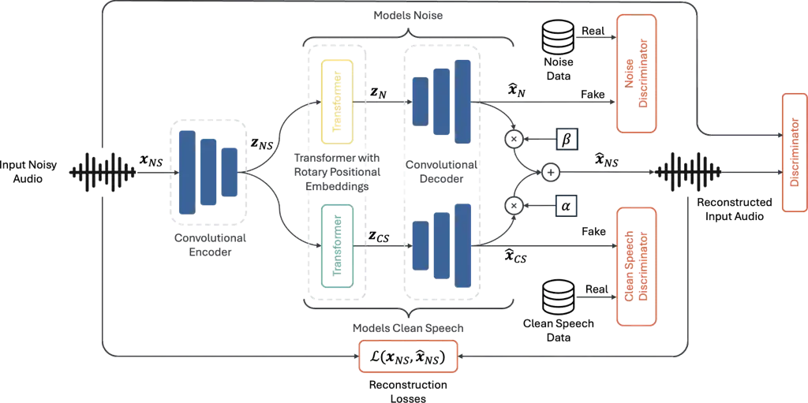
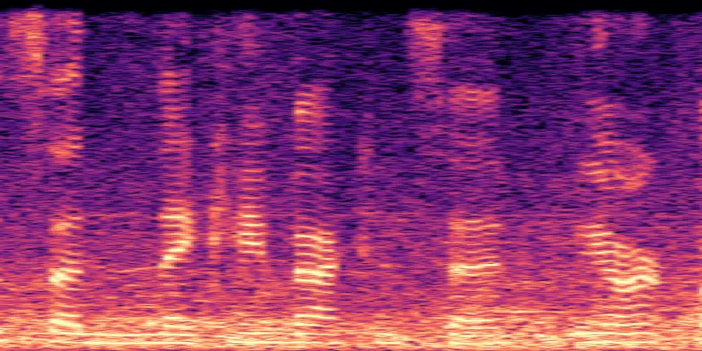
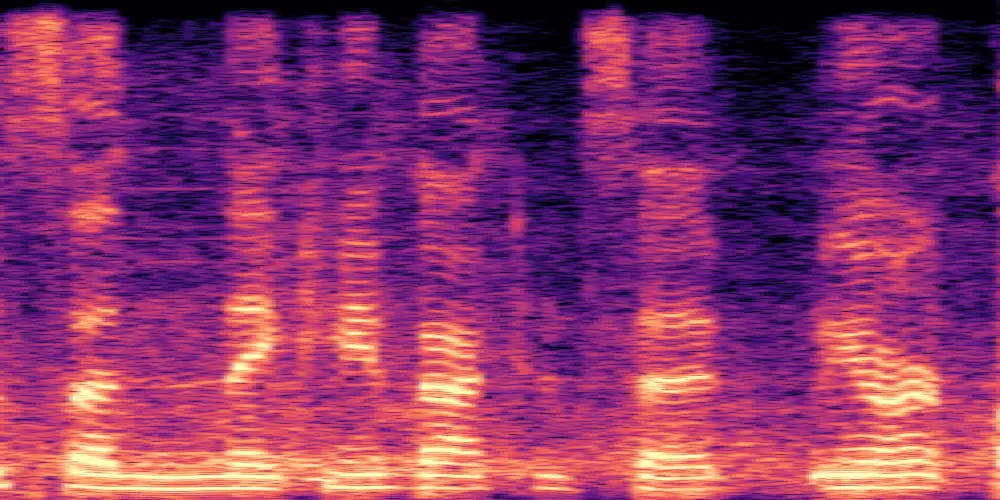
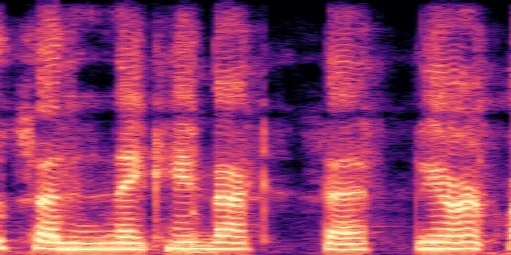

# Unsupervised Speech Enhancement using Data-defined Priors

Dominik Klement    Matthew Maciejewski    Sanjeev Khudanpur    Jan
Černocký    Lukáš Burget

###### Abstract

The majority of deep learning-based speech enhancement methods require
paired clean-noisy speech data. Collecting such data at scale in
real-world conditions is infeasible, which has led the community to rely
on synthetically generated noisy speech. However, this introduces a gap
between the training and testing phases. In this work, we propose a
novel dual-branch encoder-decoder architecture for unsupervised speech
enhancement that separates the input into clean speech and residual
noise. Adversarial training is employed to impose priors on each branch,
defined by unpaired datasets of clean speech and, optionally, noise.
Experimental results show that our method achieves performance
comparable to leading unsupervised speech enhancement approaches.
Furthermore, we demonstrate the critical impact of clean speech data
selection on enhancement performance. In particular, our findings reveal
that performance may appear overly optimistic when in-domain clean
speech data are used for prior definition—a practice adopted in previous
unsupervised speech enhancement studies.

###### Index Terms:

Speech Enhancement, Unsupervised Learning, Deep Learning, Generative
Adversarial Networks

^(†)^(†)address: ¹Speech@FIT, Brno University of Technology, Czech
Republic,  
²CLSP & ³HLTCOE, Johns Hopkins University, USA

## 1 Introduction

Speech Enhancement (SE) seeks to recover the underlying clean speech
given an observed noisy signal, corrupted by environmental noise,
reverberation or transmission, by suppressing the noise and preserving
as much speech information as possible. With the advent of deep
learning, the community has focused on building SE systems based on deep
neural networks (DNN) \[1, 2, 3, 4\]. These models are trained in a
supervised fashion, requiring paired corpora of noisy and clean speech.
However, collecting such data in reality is impractical at scale .
Hence, the community has been utilizing artificially simulated data¹¹ 1
Clean speech summed with noise and reverberated. This approach, however,
introduces a mismatch between the training and test phase, as the model
never sees the real noisy recordings during training.

To address it, unsupervised approaches have been recently studied.
Fujimura et al. \[5\] introduced noisy-target training (NyTT) paradigm,
consisting of adding one more source of noise to already noisy
recording. Albeit allowing the use of real noisy data, the input is
still artificial, not addressing the aforementioned mismatch between
train and test time. Furthermore, MetricGAN-U \[6\] was proposed as an
extension to the previously introduced MetricGAN \[3\] approach, where
discriminator output is forced to correlate with a black-box
non-intrusive metric DNSMOS \[7\], which was recently extended in
MOS-GAN \[8\]. On one hand, this family of methods does not require any
clean speech data, on the other hand, the model performance is tied to
the performance of the external models (e.g., DNSMOS) used to guide the
training. To achieve better performance, one would need to re-train
DNSMOS-like models, which is costly.

In contrast, unsupervised SE methods that require clean speech but do
not require paired clean and noisy speech overcome these limitations.
These methods usually use clean speech data as priors — i.e., defining
how the clean speech sounds like. Jiang et al. introduced unSE \[9\] and
unSE+ \[10\], a method that uses a discriminator to enforce the clean
speech prior and computes reconstruction losses between the generated
clean speech and the input noisy speech to ensure consistency. Despite
the impressive results, optimizing a reconstruction loss between the
generated clean speech and the input noisy speech requires careful
tuning to prevent the model from reconstructing the input.

In this work, we propose a novel dual-branch encoder-decoder
architecture for unsupervised SE. Our architecture consists of two
branches, which output clean speech and noise. We use adversarial
training to impose branch-specific priors, and reconstruction losses
between the noisy input and the combination of the two branches to
ensure clean speech consistency. Therefore, there is less tension
between the reconstruction and the adversarial training. Also, compared
to the previous approaches, parallel branches allow general source
separation of more than two distinct sources by adding more branches and
utilizing source-specific data (e.g., piano music for instrument
separation), which is left as a future work.

We perform experiments to show how our method compares to the prior work
and to show the importance of the discriminators. Furthermore, we show
that initializing the model from a pre-trained neural audio codec (NAC)
\[11\] not only improves the convergence rate but also the performance
of the enhancement model. Lastly, we show how important is the choice of
the clean speech data and how one needs to be careful when selecting it
in order to achieve the best performance. The codebase is released on
GitHub ²² 2
[https://github.com/BUTSpeechFIT/USE_DDP](https://github.com/BUTSpeechFIT/USE_DDP).

## 2 Proposed Method



Figure 1: Diagram of the proposed dual-brach architecture.

The proposed method is illustrated in Figure 1. It is an
adversarially-trained model consisting of a generator and a set of
discriminators. The generator is an encoder-decoder architecture that
performs audio reconstruction task, similar to NAC. Internally, the
proposed method consists of two branches that output clean speech and
noise audio. The combination of the two audio signals is forced to
reconstruct the input. To force the model to separate the input into two
distinct source signals, we use adversarial training with
source-specific discriminators to impose prior distributions on each
branch. To train each discriminator, we use two independent corpora —
clean speech and noise, defining how branch-specific outputs should
sound.

### 2.1 Generator Architecture

Let $`\mathbf{x}_{NS}\in\mathbb{R}^{T}`$ be a noisy input audio of
length $`T`$ samples. First, a convolutional encoder $`E`$ is applied to
map the noisy input to a latent representation
$`\mathbf{z}_{NS}=E(\mathbf{x}_{NS})\in\mathbb{R}^{L\times M}`$, where
$`L`$ is the latent sequence length and $`M`$ is the latent space
dimensionality. Subsequently, the latent representation is split into
two parallel branches and transformer with rotary positional embeddings
(RoFormer)³³ 3 Positional information is important for model
convergence. \[12\] is applied, enabling each branch to capture distinct
information. As a result, we obtain latent sequences
$`\mathbf{z}_{N}=\mathcal{R}_{N}(\mathbf{z}_{NS}),\mathbf{z}_{CS}=\mathcal{R}_{CS}(\mathbf{z}_{NS})\in\mathbb{R}^{L\times M}`$,
representing noise and clean latent representations respectively. Next,
each branch is decoded back to the time domain using a single shared
decoder $`Dec`$, resulting in
$`\hat{\mathbf{x}}_{N}=Dec(\mathbf{z}_{N}),\hat{\mathbf{x}}_{CS}=Dec(\mathbf{z}_{CS})\in\mathbb{R}^{T}`$.
Finally, the reconstructed noisy input is a combination of the two audio
signals:

```math
\displaystyle\hat{\mathbf{x}}_{NS}=\alpha^{*}\hat{\mathbf{x}}_{N}+\beta^{*}\hat{\mathbf{x}}_{CS}, \tag{1}
```

```math
\displaystyle\alpha^{*},\beta^{*}=\mathop{\mathrm{arg\,min}}\limits_{\alpha,\beta}\left\lVert\mathbf{x}_{NS}-(\alpha\hat{\mathbf{x}}_{N}+\beta\hat{\mathbf{x}}_{CS})\right\rVert_{2}^{2} \tag{2}
```

where $`\alpha^{*},\beta^{*}\in\mathbb{R}`$ are scalar weights
accounting for errorneous amplitude estimation⁴⁴ 4 We do not want to
penalize the model for incorrectly estimating the amplitude, as it does
not change the audio itself.. The optimal values are obtained from a
closed-from solution to the convex optimization problem defined above.
In the following text, we will use
$`\hat{\mathbf{x}}_{CS}=G_{CS}(\mathbf{x}_{NS}),\hat{\mathbf{x}}_{N}=G_{N}(\mathbf{x}_{NS}),\hat{\mathbf{x}}_{NS}=G_{NS}(\mathbf{x}_{NS})\in\mathbb{R}^{T}`$
to denote the generated clean speech, noise, and noisy input signal,
respectively.

### 2.2 Adversarial Training

Let $`\mathbb{P}_{CS}`$ and $`\mathbb{P}_{N}`$ be the prior
distributions of real clean speech and noise, respectively, and
$`\mathbb{P}_{NS}`$ be the distribution of the noisy input. Our goal is
to train the model such that
$`p(\hat{\mathbf{x}}_{CS})\approx\mathbb{P}_{CS}`$ and
$`p(\hat{\mathbf{x}}_{N})\approx\mathbb{P}_{N}`$. It has been shown by
Goodfellow et al. \[13\] that if the generator and the discriminator
have enough capacity, the distribution of the generated samples
converges to the distribution of the real data. In our setup, we use
three discriminators $`D_{CS},D_{N},D_{NS}`$, for clean speech, noise,
and noisy speech, respectively. Each discriminator is an ensamble of
multiple sub-discriminators (described in Section 3.1); however, we omit
the summation of losses across the particular sub-discriminators for
clarity. While the first two discriminators impose priors on the
distributions of branch-wise output signals, the noisy speech one has
the same role as in NACs — i.e., improve fidelity of the reconstructed
audio. Instead of the vanilla GAN setup \[13\], we use LS-GAN loss
\[14\]. The discriminators are trained using the following loss
function:

```math
\displaystyle\mathcal{L}_{D_{CS}}=\mathbb{E}_{\begin{subarray}{c}\mathbf{x}_{CS}\sim\mathbb{P}_{CS},\mathbf{x}_{NS}\sim\mathbb{P}_{NS}\end{subarray}}\big[ \displaystyle D_{CS}(G_{CS}(\mathbf{x}_{NS}))^{2} \tag{3}
```

```math
\displaystyle+(1-D_{CS}(\mathbf{x}_{CS}))^{2}\big].
```

$`\mathcal{L}_{D_{N}}`$ is defined analogously using $`D_{N}`$ and
$`\mathbb{P}_{N}`$. For input reconstruction, we train the noisy speech
discriminator $`D_{NS}`$ using the same loss function but only one data
distribution:

```math
\displaystyle\mathcal{L}_{D_{NS}}=\mathbb{E}_{\begin{subarray}{c}\mathbf{x}_{NS}\sim\mathbb{P}_{NS}\end{subarray}}\big[D_{NS}(\hat{\mathbf{x}}_{NS})^{2}+(1-D_{NS}(\mathbf{x}_{Ns}))^{2}\big]. \tag{4}
```

### 2.3 Generator Losses

We follow the general NAC training \[11, 15\] to train the generator for
audio reconstruction task. We use multi-scale mel spectrogram loss
\[11\] and SI-SDR loss \[16\], and denote their combination as
$`\mathcal{L}_{rec}(\mathbf{x}_{NS})`$ in the following text. In
addition to reconstruction losses, we use adversarial loss and feature
matching loss \[15\] to increase the fidelity of the generated noisy
speech audio:

```math
\hskip-1.0pt\mathcal{L}_{feat}(\mathbf{x}_{NS},\hat{\mathbf{x}}_{NS})=\sum_{k=1}^{K_{D}}\sum_{l=1}^{M_{k}-1}\left\lVert F_{k,l}(\mathbf{x}_{NS})-F_{k,l}(\hat{\mathbf{x}}_{NS})\right\rVert_{1},\vskip-2.0pt \tag{5}
```

where $`K_{D}`$ is the number of sub-discriminators, $`M_{k}`$ is the
number of convolutional layers in $`k`$-th sub-discriminator, and
$`F_{k,l}`$ denotes a convolutional feature map.

As we do not have reference for the corresponding clean speech and
noise, we only use adversarial losses to learn the source separation,
defined as:

```math
\mathcal{L}_{G_{CS}}(\mathbf{x}_{NS})=\mathbb{E}_{\begin{subarray}{c}\mathbf{x}_{NS}\sim\mathbb{P}_{NS}\end{subarray}}[(1-D_{CS}(G_{CS}(\mathbf{x}_{NS})))^{2}],\vskip-5.0pt \tag{6}
```

where $`\mathcal{L}_{G_{N}}`$ and $`\mathcal{L}_{G_{NS}}`$ are defined
analogously.

To stabilize the training and avoid trivial mode collapse⁵⁵ 5 A scenario
where clean speech becomes silence and the entire noisy input is
reconstructed through the noise branch., we add a regularization loss
that maximizes the energy of the generated clean speech audio signal,
defined as:

```math
\mathcal{L}_{emax}(\mathbf{x}_{NS})=-\log\left(\frac{1}{T}\sum_{i=1}^{T}G_{CS}(\mathbf{x}_{NS})[i]^{2}\right), \tag{7}
```

where $`G_{CS}(\mathbf{x}_{NS})[i]`$ denotes $`i`$-th clean speech
signal sample.

The overall generator loss function is a weighted sum of the noisy
reconstruction and adversarial losses, and branch-specific adversarial
losses, defined as:

```math
\displaystyle\mathcal{L}_{G} \displaystyle=\lambda_{gcs}\mathcal{L}_{G_{CS}}+\lambda_{gn}\mathcal{L}_{G_{N}}+\lambda_{gns}\mathcal{L}_{G_{NS}}+\lambda_{feat}\mathcal{L}_{feat} \tag{8}
```

```math
\displaystyle+\lambda_{rec}\mathcal{L}_{rec}+\lambda_{emax}\mathcal{L}_{emax}.
```

### 2.4 Why does it work?

Adversarial training with branch-specific discriminators constrains each
branch to follow the distribution defined by the corresponding data,
i.e., $`p(\hat{\mathbf{x}}_{CS})\approx\mathbb{P}_{CS}`$ and
$`p(\hat{\mathbf{x}}_{N})\approx\mathbb{P}_{N}`$. Simultaneously, the
combination of the two outputs must reconstruct the original noisy
input. This dual constraint prevents the clean speech branch from
generating arbitrary clean speech solely to satisfy the adversarial
objective, as such signal would increase the reconstruction loss.
Consequently, the clean branch is compelled to generate an enhanced
version of the noisy input—one that both aligns with the clean speech
prior and contributes to accurate input reconstruction.

## 3 Experimental Setup

### 3.1 Model

We built the model architecture on top of the Descript Audio Codec (DAC)
\[15\]. The encoder contains four residual blocks with downsampling
factors $`[2,4,5,8]`$, resulting in 320 downsampling ratio (50Hz for
16kHz input) and 1024-dimensional embeddings. The decoder mirrors the
encoder. Furthermore, each branch contains a transformer with 8 layers,
8 attention heads, and feed-forward dimensionality of 1536. If not
specified otherwise, we initialize the encoder and decoder weights from
a pre-trained DAC.

We use three discriminator ensembles. The noisy input reconstruction
one, $`D_{NS}`$, exactly follows the DAC setup \[15\]—multi-period (MPD)
with periods $`[2,3,5,7,11]`$ and multi-band multi-scale STFT (MS-STFT)
discriminator with 5 bands, STFT window sizes $`[2048,1024,512]`$, hop
length $`\frac{1}{4}`$ of the window size, and 32 convolution filters .
For the branch-specific discriminators that define speech and noise
priors, we use a single-band MS-STFT discriminator, as we observed that
using MPD did not improve the performance, with STFT window sizes
$`[2048,1024,512,256,128]`$ and 128 convolution filters.

### 3.2 Training

We optimize our models using AdamW \[17\] with weight decay of
$`0.02`$.. We train all models for up to 50k iterations, each consisting
of first updating the discriminator and then the generator. The learning
rate (LR) is linearly warmed up for 5k iterations, achieving peak LR
2e-4, and then decayed according to the cosine scheduler throughout the
rest of the training. We use gradient clipping of 1.0 and mixed
precision training in bfloat16. The best-performing model is selected
based on the validation set.

### 3.3 Data

We focus on 16kHz sampling rate and all the datasets are resampled
before processing. For the comparison with prior work and clean speech
prior selection experiments, we use VCTK+Demand (VD) \[18\] subset
containing 28 speakers for training (out of which two speakers are
reserved for validation), and the standard 2 speakers test set. For the
ablations, in order to not base our architectural decisions on a small
dataset, we utilize URGENT challenge Task1 \[19\] data setup consisting
of multiple speech and noise corpora, where we randomly select 1000
utterances for validation. The test set consists of 2368 recordings
simulated from per-corpora test sets⁶⁶ 6 We only use reverberation and
noise, compared to the URGENT challenge where other types of distortions
were used.. To show the performance on real noisy data and to further
explore the clean speech prior data selection, we use CHIME-3 \[20\]
dataset, comprised of pre-defined train, validation, and test splits.

During training, we always use the noise corpora defined by the URGENT
challenge. For clean speech, we use the VD clean train set to be
comparable with prior work, even though it does not resemble the
conditions the model is going to be exposed to during real noisy data
training (i.e., prior mismatch between the clean speech data and the
underlying clean speech the model is trained to estimate). To address
this problem, we explore the clean speech prior data selection, where we
use the URGENT clean speech data setup without VCTK to simulate
out-of-domain clean speech data.

### 3.4 Metrics

To evaluate the model performance and compare to prior works, we follow
the setups defined in \[6, 9\] and use DNSMOS \[7\] to judge the quality
of the enhanced speech (cleanliness), PESQ \[21\] to evaluate perceptual
speech quality, and CSIG, CBAK, COVL (based on PESQ) \[22\] to obtain a
predicted MOS for: speech, background noise, and overall speech quality.
For real noisy data evaluations and clean speech prior data selection
experiments, we use DNSMOS \[7\] and UTMOS \[23\].

## 4 Results

### 4.1 Comparison to Prior Work

We compare our method to previously published methods using the VD
dataset and use the VCTK clean speech for adversarial training to be
comparable to the prior approaches. We acknowledge that this setup leads
to over-optimistic results; therefore, we explore on out-of-domain clean
speech data later in Section 4.4.

| Model               | DNSMOS$`\uparrow`$ | PESQ$`\uparrow`$ | CSIG$`\uparrow`$ | CBAK$`\uparrow`$ | COVL$`\uparrow`$ |
| ------------------- | ------------------ | ---------------- | ---------------- | ---------------- | ---------------- |
| Input Speech        | 2.54               | 1.97             | 3.35             | 2.44             | 2.63             |
| NyTT \[24\]         | \-                 | 2.30             | 3.19             | 3.01             | 2.72             |
| MGAN-U (half) \[6\] | 2.89               | 2.45             | 3.47             | 2.63             | 2.91             |
| MGAN-U (full) \[6\] | 3.15               | 2.13             | 3.22             | 2.42             | 2.63             |
| MOS-GAN \[8\]       | 2.91               | 2.40             | \-               | \-               | \-               |
| unSE \[9\]          | 2.92               | 2.45             | 3.69             | 3.05             | 3.05             |
| unSE+ \[10\]        | 2.94               | 2.48             | 3.31             | 3.07             | 2.85             |
| Ours                | 3.03               | 2.47             | 3.54             | 2.35             | 2.99             |

Table 1: Comparison of our unsupervised models with prior work.

Table 1 shows that all methods outperform the input noisy speech,
suggesting they are capable of enhancing the noisy speech. Our method
outperforms all but MetricGAN-U (full) in terms of DNSMOS; however, the
full model used DNSMOS during training, which strenghtens its DNSMOS
performance. Furthermore, our method achieves the second best results in
PESQ, CSIG and COVL, suggesting the quality of the enhanced speech is
similar or better than unSE—a method our model is the most comparable
to. Lastly, despite the good enhancement performance, the audio
sometimes contains some noise or noisy artifact, which is reflected in
lower CBAK. Overall, the fairest baselines are unSE and unSE+, which our
method performs on par with.

### 4.2 Initialization

Table 2 compares the performance of our method when the encoder and the
decoder are initialized from a pre-trained NAC and when trained from
scratch. It can be seen that initializing from a pre-trained NAC
improves the performance as the encoder already produces meaningful
general audio latent representations that branch-wise transformers learn
early to separate. Also, the model converges faster, requiring around 3x
less training iterations.

| Init Method      | DNSMOS $`\uparrow`$ | PESQ $`\uparrow`$ | CSIG $`\uparrow`$ | CBAK $`\uparrow`$ | COVL $`\uparrow`$ |
| ---------------- | ------------------- | ----------------- | ----------------- | ----------------- | ----------------- |
| From scratch     | 2.28                | 1.41              | 2.08              | 1.44              | 1.66              |
| Pretrained (NAC) | 2.60                | 1.45              | 2.13              | 1.79              | 1.70              |

Table 2: Comparison of encoder and decoder initialization methods.

### 4.3 Discriminator Ablations

We investigate whether all three discriminators are required for optimal
performance. The results are reported in Table 3. When all
discriminators are employed, the model achieves the highest scores in
DNSMOS, CSIG, and CBAK. However, performance in PESQ and COVL is
slightly lower compared to the model without the noise discriminator.
This indicates that using all discriminators generally yields cleaner
audio, but in some cases leads to excessive suppression. The underlying
reason is that the noise discriminator enables the system to estimate
noise more accurately, particularly in non-speech segments.
Consequently, the clean speech branch is encouraged, through the
reconstruction loss, to attenuate noise more aggressively in these
regions, which occasionally results in partial suppression of the speech
signal.

Furthermore, removing the noisy speech discriminator slightly reduces
the perceptual quality of the enhanced speech. This discriminator plays
an important role in ensuring that the reconstructed input audio
maintains naturalness and fidelity, which impacts the clean speech
branch as well. Without it, the enhanced speech often lacks
high-frequency details, making the audio sound less natural and
degraded.

| Discriminators | DNSMOS $`\uparrow`$ | PESQ $`\uparrow`$ | CSIG $`\uparrow`$ | CBAK $`\uparrow`$ | COVL $`\uparrow`$ |
| -------------- | ------------------- | ----------------- | ----------------- | ----------------- | ----------------- |
| all            | 2.60                | 1.45              | 2.13              | 1.79              | 1.70              |
| -noise         | 2.46                | 1.48              | 2.13              | 1.73              | 1.72              |
| -noise & noisy | 2.52                | 1.43              | 2.05              | 1.72              | 1.66              |

Table 3: Comparison of discriminators employed during training. The
first row shows the model with all discriminators, the second one
without the noise discriminator, and the last one only with the clean
speech discriminator.

### 4.4 Prior Selection

The clean speech data pool dictates how clean speech sounds. In this
section, we explore how the data choice affects the model performance
and how over-promising the performance may seem if in-domain clean
speech data are used. In our experiments, we refer to data that either
match the underlying clean speech data the model is trained to estimate
(in the case of simulated data) or significantly correlate with the
noisy speech data (e.g., close talk microphone) as in-domain.

| CS Prior      | DNSMOS $`\uparrow`$ | PESQ $`\uparrow`$ | CSIG $`\uparrow`$ | CBAK $`\uparrow`$ | COVL $`\uparrow`$ |
| ------------- | ------------------- | ----------------- | ----------------- | ----------------- | ----------------- |
| in-domain     | 3.03                | 2.47              | 3.54              | 2.35              | 2.99              |
| out-of-domain | 2.86                | 2.04              | 2.60              | 2.06              | 2.27              |

Table 4: Comparison of indomain and out-of-domain clean speech data when
trained on VCTK+Demand dataset.

Table 4 shows the clean speech prior comparison on VD. It can be seen
that using an in-domain clean speech prior VCTK clean train set
significantly outperforms the out-of-domain prior constructed from the
URGENT clean speech pool not containing VCTK. This is mainly due to the
distribution mismatch, allowing noise to leak into the clean speech
branch. Since we do not have the ground-truth clean speech available
when training on real noisy data, we consider using the in-domain prior
for data-driven SE as unfair, as it significantly biases the model
performance compared to the training scenario where in-domain clean
speech data are unavailable.

| CS Prior      | Dev                 |                    | Test                |                    |
| ------------- | ------------------- | ------------------ | ------------------- | ------------------ |
|               | DNSMOS $`\uparrow`$ | UTMOS $`\uparrow`$ | DNSMOS $`\uparrow`$ | UTMOS $`\uparrow`$ |
| in-domain     | 2.13                | 1.79               | 2.01                | 1.50               |
| out-of-domain | 2.98                | 2.43               | 2.79                | 1.85               |

Table 5: Comparison of in-domain and out-of-domain clean speech data
when trained on CHiME-3 dataset.

Furthermore, Table 5 performs similar comparison on CHiME-3 real data,
where we use channel 0 (close talk microphone) as the in-domain clean
speech and the URGENT clean speech as the out-of-domain one. We can see
the opposite effect compared to Table 4, as the in-domain data are
recorded in noisy environment using a close-talk microphone, resulting
in a noisy “clean speech“ prior. Therefore, the model leaks more noise
to the signal compared to the out-of-domain prior, which contains only
clean speech (see Figure 2). However, due to the prior mismatch, the
model tends to oversupress the noise at the expense of intelligibiliy.

|                                                             |                                                               |                                                               |
| ----------------------------------------------------------- | ------------------------------------------------------------- | ------------------------------------------------------------- |
|  |    |    |

Figure 2: CHiME-3 noisy, enhanced using in-domain and out-of-domain
clean speech priors, respectively.

## 5 Conclusion

This work introduced a novel dual-branch encoder-decoder architecture
for unsupervised speech enhancement, able to be trained on real noisy
data. Compared to the MOS-based approaches, our approach relies solely
on data and does not require any external model to guide the training.
Our experiments show that the method is comparable to the top-performing
prior unsupervised SE works. Furthermore, we pointed out the importance
of the clean speech data selection and how it might mislead the
performance evaluation. In the future, we plan to extend the method to
unsupervised multi-source separation and investigate discriminator
architecture to strengthen the priors and improve the robustness.

## 6 Acknowledgments

This work was partially supported by NSF CCRI Grant No 2120435 and
corporate gifts to Johns Hopkins University for JSALT 2025. Computing on
IT4I supercomputer was supported by MoE through the e-INFRA CZ
(ID:90254).

## References

- \[1\] Yong Xu, Jun Du, Lei Dai, and Chin-Hui Lee, “A regression
  approach to speech enhancement based on deep neural networks,” in
  IEEE/ACM Transactions on Audio, Speech, and Language Processing. IEEE,
  2014, vol. 23, pp. 7–19.
- \[2\] Se Rim Park and Jong Moo Lee, “A fully convolutional neural
  network for speech enhancement,” in Interspeech, 2017, pp. 1993–1997.
- \[3\] Szu-Wei Fu, Yu Tsao, Xugang Lu, and Hideki Kawai, “MetricGAN:
  Generative adversarial networks based black-box metric scores
  optimization for speech enhancement,” in International Conference on
  Machine Learning. PMLR, 2019, pp. 2031–2041.
- \[4\] Santiago Pascual, Antonio Bonafonte, and Joan Serrà, “SEGAN:
  Speech enhancement generative adversarial network,” 2017.
- \[5\] Takuya Fujimura, Yuma Koizumi, Kohei Yatabe, and Ryoichi
  Miyazaki, “Noisy-target training: A training strategy for DNN-based
  speech enhancement without clean speech,” in 2021 29th European Signal
  Processing Conference (EUSIPCO), 2021, pp. 436–440.
- \[6\] Szu-Wei Fu, Cheng Yu, Kuo-Hsuan Hung, Mirco Ravanelli, and Yu
  Tsao, “MetricGAN-U: Unsupervised speech enhancement/ dereverberation
  based only on noisy/ reverberated speech,” in ICASSP 2022 - 2022 IEEE
  International Conference on Acoustics, Speech and Signal Processing
  (ICASSP), 2022, pp. 7412–7416.
- \[7\] Chandan K A Reddy, Vishak Gopal, and Ross Cutler, “DNSMOS: A
  non-intrusive perceptual objective speech quality metric to evaluate
  noise suppressors,” 2021.
- \[8\] Wenbin Jiang, Fei Wen, and Kai Yu, “MOS-GAN: Mean opinion score
  GAN for unsupervised speech enhancement,” IEEE Signal Processing
  Letters, pp. 1–5, 2025.
- \[9\] Wenbin Jiang, Fei Wen, Yifan Zhang, and Kai Yu, “UnSE:
  Unsupervised speech enhancement using optimal transport,” in
  INTERSPEECH 2023, ISCA, Aug. 2023, pp. 4029–4033, ISCA.
- \[10\] Wenbin Jiang, Kai Yu, and Fei Wen, “Unsupervised speech
  enhancement using optimal transport and speech presence probability,”
  IEEE/ACM Transactions on Audio, Speech, and Language Processing, vol.
  32, pp. 4445–4455, 2024.
- \[11\] Alexandre Défossez, Jade Copet, Gabriel Synnaeve, and Yossi
  Adi, “High fidelity neural audio compression,” Transactions on Machine
  Learning Research, 2023, Featured Certification, Reproducibility
  Certification.
- \[12\] Jianlin Su, Murtadha Ahmed, Yu Lu, Shengfeng Pan, Wen Bo, and
  Yunfeng Liu, “RoFormer: Enhanced transformer with rotary position
  embedding,” Neurocomputing, vol. 568, pp. 127063, 2024.
- \[13\] Ian J Goodfellow, Jean Pouget-Abadie, Mehdi Mirza, Bing Xu,
  David Warde-Farley, Sherjil Ozair, Aaron Courville, and Yoshua Bengio,
  “Generative adversarial nets,” Advances in neural information
  processing systems, vol. 27, 2014.
- \[14\] Xudong Mao, Qing Li, Haoran Xie, Raymond Y. K. Lau, Zhen Wang,
  and Stephen Paul Smolley, “Least squares generative adversarial
  networks,” in IEEE International Conference on Computer Vision, ICCV
  2017, Venice, Italy, October 22-29, 2017. 2017, pp. 2813–2821, IEEE
  Computer Society.
- \[15\] Rithesh Kumar, Prem Seetharaman, Alejandro Luebs, Ishaan Kumar,
  and Kundan Kumar, “High-fidelity audio compression with improved
  RVQGAN,” 2023.
- \[16\] Jonathan Le Roux, Scott Wisdom, Hakan Erdogan, and John R.
  Hershey, “SDR – half-baked or well done?,” in ICASSP 2019 - 2019 IEEE
  International Conference on Acoustics, Speech and Signal Processing
  (ICASSP), 2019, pp. 626–630.
- \[17\] Ilya Loshchilov and Frank Hutter, “Decoupled weight decay
  regularization,” in International Conference on Learning
  Representations, 2017.
- \[18\] Cassia Valentini-Botinhao, “Noisy speech database for training
  speech enhancement algorithms and TTS models,” 2017.
- \[19\] Wangyou Zhang, Robin Scheibler, Kohei Saijo, Samuele Cornell,
  Chenda Li, Zhaoheng Ni, Jan Pirklbauer, Marvin Sach, Shinji Watanabe,
  Tim Fingscheidt, and Yanmin Qian, “URGENT challenge: Universality,
  robustness, and generalizability for speech enhancement,” in
  Interspeech 2024. Sept. 2024, interspeech_2024, p. 4868–4872, ISCA.
- \[20\] Jon Barker, Ricard Marxer, Emmanuel Vincent, and Shinji
  Watanabe, “The third ’CHiME’ speech separation and recognition
  challenge: Dataset, task and baselines,” in 2015 IEEE Workshop on
  Automatic Speech Recognition and Understanding (ASRU), 2015, pp.
  504–511.
- \[21\] A. W. Rix, J. G. Beerends, M. P. Hollier, and A. P. Hekstra,
  “Perceptual evaluation of speech quality (PESQ)-a new method for
  speech quality assessment of telephone networks and codecs,” in
  Proceedings of the Acoustics, Speech, and Signal Processing, 200. on
  IEEE International Conference - Volume 02, USA, 2001, ICASSP ’01, p.
  749–752, IEEE Computer Society.
- \[22\] Yi Hu and Philipos C. Loizou, “Evaluation of objective quality
  measures for speech enhancement,” IEEE Transactions on Audio, Speech,
  and Language Processing, vol. 16, no. 1, pp. 229–238, 2008.
- \[23\] Takaaki Saeki, Detai Xin, Wataru Nakata, Tomoki Koriyama,
  Shinnosuke Takamichi, and Hiroshi Saruwatari, “UTMOS: UTokyo-SaruLab
  system for voiceMOS challenge 2022,” 2022.
- \[24\] Takuya Fujimura and Tomoki Toda, “Analysis of noisy-target
  training for DNN-based speech enhancement,” in ICASSP 2023 - 2023 IEEE
  International Conference on Acoustics, Speech and Signal Processing
  (ICASSP), 2023, pp. 1–5.
