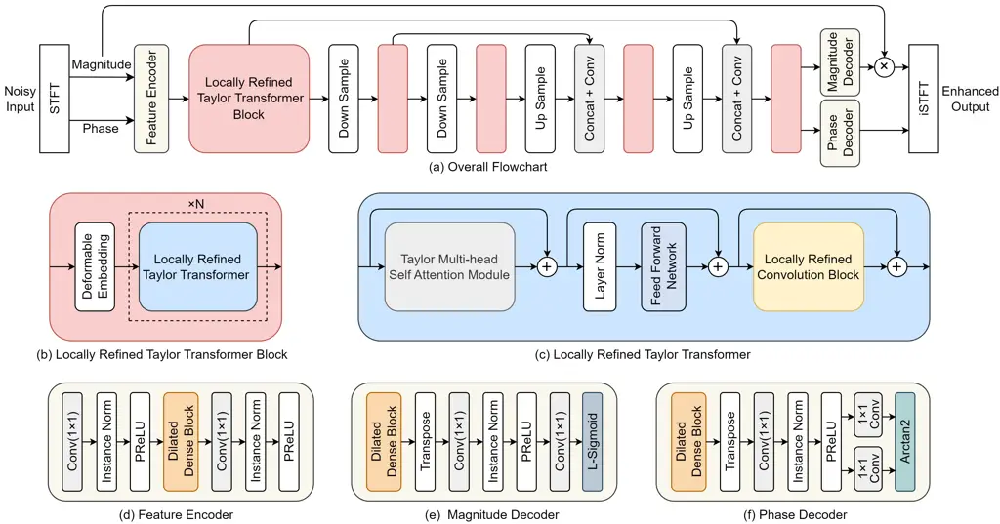
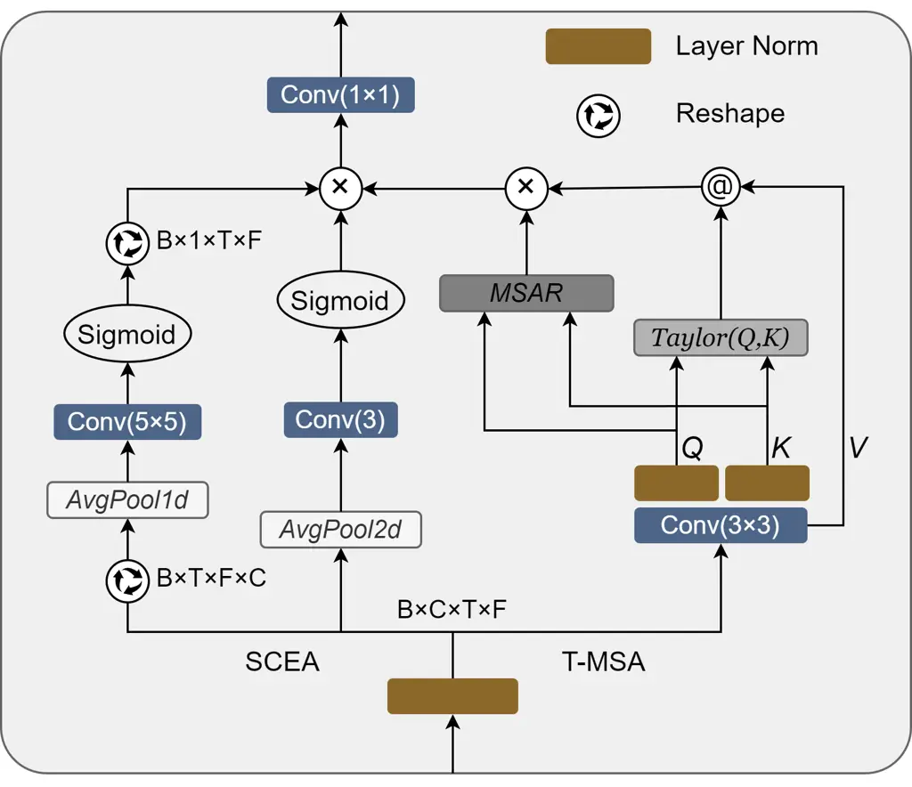
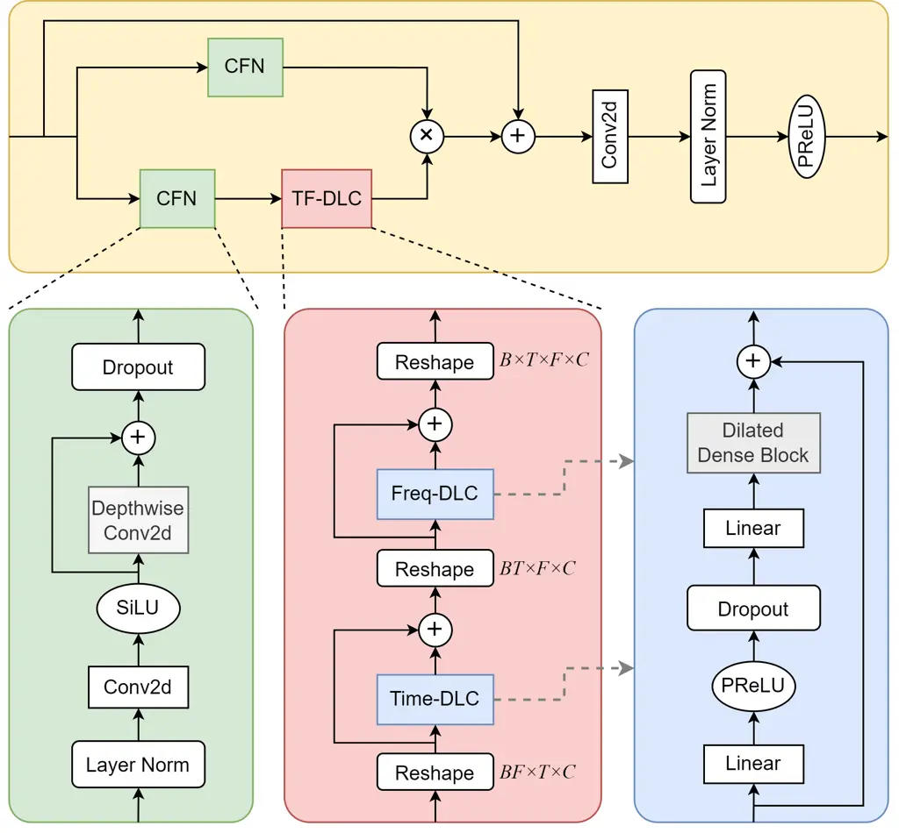

# LORT: Locally Refined Convolution and Taylor Transformer for Monaural Speech Enhancement

Journal: Speech Communication, \* is Corresponding author, E-mail
addresses: longbiao_wang@tju.edu.cn (L. Wang)

Junyu Wang¹, Zizhen Lin², Tianrui Wang¹, Meng Ge¹, Longbiao
Wang^(1,3,∗), Jianwu Dang⁴ Address: ¹Tianjin Key Laboratory of Cognitive
Computing and Application, College of Intelligence and Computing,
Tianjin University, Tianjin, China  
²School of Electronic Information, Sichuan University, Sichuan, China  
³Huiyan Technology (Tianjin) Co., Ltd, Tianjin, China  
⁴Shenzhen Institute of Advanced Technology, Chinese Academy of Sciences,
China

###### Abstract

Achieving superior enhancement performance while maintaining a low
parameter count and computational complexity remains a challenge in the
field of speech enhancement. In this paper, we introduce LORT, a novel
architecture that integrates spatial-channel enhanced Taylor Transformer
and locally refined convolution for efficient and robust speech
enhancement. We propose a Taylor multi-head self-attention (T-MSA)
module enhanced with spatial-channel enhancement attention (SCEA),
designed to facilitate inter-channel information exchange and alleviate
the spatial attention limitations inherent in Taylor-based Transformers.
To complement global modeling, we further present a locally refined
convolution (LRC) block that integrates convolutional feed-forward
layers, time-frequency dense local convolutions, and gated units to
capture fine-grained local details. Built upon a U-Net-like
encoder-decoder structure with only 16 output channels in the encoder,
LORT processes noisy inputs through multi-resolution T-MSA modules using
alternating downsampling and upsampling operations. The enhanced
magnitude and phase spectra are decoded independently and optimized
through a composite loss function that jointly considers magnitude,
complex, phase, discriminator, and consistency objectives. Experimental
results on the VCTK+DEMAND and DNS Challenge datasets demonstrate that
LORT achieves competitive or superior performance to state-of-the-art
(SOTA) models with only 0.96M parameters, highlighting its effectiveness
for real-world speech enhancement applications with limited
computational resources.

###### Keywords: 

speech enhancement, transformer, attention, locally refined convolution,
u-net

## 1 Introduction

Speech enhancement is a key technology in speech processing, designed to
improve the clarity and intelligibility of speech signals in noisy
environments. Its applications span critical domains such as
telecommunication systems, hearing aids, automatic speech recognition
(ASR), and multimedia production. By separating target speech from
environmental noise, speech enhancement ensures reliable communication
in challenging scenarios, including aircraft cockpits, emergency
response systems, and smart home devices.

The core objective of speech enhancement is to recover clean speech from
noisy observations while preserving its spectral-temporal
characteristics. Generally, this process can be broadly categorized into
time-domain and time-frequency (T-F) domain approaches. Time-domain
speech enhancement use techniques such as adaptive filtering to directly
process the raw speech signal (Pascual et al., 2017; Luo and Mesgarani,
2019; Wang, 2023b). Advantages include computational efficiency and
phase preservation, but can be limited in non-stationary noise
environments due to fixed filter coefficients. T-F domain methods
convert the signal into T-F representations by short-time Fourier
transform (STFT) to analyze the magnitude and phase components
separately (Fu et al., 2019; Yin et al., 2020). This approach achieves
noise suppression by exploiting frequency characteristics, but
introduces the challenge of phase distortion.

Traditional speech enhancement approaches have primarily relied on
statistical signal processing techniques. A seminal work in this field
is the MMSE estimator developed by (Ephraim and Malah, 1985), which
performs clean speech spectrum estimation based on Gaussian distribution
assumptions of both speech and noise signals. Although the MMSE
algorithm demonstrates satisfactory performance in stationary noise
environments, its effectiveness is constrained by the accuracy of a
prior signal-to-noise ratio (SNR) estimation, often leading to musical
noise artifacts and speech quality degradation under non-stationary
noise conditions. As another classical approach, Wiener filtering (Lim
and Oppenheim, 1978) achieves speech enhancement by constructing an
optimal gain function based on power spectral density ratios, yet this
method suffers from phase estimation bias and residual noise issues in
dynamic acoustic environments. Furthermore, spectral subtraction (Boll,
1979), as a computationally efficient enhancement technique, operates by
directly subtracting noise spectrum estimates from noisy speech spectra,
but this approach is prone to generate spectral distortion and
artificial artifacts due to over-subtraction.

In recent years, the rapid development in deep learning have ushered in
a paradigm shift for speech enhancement, with data-driven noise modeling
approaches achieving remarkable performance improvements. Early
investigations (Pandey and Wang, 2019; Ouyang et al., 2019)
predominantly employed convolutional neural network (CNN) architectures,
which demonstrated substantial advancements over conventional signal
processing methods by leveraging their exceptional capability in local
spectral feature extraction. However, the inherent limitation of local
receptive fields in CNNs posed significant challenges in modeling
long-term temporal dependencies in speech signals, prompting the
exploration of more expressive network architectures.

To address these limitations, researchers developed recurrent neural
networks (RNNs) and their advanced variant, long short-term memory
(LSTM) networks. These architectures incorporate gated mechanisms and
sequential recursive connections to effectively model long-range
temporal dependencies, significantly improving robustness in
non-stationary noise environments (Wang et al., 2023). For instance, CRN
(Tan and Wang, 2018) integrates convolutional layers with recurrent
structures to enable joint spatio-temporal feature learning. DCCRN (Hu
et al., 2020) further enhances spectral processing by introducing
complex-valued operations, while DCCRN+ (Lv et al., 2021) combines
complex TF-LSTM and subband processing to mitigate neural
network-induced distortion. Despite these advancements, the sequential
computation inherent in RNN-based approaches imposes constraints on
computational efficiency and scalability, limiting their deployment in
real-time applications.

The advent of the Transformer architecture (Vaswani et al., 2017)
provided a novel solution to these challenges by enabling parallel
modeling of global contextual information through self-attention
mechanisms. This innovation significantly improved computational
efficiency while achieving remarkable enhancement performance (Yu
et al., 2022; Wang, 2023a). For instance, SE-LMA-Transformer (X. Liang
and Xu, 2024) leverages self-attention to effectively learn global
structural features of speech signals. Conformer (Gulati et al., 2020)
and SE-Conformer (Kim and Seo, 2021) innovatively integrate CNNs with
Transformers, enabling collaborative modeling of local features and
global dependencies. However, these approaches still face significant
challenges in jointly capturing the temporal dynamics and spectral
structures of speech, which limits their enhancement performance and
robustness.

Based on these findings, the two-stage Transformer architecture proposed
by (Dang et al., 2022) partially alleviates incomplete information
perception through a T-F alternating modeling strategy. Subsequent
research such as DNSIP (Li et al., 2025) further enhanced system
performance by optimizing intermediate enhancement layer structures.
Notably, these performance improvements often come at the cost of
dramatically increased computational complexity. Previous
state-of-the-art (SOTA) models like MP-SENet (Lu et al., 2023) typically
require more than 64 input channels to achieve optimal performance,
severely limiting their practical application in resource-constrained
environments. Recent studies (Wang et al., 2024) have also pointed out
that conventional two-stage methods usually perform dimensionality
reduction only along the frequency axis, and this single-scale feature
processing approach struggles to adequately capture input
characteristics at multiple resolutions, thereby constraining further
model performance enhancement.

To overcome these challenges, our previous work (Lin et al., 2024)
proposed the MUSE network, which innovatively combines sub-quadratic
complexity Taylor multi-head self-attention (T-MSA) with a U-Net
framework (Ronneberger et al., 2015), effectively alleviating the high
computational overhead caused by the quadratic complexity relative to
sequence length and multiple input channels in traditional
self-attention mechanisms. By applying the Taylor-Transformer to capture
multi-scale information at different resolutions, MUSE achieves
competitive performance with only 16 input channels and low
computational complexity. However, in-depth analysis reveals that the
attention mechanism in MUSE primarily focuses on learning long-range,
coarse-grained global dependencies at the spectral level, while its
capability to model fine-grained local features in the time-frequency
domain remains relatively limited, constraining the model’s performance
to some extent.

Building upon the above research challenges, as an extended and enhanced
version of our prior conference work (Lin et al., 2024), this study
presents LORT, a lightweight single-channel speech enhancement model
that also maintains outstanding performance utilizing only 16 input
channels. Specifically, we design the Locally Refined Convolution (LRC)
block, which integrates Convolutional Feedforward Networks (CFNs),
Time-Frequency Dense Local Convolution (TF-DLC), and gated units,
substantially improving fine-grained local feature modeling.
Furthermore, we propose the Spatial-Channel Enhanced Attention (SCEA)
mechanism, which jointly optimizes channel and spatial dimensions,
thereby significantly enhancing the global representation capacity of
the Taylor-Transformer and mitigating the limitations observed in MUSE.

The key contributions of this study can be summarized as follows:

- 1.  We introduce a novel LRC block that synergistically integrates CFNs,
      TF-DLC, and gated units to effectively address the limitations of MUSE
      in fine-grained feature learning.
- 2.  We develop a SCEA branch that enables coordinated optimization across
      channel and spatial dimensions, thereby enhancing the global modeling
      capability of the Taylor-Transformer.
- 3.  By incorporating LRC and SCEA into an enhanced Taylor-Transformer
      framework and integrating it with a U-Net-based multi-scale fusion
      structure, we construct an efficient and lightweight LORT model.
- 4.  Comprehensive experiments on multiple benchmark datasets demonstrate
      that compared to previous SOTA methods, LORT achieves comparable or
      superior enhancement performance with significantly reduced parameters
      and computational costs.

The remainder of this paper is organized as follows: Section 2 describes
the research problem in the field of speech enhancement. Section 3
provides a comprehensive description of our proposed LORT model,
including its core architecture, innovative modules, and technical
implementation details. Section 4 presents the experimental setup,
covering dataset composition, evaluation metrics, baseline methods, and
implementation specifics. Section 5 presents comprehensive results,
including ablation studies and comparisons with previous SOTA methods.
Finally, Section 6 concludes the research results of this paper, and
discusses the future improvement and application prospects.

## 2 Problem formulation

The monaural speech enhancement problem can be formally defined as the
estimation of clean speech signal $`s(t)`$ from its noise-corrupted
observation $`y(t)`$, where the noisy signal is typically modeled as the
additive combination of clean speech and background noise:

```math
y(t)=s(t)+n(t) \tag{1}
```

where $`n(t)`$ represents the ambient noise component. In practical
acoustic environments, $`n(t)`$ often exhibits non-stationary behavior
with complex temporal-spectral characteristics.

Modern speech enhancement systems predominantly operate in the
time-frequency (T-F) domain, which is typically obtained via the
short-time Fourier transform (STFT). The STFT converts time-domain
signals into time-frequency representations, which are critical for
separating speech from noise.

The complex STFT representation of the noisy speech, $`Y(m,k)`$, can be
further decomposed into magnitude $`|Y(m,k)|`$ and phase
$`\angle Y(m,k)`$ components:

```math
Y(m,k)=|Y(m,k)|e^{j\angle Y(m,k)} \tag{2}
```

where the magnitude spectrum characterizes the energy distribution of
speech in the T-F domain, while the phase spectrum plays a crucial role
in preserving the naturalness and intelligibility of enhanced speech.
However, due to the unstructured nature and high volatility of phase
information, accurate phase estimation remains a formidable challenge in
speech enhancement. Consequently, most T-F algorithms primarily focus on
magnitude enhancement while retaining the noisy phase spectrum, which
may fundamentally limit the performance ceiling. Recent advances in
phase-aware speech enhancement, such as (Lu et al., 2023), have
introduced dedicated phase decoders capable of explicitly enhancing
phase spectra, thereby effectively alleviating this long-standing
problem. The signal reconstruction in such frameworks is obtained via
inverse STFT (iSTFT) as follows:

```math
\hat{s}(t)=\text{iSTFT}\{|\hat{Y}(m,k)|\cdot e^{\angle\hat{S}(m,k)}\} \tag{3}
```

where $`|\hat{Y}(m,k)|`$ denotes the enhanced magnitude spectrum, and
$`\angle\hat{S}(m,k)`$ represents the estimated clean phase spectrum
predicted by the model.



Figure 1: The overall architecture of proposed LORT model.

## 3 Methodology

### 3.1 Model architecture

The overall structure of LORT is illustrated in Figure 1. Given a noisy
speech input $`x`$, we apply STFT to obtain its magnitude spectrum
$`X_{m}\in\mathbb{R}^{T\times F}`$ and phase spectrum
$`X_{p}\in\mathbb{R}^{T\times F}`$, forming the input
$`X\in\mathbb{R}^{T\times F\times 2}`$ for the model. First, $`X`$ is
transformed into the corresponding features within an intermediate
feature space through a feature encoder. Subsequently, these features
are processed through multiple locally refined Taylor transformer
blocks, with upsampling and downsampling operations applied between
these blocks to alternately learn speech information at different
resolutions. Finally, the enhanced magnitude spectrum
$`X^{\prime}_{m}\in\mathbb{R}^{T\times F}`$ and phase spectrum
$`X^{\prime}_{p}\in\mathbb{R}^{T\times F}`$ are independently decoded,
and the denoised speech is obtained through inverse short-time Fourier
transform (iSTFT).

### 3.2 Encoder and decoder

The encoder-decoder architecture of LORT is depicted in the lower part
of Figure 1. Specifically, the feature encoder comprises two
convolutional layers and a Dilated DenseNet Gao et al. (2017). The
initial convolutional layer expands the two input channels into an
intermediate feature map with $`16`$ channels, while the second
convolutional layer reduces the frequency dimension by half to lower
complexity. In this study, the Dilated DenseNet is configured with a
depth of $`4`$, and the dilation factor of each block is set to
$`1,2,4,8`$, to effectively capture the spectral characteristics of the
speech. Both the magnitude decoder and the phase decoder consist of a
Dilated DenseNet identical to the encoder, followed by a 2-D transpose
convolution and an output layer using 2-D convolution. The key
difference between the two lies in the activation function. The
magnitude decoder makes use of a learnable sigmoid function (L-Sigmoid)
(Fu et al., 2021), while the phase decoder adopts an arctangent function
(Arctan2) Lu et al. (2023).

### 3.3 Locally refined taylor transformer block

The locally refined Taylor transformer block consists of a deformable
embedding and $`N`$ locally refined Taylor transformers. The deformable
embedding, comes from Qiu et al. (2023), which is a combination of
depthwise separable and deformable convolutions (DSDCN). Its purpose is
to control the range of the receptive field through feature offset,
enabling the capture of crescent-shaped spectral features as effectively
as possible. The locally refined Taylor transformer comprises the Taylor
multi-head self-attention module, layer normalization (LN), feedforward
network, and LRC block, as shown in the middle part of Figure 1.

#### 3.3.1 Taylor multi-head self-attention module

Inspired by (Lin et al., 2024), the Taylor multi-head self-attention
module is composed of two branches, as illustrated in Figure 2. The
first branch, T-MSA, emphasizes global attention while reducing
cross-channel attention. The second branch, SCEA, compensates for the
lack of channel information exchange in T-MSA and enhances the
sensitivity of the model to significant spatial information.

T-MSA. For general multi-head self-attention (MHSA), we have the
following formula:

```math
\displaystyle V^{\prime}=\text{Softmax}\left(\frac{Q^{T}K}{\sqrt{D}}\right)V^{T} \tag{4}
```

Given that the softmax function can be represented as:

```math
\displaystyle\text{Softmax}(z_{i})=\frac{e^{z_{i}}}{\sum_{j=1}^{n}e^{z_{j}}}\in(0,1) \tag{5}
```

We can thus rewrite equation (1) in an alternative form:

```math
\displaystyle V^{\prime}_{i}=\frac{\sum_{j=1}^{N}\text{exp}\left(\frac{Q_{i}^{T}K_{j}}{\sqrt{D}}\right)V_{j}^{T}}{\sum_{j=1}^{N}\text{exp}\left(\frac{Q_{i}^{T}K_{j}}{\sqrt{D}}\right)} \tag{6}
```

where the matrix indexed by $`i`$ denotes the vector in the $`i`$-th row
of the matrix. By applying the first-order Taylor expansion of exp at 0,
$`Taylor(Q_{i},K_{j})=1+\left(\frac{Q_{i}^{T}K_{j}}{\sqrt{D}}\right)+o\left(\frac{Q_{i}^{T}K_{j}}{\sqrt{D}}\right)\approx\text{exp}\left(\frac{Q_{i}^{T}K_{j}}{\sqrt{D}}\right)`$,
we can rewrite equation (3) as:

```math
\displaystyle V^{\prime}_{i}=\frac{\sum_{j=1}^{N}(1+Q_{i}^{T}K_{j}+o(Q_{i}^{T}K_{j}))V_{j}^{T}}{\sum_{j=1}^{N}(1+Q_{i}^{T}K_{j}+o(Q_{i}^{T}K_{j}))} \tag{7}
```

For an input of $`t\times f`$ patches, the computational complexity of
the standard MHSA module and the T-MSA module is expressed as follows:

```math
\displaystyle O(\textnormal{MHSA})=4tfD^{2}+2t^{2}f^{2}D \tag{8}
```

```math
\displaystyle O(\textnormal{T-MSA})=18tfD+2tfD^{2} \tag{9}
```

where $`D`$ represents the hidden layer dimension. Generally, $`D`$ is
much smaller than $`t\times f`$. Consequently, T-MSA requires fewer
computational resources compared to standard MHSA, and this reduction in
computational complexity becomes more obvious as $`t\times f`$
increases.

Since the use of the Taylor expansion in T-MSA neglects the Peano
remainder term, it introduces a certain degree of approximation error.
To address this issue, we employ the Multi-scale Attention Refinement
(MSAR) method, as described in Qiu et al. (2023), which learns the local
information of the $`Q`$ and $`K`$ matrices to rectify the inaccurate
output $`V^{\prime}`$.



Figure 2: Taylor Multi-head Self-attention Module. The symbol $`@`$
denotes matrix multiplication.

SCEA. Inspired by Wang (2023b), we design the SCEA branch to guide the
network in capturing inter-channel feature relationships and to focus on
significant regions of the phase and magnitude spectra. For the channel
branch, we initially employ 2-D pooling to aggregate the T-F features of
speech, followed by a 1-D convolution with a kernel size of $`3`$ to
facilitate inter-channel information exchange. For the spatial branch,
we first apply 1-D pooling to aggregate the channel information of
speech, followed by a $`5\times 5`$ convolution to capture spatial
information at different scales and generate the corresponding spatial
feature maps.



Figure 3: The flowchart of the presented Locally Refined Convolution
Block (LRC).

#### 3.3.2 Locally refined convolution block

The core component of the LRC block is a gated unit composed of CFN and
TF-DLC. CFN primarily assists the gated unit in capturing spatially
relevant local patterns, while TF-DLC focuses on modeling fine-grained
local information. To accelerate model convergence, a residual
connection He et al. (2017) is incorporated between the input and output
of the gated unit. The overall structure is illustrated in Figure 3.

CFN. Instead of the traditional gated unit, which often employs a
combination of linear and activation functions, this block first
processes the sequence through a LN layer, followed by a $`1\times 1`$
convolution and SiLU activation Elfwing et al. (2017). Finally, through
a 2-D depthwise convolution with a residual connection, it preliminarily
models local features.

TF-DLC. We sequentially employ two DLC blocks to model fine-grained
local information in the time and frequency dimensions. Each DLC block
begins with two linear layers, similar to a conventional feedforward
network Vaswani et al. (2017). This is followed by a dilated dense block
with dense connections, designed to improve information flow within the
network, expand the receptive field, and promote information aggregation
at different resolutions. To facilitate gradient propagation, a residual
connection is also introduced between the initial input and the model
output.

### 3.4 Loss function

Effective loss function design is crucial for optimizing the performance
of speech enhancement models. In our previous study (Lin et al., 2025),
we observed that directly applying waveform-based time loss in the
time-frequency (T-F) domain often leads to suboptimal performance. To
address this, we formulate a multi-component loss function that refines
the enhanced spectrogram by incorporating complex loss
$`\mathcal{L}_{\text{RI}}`$, magnitude loss
$`\mathcal{L}_{\text{Mag.}}`$, phase loss $`\mathcal{L}_{\text{Pha.}}`$
and STFT consistency loss $`\mathcal{L}_{\text{Con.}}`$. These
components are described as shown below:

The complex loss and magnitude loss are designed to minimize the $`L2`$
distance between the predicted and ground-truth spectrograms in the
complex domain:

```math
\displaystyle\mathcal{L}_{\text{RI}}=\mathbb{E}_{Y_{r},\hat{Y}_{r}}[\lVert Y_{r}-\hat{Y}_{r}\rVert^{2}]+\mathbb{E}_{Y_{i},\hat{Y}_{i}}[\lVert Y_{i}-\hat{Y}_{i}\rVert^{2}] \tag{10}
```

```math
\displaystyle\mathcal{L}_{\text{Mag.}}=\mathbb{E}_{Y_{m},\hat{Y}_{m}}[\lVert Y_{m}-\hat{Y}_{m}\rVert^{2}]
```

Since accurate phase estimation remains a challenging problem in speech
enhancement, we incorporate an inverse-wrapping phase loss proposed in
(Lu et al., 2023):

```math
\displaystyle\mathcal{L}_{\text{Pha.}}=\mathcal{L}_{\text{GD}}+\mathcal{L}_{\text{IAF}}+\mathcal{L}_{\text{IP}} \tag{11}
```

where GD, IAF and IP denote group delay, instantaneous angular frequency
and instantaneous phase respectively. Furthermore, as STFT and its
inverse transformation (iSTFT) introduce reconstruction bias, we employ
a consistency loss (Zadorozhnyy et al., 2023) to ensure that the
deviation introduced when applying the STFT is minimized:

```math
\displaystyle\mathcal{L}_{\text{Con.}} \displaystyle=\mathbb{E}_{\hat{Y}_{r}}[\lVert\hat{Y}_{r}-\text{STFT}(\text{iSTFT}(\hat{Y}_{r}))\rVert^{2}]+ \tag{12}
```

```math
\displaystyle\mathbb{E}_{\hat{Y}_{i}}[\lVert\hat{Y}_{i}-\text{STFT}(\text{iSTFT}(\hat{Y}_{i}))\rVert^{2}]
```

While the aforementioned losses ensure spectral fidelity, optimizing
perceptual quality metrics such as PESQ and STOI remains challenging due
to their non-differentiability. To bridge this gap, we introduce a
metric-guided adversarial loss, where a learnable discriminator serves
as a surrogate quality assessment module. This enables the generator to
align its optimization process more closely with human auditory
perception. Specifically, the generator loss $`\mathcal{L}{\text{G}}`$
encourages the network to produce high-quality enhanced speech, while
the discriminator loss $`\mathcal{L}{\text{D}}`$ refines the quality
assessment by incorporating a PESQ-based constraint:

```math
\displaystyle\mathcal{L} \displaystyle{}_{\text{G}}=\mathbb{E}_{Y_{m},\hat{Y}_{m}}[\lVert D(Y_{m},\hat{Y}_{m})-1\rVert^{2}] \tag{13}
```

```math
\displaystyle\mathcal{L} \displaystyle{}_{\text{D}}=\mathbb{E}_{Y_{m}}[\lVert D(Y_{m},Y_{m})-1\rVert^{2}]
```

```math
\displaystyle+\mathbb{E}_{Y_{m},\hat{Y}_{m}}[\lVert D(Y_{m},\hat{Y}_{m})-Q_{\text{PESQ}}\rVert^{2}]
```

where $`G`$ represents the generator, $`D`$ denotes the discriminator,
and the range of PESQ score is normalized to
$`Q_{\text{PESQ}}\in[0,1]`$.

The final loss function $`\mathcal{L}_{\text{Total}}`$ is formulated as
follows:

```math
\displaystyle\mathcal{L}_{\text{Total}}=\alpha_{1}\mathcal{L}_{\text{RI}}+\alpha_{2}\mathcal{L}_{\text{Mag.}}+\alpha_{3}\mathcal{L}_{\text{Pha.}}+\alpha_{4}\mathcal{L}_{\text{Con.}}+\alpha_{5}\mathcal{L}_{\text{G}} \tag{14}
```

where $`\alpha_{1}`$, $`\alpha_{2}`$, $`\alpha_{3}`$, $`\alpha_{4}`$,
$`\alpha_{5}`$ are hyperparameters. This hierarchical loss structure
ensures both spectral accuracy (lower-level objective) and perceptual
quality (higher-level objective) are optimized incrementally.

## 4 Experiments

### 4.1 Dataset

To comprehensively evaluate the effectiveness of our proposed model
across diverse acoustic conditions, we conduct experiments on two
benchmark datasets: VCTK+DEMAND (Valentini-Botinhao et al., 2016) and
DNS Challenge 2020.

VCTK+DEMAND Dataset: This mixed dataset is designed to facilitate
comprehensive speech enhancement research. The clean speech data is
sourced from the VoiceBank corpus Veaux et al. (2013), which is
characterized by high-fidelity recordings from a diverse group of
speakers. The mixed noise is derived from the DEMAND dataset Thiemann
et al. (2013), a comprehensive collection of real-world noise
recordings. The generated mixed speech dataset consists of 12,396
utterances contributed by 30 speakers. To ensure effective model
training and unbiased evaluation, the dataset is partitioned based on
speakers. Specifically, data from 28 speakers are utilized for the
training set, while the remaining 2 speakers are reserved for testing
set. In terms of noise characteristics, the training set includes 10
types of noise with signal-to-noise ratios (SNRs) ranging from 0 to 15
dB, and the testing set includes 5 types of noise with SNRs spanning
from 2.5 to 17.5 dB.

DNS Challenge 2020 Dataset: As one of the most comprehensive public
speech enhancement benchmarks for speech enhancement research, this
dataset provides extensive coverage of real-world noise conditions,
featuring approximately 2150 speakers and 150 types of noise, which
ensures exceptional diversity (Strake et al., 2020). For our
experiments, we constructed the dataset through random sampling. The
training set comprises 50000 speech data samples with a uniform
distribution of SNR ranging from -5 dB to 15 dB (2500 samples per 1 dB
interval). This uniform distribution of samples across different SNR
values ensures that the model receives balanced training across a wide
spectrum of noise levels. The validation set follow the same SNR range
as the training set but contains 5000 speech samples (250 samples per 1
dB interval). The testing set includes a total of 5000 speech samples.
The SNRs of the testing set are specifically set at -5 dB, 0 dB, 5 dB,
10 dB, and 15 dB, with 1000 speech data samples for each SNR level.
These selected SNR values represent common real-world noisy scenarios,
allowing us to rigorously evaluate the model’s performance under
well-defined and practical conditions.

To maintain consistency and compatibility with common speech processing
systems, all samples in the two datasets are downsampled to 16 kHz.

### 4.2 Baselines

To rigorously evaluate the performance of the proposed speech
enhancement model, we compare it against six advanced baseline systems.

TSTNN (Wang et al., 2021) is a time-domain speech enhancement model
employing a two-stage architecture. Unlike T-F domain methods, it
processes raw waveform inputs directly without applying STFT. The model
features a dual-branch design: one branch focuses on capturing local
temporal structures, while the other encodes long-range contextual
information. This design enables effective modeling of both short-term
dynamics and global dependencies in speech signals.

DCCRN (Hu et al., 2020) pioneers the use of complex-valued operations by
integrating complex convolutional layers and complex LSTM networks.
While it performs inference in the complex domain, the model ultimately
predicts only the magnitude spectrum, leaving phase components
untouched.

FRCRN (S. Zhao and Gan, 2022) builds upon DCCRN by incorporating a
Frequency Recurrent Feedforward Sequential Memory Network (FSMN) layer.
This enhancement enables the convolutional-recurrent block to model both
local time-frequency structures and long-range frequency dependencies.
However, the model remains constrained to magnitude-based spectral
estimation in the complex domain.

CMGAN (Cao et al., 2022) is a GAN-based architecture that alternately
models time-domain and frequency-domain features through a two-stage
Conformer encoder. The decoder branches separately estimate magnitude
and complex spectra to ensure more stable and accurate waveform
reconstruction. The discriminator, similar to MetricGAN, leverages PESQ
scores as supervision and integrates perceptual consistency loss to
further enhance perceptual quality.

MP-SENet (Lu et al., 2023) extends CMGAN by replacing the complex
decoder with a dedicated phase decoder, allowing the model to explicitly
predict enhanced phase information rather than relying on implicit
modeling. This architectural refinement significantly improves the
perceptual realism of the reconstructed signal.

MUSE (Lin et al., 2024), a lightweight speech enhancement model we
previously proposed, differs from the popular two-stage designs. Built
upon a U-Net backbone enhanced with a Multipath Enhanced Taylor (MET)
Transformer module, MUSE can simultaneously model spectral features
across frequency bands and spatial representations. This allows for a
more comprehensive analysis and enhancement of speech signals in both
frequency and spatial dimensions.

### 4.3 Experimental setup

The FFT length is set to 510, with a window length of 510 and a hop size
of 100. The number of locally refined Taylor transformer is 4 ($`N=4`$).
In the DLC, the dilated dense block is configured with a depth of 2, a
dilation factor of 2, and a convolutional kernel size of (19,1), with
each convolution followed by InstanceNorm2d (D. Ulyanov (2017)) and
PReLU activation (He et al. (2015)). The model undergoes 100 epochs of
training, using the AdamW optimizer (Loshchilov and Hutter (2019)), with
an initial learning rate of 5e-4 and a decay factor of 0.99. The
hyperparameters $`\alpha_{1}`$, $`\alpha_{2}`$, $`\alpha_{3}`$,
$`\alpha_{4}`$, $`\alpha_{5}`$ are set to 0.1, 0.9, 0.3, 0.1, and 0.05,
respectively.

### 4.4 Evaluation metrics

To comprehensively assess the performance of speech enhancement models,
we employ three widely adopted objective and subjective metrics. (1)
Perceptual Evaluation of Speech Quality (PESQ) (Rix et al., 2001) is
designed to evaluate the perceptual quality of enhanced speech by
comparing it to the clean reference signal, with a score range from -0.5
to 4.5; (2) Short-Time Objective Intelligibility (STOI) (Taal et al., 2011) measures the proportion of intelligible content in speech signals
by analyzing time-frequency correlations, with a score range from 0 to
1; (3) Mean Opinion Score (MOS) metrics provide subjective yet highly
informative assessments of speech quality from a human listener’s
perspective. These include signal distortion prediction (CSIG),
background noise interference prediction (CBAK), and overall speech
quality prediction (COVL) (Hu and Loizou, 2008), all rated from 1 to 5.
In addition to these performance metrics, we add FLOPs, a measure of
computational complexity, based on the processing of a 2-second, 16kHz
speech sample on the GPU.

## 5 Results and analysis

We begin our evaluation by conducting a comprehensive ablation study to
assess the effectiveness of each component in the proposed method.
Subsequently, we compare our model with a set of well-established
baselines on the widely adopted VCTK+DEMAND dataset to evaluate general
speech enhancement performance under diverse real-world noise
conditions. Finally, to further validate the robustness and scalability
of our approach, we perform extensive experiments on the DNS Challenge
2020 dataset, which contains a larger volume of data and a broader range
of noise types.

### 5.1 Ablation studies

To systematically evaluate the contribution of each architectural
component in our proposed LORT framework, we conduct ablation studies on
the VCTK+DEMAND dataset by selectively removing or replacing individual
modules, as summarized in Table 1. In this table, “w/o” refers to the
removal of a module, while “A→B” indicates the replacement of component
B with A.

The complete LORT model achieves the best overall performance across all
metrics, while maintaining a compact model size of only 0.96M
parameters. Removal of the SCEA module leads to noticeable performance
drops, particularly in PESQ (0.06 drop) and COVL (0.07 drop),
highlighting the importance of SCEA as a complementary branch to the
T-MSA module. This result suggests that SCEA significantly enhances the
model’s capacity to model global dependencies across time and frequency
domains.

|              |      |      |      |      |           |
| ------------ | ---- | ---- | ---- | ---- | --------- |
| Method       | PESQ | CSIG | CBAK | COVL | \# Params |
| LORT         | 3.51 | 4.74 | 3.91 | 4.23 | 0.96M     |
| w/o SCEA     | 3.44 | 4.70 | 3.86 | 4.16 | 0.96M     |
| w/o CFN      | 3.45 | 4.69 | 3.84 | 4.17 | 0.75M     |
| Linear → CFN | 3.46 | 4.70 | 3.86 | 4.19 | 0.79M     |
| w/o TF-DLC   | 3.40 | 4.67 | 3.80 | 4.12 | 0.70M     |
| Conv. → LRC  | 3.46 | 4.70 | 3.88 | 4.19 | 0.96M     |

Table 1: Comparison of ablation study results for LORT and its variants.

|     |     |      |      |      |      |           |        |
| --- | --- | ---- | ---- | ---- | ---- | --------- | ------ |
| N   | C   | PESQ | CSIG | CBAK | COVL | \# Params | FLOPs  |
| 1   | 16  | 3.38 | 4.66 | 3.80 | 4.10 | 0.56M     | 13.44G |
| 2   | 16  | 3.45 | 4.71 | 3.87 | 4.18 | 0.69M     | 14.57G |
| 3   | 16  | 3.49 | 4.73 | 3.89 | 4.21 | 0.82M     | 15.70G |
| 4   | 16  | 3.51 | 4.74 | 3.91 | 4.23 | 0.96M     | 16.83G |
| 5   | 16  | 3.51 | 4.75 | 3.90 | 4.22 | 1.09M     | 17.96G |
| 4   | 8   | 3.44 | 4.68 | 3.84 | 4.17 | 0.33M     | 5.82G  |
| 4   | 24  | 3.53 | 4.76 | 3.93 | 4.25 | 1.89M     | 33.04G |

Table 2: Test results for different configurations. N=4, C=16 are the
default LORT configurations for our other experiments.

|                                            |      |           |         |      |      |      |      |      |
| ------------------------------------------ | ---- | --------- | ------- | ---- | ---- | ---- | ---- | ---- |
| Model                                      | Year | \# Params | FLOPs   | PESQ | STOI | CSIG | CBAK | COVL |
| Noisy                                      | \-   | \-        | \-      | 1.97 | 0.91 | 3.35 | 2.44 | 2.63 |
| Wiener (Lim and Oppenheim, 1978)           | 1998 | \-        | \-      | 2.22 | 0.91 | 3.23 | 2.68 | 2.67 |
| Wave-U-Net (Rethage et al., 2018)          | 2018 | 10.4M     | \-      | 2.4  | 0.93 | 3.52 | 3.24 | 2.96 |
| MetricGAN (Fu et al., 2019)                | 2019 | \-        | \-      | 2.86 | \-   | 3.99 | 3.18 | 3.42 |
| PHASEN (Yin et al., 2020)                  | 2020 | 8.76M     | \-      | 2.99 | \-   | 4.21 | 3.55 | 3.62 |
| TSTNN (Wang et al., 2021)                  | 2021 | 0.92M     | \-      | 2.96 | 0.95 | 4.33 | 3.53 | 3.67 |
| MetricGAN+ (Fu et al., 2021)               | 2021 | \-        | \-      | 3.15 | \-   | 4.14 | 3.16 | 3.64 |
| SE-Conformer (Kim and Seo, 2021)           | 2021 | \-        | \-      | 3.13 | 0.95 | 4.45 | 3.55 | 3.82 |
| DPT-FSNet (Dang et al., 2022)              | 2021 | 0.91M     | \-      | 3.33 | 0.96 | 4.58 | 3.72 | 4.00 |
| DB-AIAT (Yu et al., 2022)                  | 2022 | 2.81M     | 110.20G | 3.31 | 0.96 | 4.61 | 3.75 | 3.96 |
| CMGAN (Cao et al., 2022)                   | 2022 | 1.83M     | 63.15G  | 3.41 | 0.96 | 4.63 | 3.94 | 4.12 |
| TridentSE (Yin et al., 2023)               | 2023 | 3.03M     | \-      | 3.47 | 0.96 | 4.70 | 3.81 | 4.10 |
| DPCFCS-Net (Wang, 2023a)                   | 2023 | 2.86M     | 130.65G | 3.42 | 0.96 | 4.71 | 3.88 | 4.15 |
| MP-SENet (Lu et al., 2023)                 | 2023 | 2.05M     | 74.29G  | 3.50 | 0.96 | 4.73 | 3.95 | 4.22 |
| stDPT (Bae et al., 2023)                   | 2023 | 1.14M     | \-      | 3.13 | \-   | 4.50 | 3.78 | 3.89 |
| S4ND U-Net (Ku et al., 2023)               | 2023 | 0.75M     | \-      | 3.15 | \-   | 4.52 | 3.62 | 3.85 |
| SE-LMA-Transformer (X. Liang and Xu, 2024) | 2024 | 5.60M     | \-      | 3.40 | 0.96 | 4.65 | 3.87 | 4.12 |
| MUSE (Lin et al., 2024)                    | 2024 | 0.51M     | 9.43G   | 3.37 | 0.95 | 4.63 | 3.80 | 4.10 |
| SEMamba (Chao et al., 2024)                | 2024 | 2.25M     | 65.46G  | 3.52 | 0.96 | 4.75 | 3.98 | 4.26 |
| SINAI-MoSE(Xu et al., 2025)                | 2025 | 1.52M     | \-      | 3.26 | 0.96 | 4.59 | 3.83 | 4.03 |
| LORT                                       | 2025 | 0.96M     | 16.83G  | 3.51 | 0.96 | 4.74 | 3.91 | 4.23 |

Table 3: Performance comparison on VCTK+DEMAND dataset. "-" denotes the
data is not provided in the original paper.

Eliminating the CFN component results in a decrease in all evaluation
indicators, with PESQ decreasing from 3.51 to 3.45, which indicates that
CFN plays a crucial role in the TF-DLC module. Replacement with a simple
linear projection further confirms CFN’s superiority in modeling
inter-frequency correlations (PESQ drops to 3.46). Complete removal of
the TF-DLC block causes the most severe performance decline (COVL
decreases by 0.11 points), underscoring its fundamental role in joint
time-frequency context encoding. Furthermore, replacing the LRC block
with the standard convolutional module from Conformer also leads to
noticeable decreases, validating the superiority of the proposed LRC in
capturing fine-grained local structures (PESQ reduction of 0.05).

Next, we further analyze the architecture of the model by varying the
number of locally refined taylor transformer blocks ($`N`$) and the
output channel dimension ($`C`$) of the encoder. The evaluation results
are presented in Table 2, with comparisons in terms of four standard
metrics (PESQ, CSIG, CBAK, and COVL), model size, and FLOPs.

We first fix the encoder channel dimension ($`C=16`$) and vary the
number of LORT blocks ($`N`$) from 1 to 5. The performance consistently
improves as $`N`$ increases from 1 to 4, indicating that deeper stacking
of LORT blocks enhances the model’s capacity to capture multi-scale
contextual features. Specifically, the PESQ score increases from 3.38 to
3.51, while COVL rises from 4.10 to 4.23. However, with a further
increase in $`N=5`$, although the number of parameters (1.09M) and
computational cost (17.96G FLOPs) increase, only CSIG shows a slight
improvement, while other metrics such as CBAK and COVL exhibit subtle
degradation. This suggests that overly deep configurations may lead to
overfitting or optimization difficulties, without further performance
gain.

We then fix $`N=4`$ and adjust the encoder output dimension ($`C`$) to
assess the effect of feature representation capacity. Reducing $`C`$ to
8 substantially lowers both parameter count (0.33M) and FLOPs (5.82G),
yet leads to noticeable performance degradation such as PESQ drops to
3.44. In contrast, increasing $`C`$ to 24 results in the highest overall
performance (PESQ 3.53, CSIG 4.76, CBAK 3.93, COVL 4.25), albeit with a
significant rise in model size (1.89M) and computation (33.04G). These
findings reveal a clear trade-off between model complexity and
enhancement quality.

|          |      |      |      |      |        |
| -------- | ---- | ---- | ---- | ---- | ------ |
| Hop Size | PESQ | CSIG | CBAK | COVL | FLOPs  |
| 100      | 3.51 | 4.74 | 3.91 | 4.23 | 16.83G |
| 120      | 3.49 | 4.72 | 3.88 | 4.21 | 13.55G |
| 150      | 3.46 | 4.71 | 3.86 | 4.18 | 11.15G |

Table 4: Performance comparison of LORT with different STFT hop sizes.

Finally, we investigate the impact of the STFT hop size on model
performance, as this parameter directly influences the trade-off between
temporal resolution and computational efficiency. The evaluation results
for three different hop sizes are presented in Table 4.

Our findings indicate that a hop size of 100 achieves the best
performance across all metrics. This can be attributed to its finer
temporal resolution, which is crucial for preserving the transient
speech components that are essential for intelligibility and
naturalness. Increasing the hop size to 120 reduces the computational
complexity (FLOPs drop from 16.83G to 13.55G) but leads to a performance
degradation (PESQ decreases by 0.02). Further increasing the hop size to
150 results in a more significant drop in performance (PESQ=3.46) and
even lower FLOPs (11.15G). This demonstrates that a coarser temporal
resolution compromises the model’s ability to capture fine-grained
time-frequency dynamics. These results confirm that the choice of hop
size involves a balance between efficiency and temporal precision.
Considering the performance gains, a hop size of 100 is the optimal
choice for the LORT model.

### 5.2 Comparison with public methods on VCTK+DEMAND dataset

Table 3 presents a comprehensive comparison between our proposed LORT
model and a wide range of baseline systems, encompassing both classical
methods like PHASEN, TSTNN, and MetricGAN+, and recent state-of-the-art
(SOTA) models such as MP-SENet, DPCFCS-Net and SE-LMA-Transformer.
Several light-weight architectures, namely MUSE and S4ND U-Net, are also
included to highlight the efficiency-performance trade-off in
low-complexity scenarios.

|              |      |      |      |      |           |        |
| ------------ | ---- | ---- | ---- | ---- | --------- | ------ |
| Method       | PESQ | CSIG | CBAK | COVL | \# Params | FLOPs  |
| LORT         | 3.51 | 4.74 | 3.91 | 4.23 | 0.96M     | 16.83G |
| MP-SENet (S) | 3.42 | 4.68 | 3.86 | 4.16 | 1.16M     | 42.11G |
| MUSE (L)     | 3.40 | 4.66 | 3.84 | 4.13 | 1.14M     | 17.50G |

Table 5: Comparative Performance Analysis of LORT, MP-SENet (S), and
MUSE (L).

|         |              |           |      |      |      |      |      |      |          |      |      |      |      |      |
| ------- | ------------ | --------- | ---- | ---- | ---- | ---- | ---- | ---- | -------- | ---- | ---- | ---- | ---- | ---- |
|         | Model        | \# Params | PESQ |      |      |      |      | AVG  | STOI (%) |      |      |      |      | AVG  |
|         |              |           | -5dB | 0dB  | 5dB  | 10dB | 15dB |      | -5dB     | 0dB  | 5dB  | 10dB | 15dB |      |
| DNS     | Noisy        | \-        | 1.11 | 1.14 | 1.24 | 1.45 | 1.86 | 1.36 | 68.4     | 77.6 | 84.9 | 90.9 | 95.8 | 83.5 |
|         | TSTNN        | 0.92M     | 1.67 | 2.19 | 2.63 | 3.05 | 3.48 | 2.60 | 82.1     | 89.2 | 93.6 | 96.1 | 98.1 | 91.8 |
|         | DCCRN        | 3.67M     | 1.46 | 1.99 | 2.42 | 2.84 | 3.28 | 2.40 | 81.3     | 88.5 | 93.5 | 95.9 | 97.9 | 91.4 |
|         | FRCRN        | 6.90M     | 1.80 | 2.23 | 2.67 | 3.09 | 3.52 | 2.66 | 83.3     | 90.2 | 94.3 | 96.4 | 98.2 | 92.5 |
|         | CMGAN        | 1.92M     | 1.97 | 2.49 | 2.90 | 3.33 | 3.75 | 2.89 | 87.9     | 92.7 | 95.5 | 97.3 | 98.5 | 94.4 |
|         | MP-SENet     | 2.05M     | 2.15 | 2.65 | 3.05 | 3.47 | 3.88 | 3.04 | 89.0     | 93.4 | 96.0 | 97.6 | 98.6 | 95.0 |
|         | MUSE         | 0.51M     | 1.75 | 2.20 | 2.61 | 3.06 | 3.50 | 2.62 | 82.9     | 89.8 | 93.9 | 96.3 | 98.1 | 92.2 |
|         | MP-SENet (S) | 1.16M     | 2.01 | 2.52 | 2.93 | 3.35 | 3.77 | 2.92 | 88.1     | 92.8 | 95.6 | 97.3 | 98.5 | 94.5 |
|         | MUSE (L)     | 1.14M     | 1.81 | 2.24 | 2.69 | 3.14 | 3.58 | 2.69 | 83.4     | 90.3 | 94.3 | 96.4 | 98.2 | 92.5 |
|         | LORT         | 0.96M     | 2.26 | 2.75 | 3.14 | 3.53 | 3.92 | 3.12 | 89.0     | 93.4 | 96.1 | 97.6 | 98.6 | 95.0 |
| Babble  | Noisy        | \-        | 1.08 | 1.09 | 1.17 | 1.34 | 1.69 | 1.27 | 55.2     | 68.1 | 79.8 | 88.6 | 94.2 | 77.2 |
|         | TSTNN        | 0.92M     | 1.14 | 1.43 | 2.08 | 2.53 | 2.90 | 2.02 | 57.7     | 79.8 | 87.7 | 93.2 | 95.8 | 82.8 |
|         | DCCRN        | 3.67M     | 1.11 | 1.34 | 1.95 | 2.38 | 2.74 | 1.90 | 56.6     | 77.1 | 85.5 | 91.8 | 95.2 | 81.2 |
|         | FRCRN        | 6.90M     | 1.16 | 1.49 | 2.14 | 2.62 | 3.03 | 2.09 | 62.1     | 81.9 | 90.4 | 94.2 | 96.5 | 85.0 |
|         | CMGAN        | 1.92M     | 1.20 | 1.56 | 2.27 | 2.81 | 3.26 | 2.22 | 70.2     | 85.1 | 92.3 | 95.5 | 97.2 | 88.1 |
|         | MP-SENet     | 2.05M     | 1.27 | 1.83 | 2.50 | 2.99 | 3.42 | 2.40 | 72.5     | 86.7 | 93.4 | 96.1 | 97.8 | 89.3 |
|         | MUSE         | 0.51M     | 1.15 | 1.46 | 2.10 | 2.57 | 2.95 | 2.05 | 58.6     | 81.2 | 89.8 | 93.8 | 96.3 | 83.9 |
|         | MP-SENet (S) | 1.16M     | 1.23 | 1.68 | 2.30 | 2.84 | 3.30 | 2.27 | 70.6     | 85.4 | 92.5 | 95.6 | 97.3 | 88.3 |
|         | MUSE (L)     | 1.14M     | 1.19 | 1.53 | 2.18 | 2.68 | 3.11 | 2.14 | 64.2     | 83.4 | 90.9 | 94.5 | 96.7 | 85.9 |
|         | LORT         | 0.96M     | 1.37 | 1.97 | 2.62 | 3.11 | 3.51 | 2.52 | 72.5     | 86.7 | 93.4 | 96.2 | 97.9 | 89.3 |
| Factory | Noisy        | \-        | 1.05 | 1.07 | 1.10 | 1.22 | 1.49 | 1.19 | 54.6     | 67.6 | 79.3 | 88.6 | 93.6 | 76.7 |
|         | TSTNN        | 0.92M     | 1.21 | 1.59 | 2.17 | 2.62 | 2.96 | 2.11 | 64.9     | 81.7 | 89.2 | 93.0 | 96.1 | 85.0 |
|         | DCCRN        | 3.67M     | 1.16 | 1.51 | 2.07 | 2.50 | 2.81 | 2.01 | 61.1     | 78.8 | 87.3 | 91.2 | 94.9 | 82.7 |
|         | FRCRN        | 6.90M     | 1.26 | 1.67 | 2.28 | 2.74 | 3.12 | 2.21 | 70.8     | 84.4 | 90.9 | 94.4 | 96.7 | 87.4 |
|         | CMGAN        | 1.92M     | 1.37 | 1.77 | 2.41 | 2.89 | 3.28 | 2.34 | 76.9     | 86.1 | 92.0 | 95.1 | 97.2 | 89.5 |
|         | MP-SENet     | 2.05M     | 1.45 | 1.93 | 2.54 | 3.01 | 3.39 | 2.46 | 78.9     | 87.5 | 92.9 | 95.7 | 97.5 | 90.5 |
|         | MUSE         | 0.51M     | 1.24 | 1.64 | 2.23 | 2.70 | 3.06 | 2.17 | 68.2     | 83.9 | 90.6 | 94.1 | 96.6 | 86.7 |
|         | MP-SENet (S) | 1.16M     | 1.38 | 1.79 | 2.43 | 2.92 | 3.31 | 2.37 | 77.2     | 86.3 | 92.1 | 95.2 | 97.2 | 89.6 |
|         | MUSE (L)     | 1.14M     | 1.29 | 1.70 | 2.32 | 2.79 | 3.17 | 2.25 | 73.1     | 84.9 | 91.3 | 94.6 | 96.8 | 88.1 |
|         | LORT         | 0.96M     | 1.58 | 2.03 | 2.63 | 3.08 | 3.45 | 2.55 | 79.1     | 87.6 | 92.9 | 95.8 | 97.5 | 90.6 |

Table 6: Performance comparison with baselines against DNS noise,
representative BABBLE, and FACTORY noise on DNS Challenge dataset.

The results clearly demonstrate that LORT achieves highly competitive
performance across all objective evaluation metrics. With only 0.96M
parameters and 16.83G FLOPs, LORT achieves a PESQ of 3.51, CSIG of 4.74,
and COVL of 4.23—surpassing all models with fewer than 1 million
parameters, including the previously best-performing MUSE (0.51M, 9.43G)
and S4ND U-Net (0.75M). Remarkably, LORT even surpasses several SOTA
models with significantly higher model complexity. For example, compared
to MP-SENet, which has more than double the parameters and over four
times the computational cost (FLOPs), LORT achieves better performance
on all metrics except CBAK and STOI, indicating its superior efficiency
in both architectural design and representation capacity.

To further validate the robustness of LORT under similar resource
constraints, we perform a controlled comparison by adapting two strong
baseline models, MP-SENet and MUSE, to match the parameter scale of
LORT. Specifically, for MP-SENet, we reduce the number of input channels
from 64 to 48, and for MUSE, we increase the number of input channels
from 16 to 22. These adapted variants, denoted as MP-SENet (S) and MUSE
(L) respectively, contain approximately 1M parameters. As shown in
Table 5, LORT significantly outperforms both variants across all
evaluation metrics, despite using fewer FLOPs than MP-SENet (S) and
having nearly the same FLOPs as MUSE (L). This result further confirms
the effectiveness and scalability of the LORT architecture,
demonstrating its potential for real-world, resource-constrained
applications.

### 5.3 Comparison with Baselines on DNS Challenge dataset

Table 6 presents a comprehensive performance comparison of LORT with
several baseline models across three different noise conditions: DNS
Challenge dataset noise, Babble noise, and Factory noise. All models are
evaluated across five SNR levels ranging from -5 dB to 15 dB, using PESQ
and STOI as the primary evaluation metrics to reflect perceptual speech
quality and intelligibility.

#### 5.3.1 Performance under DNS Challenge noise

In the general DNS noise scenario, LORT demonstrates dominant
performance across all SNR levels. For PESQ, LORT achieves scores of
2.26 (-5 dB), 2.75 (0 dB), 3.14 (5 dB), 3.53 (10 dB), and 3.92 (15 dB),
with an average of 3.12—surpassing the second-best MP-SENet (3.04) and
other baselines. This superiority is particularly notable at low SNR (-5
dB), where LORT outperforms MP-SENet by 0.11 points, indicating strong
noise suppression in severely degraded conditions. In terms of STOI,
LORT matches MP-SENet with an average of 95.0%, achieving 89.0% at -5 dB
and reaching near-perfect intelligibility (98.6%) at 15 dB. When
compared to parameter-matched baselines—MP-SENet (S) (1.16M parameters)
and MUSE (L) (1.14M parameters)—LORT (0.96M parameters) shows
significant advantages: +0.20 higher average PESQ than MP-SENet (S) and
+0.43 over MUSE (L), alongside +0.5% and +2.5% improvements in average
STOI, respectively. This highlights LORT’s efficiency in balancing model
parameter and performance.

#### 5.3.2 Performance under Babble and Factory noise

Under non-stationary Babble noise, LORT consistently outperforms all
baselines in both metrics. The PESQ scores range from 1.37 (-5 dB) to
3.51 (15 dB), averaging 2.52—0.12 higher than MP-SENet (2.40) and 0.47
above MUSE (2.05). At the lowest SNR, LORT’s PESQ is 0.10 higher than
MP-SENet, demonstrating superior handling of complex, interfering speech
patterns. For STOI, LORT achieves an average of 89.3%, matching
MP-SENet’s performance while outperforming other baselines across all
SNRs. Compared to adjusted baselines, LORT surpasses MP-SENet (S) and
MUSE (L) by +0.25 and +0.26 in average PESQ, and +1.0% and +3.4% in
average STOI, respectively, indicating its adaptability to
non-stationary noise environments.

In the Factory noise scenario, LORT performs outstandingly again,
achieving the highest average PESQ (2.55) and STOI (90.6%). Its PESQ
score ranges from 1.58 at -5 dB to 3.45 at 15 dB, with an average of
2.55, significantly outperforming MP-SENet (with an average of 2.46) and
MUSE (with an average of 2.17). For STOI, LORT attains the best
performance, reaching 79.1% at -5 dB and 97.5% at 15 dB, which is
comparable to the best baseline performance. The average STOI of LORT is
90.6%, 0.1% higher than that of MP-SENet and 3.9% higher than that of
MUSE. When compared with the adjusted SOTA baselines with similar
parameters, the average PESQ of LORT is 0.18 and 0.30 higher than those
of MP-SENet (S) and MUSE (L) respectively, and its average STOI is 1.0%
and +2.5% higher than those of MP-SENet (S) and MUSE (L) respectively.
These results signify the effectiveness of LORT in dealing with Factory
noise.

Overall, across all three types of noise, LORT consistently exhibits
superiority in both perceptual quality and intelligibility across
different SNRs, whether compared to larger models such as MP-SENet and
CMGAN, as well as to baselines with similar parameter counts, including
MUSE (L) and MP-SENet (S). These findings highlight the efficiency and
robustness of LORT in speech enhancement.

## 6 Conclusion and future work

This study presents a lightweight and efficient speech enhancement
model, LORT, which achieves remarkable enhancement performance while
ensuring low computational overhead. The proposed architecture is
designed to comprehensively learn both global and local speech
information. Specifically, the novel Taylor multi-head self-attention
(T-MSA) module incorporating spatial-channel enhancement attention
(SCEA) is primarily used for coarse-grained global modeling, which not
only maintains linear computational complexity but also effectively
facilitates inter-channel communication while mitigating the inherent
spatial attention limitations of Taylor-based Transformers. For local
modeling, the locally refined convolution (LRC) block is designed to
effectively capture fine-grained local speech features via the
combination of convolutional feedforward networks, time-frequency dense
convolutions, and gating units, thereby compensating for the limitations
of Taylor Transformer in modeling local dependencies. Implemented within
a U-Net-style encoder-decoder framework with alternating downsampling
and upsampling paths, LORT efficiently learns multi-resolution speech
representations while requiring only 0.96M parameters and 16.83G FLOPs
of computational complexity. Experiments on the VCTK +DEMAND and DNS
Challenge datasets show that LORT can reach or even surpass the
performance of current mainstream state-of-the-art (SOTA) models while
significantly reducing the model size and computational amount,
indicating its great application potential in complex acoustic and
resource-constrained scenarios.

In the future, we will further explore the generalization ability of
LORT in other speech processing tasks such as dereverberation and
multi-speaker enhancement, and strive to enhance its robustness and
adaptability under low-SNR or cross-domain acoustic conditions.

## References

- Bae et al. (2023) Bae, S., et al., 2023. Streaming dual-path
  transformer for speech enhancement, in: Proc. INTERSPEECH, pp.
  824–828.
- Boll (1979) Boll, S., 1979. Suppression of acoustic noise in speech
  using spectral subtraction. IEEE Transactions on Acoustics, Speech,
  and Signal Processing 27, 113–120.
- Cao et al. (2022) Cao, R., Abdulatif, S., Yang, B., 2022. Cmgan:
  Conformer-based metric gan for speech enhancement, in: Proc.
  INTERSPEECH, pp. 4531–4535.
- Chao et al. (2024) Chao, R., Cheng, W.H., Quatra, M.L., Siniscalchi,
  S.M., Yang, C.H.H., Fu, S.W., Tsao, Y., 2024. An investigation of
  incorporating mamba for speech enhancement, in: Proc. SLT, pp.
  302–308.
- D. Ulyanov (2017) D. Ulyanov, A. Vedaldi, V.L., 2017. Instance
  normalization: The missing ingredient for fast stylization. arXiv
  preprint arXiv:1607.08022 .
- Dang et al. (2022) Dang, F., Chen, H., Zhang, P., 2022. Dpt-fsnet:
  Dual-path transformer based full-band and sub-band fusion network for
  speech enhancement, in: IEEE International Conference on Acoustics,
  Speech and Signal Processing (ICASSP), pp. 6857–6861.
- Elfwing et al. (2017) Elfwing, S., Uchibe, E., Doya, K., 2017.
  Sigmoid-weighted linear units for neural network function
  approximation in reinforcement learning. arXiv preprint
  arXiv:1702.03118 .
- Ephraim and Malah (1985) Ephraim, Y., Malah, D., 1985. Speech
  enhancement using a minimum mean-square error log-spectral amplitude
  estimator. IEEE transactions on acoustics, speech, and signal
  processing 33, 443–445.
- Fu et al. (2021) Fu, S., Yu, C., Hsieh, T., Plantinga, P., Ravanelli,
  M., Lu, X., Tsao, Y., 2021. Metricgan+: An improved version of
  metricgan for speech enhancement, in: Proc. INTERSPEECH, pp. 201–205.
- Fu et al. (2019) Fu, S.W., Liao, C.F., Tsao, Y., Lin, S.D., 2019.
  Metricgan: Generative adversarial networks based black-box metric
  scores optimization for speech enhancement, in: International
  Conference on Machine Learning (ICML), pp. 2031–2041.
- Gao et al. (2017) Gao, H., Zhuang, L., Laurens, V., Kilian, K., 2017.
  Densely connected convolutional networks, in: IEEE Conference on
  Computer Vision and Pattern Recognition (CVPR), pp. 2261–2269.
- Gulati et al. (2020) Gulati, A., et al., 2020. Conformer:
  Convolution-augmented transformer for speech recognition, in: Proc.
  INTERSPEECH, pp. 5036–5040.
- He et al. (2015) He, K., Zhang, X., Ren, S., Sun, J., 2015. Delving
  deep into rectifiers: Surpassing human-level performance on imagenet
  classification, in: Proc. ICCV, pp. 1026–1034.
- He et al. (2017) He, K., Zhang, X., Ren, S., Sun, J., 2017. Deep
  residual learning for image recognition, in: IEEE Conference on
  Computer Vision and Pattern Recognition (CVPR), pp. 770–778.
- Hu and Loizou (2008) Hu, Y., Loizou, P.C., 2008. Evaluation of
  objective quality measures for speech enhancement. IEEE Transactions
  on Audio, Speech, and Language Processing 16, 229–238.
- Hu et al. (2020) Hu, Y., et al., 2020. Dccrn: Deep complex convolution
  recurrent network for phase-aware speech enhancement, in: Proc.
  INTERSPEECH, pp. 2482–2486.
- Kim and Seo (2021) Kim, E., Seo, H., 2021. Se-conformer: Time-domain
  speech enhancement using conformer, in: Proc. INTERSPEECH, pp.
  2736–2740.
- Ku et al. (2023) Ku, P., Yang, C., Siniscalchi, S., Lee, C., 2023. A
  multi-dimensional deep structured state space approach to speech
  enhancement using small-footprint models, in: Proc. INTERSPEECH, pp.
  2453–2457.
- Li et al. (2025) Li, N., Wang, L., Zhang, Q., Dang, J., 2025.
  Dual-stream noise and speech information perception based speech
  enhancement. Expert Systems with Applications 261, 125432.
- Lim and Oppenheim (1978) Lim, J., Oppenheim, A., 1978. All-pole
  modeling of degraded speech. IEEE Transactions on Acoustics, Speech,
  and Signal Processing 26, 197–210.
- Lin et al. (2024) Lin, Z., Chen, X., Wang, J., 2024. Muse: Flexible
  voiceprint receptive fields and multi-path fusion enhanced taylor
  transformer for u-net-based speech enhancement, in: Proc. INTERSPEECH,
  pp. 672–676.
- Lin et al. (2025) Lin, Z., Wang, J., Li, R., Shen, F., Xuan, X., 2025.
  Primek-net: Multi-scale spectral learning via group prime-kernel
  convolutional neural networks for single channel speech enhancement.
  arXiv:2502.19906 .
- Loshchilov and Hutter (2019) Loshchilov, I., Hutter, F., 2019.
  Decoupled weight decay regularization, in: International Conference on
  Learning Representations (ICLR), pp. 1–14.
- Lu et al. (2023) Lu, Y., Ai, Y., Ling, Z., 2023. Mp-senet: A speech
  enhancement model with parallel denoising of magnitude and phase
  spectra, in: Proc. INTERSPEECH, pp. 3834–3838.
- Luo and Mesgarani (2019) Luo, Y., Mesgarani, N., 2019. Conv-tasnet:
  Surpassing ideal time-frequency magnitude masking for speech
  separation. IEEE/ACM Transactions on Audio, Speech, and Language
  Processing 27, 1256–1266.
- Lv et al. (2021) Lv, S., Hu, Y., Zhang, S., Xie, L., 2021. Dccrn+:
  Channel-wise subband dccrn with snr estimation for speech enhancement,
  in: Proc. INTERSPEECH, pp. 2816–2820.
- Ouyang et al. (2019) Ouyang, Z., Yu, H., Zhu, W.P., Champagne,
  B., 2019. A fully convolutional neural network for complex spectrogram
  processing in speech enhancement, in: IEEE International Conference on
  Acoustics, Speech and Signal Processing (ICASSP), pp. 5756–5760.
- Pandey and Wang (2019) Pandey, A., Wang, D., 2019. Tcnn: Temporal
  convolutional neural network for real-time speech enhancement in the
  time domain, in: IEEE International Conference on Acoustics, Speech
  and Signal Processing (ICASSP), pp. 6875–6879.
- Pascual et al. (2017) Pascual, S., Bonafonte, A., Serrà, J., 2017.
  Segan: Speech enhancement generative adversarial network, in: Proc.
  INTERSPEECH, pp. 3642–3646.
- Qiu et al. (2023) Qiu, Y., Zhang, K., Wang, C., Luo, W., Li, H., Jin,
  Z., 2023. Mb-taylorformer: Multi-branch efficient transformer expanded
  by taylor formula for image dehazing, in: Proc. ICCV, pp. 12802–12813.
- Rethage et al. (2018) Rethage, D., Pons, J., Serra, X., 2018. A
  wavenet for speech denoising, in: 2018 IEEE International Conference
  on Acoustics, Speech and Signal Processing (ICASSP), IEEE. pp.
  5069–5073.
- Rix et al. (2001) Rix, A., Beerends, J., Hollier, M., Hekstra,
  A., 2001. Perceptual evaluation of speech quality (pesq)-a new method
  for speech quality assessment of telephone networks and codecs, in:
  IEEE International Conference on Acoustics, Speech and Signal
  Processing (ICASSP), pp. 749–752.
- Ronneberger et al. (2015) Ronneberger, O., Fischer, P., Brox,
  T., 2015. U-net: Convolutional networks for biomedical image
  segmentation, in: International Conference on Medical Image Computing
  and Computer Assisted Intervention (MICCAI), pp. 234–241.
- S. Zhao and Gan (2022) S. Zhao, B. Ma, K.N.W., Gan, W.S., 2022. Frcrn:
  Boosting feature representation using frequency recurrence for
  monaural speech enhancement, in: IEEE International Conference on
  Acoustics, Speech and Signal Processing (ICASSP), pp. 9281–9285.
- Strake et al. (2020) Strake, M., Defraene, B., Fluyt, K., Tirry, W.,
  Fingscheidt, T., 2020. Interspeech 2020 deep noise suppression
  challenge: A fully convolutional recurrent network (fcrn) for joint
  dereverberation and denoising, in: Proc. INTERSPEECH, pp. 2467–2471.
- Taal et al. (2011) Taal, C.H., et al., 2011. An algorithm for
  intelligibility prediction of time-frequency weighted noisy speech.
  IEEE/ACM Transactions on Audio, Speech, and Language Processing 19,
  2125–2136.
- Tan and Wang (2018) Tan, K., Wang, D., 2018. A convolutional recurrent
  neural network for real-time speech enhancement, in: Proc.
  INTERSPEECH, pp. 3229–3233.
- Thiemann et al. (2013) Thiemann, J., Ito, N., Vincent, E., 2013. The
  diverse environments multi-channel acoustic noise database (demand): A
  database of multichannel environmental noise recordings, in:
  Proceedings of Meetings on Acoustics, p. 035081.
- Valentini-Botinhao et al. (2016) Valentini-Botinhao, C., Wang, X.,
  Takaki, S., Yamagishi, J., 2016. Investigating rnn-based speech
  enhancement methods for noise-robust text-to-speech, in: Proc. SSW,
  pp. 146–152.
- Vaswani et al. (2017) Vaswani, A., Shazeer, N., Parmar, N., Uszkoreit,
  J., Jones, L., Gomez, A., Kaiser, L., Polosukhin, I., 2017. Attention
  is all you need. arXiv preprint arXiv:1706.03762 .
- Veaux et al. (2013) Veaux, C., Yamagishi, J., King, S., 2013. The
  voice bank corpus: Design, collection and data analysis of a large
  regional accent speech database, in: Proc. O-COCOSDA/CASLRE, pp. 1–4.
- Wang (2023a) Wang, J., 2023a. Efficient encoder-decoder and dual-path
  conformer for comprehensive feature learning in speech enhancement,
  in: Proc. INTERSPEECH, pp. 2853–2857.
- Wang (2023b) Wang, J., 2023b. An efficient speech separation network
  based on recurrent fusion dilated convolution and channel attention,
  in: Proc. INTERSPEECH, pp. 3699–3703.
- Wang et al. (2024) Wang, J., Lin, Z., Wang, T., Ge, M., Wang, L.,
  Dang, J., 2024. Mamba-seunet: Mamba unet for monaural speech
  enhancement. arXiv:2412.16626 .
- Wang et al. (2021) Wang, K., He, B., Zhu, W., 2021. Tstnn: Two-stage
  transformer based neural network for speech enhancement in the time
  domain, in: IEEE International Conference on Acoustics, Speech and
  Signal Processing (ICASSP), pp. 7098–7102.
- Wang et al. (2023) Wang, T., Zhu, W., Gao, Y., Zhang, S., Feng,
  J., 2023. Harmonic attention for monaural speech enhancement. IEEE/ACM
  Transactions on Audio, Speech, and Language Processing 31, 2424–2436.
- X. Liang and Xu (2024) X. Liang, Z. Zhang, M.W., Xu, R., 2024.
  Lightweight multi-axial transformer with frequency prompt for single
  channel speech enhancement, in: IEEE International Conference on
  Acoustics, Speech and Signal Processing (ICASSP), pp. 10511–10515.
- Xu et al. (2025) Xu, X., Li, J., Zhang, Y., Tu, W., Yang, Y., 2025.
  Spatial information aided speech and noise feature discrimination for
  monaural speech enhancement. Expert Systems with Applications
  269, 126349.
- Yin et al. (2020) Yin, D., Luo, C., Xiong, Z., Zeng, W., 2020. Phasen:
  A phase-and-harmonics-aware speech enhancement network, in:
  Proceedings of the AAAI Conference on Artificial Intelligence, pp.
  9458–9465.
- Yin et al. (2023) Yin, D., Zhao, Z., Tang, C., Xiong, Z., Luo,
  C., 2023. Tridentse: Guiding speech enhancement with 32 global tokens,
  in: Proc. INTERSPEECH, pp. 3839–3843.
- Yu et al. (2022) Yu, G., et al., 2022. Dual-branch
  attention-in-attention transformer for single-channel speech
  enhancement, in: IEEE International Conference on Acoustics, Speech
  and Signal Processing (ICASSP), pp. 7847–7851.
- Zadorozhnyy et al. (2023) Zadorozhnyy, V., Ye, Q., Koishida, K., 2023.
  Scp-gan: Self-correcting discriminator optimization for training
  consistency preserving metric gan on speech enhancement tasks, in:
  Proc. INTERSPEECH, pp. 2463–2467.
