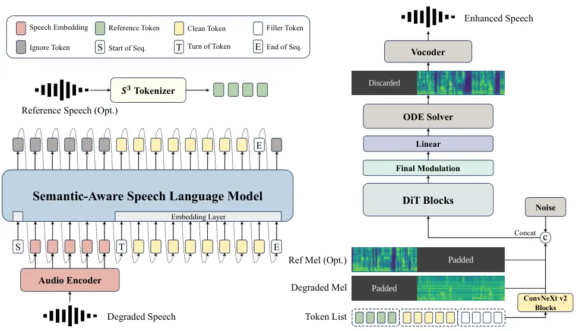
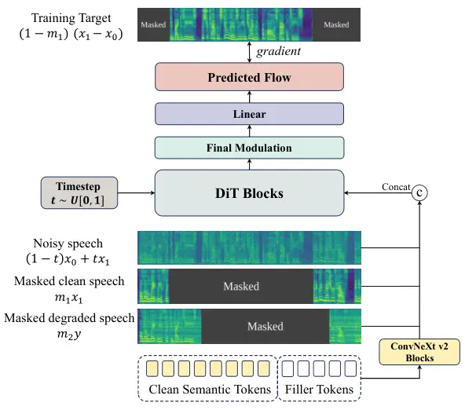

# SenSE: Semantic-Aware High-Fidelity Universal Speech Enhancement

Xingchen Li¹, Hanke Xie¹, Ziqian Wang¹, Zihan Zhang², Longshuai Xiao²,
Shuai Wang³, Lei Xie^(1∗) ^(†)^(†)thanks: \*Corresponding author.
Affiliation: ¹Audio, Speech and Language Processing Group (ASLP@NPU),  
School of Computer Science, Northwestern Polytechnical University,
China  
²Huawei Technologies Co., Ltd., China  
³Nanjing University, China

###### Abstract

Generative Universal Speech Enhancement (USE) methods aim to leverage
generative models to improve speech quality under various types of
distortions. However, existing generative speech enhancement methods
often suffer from semantic inconsistency in the generated outputs.
Therefore, we propose SenSE, a novel two-stage generative universal
speech enhancement framework, by modeling semantic priors with a
language model, the flow matching-based speech enhancement process is
guided to generate semantically faithful speech, thereby effectively
improving context fidelity. In addition, we introduce a dual-path masked
conditioning training strategy that enables flow matching-based
enhancement to flexibly integrate multi-source conditioning signals from
degraded speech, semantic tokens, and reference speech, thereby
improving model flexibility and adaptability. Experimental results
demonstrate that SenSE achieves state-of-the-art performance among
generative speech enhancement models and exhibits a high performance
ceiling, particularly under challenging distortion conditions. Codes and
demos are available at
[https://github.com/ASLP-lab/SenSE](https://github.com/ASLP-lab/SenSE).

###### Index Terms: 

universal speech enhancement, generative models, flow matching

## I Introduction

Speech enhancement (SE) is designed to improve both the perceptual
quality and intelligibility of speech degraded under adverse acoustic
conditions, such as background noise, reverberation, signal clipping,
and bandwidth constraints. Most prior approaches are designed to handle
a single type of distortion, whereas Universal Speech Enhancement (USE)
methods that employ a single model to address multiple distortion types
have recently attracted increasing attention  \[14, 31, 10, 30\].
Discriminative models  \[9, 6, 21\] typically establish a direct mapping
from degraded speech to clean speech. However, they tend to introduce
additional distortion and artifacts under severely degraded conditions,
which can substantially degrade perceptual quality.

Recent generative speech enhancement approaches have demonstrated strong
potential for producing more natural and perceptually coherent speech
 \[23, 27, 29, 31\]. These approaches capture the distribution of clean
speech and generate the corresponding clean signal when conditioned on
degraded input. While such approaches can produce high-quality speech,
their major limitation lies in the difficulty of ensuring content
fidelity. In practice, a substantial amount of speech hallucination
still occurs, which makes it challenging to preserve the original speech
structure.

Unlike other generative tasks, speech enhancement places greater
emphasis on leveraging generative models to reconstruct high-fidelity
clean speech. However, due to the high complexity of speech distortions,
distinguishing speech components from interfering signals can become
particularly challenging in certain scenarios. This challenge
constitutes a fundamental limitation of many generative speech
enhancement approaches: inaccurate identification of speech components
in degraded speech often leads to a mismatch between the generated
output and the ground-truth clean speech, thereby reducing
reconstruction fidelity. This degradation is typically reflected in
lower semantic similarity and speaker similarity. Some existing
approaches generate discrete tokens using language models \[29, 10\] or
masked generative models (MGMs) \[31\]. However, the inherent
information loss of discrete representations, together with the
difficulty of predicting fine-grained acoustic tokens, prevents these
methods from effectively resolving semantic inconsistency. Diffusion- or
flow-based methods generally establish a more direct mapping between the
distributions of degraded and clean speech, and thus often achieve
higher overall fidelity. Nevertheless, the issue of speech component
confusion persists, especially under severe distortion conditions.

To address the above challenge, we provide semantic prior guidance to
flow matching-based speech enhancement models. Recent advances in speech
tokenizers  \[5\] have demonstrated that language-related semantic
information can be encoded into discrete semantic tokens, providing a
reliable intermediate representation for leveraging semantic priors in
generative speech enhancement. Building upon this insight, we aim to
explicitly model the distribution of semantic tokens directly from
complete degraded speech inputs, for which the strong contextual
modeling capability of language models offers a promising solution.
Unlike prior language-model-based speech enhancement approaches, we
leverage language models to model semantic priors rather than to
directly generate complete speech.



Fig. 1: An overview of the two-stage architecture in SenSE with explicit
semantic modeling.

In this paper, we propose SenSE, a novel speech enhancement framework
that leverages a language model to explicitly model semantic information
from speech and introduces a semantic guidance mechanism that injects
semantic tokens into flow matching-based speech enhancement. Moreover,
we introduce a dual-path masked conditional training strategy. This
design enables the model to fully exploit multiple cues for speech
enhancement, including degraded speech, semantic tokens, and reference
speech. In particular, the model can selectively leverage high-quality
reference speech from the same speaker to compensate for the loss of
speaker-related information under severe distortion conditions.
Experimental results demonstrate that the proposed approach achieves
performance comparable to that of current large-scale generative speech
enhancement models, even with a relatively small model size and low
computational overhead. Furthermore, by appropriately scaling up the
model capacity, the framework exhibits strong robustness and performance
gains in severely distorted scenarios.

## II Method

As illustrated in Fig. 1, SenSE is organized into two key stages: 1)
semantic-aware speech language model: this module adopts a language
model to derive purified semantic tokens from the continuous speech
embeddings obtained by encoding degraded speech. 2) semantic-guided
speech enhancement with flow matching: the semantic tokens obtained from
the first stage are incorporated as additional conditioning in flow
matching-based speech enhancement, thereby enhancing the preservation of
semantic information during generation. The dual-path masked conditional
training strategy enables the model to fully leverage all available
information to generate clean speech.

### II-A Semantic-Aware Speech Language Model

To enhance robustness under conditions of severe distortion, we
introduce a Semantic-Aware Speech Language Model (SASLM). We adopt a
randomly initialized LLaMA model as our backbone and employ an audio
encoder to extract continuous speech representations as input to the
model.

We adopt the $`\mathcal{S}^{3}`$ Tokenizer as the speech tokenizer.
Originally introduced in CosyVoice  \[5\], it integrates a quantization
module, either vector quantization (VQ)  \[24\] or finite scalar
quantization (FSQ)  \[15\], into the encoder of the SenseVoice  \[1\]
ASR model to generate discrete tokens under supervised training.

During training, the input sequence to SASLM is formatted as “\<Start of
Seq. \>, speech embedding, \<Turn of Token \>, semantic token, \<End of
Seq. \>”, where \<Start of Seq. \>denotes the start-of-sequence token,
\<Turn of Token \>indicates the transition from speech embeddings to
speech tokens, and \<End of Seq. \>marks the end of the sequence. The
model is trained under a next-token prediction objective. The training
objective is as follows:

```math
p(x)=\prod_{k=1}^{n}p\bigl(s_{k}\mid s_{1},\ldots,s_{k-1},e_{1\ldots n}) \tag{1}
```

where $`s`$ denotes the semantic tokens of clean speech, $`e`$
represents the speech embeddings extracted from the degraded speech by
the audio encoder, and $`n`$ indicates the total number of frames in the
input speech sequence.

At inference time, a sequence consisting of the start-of-sequence
symbol, the speech embeddings, and the turn-of-token indicators is
provided to the SASLM as a prefix. The model then generates the semantic
tokens corresponding to the clean speech via next-token prediction. In
addition, when reference speech is available, it is converted into
reference tokens using the $`\mathcal{S}^{3}`$ Tokenizer, which are then
used in the flow matching stage to facilitate the alignment between
semantic and acoustic cues.

### II-B Semantic-Guided Speech Enhancement with Flow Matching

Based on the semantic tokens predicted by SASLM and the reference token
(if provided), we incorporate a semantic guidance mechanism into flow
matching-based speech enhancement, which constitutes the second stage of
our model. With this mechanism, the model jointly leverages acoustic
cues from the degraded mel spectrogram and semantic cues from the
semantic tokens. In this way, the model generates clean speech
conditioned on semantic tokens, while ensuring that the enhanced output
preserves a spectral envelope similar to that of the distorted input,
thereby maintaining high fidelity. In addition, the proposed dual-path
masked conditional training strategy encourages the flow matching model
to effectively leverage semantic information rather than relying solely
on acoustic cues, while also enabling the optional use of clean
reference speech from the same speaker to compensate for speaker-related
information loss under severe distortion conditions.

Dual-path masked conditional training As illustrated in Fig. 2, the
second-stage flow matching model is trained on a conditioned speech
infilling task using a DiT  \[17\] backbone. We adopt DiT blocks
following the F5-TTS design  \[2\], with a zero-initialized adaptive
Layer Normalization (adaLN-zero) module as the final modulation
mechanism. During training, triplets of clean speech, degraded speech,
and semantic tokens extracted from clean speech are used. The clean and
degraded speech mel spectrograms are denoted as
$`x_{1}\in\mathbb{R}^{F\times T}`$ and $`y\in\mathbb{R}^{F\times T}`$,
respectively, while the semantic token sequence is denoted as $`z`$.



Fig. 2: Illustration of the proposed dual-path masked conditional
training strategy.

|                      |             |                                        |
| -------------------- | ----------- | -------------------------------------- |
| Family               | Probability | Hyperparameters                        |
| Noise                | 0.9         | SNR $`\in[-10,10]`$                    |
| Reverberation        | 0.5         | \-                                     |
| Clipping             | 0.25        | Clipping threshold $`\in[0.05,0.90]`$  |
| Bandwidth Limitation | 0.5         | Bandwidth $`\in\{2,4,8,16,22.05\}`$kHz |

TABLE I: Constructed distortion types and probabilities in training data
simulation.

|                |                  |            |            |         |
| -------------- | ---------------- | ---------- | ---------- | ------- |
| Model          | Audio Encoder    | SASLM      | DiT Blocks | Vocoder |
| SenSE\_(base)  | Whisper-large-v3 | 1536,20,16 | 1024,22,16 | BigVGAN |
| SenSE\_(small) | conformer        | 1024,6,16  | 768,18,12  | BigVGAN |
| SenSE\_(tiny)  | Whisper-small    | 256,16,4   | 768,12,8   | Vocos   |

TABLE II: Details of model configurations.

Following the flow matching formulation  \[13\], the model input is
constructed as $`(1-t)x_{0}+tx_{1}`$, where
$`x_{0}\sim\mathcal{N}(0,I)`$ represents Gaussian noise sampled from the
prior distribution, and $`t\sim\mathcal{U}[0,1]`$ denotes the sampled
flow step. We combine both acoustic cues and semantic cues as the
conditioning input to the model. The acoustic cues include the masked
clean speech $`m_{1}\odot x_{1}`$ and the incomplete degraded speech
$`m_{2}\odot y`$ , where $`m_{1},m_{2}`$ are binary temporal masks. For
the semantic cues, semantic tokens are padded with filler tokens to
match the length of the mel spectrogram and then encoded by ConvNeXt V2
 \[28\] modules to implicitly align the token sequence with the speech
features. The condition is constructed by concatenating the clean speech
mel-spectrogram, the degraded speech mel spectrogram, and the aligned
semantic cues along the feature dimension, based on which the model is
trained to reconstruct the masked regions of the clean speech.
Therefore, our objective is to train a model $`v_{\theta}`$ to predict
the velocity $`v_{\theta}((1-t)x_{0}+tx_{1},m_{1}x_{1},m_{2}y,z)`$ with
target as $`v=(1-m_{1})(x_{1}-x_{0})`$. We use the mean squared error
(MSE) loss, formally represented as:

```math
\begin{split}\mathcal{L}_{\text{FM}}=\mathbb{E}_{t,x_{0},x_{1}}\Big\|&v_{\theta}\big((1-t)x_{0}+tx_{1},\;m_{1}x_{1},\;m_{2}y,\;z\big)\\
&\quad-(1-m_{1})(x_{1}-x_{0})\Big\|^{2}\end{split} \tag{2}
```

Regarding the rationale for randomly masking the degraded speech, which
we refer to as the degrad mask, we note that degraded signals often
provide direct acoustic cues, which can dominate the learning process.
When the model is conditioned simultaneously on degraded speech and
semantic tokens, it tends to over-rely on the degraded speech, thereby
neglecting the more challenging task of mapping semantic tokens to clean
speech. To counteract this bias, we introduce random temporal masking on
the degraded speech. This strategy forces the model to reconstruct the
masked regions of the degraded speech by leveraging the information
provided by the semantic tokens. Through this masking-based training
paradigm, the model learns to align semantic tokens with the
corresponding mel spectrograms of clean and degraded speech and to more
effectively utilize the semantic information.

Inference To generate enhanced speech, we prepare the degraded speech
$`y_{degraded}\in\mathbb{R}^{F\times T_{1}}`$, the semantic tokens
$`z_{gen}`$ predicted by SASLM , and an optional reference speech
$`x_{ref}\in\mathbb{R}^{F\times T_{2}}`$. During inference, as shown in
Fig. 1, we pad the tail of $`x_{ref}`$ with empty frames of length
$`T_{1}`$, which serves as the portion to be generated. Similarly, we
pad the front of $`y_{degraded}`$ with empty frames of length $`T_{2}`$
so that it aligns with the generative portion, and the semantic token
sequence $`z_{gen}`$, formed by concatenating the reference tokens and
the purified tokens, is extended with filler tokens in the same way as
in training. When no reference speech is provided, $`T_{2}`$ is set to
zero, resulting in an all-empty reference channel without requiring
additional padding for $`y_{degraded}`$. The model estimates the
velocity field $`v`$, and the Euler ODE solver is applied to generate
the enhanced mel spectrogram. Finally, the mel spectrogram is converted
into a waveform using a pretrained vocoder.

## III Experiment And Results

|               |         |       |
| ------------- | ------- | ----- |
| Model         | \#Param | RTF   |
| TF-GridNet    | 8.0M    | 0.071 |
| PGUSE         | 5.1M    | 0.064 |
| GenSE         | 1092.9M | 2.031 |
| LLaSE-G1      | 1895.6M | 0.049 |
| FlowSE        | 350.1M  | 0.201 |
| AnyEnhance    | 366.2M  | 1.300 |
| SenSE\_(tiny) | 248.5M  | 0.049 |
| SenSE\_(base) | 1571.3M | 1.122 |

TABLE III: Model size and RTF of SenSE and other comparison models.

|                         |      |         |        |                     |          |        |     |
| ----------------------- | ---- | ------- | ------ | ------------------- | -------- | ------ | --- |
| Model                   | Type | DNSMOS↑ | NISQA↑ | Speech- BERTScore ↑ | dWER(%)↓ | SIM-o↑ |     |
| DNS Challenge no-reverb |      |         |        |                     |          |        |     |
| Voicefixer              | D    | 3.248   | 4.385  | 0.861               | 9.28     | 0.714  |     |
| TF-GridNet              | D    | 3.312   | 4.332  | 0.930               | 4.22     | 0.956  |     |
| PGUSE                   | D+G  | 3.333   | 4.661  | 0.932               | 4.40     | 0.942  |     |
| GenSE                   | G    | 3.425   | 4.672  | 0.838               | 20.08    | 0.285  |     |
| FlowSE                  | G    | 3.265   | 4.733  | 0.898               | 9.92     | 0.846  |     |
| LLaSE-G1                | G    | 3.415   | 4.504  | 0.889               | 8.69     | 0.748  |     |
| AnyEnhance              | G    | 3.406   | 4.784  | 0.925               | 4.95     | 0.885  |     |
| SenSE\_(tiny)           | G    | 3.375   | 4.757  | 0.929               | 4.85     | 0.890  |     |
| SenSE\_(base)           | G    | 3.376   | 4.788  | 0.942               | 3.89     | 0.921  |     |
| DNS Challenge HardSet   |      |         |        |                     |          |        |     |
| Voicefixer              | D    | 3.119   | 3.958  | 0.779               | 27.01    | 0.553  |     |
| TF-GridNet              | D    | 3.146   | 3.974  | 0.844               | 12.00    | 0.813  |     |
| PGUSE                   | D+G  | 3.251   | 4.112  | 0.871               | 14.50    | 0.843  |     |
| FlowSE                  | G    | 2.940   | 4.057  | 0.799               | 29.38    | 0.684  |     |
| LLaSE-G1                | G    | 3.370   | 4.366  | 0.830               | 28.47    | 0.604  |     |
| AnyEnhance              | G    | 3.384   | 4.817  | 0.876               | 15.48    | 0.778  |     |
| SenSE\_(tiny)           | G    | 3.408   | 4.624  | 0.879               | 11.74    | 0.792  |     |
| SenSE\_(base)           | G    | 3.408   | 4.873  | 0.915               | 8.93     | 0.838  |     |
| DNS Challenge GSR       |      |         |        |                     |          |        |     |
| Voicefixer              | D    | 3.285   | 4.003  | 0.817               | 18.13    | 0.553  |     |
| TF-GridNet              | D    | 3.233   | 4.041  | 0.872               | 7.36     | 0.767  |     |
| PGUSE                   | D+G  | 3.291   | 4.166  | 0.896               | 8.52     | 0.805  |     |
| AnyEnhance              | G    | 3.396   | 4.847  | 0.896               | 12.25    | 0.779  |     |
| SenSE\_(tiny)           | G    | 3.380   | 4.675  | 0.908               | 8.10     | 0.783  |     |
| SenSE\_(base)           | G    | 3.388   | 4.806  | 0.922               | 6.70     | 0.797  |     |
| VCTK GSR                |      |         |        |                     |          |        |     |
| Voicefixer              | D    | 2.976   | 4.009  | 0.887               | 8.30     | 0.681  |     |
| TF-GridNet              | D    | 3.054   | 4.425  | 0.924               | 3.77     | 0.855  |     |
| PGUSE                   | D+G  | 3.057   | 4.419  | 0.928               | 3.10     | 0.879  |     |
| AnyEnhance              | G    | 3.128   | 4.756  | 0.924               | 4.62     | 0.795  |     |
| SenSE\_(tiny)           | G    | 3.106   | 4.584  | 0.933               | 3.08     | 0.797  |     |
| SenSE\_(base)           | G    | 3.109   | 4.726  | 0.943               | 1.79     | 0.824  |     |

TABLE IV: Results of the proposed method and comparison models on
multiple test sets. The boldface indicates the best result and the
underline denotes the second best. ‘D’ and ‘G’ denote discriminative and
generative methods, respectively. Reference speech is not used in the
comparisons.

### III-A Experimental Setup

Datasets We use clean speech data from the open-source Emilia  \[7\]
dataset to train our base and tiny model. We selected approximately
22,000 hours of data with DNSMOS scores greater than 3.40. Additionally,
small models were trained for ablation studies using 1,400 hours of
clean speech from the Interspeech 2020 DNS Challenge \[19\] dataset. The
noise datasets included DEMAND, ESC-50, and DNS Challenge \[4\],
totaling roughly 700 hours, while room impulse responses (RIRs) were
sourced from openSLR26 and openSLR28 \[11\]. Paired training data are
simulated using the parameter settings summarized in Tab. I.

For speech denoising, we evaluate on the official DNS Challenge
no-reverb test set. To assess performance under low signal-to-noise
ratio (SNR) conditions, we additionally construct the DNS Challenge
HardSet by re-mixing speech and noise from the no-reverb test set with
SNRs randomly sampled from (-5, 0) dB. To evaluate robustness across
diverse distortion types, we further construct two simulated General
Speech Restoration (GSR) test sets, namely DNS Challenge GSR and VCTK
GSR. In DNS Challenge GSR, clean speech is processed using our
simulation pipeline and then mixed with noise, while in VCTK GSR, clean
speech from the VCTK dataset is similarly processed and mixed with
unseen noise and room impulse responses (RIRs), resulting in 167 test
samples.

Model Details In this paper, we employ three model variants with
different scales. The base model SenSE*(base) is used to explore the
upper bound of performance of the proposed approach, the small model
SenSE*(small) is adopted for ablation studies, and the tiny model
SenSE\_(tiny) is designed to evaluate performance under low computational
budgets. Notably, the tiny model adopts an encoder-only language model,
enabling single-pass inference. The detailed model configurations are
summarized in Tab. II, where the entries in the SASLM and DiT Blocks
columns indicate the hidden size, number of layers, and number of
attention heads of the corresponding Transformer modules, respectively.
For the Whisper encoder and the vocoder, we use the official open-source
pre-trained models. During training, the masking ratios for clean and
degraded speech are randomly sampled from the ranges of (70%,100%) and
(50%,100%), respectively.

For the base and tiny model, the SASLM was trained on 8 NVIDIA RTX 5880
Ada Generation GPUs with a batch size of 76,800 audio frames for 1.15M
steps. During the first 550K steps, the audio encoder was frozen while
only the language model was optimized; in the subsequent steps, the
language model was frozen, and the audio encoder was fine-tuned. The
flow matching stage was trained on the same GPUs with a batch size of
153,600 audio frames for 350K steps. For the small model, both stages
were trained on 8 NVIDIA RTX 4090 GPUs with a batch size of 147,200
audio frames for 300K steps. Across all training configurations, the
AdamW optimizer was employed with a peak learning rate of 7.5e-5, using
20k linear warm-up steps followed by linear decay.

Fig. 3: Results of the ablation study on the SenSE framework, where
”w/o” indicates the removal of a specific method or component.

Comparison Models We compare our model against state-of-the-art speech
enhancement systems, including both discriminative models: VoiceFixer
 \[14\], TF-GridNet  \[25\]; as well as generative models: GenSE
 \[29\], AnyEnhance  \[31\], LLaSE-G1  \[10\], and FlowSE  \[26\]; as
well as the hybrid predictive-generative model PGUSE  \[30\]. For
AnyEnhance, we adopt the official implementation without prompt-guidance
and self-critic modules, in order to isolate and evaluate the impact of
the model architecture itself. The model is retrained using the same
training data as SenSE*(base) to ensure a fair comparison. For
VoiceFixer, GenSE, LLaSE-G1, and FlowSE, we directly use the officially
released pretrained models. For TF-GridNet and PGUSE, we retrain the
models using 1,400 hours of clean speech from the DNS Challenge,
combined with the same noise and RIR dataset used for training
SenSE*(base).

Metrics We evaluate our model using several commonly adopted metrics for
speech enhancement. DNSMOS: a reference-free perceptual quality metric
 \[20\]. We use the OVAL score to evaluate speech quality. NISQA: a
reference-free perceptual quality metric designed for 48 kHz speech
 \[16\]. SpeechBERTScore: a metric for assessing the semantic similarity
between enhanced and reference speech  \[22\]. In this work, we use
HuBERT-base¹¹ 1 https://huggingface.co/facebook/hubert-base-ls960. model
to extract the feature. dWER: a metric that evaluates the word error
rate (WER) difference between enhanced and reference speech using ASR
transcriptions. We adopt Whisper-large-v3  \[18\] as the ASR model for
this evaluation. SIM-o: a measure of timbre similarity between enhanced
and reference speech  \[12\]. In this work, we compute cosine similarity
between speaker embeddings extracted using a WavLM-large-based speaker
verification model \[3\].

|                     |         |        |                     |          |        |     |
| ------------------- | ------- | ------ | ------------------- | -------- | ------ | --- |
| Model               | DNSMOS↑ | NISQA↑ | Speech- BERTScore ↑ | dWER(%)↓ | SIM-o↑ |     |
| SenSE               | 3.109   | 4.726  | 0.943               | 1.79     | 0.824  |     |
| SenSE(w/ reference) | 3.108   | 4.728  | 0.947               | 1.84     | 0.873  |     |

TABLE V: Effect of reference speech.

### III-B Experimental Results

Tab. IV present the main results on speech denoising and the general
speech restoration tasks. During inference of SenSE, sampling in SASLM
is disabled to ensure relatively stable outputs. We report the average
score of SenSE and the sampling-based baselines using five different
random seeds. By default, we set the CFG strength  \[8\] to 0.5, the
sway sampling coefficient  \[2\] to -1, and the number of function
evaluations (NFE) to 8 for our flow matching model. Note that all
enhanced outputs from the models are resampled to 16 kHz.

Table 3 reports the parameter counts and real-time factors (RTF) of
SenSE*(tiny), SenSE*(base), and other baselines, where RTF is computed
based on the inference time for 10-second audio samples. SenSE*(tiny)
achieves lower parameter count and RTF than all other generative
baselines, enabling evaluation of performance under low computational
complexity. By scaling up the model size, SenSE*(base) is used to assess
the upper performance bound of the proposed framework.

We draw the following conclusions from the experimental results: 1) On
speech quality metrics (DNSMOS and NISQA), SenSE*(base) achieves
performance comparable to other generative approaches, being only
slightly inferior to AnyEnhance in a few cases, while exhibiting clear
advantages over discriminative methods; 2) On semantic similarity
metrics (SpeechBERTScore and dWER), SenSE*(base) consistently
outperforms all baseline models, demonstrating its effectiveness in
alleviating semantic inconsistency in generative speech enhancement and
highlighting its potential to surpass discriminative approaches; 3) In
terms of speaker similarity (SIM-o), SenSE*(base) surpasses all
generative baselines and achieves performance that is highly competitive
with discriminative methods; 4) Even with a substantially reduced model
size, SenSE*(tiny) still significantly outperforms other generative
approaches on most metrics, falling slightly behind AnyEnhance only in
speech quality scores. Given SenSE’s superior ability to preserve speech
content, this performance gap is considered acceptable; 5) Results on
the DNS Challenge HardSet further indicate that scaling up SenSE yields
substantial performance gains under severe distortion conditions,
underscoring its strong performance ceiling and scalability.

We evaluate the effect of reference speech on the VCTK GSR test set. For
each test sample, a different utterance from the same speaker is
selected as the reference. As shown in Tab. V, incorporating reference
speech leads to a substantial improvement in speaker similarity, while
achieving comparable or slightly improved performance on the other
evaluation metrics compared to the reference-free setting.

### III-C Ablation Studies and Analysis

To validate the effectiveness of the proposed degrad mask and semantic
guidance mechanism in SenSE, we conduct ablation experiments.
Specifically, 1) we removed the mask applied to degraded speech in the
flow matching stage; 2) we removed the first-stage SASLM and eliminated
the semantic token from the conditions in the second-stage flow matching
module.

The ablation study results are presented in Fig. 3. We summarize our
findings as follows: 1) The semantic guidance mechanism consistently
improves performance across DNSMOS, SpeechBERTScore, and SIM-o,
indicating that incorporating additional semantic information
effectively enhances the performance of flow matching-based speech
enhancement models, particularly in terms of semantic preservation; 2)
Introducing the degrad mask leads to inferior performance during the
early stages of training. However, as training progresses, the model
equipped with degrad mask surpasses its counterpart without degrad mask
on DNSMOS and SpeechBERTScore, while the performance gap on SIM-o
gradually narrows. Overall, the degrad mask yields a positive and stable
impact on model performance.

## IV Conclusion

In this study, we propose SenSE, a novel two-stage speech enhancement
framework that incorporates language-model-derived semantic tokens to
guide flow matching-based generation, effectively mitigating semantic
inconsistency. A dual-path masked conditioning training strategy is
further introduced to enhance semantic guidance and enable the use of
prompt speech for recovering speaker information. We will release our
code and models to facilitate reproducibility and further research in
this field.

## References

- \[1\] K. An, Q. Chen, C. Deng, Z. Du, C. Gao, Z. Gao, Y. Gu, T. He, H.
  Hu, K. Hu, et al. (2024) Funaudiollm: voice understanding and
  generation foundation models for natural interaction between humans
  and llms. arXiv preprint arXiv:2407.04051. Cited by: §II-A.
- \[2\] Y. Chen, Z. Niu, Z. Ma, K. Deng, C. Wang, J. JianZhao, K. Yu,
  and X. Chen (2025) F5-TTS: a fairytaler that fakes fluent and faithful
  speech with flow matching. In ACL, pp. 6255–6271. Cited by: §II-B,
  §III-B.
- \[3\] Z. Chen, S. Chen, Y. Wu, Y. Qian, C. Wang, S. Liu, Y. Qian,
  and M. Zeng (2022) Large-scale self-supervised speech representation
  learning for automatic speaker verification. In ICASSP, pp. 6147–6151.
  Cited by: §III-A.
- \[4\] R. Cutler, A. Saabas, T. Pärnamaa, M. Purin, E. Indenbom, N.
  Ristea, J. Gužvin, H. Gamper, S. Braun, and R. Aichner (2024) ICASSP
  2023 acoustic echo cancellation challenge. IEEE Open Journal of Signal
  Processing 5, pp. 675–685. Cited by: §III-A.
- \[5\] Z. Du, Q. Chen, S. Zhang, K. Hu, H. Lu, Y. Yang, H. Hu, S.
  Zheng, Y. Gu, Z. Ma, et al. (2024) Cosyvoice: a scalable multilingual
  zero-shot text-to-speech synthesizer based on supervised semantic
  tokens. arXiv preprint arXiv:2407.05407. Cited by: §I, §II-A.
- \[6\] Y. Fu, Y. Liu, J. Li, D. Luo, S. Lv, Y. Jv, and L. Xie (2022)
  Uformer: a unet based dilated complex & real dual-path conformer
  network for simultaneous speech enhancement and dereverberation. In
  ICASSP, pp. 7417–7421. Cited by: §I.
- \[7\] H. He, Z. Shang, C. Wang, X. Li, Y. Gu, H. Hua, L. Liu, C.
  Yang, J. Li, P. Shi, et al. (2024) Emilia: an extensive, multilingual,
  and diverse speech dataset for large-scale speech generation. In 2024
  IEEE Spoken Language Technology Workshop (SLT), pp. 885–890. Cited by:
  §III-A.
- \[8\] J. Ho and T. Salimans (2022) Classifier-free diffusion guidance.
  arXiv preprint arXiv:2207.12598. Cited by: §III-B.
- \[9\] Y. Hu, Y. Liu, S. Lv, M. Xing, S. Zhang, Y. Fu, J. Wu, B. Zhang,
  and L. Xie (2020) DCCRN: deep complex convolution recurrent network
  for phase-aware speech enhancement. In Interspeech, pp. 2472–2476.
  Cited by: §I.
- \[10\] B. Kang, X. Zhu, Z. Zhang, Z. Ye, M. Liu, Z. Wang, Y. Zhu, G.
  Ma, J. Chen, L. Xiao, C. Weng, W. Xue, and L. Xie (2025) LLaSE-g1:
  incentivizing generalization capability for LLaMA-based speech
  enhancement. In ACL, pp. 13292–13305. Cited by: §I, §I, §III-A.
- \[11\] T. Ko, V. Peddinti, D. Povey, M. L. Seltzer, and S.
  Khudanpur (2017) A study on data augmentation of reverberant speech
  for robust speech recognition. In ICASSP, pp. 5220–5224. Cited by:
  §III-A.
- \[12\] M. Le, A. Vyas, B. Shi, B. Karrer, L. Sari, R. Moritz, M.
  Williamson, V. Manohar, Y. Adi, J. Mahadeokar, et al. (2023) Voicebox:
  text-guided multilingual universal speech generation at scale. NIPS
  36, pp. 14005–14034. Cited by: §III-A.
- \[13\] Y. Lipman, R. T. Chen, H. Ben-Hamu, M. Nickel, and M. Le (2022)
  Flow matching for generative modeling. arXiv preprint
  arXiv:2210.02747. Cited by: §II-B.
- \[14\] H. Liu, X. Liu, Q. Kong, Q. Tian, Y. Zhao, D. Wang, C. Huang,
  and Y. Wang (2022) VoiceFixer: A Unified Framework for High-Fidelity
  Speech Restoration. In Interspeech, pp. 4232–4236. Cited by: §I,
  §III-A.
- \[15\] F. Mentzer, D. Minnen, E. Agustsson, and M. Tschannen (2024)
  Finite scalar quantization: VQ-VAE made simple. In ICLR, Cited by:
  §II-A.
- \[16\] G. Mittag, B. Naderi, A. Chehadi, and S. Möller (2021) NISQA: a
  deep cnn-self-attention model for multidimensional speech quality
  prediction with crowdsourced datasets. In Interspeech, pp. 2127–2131.
  Cited by: §III-A.
- \[17\] W. Peebles and S. Xie (2023) Scalable diffusion models with
  transformers. In ICCV, pp. 4195–4205. Cited by: §II-B.
- \[18\] A. Radford, J. W. Kim, T. Xu, G. Brockman, C. McLeavey, and I.
  Sutskever (2023) Robust speech recognition via large-scale weak
  supervision. In International conference on machine learning,
  pp. 28492–28518. Cited by: §III-A.
- \[19\] C. K. Reddy, V. Gopal, R. Cutler, E. Beyrami, R. Cheng, H.
  Dubey, S. Matusevych, R. Aichner, A. Aazami, S. Braun, et al. (2020)
  The interspeech 2020 deep noise suppression challenge: datasets,
  subjective testing framework, and challenge results. arXiv preprint
  arXiv:2005.13981. Cited by: §III-A.
- \[20\] C. K. Reddy, V. Gopal, and R. Cutler (2021) DNSMOS: a
  non-intrusive perceptual objective speech quality metric to evaluate
  noise suppressors. In ICASSP, pp. 6493–6497. Cited by: §III-A.
- \[21\] X. Rong, T. Sun, X. Zhang, Y. Hu, C. Zhu, and J. Lu (2024)
  GTCRN: a speech enhancement model requiring ultralow computational
  resources. In ICASSP, pp. 971–975. Cited by: §I.
- \[22\] T. Saeki, S. Maiti, S. Takamichi, S. Watanabe, and H.
  Saruwatari (2024) SpeechBERTScore: Reference-Aware Automatic
  Evaluation of Speech Generation Leveraging NLP Evaluation Metrics. In
  Interspeech, pp. 4943–4947. Cited by: §III-A.
- \[23\] W. Tai, Y. Lei, F. Zhou, G. Trajcevski, and T. Zhong (2023)
  DOSE: diffusion dropout with adaptive prior for speech enhancement. In
  NIPS, Cited by: §I.
- \[24\] A. Van Den Oord O. Vinyals et al. (2017) Neural discrete
  representation learning. NIPS 30. Cited by: §II-A.
- \[25\] Z. Wang, S. Cornell, S. Choi, Y. Lee, B. Kim, and S.
  Watanabe (2023) TF-gridnet: making time-frequency domain models great
  again for monaural speaker separation. In ICASSP, pp. 1–5. Cited by:
  §III-A.
- \[26\] Z. Wang, Z. Liu, X. Zhu, Y. Zhu, M. Liu, J. Chen, L. Xiao, C.
  Weng, and L. Xie (2025) FlowSE: Efficient and High-Quality Speech
  Enhancement via Flow Matching. In Interspeech, pp. 4858–4862. Cited
  by: §III-A.
- \[27\] Z. Wang, X. Zhu, Z. Zhang, Y. Lv, N. Jiang, G. Zhao, and L.
  Xie (2024) Selm: speech enhancement using discrete tokens and language
  models. In ICASSP, pp. 11561–11565. Cited by: §I.
- \[28\] S. Woo, S. Debnath, R. Hu, X. Chen, Z. Liu, I. S. Kweon, and S.
  Xie (2023) Convnext v2: co-designing and scaling convnets with masked
  autoencoders. In CVPR, pp. 16133–16142. Cited by: §II-B.
- \[29\] J. Yao, H. Liu, C. Chen, Y. Hu, E. Chng, and L. Xie (2025)
  GenSE: generative speech enhancement via language models using
  hierarchical modeling. In ICLR, Cited by: §I, §I, §III-A.
- \[30\] J. Zhang, H. Yan, and X. Li (2025) A composite
  predictive-generative approach to monaural universal speech
  enhancement. IEEE/ACM Transactions on Audio, Speech, and Language
  Processing. Cited by: §I, §III-A.
- \[31\] J. Zhang, J. Yang, Z. Fang, Y. Wang, Z. Zhang, Z. Wang, F. Fan,
  and Z. Wu (2025) AnyEnhance: a unified generative model with
  prompt-guidance and self-critic for voice enhancement. IEEE/ACM
  Transactions on Audio, Speech, and Language Processing 33,
  pp. 3085–3098. Cited by: §I, §I, §I, §III-A.
