# VoiceBridge: General Speech Restoration with One-step Latent Bridge Models

Chi Zhang^(∗) Affiliation: Tsinghua University Affiliation: Shengshu AI
   Zehua Chen^(∗†) Affiliation: Tsinghua University
Affiliation: Shengshu AI    Kaiwen Zheng Affiliation: Tsinghua
University    Jun Zhu^(†) Affiliation: Tsinghua University
Affiliation: Shengshu AI Correspondence to: <zhc23thuml@tsinghua.edu.cn>
Correspondence to: <dcszj@mail.tsinghua.edu.cn>

###### Abstract

Bridge models have been investigated in speech enhancement but are
mostly single-task, with constrained general speech restoration (GSR)
capability. In this work, we propose VoiceBridge, a one-step latent
bridge model (LBM) for GSR, capable of efficiently reconstructing 48 kHz
fullband speech from diverse distortions. To inherit the advantages of
data-domain bridge models, we design an energy-preserving variational
autoencoder, enhancing the waveform-latent space alignment over varying
energy levels. By compressing waveform into continuous latent
representations, VoiceBridge models various GSR tasks with a single
latent-to-latent generative process backed by a scalable transformer. To
alleviate the challenge of reconstructing the high-quality target from
distinctively different low-quality priors, we propose a joint neural
prior for GSR, uniformly reducing the burden of the LBM in diverse
tasks. Building upon these designs, we further investigate bridge
training objective by jointly tuning LBM, decoder and discriminator
together, transforming the model from a denoiser to generator and
enabling one-step GSR without distillation. Extensive validation across
in-domain (e.g., denoising and super-resolution) and out-of-domain tasks
(e.g., refining synthesized speech) and datasets demonstrates the
superior performance of VoiceBridge.
Demos: [https://VoiceBridgedemo.github.io/](https://VoiceBridgedemo.github.io/).

###### Keywords: 

Machine Learning, ICML, VoiceBridge, Latent Bridge Models, General
Speech Restoration, Speech Enhancement, Speech Restoration, Speech
Signal Processing, Diffusion Models, Generative Models, Schrodinger
Bridge

## 1 Introduction

Tractable Schrödinger Bridge (SB) models have proven to faithfully
reconstruct the target distribution from an informative prior,
overcoming the limitation of the noise prior in diffusion models (Chen
et al., 2021; Chen et al., 2023; Li et al., 2025b). Recently, their
advantages have been extended to speech enhancement tasks (Jukić et al.,
2024; Wang et al., 2024a; Han et al., 2025), such as denoising (Jukić et
al., 2024), dereverberation, and super-resolution (Li et al., 2025a),
where the low-quality (LQ) observation naturally provides indicative
information for the high-quality (HQ) target. Although these efforts
have proposed innovations spanning forward process design (Jukić et al.,
2024), model parameterization (Richter et al., 2025), training
objectives (Zhang et al., 2025a), and cascaded architectures (Han et
al., 2025; Li et al., 2025b), their designs are usually confined to a
single task, not yet achieving general speech restoration (GSR) at scale
to address various real-world speech degradations.

In this work, we propose VoiceBridge, a one-step general speech
restoration (GSR) system (Benesty et al., 2006; Kolbæk et al., 2016; Das
et al., 2021) rooted in a latent bridge model (LBM), where the diverse
LQ-to-HQ tasks in GSR are modeled with a single latent-to-latent
generative process backed by a transformer architecture. By encoding
both the LQ and HQ speech signals into continuous representations in a
small latent space, VoiceBridge aims to preserve the advantages of
the data-to-data sampling nature of bridge models from data space to
latent space while achieving efficient training.

To better inherit the advantages of bridge generative models on speech
enhancement tasks in the data domain within LBMs, a natural idea is to
preserve the characteristics in data space into latent representations.
Motivated by this, we develop an energy-preserving variational
autoencoder (EP-VAE) to achieve stronger consistency between the
waveform and latent space than vanilla VAE (Kingma et al., 2019).
Specifically, we modify the VAE training objective, requiring a linear
scaling operation in the latent space to be manifested in the decoded
waveform space. In comparison with vanilla VAE that regularizes data
reconstruction in a single scale, EP-VAE introduces reconstruction
regularization over varying energy levels, naturally improving the
waveform-latent consistency and resulting in a more structural latent
space (Kouzelis et al., 2025; Yao et al., 2025; Skorokhodov et al.,
2025; Yu et al., 2024) for LBM modeling.

Moreover, considering the difficulty of reconstructing the HQ target
from distinctively different LQ priors caused by flexible degradation
methods, such as noise, down-sampling, clipping, reverberation, vocal
effects, and their random combinations (Zhang et al., 2025b; Serrà et
al., 2022; Scheibler et al., 2024), we propose a joint neural prior,
further enhancing the prior distribution of LBM. In detail, given the
waveform encoder pre-trained by EP-VAE, we replace the reference signal
from the LQ prior to the HQ target, enabling the encoder to uniformly
reduce the distance between each LQ prior and the HQ target in the
latent space. Similar to bridge models outperforming diffusion models
when an informative prior is provided (Chen et al., 2023; Wang et al.,
2024c; Li et al., 2025a), a joint neural prior enhances LBM-based GSR by
further alleviating the LQ-to-HQ generation burden.

To mitigate cascading mismatches between the LBM and the decoder, we
perform a post-training stage that jointly fine-tunes the LBM and the
VAE decoder with the encoder fixed. Direct supervision in the data
domain improves the realism of LBM predictions and calibrates the
decoder to the LBM-induced latent distribution, while preserving the
encoder’s learned latent geometry. Furthermore, We novelly incorporate
adversarial and perceptual losses to align the one-step prediction with
the full conditional distribution, converting the LBM from a multi-step
denoiser into a one-step generator without distillation, achieving
streaming-rate synthesis with state-of-the-art quality.

In summary, we make the following contributions.

- •
  We design VoiceBridge, a LBM-based GSR system tackling diverse
  LQ-to-HQ tasks with a single latent-to-latent generative process
  backed a transformer architecture, and integrating multiple
  innovations to the LBM system.
- •
  We propose EP-VAE to inherit the data-space advantages of bridge
  models by strengthening consistency between the waveform and latent
  across energy levels, and a joint neural prior to alleviate LQ-to-HQ
  generation burden by enhancing the prior distribution.
- •
  We propose a novel denoiser-to-generator post-training process,
  mitigating bridge-decoder mismatches, improving generation quality,
  and enabling one-step inference without distillation.
- •
  Comprehensive validation across in-domain and out-of-domain tasks and
  datasets, including refining recent zero-shot speech and podcast
  generation results, shows the superiority of VoiceBridge in
  efficiently reconstructing high-fidelity 48 kHz speech from various
  distortions.

## 2 Related Work

Bridge-based speech enhancement. Considering the advantages of the
data-to-data generative framework on the tasks with an indicative
prior, e.g., speech denoising, dereverberation, and upsampling, several
recent works have explored the parameterization method (Richter et al.,
2025), the noise schedule (Li et al., 2025a; Jukić et al., 2024), and
the training objectives (Zhang et al., 2025a) for bridge-based speech
enhancement models. However, their designs are usually proposed for a
single task, including a recent work, AudioLBM (Li et al., 2025b),
specialized in audio super-resolution. Moreover, a part of recent
efforts are verified with narrow-band e.g., 16 kHz or 24 kHz speech
samples (Wang et al., 2025) or small-scale benchmark datasets (Jukić et
al., 2024). These restrictions may limit the applicability of these
designs to reconstruct 48 kHz high-fidelity speech samples from diverse
real-world degradations (i.e., GSR).

General speech restoration. Previous GSR systems have exploited
mapping-based methods (Liu et al., 2022), adversarial training (Babaev
et al., 2024), masked generative models (Li et al., 2024; Zhang et al.,
2025b) or pretraining (Wang et al., 2025), conditional diffusion
models (Serrà et al., 2022; Scheibler et al., 2024; Dhyani et al.,
2025), and flow-matching methods (Niu, 2024; Liu et al., 2023a; Ku et
al., 2025). In VoiceBridge, we design an LBM that extends the advantages
of the data-to-data generative framework from specific SE tasks to GSR
at scale and introduce three novel techniques that holistically improve
generation results. We provide a more detailed introduction to related
work in Appendix A.

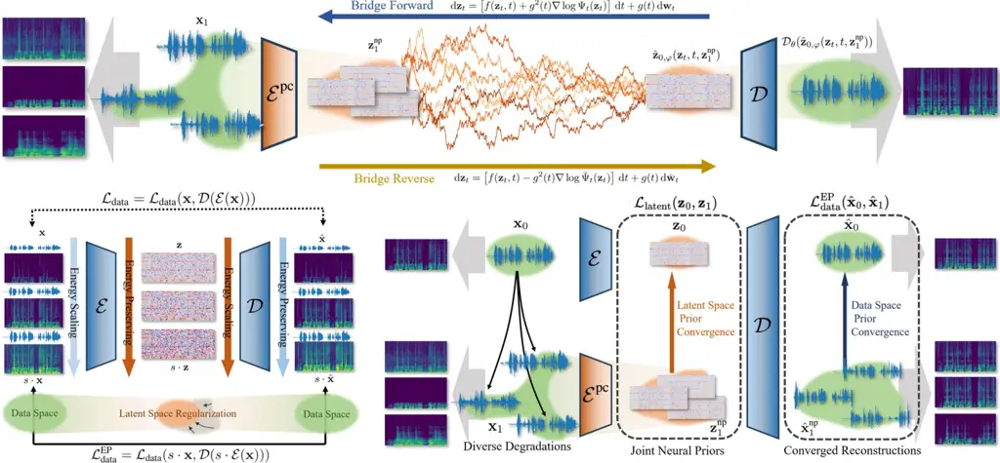

Figure 1: Overview of VoiceBridge. The upper part demonstrates the
designed LBM-based GSR system. The lower part shows our approaches to
building a structural latent space and converging a joint neural prior.
On the left, EP-VAE requires alignment between the latent and data space
at varying energy levels. On the right, a joint neural is encoded to
reduce the distance between LQ priors and the HQ target, facilitating
LBM reconstruction.

## 3 VoiceBridge

In this section, we first present our designed LBM-based GSR system, and
then introduce the three innovations leading to holistic improvement,
namely EP-VAE, joint neural prior, and denoiser-to-generator alignment,
respectively.

### 3.1 Latent Bridge Transformer for GSR

In VoiceBridge, we construct the boundary distributions of bridge
models, namely the high-quality target and the low-quality prior, as
follows. Given a clean and full-band speech signal
$`\mathbf{x}_{0}\in\mathbb{R}^{L}`$, to simulate real-world speech
distortions, we construct the degraded version
$`\mathbf{x}_{1}\in\mathbb{R}^{L}`$ with a degradation operator
$`\mathcal{T}`$:

```math
\displaystyle\mathbf{x}_{1}=\mathcal{T}(\mathbf{x}_{0}), \tag{1}
```

where $`\mathcal{T}`$ is sampled from a range of speech degradation
methods, including additive noise, reverberation, bandwidth limitation,
clipping, vocal effects, and their random mixtures. Namely, for each
ground-truth $`\mathbf{x}_{0}`$, VoiceBridge considers numerous
different LQ prior $`\mathbf{x}_{1}`$, rather than considering a fixed
degradation method as a single speech enhancement task (Jukić et al.,
2024; Li et al., 2025a; Li et al., 2025b). A more detailed data
construction process at the training stage is introduced in Appendix B.

Given constructed LQ and HQ waveform pairs
$`(\mathbf{x}_{0},\mathbf{x}_{1})`$, we directly compress the speech
waveform into latent representations, obtaining the latent target and
prior, $`\mathbf{z}_{0}\in\mathbb{R}^{c\times l}`$ and
$`\mathbf{z}_{1}\in\mathbb{R}^{c\times l}`$. Prior works (Li et al.,
2025a; Jukić et al., 2024) mainly conduct bridge modeling in the data
space, either in the waveform or spectrogram domain, to handle single
tasks such as speech super-resolution or speech enhancement. However, we
find that models in these domains struggle in the complex GSR scenario
and 48kHz settings. Directly performing SB in the data space takes great
modeling and computational effort. Meanwhile, raw speech signals include
massive redundant information at high frequencies, which can be
effectively compressed by VAEs, resulting in a more compact latent
space. Latent compression reduces sequence length by more than an order
of magnitude, enabling a single 544M transformer LBM to handle all
tasks. Details experiments proving the necessity of the latent SB design
is shown in Appendix I

In comparison with alternative speech compression representations, the
waveform latent naturally preserves the data-to-data generative process
for the LQ-to-HQ speech tasks without suffering from area removal (Kong
et al., 2025), which is important to a range of tasks in GSR. For
example, for the down-sampling degradation and its mixture with other
degradation methods, GSR systems are usually required to generate the
48 kHz waveform from its 2 kHz or even 1 kHz version (Andreev et al.,
2023; Ku et al., 2025). In these settings, the prior information
contained in the spectrograms (Mandel et al., 2023; Kong et al., 2025)
and the latent space of the mel-spectrogram (Liu et al., 2022) will be
very limited because of their large-scale area removal, which may hinder
the final restoration performance as mentioned by (Lim et al., 2018;
Kong et al., 2025).

Given these paired latents $`(\mathbf{z}_{0},\mathbf{z}_{1})`$, we model
the generative process between them as a Tractable Schrödinger Bridge, a
probabilistic interpolation between two marginal distributions over
time. The SB problem seeks the stochastic trajectory $`p_{t}`$
connecting two distributions $`p_{0},p_{1}`$ which minimizes the KL
divergence to a reference diffusion process. When we take the marginal
distributions $`p_{0},p_{1}`$ to be Gaussian distributions around the
latent pairs $`(\mathbf{z}_{0},\mathbf{z}_{1})`$, the generally
intractable SB problem will have a closed-form solution (Bunne et al.,
2023; Chen et al., 2023), where the interpolated distribution $`p_{t}`$
at time $`t`$ is a Gaussian:

```math
\displaystyle p_{t}=\mathcal{N}(\frac{\alpha_{t}\bar{\sigma}_{t}^{2}}{\sigma_{1}^{2}}\mathbf{z}_{0}+\frac{\bar{\alpha_{t}}\sigma_{t}^{2}}{\sigma_{1}^{2}}\mathbf{z}_{1},\frac{\alpha_{t}^{2}\bar{\sigma}_{t}^{2}\sigma_{t}^{2}}{\sigma_{1}^{2}}\mathbf{I}) \tag{2}
```

where $`\alpha_{t},\sigma_{t}`$ are defined by the reference diffusion
process. A neural network is then applied to solve the bridge trajectory
from any middle distribution $`p_{t}`$, eventually generating
$`\mathbf{z}_{0}\sim p_{0}`$ from given $`\mathbf{z}_{1}\sim p_{1}`$ by
sampling through the solved trajectory (Chen et al., 2023).
Following (Chen et al., 2023; Li et al., 2025a), we re-parameterize the
neural network to directly predict $`\mathbf{z}_{0}`$, optimizing:

```math
\displaystyle\mathcal{L}_{\text{bridge}}(\varphi)=\mathbb{E}_{\begin{subarray}{c}\mathbf{x}_{0}\sim p_{\text{data}},\;\mathbf{x}_{1}=\mathcal{T}(\mathbf{x}_{0})\\
\mathbf{z}_{0}=\mathcal{E}(\mathbf{x}_{0}),\;\mathbf{z}_{1}=\mathcal{E}(\mathbf{x}_{1})\end{subarray}}\bigl\|\,\hat{\mathbf{z}}_{0,\varphi}(\mathbf{z}_{t},t,\mathbf{z}_{1})-\mathbf{z}_{0}\bigr\|_{2}^{2} \tag{3}
```

where $`\hat{\mathbf{z}}_{0,\varphi}`$ denotes the latent predicted by
the neural network with trainable parameters $`\varphi`$;
$`\mathbf{z}_{0},\mathbf{z}_{1}`$ are the paired latent representations
encoded from the HQ signal and its degraded LQ versions, respectively;
$`\mathbf{z}_{t}`$ is constructed with Equation 2. For generalizable
training, we explore combining the advantage of transformer
architecture, namely good scalability as shown in diffusion-based both
image (Peebles and Xie, 2023; Bao et al., 2023) and audio
generation (Evans et al., 2024b), with the bridge generative framework.
More discussion of tractable Schrödinger bridge models is provided in
Appendix C. The details of network architecture are introduced in
Appendix D.

### 3.2 Energy-Preserving VAE

As shown in Equation 3, the prior and target in VoiceBridge,
$`(\mathbf{z}_{0},\mathbf{z}_{1})`$, are compressed from the
corresponding waveform $`(\mathbf{x}_{0},\mathbf{x}_{1})`$. The
compression network, namely VAE (Kingma et al., 2019), is employed to
reduce the redundant information in waveform space to allow efficient
training, while ensuring the reconstruction quality. Generally, the
training of audio waveform VAE (Evans et al., 2024b) with network
parameters $`\theta`$ optimizes the objectives on data-space
reconstruction $`\mathcal{L}_{\text{data}}`$ and latent-space
regularization $`\mathcal{L}_{\text{lat.}}`$:

```math
\displaystyle\mathcal{L}_{\text{vae}} \displaystyle=\mathcal{L}_{\text{data}}(\mathcal{D}_{\theta}(\mathcal{E}_{\theta}(\mathbf{x})),\mathbf{x})+\mathcal{L}_{\text{lat.}}(\mathcal{E}_{\theta}(\mathbf{x}),\mathbf{z}_{\text{ref}}), \tag{4}
```

where the term $`\mathcal{L}_{\text{data}}`$ is typically composed of
reconstruction loss, adversarial loss, and feature matching loss between
input signal $`\mathbf{x}`$ and reconstructed version
$`\mathcal{D}(\mathcal{E}(\mathbf{x}))`$, while the term
$`\mathcal{L}_{\text{lat.}}`$ represents the KL divergence
regularization of the latent $`\mathbf{z}=\mathcal{E}(\mathbf{x})`$ with
a known prior distribution $`\mathbf{z}_{\text{ref}}`$, e.g., standard
Gaussian. In recent task-specific bridge-based speech enhancement works,
the data-to-data generative framework effectively exploits the
instructive information contained in the LQ observation in either
waveform space (Li et al., 2025a) or STFT representations (Jukić et al.,
2024; Kong et al., 2025; Han et al., 2025). Hence, when designing
a latent-to-latent GSR system, we naturally explore preserving the
advantages of bridge models from the data space to the encoded latent
space. In VoiceBridge, to facilitate latent SB modeling, we introduce a
novel technique, EP-VAE, to enhance the consistency between data and
latent from the perspective of scale equivariance. Specifically, we add
an EP constraint into the VAE training objective, expanding the
data-space loss $`\mathcal{L}_{\text{data}}`$ in Equation 4 to
continuous energy levels with $`\mathcal{L}_{\text{data}}^{\text{ep}}`$:

```math
\displaystyle\mathcal{L}_{\text{ep}} \displaystyle=\mathcal{L}^{\text{ep}}_{\text{data}}(\mathcal{D}_{\theta}(s\cdot\mathcal{E}_{\theta}(\mathbf{x})),s\cdot\mathbf{x})+\mathcal{L}_{\text{lat.}}(\mathcal{E}_{\theta}(\mathbf{x}),\mathbf{z}_{\text{ref}}), \tag{5}
```

where $`s\sim\mathcal{U}(0.5,2)`$ is a random scaling factor sampled
from a uniform distribution. The EP-VAE is required to maintain the
rescaling of latent $`\mathbf{z}`$ on the reconstructed signal
$`\mathbf{x}`$: when the latent energy is rescaled by $`s`$ times to
$`s\cdot\mathbf{z}=s\cdot\mathcal{E}(\mathbf{x})`$, the reconstruction
signal should have energy rescaled by $`s`$ times to
$`s\cdot\mathbf{x}`$ as well. By strengthening waveform-latent alignment
with extra regularization at diverse energy levels, we obtain a more
structural latent space, which facilitates LBM to reconstruct the
distribution of latent HQ target, namely $`\mathbf{z}_{0}`$, from the
informative latent prior $`\mathbf{z}_{1}`$, boosting the performance
for high-quality GSR.

### 3.3 Joint Neural Prior

In GSR systems, task diversity is one of the key features. Namely, one
target $`\mathbf{x}_{0}`$ can suffer from diverse degradations as the
generation prior $`\mathbf{x}_{1}`$, and therefore a GSR system should
be able to reconstruct the HQ target from a flexible LQ prior rather
than a fixed version. However, in the latent space, when the LQ priors
$`\mathbf{z}_{1}=\mathcal{E}(\mathbf{x}_{1})`$ are distinctly different
from each other as shown in Figure 2, it inevitably increases the
difficulty for an LBM to model diverse LQ-to-HQ tasks with a single
latent-to-latent generative process.

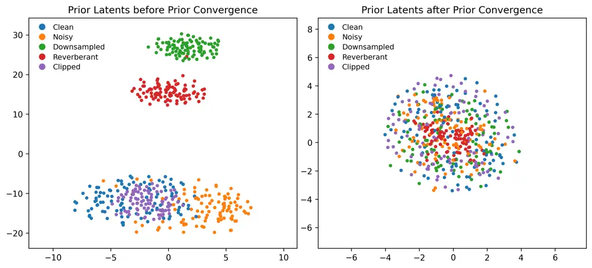

Figure 2: The tSNE visualization (Maaten and Hinton, 2008) of the prior
latent before and after prior convergence from augmented VCTK (Veaux and
Yamagishi, 2017). Note the difference between the scale of axes of the
two figures.

Task Dataset Data Domain Model PESQ($`\uparrow`$) SIG($`\uparrow`$)
BAK($`\uparrow`$) OVRL($`\uparrow`$) UTMOS($`\uparrow`$)
WVMOS($`\uparrow`$) NISQA($`\uparrow`$) General Speech Restoration
Voicefixer-GSR In-Domain Data Input 1.943 2.962 2.858 2.395 2.633 1.965
2.674 Miipher 1.491 3.335 3.992 3.051 3.617 4.171 4.136 VoiceFixer 2.043
3.302 3.971 3.005 3.439 3.800 4.159 Resemble-Enhance 2.000 3.412 4.045
3.137 3.608 4.224 4.507 UniverSE++ 2.346 3.275 3.961 2.976 3.376 3.648
4.009 AnyEnhance - 3.406\* 4.073\* 3.136\* - - 4.308\* VoiceBridge 2.471
3.494 4.113 3.285 4.339 4.295 4.203 DNS-with- Reverb Out-Domain Data
Input 1.176 1.767 1.481 1.377 1.323 -0.019 1.689 Miipher 1.324 3.401
3.975 3.128 2.973 3.195 3.629 VoiceFixer 1.407 3.355 3.982 3.052 2.526
2.961 3.704 Resemble-Enhance 1.154 3.502 4.021 3.205 2.756 3.248 4.583
UniverSE++ 1.098 2.548 3.649 2.244 1.669 2.463 3.006 AnyEnhance -
3.500\* 4.040\* 3.204\* - - 3.722\* VoiceBridge 1.583 3.581 4.127 3.318
3.382 4.195 4.588 DNS-Real Out-Domain Data (Real Data) Input - 2.985
2.510 2.212 1.940 1.483 2.160 Miipher - 3.325 3.976 3.171 3.911 3.171
4.124 VoiceFixer - 3.174 3.919 2.875 2.351 2.938 3.529
Resemble-Enhance - 3.395 3.993 3.100 2.767 3.298 4.329 UniverSE++ -
2.999 3.660 2.641 2.306 2.603 3.317 AnyEnhance - 3.488\* 3.977\*
3.161\* - - - VoiceBridge - 3.473 4.025 3.185 4.223 4.045 4.501 Speech
Enhancement VB-Demand In-Domain Data Input 1.972 3.343 3.124 2.694 3.063
2.985 2.998 SBSE 2.140 2.571 3.658 2.946 3.407 3.819 3.976 VoiceFixer
2.454 3.454 4.047 3.174 3.645 4.129 4.433 Resemble-Enhance 2.352 3.454
3.986 3.141 3.678 4.270 4.503 UniverSE++ 3.020 3.486 4.042 3.198 3.968
4.385 4.503 VoiceBridge 2.831 3.483 4.062 3.216 4.296 4.392 4.536
WSJ0-CHiME3 Out-Domain Data Input 1.248 2.486 1.868 1.795 1.823 0.128
1.520 SGMSE+ 1.723 3.517 3.946 3.191 3.282 3.547 4.294 StoRM 1.826 3.452
4.115 3.214 3.468 3.618 4.611 VoiceFixer 1.493 3.293 4.059 3.052 2.863
3.255 3.921 Resemble-Enhance 1.171 3.524 4.113 3.263 2.749 3.474 4.610
UniverSE++ 1.320 3.173 3.997 2.914 2.984 3.248 3.918 VoiceBridge 1.742
3.556 4.118 3.297 4.445 4.374 4.649

Table 1: Evaluation results on in-domain tasks, including GSR and
denoising benchmarks. The test sets covers the test splits of used
datasets, simulated unseen datasets, and in-the-wild data. Best is
bolded, and second best is underlined. \* denotes results taken from the
original paper. VoiceBridge outperforms most baselines in nearly all
metrics with a single inference step, demonstrating strong restoration
ability in complex environments.

Hence, we present joint neural prior, aiming at uniformly reducing the
distance between each LQ prior $`\mathbf{z}_{1}`$ and the ground-truth
target $`\mathbf{z}_{0}`$, thereby facilitating the bridge generation
process. Specifically, given the pre-trained EP-VAE encoder
$`\mathcal{E}`$ used for $`\mathbf{x}_{1}`$, we fine-tune it to obtain a
new version, $`\mathcal{E}^{\text{np}}`$, which is capable of converging
LQ priors $`\mathbf{z}_{1}`$ to a joint neural prior,
$`\mathbf{z}^{\text{np}}_{1}`$. Given the waveform pair
$`(\mathbf{x}_{0},\mathbf{x}_{1})`$, we encode $`\mathbf{x}_{0}`$ with
the pre-trained $`\mathcal{E}`$, and $`\mathbf{x}_{1}`$ with a trainable
encoder $`\mathcal{E}^{\text{np}}`$ initialized from $`\mathcal{E}`$.
Their latent representations
$`\mathbf{z}_{0}=\mathcal{E}(\mathbf{x}_{0})`$ and
$`\mathbf{z}_{1}^{\text{np}}=\mathcal{E}^{\text{np}}(\mathbf{x}_{1})`$
are then decoded via the shared pre-trained EP-VAE decoder
$`\mathcal{D}`$ into waveform
$`\hat{\mathbf{x}}_{0}=\mathcal{D}(\mathbf{z}_{0})`$ and
$`\hat{\mathbf{x}}_{1}^{\text{np}}=\mathcal{D}(\mathbf{z}_{1}^{\text{np}})`$.
Then, we reduce the distance between each LQ prior and the ground-truth
target from both data and latent spaces with:

```math
\displaystyle\mathcal{L}_{\text{np-enc}} \displaystyle=\mathcal{L}^{\text{ep}}_{\text{data}}(\mathcal{D}(s\cdot\mathcal{E}^{\text{np}}_{\theta}(\mathbf{x}_{1})),s\cdot\hat{\mathbf{x}}_{0})+\mathcal{L}_{\text{lat.}}(\mathcal{E}^{\text{np}}_{\theta}(\mathbf{x}_{1}),\mathbf{z}_{0}), \tag{6}
```

where $`\mathcal{L}_{\text{lat.}}`$ has been the joint neural prior loss
consisting of MSE loss and cosine similarity loss as introduced in
Appendix D, and $`\mathcal{L}_{\text{data}}^{\text{ep}}`$ is the
data-space loss in EP-VAE training modified for prior convergence. Prior
works (Fang et al., 2021) applies a KL convergence loss to a VAE for
speech denoising. In contrast, we add objectives including cosine
similarity in latent space and multiple supervision signals in the
reconstructed data space, in order to reduce the distance between the
latents in all geometrical measures. We prove our method achieves better
results in Appendix I.

Namely, as shown in Equation 6, the encoder $`\mathcal{E}^{\text{np}}`$
is fine-tuned with changed objectives to converge different LQ priors to
HQ target, rather than still learning the latent presentation for
reconstruction as Equation 5. Moreover, the EP constraint is preserved.
When reducing the distance between LQ priors $`\mathbf{z}_{1}`$ and the
HQ target $`\mathbf{z}_{0}`$ to achieve $`\mathbf{z}_{1}^{\text{np}}`$,
scale equivariance is simultaneously required, which inherits the EP
property to measure the consistency at varying energy levels. As shown
in Figure 2, this technique significantly closes the distance between
different LQ priors and the HQ target in the latent space, and naturally
reduces the burden of LBM modeling. A further quantitative analysis on
the prior distance is shown in Appendix H

### 3.4 From Denoiser to Generator

After training the EP-VAE encoder $`\mathcal{E}`$ with Equation 5 to
encode HQ target, its fine-tuned version $`\mathcal{E}^{\text{np}}`$
with Equation 6 for diverse LQ priors, and the shared decoder
$`\mathcal{D}`$, we can already create a structured latent space where
the different LQ priors have converged. Then, we train the bridge
transformer model that maps the joint neural prior and the HQ target
using Equation 3, while the LQ prior and condition $`\mathbf{z}_{1}`$
have been changed to $`\mathbf{z}_{1}^{\text{np}}`$ encoded by
$`\mathcal{E}^{\text{np}}`$, and the HQ target $`\mathbf{z}_{0}`$ is
compressed from $`\mathbf{x}_{0}`$ with EP-VAE encoder $`\mathcal{E}`$.

Although the latent bridge model (LBM) and the VAE decoder are trained
sequentially, their objectives are not perfectly aligned: the LBM is
optimized to predict target latents under the bridge loss, while the
decoder is optimized to reconstruct waveforms from encoder latents. At
inference, this discrepancy can lead to _cascading mismatch_: small
deviations in LBM-predicted latents may be amplified by the decoder,
degrading perceptual quality. To mitigate this issue, we introduce a
post-training stage that _jointly_ fine-tunes the LBM and the decoder,
while keeping the encoder fixed. This preserves the latent geometry
learned by the encoder, and simultaneously calibrates the decoder to the
LBM-induced latent distribution.

To ensure fine supervision from the data domain, we introduce the
data-level reconstruction loss $`\mathcal{L}_{\text{data}}`$ in VAE
training to the objectives of the post-training process. Meanwhile, as
GSR systems are required to generate speech samples with high perceptual
quality (Manjunath, 2009; Manocha et al., 2022; Babaev et al., 2024), we
incorporate a perceptual metric aligned loss
$`\mathcal{L}_{\text{perc}}`$ utilizing the PESQ (Rix et al., 2001) and
UTMOS (Saeki et al., 2022) metrics. However, including only this term
causes severe overfitting problems (de Oliveira et al., ), as the
decoder falls into a local minima of these metrics and forget faithful
reconstruction. To tackle this issue, we activate the discriminator
$`\omega`$ used in VAE training, and incorporate an adversarial
objective $`\mathcal{L}_{\text{GAN}}`$ to the joint post-training
process. The perceptual objective aligns the generation process with
human perceptual quality, and the discriminator is reponsible to spot
artifacts caused by optimizing the perceptual indicators and prevent
overfitting.

Additionally, the adversarial objective surprisingly can transform the
LBM from a multi-step denoiser into a single-step generator, enabling
one-step inference without distillation. In the LBM training stage
guided by the MSE loss 3, the model learns an optimal
$`\hat{\mathbf{z}}_{0,\varphi}`$ estimating

```math
\displaystyle\arg\min_{\hat{\mathbf{z}}_{0,\varphi}}\ \mathbb{E}\left[\|\mathbf{z}_{0}-\hat{\mathbf{z}}_{0,\varphi}(\mathbf{z}_{t},\mathbf{z}_{1}^{\text{np}})\|_{2}^{2}\right]=\mathbb{E}[\mathbf{z}_{0}\mid\mathbf{z}_{t},\mathbf{z}_{1}^{\text{np}}], \tag{7}
```

The one-step prediction of $`\hat{\mathbf{z}}_{0,\varphi}`$ is not a
sample from the target distribution, but a conditional expectation
symbolizing the denoising target. However, the adversarial loss aims to
$`\min_{\varphi}\ \max_{\omega}\ \mathcal{L}_{\text{GAN}}(\varphi,\omega)`$,
leading $`\hat{\mathbf{z}}_{0,\varphi}`$ from the conditional
expectation toward the conditional distribution

```math
\displaystyle p_{\varphi}(\mathbf{z}_{0}\mid\mathbf{z}_{t},\mathbf{z}_{1}^{\text{np}})=p_{\text{data}}(\mathbf{z}_{0}\mid\mathbf{z}_{t},\mathbf{z}_{1}^{\text{np}}), \tag{8}
```

at the global optimum, which gives the model one-step restoration
ability. Detailed derivations are in Appendix E

Technically, we perform a post-training stage for both the LBM and the
EP-VAE decoder, mitigating their cascading mismatches in inference as
well as aligning both the bridge sampling and VAE decoding with human
perceptual quality. The post-training objectives for LBMs and the
decoder include:

```math
\displaystyle\mathcal{L}_{\text{pt}}= \displaystyle\mathcal{L}_{\text{bridge}}(\varphi)+\mathcal{L}_{\text{data}}(\theta,\varphi)
```

```math
\displaystyle+ \displaystyle\mathcal{L}_{\text{perc}}(\theta,\varphi)+\mathcal{L}_{\text{GAN}}(\theta,\varphi,\omega), \tag{9}
```

where $`\mathcal{L}_{\text{perc}}`$ denotes a PESQ loss and a UTMOS
loss, and $`\mathcal{L}_{\text{data}}`$ is the data level MSE loss and
$`\mathcal{L}_{\text{GAN}}`$ the adversarial loss. These three losses
are all calculated between decoded signal
$`\hat{\mathbf{z}}_{0,\varphi}(\mathbf{z}_{t},t,\mathbf{z}^{\text{np}}_{1})`$
and ground truth $`\mathbf{x}_{0}`$, with weights updated on LBM
$`\varphi`$, decoder $`\theta`$, and discriminator $`\omega`$
differently.

### 3.5 Training Pipeline Overview

In actual training, VoiceBridge integrates EP-VAE and the joint neural
prior, and achieves denoiser-to-generator alignment through a four-stage
training pipeline: (1) pre-training an EP-VAE on clean speech with
Equation 4; (2) fine-tuning the EP-VAE encoder to learn a joint neural
prior on distorted inputs with Equation 6; (3) training the transformer
model to solve the SB in latent space with Equation 3 and (4) jointly
fine-tuning the LBM and the decoder to enhance perceptual alignment with
Equation 9.

Task Dataset Data Domain Model($`\uparrow`$) WVMOS($`\uparrow`$)
UTMOS($`\uparrow`$) DNSMOS($`\uparrow`$) NISQA($`\uparrow`$)
PESQ($`\uparrow`$) WER($`\downarrow`$) Codec Artifact Removal VCTK
(Encodec) In-Domain Data Input 4.036 2.889 2.822 3.661 2.210 -
VoiceFixer 3.956 3.229 3.003 4.436 1.984 - Resemble-Enhance 4.054 3.294
3.063 4.665 2.059 - UniverSE++ 4.002 2.954 2.868 3.861 2.320 -
VoiceBridge 4.131 3.683 3.132 4.469 2.361 - TTS Quality Improvement
Seed-TTS (MoonCast) Out-Domain Data Input 3.971 3.623 3.120 3.922 -
5.93% VoiceFixer 3.832 3.481 3.145 4.004 - 5.51% Resemble-Enhance 3.612
3.291 3.176 4.121 - 12.88% UniverSE++ 3.747 3.446 3.143 4.217 - 8.59%
VoiceBridge 4.098 3.821 3.227 4.464 - 5.40% Seed-TTS (MaskGCT)
Out-Domain Data Input 3.673 3.427 3.122 3.964 - 5.63% VoiceFixer 3.483
3.288 3.186 4.349 - 6.02% Resemble-Enhance 3.818 3.594 3.312 4.691 -
7.78% UniverSE++ 3.324 3.277 3.180 4.308 - 7.21% VoiceBridge 4.172 4.051
3.326 4.769 - 5.66%

Table 2: Enhancement results on OOD tasks, including codec artifact
removal and TTS quality improvement. VoiceBridge exhibits consistent
improvement on generated speech quality.

## 4 Experiments

### 4.1 Experimental Setup

VF RE USE VB GT Voicefixer-GSR 3.77 3.97 2.91 4.32 4.43 DNS-Real 2.90
3.02 2.04 4.28 -

Table 3: MOS results on VoiceFixer-GSR and DNS-Real datasets, covering
both simulated and real data. VoiceBridge outperforms other baselines on
subjective evaluation results collected in human listening experiments.

We train and evaluate VoiceBridge on GSR task, and also test its
zero-shot generalization to out-of-domain (OOD) data and tasks. Our full
training corpus contains approximately 1138 hours of clean speech audio
at 48 kHz, constructed only by combining public datasets. Distortions
are synthesized using publicly available noise datasets and room impulse
responses, following previous works (Liu et al., 2022; Zhang et al.,
2025b). The compression network adopts the Oobleck (Evans et al., 2024b)
arthitecture. The LBM is built with a 544M-parameter Transformer
backbone (Evans et al., 2024a). The training process is described in
Section 3.5. Only one inference step is used. We provide detailed
information on the VAE compression network, datasets, and evaluation
methods in Appendix D, F, and G, respectively.

### 4.2 General Speech Restoration

We first evaluate VoiceBridge’s performance on in-domain restoration
tasks, including simulated GSR task and downstream single-task speech
enhancement. Following previous works, we use VoiceFixer-GSR (Liu et
al., 2022), DNS-with-Reverb (Reddy et al., 2021a) as the simulated GSR
benchmarks. Notably, data from the DNS-Challenge (Reddy et al., 2021a)
are excluded in our training data, providing a mismatch in training test
conditions for VoiceBridge. We compare VoiceBridge against other GSR
models including Miipher (Koizumi et al., 2023), VoiceFixer (Liu et al.,
2022), Resemble-Enhance (Niu, 2024), UniverSE++ (Scheibler et al., 2024)
and AnyEnhance (Zhang et al., 2025b). Despite these models, we further
compare VoiceBridge to close-sourced models with there reported results
or using there demo samples in Appendix G.

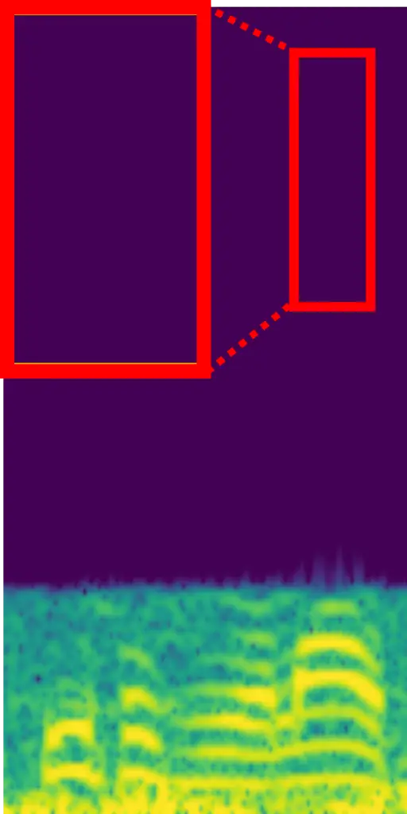

(a) LQ

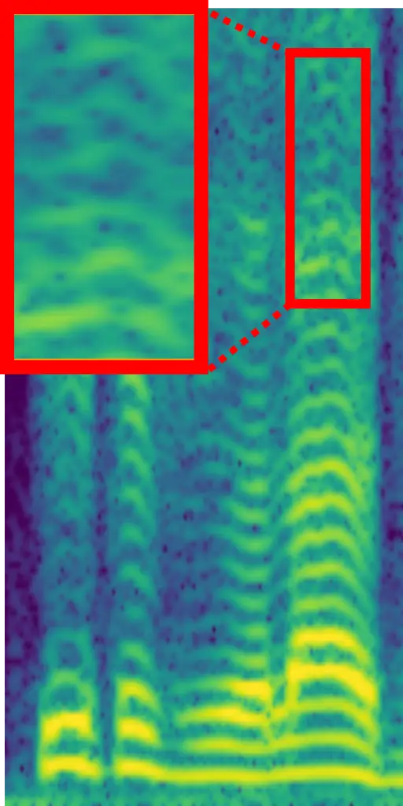

(b) VF

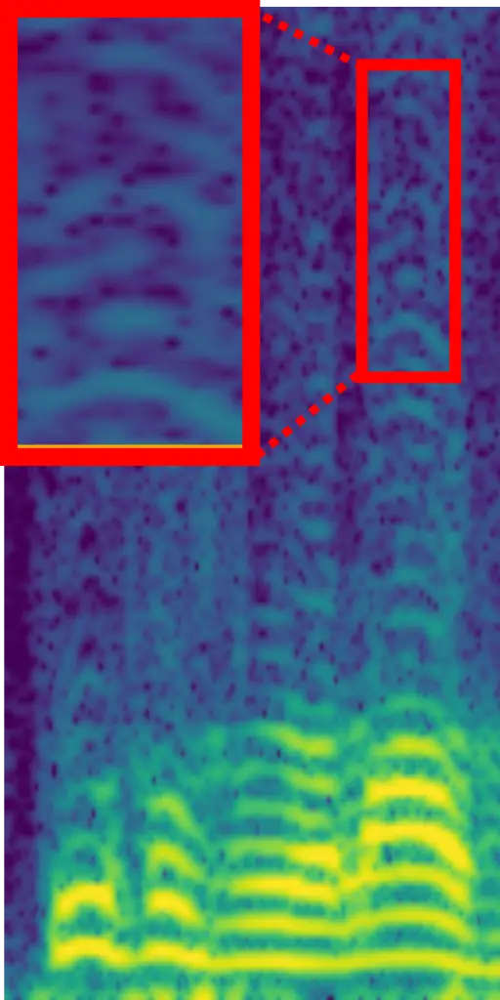

(c) RE

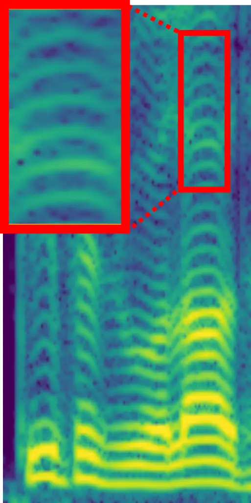

(d) VB

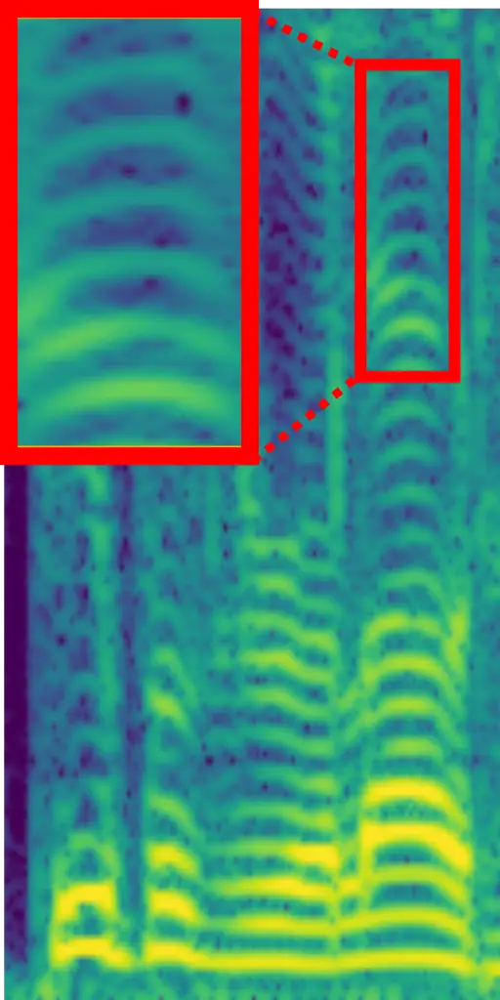

(e) GT

Figure 3: STFT spectrograms of the same piece of speech restored by
different models (a) Low-Quality Signal. (b) VoiceFixer (b)
Resemble-Enhance (d) VoiceBridge (Ours) (e) Ground Truth.

VoiceBridge and the four baselines have included five classes of
generative models: bridge, mapping-based network, flow-matching,
diffusion, and masked generative models. Such diversity enables a broad
comparison across generative modeling strategies. Recently,
non-intrusive metrics which measure perceptual quality without reference
signals are believed to be more relevant to generative speech
restoration (Manjunath, 2009; Manocha et al., 2022; Babaev et al.,
2024). In our evaluation, we report both intrusive and non-intrusive
metrics, incorporating PESQ (Rix et al., 2001), DNSMOS (Reddy et al.,
2021b) (SIG, BAK, OVRL), UTMOS (Saeki et al., 2022), WV-MOS (Ogun et
al., 2023), and NISQA (Mittag et al., 2021).

The GSR evaluation results are shown in Table 1. VoiceBridge achieves
the best or the second-best results on almost every metric across all
datasets, demonstrating strong multi-degradation restoration capability
on both simulated and real-world audios. We further conduct a user study
with VoiceFixer-GSR and DNS-Real to investigate human preference for
each GSR system. The result, as shown in Table 3, demonstrates
VoiceBridge’s superior performance, achieving significantly higher Mean
Opinion Score (MOS) on both simulated and real audio samples. A case
study is shown in Figure 3, where VoiceBridge faithfully generates
different components of the ground truth with four steps in comparison
with other methods.

Further, as a GSR model, VoiceBridge naturally handles all kinds of
restoration tasks within the data distribution. We test VoiceBridge on
the task of traditional Speech Enhancement (SE), comparing it to
task-specific models including SGMSE+ (Richter et al., 2023; Welker et
al., 2022), StoRM (Lemercier et al., 2023b) and SBSE (Jukić et al., 2024) on benchmarks involving VoiceBank-DEMAND (Valentini-Botinhao, 2017) and WSJ-CHiME (Barker et al., 2015). The results are shown in
Table 1, where VoiceBridge outperforms data-space SB models SBSE (Jukić
et al., 2024), diffusion models, and flow-matching models on various
metrics. Note that the WSJ0 dataset, which the SGMSE+ and StoRM models
are trained on, is excluded from our training dataset, exceptionally
demonstrating the superiority of VoiceBridge. Apart from SE, evaluation
for other tasks has also been conducted, with details in Appendix G.

### 4.3 Out of Domain Tasks

Moreover, as a probabilistic generative model, VoiceBridge captures
target distributional information rather than establishing a
point-to-point mapping function. Therefore, it shows strong zero-shot
ability on OOD restoration tasks that are unseen during the training
stage. We evaluate VoiceBridge and other GSR models on codec artifact
removal, where all models are tested to repair reconstructed audio from
VCTK by the Encodec (Défossez et al., 2022) model operating at 3 kbps
bitrate. Beyond that, We originally propose another application scenario
of GSR models: further refining the perceptual quality of generation
results of text-to-speech (TTS) models. We take two recent methods,
MaskGCT (Wang et al., 2024b) and MoonCast (Ju et al., 2025), as the TTS
baseline methods to synthesize speech on the Seed-TTS (Boson AI, 2025;
Peng et al., 2025) benchmark, and then apply VoiceBridge and other GSR
baselines to refine the generated speech samples. We evaluate using both
GSR and TTS metrics.

As Shown in Table 2, VoiceBridge consistently outperforms baseline
models on various metrics, exhibiting the zero-shot performance of
VoiceBridge on OOD tasks. Importantly, in Table 2, other GSR models may
fail to further enhance the model-generated speech, while VoiceBridge
reliably improves the quality. This demonstrates VoiceBridge’s strong
capability of comprehensively refining audio quality.

### 4.4 Ablation Studies

We conduct an ablation study on our designs by training four model
variants: with or without EP, and with or without the joint neural
prior. All variants share the same latent bridge and decoder training
pipeline for fair comparison. As shown in Figure 4(d), introducing the
joint neural prior or adding the EP constraint leads to a noticeable
improvement, while adding both achieves the best overall performance,
demonstrating the complementary benefits of these two mechanisms.

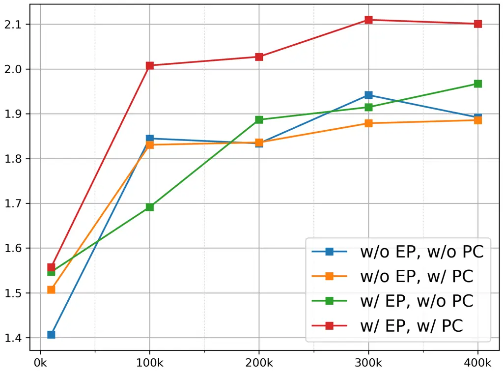

(a) PESQ

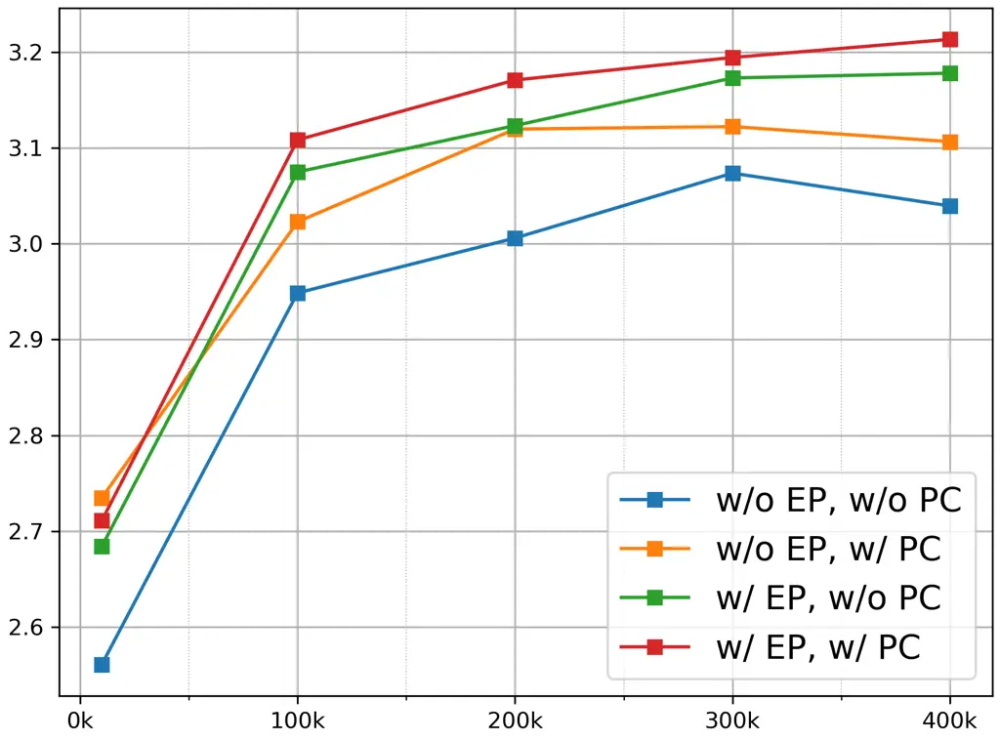

(b) DNSMOS-OVRL

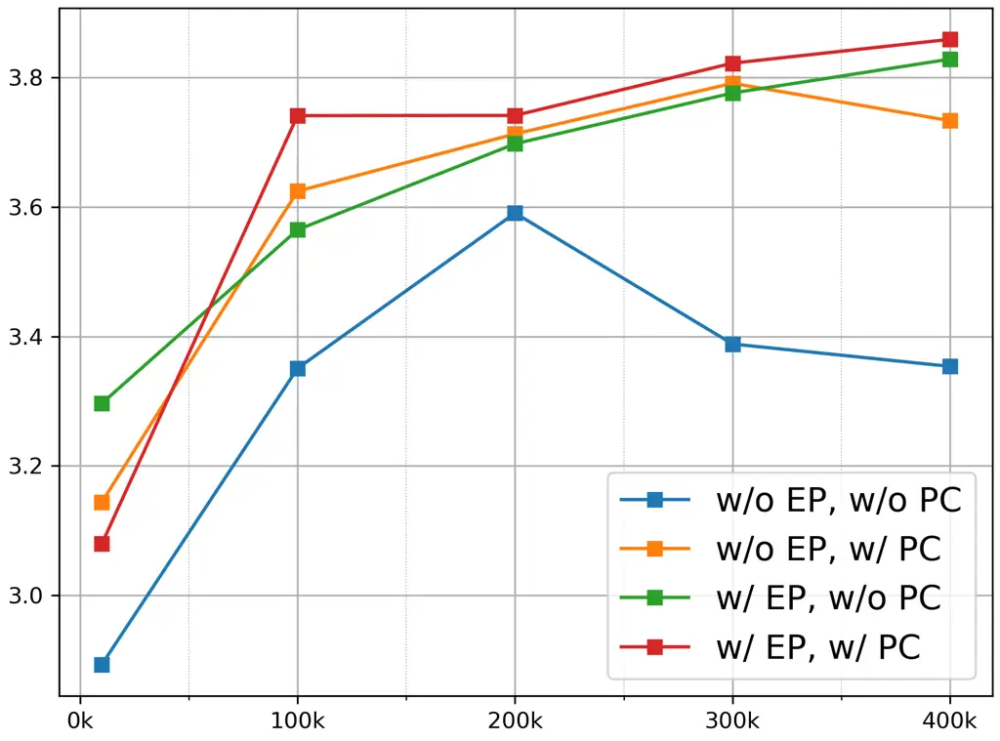

(c) WV-MOS

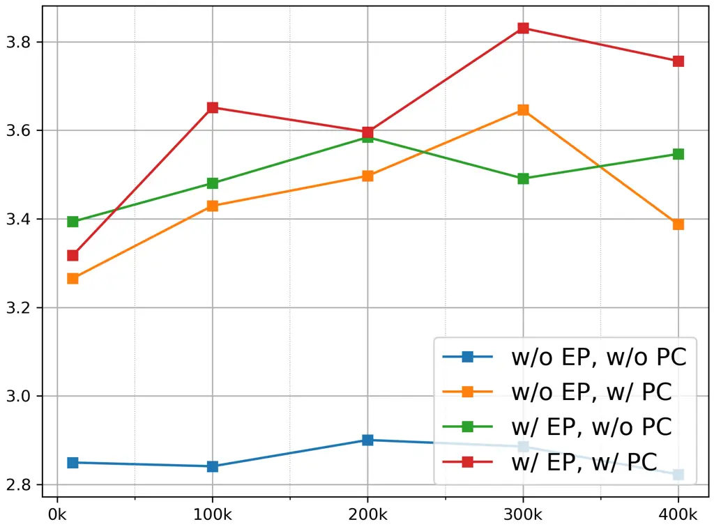

(d) NISQA

Figure 4: Ablation study with different GSR metrics. The horizontal axis
shows training steps, and the vertical axis displays performance. The
models differ in whether EP-VAE and joint neural prior are employed.

Voicefixer-GSR (Liu et al., 2022) Finetuned Module Finetuning Objective
PESQ ($`\uparrow`$) DNSMOS ($`\uparrow`$) UTMOS ($`\uparrow`$) WV-MOS
($`\uparrow`$) NISQA ($`\uparrow`$) Bridge $`\mathcal{L}_{\text{lat.}}`$
2.067 3.031 3.645 4.153 4.067
$`\mathcal{L}_{\text{lat.}}+\mathcal{L}_{\text{rec}}`$ 2.125 3.049 3.649
4.207 3.524
$`\mathcal{L}_{\text{lat.}}+\mathcal{L}_{\text{rec}}+\mathcal{L}_{\text{gan}}`$
2.058 3.069 3.533 4.055 3.362
$`\mathcal{L}_{\text{lat.}}+\mathcal{L}_{\text{rec}}+\mathcal{L}_{\text{perc}}`$
2.171 3.038 3.625 4.122 3.466
$`\mathcal{L}_{\text{lat.}}+\mathcal{L}_{\text{rec}}+\mathcal{L}_{\text{gan}}+\mathcal{L}_{\text{perc}}`$
2.182 3.049 3.599 4.158 3.487 Bridge $`+`$ Decoder
$`\mathcal{L}_{\text{lat.}}+\mathcal{L}_{\text{rec}}`$ 2.297 2.952 3.588
3.972 2.301
$`\mathcal{L}_{\text{lat.}}+\mathcal{L}_{\text{rec}}+\mathcal{L}_{\text{gan}}`$
2.169 2.938 3.475 3.709 3.091
$`\mathcal{L}_{\text{lat.}}+\mathcal{L}_{\text{rec}}+\mathcal{L}_{\text{perc}}`$
3.014 3.025 4.267 4.252 3.167
$`\mathcal{L}_{\text{lat.}}+\mathcal{L}_{\text{rec}}+\mathcal{L}_{\text{gan}}+\mathcal{L}_{\text{perc}}`$
2.722 3.091 4.228 4.366 4.172

Table 4: Evaluation results on VoiceFixer-GSR (Liu et al., 2022) for
different post-training processes of VoiceBridge.

Further, we ablate the training objectives and update strategy in the
post-training stage. Starting from the pre-trained LBM, we run 9
post-training variants that differ in (i) the loss objective and (ii)
whether the decoder is updated. We consider two groups: (1) decoder
frozen, where we fine-tune only the bridge using a data-space loss
between decoded audio and clean audio; and (2) joint post-training,
where the bridge and decoder are fine-tuned together.

We evaluate the loss combinations in Table 4. As a reference baseline,
we continue training with the original latent-space MSE objective
$`\mathcal{L}_{\text{lat.}}`$ (Line 1). For post-training in the data
domain, we use MRSTFT reconstruction loss $`\mathcal{L}_{\text{rec}}`$
(the same loss used in VAE training) as the base objective (Lines 2
and 6). We then add the GAN loss $`\mathcal{L}_{\text{gan}}`$
(adversarial + feature matching) and the perceptual term
$`\mathcal{L}_{\text{perc}}`$, first individually (Lines 3,4,7,8) and
then together (Lines 5 and 9). Each objective variant is tested in both
update strategies (decoder frozen vs. joint). All hyperparameters follow
the VAE training setup in Appendix D. All results use 4 inference steps.

As shown in Table 4, freezing the decoder yields little improvement
regardless of the objective. Under joint post-training, using
$`\mathcal{L}_{\text{rec}}`$ alone, or $`\mathcal{L}_{\text{rec}}`$ with
$`\mathcal{L}_{\text{gan}}`$, produces negligible or even negative
gains. This may leads to the change in the MSE objective, causing
approximation error in the bridge transport trajectory. In contrast,
adding only $`\mathcal{L}_{\text{perc}}`$ substantially increases PESQ
and UTMOS but degrades other metrics, consistent with metric-overfitting
behavior reported in PESQetarian (de Oliveira et al., ). The generated
audio shares a common audible artifact, degrading listening experience.
Intuitively, since the evaluator is fixed, the decoder can learn “hacks”
that exploit the perceptual scorer rather than improving true audio
quality.

Combining $`\mathcal{L}_{\text{gan}}`$ and $`\mathcal{L}_{\text{perc}}`$
prevents such metric hacking. The final setting (Line 9) yields a
consistent and significant improvement across all metrics, indicating a
genuine gain in perceptual quality. A plausible explanation is that
overfitting-induced artifacts are readily detected by the discriminator,
forcing the model to raise perceptual scores by improving generation
quality.

We also conduct further ablation experiments regarding the design space
of bridge modeling and EP-VAE training objectives. Results are shown in
Appendix I due to page limit.

## 5 Conclusion

Our work presents VoiceBridge, modeling diverse LQ-to-HQ tasks in GSR
with a single latent-to-latent generative framework backed by a
transformer architecture. By introducing three novel techniques,
including scale-equivariant regularization, joint neural prior, and the
denoiser to generator post-training process, we allow VoiceBridge to
consistently outperform strong GSR baselines on 48 kHz benchmarks with
single step inference and demonstrate strong performance on unseen
tasks. Ablations confirm the holistic improvements made by our
innovations.

## 6 Impact Statement

This paper presents work whose goal is to advance the field of
Generative Bridge Models, and General Speech Restoration. There are many
potential societal consequences of our work, none which we feel must be
specifically highlighted here.

## References

- Anastassiou et al. (2024) P. Anastassiou, J. Chen, J. Chen, Y.
  Chen, Z. Chen, Z. Chen, J. Cong, L. Deng, C. Ding, L. Gao, et al.
  Seed-tts: a family of high-quality versatile speech generation models.
  arXiv preprint arXiv:2406.02430. Cited by: §G.1.
- Andreev et al. (2023) P. Andreev, A. Alanov, O. Ivanov, and D. Vetrov
  Hifi++: a unified framework for bandwidth extension and speech
  enhancement. In ICASSP 2023-2023 IEEE International Conference on
  Acoustics, Speech and Signal Processing (ICASSP), pp. 1–5. Cited by:
  Table 5, §G.4, §G.4, §G.6, §3.1.
- Babaev et al. (2024) N. Babaev, K. Tamogashev, A. Saginbaev, I.
  Shchekotov, H. Bae, H. Sung, W. Lee, H. Cho, and P. Andreev FINALLY:
  fast and universal speech enhancement with studio-like quality.
  Advances in Neural Information Processing Systems 37, pp. 934–965.
  Cited by: §A.2, §A.2, §G.3, §G.6, §G.6, Table 10, Table 10, §2, §3.4,
  §4.2.
- Baevski et al. (2020) A. Baevski, Y. Zhou, A. Mohamed, and M. Auli
  Wav2vec 2.0: a framework for self-supervised learning of speech
  representations. Advances in neural information processing systems 33,
  pp. 12449–12460. Cited by: §G.3.
- Bakhturina et al. (2021) E. Bakhturina, V. Lavrukhin, B. Ginsburg,
  and Y. Zhang Hi-Fi Multi-Speaker English TTS Dataset. arXiv preprint
  arXiv:2104.01497. Cited by: Appendix F.
- Bao et al. (2023) F. Bao, S. Nie, K. Xue, Y. Cao, C. Li, H. Su, and J.
  Zhu All are Worth Words: A ViT Backbone for Diffusion Models. In CVPR,
  Cited by: §3.1.
- Barker et al. (2015) J. Barker, R. Marxer, E. Vincent, et al. The
  third ‘chime’speech separation and recognition challenge: dataset,
  task and baselines. IEEE Workshop on Automatic Speech Recognition and
  Understanding (ASRU), pp. 504–511. Cited by: Appendix F, §G.1, §G.6,
  §4.2.
- Benesty et al. (2006) J. Benesty, S. Makino, and J. Chen Speech
  enhancement. Springer Science & Business Media. Cited by: §1.
- Birnbaum et al. (2019) S. Birnbaum, V. Kuleshov, Z. Enam, P. W. W.
  Koh, and S. Ermon Temporal film: capturing long-range sequence
  dependencies with feature-wise modulations.. Advances in Neural
  Information Processing Systems 32. Cited by: §G.4.
- Boson AI (2025) Boson AI Higgs Audio V2: Redefining Expressiveness in
  Audio Generation. Note:
  [https://github.com/boson-ai/higgs-audio](https://github.com/boson-ai/higgs-audio)GitHub
  repository. Release blog available at
  [https://www.boson.ai/blog/higgs-audio-v2](https://www.boson.ai/blog/higgs-audio-v2)
  Cited by: §G.1, §4.3.
- Bu et al. (2017) H. Bu, J. Du, X. Na, B. Wu, and H. Zheng Aishell-1:
  an open-source mandarin speech corpus and a speech recognition
  baseline. In 2017 20th conference of the oriental chapter of the
  international coordinating committee on speech databases and speech
  I/O systems and assessment (O-COCOSDA), pp. 1–5. Cited by: Appendix F.
- Bunne et al. (2023) C. Bunne, Y. Hsieh, M. Cuturi, and A. Krause The
  schrödinger bridge between gaussian measures has a closed form. In
  International Conference on Artificial Intelligence and Statistics,
  pp. 5802–5833. Cited by: §A.1, Appendix C, §3.1.
- Chen et al. (2021) T. Chen, G. Liu, and E. Theodorou Likelihood
  training of schrödinger bridge using forward-backward sdes theory.
  arXiv preprint arXiv:2110.11291. Cited by: §A.1, Appendix C, §1.
- Chen et al. (2023) Z. Chen, G. He, K. Zheng, X. Tan, and J. Zhu
  Schrodinger bridges beat diffusion models on text-to-speech synthesis.
  arXiv preprint arXiv:2312.03491. Cited by: §A.1, §A.1, Appendix C,
  Appendix C, Appendix C, §1, §1, §3.1, §3.1.
- Das et al. (2021) N. Das, S. Chakraborty, J. Chaki, N. Padhy, and N.
  Dey Fundamentals, present and future perspectives of speech
  enhancement. International Journal of Speech Technology 24 (4),
  pp. 883–901. Cited by: §1.
- \[16\] D. de Oliveira, S. Welker, J. Richter, and T. Gerkmann The
  pesqetarian: on the relevance of goodhart’s law for speech
  enhancement. Cited by: §3.4, §4.4.
- Défossez et al. (2022) A. Défossez, J. Copet, G. Synnaeve, and Y. Adi
  High fidelity neural audio compression. arXiv preprint
  arXiv:2210.13438. Cited by: §G.1, §4.3.
- Dhyani et al. (2025) T. Dhyani, F. Lux, M. Mancusi, G. Fabbro, F.
  Hohl, and N. Vu High-resolution speech restoration with latent
  diffusion model. In ICASSP 2025-2025 IEEE International Conference on
  Acoustics, Speech and Signal Processing (ICASSP), pp. 1–5. Cited by:
  §A.2, §2.
- Evans et al. (2024a) Z. Evans, C. Carr, J. Taylor, S. Hawley, and J.
  Pons Fast Timing-Conditioned Latent Audio Diffusion. arXiv:2402.04825.
  Cited by: §D.1, §4.1.
- Evans et al. (2024b) Z. Evans, J. D. Parker, C. Carr, Z. Zukowski, J.
  Taylor, and J. Pons Long-form music generation with latent diffusion.
  arXiv preprint arXiv:2404.10301. Cited by: §D.1, §3.1, §3.2, §4.1.
- Falk et al. (2010) T. H. Falk, C. Zheng, and W. Chan A non-intrusive
  quality and intelligibility measure of reverberant and dereverberated
  speech. IEEE Transactions on Audio, Speech, and Language Processing 18
  (7), pp. 1766–1774. Cited by: §G.4.
- Fang et al. (2021) H. Fang, G. Carbajal, S. Wermter, and T. Gerkmann
  Variational autoencoder for speech enhancement with a noise-aware
  encoder. Cited by: §I.3, §3.3.
- Fu et al. (2021) Y. Fu, L. Cheng, S. Lv, Y. Jv, Y. Kong, Z. Chen, Y.
  Hu, L. Xie, J. Wu, H. Bu, et al. Aishell-4: an open source dataset for
  speech enhancement, separation, recognition and speaker diarization in
  conference scenario. arXiv preprint arXiv:2104.03603. Cited by:
  Appendix F.
- Han and Lee (2022) S. Han and J. Lee NU-wave 2: a general neural audio
  upsampling model for various sampling rates. arXiv preprint
  arXiv:2206.08545. Cited by: §G.4.
- Han et al. (2025) S. Han, S. Lee, J. Lee, and K. Lee Few-step
  adversarial schr$`\backslash`$”$`\{`$o$`\}`$ dinger bridge for
  generative speech enhancement. arXiv preprint arXiv:2506.01460. Cited
  by: §A.1, §1, §3.2.
- \[26\] NeMo: a toolkit for Conversational AI and Large Language Models
  External Links: [Link](https://github.com/NVIDIA/NeMo) Cited by: §I.2.
- Ju et al. (2025) Z. Ju, D. Yang, J. Yu, K. Shen, Y. Leng, Z. Wang, X.
  Tan, X. Zhou, T. Qin, and X. Li MoonCast: high-quality zero-shot
  podcast generation. arXiv preprint arXiv:2503.14345. Cited by: §G.1,
  §4.3.
- Jukić et al. (2024) A. Jukić, R. Korostik, J. Balam, et al.
  Schrödinger bridge for generative speech enhancement. arXiv preprint
  arXiv:2407.16074. Cited by: §A.1, §A.1, §G.1, §G.2, §G.4, §G.4, §1,
  §2, §3.1, §3.1, §3.2, §4.2.
- Kingma et al. (2019) D. Kingma M. Welling et al. An introduction to
  variational autoencoders. Foundations and Trends® in Machine Learning
  12 (4), pp. 307–392. Cited by: §1, §3.2.
- Ko et al. (2017) T. Ko, V. Peddinti, D. Povey, M. Seltzer, and S.
  Khudanpur A study on data augmentation of reverberant speech for
  robust speech recognition. In 2017 IEEE international conference on
  acoustics, speech and signal processing (ICASSP), pp. 5220–5224. Cited
  by: Appendix F.
- Koizumi et al. (2023) Y. Koizumi, H. Zen, S. Karita, et al. Miipher: a
  robust speech restoration model integrating self-supervised speech and
  text representations. In 2023 IEEE Workshop on Applications of Signal
  Processing to Audio and Acoustics (WASPAA), Vol. , pp. 1–5. External
  Links:
  [Document](https://dx.doi.org/10.1109/WASPAA58266.2023.10248089) Cited
  by: §4.2.
- Kolbæk et al. (2016) M. Kolbæk, Z. Tan, and J. Jensen Speech
  intelligibility potential of general and specialized deep neural
  network based speech enhancement systems. IEEE/ACM Transactions on
  Audio, Speech, and Language Processing 25 (1), pp. 153–167. Cited by:
  §1.
- Kong et al. (2020) Z. Kong, W. Ping, J. Huang, K. Zhao, and B.
  Catanzaro Diffwave: a versatile diffusion model for audio synthesis.
  arXiv preprint arXiv:2009.09761. Cited by: §I.2.
- Kong et al. (2025) Z. Kong, K. J. Shih, W. Nie, A. Vahdat, S.
  Lee, J. F. Santos, A. Jukic, R. Valle, and B. Catanzaro A2SB:
  audio-to-audio schrodinger bridges. arXiv preprint arXiv:2501.11311.
  Cited by: §3.1, §3.2.
- Kouzelis et al. (2025) T. Kouzelis, I. Kakogeorgiou, S. Gidaris,
  and N. Komodakis EQ-vae: equivariance regularized latent space for
  improved generative image modeling. arXiv preprint arXiv:2502.09509.
  Cited by: §1.
- Ku et al. (2025) P. Ku, A. H. Liu, R. Korostik, S. Huang, S. Fu,
  and A. Jukić Generative speech foundation model pretraining for
  high-quality speech extraction and restoration. In ICASSP 2025-2025
  IEEE International Conference on Acoustics, Speech and Signal
  Processing (ICASSP), pp. 1–5. Cited by: §G.4, §G.6, §G.6, Table 11,
  §I.2, §2, §3.1.
- Lemercier et al. (2023a) J. Lemercier, J. Richter, S. Welker, and T.
  Gerkmann Analysing diffusion-based generative approaches versus
  discriminative approaches for speech restoration. In ICASSP, Vol. ,
  pp. 1–5. External Links:
  [Document](https://dx.doi.org/10.1109/ICASSP49357.2023.10095258) Cited
  by: §G.4.
- Lemercier et al. (2023b) J. Lemercier, J. Richter, S. Welker, and T.
  Gerkmann StoRM: a diffusion-based stochastic regeneration model for
  speech enhancement and dereverberation. IEEE/ACM Transactions on
  Audio, Speech, and Language Processing 31 (), pp. 2724–2737. External
  Links: [Document](https://dx.doi.org/10.1109/TASLP.2023.3294692) Cited
  by: §G.1, §G.2, §G.4, §4.2.
- Li et al. (2025a) C. Li, Z. Chen, F. Bao, and J. Zhu Bridge-sr:
  schr$`\backslash`$” odinger bridge for efficient sr. arXiv preprint
  arXiv:2501.07897. Cited by: §G.4, §1, §1, §2, §3.1, §3.1, §3.1, §3.2.
- Li et al. (2025b) C. Li, Z. Chen, L. Wang, and J. Zhu Audio
  Super-Resolution with Latent Bridge Models. In NeurIPS, Cited by: §1,
  §2, §3.1.
- Li et al. (2024) X. Li, Q. Wang, and X. Liu Masksr: masked language
  model for full-band speech restoration. arXiv preprint
  arXiv:2406.02092. Cited by: §A.2, §2.
- Lim et al. (2018) T. Y. Lim, R. A. Yeh, Y. Xu, M. N. Do, and M.
  Hasegawa-Johnson Time-frequency networks for audio super-resolution.
  In 2018 IEEE International Conference on Acoustics, Speech and Signal
  Processing (ICASSP), pp. 646–650. Cited by: §3.1.
- Liu et al. (2023a) A. Liu, M. Le, A. Vyas, B. Shi, A. Tjandra, and W.
  Hsu Generative pre-training for speech with flow matching. arXiv
  preprint arXiv:2310.16338. Cited by: §G.6, Table 11, §I.2, §2.
- Liu et al. (2023b) G. Liu, A. Vahdat, D. Huang, E. A. Theodorou, W.
  Nie, and A. Anandkumar I2SB: image-to-image schrodinger bridge. arXiv
  preprint arXiv:2302.05872. Cited by: §A.1.
- Liu et al. (2022) H. Liu, X. Liu, Q. Kong, Q. Tian, Y. Zhao, D.
  Wang, C. Huang, and Y. Wang VoiceFixer: A Unified Framework for
  High-Fidelity Speech Restoration. In Interspeech 2022, pp. 4232–4236
  (en). External Links:
  [Link](https://www.isca-speech.org/archive/interspeech_2022/liu22y_interspeech.html),
  [Document](https://dx.doi.org/10.21437/Interspeech.2022-11026) Cited
  by: §A.2, §A.2, Appendix F, §G.1, §G.2, §G.4, Table 15, Table 15,
  Table 16, Table 16, §2, §3.1, §4.1, §4.2, Table 4, Table 4.
- Liu et al. (2024) H. Liu, K. Chen, Q. Tian, W. Wang, and M. D.
  Plumbley AudioSR: versatile audio super-resolution at scale. In ICASSP
  2024-2024 IEEE International Conference on Acoustics, Speech and
  Signal Processing (ICASSP), pp. 1076–1080. Cited by: §G.4.
- Lu et al. (2022) Y. Lu, Z. Wang, S. Watanabe, A. Richard, C. Yu,
  and Y. Tsao Conditional diffusion probabilistic model for speech
  enhancement. In ICASSP 2022-2022 IEEE International Conference on
  Acoustics, Speech and Signal Processing (ICASSP), pp. 7402–7406. Cited
  by: §G.1.
- Lu et al. (2021) Y. Lu, Y. Tsao, and S. Watanabe A study on speech
  enhancement based on diffusion probabilistic model. In 2021
  Asia-Pacific Signal and Information Processing Association Annual
  Summit and Conference (APSIPA ASC), pp. 659–666. Cited by: §G.1.
- Maaten and Hinton (2008) L. v. d. Maaten and G. Hinton Visualizing
  data using t-sne. Journal of machine learning research 9 (Nov),
  pp. 2579–2605. Cited by: Figure 2, Figure 2.
- Mandel et al. (2023) M. Mandel, O. Tal, and Y. Adi Aero: audio super
  resolution in the spectral domain. In ICASSP 2023-2023 IEEE
  International Conference on Acoustics, Speech and Signal Processing
  (ICASSP), pp. 1–5. Cited by: §3.1.
- Manjunath (2009) T. Manjunath Limitations of perceptual evaluation of
  speech quality on voip systems. In 2009 IEEE International Symposium
  on Broadband Multimedia Systems and Broadcasting, pp. 1–6. Cited by:
  §G.3, §G.6, §3.4, §4.2.
- Manocha et al. (2022) P. Manocha, Z. Jin, and A. Finkelstein Audio
  similarity is unreliable as a proxy for audio quality. arXiv preprint
  arXiv:2206.13411. Cited by: §G.3, §G.6, §3.4, §4.2.
- Mesaros et al. (2018) A. Mesaros, T. Heittola, and T. Virtanen A
  multi-device dataset for urban acoustic scene classification. arXiv
  preprint arXiv:1807.09840. Cited by: Appendix F.
- Meyer et al. (2022) J. Meyer, D. Adelani, E. Casanova, et al.
  BibleTTS: a large, high-fidelity, multilingual, and uniquely african
  speech corpus. In Interspeech, External Links:
  [Link](https://arxiv.org/pdf/2207.03546.pdf) Cited by: Appendix F.
- Mittag et al. (2021) G. Mittag, B. Naderi, A. Chehadi, and S. Möller
  NISQA: A Deep CNN-Self-Attention Model for Multidimensional Speech
  Quality Prediction with Crowdsourced Datasets. In Interspeech, Cited
  by: §G.3, §4.2.
- Nguyen et al. (2023) T. Nguyen, W. Hsu, A. d’Avirro, et al. Expresso:
  a benchmark and analysis of discrete expressive speech resynthesis.
  arXiv preprint arXiv:2308.05725. Cited by: Appendix F.
- Niu (2024) Z. Niu Resemble Enhance. GitHub. Note:
  [https://github.com/resemble-ai/resemble-enhance](https://github.com/resemble-ai/resemble-enhance)
  Cited by: §G.2, §2, §4.2.
- Ogun et al. (2023) S. Ogun, V. Colotte, and E. Vincent Can we use
  common voice to train a multi-speaker tts system?. In 2022 IEEE Spoken
  Language Technology Workshop (SLT), pp. 900–905. Cited by: §G.3, §4.2.
- Panaretos and Zemel (2019) V. M. Panaretos and Y. Zemel Statistical
  aspects of wasserstein distances. Annual review of statistics and its
  application 6 (1), pp. 405–431. Cited by: §H.1.
- Peebles and Xie (2023) W. Peebles and S. Xie Scalable Diffusion Models
  with Transformers. In ICCV, Cited by: §3.1.
- Pekmezci and Genc (2024) M. Pekmezci and Y. Genc Evaluation of ssim
  loss function in rir generator gans. Digital Signal Processing 154,
  pp. 104685. Cited by: Appendix F.
- Peng et al. (2025) Z. Peng, J. Yu, W. Wang, Y. Chang, Y. Sun, L.
  Dong, Y. Zhu, W. Xu, H. Bao, Z. Wang, et al. Vibevoice technical
  report. arXiv preprint arXiv:2508.19205. Cited by: §G.1, §4.3.
- Reddy et al. (2021a) C. Reddy, H. Dubey, K. Koishida, A. Nair, V.
  Gopal, R. Cutler, S. Braun, H. Gamper, R. Aichner, and S. Srinivasan
  Interspeech 2021 deep noise suppression challenge. arXiv preprint
  arXiv:2101.01902. Cited by: §G.1, §G.1, §G.5, Table 15, Table 15,
  Table 16, Table 16, §4.2.
- Reddy et al. (2021b) C. Reddy, V. Gopal, and R. Cutler Dnsmos: a
  non-intrusive perceptual objective speech quality metric to evaluate
  noise suppressors. In ICASSP, Vol. , pp. 6493–6497. External Links:
  [Document](https://dx.doi.org/10.1109/ICASSP39728.2021.9414878) Cited
  by: §G.3, §4.2.
- Richter et al. (2025) J. Richter, D. De Oliveira, and T. Gerkmann
  Investigating training objectives for generative speech enhancement.
  In ICASSP 2025-2025 IEEE International Conference on Acoustics, Speech
  and Signal Processing (ICASSP), pp. 1–5. Cited by: §1, §2.
- Richter et al. (2024) J. Richter, Y. Wu, S. Krenn, et al. EARS: an
  anechoic fullband speech dataset benchmarked for speech enhancement
  and dereverberation. arXiv preprint arXiv:2406.06185. Cited by:
  Appendix F.
- Richter et al. (2023) J. Richter, S. Welker, J. Lemercier, B. Lay,
  and T. Gerkmann Speech enhancement and dereverberation with
  diffusion-based generative models. IEEE/ACM Transactions on Audio,
  Speech, and Language Processing 31, pp. 2351–2364. Cited by: Table 6,
  §G.1, §G.2, §G.4, §G.4, §4.2.
- Rix et al. (2001) A. Rix, J. Beerends, M. Hollier, and A. Hekstra
  Perceptual evaluation of speech quality (pesq)-a new method for speech
  quality assessment of telephone networks and codecs. In 2001 IEEE
  international conference on acoustics, speech, and signal processing.
  Proceedings (Cat. No. 01CH37221), Vol. 2, pp. 749–752. Cited by: §G.3,
  §3.4, §4.2.
- Saeki et al. (2022) T. Saeki, D. Xin, W. Nakata, T. Koriyama, S.
  Takamichi, and H. Saruwatari UTMOS: utokyo-sarulab system for voicemos
  challenge 2022. In Interspeech 2022, pp. 4521–4525. External Links:
  [Document](https://dx.doi.org/10.21437/Interspeech.2022-439), ISSN
  2958-1796 Cited by: §G.3, §3.4, §4.2.
- Scheibler et al. (2024) R. Scheibler, Y. Fujita, Y. Shirahata, and T.
  Komatsu Universal Score-based Speech Enhancement with High Content
  Preservation. In Interspeech 2024, pp. 1165–1169 (en). External Links:
  [Link](https://www.isca-archive.org/interspeech_2024/scheibler24_interspeech.html),
  [Document](https://dx.doi.org/10.21437/Interspeech.2024-138) Cited by:
  §A.2, §G.2, §1, §2, §4.2.
- Schrödinger (1932) E. Schrödinger Sur la théorie relativiste de
  l’électron et l’interprétation de la mécanique quantique. In Annales
  de l’institut Henri Poincaré, Vol. 2, pp. 269–310. Cited by: §A.1,
  Appendix C.
- Serrà et al. (2022) J. Serrà, S. Pascual, J. Pons, R. Araz, and D.
  Scaini Universal speech enhancement with score-based diffusion. arXiv
  preprint arXiv:2206.03065. Cited by: §A.2, §G.2, §1, §2.
- Skorokhodov et al. (2025) I. Skorokhodov, S. Girish, B. Hu, W.
  Menapace, Y. Li, R. Abdal, S. Tulyakov, and A. Siarohin Improving the
  diffusability of autoencoders. arXiv preprint arXiv:2502.14831. Cited
  by: §1.
- Song et al. (2020) Y. Song, J. Sohl-Dickstein, D. Kingma, et al.
  Score-Based Generative Modeling through Stochastic Differential
  Equations. In ICLR, Cited by: Appendix C.
- Su et al. (2021) J. Su, Z. Jin, and A. Finkelstein HiFi-gan-2:
  studio-quality speech enhancement via generative adversarial networks
  conditioned on acoustic features. 2021 IEEE Workshop on Applications
  of Signal Processing to Audio and Acoustics (WASPAA). Cited by: §G.6,
  Table 10.
- Taal et al. (2010) C. H. Taal, R. C. Hendriks, R. Heusdens, and J.
  Jensen A short-time objective intelligibility measure for
  time-frequency weighted noisy speech. In 2010 IEEE international
  conference on acoustics, speech and signal processing, pp. 4214–4217.
  Cited by: §G.4.
- Thiemann et al. (2013) J. Thiemann, N. Ito, and E. Vincent DEMAND: a
  collection of multi-channel recordings of acoustic noise in diverse
  environments. (No Title). Cited by: Table 8, Table 8.
- Turpault et al. (2019) N. Turpault, R. Serizel, A. Shah, and J.
  Salamon Sound event detection in domestic environments with weakly
  labeled data and soundscape synthesis. In Workshop on Detection and
  Classification of Acoustic Scenes and Events, Cited by: Appendix F.
- Valentini-Botinhao (2017) C. Valentini-Botinhao Noisy speech database
  for training speech enhancement algorithms and tts models. University
  of Edinburgh. School of Informatics. Centre for Speech Technology
  Research (CSTR). External Links:
  [Document](https://dx.doi.org/10.7488/ds/2117) Cited by: Appendix F,
  §G.1, §G.6, §H.2, §4.2.
- Veaux and Yamagishi (2017) C. Veaux and J. Yamagishi 96kHz version of
  the CSTR VCTK Corpus. University of Edinburgh. CSTR. Cited by:
  Appendix F, §G.1, Table 7, Table 8, Table 8, Figure 2, Figure 2.
- Vincent et al. (2013) E. Vincent, J. Barker, S. Watanabe, et al. The
  second ‘chime’speech separation and recognition challenge: an overview
  of challenge systems and outcomes. In 2013 IEEE Workshop on Automatic
  Speech Recognition and Understanding, pp. 162–167. Cited by: Appendix
  F.
- Wang et al. (2021) G. Wang, Y. Jiao, Q. Xu, et al. Deep generative
  learning via schrödinger bridge. In International conference on
  machine learning, pp. 10794–10804. Cited by: §A.1.
- Wang et al. (2024a) S. Wang, S. Liu, A. Harper, P. Kendrick, M.
  Salzmann, and M. Cernak Diffusion-based speech enhancement with
  schrödinger bridge and symmetric noise schedule. arXiv preprint
  arXiv:2409.05116. Cited by: §A.1, §1.
- Wang et al. (2024b) Y. Wang, H. Zhan, L. Liu, R. Zeng, H. Guo, J.
  Zheng, Q. Zhang, X. Zhang, S. Zhang, and Z. Wu Maskgct: zero-shot
  text-to-speech with masked generative codec transformer. arXiv
  preprint arXiv:2409.00750. Cited by: §G.1, §4.3.
- Wang et al. (2025) Y. Wang, J. Zheng, J. Zhang, X. Zhang, H. Liao,
  and Z. Wu Metis: A Foundation Speech Generation Model with Masked
  Generative Pre-training. In NeurIPS, Cited by: §G.5, Table 9, Table 9,
  §2, §2.
- Wang et al. (2024c) Y. Wang, Z. Chen, X. Chen, Y. Wei, J. Zhu, and J.
  Chen Framebridge: improving image-to-video generation with bridge
  models. arXiv preprint arXiv:2410.15371. Cited by: §A.1, §1.
- Welker et al. (2022) S. Welker, J. Richter, and T. Gerkmann Speech
  enhancement with score-based generative models in the complex stft
  domain. arXiv preprint arXiv:2203.17004. Cited by: Table 6, §G.2,
  §G.4, §4.2.
- Yao et al. (2025) J. Yao, B. Yang, and X. Wang Reconstruction vs.
  generation: taming optimization dilemma in latent diffusion models.
  arXiv preprint arXiv:2501.01423. Cited by: §1.
- Yu et al. (2024) S. Yu, S. Kwak, H. Jang, J. Jeong, J. Huang, J. Shin,
  and S. Xie Representation alignment for generation: training diffusion
  transformers is easier than you think. arXiv preprint
  arXiv:2410.06940. Cited by: §1.
- Zhang et al. (2025a) H. Zhang, G. Li, P. Wu, Y. Gao, and H. Zhang
  SB-senet: diffusion model based on schrödinger bridge for speech
  enhancement. Applied Acoustics 236, pp. 110742. Cited by: §1, §2.
- Zhang et al. (2025b) J. Zhang, J. Yang, Z. Fang, et al. AnyEnhance: a
  unified generative model with prompt-guidance and self-critic for
  voice enhancement. arXiv preprint arXiv:2501.15417. Cited by: §A.2,
  Appendix B, §G.2, §1, §2, §4.1, §4.2.

###### Contents

1.  1 Introduction
2.  2 Related Work
3.  3 VoiceBridge
    1.  3.1 Latent Bridge Transformer for GSR
    2.  3.2 Energy-Preserving VAE
    3.  3.3 Joint Neural Prior
    4.  3.4 From Denoiser to Generator
    5.  3.5 Training Pipeline Overview
4.  4 Experiments
    1.  4.1 Experimental Setup
    2.  4.2 General Speech Restoration
    3.  4.3 Out of Domain Tasks
    4.  4.4 Ablation Studies
5.  5 Conclusion
6.  6 Impact Statement
7.  References
8.  A Related Work
    1.  A.1 Bridge-based Speech Enhancement
    2.  A.2 General Speech Restoration
9.  B GSR Task Formulation and Data Construction
10. C Schrödinger Bridge Training and Inference
11. D Model Architecture and Training Setup
    1.  D.1 Model Architecture
    2.  D.2 Model Training Details
12. E Derivations on Denoiser to Generator Post-training Objective
13. F Dataset Details
14. G Evaluation Details
    1.  G.1 Evaluation datasets
    2.  G.2 Baseline Methods
    3.  G.3 Metrics
    4.  G.4 Degradation Breakdown
    5.  G.5 Comparison with Pretrained Models
    6.  G.6 Comparison with other Closed-Source Models
15. H Further Studies on Latent Modeling
    1.  H.1 Quantitative Results on the Joint Neural Prior
    2.  H.2 Exceeding the Perceptual Quality Limits of Latent Models
    3.  H.3 VAE-only Restoration
16. I Details on Ablation Studies
    1.  I.1 Experimental Setup
    2.  I.2 Ablation on Bridge Modeling Space
    3.  I.3 Ablation on joint neural prior training objective design
    4.  I.4 Ablation on joint neural prior’s effectiveness for different
        degradation types

## Appendix A Related Work

### A.1 Bridge-based Speech Enhancement

Schrödinger Bridge (SB) models (Schrödinger, 1932; Chen et al., 2021;
Wang et al., 2021; Bunne et al., 2023) explore learning an optimal
stochastic trajectory between two boundary distributions with iterative
fitting, allowing for efficient and high-quality generation. Built upon
SB models, tractable bridge models have been recently developed (Bunne
et al., 2023), which achieves data-to-data generation process
effectively exploiting the instructive information contained in the
observed prior distribution. These bridge models have shown advantages
over diffusion models in tasks where indicative prior information has
already been provided, such as image-to-image translation (Liu et al.,
2023b), text-to-speech synthesis (Chen et al., 2023), image-to-video
generation (Wang et al., 2024c), and speech restoration (SE) (Jukić et
al., 2024).

In the field of SE, to exploit the advantages of the data-to-data
generative process on SE tasks, recent works have designed bridge-based
speech denoising, super-resolution, and dereveration models. In
task-specific benchmark datasets, these works have proposed different
innovations, such as designing the noise schedule (Jukić et al., 2024),
examining the model parameterization (Chen et al., 2023), incorporating
an adversarial training objective (Han et al., 2025), and introducing a
two-stage generation framework (Wang et al., 2024a). Although these
attempts have improved the generation quality and the inference speed of
bridge-based SE systems, their applicability may still be restricted
because of the narrow-band generation target, the specific degradation
method, or the model training on a task-specific benchmark dataset.

In VoiceBridge, we propose a bridge-based general speech restoration
system (GSR), restoring different low-quality (LQ) signals to the
high-quality (HQ) target with a latent bridge model (LBM). By
compressing the speech waveform into continuous latent representations,
we model diverse LQ-to-HQ restoration tasks with a unified
latent-to-latent generative framework, and propose three techniques to
holistically strengthen the system, achieving GSR with high perceptual
quality.

### A.2 General Speech Restoration

GSR, shown by (Liu et al., 2022), focuses on the task of retrieving
clean speech out of lossy recordings, such as noise addition, bandwidth
limitation, dereverberation, or other acoustic degradations. Unlike the
traditional SE task which restores speech from only noise addition or
another single kind of degradation, GSR pays extra focus on generating
audio with high perceptual quality from acoustic scenarios with mixed
degradations (Liu et al., 2022; Babaev et al., 2024).

Prior works explored different methods to solve the GSR task. As the
initial proposer of GSR, VoiceFixer (Liu et al., 2022) introduced a
mapping-based method with two stages: firstly synthesizes the
mel-spectrogram of clean audio from the distorted waveform, and then
synthesizes the clean audio waveform through a vocoder. UniverSE (Serrà
et al., 2022) and UniverSE++ (Scheibler et al., 2024) formulate the
restoration as a diffusion generative process, where the degraded signal
and the mel-spectrogram are taken as the condition information of
diffusion models. Hi-ResLDM (Dhyani et al., 2025) is a two-stage model,
including a mapping-based recovery stage and a diffusion-based
restoration stage. FINALLY (Babaev et al., 2024) is an adversarial
network, with additional alignment to self-supervised speech features
and perceptual quality loss terms. MaskSR (Li et al., 2024) and
AnyEnhance (Zhang et al., 2025b) are masked generative models, which
generate the speech signal from discrete tokens. In VoiceBridge, we
propose the first LBM-based GSR system, exploiting the two advantages of
bridge models for GSR: full exploitation of the indicative LQ prior
information, and iterative refinement nature along the entire sampling
trajectory.

## Appendix B GSR Task Formulation and Data Construction

In the formulation of GSR, the LQ speech sample is a degradation of the
HQ target. The degradation operator $`\mathcal{T}`$ is a mixture of
random degrading functions, i.e.
$`\mathcal{T}=\mathcal{T}_{1}\circ\mathcal{T}_{2}\circ\cdots\circ\mathcal{T}_{N}`$,
where each $`\mathcal{T}_{n}`$ is a specific degradation method
including noise addition, bandwidth limitation, reverberation, clipping,
etc. At the training stage of VoiceBridge, we follow previous works and
construct the HQ and LQ speech data pairs with

```math
\displaystyle\mathcal{T}=\mathcal{T}_{\text{bw}}\circ\mathcal{T}_{\text{clip}}\circ\mathcal{T}_{\text{rev}}\circ\mathcal{T}_{\text{noise}}\circ\mathcal{T}_{\text{rev}}\circ\mathcal{T}_{\text{eq}}, \tag{10}
```

where each degradation operator is applied with a certain probability,
otherwise leaving the speech unchanged. These degradation operators are
configured as follows.

- •
  $`\mathcal{T}_{\text{bw}}`$: down-sampling the HQ speech sample to one
  of $`\{2,4,8,12,16,24,32\}`$ kHz (by uniformly random choice), with
  0.5 probability. The down-sampling filter is chosen from the Bessel
  Filter, Chebyshev Filter, and Butterworth Filter with uniform
  randomness.
- •
  $`\mathcal{T}_{\text{clip}}`$: clipping the HQ amplitude to the range
  $`[0.06,0.9]`$ times of its original maximum absolute value, with 0.25
  probability.
- •
  $`\mathcal{T}_{\text{rev}}`$: applying room reverberation, with 0.5
  probability. The reverberation is applied by convolving the speech
  signal with a room impulse response from a mixture of real-world and
  simulated RIR datasets.
- •
  $`\mathcal{T}_{\text{noise}}`$: Adding noise with a random SNR in
  $`[-5,20]`$ dB with 0.9 probability. Noise is randomly selected from
  the employed noise datasets
- •
  $`\mathcal{T}_{\text{eq}}`$: Applying 1–3 random bell filters
  (frequency $`\in[10,12000]`$ Hz, gain $`\in[-5,5]`$ dB,
  $`Q\in[0.5,2]`$, all sampled from a uniform distribution across the
  range) to each time window independently, with 0.5 probability.

Note that $`\mathcal{T}_{\text{rev}}`$ appears twice in Equation 10.
This design follows (Zhang et al., 2025b), where the reverberation is
applied twice, both inside and outside of noise addition, to ensure that
additional noise involves audio pieces in both reverberant or
non-reverberant environments. The parameters are chosen such that the
degradation is noticeable by listeners.

## Appendix C Schrödinger Bridge Training and Inference

The SB problem seeks the stochastic trajectory connecting two
distributions $`p_{0}`$ and $`p_{1}`$ that minimizes the KL divergence
to a reference diffusion process $`p_{\text{ref}}`$ (Schrödinger, 1932;
Chen et al., 2021):

```math
\displaystyle\min_{p\in\mathcal{P}{[0,1]}}\mathcal{D}_{\mathrm{KL}}(p\|p_{\text{ref}}),\,\text{subject to }p_{0}=p_{\text{data}},p_{1}=p_{\text{prior}}. \tag{11}
```

where $`\mathcal{P}{[0,1]}`$ is the space of path measures on the
interval \[0,1\]. Here, we define $`p_{\text{ref}}`$ as the marginal
distribution accompanying the forward SDE (Song et al., 2020):

```math
\displaystyle\,\mathrm{d}{\mathbf{z}_{t}}=f(\mathbf{z}_{t},t)\,\mathrm{d}{t}+g(t)\,\mathrm{d}{\mathbf{w}_{t}}, \tag{12}
```

where $`w_{t}`$ is a standard Wiener process. Under this framework, the
optimal SB dynamics are given by a pair of forward-backward SDEs with
data-driven drift corrections:

```math
\displaystyle\,\mathrm{d}{\mathbf{z}_{t}} \displaystyle=\left[f(\mathbf{z}_{t},t)+g^{2}(t)\nabla\log\Psi_{t}(\mathbf{z}_{t})\right]\,\mathrm{d}{t}+g(t)\,\mathrm{d}{\mathbf{w}_{t}},\mathbf{z}_{0}\sim p_{0} \tag{13}
```

```math
\displaystyle\,\mathrm{d}{\mathbf{z}_{t}} \displaystyle=\left[f(\mathbf{z}_{t},t)-g^{2}(t)\nabla\log\bar{\Psi}_{t}(\mathbf{z}_{t})\right]\,\mathrm{d}{t}+g(t)\,\mathrm{d}{\bar{\mathbf{w}}_{t}},\mathbf{z}_{1}\sim p_{1} \tag{14}
```

where $`\Psi_{t}`$ and $`\bar{\Psi}_{t}`$ are solutions to the
corresponding Schrödinger system PDEs, and their product defines the
marginal density $`p_{t}=\Psi_{t}\bar{\Psi}_{t}`$ of the SB process. The
drift term is typically chosen linearly as
$`f(\mathbf{z}_{t},t)=f(t)\mathbf{z}_{t}`$ with a predefined schedule
$`f(t)`$. Although generally intractable, the SB problem has an
analytical solution assuming that $`p_{0}`$ and $`p_{1}`$ are Gaussians
centered on $`\mathbf{z}_{0}`$ and $`\mathbf{z}_{1}`$ (Chen et al.,
2023; Bunne et al., 2023). Under this setting, the interpolated
distribution $`p_{t}`$ at time $`t`$ is itself Gaussian:

```math
\displaystyle p_{t}=\mathcal{N}(\frac{\alpha_{t}\bar{\sigma}_{t}^{2}}{\sigma_{1}^{2}}\mathbf{z}_{0}+\frac{\bar{\alpha_{t}}\sigma_{t}^{2}}{\sigma_{1}^{2}}\mathbf{z}_{1},\frac{\alpha_{t}^{2}\bar{\sigma}_{t}^{2}\sigma_{t}^{2}}{\sigma_{1}^{2}}\mathbf{I}) \tag{15}
```

where

```math
\displaystyle\alpha_{t}=e^{\int_{0}^{t}f(\tau)\,\mathrm{d}\tau},\quad\bar{\alpha}_{t}=e^{-\int_{t}^{1}f(\tau)\,\mathrm{d}\tau},\quad\sigma_{t}^{2}=\int_{0}^{t}\frac{g^{2}(\tau)}{\alpha_{\tau}^{2}}\,\mathrm{d}\tau,\quad\bar{\sigma}_{t}^{2}=\int_{t}^{1}\frac{g^{2}(\tau)}{\alpha_{\tau}^{2}}\,\mathrm{d}\tau. \tag{16}
```

are noise schedules analytic from the reference SDE’s $`f,g`$
functions (Chen et al., 2023).

Given the condition $`\mathbf{z}_{1}`$, the model is trained to predict
unknown terms related to $`(\mathbf{z}_{t},t)`$ in the reverse SB
process (Equation 14) to generate $`\mathbf{z}_{0}`$ from $`t=1`$ to
$`t=0`$. The model can be parameterized to predict either
$`\nabla\log\bar{\Psi}_{t}(\mathbf{z}_{t})`$ or other equivalent forms,
similar to diffusion models. The most common and effective choice is to
predict $`\mathbf{z}_{0}`$ directly and to minimize the mean square
error (MSE) loss:

```math
\displaystyle\mathcal{L}(\varphi)=\mathbb{E}_{(\mathbf{z}_{0},\mathbf{z_{1}})}\bigl\|\hat{\mathbf{z}}_{0,\varphi}(\mathbf{z}_{t},t,\mathbf{z}_{1})-\mathbf{z}_{0}\bigr\|_{2}^{2}, \tag{17}
```

where $`\mathbf{z}_{t}`$ is the noisy interpolation of
$`\mathbf{z}_{0},\mathbf{z}_{1}`$ on the bridge according to
Equation 15.

After training, samples can be generated by simulating Equation 14 in
reverse time, starting from condition $`\mathbf{z}_{1}`$. The sampling
process can be principled accelerated by exponential integrators (Chen
et al., 2023). Specifically, for the transition from $`s`$ to $`t<s`$,
the first-order discretization takes the form

```math
\displaystyle\mathbf{z}_{t} \displaystyle=\frac{\alpha_{t}\sigma_{t}^{2}}{\alpha_{s}\sigma_{s}^{2}}\mathbf{z}_{s}+\alpha_{t}\left(1-\frac{\sigma_{t}^{2}}{\sigma_{s}^{2}}\right)\mathbf{z}_{\theta}(\mathbf{z}_{s},s)+\alpha_{t}\sigma_{t}\sqrt{1-\frac{\sigma_{t}^{2}}{\sigma_{s}^{2}}}\boldsymbol{\epsilon},\quad\boldsymbol{\epsilon}\sim\mathcal{N}(0,\mathbf{I}) \tag{18}
```

```math
\displaystyle\mathbf{z}_{t} \displaystyle=\frac{\alpha_{t}\sigma_{t}\bar{\sigma}_{t}}{\alpha_{s}\sigma_{s}\bar{\sigma}_{s}}\mathbf{z}_{s}+\frac{\alpha_{t}}{\sigma_{1}^{2}}\left[\left(\bar{\sigma}_{t}^{2}-\frac{\bar{\sigma}_{s}\sigma_{t}\bar{\sigma}_{t}}{\sigma_{s}}\right)\mathbf{z}_{\theta}(\mathbf{z}_{s},s)\right.\left.+\left(\sigma_{t}^{2}-\frac{\sigma_{s}\sigma_{t}\bar{\sigma}_{t}}{\bar{\sigma}_{s}}\right)\frac{\mathbf{z}_{1}}{\alpha_{1}}\right] \tag{19}
```

for SDE and ODE, respectively.

## Appendix D Model Architecture and Training Setup

### D.1 Model Architecture

VoiceBridge consists of a VAE for prior latent encoding and target
latent decoding, and a transformer backbone for solving the bridge model
trajectory. For the autoencoder, we utilize the Oobleck VAE (Evans et
al., 2024b) architecture. The encoder and decoder are symmetric and
contain 156M parameters each. The VAE compresses 48 kHz audio into
64-channel latent representations at 23.4 Hz, yielding a temporal
downsampling factor of 2048. The discriminator architecture
follows (Evans et al., 2024a), where we employ a multi-scale STFT
discriminator with 5 separate models modeling STFT spectrograms of
different window lengths. For the SB model, we adopt the transformer
backbone from Stable Audio 2 (Evans et al., 2024a; Evans et al., 2024b),
removing the text-conditioning cross-attention layers. We set the
transformer backbone to have 24 transformer layers with a hidden
dimension of 1152, resulting in 544 M parameters in total.

As Stable Audio 2 itself is a text-to-music generation model for a
cross-modal audio generation task, we change its model architecture to
GSR, which is a speech processing task. Specifically, we remove the text
encoder and the cross-attention layers, reducing the model parameters
and computation complexity. To include the low-quality audio as a
condition, we concatenate the conditional LQ latent with the input
latent on the channel dimension. Classifier-free guidance is also
removed, as cross-modal generation is not involved.

### D.2 Model Training Details

The training pipeline of VoiceBridge consists of four stages: (1)
pre-training a VAE with the Energy Preserving training objective
$`\mathcal{L}_{\text{ep-vae}}`$ on clean speech; (2) fine-tuning the VAE
encoder on distorted inputs with the joint neural prior loss
$`\mathcal{L}_{\text{np-enc}}`$, while keeping the decoder frozen; (3)
training a transformer-based bridge model to solve the SB in the latent
space by $`\mathcal{L}_{\text{bridge}}`$, with both the encoder and
decoder frozen; and (4) jointly fine-tuning the Bridge Transformer and
the VAE decoder with $`\mathcal{L}_{\text{pt}}`$, improving perceptual
quality of generation process.

In the EP-VAE training section, the training objective has the form:

```math
\displaystyle\mathcal{L}_{\text{ep-vae}} \displaystyle=\mathcal{L}^{\text{ep}}_{\text{data}}(\mathcal{D}_{\theta}(s\cdot\mathcal{E}_{\theta}(\mathbf{x})),s\cdot\mathbf{x})+\mathcal{L}_{\text{latent}}(\mathcal{E}_{\theta}(\mathbf{x}),\mathbf{z}_{\text{ref}}), \tag{20}
```

where the $`\mathcal{L}_{\text{data}}^{\text{ep}}`$ and
$`\mathcal{L}_{\text{latent}}`$ are the data-space and latent-space
losses, respectively, consisting of the following loss terms:

```math
\displaystyle\mathcal{L}_{\text{data}}^{\text{ep}}=\lambda_{\text{rec}}\mathcal{L}_{\text{rec}}+\lambda_{\text{adv}}\mathcal{L}_{\text{adv}}+\lambda_{\text{fm}}\mathcal{L}_{\text{fm}}, \tag{21}
```

```math
\displaystyle\mathcal{L}_{\text{latent}}=\lambda_{\text{kl}}\mathcal{L}_{\text{kl}}, \tag{22}
```

in which
$`\mathcal{L}_{\text{rec}},\mathcal{L}_{\text{adv}},\mathcal{L}_{\text{fm}}`$
and $`\mathcal{L}_{\text{kl}}`$ stand for the Multi-Resolution STFT
reconstruction loss, adversarial loss, feature matching loss, and KL
regularization loss, respectively. The loss weights $`\lambda`$ are used
to balance the training objectives. In practice, we use the weights
ensuring that each loss term has a similar order of magnitude, resulting
in
$`\lambda_{\text{rec}}=1,\lambda_{\text{adv}}=0.1,\lambda_{\text{fm}}=5,\lambda_{\text{kl}}=1\text{e}-4`$.
In this stage, the VAE is pre-trained on 8 A800 GPUs with a batch size
of 16 for 800k steps, on the combined dataset for clean speech signals.

At the second stage, namely fine-tuning the encoder for the joint neural
prior, we use the training objective

```math
\displaystyle\mathcal{L}_{\text{np-enc}} \displaystyle=\mathcal{L}^{\text{ep}}_{\text{data}}(\mathcal{D}(s\cdot\mathcal{E}^{\text{np}}_{\theta}(\mathbf{x}_{1})),s\cdot\hat{\mathbf{x}}_{0})+\mathcal{L}_{\text{latent}}(\mathcal{E}^{\text{np}}_{\theta}(\mathbf{x}_{1}),\mathbf{z}_{0}), \tag{23}
```

for optimization. The $`\mathcal{L}^{\text{ep}}_{\text{data}}`$ term
holds the same meaning as in Equation 21, while the
$`\mathcal{L}_{\text{latent}}`$ now stands for the latent convergence
objective that aligns different LQ prior latent with the ground-truth HQ
target latent. In this stage, we hope to converge LQ prior latent
representations in both scale and direction, thus designing both the MSE
term and the cosine similarity term in the
$`\mathcal{L}_{\text{latent}}`$ objective:

```math
\displaystyle\mathcal{L}_{\text{latent}}=\lambda_{\text{mse}}\mathcal{L}_{\text{mse}}+\lambda_{\text{cos}}\mathcal{L}_{\text{cos}}, \tag{24}
```

where $`\lambda_{\text{mse}}=\lambda_{\text{cos}}=2.5`$. We fine-tune
the encoder from the initial state of the EP-VAE encoder, using paired
data created with our construction pipeline introduced above. The
fine-tuning process is conducted on 8 A800 GPUs with a batch size of 16
for 500k iterations.

At the third stage, we train the bridge transformer model to learn the
bridge trajectory using Equation 17. This training stage is implemented
on 32 A800 GPUs with a batch size of 256 for 1300k iterations.

At the last stage, we jointly fine-tune the Bridge Transformer and the
VAE decoder to achieve higher perceptual quality. The training objective

```math
\displaystyle\mathcal{L}_{\text{pt}} \displaystyle=\mathcal{L}_{\text{bridge}}(\varphi)+\mathcal{L}_{\text{data}}(\mathcal{D}_{\theta}(\hat{\mathbf{z}}_{0,\varphi}(\mathbf{z}_{t},t,\mathbf{z}^{\text{np}}_{1})),\mathbf{x}_{0})
```

```math
\displaystyle+\mathcal{L}_{\text{GAN}}(\mathcal{D}_{\theta}(\hat{\mathbf{z}}_{0,\varphi}(\mathbf{z}_{t},t,\mathbf{z}^{\text{np}}_{1})),\mathbf{x}_{0})+\mathcal{L}_{\text{perc}}(\mathcal{D}_{\theta}(\hat{\mathbf{z}}_{0,\varphi}(\mathbf{z}_{t},t,\mathbf{z}^{\text{np}}_{1})),\mathbf{x}_{0}), \tag{25}
```

includes the bridge loss shown in Equation 17, VAE data-space loss shown
in Equation 21, and two extra loss terms to align our generation with
human perceptual quality:

```math
\displaystyle\mathcal{L}_{\text{perc}}=\lambda_{\text{pesq}}\mathcal{L}_{\text{pesq}}+\lambda_{\text{utmos}}\mathcal{L}_{\text{utmos}}, \tag{26}
```

where $`\mathcal{L}_{\text{pesq}}`$ and $`\mathcal{L}_{\text{utmos}}`$
are two loss functions based on the PESQ and UTMOS scores, with
$`\lambda_{\text{pesq}}=1`$ and $`\lambda_{\text{utmos}}=10`$. The joint
finetuning is achieved on 8 A800 GPUs with a batch size of 16 for 200k
iterations.

## Appendix E Derivations on Denoiser to Generator Post-training Objective

In this appendix, we provide a concise derivation of the optimization
target of our denoiser-to-generator post-training, and explain why it
changes the learning objective from _conditional expectation prediction_
(typical of MSE-trained bridge models) to _conditional distribution
matching_.

#### Problem setup.

Let the conditioning signal be

```math
c:=(x_{t},t,x_{1}),
```

where $`x_{t}`$ is the intermediate state used by the bridge model,
$`t`$ is the normalized time index, and $`x_{1}`$ is the LQ prior (or
its latent counterpart), consistent with the main text. Let $`x:=x_{0}`$
denote the paired HQ target waveform. The training pairs are sampled
from a joint data distribution

```math
p_{\text{data}}(x,c)=p(c)\,p_{\text{data}}(x\mid c).
```

Our post-training refines a generator that produces an HQ estimate under
condition $`c`$. To model a _conditional distribution_ rather than a
deterministic point estimate, we assume the generator is stochastic:

```math
\hat{x}=G_{\varphi}(c,\epsilon),\qquad\epsilon\sim p(\epsilon),
```

which induces a conditional model distribution $`p_{G}(x\mid c)`$.

#### (A) Denoiser-to-generator post-training objective.

We use the vanilla (logistic) conditional GAN with a discriminator
$`D_{\omega}(x,c)\in(0,1)`$ and augment it with a perceptual loss. The
min–max objective is

```math
\displaystyle\min_{G}\ \max_{D}\ \Big\{ \displaystyle\mathbb{E}_{(x,c)\sim p_{\text{data}}}\big[\log D(x,c)\big]+\mathbb{E}_{c\sim p(c),\,\epsilon\sim p(\epsilon)}\big[\log(1-D(G(c,\epsilon),c))\big]
```

```math
\displaystyle\quad+\ \lambda_{\text{perc}}\,\mathbb{E}_{(x,c)\sim p_{\text{data}},\,\epsilon\sim p(\epsilon)}\big[\ell_{\text{perc}}(G(c,\epsilon),x)\big]\Big\}, \tag{27}
```

where $`\ell_{\text{perc}}(\hat{x},x)`$ is the perceptual loss used in
our method (e.g., a weighted combination of PESQ and UTMOS losses, or
their differentiable surrogates). For clarity, we omit other auxiliary
terms in the main text (e.g., $`\mathcal{L}_{\text{data}}`$ or
$`\mathcal{L}_{\text{bridge}}`$); adding them does not change the
conclusion below, since they simply introduce additional regularization
on top of the distribution-matching objective.

#### (B) What the adversarial term optimizes (JS divergence).

Fix a generator $`G`$ (hence $`p_{G}(\cdot\mid c)`$). Under standard
assumptions that $`p_{\text{data}}(\cdot\mid c)`$ and
$`p_{G}(\cdot\mid c)`$ admit densities with respect to a common base
measure for $`p(c)`$-a.e. $`c`$, the discriminator that maximizes the
GAN value function (the first two terms in Eq. 27) is given by

```math
D^{*}(x,c)=\frac{p_{\text{data}}(x\mid c)}{p_{\text{data}}(x\mid c)+p_{G}(x\mid c)}. \tag{28}
```

Substituting $`D^{*}`$ into the GAN value function yields the classical
Jensen–Shannon divergence form:

```math
V(D^{*},G)=-\log 4+2\,\mathbb{E}_{c\sim p(c)}\Big[\mathrm{JSD}\big(p_{\text{data}}(\cdot\mid c)\ \|\ p_{G}(\cdot\mid c)\big)\Big], \tag{29}
```

where $`\mathrm{JSD}(p\|q)`$ is the Jensen–Shannon divergence.
Therefore, the min–max training in Eq. 27 is equivalent (up to the
constant $`-\log 4`$) to minimizing

```math
\min_{G}\ 2\,\mathbb{E}_{c}\Big[\mathrm{JSD}\big(p_{\text{data}}(\cdot\mid c)\ \|\ p_{G}(\cdot\mid c)\big)\Big]+\lambda_{\text{perc}}\,\mathbb{E}_{(x,c),\,\epsilon}\big[\ell_{\text{perc}}(G(c,\epsilon),x)\big]. \tag{30}
```

Eq. 30 makes explicit that the adversarial component performs
_conditional distribution matching_ (via JS divergence to the data
conditional), while the perceptual term encourages high subjective
quality.

#### (C) Why this differs from expectation prediction.

Many bridge models are trained as $`x_{0}`$-predictors with a squared
error objective (in latent or waveform space), which yields conditional
expectation estimation. Concretely, consider a deterministic predictor
$`f(c)`$ trained with

```math
\min_{f}\ \mathbb{E}\big[\|x-f(c)\|_{2}^{2}\big]. \tag{31}
```

The population minimizer of Eq. 31 satisfies

```math
f^{*}(c)=\mathbb{E}[x\mid c], \tag{32}
```

i.e., the model learns the _conditional mean_ (“expectation modeling”).
This explains why MSE-trained $`x_{0}`$ predictors often produce
over-smoothed outputs when the conditional distribution is multi-modal.

In contrast, the adversarial term in Eq. 30 is minimized when

```math
p_{G}(\cdot\mid c)=p_{\text{data}}(\cdot\mid c)\qquad\text{for }p(c)\text{-a.e. }c, \tag{33}
```

since $`\mathrm{JSD}(p\|q)\geq 0`$ with equality iff $`p=q`$. Thus, the
GAN component explicitly optimizes a _distributional_ objective rather
than a point-estimation objective.

#### (D) Why initializing from a bridge model helps.

Our post-training starts from a bridge model that already provides a
strong conditional estimate (often close to $`\mathbb{E}[x\mid c]`$
under MSE-style training), and then refines it using Eq. 27.
Intuitively, the original bridge training provides a stable
initialization that preserves the learned transport structure, while
adversarial fine-tuning reduces the discrepancy between the model
conditional $`p_{G}(\cdot\mid c)`$ and the data conditional
$`p_{\text{data}}(\cdot\mid c)`$, and the perceptual term further steers
the solutions toward human-aligned quality. Importantly, to represent a
non-degenerate conditional distribution in Eq. 33, the generator must
include stochasticity (e.g., the noise $`\epsilon`$); otherwise
$`p_{G}(\cdot\mid c)`$ collapses to a point mass and cannot match a
multi-modal $`p_{\text{data}}(\cdot\mid c)`$.

## Appendix F Dataset Details

We construct our HQ speech dataset by combining publicly available
datasets: VCTK (Veaux and Yamagishi, 2017) is a multi-speaker English
dataset with 109 speakers of diverse accents each reading about 400
sentences from newspaper excerpts and phonetic-rich passages, at a
sampling rate of 48 kHz. HiFi-TTS (Bakhturina et al., 2021) contains
speech from 10 English speakers reading LibriVox audiobooks and Project
Gutenberg texts, specially filtered by a threshold of bandwidth and
signal-to-noise ratio. HQ-TTS (Liu et al., 2022) is a collection of
publicly available 44.1kHz or 48kHz clean speech data on the OpenSLR
website, including multilingual speech from a wide range of speakers.
AiShell-1 (Bu et al., 2017) and AiShell-4 (Fu et al., 2021) are two
multi-speaker Mandarin datasets collected from noiseless indoor
environments through different recording devices, providing non-English
speech context for VoiceBridge to learn multilingual speech patterns.
Bible-TTS (Meyer et al., 2022) is also a multilingual dataset, composed
of speech for six languages spoken in Sub-Saharan Africa.
Expresso (Nguyen et al., 2023) is a high-quality expressive speech
dataset, which includes both expressively rendered read speech and
improvised dialogues, offering speech in various tones and styles.
EARS (Richter et al., 2024) contains anechoic speech recordings from
over 100 English speakers with high demographic diversity, spanning the
full range of human speech. Some of these datasets include speech
samples recorded in different acoustic backgrounds, from which we select
the clean audio in noiseless environments. For the datasets used for
later evaluation, e.g., VCTK, the corresponding testset is removed from
the training data. The combination of training data, after the
filtering, totals in around 1138 hours. All recordings are resampled to
a sampling rate of 48 kHz.

For the noise addition and reverberation application processes of data
construction, extra noise data and room impulse response (RIR) signals
are required. For noise samples, we utilize the following datasets.
DEMAND (Valentini-Botinhao, 2017) includes multi-channel recordings of
acoustic noise in diverse environments. CHiME-2/3 (Vincent et al., 2013;
Barker et al., 2015) have noise recordings taken from the two ChiME ASR
challenges. TUT Urban Acoustic Scenes 2018 (Mesaros et al., 2018) is a
dataset of multi-device recordings, originally used for urban acoustic
scene classification. DESED (Turpault et al., 2019) is an audio dataset
designed for recognizing sound event classes in domestic environments.
These datasets have covered common noise in different acoustic
scenarios, supporting our denoising-related tasks. Similar to the speech
datasets, the testing portion is also removed for DEMAND and CHiME3, as
they are later used for evaluation. Room Impulse Responses are drawn
from the following datasets. SLR26/28 (Ko et al., 2017) contains
simulated RIRs in different room conditions. GTU-RIR (Pekmezci and Genc, 2024) is a real RIR dataset, including the recordings of the impulse
signal with different devices in different rooms. We also include other
simulated RIR signals created by ourselves, following previous works.

| Dataset | Model           | WVMOS($`\uparrow`$) | NISQA($`\uparrow`$) | PESQ($`\uparrow`$) | STOI($`\uparrow`$) | LSD($`\downarrow`$) |
| ------- | --------------- | ------------------- | ------------------- | ------------------ | ------------------ | ------------------- |
| BW=1K   | TFiLM           | 1.650\*             | –                   | –                  | 0.810\*            | –                   |
|         | HiFi++          | 3.710\*             | –                   | –                  | 0.860\*            | –                   |
|         | AudioSR         | –                   | –                   | –                  | –                  | –                   |
|         | NuWave2         | 1.895               | 2.958               | 1.671              | 0.751              | 1.762               |
|         | VoiceFixer      | 3.822               | 3.691               | 1.567              | 0.818              | 1.510               |
|         | ResembleEnhance | 3.033               | 3.348               | 2.021              | 0.745              | 2.223               |
|         | VoiceBridge     | 4.154               | 4.58                | 2.11               | 0.824              | 1.433               |
| BW=2K   | TFiLM           | 2.270\*             | –                   | –                  | 0.910\*            | –                   |
|         | HiFi++          | 3.950\*             | –                   | –                  | 0.940\*            | –                   |
|         | AudioSR         | 3.435               | 4.176               | 1.752              | 0.907              | 1.539               |
|         | NuWave2         | 3.208               | 3.755               | 2.098              | 0.885              | 1.580               |
|         | VoiceFixer      | 4.031               | 4.033               | 1.997              | 0.868              | 1.499               |
|         | ResembleEnhance | 4.141               | 4.642               | 2.038              | 0.873              | 1.913               |
|         | VoiceBridge     | 4.306               | 4.656               | 2.696              | 0.897              | 1.392               |
| BW=4K   | TFiLM           | 3.490\*             | –                   | –                  | 1.000\*            | –                   |
|         | HiFi++          | 4.160\*             | –                   | –                  | 1.000\*            | –                   |
|         | AudioSR         | 4.138               | 4.373               | 2.678              | 0.983              | 1.479               |
|         | NuWave2         | 4.169               | 3.870               | 3.114              | 0.992              | 1.348               |
|         | VoiceFixer      | 4.144               | 4.290               | 2.471              | 0.909              | 1.507               |
|         | ResembleEnhance | 4.439               | 4.684               | 2.685              | 0.941              | 1.845               |
|         | VoiceBridge     | 4.404               | 4.703               | 3.318              | 0.940              | 1.323               |

Table 5: Bandwidth extension results on VCTK-BWE (Andreev et al., 2023).
VoiceBridge beats other GSR models and audio super-resolution models on
both subjective and objective metrics.

| WSJ0–Reverb (Welker et al., 2022) |                      |                       |                      |                     |
| --------------------------------- | -------------------- | --------------------- | -------------------- | ------------------- |
| Model                             | WVMOS ($`\uparrow`$) | DNSMOS ($`\uparrow`$) | NISQA ($`\uparrow`$) | SRMR ($`\uparrow`$) |
| SGMSE+                            | 3.285                | 2.815                 | 3.210                | 8.768               |
| StoRM                             | 3.583                | 2.969                 | 3.823                | 9.615               |
| RE                                | 3.474                | 3.263                 | 4.610                | 8.556               |
| VF                                | 3.093                | 3.056                 | 3.849                | 10.278              |
| UniverSE++                        | 2.572                | 2.313                 | 3.131                | 8.472               |
| VB(Ours)                          | 4.403                | 3.286                 | 4.617                | 9.929               |

Table 6: Dereverberation Results on WSJ-Reverb (Richter et al., 2023)

## Appendix G Evaluation Details

In this section, we provide a detailed introduction to the benchmark
datasets, baseline methods, and evaluation metrics that we used for
evaluating VoiceBridge’s performance. We also list further evaluation
settings and results on broken down degradation types in detail, and
make comparison to other models. Note that results in appendix are
achieved by 4 inference steps.

| Dataset   | Method           | PESQ($`\uparrow`$) | WVMOS($`\uparrow`$) | UTMOS($`\uparrow`$) | DNSMOS($`\uparrow`$) | NISQA($`\uparrow`$) | SRMR($`\uparrow`$) |
| --------- | ---------------- | ------------------ | ------------------- | ------------------- | -------------------- | ------------------- | ------------------ |
| RT60=0.3s | Voicefixer       | 2.321              | 4.124               | 3.533               | 3.138                | 4.369               | 9.044              |
|           | Resemble-Enhance | 2.333              | 4.376               | 3.628               | 3.101                | 4.381               | 9.208              |
|           | UniverSE++       | 2.599              | 4.102               | 3.296               | 3.010                | 4.024               | 9.744              |
|           | VoiceBridge      | 2.393              | 4.286               | 3.864               | 3.185                | 4.488               | 9.767              |
| RT60=0.6s | Voicefixer       | 2.060              | 4.068               | 3.394               | 3.111                | 4.294               | 9.398              |
|           | Resemble-Enhance | 1.653              | 4.244               | 3.419               | 3.057                | 4.317               | 9.208              |
|           | UniverSE++       | 1.652              | 3.553               | 2.639               | 2.830                | 3.695               | 9.794              |
|           | VoiceBridge      | 2.127              | 4.242               | 3.821               | 3.081                | 4.448               | 9.762              |
| RT60=0.9s | Voicefixer       | 1.915              | 4.024               | 3.342               | 3.108                | 4.292               | 9.641              |
|           | Resemble-Enhance | 1.394              | 4.139               | 3.232               | 3.067                | 4.353               | 9.207              |
|           | UniverSE++       | 1.407              | 3.251               | 2.329               | 2.755                | 3.602               | 9.604              |
|           | VoiceBridge      | 1.970              | 4.195               | 3.757               | 3.058                | 4.358               | 9.919              |
| RT60=1.2s | Voicefixer       | 1.837              | 3.995               | 3.292               | 3.105                | 4.261               | 9.658              |
|           | Resemble-Enhance | 1.323              | 4.100               | 3.175               | 3.051                | 4.271               | 9.334              |
|           | UniverSE++       | 1.351              | 3.170               | 2.193               | 2.706                | 3.540               | 8.999              |
|           | VoiceBridge      | 1.873              | 4.177               | 3.732               | 3.058                | 4.338               | 9.968              |

Table 7: Dereverberation results on VCTK (Veaux and Yamagishi, 2017)
convolved with simulated RIR signals with different RT60 time.

### G.1 Evaluation datasets

To comprehensively evaluate VoiceBridge’s GSR performance at scale, we
utilized three test datasets as follows. VoiceFixer-GSR (Liu et al., 2022) is a simulated testset, which produces LQ speech samples with a
random degradation process combining noise addition, low-pass filtering,
clipping, and reverberation. We utilize this benchmark to evaluate
VoiceBridge’s multi-degradation restoration ability and to enable direct
comparison with VoiceFixer.

DNS-with-Reverb (Reddy et al., 2021a) augments DNS Challenge samples
with reverberation and noise, generating a set of noisy audio in strong
reverberant conditions. This testset evaluates VoiceBridge’s performance
under challenging degradation scenarios. Meanwhile, all training data
samples from the DNS Challenge are excluded from the training dataset of
VoiceBridge, causing an extra training-inference gap, and testing
VoiceBridge’s robustness in unseen conditions.

DNS-Real-Data (Reddy et al., 2021a) is an in-the-wild dataset, composed
of real recordings from the DNS Challenge. It contains lossy audio
samples recorded in a real acoustic environment, demonstrating the
real-world restoration abilities of VoiceBridge.

As GSR is defined as general restoration, including different
restoration processes, the restoration process from a single degradation
naturally becomes its subtask. To evaluate VoiceBridge’s zero-shot
ability on these restoration subtasks, we choose the traditional Speech
Enhancement (SE) task as a typical example. We utilize
VoiceBank-Demand (Valentini-Botinhao, 2017) and WSJ0-CHiME3 (Barker et
al., 2015). The VoiceBank-Demand dataset mixes utterances from the
Voicebank speech corpus with real-world noise from the DEMAND dataset,
serving as a benchmark testset for the SE. WSJ0-CHiME3, similarly, mixes
clean speech signals from the WSJ0 dataset with noise from CHiME3, but
with a smaller signal-to-noise ratio, making the denoising task harder.
The two benchmark datasets are widely used in prior SE works (Lu et al.,
2021; Lu et al., 2022; Richter et al., 2023; Lemercier et al., 2023b;
Jukić et al., 2024).

To further verify the zero-shot performance of bridge models, we report
VoiceBridge’s performance on Out-of-Domain (OOD) tasks. We include test
results for codec artifact removal (CAR), and text-to-speech (TTS)
refinement, which are especially significant for contemporary TTS
applications.

For the CAR test, we utilize the VCTK (Veaux and Yamagishi, 2017)
testset, using Encodec (Défossez et al., 2022) to compress the 48kHz
audio to a codec at a 3kbps frame rate, and then reconstruct it.

For the TTS task, we choose the Seed-TTS (Anastassiou et al., 2024)
benchmark, which is widely used in various TTS works (Wang et al.,
2024b; Ju et al., 2025; Boson AI, 2025; Peng et al., 2025), and generate
speech and podcast using MaskGCT (Wang et al., 2024b) and MoonCast (Ju
et al., 2025) respectively. Note that the MaskGCT is used with a prompt
speech for the speaker condition, and MoonCast is called without a
prompt audio.

| Dataset   | Method           | PESQ($`\uparrow`$) | WVMOS($`\uparrow`$) | UTMOS($`\uparrow`$) | DNSMOS($`\uparrow`$) | NISQA($`\uparrow`$) |
| --------- | ---------------- | ------------------ | ------------------- | ------------------- | -------------------- | ------------------- |
| SNR=-15dB | SBSE             | 1.119              | -0.949              | 1.480               | 1.513                | 1.869               |
|           | Voicefixer       | 1.225              | 2.423               | 2.278               | 2.313                | 2.848               |
|           | Resemble-Enhance | 1.168              | 3.394               | 2.440               | 2.640                | 3.130               |
|           | UniverSE++       | 1.211              | 2.772               | 2.271               | 2.374                | 2.950               |
|           | VoiceBrigde      | 1.352              | 3.479               | 2.755               | 2.698                | 3.270               |
| SNR=-10dB | SBSE             | 1.224              | 0.347               | 1.829               | 1.822                | 2.389               |
|           | Voicefixer       | 1.588              | 3.263               | 2.845               | 2.791                | 3.576               |
|           | Resemble-Enhance | 1.345              | 3.783               | 2.929               | 2.876                | 3.693               |
|           | UniverSE++       | 1.527              | 3.704               | 3.075               | 2.933                | 3.971               |
|           | VoiceBrigde      | 1.453              | 3.908               | 3.339               | 2.944                | 3.725               |
| SNR=-5dB  | SBSE             | 1.410              | 1.698               | 2.301               | 2.275                | 2.933               |
|           | Voicefixer       | 1.871              | 3.901               | 3.346               | 3.106                | 4.133               |
|           | Resemble-Enhance | 1.586              | 4.001               | 3.266               | 3.009                | 4.075               |
|           | UniverSE++       | 1.790              | 3.820               | 3.320               | 2.913                | 4.177               |
|           | VoiceBrigde      | 1.730              | 4.093               | 3.641               | 3.022                | 3.969               |
| SNR=0dB   | SBSE             | 1.663              | 2.938               | 2.826               | 2.665                | 3.468               |
|           | Voicefixer       | 2.143              | 4.074               | 3.548               | 3.170                | 4.350               |
|           | Resemble-Enhance | 1.891              | 4.135               | 3.491               | 3.070                | 4.322               |
|           | UniverSE++       | 2.240              | 4.100               | 3.674               | 2.974                | 4.291               |
|           | VoiceBrigde      | 2.200              | 4.200               | 3.765               | 3.098                | 4.201               |

Table 8: Denoising results on VCTK (Veaux and Yamagishi, 2017) with
additive noise from DEMAND (Thiemann et al., 2013) at different SNR
levels.

### G.2 Baseline Methods

As a GSR model, we compare VoiceBridge against other strong GSR baseline
methods for both GSR tasks and OOD subtasks. VoiceFixer (Liu et al., 2022) is a mapping-based model with two stages: synthesizes the
mel-spectrogram of the clean speech from the distorted one at the first
stage, and then generates the clean audio waveform through a vocoder. As
the first proposer of the GSR task, it stands as a classic baseline to
compare with. Resemble-Enhance (Niu, 2024) is an open-sourced GSR tool
based on the flow-matching generative process, and a popular baseline
model used in several GSR works. UniverSE++ (Scheibler et al., 2024) is
an improved version of UniverSE (Serrà et al., 2022), which formulates
the restoration as a conditional diffusion generation process, where the
degraded observation is taken as condition information. We use the
pre-trained checkpoints of these models for inference on the benchmark
test sets mentioned above. AnyEnhance (Zhang et al., 2025b) is a masked
generative model that demonstrates strong performance on GSR. We use
their reported values in their paper due to a lack of publicly available
implementation.

To further demonstrate the performance of VoiceBridge on SE, we include
not only the GSR models listed above, but also strong task-specific
baseline methods for comparison. For SE, we include the following
baseline models: SGMSE+ (Richter et al., 2023; Welker et al., 2022) is a
simple diffusion model used in both denoising and dereverberation
scenarios, but needs to be trained separately. StoRM (Lemercier et al.,
2023b) makes further improvement based on SGMSE+, adding an extra
predictive stage before diffusion generation, reducing the gap between
diffusion target and prior conditions. SBSE (Jukić et al., 2024) is an
SB model trained for the SE task, demonstrating data-space SB
performance. Noticeably, we use the pre-trained checkpoint of these
models on VoiceBank-Demand, WSJ0-CHiME3, or WSJ0-Reverb training set,
and report the inference result on the corresponding test sets, whereas
VoiceBridge is used in a cross-validation way where the training set is
composed of other audios.

### G.3 Metrics

To make a comprehensive and fair comparison, we use both the intrusive
and the non-intrusive metrics to evaluate our GSR performance. As to
intrusive metric, we use PESQ (Rix et al., 2001) which is a widely
adopted ITU-T standard. It was developed to model the subjective test
and works at a 16 kHz sampling rate. Nowadays, non-intrusive metrics
measure perceptual quality without reference signals, and are believed
to be more relevant to generative SE (Manjunath, 2009; Manocha et al.,
2022; Babaev et al., 2024). We follow previous GSR works and adopt
several non-intrusive metrics for comprehensive evaluation.
DNSMOS (Reddy et al., 2021b) is based on a multi-stage CNN trained on
human MOS scores. It takes the log Mel spectrogram as the input feature
and predicts the estimated signal quality, background noise quality, and
overall quality (SIG, BAK, OVRL) scores. WV-MOS is (Ogun et al., 2023)
is a non-intrusive metric based on self-supervised wav2vec2 (Baevski et
al., 2020) audio features. UTMOS (Saeki et al., 2022) is an evaluation
system based on ensemble learning of strong and weak learners, achieving
high overlap with human opinion on both in-domain and out-of-domain
data. All the above metrics operate at 16 kHz, where the inference
results are first down-sampled before metric calculation. To evaluate
the perceptual quality of the high-frequency components in the generated
full-band audio, we include NISQA (Mittag et al., 2021), a quality
prediction model that takes 48 kHz audio as input.

### G.4 Degradation Breakdown

To evaluate the zero-shot capability of VoiceBridge and baseline models
across various types and degrees of degradations, we further break down
several degradation type into different levels by severity, either
following already proposed benchmarks or curating new testsets, and
report the performance. For the Speech Bandwidth Extension (BWE) task,
we follow previous works and utilize the VCTK-BWE (Andreev et al., 2023)
benchmark, which is composed of VCTK speech samples with bandwidth
limited to 1,2,4 kHz Nyquist frequencies, where models are required to
generate full-band (i.e., 48kHz) target from the severely down-sampled
signals. Such BWE task settings are aligned with the setting of
bandwidth extension in other speech restoration works  (Andreev et al.,
2023; Lemercier et al., 2023a; Ku et al., 2025), where the lowpass
filtering causes severe information loss in the speech signals,
challenging the models to restore high-quality speech using limited
prior knowledge. For the Dereverberation (Derev) task, we report
experiment results on the WSJ-Reverb (Richter et al., 2023) benchmark,
which constructs reverberant signals from speech in the WSJ0 corpora and
the simulated room-impulse-responses. This benchmark is utilized in
prior speech dereverberation works (Jukić et al., 2024). Meanwhile, to
test model performance under different severity of reverberations, we
create another test set by adding simulated RIR signals to speech from
the VCTK dataset, with the RT60 time (time needed for sound energy to
decay by 60 dB) ranging in 0.3, 0.6, 0.9, and 1.2 seconds. For the SE
task, we still utilize the VoiceBank corpus and the DEMAND noise
dataset, but this time adding noise at a fixed signal-to-noise ratio
(SNR). We curated 6 testsets, with SNR at -15,-10,-5,0dB respectively,
covering a wide range of additive noise from slight disturbance to
severe degradation.

To make comprehensive evaluation, we include task-specific baseline
models and evaluation metrics. For the BWE task, we include audio
super-resolution models and other speech BWE model, including
AudioSR (Liu et al., 2024), NuWave2 (Han and Lee, 2022), TFiLM (Birnbaum
et al., 2019), and HiFi++ (Andreev et al., 2023). For dereverberation on
WSJ-Reverb, we include SGMSE+ (Richter et al., 2023; Welker et al., 2022) and StoRM (Lemercier et al., 2023b). For SE, we include
SBSE (Jukić et al., 2024). Additional metrics involves the following:
STOI (Taal et al., 2010) is an objective metric that measures the
intelligibility of degraded speech. LSD (Liu et al., 2022) directly
calculates the log-spectrogram-distance between the enhanced and ground
truth signals, which is a commonly used metric in BWE scenarios (Liu et
al., 2024; Li et al., 2025a). SRMR (Falk et al., 2010), a non-intrusive
metric specially designed for measuring signal to reverberation energy
ratio, is utilized for measuring dereverberation performance in our
experiments.

The results are are listed in Table 5,Table 6, Table 7 and Table 8. For
the bandwidth extension results shown in Table 5, VoiceBridge
consistently outperforms baseline models on the NISQA, PESQ, and LSD
metrics, outperforming the specifically trained bandwidth extension
models and other generalist models. For the dereverberation results
shown in Table 6, VoiceBridge achieves the highest WVMOS, DNSMOS, and
NISQA score, and second-best SRMR score, showing strong ability despite
the cross-dataset setting. In the detailed experiments of reverberation
and additional noise at different severities, shown in Table 7 and
Table 8, VoiceBridge exhibits strong performance in all settings,
including those with degradation severity well beyond the training data.
These results demonstrate VoiceBridge’s strong zero-shot performance
across various Speech Restoration scenario.

| Dataset         | Method      | SIG($`\uparrow`$) | BAK($`\uparrow`$) | OVRL($`\uparrow`$) | NISQA($`\uparrow`$) |
| --------------- | ----------- | ----------------- | ----------------- | ------------------ | ------------------- |
| DNS with Reverb | Metis       | 3.68              | 4.14              | 3.44               | 4.56                |
|                 | VoiceBridge | 3.58              | 4.13              | 3.32               | 4.59                |
| DNS Real        | Metis       | 3.59              | 4.01              | 3.27               | 3.95                |
|                 | VoiceBridge | 3.47              | 4.03              | 3.19               | 4.50                |

Table 9: Comparison with Metis (Wang et al., 2025) on the two DNS
testsets. Note that Metis used 300 times more data than hours for
pretraining, and meanwhile generating only 24kHz audio, thus gaining
better results in DNSMOS metrics (which operate at 16kHz). NISQA
provides more comprehensive evaluation by taking full-band audio as
input.

### G.5 Comparison with Pretrained Models

We further compare VoiceBridge to contemporary generative pretrained
models. Metis (Wang et al., 2025), is a foundational speech model
pretrained on 300 K hours of speech data using a masked-generative
strategy. It can then be fine-tuned to multiple generative speech tasks,
including Speech Restoration. We report the comparison of Metis and
VoiceBridge on the two DNS testsets (Reddy et al., 2021a)
(DNS-with-Reverb and DNS-Real) in Table 9. VoiceBridge exhibits slightly
lower performance than Metis on DNSMOS metrics but achieves comparable
results on NISQA under simulated test conditions and substantially
surpasses Metis in real-world NISQA evaluations. This discrepancy can be
attributed in part to the characteristics of the evaluation metrics:
DNSMOS operates only at 16 kHz and therefore fails to capture
fine-grained high-frequency details. Metis, which generates speech at 24
kHz, benefits from modeling a narrower frequency range and thus has an
inherent advantage under DNSMOS evaluation. By contrast, NISQA provides
a more comprehensive assessment, as it considers full-band audio.
Furthermore, Metis was trained with approximately 300 times more
pre-training data, much of which is closed-source (Wang et al., 2025).
In comparison, VoiceBridge achieves competitive performance using only
public datasets, highlighting its superior data efficiency.

### G.6 Comparison with other Closed-Source Models

| FINALLY (Babaev et al., 2024) Demonstration Samples |                       |                      |                       |
| --------------------------------------------------- | --------------------- | -------------------- | --------------------- |
| Model                                               | DNSMOS ($`\uparrow`$) | UTMOS ($`\uparrow`$) | WV-MOS ($`\uparrow`$) |
| HiFi-GAN-2                                          | 3.283                 | 3.947                | 3.470                 |
| FINALLY                                             | 3.313                 | 3.847                | 3.989                 |
| VoiceBridge                                         | 3.093                 | 4.122                | 4.061                 |

Table 10: Comparison with FINALLY (Babaev et al., 2024) and
HiFi-GAN-2 (Su et al., 2021), with samples from FINALLY’s demo page.

Moreover, we compare VoiceBridge to other closed-source models such as
FINALLY (Babaev et al., 2024), HiFi-GAN-2 (Su et al., 2021),
SpeechFlow (Liu et al., 2023a), and Ku et al. (Ku et al., 2025). For
comparison with FINALLY and HIFI-GAN-2, we use the open samples on the
demonstration page of FINALLY at
[https://mmacosha.github.io/finally-demo/](https://mmacosha.github.io/finally-demo/).
The results are shown in Table 10. We can see that, VoiceBridge beat
FINALLY and HiFi-GAN-2 on the WV-MOS and UTMOS metric, while reaching
on-par performance on the DNSMOS metric, demonstrating competitive
performance against strong closed-source baselines. We need to note
that, FINALLY is pretrained on large internal datasets, where as
VoiceBridge is only trained on publicly available data, which highlights
the advantage of our modeling. Meanwhile, the testing samples are from
the FINALLY’s demo page, which might be cherry-picked results for the
baseline model, yet completely random for VoiceBridge.

| Downstream Task Evaluation on Curated Testsets |                      |                          |                      |                      |
| ---------------------------------------------- | -------------------- | ------------------------ | -------------------- | -------------------- |
| VB-Demand                                      |                      |                          |                      |                      |
| Model                                          | PESQ ($`\uparrow`$)  | WVMOS ($`\uparrow`$)     | ESTOI ($`\uparrow`$) | SISDR ($`\uparrow`$) |
| SpeechFlow                                     | 3.13                 | -                        | 0.87                 | -                    |
| Ku et al.                                      | 3.27                 | 4.41                     | 0.88                 | 19.1                 |
| VoiceBridge                                    | 2.83                 | 4.39                     | 0.79                 | 4.8                  |
| WSJ0-CHiME3                                    |                      |                          |                      |                      |
| Model                                          | PESQ ($`\uparrow`$)  | WVMOS ($`\uparrow`$)     | ESTOI ($`\uparrow`$) | SISDR ($`\uparrow`$) |
| Ku et al.                                      | 2.85                 | 4.26                     | 0.92                 | 16.2                 |
| VoiceBridge                                    | 1.74                 | 4.37                     | 0.83                 | 3.4                  |
| WSJ0-BWE                                       |                      |                          |                      |                      |
| Model                                          | WVMOS ($`\uparrow`$) | SQUIM-MOS ($`\uparrow`$) | ESTOI ($`\uparrow`$) | SISDR ($`\uparrow`$) |
| Ku et al.                                      | 3.93                 | 4.41                     | 0.92                 | 8.5                  |
| VoiceBridge                                    | 4.29                 | 4.49                     | 0.86                 | 3.5                  |

Table 11: Comparison with SpeechFlow (Liu et al., 2023a) and Ku et
al. (Ku et al., 2025), on corresponding benchmarks.

To compare against SpeechFlow and Ku et al.’s model, we evaluated
VoiceBridge on the benchmark and metrics used in the corresponding
papers. We reported the evaluation results on two denoising benchmarks
VB-Demand (Valentini-Botinhao, 2017) and WSJ0-CHiME3 (Barker et al.,
2015), and the bandwidth extension benchmark WSJ0-BWE (Ku et al., 2025).
The results are shown in Table 11. VoiceBridge achievew comparable
performance with the two baseline models on non-intrusive metrics, such
as WVMOS and SQUIM-MOS, but showcase lower performance on other metrics.
For this, we must state that: SpeechFlow and Ku et al.’s methods need
specific finetuning for each task, while VoiceBridge is a general model
without any task-specific adaptation. Meanwhile, both SpeechFlow and Ku
et al.’s models work on 16kHz audio, while VoiceBridge generates 48kHz
full-band audio, which brings significantly more challenges for the
increased data dimension and high-frequency modeling. The used metrics
only evaluate the lower 16kHz band, bringing inherent disadvantages to
VoiceBridge. On waveform-level metrics like SISDR, latent-space methods
like VoiceBridge typically underperforms data-level methods due to the
latent reconstrucion error (Especially, VAE reconstruction is trained
mainly on MR-STFT maginitude, not on the waveform dimension, and no
phase preservation is guaranteed) and the cascading error from latent
modeling. However, these metrics do not necessarily reflect the
generated audio quality, as pointed out in (Manocha et al., 2022;
Manjunath, 2009; Andreev et al., 2023; Babaev et al., 2024).

## Appendix H Further Studies on Latent Modeling

### H.1 Quantitative Results on the Joint Neural Prior

To quantitatively analyze the effect of prior convergence beyond tSNE
visualization, we calculate the 2-Wasserstein distance (Panaretos and
Zemel, 2019) matrix over the latent distribution for different priors.
We model the latent distribution for each degradation type as a Gaussian
distribution with the sample mean and variance. The 2-Wasserstein
(Fréchet) distance between two Gaussian-fitted distributions
$`\mathcal{N}(\mu_{i},\Sigma_{i})`$ and
$`\mathcal{N}(\mu_{j},\Sigma_{j})`$ is defined as

```math
\displaystyle W_{2}^{2}\big(\mathcal{N}(\mu_{i},\Sigma_{i}),\,\mathcal{N}(\mu_{j},\Sigma_{j})\big)=\|\mu_{i}-\mu_{j}\|_{2}^{2}\;+\;\mathrm{Tr}\Big(\Sigma_{i}+\Sigma_{j}-2\big(\Sigma_{i}^{1/2}\Sigma_{j}\Sigma_{i}^{1/2}\big)^{1/2}\Big). \tag{34}
```

The resulting matrix represents all pairwise distances between the
latent distributions of different degradation types. For the diagonal
entries, we use a within-label variance proxy by measuring the
Wasserstein distance to a Dirac at the mean, which equals the square
root of the total variance:

```math
\displaystyle W_{2}\big(\mathcal{N}(\mu_{c},\Sigma_{c}),\,\delta_{\mu_{c}}\big)=\sqrt{\mathrm{Tr}(\Sigma_{c})}. \tag{35}
```

As shown in the Figure 5, The joint neural prior yields closer distance
between priors of different distributions than the vanilla priors.
Moreover, the Wasserstein distance between different degradation types
converges toward the diagonal terms, indicating that all priors converge
to a single distribution.

### H.2 Exceeding the Perceptual Quality Limits of Latent Models

Without our proposed post-training process with perceptual awareness,
the LBM is trained to capture the distribution of the latent of the HQ
target, which may not be fully aligned with human perceptual quality.
Moreover, without joint post-training, the perceptual generation quality
of VoiceBridge will be limited by VAE as well. As the perceptual
objectives have not been explicitly considered in the training of VAE,
the perceptual quality of VoiceBridge will be inevitably restricted. By
the perceptual joint post-training process, we can improve the
perceptual generation quality of both LBMs and the VAE decoder,
meanwhile reducing their cascading error in generation.

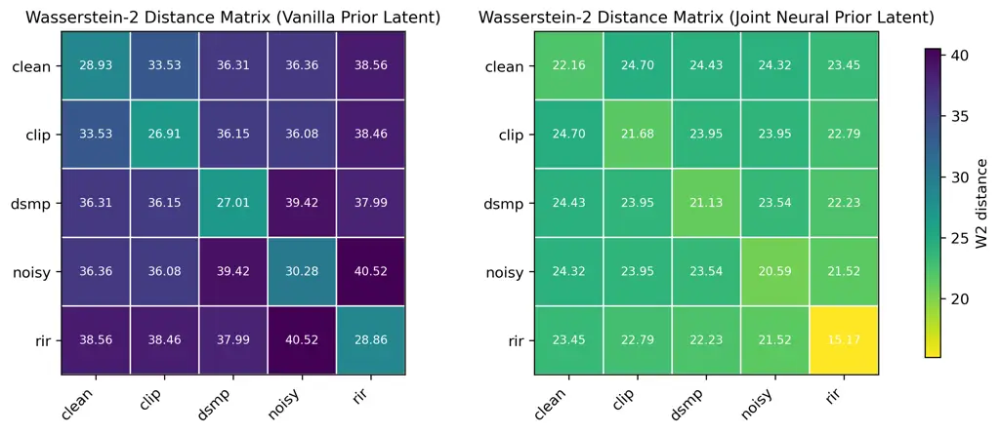

Figure 5: Wasserstein Distance Matrix of latents with different
degradation types for the vanilla prior and the joint neural prior.

|          | DNSMOS($`\uparrow`$) | WVMOS($`\uparrow`$) | NISQA($`\uparrow`$) |
| -------- | -------------------- | ------------------- | ------------------- |
| VAE-Rec. | 3.11                 | 4.05                | 4.5                 |
| VB-Gen.  | 3.20                 | 4.39                | 4.51                |
| VB-Rec.  | 3.25                 | 4.43                | 4.71                |
| GT       | 3.22                 | 4.5                 | 4.62                |

Table 12: Comparison of perceptual quality between VAE reconstruction,
VoiceBridge restoration, VoiceBridge’s reconstruction results on clean
audio input, and Ground Truth clean audio.

To verify that VoiceBridge surpasses the upper-bound reconstruction
performance of the original VAE, we compare the restoration results of
noisy inputs with EP-VAE reconstructions of clean ones. Specifically, we
report four groups of results: (1) the EP-VAE reconstruction of clean
audio (VAE-Rec.); (2) the restoration results of corresponding degraded
audio of VoiceBridge (VB-Gen.); (3) the restoration results of
VoiceBridge when passed the clean audio as input (VB-Rec.), which can be
seen as a version of reconstruction with enhanced perceptual quality by
VoiceBridge; (4) the ground-truth clean target (GT). Clean and degraded
data are taken from the VoiceBank-Demand (Valentini-Botinhao, 2017)
dataset. As shown in Table 12, the post-training stage enables
VoiceBridge’s restoration to surpass the VAE reconstruction limits in
perceptual quality. Moreover, when GT is passed as input for VoiceBridge
instead of its noisy version, the perceptual quality further improves,
achieving near-GT or even better performance on the reconstruction
setting. This indicates that jointly training the LBM and the decoder
together breaks through the VAE reconstruction upper-bound.

| Curated Validation Sets for Different Degradations |                     |                       |                      |                      |                      |
| -------------------------------------------------- | ------------------- | --------------------- | -------------------- | -------------------- | -------------------- |
| Model                                              | PESQ ($`\uparrow`$) | DNSMOS ($`\uparrow`$) | WVMOS ($`\uparrow`$) | UTMOS ($`\uparrow`$) | NISQA ($`\uparrow`$) |
| Noise                                              |                     |                       |                      |                      |                      |
| VoiceBridge                                        | 2.34                | 3.17                  | 4.30                 | 4.26                 | 4.18                 |
| VAE                                                | 1.71                | 2.58                  | 3.51                 | 3.37                 | 3.23                 |
| Reverb                                             |                     |                       |                      |                      |                      |
| VoiceBridge                                        | 2.67                | 3.24                  | 4.41                 | 4.31                 | 4.63                 |
| VAE                                                | 1.52                | 2.72                  | 3.85                 | 3.69                 | 4.20                 |
| BWE                                                |                     |                       |                      |                      |                      |
| VoiceBridge                                        | 3.32                | 3.23                  | 4.41                 | 4.31                 | 4.64                 |
| VAE                                                | 2.63                | 2.83                  | 3.75                 | 3.79                 | 4.41                 |
| CLIP                                               |                     |                       |                      |                      |                      |
| VoiceBridge                                        | 3.57                | 3.23                  | 4.43                 | 4.31                 | 4.69                 |
| VAE                                                | 2.94                | 2.82                  | 3.96                 | 3.90                 | 4.44                 |

Table 13: VAE-only restoration results on different degradations

### H.3 VAE-only Restoration

In the joint neural prior training stage, the VAE is trained to align
the degraded prior to clean prior in multiple measures, including those
measuring reconstruction distances, which means the reconstruction of
degraded speech will move forward the direction of the restoration
target. After the post-training stage, the decoder is further adapted to
generate speech with high perceptual quality. This indicate that the VAE
itself have certain amount of restoration abilities. To further evaluate
the ability of the VAE and the role of the latent bridge model, we test
the performance of VAE-only restoration compared with VoiceBridge on
different degradation types. The results are shown in Table 13.
Basically, we can find that VAE-only enhancement works well on Bandwidth
extension task and de-clipping tasks. These two tasks are considered
easier, since they preserve the main structure of the speech signal. For
the other harder tasks, generative modeling gives more effort. The
bridge model successfully refines all degradations to a similar HQ leel
beyond the VAE reconstruction.

|                      |       |       |       |       |
| -------------------- | ----- | ----- | ----- | ----- |
| Model                | VF    | RE    | UPP   | VB    |
| RTF ($`\downarrow`$) | 0.015 | 0.833 | 0.075 | 0.025 |
| NFE                  | 1     | 64    | 8     | 1     |

Table 14: Inference efficiency, evaluated by Real-Time-Factor (RTF) and
Number of Function Evaluation (NFE)

## Appendix I Details on Ablation Studies

### I.1 Experimental Setup

We conduct ablation studies on each innovation of VoiceBridge: EP-VAE,
joint neural prior, and denoiser-to-generator post-training. For the
first part of the ablation study, which mainly focuses on the variation
of VAE networks, the VAE networks (with or without EP) are pre-trained
for 500k steps on 8 A800 GPUs with a batch size of 16. The fine-tuning
for joint neural prior costs 150k steps with the same settings. For fair
comparison, the groups without joint neural prior are trained using the
original objective for the same amount of steps. For the second part,
which studies the different loss terms in the post-training stage, all
variants are fine-tuned from the pre-trained bridge model in the main
experiment for 50k steps on 8 A800 GPUs with a batch size of 16.

| Voicefixer-GSR (Liu et al., 2022) |                     |                    |                    |                     |                      |                       |                      |
| --------------------------------- | ------------------- | ------------------ | ------------------ | ------------------- | -------------------- | --------------------- | -------------------- |
| Model                             | PESQ ($`\uparrow`$) | SIG ($`\uparrow`$) | BAK ($`\uparrow`$) | OVRL ($`\uparrow`$) | UTMOS ($`\uparrow`$) | WV-MOS ($`\uparrow`$) | NISQA ($`\uparrow`$) |
| Waveform SB                       | 1.56                | 2.65               | 3.83               | 2.41                | 2.21                 | 2.87                  | 1.73                 |
| STFT SB                           | 2.06                | 3.07               | 3.34               | 2.58                | 2.69                 | 2.44                  | 2.73                 |
| Latent SB                         | 2.07                | 3.43               | 4.09               | 3.20                | 3.58                 | 3.86                  | 3.76                 |
| DNS-Real (Reddy et al., 2021a)    |                     |                    |                    |                     |                      |                       |                      |
| Model                             | PESQ ($`\uparrow`$) | SIG ($`\uparrow`$) | BAK ($`\uparrow`$) | OVRL ($`\uparrow`$) | UTMOS ($`\uparrow`$) | WV-MOS ($`\uparrow`$) | NISQA ($`\uparrow`$) |
| Waveform SB                       | -                   | 2.64               | 2.55               | 1.94                | 1.61                 | 1.55                  | 1.56                 |
| STFT SB                           | -                   | 2.96               | 3.57               | 2.55                | 2.27                 | 2.59                  | 3.39                 |
| Latent SB                         | -                   | 3.39               | 4.03               | 3.12                | 3.15                 | 3.69                  | 4.34                 |

Table 15: Evaluation results on VoiceFixer-GSR (Liu et al., 2022) and
DNS-Real (Reddy et al., 2021a) for bridge modeling in different spaces.

### I.2 Ablation on Bridge Modeling Space

To validate the necessity of latent modeling for the GSR task, we
further conduct an ablation study on the modeling space for SB models.
We train three bridge models on VAE latent, waveform, and complex STFT
data space respectively. For the waveform-space bridge, we adopt the
diffwave (Kong et al., 2020) architecture. For the STFT space, the
NeMo (Harper et al., ) (adopted in  (Liu et al., 2023a) and  (Ku et al.,
2025)) architecture is used. All networks are scaled to around 540M
parameters by increasing the number of layers and hidden channels. For
the VAE latent, we use VoiceBridge’s configuration without the
denoiser-to-generator post-training, for equal comparison on the
modeling spaces. All models are trained for 500k steps on the same data
mixture as VoiceBridge. We evaluate the three models on the
VoiceFixer-GSR and the DNS-Real benchmarks. The results are shown in
Table 15 We can clearly observe that latent bridge models far outperform
waveform and STFT domain bridge models, given the high information
density of the compressed latent space. Meanwhile, the latent SB models
take much less computation than the other two models, as the sequence
modeled is much shorter.

|                                   |                     |                    |                    |                     |                      |                       |                      |
| --------------------------------- | ------------------- | ------------------ | ------------------ | ------------------- | -------------------- | --------------------- | -------------------- |
| Voicefixer-GSR (Liu et al., 2022) |                     |                    |                    |                     |                      |                       |                      |
| Model                             | PESQ ($`\uparrow`$) | SIG ($`\uparrow`$) | BAK ($`\uparrow`$) | OVRL ($`\uparrow`$) | UTMOS ($`\uparrow`$) | WV-MOS ($`\uparrow`$) | NISQA ($`\uparrow`$) |
| KL-only                           | 2.08                | 3.15               | 3.91               | 3.13                | 3.12                 | 3.37                  | 3.68                 |
| JNP                               | 2.15                | 3.43               | 4.09               | 3.20                | 3.58                 | 3.86                  | 3.76                 |
| DNS-Real (Reddy et al., 2021a)    |                     |                    |                    |                     |                      |                       |                      |
| Model                             |                     | SIG ($`\uparrow`$) | BAK ($`\uparrow`$) | OVRL ($`\uparrow`$) | UTMOS ($`\uparrow`$) | WV-MOS ($`\uparrow`$) | NISQA ($`\uparrow`$) |
| KL-only                           |                     | 3.03               | 3.88               | 2.97                | 2.75                 | 3.31                  | 4.16                 |
| JNP                               |                     | 3.39               | 4.03               | 3.12                | 3.15                 | 3.69                  | 4.34                 |

Table 16: Evaluation results on VoiceFixer-GSR (Liu et al., 2022) and
DNS-Real (Reddy et al., 2021a) for different joint neural prior training
objectives

| Effect of JNP on Perceptual Metrics |                     |                       |                      |                      |                      |
| ----------------------------------- | ------------------- | --------------------- | -------------------- | -------------------- | -------------------- |
| Model                               | PESQ ($`\uparrow`$) | DNSMOS ($`\uparrow`$) | WVMOS ($`\uparrow`$) | UTMOS ($`\uparrow`$) | NISQA ($`\uparrow`$) |
| Noise                               |                     |                       |                      |                      |                      |
| w/ JNP                              | 1.88                | 3.17                  | 4.05                 | 3.69                 | 4.36                 |
| w/o JNP                             | 1.75                | 2.95                  | 4.01                 | 3.65                 | 4.10                 |
| Reverb                              |                     |                       |                      |                      |                      |
| w/ JNP                              | 2.12                | 3.24                  | 4.11                 | 3.77                 | 4.60                 |
| w/o JNP                             | 2.01                | 3.13                  | 4.10                 | 3.72                 | 4.43                 |
| BWE                                 |                     |                       |                      |                      |                      |
| w/ JNP                              | 2.70                | 3.30                  | 4.32                 | 3.97                 | 4.69                 |
| w/o JNP                             | 2.51                | 3.19                  | 4.26                 | 3.95                 | 4.50                 |
| CLIP                                |                     |                       |                      |                      |                      |
| w/ JNP                              | 3.26                | 3.25                  | 4.31                 | 4.01                 | 4.66                 |
| w/o JNP                             | 2.95                | 3.16                  | 4.20                 | 3.91                 | 4.63                 |

Table 17: Evaluation results on curated testsets with different
degradation types for bridge models with and without joint neural prior.

### I.3 Ablation on joint neural prior training objective design

A core difference of our joint neural prior with (Fang et al., 2021) is
that we align the LQ and HQ priors not only by the Euclidean measure in
latent space (wich is basically equivalent with the KL alignment done
in (Fang et al., 2021) if regardless of the variance). In contrast, we
add objectives including cosine similarity in latent space and multiple
supervision signals in the reconstructed data space, in order to reduce
the distance between the latents in all geometrical measures. We conduct
an ablation study with two bridge models trained with the multi-measure
aligned joint neural prior and KL-aligned-only prior respectively, to
prove that our multi-measure alignment is necessary. The results are
shown in Table 16. Our joint neural prior clearly outperforms the
KL-only alignment proposed in (Fang et al., 2021), proving our method’s
effectiveness.

### I.4 Ablation on joint neural prior’s effectiveness for different degradation types

To further discuss whether the joint neural prior can converge the prior
of diverse degradation types to a unified clean distribution, rather
than only working on certain types, we conduct an ablation study on the
effectiveness of joint neural prior for different degradation types. We
train two bridge models with and without joint neural prior
respectively, and evaluate their performance on different degradation
types on curated testsets with additional noise, reverberation,
bandwidth limitation, and clipping on the VCTK corpus. The models are
trained for 500k steps. Results are shown in Table 17. The results
demonstrate consistent improvement across all dereverberation types,
indicating that JNP benefit all distortions simultaneously.
