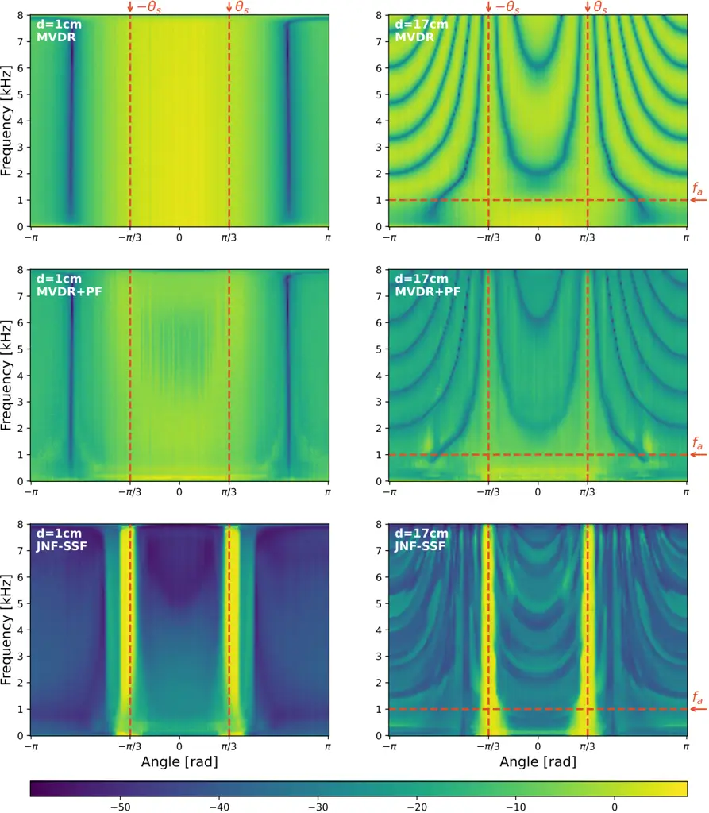

STFT  
short-time Fourier transform

DoA  
direction of arrival

iSTFT  
inverse short-time Fourier transform

DNN  
deep neural network

PESQ  
perceptual evaluation of speech quality

POLQA  
perceptual objectve listening quality analysis

WPE  
weighted prediction error

PSD  
power spectral density

RIR  
room impulse response

SNR  
signal-to-noise ratio

LSTM  
long short-term memory

POLQA  
Perceptual Objectve Listening Quality Analysis

SDR  
signal-to-distortion ratio

ESTOI  
extended short-term objective intelligibility

ELR  
early-to-late reverberation ratio

TCN  
temporal convolutional network

RLS  
recursive least squares

ASR  
automatic speech recognition

HA  
hearing aid

CI  
cochlear implant

MAC  
multiply-and-accumulate

VAE  
variational auto-encoder

GAN  
generative adversarial network

T-F  
time-frequency

SDE  
stochastic differential equation

ODE  
ordinary differential equation

DRR  
direct to reverberant ratio

LSD  
log spectral distance

SI-SDR  
scale-invariant signal-to-distortion ratio

MOS  
mean opinion score

MAP  
maximum a posteriori

RTF  
real-time factor

EMA  
exponential moving average

RKHS  
reproducible kernel Hilbert space

MMD  
maximum mean discrepancy

ICA  
independence component analysis

MVDR  
minimum variance distortionless response

PF  
postfilter

TdoA  
time difference of arrival

ATF  
acoustic transfer function

PF  
post-filter

DI  
directivity index

LR  
learning rate

SSL  
sound source localization

IPD  
inter-channel phase difference

IRM  
ideal ratio mask

SCM  
spatial covariance matrix

# An Analysis of Joint Nonlinear Spatial Filtering for Spatial Aliasing Reduction

Alina Mannanova    Jakob Kienegger    Timo Gerkmann ^(†)^(†)thanks: This
work was supported by the Deutsche Forschungsgemeinschaft (DFG, German
Research Foundation) under grant 508337379.

###### Abstract

The performance of traditional linear spatial filters for speech
enhancement is constrained by the physical size and number of channels
of microphone arrays. For instance, for large microphone distances and
high frequencies, spatial aliasing may occur, leading to unwanted
enhancement of signals from non-target directions. Recently, it has been
proposed to replace linear beamformers by nonlinear deep neural networks
for joint spatial-spectral processing. While it has been shown that such
approaches result in higher performance in terms of instrumental quality
metrics, in this work we highlight their ability to efficiently handle
spatial aliasing. In particular, we show that joint spatial and
tempo-spectral processing is more robust to spatial aliasing than
traditional approaches that perform spatial processing alone or
separately with tempo-spectral filtering. The results provide another
strong motivation for using deep nonlinear networks in multichannel
speech enhancement, beyond their known benefits in managing non-Gaussian
noise and multiple speakers, especially when microphone arrays with
rather large microphone distances are used.

###### Index Terms: 

Multichannel, spatial aliasing, inter-microphone array distance, spatial
selectivity, joint nonlinear spatial and tempo-spectral processing

^(†)^(†)address: Signal Processing (SP), University of Hamburg, Hamburg,
Germany

## 1 Introduction

Microphone arrays are widespread in consumer electronics, from
smartphones and tablets to smart speakers and hearing aids. The key
advantage of using multiple microphones over a single-microphone setup
is the ability to leverage spatial filtering, which allows devices to
focus on sound coming from a specific doa (doa) while suppressing
interference and noise from other directions \[1\]. The effectiveness of
such spatial filtering depends on the distance between microphones in
the array.

Just as time-domain signals are sampled at discrete intervals,
microphones in the array discretely sample the sound field across space,
with spatial information encoded in the tdoa (tdoa) \[1\]. In analogy to
the Nyquist sampling theorem for time-domain signals that depends on the
sampling period, spatial sampling follows a Nyquist criterion that
depends on the inter-microphone distance \[2\]. When such Nyquist
criterion is violated, aliasing occurs, creating ambiguity. While
temporal aliasing results in frequency ambiguity, spatial aliasing leads
to doa ambiguity meaning that array has problems to distinguish between
signals arriving from different directions \[1\]. This spatial aliasing
can be avoided by placing the microphones at the same distance or closer
than half of the shortest wavelength present in the signal, as stated by
the spatial Nyquist criterion \[3\]. Since this criterion depends on
wavelength, spatial aliasing is frequency-dependent: higher frequencies
with shorter wavelengths are more prone to aliasing for a given
inter-microphone distance \[4, 5\].

Different applications demand different array designs. In compact
devices like hearing aids where closely spaced microphones are often
placed on the same ear (typically $`1\text{\,}\mathrm{cm}`$ apart
\[6\]), spatial aliasing would occur only from
$`17\text{\,}\mathrm{kHz}`$, enabling reliable spatial filtering across
most frequencies but with limited spatial resolution. In contrast,
larger arrays like those used in binaural hearing aids with microphones
on both ears ($`17\text{\,}\mathrm{cm}`$ distance \[7\]) can cover wider
area and offer improved spatial resolution \[8\] but become susceptible
to aliasing above $`1\text{\,}\mathrm{kHz}`$. This illustrates a
fundamental trade-off in array design: smaller inter-microphone distance
prevents high-frequency aliasing but limits directivity, while larger
distance improves spatial resolution but introduces aliasing risks
\[9\].

Approaches to address this trade-off include irregularly spaced arrays
\[2, 10\] or increasing the number of microphones \[11\], but these are
not always practical due to size or complexity constraints, making
alternative methods to mitigate spatial aliasing necessary.

Several studies \[10, 11, 12, 13, 14, 15\] have addressed the doa
ambiguities caused by spatial aliasing when ideal inter-microphone
distance according to Nyquist criterion is not possible. These
approaches exploit the frequency-dependent nature of spatial aliasing
through different strategies. \[11\] compares aliasing patterns across
two sufficiently spaced frequencies such that only the true doa remains
consistent, a principle also used by \[10\] with a frequency-difference
algorithm. Similarly, \[12\] and \[13\] sequentially estimate doa
beginning with low frequencies less affected by aliasing to guide
estimation in higher frequencies that provide better angular resolution.
Alternatively, \[14\] and \[15\] leverage multiple ipd (ipd) hypotheses
and select the consistent one across frequencies to resolve aliasing
ambiguities. More recently, \[16\] proposed a DNN-based de-aliasing
filter for conventional beamforming.

While existing approaches to spatial aliasing focus on resolving doa
ambiguities for localization tasks or employ hybrid DNN-beamforming
strategies, this work takes a different path by exploring whether
nonlinear joint spatial tempo-spectral processing can directly perform
effective speech enhancement on arrays with inter-microphone distances
exceeding the Nyquist criterion, without explicitly resolving spatial
ambiguities.

## 2 Background

### 2.1 Signal model

To enable spatial filtering for speaker extraction, we consider a
microphone array with $`M`$ channels recording a target speech signal
$`s(t)`$ in a noisy reverberant environment. Each microphone signal
$`y_{m}(t)`$ at time index $`t`$ is a mixture of a delayed reverberant
version of the target signal $`x_{m}(t)`$ and additive noise
$`n_{m}(t)`$. The corresponding frequency-domain representation using
the stft (stft) at frequency bin $`k`$ and time frame $`l`$ is given by

```math
Y_{m}(k,l)=X_{m}(k,l)+N_{m}(k,l),\quad m=1,\ldots,M \tag{1}
```

where $`X_{m}(k,l)`$ and $`N_{m}(k,l)`$ are the stft coefficients of the
recorded target signal and noise, respectively. The goal of speaker
extraction is to estimate the clean target signal $`\widehat{S}(k,l)`$
coming from doa $`\theta_{s}`$ using these noisy multichannel
recordings.

### 2.2 Traditional linear spatial beamforming

A traditional approach to achieve this speaker extraction is linear
beamforming. This technique combines microphone signals to create a
directional beam that enhances sound from target location while
suppressing interference from others \[1\].

Among various beamforming techniques, the mvdr (mvdr) beamformer is
commonly used \[17\]. It minimizes the output power while maintaining an
undistorted response toward the target look direction. The optimal mvdr
filter coefficients are frequency-dependent. They are computed using the
noise correlation matrix
$`\bm{\Phi}_{k,l}^{n}\in\mathbb{C}^{M\times M}`$ and the steering vector
$`\bm{a}_{k}(\Delta\tau_{m})\in\mathbb{C}^{M}`$, where
$`\Delta\tau_{m}`$ denotes the time delays relative to the reference
microphone that depend on the target source doa $`\theta_{s}`$, as given
in \[1\]

```math
\bm{h}_{\textrm{MVDR}}=\frac{(\bm{\Phi}^{n})^{-1}\bm{a}}{\bm{a}^{H}(\bm{\Phi}^{n})^{-1}\bm{a}}, \tag{2}
```

where $`\cdot^{H}`$ denotes the Hermitian transpose and time-frequency
indices are omitted for clarity. The target signal estimate is obtained
as $`\widehat{\bm{S}}=\bm{h}^{H}_{\textrm{MVDR}}\bm{Y}`$, where the mvdr
beamformer applies a linear transformation to the noisy microphone
signals.

Despite their popularity, linear spatial beamformers face certain
limitations. Previous research \[18\] has proven that the mvdr
beamformer is not a sufficient statistics for estimating clean speech in
non-Gaussian noise and can suppress no more than $`M-1`$ sources \[1\].
Furthermore, as demonstrated in \[1, 3\], the design of microphone
arrays for linear spatial filtering requires careful attention to the
distance between microphones. This study focuses specifically on this
latter aspect.

### 2.3 Spatial aliasing and its impact on beamforming


Figure 1: Visualization of wave propagation (dotted line) from a source
$`\bm{s}`$ located at doa $`\theta_{s}`$ in a free-field microphone
array with inter-microphone distance $`d`$.

For spatial filtering, the key information lies in the relative time
delays between microphone signals caused by the target source. To
illustrate this concept, we consider the setup depicted in Fig. 1 which
shows two microphones separated by a distance $`d`$. A source $`\bm{s}`$
located in the far field generates a plane wave of frequency $`f_{k}`$
corresponding to the $`k`$-th frequency bin. This wave, shown as a
dotted line, arrives at an angle $`\theta_{s}`$ relative to the array
axis. As a result, there is a path difference
$`\Delta r_{2}=d\cos{\theta_{s}}`$ between the wave reaching two
microphones which causes tdoa $`\Delta\tau_{2}=d\cos\theta_{s}/c`$,
where $`c`$ is the speed of sound. Neglecting the source-array
propagation time, the time domain microphone signals can be expressed as
$`y_{1}(t)=s(t)`$ and $`y_{2}(t)=y_{1}(t-\Delta\tau_{2})`$.

In the frequency domain, this time delay results in a linear phase shift
$`\Delta\phi_{m}(k)`$ \[19\] and the signal of the second microphone can
be formulated as $`Y_{2}(k,l)=Y_{1}(k,l)e^{-j\Delta\phi_{2}(k)}`$ with

```math
\Delta\phi_{2}(k)=2\pi f_{k}\Delta\tau_{2}=\frac{2\pi f_{k}d\cos{\theta_{s}}}{c}. \tag{3}
```

Eq. 3 shows that the phase shift varies with frequency and when applied
as $`e^{j\Delta\phi_{m}(k)}`$ is ambiguous in multiples of $`2\pi`$,
resulting in spatial aliasing. This means that multiple distinct signal
directions can produce identical phase differences between the array
elements, leading to ambiguity in doa \[1\].

To avoid this spatial aliasing, it is required that the maximum possible
phase shift produced by highest frequency $`f_{\mathrm{max}}`$ present
in the signal is less than $`\pi`$ \[1\]

```math
\frac{2\pi f_{\mathrm{max}}d}{c}\leq\pi\Rightarrow d\leq\frac{c}{2f_{\mathrm{max}}}. \tag{4}
```

This gives us the spatial aliasing cut-off frequency $`f_{\mathrm{a}}`$
\[14\], which is the maximum frequency that can be processed without
spatial aliasing for given $`d`$

```math
f_{\mathrm{a}}=\frac{c}{2d}. \tag{5}
```

Therefore, for signals with maximum frequency $`f_{\mathrm{max}}`$, the
inter-microphone distance must satisfy $`d\leq\lambda_{\mathrm{min}}/2`$
to ensure one-to-one mapping between the doa and phase difference, where
$`\lambda_{\mathrm{min}}=c/f_{\mathrm{max}}`$ is the shortest wavelength
corresponding to the highest frequency component.

## 3 DNN-based multichannel signal processing

Traditional beamforming techniques employ linear spatial filtering
applied to each frequency bin separately without cross-frequency
interactions. These approaches operate either independently or in
combination with a spectral (non)linear pf (pf). In contrast, dnn
(dnn)-based end-to-end multichannel filters like FT-JNF \[20\] or
SpatialNet \[21\] enable simultaneous nonlinear processing in both
tempo-spectral and spatial domains. This joint processing approach
typically involves two key stages. First, cross-band processing focuses
on spatial and spectral information by processing multichannel data
across frequency bins to capture correlations between frequencies. The
following narrow-band processing block focuses on spatial and temporal
information, analyzing patterns within individual frequency bins
independently.

Recent studies \[20, 22, 23\] have analyzed the behavior and
characteristics of dnn-based multichannel filters to better understand
their processing mechanisms. Similarly, in this study we examine the
speech enhancement and spatial selectivity characteristics of end-to-end
joint nonlinear filters with respect to different inter-microphone
distances, including a configuration that violates the spatial Nyquist
criterion.

## 4 Experimental analysis

### 4.1 Microphone array setup and processing pipelines

We consider an array of two microphones that are positioned at
$`d=$1\text{\,}\mathrm{cm}$`$ and $`d=$17\text{\,}\mathrm{cm}$`$ from
each other. These configurations serve as illustrative examples of
inter-microphone distances for a two-microphone hearing aid when the
microphones are placed either on the same ear \[6\] or on both ears
\[7\], assuming a simplified model without head effects. The different
distances $`d`$ lead to different spatial aliasing frequencies, which
determine the frequency range over which linear beamformers can operate
without aliasing. Considering the speech signals up to
$`8\text{\,}\mathrm{kHz}`$, the smaller distance
($`d=$1\text{\,}\mathrm{cm}$`$) yields a spatial aliasing frequency of
about $`17\text{\,}\mathrm{kHz}`$ according to Eq. 5, which lies well
above our frequency range of interest. In contrast, the larger distance
($`d=$17\text{\,}\mathrm{cm}$`$) reduces the aliasing frequency to
$`1\text{\,}\mathrm{kHz}`$, placing it inside the considered spectrum.

To evaluate the influence of joint spatial and tempo-spectral nonlinear
processing on the spatial aliasing problem, we compare this approach to
methods based on a linear spatial filter. We examine speech enhancement
and spatial selectivity performance for three pipelines illustrated in
Fig. 2: an mvdr beamformer used alone (2), the mvdr concatenated with a
nonlinear pf (2) and an end-to-end dnn-based architecture JNF-SSF (2)
which performs joint spatial and tempo-spectral filtering. The JNF-SSF
architecture \[24\] extends FT-JNF \[20\] by incorporating a target
source direction as an additional input, enabling steering of the
filter. To allow for a fair comparison in terms of the neural network
capacity, FT-JNF, which shares the same base architecture as JNF-SSF, is
adapted here to operate as a single-channel tempo-spectral pf for the
mvdr beamformer by setting the number of microphones to one. A detailed
description of FT-JNF and JNF-SSF architectures is provided in \[20,
24\]. For all pipelines, the input signals are the two microphone
signals $`\bm{Y}_{1}`$ and $`\bm{Y}_{2}`$, with the output given by the
estimated target speech signal $`\bm{\widehat{S}}`$.


Figure 2: Multichannel signal processing pipelines, where $`\bm{Y}_{1}`$
and $`\bm{Y}_{2}`$ denote the multichannel recorded signals and
$`\bm{\widehat{S}}`$ represents the enhanced target signal. (2) Linear
spatial filter (2) Linear spatial filter followed by a tempo-spectral pf
(2) Joint nonlinear spatially-selective tempo-spectral filter.

### 4.2 Speech dataset and training parameters

We use pyroomacoustics \[25\] to simulate training and evaluation
datasets. Our experimental setup employs two speakers as distinct
directional sources, meeting the source-to-microphone ratio criterion to
ensure that mvdr beamformer and JNF-SSF are evaluated under comparable
conditions \[18\]. Similar to \[26\], the target and interfering
speakers are seated with the microphone array placed at the same height
of $`1.3\text{\,}\mathrm{m}`$, corresponding to ear level. Both speakers
are positioned between $`0`$ and $`\pi`$ with respect to the array to
avoid front-back ambiguity with a minimum angular separation of
$`\pi/6`$. For each utterance, we randomly sample room characteristics
from Table 1 and microphone array placement within it, then choose the
source-to-array distance between
$`1\text{\,}\mathrm{m}2\text{\,}\mathrm{m}`$. The clean speech signals
are sourced from the WSJ0 corpus \[27\], with no overlap between
training, validation, and testing samples. To ensure a valid comparison
across examined array configurations, all dataset parameters are
maintained, except for the inter-microphone distance. Thus, two distinct
datasets are simulated with inter-microphone distance
$`d=$1\text{\,}\mathrm{cm}$`$ and $`d=$17\text{\,}\mathrm{cm}$`$.

The loss function is taken from \[20\], while the number of training and
evaluation samples per each target doa follows \[28\]. Target speaker
positions $`\theta_{s}`$ are uniformly distributed across $`60`$ angles
from $`0`$ to $`\pi`$. For all setups that include training a dnn (pf at
the output of MVDR beamformer and JNF-SSF as a standalone multichannel
filter), we use the Adam optimizer with an initial lr (lr) of
$`{10}^{-3}`$. The lr is dynamically adjusted, decreasing by a factor of
$`0.8`$ if the validation loss shows no improvement over three
consecutive epochs. Training for all models is governed by an early
stopping, terminating the process after ten epochs of stagnant
validation performance.

| Width \[m\] | Length \[m\] | Height \[m\] | $`\mathbf{T}_{60}`$ \[s\] |
| ----------- | ------------ | ------------ | ------------------------- |
| $`3-6`$     | $`3-9`$      | $`2.2-3.5`$  | $`0.2-0.5`$               |

Table 1: Ranges of room characteristics for speech dataset

### 4.3 Spatial selectivity evaluation setup

To evaluate spatial selectivity of the three methods, we follow \[20\]
using spectrally white noise emitted from $`-\pi`$ to $`\pi`$ as target
signals. This broadband signal enables assessment of filter responses
across the full spectrum and allows to have frequency interactions
important for JNF-SSF architecture. Additionally, testing dnn on signals
spectrally unseen during training while preserving spatial
characteristics allows evaluation of spatial processing independently of
tempo-spectral features. The mvdr beamformer is optimized for a diffuse
noise field. For each direction, multichannel filters produce estimated
stft from which we calculate time-averaged spectral amplitudes in
$`\mathrm{dB}`$.

Across all angles, room dimensions are kept the same and set to median
values from Table 1, with the array at room center and source-array
distance of $`1.5\text{\,}\mathrm{m}`$. Microphone array and source
heights remain as described in 4.2. We simulate two datasets in an
anechoic chamber to eliminate reflections and isolate directional
responses, varying the inter-microphone distance $`d`$ between datasets
as in 4.2.

## 5 Results and discussion

### 5.1 Impact of inter-microphone distance on speech enhancement

|         | $`\Delta`$ PESQ $`\uparrow`$ |                     | ESTOI $`\uparrow`$ |                     | $`\Delta`$ SI-SDR \[dB\] $`\uparrow`$ |                     |
| ------- | ---------------------------- | ------------------- | ------------------ | ------------------- | ------------------------------------- | ------------------- |
|         | $`d=1\mathrm{cm}`$           | $`d=17\mathrm{cm}`$ | $`d=1\mathrm{cm}`$ | $`d=17\mathrm{cm}`$ | $`d=1\mathrm{cm}`$                    | $`d=17\mathrm{cm}`$ |
| MVDR    | $`0.06`$0.01                 | $`0.03`$0.01        | $`0.49`$0.01       | $`0.47`$0.01        | $`3.6`$0.5                            | $`3.2`$0.5          |
| MVDR+PF | $`0.19`$0.02                 | $`0.29`$0.02        | $`0.55`$0.01       | $`0.59`$0.01        | $`5.9`$0.5                            | $`7.3`$0.6          |
| JNF-SSF | 0.780.03                     | 0.750.03            | 0.730.01           | 0.730.01            | 11.10.4                               | 10.90.5             |

Table 2: Speaker extraction results for different inter-microphone
distance $`d`$ with varying target speaker positions. Results show mean
improvement ($`\Delta`$PESQ, $`\Delta`$SI-SDR) and absolute values
(ESTOI) with 95% confidence intervals. The best results are indicated in
bold.

We examine the impact of inter-microphone distance $`d`$ on speech
enhancement performance across different multichannel pipelines. Table 2
presents the mean improvement in pesq (pesq) and sisdr (sisdr), absolute
values for estoi (estoi) for three approaches: mvdr beamformer, mvdr
with pf (MVDR + PF) and the dnn-based end-to-end filter JNF-SSF.
Although the mvdr beamformer has access to oracle doa and irm (irm) for
noise scm (scm) estimation, it shows minimal improvement in pesq and
estoi but achieves approximately $`3\text{\,}\mathrm{dB}`$ improvement
in sisdr for both distances with $`d=$1\text{\,}\mathrm{cm}$`$
performing better. The addition of a pf significantly enhances
performance, particularly for the larger inter-microphone distance.
JNF-SSF substantially outperforms both linear spatial filter-based
frameworks, achieving nearly $`11\text{\,}\mathrm{dB}`$ improvement in
sisdr while maintaining consistent performance across inter-microphone
distances.

### 5.2 Impact of inter-microphone distance on spatial selectivity



Figure 3: Spatial selectivity comparison for
$`d=$1\text{\,}\mathrm{cm}$`$ (left) and $`d=$17\text{\,}\mathrm{cm}$`$
(right): mvdr(top), mvdr+PF (middle) and JNF-SSF (bottom). The x-axis
shows the angle of arrival, the y-axis represents frequency. Vertical
dashed lines indicate the look-direction $`\theta*{s}=\pm\pi/3`$, while
the horizontal dashed line shows the aliasing cut-off frequency
$`f*{\mathrm{a}}`$.

Fig. 3 shows the spatial selectivity patterns for the same multichannel
pipelines: mvdr (top), mvdr+pf (middle), and JNF-SSF (bottom). The left
column shows results for $`d=$1\text{\,}\mathrm{cm}$`$, while the right
column presents $`d=$17\text{\,}\mathrm{cm}$`$. In each subplot, the
x-axis represents the angle of arrival and the y-axis shows frequency.
Vertical dashed lines indicate the look-direction
$`\theta*{s}=\pm\pi/3`$, and for $`d=$17\text{\,}\mathrm{cm}$`$, the
horizontal dashed line marks the calculated aliasing cut-off frequency
$`f*{\mathrm{a}}`$ according to Subsec. 4.1.

The mvdr beamformer exhibits low spatial selectivity for small $`d`$,
leaving sources between $`\pm\pi/3`$ spatially unresolved while
remaining free from aliasing effects. For large $`d`$, mvdr shows
improved selectivity, however, prominent sidelobes appear above
$`f_{\mathrm{a}}`$ when the inter-microphone distance exceeds the
Nyquist criterion, resulting multiple angles to have similar energy
levels. The pf provides modest improvements: for
$`d=$1\text{\,}\mathrm{cm}$`$, it reduces the selectivity around
$`0\text{\,}\mathrm{rad}`$ observed with mvdr, while for
$`d=$17\text{\,}\mathrm{cm}$`$, the sidelobes become less pronounced.

In contrast, JNF-SSF demonstrates consistent spatial selectivity
patterns across both small and large $`d`$ values. For small $`d`$,
despite the expected low spatial selectivity for closely spaced
microphones, it achieves substantially better selectivity than the
mvdr-based frameworks. For large $`d`$, while sidelobes of similar
shapes to those of mvdr and mvdr+pf are present, they exhibit
considerably lower energy compared to the look-direction. Our intuition
regarding the superior spatial selectivity of joint nonlinear processing
compared to separate processing stages lies in its ability to exploit
interdependencies between spatial and tempo-spectral information. Given
the frequency-dependent nature of spatial aliasing and the fact that
most spatial aliasing mitigation approaches analyze cross-frequency
patterns, we believe that cross-frequency processing in the first lstm
(lstm) layer of JNF-SSF is important for effective spatial aliasing
mitigation.

## 6 Conclusions

In this work, we compared multichannel frameworks based on traditional
linear mvdr beamforming and dnn-based joint nonlinear filtering in terms
of their susceptibility to spatial aliasing and ability to maintain
performance when inter-microphone distance exceeds the Nyquist
criterion. Our analysis reveals fundamental differences in spatial
aliasing robustness between these approaches. Both mvdr and its
concatenation with a pf, where spatial and tempo-spectral processing are
performed separately, suffer from prominent sidelobes in spatial
selectivity patterns for large inter-microphone distance. In contrast,
JNF-SSF that performs spatial and tempo-spectral processing jointly,
demonstrates strong robustness to spatial aliasing conditions. It
maintains both stable speech enhancement and consistent spatial
selectivity patterns across different inter-microphone distances. We can
conclude that joint processing of spatial and tempo-spectral information
provides significant advantages over separate processing stages when
dealing with spatial aliasing.

## References

- \[1\] P. Vary and R. Martin, Digital speech transmission and
  enhancement, Wiley-IEEE Press, Hoboken NJ, Dec. 2023.
- \[2\] D. H. Johnson and D. E. Dudgeon, Array Signal Processing:
  Concepts and Techniques, Simon & Schuster, Inc., USA, 1992.
- \[3\] H. L. V. Trees, Optimum Array Processing: Part IV of Detection,
  Estimation, and Modulation Theory, Wiley, 2002.
- \[4\] J. Capon, “High-resolution frequency-wavenumber spectrum
  analysis,” Proceedings of the IEEE, vol. 57, no. 8, pp.
  1408–1418, 1969.
- \[5\] J. Dmochowski, J. Benesty, and S. Affes, “On spatial aliasing
  in microphone arrays,” IEEE Trans. Signal Process., vol. 57, no. 4,
  pp. 1383–1395, Apr. 2009.
- \[6\] R. C. Hendriks and T. Gerkmann, “Estimation of the noise
  correlation matrix,” in Proc. ICASSP, 2011, pp. 4740–4743.
- \[7\] D. Marquardt and S. Doclo, “Performance comparison of bilateral
  and binaural MVDR-based noise reduction algorithms in the presence of
  DOA estimation errors,” in Speech Communication; 12. ITG Symposium,
  2016, pp. 1–5.
- \[8\] A. Lombard, Y. Zheng, H. Buchner, and W. Kellermann, “TDOA
  estimation for multiple sound sources in noisy and reverberant
  environments using broadband independent component analysis,” IEEE
  Trans. Signal Process., vol. 19, no. 6, pp. 1490–1503, 2011.
- \[9\] J. Gößwein, J. Grosse, and S. Van De Par, “Stereophonic
  microphone array for the recording of the direct sound field in a
  reverberant environment,” Applied Sciences, vol. 7, no. 6, pp. 541,
  May 2017.
- \[10\] L. Yang, Y. Wang, and Y. Yang, “Aliasing-free broadband
  direction of arrival estimation using a frequency-difference
  technique,” The Journal of the Acoustical Society of America, vol.
  150, no. 6, pp. 4256–4267, Dec. 2021.
- \[11\] Z. Tang, G. Blacquiere, and G. Leus, “Aliasing-Free Wideband
  Beamforming Using Sparse Signal Representation,” IEEE Trans. Signal
  Process., vol. 59, no. 7, pp. 3464–3469, July 2011.
- \[12\] V. V. Reddy, A. W. H. Khong, and B. P. Ng, “Unambiguous speech
  DOA estimation under spatial aliasing conditions,” IEEE Trans. Audio,
  Speech, Lang. Process., vol. 22, no. 12, pp. 2133–2145, Dec. 2014.
- \[13\] V. V. Reddy and A. W. H. Khong, “Direction-of-arrival
  estimation of speech sources under aliasing conditions,” in Proc.
  ICASSP. 2015, pp. 1–5, IEEE.
- \[14\] K. Chen, J. Geiger, W. Jin, M. Taghizadeh, and W. Kellermann,
  “Robust phase replication method for spatial aliasing problem in
  multiple sound sources localization,” in Proc. WASPAA, 2017, pp.
  195–199.
- \[15\] H. Song and J. W. Shin, “Multiple sound source localization
  based on interchannel phase differences in all frequencies with
  spectral masks,” in Interspeech 2021, 2021, pp. 671–675.
- \[16\] M. Guzik, G. Cengarle, and D. Arteaga, “Deep learning based
  spatial aliasing reduction in beamforming for audio capture,” in
  Interspeech 2025, 2025, pp. 2515–2519.
- \[17\] J. Benesty, G. Huang, J. Chen, and N. Pan, Microphone Arrays,
  Springer Cham, first edition, 2023.
- \[18\] K. Tesch and T. Gerkmann, “Nonlinear spatial filtering in
  multichannel speech enhancement,” IEEE Trans. Audio, Speech, Lang.
  Process., vol. 29, pp. 1795–1805, 2021.
- \[19\] A. V. Oppenheim, R. W. Schafer, and J. R. Buck, Discrete-Time
  Signal Processing, Prentice-hall Englewood Cliffs, second
  edition, 1999.
- \[20\] K. Tesch and T. Gerkmann, “Insights into deep non-linear
  filters for improved multi-channel speech enhancement,” IEEE Trans.
  Audio, Speech, Lang. Process., vol. 31, pp. 563–575, 2023.
- \[21\] C. Quan and X. Li, “SpatialNet: Extensively learning spatial
  information for multichannel joint speech separation, denoising and
  dereverberation,” IEEE Trans. Audio, Speech, Lang. Process., vol. 32,
  pp. 1310–1323, 2024.
- \[22\] A. Briegleb and W. Kellermann, “Analysis of spatial filtering
  in neural spatiospectral filters and its dependence on training target
  characteristics,” EURASIP Journal on Audio, Speech, and Music
  Processing, vol. 2024, 11 2024.
- \[23\] A. Cohen, D. Wong, J.-S. Lee, and S. Gannot, “Explainable
  DNN-based beamformer with postfilter,” IEEE Transactions on Audio,
  Speech and Language Processing, vol. 33, pp. 3070–3084, 2025.
- \[24\] K. Tesch and T. Gerkmann, “Multi-channel speech separation
  using spatially selective deep non-linear filters,” IEEE/ACM
  Transactions on Audio, Speech, and Language Processing, vol. 32, pp.
  542–553, 2024.
- \[25\] R. Scheibler, E. Bezzam, and I. Dokmanić, “Pyroomacoustics: A
  Python package for audio room simulation and array processing
  algorithms,” in Proc. ICASSP, 2018.
- \[26\] M. Fallahi, M. Hansen, S. Doclo, S. van de Par, D. Püschel,
  and M. Blau, “Evaluation of head-tracked binaural auralizations of
  speech signals generated with a virtual artificial head in anechoic
  and classroom environments,” Acta Acust., vol. 5, pp. 30, 2021.
- \[27\] J. S. Garofolo, D. Graff, J. M. Baker, D. Paul, and D. Pallett,
  “CSR-I (WSJ0) Complete LDC93S6A,” May 2007.
- \[28\] K. Tesch and T. Gerkmann, “Spatially selective deep non-linear
  filters for speaker extraction,” in ICASSP 2023 - 2023 IEEE
  International Conference on Acoustics, Speech and Signal Processing
  (ICASSP), 2023, pp. 1–5.
