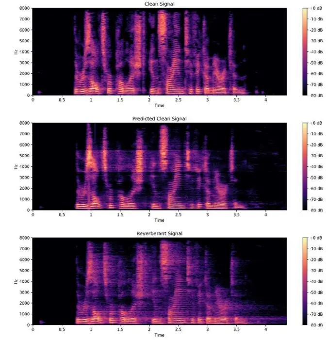

# Dereverberation Using Binary Residual Masking with Time-Domain Consistency

Daniel Williams Affiliation: Independent Researcher

###### Abstract

Vocal dereverberation remains a challenging task in audio processing,
particularly for real-time applications where both accuracy and
efficiency are crucial. Traditional deep learning approaches often
struggle to suppress reverberation without degrading vocal clarity,
while recent methods that jointly predict magnitude and phase have
significant computational cost. We propose a real-time dereverberation
framework based on residual mask prediction in the short-time Fourier
transform (STFT) domain. A U-Net architecture is trained to estimate a
residual reverberation mask that suppresses late reflections while
preserving direct speech components. A hybrid objective combining binary
cross-entropy, residual magnitude reconstruction, and time-domain
consistency further encourages both accurate suppression and perceptual
quality. Together, these components enable low-latency dereverberation
suitable for real-world speech and singing applications.

Index Terms— STFT, U-Net, Time-Domain

## 1 Introduction

Natural reverb in vocals can degrade clarity, especially in large rooms
with acoustically reflective surfaces. This can be especially harmful
for people with hearing aids, teleconferencing, performances, and voice
assistants, where reverb can greatly decrease the quality and
intelligibility of voices. The goal of dereverberation techniques is to
increase the Direct-to-Reverb Signal (DRR) ratio, reducing the
reverberant tails while preserving the direct vocal signal.

In recent years, deep learning techniques have increasingly been used to
remove reverb from vocal signals. Predictive masking techniques have
proven especially useful for preserving vocal timbre while eliminating
reverberant regions. However, typically predictive masks must alter both
the phase and magnitude of the reverberant signal, forcing the model to
predict separate masks for each. Some methods reuse the reverberant
phase to reduce computational complexity, but since reverb is inherently
temporal, this method typically decreases the perceptual accuracy of the
dereverberated audio. Several methods have tried to combat this phase
difference while still only predicting one mask. For instance, Zhao et
al. \[4\] employ the Griffin-Lim phase enhancement to enhance the
reverberant phase. While this technique is effective for estimating
clean phase, we aim to reduce computational cost as much as possible.

In this paper, we propose a novel deep learning-based approach for
speech dereverberation that employs a residual reverb mask for direct
reverb tail suppression, as well as a hybrid loss function to predict a
phase-aware magnitude mask for real-time dereverberation.

## 2 Related Work

Many deep learning approaches to audio processing leverage the U-Net
architecture and a predictive mask to balance speed with accuracy \[2\].
The model is trained to predict an $`M\times N`$ mask, where the audio
file, after processed with a Short-Time Fourier Transform (STFT), is
also $`M\times N`$. The mask can be multiplied with the reverberant
audio file (after being STFT-transformed) using the Hadamard Product to
yield a new clean audio segment. The benefits of using a predictive mask
over full reconstruction is that the predictive mask can more easily
preserve realistic features of the voice, optimally not removing any
components of the direct signal.

Applying the STFT to audio files exposes both the magnitude and phase of
the audio file. While dereverberating magnitude is more impactful than
dereverberating phase, both have a noticeable impact in dereverberating
the full vocal audio. Schwartz et al. \[3\] emphasize that both
magnitude and phase must be predicted to generate realistic results.
They first train a model to predict the clean magnitude, using the noisy
phase. Then, this output is fed into a second sub-model that predicts
the real and imaginary parts of the clean signal. Zhao et al. \[4\] use
spectral mapping on magnitude, while employing the Griffin-Lim phase
enhancement to estimate the full time-domain signal. Additionally, Zhao
et al. use Temporal Convolutional Networks (TCNs) with self-attention to
further capture the temporal nature of reverb, giving the model temporal
context in addition to magnitudinal context.

Other methods have tried to enhance both magnitude and phase without
predicting two distinct multiplicative masks. Choi et al. \[5\] propose
a complex-valued predictive mask to handle both magnitude and phase,
while minimizing time complexity with an optimized U-Net architecture.
Williamson and Wang \[6\] employ a similar strategy, training the model
to predict a Complex Ideal Ratio Mask (cIRM), which, when multiplied
with the reverberant STFT, aims to yield the clean STFT spectrogram.

## 3 Methodology

### 3.1 Signal Representation

In order to convert the reverberant audio signal into the time-frequency
domain, we apply STFT. This gives the model more context to predict a
multiplicative mask to remove reverb. However, unlike traditional
masking methods, our method specifically targets the reverb itself
rather than the full spectrogram, predicting a residual reverb mask to
remove reverb and leave the direct vocal signal untouched. The target
mask is defined as:

```math
M(f,t)=\text{clip}\left(\frac{\Delta(f,t)}{R(f,t)+\epsilon},0,1\right)
```

where

```math
\Delta(f,t)=\max\{R(f,t)-C(f,t),0\}.
```

Here $`R(f,t)`$ is the magnitude of the reverberant STFT at frequency
bin $`f`$ and time frame $`t`$, and $`\epsilon`$ is a small constant to
avoid division by zero. Finally, to get the dereverberated audio, we
simply apply the predicted mask to the reverberant audio and subtract
the resulting spectrogram from the reverberant spectrogram:

```math
\hat{C}(f,t)=R(f,t)-\hat{\Delta}(f,t),\quad\hat{\Delta}(f,t)=M(f,t)\cdot R(f,t).
```

The model’s input is the normalized magnitude of the reverberant signal
$`R(f,t)`$ while the output is a single-channel magnitude mask
$`M(f,t)`$.

### 3.2 Model Architecture

We employ a modified U-Net encoder-decoder architecture to balance low
computational cost with accuracy. The encoder consists of three
convolutional blocks, each followed by a max-pooling layer to downsample
the feature maps. The bottleneck connects the encoder and decoder,
incorporating a TCN block and a Multi-Head Attention layer. The TCN
block uses a series of four dilated convolutions to increase the
network’s long-term temporal dependencies. The Multi-Head Attention
mechanism has four heads and a key dimension of 32, and it allows the
model to weigh the importance of different time-frequency bins and
capture global features.

The decoder reconstructs the feature maps back to the original input
dimensions, using upsampling and skip connections from the encoder to
recover details lost during downsampling. The model’s output consists of
a single Conv2D layer with a $`1\times 1`$ kernel and a sigmoid
activation function. The sigmoid activation pressures the model to
predict values close to either zero or one, crucial for removing all of
the residual reverb while preserving all of the direct vocal signal.

### 3.3 Loss Function

We use a hybrid loss function to balance clean dereverberation with
time-domain consistency. To further emphasize the goal of binary mask
prediction, we use the binary cross-entropy loss between the true mask
and the predicted mask as the first component of this hybrid loss
function. Then, we add a weighted magnitude loss with a Gaussian
emphasis on higher frequencies (close to 2 kHz) to encourage the model
to apply a stronger mask where residual reverb exists, while preserving
vocal timbre and clarity:

```math
L(f,t)=\text{mean}\big((M(f,t)\cdot(1-\hat{M}(f,t)))^{2}\big).
```

Finally, we add a weighted time-domain loss, calculated by computing the
mean-squared error between the ISTFT-predicted audio (full predicted
spectrogram) and the ISTFT clean audio. We increase the weight of this
loss throughout training to further encourage both frequency and
time-domain dereverberation. This gives the model context about the
audio signal’s phase, even though it only applies the predictive mask to
the reverberant signal’s magnitude.

### 3.4 Post-Processing

After the model applies the predictive mask and subtracts the resulting
spectrogram from the reverberant signal, we employ spectral gating to
remove any residual reverb that the model may have missed. Additionally,
we apply a simple equalizer curve to boost higher frequencies, reducing
muffled effects from the prediction. Then, we stitch the audio chunks
together, overlapping them with a Hann window to reduce boundary
artifacts \[1\].

## 4 Experimentation

Our dataset was synthetically generated to ensure a diverse range of
training examples. Clean vocal samples were gathered from publicly
available datasets, including CHiME, CommonVoice, GTSinger, The Noisy
Speech Database, and the Saraga Carnatic Music Dataset, as well as our
own theatre performance dataset. Reverberant/clean pairs were created by
convolving each one-second audio file with a random room impulse
response (RIR) from the Open AIR RIR database. We chose 13 different
RIRs with long $`T_{60}`$ values to emphasize the residual reverb during
training.

During training, we use a batch size of eight, a sample rate of 16000, a
chunk size of 1638400, and a hop length of 256. We train for 125 epochs
with a learning rate of 0.0001 using Adam. The best checkpoint is
defined as the epoch with the lowest validation loss.

## 5 Results and Evaluation

We evaluate the model’s ability to remove reverb using the
Speech-to-Reverberation Modulation Energy Ratio (SRMR), achieving an
average SRMR of 3.3 in normal settings and 2.5 in heavily reverberant
settings. While this is relatively low compared to state-of-the-art
models, ours achieves this metric with a total latency of 9 ms
(including pre- and post-processing), around 95 times faster than
real-time, making it suitable for live applications.

Figure 1 compares spectrograms from a clean vocal signal, the
reverberant input, and the dereverberated prediction. While the
predicted spectrogram is less detailed than the ground truth, it
preserves most of the voice while eliminating smearing and reflections.



Figure 1: Comparison of clean, predicted, and reverberant spectrograms.

## 6 Conclusion

Our model’s binary residual mask allows the model to target reverberant
regions while leaving the original voice relatively untouched. By
employing a time-domain consistency loss, the model gains crucial
information about the phase, which would typically have to be predicted
with a separate phase mask. This allows the model to keep a low
computational cost, achieving a latency low enough for real-time
applications.

However, while the model maintains very low latency, it yields
dereverberated audio less detailed than the ground-truth clean audio,
implying difficulty in preserving vocal timbre and clarity. Future work
would aim to keep the same single-mask structure while improving the
model’s ability to preserve detail in clean vocals.

## References

- \[1\] C. J. Steinmetz, T. Walther, J. D. Reiss, “High-Fidelity Noise
  Reduction With Differentiable Signal Processing,” in Proc. AES
  Convention, 2023. \[Online\]. Available:
  [https://www.aes.org/e-lib/browse.cfm?elib=22307](https://www.aes.org/e-lib/browse.cfm?elib=22307)
- \[2\] H. Chung, V. S. Tomar, B. Champagne, “Deep Convolutional Neural
  Network-Based Inverse Filtering Approach For Speech De-Reverberation,”
  in Proc. IEEE MLSP, 2020. \[Online\]. Available:
  [https://www.ece.mcgill.ca/~bchamp/Papers/Conference/IWMLSP2020.pdf](https://www.ece.mcgill.ca/~bchamp/Papers/Conference/IWMLSP2020.pdf)
- \[3\] A. Schwartz, S. Gannot, S. E. Chazan, “Magnitude Or Phase? A
  Two Stage Algorithm For Dereverberation,” in Proc. IWAENC, 2024.
  \[Online\]. Available:
  [https://cmsworkshops.com/IWAENC2024/view_paper.php?PaperNum=1133](https://cmsworkshops.com/IWAENC2024/view_paper.php?PaperNum=1133)
- \[4\] Y. Zhao, D. Wang, B. Xu, T. Zhang, “Monaural Speech
  Dereverberation Using Temporal Convolutional Networks with
  Self-Attention,” IEEE/ACM Trans. Audio, Speech, Lang. Process., 2020.
  \[Online\]. Available:
  [https://dl.acm.org/doi/abs/10.1109/TASLP.2020.2995273](https://dl.acm.org/doi/abs/10.1109/TASLP.2020.2995273)
- \[5\] H. Choi, H. Heo, J. H. Lee, K. Lee, “Phase-aware Single-stage
  Speech Denoising and Dereverberation with U-Net,” arXiv preprint
  arXiv:2006.00687, 2020. \[Online\]. Available:
  [https://arxiv.org/abs/2006.00687](https://arxiv.org/abs/2006.00687)
- \[6\] D. S. Williamson, D. Wang, “Speech Dereverberation and
  Denoising Using Complex Ratio Masks,” in Proc. IEEE ICASSP, 2017.
  \[Online\]. Available:
  [https://doi.org/10.1109/ICASSP.2017.7953226](https://doi.org/10.1109/ICASSP.2017.7953226)
