# Learning Time-Graph Frequency Representation for Monaural Speech Enhancement

Tingting Wang    Tianrui Wang    Meng Ge    Qiquan Zhang    Xi Shao
^(†)^(†)thanks: This work was supported by the research and development
of key technologies of secure, reliable and high-performance speaker
identity verification platform for complex scenario, Jiangsu (Grant
BG2024027). (Tingting Wang and Qiquan Zhang contributed equally to this
work.) (Corresponding author: Qiquan Zhang.)^(†)^(†)thanks: Tingting
Wang and Xi Shao are with the School of Communication and Information
Engineering, Nanjing University of Posts and Telecommunications,
Nanjing, China (e-mail:{tingting_wang,
shaoxi}@njupt.edu.cn).^(†)^(†)thanks: Tianrui Wang and Meng Ge are with
the Tianjin Key Laboratory of Cognitive Computing and Application,
College of Intelligence and Computing, Tianjin University, Tianjin,
China (e-mail: {wangtianrui, gemeng}@tju.edu.cn).^(†)^(†)thanks: Qiquan
Zhang is with the School of Electrical Engineering and
Telecommunications, The University of New South Wales, Sydney, NSW 2052,
Australia (e-mail: zhang.qiquan@outlook.com).

###### Abstract

The Graph Fourier Transform (GFT) has recently demonstrated promising
results in speech enhancement. However, existing GFT-based speech
enhancement approaches often employ fixed graph topologies to build the
graph Fourier basis, whose the representation lacks the adaptively and
flexibility. In addition, they suffer from the numerical errors and
instability introduced by matrix inversion in GFT based on both Singular
Value Decomposition (GFT-SVD) and Eigen Vector Decomposition (GFT-EVD).
Motivated by these limitations, this paper propose a simple yet
effective learnable GFT-SVD framework for speech enhancement.
Specifically, we leverage graph shift operators to construct a learnable
graph topology and define a learnable graph Fourier basis by the
singular value matrices using 1-D convolution (Conv-1D) neural layer.
This eliminates the need for matrix inversion, thereby avoiding the
associated numerical errors and stability problem. In contrast to
complex-valued representation, our proposed learnable Fourier basis
provides a real-valued time-graph representation, enabling better
magnitude–phase alignment in speech enhancement. Comprehensive
evaluations on the VCTK+DEMAND and DNS-2020 benchmarks demonstrate the
consistent performance superiority of our learnable GFT-SVD over fixed
STFT, GFT-EVD, and GFT-SVD within existing neural speech enhancement
frameworks. Source code is available at
https://github.com/Wangfighting0015/GFT\\project.

###### Index Terms: 

speech enhancement, graph Fourier transform, speech representation,
singular value decomposition

## I Introduction

In real-world acoustic environments, a wide range of speech
applications, such as hearing aids, automatic speech recognition (ASR),
speaker verification, and brain-computer interfaces (BCIs), are
inevitably affected by background noises. To mitigate this issue, speech
enhancement (SE) has attracted substantial research interest, seeking to
isolate the clean speech from a noisy mixture to improve the perceived
speech quality and intelligibility \[1, 2, 3, 4, 5, 6, 7\]. Traditional
unsupervised SE methods mainly include spectral subtraction, Wiener
filtering, and statistical model-based approaches \[8, 9, 10, 11\],
which fail to suppress highly non-stationary noise sources. Over the
past decade, the advent of deep neural networks (DNNs) has facilitated
the remarkable success of supervised SE, demonstrating substantial
superiority over traditional approaches \[12, 13, 14, 15, 16\].

The initial neural SE typically leverages DNNs to estimate the clean
spectral magnitude \[17, 18, 19\] or a real-valued spectral mask \[20,
21, 22, 23\], given a noisy spectral magnitude. The estimated spectral
mask is applied to the noisy spectral magnitude to obtain the clean
spectral magnitude. The waveform of clean speech is then reconstructed
using the noisy phase. Later, researchers have demonstrated the
importance of phase modeling for speech intelligibility \[24\], leading
to the emergence of neural phase-aware speech enhancement \[25, 26,
27\]. These methods can be broadly grouped into waveform-based \[28, 29,
30, 31, 32\] and spectrogram-based schemes \[33, 34, 35\]. The former
separates the clean waveform directly from the noisy waveform in an
end-to-end manner, with phase modeling implicitly involved in waveform
alignment learning. In contrast, the latter explicitly models the phase
information via either spectral masking or mapping approaches. The
complex spectral masking methods typically predict a complex-valued
ratio mask (CRM) \[34\] or jointly predict a spectral magnitude mask and
a phase mask (or phase spectrum) \[36, 35\] for complex noisy spectrum,
which simultaneously reconstruct magnitude and phase. The complex
spectral mapping optimizes DNNs to directly predict the real and
imaginary parts of clean speech spectrum \[37, 38, 39\]. However,
complex spectral mapping and masking approaches inevitably sacrifice
magnitude estimation accuracy to compensate for phase prediction
fidelity, particularly under low signal-to-noise ratios (SNR) \[40\].

To mitigate this issue, a decoupling-style spectral mapping approach has
been proposed \[41\], which disentangles complex spectrum estimation
into two stages: magnitude reconstruction followed by the residual
complex spectrum estimation. This allows for separate optimization
spaces for modeling magnitude and phase, alleviating the magnitude-phase
compromise in joint estimation paradigms \[42\]. Subsequently, the
study \[43\] proposes a dual-branch collaborative framework to recover
the magnitude and phase in parallel, with cross-branch information
interaction leveraging spectral magnitude-complexity associations.
Nevertheless, this decoupling process raises a critical challenge—the
effective alignment between magnitude and phase modeling in STFT-based
neural SE.

In contrast to the STFT, which uses a fixed Fourier basis, the Graph
Fourier Transform (GFT) flexibly constructs the time-graph
representation via adjacency matrices, enabling task-specific
representation. The STFT imposes a fixed frequency resolution across the
spectrum, whereas human auditory system is inherently non-uniform, the
GFT provides the flexibility with configurable graph topology to better
align with perceptual frequency scales. Recent studies leveraging the
GFT for audio and speech tasks, including audio watermarking \[44\],
speech anti-spoofing \[45\], and SE \[46, 47, 48\], have demonstrated
promising results. Yan et al. \[46\] propose a GFT based on Eigenvalue
Decomposition (GFT-EVD) that maps a noisy waveform into a complex-valued
time–graph representation for magnitude spectral subtraction, achieving
better results than the STFT counterpart. The graph Laplacian matrix
enables the model to capture the intrinsic relationships among speech
frames more effectively than the STFT \[47\]. Wang et al. \[48\] propose
a GFT based on Singular Value Decomposition (GFT-SVD) that maps a noisy
waveform into a real-valued time-graph representation, eliminating the
need for explicit amplitude-phase alignment.

However, existing GFT-based SE approaches often rely on a fixed graph
topologies, which limits their adaptability to the dynamic speech
structures \[49, 50\]. Moreover, they suffer from numerical errors and
instability problem introduced by matrix inversion involved in
calculation of GFT. In this paper, we propose a learnable GFT-SVD to
enable joint optimization of the time-graph representation and the mask
learning backbone networks in an end-to-end (E2E) fashion. Specifically,
we exploit the graph shift operator to build a learnable graph topology
for the learnable graph Fourier basis. Furthermore, we propose using 1-D
convolution neural layer to learn the inverse process of matrix. In
summary, the main contributions of this paper are as follows:

- •
  We propose a simple yet effective learnable GFT-SVD representation for
  E2E speech enhancement. It can be easily integrated with existing
  speech enhancement backbones to further improve performance.
- •
  We design a learnable graph topology with a learnable Fourier basis,
  jointly optimized with mask learning to provide an adaptive speech
  representation. This formulation eliminates the reliance on matrix
  inversion, thereby avoiding numerical errors and stability issues.
  Furthermore, the resulted real-valued time-graph representation
  enables better magnitude-phase alignment than complex-valued
  representation in speech enhancement.
- •
  We extensively evaluate the learnable GFT-SVD across diverse backbone
  networks, on two widely used benchmarks, i.e., VCTK+DEMAND and
  DNS-2020. The experimental results consistently confirm the
  improvements in speech intelligibility and perceptual quality.

The remainder of this paper is structured as follows. Section II
presents and discuss the preliminary work. Section III details our
proposed learnable graph topology and learnable GFT-SVD for speech
enhancement. Section IV describes the experimental setup. The
experimental results are presented and discussed in Section V. Finally,
Section VI concludes this paper.

## II Preliminary Work

### II-A Graph Signal Model

Given a clean speech signal $`\boldsymbol{s}`$ degraded by an
uncorrelated noise signal $`\boldsymbol{d}`$, the observed noisy speech
$`\boldsymbol{x}`$ can be formulated as:

```math
\boldsymbol{x}[n]=\boldsymbol{s}[n]+\boldsymbol{d}[n], \tag{1}
```

where $`n`$ denotes the index of discrete-time samples. The noisy speech
signal $`\boldsymbol{x}`$ is then represented as a graph speech signal
$`\boldsymbol{x}_{\cal{G}}`$ via vertex-wise assignment, where the value
$`\boldsymbol{x}_{\cal{G}}[v_{n}]`$ at the $`n`$-th vertex $`v_{n}`$
corresponds to the $`n`$-th sample $`\boldsymbol{x}[n]`$, thereby
establishing a injection mapping:

```math
x:{\mathbb{R}}\to{{\cal V}},{x[n]}\to{\boldsymbol{x}_{\cal{G}}[v_{n}]} \tag{2}
```

where $`{\cal V}`$ denotes the vertex set. The graph topology
$`{\cal{G}}_{x}`$ of $`\boldsymbol{\bf x}_{\cal{G}}\in{\mathbb{R}^{N}}`$
is formally defined as:

```math
{{\cal{G}}_{x}}=\left({\cal V},{\boldsymbol{\cal E}_{K}},{\bf{W}}\right), \tag{3}
```

where $`\boldsymbol{{\cal E}}_{K}`$ denotes the set of $`K`$ edges
connecting each speech sample to its $`K`$ surrounding samples, which
determines the initial sparsity level of the graph topology. The number
of vertexes is $`N=|{\cal V}|`$ denoting the length of speech
frame \[51, 52\]. The $`k`$-th edge $`{{{\cal{E}}}_{k}}(n,m)`$ is set to
1 if there exists a dependency between the $`n`$-th graph speech sample
$`\boldsymbol{x}_{\cal{G}}[v_{n}]`$ and the $`m`$-th graph speech sample
$`\boldsymbol{x}_{\cal{G}}[v_{m}]`$, and $`0`$ otherwise.
$`{\bf W}\!\in\!{\mathbb{R}^{N\times N}}`$ denotes the graph shift
operator, with the value of $`{\bf{W}}(n,m)`$ indicating the strength of
dependency between $`\boldsymbol{x}_{\cal{G}}[v_{n}]`$ and
$`\boldsymbol{x}_{\cal{G}}[v_{m}]`$ \[53, 52\]. The graph topology is
initialized according to the edge set $`\boldsymbol{\mathcal{E}}_{K}`$.
For instance, with $`K\!=\!3`$, $`{\bf W}`$ takes the following form:

```math
{{\bf W}}{\rm{=}}\left[{\begin{array}[]{*{20}{c}}0&0&0&0&\cdots&1&1&1\\
1&0&0&0&\cdots&0&1&1\\
1&1&0&0&\cdots&0&0&1\\
\vdots&\vdots&\vdots&\vdots&\cdots&\vdots&\vdots&\vdots\\
0&0&0&0&\cdots&\cdots&1&0\end{array}}\right]. \tag{4}
```

### II-B Speech Spectrum Transform

STFT. The noisy speech waveform $`\boldsymbol{x}`$ can be transformed
into a complex-valued time-frequency spectrogram via the short-time
Fourier Transform (STFT):

```math
{{{{\textbf{X}}}}}=\text{STFT}{({\boldsymbol{x}})}={\textbf{D}}_{N}{\boldsymbol{x}}={{\textbf{X}}_{r}+j{\textbf{X}}_{i}}{\in\mathbb{C}} \tag{5}
```

where $`{\textbf{D}}_{N}`$ is the classical Fourier matrix.
$`{{\textbf{X}}_{r}}`$ and $`{{\textbf{X}}_{i}}`$ denote the real and
imaginary parts of the complex-valued spectrogram, respectively. A
typical neural approach to STFT-based speech enhancement optimizes a DNN
with two dedicated prediction heads that respectively estimate the real
and imaginary parts of clean speech spectrum, illustrated as in Fig. 1.

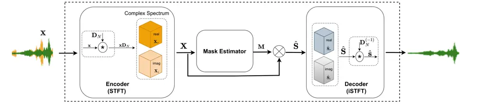

Fig. 1: The STFT-based neural speech enhancement architecture, where
$`{\bf D}_{N}`$ represents the classical Fourier matrix.

GFT-EVD. Given the graph speech signal $`\boldsymbol{x}_{\cal{G}}`$, its
Graph Fourier Transform (GFT) is obtained via the eigenvalue
decomposition (EVD) of the graph adjacency matrix $`\mathbf{A}`$,
formulated as:

```math
\mathbf{X}_{\cal{G}}=\text{GFT-EVD}(\boldsymbol{x}_{\cal{G}})=\mathbf{U}^{-1}\boldsymbol{x}_{\cal{G}}=\mathbf{X}_{\cal{G}}^{r}+j\mathbf{X}_{\cal{G}}^{i}\in\mathbb{C}, \tag{6}
```

```math
\rm{EVD}\left(\mathbf{A}\right)=\mathbf{U}\boldsymbol{\Lambda}\mathbf{U}^{T} \tag{7}
```

where $`\mathbf{U}`$ denotes the eigenvector matrix of $`\mathbf{A}`$,
and the diagonal elements of the diagonal matrix
$`\boldsymbol{\Lambda}=\text{diag}(\lambda_{0},\lambda_{1},\ldots,\lambda_{N-1})`$
denote the graph frequencies. The superscript $`T`$ denotes the
conjugate transpose of a matrix, and $`{\mathbf{X}}_{\cal{G}}^{r}`$ and
$`\mathbf{X}_{\cal{G}}^{i}`$ denote the real and imaginary components of
the GFT-EVD. Similar to STFT, GFT-EVD transforms the graph speech signal
into a complex-valued spectrum, and the inverse GFT-EVD reconstructs the
graph speech via the eigenvector matrix $`\mathbf{U}`$:

```math
{{{{\boldsymbol{x}_{\cal{G}}}}}}={\text{iGFT-EVD}{({{\textbf{X}}_{\cal{G}}}})}={\bf U}{{\textbf{X}}_{\cal{G}}} \tag{8}
```

GFT-SVD. Unlike the STFT and GFT-EVD, the singular value decomposition
(SVD) based GFT (GFT-SVD) transforms the graph speech signal
$`x_{\cal G}`$ into a real-valued spectrum representation
$`\textbf{X}_{\cal{G}}`$, given by:

```math
{{{{\textbf{X}_{\cal{G}}}}}}=\text{GFT-SVD}{({\boldsymbol{x}}_{\cal G})}={\bf\Psi^{-1}}{\boldsymbol{x}_{\cal G}}\in{\mathbb{R}} \tag{9}
```

```math
{\rm{SVD}}\left({{\bf A}}\right)={\bf\Psi}\times{\bf\Lambda}\times{{\bf\Gamma}}{} \tag{10}
```

where $`{\mathbf{\Psi}}`$ denotes the left singular-vector matrix along
the time dimension, which aligns with the phonetic boundaries of speech.
$`{\mathbf{\Gamma}}`$ denotes the right singular-vector matrix that
characterizes harmonics in the frequency domain. The inverse GFT-SVD
reconstructs the graph speech signal via the left singular-vector matrix
$`{\bf\Psi}`$:

```math
{\boldsymbol{x}}_{\cal{G}}=\text{iGFT-SVD}({\bf{X}}_{{\cal{G}}})={\bf\Psi}{\textbf{X}}_{\cal{G}}. \tag{11}
```

In contrast to the STFT, which operates in a fixed Fourier basis, the
GFT can be flexibly constructed via various graph adjacency matrices,
enabling task-specific representations. Similar to the STFT, the GFT-EVD
yields a complex-valued spectral representation of the graph speech
signal, presenting a magnitude–phase alignment challenge \[46\]. In
contrast, the GFT-SVD produces a real-valued spectral representation,
thereby avoiding this issue. Furthermore, we propose introducing
learnable neural layers to model the inversion process, aimed at
mitigating numerical errors and instability issues arising from the
matrix inversion in GFT \[54, 48\]. The details of our proposal are
presented in Section III.

## III Methodology

### III-A Overview

As illustrated in Fig. 2 (b), the overall architecture of the proposed
learnable GFT-based speech enhancement comprises a GFT-SVD encoder, a
mask learning backbone, and a GFT-SVD decoder. Specifically, a graph
shift operator is used to establish a learnable graph topology in the
encoder module, enabling the graph adjacency matrix to dynamically
characterize intrinsic relationships among graph speech samples.
Furthermore, we introduce the 1-D convolution (Conv-1D) layer for
learnable inversion of graph Fourier basis in the decoder module,
eliminating the need for explicit matrix inversion. In contrast to
STFT-based frameworks, our proposal mitigates the compensation problem
between magnitude and phase spectrum learning \[40\], facilitating
better magnitude–phase alignment for speech enhancement. The mask
learning backbone can be flexibly implemented using existing enhancement
networks.

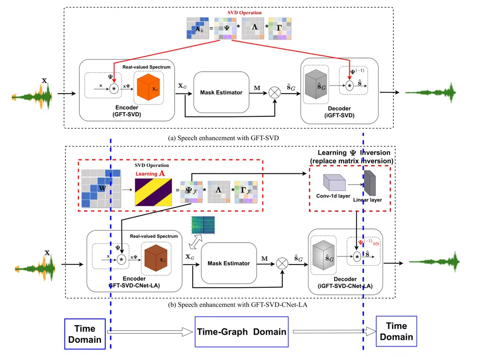

Fig. 2: (a) The neural speech enhancement architecture with GFT-SVD. (b)
The overview of neural speech enhancement architecture with learnable
GFT-SVD.

Formally, a learnable graph topology-based GFT-SVD encoder, referred to
as GFT-SVD-LA, initialized according to the graph shift operator
$`{\bf W}`$, maps a noisy speech signal
$`\boldsymbol{x}\in{\mathbb{R}}^{N}`$ into a real-valued time–graph
representation $`{\bf X}_{\cal G}\in{\mathbb{R}}^{N}`$. The
representation $`{\bf X}_{\cal G}`$ is then passed to a mask learning
backbone (mask estimator) that estimates the mask $`\mathbf{M}`$, which
is applied to noisy speech graph representation, yielding
$`{\bf\hat{S}}_{\cal G}={\bf M}\odot{\bf X}_{\cal G}`$. The clean speech
waveform is reconstructed from $`{\bf\hat{S}}_{\cal G}`$ through the
inverse GFT-SVD-LA with Conv-1D, termed GFT-SVD-CNet-LA. The overall
framework incorporating the learnable GFT-SVD is formulated as:

```math
\displaystyle{{{{\textbf{X}_{\cal{G}}}}}}=\text{GFT-SVD-LA}{({\boldsymbol{x}}_{\cal G})}\in\mathbb{R} \tag{12}
```

```math
\displaystyle{\bf\hat{S}}_{{\cal{G}}}={\bf M}\odot{\bf X}_{\cal{G}} \tag{13}
```

```math
\displaystyle\hat{\textbf{s}}=\text{iGFT-SVD-CNet-LA}({\bf\hat{S}}_{{\cal{G}}})\in\mathbb{R}. \tag{14}
```

The detailed workflow of the learnable graph topology and graph Fourier
basis are described in the next subsection.

### III-B The Learnable Graph Topology

The speech samples $`\boldsymbol{x}`$ are mapped to a graph signal
$`\mathbf{\boldsymbol{x}}_{\mathcal{G}}`$ on a fixed graph topology
$`\mathcal{G}_{x}=(\mathcal{V},\mathcal{E}_{K},\mathbf{W})`$. The
adjacency matrix element $`\mathbf{A}(n,m)`$ for each edge
$`(n,m)\in\mathcal{E}_{K}`$ is initialized by weights $`\mathbf{W}`$,
then adaptively weighted to dynamically model dependency strengths
between $`\mathbf{x}_{\mathcal{G}}[v_{n}]`$ and
$`\mathbf{x}_{\mathcal{G}}[v_{m}]`$. Assuming
$`\mathbf{x}_{\mathcal{G}}[v_{n}]`$ connects to its $`K`$ nearest
neighbors $`\mathbf{x}_{\mathcal{G}}[v_{m}]`$, $`{\mathbf{A}}(n,m)`$ can
be given as
$`\mathbf{A}(n,m)={\mathcal{F}}((x_{\cal G}[{v}_{n}],x_{\cal G}[{v}_{m}]),\quad\forall(n,m)\in\mathcal{E}_{k})`$
by employing a parameterized neural network
$`\mathcal{F}(\cdot,\Theta)`$. Each row of $`\mathbf{A}`$ is constrained
to sum to unity, forming a row-stochastic matrix that represents valid
probability distributions over connections. This property enables
$`\mathbf{A}`$ to adaptively capture the intrinsic relationships among
speech samples. The learnable graph topology is formulated as:

```math
\displaystyle{{\cal{G}}_{x}}=\left({\cal V},\boldsymbol{{\cal E}}_{K},{{\bf A}}\right) \tag{15}
```

```math
\displaystyle{\bf A}={\mathcal{F}}(((x_{\cal G}[{v}_{n}],x_{\cal G}[{v}_{m}])|{\bf W}),\Theta)\in\mathbb{R}^{N\times N},\quad\forall(n,m)\in\mathcal{E}_{K} \tag{16}
```

```math
\displaystyle\sum_{m=0}^{\rm N-1}{{\rm A}(n,m)}=1,n\in{0,1,...,{N-1}}. \tag{17}
```

The learnable graph topology construction is shown in the black dashed
area in the upper left of Fig. 2 (b).

### III-C Learnable Real-Valued Graph Fourier Basis

Given the learnable graph topology $`\mathcal{G}_{x}`$, we derive its
adjacency matrix $`\mathbf{A}`$ and construct a learnable graph Fourier
basis via Singular Value Decomposition (SVD), i.e.,
$`\operatorname{SVD}(\mathbf{A})=\boldsymbol{\Psi}_{\mathcal{F}}\boldsymbol{\Lambda}\boldsymbol{\Gamma}_{\mathcal{F}}`$,
where $`\bf{\bf\Psi}_{\cal{F}}`$ and $`\bf{\bf\Gamma}_{\cal{F}}`$ denote
the left and right singular vector matrices of $`\bf A`$. To transform
the denoised graph spectrum $`\mathbf{\hat{S}}_{\mathcal{G}}`$ back to
the time domain, the inverse operation requires
$`\boldsymbol{\Psi}_{\mathcal{F}}^{-1}`$. Instead of explicit matrix
inversion, we propose using 1-D Convolution Network to learn the
inversion process $`\boldsymbol{\Psi}_{\mathcal{F}}^{-1}`$, mitigating
numerical instability in the GFT-SVD framework. This trainable module
learns the inverse transformation via:

```math
\text{iGFT-SVD-CNet-LA}(\boldsymbol{\Psi}_{\mathcal{F}})=\text{CNet}_{\theta}(\boldsymbol{\Psi}_{\mathcal{F}})
```

where $`\theta`$ denotes network parameters. The inverse graph Fourier
transform version of $`\hat{\textbf{S}}_{G}`$ using the inversion of
GFT-SVD-LA with CNet (iGFY-SVD-CNet-LA) can be formulated as:

```math
\hat{\textbf{s}}=\text{iGFT-SVD-CNet-LA}({{\bf\hat{S}}}_{{\cal{G}}})=\text{CNet}_{\theta}({{\boldsymbol{\Psi}}}_{\cal F}){{\bf\hat{S}}_{\cal{G}}} \tag{18}
```

We integrate the proposed iGFT-SVD-CNet-LA into the decoder module of
neural speech enhancement architectures. This replaces conventional
Fourier-based processing, improving joint magnitude-phase alignment
modeling in monaural speech enhancement.

In Fig. 3, we illustrates the real and imaginary components of an
example clean speech signal (from Voice Bank Corpus) obtained using the
STFT, and the graph spectra generated by the GFT-SVD-LA under different
initial graph sparsity levels $`p=1\%,4\%,12\%,20\%,40\%,100\%`$. It can
be observed that the proposed GFT-SVD-LA produces an asymmetric
spectrum, thereby avoiding the strict symmetry constraint typically
imposed in STFT. This enhances the expressiveness for non-stationary
speech signals. Meanwhile, STFT uses a fixed frequency resolution across
the entire spectrum, whereas human auditory perception exhibits
non-uniform frequency resolution—higher in low-frequency regions and
lower in high-frequency ones. In contrast, varying graph sparsity levels
reconfigure various graph adjacency matrices, meaning that the
time-graph domain can separate the useful speech from the useless noise
in different degrees. The proposed GFT-SVD-LA offers the flexibility to
define graph topologies that better model perceptual frequency scales.
Moreover, a higher $`p`$ strengthens the capacity of graph topology to
capture relationships across noisy speech samples, enriching real-valued
spectral details in clean signals. This enhances the accuracy for
subsequently enabling mask estimation.

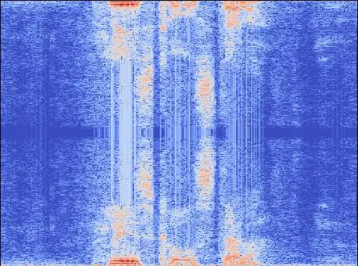

(a) real parts of STFT

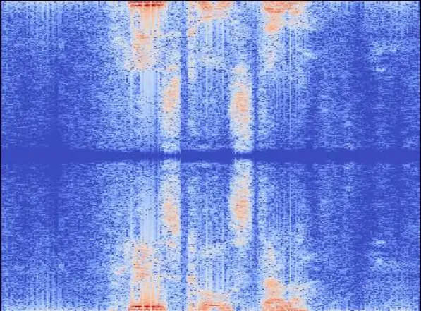

(b) imaginary parts of STFT

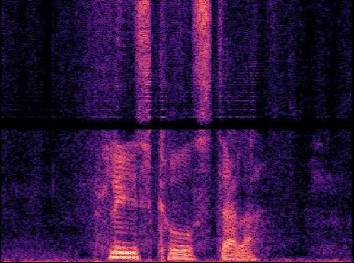

(c) graph spectrum ($`p=1\%`$)

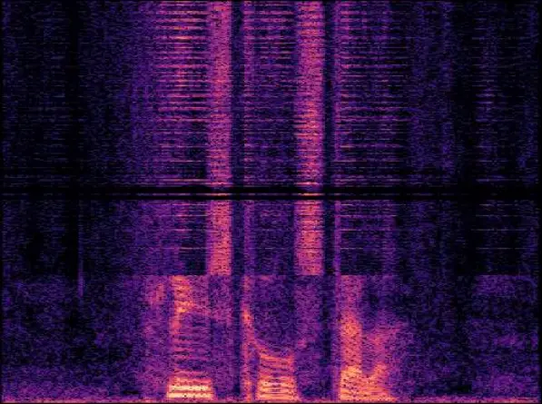

(d) graph spectrum ($`p=12\%`$)

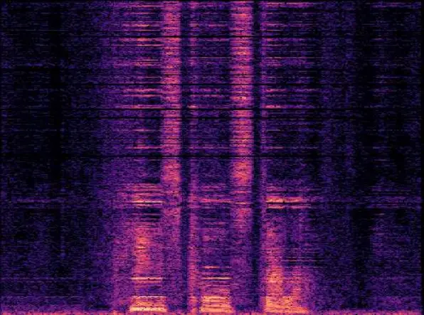

(e) graph spectrum ($`p=20\%`$)

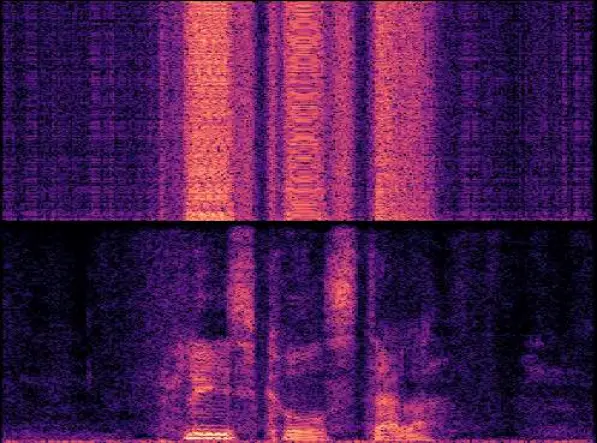

(f) graph spectrum ($`p=100\%`$)

Fig. 3: Visualization of a clean speech in the STFT and graph spectrum
representations. The (a) real and (b) imaginary parts of the clean STFT
spectrum, and the real-valued graph spectrum learned by GFT-SVD-LA with
different graph sparsity levels $`p`$, i.e., (c) $`p=1\%`$, (d)
$`p=12\%`$, (e) $`p=20\%`$, and (f) $`p=100\%`$.

## IV Experimental Setup

### IV-A Benchmarks and Datasets

We perform comprehensive evaluation experiments on two commonly used
benchmarks in speech enhancement field, i.e., 2020 Deep Noise
Suppression Challenge (DNS-2020) \[55\] and VCTK+DEMAND
benchmarks \[56\].

DNS-2020. The DNS-2020 benchmark comprises $`500`$ hours of clean speech
data from $`2\,150`$ speakers and $`180`$ hours of noise recordings
across $`150`$ noise classes. For training, $`72\,000`$ 5-second noisy
mixtures ($`100`$ hours in total) are generated by mixing a randomly
selected clean utterance from the LibriVox corpus with a randomly
selected noise segment at an SNR level randomly sampled from –5 dB to 15
dB in 1 dB increments. Following the setup in \[57\], the training and
validation sets are split from the generated mixtures using a 4:1 ratio.
We use the DNS-2020 blind test set (without reverberation) for
evaluation.

VCTK+DEMAND. The clean speech data is drawn from the Voice Bank
corpus \[58\], which contains $`12\,399`$ utterances spoken by $`30`$
speakers. Among them, $`11\,572`$ and $`827`$ utterances are used for
training and testing, respectively. The noise data includes $`8`$
real-word noise types from the Diverse Environments Multichannel
Acoustic Noise Database (DEMAND) \[59\] and $`2`$ artificial noise
types. The noisy mixtures in training set are generated by mixing the
clean speech utterances with the noise clips at SNRs of $`0`$, $`5`$,
$`10`$, and $`15`$ dB. The SNR levels for testing are $`2.5`$, $`7.5`$,
$`12.`$5, and $`17.5`$ dB. Both speakers and noise types for testing are
unseen during training.

### IV-B Backbone Network

To demonstrate the efficacy of the learnable graph topology and GFT-SVD,
our proposed GFT-SVD-LA and iGFT-SVD-CNet-LA are systematically
evaluated on several well-studied speech enhancement backbone network
models. These include both causal and non-causal models, i.e., Noise
Suppression Network (NSNet) \[60\], Dual-Path Convolution Recurrent
Network (DPCRN) \[61\], Dense Convolution Recurrent Network
(DCRN) \[62\], Deep Complex Convolution Recurrent Network
(DCCRN) \[39\], Multi-Scale Temporal Frequency Convolution Network with
Axial Self-Attention (MTFAA-Net) \[63\], UNet with GFT (G-UNet) \[47\],
Band-Split RNN (BSRNN) \[38\], Convolutional Time-domain Audio
Separation Network (Conv-TasNet) \[32\], and Dual-Path Transformer
Network (DPTNet) \[64\].

The following provides a brief description of these backbone networks.

- •
  NSNet \[60\] is used as the baseline system in Deep Noise Suppression
  (DNS) Challenge 2020. It is composed of three stacked GRU layers
  followed by a fully-connected (FC) layer with sigmoid activation to
  estimate the spectral magnitude gain, where fixed-weighted and
  SNR-weighted coefficients are introduced in loss function for separate
  control of speech distortion and noise reduction.
- •
  DPCRN \[61\] consists of a convolutional encoder, stacked two
  dual-path RNN (DPRNN) layers, and a decoder composed of transposed
  convolutional layers. Each DPRNN layer includes an intra-chunk and
  inter-chunk BLSTM.
- •
  Similar to DPCRN, DCRN \[62\] consists of an encoder with
  dense-connected convolution layers, a decoder, and two stacked BLSTM
  layers between encoder and decoder for temporal context dependencies
  modeling.
- •
  DCCRN \[39\] adopts the convolutional encoder-decoder (CED)
  architecture of DCRN \[62\], but replaces the real-valued CNN and LSTM
  layers with their complex-valued counterparts to better model the
  magnitude-phase correlations.
- •
  MTFAA-Net \[63\] is composed of a phase encoder, band merging and band
  splitting modules, Main-Net module, and mask estimating module. The
  Main-Net incorporates multi-scale temporal frequency processing and
  streaming axial self-attention to model the long-range dependencies.
- •
  G-UNet \[47\] employs an UNet model with an encoder-LSTM-decoder
  structure to estimate an ideal time-graph ratio mask (IGRM) given the
  noisy time-graph representations, which are obtained using the Graph
  Fourier Transform (GFT) based on the graph Laplacian matrix.
- •
  BSRNN \[38\] involves a band split module, a band and sequence
  modeling module, and a mask estimation module. It employs bi- and
  uni-directional band-level modeling for the low- and high-frequency
  components, respectively, to mitigate the negative impact of unstable
  high-frequency components.
- •
  Conv-TasNet \[32\] directly learns a latent representation from the
  noisy waveform using a 1-D convolution (Conv-1D) layer, which is then
  fed into temporal convolutional network (TCN) for mask estimation. The
  clean waveform is reconstructed from the masked latent representation
  using a decoder.
- •
  DPTNet \[64\] shares a CED structure similar to DPCRN and DCCRN,
  featuring densely-connected convolutional blocks in the encoder and
  decoder, and stacked dual-path Transformer blocks for temporal
  dependencies modeling.

### IV-C Loss Function

For a fair and consistent comparison across the backbone models
operating in different domains (e.g., STFT and GFT domains), we use same
loss function for training. To this end, we adopt the SI-SDR
loss \[65\], which is computed in the time domain and thus provides a
unified optimization objective regardless of the model’s feature domain.
The SI-SDR loss is defined as follows:

```math
\mathcal{L}_{\text{SI-SDR}}=20\log_{10}\frac{||\frac{<\hat{\mathbf{s}},{\mathbf{s}}>{\mathbf{s}}}{||{\mathbf{s}}||^{2}}||}{||\hat{\mathbf{s}}-\frac{<\hat{\mathbf{s}},{\mathbf{s}}>{\mathbf{s}}}{||{\mathbf{s}}||^{2}}||} \tag{19}
```

where $`\hat{\mathbf{s}}`$ and $`\mathbf{s}`$ denote the estimated and
clean speech waveform, respectively. The notation $`{<,>}`$ denotes the
dot product operation between two vectors, and $`||.||`$ denotes the
Euclidean (L2) norm. Note that
$`||\hat{\mathbf{s}}-\frac{\langle\hat{\mathbf{s}},\mathbf{s}\rangle\mathbf{s}}{||\mathbf{s}||^{2}}||`$
inherently captures phase differences through the geometry of
projection. This enables SI-SDR to function as an implicit phase-aware
loss, penalizing phase misalignment through waveform orthogonality,
without relying on explicit short-time spectral phase \[66, 32\].

### IV-D Implementation Details

All audio recordings are sampled at a frequency of 16 kHz. The window of
length $`25`$ ms with a hop length of $`6.25`$ ms is used for spectral
analysis. A 512-point GFT is applied for each time frame, leading to a
512-point time-graph spectrum as the input to models. For a fair
comparison, 512-point STFT spectrum is calculated in a same way as the
input to models. We keep the default parameter configurations across the
baseline backbone models.

All the models are trained using PyTorch on an NVIDIA GeForce RTX 3090
Ti GPU. A mini-batch size of $`4`$ speech utterances is used for each
training iteration. All models are trained using the Adam optimizer with
an initial learning rate of $`1\times 10^{-3}`$. Early stopping is
employed, with training halted if the validation loss does not improve
for 20 consecutive epochs. The decay factor $`\gamma=0.75`$ is used to
scale the learning rate if the validation metric does not improve for 5
consecutive epochs.

### IV-E Evaluation Metrics

In our experiments, three objective metrics are adopted for performance
evaluation, including the perceptual evaluation of speech quality
(PESQ) \[67\] for speech quality, short-time objective intelligibility
(STOI) \[68\] for speech intelligibility, and scale-invariant
signal-to-distortion ratio (SI-SDR) \[65\] for speech distortion.
Following prior studies \[38, 42\], we report both narrow-band (N-PESQ)
and wide-band PESQ (W-PESQ) results. For all the metrics, higher scores
indicate better performance.

|                              |                        |       |       |       |       |       |
| ---------------------------- | ---------------------- | ----- | ----- | ----- | ----- | ----- |
| Graph Topology Type          | Graph Sparsity ($`p`$) |       |       |       |       |       |
|                              | 1%                     | 4%    | 12%   | 20%   | 40%   | 100%  |
| Fixed Graph Topology \[48\]  | 2.462                  | 2.447 | 2.279 | 2.415 | 2.446 | 2.167 |
| Neural Graph Topology \[47\] | 2.525                  | 2.480 | 2.362 | 2.474 | 2.511 | 2.213 |
| Learnable Graph Topology     | 2.607                  | 2.551 | 2.487 | 2.548 | 2.533 | 2.512 |

TABLE I: The W-PESQ evaluation results for different graph topologies
across various graph sparsity levels ($`p`$), on the VCTK+DEMAND
benchmark.

## V Results and discussions

### V-A Graph Sparsity

In this section, we first evaluate the efficacy of the learnable graph
topology across various graph sparsity levels $`p`$, benchmarking
against fixed \[48\] and neural graph topology \[47\]. From Table I, we
can observe that higher $`p`$ values increase computational complexity
without commensurate performance gains, while insufficient sparsity
fails to capture the intrinsic structure of speech samples. The choice
of $`p=1\%`$ yields optimal results in both topological capacity and
computational efficiency, aligning with the findings in previous
studies \[46, 52\]. The proposed learnable graph topology achieves
superior quality scores across all sparsity levels, demonstrating the
efficacy of graph shift operator initialization for graph adjacency
matrices.

|                       |             |        |        |        |      |
| --------------------- | ----------- | ------ | ------ | ------ | ---- |
| Network               | GFT         | W-PESQ | N-PESQ | SI-SDR | STOI |
| NSNet-LA\_(𝒢)         | SVD-LA      | 2.525  | 3.275  | 17.768 | 93.2 |
| NSNet-CNet\_(𝒢)       | SVD-CNet    | 2.556  | 3.289  | 17.802 | 93.3 |
| NSNet-CL\_(𝒢)         | SVD-CNet-LA | 2.607  | 3.298  | 17.471 | 93.3 |
| DPCRN-LA\_(𝒢)         | SVD-LA      | 2.807  | 3.567  | 17.768 | 93.2 |
| DPCRN-CNet\_(𝒢)       | SVD-CNet    | 2.810  | 3.596  | 18.874 | 94.3 |
| DPCRN-CL\_(𝒢)         | SVD-CNet-LA | 2.820  | 3.590  | 19.077 | 94.3 |
| DCRN-LA\_(𝒢)          | SVD-LA      | 2.674  | 3.448  | 18.618 | 93.7 |
| DCRN-CNet\_(𝒢)        | SVD-CNet    | 2.705  | 3.478  | 18.479 | 93.7 |
| DCRN-CL\_(𝒢)          | SVD-CNet-LA | 2.723  | 3.495  | 18.372 | 93.7 |
| DCCRN-LA\_(𝒢)         | SVD-LA      | 2.713  | 3.490  | 18.526 | 93.6 |
| DCCRN-CNet\_(𝒢)       | SVD-CNet    | 2.723  | 3.508  | 18.181 | 93.8 |
| DCCRN-CL\_(𝒢)         | SVD-CNet-LA | 2.720  | 3.516  | 18.349 | 93.7 |
| MTFAA-LA\_(𝒢)         | SVD-LA      | 2.750  | 3.512  | 18.807 | 93.8 |
| MTFAA-CNet\_(𝒢)       | SVD-CNet    | 2.766  | 3.526  | 18.802 | 93.8 |
| MTFAA-CL\_(𝒢)         | SVD-CNet-LA | 2.763  | 3.538  | 18.802 | 93.5 |
| BSRNN-LA\_(𝒢)         | SVD-LA      | 2.460  | 3.283  | 18.207 | 92.3 |
| BSRNN-CNet\_(𝒢)       | SVD-CNet    | 2.523  | 3.299  | 17.832 | 92.8 |
| BSRNN-CL\_(𝒢)         | SVD-CNet-LA | 2.533  | 3.313  | 18.524 | 93.0 |
| UNet-LA\_(𝒢)          | SVD-LA      | 2.731  | 3.526  | 18.092 | 94.0 |
| UNet-CNet\_(𝒢)        | SVD-CNet    | 2.752  | 3.530  | 18.164 | 93.8 |
| UNet-CL\_(𝒢)          | SVD-CNet-LA | 2.734  | 3.533  | 18.278 | 93.6 |
| Conv-TasNet-LA\_(𝒢)   | SVD-LA      | 2.541  | 3.346  | 16.995 | 93.5 |
| Conv-TasNet-CNet\_(𝒢) | SVD-CNet    | 2.608  | 3.351  | 17.603 | 93.6 |
| Conv-TasNet-CL\_(𝒢)   | SVD-CNet-LA | 2.617  | 3.370  | 17.269 | 93.4 |
| DPTNet-LA\_(𝒢)        | SVD-LA      | 2.788  | 3.639  | 19.860 | 94.7 |
| DPTNet-CNet\_(𝒢)      | SVD-CNet    | 2.842  | 3.664  | 19.458 | 94.6 |
| DPTNet-CL\_(𝒢)        | SVD-CNet-LA | 2.891  | 3.680  | 19.797 | 94.7 |

TABLE II: Performance comparison of the backbone models using
GFT-SVD-LA, GFT-SVD-CNet, GFT-SVD-CNet-LA on the VCTK+DEMAND benchmark,
evaluated in terms of N-PESQ, W-PESQ, SI-SDR (dB), and STOI (in %).

### V-B Ablation Study

In this section, we evaluate the our learnable GFT-SVD against
GFT-SVD-LA, GFT-SVD-CNet. Table II compares the performance of nine
backbone networks with each graph Fourier basis variant on the
VCTK+DEMAND benchmark, where LA-variants represent the combination of
backbone networks and GFT-SVD-LA, CNet-variants represent the
combination of backbone networks and GFT-SVD-CNet, and CL-variants
represent backbone networks with GFT-SVD-CNet-LA. It can be seen that
the proposed GFT-SVD-CNet-LA achieves state-of-the-art performance
across all backbones. LA-variants demonstrate that graph shift operator
initialization ($`\mathbf{W}`$) provides a theoretically grounded
topology. CNet-variants confirm matrix inversion error elimination via
Conv-1D approximation. Both mechanisms enhance the alignment magnitude
and phase modeling in DNNs-based SE methods.

Table III shows the comparison results of the combination of backbone
networks and GFT-SVD-LA, GFT-SVD-CNet, GFT-SVD-CNet-CL on the DNS-2020
no-reverb benchmark. It is observed that the GFT-SVD-CNet-LA
configuration consistently outperforms baselines with GFT-SVD-LA,
GFT-SVD-CNet. These cross-dataset results confirm that the simultaneous
optimization of learnable graph topology and learnable graph Fourier
basis is critical for high-fidelity speech enhancement.

|                       |             |        |        |        |      |
| --------------------- | ----------- | ------ | ------ | ------ | ---- |
| Network               | GFT         | W-PESQ | N-PESQ | SI-SDR | STOI |
| NSNet-LA\_(𝒢)         | SVD-LA      | 2.475  | 3.023  | 16.573 | 95.2 |
| NSNet-CNet\_(𝒢)       | SVD-CNet    | 2.479  | 3.033  | 16.590 | 95.2 |
| NSNet-CL\_(𝒢)         | SVD-CNet-LA | 2.588  | 3.135  | 17.317 | 95.8 |
| DPCRN-LA\_(𝒢)         | SVD-LA      | 2.938  | 3.434  | 18.959 | 97.0 |
| DPCRN-CNet\_(𝒢)       | SVD-CNet    | 2.954  | 3.461  | 19.172 | 97.1 |
| DPCRN-CL\_(𝒢)         | SVD-CNet-LA | 3.000  | 3.489  | 19.363 | 97.1 |
| DCRN-LA\_(𝒢)          | SVD-LA      | 2.754  | 3.272  | 18.268 | 96.3 |
| DCRN-CNet\_(𝒢)        | SVD-CNet    | 2.773  | 3.282  | 18.294 | 96.3 |
| DCRN-CL\_(𝒢)          | SVD-CNet-LA | 2.792  | 3.295  | 18.456 | 96.4 |
| DCCRN-LA\_(𝒢)         | SVD-LA      | 2.836  | 3.369  | 18.722 | 96.7 |
| DCCRN-CNet\_(𝒢)       | SVD-CNet    | 2.861  | 3.389  | 18.933 | 96.7 |
| DCCRN-CL\_(𝒢)         | SVD-CNet-LA | 2.875  | 3.414  | 19.004 | 96.8 |
| MTFAA-LA\_(𝒢)         | SVD-LA      | 2.722  | 3.260  | 18.266 | 96.3 |
| MTFAA-CNet\_(𝒢)       | SVD-CNet    | 2.795  | 3.311  | 18.512 | 96.5 |
| MTFAA-CL\_(𝒢)         | SVD-CNet-LA | 2.865  | 3.390  | 18.868 | 96.8 |
| BSRNN-LA\_(𝒢)         | SVD-LA      | 2.197  | 2.739  | 14.844 | 93.2 |
| BSRNN-CNet\_(𝒢)       | SVD-CNet    | 2.211  | 2.726  | 14.773 | 93.3 |
| BSRNN-CL\_(𝒢)         | SVD-CNet-LA | 2.229  | 2.774  | 15.233 | 93.6 |
| UNet-LA\_(𝒢)          | SVD-LA      | 2.770  | 3.331  | 18.682 | 96.5 |
| UNet-CNet\_(𝒢)        | SVD-CNet    | 2.794  | 3.344  | 18.554 | 96.6 |
| UNet-CL\_(𝒢)          | SVD-CNet-LA | 2.812  | 3.352  | 18.554 | 96.7 |
| Conv-TasNet-LA\_(𝒢)   | SVD-LA      | 2.628  | 3.206  | 15.596 | 95.8 |
| Conv-TasNet-CNet\_(𝒢) | SVD-CNet    | 2.687  | 3.249  | 16.590 | 96.0 |
| Conv-TasNet-CL\_(𝒢)   | SVD-CNet-LA | 2.707  | 3.260  | 16.472 | 96.1 |

TABLE III: Performance comparison of the backbone models using
GFT-SVD-LA, GFT-SVD-CNet, GFT-SVD-CNet-LA on the DNS 2020 no-reverb
benchmark, evaluated in terms of N-PESQ, W-PESQ, SI-SDR (dB), and STOI
(in %).

### V-C Comparison Study

In Table IV, we compare the proposed GFT-SVD-CNet-LA with STFT, GFT-EVD,
GFT-SVD, and Conv-1D on the VCTK+DEMAND benchmark, across different
backbones in terms of PESQ, SI-SDR, and STOI. For the implementations of
the backbones, we adopt the the authors’ source code with default model
configurations. The comparison results demonstrates that the
GFT-SVD-CNet-LA consistently achieves significant improvements over
Conv-1D, STFT, GFT-EVD, and GFT-SVD in all the three metrics. For
instance, DPCRN-CL\_(G) improves the STFT-based counterpart DPCRN-STFT by
0.269 in W-PESQ, by 0.533 in SI-SDR and 0.3% in STOI. Among all the
models, overall, the performance ranking is GFT-SVD-CNet-LA $`>`$
GFT-SVD $`>`$ STFT.

Table V reports the comparison results of GFT-SVD-CNet-LA, STFT,
GFT-EVD, GFT-SVD, and Conv-1D on the DNS-2020 benchmark (No-reverb).
Similar performance trends are observed to those in Table IV. Again, our
proposed learnable GFT-SVD-CNet-LA achieve the best results across
different backbones, significantly outperforming GFT-EVD and GFT-SVD.
These comparisons indicate that learnable GFT-SVD strengthens the GFT’s
capacity for amplitude–phase alignment modeling.

|                     |                 |        |        |        |      |
| ------------------- | --------------- | ------ | ------ | ------ | ---- |
| Network             | Transform       | W-PESQ | N-PESQ | SI-SDR | STOI |
| NSNet \[60\]        | STFT            | 2.343  | 3.109  | 17.793 | 92.8 |
| NSNet\_(𝒢) \[48\]   | GFT-SVD         | 2.462  | 3.215  | 18.035 | 93.2 |
| NSNet-CL\_(𝒢)       | GFT-SVD-CNet-LA | 2.607  | 3.298  | 17.471 | 93.3 |
| DPCRN \[61\]        | STFT            | 2.551  | 3.333  | 18.544 | 94.0 |
| DPCRN\_(𝒢) \[48\]   | GFT-SVD         | 2.741  | 3.556  | 18.826 | 94.4 |
| DPCRN-CL\_(𝒢)       | GFT-SVD-CNet-LA | 2.820  | 3.590  | 19.077 | 94.3 |
| DCRN \[62\]         | STFT            | 2.436  | 3.211  | 17.877 | 93.3 |
| DCRN\_(𝒢) \[48\]    | GFT-SVD         | 2.624  | 3.426  | 18.242 | 93.7 |
| DCRN-CL\_(𝒢)        | GFT-SVD-CNet-LA | 2.723  | 3.495  | 18.372 | 93.7 |
| DCCRN \[39\]        | STFT            | 2.510  | 3.255  | 18.242 | 93.3 |
| DCCRN\_(𝒢) \[48\]   | GFT-SVD         | 2.634  | 3.468  | 18.125 | 94.0 |
| DCCRN-CL\_(𝒢)       | GFT-SVD-CNet-LA | 2.720  | 3.516  | 18.349 | 93.7 |
| MTFAA \[63\]        | STFT            | 2.657  | 3.478  | 18.837 | 93.8 |
| MTFAA\_(𝒢) \[48\]   | GFT-SVD         | 2.748  | 3.553  | 18.670 | 94.2 |
| MTFAA-CL\_(𝒢)       | GFT-SVD-CNet-LA | 2.763  | 3.538  | 18.802 | 93.5 |
| BSRNN \[38\]        | STFT            | 2.444  | 3.190  | 18.831 | 92.8 |
| BSRNN\_(𝒢) \[48\]   | GFT-SVD         | 2.567  | 3.358  | 19.219 | 93.2 |
| BSRNN-CL\_(𝒢)       | GFT-SVD-CNet-LA | 2.533  | 3.313  | 18.524 | 93.0 |
| UNet \[69\]         | STFT            | 2.160  | 3.000  | 16.484 | 92.6 |
| G-UNet \[47\]       | GFT-EVD         | 2.455  | 3.274  | 18.009 | 93.2 |
| UNet\_(𝒢) \[48\]    | GFT-SVD         | 2.644  | 3.490  | 18.611 | 93.7 |
| UNet-CL\_(𝒢)        | GFT-SVD-CNet-LA | 2.734  | 3.533  | 18.278 | 93.6 |
| Conv-TasNet \[32\]  | Conv-1D         | 2.537  | 3.318  | 19.178 | 93.6 |
| Conv-TasNet         | STFT            | 2.328  | 3.067  | 16.825 | 92.5 |
| Conv-TasNet\_(𝒢)    | GFT-SVD         | 2.532  | 3.348  | 16.835 | 93.5 |
| Conv-TasNet-CL\_(𝒢) | GFT-SVD-CNet-LA | 2.617  | 3.370  | 17.269 | 93.4 |
| DPTNet \[64\]       | STFT            | 2.538  | 3.324  | 18.970 | 94.0 |
| DPTNet\_(𝒢)         | GFT-SVD         | 2.875  | 3.658  | 19.979 | 94.8 |
| DPTNet-CL\_(𝒢)      | GFT-SVD-CNet-LA | 2.891  | 3.680  | 19.797 | 94.7 |

TABLE IV: Performance comparison of the backbone models using STFT,
GFT-SVD, and learnable GFT-SVD on the VCTK+DEMAND benchmark, evaluated
in terms of N-PESQ, W-PESQ, SI-SDR (dB), and STOI (in %).

|                     |                  |        |        |        |      |
| ------------------- | ---------------- | ------ | ------ | ------ | ---- |
| Network             | Transform        | W-PESQ | N-PESQ | SI-SDR | STOI |
| NSNet \[60\]        | STFT             | 2.331  | 2.865  | 16.262 | 94.6 |
| NSNet\_(𝒢) \[48\]   | GFT-SVD          | 2.439  | 3.008  | 16.352 | 95.0 |
| NSNet-CL\_(𝒢)       | GFT-SVD-CNet-LA  | 2.588  | 3.135  | 16.700 | 95.8 |
| DPCRN \[61\]        | STFT             | 2.797  | 3.260  | 18.570 | 96.7 |
| DPCRN\_(𝒢) \[48\]   | GFT-SVD          | 2.885  | 3.392  | 18.964 | 96.8 |
| DPCRN-CL\_(𝒢)       | GFT-SVD-CNet-L   | 3.000  | 3.489  | 19.363 | 97.1 |
| DCRN \[62\]         | STFT             | 2.566  | 3.074  | 17.326 | 95.8 |
| DCRN\_(𝒢) \[48\]    | GFT-SVD          | 2.739  | 3.272  | 18.143 | 96.2 |
| DCRN-CL\_(𝒢)        | GFT-SVD-CNet-LAA | 2.792  | 3.295  | 18.456 | 96.4 |
| DCCRN \[39\]        | STFT             | 2.644  | 3.148  | 17.950 | 96.3 |
| DCCRN\_(𝒢) \[48\]   | GFT-SVD          | 2.841  | 3.376  | 18.587 | 96.7 |
| DCCRN-CL\_(𝒢)       | GFT-SVD-CNet-LA  | 2.875  | 3.414  | 19.004 | 96.8 |
| MTFAA \[63\]        | STFT             | 2.696  | 3.243  | 18.294 | 96.4 |
| MTFAA\_(𝒢) \[48\]   | GFT-SVD          | 2.707  | 3.261  | 18.454 | 96.3 |
| MTFAA-CL\_(𝒢)       | GFT-SVD-CNet-LA  | 2.865  | 3.390  | 18.868 | 96.8 |
| BSRNN \[38\]        | STFT             | 2.203  | 2.734  | 16.070 | 94.2 |
| BSRNN\_(𝒢) \[48\]   | GFT-SVD          | 2.321  | 2.835  | 16.300 | 94.3 |
| BSRNN-CL\_(𝒢)       | GFT-SVD-CNet-LA  | 2.229  | 2.774  | 15.233 | 93.6 |
| UNet \[69\]         | STFT             | 2.017  | 2.597  | 14.585 | 94.0 |
| G-UNet \[47\]       | GFT-EVD          | 2.580  | 3.129  | 17.583 | 95.9 |
| UNet\_(𝒢) \[48\]    | GFT-SVD          | 2.785  | 3.346  | 18.466 | 96.6 |
| UNet-CL\_(𝒢)        | GFT-SVD-CNet-LA  | 2.812  | 3.352  | 18.554 | 96.7 |
| Conv-TasNet \[32\]  | Conv-1D          | 2.328  | 2.866  | 17.045 | 94.5 |
| Conv-TasNet         | STFT             | 2.423  | 2.982  | 15.930 | 95.2 |
| Conv-TasNet\_(𝒢)    | GFT-SVD          | 2.637  | 3.222  | 15.351 | 95.7 |
| Conv-TasNet-CL\_(𝒢) | GFT-SVD-CNet-LA  | 2.719  | 3.267  | 16.367 | 96.0 |
| DPTNet \[64\]       | STFT             | 2.577  | 3.095  | 18.408 | 95.7 |
| DPTNet\_(𝒢)         | GFT-SVD          | 2.741  | 3.284  | 19.076 | 96.5 |
| DPTNet-CL\_(𝒢)      | GFT-SVD-CNet-LA  | 2.789  | 3.347  | 18.875 | 96.3 |

TABLE V: Performance comparison of the backbone models using STFT,
GFT-SVD, and learnable GFT-SVD on the DNS-2020 benchmark, evaluated in
terms of N-PESQ, W-PESQ, SI-SDR (dB), and STOI (in %).

### V-D Visualization

In Fig. 4, we present visualization of the masks estimated by the DPCRN
backbone with various Fourier representations, where DPCRN separately
predicts the magnitude mask and phase of the clean speech. The noisy
waveform used in Fig. 4 is generated by mixing a clean speech utterance
(Fig. 3) with a noise recording at 5dB SNR. Fig. 4 (a) and (b)
illustrates the real and imaginary parts of the mask attained by
DPCRN-STFT, respectively. Fig. 4 (c)-(h) show the estimated masks
produced by DPCRN using GFT-SVD-LA, GFT-SVD-CNet and GFT-SVD-CNet-LA. It
can be clearly found that the STFT-based mask estimation entails
separate optimization space toward the magnitude and phase. In contrast,
the DPCRN with learnable GFT-SVD is capable of estimating a unified mask
for both magnitude and phase. This alleviates the compensation effects
that decouple the complex spectrum estimation into two separate steps.
Meanwhile, compared to the mask estimated by DPCRN with GFT-SVD-LA or
GFT-SVD-CNet, the GFT-SVD-CNet-LA approach capture finer details in the
learnable GFT domain. Therefore, the comparisons among STFT, GFT-SVD-LA,
GFT-SVD-CNet, and GFT-SVD-CNet-LA demonstrate the efficacy of the
learnable graph topology with a learnable graph Fourier basis.

### V-E Training & Validation Error

Fig. 5 shows the curves of training and validation errors produced by
each backbone, where each mini-batch includes 20 samples. From these
curves, we can observe that backbone models with our proposed learnable
GFT-SVD-CNet-LA (-CL*(G)) yields lower training and validation errors
compared to the backbones using STFT, GFT-EVD, GFT-SVD, confirming the
efficacy of the learnable GFT-SVD. Meanwhile, we can find that compared
to learnable GFT-SVD-LA (-LA*(G)) and GFT-SVD-CNet (-CNet\_(G)),
GFT-SVD-CNet-LA yields lower training and validation errors.

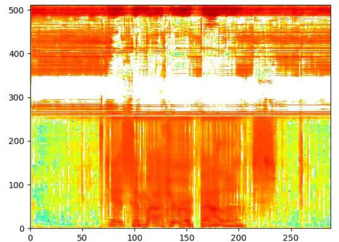

(a) Mask.re (STFT)

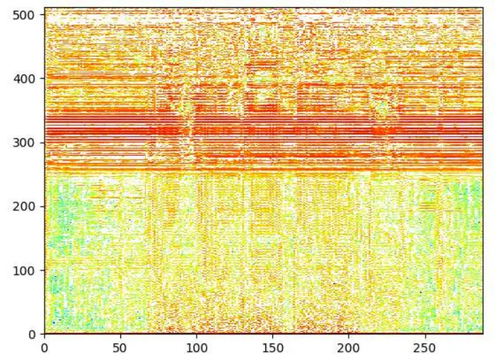

(b) Mask.im (STFT)

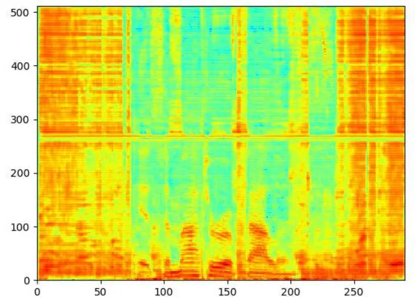

(c) Mask.$`1_{th}`$ (GFT-SVD-LA)

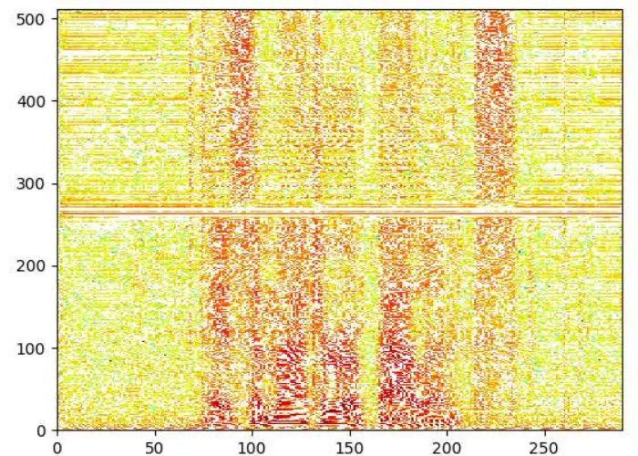

(d) Mask.$`2_{th}`$ (GFT-SVD-LA)

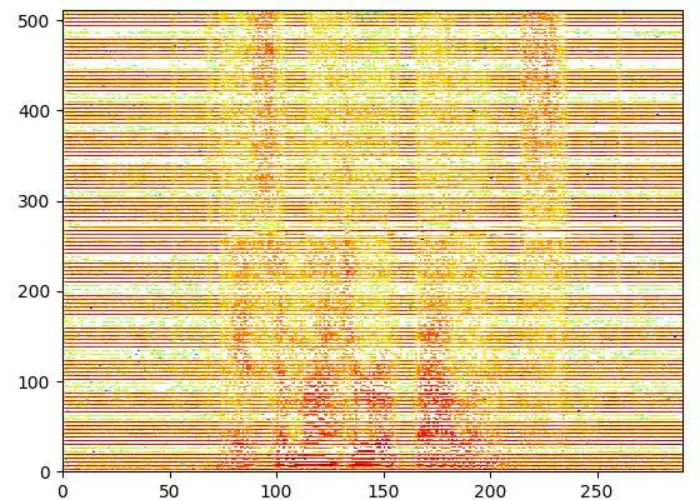

(e) Mask.$`1_{th}`$ (GFT-SVD-CNet)

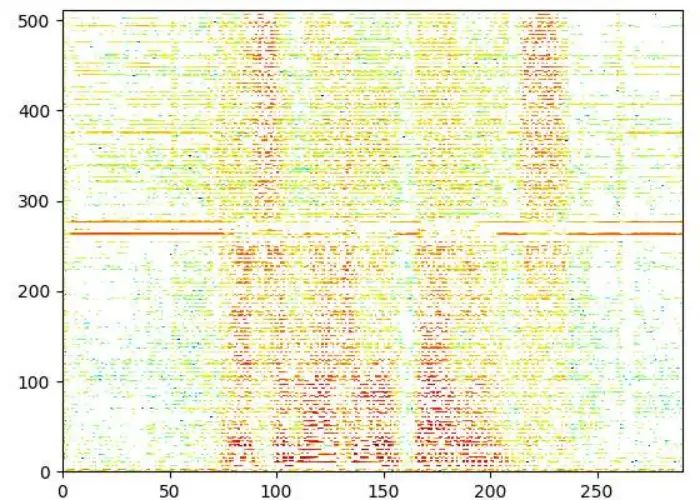

(f) Mask.$`1_{th}`$ (GFT-SVD-CNet)

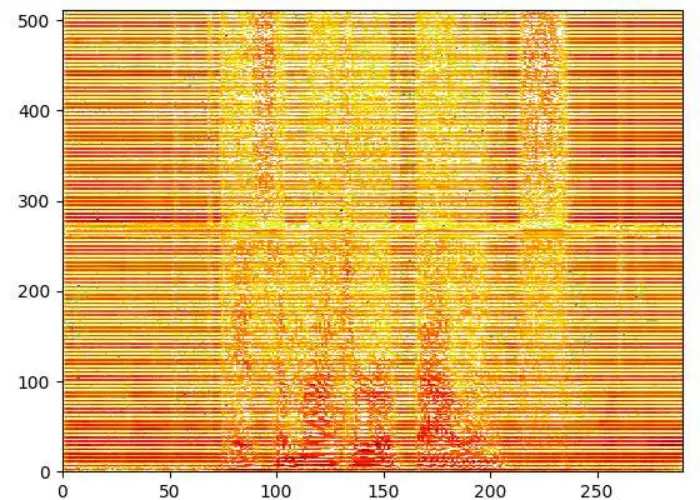

(g) Mask.$`1_{th}`$ (GFT-SVD-CNet-LA)

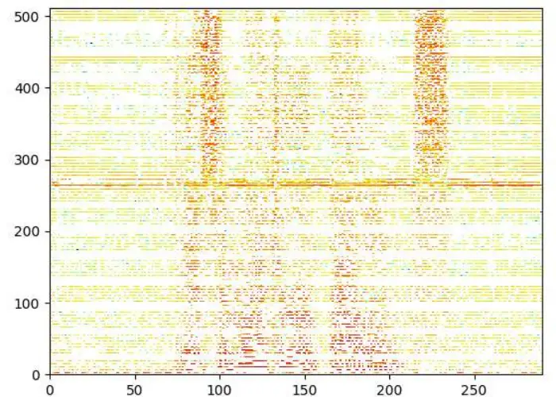

(h) Mask.$`2_{th}`$ (GFT-SVD-CNet-LA)

Fig. 4: The illustrations of (a) the real and (b) imaginary parts of the
estimated mask obtained by DPCRN using STFT. (c), (d) The estimated
masks generated by DPCRN with GFT-SVD-LA. (e), (f) The estimated masks
generated by DPCRN with GFT-SVD-CNet. (g), (h) The estimated masks
generated by DPCRN with GFT-SVD-CNet-LA.

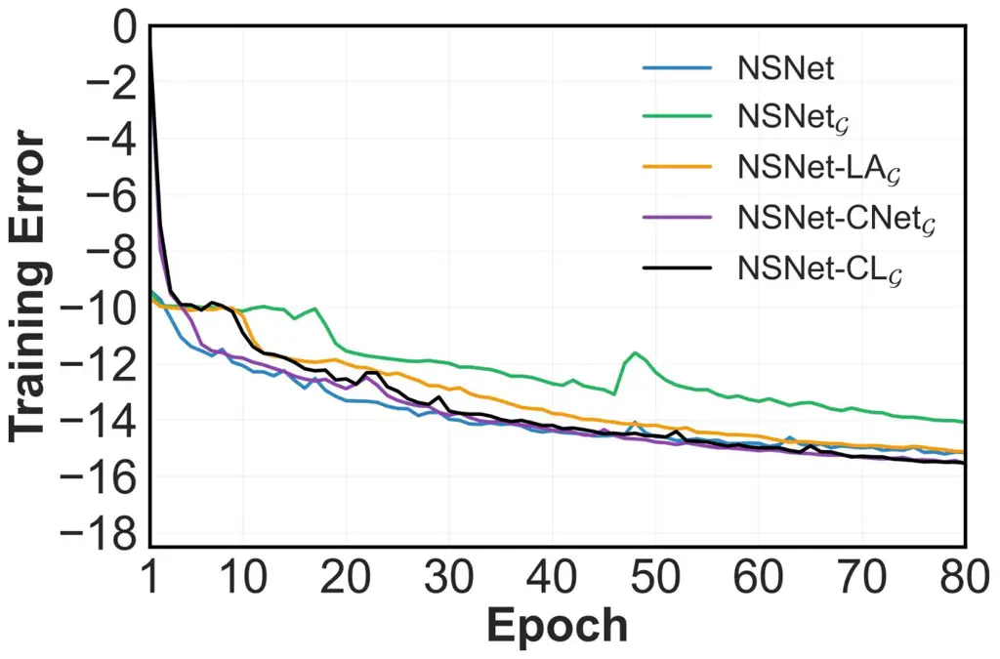

(a)

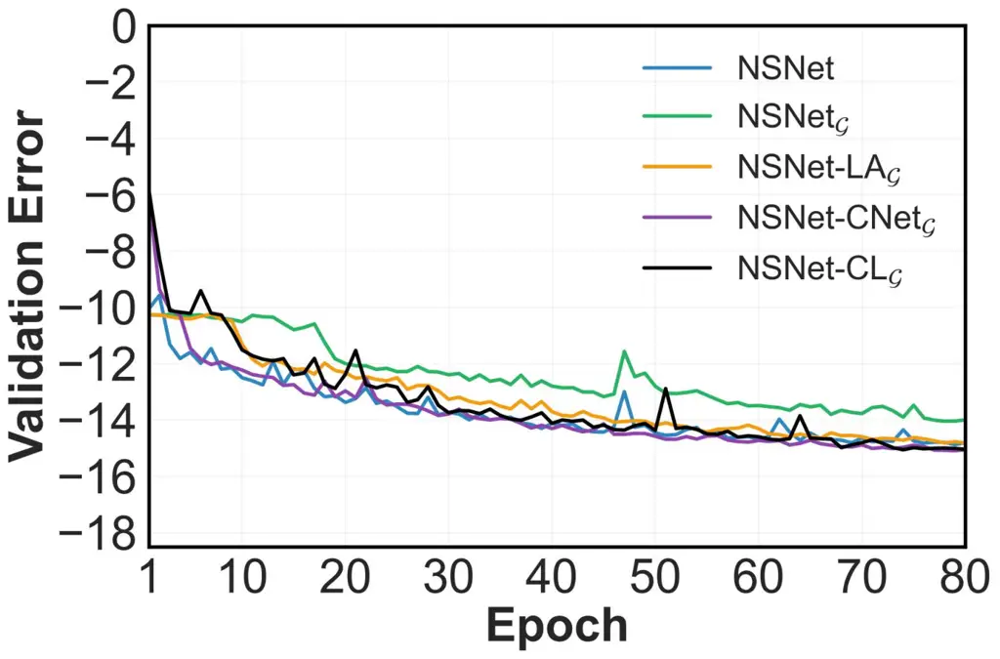

(b)

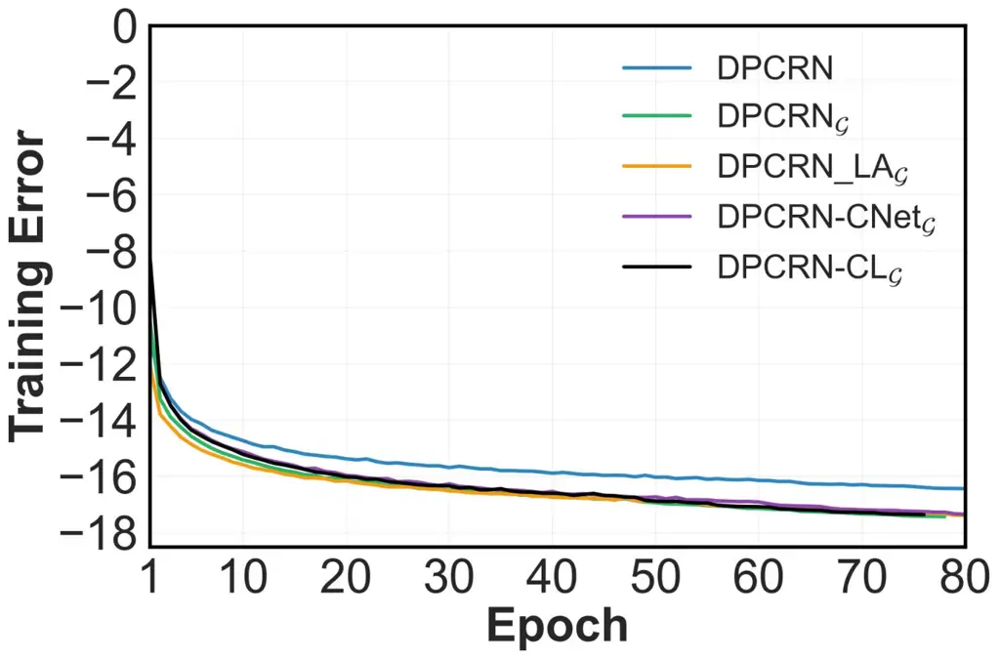

(c)

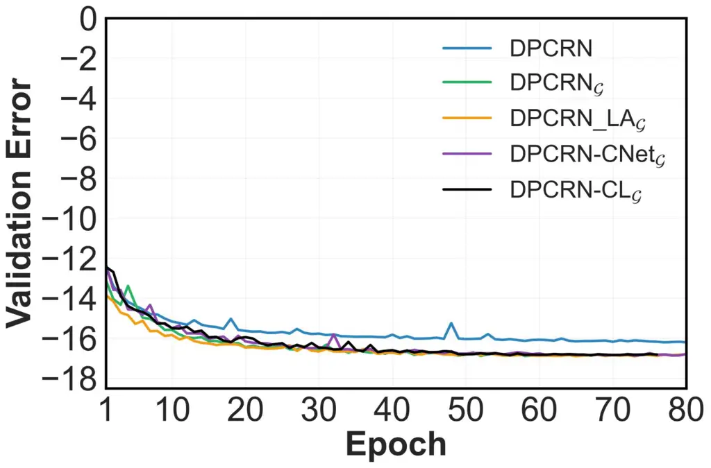

(d)

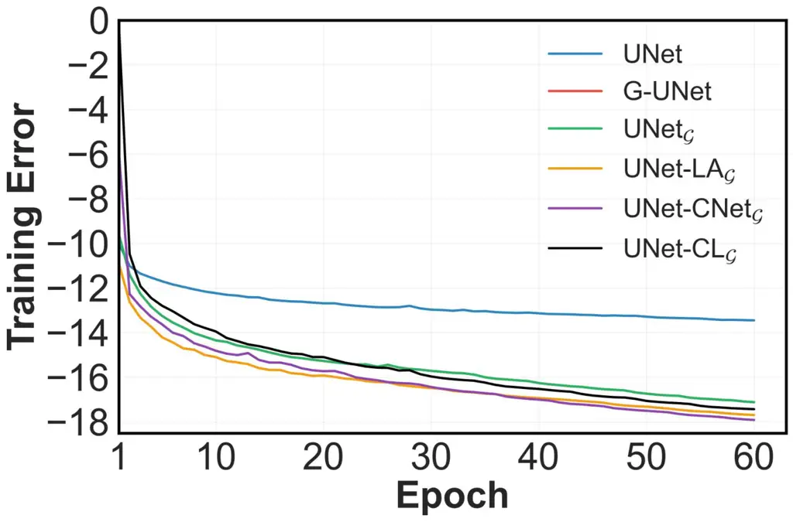

(e)

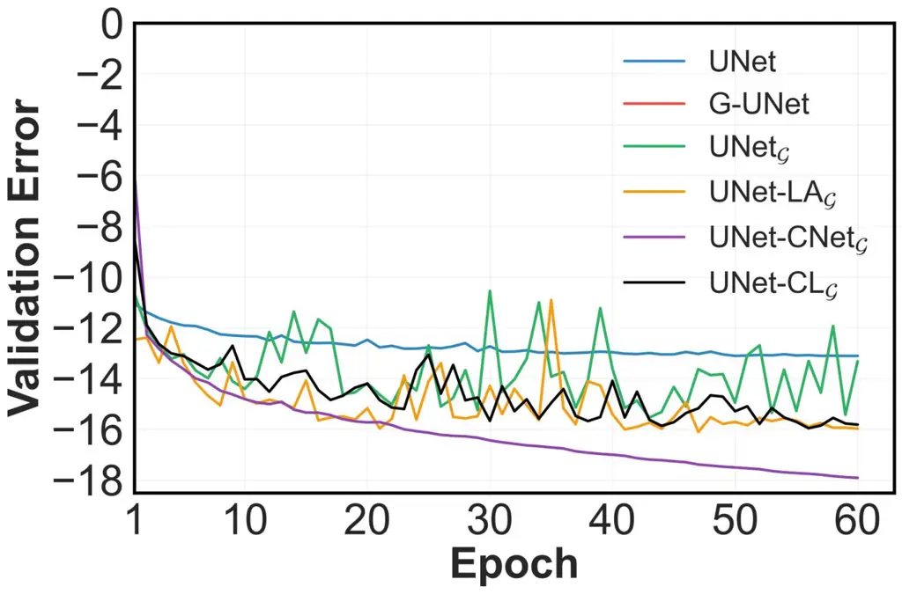

(f)

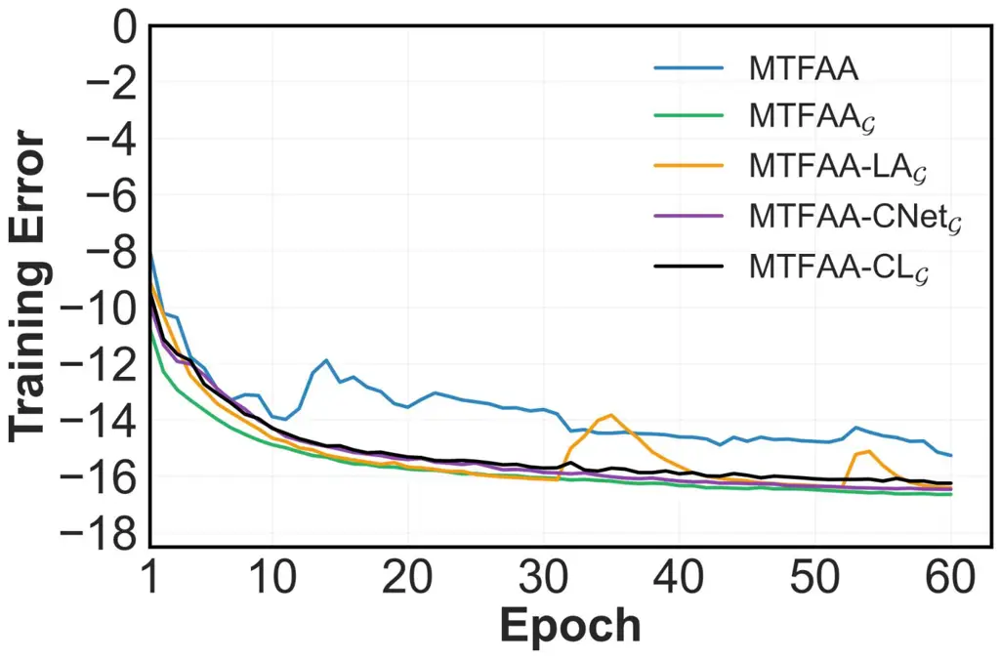

(g)

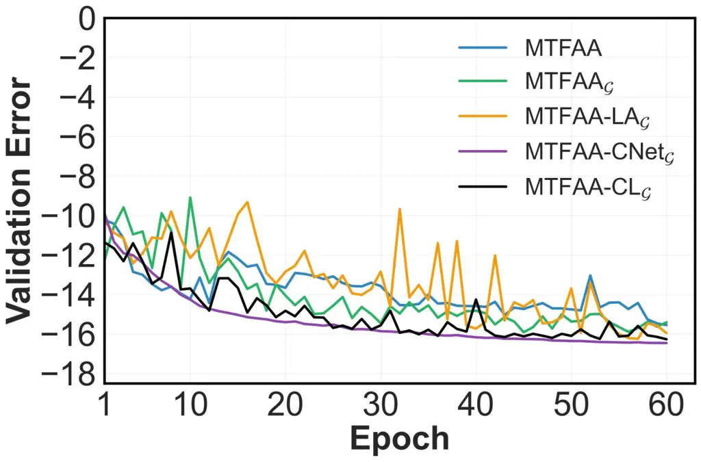

(h)

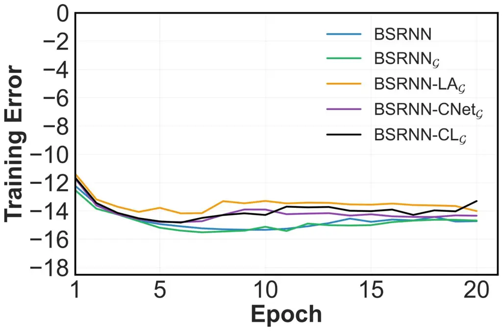

(i)

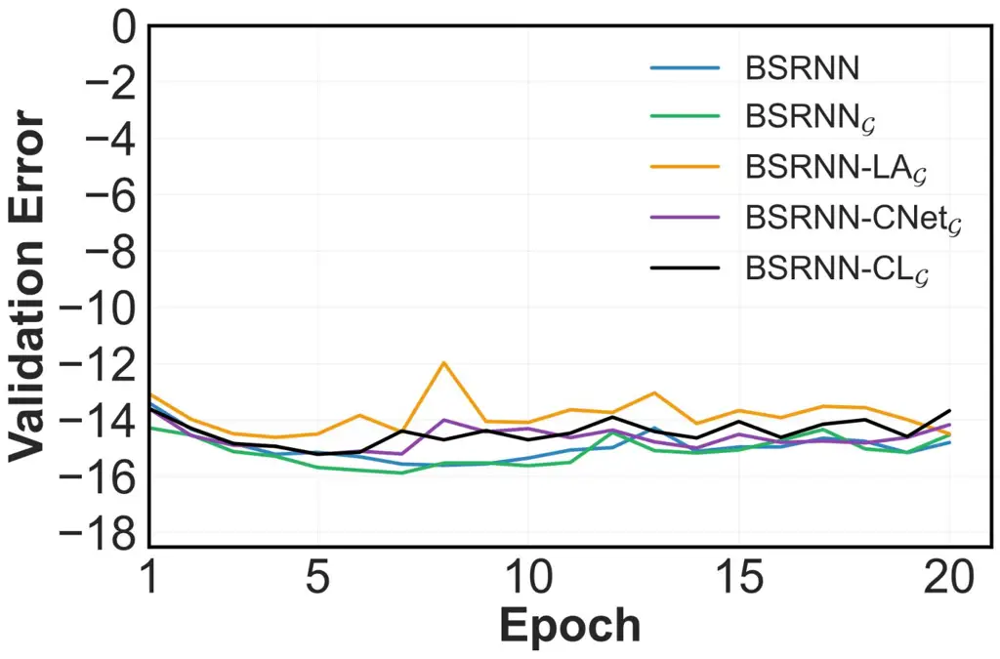

(j)

Fig. 5: The curves of (a) training error and (b) validation error of
NSNet using various Fourier transform. The curves of training error (c)
validation error (d) on the combination of DPCRN and various Fourier
transform. The curves of training error (e) validation error (f) on the
combination of UNet and various Fourier transform. The curves of
training error (g) validation error (h) on the combination of MTFAA and
various Fourier transform. The curves of training error (i) validation
error (j) on the combination of BSRNN and various Fourier transform.

### V-F Computational Complexity

In Table VI, we report the multiplier-accumulator operations (MACs), the
number of parameters, and the real-time factor (RTF) for different
backbone networks with STFT, GFT-EVD, GFT-SVD, Conv-1D and learnable
GFT-SVD. Specifically, we employ 3-second audio segments as the input to
measure the MACs per second \[48\] and RTF, with the latter measured on
an NVIDIA GeForce GTX 3090 Ti. It can be observed that the use of
learnable GFT-SVD does not substantially compromise the computational
efficiency of backbone networks in MACs, model size, and RTF. Meanwhile,
as the evaluation results reported in Tables IV and V, the learnable
GFT-SVD provides substantial performance improvements.

## VI Conclusion

The alignment performance of magnitude and phase in the GFT domain
depends on the accuracy of the employed graph Fourier basis for
GFT-based neural speech enhancement system. Motivated by this, we
investigate a learnable graph topology initialized with graph shift
operators to dynamically characterize relationships among speech
samples. A learnable Conv-1D Fourier basis inversion is then proposed to
reduce matrix inversion errors in GFT. Extensive experiments on the
DNS-2020 and VCTK+DEMAND benchmarks demonstrate that state-of-the-art
neural speech enhancement architectures with the learnable GFT-SVD
outperform those using STFT, GFT-EVD, GFT-SVD, and Conv-1D in three
widely used objective evaluation metrics. This study provides a new
direction for modeling the alignment of spectral magnitude and phase to
better learn clean spectrogram information in neural speech enhancement.

|                     |                 |            |             |       |
| ------------------- | --------------- | ---------- | ----------- | ----- |
| Network             | Transform       | MACs (G/s) | \#Param (M) | RTF   |
| NSNet \[60\]        | STFT            | 1.15       | 3.04        | 0.009 |
| NSNet\_(𝒢) \[48\]   | GFT-SVD         | 1.15       | 3.04        | 0.006 |
| NSNet-CL\_(𝒢)       | GFT-SVD-CNet-LA | 2.50       | 5.41        | 0.018 |
| DPCRN \[61\]        | STFT            | 37.42      | 0.88        | 0.011 |
| DPCRN\_(𝒢) \[48\]   | GFT-SVD         | 37.62      | 0.88        | 0.005 |
| DPCRN-CL\_(𝒢)       | GFT-SVD-CNet-LA | 38.97      | 3.25        | 0.010 |
| DCRN \[62\]         | STFT            | 16.56      | 2.03        | 0.009 |
| DCRN\_(𝒢) \[48\]    | GFT-SVD         | 16.65      | 2.03        | 0.003 |
| DCRN-CL\_(𝒢)        | GFT-SVD-CNet-LA | 17.99      | 4.39        | 0.030 |
| DCCRN \[39\]        | STFT            | 65.85      | 4.33        | 0.031 |
| DCCRN\_(𝒢) \[48\]   | GFT-SVD         | 66.19      | 4.33        | 0.013 |
| DCCRN-CL\_(𝒢)       | GFT-SVD-CNet-LA | 67.54      | 6.69        | 0.071 |
| MTFAA \[63\]        | STFT            | 14.55      | 2.19        | 0.040 |
| MTFAA\_(𝒢) \[48\]   | GFT-SVD         | 14.63      | 2.19        | 0.012 |
| MTFAA-CL\_(𝒢)       | GFT-SVD-CNet-LA | 15.97      | 4.55        | 0.051 |
| BSRNN \[38\]        | STFT            | 2850       | 200         | 0.247 |
| BSRNN\_(𝒢) \[48\]   | GFT-SVD         | 2865       | 200         | 0.118 |
| BSRNN-CL\_(𝒢)       | GFT-SVD-CNet-LA | 2866       | 202         | 0.551 |
| UNet \[69\]         | STFT            | 22.52      | 18.10       | 0.019 |
| G-UNet \[47\]       | GFT-EVD         | 22.28      | 18.10       | 0.025 |
| UNet\_(𝒢) \[48\]    | GFT-SVD         | 19.38      | 18.00       | 0.009 |
| UNet-CL\_(𝒢)        | GFT-SVD-CNet-LA | 23.98      | 20.46       | 0.018 |
| Conv-TasNet \[32\]  | Conv-1D         | 33.54      | 3.33        | 0.038 |
| Conv-TasNet         | STFT            | 5.549      | 8.831       | 0.045 |
| Conv-TasNet\_(𝒢)    | GFT-SVD         | 5.566      | 8.831       | 0.042 |
| Conv-TasNet-CL\_(𝒢) | GFT-SVD-CNet-LA | 6.915      | 11.195      | 0.041 |
| DPTNet \[64\]       | STFT            | 179.84     | 0.87        | 0.086 |
| DPTNet\_(𝒢)         | GFT-SVD         | 180.42     | 0.87        | 0.039 |
| DPTNet-CL\_(𝒢)      | GFT-SVD-CNet-LA | 181.77     | 3.23        | 0.041 |

TABLE VI: The MACs, parameter numbers, and real-time factor (RTF) of
different backbone networks with STFT, GFT-SVD, and learnable GFT-SVD.

## References

- \[1\] P. C. Loizou, _Speech Enhancement: Theory and Practice_,
  2nd ed. Boca Raton, FL, USA: CRC Press, Inc., 2013.
- \[2\] Q. Zhang, X. Qian, Z. Ni, A. Nicolson, E. Ambikairajah, and
  H. Li, “A time-frequency attention module for neural speech
  enhancement,” _IEEE/ACM Transactions on Audio, Speech, and Language
  Processing_, vol. 31, pp. 462–475, 2023.
- \[3\] A. J. Fuglsig, J. O. stergaard, J. Jensen, L. S. ndergaard
  Bertelsen, P. Mariager, and Z. H. Tan, “Joint far- and near-end speech
  intelligibility enhancement based on the approximated speech
  intelligibility index,” in _Proc. IEEE Int. Conf. Acoust., Speech,
  Signal Process._, 2022, pp. 7752–7756.
- \[4\] A. J. Fuglsig, J. O. stergaard, J. Jensen, L. S. ondergaard
  Bertelsen, P. Mariager, and Z. H. Tan, “Joint far-and near-end speech
  intelligibility enhancement based on the approximated speech
  intelligibility index,” _CoRR_, vol. abs/2111.07759, 2021.
- \[5\] A. J. Fuglsig, J. Jensen, Z. H. Tan, L. S. ndergaard Bertelsen,
  J. C. Lindof, and J. stergaard, “Joint far- and near-end speech and
  listening enhancement with minimum processing,” in _IEEE Access_,
  vol. 12, 2024, pp. 119 983–120 004.
- \[6\] S. Shoba, R. Rajavel, K. Asutosh, and B. Majhi, “Monaural speech
  separation using GA-DNN integration scheme,” vol. 160, p.
  107140, 2020.
- \[7\] M. Chen, Q. Zhang, M. Wang, X. Zhang, H. Liu, E. Ambikairaiah,
  and D. Chen, “Selective State Space Model for Monaural Speech
  Enhancement,” _IEEE Trans. Consum. Electron._, pp. 1–1, 2025.
- \[8\] Krawczyk-Becker, Martin, and T. Gerkmann, “On mmse-based
  estimation of amplitude and complex speech spectral coefficients under
  phase-uncertainty,” _IEEE/ACM Trans. Audio, Speech, and Lang. Proc._,
  vol. 24, no. 12, pp. 2251–2262, 2016.
- \[9\] Y. Ephraim and D. Malah, “Speech Enhancement Using a Minimum
  Mean-Square Error Short-Time Spectral Amplitude Estimator,” _IEEE
  Trans. Acoust., Speech, Signal Process._, vol. ASSP-32, no. 6, pp.
  1109–1121, 1984.
- \[10\] Q. Zhang, M. Wang, Y. Lu, L. Zhang, and M. Idrees, “A novel
  fast nonstationary noise tracking approach based on mmse spectral
  power estimator,” _Digital Signal Processing_, vol. 88, pp.
  41–52, 2019.
- \[11\] Q. Zhang, M. Wang, Y. Lu, M. Idrees, and L. Zhang, “Fast
  nonstationary noise tracking based on log-spectral power mmse
  estimator and temporal recursive averaging,” _IEEE Access_, vol. 7,
  pp. 80 985–80 999, 2019.
- \[12\] D. Wang and J. Chen, “Supervised speech separation based on
  deep learning: An overview,” _IEEE/ACM Transactions on Audio, Speech,
  and Language Processing_, vol. 26, no. 10, pp. 1702–1726, 2018.
- \[13\] O’Shaughnessy and Douglas, “Speech enhancement—a review of
  modern methods,” _IEEE Transactions on Human-Machine Systems_,
  vol. 54, no. 1, pp. 110–120, 2024.
- \[14\] Q. Zhang, A. Nicolson, M. Wang, K. K. Paliwal, and C. Wang,
  “DeepMMSE: A deep learning approach to mmse-based noise power spectral
  density estimation,” _IEEE/ACM Transactions on Audio, Speech, and
  Language Processing_, vol. 28, pp. 1404–1415, 2020.
- \[15\] M. Chen, Q. Zhang, Q. Song, X. Qian, R. Guo, M. Wang, and
  D. Chen, “Neural-free attention for monaural speech enhancement toward
  voice user interface for consumer electronics,” _IEEE Transactions on
  Consumer Electronics_, vol. 69, no. 4, pp. 765–774, 2023.
- \[16\] X. Zhang, Q. Zhang, H. Liu, T. Xiao, X. Qian, B. Ahmed,
  E. Ambikairajah, H. Li, and J. Epps, “Mamba in Speech: Towards an
  Alternative to Self-Attention,” _IEEE TASLP_, vol. 33, pp.
  1933–1948, 2025.
- \[17\] Y. Xu, J. Du, L. Dai, and C. Lee, “A regression approach to
  speech enhancement based on deep neural networks,” _IEEE/ACM Trans.
  Audio Speech Lang. Process._, vol. 23, no. 1, pp. 7–19, 2015.
- \[18\] A. Kar, S. Sivapatham, and H. Reddy, “Improved monaural speech
  enhancement via low-complexity fully connected neural networks: A
  performance analysis,” _Circuits Syst. Signal Process._, vol. 44,
  no. 5, pp. 3258–3287, 2025.
- \[19\] H. Reddy, A. Kar, and J. Østergaard, “Performance analysis of
  low complexity fully connected neural networks for monaural speech
  enhancement,” _Applied Acoustics_, vol. 190, p. 108627, 2022.
- \[20\] Y. Wang, A. Narayanan, and D. Wang, “On training targets for
  supervised speech separation,” _IEEE/ACM Trans. Audio Speech Lang.
  Process._, vol. 22, no. 12, pp. 1849–1858, 2014.
- \[21\] S. Balasubramanian, R. Rajavel, and A. Kar, “Ideal ratio mask
  estimation based on cochleagram for audio-visual monaural speech
  enhancement,” _Applied Acoustics_, vol. 211, p. 109524, 2023.
- \[22\] ——, “Estimation of ideal binary mask for audio-visual monaural
  speech enhancement,” _Circuits Syst. Signal Process._, vol. 42, no. 9,
  pp. 5313–5337, 2023.
- \[23\] S. Sivapatham, A. Kar, and R. Ramadoss, “Performance analysis
  of various training targets for improving speech quality and
  intelligibility,” _Applied Acoustics_, vol. 175, p. 107817, 2021.
- \[24\] K. Paliwal, K. Wójcicki, and B. S. 1, “The importance of phase
  in speech enhancement,” _Speech Commun._, vol. 53, no. 4, pp.
  465–494, 2011.
- \[25\] N. Zheng and X.-L. Zhang, “Phase-Aware Speech Enhancement Based
  on Deep Neural Networks,” _IEEE/ACM Transactions on Audio, Speech, and
  Language Processing_, vol. 27, no. 1, pp. 63–76, 2019.
- \[26\] S. Devi, S. Shoba, K. Asutosh, and M. Vladimir, “Mask
  estimation using phase information and inter-channel correlation for
  speech enhancement,” _Circuits Systems and Signal Processing_,
  vol. 41, no. 7, pp. 4117–4135, 2022.
- \[27\] S. Shoba, K. Asutosh, B. Roshan, M. Vladimir, and S. Pitikhate,
  “A deep neural network-correlation phase sensitive mask based
  estimation to improve speech intelligibility,” vol. 212, p.
  109592, 2023.
- \[28\] S. Pascual, A. Bonafonte, and J. Serr‘a, “Segan: Speech enhance
  ment generative adversarial network,” in _in Proc. INTERSPEECH_,
  2017, p. 3642–3646.
- \[29\] S.-W. Fu, T.-W. Wang, Y. Tsao, X. Lu, and H. Kawai, “End-to-end
  wave form utterance enhancement for direct evaluation metrics
  optimization by fully convolutional neural networks,” _IEEE/ACM Trans.
  Audio, Speech, Lang. Process._, vol. 26, p. 1570–1584, 2018.
- \[30\] M. Kolbk, Z. H. Tan, S. H. Jensen, and J. Jensen, “On loss
  functions for supervised monaural time-domain speech enhancement,”
  _IEEE/ACM Trans. Audio, Speech, Lang. Process._, vol. 28, pp.
  825–838, 2020.
- \[31\] A. Pandey and D. Wang, “Tcnn:temporalconvolutional neural
  network for real-time speech enhancement in the time domain,” in _in
  Proc. IEEE Int. Conf. Acoust., Speech Signal Process._, 2019, p.
  6875–6879.
- \[32\] Y. Luo and N. Mesgarani, “Conv-tasnet: Surpassing ideal
  time-frequency magnitude masking for speech separation,” _IEEE ACM
  Trans. Audio Speech Lang. Process._, vol. 27, no. 8, pp.
  1256–1266, 2019.
- \[33\] E. Hakan, H. J. R, W. Shinji, and L. R. Jonathan,
  “Phase-sensitive and recognition-boosted speech separation using deep
  recurrent neural networks,” in _Proc. ICASSP_, 2015, pp. 708–712.
- \[34\] D. S. Williamson, Y. Wang, and D. Wang, “Complex ratio masking
  for monaural speech separation,” _IEEE/ACM transactions on audio,
  speech, and language processing_, vol. 24, no. 3, pp. 483–492, 2015.
- \[35\] D. Yin, C. Luo, Z. Xiong, and W. Zeng, “Phasen:a
  phase-and-harmonics-aware speech enhancement network,” in _Proc. The
  Thirty-Fourth Conference on Artificial Intelligence (AAAI)_, 2020, pp.
  9458–9465.
- \[36\] Y.-X. Lu, A. Yang, and Z.-H. Ling, “Mp-senet: A speech
  enhancement model with parallel denoising of magnitude and phase
  spectra,” in _Proc. INTERSPEECH 2023_, 2023, pp. 3834–3838.
- \[37\] K. Tan and D. Wang, “Learning complex spectral mapping with
  gated convolutional recurrent networks for monaural speech
  enhancement,” _IEEE ACM Trans. Audio Speech Lang. Process._, vol. 28,
  pp. 380–390, 2020.
- \[38\] J. Yu, H. Chen, Y. Luo, R. Gu, and C. Weng, “High Fidelity
  Speech Enhancement with Band-split RNN,” in _Proc. INTERSPEECH_, 2023.
- \[39\] Y. Hu, Y. Liu, S. Lv, M. Xing, S. Zhang, Y. Fu, J. Wu,
  B. Zhang, and L. Xie, “DCCRN: Deep Complex Convolution Recurrent
  Network for Phase-Aware Speech Enhancement,” in _Proc. INTERSPEECH_,
  2020, pp. 2472–2476.
- \[40\] Z. Q. Wang, G. Wichern, and J. L. Roux, “The compensation
  between magnitude and phase in speech separation,” _IEEE Signal
  Process. Lett._, vol. 28, pp. 2018–2022, 2021.
- \[41\] A. Li, C. Zheng, R. Peng, and X. Li, “Two heads are better than
  one: A two-stage approach for monaural noise reduction in the complex
  domain,” _CoRR_, vol. abs/2011.01561, 2020.
- \[42\] A. Li, S. You, G. Yu, C. Zheng, and X. Li, “Taylor, can you
  hear me now? A taylor-unfolding framework for monaural speech
  enhancement,” in _Proceedings of the Thirty-First International Joint
  Conference on Artificial Intelligence_, 2022, pp. 4193–4200.
- \[43\] G. Yu, A. Li, H. Wang, Y. Wang, Y. Ke, and C. Zheng, “DBT-Net:
  Dual-Branch Federative Magnitude and Phase Estimation With
  Attention-in-Attention Transformer for Monaural Speech Enhancement,”
  _IEEE/ACM Trans. Audio Speech Lang. Process._, vol. 30, pp.
  2629–2644, 2022.
- \[44\] O. Antonio, F. Pascal, K. Jelena, M. J. MF, and V. Pierre,
  “Graph signal processing: overview, challenges, and applications,”
  _Proceedings of the IEEE_, vol. 106, no. 5, pp. 808–828, 2018.
- \[45\] L. Xu, M. Tian, X. Guo, Z. Shan, J. Jia, Y. Peng, J. Yang, and
  R. K. Das, “A novel feature based on graph signal processing for
  detection of physical access attacks,” in _Proc. The Speaker and
  Language Recognition Workshop_, 2022, pp. 107–111.
- \[46\] X. Yan, Z. Yang, T. Wang, and H. Guo, “An iterative graph
  spectral subtraction method for speech enhancement,” _Speech Commun._,
  vol. 123, pp. 35–42, 2020.
- \[47\] C. Zhang and X. Pan, “Single-channel speech enhancement using
  graph fourier transform,” in _Proc. INTERSPEECH_, 2022, pp. 946–950.
- \[48\] T. Wang, T. Wang, M. Ge, Q. Zhang, Z. Ge, and Z. Yang,
  “Time-graph frequency representation with singular value decomposition
  for neural speech enhancement,” in _Proc. IEEE Int. Conf. Acoust.,
  Speech, Signal Process._, 2025, pp. 1–5.
- \[49\] T. Wang, H. Guo, Q. Zhang, and Z. Yang, “A new multilayer graph
  model for speech signals with graph learning,” _Digit. Signal
  Process._, vol. 122, p. 103360, 2022.
- \[50\] T. Wang, H. Guo, Z. Ge, Q. Zhang, and Z. Yang, “An MMSE graph
  spectral magnitude estimator for speech signals residing on an
  undirected multiple graph,” _EURASIP J. Audio Speech Music. Process._,
  vol. 2023, no. 1, p. 7, 2023.
- \[51\] T. Wang, H. Guo, B. Lyv, and Z. Yang, “Speech signal processing
  on graphs: graph topology, graph frequency analysis and denoising,”
  _Chinese Journal of Electronics_, vol. 29, no. 1, pp. 1–11, 2020.
- \[52\] T. Wang, H. Guo, X. Yan, and Z. Yang, “Speech signal processing
  on graphs: the graph frequency analysis and an improved graph wiener
  filtering method,” _Speech Commun._, vol. 127, pp. 82–91, 2021.
- \[53\] A. Ortega, P. Frossard, J. Kovacevic, J. M. F. Moura, and
  P. Vandergheynst, “Graph signal processing: overview, challenges, and
  applications,” _Proc. IEEE_, vol. 106, no. 5, pp. 808–828, 2018.
- \[54\] Z. Zhang, T. Yoshioka, N. Kanda, Z. Chen, X. Wang, D. Wang, and
  S. E. Eskimez, “All-neural beamformer for continuous speech
  separation,” in *in Proc. IEEE Int. Conf. Acoust., Speech, Signal
  Process.* IEEE, 2022, pp. 6032–6036.
- \[55\] C. K. A. Reddy, V. Gopal, R. Cutler, E. Beyrami, R. Cheng,
  H. Dubey, S. Matusevych, R. Aichner, A. Aazami, S. Braun, P. Rana,
  S. Srinivasan, and J. Gehrke, “The INTERSPEECH 2020 deep noise
  suppression challenge: Datasets, subjective testing framework, and
  challenge results,” in _Proc. INTERSPEECH_, 2020, pp. 2492–2496.
- \[56\] C. V. Botinhao, X. Wang, S. Takaki, and J. Yamagishi,
  “Investigating rnn-based speech enhancement methods for noise-robust
  text-to-speech,” in _in Proc. SSW, 2016_, 2016, pp. 146–152.
- \[57\] S. Lv, Y. Hu, S. Zhang, and L. Xie, “DCCRN+: channel-wise
  subband DCCRN with SNR estimation for speech enhancement,” in _Proc.
  INTERSPEECH_, 2021, pp. 2816–2820.
- \[58\] C. Veaux, J. Yamagishi, and S. King, “The voice bank corpus:
  Design, collection and data analysis of a large regional accent speech
  database,” in _Proc. Int. Conf. Oriental COCOSDA_, 2013, pp. 1–4.
- \[59\] J. Thiemann, N. to, and E. Vincent, “The diverse environments
  multi-channel acoustic noise database: A database of multichannel
  environmental noise recordings,” in _Acoust. Soc. Am._, vol. 133,
  no. 5, 2013, p. 3591–3591.
- \[60\] Y. Xia, S. Braun, C. K. A. Reddy, H. Dubey, R. Cutler, and
  I. Tashev, “Weighted speech distortion losses for neural-network-based
  real-time speech enhancement,” in _Proc. IEEE Int. Conf. Acoust.,
  Speech, Signal Process._, 2020, pp. 871–875.
- \[61\] X. Le, H. Chen, K. Chen, and J. Lu, “DPCRN: dual-path
  convolution recurrent network for single channel speech enhancement,”
  _CoRR_, vol. abs/2107.05429, 2021. \[Online\]. Available:
  https://arxiv.org/abs/2107.05429
- \[62\] A. Pandey, C. Liu, Y. Wang, and Y. Saraf, “Dual application of
  speech enhancement for automatic speech recognition,” in _IEEE Spoken
  Language Technology Workshop_, 2021, pp. 223–228.
- \[63\] G. Zhang, C. Wang, L. Yu, and J. Wei, “Multi-scale temporal
  frequency convolutional network with axial attention for multi-channel
  speech enhancement,” in _Proc. IEEE Int. Conf. Acoust., Speech, Signal
  Process._, 2022, pp. 9206–9210.
- \[64\] F. Dang, H. Chen, and P. Zhang, “DPT-FSNet: Dual-path
  transformer based full-band and sub-band fusion network for speech
  enhancement,” in _Proc. IEEE Int. Conf. Acoust., Speech, Signal
  Process._, 2022, pp. 6857–6861.
- \[65\] J. L. Roux, S. Wisdom, H. Erdogan, and J. R. Hershey, “SDR -
  half-baked or well done?” in _Proc. IEEE Int. Conf. Acoust., Speech,
  Signal Process._, 2019, pp. 626–630.
- \[66\] T. Fan, Q. Li, L. Shao, Z. Wu, and A. Sun, “Digital phase shift
  based simulated coherence phase demodulation technology for
  $`\phi`$-otdr,” _Optics Communications_, vol. 546, p. 129746, 2023.
- \[67\] A. W. Rix, J. G. Beerends, M. P. Hollier, and A. P. Hekstra,
  “Perceptual evaluation of speech quality (pesq)-a new method for
  speech quality assessment of telephone networks and codecs,” in _Proc.
  IEEE Int. Conf. Acoust., Speech, Signal Process._, 2001, pp. 749–752.
- \[68\] C. H. Taal, R. C. Hendriks, R. Heusdens, and J. Jensen, “A
  short-time objective intelligibility measure for time frequency
  weighted noisy speech,” in _Proc. IEEE Int. Conf. Acoust., Speech,
  Signal Process._, 2010, pp. 4214–4217.
- \[69\] O. Ronneberger, P. Fischer, and T. Brox, “U-net: Convolutional
  networks for biomedical image segmentation,” in _Medical Image
  Computing and Computer Assisted Intervention_, vol. 9351, 2015, pp.
  234–241.
