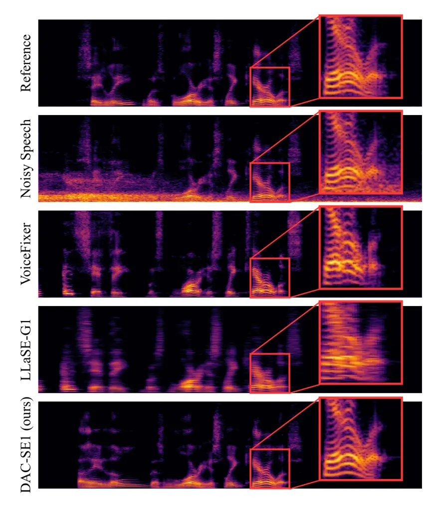
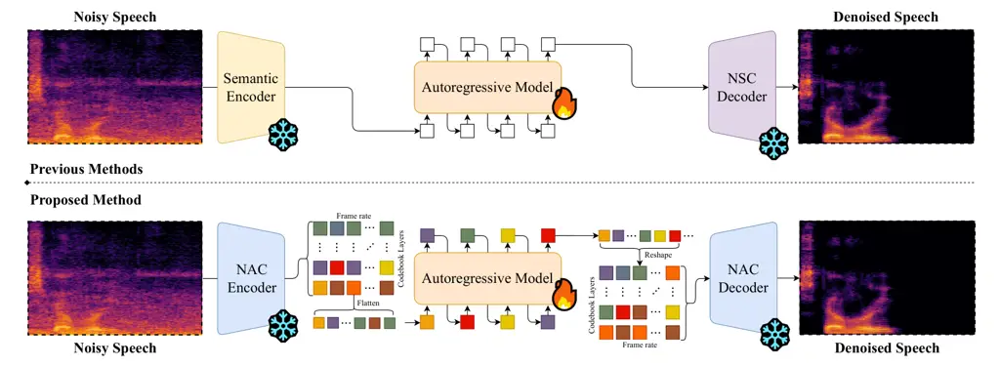

# High-Fidelity Speech Enhancement via Discrete Audio Tokens

Luca A. Lanzendörfer    Frédéric Berdoz    Antonis Asonitis    Roger
Wattenhofer

###### Abstract

Recent autoregressive transformer-based speech enhancement (SE) methods
have shown promising results by leveraging advanced semantic
understanding and contextual modeling of speech. However, these
approaches often rely on complex multi-stage pipelines and low sampling
rate codecs, limiting them to narrow and task-specific speech
enhancement. In this work, we introduce DAC-SE1, a simplified language
model-based SE framework leveraging discrete high-resolution audio
representations; DAC-SE1 preserves fine-grained acoustic details while
maintaining semantic coherence. Our experiments show that DAC-SE1
surpasses state-of-the-art autoregressive SE methods on both objective
perceptual metrics and in a MUSHRA human evaluation. We release our
codebase and model checkpoints to support further research in scalable,
unified, and high-quality speech enhancement.¹¹ 1
[https://github.com/ETH-DISCO/DAC-SE1](https://github.com/ETH-DISCO/DAC-SE1)

###### Index Terms: 

Speech Enhancement, DAC, Language Model, Bandwidth Extension

^(†)^(†)address: ETH Zurich

## 1 Introduction

Scaling laws have transformed machine learning across multiple domains,
from natural language processing \[1, 2\] and computer vision \[3, 4\]
to speech and audio generation \[5, 6\]. In particular, large
autoregressive transformer models (LLMs) trained on discrete audio
representations have achieved remarkable performance in
text-to-speech \[7\], audio synthesis \[5, 8\], and speech
understanding \[9\], demonstrating that model size and data scale can
naturally improve both fidelity and generalization. Despite these
advances, speech enhancement (SE) remains dominated by models that
either operate in the time domain or by models using conditional
architectures \[10, 11\]. Time domain models such as Conv-TasNet \[12\],
Demucs \[13\], and DCCRN \[14\] or LM-based frameworks operate on either
low sampling rate codecs or by using multi-stage architectures. Although
effective to some extent, these approaches introduce architectural
modifications that can hinder scalability and high-fidelity
reconstruction. In this work, we investigate whether high-quality speech
enhancement can be achieved solely through scaling laws in data and
compute, without domain-specific adaptations.



Figure 1: Qualitative comparison on log-mel spectrograms between our
proposed method (DAC-SE1) and previous autoregressive speech enhanecment
methods. DAC-SE1 is able to clean the signal without hallucinating
artifacts or spectral distortion.



Figure 2: Overview of DAC-SE1 framework for high-fidelity speech
enhancement and bandwidth extension. Previous work mostly uses a
continuous speech representation as the input to the autoregressive
model (e.g., HuBERT or WavLM) and then predicts tokens from a Neural
Speech Codec (NSC). These models are limited to 16 kHz signals. Our
approach does not require semantic representations and only leverages
the compressed representation of Neural Audio Codecs (NAC). We use the
DAC model, compressing a 44.1 kHz signal into 9 codebook layers at 86 Hz
framerate. We flatten this sequence into $`9\cdot 86`$ tokens per second
which are translated by our LlaMa-based model into clean speech in the
DAC token space, which can then be reconstructed using the DAC decoder.

To this end, we introduce DAC-SE1, a simple LM-based speech enhancement
framework which uses discrete audio tokens to model high-resolution 44.1
kHz speech and audio signals. By leveraging high-fidelity audio tokens
from DAC \[15\] and scaling model capacity, DAC-SE1 performs both speech
enhancement and bandwidth extension without auxiliary encoders,
dual-channel conditioning, or multi-stage pipelines. We evaluate the
performance of DAC-SE1 on widely used objective metrics and a MUSHRA
human evaluation, demonstrating that, at sufficient scale, a single
autoregressive LM can achieve high-fidelity SE and outperform previous
state-of-the-art without requiring architectural modifications.

In summary, our contributions are threefold:

1.  1.  We propose DAC-SE1, a single-stage 1B parameter LM-based SE
        framework operating directly on 44.1 kHz DAC tokens, achieving
        high-fidelity speech enhancement and bandwidth extension.²² 2
        Samples available on https://lucala.github.io/dac-se1/
2.  2.  We show empirically that scaling model size and training data allows
        the model to outperform prior LM-SE baselines, across both objective
        metrics and human evaluations, without requiring domain-specific
        adaptations.
3.  3.  We release our models and training pipeline to facilitate
        reproducibility and further research in scalable, high-quality
        speech enhancement.

## 2 Background

### 2.1 Time-Domain Speech Enhancement

Traditional SE models operate directly in the time domain or in the
time-frequency domain to map noisy inputs to clean outputs.
Convolutional and recurrent architectures such as Conv-TasNet \[12\],
Demucs \[13\], and DCCRN \[14\] demonstrate good performance in
time-domain enhancement and de-reverberation. However, these
architectures are often tailored to specific distortions, require
task-specific design, and do not naturally scale to high-fidelity or
multi-task settings. Moreover, they do not leverage recent advances in
transformer-based modeling nor integrate easily into multi-modal
generative frameworks.

### 2.2 Discrete Audio Representations

Neural audio codecs such as EnCodec \[16\], X-Codec2 \[7\], and
DAC \[15\] learn to map a time-domain signal into compact sequences of
discrete tokens via quantization schemes (e.g., vector quantization,
residual vector quantization, or finite scalar quantization). In the
case of residual vector quantization (RVQ), each frame of audio is
represented by a stack of codebook entries: a coarse codebook captures
the global signal structure, while subsequent residual codebooks refine
the representation with increasingly fine acoustic details. This
hierarchical structure allows codecs to balance compression efficiency
with perceptual quality. By operating on discrete token streams, speech
models gain the advantage of bandwidth-efficient modeling with
autoregressive transformers, which are able to capture long-range
dependencies. While many neural codecs use RVQ, only a few have been
scaled to very high perceptual quality at high-fidelity sampling rates
(44.1 or 48 kHz). DAC \[15\] is one such codec, providing discrete
representations with fidelity close to uncompressed signals, which makes
it particularly suitable for speech enhancement in high-fidelity
settings.

### 2.3 Language Models for Generative Audio

Autoregressive transformers trained on discrete audio tokens have
recently advanced a range of tasks, including text-to-speech (TTS) \[7,
5\] and speech enhancement \[10, 11\]. These methods demonstrate that
LMs can jointly model long-range semantic structure and local acoustic
detail. However, most current LM-based SE frameworks operate at 16 kHz
resolution and rely on multi-stage or conditional pipelines (e.g.,
auxiliary encoders, noise estimators, or dual-channel modeling). Such
constraints limit fidelity, increase complexity, and hinder scalability
for unified speech enhancement models.

## 3 Methodology

### 3.1 Discrete Audio Representation

We adopt the DAC codec \[15\] at 44.1 kHz, which encodes audio into 9
residual codebooks, each containing a vocabulary size of 1024 codes.
While some prior works preserve the multi-codebook structure by
processing each codebook separately and later aggregating
embeddings \[17\] \[17\], we simplify the design by flattening all
codebooks into a single time-major token sequence. This was shown by
MusicGen \[8\] to be a viable strategy when dealing with RVQ tokens.
This strategy reduces architectural complexity and aligns with standard
LM training pipelines, at the expense of longer token sequences. Since
scaling laws indicate that larger causal LMs handle such longer contexts
effectively, we find this simplification both practical and effective
for high-resolution SE.

### 3.2 Implementation Details

Our core model is a causal transformer language model based on the 1B
parameter LLaMA architecture \[18\]. The model uses a hidden size of
1536, an intermediate feedforward size of 6144, 24 transformer layers,
24 attention heads (with 24 key-value heads), and a maximum sequence
length of 8192 tokens, with all dimensions and depth scaled consistently
for this parameter budget. To accommodate the long sequences resulting
from flattened DAC tokens, we use rotary positional embeddings
(RoPE) \[19\] with a large scaling factor ($`\theta=100{,}000`$), which
significantly improves stability and generalization to extended context
lengths. Following insights from large language models, this design
ensures that our model can capture both fine-grained acoustic structure
and long-range token-structure dependencies.

| Distortion   | Prob. | Hyperparameters                                           |
| ------------ | ----- | --------------------------------------------------------- |
| White Noise  | 0.3   | SNR $`\in[0,25]`$ dB                                      |
| Noise        | 0.7   | SNR $`\in[-5,20]`$ dB                                     |
| Reverb       | 0.5   | –                                                         |
| Downsampling | 0.5   | sr $`\in\{2,4,6,8,16\}`$ kHz                              |
| Packet loss  | 0.3   | size $`\in[50,200]`$ ms, $`p_{\text{drop}}\in[0.02,0.2]`$ |

Table 1: Distortion distribution in training dataset. Noise is added to
clean speech, reverberation is simulated by convolving with RIRs, packet
loss is applied by zeroing out affected segments, and downsampling is
performed by reducing the sampling rate and resampling back to 44.1kHz.

### 3.3 Training

Training a general speech enhancement model involves multi-task
optimization across a variety of distortions, including noise,
reverberation, downsampling, and packet loss. A key challenge arises
from the varying loss scales per task. For example, packet loss
concealment exhibits a relatively low loss during training because most
input tokens (noisy tokens) are the same as the corresponding clean
tokens, while only a small fraction is different, namely the tokens
corresponding to lost packets. As a result, the gradient contribution
per task is uneven, which can cause joint training on all tasks to
generalize poorly. To address this, we adopt a two-stage training
strategy. In the first stage, we perform standard multi-task training.
In the second stage, we fine-tune the model per task, allowing each task
to optimize its own loss more effectively. Importantly, this does not
require separate models per task; the same model is iteratively
fine-tuned on each task. We observe that this approach produces distinct
and informative loss curves per task, leading to better generalization
across all distortions. Our model was trained on H200 GPUs for 12 hours
on more than 5 billion tokens.

### 3.4 Datasets

For the reference clean speech, we use the HiFiTTS-2 \[20\] corpus, a
high-quality 44.1 kHz speech dataset. From this corpus, we select a
2k-hour subset, truncating clips to a maximum of 5 seconds. For noise,
we combine multiple open-source datasets to ensure diversity:
MUSAN \[21\] (noise and music), DEMAND \[22\] (domestic and
environmental recordings), Urban Acoustic Scenes \[23\], and
WHAM! \[24\] noise. To simulate reverberation, we further include room
impulse responses from the RIRS NOISES corpus, specifically OpenSLR 26
and 28 \[25\]. We first generate our _Stage-1_ training dataset by
following the distribution of distortions in Table 1. Then, we generate
the _Stage-2_ training datasets, which are task-specific, meaning each
dataset corresponds to a unique label of distortion. All datasets are
cleared of duplicates, i.e., samples that have the same clean speech.
For faster training, we pre-process and encode the datasets using DAC
and flattening to obtain a sequence of type:

```math
\texttt{[Noisy DAC Tokens]}\;|\;\texttt{start-clean}\;|\;\texttt{[Clean DAC Tokens]}
```

where start-clean is a special boundary token marking the transition
from the noisy signal to the clean signal.

|                |                  |                 |                 |                  |                  |                     |                    |                    |                    |
| -------------- | ---------------- | --------------- | --------------- | ---------------- | ---------------- | ------------------- | ------------------ | ------------------ | ------------------ |
| Model          | OVRL$`\uparrow`$ | SIG$`\uparrow`$ | BAK$`\uparrow`$ | P808$`\uparrow`$ | PESQ$`\uparrow`$ | S-BERTS$`\uparrow`$ | PLCMOS$`\uparrow`$ | WER $`\downarrow`$ | MUSHRA$`\uparrow`$ |
| Noisy          | 2.44             | 3.18            | 2.79            | 3.11             | 2.63             | 0.89                | 3.84               | 0.25               | 35.8               |
| Clean          | 3.03             | 3.41            | 3.80            | 3.64             | 4.50             | 1.00                | 4.41               | 0.00               | 94.5               |
| LLaSE-G1       | 2.90             | 3.24            | 3.83            | 3.47             | 1.98             | 0.86                | 4.19               | 0.27               | 44.1               |
| VoiceFixer     | 2.92             | 3.21            | 3.90            | 3.43             | 1.85             | 0.81                | 4.29               | 0.45               | 34.5               |
| DAC-SE1 (ours) | 2.95             | 3.33            | 3.70            | 3.56             | 2.46             | 0.89                | 4.35               | 0.25               | 58.3               |

Table 2: Comparison of LLaSE-G1 \[10\], VoiceFixer \[26\], and our model
on the HiFiTTS-2 test set. Objective metrics include DNSMOS
OVRL/SIG/BAK \[27\], P.808 \[28\], PESQ \[29\], SpeechBERTScore
(S-BERTS) \[30\], PLCMOS \[31\], and WER computed using
Whisper-Large \[32\]. Subjective evaluation is done with MUSHRA. DAC-SE1
consistently outperforms prior systems in both objective and human
evaluation.

## 4 Evaluation

We evaluate our models on speech enhancement datasets using widely
adopted metrics. Specifically, we test on the ICASSP 2022 Packet Loss
Concealment (PLC) challenge \[33\] and the ICASSP 2023
DNS-challenge \[34\]. Additionally, we compare our models against other
baselines on a small test set randomly sampled from HiFiTTS-2, DEMAND,
and RIRS NOISES. This dataset is used for both objective and subjective
evaluations and is disjoint from the training set in terms of both
speakers and noise sources.

Subjective Evaluation. We conduct a MUSHRA listening test, the
gold-standard for estimating the quality of speech enhancement.³³ 3
MUSHRA was conducted on https://www.mabyduck.com The study included 26
participants. Each participant completed 12 trials, where the first two
trials were training runs to familiarize the participants with the tool
and task. All participants used headphones and were asked to be in a
quiet environment. Each trial consisted of a clean reference signal, the
degraded signal (used as a low anchor), a hidden reference, and the
reconstructions of the models.

### 4.1 Results

HiFiTTS-2 Evaluation. Table 2 shows the objective evaluation results on
the HiFiTTS-2 test set. Our model consistently outperforms both
LLaSE-G1 \[10\] and VoiceFixer \[26\] across the majority of metrics,
achieving stronger overall quality, speech naturalness, and perceptual
consistency. Notably, while VoiceFixer performs slightly better in
background suppression (BAK), our approach provides a more balanced
improvement across all dimensions, leading to the best overall
performance. The MUSHRA listening test further supports these findings.
Human listeners consistently preferred the outputs of our model over
both LLaSE-G1 and VoiceFixer.

SE Benchmarks. On the ICASSP PLC challenge (see Table 3), our method
achieves state-of-the-art perceptual quality, surpassing prior baselines
in PLCMOS while remaining competitive in overall quality. On the DNS
challenge, our approach performs on par with strong published baselines
across widely adopted perceptual metrics, as shown in Table 4,
confirming that the model generalizes effectively beyond the custom
training data and adapts to previously unseen profiles of noise.

| Model            | OVRL$`\uparrow`$ | PLCMOS$`\uparrow`$ |
| ---------------- | ---------------- | ------------------ |
| Noisy            | 2.56             | 2.90               |
| LPCNet \[35\]    | 3.09             | 3.74               |
| BS-PLCNet \[36\] | 3.20             | 4.29               |
| LLaSE-G1 single  | 3.03             | 3.68               |
| LLaSE-G1 multi   | 3.27             | 4.30               |
| DAC-SE1 (ours)   | 3.12             | 4.34               |

Table 3: DNSMOS OVRL and PLCMOS scores on ICASSP 2022 PLC-challenge
blind testset.

| Model              | SIG$`\uparrow`$ | BAK$`\uparrow`$ | OVRL$`\uparrow`$ |
| ------------------ | --------------- | --------------- | ---------------- |
| Noisy              | 4.15            | 2.37            | 2.71             |
| TEA-PSE 3.0 \[37\] | 4.12            | 4.05            | 3.65             |
| NAPSE \[38\]       | 3.81            | 3.99            | 3.38             |
| LLaSE-G1 single    | 4.21            | 3.99            | 3.72             |
| LLaSE-G1 multi     | 4.20            | 3.97            | 3.70             |
| DAC-SE1 (ours)     | 4.18            | 3.80            | 3.63             |

Table 4: pDNSMOS scores on ICASSP 2023 DNS-challenge blind testset.

## 5 Conclusion

We introduced DAC-SE1, an LM-based SE framework that operates directly
on DAC tokens, achieving high-fidelity speech enhancement without
auxiliary encoders or multi-stage pipelines. Experiments demonstrate
that DAC-SE1 outperforms prior LM-based SE methods across objective
metrics and in human evaluations. Our results show that speech
enhancement methods benefit from scaling laws, a trend we expect will
shape the next generation of SE models.

## References

- \[1\] Tom Brown, Benjamin Mann, Nick Ryder, Melanie Subbiah, Jared D
  Kaplan, Prafulla Dhariwal, Arvind Neelakantan, Pranav Shyam, Girish
  Sastry, Amanda Askell, et al., “Language models are few-shot
  learners,” Advances in neural information processing systems, vol.
  33, 2020.
- \[2\] Aakanksha Chowdhery, Sharan Narang, Jacob Devlin, Maarten Bosma,
  Gaurav Mishra, Adam Roberts, Paul Barham, Hyung Won Chung, Charles
  Sutton, Sebastian Gehrmann, et al., “Palm: Scaling language modeling
  with pathways,” Journal of Machine Learning Research, vol. 24, no.
  240, 2023.
- \[3\] Alexey Dosovitskiy, Lucas Beyer, Alexander Kolesnikov, Dirk
  Weissenborn, Xiaohua Zhai, Thomas Unterthiner, Mostafa Dehghani,
  Matthias Minderer, G Heigold, S Gelly, et al., “An image is worth
  16x16 words: Transformers for image recognition at scale,” in
  International Conference on Learning Representations, 2020.
- \[4\] Alexander Kirillov, Eric Mintun, Nikhila Ravi, Hanzi Mao, Chloe
  Rolland, Laura Gustafson, Tete Xiao, Spencer Whitehead, Alexander C
  Berg, Wan-Yen Lo, et al., “Segment anything,” in Proceedings of the
  IEEE/CVF international conference on computer vision, 2023.
- \[5\] Zalán Borsos, Raphaël Marinier, Damien Vincent, Eugene
  Kharitonov, Olivier Pietquin, Matt Sharifi, Dominik Roblek, Olivier
  Teboul, David Grangier, Marco Tagliasacchi, et al., “Audiolm: a
  language modeling approach to audio generation,” IEEE/ACM transactions
  on audio, speech, and language processing, vol. 31, 2023.
- \[6\] Alec Radford, Jong Wook Kim, Tao Xu, Greg Brockman, Christine
  McLeavey, and Ilya Sutskever, “Robust speech recognition via
  large-scale weak supervision,” in International conference on machine
  learning. PMLR, 2023.
- \[7\] Zhen Ye, Xinfa Zhu, Chi-Min Chan, Xinsheng Wang, Xu Tan, Jiahe
  Lei, Yi Peng, Haohe Liu, Yizhu Jin, Zheqi Dai, et al., “Llasa: Scaling
  train-time and inference-time compute for llama-based speech
  synthesis,” arXiv preprint arXiv:2502.04128, 2025.
- \[8\] Jade Copet, Felix Kreuk, Itai Gat, Tal Remez, David Kant,
  Gabriel Synnaeve, Yossi Adi, and Alexandre Défossez, “Simple and
  controllable music generation,” Advances in Neural Information
  Processing Systems, vol. 36, 2023.
- \[9\] Gemini Team, Rohan Anil, Sebastian Borgeaud, Jean-Baptiste
  Alayrac, Jiahui Yu, Radu Soricut, Johan Schalkwyk, Andrew M Dai, Anja
  Hauth, Katie Millican, et al., “Gemini: a family of highly capable
  multimodal models,” arXiv preprint arXiv:2312.11805, 2023.
- \[10\] Boyi Kang, Xinfa Zhu, Zihan Zhang, Zhen Ye, Mingshuai Liu,
  Ziqian Wang, Yike Zhu, Guobin Ma, Jun Chen, Longshuai Xiao, et al.,
  “Llase-g1: Incentivizing generalization capability for llama-based
  speech enhancement,” arXiv preprint arXiv:2503.00493, 2025.
- \[11\] Ziqian Wang, Xinfa Zhu, Zihan Zhang, YuanJun Lv, Ning Jiang,
  Guoqing Zhao, and Lei Xie, “Selm: Speech enhancement using discrete
  tokens and language models,” in ICASSP 2024-2024 IEEE International
  Conference on Acoustics, Speech and Signal Processing (ICASSP).
  IEEE, 2024.
- \[12\] Yi Luo and Nima Mesgarani, “Conv-tasnet: Surpassing ideal
  time–frequency magnitude masking for speech separation,” IEEE/ACM
  transactions on audio, speech, and language processing, vol. 27, no.
  8, 2019.
- \[13\] Alexandre Defossez, Gabriel Synnaeve, and Yossi Adi, “Real time
  speech enhancement in the waveform domain,” arXiv preprint
  arXiv:2006.12847, 2020.
- \[14\] Yanxin Hu, Yun Liu, Shubo Lv, Mengtao Xing, Shimin Zhang, Yihui
  Fu, Jian Wu, Bihong Zhang, and Lei Xie, “Dccrn: Deep complex
  convolution recurrent network for phase-aware speech enhancement,” in
  Interspeech, 2020.
- \[15\] Rithesh Kumar, Prem Seetharaman, Alejandro Luebs, Ishaan Kumar,
  and Kundan Kumar, “High-fidelity audio compression with improved
  rvqgan,” Advances in Neural Information Processing Systems, vol.
  36, 2023.
- \[16\] Alexandre Défossez, Jade Copet, Gabriel Synnaeve, and Yossi
  Adi, “High fidelity neural audio compression,” arXiv preprint
  arXiv:2210.13438, 2022.
- \[17\] Xu Li, Qirui Wang, and Xiaoyu Liu, “Masksr: Masked language
  model for full-band speech restoration,” in Interspeech, 2024.
- \[18\] Hugo Touvron, Thibaut Lavril, Gautier Izacard, Xavier Martinet,
  Marie-Anne Lachaux, Timothée Lacroix, Baptiste Rozière, Naman Goyal,
  Eric Hambro, Faisal Azhar, et al., “Llama: Open and efficient
  foundation language models,” arXiv preprint arXiv:2302.13971, 2023.
- \[19\] Jianlin Su, Murtadha Ahmed, Yu Lu, Shengfeng Pan, Wen Bo, and
  Yunfeng Liu, “Roformer: Enhanced transformer with rotary position
  embedding,” Neurocomputing, vol. 568, 2024.
- \[20\] Ryan Langman, Xuesong Yang, Paarth Neekhara, Shehzeen Hussain,
  Edresson Casanova, Evelina Bakhturina, and Jason Li, “Hifitts-2: A
  large-scale high bandwidth speech dataset,” arXiv preprint
  arXiv:2506.04152, 2025.
- \[21\] David Snyder, Guoguo Chen, and Daniel Povey, “Musan: A music,
  speech, and noise corpus,” arXiv preprint arXiv:1510.08484, 2015.
- \[22\] Joachim Thiemann, Nobutaka Ito, and Emmanuel Vincent, “The
  diverse environments multi-channel acoustic noise database (demand): A
  database of multichannel environmental noise recordings,” in
  Proceedings of Meetings on Acoustics, 2013, vol. 19.
- \[23\] Annamaria Mesaros, Toni Heittola, and Tuomas Virtanen, “A
  multi-device dataset for urban acoustic scene classification,” arXiv
  preprint arXiv:1807.09840, 2018.
- \[24\] Gordon Wichern, Joe Antognini, Michael Flynn, Licheng Richard
  Zhu, Emmett McQuinn, Dwight Crow, Ethan Manilow, and Jonathan Le Roux,
  “Wham!: Extending speech separation to noisy environments,” in
  Interspeech, 2019.
- \[25\] Tom Ko, Vijayaditya Peddinti, Daniel Povey, Michael L Seltzer,
  and Sanjeev Khudanpur, “A study on data augmentation of reverberant
  speech for robust speech recognition,” in IEEE International
  Conference on Acoustics, Speech and Signal Processing (ICASSP), 2017.
- \[26\] Haohe Liu, Qiuqiang Kong, Qiao Tian, Yan Zhao, DeLiang Wang,
  Chuanzeng Huang, and Yuxuan Wang, “Voicefixer: Toward general speech
  restoration with neural vocoder,” 2021.
- \[27\] Chandan K A Reddy, Vishak Gopal, and Ross Cutler, “Dnsmos: A
  non-intrusive perceptual objective speech quality metric to evaluate
  noise suppressors,” arXiv preprint arXiv:2010.15258, 2021.
- \[28\] Babak Naderi and Ross Cutler, “An open source implementation of
  itu-t recommendation p.808 with validation,” in Interspeech, 2020.
- \[29\] A.W. Rix, J.G. Beerends, M.P. Hollier, and A.P. Hekstra,
  “Perceptual evaluation of speech quality (pesq)-a new method for
  speech quality assessment of telephone networks and codecs,” in IEEE
  International Conference on Acoustics, Speech, and Signal Processing.
  Proceedings (ICASSP), 2001.
- \[30\] Takaaki Saeki, Soumi Maiti, Shinnosuke Takamichi, Shinji
  Watanabe, and Hiroshi Saruwatari, “Speechbertscore: Reference-aware
  automatic evaluation of speech generation leveraging nlp evaluation
  metrics,” arXiv preprint arXiv:2401.16812, 2024.
- \[31\] Lorenz Diener, Marju Purin, Sten Sootla, Ando Saabas, Robert
  Aichner, and Ross Cutler, “Plcmos - a data-driven non-intrusive metric
  for the evaluation of packet loss concealment algorithms,” 2023.
- \[32\] Alec Radford, Jong Wook Kim, Tao Xu, Greg Brockman, Christine
  McLeavey, and Ilya Sutskever, “Robust speech recognition via
  large-scale weak supervision,” 2022.
- \[33\] Lorenz Diener, Sten Sootla, Solomiya Branets, Ando Saabas,
  Robert Aichner, and Ross Cutler, “Audio deep packet loss concealment
  challenge,” in Interspeech, 2022.
- \[34\] Harishchandra Dubey, Ashkan Aazami, Vishak Gopal, Babak Naderi,
  Sebastian Braun, Ross Cutler, Alex Ju, Mehdi Zohourian, Min Tang,
  Hannes Gamper, Mehrsa Golestaneh, and Robert Aichner, “Icassp 2023
  deep noise suppression challenge,” arXiv preprint
  arXiv:2303.11510, 2023.
- \[35\] Jean-Marc Valin and Jan Skoglund, “Lpcnet: Improving neural
  speech synthesis through linear prediction,” arXiv preprint
  arXiv:1810.11846, 2019.
- \[36\] Zihan Zhang, Jiayao Sun, Xianjun Xia, Chuanzeng Huang, Yijian
  Xiao, and Lei Xie, “Bs-plcnet: Band-split packet loss concealment
  network with multi-task learning framework and multi-discriminators,”
  arXiv preprint arXiv:2401.03687, 2024.
- \[37\] Yukai Ju, Jun Chen, Shimin Zhang, Shulin He, Wei Rao, Weixin
  Zhu, Yannan Wang, Tao Yu, and Shidong Shang, “Tea-pse 3.0:
  Tencent-ethereal-audio-lab personalized speech enhancement system for
  icassp 2023 dns challenge,” arXiv preprint arXiv:2303.07704, 2023.
- \[38\] Xiaopeng Yan, Yindi Yang, Zhihao Guo, Liangliang Peng, and Lei
  Xie, “The npu-elevoc personalized speech enhancement system for
  icassp2023 dns challenge,” arXiv preprint arXiv:2303.06811, 2023.
