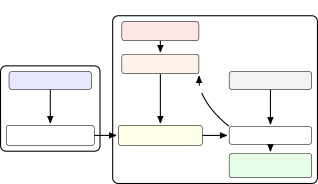
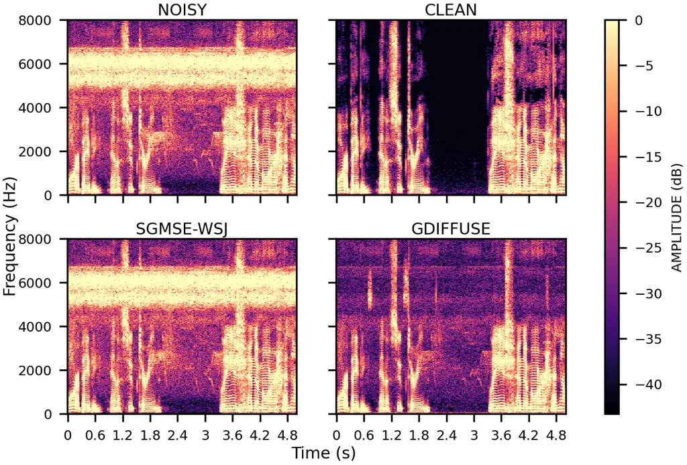

# GDiffuSE: Diffusion-based Speech Enhancement with Noise Model Guidance

Efrayim Yanir    David Burshtein Affiliation: Tel-Aviv University
Email: <efrayimyanir@mail.tau.ac.il> Email: <burstyn@tauex.tau.ac.il>   
Sharon Gannot Affiliation: Bar-Ilan University
Email: <Sharon.Gannot@biu.ac.il>

###### Abstract

We introduce a novel speech enhancement approach based on a denoising
diffusion probabilistic model, termed guided diffusion for speech
enhancement. In contrast to conventional methods that directly map noisy
speech to clean speech, our method employs a lightweight helper model to
estimate the noise distribution, which is then incorporated into the
diffusion denoising process via a guidance mechanism. This design
improves robustness by enabling seamless adaptation to unseen noise
types and by leveraging large-scale denoising diffusion probabilistic
models originally trained for speech generation in the context of speech
enhancement. We evaluate our approach on noisy signals obtained by
adding noise samples from the BBC sound effects database to LibriSpeech
utterances, showing consistent improvements over state-of-the-art
baselines under mismatched noise conditions.

###### Index Terms: 

Generative models, Diffusion processes, DDPM Guidance

## 1 Introduction

Dominant approaches for speech enhancement utilize discriminative models
that map noisy inputs to clean targets \[1\]. These models perform well
under matched conditions, but generalize poorly to unseen noise or
acoustic environments, often introducing artifacts. Generative models
that learn an explicit prior over clean speech have gained popularity in
recent years, particularly in the context of speech enhancement.

Diffusion-based generative models \[2, 3\] gradually add Gaussian noise
in a forward process and learn a network to reverse it by iterative
denoising. Unlike variational autoencoders, they have no separate
encoder—the “latent” at step $`t`$ is the noisy sample itself—and the
network learns the score (gradient of log-density) across noise
levels \[4\]. They have exhibited promising results in audio generation.
For example, DiffWave achieves high-fidelity audio generation with a
small number of parameters \[5\]. Recent works adapt diffusion models to
speech enhancement \[6, 7, 8\]. Two main designs have emerged. (i) A
_conditioner vocoder_ pipeline, where a diffusion vocoder resynthesizes
speech utilizing features predicted from the noisy input, with auxiliary
losses pushing those features toward clean targets \[7, 9\]. These
methods require an auxiliary loss and use two separate models for
generation and denoising. (ii) _Corruption-aware diffusion_ that
integrates the corruption model into the forward chain so its reversal
directly yields the enhanced signal via linear interpolation between
clean and noisy waveforms, e.g., CDiffuSE \[10\], or by embedding noise
statistics in a stochastic differential equation drift \[6\]. The latter
design better reflects real-world, non-white noise \[11\]. A recent
contribution to the field is the score-based generative modeling for
speech enhancement family of algorithms \[6, 12, 13\], which learns a
score function that enables sampling from the posterior distribution of
clean speech given the noisy observation in the complex short-time
Fourier transform domain. All of these methods demonstrate that a
conditioned diffusion generator can achieve state-of-the-art performance
across diverse noise conditions. However, they all require specialized
training of the heavy diffusion model for each type of expected noise.

In this paper, we introduce guided diffusion for speech enhancement, a
diffusion probabilistic approach to speech enhancement. Guided diffusion
for speech enhancement uses the guidance mechanism \[14\] by a
lightweight noise model, which guides the signal generated by the
DiffWave \[7\] model towards the estimated clean speech. Unlike \[15\],
which relies on reconstruction guidance for known operators, and \[16\],
which uses non-negative matrix factorization-based linear constraints,
guided diffusion for speech enhancement introduces test-time training,
in which an auxiliary network learns nonlinear noise profiles to guide a
frozen diffusion model. That is, given a new unknown noise sample, only
the compact noise model has to be trained, which is substantially easier
than learning the full distribution of noisy speech. As a result, the
system rapidly adapts to unseen acoustic conditions with few noise
samples, provided that the noise statistics has not significantly
changed between train and inference time.

Our main contributions are threefold: (1) We derive a novel approach for
using denoising diffusion probabilistic model guidance for speech
enhancement by applying guidance directly into a noise-distribution
model for speech enhancement. (2) We propose a novel reverse process
that leverages a foundation diffusion model for speech enhancement,
offering robust adaptability to unseen noise types—assuming the noise
statistics remain consistent between the available noise-only utterance
and the noise encountered at inference. (3) The experimental results
confirm the effectiveness of guided diffusion for speech enhancement,
achieving improved robustness to mismatched noise conditions compared to
related generative speech enhancement methods.

## 2 Problem Formulation

Let $`y_{i}=x_{0,i}+w_{i}`$ denote the noisy signal received by a single
microphone, where $`x_{0,i}`$ is the clean speech component and
$`w_{i}`$ is the noise component, for $`i\in\{0,\ldots,N-1\}`$, and
$`N`$ the number of samples in the utterance. Stacking the $`N`$ samples
into column vectors yields
$`\mathbf{x}_{0}\triangleq(x_{0,i})_{i=0}^{N-1},\quad\mathbf{w}\triangleq(w_{i})_{i=0}^{N-1},\quad\mathbf{y}\triangleq(y_{i})_{i=0}^{N-1}`$,
leading to the following vector form:

```math
\mathbf{y}=\mathbf{x}_{0}+\mathbf{w}. \tag{1}
```

Given $`\mathbf{y}`$, the goal of the speech enhancement algorithm is to
estimate $`\hat{\mathbf{x}}\triangleq(\hat{x}_{i})_{i=0}^{N-1}`$ that is
perceptually and/or objectively close to $`\mathbf{x}_{0}`$.

## 3 Proposed Method

In this section, we derive the proposed speech enhancement algorithm.
Sec. 3.1 presents the use of DDPM guidance for speech enhancement, and
Sec. 3.2 describes the training of the noise model that guides the DDPM.
The complete process is illustrated in Fig. 1.

### 3.1 DDPM Guidance for Speech Enhancement

denoising diffusion probabilistic model \[3\] uses a diffusion
processs \[2\] for generative sampling. DDPM guidance \[14\] modifies
the standard generative sampling procedure of denoising diffusion
probabilistic model to a conditional one as summarized in \[14,
Algorithm 1\]. We suggest adopting this approach for speech enhancement
in a new way, using guidance from the noise model distribution, as
summarized in Algorithm 2.

We follow the notations in \[3, 14\]. The data distribution of the clean
speech is given by $`{\bf x}_{0}\sim q({\bf x}_{0})`$. In the forward
diffusion process, a Markov chain progressively adds noise to
$`{\bf x}_{0}`$ to produce
$`{\bf x}_{1},{\bf x}_{2},\ldots,{\bf x}_{T}`$ as follows:

```math
{\bf x}_{t}=\sqrt{1-\beta_{t}}{\bf x}_{t-1}+\beta_{t}{\bf{e}}_{t},\,{\bf{e}}_{t}\sim\mathcal{N}(\mathbf{0},\mathbf{I}),{\bf{e}}_{t}\perp\!\!\!\perp{\bf x}_{t-1}, \tag{2}
```

where $`{\bf{e}}_{t}`$ (Gaussian distributed with zero mean, and
identity covariance matrix) is statistically independent of
$`{\bf x}_{t-1}`$, and
$`\beta_{t}\in[\beta_{\text{start}},\beta_{\text{end}}]`$ is a schedule
parameter. Other schedule parameters, $`\alpha_{t}`$ and
$`\overline{\alpha}_{t}`$ are defined in \[3, 14\] in the following way:

```math
\alpha_{t}=1-\beta_{t},\quad\text{ }\bar{\alpha}_{t}=\prod_{s=1}^{t}\alpha_{s}=\prod_{s=1}^{t}(1-\beta_{s}). \tag{3}
```

Consequently, the $`t`$-step marginal is \[3\]:

```math
{\bf x}_{t}\;=\;\sqrt{\bar{\alpha}_{t}}\,{\bf x}_{0}+\sqrt{1-\bar{\alpha}_{t}}\,\hat{{\bf{e}}}_{t},\;\hat{{\bf{e}}}_{t}\sim\mathcal{N}(0,\mathbf{I}),\hat{{\bf{e}}}_{t}\perp\!\!\!\perp{\bf x}_{0}. \tag{4}
```

Denoising is performed by recursively applying the following reverse
process, for $`t=T,T-1,\ldots,1`$:

```math
p_{\boldsymbol{\theta}}({\bf x}_{t-1}\!\mid\!{\bf x}_{t})=\mathcal{N}\!\big({\bf x}_{t-1};\,\boldsymbol{\mu}({\bf x}_{t},t),\,\sigma_{t}^{2}\mathbf{I}\big). \tag{5}
```

Since the distribution of the reverse process is intractable, it is
modeled by a deep neural network, where $`\boldsymbol{\theta}`$
represents the set of trainable parameters of the denoising network.
Therefore, sampling can be expressed with:

```math
{\bf x}_{t-1}\;=\;\boldsymbol{\mu}({\bf x}_{t},t)+\sigma_{t}\,{\bf z}_{t},\;{\bf z}_{t}\sim\mathcal{N}(\mathbf{0},\mathbf{I}),\;\;{\bf z}_{t}\perp\!\!\!\perp{\bf x}_{t}, \tag{6}
```

where the mean $`\boldsymbol{\mu}({\bf x}_{t},t)`$ can be expressed
using the standard noise-prediction form:

```math
\boldsymbol{\mu}({\bf x}_{t},t)=\frac{1}{\sqrt{\alpha_{t}}}\left({\bf x}_{t}-\frac{1-\alpha_{t}}{\sqrt{1-\overline{\alpha}_{t}}}\boldsymbol{\epsilon}_{\boldsymbol{\theta}}({\bf x}_{t},t)\right). \tag{7}
```

The function
$`\boldsymbol{\epsilon}_{\boldsymbol{\theta}}({\bf x}_{t},t)`$ is the
network’s estimate of the injected noise \[3, Algorithm 1\]. As shown in
\[3\] and \[5\], for accelerating the computation it is useful to use in
(6):

```math
\displaystyle\sigma_{t}^{2}\;=\tilde{\beta}_{t}=\begin{cases}\frac{1-\bar{\alpha}_{t-1}}{1-\bar{\alpha}_{t}}\,\beta_{t}&\text{for }t>1\\
\beta_{1}&\text{for }t=1\end{cases}\,. \tag{8}
```

For an speech enhancement problem, we want to add a guidance component
to guide the diffusion process towards the clean speech $`{\bf y}`$. For
that, we train the diffusion model in the standard way, but then we wish
to sample $`{\bf x}_{0}`$ from the conditional probability density
function $`p_{\boldsymbol{\phi}}({\bf x}_{0}\>|\>{\bf y})`$, modeled by
a deep neural network $`\boldsymbol{\phi}`$. This can be done as
described in \[2, 14\]. Rather than using (6)-(7) we use:

```math
{\bf x}_{t-1}=\boldsymbol{\mu}_{t}^{\mathrm{guid}}+\sigma_{t}\tilde{{\bf{e}}}_{t},\qquad\tilde{{\bf{e}}}_{t}\sim\mathcal{N}(\mathbf{0},\mathbf{I}). \tag{9}
```

where

```math
\boldsymbol{\mu}_{t}^{\mathrm{guid}}=\boldsymbol{\mu}({\bf x}_{t},t)+s_{t}\frac{\beta_{t}}{\sqrt{\alpha_{t}}}\nabla_{{{\bf x}}}\log p_{\boldsymbol{\phi}}({\bf y}\>|\>{{\bf x}})|_{\\
{{\bf x}}=\boldsymbol{\mu}({{\bf x}}_{t},t)}\>. \tag{10}
```

We set the gradient scale, $`s_{t}`$, according to the schedule:

```math
s_{t}\;=\;\lambda_{\max}\!\left(\frac{\sqrt{1-\bar{\alpha}_{t}}}{\sqrt{1-\bar{\alpha}_{1}}}\right)^{\gamma},\qquad\gamma>0,\;\lambda_{\max}>0. \tag{11}
```

Intuitively, this schedule applies stronger guidance at early,
low-signal-to-noise ratio steps—when the estimate is dominated by
noise—and gradually relaxes the guidance as the effective
signal-to-noise ratio increases, allowing the generative model to refine
fine details without over-constraining the reconstruction. This schedule
is consistent with standard signal-to-noise ratio-dependent scheduling
for diffusion models \[17\], and aligns with recent evidence that
guidance strength should vary with the noise level rather than remain
constant \[18, 19\].

Now, given observation $`{\bf y}`$ we can use (9)-(10) to estimate the
clean speech. We just need to know
$`\nabla_{{\bf x}_{t}}\log p_{\boldsymbol{\phi}}({\bf y}\>|\>{\bf x}_{t})`$.



Figure 1: GDiffuSE: The trained noise model guides the diffusion model
for speech enhancement. Training stage: Noise sample
$`\bar{{\bf w}}\in\mathbb{R}^{N}`$ trains the noise models
$`\boldsymbol{\phi}_{t}`$ for each $`t`$. Inference stage: Starting from
$`{\bf x}_{t}`$ (white noise for $`t=T`$), the diffusion process, guided
by the loss from $`\phi_{t}`$ (19), generates $`{x}_{t-1}`$; the clean
estimate is $`{x}_{0}`$. The input to $`\phi_{t}`$ is the noise estimate
(which uses $`{\bf y}`$). This is repeated $`T`$ times (See
Algorithms 1, 2).

### 3.2 Noise Model Training

In this section, we specify how to train the noise model,
$`\boldsymbol{\phi}`$. The conditional density
$`p_{\boldsymbol{\phi}}({\bf y}\>|\>{\bf x}_{t})`$ is inferred using the
noise at the $`t`$-th guided diffusion step and the additive (acoustic)
noise, as follows. Combining (4) with (1) yields,

```math
{\bf y}={\bf x}_{0}+{\bf w}=\frac{1}{\sqrt{\bar{\alpha}_{t}}}\,{\bf x}_{t}-\sqrt{\frac{1-\bar{\alpha}_{t}}{\bar{\alpha}_{t}}}\,\hat{{\bf{e}}}_{t}+{\bf w}. \tag{12}
```

Denote the combined noise:

```math
{\bf v}_{t}\>{\stackrel{{\scriptstyle\scriptscriptstyle\Delta}}{{=}}}\>-\frac{\sqrt{1-\overline{\alpha}_{t}}}{\sqrt{\overline{\alpha}_{t}}}\hat{{\bf{e}}}_{t}+{\bf w}={\bf w}-g(t)\hat{{\bf{e}}}_{t} \tag{13}
```

where

```math
g(t)=\sqrt{\frac{1-\overline{\alpha}_{t}}{\overline{\alpha}_{t}}}. \tag{14}
```

The first component is the diffusion noise, and the second is the
acoustic noise that should be suppressed. Consequently, the conditional
probability of the measurements given the desired speech estimate at the
$`t`$-th step is given by

```math
p_{\boldsymbol{\phi}}({\bf y}\>|\>{\bf x}_{t})=p^{{\bf V}_{t}|{\bf X}_{t}}_{\boldsymbol{\phi}}({\bf y}-\frac{1}{\sqrt{\overline{\alpha}_{t}}}{\bf x}_{t}\>|\>{\bf x}_{t}). \tag{15}
```

Hence, the required conditional probability density simplifies to the
conditional density of the random variable $`{\bf V}_{t}`$ given the
variable $`{\bf X}_{t}`$,
$`p^{{\bf V}_{t}|{\bf X}_{t}}_{\boldsymbol{\phi}}({\bf v}_{t}|{\bf x}_{t})`$.
Obviously, the additive noise, $`{\bf w}`$, is statistically independent
of $`{\bf x}_{t}`$. To further simplify the derivation, we also make the
assumption that $`\hat{{\bf{e}}}_{t}`$ is independent of
$`{\bf x}_{t}`$. Consequently, the density of $`{\bf V}_{t}`$ given
$`{\bf x}_{t}`$ becomes the density of
$`{\bf w}-g(t)\cdot\hat{{\bf{e}}}_{t}`$, where
$`\hat{{\bf{e}}}_{t}\sim{\mathcal{N}}(\mathbf{0},\mathbf{I})`$ is
independent of $`{\bf w}`$. We also assume the availability of a noise
sample $`\bar{{\bf w}}`$ from the same distribution as $`{\bf w}`$,
which can be used to train a model for $`{\bf v}_{t}`$. In practice, a
voice activity detector can be used to allocate such segments from the
given noisy utterance. Given a segment $`\bar{{\bf w}}`$, for each
diffusion step $`t`$ we can compute $`g(t)`$, the noise level for a
specific step (14), and generate noise $`{\bf v}_{t}`$ with the required
density:

```math
v_{t,i}={\bar{w}}_{i}-\hat{e}_{t}\cdot g(t),\;\hat{e}_{t}\sim{\mathcal{N}}\left(0,1\right). \tag{16}
```

For inferring $`p^{{\bf V}_{t}}_{\boldsymbol{\phi}}({\bf v}_{t})`$ we
apply maximum likelihood. The log likelihood is given by:

```math
\log P(v_{0},\dots,v_{N-1}\mid\theta)=\sum_{i=0}^{N-1}\log p(v_{i}\mid v_{0},\ldots,v_{i-1},\theta), \tag{17}
```

and therefore, we need the conditional distribution of
$`v_{t,i}\>|\>(v_{t,0},...v_{t,i-1})`$. We model it by a Gaussian:
$`v_{t,i}\>|\>(v_{t,0},...v_{t,i-1})\sim{\mathcal{N}}(\cdot,\mu_{t,i},\sigma^{2}_{t,i}).`$
The noise is modeled separately for each $`t`$ with shifted causal
convolutional neural networks \[20\] to predict the mean and the
variance:

```math
\mu_{t,i}(v_{t,0},...v_{t,i-1}),\sigma_{t,i}^{2}(v_{t,0},...v_{t,i-1})=\boldsymbol{\phi}_{t}(v_{t,0},\ldots,v_{t,i-1}) \tag{18}
```

and $`\boldsymbol{\phi}_{t}`$ is trained using the maximum likelihood
loss $`(-\log L)_{t}`$:

```math
\text{loss}_{t}({\bf v}_{t})=\sum_{i=0}^{N-1}\left[\log\left(\sqrt{2\pi}\cdot\sigma_{t,i}\right)+\frac{(v_{t,i}-\mu_{t,i})^{2}}{2\cdot\sigma_{t,i}^{2}}\right]. \tag{19}
```

The training of the noise model given a noise sample $`\bar{{\bf w}}`$
is summarized in Algorithm 1. The guided reverse diffusion is summarized
in Algorithm 2. The training and inference procedures are schematically
depicted in Fig. 1.

1: noise sample $`\bar{{\bf w}}\in\mathbb{R}^{N}`$, diffusion steps
$`T`$, \# epochs $`E`$, step size $`\eta`$, schedule $`g(t)`$.

2: for $`t\leftarrow T`$ down to $`1`$ do

3:   Compute
$`g(t),\hat{\mathbf{e}}_{t}\sim{\mathcal{N}}(0,{\mathbf{I}})`$

4:   $`{\bf v}_{t}\leftarrow\bar{{\bf w}}-\hat{{\bf{e}}}_{t}\,g(t)`$
$`\triangleright`$ elementwise:
$`v_{t,i}=\bar{w}_{i}-\hat{e}_{t}\,g(t)`$

5:   for $`k\leftarrow 1`$ to $`E`$ do $`\triangleright`$ NumEpochs

6:
   $`(\mu_{t,i},\sigma_{t,i}^{2})_{i=0}^{N-1}\leftarrow\boldsymbol{\phi}_{t}\!\big(v_{t,0},\ldots,v_{t,i-1}\big)`$

7:    $`\text{loss}_{t}({\bf v}_{t})\leftarrow`$ See (19)

8:
   $`\boldsymbol{\phi}_{t}\leftarrow\textsc{AdamStep}\,\!\big(\boldsymbol{\phi}_{t},\nabla_{\boldsymbol{\phi}_{t}}\,\text{loss}_{t},\eta\big)`$

9:   end for

10: end for

11: return $`\{\boldsymbol{\phi}_{t}\}_{t=1}^{T}`$

Algorithm 1 Noise Model Training

1: schedules $`\{\alpha_{t},\bar{\alpha}_{t},\tilde{\beta}_{t}\}`$;
denoiser $`\epsilon_{\theta}`$; noise models
$`\{\boldsymbol{\phi}_{t}\}`$; scheduled scales $`\{s_{t}\}`$;
observation $`{\bf y}`$

2: $`{\bf x}_{T}\sim\mathcal{N}(\mathbf{0},\mathbf{I})`$

3: for $`t\leftarrow T`$ down to $`1`$ do

4:
  $`\boldsymbol{\mu_{\theta}}({\bf x}_{t},t)\leftarrow\dfrac{1}{\sqrt{\alpha_{t}}}\Big({\bf x}_{t}-\dfrac{\beta_{t}}{\sqrt{1-\bar{\alpha}_{t}}}\;\epsilon_{\theta}({\bf x}_{t},t)\Big)`$

5:
  $`\boldsymbol{\sigma_{\theta}^{2}}({\bf x}_{t},t)\leftarrow\tilde{\beta}_{t}`$

6:
  $`{\bf v}_{t}\leftarrow{\bf y}-\dfrac{1}{\sqrt{\overline{\alpha}_{t}}}\;\boldsymbol{\mu_{\theta}}({\bf x}_{t},t)`$

7:
  $`\{\mu_{t,i},\sigma_{t,i}^{2}\}_{i=0}^{N-1}\leftarrow\boldsymbol{\phi}_{t}\!\big(v_{t,0},\ldots,v_{t,i-1}\big)`$

8:   $`\text{loss}_{t}({\bf v}_{t})\leftarrow`$ See (19)

9:
  $`\boldsymbol{\mu}_{t}^{\mathrm{guid}}\leftarrow\boldsymbol{\mu_{\theta}}({\bf x}_{t},t)+s_{t}\Big(\dfrac{\beta_{t}}{\sqrt{\alpha_{t}}}\Big)\Big(-\dfrac{1}{\sqrt{\overline{\alpha}_{t}}}\dfrac{\partial\,\text{loss}_{t}({\bf v}_{t})}{\partial{\bf v}_{t}}\Big)`$

10:
  $`\boldsymbol{\Sigma}_{t}\leftarrow{\rm diag}\!\big(\boldsymbol{\sigma_{\theta}^{2}}({\bf x}_{t},t)\big)`$

11:
  $`{\bf x}_{t-1}\sim\mathcal{N}\!\big(\boldsymbol{\mu}_{t}^{\mathrm{guid}},\,\boldsymbol{\Sigma}_{t}\big)`$

12: end for

13: return $`{\bf x}_{0}`$

Algorithm 2 Guided reverse diffusion (sampling)

It is important to note that the backbone diffusion model is trained
solely on clean speech, so large amounts of noisy data are not required.
In practice, we employ a _pretrained_ diffusion model for clean speech
(see Sec. 4.1), and only the lightweight noise model needs to be trained
in the proposed scheme.

## 4 Experimental Study

In this section, we provide the implementation details of the proposed
method, describe the competing method, the datasets used for training
and testing, and evaluate the method’s performance.

### 4.1 Implementation details

The noise model architecture is a convolutional neural network with 4
causal convolutional layers and linear heads for $`\mu_{t,i}`$ and
$`\sigma_{t,i}`$, featuring residual connections and weight
normalization. We use a WaveNet-style tanh–sigmoid gate,
$`\mathrm{Gate}(h,g)=\tanh(h)\odot\operatorname{sigm}(g)`$, with
$`h=\mathrm{Conv}_{\text{causal}}(x)`$ and
$`g=\mathrm{Conv}_{1\times 1}(h)`$. The network’s parameters are a
kernel size of 9, 2 channels, and dilations of \[1, 2, 4, 8\]. The
parameters $`\lambda_{\max}`$ and $`\gamma`$ in (11) exhibit a wide
range of values with good results, spanning between $`[0.5,1]`$ for
both. We calibrated them on one clip per signal-to-noise ratio level to
$`\gamma=0.7`$ and $`\lambda_{\max}=[0.8,0.72,0.6,0.55]`$ for
signal-to-noise ratio levels \[10,5,0,-5\] dB, respectively. Since the
noise model is extremely lightweight (172 parameters), the computational
overhead is minimal. On an NVIDIA GeForce GTX TITAN X, adaptation incurs
3.10% overhead (with four GPUs), whereas inference incurs only 0.6%
overhead relative to DiffWave. For the generator, we used the
unconditional DDPM model, trained by UnDiff \[15\] with 200 diffusion
steps, on the Datasets VCTK \[21\] and LJ-Speech \[22\].

### 4.2 Baseline method

We used SGMSE \[12\], a fully generative speech denoising model, as our
baseline. This model was trained on clean speech from either the WSJ0
Dataset \[23\] or the TIMIT dataset \[24\], and on noise signals from
the CHiME3 Dataset \[25\]. We also tested CDiffuSE \[10\] as a simpler
generative method.

### 4.3 Datasets

As the backbone diffusion model is pretrained (with clean speech), we
only need noise clips for training the noise model and noisy signals
(clean speech plus noise) for inference. We used LibriSpeech \[26\]
(out-of-domain) as the clean speech dataset. For the noise, we selected
real clips from the BBC sound effects dataset \[27\]. This lesser-known
corpus was chosen because it includes noise types that are rarely found
in widely used datasets such as CHIME3, thereby enabling a more rigorous
evaluation of robustness.

For the test set, we selected 20 speakers, each contributing a single
5-second clean utterance resampled to 16 kHz. The noise data comprised
25-second recordings, of which 20 seconds were used to train the noise
model and the remaining 5 seconds for testing. Noisy utterances were
generated by mixing the 5-second clean speech with noise at various
signal-to-noise ratio levels. The noise model was trained using a fixed
number of epochs, decreasing from 70 (for $`t=0`$) to 10 (for $`t=T`$).
A preliminary study suggests that substantially shorter training
segments are sufficient.

### 4.4 Evaluation metrics

To assess the performance of the proposed guided diffusion for speech
enhancement algorithm and compare it with the baseline method we used
the following metrics: STOI \[28\], PESQ \[29\], SI-SDR \[30\] (all
intrusive metrics that require a clean reference), and DNSMOS \[31\] (a
non-intrusive, reference-free measure).

### 4.5 Experimental results

Results for real noise signals from the BBC sound effects dataset are
shown in Table 1. Our method consistently outperforms score-based
generative modeling for speech enhancement in PESQ and SI-SDR across all
SNR levels, even if the gains are modest. Although score-based
generative modeling for speech enhancement achieves higher STOI and
DNSMOS scores, informal listening tests confirm that our approach
delivers perceptual sound quality that is noticeably better.

To further assess robustness, we selected 20 additional noise clips with
spectral profiles that emphasize higher frequencies. Since the noise
statistics remain relatively stable over time, these clips align well
with our model assumptions. As shown in Table 2, the performance gains
of guided diffusion for speech enhancement over score-based generative
modeling for speech enhancement become even more pronounced in this
setting. More research is required to comprehensively characterize the
noise types for which guided diffusion for speech enhancement achieves
the most significant gains.

The comparison of spectrograms in Fig. 2 highlights this difference:
while score-based generative modeling for speech enhancement struggles
to suppress the unseen noise, guided diffusion for speech enhancement
adapts effectively to these challenging conditions. Audio examples¹¹ 1
[https://ephiephi.github.io/GDiffuSE-examples.github.io](https://ephiephi.github.io/GDiffuSE-examples.github.io)
further confirm the superiority of the proposed method, particularly for
unfamiliar noise types, where improvements in PESQ and SI-SDR are most
evident.



Figure 2: Spectrograms assessment for sample NHU05093027 (monsoon
forest) drawn from the BBC sound effect dataset.

|     |                                         |                     |                     |                     |                      |
| --- | --------------------------------------- | ------------------- | ------------------- | ------------------- | -------------------- |
| SNR | Method                                  | STOI                | PESQ                | DNSMOS              | SI-SDR               |
| 10  | guided diffusion for speech enhancement | $`0.91\pm\pm 0.05`$ | 1.60 ± 0.36         | $`2.92\pm\pm 0.24`$ | 14.80 ± 3.55         |
|     | sgmseW                                  | 0.94 ± 0.04         | $`1.59\pm\pm 0.34`$ | 3.06 ± 0.27         | $`14.23\pm\pm 3.07`$ |
|     | sgmseT                                  | $`0.93\pm\pm 0.04`$ | $`1.46\pm\pm 0.27`$ | $`3.04\pm\pm 0.25`$ | $`12.41\pm\pm 1.77`$ |
|     | Input                                   | $`0.90\pm\pm 0.06`$ | $`1.20\pm\pm 0.14`$ | $`2.42\pm\pm 0.41`$ | $`10.00\pm\pm 0.02`$ |
| 5   | guided diffusion for speech enhancement | $`0.86\pm\pm 0.08`$ | 1.40 ± 0.32         | $`2.73\pm\pm 0.32`$ | 10.91 ± 4.47         |
|     | sgmseW                                  | 0.90 ± 0.06         | $`1.34\pm\pm 0.30`$ | 2.94 ± 0.27         | $`10.46\pm\pm 4.03`$ |
|     | sgmseT                                  | $`0.88\pm\pm 0.07`$ | $`1.20\pm\pm 0.16`$ | $`2.78\pm\pm 0.27`$ | $`7.80\pm\pm 2.65`$  |
|     | Input                                   | $`0.84\pm\pm 0.09`$ | $`1.11\pm\pm 0.09`$ | $`2.03\pm\pm 0.46`$ | $`5.01\pm\pm 0.03`$  |
| 0   | guided diffusion for speech enhancement | $`0.78\pm\pm 0.11`$ | 1.25 ± 0.27         | $`2.65\pm\pm 0.33`$ | 6.66 ± 5.52          |
|     | sgmseW                                  | 0.84 ± 0.10         | $`1.18\pm\pm 0.17`$ | 2.79 ± 0.34         | $`6.04\pm\pm 4.68`$  |
|     | sgmseT                                  | $`0.82\pm\pm 0.10`$ | $`1.11\pm\pm 0.09`$ | $`2.61\pm\pm 0.31`$ | $`3.38\pm\pm 3.53`$  |
|     | Input                                   | $`0.77\pm\pm 0.11`$ | $`1.07\pm\pm 0.06`$ | $`2.41\pm\pm 1.05`$ | $`0.02\pm\pm 0.04`$  |
| -5  | guided diffusion for speech enhancement | $`0.69\pm\pm 0.15`$ | 1.12 ± 0.15         | $`2.26\pm\pm 0.61`$ | 1.34 ± 6.42          |
|     | sgmseW                                  | 0.76 ± 0.14         | $`1.09\pm\pm 0.10`$ | 2.51 ± 0.39         | $`0.77\pm\pm 5.52`$  |
|     | sgmseT                                  | $`0.74\pm\pm 0.14`$ | $`1.07\pm\pm 0.06`$ | $`2.35\pm\pm 0.36`$ | $`-1.46\pm\pm 4.24`$ |
|     | Input                                   | $`0.69\pm\pm 0.13`$ | $`1.09\pm\pm 0.17`$ | $`2.04\pm\pm 1.03`$ | $`-4.97\pm\pm 0.07`$ |

Table 1: Objective evaluation using noise drawn from BBC sound effect
dataset (higher is better). ‘W’ stands for WSJ0 and ‘T’ for TIMIT.

| Method     | STOI                | PESQ                | DNSMOS              | SI-SDR              |
| ---------- | ------------------- | ------------------- | ------------------- | ------------------- |
| GDiffuSE   | $`0.88\pm\pm 0.07`$ | 1.39 ± 0.24         | 2.87 ± 0.25         | 11.25 ± 3.21        |
| sgmseWSJ0  | 0.91 ± 0.07         | $`1.26\pm\pm 0.17`$ | $`2.82\pm\pm 0.25`$ | $`9.43\pm\pm 2.64`$ |
| sgmseTIMIT | $`0.89\pm\pm 0.07`$ | $`1.20\pm\pm 0.14`$ | $`2.84\pm\pm 0.29`$ | $`8.64\pm\pm 2.85`$ |
| CDiffuSE   | $`0.80\pm\pm 0.06`$ | $`1.12\pm\pm 0.07`$ | $`2.31\pm\pm 0.46`$ | $`3.66\pm\pm 3.23`$ |
| Input      | $`0.85\pm\pm 0.09`$ | $`1.07\pm\pm 0.03`$ | $`1.98\pm\pm 0.47`$ | $`5.00\pm\pm 0.03`$ |

Table 2: Evaluation on 20 samples with spectral profile emphasizing high
frequencies at SNR=5 dB.

## 5 conclusions

In this work, we introduce guided diffusion for speech enhancement, a
lightweight speech enhancement method that leverages a pre-trained
diffusion foundation model as its backbone and circumvents retraining it
by employing a small guidance mechanism. By modeling the noise
distribution—an easier task than mapping noisy to clean speech—our
approach requires only a short reference noise clip, assuming stable
noise statistics between training and inference, thereby improving
robustness to unfamiliar noise types. For noise signal types that were
not encountered during score-based generative modeling for speech
enhancement training, our method surpasses the state-of-the-art
score-based generative modeling for speech enhancement, as demonstrated
by our experimental study and the project website.

## References

- \[1\] D. Wang and J. Chen (2018) Supervised speech separation based on
  deep learning: an overview. IEEE/ACM Transactions on Audio, Speech,
  and Language Processing 26 (10), pp. 1702–1726. Cited by: §1.
- \[2\] J. Sohl-Dickstein, E. A. Weiss, N. Maheswaranathan, and S.
  Ganguli (2015) Deep unsupervised learning using nonequilibrium
  thermodynamics. In Proceedings of the 32nd International Conference on
  Machine Learning (ICML), Cited by: §1, §3.1, §3.1.
- \[3\] J. Ho, A. Jain, and P. Abbeel (2020) Denoising diffusion
  probabilistic models. Advances in neural information processing
  systems 33, pp. 6840–6851. Cited by: §1, §3.1, §3.1, §3.1, §3.1, §3.1.
- \[4\] Y. Song, J. Sohl-Dickstein, D. P. Kingma, P. Abbeel, P.
  Dhariwal, and N. B. Chen (2021) Score-based generative modeling
  through stochastic differential equations. International Conference on
  Learning Representations (ICLR). Cited by: §1.
- \[5\] Z. Kong, W. Ping, J. Huang, K. Zhao, and B. Catanzaro (2021)
  DiffWave: a versatile diffusion model for audio synthesis. In
  International Conference on Learning Representations (ICLR), Cited by:
  §1, §3.1.
- \[6\] C. Welker and W. Kellermann (2022) Score-based generative speech
  enhancement in the complex spectrogram domain. In IEEE International
  Conference on Acoustics, Speech and Signal Processing (ICASSP),
  pp. 7317–7321. Cited by: §1.
- \[7\] J. Serrà, J. Pons, P. d. Benito, S. Pascual, and A.
  Bonafonte (2022) Universal speech enhancement with score-based
  diffusion models. arXiv preprint arXiv:2208.05055. Cited by: §1, §1.
- \[8\] Y. Lu, Y. Tsao, and S. Watanabe (2021) A study on speech
  enhancement based on diffusion probabilistic model. In APSIPA
  Asia-Pacific Signal and Information Processing Association Annual
  Summit and Conference (APSIPA ASC), Cited by: §1.
- \[9\] Y. Koizumi, K. Yatabe, S. Saito, and M. Delcroix (2022)
  SpecGrad: Diffusion-based speech denoising with noisy spectrogram
  guidance. In IEEE International Conference on Acoustics, Speech and
  Signal Processing (ICASSP), pp. 8967–8971. Cited by: §1.
- \[10\] X. Lu, S. Zhang, K. J. Sim, S. Narayanan, and Z. Li (2022)
  Conditional diffusion probabilistic model for end-to-end speech
  enhancement. In Proceedings of the Annual Conference of the
  International Speech Communication Association (INTERSPEECH), pp. 1–5.
  Cited by: §1, §4.2.
- \[11\] P. Vincent (2011) A connection between score matching and
  denoising autoencoders. Neural Computation 23 (7), pp. 1661–1674.
  Cited by: §1.
- \[12\] J. Richter, S. Welker, J. Lemercier, B. Lay, and T.
  Gerkmann (2023) Speech enhancement and dereverberation with
  diffusion-based generative models. IEEE/ACM Transactions on Audio,
  Speech, and Language Processing 31 (), pp. 2351–2364. External Links:
  [Document](https://dx.doi.org/10.1109/TASLP.2023.3285241) Cited by:
  §1, §4.2.
- \[13\] J. Lemercier, J. Richter, S. Welker, and T. Gerkmann (2023)
  Storm: a diffusion-based stochastic regeneration model for speech
  enhancement and dereverberation. IEEE/ACM Transactions on Audio,
  Speech, and Language Processing 31, pp. 2724–2737. Cited by: §1.
- \[14\] P. Dhariwal and A. Nichol (2021) Diffusion models beat GANs on
  image synthesis. Advances in neural information processing systems 34,
  pp. 8780–8794. Cited by: §1, §3.1, §3.1, §3.1, §3.1.
- \[15\] A. Iashchenko, P. Andreev, I. Shchekotov, N. Babaev, and D.
  Vetrov (2023) UnDiff: unsupervised voice restoration with
  unconditional diffusion model. In Proc. Interspeech, Cited by: §1,
  §4.1.
- \[16\] B. Nortier, M. Sadeghi, and R. Serizel (2024) Unsupervised
  speech enhancement with diffusion-based generative models. In IEEE
  International Conference on Acoustics, Speech and Signal Processing
  (ICASSP), pp. 12481–12485. Cited by: §1.
- \[17\] T. Karras, M. Aittala, T. Aila, and S. Laine (2022) Elucidating
  the design space of diffusion-based generative models. Advances in
  neural information processing systems 35, pp. 26565–26577. Cited by:
  §3.1.
- \[18\] X. WANG, N. Dufour, N. Andreou, M. CANI, V. F. Abrevaya, D.
  Picard, and V. Kalogeiton (2024) Analysis of classifier-free guidance
  weight schedulers. Transactions on Machine Learning Research. External
  Links: ISSN 2835-8856 Cited by: §3.1.
- \[19\] T. Kynkäänniemi, M. Aittala, T. Karras, S. Laine, T. Aila,
  and J. Lehtinen (2024) Applying guidance in a limited interval
  improves sample and distribution quality in diffusion models. Advances
  in Neural Information Processing Systems 37, pp. 122458–122483. Cited
  by: §3.1.
- \[20\] A. van den Oord, S. Dieleman, H. Zen, K. Simonyan, O.
  Vinyals, A. Graves, N. Kalchbrenner, A. Senior, and K.
  Kavukcuoglu (2016) WaveNet: A generative model for raw audio. In ISCA
  Workshop on Speech Synthesis, pp. 125. Cited by: §3.2.
- \[21\] J. Yamagishi, C. Veaux, and Kirsten. MacDonald (2019) CSTR VCTK
  corpus: English multi-speaker corpus for CSTR voice cloning toolkit
  (version 0.92). University of Edinburgh. The Centre for Speech
  Technology Research (CSTR). Note: https://doi.org/10.7488/ds/2645
  Cited by: §4.1.
- \[22\] K. Ito and L. Johnson (2017) The LJ speech dataset. Note:
  https://keithito.com/LJ-Speech-Dataset/ Cited by: §4.1.
- \[23\] J. S. Garofolo, D. Graff, D. Paul, and D. Pallett (1993) CSR-I
  (WSJ0) Complete. Linguistic Data Consortium, Philadelphia. Note:
  https://catalog.ldc.upenn.edu/LDC93S6A Cited by: §4.2.
- \[24\] J. S. Garofolo, L. F. Lamel, W. M. Fisher, J. G. Fiscus, D. S.
  Pallett, N. L. Dahlgren, and V. Zue (1993) TIMIT acoustic-phonetic
  continuous speech corpus. Linguistic Data Consortium, Philadelphia.
  Note: https://catalog.ldc.upenn.edu/LDC93S1 Cited by: §4.2.
- \[25\] J. Barker, R. Marxer, E. Vincent, and S. Watanabe (2015) The
  third ‘CHiME’ speech separation and recognition challenge: Dataset,
  task and baselines. In IEEE workshop on automatic speech recognition
  and understanding (ASRU), pp. 504–511. Cited by: §4.2.
- \[26\] V. Panayotov et al. (2015) LibriSpeech: an ASR corpus based on
  public domain audio books. In IEEE International Conference on
  Acoustics, Speech and Signal Processing (ICASSP), pp. 5206–5210.
  External Links:
  [Document](https://dx.doi.org/10.1109/ICASSP.2015.7178964) Cited by:
  §4.3.
- \[27\] (2025) BBC sound effects archive. Note:
  https://sound-effects.bbcrewind.co.uk/ Cited by: §4.3.
- \[28\] C. H. Taal, R. C. Hendriks, R. Heusdens, and J. Jensen (2011)
  An algorithm for intelligibility prediction of time–frequency weighted
  noisy speech. IEEE Transactions on Audio, Speech, and Language
  Processing 19 (7), pp. 2125–2136. Cited by: §4.4.
- \[29\] A. W. Rix, J. G. Beerends, M. P. Hollier, and A. P.
  Hekstra (2001) Perceptual evaluation of speech quality (PESQ)—A new
  method for speech quality assessment of telephone networks and codecs.
  In Proc. IEEE International Conference on Acoustics, Speech, and
  Signal Processing (ICASSP), pp. 749–752. Cited by: §4.4.
- \[30\] J. Le Roux, S. Wisdom, H. Erdogan, and J. R. Hershey (2019) SDR
  – half-baked or well done?. In IEEE International Conference on
  Acoustics, Speech and Signal Processing (ICASSP), Cited by: §4.4.
- \[31\] C. K. A. Reddy, V. G. Tarunathan, H. Dubey, and et al. (2021)
  DNSMOS: a non-intrusive perceptual objective speech quality metric to
  evaluate noise suppressors. In IEEE International Conference on
  Acoustics, Speech, and Signal Processing (ICASSP), pp. 6493–6497.
  Cited by: §4.4.
