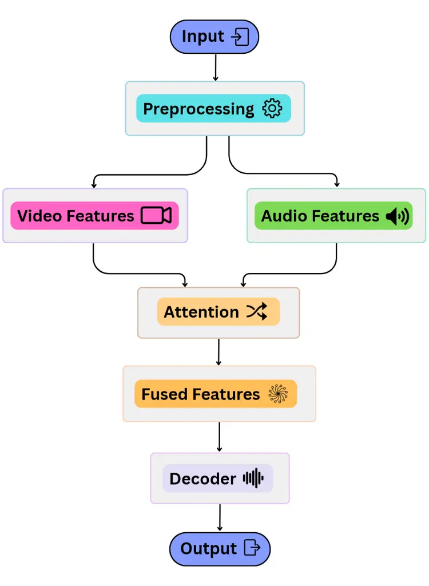
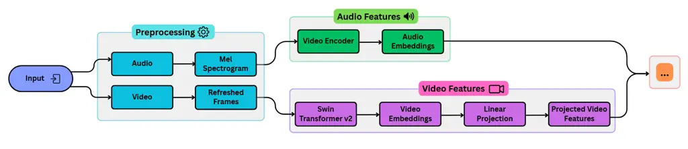
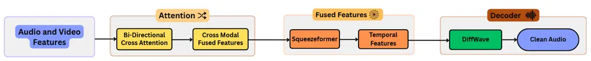
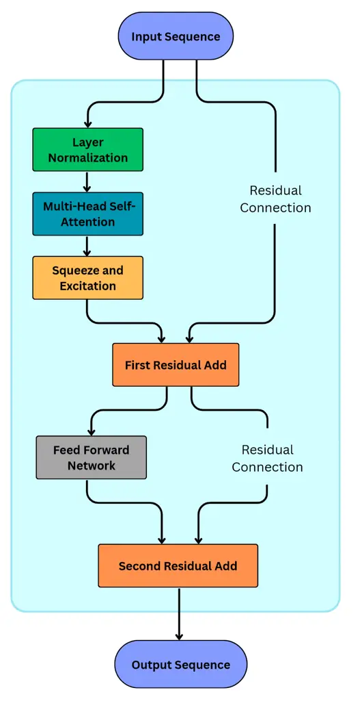
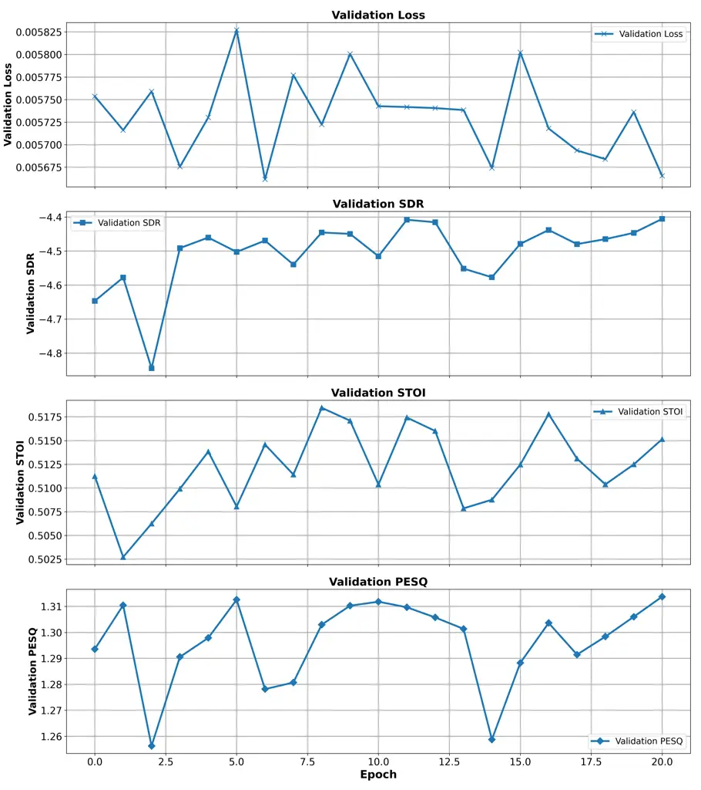
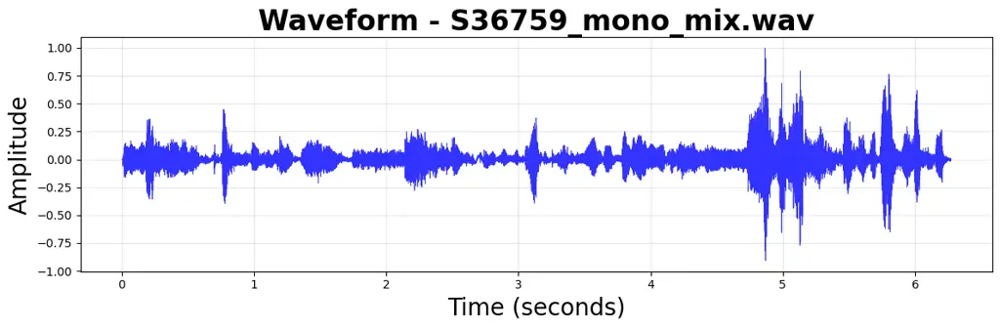
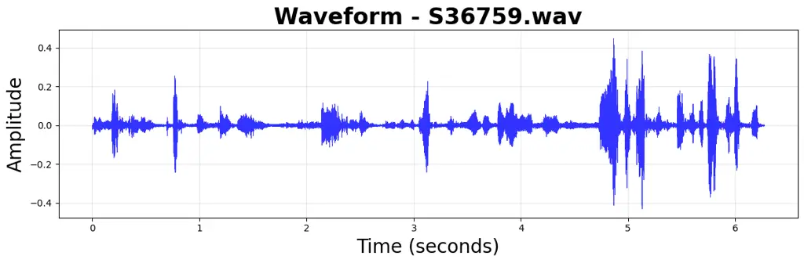
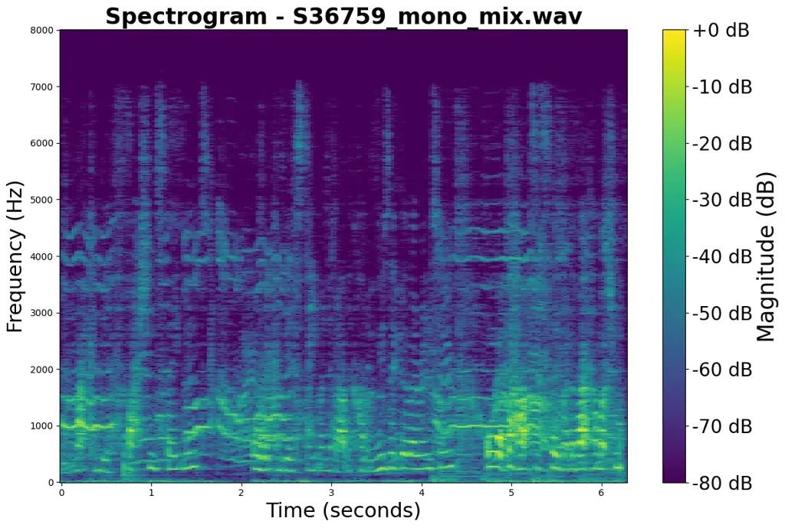
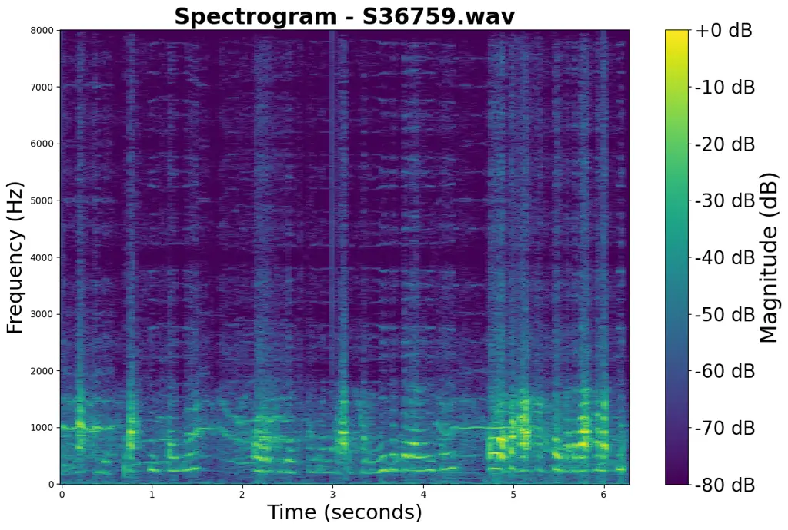

# AUREXA-SE: Audio-Visual Unified Representation Exchange Architecture with Cross-Attention and Squeezeformer for Speech Enhancement

M. Sajid    Deepanshu Gupta    Yash Modi    Sanskriti Jain    Harshith
Jai Surya Ganji    A. Rahaman    Harshvardhan Choudhary    Nasir Saleem
   Amir Hussain    M. Tanveer

###### Abstract

In this paper, we propose AUREXA-SE (Audio-Visual Unified Representation
Exchange Architecture with Cross-Attention and Squeezeformer for Speech
Enhancement), a progressive bimodal framework tailored for audio-visual
speech enhancement (AVSE). AUREXA-SE jointly leverages raw audio
waveforms and visual cues by employing a U-Net–based 1D convolutional
encoder for audio and a Swin Transformer V2 for efficient and expressive
visual feature extraction. Central to the architecture is a novel
bidirectional cross-attention mechanism, which facilitates deep
contextual fusion between modalities, enabling rich and complementary
representation learning. To capture temporal dependencies within the
fused embeddings, a stack of lightweight Squeezeformer blocks combining
convolutional and attention modules is introduced. The enhanced
embeddings are then decoded via a U-Net–style decoder for direct
waveform reconstruction, ensuring perceptually consistent and
intelligible speech output. Experimental evaluations demonstrate the
effectiveness of AUREXA-SE, achieving significant performance
improvements over noisy baselines, with STOI of 0.516, PESQ of 1.323,
and SI-SDR of -4.322 dB. The source code of AUREXA-SE is available at
[https://github.com/mtanveer1/AVSEC-4-Challenge-2025](https://github.com/mtanveer1/AVSEC-4-Challenge-2025).

###### keywords

Audio-Visual Speech Enhancement (AVSE), Cross-Attention, Swin
Transformer V2, Squeezeformer, U-Net Waveform Decoder, Multimodal Fusion

^(†)^(†)address: ¹Indian Institute of Technology Indore, Simrol, Indore,
453552, India  
²School of Computing, Edinburgh Napier University, EH11 4BN, Edinburgh,
United Kingdom^(†)^(†)email: A.Hussain@napier.ac.uk, mtanveer@iiti.ac.in

## 1 Introduction

Speech is central to human communication, enabling information exchange
and social connection. However, its intelligibility often deteriorates
in noisy environments, making effective communication challenging
without accurate interpretation. Enhancing speech clarity through
audio-visual modeling is therefore vital for building robust
human-system interfaces in practical environments \[1\]. This has led to
the development of the field of speech enhancement (SE), which aims to
improve both the coherence and quality of speech \[2, 3\]. Traditional
SE methods primarily relied on time-frequency (TF) domain processing
using Convolutional Neural Networks (CNNs) \[4\] or Recurrent Neural
Networks (RNNs) \[5\]. A notable milestone was the Convolutional
Recurrent Network (CRN) \[6\], which integrated a convolutional
encoder-decoder with Long Short-Term Memory (LSTM) \[7\] units to
precisely characterise variation in speech \[8\]. Later innovations like
the Deep Complex Convolution Recurrent Network (DCCRN) \[9\] extended
these ideas by processing complex-valued spectrograms, which led to
significant gains in both objective and subjective speech quality.
Following this trend, end-to-end waveform-based models using Generative
Adversarial Networks (GANs) \[10\] have shown impressive adaptability
across diverse speakers and noisy environments.

Despite this significant progress in audio-only speech enhancement using
deep learning, such approaches remain limited in highly noisy or
acoustically challenging environments. These methods often struggle when
the signal-to-noise ratio (SNR) is low or when the noise characteristics
overlap with speech. Crucially, they lack access to the complementary
contextual information that humans naturally rely on during
communication, as demonstrated by phenomena like the McGurk effect
\[11\]. Hence, recent research has increasingly turned to AVSE, where
visual cues such as lip movements provide noise-agnostic information to
aid speech recovery.

With the aid of temporally aligned visual information, audio-visual
models are able to recover speech more effectively in challenging
environments. By leveraging state-of-the-art (SOTA) models and
techniques, multimodal architectures are able to capture richer
contextual patterns, significantly improving speech enhancement
performance. In essence, a unified framework that synergizes recent
advances across both audio and visual domains holds the potential to
address limitations that traditional approaches have struggled to
overcome.

Motivated by this insight, we propose AUREXA-SE, a novel AVSE framework
developed for the COG-MHEAR AVSE Challenge. It features a dual-stream
architecture with a U-Net-based audio encoder \[12\] and a Swin
Transformer V2 visual encoder \[13\], each processing their modality in
parallel. The extracted features are fused using bi-directional
cross-attention \[14\], refined via Squeezeformer-based temporal
modelling \[15\], and decoded using a U-Net–style waveform decoder
\[16\] to generate clean speech. Together, these components form a
unified, cross-modal architecture that combines the strengths of both
audio and visual inputs while introducing key innovations, such as raw
waveform encoding, spatially rich visual processing, and bi-directional
cross-modal fusion. This fusion of best practices is aimed at delivering
robust speech clarity in noisy environments while maintaining
computational efficiency and scalability.

Our framework achieves state-of-the-art speech enhancement within a
focused training budget of just 50 hours—20 epochs at 2.5 hours each
(348,660 steps)—outperforming models that require significantly longer
training schedules. With an expanded architecture of 54.2M parameters
(up from the baseline’s 22.2M), we deliver notable quality improvements.
Despite a modest increase in inference time (40 minutes vs. 25 minutes),
the gains clearly outweigh the trade-off, showcasing the efficiency and
effectiveness of our design.

In the following section, we will provide a comprehensive overview of
related works in both audio-only and audio-visual speech enhancement,
further contextualising the challenges in the field and highlighting how
AUREXA-SE’s innovative design directly addresses these limitations.

## 2 Motivation and Contribution

SE has undergone a significant transformation, moving beyond traditional
audio-only methods to embrace multimodal approaches that leverage visual
information. This paradigm shift is motivated by the recognition that
visual cues such as lip movements and facial expressions provide
temporally aligned and noise-resilient context. By enriching speech
representations and resolving acoustic ambiguities, visual input has
catalyzed a growing interest and rapid advancement in AVSE research.

The progress in AVSE has given rise to several notable architectures.
RecognAVSE \[17\] innovatively combines a Separable 3D CNN \[18\] for
efficient video encoding with a DCU-Net \[19\] audio encoder. Meanwhile,
LSTMSE-Net \[8\] leverages an LSTM-based network to process concatenated
audio-visual features, consistently outperforming recent challenge
baselines. More recently, DAVSE \[20\] introduced a diffusion-based
generative framework, highlighting a growing interest in probabilistic
modelling for robust AVSE.

Transformer-based audio-visual speech enhancement (AVSE) models have
attracted significant attention in recent years owing to their
exceptional capability to capture both local and global dependencies
across modalities. Dual-transformer architectures \[21, 22\] epitomize
this approach by independently processing audio and visual streams,
followed by alignment via self-supervised learning mechanisms. For
example, DCUC-Net \[23\] extends the deep complex U-Net by incorporating
Conformer blocks, which adeptly fuse convolutional and self-attention
operations to facilitate more robust cross-modal integration. Moreover,
iterative refinement techniques grounded in transformer frameworks
\[24\] have shown substantial gains in speech quality, especially under
acoustically adverse conditions.

Despite these advancements, current AVSE architectures face several
critical limitations. A predominant issue is their dependence on
spectrogram-based inputs, as seen in models like AVDCNN \[25\], DCCRN
\[9\], and VSEGAN \[26\], which can compromise fine temporal resolution
and phase fidelity, ultimately affecting the precision of speech
reconstruction. Furthermore, architectures such as AVDCNN \[25\] rely on
shallow or unidirectional fusion mechanisms, which constrain deep
audio-visual integration and underutilize modality-specific
correlations. Finally, transformer-dense models like AV-HuBERT \[27\]
often incur significant computational and memory costs, posing
challenges for real-time deployment unless complemented by efficient
model compression, hardware acceleration, or lightweight architectural
innovations.

Motivated by the aforementioned limitations, we propose AUREXA-SE, an
end-to-end audio-visual speech enhancement framework meticulously
designed to address these challenges holistically. The architecture of
AUREXA-SE is guided by four key design principles, each offering direct
solutions to critical shortcomings in prior works:

- •
  AUREXA-SE employs a U-Net-like 1D convolutional audio encoder that
  directly operates on raw noisy waveforms. This design circumvents the
  limitations of spectrogram-based inputs and preserves fine-grained
  temporal details critical for accurate speech reconstruction.
- •
  To address the constraints of shallow or unidirectional fusion
  strategies, AUREXA-SE introduces a novel bidirectional cross-attention
  mechanism. This iterative module enables deep, mutual
  contextualization between audio and visual modalities, fostering
  richer cross-modal integration.
- •
  To ensure efficiency without sacrificing expressiveness, AUREXA-SE
  incorporates lightweight yet powerful components: a Swin Transformer
  V2 for hierarchical and efficient visual encoding, and a Squeezeformer
  module to model temporal dynamics with minimal computational overhead.
- •
  For high-quality, perceptually faithful speech reconstruction, the
  fused embedding, refined through bidirectional attention, is passed
  through a U-Net–style decoder that directly synthesizes clean
  waveforms.

Building upon these innovations, AUREXA-SE seamlessly integrates
state-of-the-art encoders with a robust bidirectional fusion strategy to
effectively extract and align complementary cues from both modalities.
This comprehensive design enables superior speech enhancement across a
wide range of noisy environments, addressing the key shortcomings of
prior architectures \[12, 13, 14, 15, 16\]. The framework is also deeply
inspired by foundational contributions in the field of audio-visual
speech enhancement \[28, 29\], grounding its innovations in both
theoretical insight and empirical rigor.

## 3 Methodology

In this section, we delve deeper into the methodology and architectural
design of AUREXA-SE, detailing how each component contributes to
effective and high-quality AVSE in challenging environments.

Figure 1: Architecture of proposed AUREXA-SE framework

Figure 2: Detailed blueprint of data processing pipeline

Figure 3: Detailed blueprint of attention and decoder mechanism

Figure 4: Workflow of a Squeezeformer block

### 3.1 Overview

AUREXA-SE presents a novel bi-modal approach to speech enhancement,
utilising both monoaural audio and visual information. Its architecture
integrates a U-Net-based raw waveform audio encoder with a Swin
Transformer V2 visual encoder, allowing the extraction of rich temporal
and spatial features relevant to each modality \[16, 13\].The full
system pipeline is depicted in Figure 1. To achieve deep
contextualisation between these diverse data streams, the system employs
a bi-directional cross-attention mechanism for robust fusion. This is
followed by a stage of temporal modelling, implemented through cascaded
Squeezeformer blocks \[14, 15\]. The final component is a U-Net-inspired
waveform decoder, incorporating skip connections, which upsamples and
reconstructs the clean speech signal \[30\]. By drawing on both audio
and visual information effectively, AUREXA-SE is designed to provide
superior speech enhancement performance, even amidst noisy settings.

### 3.2 Audio Encoder

The audio encoder transforms raw, noisy audio into robust latent
representations suitable for cross-modal fusion \[12\]. For stereo or
multi-channel inputs, channels are averaged to produce a mono signal.
The architecture follows a U-Net-inspired 1D convolutional design \[16\]
with 4 sequential downsampling blocks. Each block reduces the temporal
resolution using a 1D convolution (kernel size 4, stride 2), followed by
batch normalization and ReLU activation to stabilize and non-linearize
the feature maps.

This hierarchical structure enables the model to extract multi-scale
temporal features, allowing it to retain essential speech patterns even
under severe noise. After downsampling, a 1×1 convolution projects the
features into a fixed-dimensional latent space. The final output is
reshaped to \[Batch, Time, Feature_Dim\], forming a compact,
noise-resilient audio embedding aligned for fusion with visual features.
This component is mentioned in Figure 2.

### 3.3 Video Encoder

Visual cues such as lip movements and facial expressions provide context
for SE, especially under noisy conditions. As illustrated in Figure 2,
each input clip consists of 75 RGB frames resized to 112×112 pixels.
These frames undergo preprocessing, including dimension reordering to
\[Batch × Time, Channels, Height, Width\] and pixel value normalization
through clamping.

Each frame is independently encoded using a Swin Transformer V2 \[13\],
a hierarchical vision transformer that models multi-scale spatial
features via local and shifted window-based self-attention. After
flattening the frames along the temporal dimension to form a tensor of
shape \[Batch × Time, C, H, W\], the resulting sequence is processed
using the Swin Transformer V2 encoder. The output hidden states are
globally pooled across tokens and projected to a fixed 512-dimensional
embedding via a linear layer.

These per-frame embeddings are reshaped back to a temporal sequence with
shape \[Batch, Time, Feature_Dim\] and optionally undergo further
projection, normalization, and clamping. This process yields rich,
temporally aligned visual features optimized for subsequent cross-modal
fusion with audio cues.

### 3.4 Cross-Modal Fusion via Bi-directional cross-attention

The architecture employs a sophisticated bi-directional cross-attention
\[31, 14\] mechanism, as shown in Figure 3, to deeply integrate audio
and visual features, enabling mutual contextualisation. Before fusion,
video features are temporally aligned with audio features via linear
interpolation if their sequence lengths differ.

This fusion occurs through an iterative process in which a dedicated
nn.MultiheadAttention layer allows audio features to query video
features (audio-to-video attention) and, simultaneously, video features
to query audio features (video-to-audio attention). This bi-directional
interaction ensures each modality is updated with relevant context from
the other. Residual connections and nn.LayerNorm are applied after each
attention operation to stabilise learning.

This iterative refinement yields the fused audio and video
representations, which are then averaged to obtain a unified latent
representation. This combined feature undergoes clamping and prepares
the robust, fused embeddings for subsequent processing.

### 3.5 Temporal Modeling

The cross-modal fusion process yields enhanced audio-visual embeddings
that require temporal modelling to capture sequential speech patterns.
The temporal modelling component consists of stacked Squeezeformer
\[15\] blocks applied to the fused feature
sequence$`\ F\in\mathbb{R}^{B\times T\times D}`$. The overall
architecture of this component is visualized in Figure 4.

#### 3.5.1 Squeezeformer Architecture

Each block combines a squeeze operation for temporal downsampling,
multi-head self-attention for global dependencies, depth-wise separable
convolutions for local patterns, and position-wise feed-forward networks
with residual connections. The Squeezeformer architecture reduces
computational complexity from $`O(T^{2})`$ to $`O(T\ log(T))`$ through
its squeeze operation, making it suitable for processing raw audio
waveforms where T = 37,830 samples (34,524 for the training set and
3,306 for validation) corresponds to 3 seconds of 16 kHz audio.

#### 3.5.2 Cross-Modal Temporal Dependencies

Operating on post-fusion embeddings enables the model to learn joint
sequential patterns, capturing synchronisation between visual speech
cues and acoustic events. The temporal model generates features that
maintain their original sequence lengths while embedding a comprehensive
temporal context essential for the reconstruction of waveforms. These
features are then used as conditioning for the diffusion decoder.

### 3.6 Decoder

The decoder reconstructs clean speech waveforms from fused audio-visual
features using a U-Net–inspired architecture \[16\], also illustrated in
Figure 3. It begins with a linear projection to match encoder skip
connection channels, followed by a series of upsampling blocks that
progressively double the temporal resolution. Each block uses linear
layers with LayerNorm and ReLU to ensure stable training.

Skip connections \[30\] from the audio encoder are incorporated at each
stage, with alignment handled via interpolation and padding when needed.
A final linear layer with Tanh activation generates the waveform output
in the clamped range. This design preserves fine-grained audio details,
improves gradient flow, and enables high-fidelity waveform
reconstruction.

### 3.7 Loss Function and Evaluation Metrics

The model is optimized using the Mean Squared Error (MSE) loss, a
fundamental and widely used objective function that encourages
similarity between the predicted and target waveforms. For validation,
we employ perceptual and intelligibility-based metrics, namely
Perceptual Evaluation of Speech Quality (PESQ), Scale-Invariant
Signal-to-Noise Ratio (SI-SNR), and Short-Time Objective Intelligibility
(STOI). These metrics quantitatively assess the fidelity of the
predicted speech by comparing it to the corresponding clean reference,
guiding the model to reduce reconstruction errors and improve perceptual
quality. PESQ scores range from -0.5 to 4.5 and reflect perceptual
quality, while STOI scores from 0 to 1 indicate intelligibility. SI-SNR
(or SISDR) quantifies distortion, with higher values denoting better
signal fidelity.

## 4 Experiments

This section outlines the dataset used, describes the experimental
setup, and provides a comprehensive discussion of the evaluation
results.

### 4.1 Dataset Description

The AVSE-4 dataset used in our study is publicly available on GitHub
\[32\] , which consists of audio-visual scenes combining speech and
noise under both synthetic and real-world acoustic conditions. Each
scene features a target speaker and up to three interferers drawn from
competing speakers, non-speech noises (e.g., domestic appliances, human
sounds), and music tracks from MedleyDB. Scene construction follows the
clarity challenge methodology, using a speech-frequency-weighted SNR
ranging from -10 dB to +10 dB during training and -18 dB to +6.55 dB in
evaluation.

The training set includes 34,524 scenes (113 hours) with 605 target
speakers and 15 noise types, while the development set contains 3,306
scenes (9 hours) with 85 target speakers. Each scene provides a silent
video, mixed mono audio, and isolated audio tracks for the target and
interferers. All audio is 16 kHz, 16-bit, and the dataset includes
facial landmarks and embeddings (e.g., FaceNet, Facemesh) to support
visual modelling. The out-of-domain set includes real conversational
speech in acoustically controlled settings.

### 4.2 Experimental Setup

Figure 5: Validation performance of the AUREXA-SE model across 20
epochs. The graph illustrates trends in SDR, PESQ, STOI, and validation
loss.

We use AVSE4Dataset and AVSE4DataModule to prepare training, validation,
and test sets, with each sample clipped or padded to 3 seconds (75 video
frames at 25 FPS and 48,000 audio samples at 16 kHz). Experiments were
conducted on an NVIDIA RTX A4500 GPU with 46 GB RAM. The proposed
AUREXA-SE model consists of 54.2 M trainable parameters, resulting in an
estimated size of 217.859 MB. Training spanned 20 epochs and a total of
344,680 steps.

During preprocessing, videos are resized to 112×112, and audio is
normalised. Inputs are clipped or padded for consistency, with audio
processed in mono or stereo and visuals standardised as RGB.

| Model       | PESQ  | STOI  | SISDR  |
| ----------- | ----- | ----- | ------ |
| Noisy Input | 1.171 | 0.459 | -5.847 |
| Baseline    | 1.227 | 0.487 | -5.125 |
| AUREXA-SE   | 1.325 | 0.514 | -4.312 |
|             |       |       |        |

Table 1: Comparison of PESQ, STOI, and SISDR across models

### 4.3 Evaluation Results

During the evaluation, three types of audio samples were considered.
First, we used the noisy speech directly from the AVSE4 testing dataset.
This unprocessed audio served as the input to all models and acted as
the standard for comparison. Second, we applied the COG-MHEAR AVSE
Challenge 2024 baseline model to enhance this noisy audio. Third, we
used our proposed AUREXA-SE model to perform speech enhancement on the
same input. Each of these versions was evaluated using three standard
objective metrics: PESQ, STOI, and SI-SDR. The final scores obtained by
all models are presented in Table 1.

Figure 6: Waveform comparison for a sample from the test set. (Top) The
original noisy audio waveform. (Bottom) The enhanced waveform after
being processed.

Figure 7: Spectrogram visualization of speech enhancement. (Top) The
spectrogram of the noisy input, where background noise artifacts obscure
the speech harmonics. (Bottom) The spectrogram of the output from
AUREXA-SE.

Compared to the noisy input, the baseline model showed notable
improvements in both quality and intelligibility. The PESQ score
increased from 1.171 to 1.227, and the STOI improved from 0.459 to
0.487. The proposed AUREXA-SE model achieved the best results across all
evaluation criteria, with a PESQ score of 1.325, a STOI of 0.514, and a
SI-SDR of -4.312 dB. This represents a relative gain over the baseline
of +0.098 in PESQ, +0.027 in STOI, and +0.813 dB in SI-SDR. Figure 5
further illustrates the validation trends across 20 epochs, showing
consistent improvements in PESQ, STOI, SI-SDR, and loss over time.
Overall, the evaluation confirms that AUREXA-SE surpasses both the
unprocessed noisy audio and the AVSE baseline across all standard
metrics.

Computational Cost: Regarding the computational cost, the superior
performance of AUREXA-SE, which surpasses the baseline, was achieved in
just 50 hours of total training. This 20-epoch training period (348,660
steps) represents a highly effective path to state-of-the-art results,
especially when compared to the week-long training cycles often required
for other advanced architectures. While our model introduces a trade-off
in inference speed, requiring 40 minutes versus the baseline’s 25, its
ability to deliver top-tier enhancement quality from a modest 50-hour
training investment underscores its potent and well-balanced design.

## 5 Conclusion and Future Work

In this work, we proposed AUREXA-SE, a unified architecture for
audio-visual speech enhancement (AVSE) that addresses the limitations of
audio-only systems in challenging acoustic conditions. By leveraging
complementary cues from both modalities, AUREXA-SE captures richer
context for more robust speech recovery. The architecture integrates a
Swin Transformer V2 \[13\] for spatial visual encoding, a U-Net–based
raw waveform encoder \[16\] for acoustic detail, and a bidirectional
cross-attention mechanism \[14\] for deep fusion. The fused features are
temporally modeled using Squeezeformer \[15\] and decoded via a
U-Net-inspired waveform decoder \[30\] to reconstruct high-fidelity
speech. Experimental results on the AVSE4 benchmark show that AUREXA-SE
effectively models cross-modal dependencies and consistently outperforms
noisy baselines, demonstrating its potential for real-world deployment.
Ongoing future work aims to address current limitations of the proposed
model, specifically its robustness to unseen noise types, and extend the
architecture to support multi-speaker separation.

Looking ahead, we plan to enhance AUREXA-SE with real-time capabilities,
improved fusion strategies, and robust visual encoding to better handle
real-world challenges. A comprehensive comparative evaluation will
further validate its generalization and effectiveness in diverse noise
conditions.

## 6 Acknowledgement

Prof Hussain acknowledge the support of the UK Engineering and Physical
Sciences Research Council (EPSRC) Grant Ref. EP/T021063/1 (COG-MHEAR)
and EP/T024917/1 (NATGEN). The work of M. Sajid is supported by the
Council of Scientific and Industrial Research (CSIR), New Delhi for
providing fellowship under the under Grant 09/1022(13847)/2022-EMR-I.

## References

- \[1\] A. R. Anwary, M. Gogate, K. Dashtipour, J.-C. Hou, T. Arslan,
  Y. Tsao, M. Akeroyd, and A. Hussain, “Target Speaker Direction
  Estimation using Eye Gaze and Head Movement for Hearing Aids,” in
  _Proc. AVSEC 2024_, 2024, pp. 73–74.
- \[2\] M. Tanveer, A. Rastogi, V. Paliwal, M. Ganaie, A. K. Malik,
  J. Del Ser, and C.-T. Lin, “Ensemble Deep Learning in Speech Signal
  Tasks: A Review,” _Neurocomputing_, vol. 550, p. 126436, 2023.
- \[3\] S. Yechuri and S. D. Vanabathina, “Speech Enhancement: A Review
  of Different Deep Learning Methods,” _International Journal of Image
  and Graphics_, vol. 25, no. 03, p. 2550024, 2025.
- \[4\] A. Pandey and D. Wang, “A New Framework for Supervised Speech
  Enhancement in the Time Domain,” in _Interspeech_, 2018, pp.
  1136–1140.
- \[5\] ——, “Self-Attending RNN for Speech Enhancement to Improve
  Cross-Corpus Generalization,” _IEEE/ACM Transactions on Audio, Speech,
  and Language Processing_, vol. 30, pp. 1374–1385, 2022.
- \[6\] K. Tan and D. Wang, “A Convolutional Recurrent Neural Network
  for Real-Time Speech Enhancement,” in _Interspeech_, vol. 2018, 2018,
  pp. 3229–3233.
- \[7\] S. Hochreiter and J. Schmidhuber, “Long Short-Term Memory,”
  _Neural Computation_, vol. 9, no. 8, pp. 1735–1780, 1997.
- \[8\] A. Jain, J. S. Sanjotra, H. Choudhary, K. Agrawal, R. Shah,
  R. Jha, M. Sajid, A. Hussain, and M. Tanveer, “LSTMSE-Net: Long short
  term speech enhancement network for audio-visual speech enhancement,”
  in _3rd COG-MHEAR Workshop on Audio-Visual Speech Enhancement
  (AVSEC)_, 2024, pp. 33–37. \[Online\]. Available:
  [https://doi.org/10.21437/AVSEC.2024-8](https://doi.org/10.21437/AVSEC.2024-8)
- \[9\] Y. Hu, Y. Liu, S. Lv, M. Xing, S. Zhang, Y. Fu, J. Wu, B. Zhang,
  and L. Xie, “DCCRN: Deep Complex Convolution Recurrent Network for
  Phase-Aware Speech Enhancement,” _arXiv preprint
  arXiv:2008.00264_, 2020.
- \[10\] S. S. Shetu, E. A. P. Habets, and A. Brendel, “GAN-Based Speech
  Enhancement for Low SNR Using Latent Feature Conditioning,” in _ICASSP
  2025 - 2025 IEEE International Conference on Acoustics, Speech and
  Signal Processing (ICASSP)_, 2025, pp. 1–5.
- \[11\] K. Tiippana, “What is the McGurk effect?” p. 725, 2014.
- \[12\] Y. Luo and N. Mesgarani, “Conv-TasNet: Surpassing Ideal
  Time–Frequency Magnitude Masking for Speech Separation,” _IEEE/ACM
  Transactions on Audio, Speech, and Language Processing_, vol. 27,
  no. 8, pp. 1256–1266, 2019.
- \[13\] Z. Liu, H. Hu, Y. Lin, Z. Yao, Z. Xie, Y. Wei, J. Ning, Y. Cao,
  Z. Zhang, L. Dong _et al._, “Swin Transformer V2: Scaling Up Capacity
  and Resolution,” in _Proceedings of the IEEE/CVF Conference on
  Computer Vision and Pattern Recognition_, 2022, pp. 12 009–12 019.
- \[14\] H. Lin, X. Cheng, X. Wu, and D. Shen, “CAT: Cross Attention in
  Vision Transformer,” in _2022 IEEE International Conference on
  Multimedia and Expo (ICME)_. IEEE, 2022, pp. 1–6.
- \[15\] S. Kim, A. Gholami, A. Shaw, N. Lee, K. Mangalam, J. Malik,
  M. W. Mahoney, and K. Keutzer, “Squeezeformer: An Efficient
  Transformer for Automatic Speech Recognition,” _Advances in Neural
  Information Processing Systems_, vol. 35, pp. 9361–9373, 2022.
- \[16\] D. Stoller, S. Ewert, and S. Dixon, “Wave-U-Net: A Multi-Scale
  Neural Network for End-to-End Audio Source Separation,” _arXiv
  preprint arXiv:1806.03185_, 2018.
- \[17\] J. R. Manesco, L. A. Passos, R. Fourati, J. P. Papa, and
  A. Hussain, “RecognAVSE: An Audio-Visual Speech Enhancement Approach
  using Separable 3D convolutions and Deep Complex U-Net,” in _Proc.
  AVSEC 2024_, 2024, pp. 11–15.
- \[18\] H. Yin, J. Bai, M. Wang, S. Huang, Y. Jia, and J. Chen,
  “Convolutional Recurrent Neural Network with Attention for 3D Speech
  Enhancement,” in _2023 IEEE International Conference on Signal
  Processing, Communications and Computing (ICSPCC)_. IEEE, 2023, pp.
  1–5.
- \[19\] Y. Sun, L. Yang, H. Zhu, and J. Hao, “Funnel Deep Complex U-Net
  for Phase-Aware Speech Enhancement,” in _Interspeech_, 2021, pp.
  161–165.
- \[20\] C.-W. Chen, J.-C. Hou, Y. Tsao, J.-C. Chen, and S.-Y. Chien,
  “DAVSE: A Diffusion-Based Generative Approach for Audio-Visual Speech
  Enhancement,” in _3rd COG-MHEAR Workshop on Audio-Visual Speech
  Enhancement (AVSEC)_, 2024.
- \[21\] F. E. Wahab, N. Saleem, A. Hussain, R. Ullah, and M. B. Hossen,
  “Multi-Model Dual-Transformer Network for Audio-Visual Speech
  Enhancement,” in _3rd COG-MHEAR Workshop on Audio-Visual Speech
  Enhancement (AVSEC)_, 2024.
- \[22\] T. Afouras, J. S. Chung, and A. Zisserman, “The Conversation:
  Deep Audio-Visual Speech Enhancement,” _arXiv preprint
  arXiv:1804.04121_, 2018.
- \[23\] S. Ahmed, C.-W. Chen, W. Ren, C.-J. Li, E. Chu, J.-C. Chen,
  A. Hussain, H.-M. Wang, Y. Tsao, and J.-C. Hou, “Deep Complex U-Net
  with Conformer for Audio-Visual Speech Enhancement,” _arXiv preprint
  arXiv:2309.11059_, 2023.
- \[24\] A. Nazemi, A. Sami, M. Sami, and A. Hussain, “Iterative Speech
  Enhancement with Transformers,” in _Proc. AVSEC 2024_, 2024, pp.
  65–67.
- \[25\] A. Gabbay, A. Shamir, and S. Peleg, “Visual Speech Enhancement
  Using Noise-Invariant Training,” in _Interspeech_, 2017.
- \[26\] X. Xu, Y. Wang, D. Xu, Y. Peng, C. Zhang, J. Jia, and B. Chen,
  “VSEGAN: Visual Speech Enhancement Generative Adversarial Network,” in
  _ICASSP 2022-2022 IEEE International Conference on Acoustics, Speech
  and Signal Processing (ICASSP)_. IEEE, 2022, pp. 7308–7311.
- \[27\] J. Shi, Y. Zhang, C.-I. Yang, Z. Chuang, D. Harwath, and
  J. Glass, “AV-HuBERT: Self-Supervised Learning for Audio-Visual Speech
  Recognition,” in _NeurIPS_, 2022.
- \[28\] D. Michelsanti, Z.-H. Tan, S.-X. Zhang, Y. Xu, M. Yu, D. Yu,
  and J. Jensen, “An Overview of Deep Learning-Based Audio-Visual Speech
  Enhancement and Separation,” _IEEE/ACM Transactions on Audio, Speech,
  and Language Processing_, vol. 29, pp. 1368–1396, 2021.
- \[29\] K. Yang, D. Marković, S. Krenn, V. Agrawal, and A. Richard,
  “Audio-Visual Speech Codecs: Rethinking Audio-Visual Speech
  Enhancement by Re-Synthesis,” in _Proceedings of the IEEE/CVF
  Conference on Computer Vision and Pattern Recognition_, 2022, pp.
  8227–8237.
- \[30\] O. Ronneberger, P. Fischer, and T. Brox, “U-Net: Convolutional
  Networks for Biomedical Image Segmentation,” in _Medical Image
  Computing and Computer-Assisted Intervention–MICCAI 2015: 18th
  international conference, Munich, Germany, October 5-9, 2015,
  proceedings, part III 18_. Springer, 2015, pp. 234–241.
- \[31\] A. Vaswani, N. Shazeer, N. Parmar, J. Uszkoreit, L. Jones,
  A. N. Gomez, Ł. Kaiser, and I. Polosukhin, “Attention Is All You
  Need,” _Advances in Neural Information Processing Systems_,
  vol. 30, 2017.
- \[32\] C. H. Lab, “AVSE-4 Challenge Dataset and Data Preparation
  Tools,”
  [{https://github.com/cogmhear/avse_challenge/tree/main/data_preparation/avse4}](https://%7Bhttps://github.com/cogmhear/avse_challenge/tree/main/data_preparation/avse4%7D),
  2025, accessed: July 2025.
