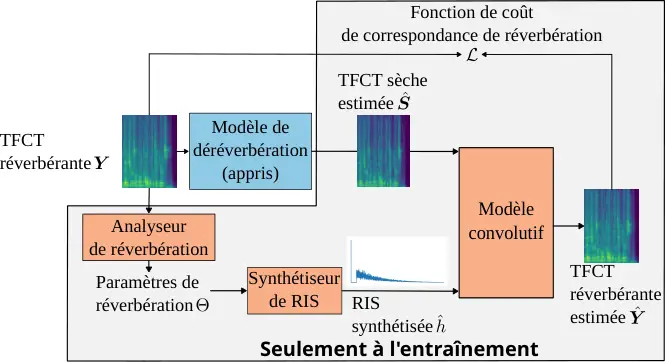

\titre

Déréverbération non-supervisée de la parole par modèle hybride

###### Abstract

This paper introduces a new training strategy to improve speech
dereverberation systems in an unsupervised manner using only reverberant
speech. Most existing algorithms rely on paired dry/reverberant data,
which is difficult to obtain. Our approach uses limited acoustic
information, like the reverberation time (RT60), to train a
dereverberation system. Experimental results demonstrate that our method
achieves more consistent performance across various objective metrics
than the state-of-the-art.

^(†)^(†)address: louis.bahrman@telecom-paris.fr^(†)^(†)email:
^(†)^(†)address: mathieu.fontaine@telecom-paris.fr^(†)^(†)email:
^(†)^(†)address: gael.richard@telecom-paris.fr^(†)^(†)email:
^(†)^(†)affiliation: LTCI, Télécom Paris, Institut Polytechnique de
Paris, Palaiseau, France

## 1 Introduction

Les signaux acoustiques capturés dans des salles sont affectés par des
réflexions par les murs et la diffraction par des obstacles rencontrés
sur le chemin acoustique, dans un processus dénommé réverbération, qui
réduit l’intelligibilité des enregistrements de parole, et justifie la
nécessité d’employer des méthodes de déréverbération pour les atténuer.
La tâche de déréverbération a été historiquement résolue en utiliant des
méthodes statistiques de traitement du signal \[11\]. L’absence de
solution unique au problème de déréverbération encourage l’usage de
réseaux neuronaux profonds (RNP), qui requièrent en pratique de grandes
quantités de données.

Ces approches peuvent être supervisées de différentes manières. Les
approches discriminatives apprennent à prédire un signal sec \[16\], ou
un masque complexe \[7\] à partir d’un signal réverbérant, et requièrent
une grande quantité de données par paires (sèches,réverbérantes). Les
modèles génératifs, comme les auto-encodeurs variationels \[8\]
apprennent la distribution de signaux secs sans avoir accès à des
signaux réverbérants durant l’entraînement. Bien que ces modèles
nécessitent moins de supervision, ils ne résolvent pas le problème
d’accès aux données, car les données sèches sont plus difficiles à
obtenir que les données réverbérantes. Ainsi, des approches exploitant
uniquement des signaux réverbérants ont été conçues, dont
MetricGAN-U \[6\]. Son paradigme d’entraînement est basé sur un réseau
antagoniste (GAN) dont le discriminateur est entraîné à imiter une
métrique cible, et le générateur à optimiser sa performance vis-à-vis du
discriminateur. Cette approche a été appliquée avec succès à la
déreverbération en utilisant la métrique du rapport parole à énergie
réverbérante (SRMR) \[5\] en tant que métrique cible à optimiser.



Figure 1: Aperçu de la méthode proposée

De plus, les approches supervisées et non supervisées pour la
déréverbération ont été améliorées en les hybridant avec des modèles de
réverbération classiques. Un choix populaire pour modéliser
implicitement la réverbération est l’approximation de la fonction de
transfert convolutive (CTF), qui considère la réverbération comme un
processus de filtrage en sous-bandes. Elle a été utilisée dans la
méthode de l’erreur de prédiction pondérée (WPE) \[11\]. Un modèle
établi à partir de la CTF a même été utilisé pour la déréverbération
supervisée uniquement par le signal réverbérant dans USDNet \[15\].
L’énergie dans chacune des bandes peut être modélisée par une
décroissance exponentielle, et, dans \[10\], les paramètres de cette
décroissance et le signal sec sont alternativement estimés par un modèle
de diffusion. Certains modèles ont même été conçus pour déréverbérer en
ayant accès à l’inférence aux propriétés de la réverbération \[18\].
L’essor de ces méthodes a été permis par des avancées significatives en
estimation aveugle, c.-à-d. à partir du signal réverbérant, des
paramètres de réverbération. Le temps de réverbération, qui décrit la
décroissance de l’énergie de la RIS, peut notamment être estimé grâce à
un algorithme fondé sur la décomposition en sous-bandes du spectrogramme
du signal réverbérant \[4\]. Jusqu’à présent, MetricGAN-U était la
meilleure approche de déréverbération supervisée par les signaux
réverbérants, surpassant WPE et USDNet. Nous qualifions cette approche
d’auto-supervision par une métrique.

Dans cet article, nous proposons d’introduire un nouveau cadre hybride
pour la déréverbération non-supervisée, appelé auto-supervision par
réverbération. Nous entraînons un RNP à estimer un signal de parole
sèche, de telle sorte qu’un modèle de réverbération appliqué sur ce
signal estimé corresponde à son signal d’entrée réverbérant. Nous
montrons, pour diverses mesures objectives, que la déréverbération
auto-supervisée par réverbération est plus performante que la
déreverbération basée sur les métriques. À des fins de reproductibilité
et pour faciliter les recherches futures, nous distribuons publiquement
des exemples, le code et les modèles pré-entraînés¹¹ 1
[https://louis-bahrman.github.io/Hybrid-WSSD/](https://louis-bahrman.github.io/Hybrid-WSSD/).

## 2 Modèle de réverbération

### 2.1 Réverbération tardive

En supposant des positions de source et de microphone fixes, un signal
monaural réverbérant $`y`$ peut être représenté comme la convolution
d’un signal sec $`s`$ et une réponse impulsionelle de salle (RIS) entre
la source et le microphone $`h`$:

```math
y(n)=(s\star h)(n), \tag{1}
```

où $`n`$ dénote l’index temporel et $`\star`$ l’opérateur de
convolution. La RIS $`h`$ peut être divisée en 3 parties: le trajet
direct correspond à son premier pic $`h_{d}`$ suivi des réflexions
précoces $`h_{e}`$ et, après le temps de mixage $`n_{m}`$, la
réverbération tardive $`h_{l}`$.

Un modèle simple de réverbération tardive est le modèle de
Polack \[12\]. Ce modèle considère $`h_{l}`$ comme la réalisation d’un
bruit blanc sous enveloppe exponentiellement décroissante:

```math
h_{l}(n)=b(n)e^{\frac{-3\ln(10)n}{\text{RT}_{60}f_{s}}}, \tag{2}
```

avec $`b(n)\sim\mathcal{N}(0,\sigma^{2})`$ une distribution normale
centrée, $`\text{RT}_{60}`$ le temps de réverbération et $`f_{s}`$ la
fréquence d’échantillonage.

### 2.2 Convolution dans le plan temps-fréquence

Le système invariant de l’Eq. (1) peut être formulé comme une
convolution inter-bande et inter-trame dans le domaine de la Transformée
de Fourier Court-Terme TFCT \[1\]:

```math
Y_{f,t}=\sum_{f^{\prime}=0}^{F-1}\sum_{t^{\prime}=0}^{\min(t;T_{h})}\mathcal{H}_{f,f^{\prime},t^{\prime}}S_{f^{\prime},t-t^{\prime}}, \tag{3}
```

où
$`\bm{Y}\triangleq\{Y_{f,t}\}_{f,t=0}^{F-1,T_{y}-1}\in\mathbb{C}^{F\times T_{y}}`$
sont les coefficients de la TFCT du signal réverbérant à la fréquence
$`f\hskip-1.00006pt=\hskip-1.00006pt0,\dots,F-1`$ et à la trame
$`t\hskip-1.00006pt=\hskip-1.00006pt0,\dots,T_{y}-1`$,
$`\mathcal{H}\triangleq\{\mathcal{H}_{f,f^{\prime},t}\}_{f,f^{\prime},t=0}^{F-1,F-1,T_{h}-1}\in\mathbb{C}^{F\times F\times T_{h}}`$
est une représentation tridimensionnelle de la RIS et
$`\bm{S}\triangleq\{S_{f,t}\}_{f,t=0}^{F-1,T_{s}-1}\in\mathbb{C}^{F\times T_{s}}`$
est la TFCT du signal sec. Comme démontré dans \[1\], $`\mathcal{H}`$
peut être calculé à partir de $`h\in\mathbb{R}^{N_{h}}`$ comme :

```math
\mathcal{H}_{f,f^{\prime},t^{\prime}}=\sum_{m=-N+1}^{N-1}h(t^{\prime}L-m)W_{f,f^{\prime}}(m), \tag{4}
```

où $`N`$ est la longueur de fenêtre de TFCT, $`L`$ la taille de saut et

```math
W_{f,f^{\prime}}(m)=\frac{1}{F}\sum_{n=0}^{N-1}w_{s}(n+m)w_{a}(n)e^{\frac{j2\pi(f^{\prime}(n+m)-fn)}{F}} \tag{5}
```

avec $`w_{s},w_{a}`$ les fenêtres d’analyse et de synthèse respectives.

## 3 Méthode

### 3.1 Aperçu

Nous proposons d’entraîner un modèle d’apprentissage profond de
déréverbération en le supervisant par un modèle de réverbération. La
procédure d’entraînement est la suivante: Étant donné un signal
réverbérant $`\bm{Y}`$ défini à la section précédente, le RNP renvoie un
signal sec estimé
$`\hat{\bm{S}}\triangleq\{\hat{S}_{f,t}\}_{f,t=0}^{F-1,T_{s}-1}\in\mathbb{C}^{F\times T_{s}}`$.
En parallèle, un modèle de réverbération $`\mathcal{R}`$, estime à
partir du signal réverbérant le temps de réverbération
$`\text{RT}_{60}`$ et s’en sert pour synthétiser une RIS approximée
$`\hat{h}\in\mathbb{R}^{N_{h}}`$. La TFCT du signal sec estimé
$`\hat{\bm{S}}`$ est ensuite convoluée avec la RIS synthétique
$`\hat{h}`$ grâce au modèle inter-bande $`\mathcal{C}`$ (cf. Eq. (7)),
pour estimer la TFCT du signal réverbérant $`\hat{\bm{Y}}`$. La fonction
de coût de déréverbération nécessitant des paires de signaux secs et
réverbérants est remplacée par une fonction de coût de correspondance de
réverbération $`\mathcal{L}`$, qui calcule la distance entre le
spectrogramme estimé $`\hat{\bm{Y}}`$ et la référence $`\bm{Y}`$. Un
schéma de la procédure est présenté à la Fig. 1. Étant donné que le
modèle de synthèse de RIS et le modèle convolutif ne sont pas
paramétriques, ils n’ont pas besoin d’être entraînés. À l’inférence,
seul le RNP est utilisé, et ainsi le nombre de paramètres ainsi que la
complexité temps et mémoire demeurent les mêmes que pour le RNP de
déréverbération.

### 3.2 Modèle de RIS

Le modèle de RIS sert à synthéthiser une RIS dont les caractéristiques
sont celles de la RIS correspondant à la vérité terrain. Il se décompose
en 2 parties, une d’analyse dénotée $`\mathcal{A}`$, visant à estimer
les paramètres acoustiques à partir du signal réverbérant, et une de
synthèse, dénotée $`\mathcal{S}`$, visant à synthétiser une RIS réaliste
à partir de ces caractéristiques.

Le synthétiseur de RIS sert à synthéthiser une RIS dont la réverbération
tardive $`h_{l}`$ correspond au modèle de Polack et le trajet direct
$`h_{d}`$ est un pic d’amplitude $`1`$. Pour mieux faire correspondre le
modèle à la distribution de nos données sans modifier la distribution de
l’énergie décrite par Polack, et suite à des expériences préliminaires,
nous avons décidé de synthétiser une RIS en utilisant la valeur absolue
de la distribution gaussienne utilisée dans le modèle de Polack. Afin
d’aligner les signaux secs et réverbérants, nous supprimons les
échantillons de RIS précédent le premier pic. Ainsi, la RIS synthéthique
devient:

```math
\mathcal{S}(\Theta)(n)=\begin{cases}|b(n)|e^{-\frac{3\ln(10)}{\text{RT}_{60}f_{s}}n}&\text{si }n>n_{m}\\
1&\text{si }n=0\\
0&\text{sinon},\end{cases} \tag{6}
```

où $`b(n)`$ est tiré d’une distribution normale
$`\mathcal{N}(0,\sigma^{2})`$. Durant l’entraînement, une RIS est
synthétisée à partir d’un nouveau tirage de bruit à chaque pas de
gradient.

### 3.3 Modèle convolutif et fonction de coût

Afin de mieux rétropropager le gradient au modèle de déréverbération
dont la sortie peut être dans le plan temps-fréquence, nous considérons
un modèle convolutif inter-bande en temps-fréquence et une fonction de
coût de correspondance de réverbération. Étant donné
$`\hat{h}=\mathcal{S}(\Theta)`$ et $`\hat{\bm{S}}`$ le signal sec estimé
par le RNP, nous définissons le modèle de convolution temps-fréquence
comme:

```math
\displaystyle\hat{\bm{Y}}_{f,t}\triangleq\mathcal{C}(\hat{\bm{S}},\hat{h})=\sum_{f^{\prime}=f-F^{\prime}}^{f+F^{\prime}}\sum_{t^{\prime}=0}^{\min(t;T_{h})}\hat{\mathcal{H}}_{f,f^{\prime},t^{\prime}}\hat{S}_{f^{\prime},t-t^{\prime}}, \tag{7}
```

avec
$`\hat{\mathcal{H}}_{f,f^{\prime},t^{\prime}}\triangleq\sum_{m=-N+1}^{N-1}\hat{h}(t^{\prime}L-m)W_{f,f^{\prime}}(m)`$
et les notations de Eq. (7) coïncidant à celles de l’Eq. (3-5).
Suivant \[1\], nous fixons le nombre de bandes de convolution
inter-bande $`F^{\prime}`$ à $`4`$.

Notre fonction de coût de correspondance de réverbération correspond à
l’erreur moyenne quadratique pour le problème de déconvolution. Un terme
de régularisation est ajouté pour encourager les log-amplitudes du
signal reverbérant estimé à se rapprocher de celles de la vérité
terrain, et la fonction de coût d’entraînement du modèle est, avec
$`\lambda=\gamma=1`$ comme dans \[14\]:

```math
\mathcal{L}=\sum_{f,t}\left[\lvert\hat{Y}_{f,t}-Y_{f,t}\rvert^{2}+\lambda\left|\log\left(\frac{1+\gamma\lvert\hat{Y}_{f,t}\rvert}{1+\gamma\lvert Y_{f,t}\rvert}\right)\right|^{2}\right] \tag{8}
```

## 4 Expériences

Nous comparons notre méthode de déréverbération non-supervisée avec
celle utilisée par MetricGAN-U.

### 4.1 Variants de RNP

Nous évaluons plusieurs variantes de notre méthode avec FullSubNet
(FSN) \[7\]. Il a été déjà combiné avec des stratégies d’entraînement
informées par la réverbération \[19\]. Nous considérons aussi le modèle
baseline BiLSTM \[17\] utilisé comme générateur dans MetricGAN-U. Ce
modèle est beaucoup plus simple puisqu’il permet de traiter seulement
des masques d’amplitude et servira d’indicateur pour le comportement de
notre méthode avec un modèle moins expressif.

### 4.2 Variantes de supervision

Nous considérons différentes variantes de supervision:

Supervision Forte: Ce variant correspond à la fonction de coût originale
de chacun des modèles, requérant des paires de signaux. Le BiLSTM est
entraîné en utilisant l’erreur moyenne quadratique entre les
spectrogrammes d’amplitude secs et déréverbérés. FSN est entraîné à
minimiser la distance euclidienne entre le masque complexe idéal et
estimé (cRM).

Supervision faible : Ce variant d’auto-supervision par la réverbération
correspond à notre modèle de RIS, dont le modèle d’analyse de paramètres
acoustiques est un modèle oracle. Suivant des expériences conduites
dans \[2\], où il a été montré que cela n’impactait que peu la
performance de déréverbération, nous fixons le temps de mixage $`n_{m}`$
et $`\sigma`$ à la valeur moyenne sur la base de données. Pour $`n_{m}`$
cela correspond au temps de mixage moyen de notre base de données selon
la formule décrite dans \[3\], soit $`20`$ ms, ou $`n_{m}=0.02f_{s}`$.
Le paramètre sigma est fixé à $`0.02`$. Ainsi pour ce variant seul le
$`\text{RT}_{60}`$ est calculé de manière non aveugle à partir de la
RIS.

Auto-supervision par la réverbération (aveugle) : Ce variant utilise
l’algorithme d’estimation aveugle du $`\text{RT}_{60}`$ fondée sur la
décomposition en sous-bandes du spectrogramme du signal réverbérant
décrite dans \[4\]. L’algorithme est calibré sur 100 couples
$`(y,\text{RT}_{60})`$.

Auto-supervision par une métrique (SRMR) : Nous considérons aussi la
baseline de MetricGAN-U correspondant au modèle BiLSTM supervisé par la
métrique du SRMR.

### 4.3 Configuration d’entrainement

Comme pour FullSubNet original, des extraits de parole réverbérante de
49151 échantillons (environ 3 secondes à 16 kHz) sont traités dans le
plan TFCT en utilisant une fenêtre de Hann de taille 512 avec un pas de
$`50~\%`$. Nous utilisons l’optimiseur Adam et arrêtons l’entraînement
selon l’évolution de la métrique SISDR sur un set de validation.

### 4.4 Données

Comme pour \[2\], nous avons simulé un ensemble de données
d’entraînement en convoluant dynamiquement des signaux de parole sèche
avec des RIS simulées. Les signaux de parole sèche sont échantillonnés
de manière aléatoire à partir des enregistrements du microphone de
casque de WSJ1 \[9\]. L’ensemble d’entraînement représente 73 heures
cumulées d’audio divisés en 60307 extraits. L’ensemble des RIS simulées
se compose de 32 000 RIS tirées de 2 000 pièces simulées à l’aide de la
méthode de source-image de pyroomacoustics \[13\]. Les dimensions de la
pièce et le RT60 sont uniformément échantillonnés les intervalles de
$`[5,10]\times[5,10]\times[2,5,4]~\text{m}^{3}`$, et $`[0,2,1,0]`$ s. La
distance source-microphone est uniformément distribuée dans
$`[0.75,2.5]`$ m, et la source et le microphone sont tous deux à au
moins $`50`$ cm des murs. Afin d’aligner la cible du signal sec et le
trajet direct, les échantillons de RIS précédant le trajet direct sont
éliminés et celle-ci est normalisée de sorte que le trajet direct soit
d’amplitude 1.

## 5 Résultats et discussion

Nous évaluons la performance de nos méthodes (supervision faible et
aveugle) sur des locuteurs de WSJ et des salles non vues à
l’entraînement. La performance est évaluée à l’aide des métriques
Scale-Invariant Signal to Distortion Ratio (SISDR), Extended Short-Time
Objective Intelligibility (ESTOI), Wide-Band Perceptual Evaluation of
Speech Quality (WB-PESQ), et SRMR. Les résultats sont présentés dans le
tableau 1. La ligne dénotée \ogRéverbérantcorrespond aux signaux non
traités. Toutes les variantes proposées présentent une amélioration des
métriques SISDR, ESTOI et WB-PESQ, donc parviennent à déréverbérer la
parole avec succès. La baseline (BiLSTM+SRMR) excelle en termes de SRMR,
mais cette performance est au détriment des résultats de SISDR et STOI,
qui sont dégradés par rapport à l’entrée réverbérante. Cela confirme le
principal désavantage de la déréverbération auto-supervisée par une
métrique, dans le sens où elle tend à n’optimiser que la métrique cible.
En effet, toutes nos méthodes proposées performent mieux que la baseline
sur toutes les autres métriques que le SRMR. Cela démontre la
supériorité de l’auto-supervision par la réverbération sur
l’auto-supervision par la métrique. De plus, les performances des
variantes de supervision aveugles, n’ayant pas accès au
$`\text{RT}_{60}`$ oracle, sont très proches de la performance de la
supervision faible. Cela montre la robustesse de notre méthode à de
faibles erreurs d’estimation de ce paramètre. Enfin, en comparant les
RNP, on remarque que les résultats du modèle BiLSTM sont moins dégradés
par le passage de supervision forte à faible que ceux du modèle FSN.
Cela peut être expliqué par le fait que ce premier modèle est agnostique
à la phase du signal réverbérant, particulièrement perturbée par notre
modèle de réverbération.

|             |                    |                    |           |                   |           |                   |           |                    |           |
| ----------- | ------------------ | ------------------ | --------- | ----------------- | --------- | ----------------- | --------- | ------------------ | --------- |
| RNP         | Supervision        | SISDR              |           | ESTOI             |           | WB-PESQ           |           | SRMR               |           |
| FSN         | Forte              | $`5.622`$ $`\pm`$  | $`3.858`$ | $`0.838`$ $`\pm`$ | $`0.097`$ | $`2.545`$ $`\pm`$ | $`0.669`$ | $`8.228`$ $`\pm`$  | $`3.488`$ |
|             | faible             | $`2.886`$ $`\pm`$  | $`3.525`$ | $`0.707`$ $`\pm`$ | $`0.146`$ | $`1.777`$ $`\pm`$ | $`0.696`$ | $`6.912`$ $`\pm`$  | $`2.798`$ |
|             | Aveugle (Proposée) | $`2.795`$ $`\pm`$  | $`3.409`$ | $`0.708`$ $`\pm`$ | $`0.147`$ | $`1.778`$ $`\pm`$ | $`0.702`$ | $`6.895`$ $`\pm`$  | $`2.796`$ |
| BiLSTM      | Forte              | $`1.266`$ $`\pm`$  | $`4.266`$ | $`0.776`$ $`\pm`$ | $`0.122`$ | $`2.250`$ $`\pm`$ | $`0.780`$ | $`7.886`$ $`\pm`$  | $`3.018`$ |
|             | faible             | $`1.557`$ $`\pm`$  | $`3.672`$ | $`0.708`$ $`\pm`$ | $`0.149`$ | $`1.837`$ $`\pm`$ | $`0.742`$ | $`6.865`$ $`\pm`$  | $`2.802`$ |
|             | Aveugle (Proposée) | $`1.534`$ $`\pm`$  | $`3.674`$ | $`0.708`$ $`\pm`$ | $`0.149`$ | $`1.836`$ $`\pm`$ | $`0.742`$ | $`6.866`$ $`\pm`$  | $`2.801`$ |
| BiLSTM      | SRMR (Baseline)    | $`-1.509`$ $`\pm`$ | $`3.455`$ | $`0.638`$ $`\pm`$ | $`0.180`$ | $`1.776`$ $`\pm`$ | $`0.720`$ | $`10.887`$ $`\pm`$ | $`4.341`$ |
| Réverbérant |                    | $`-1.339`$ $`\pm`$ | $`3.480`$ | $`0.685`$ $`\pm`$ | $`0.161`$ | $`1.748`$ $`\pm`$ | $`0.739`$ | $`6.911`$ $`\pm`$  | $`2.892`$ |

Table 1: Scores de déreverberation $`\pm`$ écart-type  
Pour chaque métrique, les meilleurs valeurs sont les plus hautes

## 6 Conclusion

Nous avons proposé une nouvelle approche non-supervisée pour la
déréverbération de la parole, consistant à entraîner un réseau neuronal
profond à prédire un signal sec à partir d’un signal réverbérant, de
telle sorte qu’un modèle de réverbération appliqué sur cet estimé sec
corresponde à l’entrée réverbérante. Cette méthode ouvre la voie vers
une variété de techniques de déréverbération pour des scénarios où peu
de données sont disponibles. Les travaux futurs seront consacrés à
l’application de ces travaux à des approches génératives
auto-supervisées afin de mieux considérer le modèle de RIS probabiliste.

#### Remerciements

Ce travail a été financé par l’Union européenne (ERC, HI-Audio,
101052978). Les points de vue et les opinions exprimés sont ceux des
auteurs et ne reflètent pas nécessairement ceux de l’Union européenne ou
du Conseil européen de la recherche. Ni l’Union européenne ni
l’organisme subventionnaire ne peuvent en être tenus pour responsables.

## References

- \[1\] Yekutiel Avargel et Israel Cohen : System Identification in the
  Short-Time Fourier Transform Domain With Crossband Filtering. IEEE
  Trans. Audio, Speech, Lang. Process., 15(4):1305–1319, mai 2007.
- \[2\] Louis Bahrman, Mathieu Fontaine et Gaël Richard : A Hybrid Model
  for Weakly-Supervised Speech Dereverberation. _In_ Proc. ICASSP,
  avril 2025.
- \[3\] Barry A. Blesser : An interdisciplinary synthesis of
  reverberation viewpoints. journal of the audio engineering society,
  49:867–903, october 2001.
- \[4\] Thiago de M. Prego, Amaro A. de Lima, Rafael Zambrano-López et
  Sergio L. Netto : Blind estimators for reverberation time and
  direct-to-reverberant energy ratio using subband speech decomposition.
  _In_ Proc. WASPAA, pages 1–5, 2015.
- \[5\] Tiago H. Falk, Chenxi Zheng et Wai-Yip Chan : A Non-Intrusive
  Quality and Intelligibility Measure of Reverberant and Dereverberated
  Speech. IEEE Trans. Audio, Speech, Lang. Process., 18(7):1766–1774,
  septembre 2010.
- \[6\] Szu-Wei Fu, Cheng Yu, Kuo-Hsuan Hung, Mirco Ravanelli et Yu Tsao
  : MetricGAN-U: Unsupervised Speech Enhancement/ Dereverberation Based
  Only on Noisy/ Reverberated Speech. _In_ Proc. ICASSP, pages
  7412–7416, mai 2022.
- \[7\] Xiang Hao, Xiangdong Su, Radu Horaud et Xiaofei Li : Fullsubnet:
  A Full-Band and Sub-Band Fusion Model for Real-Time Single-Channel
  Speech Enhancement. _In_ Proc. ICASSP, pages 6633–6637, juin 2021.
- \[8\] Simon Leglaive, Xavier Alameda-Pineda, Laurent Girin et Radu
  Horaud : A Recurrent Variational Autoencoder for Speech Enhancement.
  _In_ Proc. ICASSP, pages 371–375, mai 2020.
- \[9\] Linguistic Data Consortium _et al._ : CSR-II (WSJ1) Complete
  LDC94S13A. Linguistic Data Consortium, Philadelphia, 1994.
- \[10\] Eloi Moliner, Jean-Marie Lemercier, Simon Welker, Timo Gerkmann
  et Vesa Välimäki : BUDDy: Single-Channel Blind Unsupervised
  Dereverberation with Diffusion Models, mai 2024.
- \[11\] Tomohiro Nakatani, Takuya Yoshioka, Keisuke Kinoshita, Masato
  Miyoshi et Biing-Hwang Juang : Speech Dereverberation Based on
  Variance-Normalized Delayed Linear Prediction. IEEE Trans. Audio,
  Speech, Lang. Process., 18(7):1717–1731, septembre 2010.
- \[12\] Jean-Dominique Polack : La transmission de l’energie sonore
  dans les salles. PhD Thesis, Université du Maine, 1988.
- \[13\] Robin Scheibler, Eric Bezzam et Ivan Dokmanić :
  Pyroomacoustics: A Python Package for Audio Room Simulation and Array
  Processing Algorithms. _In_ Proc. ICASSP, pages 351–355, avril 2018.
- \[14\] Simon Schwär et Meinard Müller : Multi-Scale Spectral Loss
  Revisited. IEEE Signal Process. Lett., 30:1712–1716, 2023.
- \[15\] Zhong-Qiu Wang : USDnet: Unsupervised Speech Dereverberation
  via Neural Forward Filtering. IEEE/ACM Trans. Audio, Speech, Lang.
  Process., 32:3882–3895, 2024.
- \[16\] Zhong-Qiu Wang, Samuele Cornell, Shukjae Choi, Younglo Lee,
  Byeong-Yeol Kim et Shinji Watanabe : Tf-gridnet: Integrating full- and
  sub-band modeling for speech separation. IEEE/ACM Trans. Audio,
  Speech, Lang. Process., 31:3221–3236, 2023.
- \[17\] F Weninger _et al._ : Speech Enhancement with LSTM Recurrent
  Neural Networks and its Application to Noise-Robust ASR. _In_ Latent
  Variable Analysis and Signal Separation, pages 91–99, Cham, 2015.
  Springer International Publishing.
- \[18\] Bo Wu, Kehuang Li, Minglei Yang et Chin-Hui Lee : A
  Reverberation-Time-Aware Approach to Speech Dereverberation Based on
  Deep Neural Networks. IEEE/ACM Trans. Audio, Speech, Lang. Process.,
  25(1):102–111, janvier 2017.
- \[19\] Rui Zhou, Wenye Zhu et Xiaofei Li : Speech dereverberation with
  a reverberation time shortening target. _In_ Proc. ICASSP, pages
  1–5, 2023.
