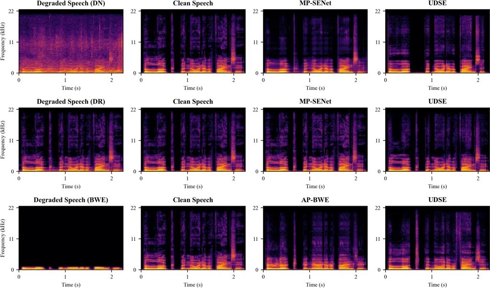
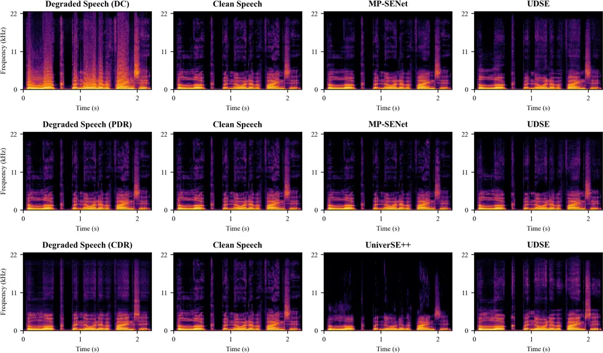
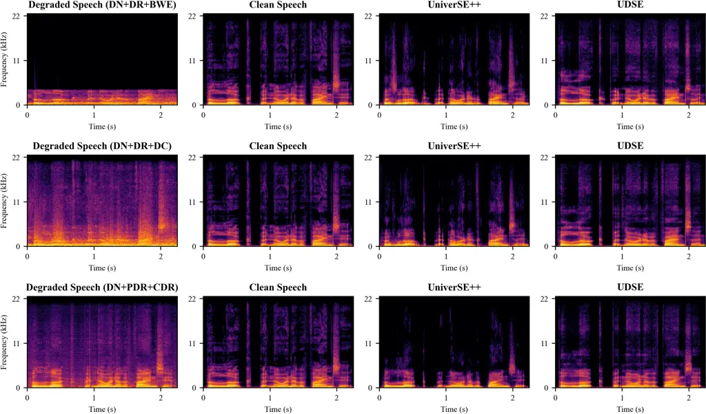

# Universal Discrete-Domain Speech Enhancement

Fei Liu    Yang Ai    Ye-Xin Lu    Rui-Chen Zheng    Hui-Peng Du   
Zhen-Hua Ling ^(†)^(†)thanks: This work was funded by the National
Nature Science Foundation of China under Grant 62301521, the Anhui
Provincial Natural Science Foundation under Grant
2308085QF200.^(†)^(†)thanks: F. Liu, Y. Ai, Y.-X. Lu, R.-C. Zheng, H.-P.
Du and Z.-H. Ling are with the National Engineering Research Center of
Speech and Language Information Processing, University of Science and
Technology of China, Hefei, 230027, China (e-mail:
fliu215@mail.ustc.edu.cn, yangai@ustc.edu.cn, {yxlu0102, zhengruichen,
redmist}@mail.ustc.edu.cn, zhling@ustc.edu.cn).^(†)^(†)thanks:
Corresponding author: Yang Ai.

###### Abstract

In real-world scenarios, speech signals are inevitably corrupted by
various types of interference, making speech enhancement (SE) a critical
task for robust speech processing. However, most existing SE methods
only handle a limited range of distortions, such as additive noise,
reverberation, or band limitation, while the study of SE under multiple
simultaneous distortions remains limited. This gap affects the
generalization and practical usability of SE methods in real-world
environments. To address this gap, this paper proposes a novel Universal
Discrete-domain SE model called UDSE. UDSE primarily works to enhance
speech by predicting clean discrete tokens that are quantized by the
residual vector quantizer (RVQ) of a pre-trained neural speech codec and
are predicted in accordance with the RVQ rules. Specifically, UDSE first
extracts global features from the degraded speech. Guided by these
global features, the clean token prediction for each VQ follows the
rules of RVQ, where the prediction of each VQ relies on the results of
the preceding ones. Finally, the predicted clean tokens from all VQs are
decoded to reconstruct the clean speech waveform. During training, the
UDSE model employs a teacher-forcing strategy, and is optimized with
cross-entropy loss. Experimental results confirm that the proposed UDSE
model can effectively enhance speech degraded by various conventional
and unconventional distortions, e.g., additive noise, reverberation,
band limitation, clipping, phase distortion, and compression distortion,
as well as their combinations. These results demonstrate the superior
universality and practicality of UDSE compared to advanced
regression-based SE methods.

###### Index Terms: 

universal speech enhancement, neural speech codec, residual vector
quantizer, discrete token

## I Introduction

Speech signals inevitably suffer from various types of distortion in
practical applications \[1\]. For instance, in outdoor environments,
speech is frequently corrupted by different types of additive noise. In
transmission scenarios, when speech is transmitted between narrowband
communication devices, only the low-frequency components are typically
preserved, resulting in bandwidth limitation and the introduction of
additional compression noise \[2\]. These interferences significantly
degrade the quality of the speech signal, posing challenges to the
understanding of the target speech. Speech enhancement (SE) aims to
process degraded speech signals using specific techniques to remove
noise, reverberation, and other interfering components, with the goal of
improving speech clarity and intelligibility \[3\]. The enhanced
high-quality speech can better serve downstream tasks such as speech
communication \[4, 5, 6\], hearing aid devices, and automatic speech
recognition (ASR) \[7, 8, 9\]. High-quality, efficient, and
generalizable SE techniques have become key research objectives for
scholars worldwide, carrying significant academic and practical value.

In the past decade, with the development of deep learning, neural
network-based SE models have significantly surpassed traditional
algorithms in terms of enhanced speech quality and have gradually become
the mainstream solutions for SE \[10\]. At present, most neural SE
models operate in the continuous domain, formulating SE as a regression
task in which the neural network directly predicts clean speech
waveforms or continuous spectral features and employs regression-based
loss functions. Regression-based continuous-domain neural SE models
\[11, 12, 13, 14, 15, 16, 17, 18, 19, 20, 21, 22, 23, 24, 25, 26, 27\]
can be roughly categorized into waveform-modeling-based and
spectrum-modeling-based approaches according to their prediction targets
and modeling objectives. Waveform-modeling-based models directly predict
clean speech waveforms from degraded ones using a single neural network
\[11, 12, 13, 14, 15, 16, 17, 18\]. For example, SEGAN \[12\] is an
early representative model that employs a fully convolutional network to
directly predict clean speech waveforms and introduces a discriminator
to enable adversarial training. DEMUCS \[17\] employs a multi-layer
convolutional encoder-decoder architecture with U-Net-style skip
connections, along with a sequence modeling module applied to the
encoder output, to directly predict the clean speech waveform.

However, direct prediction of clean speech waveforms often leads to low
generation efficiency and high computational complexity. In contrast,
spectrum-model-based models \[19, 20, 21, 22, 23, 24, 25, 26, 27\]
predict continuous clean spectral features and focus on enhancing speech
at the frequency level, thereby avoiding direct manipulation of
waveforms. Early spectrum-modeling-based SE models only enhance the
amplitude spectrum while ignoring phase degradation, resulting in
limited speech quality improvement \[21, 22, 23\]. To further improve
phase enhancement, recent studies have proposed directly enhancing the
short-time complex spectrum, thereby enabling the implicit enhancement
of both amplitude and phase components. For instance, CMGAN \[25\] uses
a Conformer-based \[28\] backbone to predict the amplitude spectrum and
the real and imaginary parts of the short-time complex spectrum, which
are then used to reconstruct the enhanced speech. However, these methods
still fall short in achieving explicit and accurate phase enhancement.
To address this, in our previous work, we proposed MP-SENet \[26, 27\],
a model that performs parallel and direct enhancement of both the
amplitude and phase spectra based on anti-wrapping phase prediction
\[29, 30\], demonstrating impressive results.

Recently, the rapid development of neural speech coding technologies has
fostered innovation in the field of SE. A few researchers have begun to
explore the use of acoustic discrete tokens generated by neural speech
codecs for SE, introducing novel discrete-domain approaches that aim to
address classification problems rather than regression problems. In this
framework, a neural network predicts the quantized acoustic discrete
tokens (i.e., classification categories) of clean speech from degraded
speech waveforms or continuous features. The enhanced speech is then
reconstructed by decoding these predicted discrete tokens. The loss
function is defined as the classification loss between the predicted and
the ground truth clean discrete tokens. However, these methods are still
in the early stages of development and face numerous challenges. For
example, most existing work \[31, 32, 33, 34, 35\] relies on the
capabilities of large language models (LLMs) for token predictions,
resulting in excessive model complexity that hinders the practical
deployment of SE systems. Genhancer \[36\] employs a relatively simple
DF-Conformer \[37\] architecture but still relies on auxiliary
components, such as ASR tools and self-supervised speech models, to
extract text and semantic tokens for assisting acoustic token
predictions, resulting in a complex and impractical solution.

In the past one to two years, researchers have started to place greater
emphasis on universal SE, aiming to improve the robustness and
adaptability of SE models across various distortion types and complex
scenarios. For example, the URGENT Challenge \[38\], which was launched
in 2024 and has been held for two consecutive editions, aims to advance
universal SE techniques targeting multiple distortion types under
challenging real-world conditions. However, current regression-based
continuous-domain SE models primarily focus on addressing conventional
distortions, such as additive noise, reverberation, and band limitation
\[39, 40, 41\]. These models often struggle to handle unconventional
distortion types or scenarios involving multiple simultaneous
interferences. This is because many continuous-domain models formulate
the task as a regression problem \[24\], aiming to learn the underlying
noise patterns and to fit an explicit input–output mapping through
neural networks. Such models tend to perform poorly when facing
correlated noise (e.g., compression artifacts), where the noise shares
strong characteristics with the underlying speech signal and cannot be
explicitly modeled or fitted. In contrast, classification-based
discrete-domain approaches theoretically hold promise for achieving
universal SE. These methods formulate the problem as a classification
task that maps the input into a latent discrete space. They leverage the
strong generative capability of generative models to learn data
distributions and then decode waveforms from the classified tokens.
Furthermore, the cross-entropy loss used in the discrete domain
penalizes incorrect predictions more severely, which helps the model
better distinguish between correct and incorrect outputs. This
theoretically makes them more flexible in handling diverse and complex
distortions. Nonetheless, current research on discrete-domain methods
remains largely focused on conventional additive noise, with limited
exploration of their universality across a wider range of distortions.

Motivated by the aforementioned challenges and prior works, we propose a
novel Universal Discrete-domain SE (UDSE) model guided by a pre-trained
neural speech codec with a residual vector quantizer (RVQ). The UDSE
model treats SE as a discrete-domain classification task, focusing on
the prediction of clean acoustic discrete tokens quantized by the neural
speech codec without requiring additional guidance from text or semantic
tokens, and eliminating the need for LLMs. Specifically, starting from a
randomly initialized sequence of discrete tokens, UDSE predicts clean
acoustic discrete tokens for each VQ in sequence according to the rules
of RVQ, where the prediction of each VQ depends on the outputs of the
preceding ones. This process is guided by global features extracted from
the degraded speech as a conditioning mechanism. Finally, the predicted
tokens from all VQs are decoded to reconstruct the enhanced speech
waveform. In our experiments, we simulated six types of distortions,
i.e., noise, reverberation, band-limiting, clipping, phase distortion,
and compression distortion, as well as three mixed distortion scenarios.
Both objective and subjective experimental results confirm that our
proposed UDSE exhibits robust performance across nine distortion
scenarios, consistently restoring high-quality clean speech. This
demonstrates its superior universality and practicality compared to
advanced continuous-domain SE models.

The main contributions of this work are as follows:

- •
  The proposed UDSE model introduces a novel token prediction paradigm
  that aligns with the RVQ scheme and may also provide inspiration for
  other discrete-domain speech generation tasks.
- •
  The proposed UDSE model is capable of handling a wider range of
  distortion types, demonstrating superior universality and promoting
  the practicality of SE methods in complex real-world scenarios.

This paper is organized as follows. In Section II, we briefly review the
advanced neural speech codecs and their applications in discrete-domain
speech generation methods. In Section III, we provide the details of our
proposed UDSE model. In Section IV, we present our experimental results.
Finally, we give conclusions in Section V.

## II Related Work

The proposed UDSE integrates speech coding techniques and operates
within the discrete domain. Therefore, this section primarily reviews
two relevant areas: neural speech coding, as UDSE leverages neural
speech codecs for discrete token representations, and discrete-domain
speech generation methods, since UDSE also falls under the broader
category of discrete-domain speech generation.

### II-A Neural Speech Coding

With the rise of deep learning, end-to-end neural speech codecs now
markedly outperform traditional methods. They learn adaptive, compact
representations that retain essential information and remove redundancy
even at low bitrates, making them the dominant direction in speech
coding. A central component of neural speech codecs is the learnable
quantizer \[42, 43, 44, 45\]. High quantization quality, reflected by
the close alignment between the encoder features and their quantized
counterparts, enables the decoder to generate higher-quality
reconstructed speech. In early work, researchers proposed a vector
quantization (VQ) method that utilizes a learnable codebook, where each
feature vector is assigned to the codeword with the minimum Euclidean
distance, allowing effective representation learning within a
differentiable quantization process \[46\]. Although this alleviates
gradient-continuity issues, it often converges unstably and yields
higher distortion. To address these limitations, RVQ was introduced and
successfully applied in building the neural speech codec SoundStream
\[42\]. RVQ connects multiple VQ modules in a residual manner by
iteratively computing and quantizing the residual errors from previous
quantization steps. Compared to single-VQ methods, RVQ further reduces
overall quantization loss through this residual quantization process.

Building on SoundStream \[42\], which is the predecessor of neural
speech codecs with RVQ, researchers have introduced further improvements
in model architecture and training strategies, leading to the
development of impressive codecs such as EnCodec \[43\] and DAC \[44\].
Recently, we have also proposed improved strategies regarding the coding
targets, motivated by the observation that directly coding speech
waveforms requires multiple downsampling and upsampling steps, leading
to high computational complexity. For example, we introduced APCodec
\[45\], which encodes and decodes the amplitude and phase spectra of
speech, and further proposed MDCTCodec \[47\], which regards the MDCT
spectrum of speech as coding target. By shifting the coding target from
the waveform level to the spectral level, these approaches significantly
reduce computational complexity while maintaining high reconstructed
speech quality.

### II-B Universal Speech Enhancement

In real-world scenarios, distortion is highly diverse, and SE models
designed for a single distortion type have limited effectiveness in
practice. Therefore, exploring universal SE methods is of great
importance. Recently, several generative SE approaches based on
diffusion models have demonstrated strong performance \[48, 49, 50, 51,
52\]. For example, UniverSE++ \[52\] combines score-based diffusion and
adversarial training: the score-based diffusion model uses stochastic
differential equations to gradually transform clean speech into noise,
while in the reverse process, it learns to recover the clean speech.
Adversarial training further helps the model generate more
natural-sounding speech, achieving excellent performance across various
distortion types.

In addition to the abovementioned diffusion-based SE methods, recent
studies have started to focus on applying neural speech codecs to the SE
field, constructing novel discrete-domain SE approaches. This type of
method has the potential to achieve universal SE by equivalently
converting enhancement tasks of any distortion type into a
classification problem over discrete representations. The
discrete-domain SE leverages the discrete tokens produced by neural
speech codecs as a bridge between degraded and clean speech, enabling SE
within a discrete representation space. For example, Genhancer \[36\]
adopts a DF-Conformer as its core architecture and combines discrete
tokens with a self-supervised speech model to perform SE in the discrete
domain. GenSE \[34\] employs a hierarchical modeling framework. It first
uses an LLM to refine the semantic tokens extracted from degraded
speech, producing enhanced semantic representations. These refined
semantic tokens, along with the degraded semantic tokens and acoustic
tokens of the degraded speech, are then jointly processed by another LLM
to generate enhanced acoustic tokens, which are finally decoded to
produce the enhanced speech. However, existing approaches often depend
on large-scale models and complicated processing pipelines, which
undermines their practical applicability, and there has also been
insufficient exploration of their effectiveness for universal SE.

Fig. 1: Overview of the proposed UDSE’s inference process.

## III Proposed Method

### III-A Overview

Suppose a clean speech $`\bm{x}\in\mathbb{R}^{T}`$ is affected by
distortions $`\theta\subset\Theta`$, resulting in the degraded speech
$`\bm{y}\in\mathbb{R}^{T}`$, i.e.,

```math
\bm{y}=\theta(\bm{x}), \tag{1}
```

where $`T`$ is the length of speech waveform. $`\Theta`$ is the set of
all possible distortions, and $`\theta`$ is a subset of $`\Theta`$. The
SE aims to recover the clean speech $`\hat{\bm{x}}\in\mathbb{R}^{T}`$
from $`\bm{y}`$ by constructing enhancement method $`\xi`$ to minimize
the gap between $`\hat{\bm{x}}`$ and $`\bm{x}`$, i.e.,

```math
\bm{\hat{x}}=\xi(\bm{y}). \tag{2}
```

The ideal solution for universal SE is that $`\xi`$ is unique for all
$`\theta\subset\Theta`$. The proposed UDSE model is designed to address
the challenge of universal SE.

The proposed UDSE achieves SE in the discrete domain by solving a
classification problem using a pre-trained neural speech codec with RVQ.
As shown in Figure 1, UDSE consists of multiple modules. The global
feature extraction module extracts global features from $`\bm{y}`$ to
guide the prediction of each VQ token in the token prediction module,
which are finally decoded by the speech decoding module to generate
$`\bm{\hat{x}}`$. As shown in Figure 2, the training phase of UDSE
additionally incorporates a training data generation module, which
provides input data and defines the classification loss.

### III-B Global Feature Extraction Module

The global feature extraction module is designed to extract global
feature $`\bm{G}^{(y)}\in\mathbb{R}^{C\times L}`$ from the degraded
speech $`\bm{y}`$, where $`C`$ and $`L`$ represent the global feature
dimension and the number of frames, respectively. This module consists
of an encoder $`\phi_{E}`$ and an RVQ with $`N`$ VQs
$`\phi_{Q_{1}},\dots,\phi_{Q_{N}}`$ (each with the same codebook size)
of a neural speech codec $`\phi_{Codec}`$, as well as a feature
processor $`\phi_{FP}`$.

Specifically, $`\bm{y}`$ is first passed through $`\phi_{E}`$ to obtain
a downsampled encoded feature by a factor of $`T/L`$, i.e.,

```math
\bm{E}^{(y)}=\phi_{E}(\bm{y}), \tag{3}
```

where $`\bm{E}^{(y)}\in\mathbb{R}^{K\times L}`$ and $`K`$ denotes the
encoded feature dimension. Next, $`\bm{E}^{(y)}`$ is quantized by RVQ,
and the quantization results of each VQ,
$`\bm{\tilde{Q}}^{(y)}_{1},\dots,\bm{\tilde{Q}}^{(y)}_{N}\in\mathbb{R}^{K\times L}`$,
are sequentially outputted. During the quantization process, after the
first VQ quantization, the difference between its input and output was
used as the input to the second VQ. In other words, each subsequent VQ
quantized the residual error of the previous one, forming a
progressively refined quantization process. For $`\phi_{Q_{1}}`$, its
input is the encoded feature $`\bm{E}^{(y)}`$, let
$`\bm{Q}^{(y)}_{1}=\bm{E}^{(y)}`$, i.e.,

```math
\bm{\tilde{Q}}^{(y)}_{1}=\phi_{Q_{1}}(\bm{Q}^{(y)}_{1}), \tag{4}
```

whereas for $`\phi_{Q_{n}}`$, its input is the quantization residual of
$`\phi_{Q_{n-1}}`$, where $`n=2,\dots,N`$, i.e.,

```math
\displaystyle\bm{Q}^{(y)}_{n}=\bm{Q}^{(y)}_{n-1}-\bm{\tilde{Q}}^{(y)}_{n-1}, \tag{5}
```

```math
\displaystyle\bm{\tilde{Q}}^{(y)}_{n}=\phi_{Q_{n}}(\bm{Q}^{(y)}_{n}). \tag{6}
```

Finally, to fully preserve the original information, the quantization
outputs from each VQ along with $`\bm{E}^{(y)}`$ are fed into the
feature processor $`\phi_{FP}`$. Within $`\phi_{FP}`$, the input
features are concatenated, dimension-reduced, and passed through
$`B_{G}`$ Conformer blocks \[28\], with residual connections applied to
each block to link its input and output. This process generates the
global feature $`\bm{G}^{(y)}`$, i.e,

```math
\bm{G}^{(y)}=\phi_{FP}(\bm{E}^{(y)},\bm{\tilde{Q}}^{(y)}_{1},\dots,\bm{\tilde{Q}}^{(y)}_{N}). \tag{7}
```

Fig. 2: Overview of the proposed UDSE’s training process.

### III-C Token Prediction Module

The token prediction module starts from a randomly initialized sequence
of discrete tokens, i.e.,

```math
\bm{d}_{0}=[d_{0,1},\dots,d_{0,L}]^{\top}, \tag{8}
```

and conditioned on the global feature $`\bm{G}^{(y)}`$, sequentially
predicts the clean speech’s token sequences generated through
$`\phi_{Q_{1}},\dots,\phi_{Q_{N}}`$ by quantizing $`\bm{x}`$, i.e.,

```math
\hat{\bm{d}}_{n}^{(x)}=[\hat{d}_{n,1}^{(x)},\dots,\hat{d}_{n,L}^{(x)}]^{\top},n=1,\dots,N, \tag{9}
```

where $`d_{0,*}/\hat{d}_{*,*}^{(x)}\in\{1,2,\dots,M\}`$. The token
number $`L`$ is determined by the number of frames in $`\bm{G}^{(y)}`$
and $`M`$ is the codebook size of a VQ. The token prediction module
consists of $`N`$ token predictors
$`\phi_{TP_{1}},\dots,\phi_{TP_{N}}`$, each of which has a backbone
composed of $`B_{T}`$ Conformer blocks \[28\] with residual connections.

Specifically, for the first token predictor $`\phi_{TP_{1}}`$, its input
is the result $`\bm{\hat{Q}}_{0}^{(x)}\in\mathbb{R}^{K\times L}`$
obtained by looking up a random codebook
$`\mathbb{W}_{0}=\{\bm{w}_{0,m}\in\mathbb{R}^{K}|m=1,\dots,M\}`$ using
the random token $`\bm{d}_{0}`$, and the global feature
$`\bm{G}^{(y)}`$. For subsequent token predictors $`\phi_{TP_{n}}`$
($`n=2,\dots,N`$), following the dependency relationships among VQs in
RVQ, their input is the sum of the results
$`\bm{\hat{Q}}_{1}^{(x)},\dots,\bm{\hat{Q}}_{n-1}^{(x)}`$, which are
obtained by looking up the codebooks
$`\mathbb{W}_{1},\dots,\mathbb{W}_{n-1}`$ of
$`\phi_{Q_{1}},\dots,\phi_{Q_{n-1}}`$ using the previously predicted
tokens $`\bm{\hat{d}}_{1}^{(x)},\dots,\bm{\hat{d}}_{n-1}^{(x)}`$,
respectively, and the global feature $`\bm{G}^{(y)}`$. This also clearly
reflected that our prediction was based on the RVQ principle. Therefore,
the output
$`\bm{\hat{U}}^{(x)}_{n}=[\bm{\hat{u}}^{(x)}_{n,1},\dots,\bm{\hat{u}}^{(x)}_{n,L}]\in\mathbb{R}^{M\times L}`$
of $`\phi_{TP_{n}}`$ ($`n=1,\dots,N`$) can be expressed as

```math
\displaystyle\bm{\hat{U}}^{(x)}_{n}=\begin{cases}\phi_{TP_{n}}(\bm{\hat{Q}}_{n-1}^{(x)},\bm{G}^{(y)}),&n=1,\\
\phi_{TP_{n}}(\sum_{n_{0}=1}^{n-1}\bm{\hat{Q}}_{n_{0}}^{(x)},\bm{G}^{(y)}),&n=2,\dots,N.\end{cases} \tag{10}
```

Next, each frame of $`\bm{\hat{U}}^{(x)}_{n}`$ is passed through a
softmax layer to compute the classification probability distribution.
Taking the $`l`$-th ($`l=1,\dots,L`$) frame as an example, we can get

```math
\bm{\hat{p}}^{(x)}_{n,l}=softmax(\bm{\hat{u}}^{(x)}_{n,l}), \tag{11}
```

where $`\bm{\hat{p}}^{(x)}_{n,l}\in\mathbb{R}^{M}`$. The token is
sampled from $`\bm{\hat{p}}^{(x)}_{n,l}`$ based on the maximum
probability, selecting the most likely category from the $`M`$
categories, i.e.,

```math
\hat{d}^{(x)}_{n,l}=argmax(\bm{\hat{p}}^{(x)}_{n,l}). \tag{12}
```

The above process is executed from $`n=1`$ to $`n=N`$ to achieve the
prediction of discrete tokens
$`\bm{\hat{d}}_{1}^{(x)},\dots,\bm{\hat{d}}_{N}^{(x)}`$.

### III-D Speech Decoding Module

The speech decoding module uses the decoder $`\phi_{D}`$ of the neural
speech codec $`\phi_{Codec}`$ to convert token prediction results
$`\bm{\hat{d}}_{1}^{(x)},\dots,\bm{\hat{d}}_{N}^{(x)}`$ into the
enhanced speech $`\hat{\bm{x}}`$. Specifically,
$`\bm{\hat{d}}_{1}^{(x)},\dots,\bm{\hat{d}}_{N}^{(x)}`$ first retrieve
$`\bm{\hat{Q}}_{1}^{(x)},\dots,\bm{\hat{Q}}_{N}^{(x)}`$ from the
codebooks $`\mathbb{W}_{1},\dots,\mathbb{W}_{N}`$ of
$`\phi_{Q_{1}},\dots,\phi_{Q_{N}}`$, respectively, and then add them
together as the input to $`\phi_{D}`$, which outputs $`\hat{\bm{x}}`$,
i.e.,

```math
\bm{\hat{x}}=\phi_{D}(\sum\nolimits_{n=1}^{N}\bm{\hat{Q}}_{n}^{(x)}).\\
 \tag{13}
```

### III-E Training Strategy

During the training phase, we first train the neural speech codec
$`\phi_{Codec}`$ which includes the encoder $`\phi_{E}`$, quantizers
$`\phi_{Q_{1}},\dots,\phi_{Q_{N}}`$, and decoder $`\phi_{D}`$. As shown
in Figure 2, we then froze all the parameters of the codec
$`\phi_{Codec}`$ and proceeded to train the remaining components, i.e.,
$`\phi_{FP}`$ and $`\phi_{TP_{1}},\dots,\phi_{TP_{N}}`$. Compared to the
inference process, UDSE introduces a training data generation module to
provide training target and jointly train $`\phi_{FP}`$ and
$`\phi_{TP_{1}},\dots,\phi_{TP_{N}}`$ at the training phase. To reduce
the impact of error propagation on model training and enable the model
to learn the correct patterns more quickly, we adopt a teacher forcing
strategy during training. In other words, each token predictor takes the
ground-truth clean token as input rather than the predicted one.

Specifically, in the training data generation module, clean speech
$`\bm{x}`$ is processed through $`\phi_{E}`$ and
$`\phi_{Q_{1}},\dots,\phi_{Q_{N}}`$ to generate ground-truth clean
tokens, i.e.,

```math
\bm{d}_{n}^{(x)}=[d_{n,1}^{(x)},\dots,d_{n,L}^{(x)}]^{\top},n=1,\dots,N, \tag{14}
```

for both training targets and token predictors’ input, where
$`d_{*,*}^{(x)}\in\{1,2,\dots,M\}`$. Then,
$`\bm{d}_{1}^{(x)},\dots,\bm{d}_{N-1}^{(x)}`$ lookup codebooks
$`\mathbb{W}_{1},\dots,\mathbb{W}_{N-1}`$ to obtain quantized results
$`\bm{\tilde{Q}}_{1}^{(x)},\dots,\bm{\tilde{Q}}_{N-1}^{(x)}`$ as inputs
to $`\phi_{TP_{2}},\dots,\phi_{TP_{N}}`$ for teacher forcing training,
and the output is calculated according to Equation (10), i.e.,

```math
\displaystyle\bm{\tilde{U}}^{(x)}_{n}=\begin{cases}\phi_{TP_{n}}(\bm{\hat{Q}}_{n-1}^{(x)},\bm{G}^{(y)}),&n=1,\\
\phi_{TP_{n}}(\sum_{n_{0}=1}^{n-1}\bm{\tilde{Q}}_{n_{0}}^{(x)},\bm{G}^{(y)}),&n=2,\dots,N.\end{cases} \tag{15}
```

Next, each frame of $`\bm{\tilde{U}}^{(x)}_{n}`$ is passed through a
softmax layer to compute the classification probability distribution.
Taking the $`l`$-th ($`l=1,\dots,L`$) frame as an example, according to
Equation (11), we can get

```math
\bm{\tilde{p}}^{(x)}_{n,l}=softmax(\bm{\tilde{u}}^{(x)}_{n,l}), \tag{16}
```

where $`\bm{\tilde{u}}^{(x)}_{n,l}`$ is the $`l`$-th column vector in
$`\bm{\tilde{U}}^{(x)}_{n}`$. Finally, token $`d_{n,l}^{(x)}`$ is
one-hot encoded to generate the target probability distribution
$`\bm{p}_{n,l}^{(x)}`$, and the cross-entropy loss is defined with
respect to $`\bm{\tilde{p}}^{(x)}_{n,l}`$ to minimize the distance
between two distributions, used for model training, i.e.,

```math
\displaystyle\mathcal{L}=\frac{1}{NL}\sum\nolimits_{n=1}^{N}\sum\nolimits_{l=1}^{L}CrossEntropy(\bm{\tilde{p}}^{(x)}_{n,l},\bm{p}^{(x)}_{n,l})
```

```math
\displaystyle=-\frac{1}{NL}\sum\nolimits_{n=1}^{N}\sum\nolimits_{l=1}^{L}\log{\bm{\tilde{p}}^{(x)}_{n,l}(d^{(x)}_{n,l})}, \tag{17}
```

where $`\bm{\tilde{p}}^{(x)}_{n,l}(d^{(x)}_{n,l})`$ denotes the
$`d^{(x)}_{n,l}`$-th element in $`\bm{\tilde{p}}^{(x)}_{n,l}`$.

## IV Experiments

### IV-A Dataset Construction and Task Definition

We constructed clean speech dataset from the VoiceBank corpus \[53\],
with 23,075 utterances from 56 speakers for training set and 824
utterances from 2 unseen speakers for test set. The speech sampling rate
is 44.1 kHz. We constructed task-specific degraded datasets based on a
clean speech dataset, incorporating three conventional distortions
(i.e., noise, reverberation, and band-limiting), three unconventional
distortions (i.e., clipping, phase distortion, and compression
distortion), and three mixed distortions. Each task is defined as
follows.

1\) Denoising (DN): This task aims to enhance the degraded speech caused
by additive noise. We constructed the noisy dataset by adding noise from
the DEMAND dataset \[54\] to the clean speech. For the training set, we
used 5 types of noise, with the signal-to-noise ratio (SNR) ranging from
0 to 15 dB, in 5 dB intervals. For the test set, we used 5 types of
unseen noise, with the SNR ranging from 2.5 to 17.5 dB in 5 dB
intervals.

2\) Dereverberation (DR): This task aims to enhance the degraded speech
caused by reverberation. We adopted the room impulse response (RIR)
dataset from the DNS Challenge \[55\], which included 248 real RIRs and
approximately 60,000 simulated RIRs. We constructed the reverberant
dataset by randomly selecting RIRs and convolving RIRs with clean
speech. The RIRs of the test set were unseen in the training set.

3\) Bandwidth Extension (BWE): This task aims to enhance the degraded
speech caused by band-limiting. We constructed the band-limited dataset
by downsampling the clean wideband speech to a 2 kHz sampling rate for
both training and testing.

4\) Declipping (DC): This task aims to enhance the degraded speech
caused by clipping. We constructed the clipping dataset by restricting
the amplitude of the original clean speech waveform to the range between
0.1 and 0.9 of their maximum values.

5\) Phase Distortion Restoration (PDR): This task aims to enhance the
degraded speech caused by inaccurate phase. We constructed the phase
distortion dataset by replacing phase spectra of clean speech with the
ones predicted by an NSPP¹¹ 1
[https://github.com/YangAi520/NSPP](https://github.com/YangAi520/NSPP).
model \[29\].

6\) Compression Distortion Restoration (CDR): This task aims to enhance
the degraded speech caused by compression from a speech codec. We
constructed the compression distortion dataset by compressing clean
speech using an APCodec²² 2
[https://github.com/YangAi520/APCodec](https://github.com/YangAi520/APCodec).
\[45\] with a single VQ.

7. Mixed Distortion Restoration: We combined the six types of
   distortions mentioned above to create three tasks, represented as
   DN+DR+BWE, which stands for denoising + dereverberation + bandwidth
   extension (band-limited speech sampling rate is 8 kHz), DN+DR+DC, which
   stands for denoising + dereverberation + declipping, and DN+PDR+CDR,
   which stands for denoising + phase distortion restoration + compression
   distortion restoration. We did not downsample the speech to 2 kHz in the
   DN+DR+BWE task, as in the standalone BWE task, because further adding
   noise and reverberation to 2 kHz speech would render the speech nearly
   unintelligible and the SE solution unrealistically ill-posed.

|         |     |     |     |     |     |              |                   |                    |      |      |                   |
| ------- | --- | --- | --- | --- | --- | ------------ | ----------------- | ------------------ | ---- | ---- | ----------------- |
| SE Task |     |     |     |     |     | Model        | Objective Metrics |                    |      |      |                   |
| DN      | DR  | BWE | DC  | PDR | CDR |              | NISQA$`\uparrow`$ | DNSMOS$`\uparrow`$ |      |      | UTMOS$`\uparrow`$ |
|         |     |     |     |     |     |              |                   | SIG                | BAK  | OVRL |                   |
|         |     |     |     |     |     | Clean Speech | 4.62              | 3.51               | 4.04 | 3.22 | 4.10              |
| ✓       | ✗   | ✗   | ✗   | ✗   | ✗   | DEMUCS       | 3.45              | 3.37               | 3.96 | 3.07 | 3.63              |
|         |     |     |     |     |     | CMGAN        | 4.51              | 3.51               | 4.03 | 3.21 | 3.99              |
|         |     |     |     |     |     | MP-SENet     | 4.56              | 3.51               | 4.04 | 3.21 | 4.01              |
|         |     |     |     |     |     | UniverSE++   | 4.44              | 3.46               | 4.03 | 3.17 | 3.88              |
|         |     |     |     |     |     | Genhancer    | 3.97              | 3.27               | 3.94 | 2.96 | 3.43              |
|         |     |     |     |     |     | UDSE         | 4.60              | 3.49               | 3.99 | 3.18 | 3.88              |
| ✗       | ✓   | ✗   | ✗   | ✗   | ✗   | DEMUCS       | 1.43              | 2.69               | 3.91 | 2.44 | 1.30              |
|         |     |     |     |     |     | CMGAN        | 1.13              | 2.62               | 3.99 | 2.28 | 1.55              |
|         |     |     |     |     |     | MP-SENet     | 4.34              | 3.50               | 4.06 | 3.21 | 3.65              |
|         |     |     |     |     |     | UniverSE++   | 3.90              | 3.02               | 3.97 | 2.74 | 2.59              |
|         |     |     |     |     |     | Genhancer    | 2.05              | 2.01               | 3.46 | 1.83 | 1.68              |
|         |     |     |     |     |     | UDSE         | 4.60              | 3.50               | 4.01 | 3.19 | 3.82              |
| ✗       | ✗   | ✓   | ✗   | ✗   | ✗   | DEMUCS       | 1.91              | 3.30               | 3.97 | 2.99 | 1.80              |
|         |     |     |     |     |     | CMGAN        | 2.57              | 3.35               | 3.98 | 3.03 | 2.94              |
|         |     |     |     |     |     | MP-SENet     | 1.59              | 3.26               | 3.95 | 2.94 | 2.38              |
|         |     |     |     |     |     | AP-BWE       | 4.04              | 3.45               | 4.01 | 3.15 | 3.17              |
|         |     |     |     |     |     | UniverSE++   | 3.79              | 3.39               | 3.99 | 3.08 | 3.50              |
|         |     |     |     |     |     | Genhancer    | 3.44              | 3.25               | 3.93 | 2.94 | 3.01              |
|         |     |     |     |     |     | UDSE         | 4.48              | 3.49               | 4.03 | 3.19 | 3.87              |
| ✗       | ✗   | ✗   | ✓   | ✗   | ✗   | DEMUCS       | 3.11              | 3.49               | 4.03 | 3.19 | 3.79              |
|         |     |     |     |     |     | CMGAN        | 4.57              | 3.49               | 4.03 | 3.20 | 4.04              |
|         |     |     |     |     |     | MP-SENet     | 4.53              | 3.51               | 4.04 | 3.22 | 4.08              |
|         |     |     |     |     |     | UniverSE++   | 3.98              | 3.48               | 4.05 | 3.19 | 3.94              |
|         |     |     |     |     |     | Genhancer    | 3.81              | 3.26               | 3.96 | 2.96 | 3.14              |
|         |     |     |     |     |     | UDSE         | 4.49              | 3.50               | 4.03 | 3.21 | 4.03              |
| ✗       | ✗   | ✗   | ✗   | ✓   | ✗   | DEMUCS       | 2.03              | 3.04               | 3.98 | 2.77 | 2.55              |
|         |     |     |     |     |     | CMGAN        | 4.43              | 3.32               | 3.98 | 3.02 | 3.74              |
|         |     |     |     |     |     | MP-SENet     | 4.64              | 3.48               | 4.04 | 3.19 | 4.04              |
|         |     |     |     |     |     | UniverSE++   | 4.59              | 3.44               | 4.03 | 3.15 | 3.95              |
|         |     |     |     |     |     | Genhancer    | 4.15              | 3.27               | 3.95 | 2.97 | 3.44              |
|         |     |     |     |     |     | UDSE         | 4.64              | 3.52               | 4.03 | 3.22 | 4.02              |
| ✗       | ✗   | ✗   | ✗   | ✗   | ✓   | DEMUCS       | 1.99              | 3.14               | 3.99 | 2.85 | 2.28              |
|         |     |     |     |     |     | CMGAN        | 3.26              | 3.28               | 3.99 | 2.97 | 3.25              |
|         |     |     |     |     |     | MP-SENet     | 2.47              | 3.36               | 4.02 | 3.06 | 3.14              |
|         |     |     |     |     |     | UniverSE++   | 4.35              | 3.35               | 4.03 | 3.06 | 3.60              |
|         |     |     |     |     |     | Genhancer    | 4.31              | 3.22               | 3.96 | 2.93 | 3.19              |
|         |     |     |     |     |     | UDSE         | 4.67              | 3.49               | 4.03 | 3.20 | 3.90              |
| ✓       | ✓   | ✓   | ✗   | ✗   | ✗   | DEMUCS       | 0.77              | 1.83               | 3.54 | 1.51 | 1.33              |
|         |     |     |     |     |     | CMGAN        | 0.85              | 2.30               | 3.71 | 1.94 | 1.38              |
|         |     |     |     |     |     | MP-SENet     | 2.33              | 2.79               | 3.80 | 2.46 | 2.20              |
|         |     |     |     |     |     | UniverSE++   | 3.89              | 2.95               | 3.97 | 2.68 | 2.51              |
|         |     |     |     |     |     | Genhancer    | 2.05              | 2.13               | 3.62 | 1.93 | 1.65              |
|         |     |     |     |     |     | UDSE         | 4.37              | 3.46               | 4.01 | 3.16 | 3.60              |
| ✓       | ✓   | ✗   | ✓   | ✗   | ✗   | DEMUCS       | 0.78              | 1.86               | 3.51 | 1.51 | 1.34              |
|         |     |     |     |     |     | CMGAN        | 1.04              | 2.05               | 3.39 | 1.73 | 1.34              |
|         |     |     |     |     |     | MP-SENet     | 1.54              | 3.11               | 3.94 | 2.79 | 1.93              |
|         |     |     |     |     |     | UniverSE++   | 3.74              | 2.92               | 3.97 | 2.65 | 2.36              |
|         |     |     |     |     |     | Genhancer    | 2.00              | 2.11               | 3.62 | 1.92 | 1.62              |
|         |     |     |     |     |     | UDSE         | 4.25              | 3.43               | 4.01 | 3.13 | 3.47              |
| ✓       | ✗   | ✗   | ✗   | ✓   | ✓   | DEMUCS       | 1.92              | 2.92               | 4.05 | 2.68 | 1.65              |
|         |     |     |     |     |     | CMGAN        | 2.93              | 3.29               | 3.85 | 2.93 | 2.96              |
|         |     |     |     |     |     | MP-SENet     | 2.26              | 3.38               | 4.05 | 3.08 | 2.62              |
|         |     |     |     |     |     | UniverSE++   | 4.41              | 3.33               | 4.06 | 3.05 | 3.52              |
|         |     |     |     |     |     | Genhancer    | 3.87              | 3.13               | 4.04 | 2.89 | 2.87              |
|         |     |     |     |     |     | UDSE         | 4.57              | 3.56               | 4.09 | 3.29 | 3.96              |

TABLE I: Objective evaluation results among UDSE and baselines for
different SE tasks.

### IV-B Model Details

The UDSE³³ 3 Codes and speech samples are available at:
[https://fliu215.github.io/UDSE/](https://fliu215.github.io/UDSE/).
utilized a DAC⁴⁴ 4
[https://github.com/descriptinc/descript-audio-codec](https://github.com/descriptinc/descript-audio-codec).
\[44\] as $`\phi_{Codec}`$, which included 9 VQs (i.e., $`N=9`$), with
both the codebook size and the code vector dimension set to 1024 (i.e.,
$`K=M=1024`$). The feature processor $`\phi_{FP}`$ used 8 Conformer
blocks (i.e., $`B_{G}=8`$), while each token predictor
$`\phi_{TP_{1}},\dots,\phi_{TP_{N}}`$ used 4 Conformer blocks (i.e.,
$`B_{T}=4`$). The number of channels and attention heads in each block
were 512 and 8, respectively (i.e., $`C=512`$). We trained the UDSE
using an AdamW optimizer on a single NVIDIA A800 GPU, with
$`\beta_{1}=0.9,\beta_{2}=0.95,`$ and a weight decay of 0.01 for 100
epochs. The initial learning rate was set to 0.0005, with a cosine
annealing strategy for decay and a warm-up training scheduler for the
first 4k steps.

We compared UDSE with several advanced continuous-domain SE models,
including waveform-regression-based DEMUCS⁵⁵ 5
[https://github.com/facebookresearch/denoiser](https://github.com/facebookresearch/denoiser).
\[17\], spectrum-regression-based CMGAN⁶⁶ 6
[https://github.com/ruizhecao96/CMGAN](https://github.com/ruizhecao96/CMGAN).
\[25\] and MP-SENet⁷⁷ 7
[https://github.com/yxlu-0102/MP-SENet](https://github.com/yxlu-0102/MP-SENet).
\[26, 27\], and diffusion-based UniverSE++⁸⁸ 8
[https://github.com/line/open-universe](https://github.com/line/open-universe).
\[52\]. In addition, we have also reproduced the Genhancer \[36\] as a
discrete-domain baseline. For task BWE, we also compared UDSE with the
advanced continuous-domain AP-BWE⁹⁹ 9
[https://github.com/yxlu-0102/AP-BWE](https://github.com/yxlu-0102/AP-BWE).
\[56\], specifically designed for speech bandwidth extension. Except for
Genhancer, we reproduced all the models using the official codes they
provided, whereas for Genhancer, we had to reproduce it manually due to
the lack of open-source code. All models were conducted on our 44.1 kHz
dataset.

| SE Task |     |     |     |     |     | UDSE  | Model B | N/P   | $`p`$           |
| ------- | --- | --- | --- | --- | --- | ----- | ------- | ----- | --------------- |
| DN      | DR  | BWE | DC  | PDR | CDR |       |         |       |                 |
| ✓       | ✗   | ✗   | ✗   | ✗   | ✗   | 41.96 | 41.25   | 16.79 | 0.85            |
| ✗       | ✓   | ✗   | ✗   | ✗   | ✗   | 56.92 | 36.35   | 6.73  | $`\bm{<}`$ 0.01 |
| ✗       | ✗   | ✓   | ✗   | ✗   | ✗   | 54.60 | 38.60   | 6.80  | $`\bm{<}`$ 0.01 |
| ✗       | ✗   | ✗   | ✓   | ✗   | ✗   | 26.35 | 32.50   | 41.15 | 0.07            |
| ✗       | ✗   | ✗   | ✗   | ✓   | ✗   | 46.83 | 37.01   | 16.16 | $`\bm{<}`$ 0.01 |
| ✗       | ✗   | ✗   | ✗   | ✗   | ✓   | 79.93 | 12.65   | 7.42  | $`\bm{<}`$ 0.01 |
| ✓       | ✓   | ✓   | ✗   | ✗   | ✗   | 83.52 | 6.11    | 10.37 | $`\bm{<}`$ 0.01 |
| ✓       | ✓   | ✗   | ✓   | ✗   | ✗   | 86.55 | 8.28    | 5.17  | $`\bm{<}`$ 0.01 |
| ✓       | ✗   | ✗   | ✗   | ✓   | ✓   | 66.67 | 24.50   | 8.83  | $`\bm{<}`$ 0.01 |

TABLE II: Average preference scores (%) of ABX subjective tests on
speech quality between UDSE and a baseline (i.e., model B) on different
SE tasks, where N/P stands for “no preference” and $`p`$ denotes the
$`p`$-value of a $`t`$-test between two models. For tasks DN, DR, DC and
PDR, “model B” is MP-SENet, and for tasks CDR, DN+DR+BWE, DN+DR+DC and
DN+PDR+CDR, “model B” is UniverSE++, while for task BWE, “model B” is
AP-BWE.



Fig. 3: Spectrogram comparison among degraded speech, clean speech, and
speeches enhanced by the baseline with the best objective scores and
UDSE for conventional DN, DR and BWE tasks, respectively.

### IV-C Evaluation Metrics

For objective evaluation, since UDSE predicts the distribution of
discrete tokens corresponding to clean speech (i.e., it formulates SE as
a classification task rather than directly generating the clean speech
as in regression-based models), traditional intrusive indicators such as
perceptual evaluation of speech quality (PESQ) are not well-suited for
evaluating our model, as suggested in \[34\]. Therefore, we used three
non-intrusive metrics commonly adopted in SE field, including NISQA
\[57\], DNSMOS \[58\] and UTMOS \[59\], to assess overall speech
quality. NISQA is a full-band metric that can evaluate the overall
quality of 44.1 kHz speech, while DNSMOS and UTMOS are both designed for
16 kHz, focus more on the low-frequency quality. All three metrics use
the same scoring scale as traditional mean opinion score (MOS), ranging
from 1 to 5. Both NISQA and UTMOS directly reflect the perceived
acceptability and naturalness of speech. DNSMOS, on the other hand,
follows the ITU-T P.835 subjective test framework and provides
multi-dimensional scores: SIG represents speech quality and primarily
reflects overall signal distortion; BAK measures the perceptual
intensity of background noise, with higher scores indicating better
noise suppression; and OVRL provides an overall rating, indicating the
general naturalness of the speech.

For the subjective evaluation, we conducted ABX preference tests on the
Amazon Mechanical Turk¹⁰¹⁰ 10
[https://www.mturk.com/](https://www.mturk.com/). platform to compare
the differences between UDSE and the baseline model with the best
objective performance. In each ABX test, 20 speech samples enhanced by
both compared models were randomly selected from the test set. These
samples were evaluated by at least 30 native English-speaking listeners.
The listeners were asked to judge which of the two speech samples in
each pair had better speech quality or whether there was no preference.
In addition to calculating the average preference score, we also used
the $`p`$-value from a $`t`$-test to assess the statistical significance
of the differences between the two models.



Fig. 4: Spectrogram comparison among degraded speech, clean speech, and
speeches enhanced by the baseline with the best objective scores and
UDSE for unconventional DC, PDR and CDR tasks, respectively.

### IV-D Preliminary Experimental Results

The objective and subjective evaluation results are shown in Tables I
and II, respectively. To provide an intuitive visualization of the
enhancement performance, we also drew the spectrograms of degraded
speech, clean speech, and speech enhanced by both the baseline model
with the best objective scores and UDSE across three task types (i.e.,
conventional, unconventional and mixed), as shown in Figures 3, 4, and
5, respectively.

#### IV-D1 Experimental Results for Conventional Distortions

For the classic speech denoising task DN, our proposed UDSE achieved
objective results comparable to the advanced continuous-domain baseline
models, as shown in Table I. It can be seen that UDSE outperformed all
baselines in NISQA scores and was similar to MP-SENet and CMGAN in the
three indicators of DNSMOS. However, the UTMOS score of UDSE was
slightly lower than that of MP-SENet and CMGAN. This may be attributed
to the fact that UTMOS can only evaluate the performance of speech in
the low-frequency band (0$`\sim`$8 kHz). In conjunction with the
fullband NISQA results, it can be inferred that the proposed UDSE
possesses a stronger ability to reconstruct the high-frequency
components of speech. This is also verified in the first row of
spectrograms in Figure 3, where it is clearly observed that MP-SENet
struggles to recover high-frequency information (8 kHz$`\sim`$22.05 kHz)
under low-SNR noisy conditions, while UDSE successfully preserves these
components. Considering subjective perception, the ABX preference test
results presented in Table II indicate no significant perceptual
difference between the noisy speech enhanced by UDSE and that enhanced
by MP-SENet ($`p=0.85`$). These findings suggest that the proposed
discrete-domain UDSE model can perform on par with continuous-domain
models for DN task.

For the classic dereverberation task DR, our proposed UDSE significantly
outperformed the advanced continuous-domain baseline models in most
objective metrics, as shown in Table I. Specifically, UDSE significantly
outperformed all baselines in both NISQA and UTMOS scores, and achieved
a comparable DNSMOS score to MP-SENet, effectively suppressing speech
distortion caused by reverberation. It was evident that although CMGAN
performed well in denoising tasks, it lagged behind in all objective
metrics when dealing with dereverberation. In contrast, the proposed
UDSE consistently achieved robust performance across both distortion
types. The second row of Figure 3 shows the spectrograms of reverberant
speech enhanced by MP-SENet and UDSE under low reverberation time
conditions. Interestingly, the spectrogram of the speech enhanced by
MP-SENet is more similar to that of the clean reference speech. This may
be attributed to the fact that regression-based continuous-domain SE
models directly model the speech waveform or features. In particular,
MP-SENet explicitly predicts the amplitude spectra, which makes the
enhanced speech more “similar” to the reference speech, especially when
the distortion is not severe (e.g., under high SNR or low reverberation
time conditions). In contrast, classification-based discrete-domain
models indirectly predict discrete tokens of speech and then decode them
into speech waveforms, which may result in enhanced speech that is “not
similar” to the reference speech. This is also why intrusive indicators
that rely on reference speech are not suitable for evaluating
discrete-domain models, as stated in Section IV-C. At this point,
subjective evaluation becomes the gold standard for assessing speech
quality. As shown in the results in Table II, this lack of “similarity”
does not negatively impact perceptual quality — reverberant speech
enhanced by UDSE is even significantly better than that enhanced by
MP-SENet ($`p<0.01`$).

For the bandwidth extension task BWE, as suggested in Table I, DEMUCS,
CMGAN, MP-SENet and Genhancer, which were specifically designed for
denoising and reverberation, all failed. The more general-purpose
UniverSE++ also performed poorly. Although the objective results of
AP-BWE, which was specifically designed for task BWE, outperformed the
five models mentioned above, there is still a significant gap compared
to our proposed UDSE. Subjectively, UDSE also significantly outperformed
AP-BWE ($`p<0.01`$) as shown in Table II. According to listener
feedback, the speech extended by AP-BWE contained noticeable
pronunciation errors, whereas UDSE did not. The last row of Figure 3
intuitively shows the results of bandwidth extension. It is evident that
UDSE achieves a richer and more accurate reconstruction of
high-frequency speech details compared to AP-BWE. For example, within
the time range of 1 to 1.2 seconds and the frequency band of 1 kHz to 6
kHz, the harmonic details of the speech extended by UDSE are more
similar to those of the clean speech. This indicates that UDSE has
potential in speech bandwidth extension for extremely narrow bands
(e.g., from 2 kHz to 44.1 kHz, representing an expansion of over 22
times in bandwidth).



Fig. 5: Spectrogram comparison among degraded speech, clean speech, and
speeches enhanced by the baseline with the best objective scores and
UDSE for mixed DN+DR+BWE, DN+DR+DC and DN+PDR+CDR tasks, respectively.

#### IV-D2 Experimental Results for Unconventional Distortions

For the declipping task DC, the results in Table I showed that for this
type of distortion, both our proposed UDSE and the baseline models
achieved satisfactory performance, with only minor differences in the
scores across various objective metrics. As demonstrated in the first
row of Figure 4, the observation is consistent with the DR task: UDSE
produces declipped speech that is slightly less similar to the reference
than MP-SENet. Nevertheless, subjective evaluation results presented in
Table II reveal no significant perceptual difference between the two
approaches ($`p=0.07`$). This indicates that clipping is a relatively
simple type of distortion, which can be effectively addressed by most SE
approaches.

For the phase distortion restoration task PDR, UDSE achieved objective
results comparable to those of MP-SENet, while outperforming DEMUCS,
CMGAN, UniverSE++ and Genhancer, as shown in Table I. MP-SENet, by
introducing explicit phase prediction, was more suitable for phase
distortion recovery compared to DEMUCS, CMGAN, UniverSE++ and Genhancer.
As shown in the second row of Figure 4, speech affected by phase
distortion exhibited prominent horizontal stripes — perceptually
experienced as an irritating buzzing sound. In contrast, the spectrogram
of the UDSE-enhanced speech showed no such patterns, indicating that
UDSE effectively eliminated interference caused by phase distortion.
Since phase restoration effects are difficult to visualize clearly in
spectrograms, subjective evaluation is necessary to provide additional
evidence. As shown in the subjective evaluation results in Table II,
UDSE-enhanced speech was generally preferred by listeners ($`p<0.01`$).

For the compression distortion restoration task CDR, our proposed UDSE
significantly outperformed all baseline models in both objective and
subjective aspects ($`p<0.01`$), as shown in Tables I and II.
Interestingly, we found that these baseline models even had a negative
effect on the enhancement of compressed speech. As clearly shown in the
last row of Figure 4, UDSE effectively restored spectral details, with
the enhanced harmonics closely resembling those of the clean speech.
Although the speech enhanced by UniverSE++ showed decent restoration of
the low-frequency harmonics, it lost many spectral details in the
high-frequency regions, which significantly degraded the listening
experience. These results suggest that baseline SE models are less
effective in handling codec-induced compression distortions, likely due
to the strong correlation between compressed and clean speech signals.
In comparison, the proposed UDSE tackles this challenge from a
discrete-domain perspective.

#### IV-D3 Experimental Results for Mixed Distortions

In the three mixed distortion restoration tasks, our proposed UDSE had a
significant advantage over all baseline models in both objective and
subjective aspects ($`p<0.01`$), as shown in Tables I and II. For task
DN+DR+BWE, UDSE outperformed UniverSE++ by more than 1-point in the
UTMOS score. In addition, for task DN+DR+DC, UDSE achieved a 0.4-point
higher OVRL score in DNSMOS and a 1.1-point higher UTMOS score compared
to UniverSE++. Consistently, for task DN+PDR+CDR, UDSE again exceeded
UniverSE++ by over 0.4-point in the UTMOS metric. Subjective evaluations
showed that, in all three mixed-distortion tasks, the number of
participants preferring UDSE-enhanced speech was at least double that of
those favoring UniverSE++ — highlighting UDSE’s superior performance in
managing complex distortions.

| UDSE  | UDSE w/ Transformer | UDSE w/ Parallel Mode | UDSE w/o Global Condition | UDSE w/ MDCTCodec | N/P  | $`p`$           |
| ----- | ------------------- | --------------------- | ------------------------- | ----------------- | ---- | --------------- |
| 73.00 | 25.33               | \-                    | \-                        | \-                | 1.67 | $`\bm{<}`$ 0.01 |
| 74.83 | \-                  | 24.31                 | \-                        | \-                | 0.86 | $`\bm{<}`$ 0.01 |
| 58.00 | \-                  | \-                    | 40.00                     | \-                | 2.00 | $`\bm{<}`$ 0.01 |
| 47.87 | \-                  | \-                    | \-                        | 49.50             | 2.63 | 0.64            |

TABLE III: Average preference scores (%) of ABX subjective tests on
speech quality between UDSE and its variants on DN+DR+BWE task, where
N/P stands for “no preference” and $`p`$ denotes the $`p`$-value of a
$`t`$-test between two models.

The spectrograms shown in Figure 5 further provide a clear visual
illustration of the effectiveness of the proposed UDSE in enhancing
speech with mixed distortions. We can observe that for the DN+DR+BWE
task (the first row in Figure 5), UDSE recovered the high-frequency
components much more accurately, bringing the result closer to the
ground-truth clean speech, while UniverSE++ struggled with recovering
the high-frequency part. For the DN+DR+DC task (the second row in Figure
5), the speech enhanced by UniverSE++ lost a lot of detail in the
high-frequency range and had a noticeable fundamental frequency error
around 1 second, resulting in a poor listening experience. For the
DN+PDR+CDR task (the last row in Figure 5), the spectrogram of the
speech recovered by UDSE retained more details, while UniverSE++
produced significant high-frequency loss and poor spectral detail
recovery, significantly impacting the listening experience. All the
above experimental results demonstrate that the proposed UDSE can
effectively mitigate various types of distortion in degraded speech,
making it more suitable for real-world applications.

In summary, our proposed UDSE can not only handle various single
distortions but also effectively address mixed distortions. This
confirms the universality of UDSE and the advantages of using
discrete-domain classification solutions for SE, compared to
regression-based continuous-domain models.

### IV-E Analysis and Discussion

To further investigate the contribution of each component in the
proposed UDSE model, we conducted a series of analytical experiments.
For simplicity, the experiments were conducted under a commonly
encountered mixed distortion condition, i.e., DN+DR+BWE task. To
maintain a concise evaluation process, only subjective preference
listening tests were carried out to assess the perceptual differences
between UDSE and its variants. The results of the subjective evaluation
are presented in Table III.

#### IV-E1 Backbone Network Selection Analysis

In the UDSE framework, we utilized the Conformer block as the core
backbone network to support both feature processing and token
predictions. To investigate the impact of different backbone networks on
UDSE’s performance, we replaced the Conformer blocks with Transformer
blocks (denoted as UDSE w/ Transformer), which also incorporated
multi-head self-attention. The results in Table III clearly indicate
that UDSE with a Transformer backbone performed significantly worse than
the original UDSE ($`p<0.01`$). This may be attributed to the fact that
the Transformer only models global dependencies, whereas the Conformer
enhances representational capacity by integrating convolutional layers
for local feature extraction with self-attention mechanisms for
capturing global context. Therefore, the Conformer, which captures both
local and global features, is likely more suitable for our token
prediction task than the Transformer. This advantage in representational
capacity is the primary reason we selected it as the backbone network in
UDSE.

#### IV-E2 Token Prediction Mode Analysis

In the UDSE framework, we proposed a novel token prediction mode based
on the RVQ quantization rule, where clean tokens quantized by each VQ
are predicted sequentially, with each prediction conditioned on all
preceding prediction results. To evaluate the effectiveness of this
token prediction mode, we conducted an ablation study in which the
prediction of the current VQ’s clean token was performed without relying
on the outputs of previously predicted tokens. In this case, the clean
tokens quantized by VQs were predicted in parallel by token predictors
$`\phi_{TP_{1}},\dots,\phi_{TP_{N}}`$, with no interconnections among
them (denoted as UDSE w/ Parallel Mode). The results in Table III show
that UDSE significantly outperformed UDSE w/ Parallel Mode ($`p<0.01`$).
This performance gap indicates that the RVQ-based sequential prediction
mode used in UDSE is beneficial, as it effectively leverages the
correlations among different VQ stages. The parallel prediction mode, by
ignoring these dependencies, leads to a notable degradation in
enhancement performance. These experimental findings validate the
effectiveness of the proposed sequential token prediction mode based on
the RVQ rule.

#### IV-E3 Global Condition Analysis

In the UDSE framework, to reduce the difficulty of token prediction,
global features extracted by a dedicated module are used as global
conditioning for the prediction of each VQ. Given the characteristics of
RVQ, the information provided to the first token predictor is naturally
propagated to subsequent predictors. This raises an important question:
can the global features be effectively treated as local, such that they
only need to be provided to the first token predictor? To verify this,
we constructed a variant of UDSE (denoted as UDSE w/o Global Condition)
in which the global features are provided only to the first token
predictor $`\phi_{TP_{1}}`$ (i.e., removing $`\bm{G}^{(y)}`$ from the
second line of Equation (10)). The results in Table III show that
removing the global conditioning leads to a significant decline
($`p<0.01`$) in the subjective quality of the enhanced speech produced
by UDSE. This indicates that, although the first token predictor is
conditioned on features extracted from the degraded speech, these
features become increasingly diluted as they propagate through the
network, ultimately reducing the effectiveness of subsequent token
predictors. Providing global conditioning features explicitly to each
token predictor is essential for preserving their prediction
capabilities, and plays a critical role in ensuring the overall
performance of UDSE.

#### IV-E4 Codec Generalization Analysis

In the UDSE framework, the neural speech codec is a crucial component,
serving multiple roles including extracting global feature condition,
providing clean token targets for training, and decoding the final
speech output. In our experiments, we adopted DAC \[44\] as the neural
speech codec. The coding results of clean speech from DAC serve as the
upper bound for the enhancement quality achievable by UDSE.
Theoretically, UDSE can also work with other RVQ-based neural speech
codecs that offer comparable coding quality. To verify the
generalization ability of UDSE across different neural speech codecs, we
replaced the DAC with a more lightweight RVQ-based MDCTCodec \[47\] in
UDSE (denoted by UDSE w/ MDCTCodec). The results in Table III showed no
significant difference between UDSE and UDSE w/ MDCTCodec ($`p=0.64`$),
indicating that replacing DAC with MDCTCodec did not obviously affect
the performance of UDSE. This confirms that UDSE exhibits strong codec
generalization to different RVQ-based codecs, laying a solid foundation
for future efforts to reduce the complexity of UDSE by exploring more
lightweight codec alternatives.

## V Conclusion

This paper proposed UDSE, a novel classification-based discrete-domain
general universal SE model. Unlike conventional regression-based
continuous-domain SE models that predict continuous features/waveforms,
UDSE formulates the SE task as a classification problem over clean
acoustic tokens quantized by a neural speech codec. The UDSE advances
discrete-domain SE by introducing a self-contained framework that does
not require any textual cues, semantic labels, or support from LLMs. The
UDSE begins with a randomly initialized token sequence, extracts global
feature conditions from degraded speech, and sequentially predicts clean
tokens quantized by each VQ of a neural speech codec following the RVQ
rule, where each prediction depends on the previous ones. The final
clean speech is reconstructed by decoding all predicted tokens using the
decoder of the neural speech codec. During training, UDSE is optimized
using teacher forcing strategy with a cross-entropy classification loss.
Both objective and subjective experimental results demonstrate that the
proposed UDSE can effectively enhance speech affected by various single
and combined distortions, confirming its strong universality and
practical applicability. In future work, we will further optimize the
model architecture and design to reduce computational complexity and
latency, while continuing to explore enhancement performance under a
wider range of distortion scenarios. In addition, we will explore
applying the UDSE token prediction framework to other speech tasks, such
as zero-shot TTS with LLMs, to extend its applicability.

## References

- \[1\] J. Benesty, J. Chen, and Y. Huang (2008) Microphone array signal
  processing. Vol. 1, Springer Science & Business Media. Cited by: §I.
- \[2\] R. G. ITU-T (2001) 712. transmission performance
  characteristics of pulse code modulation channels. International
  Telecommunication Union, Geneva, Switzerland. Cited by: §I.
- \[3\] P. C. Loizou (2007) Speech enhancement: theory and practice. CRC
  press. Cited by: §I.
- \[4\] L. R. Rabiner (1995) The impact of voice processing on modern
  telecommunications. Speech Communication 17, pp. 217–226. Cited by:
  §I.
- \[5\] A. E. Mahdi and D. Picovici (2009) Advances in voice quality
  measurement in modern telecommunications. Digital Signal Processing
  19, pp. 79–103. Cited by: §I.
- \[6\] A. N. Ince (1992) Overview of voice communications and speech
  processing. Digital Speech Processing: Speech Coding, Synthesis and
  Recognition, pp. 1–42. Cited by: §I.
- \[7\] P. Wang K. Tan et al. (2019) Bridging the gap between monaural
  speech enhancement and recognition with distortion-independent
  acoustic modeling. IEEE/ACM Transactions on Audio, Speech, and
  Language Processing 28, pp. 39–48. Cited by: §I.
- \[8\] Z. Chen, S. Watanabe, H. Erdogan, and J. Hershey (2015)
  Integration of speech enhancement and recognition using long-short
  term memory recurrent neural network. In Proc. Interspeech, pp. 1–7.
  Cited by: §I.
- \[9\] M. Delcroix, K. Kinoshita, T. Nakatani, S. Araki, A. Ogawa, T.
  Hori, S. Watanabe, M. Fujimoto, T. Yoshioka, T. Oba, et al. (2013)
  Speech recognition in living rooms: Integrated speech enhancement and
  recognition system based on spatial, spectral and temporal modeling of
  sounds. Computer Speech & Language 27, pp. 851–873. Cited by: §I.
- \[10\] D. Wang and J. Chen (2018) Supervised speech separation based
  on deep learning: an overview. IEEE/ACM Transactions on audio, speech,
  and language processing 26 (10), pp. 1702–1726. Cited by: §I.
- \[11\] K. Tan and D. Wang (2018) A convolutional recurrent neural
  network for real-time speech enhancement.. In Proc. Interspeech, Vol.
  2018, pp. 3229–3233. Cited by: §I.
- \[12\] S. Pascual, A. Bonafonte, and J. Serra (2017) SEGAN: speech
  enhancement generative adversarial network. In Proc. Interspeech,
  pp. 3642–3646. Cited by: §I.
- \[13\] D. Rethage, J. Pons, and X. Serra (2018) A wavenet for speech
  denoising. In Proc. ICASSP, pp. 5069–5073. Cited by: §I.
- \[14\] K. Wang, B. He, and W. Zhu (2021) TSTNN: two-stage transformer
  based neural network for speech enhancement in the time domain. In
  Proc. ICASSP, pp. 7098–7102. Cited by: §I.
- \[15\] Y. Luo and N. Mesgarani (2019) Conv-Tasnet: surpassing ideal
  time–frequency magnitude masking for speech separation. IEEE/ACM
  transactions on audio, speech, and language processing 27 (8),
  pp. 1256–1266. Cited by: §I.
- \[16\] H. Liu, X. Liu, Q. Kong, Q. Tian, Y. Zhao, D. Wang, C. Huang,
  and Y. Wang (2022) Voicefixer: a unified framework for high-fidelity
  speech restoration. In Proc. Interspeech, pp. 4232–4236. Cited by: §I.
- \[17\] A. Defossez, G. Synnaeve, and Y. Adi (2020) Real time speech
  enhancement in the waveform domain. In Proc. Interspeech,
  pp. 3291–3295. Cited by: §I, §IV-B.
- \[18\] R. Scheibler, Y. Fujita, Y. Shirahata, and T. Komatsu (2024)
  Universal score-based speech enhancement with high content
  preservation. In Proc. Interspeech, pp. 1165–1169. Cited by: §I.
- \[19\] J. Su, Z. Jin, and A. Finkelstein (2021) HiFi-GAN-2:
  studio-quality speech enhancement via generative adversarial networks
  conditioned on acoustic features. In Proc. WASPAA, pp. 166–170. Cited
  by: §I, §I.
- \[20\] Y. Ephraim and D. Malah (2003) Speech enhancement using a
  minimum-mean square error short-time spectral amplitude estimator.
  IEEE Transactions on acoustics, speech, and signal processing 32 (6),
  pp. 1109–1121. Cited by: §I, §I.
- \[21\] Y. Xu, J. Du, L. Dai, and C. Lee (2014) A regression approach
  to speech enhancement based on deep neural networks. IEEE/ACM
  Transactions on audio, speech, and language processing 23 (1),
  pp. 7–19. Cited by: §I, §I.
- \[22\] J. Kim, M. El-Khamy, and J. Lee (2020) T-GSA: transformer with
  gaussian-weighted self-attention for speech enhancement. In Proc.
  ICASSP, pp. 6649–6653. Cited by: §I, §I.
- \[23\] G. Yu, A. Li, C. Zheng, Y. Guo, Y. Wang, and H. Wang (2022)
  Dual-branch attention-in-attention transformer for single-channel
  speech enhancement. In Proc. ICASSP, pp. 7847–7851. Cited by: §I, §I.
- \[24\] S. Chu, C. Wu, and Y. Lin (2021) Speech enhancement based on
  masking approach considering speech quality and acoustic confidence
  for noisy speech recognition. In Proc. APSIPA, pp. 536–540. Cited by:
  §I, §I, §I.
- \[25\] S. Abdulatif, R. Cao, and B. Yang (2024) CMGAN: conformer-based
  metric-GAN for monaural speech enhancement. IEEE/ACM Transactions on
  Audio, Speech, and Language Processing 32, pp. 2477–2493. Cited by:
  §I, §I, §IV-B.
- \[26\] Y. Lu, Y. Ai, and Z. Ling (2023) MP-SENet: a speech enhancement
  model with parallel denoising of magnitude and phase spectra. In Proc.
  Interspeech, pp. 3834–3838. Cited by: §I, §I, §IV-B.
- \[27\] Y. Lu, Y. Ai, and Z. Ling (2025) Explicit estimation of
  magnitude and phase spectra in parallel for high-quality speech
  enhancement. Neural Networks, pp. 107562. Cited by: §I, §I, §IV-B.
- \[28\] A. Gulati, J. Qin, C. Chiu, N. Parmar, Y. Zhang, J. Yu, W.
  Han, S. Wang, Z. Zhang, Y. Wu, et al. (2020) Conformer:
  convolution-augmented transformer for speech recognition. In Proc.
  Interspeech, pp. 5036–5040. Cited by: §I, §III-B, §III-C.
- \[29\] Y. Ai and Z. Ling (2023) Neural speech phase prediction based
  on parallel estimation architecture and anti-wrapping losses. In Proc.
  ICASSP, pp. 1–5. Cited by: §I, §IV-A.
- \[30\] Y. Ai and Z. Ling (2024) Low-latency neural speech phase
  prediction based on parallel estimation architecture and anti-wrapping
  losses for speech generation tasks. IEEE/ACM Transactions on Audio,
  Speech, and Language Processing 32, pp. 2283–2296. Cited by: §I.
- \[31\] X. Wang, M. Thakker, Z. Chen, N. Kanda, S. E. Eskimez, S.
  Chen, M. Tang, S. Liu, J. Li, and T. Yoshioka (2024) SpeechX: neural
  codec language model as a versatile speech transformer. IEEE/ACM
  Transactions on Audio, Speech, and Language Processing 32,
  pp. 3355–3364. Cited by: §I.
- \[32\] H. Xue, X. Peng, and Y. Lu (2024) Low-latency speech
  enhancement via speech token generation. In Proc. ICASSP, pp. 661–665.
  Cited by: §I.
- \[33\] Z. Wang, X. Zhu, Z. Zhang, Y. Lv, N. Jiang, G. Zhao, and L.
  Xie (2024) SELM: speech enhancement using discrete tokens and language
  models. In Proc. ICASSP, pp. 11561–11565. Cited by: §I.
- \[34\] J. Yao, H. Liu, C. CHEN, Y. Hu, E. Chng, and L. Xie (2025)
  GenSE: generative speech enhancement via language models using
  hierarchical modeling. In Proc. ICLR, Vol. 2025, pp. 69229–69249.
  Cited by: §I, §II-B, §IV-C.
- \[35\] B. Kang, X. Zhu, Z. Zhang, Z. Ye, M. Liu, Z. Wang, Y. Zhu, G.
  Ma, J. Chen, L. Xiao, C. Weng, W. Xue, and L. Xie (2025) LLaSE-g1:
  incentivizing generalization capability for LLaMA-based speech
  enhancement. In Proc. ACL, pp. 13292–13305. External Links:
  [Document](https://dx.doi.org/10.18653/v1/2025.acl-long.651), ISBN
  979-8-89176-251-0 Cited by: §I.
- \[36\] H. Yang, J. Su, M. Kim, and Z. Jin (2024) Genhancer:
  high-fidelity speech enhancement via generative modeling on discrete
  codec tokens. In Proc. Interspeech, pp. 1170–1174. Cited by: §I,
  §II-B, §IV-B.
- \[37\] Y. Koizumi, S. Karita, S. Wisdom, H. Erdogan, J. R. Hershey, L.
  Jones, and M. Bacchiani (2021) DF-conformer: integrated architecture
  of conv-tasnet and conformer using linear complexity self-attention
  for speech enhancement. In Proc. WASPAA, pp. 161–165. Cited by: §I.
- \[38\] W. Zhang, R. Scheibler, K. Saijo, S. Cornell, C. Li, Z. Ni, J.
  Pirklbauer, M. Sach, S. Watanabe, T. Fingscheidt, et al. (2024) URGENT
  Challenge: universality, robustness, and generalizability for speech
  enhancement. In Proc. Interspeech, pp. 4868–4872. Cited by: §I.
- \[39\] D. Kim, S. W. Chung, H. Han, Y. Ji, and H. G. Kang (2023)
  HD-DEMUCS: general speech restoration with heterogeneous decoders. In
  Proc. Interspeech, Vol. 2023, pp. 3829–3833. Cited by: §I.
- \[40\] D. Yang, D. Kim, J. Chang, J. Choi, and H. Moon (2024) DM:
  dual-path magnitude network for general speech restoration. arXiv
  preprint arXiv:2409.08702. Cited by: §I.
- \[41\] A. A. Nair and K. Koishida (2021) Cascaded time+ time-frequency
  unet for speech enhancement: jointly addressing clipping, codec
  distortions, and gaps. In Proc. ICASSP, pp. 7153–7157. Cited by: §I.
- \[42\] N. Zeghidour, A. Luebs, A. Omran, J. Skoglund, and M.
  Tagliasacchi (2021) SoundStream: an end-to-end neural audio codec.
  IEEE/ACM Transactions on Audio, Speech, and Language Processing 30,
  pp. 495–507. Cited by: §II-A, §II-A.
- \[43\] A. Défossez, J. Copet, G. Synnaeve, and Y. Adi (2023) High
  fidelity neural audio compression. Transactions on Machine Learning
  Research. Cited by: §II-A, §II-A.
- \[44\] R. Kumar, P. Seetharaman, A. Luebs, I. Kumar, and K.
  Kumar (2023) High-fidelity audio compression with improved RVQGAN. In
  Proc. NeurIPS, Vol. 36, pp. 27980–27993. Cited by: §II-A, §II-A,
  §IV-B, §IV-E4.
- \[45\] Y. Ai, X. Jiang, Y. Lu, H. Du, and Z. Ling (2024) APCodec: a
  neural audio codec with parallel amplitude and phase spectrum encoding
  and Decoding. IEEE/ACM Transactions on Audio, Speech, and Language
  Processing 32, pp. 3256–3269. Cited by: §II-A, §II-A, §IV-A.
- \[46\] C. Gârbacea, A. van den Oord, Y. Li, F. S. Lim, A. Luebs, O.
  Vinyals, and T. C. Walters (2019) Low bit-rate speech coding with
  vq-vae and a wavenet decoder. In Proc. ICASSP, pp. 735–739. Cited by:
  §II-A.
- \[47\] X. Jiang, Y. Ai, R. Zheng, H. Du, Y. Lu, and Z. Ling (2024)
  MDCTCodec: a lightweight MDCT-Based neural audio codec towards high
  sampling rate and low bitrate scenarios. In Proc. SLT, pp. 540–547.
  Cited by: §II-A, §IV-E4.
- \[48\] Y. Lu, Z. Wang, S. Watanabe, A. Richard, C. Yu, and Y.
  Tsao (2022) Conditional diffusion probabilistic model for speech
  enhancement. In Proc. ICASSP, pp. 7402–7406. Cited by: §II-B.
- \[49\] J. Lemercier, J. Richter, S. Welker, and T. Gerkmann (2023)
  StoRM: a diffusion-based stochastic regeneration model for speech
  enhancement and dereverberation. IEEE/ACM Transactions on Audio,
  Speech, and Language Processing 31, pp. 2724–2737. Cited by: §II-B.
- \[50\] J. Richter, S. Welker, J. Lemercier, B. Lay, and T.
  Gerkmann (2023) Speech enhancement and dereverberation with
  diffusion-based generative models. IEEE/ACM Transactions on Audio,
  Speech, and Language Processing 31, pp. 2351–2364. Cited by: §II-B.
- \[51\] J. Serrà, S. Pascual, J. Pons, R. O. Araz, and D. Scaini (2022)
  Universal speech enhancement with score-based diffusion. arXiv
  preprint arXiv:2206.03065. Cited by: §II-B.
- \[52\] R. Scheibler, Y. Fujita, Y. Shirahata, and T. Komatsu (2024)
  Universal score-based speech enhancement with high content
  preservation. In Proc. Interspeech 2024, pp. 1165–1169. Cited by:
  §II-B, §IV-B.
- \[53\] C. Valentini-Botinhao, X. Wang, S. Takaki, and J.
  Yamagishi (2016) Investigating RNN-based speech enhancement methods
  for noise-robust text-to-speech. In Proc. SSW, pp. 146–152. Cited by:
  §IV-A.
- \[54\] J. Thiemann, N. Ito, and E. Vincent (2013) The diverse
  environments multi-channel acoustic noise database (DEMAND): a
  database of multichannel environmental noise recordings. In
  Proceedings of Meetings on Acoustics, Vol. 19. Cited by: §IV-A.
- \[55\] H. Dubey, A. Aazami, V. Gopal, B. Naderi, S. Braun, R.
  Cutler, A. Ju, M. Zohourian, M. Tang, M. Golestaneh, et al. (2024)
  ICASSP 2023 deep noise suppression challenge. IEEE Open Journal of
  Signal Processing. Cited by: §IV-A.
- \[56\] Y. Lu, Y. Ai, H. Du, and Z. Ling (2025) Towards high-quality
  and efficient speech bandwidth extension with parallel amplitude and
  phase prediction. IEEE/ACM Transactions on Audio, Speech, and Language
  Processing 33, pp. 236–250. Cited by: §IV-B.
- \[57\] G. Mittag, B. Naderi, A. Chehadi, and S. Möller (2021) NISQA: a
  deep CNN-self-attention model for multidimensional speech quality
  prediction with crowdsourced datasets. In Proc. Interspeech,
  pp. 2127–2131. Cited by: §IV-C.
- \[58\] C. K. Reddy, V. Gopal, and R. Cutler (2022) DNSMOS P. 835: a
  non-intrusive perceptual objective speech quality metric to evaluate
  noise suppressors. In Proc. ICASSP, pp. 886–890. Cited by: §IV-C.
- \[59\] T. Saeki, D. Xin, W. Nakata, T. Koriyama, S. Takamichi, and H.
  Saruwatari (2022) UTMOS: utokyo-sarulab system for voice mos challenge 2022. In Proc. Interspeech, pp. 4521–4525. Cited by: §IV-C.
