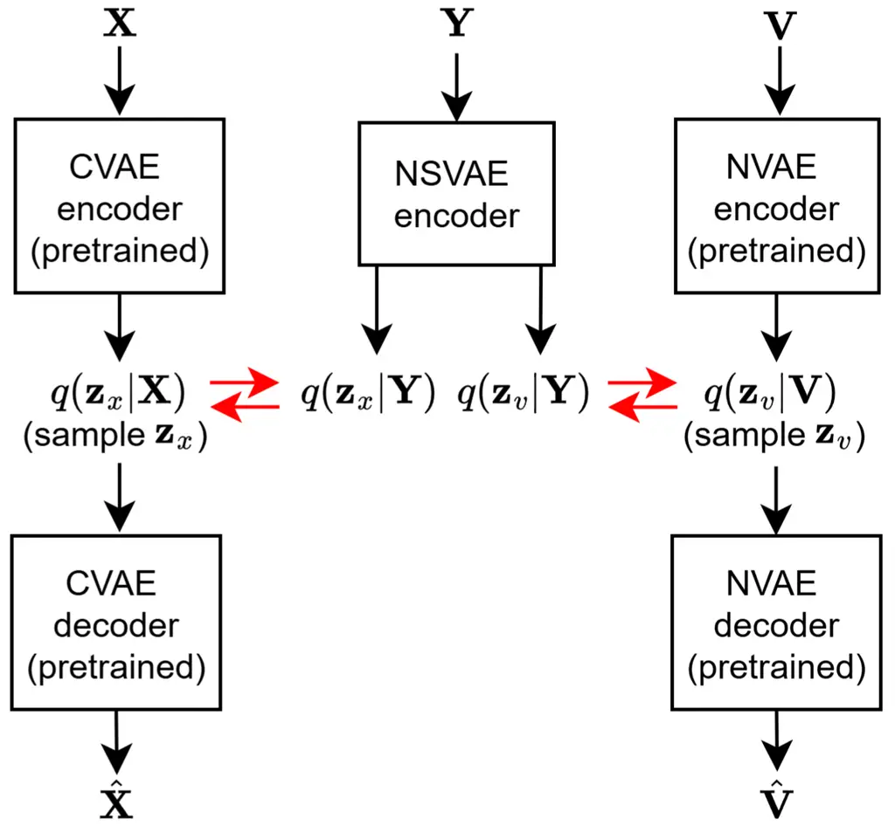
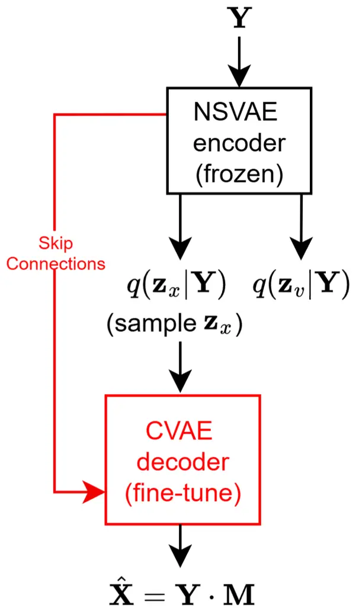

# I-DCCRN-VAE: An Improved Deep Representation Learning Framework for Complex VAE-based Single-channel Speech Enhancement

Jiatong Li    Simon Doclo ^(†)^(†)thanks: This work was funded by the
Deutsche Forschungsgemeinschaft (DFG, German Research Foundation) under
Germany’s Excellence Strategy - EXC 2177/1 - Project ID 390895286 and
Project ID 352015383 - SFB 1330 B2.

###### Abstract

Recently, a complex variational autoencoder (VAE)-based single-channel
speech enhancement system based on the DCCRN architecture has been
proposed. In this system, a noise suppression VAE (NSVAE) learns to
extract clean speech representations from noisy speech using pretrained
clean speech and noise VAEs with skip connections. In this paper, we
improve DCCRN-VAE by incorporating three key modifications: 1) removing
the skip connections in the pretrained VAEs to encourage more
informative speech and noise latent representations; 2) using
$`\beta`$-VAE in pretraining to better balance reconstruction and latent
space regularization; and 3) a NSVAE generating both speech and noise
latent representations. Experiments show that the proposed system
achieves comparable performance as the DCCRN and DCCRN-VAE baselines on
the matched DNS3 dataset but outperforms the baselines on mismatched
datasets (WSJ0-QUT, Voicebank-DEMEND), demonstrating improved
generalization ability. In addition, an ablation study shows that a
similar performance can be achieved with classical fine-tuning instead
of adversarial training, resulting in a simpler training pipeline.

###### Index Terms: 

Variational Autoencoder, Single-channel speech enhancement, Latent
representations

^(†)^(†)address: Dept. of Medical Physics and Acoustics and Cluster of
Excellence Hearing4all,  
Carl von Ossietzky Universität Oldenburg, Germany  
jiatong.li@uni-oldenburg.de, simon.doclo@uni-oldenburg.de

## 1 Introduction

Recently, several generative models, e.g. based on the variational
autoencoders (VAEs) \[1, 2, 3, 4, 5, 6, 7, 8\], generative adversarial
networks \[9, 10, 11, 12, 13\], and diffusion models \[14, 15, 16, 17\],
have been proposed for speech enhancement. VAEs consist of an
encoder-decoder architecture, where the encoder maps the input data into
latent representations, conditioned by a latent regularization loss, and
the decoder aims at reconstructing data from these representations
\[18\]. Since the VAE framework facilitates efficient posterior
inference and reliable reconstruction, several VAE-based approaches have
been proposed for single-channel speech enhancement. For example, the
Bayesian permutation training (PVAE) system \[3, 4\] uses a noise
suppression VAE (NSVAE) to learn the latent representations of two
pretrained VAEs, one for clean speech (CVAE) and one for noise (NVAE).
Several improvements were proposed for this system. In \[8\], we showed
that removing the latent regularization loss for the pretrained VAEs
improves performance and generalization. In addition, in \[5\] it was
proposed to use adversarial training to fine-tune the CVAE and NVAE
decoders. Since the PVAE only estimates the clean speech magnitude in
the Short-time Fourier Transform (STFT) domain in combination with the
noisy phase, in \[7\], the PVAE was extended to the complex domain based
on the DCCRN architecture, leading to DCCRN-VAE. Contrary to the PVAE,
the DCCRN-VAE employs skip connections for the pretrained VAEs. Its
NSVAE encoder only generates speech latent representations, and only the
CVAE decoder is fine-tuned with the NSVAE encoder and skip connections
using adversarial training.

In this paper, we propose an improved complex VAE-based model, the
I-DCCRN-VAE (see Fig. 1), by introducing three key modifications to the
DCCRN-VAE: 1) we remove the skip connections in the pretrained VAEs, as
they can dominate the reconstruction process and make the latent
representations less informative; 2) inspired by our previous work
\[8\], we use $`\beta`$-VAE in pretraining to better balance
reconstruction and latent space regularization; and 3) Similarly to the
PVAE system, the NSVAE encoder generates both speech and noise latent
representations. In our experiments, we train the proposed I-DCCRN-VAE
and the baseline DCCRN-VAE on the DNS3 challenge dataset. Fine-tuning
the CVAE decoder for both systems either uses classical fine-tuning or
adversarial training. The results show that the proposed I-DCCRN-VAE
achieves comparable speech enhancement performance as the baseline
DCCRN-VAE (and DCCRN) on the matched dataset, but outperforms the
baselines on two mismatched datasets (WSJ0-QUT, Voicebank-DEMAND).
Notably, the I-DCCRN-VAE achieves this improved generalization without
adversarial training, which is a significant advantage, as it simplifies
training by avoiding the convergence and sensitivity issues common to
adversarial methods.



(a) NSVAE encoder training



(b) Decoder Fine-tuning

Figure 1: Overview of the improved DCCRN-VAE, consisting of two
pretrained VAEs without skip connections, i.e. clean speech VAE (CVAE)
and noise VAE (NVAE), and the noise suppression VAE (NSVAE).

## 2 The Proposed I-DCCRN-VAE system

After introducing the signal model, in this section, we describe the
proposed I-DCCRN-VAE system, highlighting the differences with the
baseline DCCRN-VAE \[7\] in terms of pretrained VAEs, noise suppression
VAE, and decoder fine-tuning.

### 2.1 Signal Model

In the STFT domain, the observed noisy speech vector
$`\mathbf{Y}_{n}\in\mathbb{C}^{F}`$ at time frame $`n\in[1,N]`$, where
$`N`$ and $`F`$ denote the number of time frames and frequency bins, is
given by

```math
\mathbf{Y}_{n}=\mathbf{X}_{n}+\mathbf{V}_{n}, \tag{1}
```

where $`\mathbf{X}_{n}\in\mathbb{C}^{F}`$ and
$`\mathbf{V}_{n}\in\mathbb{C}^{F}`$ denote the clean speech and noise
vectors. In the following, the time frame index $`n`$ is omitted for
simplicity, except when it is required explicitly.

We assume $`\mathbf{X}`$ and $`\mathbf{V}`$ to be generated from random
processes involving latent speech and noise representations
$`\mathbf{z}_{x}\in\mathbb{C}^{L}`$ and
$`\mathbf{z}_{v}\in\mathbb{C}^{L}`$, $`L`$ denotes the latent dimension.
These random processes are described by the likelihoods
$`p_{\scriptstyle\theta_{x}}(\mathbf{X}|\mathbf{z}_{x})`$ and
$`p_{\scriptstyle\theta_{v}}(\mathbf{V}|\mathbf{z}_{v})`$.
$`\mathbf{z}_{x}`$ and $`\mathbf{z}_{v}`$ can be sampled from the
posterior distributions
$`q_{\scriptstyle\phi_{x}}(\mathbf{z}_{x}|\mathbf{X})`$ and
$`q_{\scriptstyle\phi_{v}}(\mathbf{z}_{v}|\mathbf{V})`$. Assuming that
the above-mentioned distributions are estimated by VAEs, $`\phi_{x}`$
and $`\theta_{x}`$ denote the encoder and decoder parameters of the
clean speech VAE (CVAE), while $`\phi_{v}`$ and $`\theta_{v}`$ denote
the encoder and decoder parameters of the noise VAE (NVAE). The prior
distributions for the latent representations $`\mathbf{z}_{x}`$ and
$`\mathbf{z}_{v}`$ are denoted as $`p(\mathbf{z}_{x})`$ and
$`p(\mathbf{z}_{v})`$. Assuming $`\mathbf{z}_{x}`$ and
$`\mathbf{z}_{v}`$ to be independent, $`\mathbf{z}_{x}`$ and
$`\mathbf{z}_{v}`$ can also be sampled from the noisy posterior
distribution
$`q_{\scriptstyle\phi_{y}}(\mathbf{z}_{x},\mathbf{z}_{v}|\mathbf{Y})\hskip-1.42271pt=\hskip-1.42271ptq_{\scriptstyle\phi_{y}}(\mathbf{z}_{x}|\mathbf{Y})q_{\scriptstyle\phi_{y}}(\mathbf{z}_{v}|\mathbf{Y})`$,
where $`\phi_{y}`$ denotes the encoder parameters of a noise suppression
VAE (NSVAE). In the following, the encoder and decoder parameters are
omitted for simplicity.

### 2.2 System Description

Similar to the DCCRN-VAE system \[7\], the proposed I-DCCRN-VAE system
in Fig. 1 consists of two pretrained VAEs, a clean speech VAE (CVAE) and
a noise VAE (NVAE), and a noise suppression VAE (NSVAE). The training
process consists of three steps: 1) pretraining the CVAE and NVAE using
clean speech $`\mathbf{X}`$ and noise $`\mathbf{V}`$, 2) training the
NSVAE encoder to extract speech and noise representations
$`\mathbf{z}_{x}`$ and $`\mathbf{z}_{v}`$ from noisy speech
$`\mathbf{Y}`$, and 3) fine-tuning the CVAE decoder for better speech
enhancement. The I-DCCRN-VAE differs from the DCCRN-VAE in the
pretraining and NSVAE training steps.

1. Pretrained VAEs: Unlike the DCCRN-VAE, which uses skip connections
   for the CVAE and the NVAE, we don’t consider skip connections for the
   pretrained VAEs in the I-DCCRN-VAE. This forces all information to pass
   through the latent bottleneck, encouraging to learn more informative
   speech and noise latent representations rather than relying on skip
   connections for reconstruction. In addition, we also use $`\beta`$-VAE
   \[19\] to control the balance between reconstruction and latent space
   regularization. The pretraining loss for the CVAE is given by:

```math
\displaystyle-\mathbb{E}_{q(\mathbf{z}_{x}|\mathbf{X})}[\log p(\mathbf{X}|\mathbf{z}_{x})]\ \hskip-2.84544pt+\beta\textrm{KL}(q(\mathbf{z}_{x}|\mathbf{X})\|p(\mathbf{z}_{x})), \tag{2}
```

where $`\mathbb{E}`$ denotes expectation, $`\textrm{KL}(\cdot\|\cdot)`$
denotes the Kullback–Leibler (KL) divergence and $`\beta`$ denotes the
KL weight factor. As in \[7\], the posterior distribution is assumed to
be a complex multivariate Gaussian distribution with a diagonal
covariance matrix and relation matrix, i.e.

```math
\displaystyle{q({\bf z}_{x}|{\bf{X}})}=\mathcal{N}\left({{\bm{\mu}}_{x},\operatorname{diag}(\bm{\sigma}_{x}),\operatorname{diag}(\bm{\delta}_{x})}\right), \tag{3}
```

where the mean, variance and relation vectors,
$`{\bm{\mu}}_{x}\in\mathbb{C}^{L}`$,
$`{\bm{\sigma}}_{{x}}\in\mathbb{R}_{+}^{L}`$ and
$`\bm{\delta}_{{x}}\in\mathbb{C}^{L}`$, are the outputs of the CVAE
encoder. The prior distribution $`p(\mathbf{z}_{x})`$ is assumed to be a
complex multivariate standard Gaussian distribution,
$`p(\mathbf{z}_{x})=\mathcal{N}({{\bf{0}},{\bf{I}},{\bf{0}}})`$, where
$`\bf{I}`$ denotes the identity matrix. To allow for backpropagation,
the reparameterization trick \[20\] is used to sample $`\mathbf{z}_{x}`$
from $`q(\mathbf{z}_{x}|\mathbf{X})`$. To improve reconstruction, the
first term in (2) is replaced by a combined loss on the complex and
magnitude spectrograms, i.e.

```math
\displaystyle\frac{1}{N}\sum_{n=1}^{N}\left(\|\mathbf{X}_{n}-\hat{\mathbf{X}}_{n}\|_{2}^{2}+\||\mathbf{X}_{n}|-|\hat{\mathbf{X}}_{n}|\|_{2}^{2}\right), \tag{4}
```

where $`\hat{\mathbf{X}}_{n}`$ denotes the estimated clean speech STFT
vector and $`|\cdot|`$ denotes the magnitude of a vector (element-wise).
The NVAE assumes a similar loss and similar distributions as the CVAE,
which is not explained in detail here.

2. Noise suppression VAE (Fig. 1(a)): In contrast to the NSVAE encoder
   in the DCCRN-VAE, which generates only speech representations
   $`\mathbf{z}_{x}`$ from noisy speech $`\mathbf{Y}`$ and applies a
   residual loss to align intermediate features between the NSVAE encoder
   and the pretrained CVAE encoder, the NSVAE encoder in the I-DCCRN-VAE
   generates both speech and noise representations $`\mathbf{z}_{x}`$ and
   $`\mathbf{z}_{v}`$ without using a residual loss in training. This
   follows the probabilistic generative modeling derived in \[3\], which
   provides a more complete generative basis. Aiming at making the
   posterior distributions $`q(\mathbf{z}_{x}|\mathbf{Y})`$ and
   $`q(\mathbf{z}_{v}|\mathbf{Y})`$ from the NSVAE encoder similar to the
   posterior distributions $`q(\mathbf{z}_{x}|\mathbf{X})`$ and
   $`q(\mathbf{z}_{v}|\mathbf{V})`$ from the pretrained VAEs, the NSVAE is
   trained by minimizing the loss

```math
\displaystyle\textrm{KL}\left({q({\bf z}_{x}|{\bf{Y}})}||{q({\bf z}_{x}|{\bf{X}})}\right)+\alpha\textrm{KL}\left({q({\bf z}_{v}|{\bf{Y}})}||{q({\bf z}_{v}|{\bf{V}})}\right), \tag{5}
```

where $`\alpha`$ denotes the noise latent weight factor. It should be
noted that when $`\alpha=0`$, the NSVAE is trained to generate only
speech representations $`\mathbf{z}_{x}`$. Similar to (3), the posterior
distributions estimated from the NSVAE encoder are assumed to follow a
complex multivariate Gaussian distribution, i.e.

```math
\displaystyle{q({\bf z}_{x}|{\bf{Y}})}=\mathcal{N}\left({{\bm{\mu}}_{{yx}},\operatorname{diag}({\bm{\sigma}}_{{yx}}),\operatorname{diag}({\bm{\delta}}_{{yx}})}\right), \tag{6}
```

```math
\displaystyle{q({\bf z}_{v}|{\bf{Y}})}=\mathcal{N}\left({{\bm{\mu}}_{{yv}},\operatorname{diag}({\bm{\sigma}}_{{yv}}),\operatorname{diag}({\bm{\delta}}_{{yv}})}\right), \tag{7}
```

where the mean vectors $`{\bm{\mu}}_{{yx}}`$ and $`{\bm{\mu}}_{{yv}}`$,
the variance vectors $`{\bm{\sigma}}_{{yx}}`$ and
$`{\bm{\sigma}}_{{yv}}`$, and the relation vectors
$`{\bm{\delta}}_{{yx}}`$ and $`{\bm{\delta}}_{{yv}}`$ are the outputs of
the NSVAE encoder.

3. CVAE decoder fine-tuning (Fig. 1(b)): As estimation errors in the
   posterior distribution $`q({\bf z}_{x}|{\bf{Y}})`$ degrade the speech
   enhancement performance, it was proposed in \[7\] to fine-tune the CVAE
   decoder while keeping the NSVAE encoder frozen. Skip connections were
   added in fine-tuning to provide the CVAE decoder with detailed encoder
   features and to combat the vanishing gradient problem. Similarly as in
   \[7\], the CVAE decoder in the I-DCCRN-VAE is fine-tuned to generate the
   complex mask $`\mathbf{M}`$, which is used to estimate the clean speech
   $`\hat{\mathbf{X}}`$ as

```math
\displaystyle\hat{\mathbf{X}}=\mathbf{Y}\cdot\mathbf{M}, \tag{8}
```

where the multiplication is performed element-wise. Fine-tuning is
performed using the Scale Invariant Signal-to-Distortion Ratio (SI-SDR)
loss between the estimated speech $`\hat{\mathbf{x}}`$ and the clean
speech $`\mathbf{x}`$ in the time domain obtained by inverse STFT and
overlap-add, i.e.

```math
\mathcal{L}_{\text{SI-SDR}}=-10\log_{10}\left(\frac{\left\|\mathbf{x}_{d}\right\|_{2}^{2}}{\left\|\mathbf{x}_{d}-\hat{\mathbf{x}}\right\|_{2}^{2}}\right),\mathbf{x}_{d}=\frac{\langle\hat{\mathbf{x}},\mathbf{x}\rangle}{\|\mathbf{x}\|_{2}^{2}}\mathbf{x}. \tag{9}
```

For the fine-tuning step, various training schemes can be applied.
Besides classical fine-tuning, which only minimizes SI-SDR loss in (9),
adversarial training has been used in \[7\], involving a discriminator
network. The discriminator learns to distinguish between estimated clean
speech and true clean speech, thereby encouraging the model to produce
more realistic results.

## 3 Experiments

This section first presents the experimental setup, including the
training and evaluation datasets, the network structure, and the
training procedure. Then, the experimental results are presented and
discussed, evaluating key differences between the proposed I-DCCRN-VAE
and the baseline DCCRN-VAE.

### 3.1 Training and Evaluation Datasets

To train all considered VAE-based speech enhancement systems, we used
anechoic clean speech and noise from the DNS3 dataset \[21\], sampled at
16kHz. It should be noted that for clean speech, we only considered the
read speech (leaving out emotional speech), while for noise, we did not
consider the DEMAND dataset, since it was used for evaluation. We
randomly split 50$`\%`$ of speakers for CVAE pretraining, 40% of
speakers for NSVAE training and fine-tuning, and 10% of speakers for
validation. The noise data was split similarly. For NSVAE training and
fine-tuning, noisy speech was generated by the DNS script at
signal-to-noise ratios (SNRs) between -10 dB and 15 dB. In total, we
generated 30 hours of data for pretraining, 20 hours of data for NSVAE
training and CVAE decoder fine-tuning, and 10 hours of data for
validation.

To evaluate the speech enhancement performance, we used three datasets.
As the matched evaluation dataset, we used the official synthetic DNS3
test set at SNRs between 0 dB and 19 dB. To test the generalization
ability, we used two mismatched datasets with different speakers and
noise from the training dataset, namely WSJ0-QUT \[2\] and
VoiceBank-DEMAND (VB-DMD) \[22\]. WSJ0-QUT includes cafe, home, street
and car noise at SNRs of -5 dB, 0 dB and 5 dB. The official VB-DMD test
set includes room, office, bus, cafe and public square noise at SNRs of
2.5 dB, 7.5 dB, 12.5 dB and 17.5 dB.

### 3.2 Network and Training

We used a similar STFT framework and network architectures as for the
DCCRN-VAE system \[7\]. The time-domain signals are transformed to the
STFT domain using a Hann window with a frame length of 400, 25% overlap,
and a FFT length of 512. For all VAEs, the dimension of the latent
representations is equal to $`L=128`$. The CVAE and NVAE encoders
contain six Conv2d blocks and one complex LSTM layer. The channels for
the Conv2d blocks are \[32, 64, 128, 128, 256, 256\], with a kernel size
of (5,2) and a stride of (2,1). The complex LSTM layer outputs the
$`L`$-dimensional mean, variance and relation vectors:
($`{\bm{\mu}}_{{x}}`$, $`{\bm{\sigma}}_{{x}}`$ and
$`{\bm{\delta}}_{{x}}`$ for the CVAE; $`{\bm{\mu}}_{{v}}`$,
$`{\bm{\sigma}}_{{v}}`$ and $`{\bm{\delta}}_{{v}}`$ for the NVAE). The
NSVAE encoder has a similar structure, where the only difference is that
the LSTM layer generates both speech and noise vectors
($`{\bm{\mu}}_{{yx}}`$, $`{\bm{\mu}}_{{yv}}`$, $`{\bm{\sigma}}_{{yx}}`$,
$`{\bm{\sigma}}_{{yv}}`$, $`{\bm{\delta}}_{{yx}}`$,
$`{\bm{\delta}}_{{yv}}`$). The CVAE and NVAE decoders mirror their
respective encoders in reverse order. When adversarial training is used
for the CVAE decoder fine-tuning, the discriminator has a similar
structure to the CVAE encoder, including six Conv2d blocks and one real
LSTM layer with a single output.

All networks were trained for a maximum of 1000 epochs. The training was
stopped early if the validation loss did not decrease for 20 consecutive
epochs. The Adam optimizer was used with a learning rate of 3e-4 (CVAE,
NVAE, NSVAE) and a learning rate of 8e-5 (discriminator for adversarial
training). All learning rates were halved if the validation loss did not
improve for 3 consecutive epochs. The batch size was set to 15. The code
can be found on
[https://github.com/iris1997jiatong/I-DCCRN-VAE](https://github.com/iris1997jiatong/I-DCCRN-VAE).

### 3.3 Experimental Results: Hyperparameter Optimization

Aiming at finding the optimal configuration set of hyperparameters for
the proposed I-DCCRN-VAE, in the first set of experiments, we evaluate
key differences with the DCCRN-VAE. More in particular, we investigate
the influence of skip connections and latent space regularization in the
pretrained VAEs as well as the influence of the NSVAE training target.
It should be noted that in this set of experiments, we only consider
classical fine-tuning for the CVAE decoder fine-tuning.

|            |           |        |       |        |       |
| ---------- | --------- | ------ | ----- | ------ | ----- |
|            | $`\beta`$ | CVAE   |       | NVAE   |       |
|            |           | SI-SDR | KLL   | SI-SDR | KLL   |
| Without SC | $`0.001`$ | 15.7   | 303.9 | 16.6   | 398.1 |
|            | $`0.01`$  | 14.7   | 67.3  | 14.9   | 114.7 |
|            | $`0.1`$   | 13.0   | 24.0  | 12.4   | 41.6  |
|            | $`1`$     | 8.4    | 7.7   | 5.5    | 11.6  |
| With SC    | \-        | 39.0   | 0.0   | 38.1   | 0.0   |

|            |           |        |      |          |      |        |      |
| ---------- | --------- | ------ | ---- | -------- | ---- | ------ | ---- |
|            | $`\beta`$ | DNS3   |      | WSJ0-QUT |      | VB-DMD |      |
|            |           | SI-SDR | PESQ | SI-SDR   | PESQ | SI-SDR | PESQ |
| Without SC | $`0.001`$ | 16.9   | 2.52 | 8.6      | 1.61 | 17.8   | 2.33 |
|            | $`0.01`$  | 17.2   | 2.49 | 8.7      | 1.65 | 18.0   | 2.44 |
|            | $`0.1`$   | 16.8   | 2.35 | 8.4      | 1.62 | 18.0   | 2.43 |
|            | $`1`$     | 16.0   | 2.23 | 7.4      | 1.55 | 17.2   | 2.32 |
| With SC    | \-        | 11.7   | 1.71 | 0.0      | 1.19 | 14.1   | 2.16 |

|            |        |      |          |      |        |      |
| ---------- | ------ | ---- | -------- | ---- | ------ | ---- |
| $`\alpha`$ | DNS3   |      | WSJ0-QUT |      | VB-DMD |      |
|            | SI-SDR | PESQ | SI-SDR   | PESQ | SI-SDR | PESQ |
| 0          | 16.9   | 2.44 | 7.9      | 1.62 | 17.9   | 2.43 |
| 1          | 17.2   | 2.49 | 8.7      | 1.65 | 18.0   | 2.44 |

Table 1: Average reconstruction SI-SDR (dB) and KL loss (KLL) between
posterior distributions and prior distributions of pretrained CVAE and
NVAE with or without skip connections (SC) using different KL weight
factor $`\beta`$ for DNS3 dataset.

Table 2: Average SI-SDR (dB) and PESQ on different datasets, with and
without skip connections (SC) and using different KL weight factors
$`\beta`$ in the pretrained VAEs (using the NSVAE trained with
$`\alpha=1`$).

Table 3: Average SI-SDR (dB) and PESQ on different datasets for
different NSVAE training targets (using pretrained VAEs without skip
connections with $`\beta=0.01`$).

|                                  |                     |                      |                      |                     |                      |                      |                     |                      |                      |
| -------------------------------- | ------------------- | -------------------- | -------------------- | ------------------- | -------------------- | -------------------- | ------------------- | -------------------- | -------------------- |
| System                           | DNS3                |                      |                      | WSJ0-QUT            |                      |                      | VB-DMD              |                      |                      |
|                                  | SI-SDR              | PESQ                 | ESTOI                | SI-SDR              | PESQ                 | ESTOI                | SI-SDR              | PESQ                 | ESTOI                |
| Unprocessed                      | 9.1 ($`\pm\,`$0.9)  | 1.58 ($`\pm\,`$0.07) | 0.81 ($`\pm\,`$0.02) | -2.6 ($`\pm\,`$0.3) | 1.14 ($`\pm\,`$0.01) | 0.50 ($`\pm\,`$0.01) | 8.4 ($`\pm\,`$0.4)  | 1.97 ($`\pm\,`$0.05) | 0.79 ($`\pm\,`$0.01) |
| (1) DCCRN \[23\]                 | 16.6 ($`\pm\,`$0.8) | 2.54 ($`\pm\,`$0.10) | 0.90 ($`\pm\,`$0.01) | 7.1 ($`\pm\,`$0.3)  | 1.59 ($`\pm\,`$0.03) | 0.67 ($`\pm\,`$0.01) | 17.5 ($`\pm\,`$0.3) | 2.38 ($`\pm\,`$0.04) | 0.81 ($`\pm\,`$0.01) |
| (2) DCCRN-VAE (CF)               | 16.8 ($`\pm\,`$0.7) | 2.38 ($`\pm\,`$0.09) | 0.88 ($`\pm\,`$0.02) | 6.8 ($`\pm\,`$0.3)  | 1.49 ($`\pm\,`$0.03) | 0.65 ($`\pm\,`$0.01) | 17.1 ($`\pm\,`$0.3) | 2.36 ($`\pm\,`$0.04) | 0.81 ($`\pm\,`$0.01) |
| (3) DCCRN-VAE (ADV) \[7\]        | 17.8 ($`\pm\,`$0.7) | 2.50 ($`\pm\,`$0.09) | 0.90 ($`\pm\,`$0.01) | 7.2 ($`\pm\,`$0.3)  | 1.54 ($`\pm\,`$0.03) | 0.67 ($`\pm\,`$0.01) | 17.5 ($`\pm\,`$0.3) | 2.37 ($`\pm\,`$0.04) | 0.81 ($`\pm\,`$0.01) |
| (4) I-DCCRN-VAE (CF) (Proposed)  | 17.2 ($`\pm\,`$0.7) | 2.49 ($`\pm\,`$0.09) | 0.90 ($`\pm\,`$0.01) | 8.7 ($`\pm\,`$0.3)  | 1.65 ($`\pm\,`$0.03) | 0.70 ($`\pm\,`$0.01) | 18.0 ($`\pm\,`$0.3) | 2.44 ($`\pm\,`$0.04) | 0.83 ($`\pm\,`$0.01) |
| (5) I-DCCRN-VAE (ADV) (Proposed) | 17.5 ($`\pm\,`$0.7) | 2.49 ($`\pm\,`$0.09) | 0.90 ($`\pm\,`$0.01) | 8.9 ($`\pm\,`$0.3)  | 1.65 ($`\pm\,`$0.03) | 0.70 ($`\pm\,`$0.01) | 18.1 ($`\pm\,`$0.3) | 2.44 ($`\pm\,`$0.04) | 0.83 ($`\pm\,`$0.01) |

Table 4: Average SI-SDR (dB), PESQ and ESTOI (with 95% confidence
interval) of DCCRN, DCCRN-VAE and I-DCCRN-VAE with two different CVAE
decoder fine-tuning methods, i.e. classical fine-tuning (CF), and
adversarial training (ADV), evaluated on different datasets.

Table 3 shows the influence of skip connections and the KL weight factor
$`\beta`$ in (2) on the reconstruction quality and the latent space of
the pretrained CVAE and NVAE for the DNS3 dataset. We use reconstruction
SI-SDR to measure reconstruction quality and KL loss (KLL) between
estimated posterior distributions ($`q(\mathbf{z}_{x}|\mathbf{X})`$,
$`q(\mathbf{z}_{v}|\mathbf{V})`$) and prior distributions
($`p(\mathbf{z}_{x})`$, $`p(\mathbf{z}_{v})`$) to assess the
regularization of the latent space. Lower KL loss indicates a more
regularized space. For both CVAE and NVAE, it can be observed that
including skip connections yields a much higher reconstruction SI-SDR
but a much lower KL loss close to zero than without skip connections.
This indicates posterior collapse for the pretrained VAEs, suggesting
that speech and noise latent representations are not very informative
for speech and noise reconstruction when using skip connections. Without
skip connections, it can be observed that as $`\beta`$ decreases from 1
to 0.001, the reconstruction SI-SDR and the KLL of both CVAE and NVAE
increase. This indicates a clear trade-off: decreasing $`\beta`$
improves reconstruction quality at the cost of a less regularized latent
space.

Table 3 evaluates the influence of skip connections and $`\beta`$ in the
pretrained VAEs on the overall speech enhancement performance in terms
of SI-SDR and wide-band Perceptual Evaluation of Speech Quality (PESQ)
\[24\] for the matched DNS3 dataset and the mismatched datasets. First,
it can be observed that including skip connections yields significantly
lower SI-SDR and PESQ scores than without skip connections. This can be
explained by the less informative latent representations in the
pretrained VAEs, which the NSVAE encoder is trained to match. Therefore,
the NSVAE encoder fails to learn useful information for speech
reconstruction from the pretrained VAEs. Without skip connections, a
clear trend can be observed, where SI-SDR and PESQ across all datasets
first increase and then decrease as $`\beta`$ decreases, with
$`\beta=0.01`$ yielding the best performance (except for PESQ on the
matched DNS3 dataset). Combined with results in Table 3, we may conclude
that both pretrained reconstruction quality and latent space
regularization affect the speech enhancement performance. As $`\beta`$
decreases from 1 to 0.01, the improved pretrained reconstruction quality
leads to better speech enhancement performance for all considered
datasets. However, while $`\beta=0.001`$ further improves the pretrained
reconstruction quality, the speech enhancement performance degrades,
especially for both mismatched datasets. This performance drop is likely
due to the highly unregularized latent space for $`\beta=0.001`$, which
degrades the generalization ability.

Table 3 shows the influence of the NSVAE training target in (5) on the
speech enhancement performance for different datasets. For $`\alpha=0`$,
the NSVAE encoder only generates speech latent representations, while
for $`\alpha=1`$, the NSVAE encoder generates both speech and noise
latent representations. It should be noted that, based on the results in
Table 3, we consider pretrained VAEs without skip connections with
$`\beta=0.01`$ here. The results show that training the NSVAE to
generate both speech and noise representations ($`\alpha=1`$) yields
consistently higher SI-SDR and PESQ scores across all datasets compared
to generating only speech representations ($`\alpha=0`$). This suggests
that explicitly modeling the noise component contributes to an
extraction of speech information from the noisy mixture, thereby
improving the speech enhancement performance.

### 3.4 Experimental Results: Comparison with Baselines

In this section, we compare the performance of the proposed I-DCCRN-VAE,
using the optimal configuration (without skip connections in pretrained
VAEs, $`\beta=0.01`$, $`\alpha=1`$), with DCCRN\[23\] and DCCRN-VAE with
the residual loss \[7\]. For the DCCRN-VAE and I-DCCRN-VAE systems, we
also compare adversarial training and classical fine-tuning for the CVAE
decoder. For a fair comparison, the DCCRN baseline was trained on the
same noisy dataset used for NSVAE training and fine-tuning, while the
DCCRN-VAE baseline used the same datasets as the I-DCCRN-VAE.

Table 4 shows the average SI-SDR, wideband PESQ, and Extended Short-Time
Objective Intelligibility (ESTOI) \[25\] scores for the matched DNS3
dataset and the mismatched datasets. First, it can be observed that for
all datasets that compared to classical fine-tuning, adversarial
training provides a much larger performance benefit for the baseline
DCCRN-VAE (systems (2) and (3)) than for the proposed I-DCCRN-VAE
(systems (4) and (5)). This can be explained by the difference in the
estimated clean speech between DCCRN-VAE and I-DCCRN-VAE before CVAE
fine-tuning. Due to posterior collapse, the speech quality of the
DCCRN-VAE is rather poor before fine-tuning; the discriminator can
easily distinguish between estimated speech and true clean speech,
making adversarial training highly effective. In contrast, since the
proposed I-DCCRN-VAE learns informative pretrained latent spaces and
already produces high-quality speech before fine-tuning, adversarial
training does not bring a large benefit. This is a significant
advantage, as classical fine-tuning avoids the convergence and
sensitivity issues that are common to adversarial training.

Finally, we compare the speech enhancement performance of the proposed
I-DCCRN-VAE (systems (4) and (5)) with DCCRN (system (1)) and DCCRN-VAE
using adversarial training (system (3)). On the matched DNS3 dataset, it
can be observed that the baseline DCCRN and DCCRN-VAE achieve slightly
better SI-SDR or PESQ scores than the I-DCCRN-VAE. However, for both
considered mismatched datasets, the proposed I-DCCRN-VAE consistently
achieves the best performance in terms of all metrics. Specifically, on
the WSJ0-QUT dataset, the I-DCCRN-VAE improves upon baselines by around
1.7 dB in SI-SDR, 0.1 in PESQ, and 0.03 in ESTOI. On the VB-DMD dataset,
the respective improvements are 0.6 dB in SI-SDR, around 0.06 in PESQ,
and 0.02 in ESTOI. This demonstrates the improved generalization ability
of the proposed I-DCCRN-VAE.

## 4 Conclusions

This paper proposed the I-DCCRN-VAE for complex VAE-based single-channel
speech enhancement, which improves the DCCRN-VAE. We demonstrate that
three key modifications are crucial for improvement: 1) removing skip
connections in the pretrained VAEs to avoid posterior collapse; 2) using
$`\beta`$-VAE in pretrained VAEs to better balance reconstruction and
latent space regularization; and 3) the NSVAE generating both speech and
noise representations for better speech extraction. Experiments show
that the I-DCCRN-VAE achieves comparable performance to baselines on the
matched dataset but consistently better performance on two mismatched
datasets, demonstrating better generalization. Especially, the
I-DCCRN-VAE achieves the performance even with classical fine-tuning,
not adversarial training, leading to a simplified training pipeline.

## References

- \[1\] H. Fang, G. Carbajal, S. Wermter, and T. Gerkmann, “Variational
  autoencoder for speech enhancement with a noise-aware encoder,” in
  Proc. IEEE Int. Conf. Acoust., Speech, Signal Process. (ICASSP),
  Toronto, Canada, Jun. 2021, pp. 676–680.
- \[2\] X. Bie, S. Leglaive, X. Alameda-Pineda, and L. Girin,
  “Unsupervised speech enhancement using dynamical variational
  autoencoders,” IEEE/ACM Trans. on Audio, Speech, and Language
  Processing, vol. 30, pp. 2993–3007, 2022.
- \[3\] Y. Xiang, J. L. Højvang, M. H. Rasmussen, and M. G. Christensen,
  “A Bayesian permutation training deep representation learning method
  for speech enhancement with variational autoencoder,” in Proc. IEEE
  Int. Conf. Acoust., Speech, Signal Process. (ICASSP), Singapore, May
  2022, pp. 381–385.
- \[4\] Y. Xiang, J. L. Højvang, M. H. Rasmussen, and M. G. Christensen,
  “A deep representation learning speech enhancement method using
  $`\beta`$-VAE,” in Proc. European Signal Processing Conference
  (EUSIPCO), Belgrade, Serbia, Aug. 2022, pp. 359–363.
- \[5\] Y. Xiang, J. L. Højvang, M. H. Rasmussen, and M. G. Christensen,
  “A two-stage deep representation learning-based speech enhancement
  method using variational autoencoder and adversarial training,”
  IEEE/ACM Trans. on Audio, Speech, and Language Processing, vol. 32,
  pp. 164–177, 2023.
- \[6\] M. Sadeghi and R. Serizel, “Fast and efficient speech
  enhancement with variational autoencoders,” in Proc. IEEE Int. Conf.
  Acoust., Speech, Signal Process. (ICASSP), Rhodes Island, Greece, Jun.
  2023, pp. 1–5.
- \[7\] Y. Xiang, J. Tian, X. Hu, X. Xu, and Z. Yin, “A deep
  representation learning-based speech enhancement method using complex
  convolution recurrent variational autoencoder,” in Proc. IEEE Int.
  Conf. Acoust., Speech, Signal Process. (ICASSP), Seoul, Korea, Apr.
  2024, pp. 781–785.
- \[8\] J. Li and S. Doclo, “Investigation of speech and noise latent
  representations in single-channel VAE-based speech enhancement,” in
  Proc. ITG Conference on Speech Communication, Berlin, Germany,
  Sep. 2025.
- \[9\] S. Pascual, A. Bonafonte, and J. Serrà, “SEGAN: Speech
  enhancement generative adversarial network,” in Proc. Interspeech,
  Stockholm, Sweden, Aug. 2017, pp. 3642–3646.
- \[10\] D. Baby and S. Verhulst, “Sergan: Speech enhancement using
  relativistic generative adversarial networks with gradient penalty,”
  in Proc. IEEE Int. Conf. Acoust., Speech, Signal Process. (ICASSP),
  Brighton, UK, May 2019, pp. 106–110.
- \[11\] H. Phan, I. V. McLoughlin, L. Pham, O. Y. Chén, P. Koch, M. De
  Vos, and A. Mertins, “Improving GANs for speech enhancement,” IEEE
  Signal Processing Letters, vol. 27, pp. 1700–1704, 2020.
- \[12\] A. Wali, Z. Alamgir, S. Karim, A. Fawaz, M. B. Ali, M. Adan,
  and M. Mujtaba, “Generative adversarial networks for speech
  processing: A review,” Computer Speech & Language, vol. 72, pp.
  101308, 2022.
- \[13\] S. Abdulatif, R. Cao, and B. Yang, “CMGAN: Conformer-based
  metric-GAN for monaural speech enhancement,” IEEE/ACM Trans. on Audio,
  Speech, and Language Processing, vol. 32, pp. 2477–2493, 2024.
- \[14\] Y. Lu, Z. Wang, S. Watanabe, A. Richard, C. Yu, and Y. Tsao,
  “Conditional diffusion probabilistic model for speech enhancement,” in
  Proc. IEEE Int. Conf. Acoust., Speech, Signal Process. (ICASSP),
  Singapore, May 2022, pp. 7402–7406.
- \[15\] J. Richter, S. Welker, J. Lemercier, B. Lay, and T. Gerkmann,
  “Speech enhancement and dereverberation with diffusion-based
  generative models,” IEEE/ACM Trans. on Audio, Speech, and Language
  Processing, vol. 31, pp. 2351–2364, 2023.
- \[16\] B. Nortier, M. Sadeghi, and R. Serizel, “Unsupervised speech
  enhancement with diffusion-based generative models,” in Proc. IEEE
  Int. Conf. Acoust., Speech, Signal Process. (ICASSP), Seoul, Korea,
  Apr. 2024, pp. 12481–12485.
- \[17\] P. Gonzalez, Z. Tan, J. Østergaard, J. Jensen, T. S. Alstrøm,
  and T. May, “Investigating the design space of diffusion models for
  speech enhancement,” IEEE/ACM Trans. on Audio, Speech, and Language
  Processing, vol. 32, pp. 4486–4500, 2024.
- \[18\] D. P. Kingma and M. Welling, “Auto-Encoding Variational Bayes,”
  in Proc. Int. Conf. Learning Representations (ICLR), Banff, Canada,
  Apr. 2014.
- \[19\] I. Higgins, L. Matthey, A. Pal, C. Burgess, X. Glorot,
  M. Botvinick, S. Mohamed, and A. Lerchner, “$`\beta`$-VAE: Learning
  basic visual concepts with a constrained variational framework,” in
  Proc. Int. Conf. Learning Representations (ICLR), Toulon, France,
  Apr. 2017.
- \[20\] T. Nakashika, “Complex-valued variational autoencoder: A novel
  deep generative model for direct representation of complex spectra.,”
  in Proc. Interspeech, Shanghai, China, Oct. 2020, pp. 2002–2006.
- \[21\] C. K.A. Reddy, H. Dubey, K. Koishida, A. Nair, V. Gopal,
  R. Cutler, S. Braun, H. Gamper, R. Aichner, and S. Srinivasan,
  “Interspeech 2021 deep noise suppression challenge,” in Proc.
  Interspeech, Brno, Czech Republic, Aug. 2021, pp. 2796–2800.
- \[22\] C. Valentini-Botinhao, X. Wang, S. Takaki, and J. Yamagishi,
  “Speech enhancement for a noise-robust text-to-speech synthesis system
  using deep recurrent neural networks,” in Proc. Interspeech, San
  Francisco, USA, Sep. 2016, pp. 352–356.
- \[23\] Y. Hu, Y. Liu, S. Lv, M. Xing, S. Zhang, Y. Fu, J. Wu,
  B. Zhang, and L. Xie, “DCCRN: Deep complex convolution recurrent
  network for phase-aware speech enhancement,” in Proc. Interspeech,
  Shanghai, China, Oct. 2020, pp. 2472–2476.
- \[24\] A.W. Rix, J.G. Beerends, M.P. Hollier, and A.P. Hekstra,
  “Perceptual evaluation of speech quality (PESQ)-a new method for
  speech quality assessment of telephone networks and codecs,” in Proc.
  IEEE Int. Conf. Acoust., Speech, Signal Process. (ICASSP), Salt Lake
  City, Utah, USA, May 2001, pp. 749–752.
- \[25\] C. H. Taal, R. C. Hendriks, R. Heusdens, and J. Jensen, “A
  short-time objective intelligibility measure for time-frequency
  weighted noisy speech,” in Proc. IEEE Int. Conf. Acoust., Speech,
  Signal Process. (ICASSP), Dallas, Texas, USA, March 2010, pp.
  4214–4217.
