# DroneAudioset: An Audio Dataset for Drone-based Search and Rescue

Chitralekha Gupta^(\*)    Soundarya Ramesh^(\*)    Praveen Sasikumar   
Kian Peen Yeo    Suranga Nanayakkara Affiliation: ^(\*)Equal
contribution Affiliation: School of Computing, National University of
Singapore Affiliation: {chitralekha, soundarya, praveen, kpyeo,
suranga}@ahlab.org

###### Abstract

Unmanned Aerial Vehicles (UAVs) or drones, are increasingly used in
search and rescue missions to detect human presence. Existing systems
primarily leverage vision-based methods which are prone to fail under
low-visibility or occlusion. Drone-based audio perception offers promise
but suffers from extreme ego-noise that masks sounds indicating human
presence. Existing datasets are either limited in diversity or
synthetic, lacking real acoustic interactions, and there are no
standardized setups for drone audition. To this end, we present
DroneAudioset ¹¹ 1 The dataset is publicly available at
[https://huggingface.co/datasets/ahlab-drone-project/DroneAudioSet/](https://huggingface.co/datasets/ahlab-drone-project/DroneAudioSet/)
under the MIT license.  
Code is available at
[https://github.com/augmented-human-lab/DroneAudioSet-code.git](https://github.com/augmented-human-lab/DroneAudioSet-code.git).  
Webpage:
[https://apps.ahlab.org/DroneAudioSet-code/](https://apps.ahlab.org/DroneAudioSet-code/).
, a comprehensive drone audition dataset featuring 23.5 hours of
annotated recordings, covering a wide range of signal-to-noise ratios
(SNRs) from -57.2 dB to -2.5 dB, across various drone types, throttles,
microphone configurations as well as environments. The dataset enables
development and systematic evaluation of noise suppression and
classification methods for human-presence detection under challenging
conditions, while also informing practical design considerations for
drone audition systems, such as microphone placement trade-offs, and
development of drone noise-aware audio processing. This dataset is an
important step towards enabling design and deployment of drone-audition
systems.

## 1 Introduction

Unmanned Aerial Vehicles (UAVs), commonly known as drones, have become
invaluable tools for search and rescue (SAR), environmental monitoring,
and surveillance. Specifically, for SAR operations in indoor
environments, such as dilapidated buildings due to earthquake and fire
accidents, drones are indispensable in identifying human presence to
inform rescue operators. Traditionally, these missions rely on visual
data which face challenges in low-visibility conditions (e.g., smoke,
fog, cluttered environments) due to occlusions, reflections, as well as
bandwidth constraints for video transmission \[14\]. Auditory scene
analysis offers a complementary modality that penetrates visual
obstructions, enabling detection of human presence through sounds such
as human vocal sounds (e.g. speech, scream and cries), as well as
non-verbal cues such as banging and footsteps. However, the potential of
drone-mounted microphones remains underexplored due to two key
challenges. First, drones generate intense noise from motors and
propellers, known as ego-noise, combined with wind noise \[14, 4\]²² 2
Ego-noise of drones often exceeds 80 dBA at a 1-meter distance. Refer to
Table 5 in the Appendix. This noise overlaps and masks human vocal
frequencies, significantly degrading the signal-to-noise ratio (SNR) to
below -10 dB \[4\], making human presence detection difficult. Second,
this ego-noise is spatially uneven due to turbulence from the
propellers, causing some microphone placements, when mounted on or
around the drone, to be more exposed to wind noise than others. Yet,
there is limited understanding of how different microphone positions,
drone throttles, and source types affect recording quality \[14, 4\].
These challenges highlight the need for a comprehensive drone audio
dataset to systematically study ego-noise characteristics and evaluate
microphone placement strategies in diverse acoustic conditions for
effective human presence detection.

A few existing datasets capture human sounds using drone-mounted
microphones. Among them, the DRone EGO-Noise (DREGON) dataset \[27\]
provides indoor recordings for speech localization tasks. However, its
scope is limited in terms of amount of recording data, as well as
diversity in SNR. Synthetic datasets \[15, 16\] that combine a
pre-recorded drone noise at a specific setting with clean source audio
are unable to reflect real-world acoustic interactions and variability,
particularly the dynamic modulation of rotor harmonics with throttle
changes and the effects of wind turbulence.

To address these limitations, we introduce DroneAudioset, a
systematically collected drone audio dataset comprising 23.5 hours of
high-quality recordings. The data was collected using a controlled
experimental setup in which the drone was securely mounted on a fixed
frame, ensuring consistent and repeatable conditions. This methodology
allowed us to capture a diverse range of annotated audio samples across
multiple critical parameters, including different microphones, varying
drone sizes and throttle settings, diverse acoustic environments, and a
wide array of sound sources relevant to search and rescue operations.
Overall, our dataset captures source sounds in combination with drone
noise, for a wide range of signal-to-noise ratios (SNRs) from -57.2 dB
to -2.5 dB³³ 3 0 dB SNR indicates that the noise and signal have equal
loudness, and every 3 dB decrease in SNR indicates doubling of the noise
power.. Availability of such a dataset that captures the challenging
acoustic scenarios in drone audition would boost development and
evaluation of robust noise suppression and classification models for
drone-audition based search and rescue. Moreover, this dataset could
support system design for drone-audition, enabling empirical evaluation
of hardware and operational design decisions, such as microphone
placement, drone size, or optimal throttle levels for specific detection
ranges.

Specifically, we make three contributions:  
• We present the first publicly available dataset of drone audio
recordings, comprising 23.5 hours of data captured under systematically
controlled conditions. Our collection methodology varies key parameters
including throttle levels, microphone configurations, source
characteristics (type, volume, distance), and room acoustics to enable
robust model development.  
• We provide a systematic evaluation of state-of-the-art noise
suppression and audio classification models for human presence detection
in drone environments, revealing fundamental limitations of current
approaches under extreme low SNR conditions of in-flight recordings.  
• Through empirical analysis, we derive actionable recommendations for
drone-audition systems, including optimal microphone placement
strategies and operational parameters that balance acoustic performance
with flight constraints.

Our dataset makes a significant contribution to the research community
focused on drone audition and audio AI, by providing a dataset to
understand the performance of auditory scene analysis methods under
extreme noise conditions.

## 2 Related Work

### 2.1 Existing Drone Audition Datasets

Researchers have proposed several drone audition datasets that focus on
detecting and fingerprinting intruder drones \[22, 12\], ground surface
classification for disaster assessment \[31\], as well as identifying
human sounds such as speech \[27, 15, 30\]. With regards to capturing
human sounds, DREGON \[27\] dataset offers in-flight recordings with
human speech, white noise, and chirps, for supporting sound source
localization. Their dataset consists of recordings acquired with a
microphone array attached under the drone in an indoor environment, with
a loudspeaker transmitting speech from different azimuth angles. Another
approach, AVQ \[30\] similarly combines audio-visual data to track
moving and static human speakers. However, both these datasets focus on
the problem of source localization, while they remain limited in
scenario diversity and sound type coverage that are crucial for
realistic search-and-rescue audio modeling. Another line of work by
Morito et al. \[15\] aims to address source sound identification and
noise suppression. However, the dataset used relied on synthetic data,
i.e. the drone noise and source sounds were separately recorded and
later convolved, rather than capturing both together in real-world
scenarios. Additionally, the sound mixtures were combined at 0 dB SNR,
which is far from realistic conditions where human-relevant sounds often
lie below -10 dB under drone noise \[4, 27, 30\]. The dataset is also
not publicly available, further restricting its usability for broader
research efforts. To bridge this gap, we develop the DroneAudioset
dataset to provide extensive, real-world recordings across various
environments, distances, and sound types, supporting robust human
presence detection and audio scene analysis under drone noise. We
provide a detailed comparison of the above closely related datasets in
Table 1.

[TABLE]

Table 1: Comparison of existing drone audition datasets with ours on the
basis of dataset type, number of tested drones, sound source types,
microphones, recording diversity and duration. Here, HV, HNV and NH
refer to human vocal, human non-vocal and non-human (ambient) sounds,
respectively.

### 2.2 Audio Event Detection Datasets in Non-Drone Contexts

There are several well-known datasets such as STARSS22 \[18\], FSD50k
\[8\], and DESED \[25, 29\], that are commonly used for benchmarking
performance on tasks such as sound event detection in domestic
environments, and localization in spatial auditory scenes in the DCASE
community⁴⁴ 4 [https://dcase.community/](https://dcase.community/).
These datasets contain common sound events from the AudioSet ontology
\[11\], including human sounds such as laughter, crying, speech, and
non-human sounds such as telephone rings, mixed with ambient noise.
While valuable for audio event detection research, these scenarios
assume moderate SNRs, i.e., 14-26 dB on average \[8\]), as well as
relatively stable noise characteristics that differ significantly from
drone environments. For speech processing, the Deep Noise Suppression
(DNS) Challenges⁵⁵ 5
[https://aka.ms/dns-challenge](https://aka.ms/dns-challenge) \[21\] have
established standardized evaluation using synthetic and real-world noisy
speech datasets with SNRs ranging from 0 dB to 40 dB \[7, 21\]. While
these datasets cover challenging conditions such as babble noise and
reverberation, they do not capture the extreme low-SNR scenarios (\< -10
dB) characteristic of drone recordings where target speech competes with
broadband rotor noise \[4\].

## 3 DroneAudioset Dataset

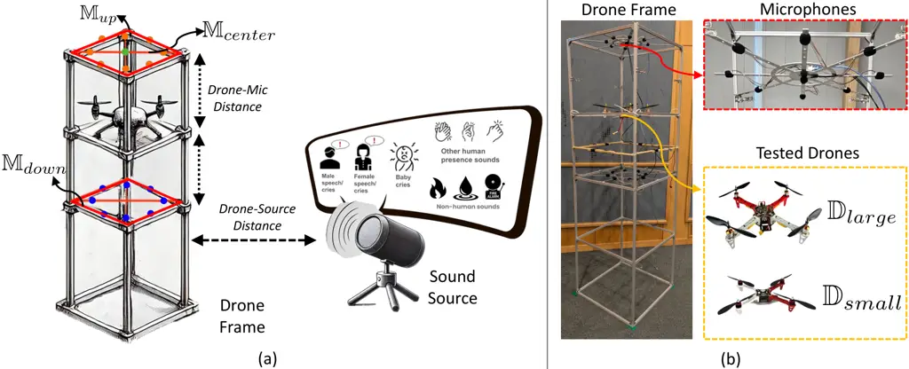

Figure 1: Figure (a) illustrates our experimental setup with the drone
attached to a fixed aluminum frame, with two microphone arrays,
$`\mathbb{M}_{up}`$ and $`\mathbb{M}_{down}`$, and a single microphone,
$`\mathbb{M}_{center}`$. The source sounds (i.e., human vocal sounds,
human presence sounds and ambient sounds) are transmitted through a
speaker. (b) the actual setup – the drone frame, microphone array, and
the drones used.

We introduce a novel search-and-rescue drone audition dataset designed
to identify human presence sounds by emulating realistic drone recording
settings. To ensure diversity, our dataset incorporates variations in
drone attributes (types and throttle speeds), microphone configurations
(array setups and placements), and human sounds (types, locations and
loudness).

### 3.1 Data Collection Overview

Figure 1(a) depicts our experimental setup with an aluminum frame
structure housing the drone. Similar to an ideal search-and-rescue
setting where the drone hovers (while remaining static in air), we affix
the drone to the frame to emulate the scenario, while also increasing
flexibility for experimenting different recording configurations. We
envision that in a real scenario, the microphones will be connected to
drones, either directly affixed or through a solid structure, both of
which will involve mechanical coupling between the drone and the
microphones, resulting in structural vibrations being captured by the
microphones. Hence, we created a setup with a common frame between the
two. In addition, throughout the recording sessions, we ensured that the
drone remained securely and evenly attached to the frame to prevent any
anomalous vibrations. Figure 1(b) shows the actual setup image of the
frame, as well as the microphones and drones used. While most of our
dataset includes audio data collected while simultaneously operating the
drone and transmitting source sounds, we also collect drone-only and
source-only audio data, for signal-to-noise ratio (SNR) computations
(see Section 3.5). In Table 2, we enumerate all data recording
configurations such as different drones, throttle levels, microphones,
drone-microphone distances, sound sources, drone-source distances,
source loudness levels, as well as environments. To the best of our
knowledge, this is the largest search-and-rescue-focused drone audition
dataset, with 23.5 hours of high-quality audio recordings.

### 3.2 Drone Attributes

We experiment with quadcopters, consisting of four sets of motors and
propellers, which are suited for indoor search-and-rescue settings given
their quick maneuverability and vertical takeoff and landing
capabilities \[6, 1\]. In particular, we use DJI F450 \[3\] and DJI
F330 \[5\] drones, with 45 cm and 33 cm wheelbase (i.e., diagonal
motor-to-motor distance), henceforth referred to as
$`\mathbb{D}_{large}`$ and $`\mathbb{D}_{small}`$, respectively. We
chose drones of different sizes due to their varied ego-noise profiles,
providing diversity to our audition dataset (see Table 4 in Appendix for
specification comparison of the two drones). We collect data in two
throttle speeds, ‘low’ and ‘high’ (sound pressure levels of the two
speeds is provided in Appendix Table 5), while affixing the drone firmly
to the aluminum frame, to emulate the hover mode. The drone is affixed
to the frame at a height of 1.5 m from the ground. Please refer to
Appendix A for detailed drone noise profiles.

### 3.3 Microphone Attributes

To systematically study drone acoustics in the absence of standard
microphone placement guidelines, we deploy 17 microphones in a flexible
experimental configuration. This includes two 8-channel circular arrays
($`\mathbb{M}_{up}`$ and $`\mathbb{M}_{down}`$, above and below the
drone respectively) using ICS-43434 microphones⁶⁶ 6
[https://invensense.tdk.com/products/ics-43434/](https://invensense.tdk.com/products/ics-43434/)
and a central standalone mic⁷⁷ 7
[https://soundskrit.ca/](https://soundskrit.ca/) above the drone
($`\mathbb{M}_{center}`$), all mounted on a shared frame with the drone
(Fig. 1). The frequency response of each microphone of the 8-channel
microphone arrays is 60 Hz to 20 kHz, and that of the central standalone
microphone is 80 Hz to 10 kHz. We configure our arrays at 25 cm and
50 cm from the drone, to enable array configuration experimentation,
while maintaining coupling with the drone, similar to a real-world
setup. All microphones were covered with a microphone foam to reduce
noise, especially wind noise.

The two 8-microphone arrays provide spatial acoustic diversity, with
microphone channels strategically placed under, above, and between
propellers. The microphone array diameters scale with drone size (50 cm
for $`\mathbb{D}_{large}`$, 30 cm for $`\mathbb{D}_{small}`$), matching
their wheelbases (45 cm/33 cm) to preserve center of gravity. The
complete assembly of a microphone array (together with its mounting
plate) weighs 270 grams, which is under each drone’s payload capacity
(Table 4), ensuring flight viability.

[TABLE]

Table 2: Table summarizes all the data collection of DroneAudioset,
consisting of three recording settings – combined drone and source,
drone-only as well as source-only recordings. Within each, we vary the
attributes of – drones (type, throttle), microphones (configuration,
distance) and sources (signal type, distance, loudness). In total, our
dataset amounts to 23.5 hours of recording time.

### 3.4 Sound-Source Attributes

Source Signal Types. We consider three categories of commonly occurring
sounds in search and rescue settings: human vocal (HV) sounds such as
speech, screams, and cries, compiled from Google’s Audioset \[11\],
Freesound⁸⁸ 8 [https://freesound.org/](https://freesound.org/), and
audio distress dataset \[9\], human non-vocal (HNV) sounds such as door
knocks, and clapping, that indicate human presence, and ambient
non-human (NH) sounds, such as fire crackling and water dripping, that
may trigger false alarms. We curate HNV and NH categories from
Freesound, with complete file details provided in Appendix Table 6. The
15 hours of drone+source recordings listed in Table 2 is split into HV,
HNV, and NH in the ratio of 3:1:1, where HV category consists of equal
parts of male, female, and baby crying sound types. These source audio
files were played through a JBL Flip 6 Bluetooth speaker, with a
frequency response from 63 Hz to 20 kHz, and a signal-to-noise ratio
over 80 dB, sufficient to replicate low, mid and high frequencies of
human speech, screams and non-verbal cues, as well as ambient sounds,
such as, dripping water and burning fire.

Source Loudness Types. We calibrated audio playback at two intensity
levels: typical scream loudness (90–100 dB) and typical speech loudness
(60–70 dB) for $`\mathbb{D}_{large}`$, while only the quieter speech
range for $`\mathbb{D}_{small}`$ to evaluate performance under more
challenging conditions.

Source Distances and Angles. We perform experiments in three different
indoor environments, – a small conference room ($`\text{room}_{1}`$),
two large multi-purpose halls ($`\text{room}_{2}`$ and
$`\text{room}_{3}`$), within our university. In terms of dimensions,
$`\text{room}_{1}`$ was a small sized room (6.5m $`\times`$ 5m
$`\times`$ 2.5m), while $`\text{room}_{2}`$ (16.5m $`\times`$ 11m
$`\times`$ 2.5m) and $`\text{room}_{3}`$ (14m $`\times`$ 9.5m $`\times`$
6.9m). The three rooms have varying multi-path effects with
reverberation times of 1.34s, 0.83s and 1.3s⁹⁹ 9 Measured using:
[https://www.soniflex.com/en/information-service/information-service/room-acoustics-measurement-app](https://www.soniflex.com/en/information-service/information-service/room-acoustics-measurement-app).
In the small room (room₁), we chose source-to-drone horizontal distances
1m, 3m, and 5m, while in the big rooms (room₂ and room₃), we chose
longer distances 3m, 6m, and 9m. Across all settings, we placed the
speaker at a height of 40 cm above the ground on a stand, and an azimuth
of $`225^{\circ}`$, with respect to the microphone array.

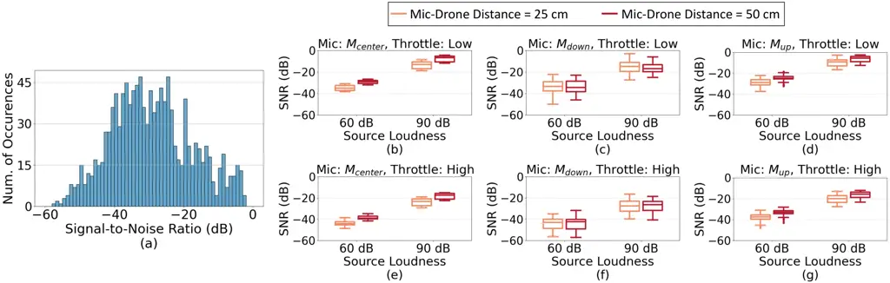

Figure 2: Figure (a) depicts the histogram of signal-to-noise ratios
(SNRs) of all the data collected, and (b-g) depict the SNRs achieved
across three different microphones and two drone throttle levels.
Specifically, each box plot contrasts the SNR levels for different
source loudness levels (60 dB and 90 dB), and microphone-drone distances
(25 cm and 50 cm).

### 3.5 Signal-to-Noise Ratio Distributions

We quantify dataset diversity using signal-to-noise ratios (SNRs),
computed as $`SNR_{dB}=20*log_{10}({RMS_{source}}/{RMS_{drone}})`$,
where $`RMS_{source}`$ and $`RMS_{drone}`$ represent root mean square
amplitude values of individual source and drone recordings respectively.
Figure 2(a) visualizes the overall distribution of SNRs across all the
different settings: drones and their throttles, microphones and their
placements, source sounds and their volumes, and rooms. It shows that
our dataset spans SNRs from -57.2 dB to -2.5 dB, with consistently
negative values demonstrating drone noise dominance, a key challenge for
noise suppression and human-presence detection. Detailed analysis in
Figures 2(b-g) shows expected patterns: higher source loudness (90 dB
scream level) yields better SNRs than speech-level sounds (60 dB), while
the microphones below the drone $`\mathbb{M}_{down}`$ consistently
underperforms compared to the other microphones due to wind noise
exposure, exhibiting the lowest median SNR across comparable conditions
of throttle level, source loudness, and mic-drone distance.

## 4 Evaluation

We evaluate two use-case scenarios of the DroneAudioset dataset: (a) to
detect human presence in indoor search and rescue, and (b) to derive
design recommendations for drone-audition systems.

### 4.1 Application 1: Detecting Human Presence

We outline a two-stage system for a drone-audition system aimed at
detecting human presence: 1) Noise Suppression, to remove the noise
generated or caused by the drone, and enhance the sounds indicating
human presence, and 2) Identification of Human Presence through
classification of the enhanced audio from the first stage as either
human or non-human. A detailed block diagram of these stages is provided
in Figure 3.

Noise Suppression Baselines and Metrics. We evaluate the effectiveness
of the following state-of-the-art audio enhancement methods on the
collected drone audio dataset:

• Traditional Enhancement (Trad.). Given that we have 8-channel
microphone arrays, $`\mathbb{M}_{down}`$ and $`\mathbb{M}_{up}`$, we
perform the well-known Minimum Variance Distortionless Response (MVDR)
beamforming¹⁰¹⁰ 10 For the standalone single-channel microphone,
$`\mathbb{M}_{center}`$, we skip beamforming as it is not applicable.
using the SpeechBrain library \[26, 20, 19\]. MVDR takes as inputs the
source’s location, i.e., (x,y,z) co-ordinates to calculate the azimuth
and elevation direction, as well as the drone-only signals, for
enhancing directional signals corresponding to the source while
suppressing the drone noise. Subsequently, we perform noise suppression
through spectral gating using NoiseReduce library \[24, 23\], which
gates all noise below their corresponding frequency-specific thresholds,
that are estimated for every short-time window, to account for
non-stationary signals such as drone noise. We set the following values
to the parameters: stationary:False and aggressiveness:0.5.

• Neural Enhancement (Neural). We leverage MPSENet (Magnitude and Phase
Speech Enhancement Network) \[13\], which is a neural enhancement
technique designed for suppressing noise while preserving speech
integrity, due to its accurate magnitude and phase estimation. It has
proven effective for the VoiceBank+DEMAND as well as Deep Noise
Suppression Challenge datasets and has an open-source model. As MPSENET
can only take a single audio channel as input, we choose the channel
with least root mean square (RMS) amplitude among the 8-ch microphones,
assuming it would have the least amount of drone noise.

• Beamforming + Neural Enhancement (Hybrid). Here, similar to the neural
approach, we leverage MPSeNet noise suppression, but instead of choosing
a channel based on least RMS, we utilize the beamformed signal as input
for improved noise robustness.

Metrics. We use the Scale-Invariant Signal-to-Distortion Ratio (SI-SDR)
metric which measures the quality of a reconstructed signal by comparing
it to a reference signal while being invariant to scale changes –
$`\text{SI-SDR}=10\log_{10}\left({|\alpha\mathbf{x}|^{2}}/{|\alpha\mathbf{x}-\hat{\mathbf{x}}|^{2}}\right)`$,
where
$`\alpha={\hat{\mathbf{x}}^{\intercal}\mathbf{x}}/{|\mathbf{x}|^{2}}`$,
$`\mathbf{x}`$ is the reference signal and $`\hat{\mathbf{x}}`$ is the
estimate. We prefer SI-SDR over other metrics such as PESQ due to its
suitability for non-speech sounds. SI-SDR is computed for each recording
configuration (in Table 2), and mean and standard deviation are computed
across all audio segments within an SNR group (informed by Figure 2).

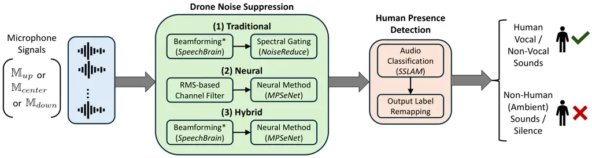

Figure 3: Figure illustrates the current benchmarking pipeline, that
takes as input the audio recordings from one of the microphones,
$`\mathbb{M}_{up}`$, $`\mathbb{M}_{center}`$ or $`\mathbb{M}_{down}`$.
Our pipeline consists of drone noise suppression (which we evaluate for
three combinations of algorithms), followed by human-presence detection,
that ultimately predicts audio file as corresponding to human sounds
(vocal, non-vocal) or non-human sounds (ambient), or silence. Here ^(∗)
indicates the absence of beamforming for microphone,
$`\mathbb{M}_{center}`$, as it consists of only a single microphone.

Audio Event Detection Baselines and Metrics. Here, our goal is to
classify the noise-suppressed, drone-infused source recordings into
three classes: vocal sounds, non-vocal human sounds and ambient
non-human sounds, to ultimately detect human presence. For this purpose,
we adopt SSLAM (Self-Supervised Learning from Audio Mixtures) \[2\], a
state-of-the-art audio transformer pre-trained on AudioSet \[11\] as an
audio classifier to test on our dataset. SSLAM is designed to robustly
detect and classify source sound in presence of other overlapping
sounds, and is shown to outperform other existing models in the task of
audio classification on audioset and has an open source model.
Pre-training on AudioSet also ensures coverage of diverse acoustic
events.

Metrics. We map SSLAM’s 527 AudioSet output labels into four audio
classes: human vocal (HV), human non-vocal (HNV), non-human (NH), as
well as silence, using deterministic rules (e.g., "Speech" → HV, "Clap"→
HNV, "Wind" → NH). We provide the lookup table in our project’s GitHub
repository. Subsequently, we use per-class F1-score, which is the
harmonic mean of per-class precision and recall, to report the
classification performance of the model for the three source classes.
Similar to SI-SDR, F1-score is computed across all audio segments per
configuration, and mean and standard deviation are computed across all
F1-scores of segments within an SNR group.

Results: Noise Suppression. Table 3 shows the SI-SDR scores of the three
noise suppression methods (Trad., Neural, Hybrid) as well as the
original unprocessed audio (No Proc.) in four SNR groups. As shown in
Figure 2(b-g), low SNRs typically result from high drone throttle or low
source volume, while high SNRs arise from the opposite conditions.

|                             |          |                       |          |                       |          |                       |          |                      |           |                      |           |                      |           |
| --------------------------- | -------- | --------------------- | -------- | --------------------- | -------- | --------------------- | -------- | -------------------- | --------- | -------------------- | --------- | -------------------- | --------- |
| SNR Group                   | Method   | SI-SDR (dB)           |          |                       |          |                       |          | F1 Score             |           |                      |           |                      |           |
|                             |          | HV                    |          | HNV                   |          | NH                    |          | HV                   |           | HNV                  |           | NH                   |           |
| $`>-10`$ dB                 | No Proc. | $`-17.03`$$`{}\pm{}`$ | $`6.97`$ | $`-21.94`$$`{}\pm{}`$ | $`5.75`$ | $`-11.86`$$`{}\pm{}`$ | $`4.75`$ | -                    |           | -                    |           | -                    |           |
|                             | Trad.    | $`-14.12`$$`{}\pm{}`$ | $`7.32`$ | $`-17.75`$$`{}\pm{}`$ | $`7.05`$ | $`-10.60`$$`{}\pm{}`$ | $`5.35`$ | -                    |           | -                    |           | -                    |           |
|                             | Neural   | -12.37$`{}\pm{}`$     | $`8.72`$ | -14.03$`{}\pm{}`$     | $`8.35`$ | $`-12.33`$$`{}\pm{}`$ | $`9.24`$ | 0.874$`{}\pm{}`$     | $`0.007`$ | $`0.232`$$`{}\pm{}`$ | $`0.025`$ | 0.192$`{}\pm{}`$     | $`0.078`$ |
|                             | Hybrid   | $`-14.00`$$`{}\pm{}`$ | $`8.36`$ | $`-14.94`$$`{}\pm{}`$ | $`7.77`$ | $`-15.32`$$`{}\pm{}`$ | $`8.89`$ | $`0.829`$$`{}\pm{}`$ | $`0.011`$ | 0.280$`{}\pm{}`$     | $`0.076`$ | $`0.000`$$`{}\pm{}`$ | $`0.000`$ |
| -20 to -10 dB               | No Proc. | $`-22.74`$$`{}\pm{}`$ | $`5.57`$ | $`-25.91`$$`{}\pm{}`$ | $`4.05`$ | $`-18.41`$$`{}\pm{}`$ | $`5.56`$ | -                    |           | -                    |           | -                    |           |
|                             | Trad.    | $`-21.19`$$`{}\pm{}`$ | $`6.00`$ | $`-24.27`$$`{}\pm{}`$ | $`4.72`$ | $`-18.42`$$`{}\pm{}`$ | $`5.72`$ | -                    |           | -                    |           | -                    |           |
|                             | Neural   | -14.30$`{}\pm{}`$     | $`8.76`$ | -16.33$`{}\pm{}`$     | $`8.44`$ | -15.80$`{}\pm{}`$     | $`9.48`$ | 0.843$`{}\pm{}`$     | $`0.055`$ | 0.190$`{}\pm{}`$     | $`0.076`$ | 0.274$`{}\pm{}`$     | $`0.057`$ |
|                             | Hybrid   | $`-16.05`$$`{}\pm{}`$ | $`8.08`$ | $`-17.52`$$`{}\pm{}`$ | $`7.60`$ | $`-18.33`$$`{}\pm{}`$ | $`7.57`$ | $`0.755`$$`{}\pm{}`$ | $`0.095`$ | $`0.108`$$`{}\pm{}`$ | $`0.109`$ | $`0.020`$$`{}\pm{}`$ | $`0.024`$ |
| -30 to -20 dB               | No Proc. | $`-28.38`$$`{}\pm{}`$ | $`2.72`$ | $`-29.03`$$`{}\pm{}`$ | $`1.74`$ | $`-26.43`$$`{}\pm{}`$ | $`3.82`$ | -                    |           | -                    |           | -                    |           |
|                             | Trad.    | $`-28.26`$$`{}\pm{}`$ | $`2.44`$ | $`-28.95`$$`{}\pm{}`$ | $`1.67`$ | $`-27.27`$$`{}\pm{}`$ | $`3.67`$ | -                    |           | -                    |           | -                    |           |
|                             | Neural   | -19.77$`{}\pm{}`$     | $`7.07`$ | $`-22.18`$$`{}\pm{}`$ | $`5.89`$ | -20.81$`{}\pm{}`$     | $`6.34`$ | 0.423$`{}\pm{}`$     | $`0.173`$ | 0.072$`{}\pm{}`$     | $`0.025`$ | 0.169$`{}\pm{}`$     | $`0.127`$ |
|                             | Hybrid   | $`-20.25`$$`{}\pm{}`$ | $`6.11`$ | -21.70$`{}\pm{}`$     | $`5.05`$ | $`-21.30`$$`{}\pm{}`$ | $`5.48`$ | $`0.344`$$`{}\pm{}`$ | $`0.066`$ | $`0.011`$$`{}\pm{}`$ | $`0.019`$ | $`0.050`$$`{}\pm{}`$ | $`0.030`$ |
| $`<-30`$ dB                 | No Proc. | $`-29.50`$$`{}\pm{}`$ | $`1.70`$ | $`-29.41`$$`{}\pm{}`$ | $`1.57`$ | $`-29.08`$$`{}\pm{}`$ | $`2.04`$ | -                    |           | -                    |           | -                    |           |
|                             | Trad.    | $`-29.54`$$`{}\pm{}`$ | $`1.62`$ | $`-29.38`$$`{}\pm{}`$ | $`1.43`$ | $`-29.42`$$`{}\pm{}`$ | $`2.10`$ | -                    |           | -                    |           | -                    |           |
|                             | Neural   | $`-23.44`$$`{}\pm{}`$ | $`5.28`$ | $`-23.70`$$`{}\pm{}`$ | $`4.65`$ | $`-23.50`$$`{}\pm{}`$ | $`5.12`$ | $`0.255`$$`{}\pm{}`$ | $`0.071`$ | 0.043$`{}\pm{}`$     | $`0.030`$ | 0.130$`{}\pm{}`$     | $`0.030`$ |
|                             | Hybrid   | -22.76$`{}\pm{}`$     | $`5.26`$ | -22.77$`{}\pm{}`$     | $`4.76`$ | -22.85$`{}\pm{}`$     | $`5.00`$ | 0.311$`{}\pm{}`$     | $`0.142`$ | $`0.025`$$`{}\pm{}`$ | $`0.023`$ | $`0.067`$$`{}\pm{}`$ | $`0.054`$ |
| Clean Recordings (No drone) |          | -                     |          | -                     |          | -                     |          | 0.968                |           | 0.852                |           | 0.796                |           |

Table 3: Comparison of noise suppression performance (SI-SDR in dB) and
classification accuracy (F1 scores) across different SNR groups.
Traditional \[24, 26\], Neural Net \[13\], and Hybrid methods are shown
with mean $`\pm`$ std values computed across audio files within each SNR
group.

Noise suppression performance degrades across all methods as SNR
decreases, with neural approaches (Neural and Hybrid) consistently
outperforming traditional method, especially in extreme low-SNR
conditions (\<-20 dB). For HV sounds, neural methods achieve the largest
gains (e.g., -12.37 dB vs. -17.03 dB at SNR \>-10 dB), as existing
techniques are optimized for vocal patterns. However, HNV and NH sounds
prove challenging, with marginal improvements even for hybrid methods,
as these algorithms have not been trained for such sounds. The hybrid
approach achieves similar performance to neural alone in high SNR
sounds, while at lower SNRs, the hybrid approach tends to perform
better, possibly due to preserving the signal from the source direction
with beamforming. However, accurately finding the source direction
automatically at low SNR conditions would be challenging. Notably, all
methods struggle when SNR falls below -30 dB, highlighting the need for
advanced solutions in extreme noisy drone environments beyond
conventional speech enhancement methods.

Results: Classification. As shown in Table 3, we compute the F1-score
for classification of the noise suppressed audio from the two best noise
suppression methods (Neural and Hybrid), as well as the original clean
(or drone noise-free) recordings. HV sounds showed better classification
performance (F1=0.87 ± 0.007 for SNR\>-10 dB) compared to HNV and NH
sounds, approaching clean recording performance at high SNR. A large
number of HNV and NH instances got classified as silence. This disparity
stems from the noise suppression stage, where these methods achieved
better SI-SDR improvements for vocal sounds enabling cleaner
reconstruction, resulting in more accurate downstream classification.
Classification performance improved with higher input SNR across all
categories, mirroring noise suppression results where low SNR reduced
SI-SDR gains. This direct link between suppression quality and
classification accuracy highlights the need for end-to-end pipeline
optimization in drone audition systems. Refer to Figures 11 and 11 in
Appendix for further visualization of the trends of noise suppression
and classification performances with varying SNRs.

### 4.2 Application 2: Deriving Design Recommendations for Drone-Audition Systems

The DroneAudioset dataset enables hardware design recommendations for
drone-audition systems through recordings with varied parameter
configurations. By analyzing acoustic performance across these
parameters of the dataset and the noise suppression analysis (Section
4.1), we derive practical guidelines and highlight key trade-offs¹¹¹¹ 11
For statistical significance of comparisons in this section, we applied
Shapiro-Wilk normality testing, followed by Tukey HSD (if normal
distribution) or Wilcoxon signed-rank with Bonferroni correction (if
non-normal).

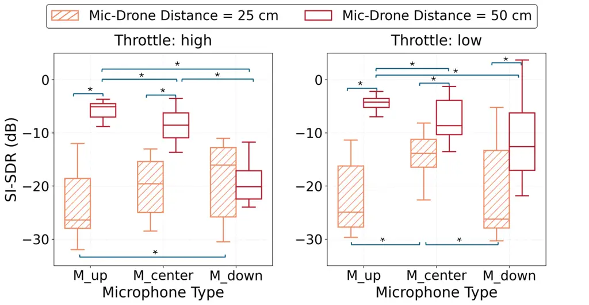

Figure 4: SI-SDR scores for Hybrid noise suppression on HV sounds, for
varied microphone types, drone-microphone distances, at (a) high, (b)
low throttles. \* indicate statistically significant difference¹¹
between pairs ($`p<0.05`$).

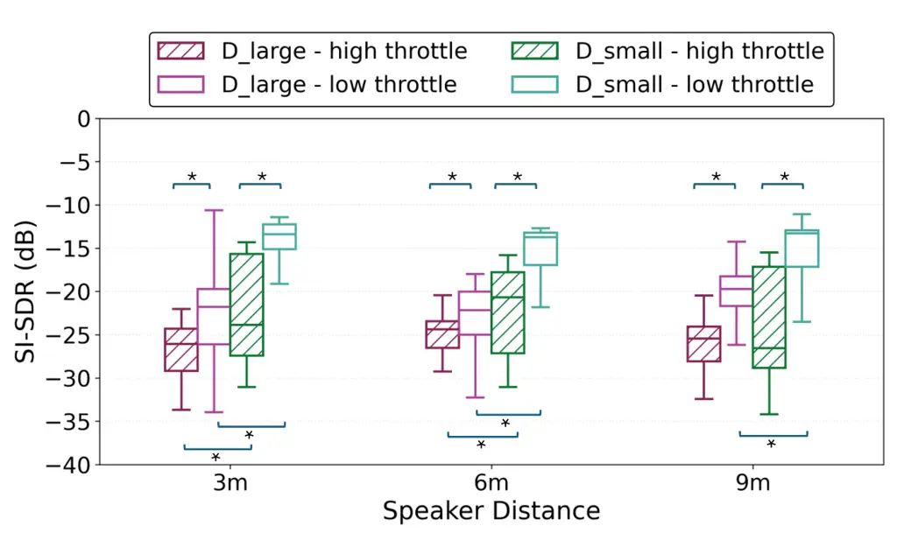

Figure 5: SI-SDR scores for Hybrid noise suppression on HV sounds, for
two drones, at two throttles, as well as drone-speaker distances. \*
indicate statistically significant difference¹¹ between pairs
($`p<0.05`$).

Microphone Placement/Distance Trade-off: In general, below-drone
microphone ($`\mathbb{M}_{down}`$) achieves the least SI-SDR score due
to direct wind noise exposure from propellors, compared to the
above-drone microphones ($`\mathbb{M}_{up}`$, $`\mathbb{M}_{center}`$).
However, below-drone placement offers proximity to ground-level sound
sources. At drone-microphone distance of 25 cm and high throttle setting
(shown in Figure 5(a)¹²¹² 12 In Figure 5, we consider a higher SNR
setting: source vol: 90 dB, $`\mathbb{D}_{large}`$, $`\text{room}_{1}`$,
drone-source distance: 1m), all microphones perform poorly, but
increasing the distance to 50 cm significantly improves performance for
all settings of above-drone microphones as well as low throttle setting
of below-drone microphone (see Figures 5(a) and 5(b)). Overall, these
findings suggest that while above-drone placements are preferable due to
their higher SI-SDR scores, below-drone placements may be viable at
lower throttle settings with greater suspension distance (see
$`\lx@sectionsign`$5).

Microphone Array Trade-offs: The 8-channel array above the drone
($`\mathbb{M}_{up}`$) provides beamforming capabilities, resulting in
significant improvement in the SI-SDR (p\<0.05) over a single-channel
microphone ($`\mathbb{M}_{center}`$) in high SNR conditions, e.g., low
throttle, 50 cm drone-to-microphone distance (Fig. 5(b)). However,
microphone array has higher processing demands, hence system designers
must weigh these trade-offs against mission needs. While
multi-microphone arrays are valuable for precise source localization,
single-microphone setups may be preferable for missions where memory and
power constraints are critical.

Drone Throttle Adjustments: As depicted in Figure 5, at a low SNR
setting¹³¹³ 13 In Figure 5, we consider a lower SNR setting: source vol:
60 dB, drone-microphone distance: 50 cm, the SI-SDR performance improves
significantly (p\<0.05) at lower throttle across both drones,
$`\mathbb{D}_{large}`$ and $`\mathbb{D}_{small}`$, compared to high
throttle. This suggests that drone audition systems should incorporate
adaptive throttle reduction strategies during critical listening
periods, particularly when detecting faint sounds or during search
patterns where audio detection outweighs mobility needs.

Drone Size Trade-offs: Figure 5 shows that $`\mathbb{D}_{small}`$
achieves higher SI-SDR scores than $`\mathbb{D}_{large}`$ at both low
and high throttle levels, even at higher drone-source distances,
demonstrating the difference in ego-noise across drones. In general,
larger drones (\>1.5 kg payload) support advanced recording setups,
compared to smaller drones that enable only lightweight configurations.
Hence, mission planning must weigh payload capacity against acoustic
performance requirements.

## 5 Discussion

New Research Opportunities. The DroneAudioset dataset provides a
publicly available benchmarking resource for developing next-generation
noise suppression algorithms and audio classification models capable of
operating under the extreme low-SNR conditions characteristic of drone
recordings. Researchers can leverage the dataset’s controlled variations
in throttle levels, and microphone configurations, to train models that
adapt to different noise profiles. Our dataset includes separately
recorded source and drone sounds that would support data augmentation
strategies for training as well as for simulating multi-source
conditions. While the recordings were made at a single azimuth, the
controlled variations in the dataset could be combined with spatial
augmentation techniques to simulate multi-azimuth scenarios. Thus,
beyond human presence detection, our dataset offers potential utility
for sound localization, speech recovery and other applications in mobile
robotics.

Broader Impact. This work enables positive societal impact through
improved search-and-rescue capabilities, particularly in disaster
scenarios where visual systems fail. However, we acknowledge potential
negative applications in unauthorized surveillance, as enhanced drone
audition could compromise privacy if misused. While our dataset focuses
on humanitarian applications, we recommend deployment safeguards
including access controls for sensitive data, onboard processing to
minimize raw audio transmission, and clear usage guidelines for ethical
adoption.

Limitations and Future Work. While our dataset spans 216 unique
configurations, including variations in drones, microphones, and
recording environments, it does not encompass the whole distribution of
acoustic profiles encountered in real-world scenarios. We perform
experiments across three distinct indoor environments, additionally
varying the drone-to-source distance to introduce diversity in
reverberation and multipath effects. However, we acknowledge that this
alone is insufficient to represent the broad spectrum of cluttered,
reflective, and absorptive materials that may be present in real-world
search and rescue contexts. Data augmentation approaches based on
synthetic room impulse responses, such as those proposed by Tang et
al. \[28\], offer a promising direction for expanding the dataset and
enhancing model generalization under reverberant conditions. Moreover,
while this study primarily focused on detecting human distress sounds
for rescue purposes, future work could extend to the detection of
non-human auditory cues relevant to emergency response, such as the
acoustic signatures of fire, structural collapse, to provide a more
comprehensive situational awareness framework.

Another limitation stems from our method of simulating drone hovering by
attaching the drone to a frame. Although this setup emulates a hovering
drone, it does not fully capture the micro-dynamics of real hovering,
such as the subtle balancing adjustments that can influence the drone’s
acoustic profile. However, our data-collection design enables controlled
measurements across a wide range of drone-microphone and drone-source
distances, provides recommendations for developing the recording setup
in a real-world hovering scenario. Future work should include practical
deployment considerations such as suspending microphones versus mounting
microphones close to the body of the drone, payload capacity of the
drone, as well as computational considerations of on-board versus
off-board audio processing.

In addition, our current dataset primarily represents indoor and
semi-controlled acoustic conditions. Outdoor environments differ
substantially, with dominant sources of wind noise rather than
reverberation or multipath reflections, and typically lower
signal-to-noise ratios due to larger drone–source distances. Expanding
the dataset to include outdoor recordings would therefore add valuable
diversity and realism. An incremental next step could involve conducting
low-risk outdoor flights and synthetically augmenting the captured data
with target sounds to simulate realistic rescue scenarios.

While a more diverse and realistic dataset would be beneficial, we
believe that DroneAudioset is a significant initial step towards
enabling audio capture in drone-based search and rescue.

## 6 Conclusion

We present DroneAudioset dataset which is designed for human presence
detection in drone-based indoor search and rescue settings. The dataset
includes acoustic profiles in a wide range of SNR values from -57.2 dB
to -2.5 dB, collected with various drones, microphones and source
sounds. Overall, our dataset accounts to 23.5 hours of recording
duration, making it the largest drone audition dataset to the best of
our knowledge. We also benchmark SOTA noise suppression and audio event
detection methods, which work poorly, especially in the presence of
non-vocal human sounds and ambient sounds. Moving forward, we hope our
dataset serves as a stepping stone for enabling drone audition, even
beyond search and rescue settings.

## 7 Acknowledgments

We would like to thank the research assistants, Nihirra Kakkar and Ho
Him Chan for their help during the recording sessions.

## References

- \[1\] Propeller Aero. Fixed-wing & vtol drones vs quadcopters for
  surveying: How to decide.
  [https://www.propelleraero.com/blog/fixed-wing-vtol-drones-vs-quadcopters-for-surveying-how-to-decide/](https://www.propelleraero.com/blog/fixed-wing-vtol-drones-vs-quadcopters-for-surveying-how-to-decide/),
  Accessed 2025.
- \[2\] Tony Alex, Sara Atito, Armin Mustafa, Muhammad Awais, and Philip
  J B Jackson. SSLAM: Enhancing self-supervised models with audio
  mixtures for polyphonic soundscapes. In The Thirteenth International
  Conference on Learning Representations, 2025.
- \[3\] Amazon. Dji f450 drone kit.
  [https://www.amazon.sg/HAWKS-WORK-Quadcopter-Brushless-Transmitter/dp/B0DG2L1TQL/](https://www.amazon.sg/HAWKS-WORK-Quadcopter-Brushless-Transmitter/dp/B0DG2L1TQL/),
  Accessed 2025.
- \[4\] Antoine Deleforge. Drone audition for search and rescue:
  Datasets and challenges. In QUIET DRONES International Symposium on
  UAV/UAS Noise, 2020.
- \[5\] DJI. Dji f330 drone kit.
  [https://www-v1.dji.com/flame-wheel-arf/spec.html](https://www-v1.dji.com/flame-wheel-arf/spec.html),
  Accessed 2025.
- \[6\] DroneNerds. Fixed wing vs. quadcopter: Which to use when?
  [https://enterprise.dronenerds.com/blog/enterprise-drone-program/fixed-wing-vs-quadcopter-which-to-use-when/](https://enterprise.dronenerds.com/blog/enterprise-drone-program/fixed-wing-vs-quadcopter-which-to-use-when/),
  Accessed 2025.
- \[7\] Harishchandra Dubey, Ashkan Aazami, Vishak Gopal, Babak Naderi,
  Sebastian Braun, Ross Cutler, Hannes Gamper, Mehrsa Golestaneh, and
  Robert Aichner. Icassp 2023 deep noise suppression challenge. In
  ICASSP, 2023.
- \[8\] Eduardo Fonseca, Xavier Favory, Jordi Pons, Frederic Font, and
  Xavier Serra. FSD50K: an open dataset of human-labeled sound events.
  IEEE/ACM Transactions on Audio, Speech, and Language Processing,
  30:829–852, 2022.
- \[9\] Jorge Felipe Gaviria, Alejandra Escalante-Perez, Juan Camilo
  Castiblanco, Nicolas Vergara, Valentina Parra-Garces, Juan David
  Serrano, Andres Felipe Zambrano, and Luis Felipe Giraldo. Deep
  learning-based portable device for audio distress signal recognition
  in urban areas. Applied Sciences, 10(21), 2020.
- \[10\] Timnit Gebru, Jamie Morgenstern, Briana Vecchione,
  Jennifer Wortman Vaughan, Hanna Wallach, Hal Daumé Iii, and Kate
  Crawford. Datasheets for datasets. Communications of the ACM,
  64(12):86–92, 2021.
- \[11\] Jort F. Gemmeke, Daniel P. W. Ellis, Dylan Freedman, Aren
  Jansen, Wade Lawrence, R. Channing Moore, Manoj Plakal, and Marvin
  Ritter. Audio set: An ontology and human-labeled dataset for audio
  events. In 2017 IEEE International Conference on Acoustics, Speech and
  Signal Processing (ICASSP), pages 776–780, 2017.
- \[12\] Harini Kolamunna, Thilini Dahanayaka, Junye Li, Suranga
  Seneviratne, Kanchana Thilakaratne, Albert Y. Zomaya, and Aruna
  Seneviratne. Droneprint: Acoustic signatures for open-set drone
  detection and identification with online data. 5(1), March 2021.
- \[13\] Ye-Xin Lu, Yang Ai, and Zhen-Hua Ling. Mp-senet: A speech
  enhancement model with parallel denoising of magnitude and phase
  spectra. arXiv preprint arXiv:2305.13686, 2023.
- \[14\] Jose Martinez-Carranza and Caleb Rascon. A review on auditory
  perception for unmanned aerial vehicles. Sensors, 20(24), 2020.
- \[15\] Takayuki Morito, Osamu Sugiyama, Ryosuke Kojima, and Kazuhiro
  Nakadai. Partially shared deep neural network in sound source
  separation and identification using a uav-embedded microphone array.
  In 2016 IEEE/RSJ International Conference on Intelligent Robots and
  Systems (IROS), pages 1299–1304. IEEE, 2016.
- \[16\] Takayuki Morito, Osamu Sugiyama, Satoshi Uemura, Ryosuke
  Kojima, and Kazuhiro Nakadai. Reduction of computational cost using
  two-stage deep neural network for training for denoising and sound
  source identification. In Trends in Applied Knowledge-Based Systems
  and Data Science: 29th International Conference on Industrial
  Engineering and Other Applications of Applied Intelligent Systems,
  IEA/AIE 2016, Morioka, Japan, August 2-4, 2016, Proceedings 29, pages
  562–573. Springer, 2016.
- \[17\] Vassil Panayotov, Guoguo Chen, Daniel Povey, and Sanjeev
  Khudanpur. Librispeech: An asr corpus based on public domain audio
  books. In 2015 IEEE International Conference on Acoustics, Speech and
  Signal Processing (ICASSP), pages 5206–5210, 2015.
- \[18\] Archontis Politis, Kazuki Shimada, Parthasaarathy Sudarsanam,
  Sharath Adavanne, Daniel Krause, Yuichiro Koyama, Naoya Takahashi,
  Shusuke Takahashi, Yuki Mitsufuji, and Tuomas Virtanen. Starss22: A
  dataset of spatial recordings of real scenes with spatiotemporal
  annotations of sound events. arXiv preprint arXiv:2206.01948, 2022.
- \[19\] Mirco Ravanelli, Titouan Parcollet, Adel Moumen, Sylvain
  de Langen, Cem Subakan, Peter Plantinga, Yingzhi Wang, Pooneh Mousavi,
  Luca Della Libera, Artem Ploujnikov, Francesco Paissan, Davide Borra,
  Salah Zaiem, Zeyu Zhao, Shucong Zhang, Georgios Karakasidis, Sung-Lin
  Yeh, Pierre Champion, Aku Rouhe, Rudolf Braun, Florian Mai, Juan
  Zuluaga-Gomez, Seyed Mahed Mousavi, Andreas Nautsch, Ha Nguyen,
  Xuechen Liu, Sangeet Sagar, Jarod Duret, Salima Mdhaffar, Gaëlle
  Laperrière, Mickael Rouvier, Renato De Mori, and Yannick Estève.
  Open-source conversational ai with speechbrain 1.0. Journal of Machine
  Learning Research, 25(333), 2024.
- \[20\] Mirco Ravanelli, Titouan Parcollet, Peter Plantinga, Aku Rouhe,
  Samuele Cornell, Loren Lugosch, Cem Subakan, Nauman Dawalatabad,
  Abdelwahab Heba, Jianyuan Zhong, Ju-Chieh Chou, Sung-Lin Yeh, Szu-Wei
  Fu, Chien-Feng Liao, Elena Rastorgueva, François Grondin, William
  Aris, Hwidong Na, Yan Gao, Renato De Mori, and Yoshua Bengio.
  SpeechBrain: A general-purpose speech toolkit, 2021. arXiv:2106.04624.
- \[21\] CK Reddy, E Beyrami, H Dubey, V Gopal, R Cheng, R Cutler,
  S Matusevych, R Aichner, A Aazami, S Braun, et al. The interspeech
  2020 deep noise suppression challenge: Datasets, subjective speech
  quality and testing framework. arxiv 2020. arXiv preprint
  arXiv:2001.08662, 2020.
- \[22\] Oscar Ruiz-Espitia, Jose Martinez-Carranza, and Caleb Rascon.
  Aira-uas: an evaluation corpus for audio processing in unmanned aerial
  system. In 2018 International Conference on Unmanned Aircraft Systems
  (ICUAS), pages 836–845. IEEE, 2018.
- \[23\] Tim Sainburg. timsainb/noisereduce: v1.0, June 2019.
- \[24\] Tim Sainburg, Marvin Thielk, and Timothy Q Gentner. Finding,
  visualizing, and quantifying latent structure across diverse animal
  vocal repertoires. PLoS computational biology, 16(10):e1008228, 2020.
- \[25\] Romain Serizel, Nicolas Turpault, Ankit Shah, and Justin
  Salamon. Sound event detection in synthetic domestic environments. In
  ICASSP 2020-2020 IEEE International Conference on Acoustics, Speech
  and Signal Processing (ICASSP), pages 86–90. IEEE, 2020.
- \[26\] Mehrez Souden, Jacob Benesty, and Sofiene Affes. On optimal
  frequency-domain multichannel linear filtering for noise reduction.
  IEEE Transactions on audio, speech, and language processing,
  18(2):260–276, 2009.
- \[27\] Martin Strauss, Pol Mordel, Victor Miguet, and Antoine
  Deleforge. Dregon: Dataset and methods for uav-embedded sound source
  localization. In 2018 IEEE/RSJ International Conference on Intelligent
  Robots and Systems (IROS), pages 1–8. IEEE, 2018.
- \[28\] Zhenyu Tang, Rohith Aralikatti, Anton Jeran Ratnarajah, and
  Dinesh Manocha. Gwa: A large high-quality acoustic dataset for audio
  processing. In ACM SIGGRAPH 2022 Conference Proceedings, pages
  1–9, 2022.
- \[29\] Nicolas Turpault, Romain Serizel, Ankit Parag Shah, and Justin
  Salamon. Sound event detection in domestic environments with weakly
  labeled data and soundscape synthesis. In Workshop on Detection and
  Classification of Acoustic Scenes and Events, 2019.
- \[30\] Lin Wang, Ricardo Sanchez-Matilla, and Andrea Cavallaro.
  Audio-visual sensing from a quadcopter: dataset and baselines for
  source localization and sound enhancement. In 2019 IEEE/RSJ
  International Conference on Intelligent Robots and Systems (IROS),
  pages 5320–5325. IEEE, 2019.
- \[31\] Tsubasa Yano, Benjamin Yen, Katsutoshi Itoyama, and Kazuhiro
  Nakadai. Ground surface material classification with drone noise. 2024.

## NeurIPS Paper Checklist

1.  1.  Claims
2.  Question: Do the main claims made in the abstract and introduction
    accurately reflect the paper’s contributions and scope?
3.  Answer: \[Yes\]
4.  Justification: The dataset DroneAudioset size, characteristics, and
    usage scenarios have been summarized both in the abstract and the
    last paragraph of introduction section.
5.  Guidelines:
    - •
      The answer NA means that the abstract and introduction do not
      include the claims made in the paper.
    - •
      The abstract and/or introduction should clearly state the claims
      made, including the contributions made in the paper and important
      assumptions and limitations. A No or NA answer to this question
      will not be perceived well by the reviewers.
    - •
      The claims made should match theoretical and experimental results,
      and reflect how much the results can be expected to generalize to
      other settings.
    - •
      It is fine to include aspirational goals as motivation as long as
      it is clear that these goals are not attained by the paper.

6.  2.  Limitations
7.  Question: Does the paper discuss the limitations of the work
    performed by the authors?
8.  Answer: \[Yes\]
9.  Justification: Section 5 has a subsection on Limitations and Future
    Work.
10. Guidelines:
    - •
      The answer NA means that the paper has no limitation while the
      answer No means that the paper has limitations, but those are not
      discussed in the paper.
    - •
      The authors are encouraged to create a separate "Limitations"
      section in their paper.
    - •
      The paper should point out any strong assumptions and how robust
      the results are to violations of these assumptions (e.g.,
      independence assumptions, noiseless settings, model
      well-specification, asymptotic approximations only holding
      locally). The authors should reflect on how these assumptions
      might be violated in practice and what the implications would be.
    - •
      The authors should reflect on the scope of the claims made, e.g.,
      if the approach was only tested on a few datasets or with a few
      runs. In general, empirical results often depend on implicit
      assumptions, which should be articulated.
    - •
      The authors should reflect on the factors that influence the
      performance of the approach. For example, a facial recognition
      algorithm may perform poorly when image resolution is low or
      images are taken in low lighting. Or a speech-to-text system might
      not be used reliably to provide closed captions for online
      lectures because it fails to handle technical jargon.
    - •
      The authors should discuss the computational efficiency of the
      proposed algorithms and how they scale with dataset size.
    - •
      If applicable, the authors should discuss possible limitations of
      their approach to address problems of privacy and fairness.
    - •
      While the authors might fear that complete honesty about
      limitations might be used by reviewers as grounds for rejection, a
      worse outcome might be that reviewers discover limitations that
      aren’t acknowledged in the paper. The authors should use their
      best judgment and recognize that individual actions in favor of
      transparency play an important role in developing norms that
      preserve the integrity of the community. Reviewers will be
      specifically instructed to not penalize honesty concerning
      limitations.

11. 3.  Theory assumptions and proofs
12. Question: For each theoretical result, does the paper provide the
    full set of assumptions and a complete (and correct) proof?
13. Answer: \[N/A\]
14. Justification: The paper does not have theoretical results.
15. Guidelines:
    - •
      The answer NA means that the paper does not include theoretical
      results.
    - •
      All the theorems, formulas, and proofs in the paper should be
      numbered and cross-referenced.
    - •
      All assumptions should be clearly stated or referenced in the
      statement of any theorems.
    - •
      The proofs can either appear in the main paper or the supplemental
      material, but if they appear in the supplemental material, the
      authors are encouraged to provide a short proof sketch to provide
      intuition.
    - •
      Inversely, any informal proof provided in the core of the paper
      should be complemented by formal proofs provided in appendix or
      supplemental material.
    - •
      Theorems and Lemmas that the proof relies upon should be properly
      referenced.

16. 4.  Experimental result reproducibility
17. Question: Does the paper fully disclose all the information needed
    to reproduce the main experimental results of the paper to the
    extent that it affects the main claims and/or conclusions of the
    paper (regardless of whether the code and data are provided or not)?
18. Answer: \[Yes\]
19. Justification: The details of our dataset collection setup has been
    detailed in Section 3, other supporting details are in Appendix, the
    dataset has been made publicly available.
20. Guidelines:
    - •
      The answer NA means that the paper does not include experiments.
    - •
      If the paper includes experiments, a No answer to this question
      will not be perceived well by the reviewers: Making the paper
      reproducible is important, regardless of whether the code and data
      are provided or not.
    - •
      If the contribution is a dataset and/or model, the authors should
      describe the steps taken to make their results reproducible or
      verifiable.
    - •
      Depending on the contribution, reproducibility can be accomplished
      in various ways. For example, if the contribution is a novel
      architecture, describing the architecture fully might suffice, or
      if the contribution is a specific model and empirical evaluation,
      it may be necessary to either make it possible for others to
      replicate the model with the same dataset, or provide access to
      the model. In general. releasing code and data is often one good
      way to accomplish this, but reproducibility can also be provided
      via detailed instructions for how to replicate the results, access
      to a hosted model (e.g., in the case of a large language model),
      releasing of a model checkpoint, or other means that are
      appropriate to the research performed.
    - •
      While NeurIPS does not require releasing code, the conference does
      require all submissions to provide some reasonable avenue for
      reproducibility, which may depend on the nature of the
      contribution. For example
      1.  (a)
          If the contribution is primarily a new algorithm, the paper
          should make it clear how to reproduce that algorithm.
      2.  (b)
          If the contribution is primarily a new model architecture, the
          paper should describe the architecture clearly and fully.
      3.  (c)
          If the contribution is a new model (e.g., a large language
          model), then there should either be a way to access this model
          for reproducing the results or a way to reproduce the model
          (e.g., with an open-source dataset or instructions for how to
          construct the dataset).
      4.  (d)
          We recognize that reproducibility may be tricky in some cases,
          in which case authors are welcome to describe the particular
          way they provide for reproducibility. In the case of
          closed-source models, it may be that access to the model is
          limited in some way (e.g., to registered users), but it should
          be possible for other researchers to have some path to
          reproducing or verifying the results.

21. 5.  Open access to data and code
22. Question: Does the paper provide open access to the data and code,
    with sufficient instructions to faithfully reproduce the main
    experimental results, as described in supplemental material?
23. Answer: \[Yes\]
24. Justification: We release the dataset publicly, and the link is
    provided in the abstract. For benchmarking, we use code from
    published papers that have their code released, which we provide
    references to in the evaluation section.
25. Guidelines:
    - •
      The answer NA means that paper does not include experiments
      requiring code.
    - •
      Please see the NeurIPS code and data submission guidelines
      ([https://nips.cc/public/guides/CodeSubmissionPolicy](https://nips.cc/public/guides/CodeSubmissionPolicy))
      for more details.
    - •
      While we encourage the release of code and data, we understand
      that this might not be possible, so “No” is an acceptable answer.
      Papers cannot be rejected simply for not including code, unless
      this is central to the contribution (e.g., for a new open-source
      benchmark).
    - •
      The instructions should contain the exact command and environment
      needed to run to reproduce the results. See the NeurIPS code and
      data submission guidelines
      ([https://nips.cc/public/guides/CodeSubmissionPolicy](https://nips.cc/public/guides/CodeSubmissionPolicy))
      for more details.
    - •
      The authors should provide instructions on data access and
      preparation, including how to access the raw data, preprocessed
      data, intermediate data, and generated data, etc.
    - •
      The authors should provide scripts to reproduce all experimental
      results for the new proposed method and baselines. If only a
      subset of experiments are reproducible, they should state which
      ones are omitted from the script and why.
    - •
      At submission time, to preserve anonymity, the authors should
      release anonymized versions (if applicable).
    - •
      Providing as much information as possible in supplemental material
      (appended to the paper) is recommended, but including URLs to data
      and code is permitted.

26. 6.  Experimental setting/details
27. Question: Does the paper specify all the training and test details
    (e.g., data splits, hyperparameters, how they were chosen, type of
    optimizer, etc.) necessary to understand the results?
28. Answer: \[Yes\]
29. Justification: While we do not train a model in this paper, wherever
    appropriate, we mention the hyperparameters used for inference in
    Section 4.
30. Guidelines:
    - •
      The answer NA means that the paper does not include experiments.
    - •
      The experimental setting should be presented in the core of the
      paper to a level of detail that is necessary to appreciate the
      results and make sense of them.
    - •
      The full details can be provided either with the code, in
      appendix, or as supplemental material.

31. 7.  Experiment statistical significance
32. Question: Does the paper report error bars suitably and correctly
    defined or other appropriate information about the statistical
    significance of the experiments?
33. Answer: \[Yes\]
34. Justification: Provided in Table 3, Figures 5 and 5 in the main
    paper, and Figures 11 and 11 in the Appendix.
35. Guidelines:
    - •
      The answer NA means that the paper does not include experiments.
    - •
      The authors should answer "Yes" if the results are accompanied by
      error bars, confidence intervals, or statistical significance
      tests, at least for the experiments that support the main claims
      of the paper.
    - •
      The factors of variability that the error bars are capturing
      should be clearly stated (for example, train/test split,
      initialization, random drawing of some parameter, or overall run
      with given experimental conditions).
    - •
      The method for calculating the error bars should be explained
      (closed form formula, call to a library function, bootstrap, etc.)
    - •
      The assumptions made should be given (e.g., Normally distributed
      errors).
    - •
      It should be clear whether the error bar is the standard deviation
      or the standard error of the mean.
    - •
      It is OK to report 1-sigma error bars, but one should state it.
      The authors should preferably report a 2-sigma error bar than
      state that they have a 96% CI, if the hypothesis of Normality of
      errors is not verified.
    - •
      For asymmetric distributions, the authors should be careful not to
      show in tables or figures symmetric error bars that would yield
      results that are out of range (e.g. negative error rates).
    - •
      If error bars are reported in tables or plots, The authors should
      explain in the text how they were calculated and reference the
      corresponding figures or tables in the text.

36. 8.  Experiments compute resources
37. Question: For each experiment, does the paper provide sufficient
    information on the computer resources (type of compute workers,
    memory, time of execution) needed to reproduce the experiments?
38. Answer: \[Yes\]
39. Justification: We mention about the computation time and resources
    needed to run the benchmarking experiments in Appendix.
40. Guidelines:
    - •
      The answer NA means that the paper does not include experiments.
    - •
      The paper should indicate the type of compute workers CPU or GPU,
      internal cluster, or cloud provider, including relevant memory and
      storage.
    - •
      The paper should provide the amount of compute required for each
      of the individual experimental runs as well as estimate the total
      compute.
    - •
      The paper should disclose whether the full research project
      required more compute than the experiments reported in the paper
      (e.g., preliminary or failed experiments that didn’t make it into
      the paper).

41. 9.  Code of ethics
42. Question: Does the research conducted in the paper conform, in every
    respect, with the NeurIPS Code of Ethics
    [https://neurips.cc/public/EthicsGuidelines](https://neurips.cc/public/EthicsGuidelines)?
43. Answer: \[Yes\]
44. Justification: The dataset did not involve collecting or storing
    information or data from people. It only contains drone recordings
    and audio recordings from publicly available datasets. The dataset
    is being released under MIT license.
45. Guidelines:
    - •
      The answer NA means that the authors have not reviewed the NeurIPS
      Code of Ethics.
    - •
      If the authors answer No, they should explain the special
      circumstances that require a deviation from the Code of Ethics.
    - •
      The authors should make sure to preserve anonymity (e.g., if there
      is a special consideration due to laws or regulations in their
      jurisdiction).

46. 10. Broader impacts
47. Question: Does the paper discuss both potential positive societal
    impacts and negative societal impacts of the work performed?
48. Answer: \[Yes\]
49. Justification: The positive and negative societal impact of this
    dataset is covered in the Discussion section ($`\lx@sectionsign`$5).
50. Guidelines:
    - •
      The answer NA means that there is no societal impact of the work
      performed.
    - •
      If the authors answer NA or No, they should explain why their work
      has no societal impact or why the paper does not address societal
      impact.
    - •
      Examples of negative societal impacts include potential malicious
      or unintended uses (e.g., disinformation, generating fake
      profiles, surveillance), fairness considerations (e.g., deployment
      of technologies that could make decisions that unfairly impact
      specific groups), privacy considerations, and security
      considerations.
    - •
      The conference expects that many papers will be foundational
      research and not tied to particular applications, let alone
      deployments. However, if there is a direct path to any negative
      applications, the authors should point it out. For example, it is
      legitimate to point out that an improvement in the quality of
      generative models could be used to generate deepfakes for
      disinformation. On the other hand, it is not needed to point out
      that a generic algorithm for optimizing neural networks could
      enable people to train models that generate Deepfakes faster.
    - •
      The authors should consider possible harms that could arise when
      the technology is being used as intended and functioning
      correctly, harms that could arise when the technology is being
      used as intended but gives incorrect results, and harms following
      from (intentional or unintentional) misuse of the technology.
    - •
      If there are negative societal impacts, the authors could also
      discuss possible mitigation strategies (e.g., gated release of
      models, providing defenses in addition to attacks, mechanisms for
      monitoring misuse, mechanisms to monitor how a system learns from
      feedback over time, improving the efficiency and accessibility of
      ML).

51. 11. Safeguards
52. Question: Does the paper describe safeguards that have been put in
    place for responsible release of data or models that have a high
    risk for misuse (e.g., pretrained language models, image generators,
    or scraped datasets)?
53. Answer: \[Yes\]
54. Justification: The source sound files representing human speech or
    cries for help, and other environmental sounds have been carefully
    curated from public datasets and online resources, thus ensuring
    that no sensitive information is present in these recordings. The
    rest of the dataset is recordings of these source sound files along
    with drone noise. Thus it does not pose a high risk of misuse. We
    have added this briefly in the Discussion section
    ($`\lx@sectionsign`$5).
55. Guidelines:
    - •
      The answer NA means that the paper poses no such risks.
    - •
      Released models that have a high risk for misuse or dual-use
      should be released with necessary safeguards to allow for
      controlled use of the model, for example by requiring that users
      adhere to usage guidelines or restrictions to access the model or
      implementing safety filters.
    - •
      Datasets that have been scraped from the Internet could pose
      safety risks. The authors should describe how they avoided
      releasing unsafe images.
    - •
      We recognize that providing effective safeguards is challenging,
      and many papers do not require this, but we encourage authors to
      take this into account and make a best faith effort.

56. 12. Licenses for existing assets
57. Question: Are the creators or original owners of assets (e.g., code,
    data, models), used in the paper, properly credited and are the
    license and terms of use explicitly mentioned and properly
    respected?
58. Answer: \[Yes\]
59. Justification: All the source audio files are curated from publicly
    available datasets \[17, 9, 11\] for research purposes, which have
    been referenced in the Dataset section ($`\lx@sectionsign`$3). In
    particular, for the sounds taken from FreeSound, we include links to
    the individual audio files in the Appendix. Likewise, we cite all
    the existing models \[24, 23, 20, 19, 13\] used for our benchmarking
    in our Evaluation section ($`\lx@sectionsign`$4).
60. Guidelines:
    - •
      The answer NA means that the paper does not use existing assets.
    - •
      The authors should cite the original paper that produced the code
      package or dataset.
    - •
      The authors should state which version of the asset is used and,
      if possible, include a URL.
    - •
      The name of the license (e.g., CC-BY 4.0) should be included for
      each asset.
    - •
      For scraped data from a particular source (e.g., website), the
      copyright and terms of service of that source should be provided.
    - •
      If assets are released, the license, copyright information, and
      terms of use in the package should be provided. For popular
      datasets,
      [paperswithcode.com/datasets](https://paperswithcode.com/datasets)
      has curated licenses for some datasets. Their licensing guide can
      help determine the license of a dataset.
    - •
      For existing datasets that are re-packaged, both the original
      license and the license of the derived asset (if it has changed)
      should be provided.
    - •
      If this information is not available online, the authors are
      encouraged to reach out to the asset’s creators.

61. 13. New assets
62. Question: Are new assets introduced in the paper well documented and
    is the documentation provided alongside the assets?
63. Answer: \[Yes\]
64. Justification: Following the guidelines from Gebru et al. \[10\], we
    include a datasheet for our dataset in the Appendix, which
    compliments our publicly released dataset.
65. Guidelines:
    - •
      The answer NA means that the paper does not release new assets.
    - •
      Researchers should communicate the details of the
      dataset/code/model as part of their submissions via structured
      templates. This includes details about training, license,
      limitations, etc.
    - •
      The paper should discuss whether and how consent was obtained from
      people whose asset is used.
    - •
      At submission time, remember to anonymize your assets (if
      applicable). You can either create an anonymized URL or include an
      anonymized zip file.

66. 14. Crowdsourcing and research with human subjects
67. Question: For crowdsourcing experiments and research with human
    subjects, does the paper include the full text of instructions given
    to participants and screenshots, if applicable, as well as details
    about compensation (if any)?
68. Answer: \[N/A\]
69. Justification: \[N/A\]
70. Guidelines:
    - •
      The answer NA means that the paper does not involve crowdsourcing
      nor research with human subjects.
    - •
      Including this information in the supplemental material is fine,
      but if the main contribution of the paper involves human subjects,
      then as much detail as possible should be included in the main
      paper.
    - •
      According to the NeurIPS Code of Ethics, workers involved in data
      collection, curation, or other labor should be paid at least the
      minimum wage in the country of the data collector.

71. 15. Institutional review board (IRB) approvals or equivalent for
        research with human subjects
72. Question: Does the paper describe potential risks incurred by study
    participants, whether such risks were disclosed to the subjects, and
    whether Institutional Review Board (IRB) approvals (or an equivalent
    approval/review based on the requirements of your country or
    institution) were obtained?
73. Answer: \[N/A\]
74. Justification: \[N/A\]
75. Guidelines:
    - •
      The answer NA means that the paper does not involve crowdsourcing
      nor research with human subjects.
    - •
      Depending on the country in which research is conducted, IRB
      approval (or equivalent) may be required for any human subjects
      research. If you obtained IRB approval, you should clearly state
      this in the paper.
    - •
      We recognize that the procedures for this may vary significantly
      between institutions and locations, and we expect authors to
      adhere to the NeurIPS Code of Ethics and the guidelines for their
      institution.
    - •
      For initial submissions, do not include any information that would
      break anonymity (if applicable), such as the institution
      conducting the review.

76. 16. Declaration of LLM usage
77. Question: Does the paper describe the usage of LLMs if it is an
    important, original, or non-standard component of the core methods
    in this research? Note that if the LLM is used only for writing,
    editing, or formatting purposes and does not impact the core
    methodology, scientific rigorousness, or originality of the
    research, declaration is not required.
78. Answer: \[N/A\]
79. Justification: \[N/A\]
80. Guidelines:
    - •
      The answer NA means that the core method development in this
      research does not involve LLMs as any important, original, or
      non-standard components.
    - •
      Please refer to our LLM policy
      ([https://neurips.cc/Conferences/2025/LLM](https://neurips.cc/Conferences/2025/LLM))
      for what should or should not be described.

## Appendix A Additional Information about Data Collection

In Section 3, we provide details on the different data collection
configurations. Here, in Section A.1, we provide additional supporting
information – on the drones, source sounds, as well as indoors
environments where experiments were performed. Subsequently, in
Sections A.2 and A.3, we provide detailed analysis on our recorded drone
noise as well as source audio profiles, respectively.

### A.1 Data Collection Configurations

Figure 6(a-c) depicts the three indoor environments, a small conference
room ($`\text{room}_{1}`$), as well as two large multi-purpose halls
($`\text{room}_{2}`$, $`\text{room}_{3}`$), along with the drone
recording setup. Table 4 provides detailed specifications of the drones,
including their model, size, weight, as well as maximum flight times. In
particular, the differences in frame weights as well as the propeller
sizes of the two drones results in variations in the noise produced (see
$`\lx@sectionsign`$A.2), adding diversity to our dataset. Table 5
depicts the maximum sound pressure (SPL) measured at a 1 m distance from
the drones, when operated at the ‘low’ and ‘high’ throttles. As shown,
we set the throttles such that the SPL levels of the two drones,
$`\mathbb{D}_{large}`$ and $`\mathbb{D}_{small}`$, are comparable, i.e.,
within 4 dBA of each other, at both throttle settings. Finally, in
Table 6, we enumerate all the sound sources we gather from public
repositories online, for the different source types, along with their
licenses.

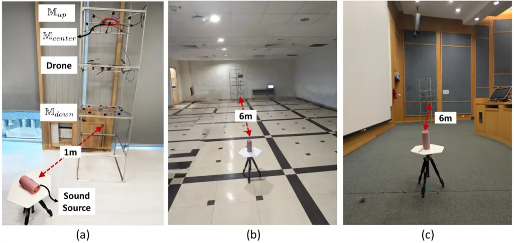

Figure 6: Figure depicts DroneAudioset’s recording setup in the three
environments – (a) $`\text{room}_{1}`$, (b) $`\text{room}_{2}`$, and (c)
$`\text{room}_{3}`$, with the drone-source distance of 1 m, 6 m and 6 m,
respectively. (a) additionally annotates the Bluetooth speaker used as
sound source, the drone affixed to the frame, as well as the three
microphone arrays, $`\mathbb{M}_{up}`$, $`\mathbb{M}_{center}`$, and
$`\mathbb{M}_{down}`$.

| Drone Name               | $`\mathbb{D}_{large}`$                | $`\mathbb{D}_{small}`$              |
| ------------------------ | ------------------------------------- | ----------------------------------- |
| Model                    | DJI F450 Quadcopter \[3\]             | DJI F330 Quadcopter \[5\]           |
| Frame Diagonal Wheelbase | 450 mm                                | 330 mm                              |
| Frame Weight             | 282g                                  | 156g                                |
| Max Take-off Weight      | 1.8 kg                                | 1.2 kg                              |
| Max Flight Time          | 20 minutes                            | 20 minutes                          |
| Propellers               | Diameter = 9.4 inch, Pitch = 5.0 inch | Diameter = 8 inch, Pitch = 4.5 inch |

Table 4: Comparison of the specifications of the two quadcopter drones
considered for our data collection.

| Drone/Throttle         | Throttle=Low | Throttle=High |
| ---------------------- | ------------ | ------------- |
| $`\mathbb{D}_{large}`$ | 76.9 dBA     | 91.8 dBA      |
| $`\mathbb{D}_{small}`$ | 74.9 dBA     | 88.3 dBA      |

Table 5: Table enumerating the Sound Pressure Levels or SPLs (measured
in the dBA scale) to quantify the drone throttle levels.

[TABLE]

Table 6: Table depicts the different types of source sounds curated for
creating vocal human sounds, non-vocal human sounds as well as non-human
(ambient) sounds for DroneAudioset dataset. Here, all sounds from
FreeSound repository have the Creative Commons license.

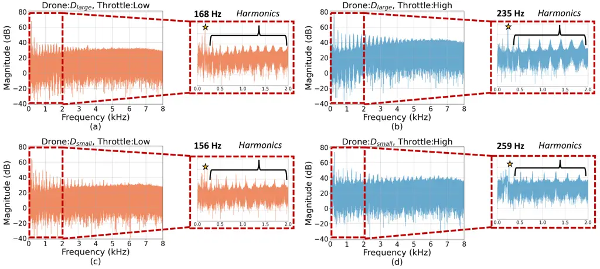

Figure 7: Figure depicts the frequency spectrum of the drones,
$`\mathbb{D}_{large}`$ at – (a) low throttle and (b) high throttle, as
well as $`\mathbb{D}_{small}`$ at – (c) low throttle and (d) high
throttle.

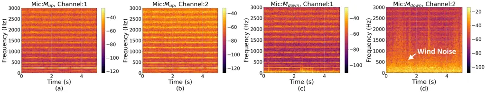

Figure 8: Figure depicts the spectrogram of two microphones,
$`\mathbb{M}_{up}`$ at – (a) channel 1 and (b) channel 2, as well as
$`\mathbb{M}_{down}`$ at – (c) channel 1 and (d) channel 2. Here, the
microphone array’s channel 1 represents a microphone location that is
in-between two propellers, while channel 2 represents a location
directly above or below the propeller for $`\mathbb{M}_{up}`$ and
$`\mathbb{M}_{down}`$, respectively.

### A.2 Drone Noise Profiles

Drones have unique audio characteristics due to the presence of motors
and propellers, each of which contributes to the tonal (i.e., pure
tones) and broadband sounds (i.e., energy in wider frequency bands),
respectively. Two specific factors that contribute to variations in a
drone’s sounds are – (a) throttle level, which controls the amount of
power provided to the motors, and (b) the microphone placement, around
the drone. Below, we discuss these two aspects for the drone,
$`\mathbb{D}_{large}`$.

Effect of Throttle. Figures 7 (a-d) depict the magnitude spectrum of
both the drone sounds, captured from the microphone,
$`\mathbb{M}_{up}`$, at two different throttle levels, notated as low
and high, respectively. From the figures, we observe that the drone
sounds have a certain tonal sound, with a fundamental frequency (denoted
by‘$`\star`$’), as well as harmonics, which are its multiples.
Furthermore, we observe that higher throttle results in higher
fundamental frequency, as expected due to increase in the motor’s number
of rotations per minute (RPM). In addition to the tonal aspect, we
observe that in both cases, the drone sounds have significant energy up
to 8 kHz, which is due to the turbulent airflow contributed by the
movement of the propeller blades. As expected, higher throttle has
higher broadband noise levels (exceeding 40 dB from the figure) due to
faster blade rotation speeds.

Effect of Microphone Location. Due to the turbulent airflow around the
drone, the location of the microphone can significantly affect the
captured sound. Figure 8 depicts the variations in the sounds captured
by two channels of $`\mathbb{M}_{up}`$ and $`\mathbb{M}_{down}`$
microphone arrays. As shown, while the tonal aspects remain similar
across them all, the low-frequency wind noise is significant in the
$`\mathbb{M}_{down}`$, especially in the channel that is right under the
propeller blade. This increase in noise can be attributed to the thrust
generated by drone’s propulsion which pushes air in the downward
direction, thereby increasing the wind noise. On the flip side,
microphone $`\mathbb{M}_{down}`$ can be suitable due to its proximity to
sound sources, thereby justifying our choice for recording data from
different placements of microphone arrays.

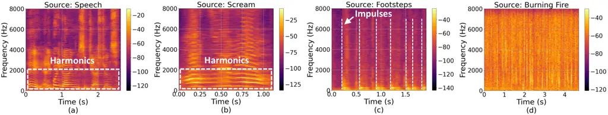

Figure 9: Frequency spectrum of different types of source sounds, namely
three human-presence indicating sounds such as speech, screams and
footsteps, as well as a non-human presence sound of burning fire.

### A.3 Source Audio Profiles

As discussed earlier in Section 3.4, we utilize three categories of
sounds of interest, namely, human vocal sounds, non-vocal human-presence
sounds, as well as non-human, ambient sounds. In Figure 9, we
demonstrate spectrograms of speech and scream sounds (human vocal),
footsteps (human non-vocal), as well as burning fire sounds (ambient) to
demonstrate the distinct time-frequency patterns of the different
categories. In particular, we observe that the human vocal sounds have
significant energy in lower frequencies, with harmonics below 4 kHz, and
scream signals having higher fundamental frequency or pitch compared to
speech signals. The non-vocal human sounds, such as footsteps and
knocking, have transient and impulse-like pattern, creating bursts of
high energy. On the other hand, ambient sounds such as vacuum cleaner
sounds and burning fire have broadband distribution, with uniform energy
across all frequencies, similar to gaussian noise. Given that the drone
sounds have tonal and broadband patterns up to 8 kHz, they significantly
interfere with all the above source signals, making drone noise
suppression challenging.

## Appendix B Additional Information about Evaluation

### B.1 Additional figures for Application 1: Detecting Human Presence

Figure 11 compares the performance of noise suppression techniques,
Traditional (Trad), Neural, and Hybrid, as well as unprocessed original
audio, for different sources (human vocal, non-vocal, and non-human) in
presence of drone noise across at every 3 dB change of SNR, measured
using SI-SDR (dB). These plots provide a granular visualization of the
trends in Table 3. Neural and Hybrid methods outperform Trad,
particularly at lower SNRs.

Figure 11 evaluates the classification performance of SSLAM on the noise
suppressed audio from the two best performing noise-suppression
techniques Neural and Hybrid across at every 3 dB change of SNR. The
plot focuses on HV, HNV, and NH sound classes, with F1-Score as the
metric. The trends support the observations in Table 3 that performance
of classification of HV sounds is significantly better HNV and NH for
both the classification techniques. The performance approaches clean
recording performance for HV at high SNR values.

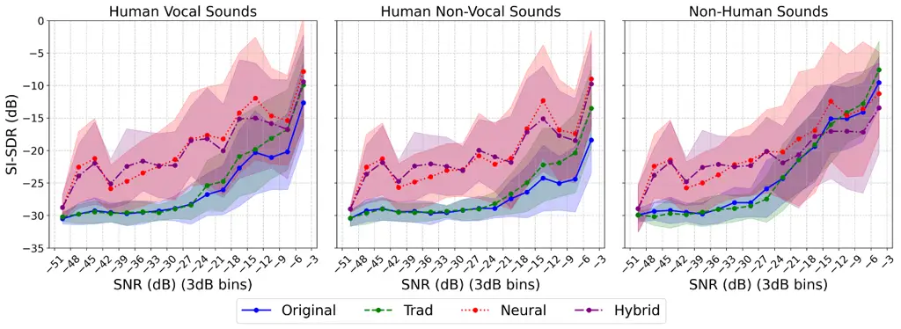

Figure 10: Performance (SI-SDR) of noise suppression techniques on
recordings in DroneAudioset at different SNRs.

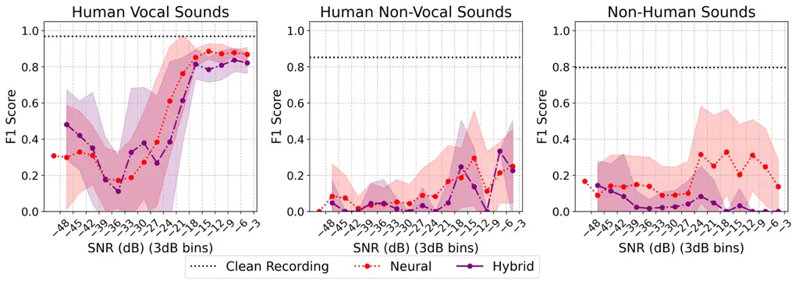

Figure 11: Classification performance of SSLAM on noise suppressed
recordings DroneAudioset at different SNRs.

### B.2 Computational Resources for Evaluation

All experiments were conducted on a Linux system (5.15.0-119-generic)
with an x86_64 architecture using Python 3.9.21. The hardware
configuration consisted of a 36-thread CPU (18 physical cores @ 2.95
GHz), 134.7 GB of system RAM, and an NVIDIA GeForce RTX 3090 GPU with
24GB of VRAM (utilizing 58MB during idle measurements at 28°C). The
computational resources required at each stage of the benchmarking
pipeline is provided in Table 7. Complete pipeline along with
computational resources calculations is provided here:
[https://github.com/augmented-human-lab/DroneAudioSet-code/blob/main/notebooks/overall_pipeline.ipynb](https://github.com/augmented-human-lab/DroneAudioSet-code/blob/main/notebooks/overall_pipeline.ipynb).

| Module             | Exec. time (sec) | Max CPU Usage (%) | Memory Usage (MB) | Max GPU Usage (%) | GPU Memory Usage (MB) |
| ------------------ | ---------------- | ----------------- | ----------------- | ----------------- | --------------------- |
| Beamforming (MVDR) | 94.61            | 12.6              | 19900             | 0                 | \-                    |
| Spectral Gating    | 5.52             | 2.6               | 728               | 0                 | \-                    |
| MPSENET            | 31.35            | 3.5               | 704               | 100               | 13721                 |
| SSLAM              | 83.28            | 3.2               | 4216              | 19                | 819                   |

Table 7: Computational Resources needed by different modules to process
six audio files of 12.6 min duration in total. Note, here the modules
are sequentially applied, i.e. audio files are passed to beamforming,
the output of which are passed through spectral gating, and so on.

## Appendix C DroneAudioset Datasheet

Following the guidelines suggested by Gebru et al. \[10\], we document
details of the DroneAudioset dataset below.

### C.1 Motivation

For what purpose was the dataset created? Was there a specific task in
mind? Was there a specific gap that needed to be filled? Please provide
a description.

We collect the dataset for human presence detection using audio in
drone-based search and rescue. Existing drone audition datasets do not
cover a diverse range of signal to noise ratios that represent realistic
settings. Hence, we perform a more systematic data collection, covering
a lot of scenarios including different source configurations (source
sound types, loudness), microphone configurations (number, position) as
well as drone configurations (type of drone, throttle level).

Who created the dataset (e.g., which team, research group) and on behalf
of which entity? (e.g., company, institution, organization)?

The dataset was collected by members of the Augmented Human Lab, at the
National University of Singapore.

Who funded the creation of the dataset?

Ministry of Defence Singapore, MINDEF-DGA Joint Programme.

Any other comments?

None.

### C.2 Composition

What do the instances that comprise the dataset represent? (e.g.,
documents, photos, people, countries)? Are there multiple types of
instances (e.g., movies, users, and ratings; people and interactions
between them; nodes and edges)? Please provide a description.

DroneAudioset dataset includes multi-channel audio recordings, which can
be split into three categories:

- •
  Drone Noise + Sound Source Recordings. This category denotes the
  largest segment of our dataset (15 hours out of 23.5 hours of
  recording duration). Here, we capture the drone noise as well as the
  source sounds simultaneously, while varying the drone, microphone and
  sound source configurations.
- •
  Drone-Only Recordings. This category includes a total of 2.3 hours of
  data, which includes drone noise, with varying drone and microphone
  configurations.
- •
  Source-Only Recordings. This category consists of 6.2 hours of
  recordings, where we collect only the source sounds, while varying the
  source sound and microphone configurations.

How many instances are there in total (of each type, if appropriate)?

Table 2 summarizes the recording duration for each configuration in our
data collection.

What data does each instance consist of? “Raw” data (e.g., unprocessed
text or images) or features? In either case, please provide a
description.

Our dataset consists of multi-channel audio recordings – 8-channel audio
recordings for microphones, $`\mathbb{M}_{up}`$ and
$`\mathbb{M}_{down}`$, as well as single channel audio recordings
corresponding to $`\mathbb{M}_{center}`$, each sampled at 16 kHz.

Is there a label or target associated with each instance? If so, please
provide a description.

All our recordings with source sounds have a mapping to indicate whether
they are – human vocal, human non-vocal, or non-human (ambient) sounds.
In particular, we partition our ground-truth source audio into six
files, notated as File1 …File6, each containing a mix of different
source types. We provide annotations for all the six files at –
[https://huggingface.co/datasets/ahlab-drone-project/DroneAudioSet](https://huggingface.co/datasets/ahlab-drone-project/DroneAudioSet),
in the ground-truth-annotations folder.

Is any information missing from individual instances? If so, please
provide a description, explaining why this information is missing (e.g.,
because it was unavailable). This does not include intentionally removed
information, but might include, e.g., redacted text.

We do not have any missing information.

Are the relationships between individual instances made explicit (e.g.,
users’ movie ratings, social network links)? If so, please describe how
these relationships are made explicit.

Yes, each audio recording file is annotated by a feature (called path)
that exactly specifies all the configurations of the microphones,
drones, and sound sources, thereby helping identifying different files
with a certain configuration.

Are there recommended datasplits (e.g., training,
development/validation, testing)? If so, please provide a description of
these splits, explaining the rationale behind them.

While in the current work we only perform inference on all the data, we
provide recommendations for splits to facilitate future model
development. Given that a good split should ensure sufficient diversity
in the training, while testing on new data for testing, we aim to split
our train/valid/tests based on the six files, six files, File1 …File6
which contain the three categories of source sounds (HV, NHV and NH),
but different instances. In particular, all files except File3 and File4
contains 90 s, 30 s and 30 s, of each of the three categories, while
File3 only contains 90 s of HV, and File4 only contains 30 s each of the
other two. Overall, our recommendation is to consider the first four
files (File1 – File4) for training, File5 for validation, and File6 for
testing.

Are there any errors, sources of noise, or redundancies in the dataset?
If so, please provide a description.

There are no errors to our knowledge.

Is the dataset self-contained, or does it link to or otherwise rely on
external resources (e.g., websites, tweets, other datasets)? If it links
to or relies on external resources, a) are there guarantees that they
will exist, and remain constant, overtime; b) are there official
archival versions of the complete dataset (i.e., including the external
resources as they existed at the time the dataset was created); c) are
there any restrictions (e.g., licenses,fees) associated with any of the
external resources that might apply to a dataset consumer? Please
provide descriptions of all external resources and any restrictions
associated with them, as well as links or other access points, as
appropriate.

Yes, the dataset is self-contained.

Does the dataset contain data that might be considered confidential
(e.g., data that is protected by legal privilege or by doctor-patient
confidentiality, data that includes the content of individuals’
non-public communications)? If so, please provide a description.

No, the data collection process does not involve humans, hence there is
no confidential data. All the source human sounds are gathered from
various open-source data repositories, which are released under Creative
Commons license.

Does the dataset contain data that, if viewed directly, might be
offensive, insulting, threatening, or might otherwise cause anxiety? If
so, please describe why.

The dataset contains sounds of drones, human screams and baby cries
which can induce distress and anxiety, if heard for long durations.

Does the dataset identify any subpopulations (e.g., by age, gender)? If
so, please describe how these subpopulations are identified and provide
a description of their respective distributions within the dataset.

No, the data collection does not involve humans.

Is it possible to identify individuals (i.e., one or more natural
persons), either directly or indirectly (i.e., in combination with other
data) from the dataset?

No.

Does the dataset contain data that might be considered sensitive in any
way (e.g., data that reveals racial or ethnic origins, sexual
orientations, religious beliefs, political opinions or union
memberships, or locations; financial or health data; biometric or
genetic data; forms of government identification, such as social
security numbers; criminal history)? If so, please provide a
description.

No.

Any other comments?

None.

### C.3 Collection Process

How was the data associated with each instance acquired? Was the data
directly observable (e.g., raw text, movie ratings), reported by
subjects (e.g., survey responses), or indirectly inferred/derived from
other data (e.g., part-of-speech tags, model-based guesses for age or
language)? If data was reported by subjects or indirectly
inferred/derived from other data, was the data validated/verified? If
so, please describe how.

What mechanisms or procedures were used to collect the data (e.g.,
hardware apparatus or sensor, manual human curation, software program,
software API)? How were these mechanisms or procedures validated?

We explain the data collection process in detail in Section 3.

If the dataset is a sample from a larger set, what was the sampling
strategy (e.g., deterministic, probabilistic with specific sampling
probabilities)?

Yes, the dataset is indeed sampled, given that there are endless options
for drone types, drone throttles, microphone configurations and so on.
We sample specific configurations that provide sufficient diversity. In
particular, for drone types, we chose two drones with sufficiently
different sizes and weights, to account for different acoustic
properties. Similarly, for microphone configurations, we place two
microphone arrays above and below the drone to capture sound from
regions with varied turbulence due to propeller movement. We justify our
choices for different parameters in Section 3.

Who was involved in the data collection process (e.g., students,
crowdworkers, contractors) and how were they compensated (e.g., how much
were crowdworkers paid)?

Undergraduate students were hired under the university’s student work
scheme (NSWS) to assist with the data collection, and they were paid 17
SGD per hour, in accordance to the university’s policies.

Over what timeframe was the data collected? Does this timeframe match
the creation timeframe of the data associated with the instances (e.g.,
recent crawl of old news articles)? If not, please describe the
timeframe in which the data associated with the instances was created.
Finally, list when the dataset was first published.

The data was collected over a span of four months, from February 2025 to
May 2025. The dataset was first published on 15 May 2025.

Were any ethical review processes conducted (e.g., by an institutional
review board)?

As there were no humans involved, there was no IRB involved. However,
given that our experiments involved indoor drone experiments, we
performed detailed risk assessment and got approval from the
university’s Office of Risk Management and Compliance.

Did you collect the data from the individuals in question directly, or
obtain it via third parties or other sources (e.g., websites)?

We only collected source sound files from public repositories, which do
not have any identifiable information.

Were the individuals in question notified about the data collection? If
so, please describe (or show with screenshots or other information) how
notice was provided, and provide a link or other access point to, or
otherwise reproduce, the exact language of the notification itself.

NA

Did the individuals in question consent to the collection and use of
their data? If so, please describe (or show with screenshots or other
information) how consent was requested and provided, and provide a link
or other access point to, or otherwise reproduce, the exact language to
which the individuals consented.

NA

If consent was obtained, were the consenting individuals provided with a
mechanism to revoke their consent in the future or for certain uses? If
so, please provide a description, as well as a link or other access
point to the mechanism (if appropriate)

NA

Has an analysis of the potential impact of the dataset and its use on
data subjects (e.g., a data protection impact analysis)been conducted?
If so, please provide a description of this analysis, including the
outcomes, as well as a link or other access point to any supporting
documentation.

NA

Any other comments?

None.

### C.4 Preprocessing/Cleaning/Labeling

Was any preprocessing/cleaning/labeling of the data done
(e.g.,discretization or bucketing, tokenization, part-of-speech tagging,
SIFT feature extraction, removal of instances, processing of missing
values)? If so, please provide a description. If not, you may skip the
remainder of the questions in this section.

We performed basic offset correction to remove zero-valued samples in
the beginning of the audio recording, occasionally caused due to
recording issues. We also resampled our collected audio data from 48 kHz
to 16 kHz, as is preferred for most audio ML tasks. However, no
additional pre-processing has been done beyond offset correction and
resampling.

Was the “raw” data saved in addition to the preprocessed/cleaned/labeled
data (e.g., to support unanticipated future uses)?

While we do not release the raw data, we save them locally in our
servers. We are happy to share the raw data if there is such a
requirement for a specific use case. Please contact the authors when you
do so.

Is the software used to preprocess/clean/label the instances available?

We share this code on our GitHub:
[https://github.com/augmented-human-lab/DroneAudioSet-code/blob/main/scripts/0_preprocess_data.py](https://github.com/augmented-human-lab/DroneAudioSet-code/blob/main/scripts/0_preprocess_data.py).

Any other comments?

None.

### C.5 Uses

Has the dataset been used for any tasks already? If so, please provide a
description.

We have only used the dataset for the two tasks mentioned in this paper
– detecting human-presence and providing recommendations for
drone-audition.

Is there a repository that links to any or all papers or systems that
use the dataset?

Once others begin to use this dataset and cite it, we will maintain a
list at
[https://apps.ahlab.org/DroneAudioSet-code/](https://apps.ahlab.org/DroneAudioSet-code/).

What (other) tasks could the dataset be used for?

We have listed out other application possibilities in Section 5.

Is there anything about the composition of the dataset or the way it was
collected and preprocessed/cleaned/labeled that might impact future
uses? For example, is there anything that a future user might need to
know to avoid uses that could result in unfair treatment of individuals
or groups (e.g., stereotyping, quality of service issues) or other
undesirable harms (e.g., financial harms, legal risks) If so, please
provide a description. Is there anything a future user could do to
mitigate these undesirable harms?

The dataset has a limitation of being collected from a drone affixed to
a frame, as opposed to real-world settings that involve hovering drones.
Future users should ensure that they perform additional field tests with
hovering drones.

Are there tasks for which the dataset should not be used? If so, please
provide a description.

The dataset should not be used for surveillance applications that lead
to gathering private information (such as speech) without user consent.

Any other comments?

None

### C.6 Distribution

Will the dataset be distributed to third parties outside of the entity
(e.g., company, institution, organization) on behalf of which the
dataset was created? If so, please provide a description.

Yes, the dataset is publicly available and on the internet.

How will the dataset will be distributed (e.g., tarball on website, API,
GitHub)? Does the dataset have a digital object identifier (DOI)?

The dataset is currently available at
[https://huggingface.co/datasets/ahlab-drone-project/DroneAudioSet](https://huggingface.co/datasets/ahlab-drone-project/DroneAudioSet).

When will the dataset be distributed?

The dataset is available for download at
[https://huggingface.co/datasets/ahlab-drone-project/DroneAudioSet](https://huggingface.co/datasets/ahlab-drone-project/DroneAudioSet).
We will await reviewer feedback before announcing this more publicly.

Will the dataset be distributed under a copyright or other intellectual
property (IP) license, and/or under applicable terms of use (ToU)? If
so, please describe this license and/or ToU, and provide a link or other
access point to, or otherwise reproduce, any relevant licensing terms or
ToU, as well as any fees associated with these restrictions.

We distribute it under the MIT License, as described at
[https://opensource.org/license/mit/](https://opensource.org/license/mit/).

Have any third parties imposed IP-based or other restrictions on the
data associated with the instances? If so, please describe these
restrictions, and provide a link or other access point to, or otherwise
reproduce, any relevant licensing terms, as well as any fees associated
with these restrictions.

We collect all data ourselves and therefore have no third parties with
IP-based restrictions on the data.

Do any export controls or other regulatory restrictions apply to the
dataset or to individual instances? If so, please describe these
restrictions, and provide a link or other access point to, or otherwise
reproduce, any supporting documentation.

No.

Any other comments?

None

### C.7 Maintenance

Who is supporting/hosting/maintaining the dataset?

The dataset is hosted/maintained indefinitely in the Hugging Face
Repository at
[https://huggingface.co/datasets/ahlab-drone-project/DroneAudioSet](https://huggingface.co/datasets/ahlab-drone-project/DroneAudioSet).

How can the owner/curator/manager of the dataset be contacted (e.g.,
email address)?

Chitralekha Gupta can be contacted at
[chitralekha@ahlab.org](mailto:chitralekha@ahlab.org), and Soundarya
Ramesh can be contacted at
[soundarya@ahlab.org](mailto:soundarya@ahlab.org).

Is there an erratum?

There is currently no erratum, but if there are any errata in the
future, we will publish them on the website at
[https://apps.ahlab.org/DroneAudioSet-code/](https://apps.ahlab.org/DroneAudioSet-code/).

Will the dataset be updated (e.g., to correct labeling errors, add new
instances, delete instances)? If so, please describe how often, by whom,
and how updates will be communicated to users (e.g., mailing list,
GitHub)?

To the extent that we notice errors, they will be fixed and the dataset
will be updated.

If the dataset relates to people, are there applicable limits on the
retention of the data associated with the instances (e.g., were
individuals in question told that their data would be retained for a
fixed period of time and then deleted)? If so, please describe these
limits and explain how they will be enforced.

NA

Will older versions of the dataset continue to be
supported/hosted/maintained? If so, please describe how. If not, please
describe how its obsolescence will be communicated to users.

We will maintain older versions of the dataset for consistency with the
figures in this paper. These will be posted on a separate section on our
website, in the event that older versions become necessary.

If others want to extend/augment/build on/contribute to the dataset, is
there a mechanism for them to do so? If so, please provide a
description. Will these contributions be validated/verified? If so,
please describe how. If not, why not? Is there a process for
communicating/distributing these contributions to other users? If so,
please provide a description.

We will accept extensions to the dataset as long as they follow the
procedures we outline in this paper. We will label these extensions as
such from the rest of the dataset and credit those who collected the
data. The authors of DroneAudioset should be contacted about
incorporating extensions.

Any other comments?

None.
