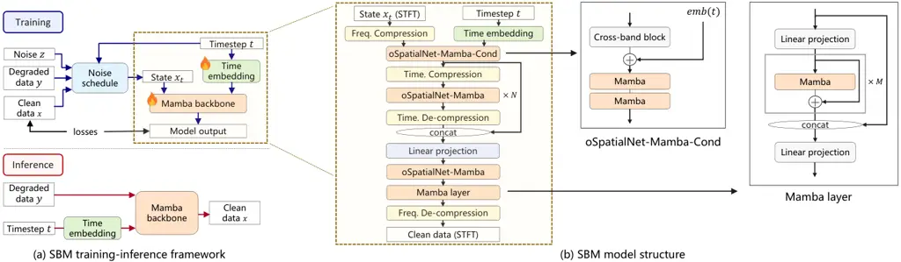
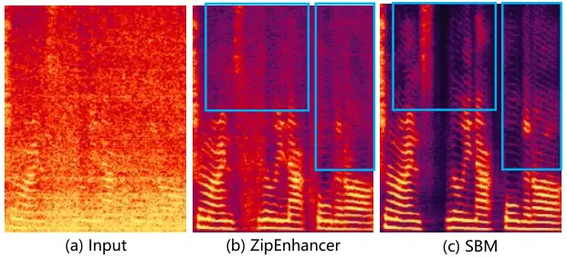

Yang Wang Wu Guo Fan

# Schrödinger Bridge Mamba for One-Step Speech Enhancement

Jing    Sirui    Chao    Lei    Fan

###### Abstract

We present Schrödinger Bridge Mamba (SBM), a novel model for efficient
speech enhancement by integrating the Schrödinger Bridge (SB) training
paradigm and the Mamba architecture. Experiments of joint denoising and
dereverberation tasks demonstrate SBM outperforms strong generative and
discriminative methods on multiple metrics with only one step of
inference while achieving a competitive real-time factor for streaming
feasibility. Ablation studies reveal that the SB paradigm consistently
yields improved performance across diverse architectures over
conventional mapping. Furthermore, Mamba exhibits a stronger performance
under the SB paradigm compared to Multi-Head Self-Attention (MHSA) and
Long Short-Term Memory (LSTM) backbones. These findings highlight the
synergy between the Mamba architecture and the SB trajectory-based
training, providing a high-quality solution for real-world speech
enhancement. Demo page:
[https://sbmse.github.io](https://sbmse.github.io)

###### keywords

Schrödinger Bridge, Mamba, state-space models, trajectory modeling,
speech enhancement

^(†)^(†)address: Central Media Technology Institute,
Huawei^(†)^(†)email: (yangjing201, wangsirui1, wuchao17, guolei94,
fanfan1)@huawei.com

## 1 Introduction



Figure 1: Overview of the SBM training-inference framework and the
Mamba-based model architecture.

Deep generative models are increasingly employed for speech enhancement
(SE). By learning the clean speech distribution directly, generative
models achieve superior perceptual quality and reconstruct fine details
lost in deterministic regression \[1\]. While earlier score-based
generative models showed promising SE performance, they suffer from the
mean prior mismatch issue \[1\]. To resolve this, the Schrödinger Bridge
(SB) paradigm models the optimal transport (OT) path via stochastic
differential equations (SDEs), seamlessly transporting the degraded
prior directly to the clean target \[2, 3, 4, 5, 6\]. SB methods have
demonstrated remarkable success across SE tasks
(denoising/dereverberation \[2, 3, 4, 5, 6\], super-resolution \[7\],
inpainting \[8\]), image generation \[9\] and text-to-speech \[10\].
Following broader successes \[11, 12\], most SB-based SE methods adopt
the NCSN++ architecture as their backbone (SB-NCSN++) \[2, 4, 5, 6\].

However, the slow inference of these SB-based methods (often requiring
$`>10`$ iterative steps) hinders real-time application. To accelerate
generation, recent approaches explored specialized schedulers and
solvers \[7\], adversarial training \[5, 13\] or consistency trajectory
modeling \[6, 14\]. While some achieve one-step inference in denoising
or dereverberation tasks \[5, 6\], existing works typically overlook the
inherent synergy between the SB paradigm and the backbone architecture,
leaving significant room for improvement in efficient modeling.

Recently, the selective state-space model Mamba \[15\] has emerged as a
powerful architecture for modeling long-range audio dependencies.
Although adopted in SE tasks (e.g., oSpatialNet \[16\], SEMamba \[17\],
USEMamba \[18\]), these works utilize deterministic mapping or masking
training strategy, failing to exploit the potential of generative
trajectory learning.

In this work, we propose Schrödinger Bridge Mamba (SBM), the first
framework to synergize the Schrödinger Bridge (SB) paradigm with the
Mamba architecture for one-step speech enhancement leveraging generative
trajectory guidance. Our core argument is that aligning training
paradigm with the backbone architecture’s inductive bias is essential
for efficiency and effectiveness. Unlike ‘blind’ deterministic mapping
or masking that only sees the start and end points, the SB paradigm
explicitly calculates intermediate states $`x_{t}`$ along the optimal
transport path bridging the degraded and clean speech
distributions \[2\]. These states $`x_{t}`$ are utilized as training
inputs, effectively acting as ‘anchors’ to guide the backbone model’s
learning of the underlying evolution process. The Mamba architecture is
well-suited for the SB training paradigm: (1) As a state-space model,
Mamba naturally emulates the process of state evolution \[15\]; (2) Its
selective mechanism facilitates adaptive context modeling, allowing the
network to learn the dynamics of the optimal transport path \[15, 19\].
Overall, SBM ‘distills’ the SB transformation into the Mamba dynamics
during the training process, enabling high-fidelity reconstruction in a
single inference step.

We evaluate SBM on joint denoising and dereverberation SE tasks that
represent common real-life scenarios. Experiments on DNS and
VoiceBank-Demand test sets demonstrate that SBM outperforms conventional
SB-NCSN++ models, mapping-trained Mamba model, flow-matching variant,
one-step SB variants and strong discriminative model
(ZipEnhancer \[20\]) in real-world and reverberant scenarios, and
achieves the best real-time factor (RTF) among these methods.
Furthermore, ablation studies replacing Mamba with Multi-Head
Self-Attention (MHSA) and Long Short-Term Memory (LSTM) reveal that the
SB paradigm consistently outperforms the mapping paradigm across
architectures, highlighting the potential of the training paradigm.
Moreover, the superior performance of Mamba in these experiments
highlights its effectiveness in capturing trajectory dynamics.
Collectively, these results justify the SBM design and underscore the
potential of integrating continuous-time diffusion processes with
state-space backbones, offering valuable insights for the broader
evolution of continuous-time sequence modeling in complex audio tasks.

## 2 Schrödinger Bridge Mamba

Schrödinger Bridge Mamba (SBM) leverages the generative optimal
transport (OT) trajectory of Schrödinger Bridge (SB) to train a
selective state-space Mamba backbone. This section details the SB
formulation, the model architecture and the training-inference
framework.

### 2.1 Schrödinger Bridge Formulation

Unlike standard diffusion models that rely on Gaussian priors leading to
mean prior mismatch issue \[1\], SBM formulates speech enhancement as an
OT process directly between the degraded speech distribution $`p_{T}`$
and the clean speech distribution $`p_{0}`$. Mathematically, this
process is governed by a system of SDEs, and the intermediate states
$`\{x_{t}\}_{0:T}`$ along the SB stochastic process can be constructed
using paired data samples (clean speech $`x\sim p_{0}`$ and degraded
speech $`y\sim p_{T}`$) \[2, 21, 22\]. To enable efficient training for
speech enhancement, following the tractability of SB OT formulation \[2,
4, 5, 6\], the intermediate states $`x_{t}`$ at timesteps $`t\in[0,1]`$
can be explicitly parameterized as an interpolation of the boundary
conditions plus a stochastic Wiener process term. Specifically,
$`x_{t}`$ is sampled via

```math
x_{t}=\mu_{x}(t)+\sigma_{x}(t)z,\quad z\sim\mathcal{N}_{C}(0,\mathbf{I}) \tag{1}
```

where $`\mu_{x}(t)=w_{x}(t)x+w_{y}(t)y`$. The variance $`\sigma_{x}(t)`$
and coefficients $`w_{x}(t)`$, $`w_{y}(t)`$ are derived from the
Variance Exploding (VE) noise schedule parameters \[2\] in our
implementation. Crucially, Eq.(1) serves as the data generator during
training: For each batch, we sample random timesteps $`t`$ and compute
states $`x_{t}`$, training the model to reconstruct the clean target
$`x`$ by learning the underlying data distributions.

### 2.2 Mamba-based Architecture

The architectural design of SBM is motivated by the structural
resemblance between the SB theory and Mamba’s discretized recurrence
$`h_{t}=\mathbf{A}h_{t-1}+\mathbf{B}u_{t},y_{t}=\mathbf{C}h_{t}`$ \[15\].
Viewed as a controlled system, $`\mathbf{A}h_{t-1}`$ represents natural,
uncontrolled dynamics \[23\], while the input-dependent parameters
$`(\mathbf{B},\mathbf{C})`$ act as control terms. Training Mamba thus
resembles learning the optimal control strategy inherent to SB \[22\],
where the selective mechanism dynamically parameterizes the transport
path based on current states. Furthermore, recently proven mathematical
optimality of Mamba in capturing Markovian sequence dynamics \[24\] also
suggests its suitability for modeling the stochastic evolution process
of the SB paradigm \[22\].

Guided by these insights, we construct a Mamba-based model as shown in
Figure 1(b). Following the common practice in related work \[2, 4, 5, 6,
16, 17, 18\], we represent audio using STFT spectra. The main component
oSpatialNet-Mamba is implemented following the design in \[16\]. To
incorporate the timesteps defined by the SB training paradigm, we train
a Gaussian Fourier module to embed timesteps \[2, 4\], and the time
embedding emb(t) is added to the input of Mamba in the oSpatialNet-Mamba
module, which is termed oSpatialNet-Mamba-Cond in SBM. Inspired by \[16,
25\], to address the temporal limitations of oSpatialNet, we integrate a
fullband Mamba layer to capture global spectral dynamics and inter-frame
dependencies. For streaming feasibility, the Mamba backbone operates
with a small lookahead of 2-4 frames, yielding an algorithmic latency
under \qty40ms to balance causality and enhancement quality.

### 2.3 Training and One-Step Inference

Figure 1(a) sketches the training and inference process of SBM. The
Mamba backbone takes noisy intermediate states $`x_{t}`$ and timestep
embeddings as inputs to learn the distribution of clean data $`x`$.
Typical denoising objectives as in diffusion models can be
applied \[5\], among which the data prediction loss has shown good
performance for speech enhancement \[2, 4, 5, 6\]. We employ a
comprehensive data prediction loss combining magnitude and complex
domain constraints:
$`L=\lambda_{1}L_{mse}(S,\hat{S})+\lambda_{2}L_{mse}(\lvert S\rvert,\lvert\hat{S}\rvert)+\lambda_{3}L_{mr,mse}(S,\hat{S})+\lambda_{4}L_{mr,mse}(\lvert S\rvert,|\hat{S}\rvert)`$,
where $`S`$ and $`\hat{S}`$ are the target and modeled STFT, $`mr`$
refers to multi-resolution and $`\lvert S\rvert`$ refers to magnitude
spectrum.

While standard SB methods require iterative solving of the reverse SDE,
SBM is designed for one-step generation. During inference, we set the
timestep to the start of the reverse process ($`t=1`$, corresponding to
the degraded prior). The model directly reconstructs the clean target in
a single forward pass. This drastically reduces latency while leveraging
the distributional modeling capability learned from the SB trajectory.

|                  |               |            |                   |                 |                 |                  |                     |                   |                             |                        |                  |                   |
| ---------------- | ------------- | ---------- | ----------------- | --------------- | --------------- | ---------------- | ------------------- | ----------------- | --------------------------- | ---------------------- | ---------------- | ----------------- |
| Test set         | Model         | Para.\[M\] | RTF$`\downarrow`$ | SIG$`\uparrow`$ | BAK$`\uparrow`$ | OVRL$`\uparrow`$ | P808MOS$`\uparrow`$ | NISQA$`\uparrow`$ | SpeechBERTScore$`\uparrow`$ | Similarity$`\uparrow`$ | PESQ$`\uparrow`$ | ESTOI$`\uparrow`$ |
| DNS With Reverb  | SB-NCSN++(50) | 25.16      | 0.767             | 3.395           | 3.938           | 3.085            | 3.884               | 3.879             | 0.703                       | 0.947                  | 1.532            | 0.629             |
|                  | SB-NCSN++(10) | 25.16      | 0.156             | 3.425           | 3.97            | 3.126            | 3.896               | 4.087             | 0.728                       | 0.947                  | 1.597            | 0.671             |
|                  | SB-NCSN++(1)  | 25.16      | 0.0155            | 3.281           | 3.871           | 2.948            | 3.559               | 3.323             | 0.730                       | 0.943                  | 1.586            | 0.67              |
|                  | SBCTM         | 65.98      | 0.02              | 2.927           | 3.859           | 2.623            | 3.035               | 2.578             | 0.494                       | 0.859                  | 1.218            | 0.281             |
|                  | SB-UFOGen     | 25.16      | 0.0152            | 2.964           | 3.664           | 2.596            | 3.337               | 2.131             | 0.662                       | 0.918                  | 1.383            | 0.601             |
|                  | ZipEnhancer   | 2.04       | 0.105             | 2.771           | 3.164           | 2.264            | 2.85                | 1.926             | 0.534                       | 0.84                   | 1.227            | 0.288             |
|                  | Mamba-base    | 3.61       | 0.0048            | 3.202           | 3.898           | 2.895            | 3.665               | 3.514             | 0.766                       | 0.963                  | 1.895            | 0.696             |
|                  | FM-Mamba      | 3.93       | 0.0048            | 3.164           | 3.956           | 2.887            | 3.461               | 3.148             | 0.682                       | 0.930                  | 1.643            | 0.634             |
|                  | SBM           | 3.93       | 0.0048            | 3.653           | 3.995           | 3.367            | 4.055               | 4.053             | 0.784                       | 0.965                  | 1.971            | 0.71              |
| DNS No Reverb    | SB-NCSN++(50) | 25.16      | 0.767             | 3.515           | 4.02            | 3.231            | 4.01                | 4.233             | 0.78                        | 0.976                  | 1.656            | 0.8               |
|                  | SB-NCSN++(10) | 25.16      | 0.156             | 3.477           | 4.069           | 3.225            | 3.968               | 4.472             | 0.792                       | 0.974                  | 1.651            | 0.824             |
|                  | SB-NCSN++(1)  | 25.16      | 0.0155            | 3.387           | 4.087           | 3.148            | 3.665               | 3.892             | 0.787                       | 0.962                  | 1.669            | 0.791             |
|                  | SBCTM         | 65.98      | 0.02              | 3.523           | 4.128           | 3.298            | 3.906               | 4.574             | 0.870                       | 0.986                  | 2.835            | 0.898             |
|                  | SB-UFOGen     | 25.16      | 0.0152            | 3.443           | 4.007           | 3.161            | 3.76                | 3.719             | 0.793                       | 0.964                  | 1.754            | 0.803             |
|                  | ZipEnhancer   | 2.04       | 0.105             | 3.578           | 4.136           | 3.35             | 4.015               | 4.289             | 0.922                       | 0.992                  | 3.419            | 0.952             |
|                  | Mamba-base    | 3.61       | 0.0048            | 3.515           | 4.053           | 3.253            | 3.997               | 4.468             | 0.887                       | 0.99                   | 2.73             | 0.916             |
|                  | FM-Mamba      | 3.93       | 0.0048            | 3.446           | 4.057           | 3.192            | 3.783               | 4.088             | 0.802                       | 0.968                  | 1.964            | 0.843             |
|                  | SBM           | 3.93       | 0.0048            | 3.751           | 4.129           | 3.292            | 4.187               | 4.657             | 0.893                       | 0.99                   | 2.825            | 0.921             |
| VoiceBank-Demand | SB-NCSN++(50) | 25.16      | 0.767             | 3.415           | 4.005           | 3.134            | 3.55                | 4.237             | 0.764                       | 0.942                  | 1.887            | 0.753             |
|                  | SB-NCSN++(10) | 25.16      | 0.156             | 3.382           | 4.05            | 3.131            | 3.61                | 4.688             | 0.795                       | 0.953                  | 2.112            | 0.79              |
|                  | SB-NCSN++(1)  | 25.16      | 0.0155            | 3.337           | 4.087           | 3.106            | 3.394               | 4.41              | 0.778                       | 0.934                  | 2.165            | 0.76              |
|                  | SBCTM         | 65.98      | 0.02              | 3.4             | 4.085           | 3.156            | 3.533               | 4.646             | 0.891                       | 0.978                  | 3.558            | 0.868             |
|                  | SB-UFOGen     | 25.16      | 0.0152            | 3.384           | 4.06            | 3.133            | 3.371               | 4.132             | 0.768                       | 0.926                  | 2.152            | 0.758             |
|                  | ZipEnhancer   | 2.04       | 0.105             | 3.484           | 3.988           | 3.183            | 3.544               | 4.621             | 0.925                       | 0.986                  | 3.628            | 0.894             |
|                  | Mamba-base    | 3.61       | 0.0048            | 3.294           | 3.904           | 2.969            | 3.498               | 4.441             | 0.814                       | 0.975                  | 2.612            | 0.831             |
|                  | FM-Mamba      | 3.93       | 0.0048            | 3.269           | 3.964           | 2.982            | 3.373               | 4.267             | 0.761                       | 0.951                  | 2.267            | 0.771             |
|                  | SBM           | 3.93       | 0.0048            | 3.412           | 4.135           | 3.253            | 3.616               | 4.737             | 0.820                       | 0.981                  | 3.503            | 0.891             |

Table 1: Performance comparison on benchmark test sets DNS With Reverb,
DNS No Reverb and VoiceBank-Demand. “RTF” stands for real-time factor,
measured on a GPU by averaging over 10 pieces of 10s audio samples.

|                     |               |                 |                 |                  |                      |                   |
| ------------------- | ------------- | --------------- | --------------- | ---------------- | -------------------- | ----------------- |
| Test set            | Model         | SIG$`\uparrow`$ | BAK$`\uparrow`$ | OVRL$`\uparrow`$ | P808 MOS$`\uparrow`$ | NISQA$`\uparrow`$ |
| DNS Real Recordings | SB-NCSN++(50) | 3.369           | 3.939           | 3.052            | 3.685                | 3.604             |
|                     | SB-NCSN++(10) | 3.332           | 3.933           | 3.024            | 3.723                | 3.865             |
|                     | SB-NCSN++(1)  | 3.297           | 3.924           | 2.979            | 3.514                | 3.541             |
|                     | SBCTM         | 3.224           | 3.841           | 2.894            | 3.506                | 3.647             |
|                     | SB-UFOGen     | 3.255           | 3.838           | 2.911            | 3.485                | 3.196             |
|                     | ZipEnhancer   | 3.323           | 3.918           | 3.002            | 3.639                | 3.264             |
|                     | Mamba-base    | 3.284           | 3.974           | 2.993            | 3.683                | 3.644             |
|                     | FM-Mamba      | 3.32            | 4.031           | 3.052            | 3.562                | 3.797             |
|                     | SBM           | 3.459           | 4.106           | 3.198            | 3.742                | 3.937             |

Table 2: Results on DNS Real Recordings. Intrusive metrics are not
included due to the absence of clean ground truth.

## 3 Experiments and Results

### 3.1 Experimental Setup

To cover common real-life scenarios, we focus on joint denoising and
dereverberation tasks for speech enhancement. Audio clips are
arbitrarily segmented into 3-second segments on-the-fly during training.
For the STFT representation, we use a NFFT of 512, a Hann window of
length 480 and a hop length of 160. The SBM model is trained using AdamW
optimizer with a cosine learning rate scheduler starting from
$`lr=1e-3`$. The hyper-parameters of the loss
$`\lambda_{1},\lambda_{2},\lambda_{3},\lambda_{4}`$ are set to 1000,
1000, 500, 500.

### 3.2 Datasets and Metrics

The training datasets used in our experiments include clean speeches,
noises and room impulse responses (RIRs). Clean speeches are collected
from DNS Challenge clean data \[26\], AI-Shell3 \[27\] and
LibriSpeech \[28\], totaling around 800 hours. Noises are collected from
FSD50K \[29\], DNS Challenge \[26\] and self-collected noises from
various environments. RIRs are collected from SLR26/28 \[30\] and
simulated using pyroomacoustics \[31\]. The paired degraded speeches are
simulated using the above clean speeches, noises and RIRs with a
signal-to-noise ratio (SNR) in $`[-10,20]`$ that can cover a wide range
of daily-life scenarios. All audio data is pre-processed as \qty16kHz.

We evaluate SBM on four benchmark test sets: DNS Challenge Real
Recordings, Synthetic With Reverb, Synthetic Without Reverb \[26\] and
VoiceBank-Demand test set \[32\].

We adopt a set of metrics to evaluate speech enhancement: DNSMOS \[33\]
(SIG for signal quality, BAK for noise quality, OVRL and P808MOS for
overall quality), NISQA \[34\] for perceptual quality,
SpeechBERTScore \[35\] for semantic similarity, Similarity \[36\] for
speaker cosine similarity, and traditional alignment-sensitive metrics
(PESQ \[37\], ESTOI \[38\]). We use the same pretrained model as \[36\]
for SpeechBERTScore and Similarity. Although employing a data prediction
loss, SBM reconstructs speech details via trajectory guidance rather
than yielding statistical averages \[1\]. Since strictly
alignment-sensitive metrics often penalize deviated structures more
heavily than over-smoothed predictions \[39\], alignment-agnostic
metrics (SIG, BAK, OVRL, P808MOS, NISQA, SpeechBERTScore, Similarity)
serve as our primary indicators of model performance, alongside
alignment-sensitive metrics for a comprehensive assessment.

### 3.3 Baseline Models

We validate SBM by comparing it with a group of baselines:

SB-NCSN++ \[2\]: The classical model of SB for SE. We include three
versions for 50-steps inference (SB-NCSN++(50)), 10-steps inference
(SB-NCSN++(10)) and 1-step inference (SB-NCSN++(1)). The 1-step version
follows the same inference strategy as SBM. Due to the absence of public
checkpoints, we re-trained models following the paper and open-sourced
codes using the same datasets for SBM. We also tried different losses
following the design of SBM and literature \[2, 7, 8\], and report
SB-NCSN++ baselines with the best results.

SBCTM \[6\]: Built on top of \[2, 4\], SBCTM involves consistency
trajectory modeling \[14\] to achieve 1-step inference. We used their
open-sourced checkpoint in our experiments.

SB-UFOGen \[5\]: Built on top of \[2\], SB-UFOGen incorporates
adversarial training \[13\] to achieve 1-step inference. Due to the
absence of open-sourced checkpoints, we re-trained this baseline as we
did for SB-NCSN++.

ZipEnhancer \[20\]: A state-of-the-art discriminative model. They
published checkpoint for the DNS dataset \[40\]. For the
VoiceBank-Demand test set, lacking a public checkpoint, we computed
metrics using the officially released inference results \[41\].

Mamba-base: To justify the SB training paradigm, this baseline refers to
a predictive-mapping trained Mamba-based model. For a fair comparison,
we trained this baseline using the same datasets and the same
Mamba-based backbone as in SBM.

FM-Mamba: To align with recent generative modeling trends and strengthen
our evaluation, we introduce a flow matching (FM) \[42\] variant. This
baseline shares the exact Mamba backbone and one-step inference protocol
with SBM, but computes the intermediate states $`x_{t}`$ via FM instead
of the SB formulation. Specifically, we computed the states $`x_{t}`$
using the OT-CFM formulation \[43, 44\]. This baseline aims to validate
whether the SB objective yields superiority over the FM paradigm in our
experiments.

### 3.4 Experimental Results and Discussion

As shown in Table 1 and Table 2, SBM demonstrates strong generalization
in complex acoustic environments. On the DNS Real Recordings that
represent in-the-wild degraded audio, SBM achieves the highest scores
across all metrics. Similarly, on the DNS With Reverb, SBM leads on SIG,
BAK, OVRL, P808MOS, SpeechBERTScore, Similarity, PESQ and ESTOI. These
results indicate the effectiveness of SBM in jointly addressing
real-world noise and reverberation artifacts.

On the DNS No Reverb and VoiceBank-Demand test sets that only include
noise artifacts, SBM performs competitively against the discriminative
model ZipEnhancer. While the results of ZipEnhancer demonstrate the
efficacy of its multi-objective training (e.g., via PESQ-based GAN and
phase losses) \[20\], SBM achieves on-par performance via
trajectory-guided reconstruction. Furthermore, by incorporating 25%
double-talk scenarios during training to preserve secondary speakers,
SBM diverges from test cases requiring single-speaker isolation.
Consequently, this discrepancy penalizes SBM on certain metrics like
SpeechBERTScore, which reflects a strategic design choice for realistic
multi-speaker environments rather than a deficit in enhancement
capability.

According to Table 1, SBM achieves the lowest real-time factor (RTF).
Beyond computational efficiency, it maintains a small algorithmic
latency (see Sec 2.2), suggesting its potential for practical
low-latency applications.

We further examine the impact of the training paradigm of SBM. Although
employing a deterministic one-step inference akin to conventional
prediction models \[44\], SBM receives principled generative guidance by
training using the SB OT trajectory. As shown in Figure 2, under severe
real-world degradation, SBM successfully reconstructs mid-to-high
frequency harmonics, whereas the discriminative baseline exhibits
typical over-smoothing. This implies that SBM learns the structural
priors, enabling the reconstruction of fine-grained harmonics rather
than defaulting to a statistical average.



Figure 2: Spectrogram comparison in a challenging real-world case. SBM
successfully reconstructs frequency harmonics, reflecting learned
structural priors.

The empirical results also justify the advantages of the Mamba
architecture and the SB training paradigm. SB-NCSN++, SBCTM and
SB-UFOGen are all built based on the NCSN++ backbone that is most
commonly applied in SB for SE models. While CTM and adversarial training
techniques accelerate inference while maintaining model performance \[5,
6\], they fail in addressing the size and efficiency problems intrinsic
to the NCSN++ structure. In comparison, SBM brings significant
improvements, showing the efficacy of model structural change under the
scope of SB training paradigm. On the other hand, by altering the
training paradigm, SBM outperforms Mamba-base and FM-Mamba without RTF
degradation. Although the incorporation of timestep embedding slightly
enlarges the SBM model, this barely influences inference efficiency. The
same backbone structure also implies that edge-side optimization
techniques for Mamba are also applicable to SBM, further facilitating
the deployment of SBM.

### 3.5 Ablation Studies

To further evaluate the synergy between backbones and training
paradigms, we conducted ablation studies comparing Mamba against
Multi-Head Self-Attention (MHSA) and Long Short-Term Memory (LSTM). We
replaced all Mamba blocks in Figure 1 with MHSA or LSTM, and trained
models using the SB paradigm and the mapping paradigm respectively. To
provide each backbone with a comparable capacity for a fair comparison,
the design, hidden dimensions and hyper-parameters of MHSA and LSTM
blocks are carefully configured based on their structural correspondence
to Mamba \[15, 45, 46\], leading to the different model sizes shown in
Table 3. Table 3 shows the comparison results on DNS Real Recordings.

The results show that the SB paradigm consistently leads across all
architectures, demonstrating the effectiveness of training on
intermediate states $`x_{t}`$ as a form of trajectory-based supervision.
Unlike static point-to-point mapping, SB leverages the optimal transport
path to provide a continuous-time view of the speech enhancement
evolution process. Notably, Mamba achieves superior performance than
MHSA and LSTM, indicating that its selective state-space mechanism could
be more suitable for internalizing the evolution dynamics. While future
work will further investigate the contribution of the trajectory
modeling-based training, these results highlight the effective synergy
between the SB paradigm and the Mamba architecture.

|           |            |                 |                 |                  |                      |                   |
| --------- | ---------- | --------------- | --------------- | ---------------- | -------------------- | ----------------- |
| Model     | Parameters | SIG$`\uparrow`$ | BAK$`\uparrow`$ | OVRL$`\uparrow`$ | P808 MOS$`\uparrow`$ | NISQA$`\uparrow`$ |
| MHSA(M)   | 8.37M      | 2.975           | 3.809           | 2.676            | 3.233                | 2.358             |
| MHSA(SB)  | 8.41M      | 3.221           | 3.941           | 2.927            | 3.60                 | 3.24              |
| LSTM(M)   | 17.38M     | 3.083           | 3.904           | 2.799            | 3.331                | 2.585             |
| LSTM(SB)  | 17.42M     | 3.289           | 3.965           | 3.00             | 3.674                | 3.819             |
| Mamba(M)  | 3.61M      | 3.284           | 3.974           | 2.993            | 3.683                | 3.644             |
| Mamba(SB) | 3.93M      | 3.459           | 4.106           | 3.198            | 3.742                | 3.937             |

Table 3: Ablation study results on DNS Real Recordings. (M) stands for
the mapping training paradigm and (SB) stands for the SB training
paradigm.

## 4 Conclusion

In this paper, we introduced Schrödinger Bridge Mamba (SBM), a novel
one-step speech enhancement model guided by the generative Schrödinger
Bridge (SB) paradigm and the Mamba architecture. Extensive evaluations
demonstrate that SBM delivers state-of-the-art performance in complex
real-world and reverberant scenarios, while maintaining a highly
competitive real-time factor and a lightweight model size. Furthermore,
ablation studies suggest that this robust performance likely benefits
from the structural alignment between SB’s optimal transport trajectory
and Mamba’s continuous-time dynamics. Moving forward, we aim to extend
SBM to broader audio processing tasks like super-resolution and
semantic-level restoration, and further investigate its underlying
mechanism, thereby offering valuable insights for achieving
high-fidelity speech processing without compromising the efficiency
required by real-world applications.

## 5 Generative AI Use Disclosure

In compliance with ISCA policy, the authors declare that generative AI
tools were utilized solely for editing and polishing the language of
this manuscript to improve readability. No generative AI was used to
generate core ideas, design experiments, write any major part, or
produce data analyses. The authors take full responsibility for the
content and integrity of this work.

## References

- \[1\] J. Richter, S. Welker, J. Lemercier, B. Lay, and T.
  Gerkmann (2023) Speech enhancement and dereverberation with
  diffusion-based generative models. IEEE/ACM Transactions on Audio,
  Speech, and Language Processing 31, pp. 2351–2364. Cited by: §1, §2.1,
  §3.2.
- \[2\] A. Jukić, R. Korostik, J. Balam, and B. Ginsburg Schrödinger
  Bridge for Generative Speech Enhancement. In Proc. Interspeech 2024,
  pp. 1175–1179. Cited by: §1, §1, §2.1, §2.1, §2.2, §2.3, §3.3, §3.3,
  §3.3.
- \[3\] S. Wang, S. Liu, A. Harper, P. Kendrick, M. Salzmann, and M.
  Cernak (2024) Diffusion-based Speech Enhancement with Schrödinger
  Bridge and Symmetric Noise Schedule. arXiv preprint arXiv:2409.05116.
  Cited by: §1.
- \[4\] J. Richter, D. De Oliveira, and T. Gerkmann (2025) Investigating
  training objectives for generative speech enhancement. In IEEE
  International Conference on Acoustics, Speech and Signal Processing
  (ICASSP), pp. 1–5. Cited by: §1, §2.1, §2.2, §2.3, §3.3.
- \[5\] S. Han, S. Lee, J. Lee, and K. Lee (2025) Few-step Adversarial
  Schrödinger Bridge for Generative Speech Enhancement. In Proceedings
  of the Annual Conference of the International Speech Communication
  Association, INTERSPEECH, pp. 2380–2384. Cited by: §1, §1, §2.1, §2.2,
  §2.3, §3.3, §3.4.
- \[6\] S. Nishigori, K. Saito, N. Murata, M. Hirano, S. Takahashi,
  and Y. Mitsufuji Schrödinger bridge consistency trajectory models for
  speech enhancement. In 2025 IEEE Workshop on Applications of Signal
  Processing to Audio and Acoustics (WASPAA), pp. 1–5. Cited by: §1, §1,
  §2.1, §2.2, §2.3, §3.3, §3.4.
- \[7\] C. Li, Z. Chen, F. Bao, and J. Zhu (2025) Bridge-SR: Schrödinger
  bridge for efficient SR. In IEEE International Conference on
  Acoustics, Speech and Signal Processing (ICASSP), pp. 1–5. Cited by:
  §1, §1, §3.3.
- \[8\] Z. Kong, K. J. Shih, W. Nie, A. Vahdat, S. Lee, J. F. Santos, A.
  Jukic, R. Valle, and B. Catanzaro (2025) A2SB: Audio-to-Audio
  Schrodinger Bridges. arXiv preprint arXiv:2501.11311. Cited by: §1,
  §3.3.
- \[9\] G. Liu, A. Vahdat, D. Huang, E. A. Theodorou, W. Nie, and A.
  Anandkumar (2023) I2SB: image-to-image Schrödinger bridge. In
  Proceedings of the 40th International Conference on Machine Learning,
  pp. 22042–22062. Cited by: §1.
- \[10\] Z. Chen, G. He, K. Zheng, X. Tan, and J. Zhu (2023) Schrodinger
  bridges beat diffusion models on text-to-speech synthesis. arXiv
  preprint arXiv:2312.03491. Cited by: §1.
- \[11\] Y. Song, J. Sohl-Dickstein, D. P. Kingma, A. Kumar, S. Ermon,
  and B. Poole Score-Based Generative Modeling through Stochastic
  Differential Equations. In International Conference on Learning
  Representations, Cited by: §1.
- \[12\] A. Vahdat, K. Kreis, and J. Kautz (2021) Score-based generative
  modeling in latent space. Advances in neural information processing
  systems 34, pp. 11287–11302. Cited by: §1.
- \[13\] Y. Xu, Y. Zhao, Z. Xiao, and T. Hou (2024) UFOGen: You forward
  once large scale text-to-image generation via diffusion GANs. In
  Proceedings of the IEEE/CVF Conference on Computer Vision and Pattern
  Recognition, pp. 8196–8206. Cited by: §1, §3.3.
- \[14\] D. Kim, C. Lai, W. Liao, N. Murata, Y. Takida, T. Uesaka, Y.
  He, Y. Mitsufuji, and S. Ermon Consistency Trajectory Models: Learning
  Probability Flow ODE Trajectory of Diffusion. In The Twelfth
  International Conference on Learning Representations, Cited by: §1,
  §3.3.
- \[15\] A. Gu and T. Dao Mamba: Linear-time sequence modeling with
  selective state spaces. In First conference on language modeling,
  Cited by: §1, §1, §2.2, §3.5.
- \[16\] C. Quan and X. Li (2024) Multichannel long-term streaming
  neural speech enhancement for static and moving speakers. IEEE Signal
  Processing Letters 31, pp. 2295–2299. Cited by: §1, §2.2.
- \[17\] R. Chao, W. Cheng, M. La Quatra, S. M. Siniscalchi, C. H.
  Yang, S. Fu, and Y. Tsao (2024) An investigation of incorporating
  mamba for speech enhancement. In IEEE Spoken Language Technology
  Workshop (SLT), pp. 302–308. Cited by: §1, §2.2.
- \[18\] R. Chao, R. Nasretdinov, Y. F. Wang, A. Jukic, S. Fu, and Y.
  Tsao Universal Speech Enhancement with Regression and Generative
  Mamba. In Proc. Interspeech 2025, pp. 888–892. Cited by: §1, §2.2.
- \[19\] V. T. Hu, S. A. Baumann, M. Gui, O. Grebenkova, P. Ma, J.
  Fischer, and B. Ommer (2024) Zigma: A DiT-style zigzag mamba diffusion
  model. In European conference on computer vision, pp. 148–166. Cited
  by: §1.
- \[20\] H. Wang and B. Tian (2025) ZipEnhancer: dual-path down-up
  sampling-based zipformer for monaural speech enhancement. In IEEE
  International Conference on Acoustics, Speech and Signal Processing
  (ICASSP), pp. 1–5. Cited by: §1, §3.3, §3.4.
- \[21\] E. Schrödinger (1932) Sur la théorie relativiste de l’électron
  et l’interprétation de la mécanique quantique. In Annales de
  l’institut Henri Poincaré, Vol. 2, pp. 269–310. Cited by: §2.1.
- \[22\] Y. Chen, T. T. Georgiou, and M. Pavon (2021) Stochastic control
  liaisons: Richard sinkhorn meets gaspard monge on a Schrodinger
  Bridge. Siam Review 63 (2), pp. 249–313. Cited by: §2.1, §2.2.
- \[23\] R. E. Kalman (1960) A new approach to linear filtering and
  prediction problems. Cited by: §2.2.
- \[24\] M. Bondaschi, N. Rajaraman, X. Wei, K. Ramchandran, R.
  Pascanu, C. Gulcehre, M. Gastpar, and A. V. Makkuva From Markov to
  Laplace: How Mamba In-Context Learns Markov Chains. In ICLR 2025
  Workshop: XAI4Science: From Understanding Model Behavior to
  Discovering New Scientific Knowledge, Cited by: §2.2.
- \[25\] C. Quan and X. Li (2024) SpatialNet: Extensively learning
  spatial information for multichannel joint speech separation,
  denoising and dereverberation. IEEE/ACM Transactions on Audio, Speech,
  and Language Processing 32, pp. 1310–1323. Cited by: §2.2.
- \[26\] C. K. Reddy, V. Gopal, R. Cutler, E. Beyrami, R. Cheng, H.
  Dubey, S. Matusevych, R. Aichner, A. Aazami, S. Braun, et al. The
  INTERSPEECH 2020 Deep Noise Suppression Challenge: Datasets,
  Subjective Testing Framework, and Challenge Results. Interspeech 2020.
  Cited by: §3.2, §3.2.
- \[27\] Y. Shi, H. Bu, X. Xu, S. Zhang, and M. Li (2021) AISHELL-3: A
  Multi-Speaker Mandarin TTS Corpus. In Proc. Interspeech 2021,
  pp. 2756–2760. Cited by: §3.2.
- \[28\] V. Panayotov, G. Chen, D. Povey, and S. Khudanpur (2015)
  Librispeech: an ASR corpus based on public domain audio books. In IEEE
  international conference on acoustics, speech and signal processing
  (ICASSP), pp. 5206–5210. Cited by: §3.2.
- \[29\] E. Fonseca, X. Favory, J. Pons, F. Font, and X. Serra (2021)
  FSD50k: an open dataset of human-labeled sound events. IEEE/ACM
  Transactions on Audio, Speech, and Language Processing 30,
  pp. 829–852. Cited by: §3.2.
- \[30\] T. Ko, V. Peddinti, D. Povey, M. L. Seltzer, and S.
  Khudanpur (2017) A study on data augmentation of reverberant speech
  for robust speech recognition. In IEEE international conference on
  acoustics, speech and signal processing (ICASSP), pp. 5220–5224. Cited
  by: §3.2.
- \[31\] R. Scheibler, E. Bezzam, and I. Dokmanić (2018)
  Pyroomacoustics: A python package for audio room simulation and array
  processing algorithms. In IEEE international conference on acoustics,
  speech and signal processing (ICASSP), pp. 351–355. Cited by: §3.2.
- \[32\] C. V. Botinhao, X. Wang, S. Takaki, and J. Yamagishi (2016)
  Investigating RNN-based speech enhancement methods for noise-robust
  text-to-speech. In 9th ISCA speech synthesis workshop, pp. 159–165.
  Cited by: §3.2.
- \[33\] C. K. Reddy, V. Gopal, and R. Cutler (2021) DNSMOS: A
  non-intrusive perceptual objective speech quality metric to evaluate
  noise suppressors. In IEEE International Conference on Acoustics,
  Speech and Signal Processing (ICASSP), pp. 6493–6497. Cited by: §3.2.
- \[34\] G. Mittag, B. Naderi, A. Chehadi, and S. Möller NISQA: A Deep
  CNN-Self-Attention Model for Multidimensional Speech Quality
  Prediction with Crowdsourced Datasets. In Proc. Interspeech 2021,
  pp. 2127–2131. Cited by: §3.2.
- \[35\] T. Saeki, S. Maiti, S. Takamichi, S. Watanabe, and H.
  Saruwatari (2024) SpeechBERTScore: Reference-Aware Automatic
  Evaluation of Speech Generation Leveraging NLP Evaluation Metrics. In
  Proceedings of the Annual Conference of the International Speech
  Communication Association, INTERSPEECH, pp. 4943–4947. Cited by: §3.2.
- \[36\] J. Zhang, J. Yang, Z. Fang, Y. Wang, Z. Zhang, Z. Wang, F. Fan,
  and Z. Wu (2025) Anyenhance: A unified generative model with
  prompt-guidance and self-critic for voice enhancement. IEEE
  Transactions on Audio, Speech and Language Processing. Cited by: §3.2.
- \[37\] J. G. Beerends, S. Van Wijngaarden, and R. Van Buuren (2005)
  Extension of ITU-T recommendation P. 862 PESQ towards measuring speech
  intelligibility with vocoders. Cited by: §3.2.
- \[38\] J. Jensen and C. H. Taal (2016) An algorithm for predicting the
  intelligibility of speech masked by modulated noise maskers. IEEE/ACM
  Transactions on Audio, Speech, and Language Processing 24 (11),
  pp. 2009–2022. Cited by: §3.2.
- \[39\] Y. Blau and T. Michaeli (2018) The perception-distortion
  tradeoff. In Proceedings of the IEEE conference on computer vision and
  pattern recognition, pp. 6228–6237. Cited by: §3.2.
- \[40\] (2025) ZipEnhancer checkpoint for DNS dataset. Note:
  [https://modelscope.cn/models/iic/speech_zipenhancer_ans_multiloss_16k_base](https://modelscope.cn/models/iic/speech_zipenhancer_ans_multiloss_16k_base)\[Online;
  accessed 19-January-2026\] Cited by: §3.3.
- \[41\] (2024) ZipEnhancer-enhanced VoiceBank-Demand test set. Note:
  [https://github.com/ZipEnhancer/ZipEnhancer/tree/main/enhanced_wavs/VoiceBank%2BDEMAND](https://github.com/ZipEnhancer/ZipEnhancer/tree/main/enhanced_wavs/VoiceBank%2BDEMAND)\[Online;
  accessed 19-January-2026\] Cited by: §3.3.
- \[42\] Y. Lipman, R. T. Chen, H. Ben-Hamu, M. Nickel, and M. Le (2022)
  Flow matching for generative modeling. In The Eleventh International
  Conference on Learning Representations, Cited by: §3.3.
- \[43\] R. Korostik, R. Nasretdinov, and A. Jukić (2025) Modifying flow
  matching for generative speech enhancement. In IEEE International
  Conference on Acoustics, Speech and Signal Processing (ICASSP),
  pp. 1–5. Cited by: §3.3.
- \[44\] D. Wang, J. Gao, T. Lei, Y. Hu, C. Zhu, K. Chen, and J.
  Lu (2026) Rethinking Flow and Diffusion Bridge Models for Speech
  Enhancement. arXiv preprint arXiv:2602.18355. Cited by: §3.3, §3.4.
- \[45\] A. Gu, K. Goel, and C. Ré (2022) Efficiently Modeling Long
  Sequences with Structured State Spaces. In The International
  Conference on Learning Representations (ICLR), Cited by: §3.5.
- \[46\] T. Dao and A. Gu (2024) Transformers are SSMs: generalized
  models and efficient algorithms through structured state space
  duality. In Proceedings of the 41st International Conference on
  Machine Learning, pp. 10041–10071. Cited by: §3.5.
